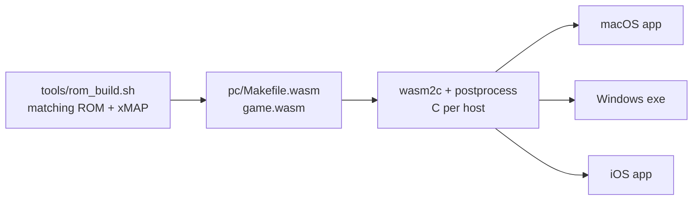

# Building nativeplat

Everything below runs from the repository root on an Apple Silicon Mac
(macOS 14+, Command Line Tools; Xcode only for iOS), with `cmake` >= 3.21,
`ninja`, Python 3 and [OrbStack](https://orbstack.dev) (or any Docker with
linux/amd64 emulation) for the ROM build and for running Windows binaries.



## 0. Toolchains

Pinned archives go to the gitignored `.cache/toolchains/`; every download is
checked against `tools/toolchains.lock` before it is extracted.

```sh
tools/fetch_toolchains.sh            # wasi-sdk 34 + wabt 1.0.42 (always needed)
tools/fetch_toolchains.sh macos      # + SDL3 3.4.18 SDL3.xcframework (macOS packaging, iOS)
tools/fetch_toolchains.sh windows    # + zig 0.17.0 + SDL3 3.4.18 mingw (Windows cross build)
```

For day-to-day macOS development the shell uses Homebrew's SDL3
(`brew install sdl3`); the packaged app does not (see section 4).

## 1. ROMs (decompilation toolchain, in a container)

The native cores are compiled against the matching ROM build's link map
(`main.nef.xMAP`) and generated headers, so build the ROM first. This runs
the decompilations' own toolchain in an amd64 Debian container
(`tools/docker/romtools.Dockerfile`, built on first use):

```sh
tools/rom_build.sh platinum   # games/platinum/build/rom/pokeplatinum.us.nds
tools/rom_build.sh diamond    # games/diamond/build/diamond.us/pokediamond.us.nds
tools/rom_build.sh pearl      # games/diamond/build/pearl.us/pokepearl.us.nds
```

`NP_DOCKER_CONTEXT` selects the Docker context (default `orbstack`).

## 2. wasm cores

Each game compiles to one wasm32-wasip1 module with wasi-sdk:

```sh
(cd games/platinum && make -f pc/Makefile.wasm -j10)
#   -> games/platinum/build/pc-wasm/pokeplatinum.wasm
(cd games/diamond && make -f pc/Makefile.wasm -j10)                      # in progress
(cd games/diamond && make -f pc/Makefile.wasm -j10 GAME_VERSION=PEARL)   # in progress
```

The module contract is `core/include/np_guest_abi.h`; the header comment of
each `pc/Makefile.wasm` explains the wasm-specific decisions.

## 3. Core runtime and headless runner (macOS)

```sh
cmake -S core -B build/mac-core -G Ninja && cmake --build build/mac-core
ctest --test-dir build/mac-core --output-on-failure        # test_core (mock guest)

cmake -S core -B build/core-plat -G Ninja -DCMAKE_BUILD_TYPE=Release -DNP_BUILD_TESTS=OFF \
  -DNP_GUEST_WASM_platinum=$PWD/games/platinum/build/pc-wasm/pokeplatinum.wasm \
  -DNP_GUEST_POSTPROCESS_platinum=$PWD/tools/wasm2c_postprocess.py
cmake --build build/core-plat
build/core-plat/np_headless platinum games/platinum/build/rom/pokeplatinum.us.nds --frames 600
#   frames 600  audio 328236 frames @ 32728 Hz  hash 808adae3b9490905
```

`NP_GUEST_POSTPROCESS_<game>` is required for real games: it gives integer
division ARM semantics instead of wasm traps. `NP_GUEST_NUM_OUTPUTS`
(default 8) is the number of C files wasm2c splits a module into.

The core is deterministic: the same ROM, frames and input give the same hash
on every host (checked: macOS arm64 and Windows x64 under wine agree).

Gameplay scenarios on the same build (`tests/gameplay/run.sh`, header lists
the scenario format): new game through the rival battle, wild battle and
catch, Mart/Center/PC, Oreburgh Gym with badge persistence, Oreburgh Gate,
bike and Poketch. Diamond and Pearl run the same six from `tests/gameplay/dp`
with `--game diamond|pearl` (on `build/core-dp`; D/P's first battle is the
wild Starly at Lake Verity, there is no rival battle). `--soak [FRAMES]`
drives seeded random input from three field saves and reports traps, hangs
and stalls by seed and frame; `--perf` prints frames/second at render_scale 1
and 2. Results and contact sheets go to `build/gameplay/out` (`out-diamond`,
`out-pearl`).

```sh
tests/gameplay/run.sh                 # all scenarios; summary.txt + <scenario>.png
tests/gameplay/run.sh 4-roark 5-reboot
tests/gameplay/run.sh --soak 102000
tests/gameplay/run.sh --perf
tests/gameplay/run.sh --game pearl --soak 50000
```

### Several worktrees on one Mac: the gate, gate cores, the compile cache

Parallel work happens in git worktrees beside this checkout
(`../nativeplat-<name>`), all building on one 16 GB machine:

- New worktree: `git worktree add -b NAME ../nativeplat-NAME main &&
  tools/worktree_seed.sh ../nativeplat-NAME` (APFS clones of the ROM builds,
  SDK downloads and game build trees; `.cache` is linked).
- Builds and long runs go through `tools/heavy.sh` (2 build slots, 6 run
  slots; nothing starts while the disk has less than 2 GiB free).
- Gate a branch with `tools/gate.sh` (`--dry-run` prints the plan). It runs
  only the `tests/dp/regress.sh` cases whose core inputs (regress.sh's
  header) the branch changes, plus the e2e checks. A selected core runs
  from the shared gate cores (`~/Library/Caches/nativeplat-gate-cores`,
  `NP_GATE_CORES`) when its inputs are unchanged since they were built, and
  is built in the worktree otherwise. After core inputs change on main,
  `tools/gate.sh --refresh-cores` rebuilds the gate cores, incrementally.
- Compiles go through `tools/ccache.sh` (its header has the settings): one
  2.5 GB cache in `~/Library/Caches/nativeplat-ccache` shared by every
  worktree, used when ccache is installed (`brew install ccache`) and at
  least 8 GiB is free when a build starts (a make run, a cmake configure).
  Nothing to do in a new worktree: what main or another worktree compiled
  hits. `NP_NO_CCACHE=1` turns it off;
  `CCACHE_DIR=~/Library/Caches/nativeplat-ccache ccache -s` shows the hits.
  ccache caches C compiles (the decompiled and host C, armrec's C, wasm2c's
  output), not the IR->object step of the D/P/HG/BW bridge or gbabuild.

## 4. macOS app

Development build (Homebrew SDL3):

```sh
cmake -S shell -B build/shell-real -G Ninja -DCMAKE_BUILD_TYPE=Release -DNP_CORE=real \
  -DNP_GUEST_WASM_platinum=$PWD/games/platinum/build/pc-wasm/pokeplatinum.wasm \
  -DNP_GUEST_POSTPROCESS_platinum=$PWD/tools/wasm2c_postprocess.py
cmake --build build/shell-real
open build/shell-real/nativeplat.app
```

Distributable:

```sh
tools/package_macos.sh --test                # build/dist/nativeplat-macos-arm64.zip
tools/package_macos.sh --universal --test    # build/dist/nativeplat-macos-universal.zip
```

The script builds against SDL's official universal `SDL3.framework`
(deployment target macOS 11.0), copies it into
`nativeplat.app/Contents/Frameworks`, replaces the rpaths with
`@executable_path/../Frameworks`, ad-hoc signs the bundle
(`codesign --force --deep -s -`), refuses to package if `otool` finds any
reference outside the bundle and the OS, and zips the app with README,
LICENSE and third-party notices. `--test` unzips into a temporary directory
and runs the copy's autotest on the Platinum ROM (each architecture of a
universal build; x86_64 runs under Rosetta). Every game whose `.wasm` exists
is built in; `NP_GUEST_WASM_<game>` points elsewhere.

The app is not notarized: Gatekeeper asks for a right-click > Open on first
launch. Notarization needs a Developer ID certificate and `notarytool`.

## 5. Windows x64 (cross build from macOS)

`tools/cmake/windows-x64.cmake` targets x86_64-w64-mingw32 (UCRT) with
`zig cc` (clang + lld + mingw-w64; the CRT is built into `.cache/zig` on first
use) and finds SDL3 through the official mingw package's CMake config.
Wrappers in `tools/cmake/zig/` provide the compiler, `ar`, `ranlib` and a
windres-compatible front end to `zig rc` for the version resource.

```sh
# core runtime tests
cmake -S core -B build/win-core -G Ninja -DCMAKE_TOOLCHAIN_FILE=$PWD/tools/cmake/windows-x64.cmake
cmake --build build/win-core                     # build/win-core/tests/test_core.exe

# headless runner with Platinum
cmake -S core -B build/win-plat -G Ninja -DCMAKE_TOOLCHAIN_FILE=$PWD/tools/cmake/windows-x64.cmake \
  -DCMAKE_BUILD_TYPE=Release -DNP_BUILD_TESTS=OFF \
  -DNP_GUEST_WASM_platinum=$PWD/games/platinum/build/pc-wasm/pokeplatinum.wasm \
  -DNP_GUEST_POSTPROCESS_platinum=$PWD/tools/wasm2c_postprocess.py
cmake --build build/win-plat                     # build/win-plat/np_headless.exe

# the app, packaged: build/dist/nativeplat-windows-x64.zip
# (nativeplat.exe, SDL3.dll, README.txt, LICENSE.txt, THIRD-PARTY.txt)
tools/package_windows.sh --test
```

### Running Windows binaries on the Mac

Wine in an amd64 container (`tools/docker/wine.Dockerfile`, ~570 MB):

```sh
docker --context orbstack build --platform linux/amd64 -t nativeplat-wine \
  -f tools/docker/wine.Dockerfile tools/docker
wine() { docker --context orbstack run --rm --platform linux/amd64 -e XDG_RUNTIME_DIR=/tmp \
  -v "$PWD:$PWD" -w "$PWD" nativeplat-wine wine64 "$@"; }
wine build/win-core/tests/test_core.exe
wine build/win-plat/np_headless.exe platinum games/platinum/build/rom/pokeplatinum.us.nds --frames 600
```

`package_windows.sh --test` runs the packaged app's autotest the same way
(SDL dummy video and audio drivers; the GUI-subsystem exe logs through
`OutputDebugString`, so success is the exit status plus the screenshot).
Wine is not Windows: test on a real Windows 10/11 machine before a release.

## 6. iOS (NOT YET VERIFIED: needs Xcode)

Nothing in this section has been run; this machine has only the Command Line
Tools. The pieces exist: `core/` builds the arm64 fiber switch for any Apple
target, `np_memory.c` reserves only the module's declared maximum (iOS caps
the address space), and `shell/CMakeLists.txt` has the iOS bundle settings
(`platform/ios/Info.plist.in`, device family 1,2, iOS 15.0).

1. Install Xcode and select it: `sudo xcode-select -s /Applications/Xcode.app`.
2. SDL3 for iOS. Either the official xcframework from
   `tools/fetch_toolchains.sh macos` (it contains `ios-arm64` and
   `ios-arm64_x86_64-simulator` slices; its `share/cmake/SDL3/SDL3Config.cmake`
   picks the slice), or build the same thing from source with SDL's Xcode
   project (target `SDL3.xcframework`, the one SDL's
   `build-scripts/build-release.py` packages into the release .dmg via
   `SDL3.dmg`):

   ```sh
   git clone --depth 1 -b release-3.4.18 https://github.com/libsdl-org/SDL build/SDL-src
   xcodebuild ONLY_ACTIVE_ARCH=NO -project build/SDL-src/Xcode/SDL/SDL.xcodeproj \
     -target SDL3.xcframework -configuration Release
   ```

3. Configure and build (the wasm2c step runs on the Mac; `NP_WASM2C` is
   searched outside the iOS sysroot):

   ```sh
   cmake -S shell -B build/ios -G Xcode -DCMAKE_SYSTEM_NAME=iOS \
     -DCMAKE_OSX_ARCHITECTURES=arm64 -DCMAKE_OSX_DEPLOYMENT_TARGET=15.0 \
     -DSDL3_DIR=$PWD/.cache/toolchains/sdl3-apple/share/cmake/SDL3 \
     -DNP_CORE=real -DBUILD_TESTING=OFF \
     -DNP_GUEST_WASM_platinum=$PWD/games/platinum/build/pc-wasm/pokeplatinum.wasm \
     -DNP_GUEST_POSTPROCESS_platinum=$PWD/tools/wasm2c_postprocess.py \
     -DCMAKE_XCODE_ATTRIBUTE_DEVELOPMENT_TEAM=<your team id>
   cmake --build build/ios --config Release -- -sdk iphoneos
   ```

   For the simulator use `-sdk iphonesimulator` (and
   `-DCMAKE_OSX_ARCHITECTURES=arm64` on Apple Silicon).
4. Still to do: embed `SDL3.framework` in the app (Xcode "Embed &
   Sign", or `XCODE_EMBED_FRAMEWORKS` on the target), signing, and on-device
   performance and memory checks.
