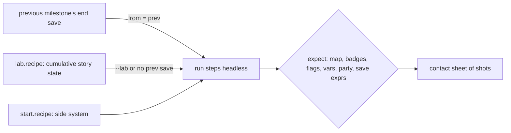

# End-to-end plan: Pokémon Platinum, Diamond, Pearl, HeartGold, SoulSilver, Emerald, Ruby and Sapphire in nativeplat

Goal: play each game's story from a blank chip to the Hall of Fame and the credits, plus the major side systems,
headless on the real cores (build/core-plat, build/core-dp), with a screenshot at every proof point that a person or
agent inspects. Phase 1 (this file, `AUTHORING.md`, the milestone skeletons) plans it; phase 2 proves each milestone
and flips its `status` from `planned`.

Each milestone is a directory `tests/e2e/<game>/<nn>-<slug>/` holding `milestone.toml` (steps and expected end state,
schema: the harness's `tests/e2e/README.md`) and a lab recipe that mints its start save.
How to write and prove one: [AUTHORING.md](AUTHORING.md).

## How a milestone runs

- Story milestones chain: each starts from the previous one's end save (`[start] from = "prev"`). Its `lab.recipe`
  carries the full cumulative story state (every flag, var, badge, item and Pokétch app the earlier milestones set,
  each line citing the script that sets it), so any milestone can also start standalone (`--lab`) and a failure
  never blocks the rest of the chain.
- Side systems are standalone: `[start] recipe = "start.recipe"` with just the state they need.
- Battles are won by first-move A presses (`auto_battle`): the lab party's slot-0 move must beat every opponent of the
  milestone, so each recipe chooses a party against the trainers' actual teams (cited by trainer constant / id).
- Pearl reuses Diamond's dirs (`pearl/chain.txt` lines `../diamond/<dir>`); a Pearl-local dir exists only where the
  scripts branch on the version (`GetGameVersion`; Diamond 10, Pearl 11, `games/diamond/include/config.h:9-10`) —
  Spear Pillar's Palkia and the version legendaries.

## Citations

Every decomp fact in a milestone is in its `refs` list, in its step `note`s or as a comment on its recipe line.
Platinum: `scripts_<map>.s:LINE` = `games/platinum/res/field/scripts/`, `events_<map>` = `res/field/events/*.json`,
other paths relative to `games/platinum/`. Diamond/Pearl (binary field data, decoded by
`tests/e2e/tools/dp_script.py`): `scr_seq NNNN @0xOFF`, `zone_event NNNN object|warp|coord|bg k`, `maps.h:LINE`,
`map_header.c:LINE`, `trdata.json #N`, `msg NNNN #i`; C/asm paths relative to `games/diamond/`. `[INFERENCE]` marks
what the scripts do not prove.

## Platinum story outline

Gym order (badge = `GiveBadge` line): Roark (Coal, `scripts_oreburgh_city_gym.s:28`) → Gardenia (Forest,
`scripts_eterna_city_gym.s:76`) → Fantina (Relic, `scripts_hearthome_city_gym_leader_room.s:71`) → Maylene (Cobble,
`scripts_veilstone_city_gym.s:34`) → Wake (Fen, `scripts_pastoria_city_gym.s:58`) → Byron (Mine,
`scripts_canalave_city_gym.s:31`) → Candice (Icicle, `scripts_snowpoint_city_gym.s:35`) → Volkner (Beacon,
`scripts_sunyshore_city_gym_room_3.s:41`).

| stage | milestones | key decomp anchor |
|---|---|---|
| New game, Lake Verity, Pokédex, Pokétch | 01–05 | `scripts_route_201.s:280-407` (briefcase, first battle) |
| Coal Badge, Rock Smash | 06–08 | HM06 `scripts_oreburgh_gate_1f.s:54`; Roark `scripts_oreburgh_city_gym.s:18` |
| Galactic in Jubilife, Floaroma, Valley Windworks (Mars) | 09–11 | milestone refs |
| Eterna Forest, Forest Badge, Cut, Galactic Eterna Building (Jupiter) | 12–15 | Gardenia `scripts_eterna_city_gym.s:68`; HM01 `scripts_eterna_city.s:181` |
| Bicycle, Cycling Road, Hearthome, Relic Badge | 16–19 | Fantina `scripts_hearthome_city_gym_leader_room.s:62` |
| Solaceon, Veilstone, Cobble Badge, warehouse and Fly | 20–22 | Maylene `scripts_veilstone_city_gym.s:26`; HM02 `scripts_visible_items.s:1751-1752` |
| Pastoria, Fen Badge, explosion, Galactic chase, SecretPotion | 23–27 | Wake `scripts_pastoria_city_gym.s:50` |
| Celestic (Cyrus), Surf | 28 | Cyrus `scripts_celestic_town_cave.s:105`; HM03 `scripts_celestic_town_cave.s:129` |
| Canalave, Mine Badge, Iron Island (Riley), Strength | 29–31 | Byron `scripts_canalave_city_gym.s:23`; HM04 `scripts_iron_island.s:98` |
| Library, lakes Valor (Saturn) / Verity (Mars) | 32–34 | milestone refs |
| Snowpoint, Icicle Badge, Lake Acuity (Jupiter) | 35–37 | Candice `scripts_snowpoint_city_gym.s:27`; HM08 `scripts_visible_items.s:1301-1302` |
| Galactic HQ: Cyrus, Saturn, freeing the lake trio | 38–40 | Cyrus `scripts_galactic_hq_4f.s:39` |
| Mt. Coronet, Spear Pillar, Distortion World, Giratina | 41–44 | Cyrus `scripts_distortion_world_b7f.s:56`; Giratina `scripts_distortion_world_giratina_room.s:69` |
| Sunyshore, Beacon Badge, Waterfall | 45–48 | Volkner `scripts_sunyshore_city_gym_room_3.s:33`; HM07 `scripts_sunyshore_city.s:442` |
| Victory Road, Elite Four, Champion, Hall of Fame | 49–56 | `scripts_pokemon_league_{aaron,bertha,lucian}_room.s:34`, `flint_room.s:36`, `champion_room.s:63`; `ClearGame` `scripts_pokemon_league_hall_of_fame.s:39-62` |

HM05 Defog is not on the story path (`scripts_visible_items.s:923-924`, Solaceon Ruins); side system 65 covers it.

## Diamond and Pearl story outline

<!-- dp-outline -->
(written when the D/P skeletons land; see the generated tables below)
<!-- /dp-outline -->

## HeartGold and SoulSilver story outline

New Bark (Cyndaquil, Pokégear) -> Mr. Pokémon (Pokédex, Mystery Egg) -> the rival at Cherrygrove -> Sprout Tower,
Falkner -> Union Cave, Slowpoke Well, Bugsy -> Ilex Forest (Cut), Whitney -> Burned Tower, Morty -> Cianwood Chuck,
Jasmine -> Lake of Rage, the Rocket hideout, Pryce -> the Radio Tower takeover -> Ice Path, Clair, Dragon's Den ->
Elm's Master Ball, the Kimono Girls, the version mascot (HeartGold: Ho-Oh atop the Bell Tower, `heartgold/31`;
SoulSilver: Lugia in the Whirl Islands, `soulsilver/31`; the scripts require it before Route 27) -> Victory Road ->
Elite Four, Lance, Hall of Fame and the credits (`OS_ResetSystem`, src/game_clear.c). SoulSilver's chain lists
HeartGold's dirs (`version = "both"`) and its own Lugia dir. The probe is games/heartgold/pc/src/pc_hg_field.c; there
is no HG/SS save lab yet, so every milestone starts from the previous one's end save (01 from a blank chip).

## Side systems

P1 = a major system every player meets; P2 = minor or post-game. Rows name the milestone dir per game.

<!-- systems-matrix -->
(written when the D/P skeletons land)
<!-- /systems-matrix -->

## Known gaps (phase 2 must close or work around)

- Platinum's cumulative `lab.recipe`s grow toward the lab cap: 56 has 441 ops of `LAB_MAX_OPS 512`
  (`games/platinum/pc/src/pc_lab.c:140`); keep new state lines minimal.
- D/P story recipes carry the cumulative state (`tests/e2e/tools/dp_prior.py`, at most ~410 ops of the D/P lab's
  `LAB_MAX_OPS 512`). Diamond 46-50 (Veilstone/Galactic HQ, Mt. Coronet, Spear Pillar with Dialga; Pearl twin
  with Palkia) have no milestone dirs yet: the chain jumps from 45 (Lake Acuity) to 51.
- Steps marked `# PHASE2:` in a `milestone.toml` stop where the plan could not state the input (random puzzles,
  touch minigames); `[expect]` is complete regardless.
- `[INFERENCE]` notes mark tiles and timings not proven by the scripts.

## Generated milestone tables

`python3 tests/e2e/tools/plan.py` rewrites everything between the markers below from the milestone dirs (header
comment, title, priority, estimate, refs, recipe, `[expect]`); `--check` fails when this file is stale. Per milestone:
what it proves, start (source, warp, the count of cumulative state lines by verb), lab party (species, level, slot-0
move), trainers, expected end state, frame estimate/budget, and the citations.

## Platinum

<!-- plan.py:begin platinum -->
### Story chain: 56 milestones, ~1174951 frames estimated

| milestone | title | P | est. frames | start | end map | status |
|---|---|---|---|---|---|---|
| [01-newgame-starter](platinum/01-newgame-starter/milestone.toml) | New game to the starter and the running shoes | P0 | 29713 | blank chip | MAP_HEADER_TWINLEAF_TOWN | passing |
| [02-lake-verity-cyrus](platinum/02-lake-verity-cyrus/milestone.toml) | Lake Verity with Barry: Cyrus at the lake | P0 | 4411 | prev + `lab.recipe` | MAP_HEADER_VERITY_LAKEFRONT | passing |
| [03-sandgem-pokedex](platinum/03-sandgem-pokedex/milestone.toml) | Sandgem: Rowan's lab and the Pokedex | P0 | 12321 | prev + `lab.recipe` | MAP_HEADER_TWINLEAF_TOWN_PLAYER_HOUSE_1F | passing |
| [04-parcel-catching-tutorial](platinum/04-parcel-catching-tutorial/milestone.toml) | The Parcel and the catching tutorial | P0 | 11498 | prev + `lab.recipe` | MAP_HEADER_ROUTE_202 | passing |
| [05-jubilife-poketch](platinum/05-jubilife-poketch/milestone.toml) | Jubilife: Town Map and the Poketch | P0 | 22749 | prev + `lab.recipe` | MAP_HEADER_JUBILIFE_CITY | passing |
| [06-route203-oreburgh-gate-rocksmash](platinum/06-route203-oreburgh-gate-rocksmash/milestone.toml) | Route 203 rival, HM06, Oreburgh | P0 | 18145 | prev + `lab.recipe` | MAP_HEADER_OREBURGH_CITY | passing |
| [07-oreburgh-mine-roark](platinum/07-oreburgh-mine-roark/milestone.toml) | Oreburgh Mine: Roark returns to the gym | P0 | 13362 | prev + `lab.recipe` | MAP_HEADER_OREBURGH_CITY_GYM | passing |
| [08-roark-coal-badge](platinum/08-roark-coal-badge/milestone.toml) | Oreburgh Gym: Roark and the Coal Badge | P0 | 12905 | prev + `lab.recipe` | MAP_HEADER_OREBURGH_CITY | passing |
| [09-jubilife-galactic-tag-battle](platinum/09-jubilife-galactic-tag-battle/milestone.toml) | Jubilife: tag battle against Team Galactic | P0 | 12753 | prev + `lab.recipe` | MAP_HEADER_JUBILIFE_CITY | passing |
| [10-floaroma-meadow-works-key](platinum/10-floaroma-meadow-works-key/milestone.toml) | Floaroma Meadow: the Works Key | P0 | 20095 | prev + `lab.recipe` | MAP_HEADER_FLOAROMA_TOWN | passing |
| [11-valley-windworks-mars](platinum/11-valley-windworks-mars/milestone.toml) | Valley Windworks: Commander Mars | P0 | 20681 | prev + `lab.recipe` | MAP_HEADER_ETERNA_FOREST | passing |
| [12-eterna-forest-cheryl](platinum/12-eterna-forest-cheryl/milestone.toml) | Eterna Forest with Cheryl | P0 | 21659 | prev + `lab.recipe` | MAP_HEADER_ROUTE_205_NORTH | passing |
| [13-gardenia-forest-badge](platinum/13-gardenia-forest-badge/milestone.toml) | Eterna Gym: Gardenia and the Forest Badge | P0 | 21675 | prev + `lab.recipe` | MAP_HEADER_ETERNA_CITY | passing |
| [14-eterna-cyrus-cut](platinum/14-eterna-cyrus-cut/milestone.toml) | Eterna: Cyrus at the statue, Cynthia's HM01 | P0 | 4571 | prev + `lab.recipe` | MAP_HEADER_ETERNA_CITY | passing |
| [15-galactic-eterna-building-jupiter](platinum/15-galactic-eterna-building-jupiter/milestone.toml) | Team Galactic Eterna Building: Jupiter | P0 | 9163 | prev + `lab.recipe` | MAP_HEADER_ETERNA_CITY | passing |
| [16-togepi-egg-bicycle-explorer-kit](platinum/16-togepi-egg-bicycle-explorer-kit/milestone.toml) | Eterna: Togepi egg, Bicycle, Explorer Kit | P0 | 4997 | prev + `lab.recipe` | MAP_HEADER_ROUTE_206_CYCLING_ROAD_NORTH_GATE | passing |
| [17-cycling-road-to-hearthome](platinum/17-cycling-road-to-hearthome/milestone.toml) | Cycling Road, Mt. Coronet, Hearthome | P0 | 26611 | prev + `lab.recipe` | MAP_HEADER_HEARTHOME_CITY | passing |
| [18-contest-hall-fantina-unblocks-gym](platinum/18-contest-hall-fantina-unblocks-gym/milestone.toml) | Contest Hall: Fantina frees the gym door | P0 | 4841 | prev + `lab.recipe` | MAP_HEADER_HEARTHOME_CITY_GYM_ENTRANCE_ROOM | passing |
| [19-fantina-relic-badge](platinum/19-fantina-relic-badge/milestone.toml) | Hearthome Gym: Fantina and the Relic Badge | P0 | 13283 | prev + `lab.recipe` | MAP_HEADER_HEARTHOME_CITY | passing |
| [20-route209-solaceon-to-veilstone](platinum/20-route209-solaceon-to-veilstone/milestone.toml) | Route 209 to Veilstone: rival, Solaceon, Crasher Wake | P0 | 65257 | prev + `lab.recipe` | MAP_HEADER_VEILSTONE_CITY_GYM | passing |
| [21-maylene-cobble-badge](platinum/21-maylene-cobble-badge/milestone.toml) | Veilstone Gym: Maylene and the Cobble Badge | P0 | 17681 | prev + `lab.recipe` | MAP_HEADER_VEILSTONE_CITY_GYM | passing |
| [22-veilstone-warehouse-fly](platinum/22-veilstone-warehouse-fly/milestone.toml) | Veilstone: warehouse tag battle and HM02 Fly | P0 | 10667 | prev + `lab.recipe` | MAP_HEADER_VEILSTONE_CITY_GALACTIC_WAREHOUSE | passing |
| [23-pastoria-rival](platinum/23-pastoria-rival/milestone.toml) | Pastoria: rival battle on the way to the gym | P0 | 28637 | prev + `lab.recipe` | MAP_HEADER_PASTORIA_CITY | passing |
| [24-pastoria-gym-wake](platinum/24-pastoria-gym-wake/milestone.toml) | Pastoria Gym: Crasher Wake and the Fen Badge | P0 | 28793 | prev + `lab.recipe` | MAP_HEADER_PASTORIA_CITY | passing |
| [25-pastoria-explosion](platinum/25-pastoria-explosion/milestone.toml) | Pastoria: Wake and rival scene, Great Marsh explosion | P0 | 2795 | prev + `lab.recipe` | MAP_HEADER_PASTORIA_CITY | passing |
| [26-galactic-chase-secretpotion](platinum/26-galactic-chase-secretpotion/milestone.toml) | Pastoria to Valor Lakefront: grunt chase and the SecretPotion | P0 | 15145 | prev + `lab.recipe` | MAP_HEADER_VALOR_LAKEFRONT | passing |
| [27-route210-psyduck-oldcharm](platinum/27-route210-psyduck-oldcharm/milestone.toml) | Route 210 South: SecretPotion on the Psyduck, Old Charm | P0 | 46525 | prev + `lab.recipe` | MAP_HEADER_ROUTE_210_SOUTH | passing |
| [28-celestic-cyrus-surf](platinum/28-celestic-cyrus-surf/milestone.toml) | Celestic Town: grunt, Cyrus at the ruins painting, HM03 Surf | P0 | 55221 | prev + `lab.recipe` | MAP_HEADER_CELESTIC_TOWN | passing |
| [29-route218-canalave-rival](platinum/29-route218-canalave-rival/milestone.toml) | Route 218 to Canalave: form-detection upgrade, bridge rival | P0 | 16221 | prev + `lab.recipe` | MAP_HEADER_CANALAVE_CITY | passing |
| [30-canalave-gym-byron](platinum/30-canalave-gym-byron/milestone.toml) | Canalave Gym: Byron and the Mine Badge | P0 | 26749 | prev + `lab.recipe` | MAP_HEADER_CANALAVE_CITY_GYM | passing |
| [31-iron-island-strength](platinum/31-iron-island-strength/milestone.toml) | Iron Island: Riley gives HM04 Strength | P0 | 4427 | prev + `lab.recipe` | MAP_HEADER_IRON_ISLAND | passing |
| [32-canalave-library-explosion](platinum/32-canalave-library-explosion/milestone.toml) | Canalave Library: Lake Valor explosion | P0 | 7557 | prev + `lab.recipe` | MAP_HEADER_CANALAVE_CITY | passing |
| [33-lake-valor-saturn](platinum/33-lake-valor-saturn/milestone.toml) | Lake Valor (drained): Saturn in Valor Cavern | P0 | 21863 | prev + `lab.recipe` | MAP_HEADER_VALOR_CAVERN | passing |
| [34-lake-verity-mars](platinum/34-lake-verity-mars/milestone.toml) | Lake Verity: Mars | P0 | 23495 | prev + `lab.recipe` | MAP_HEADER_LAKE_VERITY | passing |
| [35-coronet-to-snowpoint](platinum/35-coronet-to-snowpoint/milestone.toml) | Mt Coronet B1F to Snowpoint via Routes 216/217, HM08 | P0 | 60248 | prev + `lab.recipe` | MAP_HEADER_SNOWPOINT_CITY | passing |
| [36-snowpoint-gym-candice](platinum/36-snowpoint-gym-candice/milestone.toml) | Snowpoint Gym: Candice and the Icicle Badge | P0 | 12609 | prev + `lab.recipe` | MAP_HEADER_SNOWPOINT_CITY | passing |
| [37-lake-acuity-jupiter](platinum/37-lake-acuity-jupiter/milestone.toml) | Lake Acuity: Jupiter leaves, injured rival | P0 | 11005 | prev + `lab.recipe` | MAP_HEADER_LAKE_ACUITY | passing |
| [38-veilstone-storage-key-hq-entry](platinum/38-veilstone-storage-key-hq-entry/milestone.toml) | Veilstone: storage key, Looker, Galactic HQ entry | P0 | 5409 | prev + `lab.recipe` | MAP_HEADER_GALACTIC_HQ_B2F | passing |
| [39-galactic-hq-cyrus](platinum/39-galactic-hq-cyrus/milestone.toml) | Galactic HQ: Galactic Key, Cyrus, Master Ball | P0 | 41275 | prev + `lab.recipe` | MAP_HEADER_GALACTIC_HQ_4F | passing |
| [40-galactic-hq-saturn-free-lake-trio](platinum/40-galactic-hq-saturn-free-lake-trio/milestone.toml) | Galactic HQ: Saturn and the lake trio freed | P0 | 9487 | prev + `lab.recipe` | MAP_HEADER_GALACTIC_HQ_CONTROL_ROOM | passing |
| [41-mt-coronet-climb](platinum/41-mt-coronet-climb/milestone.toml) | Mt Coronet: Black Flute and the climb to Spear Pillar | P0 | 48985 | prev + `lab.recipe` | MAP_HEADER_SPEAR_PILLAR | passing |
| [42-spear-pillar](platinum/42-spear-pillar/milestone.toml) | Spear Pillar: grunt double, Mars + Jupiter tag, Giratina's rift | P0 | 27565 | prev + `lab.recipe` | MAP_HEADER_DISTORTION_WORLD_1F | passing |
| [43-distortion-world-cyrus](platinum/43-distortion-world-cyrus/milestone.toml) | Distortion World: to B7F and Cyrus | P0 | 45213 | prev + `lab.recipe` | MAP_HEADER_DISTORTION_WORLD_B7F | passing |
| [44-giratina-sendoff-spring](platinum/44-giratina-sendoff-spring/milestone.toml) | Giratina Origin battle, out to Sendoff Spring | P0 | 7331 | prev + `lab.recipe` | MAP_HEADER_SENDOFF_SPRING | passing |
| [45-sandgem-rowan-unlocks-sunyshore](platinum/45-sandgem-rowan-unlocks-sunyshore/milestone.toml) | Sandgem lab: Rowan after the Distortion World | P0 | 7837 | prev + `lab.recipe` | MAP_HEADER_SANDGEM_TOWN_POKEMON_RESEARCH_LAB | passing |
| [46-sunyshore-flint-lighthouse](platinum/46-sunyshore-flint-lighthouse/milestone.toml) | Sunyshore: Flint, Volkner at Vista Lighthouse | P0 | 18045 | prev + `lab.recipe` | MAP_HEADER_SUNYSHORE_CITY | passing |
| [47-sunyshore-gym-volkner](platinum/47-sunyshore-gym-volkner/milestone.toml) | Sunyshore Gym: Volkner and the Beacon Badge | P0 | 36319 | prev + `lab.recipe` | MAP_HEADER_SUNYSHORE_CITY | passing |
| [48-sunyshore-jasmine-waterfall](platinum/48-sunyshore-jasmine-waterfall/milestone.toml) | Sunyshore: Jasmine gives HM07 Waterfall | P0 | 3745 | prev + `lab.recipe` | MAP_HEADER_SUNYSHORE_CITY | passing |
| [49-route223-victory-road](platinum/49-route223-victory-road/milestone.toml) | Route 223 and Victory Road to the League | P0 | 94313 | prev + `lab.recipe` | MAP_HEADER_POKEMON_LEAGUE_NORTH_POKECENTER_1F | passing |
| [50-league-north-rival-door](platinum/50-league-north-rival-door/milestone.toml) | Pokémon League: last rival battle, door guard | P0 | 12401 | prev + `lab.recipe` | MAP_HEADER_POKEMON_LEAGUE_NORTH_POKECENTER_1F | passing |
| [51-e4-aaron](platinum/51-e4-aaron/milestone.toml) | Elite Four: Aaron | P0 | 9275 | prev + `lab.recipe` | MAP_HEADER_POKEMON_LEAGUE_AARON_ROOM | passing |
| [52-e4-bertha](platinum/52-e4-bertha/milestone.toml) | Elite Four: Bertha | P0 | 9799 | prev + `lab.recipe` | MAP_HEADER_POKEMON_LEAGUE_BERTHA_ROOM | passing |
| [53-e4-flint](platinum/53-e4-flint/milestone.toml) | Elite Four: Flint | P0 | 9429 | prev + `lab.recipe` | MAP_HEADER_POKEMON_LEAGUE_FLINT_ROOM | passing |
| [54-e4-lucian](platinum/54-e4-lucian/milestone.toml) | Elite Four: Lucian | P0 | 9211 | prev + `lab.recipe` | MAP_HEADER_POKEMON_LEAGUE_LUCIAN_ROOM | passing |
| [55-champion-cynthia](platinum/55-champion-cynthia/milestone.toml) | Champion Cynthia | P0 | 10977 | prev + `lab.recipe` | MAP_HEADER_POKEMON_LEAGUE_HALLWAY_TO_HALL_OF_FAME | passing |
| [56-hall-of-fame-credits](platinum/56-hall-of-fame-credits/milestone.toml) | Hall of Fame, save, credits | P0 | 28007 | prev + `lab.recipe` | - | passing |

#### platinum/01-newgame-starter — New game to the starter and the running shoes
- proves: Proves the real new-game route from a blank chip: intro, Barry's visit, Mom, Route 201's Rowan scene, the briefcase starter, the first rival battle, home, running shoes. Start: power-on (no save) -> end: Twinleaf Town outside the player's house, VAR_PLAYER_HOUSE_STATE 5.
- start: blank chip; -; lab state lines: none
- party: the continued save
- trainers: none
- end state: map MAP_HEADER_TWINLEAF_TOWN; >= 1 battles; party SPECIES_TURTWIG; party size 1; flags set FLAG_TALKED_TO_MOM, FLAG_RIVAL_LEFT_HOME, FLAG_HIDE_ROUTE_201_BRIEFCASE, FLAG_HIDE_ROUTE_201_PROF_ROWAN, FLAG_HIDE_ROUTE_201_COUNTERPART; vars VAR_PLAYER_HOUSE_STATE=5, VAR_FOLLOWER_RIVAL_STATE=2, VAR_PLAYER_STARTER=SPECIES_TURTWIG, VAR_RIVAL_HOUSE_STATE=1, VAR_TWINLEAF_TOWN_GUITARIST_TRIGGER_STATE=2, VAR_PLAYER_HOUSE_RIVAL_STATE=1
- frames: estimate 29713, budget 44600
- refs: src/location.c:8-14; scripts_init_new_game.s:7-126; scripts_init_new_game.s:24; pc/src/pc_lab.c:15-21; scripts_twinleaf_town_player_house_2f.s:28; scripts_twinleaf_town_player_house_2f.s:82; scripts_twinleaf_town_player_house_2f.s:127-128; scripts_twinleaf_town_player_house_1f.s:39; scripts_twinleaf_town_player_house_1f.s:47; scripts_twinleaf_town_player_house_1f.s:529; scripts_twinleaf_town_player_house_1f.s:749; scripts_twinleaf_town.s:394; scripts_twinleaf_town.s:421-424; scripts_twinleaf_town_rival_house_2f.s:28-30; scripts_route_201.s:122; scripts_route_201.s:208; scripts_route_201.s:224; scripts_route_201.s:240; scripts_route_201.s:270; scripts_route_201.s:278; scripts_route_201.s:280-286; scripts_route_201.s:301; scripts_route_201.s:334; scripts_route_201.s:360-363; scripts_route_201.s:371; scripts_route_201.s:388-396; scripts_route_201.s:401-407; scripts_twinleaf_town_player_house_1f.s:133; scripts_twinleaf_town_player_house_1f.s:141; scripts_twinleaf_town.s:19; scripts_twinleaf_town.s:32; src/system_vars.c:67-72; events_twinleaf_town_player_house_1f (warp 0 (6,10)); tests/gameplay/schedules/rival.press; tests/gameplay/scenarios/1-rival.scn
- notes: Estimate = rival.press's recorded 27400 frames (1-rival.scn FRAMES) plus the running-shoes scene and the walk out. The research's ~9000 counts only the field part.

#### platinum/02-lake-verity-cyrus — Lake Verity with Barry: Cyrus at the lake
- proves: Proves Barry as follower on Route 201, the Verity Lakefront walk-in and the Lake Verity Cyrus scene. Start: Twinleaf Town (116,886), the first respawn tile -> end: Verity Lakefront after leaving the lake.
- start: prev + `lab.recipe`; map MAP_HEADER_TWINLEAF_TOWN 116 886 FACE_DOWN; lab state lines: 6 flag, 8 var
- party: SPECIES_TURTWIG 8 (MOVE_TACKLE)
- trainers: none
- end state: map MAP_HEADER_VERITY_LAKEFRONT; flags set FLAG_HIDE_ROUTE_201_RIVAL, FLAG_HIDE_LAKE_VERITY_LOW_WATER_RIVAL, FLAG_HIDE_LAKE_VERITY_LOW_WATER_CYRUS; flags clear FLAG_DEFEATED_COMMANDER_SATURN_VALOR_CAVERN; vars VAR_FOLLOWER_RIVAL_STATE=4, VAR_VISITED_LAKE_VERITY_WITH_RIVAL=1, VAR_VERITY_LAKEFRONT_STATE=1
- frames: estimate 4411, budget 6700
- refs: src/location.c:16-20; scripts_route_201.s:1236-1241; scripts_verity_lakefront.s:11-24; scripts_verity_lakefront.s:50; scripts_verity_lakefront.s:55; scripts_init_lake_verity_low_water.s:10; scripts_lake_verity_low_water.s:43; scripts_lake_verity_low_water.s:69; scripts_lake_verity_low_water.s:106; scripts_lake_verity_low_water.s:113-114; events_route_201 (coords (109..113,857), (110..113,858), (115,852..855)); events_verity_lakefront (coord (80..81,844)); events_lake_verity_low_water (warp 0 (46,54))
- notes: Estimate: research ~6000 plus the walk out of the lake. [INFERENCE] the follower partner turns Route 201 wild battles into multi battles (SetHasPartner, scripts_route_201.s:1238); walk_to fights them.

#### platinum/03-sandgem-pokedex — Sandgem: Rowan's lab and the Pokedex
- proves: Proves the Sandgem escort into Rowan's lab, the Pokedex, and the TM27 town tour, then the walk home. Start: Sandgem Town (177,843) in front of the Pokecenter -> end: Twinleaf player house 1F (04's start).
- start: prev + `lab.recipe`; map MAP_HEADER_SANDGEM_TOWN 177 843 FACE_DOWN; lab state lines: 9 flag, 10 var
- party: SPECIES_TURTWIG 9 (MOVE_TACKLE)
- trainers: none
- end state: map MAP_HEADER_TWINLEAF_TOWN_PLAYER_HOUSE_1F; flags set FLAG_HAS_POKEDEX, FLAG_ALT_MUSIC_ROWANS_LAB, FLAG_HIDE_SANDGEM_TOWN_COUNTERPART; vars VAR_SANDGEM_TOWN_STATE=2, VAR_SANDGEM_TOWN_LAB_STATE=1; 2 save check(s)
- frames: estimate 12321, budget 18500
- refs: scripts_sandgem_town.s:169; scripts_sandgem_town.s:188; scripts_sandgem_town.s:214-218; scripts_init_sandgem_town_pokemon_research_lab.s:9; scripts_sandgem_town_pokemon_research_lab.s:230; scripts_sandgem_town_pokemon_research_lab.s:249-250; scripts_sandgem_town_pokemon_research_lab.s:310-312; scripts_init_sandgem_town.s:9; scripts_sandgem_town.s:441; scripts_sandgem_town.s:452-454; scripts_sandgem_town.s:462; scripts_sandgem_town.s:573-574; events_sandgem_town (coord (164,842..847); warp 2 (168,842) lab); events_sandgem_town_pokemon_research_lab (warp 0 (7,15)); events_twinleaf_town (warp 1 (116,885) player house); tests/gameplay/recipes/sandgem.recipe
- notes: Estimate: research ~9000 plus the walk back to Twinleaf (so 04 starts inside the house). sandgem.recipe's VAR_SANDGEM_TOWN_STATE 3 is never written by a script (writers: scripts_sandgem_town.s:215,574).

#### platinum/04-parcel-catching-tutorial — The Parcel and the catching tutorial
- proves: Proves Mom's Journal, Barry's mom's Parcel, and the Route 202 catching tutorial (5 Poke Balls). Start: Twinleaf player house 1F, warp 0 (door (6,10)) -> end: Route 202 after the tutorial.
- start: prev + `lab.recipe`; warp MAP_HEADER_TWINLEAF_TOWN_PLAYER_HOUSE_1F 0; lab state lines: 15 flag, 1 item, 1 pokedex, 12 var
- party: SPECIES_TURTWIG 10 (MOVE_TACKLE)
- trainers: TRAINER_YOUNGSTER_TRISTAN (1); TRAINER_LASS_NATALIE (3); TRAINER_YOUNGSTER_LOGAN (2)
- end state: map MAP_HEADER_ROUTE_202; flags set FLAG_RECEIVED_PARCEL, FLAG_HIDE_TWINLEAF_TOWN_PLAYER_HOUSE_1F_RIVAL_MOM, FLAG_HIDE_ROUTE_202_COUNTERPART; vars VAR_PLAYER_HOUSE_STATE=7, VAR_ROUTE_202_STATE=1; 3 save check(s)
- frames: estimate 11498, budget 17300
- refs: scripts_twinleaf_town_player_house_1f.s:172-174; scripts_twinleaf_town_player_house_1f.s:261-264; scripts_twinleaf_town_player_house_1f.s:290; scripts_twinleaf_town_player_house_1f.s:403-406; scripts_twinleaf_town_player_house_1f.s:448-449; scripts_twinleaf_town.s:28; scripts_route_202.s:91; scripts_route_202.s:116; scripts_route_202.s:135-137; scripts_route_202.s:156-157; scripts_route_202.s:161-241; events_twinleaf_town_player_house_1f (Mom (7,8); warp 0 (6,10)); events_route_202 (coord (180,825..829)); TRAINER_YOUNGSTER_TRISTAN (1); TRAINER_LASS_NATALIE (3); TRAINER_YOUNGSTER_LOGAN (2)
- notes: The lab cannot set the journal system flag (src/scrcmd.c:5012-5016). Optional Route 202 sight trainers: Tristan (166,813) S 5, Natalie (181,818) S 4, Logan (185,804) S 5.

#### platinum/05-jubilife-poketch — Jubilife: Town Map and the Poketch
- proves: Proves Jubilife's first arrival (Looker, VS Recorder), the Trainers' School Parcel hand-off (Town Map), and the Poketch campaign (three clown coupons -> Poketch with 4 apps). Start: Jubilife City (174,798) facing up -> end: Jubilife City with the Poketch.
- start: prev + `lab.recipe`; map MAP_HEADER_JUBILIFE_CITY 174 798 FACE_UP; lab state lines: 18 flag, 4 item, 1 pokedex, 13 var
- party: SPECIES_EMPOLEON 60 (MOVE_SURF); SPECIES_STARAPTOR 50 (MOVE_AERIAL_ACE)
- trainers: none
- end state: map MAP_HEADER_JUBILIFE_CITY; flags set FLAG_RECEIVED_POKETCH, FLAG_RECEIVED_COUPON_1, FLAG_RECEIVED_COUPON_2, FLAG_RECEIVED_COUPON_3, FLAG_HIDE_JUBILIFE_CITY_LOOKER, FLAG_TALKED_TO_TRAINERS_SCHOOL_RIVAL, FLAG_HIDE_JUBILIFE_CITY_POKETCH_CO_PRESIDENT; flags clear FLAG_HIDE_POKETCH_CO_1F_POKETCH_CO_PRESIDENT; vars VAR_JUBILIFE_CITY_STATE=2, VAR_POKETCH_CAMPAIGN_STATE=2; 4 save check(s)
- frames: estimate 22749, budget 34200
- refs: scripts_jubilife_city.s:89; scripts_jubilife_city.s:190-191; scripts_jubilife_city.s:259-261; scripts_trainers_school.s:32; scripts_trainers_school.s:36-38; scripts_trainers_school.s:72-77; scripts_jubilife_city.s:1326; scripts_jubilife_city.s:1503; scripts_jubilife_city.s:1512-1515; scripts_jubilife_city.s:1520-1526; scripts_jubilife_city.s:1542; scripts_jubilife_city.s:1551-1554; scripts_jubilife_city.s:1578; scripts_jubilife_city.s:1582; scripts_jubilife_city.s:1591-1595; scripts_jubilife_city.s:1427-1435; scripts_jubilife_city.s:1464-1468; scripts_trainers_school.s:156; scripts_trainers_school.s:249; pc/src/pc_lab.c:999-1002; events_jubilife_city (coords (173..176,796), (172..176,776), (188,757..760); warp 7 (168,776) school); events_trainers_school (Barry (6,3) LOOK_NORTH; warp 0 (7,11))
- notes: Optional talk-only trainers in the school: TRAINER_SCHOOL_KID_HARRISON (342), TRAINER_SCHOOL_KID_CHRISTINE (345). From now until the Poketch, Looker blocks Route 203 (coord (188,757..760) VAR_JUBILIFE_CITY_STATE==1).

#### platinum/06-route203-oreburgh-gate-rocksmash — Route 203 rival, HM06, Oreburgh
- proves: Proves the Route 203 rival battle, HM06 (Rock Smash) from the Oreburgh Gate hiker, and the Oreburgh gym tour. Start: Jubilife City warp 2 (Pokecenter door) -> end: Oreburgh City after the youngster's tour (VAR_OREBURGH_CITY_STATE 1).
- start: prev + `lab.recipe`; warp MAP_HEADER_JUBILIFE_CITY 2; lab state lines: 2 clear-flag, 27 flag, 5 item, 1 pokedex, 4 poketch, 15 var
- party: SPECIES_EMPOLEON 60 (MOVE_SURF); SPECIES_STARAPTOR 50 (MOVE_AERIAL_ACE)
- trainers: TRAINER_RIVAL_ROUTE_203_TURTWIG (248); TRAINER_YOUNGSTER_MICHAEL (4); TRAINER_YOUNGSTER_DALLAS (355); TRAINER_YOUNGSTER_SEBASTIAN (356); TRAINER_LASS_MADELINE (322); TRAINER_LASS_KAITLIN (323); TRAINER_PICNICKER_DIANA (329); TRAINER_CAMPER_CURTIS (265)
- end state: map MAP_HEADER_OREBURGH_CITY; >= 1 battles; flags set FLAG_RECEIVED_HM06, FLAG_FIRST_ARRIVAL_OREBURGH_GATE, FLAG_HIDE_ROUTE_203_RIVAL; vars VAR_ROUTE_203_RIVAL_STATE=1, VAR_OREBURGH_CITY_STATE=1, VAR_OREBURGH_GATE_1F_HIKER_STATE=2; 1 save check(s)
- frames: estimate 18145, budget 27300
- refs: scripts_route_203.s:71-74; scripts_route_203.s:81; scripts_route_203.s:122-123; scripts_oreburgh_gate_1f.s:12; scripts_oreburgh_gate_1f.s:44-45; scripts_oreburgh_gate_1f.s:54-57; scripts_init_new_game.s:53; scripts_oreburgh_city.s:29-49; scripts_oreburgh_city.s:38; scripts_oreburgh_city.s:388; src/field_move_tasks.c:545; events_route_203 (coord (196,757..760); warp 0 (246,749)); events_oreburgh_gate_1f (coord (7,22); warps (4,22), (27,22)); events_oreburgh_city (coord (266,748..751); Barry (282,757)); TRAINER_RIVAL_ROUTE_203_TURTWIG (248); TRAINER_YOUNGSTER_MICHAEL (4); TRAINER_YOUNGSTER_DALLAS (355); TRAINER_YOUNGSTER_SEBASTIAN (356); TRAINER_LASS_MADELINE (322); TRAINER_LASS_KAITLIN (323); TRAINER_PICNICKER_DIANA (329); TRAINER_CAMPER_CURTIS (265)
- notes: Needs VAR_JUBILIFE_CITY_STATE 2 (at 1 Looker blocks Route 203). Rock Smash is unusable in the field until BADGE_ID_COAL (src/field_move_tasks.c:545). Optional sight trainers on the way are fought by walk_to. boost.recipe replaces a Route 202 grind to 13 that cost ~57000 frames.

#### platinum/07-oreburgh-mine-roark — Oreburgh Mine: Roark returns to the gym
- proves: Proves the Oreburgh Mine visit: Roark smashes the rock and returns to the gym, which hides Barry from the gym door. Start: Oreburgh City warp 1 (Pokecenter door) -> end: inside Oreburgh Gym (08's start), Roark back.
- start: prev + `lab.recipe`; warp MAP_HEADER_OREBURGH_CITY 1; lab state lines: 2 clear-flag, 30 flag, 6 item, 1 pokedex, 4 poketch, 18 var
- party: SPECIES_EMPOLEON 60 (MOVE_SURF); SPECIES_STARAPTOR 50 (MOVE_AERIAL_ACE)
- trainers: TRAINER_WORKER_COLIN (195); TRAINER_WORKER_MASON (196)
- end state: map MAP_HEADER_OREBURGH_CITY_GYM; flags set FLAG_ROARK_RETURNED_TO_OREBURGH_GYM, FLAG_HIDE_OREBURGH_CITY_RIVAL, FLAG_FIRST_ARRIVAL_OREBURGH_MINE, FLAG_HIDE_OREBURGH_MINE_B2F_ROARK
- frames: estimate 13362, budget 20100
- refs: scripts_oreburgh_mine_b1f.s:13-14; scripts_oreburgh_mine_b2f.s:13-59; scripts_oreburgh_mine_b2f.s:55-57; scripts_oreburgh_city.s:29-49; events_oreburgh_city (warps 11-15 (300..304,795) mine; warp 0 (282,756) gym); events_oreburgh_mine_b1f (warps (11..13,1), (11..13,21)); events_oreburgh_mine_b2f (Roark (18,28) facing east; warp 0 (15,1)); TRAINER_WORKER_COLIN (195); TRAINER_WORKER_MASON (196)
- notes: The Workers have no sight (data []), so every battle on the way is wild: the walks flee them (on_battle), which saves ~650 frames a battle.

#### platinum/08-roark-coal-badge — Oreburgh Gym: Roark and the Coal Badge
- proves: Proves the first gym: two sight youngsters, Roark, the Coal Badge and TM76; the win arms the Jubilife Galactic scene. Start: Oreburgh Gym warp 0 (5,24) -> end: Oreburgh City at the gym door (09's start).
- start: prev + `lab.recipe`; warp MAP_HEADER_OREBURGH_CITY_GYM 0; lab state lines: 2 clear-flag, 35 flag, 6 item, 1 pokedex, 4 poketch, 18 var
- party: SPECIES_EMPOLEON 60 (MOVE_SURF); SPECIES_STARAPTOR 50 (MOVE_AERIAL_ACE)
- trainers: TRAINER_YOUNGSTER_JONATHON (244); TRAINER_YOUNGSTER_DARIUS (245); TRAINER_LEADER_ROARK (246)
- end state: map MAP_HEADER_OREBURGH_CITY; 1 badges; badge BADGE_ID_COAL; >= 1 battles; flags set FLAG_RECEIVED_ROARK_TM76, FLAG_DEFEATED_TRAINER_YOUNGSTER_JONATHON, FLAG_DEFEATED_TRAINER_YOUNGSTER_DARIUS, FLAG_HIDE_POKECENTER_BASEMENT_BLOCKADE, FLAG_HIDE_SANDGEM_TOWN_LAB_PROF_ROWAN; flags clear FLAG_HIDE_JUBILIFE_GALACTIC_GRUNTS, FLAG_HIDE_JUBILIFE_ROWAN, FLAG_HIDE_JUBILIFE_CITY_COUNTERPART; vars VAR_OREBURGH_CITY_STATE=2, VAR_JUBILIFE_CITY_STATE=3, VAR_JUBILIFE_LOOKER_PAL_PAD_STATE=1, VAR_GTS_ACCESS_STATE=1; 1 save check(s)
- frames: estimate 12905, budget 19400
- refs: scripts_oreburgh_city_gym.s:26-28; scripts_oreburgh_city_gym.s:30-41; scripts_oreburgh_city_gym.s:47-51; tests/gameplay/recipes/roark.recipe; events_oreburgh_city_gym (warp 0 (5,24); Jonathon (4,18) E 3; Darius (7,11) W 4; Roark (5,3)); TRAINER_YOUNGSTER_JONATHON (244); TRAINER_YOUNGSTER_DARIUS (245); TRAINER_LEADER_ROARK (246)
- notes: Estimate: research's measured ~20200 for the existing Roark test plus the exit. Surf is x2/x4 on every Roark mon.

#### platinum/09-jubilife-galactic-tag-battle — Jubilife: tag battle against Team Galactic
- proves: Proves Barry's Oreburgh bump, Looker's Pal Pad check, and the Jubilife tag battle with Dawn against two grunts (then the collector's Fashion Case). Start: Oreburgh City warp 0 (gym door (282,756)) -> end: Jubilife City after the grunts flee.
- start: prev + `lab.recipe`; warp MAP_HEADER_OREBURGH_CITY 0; lab state lines: 1 badge, 5 clear-flag, 39 flag, 7 item, 1 pokedex, 4 poketch, 20 var
- party: SPECIES_EMPOLEON 60 (MOVE_SURF); SPECIES_STARAPTOR 50 (MOVE_AERIAL_ACE)
- trainers: TRAINER_GALACTIC_GRUNT_JUBILIFE_CITY_1 (414); TRAINER_GALACTIC_GRUNT_JUBILIFE_CITY_2 (415); TRAINER_DAWN_JUBILIFE_CITY_TURTWIG (618)
- end state: map MAP_HEADER_JUBILIFE_CITY; >= 1 battles; flags set FLAG_HIDE_JUBILIFE_GALACTIC_GRUNTS, FLAG_RECEIVED_FASHION_CASE, FLAG_HIDE_JUBILIFE_ROWAN, FLAG_HIDE_JUBILIFE_CITY_COUNTERPART; flags clear FLAG_HIDE_SANDGEM_TOWN_LAB_PROF_ROWAN; vars VAR_JUBILIFE_CITY_STATE=4, VAR_OREBURGH_CITY_STATE=3, VAR_JUBILIFE_LOOKER_PAL_PAD_STATE=2; 1 save check(s)
- frames: estimate 12753, budget 19200
- refs: scripts_oreburgh_city.s:79; scripts_oreburgh_city.s:178-180; scripts_jubilife_city.s:876; scripts_jubilife_city.s:888; scripts_jubilife_city.s:907-914; scripts_jubilife_city.s:954-962; scripts_jubilife_city.s:965; scripts_jubilife_city.s:971; scripts_jubilife_city.s:982-985; scripts_jubilife_city.s:1004-1021; scripts_jubilife_city.s:1630-1652; events_oreburgh_city (coord (262,748..751); warp 10 (258,749) gate); events_oreburgh_gate_1f (warps (27,22), (4,22)); events_jubilife_city (coord (173..175,743); Rowan (175,740); grunts (174,739)/(174,740); coord (188,757..760)); TRAINER_GALACTIC_GRUNT_JUBILIFE_CITY_1 (414); TRAINER_GALACTIC_GRUNT_JUBILIFE_CITY_2 (415); TRAINER_DAWN_JUBILIFE_CITY_TURTWIG (618)
- notes: A tag battle: one move for one battler. Surf is a spread move and also hits Dawn (partner fainting does not lose). Entering Jubilife from Route 203 before the tag battle runs Looker's Pal Pad coord (VAR_JUBILIFE_LOOKER_PAL_PAD_STATE==1 -> 2).

#### platinum/10-floaroma-meadow-works-key — Floaroma Meadow: the Works Key
- proves: Proves Route 204 through the Ravaged Path (Rock Smash country), the Route 205 little-girl scene, and the two Floaroma Meadow grunt battles for the Works Key. Start: Jubilife City warp 2 (Pokecenter door) -> end: Floaroma Town (11's town).
- start: prev + `lab.recipe`; warp MAP_HEADER_JUBILIFE_CITY 2; lab state lines: 1 badge, 2 clear-flag, 45 flag, 8 item, 1 pokedex, 4 poketch, 20 var
- party: SPECIES_EMPOLEON 60 (MOVE_SURF); SPECIES_STARAPTOR 50 (MOVE_AERIAL_ACE)
- trainers: TRAINER_GALACTIC_GRUNT_FLOAROMA_MEADOW_1 (296); TRAINER_GALACTIC_GRUNT_FLOAROMA_MEADOW_2 (297); TRAINER_LASS_SARAH (12); TRAINER_YOUNGSTER_TYLER (10); TRAINER_LASS_SAMANTHA (11); TRAINER_AROMA_LADY_TAYLOR (14); TRAINER_BUG_CATCHER_BRANDON (13); TRAINER_TWINS_LIV_AND_LIZ (15)
- end state: map MAP_HEADER_FLOAROMA_TOWN; >= 2 battles; flags set FLAG_OBTAINED_FLOAROMA_MEADOW_WORKS_KEY, FLAG_DEFEATED_FLOAROMA_MEADOW_GRUNTS, FLAG_HIDE_FLOAROMA_TOWN_GRUNTS, FLAG_FIRST_ARRIVAL_RAVAGED_PATH, FLAG_FIRST_ARRIVAL_FLOAROMA_MEADOW; vars VAR_FLOAROMA_MEADOW_STATE=1, VAR_VALLEY_WINDWORKS_STATE=1; 2 save check(s)
- frames: estimate 20095, budget 30200
- refs: scripts_ravaged_path.s:8; scripts_route_205_south.s:129-131; scripts_floaroma_meadow.s:16; scripts_floaroma_meadow.s:22; scripts_floaroma_meadow.s:26; scripts_floaroma_meadow.s:30; scripts_floaroma_meadow.s:107-109; scripts_floaroma_meadow.s:112; scripts_floaroma_meadow.s:117-127; scripts_floaroma_meadow.s:134; src/field_move_tasks.c:545; events_ravaged_path (27 Rock Smash rocks; warps (19,50), (28,44)); events_route_204_south (warp 0 (171,705)); events_route_205_south (coords (211,659..664), (217,653); grunts (216,653)/(218,653)); events_floaroma_town (warps 7-8 (162..163,641) meadow); events_floaroma_meadow (coord (12..13,48); warps (12..13,54)); TRAINER_GALACTIC_GRUNT_FLOAROMA_MEADOW_1 (296); TRAINER_GALACTIC_GRUNT_FLOAROMA_MEADOW_2 (297); TRAINER_LASS_SARAH (12); TRAINER_YOUNGSTER_TYLER (10); TRAINER_LASS_SAMANTHA (11); TRAINER_AROMA_LADY_TAYLOR (14); TRAINER_BUG_CATCHER_BRANDON (13); TRAINER_TWINS_LIV_AND_LIZ (15)
- notes: Liv & Liz (Route 204 N) is a true double with a party of one. boost.recipe teaches Rock Smash (HM06, 06) and Bite.

#### platinum/11-valley-windworks-mars — Valley Windworks: Commander Mars
- proves: Proves the Valley Windworks: the door grunt, the Works Key door, Commander Mars, the reunion, Looker outside, and the Route 205 South grunts leaving. Start: Floaroma Town warp 1 (Pokecenter door) -> end: Eterna Forest warp 0 (28,86) (12's start).
- start: prev + `lab.recipe`; warp MAP_HEADER_FLOAROMA_TOWN 1; lab state lines: 1 badge, 2 clear-flag, 55 flag, 10 item, 1 pokedex, 4 poketch, 22 var
- party: SPECIES_EMPOLEON 60 (MOVE_SURF); SPECIES_STARAPTOR 50 (MOVE_AERIAL_ACE)
- trainers: TRAINER_GALACTIC_GRUNT_VALLEY_WINDWORKS_1 (843); TRAINER_COMMANDER_MARS_VALLEY_WINDWORKS (295); TRAINER_GALACTIC_GRUNT_VALLEY_WINDWORKS_2 (298); TRAINER_GALACTIC_GRUNT_VALLEY_WINDWORKS_3 (299); TRAINER_HIKER_DANIEL (18); TRAINER_AROMA_LADY_ELIZABETH (21); TRAINER_CAMPER_JACOB (16); TRAINER_PICNICKER_SIENA (17); TRAINER_CAMPER_ZACKARY (377); TRAINER_HIKER_NICHOLAS (19); TRAINER_PICNICKER_KARINA (456); TRAINER_BATTLE_GIRL_KELSEY (20)
- end state: map MAP_HEADER_ETERNA_FOREST; >= 2 battles; flags set FLAG_HIDE_ROUTE_205_SOUTH_GRUNTS, FLAG_UNLOCKED_VALLEY_WINDWORKS_DOOR, FLAG_FIRST_ARRIVAL_VALLEY_WINDWORKS, FLAG_HIDE_ROUTE_205_SOUTH_LITTLE_GIRL, FLAG_ALT_MUSIC_VALLEY_WINDWORKS_BUILDING; flags clear FLAG_HIDE_ROUTE_205_SOUTH_YOUNGSTER, FLAG_HIDE_VALLEY_WINDWORKS_BUILDING_LITTLE_GIRL; vars VAR_VALLEY_WINDWORKS_STATE=2, VAR_VALLEY_WINDWORKS_TEAM_GALACTIC_STATE=3, VAR_VALLEY_WINDWORKS_LOOKER_STATE=2
- frames: estimate 20681, budget 31100
- refs: scripts_valley_windworks_outside.s:20; scripts_valley_windworks_outside.s:38; scripts_valley_windworks_outside.s:61-86; scripts_valley_windworks_outside.s:104-126; scripts_valley_windworks_outside.s:194; scripts_valley_windworks_building.s:17; scripts_valley_windworks_building.s:39-40; scripts_valley_windworks_building.s:86; scripts_valley_windworks_building.s:104-112; scripts_valley_windworks_building.s:135-136; scripts_valley_windworks_building.s:146; scripts_valley_windworks_building.s:184-187; events_valley_windworks_outside (grunt (243,655) S; door warp (243,654)); events_valley_windworks_building (coord (19,6..7); Mars (20,7); warp 0 (12,16)); events_route_205_south (warp 0 (206,581) Eterna Forest); TRAINER_GALACTIC_GRUNT_VALLEY_WINDWORKS_1 (843); TRAINER_COMMANDER_MARS_VALLEY_WINDWORKS (295); TRAINER_GALACTIC_GRUNT_VALLEY_WINDWORKS_2 (298); TRAINER_GALACTIC_GRUNT_VALLEY_WINDWORKS_3 (299); TRAINER_HIKER_DANIEL (18); TRAINER_AROMA_LADY_ELIZABETH (21); TRAINER_CAMPER_JACOB (16); TRAINER_PICNICKER_SIENA (17); TRAINER_CAMPER_ZACKARY (377); TRAINER_HIKER_NICHOLAS (19); TRAINER_PICNICKER_KARINA (456); TRAINER_BATTLE_GIRL_KELSEY (20)
- notes: Estimate: research ~10000 plus the walk to the forest. The Friday Drifloon (StartLegendaryBattle SPECIES_DRIFLOON 15, :146) is optional; the daily flag (:112) suppresses it the same day.

#### platinum/12-eterna-forest-cheryl — Eterna Forest with Cheryl
- proves: Proves Eterna Forest with Cheryl as partner (multi battles), the Soothe Bell, and the exit to Route 205 North. Start: Eterna Forest warp 0 (28,86), the Route 205 South entrance -> end: Route 205 North after Cheryl leaves.
- start: prev + `lab.recipe`; warp MAP_HEADER_ETERNA_FOREST 0; lab state lines: 1 badge, 4 clear-flag, 64 flag, 10 item, 1 pokedex, 4 poketch, 24 var
- party: SPECIES_EMPOLEON 60 (MOVE_SURF); SPECIES_STARAPTOR 50 (MOVE_AERIAL_ACE)
- trainers: TRAINER_CHERYL_ETERNA_FOREST (608); TRAINER_BUG_CATCHER_JACK (201); TRAINER_LASS_BRIANA (204); TRAINER_PSYCHIC_LINDSEY (206); TRAINER_PSYCHIC_ELIJAH (205); TRAINER_PSYCHIC_KODY (395); TRAINER_PSYCHIC_RACHAEL (398); TRAINER_BUG_CATCHER_PHILLIP (202); TRAINER_BUG_CATCHER_DONALD (203)
- end state: map MAP_HEADER_ROUTE_205_NORTH; flags set FLAG_TRAVELED_WITH_CHERYL, FLAG_TALKED_TO_ETERNA_FOREST_CHERYL, FLAG_HIDE_ETERNA_FOREST_CHERYL; vars VAR_ETERNA_FOREST_FOLLOWER_CHERYL_STATE=2; 1 save check(s)
- frames: estimate 21659, budget 32500
- refs: scripts_eterna_forest.s:19-25; scripts_eterna_forest.s:29; scripts_eterna_forest.s:52-57; scripts_eterna_forest.s:88-115; scripts_eterna_forest.s:142-150; scripts_eterna_forest.s:209-213; scripts_eterna_forest_outside.s:12; events_eterna_forest (coords (28..29,85), (28..29,86), (82,34..39); warp 2 (86,36); cut trees (74..77,33)); TRAINER_CHERYL_ETERNA_FOREST (608); TRAINER_BUG_CATCHER_JACK (201); TRAINER_LASS_BRIANA (204); TRAINER_PSYCHIC_LINDSEY (206); TRAINER_PSYCHIC_ELIJAH (205); TRAINER_PSYCHIC_KODY (395); TRAINER_PSYCHIC_RACHAEL (398); TRAINER_BUG_CATCHER_PHILLIP (202); TRAINER_BUG_CATCHER_DONALD (203)
- notes: Multi battles with Cheryl: one Surf can clear both foes and also hits Cheryl. PP: up to 13 forest mons plus ~11 on Route 205 South may empty Surf; the lead then Struggles (slots 1-3 are cleared). [INFERENCE] pairs Jack/Briana, Lindsey/Elijah, Kody/Rachael, Phillip/Donald from facing/positions.

#### platinum/13-gardenia-forest-badge — Eterna Gym: Gardenia and the Forest Badge
- proves: Proves Gardenia stepping off the gym door, the flower-clock puzzle (three talk-only trainers), and the Forest Badge. Start: Eterna City warp 0 (Pokecenter door (305,530)) -> end: Eterna City at the gym door (14's start).
- start: prev + `lab.recipe`; warp MAP_HEADER_ETERNA_CITY 0; lab state lines: 1 badge, 4 clear-flag, 68 flag, 11 item, 1 pokedex, 4 poketch, 25 var
- party: SPECIES_EMPOLEON 60 (MOVE_SURF); SPECIES_STARAPTOR 50 (MOVE_AERIAL_ACE)
- trainers: TRAINER_LASS_CAROLINE (324); TRAINER_AROMA_LADY_JENNA (259); TRAINER_AROMA_LADY_ANGELA (260); TRAINER_LEADER_GARDENIA (315)
- end state: map MAP_HEADER_ETERNA_CITY; 2 badges; badge BADGE_ID_COAL, BADGE_ID_FOREST; >= 4 battles; flags set FLAG_RECEIVED_GARDENIA_TM86, FLAG_HIDE_ETERNA_CITY_GARDENIA, FLAG_DEFEATED_TRAINER_LASS_CAROLINE, FLAG_DEFEATED_TRAINER_AROMA_LADY_JENNA, FLAG_DEFEATED_TRAINER_AROMA_LADY_ANGELA; flags clear FLAG_HIDE_ETERNA_FOREST_GARDENIA; vars VAR_ETERNA_GYM_TRAINERS_BEATEN=3, VAR_ETERNA_GYM_FLOWER_CLOCK_STATE=4; 1 save check(s)
- frames: estimate 21675, budget 32600
- refs: scripts_eterna_city.s:674-693; scripts_eterna_city_gym.s:68; scripts_eterna_city_gym.s:76-82; scripts_eterna_city_gym.s:117-121; scripts_eterna_city_gym.s:151; scripts_eterna_city_gym.s:156; scripts_eterna_city_gym.s:159; scripts_eterna_city_gym.s:179; scripts_eterna_city_gym.s:184; scripts_eterna_city_gym.s:187; scripts_eterna_city_gym.s:207; scripts_eterna_city_gym.s:212; scripts_eterna_city_gym.s:215; src/overlay008/gym_features.c:71-80; src/overlay008/gym_features.c:2285-2301; src/overlay008/gym_features.c:2310-2324; src/overlay008/gym_features.c:2333-2408; src/overlay008/gym_features.c:2412-2418; src/overlay008/gym_features.c:2513; src/overlay008/gym_features.c:2913; events_eterna_city (Gardenia (312,563); gym door warp 10 (312,562)); events_eterna_city_gym (warp 0 (11,27)); TRAINER_LASS_CAROLINE (324); TRAINER_AROMA_LADY_JENNA (259); TRAINER_AROMA_LADY_ANGELA (260); TRAINER_LEADER_GARDENIA (315)
- notes: Gym trainers are talk-only (tt NONE). Lab-only shortcut past the puzzle (research): var VAR_ETERNA_GYM_FLOWER_CLOCK_STATE 3 + var VAR_ETERNA_GYM_TRAINERS_BEATEN 3 + flag FLAG_HIDE_ETERNA_CITY_GARDENIA + warp MAP_HEADER_ETERNA_CITY_GYM 0; the clock is rebuilt from the var on entry (gym_features.c:2513).

#### platinum/14-eterna-cyrus-cut — Eterna: Cyrus at the statue, Cynthia's HM01
- proves: Proves the Eterna statue scene (Barry, Cyrus) and Cynthia's HM01. Start: Eterna City warp 10 (gym door (312,562)) -> end: Eterna City with HM01.
- start: prev + `lab.recipe`; warp MAP_HEADER_ETERNA_CITY 10; lab state lines: 2 badge, 5 clear-flag, 74 flag, 12 item, 1 pokedex, 4 poketch, 27 var
- party: SPECIES_EMPOLEON 60 (MOVE_SURF); SPECIES_STARAPTOR 50 (MOVE_AERIAL_ACE)
- trainers: none
- end state: map MAP_HEADER_ETERNA_CITY; flags set FLAG_HIDE_ETERNA_CITY_CYRUS, FLAG_HIDE_ETERNA_CITY_CYNTHIA, FLAG_HIDE_ETERNA_CITY_RIVAL; vars VAR_ETERNA_CITY_STATE=2; 1 save check(s)
- frames: estimate 4571, budget 6900
- refs: scripts_eterna_city.s:170; scripts_eterna_city.s:181-183; scripts_eterna_city.s:266-267; scripts_eterna_city.s:710; scripts_eterna_city.s:808; scripts_eterna_city.s:819-820; src/field_move_tasks.c:332; events_eterna_city (coords (303,523..526), (304..306,522), (304,523..525))
- notes: Nothing gates the statue scene on the badge; the order follows gym-first routing. Using Cut needs BADGE_ID_FOREST (src/field_move_tasks.c:332).

#### platinum/15-galactic-eterna-building-jupiter — Team Galactic Eterna Building: Jupiter
- proves: Proves Cut on the Galactic building trees, Looker's disguise scene, the four floors, and Commander Jupiter; the win unhides the cycle-shop owner. Start: Eterna City warp 0 (Pokecenter door) -> end: Eterna City at the building door (16's start).
- start: prev + `lab.recipe`; warp MAP_HEADER_ETERNA_CITY 0; lab state lines: 2 badge, 5 clear-flag, 77 flag, 13 item, 1 pokedex, 4 poketch, 28 var
- party: SPECIES_EMPOLEON 60 (MOVE_SURF); SPECIES_STARAPTOR 50 (MOVE_AERIAL_ACE)
- trainers: TRAINER_COMMANDER_JUPITER_TEAM_GALACTIC_ETERNA_BUILDING (406); TRAINER_GALACTIC_GRUNT_TEAM_GALACTIC_ETERNA_BUILDING_1F_1 (410); TRAINER_GALACTIC_GRUNT_TEAM_GALACTIC_ETERNA_BUILDING_1F_2 (421); TRAINER_GALACTIC_GRUNT_TEAM_GALACTIC_ETERNA_BUILDING_2F_1 (412); TRAINER_GALACTIC_GRUNT_TEAM_GALACTIC_ETERNA_BUILDING_2F_2 (422); TRAINER_GALACTIC_GRUNT_TEAM_GALACTIC_ETERNA_BUILDING_3F (423); TRAINER_SCIENTIST_TRAVON (831)
- end state: map MAP_HEADER_ETERNA_CITY; >= 1 battles; flags set FLAG_TEAM_GALACTIC_LEFT_ETERNA_BUILDING, FLAG_HIDE_ETERNA_CITY_GALACTIC_GRUNTS, FLAG_HIDE_TEAM_GALACTIC_ETERNA_BUILDING_1F_LOOKER, FLAG_ALT_MUSIC_GALACTIC_ETERNA_BUILDING; flags clear FLAG_HIDE_CYCLE_SHOP_POKEFAN_M, FLAG_HIDE_CYCLE_SHOP_CLEFAIRY; vars VAR_ETERNA_CITY_STATE=3, VAR_TEAM_GALACTIC_ETERNA_BUILDING_1F_STATE=1
- frames: estimate 9163, budget 13800
- refs: scripts_team_galactic_eterna_building_1f.s:44; scripts_team_galactic_eterna_building_1f.s:50-51; scripts_team_galactic_eterna_building_1f.s:56; scripts_team_galactic_eterna_building_4f.s:30; scripts_team_galactic_eterna_building_4f.s:37; scripts_team_galactic_eterna_building_4f.s:71-81; scripts_team_galactic_eterna_building_4f.s:84; src/field_move_tasks.c:332; events_eterna_city (cut trees (304..306,521); door warp 3 (305,519)); events_team_galactic_eterna_building_1f (warps (11,15), (14,6), (20,6)); events_team_galactic_eterna_building_2f (warps (3,3), (20,3), (8,3), (14,3)); events_team_galactic_eterna_building_3f (warps (8,3), (20,3), (2,3), (14,3)); events_team_galactic_eterna_building_4f (Jupiter (14,6); warps (8,3), (3,3)); TRAINER_COMMANDER_JUPITER_TEAM_GALACTIC_ETERNA_BUILDING (406); TRAINER_GALACTIC_GRUNT_TEAM_GALACTIC_ETERNA_BUILDING_1F_1 (410); TRAINER_GALACTIC_GRUNT_TEAM_GALACTIC_ETERNA_BUILDING_1F_2 (421); TRAINER_GALACTIC_GRUNT_TEAM_GALACTIC_ETERNA_BUILDING_2F_1 (412); TRAINER_GALACTIC_GRUNT_TEAM_GALACTIC_ETERNA_BUILDING_2F_2 (422); TRAINER_GALACTIC_GRUNT_TEAM_GALACTIC_ETERNA_BUILDING_3F (423); TRAINER_SCIENTIST_TRAVON (831)
- notes: Estimate: research ~20000 plus the walk down and out. Cut trees reset on map reload (FLAG_MAP_LOCAL_HIDE_OBSTACLE_* are map-local). PP: ~11 mons plus Jupiter fits Surf's 15.

#### platinum/16-togepi-egg-bicycle-explorer-kit — Eterna: Togepi egg, Bicycle, Explorer Kit
- proves: Proves Cynthia's Togepi egg, the Bicycle (which blocks Eterna's exits) and the Explorer Kit (which reopens them). Start: Eterna City warp 3 (Galactic building door (305,519)) -> end: Cycling Road north gate (17's start).
- start: prev + `lab.recipe`; warp MAP_HEADER_ETERNA_CITY 3; lab state lines: 2 badge, 8 clear-flag, 84 flag, 13 item, 1 pokedex, 4 poketch, 29 var
- party: SPECIES_EMPOLEON 60 (MOVE_SURF); SPECIES_STARAPTOR 50 (MOVE_AERIAL_ACE)
- trainers: none
- end state: map MAP_HEADER_ROUTE_206_CYCLING_ROAD_NORTH_GATE; flags set FLAG_RECEIVED_BICYCLE, FLAG_RECEIVED_EXPLORER_KIT; vars VAR_ETERNA_CITY_STATE=5, VAR_ETERNA_CITY_BLOCK_EXITS_STATE=0; 3 save check(s)
- frames: estimate 4997, budget 7500
- refs: scripts_eterna_city.s:37-50; scripts_eterna_city.s:394-420; scripts_eterna_city.s:1061; scripts_eterna_city.s:1079; scripts_eterna_city.s:1089-1090; scripts_eterna_city.s:1127-1193; scripts_eterna_city.s:1196; scripts_eterna_city.s:1206; scripts_cycle_shop.s:18-23; scripts_eterna_city_underground_man_house.s:10-33; events_eterna_city (coords (308,541..545), (309,540..545), (303..307,565), (297,532..534); warps 2 (310,539), 11 (310,530), 8 (304,569)); events_cycle_shop (owner (3,5); warp 0 (7,11)); events_eterna_city_underground_man_house (Underground Man (6,5), script 1; warp 0 (4,8)); events_route_206_cycling_road_north_gate (warp 0 (7,2)); src/field_move_tasks.c:332
- notes: Estimate: research ~8000 plus the walk to the gate. The Explorer Kit requirement is Platinum-specific: after the bike and without the kit both Eterna exits push you back. Party must be <= 5 for the egg (NO or a full party -> state 4, coord (309,540..545) blocks the shop).

#### platinum/17-cycling-road-to-hearthome — Cycling Road, Mt. Coronet, Hearthome
- proves: Proves the Cycling Road on the Bicycle, Dawn's VS Seeker on Route 207, Cyrus in Mt. Coronet, Route 208, and the Hearthome Keira/Buneary arrival. Start: Cycling Road north gate warp 0 (7,2) -> end: Hearthome City after the Keira scene.
- start: prev + `lab.recipe`; warp MAP_HEADER_ROUTE_206_CYCLING_ROAD_NORTH_GATE 0; lab state lines: 2 badge, 9 clear-flag, 87 flag, 15 item, 1 pokedex, 4 poketch, 1 register-item, 30 var
- party: SPECIES_EMPOLEON 60 (MOVE_SURF); SPECIES_STARAPTOR 50 (MOVE_AERIAL_ACE)
- trainers: TRAINER_CYCLIST_AXEL (25); TRAINER_CYCLIST_MEGAN (29); TRAINER_CYCLIST_JAMES (26); TRAINER_CYCLIST_NICOLE (30); TRAINER_CYCLIST_JOHN (27); TRAINER_CYCLIST_RYAN (28); TRAINER_CYCLIST_RACHEL (32); TRAINER_CYCLIST_KAYLA (31); TRAINER_HIKER_THEODORE (451); TRAINER_CAMPER_ANTHONY (34); TRAINER_PICNICKER_LAUREN (35); TRAINER_YOUNGSTER_AUSTIN (33); TRAINER_HIKER_JUSTIN (37); TRAINER_HIKER_KEVIN (36); TRAINER_BATTLE_GIRL_HELEN (38); TRAINER_HIKER_ROBERT (39); TRAINER_HIKER_ALEXANDER (40); TRAINER_HIKER_JONATHAN (41); TRAINER_BLACK_BELT_KYLE (42); TRAINER_FISHERMAN_CODY (43); TRAINER_AROMA_LADY_HANNAH (44); TRAINER_ARTIST_WILLIAM (45)
- end state: map MAP_HEADER_HEARTHOME_CITY; flags set FLAG_UNLOCKED_VS_SEEKER_LVL_1, FLAG_HIDE_ROUTE_207_COUNTERPART, FLAG_HIDE_MT_CORONET_1F_SOUTH_CYRUS, FLAG_FIRST_ARRIVAL_CYCLING_ROAD_UNUSED; vars VAR_ROUTE_207_COUNTERPART_TRIGGER_STATE=1, VAR_MT_CORONET_1F_SOUTH_STATE=1, VAR_HEARTHOME_CITY_STATE=1; 2 save check(s)
- frames: estimate 26611, budget 40000
- refs: scripts_route_206_cycling_road_north_gate.s:36-51; scripts_route_206.s:13; scripts_route_206.s:33-34; scripts_route_207.s:46; scripts_route_207.s:87-90; scripts_route_207.s:94-95; scripts_route_207.s:103-105; scripts_mt_coronet_1f_south.s:27-28; scripts_hearthome_city.s:486-487; scripts_hearthome_city.s:500-506; events_route_206_cycling_road_north_gate (coord (5..8,8); warps (6..8,12)); events_route_206 (warps (304..305,576), (302,681), (302,688)); events_route_206_cycling_road_south_gate (warp 2 (7,2), warp 4 (7,12)); events_route_207 (coord (340,712..714); warp 0 (341,712)); events_mt_coronet_1f_south (coord (14,23); warps (4,8), (27,20); rocks (16..25,22..23)); events_route_208 (warp 0 (447,726)); events_route_208_gate_to_hearthome_city (warp 0 (10,7)); events_hearthome_city (coord (461,725..729); warp 14 (454,726)); TRAINER_CYCLIST_AXEL (25); TRAINER_CYCLIST_MEGAN (29); TRAINER_CYCLIST_JAMES (26); TRAINER_CYCLIST_NICOLE (30); TRAINER_CYCLIST_JOHN (27); TRAINER_CYCLIST_RYAN (28); TRAINER_CYCLIST_RACHEL (32); TRAINER_CYCLIST_KAYLA (31); TRAINER_HIKER_THEODORE (451); TRAINER_CAMPER_ANTHONY (34); TRAINER_PICNICKER_LAUREN (35); TRAINER_YOUNGSTER_AUSTIN (33); TRAINER_HIKER_JUSTIN (37); TRAINER_HIKER_KEVIN (36); TRAINER_BATTLE_GIRL_HELEN (38); TRAINER_HIKER_ROBERT (39); TRAINER_HIKER_ALEXANDER (40); TRAINER_HIKER_JONATHAN (41); TRAINER_BLACK_BELT_KYLE (42); TRAINER_FISHERMAN_CODY (43); TRAINER_AROMA_LADY_HANNAH (44); TRAINER_ARTIST_WILLIAM (45)
- notes: PP: a single path past the sight trainers is up to ~20 mons, so expect Struggle or a Pokecenter (Oreburgh is just off Route 207). Hiker Alexander (GRAVELER 38, PROBOPASS 40) and Fisherman Cody (talk-only, Lv33) still lose to Lv60 Surf. [INFERENCE] the cycling road auto-rolls the bike south.

#### platinum/18-contest-hall-fantina-unblocks-gym — Contest Hall: Fantina frees the gym door
- proves: Proves the Contest Hall first visit (Keira, Mom) and Fantina leaving, which removes the Gym Guide from the gym door. Start: Hearthome City warp 5 (Pokecenter door (465,697)) -> end: Hearthome Gym entrance room after the guide's speech (19's start).
- start: prev + `lab.recipe`; warp MAP_HEADER_HEARTHOME_CITY 5; lab state lines: 2 badge, 9 clear-flag, 93 flag, 16 item, 1 pokedex, 5 poketch, 1 register-item, 33 var
- party: SPECIES_EMPOLEON 60 (MOVE_SURF); SPECIES_STARAPTOR 50 (MOVE_AERIAL_ACE)
- trainers: none
- end state: map MAP_HEADER_HEARTHOME_CITY_GYM_ENTRANCE_ROOM; flags set FLAG_HIDE_HEARTHOME_CITY_GYM_GUIDE, FLAG_CONTEST_HALL_VISITED, FLAG_HIDE_CONTEST_HALL_LOBBY_FANTINA; vars VAR_CONTEST_HALL_LOBBY_STATE=1, VAR_HAS_ENTERED_HEARTHOME_GYM_BEFORE=1
- frames: estimate 4841, budget 7300
- refs: scripts_init_contest_hall_lobby.s:10; scripts_contest_hall_lobby.s:38-40; scripts_contest_hall_lobby.s:50-51; scripts_contest_hall_lobby.s:83; scripts_contest_hall_lobby.s:85; scripts_contest_hall_lobby.s:438-444; scripts_hearthome_city_gym_entrance_room.s:74; events_hearthome_city (Gym Guide (499,698); gym door warp 8 (499,697); Contest Hall warp 2 (479,691)); events_contest_hall_lobby (Fantina (22,9) object 10; warp 0 (16,13)); events_amity_square
- notes: Estimate: research ~5000 plus the walk into the gym. Amity Square and Cynthia are not mandatory: VAR_AMITY_SQUARE_STATE only feeds Amity's own warp coords (events_amity_square). Entering the gym plays the guide's OnFrame speech, which sets VAR_HAS_ENTERED_HEARTHOME_GYM_BEFORE (19 re-runs it from the lab).

#### platinum/19-fantina-relic-badge — Hearthome Gym: Fantina and the Relic Badge
- proves: Proves the Hearthome Gym dark-room door puzzle (a randomly rolled correct door per room) and Fantina's Relic Badge, which lifts the Route 209 blockade. Start: Hearthome Gym entrance room warp 3 (4,8) -> end: Hearthome City at the gym door (20's start).
- start: prev + `lab.recipe`; warp MAP_HEADER_HEARTHOME_CITY_GYM_ENTRANCE_ROOM 3; lab state lines: 2 badge, 9 clear-flag, 98 flag, 16 item, 1 pokedex, 5 poketch, 1 register-item, 34 var
- party: SPECIES_EMPOLEON 60 (MOVE_SURF); SPECIES_STARAPTOR 50 (MOVE_AERIAL_ACE)
- trainers: TRAINER_YOUNGSTER_DONNY (357); TRAINER_LASS_MOLLY (325); TRAINER_SCHOOL_KID_MACKENZIE (343); TRAINER_ACE_TRAINER_CATHERINE (284); TRAINER_ACE_TRAINER_ALLEN (280); TRAINER_SCHOOL_KID_CHANCE (340); TRAINER_LEADER_FANTINA (318)
- end state: map MAP_HEADER_HEARTHOME_CITY; 3 badges; badge BADGE_ID_COAL, BADGE_ID_FOREST, BADGE_ID_RELIC; >= 1 battles; flags set FLAG_HIDE_HEARTHOME_CITY_ROUTE_209_BLOCKADE, FLAG_RECEIVED_FANTINA_TM65, FLAG_DEFEATED_TRAINER_YOUNGSTER_DONNY, FLAG_DEFEATED_TRAINER_ACE_TRAINER_ALLEN; flags clear FLAG_HIDE_HEARTHOME_CITY_ROUTE_209_GATE_RIVAL; vars VAR_ROUTE_209_GATE_TO_HEARTHOME_CITY_STATE=1, VAR_HAS_ENTERED_HEARTHOME_GYM_BEFORE=1; 1 save check(s)
- frames: estimate 13283, budget 20000
- refs: scripts_hearthome_city_gym_entrance_room.s:74; scripts_hearthome_city_gym_trainer_room_1.s:9; scripts_hearthome_city_gym_leader_room.s:19; scripts_hearthome_city_gym_leader_room.s:61-63; scripts_hearthome_city_gym_leader_room.s:62; scripts_hearthome_city_gym_leader_room.s:71; scripts_hearthome_city_gym_leader_room.s:73-84; scripts_hearthome_city_gym_leader_room.s:89-93; scripts_hearthome_city_gym_leader_room.s:165; src/overlay008/gym_features.c:142-149; src/overlay008/gym_features.c:3692-3861; src/overlay008/gym_features.c:3755-3769; src/overlay008/gym_features.c:3817-3857; src/persisted_map_features_init.c:122-128; events_hearthome_city_gym_entrance_room (warps (4,2), (11,7), (12,7), (11,3), (4,8)); events_hearthome_city_gym_trainer_room_1 (doors (4,2), (8,2), (12,2)); TRAINER_YOUNGSTER_DONNY (357); TRAINER_LASS_MOLLY (325); TRAINER_SCHOOL_KID_MACKENZIE (343); TRAINER_ACE_TRAINER_CATHERINE (284); TRAINER_ACE_TRAINER_ALLEN (280); TRAINER_SCHOOL_KID_CHANCE (340); TRAINER_LEADER_FANTINA (318)
- notes: Not a math quiz in this decomp. Surf is neutral on Ghost; a Normal/Fighting lead would be immune, so keep the Surf lead. Lab leader-only test: warp MAP_HEADER_HEARTHOME_CITY_GYM_LEADER_ROOM 3. [INFERENCE] entrance warps (11,7), (12,7), (11,3) are post-win shortcuts behind collision.

#### platinum/20-route209-solaceon-to-veilstone — Route 209 to Veilstone: rival, Solaceon, Crasher Wake
- proves: Proves the Route 209 gate rival battle, Solaceon's Barry chat, Routes 210 South and 215, and the Crasher Wake scene outside the Veilstone Gym. Start: Hearthome City warp 8 (gym door (499,697)) -> end: inside Veilstone Gym (21's start).
- start: prev + `lab.recipe`; warp MAP_HEADER_HEARTHOME_CITY 8; lab state lines: 3 badge, 10 clear-flag, 109 flag, 17 item, 1 pokedex, 5 poketch, 1 register-item, 36 var
- party: SPECIES_EMPOLEON 60 (MOVE_SURF); SPECIES_STARAPTOR 50 (MOVE_AERIAL_ACE)
- trainers: TRAINER_RIVAL_ROUTE_209_TURTWIG (471); TRAINER_BREEDER_ALBERT (46); TRAINER_BREEDER_JENNIFER (47); TRAINER_COWGIRL_SHELLEY (48); TRAINER_JOGGER_RICHARD (49); TRAINER_JOGGER_RAUL (308); TRAINER_POKE_KID_DANIELLE (53); TRAINER_TWINS_EMMA_AND_LIL (294); TRAINER_YOUNG_COUPLE_TY_AND_SUE (55); TRAINER_TWINS_TERI_AND_TIA (65); TRAINER_BREEDER_KAHLIL (56); TRAINER_BREEDER_AMBER (57); TRAINER_BELLE_AND_PA_AVA_AND_MATT (290); TRAINER_RANCHER_MARCO (292); TRAINER_JOGGER_WYATT (306); TRAINER_NINJA_BOY_FABIAN (488); TRAINER_NINJA_BOY_BRENNAN (489); TRAINER_NINJA_BOY_BRUCE (490); TRAINER_RUIN_MANIAC_CALVIN (304); TRAINER_JOGGER_CRAIG (307); TRAINER_BLACK_BELT_DEREK (128); TRAINER_BLACK_BELT_GREGORY (127); TRAINER_BLACK_BELT_NATHANIEL (129); TRAINER_ACE_TRAINER_MAYA (287); TRAINER_ACE_TRAINER_DENNIS (278); TRAINER_JOGGER_SCOTT (130)
- end state: map MAP_HEADER_VEILSTONE_CITY_GYM; >= 1 battles; flags set FLAG_HIDE_HEARTHOME_CITY_ROUTE_209_GATE_RIVAL, FLAG_HIDE_SOLACEON_TOWN_RIVAL, FLAG_HIDE_VEILSTONE_CRASHER_WAKE, FLAG_HIDE_VEILSTONE_COUNTERPART; vars VAR_ROUTE_209_GATE_TO_HEARTHOME_CITY_STATE=2, VAR_SOLACEON_TOWN_STATE=1, VAR_VEILSTONE_CITY_CRASHER_WAKE_STATE=1
- frames: estimate 65257, budget 97900
- refs: scripts_route_209_gate_to_hearthome_city.s:41; scripts_route_209_gate_to_hearthome_city.s:64-66; scripts_solaceon_town.s:115; scripts_solaceon_town.s:134-136; scripts_veilstone_city.s:86; scripts_veilstone_city.s:112; scripts_veilstone_city.s:123-124; scripts_route_209.s:23-33; scripts_route_210_south.s:22-28; scripts_route_215.s:22-32; events_hearthome_city (warps 17/19 (505,726..727)); events_route_209_gate_to_hearthome_city (coord (5,5..9); warps (1,7), (10,7)); events_route_209 (Lost Tower (568,680); cut tree (573,690)); events_solaceon_town (coord (557..563,669)); events_route_210_south (Psyduck (560..561,585..587)); events_route_215 (cut trees (611,578), (621,594), (634,578), (657,588), (657,589); warp 0 (671,598)); events_route_215_gate_to_veilstone_city (warp 0 (10,7)); events_veilstone_city (coord (681..684,616); gym door warp 13 (684,611)); TRAINER_RIVAL_ROUTE_209_TURTWIG (471); TRAINER_BREEDER_ALBERT (46); TRAINER_BREEDER_JENNIFER (47); TRAINER_COWGIRL_SHELLEY (48); TRAINER_JOGGER_RICHARD (49); TRAINER_JOGGER_RAUL (308); TRAINER_POKE_KID_DANIELLE (53); TRAINER_TWINS_EMMA_AND_LIL (294); TRAINER_YOUNG_COUPLE_TY_AND_SUE (55); TRAINER_TWINS_TERI_AND_TIA (65); TRAINER_BREEDER_KAHLIL (56); TRAINER_BREEDER_AMBER (57); TRAINER_BELLE_AND_PA_AVA_AND_MATT (290); TRAINER_RANCHER_MARCO (292); TRAINER_JOGGER_WYATT (306); TRAINER_NINJA_BOY_FABIAN (488); TRAINER_NINJA_BOY_BRENNAN (489); TRAINER_NINJA_BOY_BRUCE (490); TRAINER_RUIN_MANIAC_CALVIN (304); TRAINER_JOGGER_CRAIG (307); TRAINER_BLACK_BELT_DEREK (128); TRAINER_BLACK_BELT_GREGORY (127); TRAINER_BLACK_BELT_NATHANIEL (129); TRAINER_ACE_TRAINER_MAYA (287); TRAINER_ACE_TRAINER_DENNIS (278); TRAINER_JOGGER_SCOTT (130)
- notes: Estimate: research ~30000 plus the gym entry. Joggers' visibility flags flip by day/time. [INFERENCE] Route 215 rain boosts Surf. True doubles (twins, couples, Belle & Pa) send out both party slots. The Wake coord is only on row z=616, so approach the gym from the south.

#### platinum/21-maylene-cobble-badge — Veilstone Gym: Maylene and the Cobble Badge
- proves: Proves the Veilstone Gym punching-bag puzzle (twelve kicks topple the tire stacks between the entrance and the x=12 column up to Maylene) and Maylene's Cobble Badge, the 4th badge. Start: Veilstone Gym (20's end at warp 0 (12,30)) -> end: Veilstone Gym with 4 badges.
- start: prev + `lab.recipe`; warp MAP_HEADER_VEILSTONE_CITY_GYM 0; lab state lines: 3 badge, 9 clear-flag, 113 flag, 17 item, 1 pokedex, 5 poketch, 1 register-item, 38 var
- party: SPECIES_EMPOLEON 60 (MOVE_SURF); SPECIES_STARAPTOR 50 (MOVE_AERIAL_ACE)
- trainers: TRAINER_BLACK_BELT_COLBY (309); TRAINER_BLACK_BELT_RAFAEL (311); TRAINER_BLACK_BELT_DARREN (310); TRAINER_BLACK_BELT_JEFFERY (312); TRAINER_LEADER_MAYLENE (317)
- end state: map MAP_HEADER_VEILSTONE_CITY_GYM; 4 badges; badge BADGE_ID_COAL, BADGE_ID_FOREST, BADGE_ID_RELIC, BADGE_ID_COBBLE; >= 1 battles; flags set FLAG_RECEIVED_MAYLENE_TM60, FLAG_HIDE_GAME_CORNER_LOOKER, FLAG_DEFEATED_TRAINER_BLACK_BELT_COLBY, FLAG_DEFEATED_TRAINER_BLACK_BELT_RAFAEL; flags clear FLAG_HIDE_VEILSTONE_COUNTERPART; vars VAR_VEILSTONE_WAREHOUSE_GUARDS_FIGHTABLE=1, VAR_VEILSTONE_CITY_COUNTERPART_NEEDS_HELP_STATE=1; 1 save check(s)
- frames: estimate 17681, budget 26600
- refs: scripts_veilstone_city_gym.s:15; scripts_veilstone_city_gym.s:26; scripts_veilstone_city_gym.s:34-44; scripts_veilstone_city_gym.s:50-54; src/overlay008/gym_features.c:2951-3017; src/overlay008/gym_features.c:3136-3253; src/overlay008/gym_features.c:3148; src/overlay008/gym_features.c:3154; src/overlay008/gym_features.c:3241-3243; src/overlay008/gym_features.c:3545-3573; src/persisted_map_features_init.c:113-120; scripts_init_veilstone_city.s:9; scripts_veilstone_city.s:1357-1359; events_veilstone_city_gym (warp 0 (12,30)); events_veilstone_city (gym door warp 13 (684,611)); TRAINER_BLACK_BELT_COLBY (309); TRAINER_BLACK_BELT_RAFAEL (311); TRAINER_BLACK_BELT_DARREN (310); TRAINER_BLACK_BELT_JEFFERY (312); TRAINER_LEADER_MAYLENE (317)
- notes: Bag/stack tiles are the table values with z-2 (gym_features.c:3148,3154); a bag is kicked by walking into it (Field_CheckMapTransition, field_control.c:567), so each kick is a walk_to the tile before it, facing it, then a held direction. The kick order is a BFS over (bag positions, stacks left, player reach) with the slide rules of gym_features.c:3197-3253 (stop on a 4, stop before a 1 or a stack, topple that stack). The puzzle state persists (InitPersistedMapFeaturesForVeilstoneGym) and the lab cannot pre-topple stacks. Leaving after the badge starts the next chain (Veilstone OnFrame VAR_VEILSTONE_CITY_COUNTERPART_NEEDS_HELP_STATE==1, scripts_init_veilstone_city.s:9).

#### platinum/22-veilstone-warehouse-fly — Veilstone: warehouse tag battle and HM02 Fly
- proves: Proves the post-Maylene Veilstone chain: counterpart OnFrame, tag battle vs the two warehouse guards, Looker auto-warp, HM02 item ball. Start: Veilstone Gym (21's end, or the lab at the gym's exit (12,30)) with VAR_VEILSTONE_CITY_COUNTERPART_NEEDS_HELP_STATE 1 -> end: warehouse (map 143), HM02 in the bag.
- start: prev + `lab.recipe`; warp MAP_HEADER_VEILSTONE_CITY_GYM 0; lab state lines: 4 badge, 15 clear-flag, 104 flag, 18 item, 1 pokedex, 5 poketch, 1 register-item, 51 var
- party: SPECIES_GARCHOMP 100 (MOVE_DRAGON_CLAW); SPECIES_SALAMENCE 100 (MOVE_DRAGON_CLAW)
- trainers: none
- end state: map MAP_HEADER_VEILSTONE_CITY_GALACTIC_WAREHOUSE; 4 badges; >= 1 battles; flags set FLAG_OBTAINED_VEILSTONE_CITY_GALACTIC_WAREHOUSE_HM02, FLAG_HIDE_VEILSTONE_GALACTIC_GRUNTS; vars VAR_PASTORIA_CITY_STATE=1, VAR_VEILSTONE_CITY_GALACTIC_WAREHOUSE_STATE=2, VAR_VEILSTONE_CITY_COUNTERPART_NEEDS_HELP_STATE=2
- frames: estimate 10667, budget 16100
- refs: events_veilstone_city.json; scripts_init_veilstone_city.s:9; scripts_veilstone_city.s:1345-1361; scripts_veilstone_city.s:48-52; scripts_veilstone_city.s:451-469; scripts_veilstone_city.s:496; scripts_veilstone_city.s:503; scripts_veilstone_city.s:507-529; scripts_veilstone_city.s:609-617; scripts_init_veilstone_city_galactic_warehouse.s:9; scripts_veilstone_city_galactic_warehouse.s:75-96; scripts_veilstone_city.s:622-646; scripts_veilstone_city.s:1359; scripts_veilstone_city.s:1357; scripts_veilstone_city.s:516; scripts_veilstone_city.s:522; scripts_veilstone_city.s:537; scripts_veilstone_city.s:559; scripts_veilstone_city.s:610; scripts_veilstone_city.s:611; scripts_veilstone_city.s:612; scripts_veilstone_city.s:613; scripts_veilstone_city_galactic_warehouse.s:89; scripts_veilstone_city_galactic_warehouse.s:90; scripts_visible_items.s:1751; scripts_visible_items.s:1751-1752

#### platinum/23-pastoria-rival — Pastoria: rival battle on the way to the gym
- proves: Proves the walk south from Veilstone (Route 214, Valor Lakefront, the Hotel Grand Lake lobby, Route 213) and the Pastoria rival coord event gated by VAR_PASTORIA_CITY_STATE==1 (set in 22). Start: Galactic warehouse (22's end; the lab at its exit (8,11)) -> end: Pastoria, rival beaten, state 2.
- start: prev + `lab.recipe`; warp MAP_HEADER_VEILSTONE_CITY_GALACTIC_WAREHOUSE 0; lab state lines: 4 badge, 16 clear-flag, 109 flag, 19 item, 1 pokedex, 5 poketch, 1 register-item, 54 var
- party: SPECIES_GARCHOMP 100 (MOVE_DRAGON_CLAW); SPECIES_SALAMENCE 100 (MOVE_DRAGON_CLAW)
- trainers: TRAINER_RIVAL_PASTORIA_CITY_TURTWIG (474)
- end state: map MAP_HEADER_PASTORIA_CITY; >= 1 battles; flags set FLAG_HIDE_PASTORIA_CITY_RIVAL; vars VAR_PASTORIA_CITY_STATE=2
- frames: estimate 28637, budget 43000
- refs: scripts_route_214.s; scripts_route_213.s:16-38; scripts_pastoria_city.s:371-419; scripts_pastoria_city.s:373; scripts_pastoria_city.s:416; scripts_pastoria_city.s:417; events_veilstone_city_galactic_warehouse (warp 0 (8,11)); events_veilstone_city (warps 4 (701,591), 11 (718,638)); events_route_214_gate_to_veilstone_city (warps (5,2), (5,12)); events_route_213 (warps 0 (646,812), 3 (706,818), 4 (706,813)); events_grand_lake_route_213_lobby (warps (8,2), (8,11)); events_route_213_gate_to_pastoria_city (warps (10,7), (1,7)); TRAINER_RIVAL_PASTORIA_CITY_TURTWIG (474)
- notes: Routes from tests/e2e/tools/pt_route.py. Route 213 is reached through the Hotel Grand Lake lobby (north door from the lakefront, south door to the beach).

#### platinum/24-pastoria-gym-wake — Pastoria Gym: Crasher Wake and the Fen Badge
- proves: Proves the water-level gym (gym_features.c: three button colours set the water plate LOW/MIDDLE/HIGH, gated floor and ramps by height) and Wake's win script, then the way back out at the final water level. Start: Pastoria at the gym door (23's end at (589,828)) -> end: Pastoria at the gym door, BADGE_ID_FEN, TM55.
- start: prev + `lab.recipe`; warp MAP_HEADER_PASTORIA_CITY 0; lab state lines: 4 badge, 16 clear-flag, 110 flag, 19 item, 1 pokedex, 5 poketch, 1 register-item, 55 var
- party: SPECIES_GARCHOMP 100 (MOVE_DRAGON_CLAW); SPECIES_SALAMENCE 100 (MOVE_DRAGON_CLAW)
- trainers: none
- end state: map MAP_HEADER_PASTORIA_CITY; 5 badges; badge BADGE_ID_FEN; >= 1 battles; flags set FLAG_RECEIVED_WAKE_TM55, FLAG_HIDE_PASTORIA_CITY_GYM_CRASHER_WAKE; flags clear FLAG_HIDE_PASTORIA_CITY_CRASHER_WAKE, FLAG_HIDE_PASTORIA_CITY_RIVAL; vars VAR_PASTORIA_CITY_STATE=4
- frames: estimate 28793, budget 43200
- refs: src/overlay008/gym_features.c; gym_features.c:448-456; gym_features.c:123-125; src/persisted_map_features_init.c:55; scripts_pastoria_city_gym.s:14-19; scripts_pastoria_city_gym.s:21-40; events_pastoria_city_gym.json; build/rom/res/field/maps/data/land_data.narc; gym_features.c:463-486; src/terrain_collision_manager.c:316; gym_features.c:656; leader_wake.json; scripts_pastoria_city_gym.s:58; scripts_pastoria_city_gym.s:60-65; scripts_pastoria_city_gym.s:66; scripts_pastoria_city_gym.s:67; scripts_pastoria_city_gym.s:68; scripts_pastoria_city_gym.s:75-78; scripts_pastoria_city_gym.s:79; src/overlay008/gym_features.c:448-456; src/overlay008/gym_features.c:123-125; scripts_pastoria_city_gym.s:58-79
- notes: Route: tests/e2e/tools/pt_gym.py pastoria, a BFS over (x, z, player height, water level) with the BDHC heights of land data 223/224, the water plate x1..25 z2..38 (gym_features.c:656), getHeight's BDHC-vs-plate choice (terrain_collision_manager.c:98-121), the <20 height-step rule (:270), DYNAMIC_HEIGHT_COLLISION on plate-sourced tiles (:321-326) and the gated grounds checked at the player's height (gym_features.c:463-486). Buttons on the way: orange (3,34), green (17,9), blue (9,24), green (19,13), orange (23,31), blue (3,6). Out at HIGH by the outer ring (L_GROUND (1,36)).

#### platinum/25-pastoria-explosion — Pastoria: Wake and rival scene, Great Marsh explosion
- proves: Proves the explosion coord event (the post-Wake OnFrame scene is played at the end of 24). Start: Pastoria gym door (589,827), VAR_PASTORIA_CITY_STATE 4 -> end: Pastoria, state 5.
- start: prev + `lab.recipe`; warp MAP_HEADER_PASTORIA_CITY 0; lab state lines: 5 badge, 18 clear-flag, 114 flag, 20 item, 1 pokedex, 5 poketch, 1 register-item, 57 var
- party: SPECIES_GARCHOMP 100 (MOVE_DRAGON_CLAW); SPECIES_SALAMENCE 100 (MOVE_DRAGON_CLAW)
- trainers: none
- end state: map MAP_HEADER_PASTORIA_CITY; flags set FLAG_PASTORIA_CITY_GRUNT_M_MOVED_EAST; vars VAR_PASTORIA_CITY_STATE=5
- frames: estimate 2795, budget 4200
- refs: scripts_init_pastoria_city.s:9; scripts_pastoria_city.s:457-526; scripts_pastoria_city.s:619-640; scripts_pastoria_city.s:725-746; scripts_pastoria_city.s:459; scripts_pastoria_city.s:522; scripts_pastoria_city.s:477; scripts_pastoria_city.s:519; scripts_pastoria_city.s:488; scripts_pastoria_city.s:524; scripts_pastoria_city.s:660; scripts_pastoria_city.s:681; scripts_pastoria_city.s:694; scripts_pastoria_city.s:699; scripts_pastoria_city.s:700; scripts_pastoria_city.s:701; scripts_pastoria_city.s:904-917

#### platinum/26-galactic-chase-secretpotion — Pastoria to Valor Lakefront: grunt chase and the SecretPotion
- proves: Proves the three-stage grunt chase (Pastoria -> Route 213 -> Valor Lakefront) and Cynthia's SecretPotion. Start: Pastoria (25's end near (610,810); the lab at the east gate door (639,812)), grunt at (637,812) -> end: Valor Lakefront (336), SecretPotion.
- start: prev + `lab.recipe`; warp MAP_HEADER_PASTORIA_CITY 10; lab state lines: 5 badge, 18 clear-flag, 117 flag, 20 item, 1 pokedex, 5 poketch, 1 register-item, 57 var
- party: SPECIES_GARCHOMP 100 (MOVE_DRAGON_CLAW); SPECIES_SALAMENCE 100 (MOVE_DRAGON_CLAW)
- trainers: none
- end state: map MAP_HEADER_VALOR_LAKEFRONT; >= 1 battles; flags set FLAG_TALKED_TO_PASTORIA_CITY_GRUNT_M, FLAG_ROUTE_213_GRUNT_M_LEFT, FLAG_TALKED_TO_VALOR_LAKEFRONT_GRUNT_M; flags clear FLAG_BLOCK_PASTORIA_CITY_CROAGUNK_EVENT; vars VAR_PASTORIA_CITY_STATE=6
- frames: estimate 15145, budget 22800
- refs: scripts_pastoria_city.s:37-44; scripts_pastoria_city.s:133-190; scripts_route_213.s:16-38; scripts_route_213.s:40-86; scripts_route_213.s:88-145; scripts_valor_lakefront.s:45-81; scripts_valor_lakefront.s:83-91; scripts_valor_lakefront.s:180-366; events_route_213.json; scripts_pastoria_city.s:188; scripts_pastoria_city.s:187; scripts_route_213.s:31; scripts_route_213.s:83; scripts_route_213.s:78; scripts_route_213.s:118; scripts_route_213.s:119; scripts_route_213.s:142; scripts_route_213.s:143; scripts_route_213.s:138; scripts_valor_lakefront.s:79; scripts_valor_lakefront.s:117; scripts_valor_lakefront.s:118; scripts_valor_lakefront.s:185; scripts_valor_lakefront.s:197; scripts_valor_lakefront.s:344-346; scripts_valor_lakefront.s:360; scripts_valor_lakefront.s:361; scripts_valor_lakefront.s:362; scripts_valor_lakefront.s:363; scripts_valor_lakefront.s:364; scripts_pastoria_city.s:941-972; scripts_route_213.s:117

#### platinum/27-route210-psyduck-oldcharm — Route 210 South: SecretPotion on the Psyduck, Old Charm
- proves: Proves the walk back north from Valor Lakefront (Route 214, Veilstone, Route 215) and the Psyduck blockade script with Cynthia's Old Charm hand-off. Start: Valor Lakefront (26's end near (723,770); the lab at the east house door (715,781)) -> end: Route 210 South at the Psyduck (561,588), Old Charm.
- start: prev + `lab.recipe`; warp MAP_HEADER_VALOR_LAKEFRONT 1; lab state lines: 5 badge, 20 clear-flag, 130 flag, 21 item, 1 pokedex, 5 poketch, 1 register-item, 59 var
- party: SPECIES_GARCHOMP 100 (MOVE_DRAGON_CLAW); SPECIES_SALAMENCE 100 (MOVE_DRAGON_CLAW)
- trainers: none
- end state: map MAP_HEADER_ROUTE_210_SOUTH; flags set FLAG_USED_SECRETPOTION, FLAG_HIDE_ROUTE_210_SOUTH_PSYDUCK
- frames: estimate 46525, budget 69800
- refs: scripts_route_210_south.s:31-59; scripts_route_210_south.s:92-138; scripts_route_210_south.s:72-75; scripts_route_210_south.s:93; scripts_route_210_south.s:114-116; scripts_route_210_south.s:135; scripts_route_210_south.s:136; scripts_route_210_south.s:77-80; scripts_celestic_town.s:101

#### platinum/28-celestic-cyrus-surf — Celestic Town: grunt, Cyrus at the ruins painting, HM03 Surf
- proves: Proves the Celestic grunt, the painting cutscene, the Cyrus battle and the elder's HM03. Start: Route 210 South at the Psyduck's tile (561,588), where 27 ends -> end: Celestic Town, HM03, VAR_CELESTIC_TOWN_STATE 2.
- start: prev + `lab.recipe`; map MAP_HEADER_ROUTE_210_SOUTH 561 588 FACE_UP; lab state lines: 5 badge, 20 clear-flag, 133 flag, 22 item, 1 pokedex, 5 poketch, 1 register-item, 59 var
- party: SPECIES_GARCHOMP 100 (MOVE_DRAGON_CLAW); SPECIES_SALAMENCE 100 (MOVE_DRAGON_CLAW)
- trainers: none
- end state: map MAP_HEADER_CELESTIC_TOWN; >= 2 battles; flags set FLAG_HIDE_ROUTE_218_BLOCKADE, FLAG_DELIVERED_OLD_CHARM, FLAG_EXAMINED_CELESTIC_TOWN_CAVE_PAINTING; vars VAR_CELESTIC_TOWN_STATE=2
- frames: estimate 55221, budget 82900
- refs: events_route_210_north.json; scripts_celestic_town.s:24-46; scripts_celestic_town.s:83-107; scripts_celestic_town_cave.s:27-63; scripts_celestic_town_cave.s:415-429; scripts_celestic_town_cave.s:112-142; scripts_celestic_town.s:224-243; scripts_celestic_town.s:21; scripts_celestic_town.s:84; scripts_celestic_town.s:89; scripts_celestic_town.s:101; scripts_celestic_town.s:102; scripts_celestic_town_cave.s:31; scripts_celestic_town_cave.s:32; scripts_celestic_town_cave.s:48; scripts_celestic_town_cave.s:132; scripts_celestic_town_cave.s:49; scripts_celestic_town_cave.s:113; scripts_celestic_town_cave.s:114; scripts_celestic_town_cave.s:120; scripts_celestic_town_cave.s:129-131; scripts_celestic_town_cave.s:133; scripts_celestic_town_cave.s:134; scripts_celestic_town_cave.s:141; scripts_celestic_town.s:236; scripts_celestic_town.s:237; scripts_celestic_town.s:182-196; scripts_celestic_town.s:94-102; events_celestic_town_cave.json; scripts_celestic_town_cave.s:102-110

#### platinum/29-route218-canalave-rival — Route 218 to Canalave: form-detection upgrade, bridge rival
- proves: Proves Route 218 (blockade hidden after Celestic), the gate's Pokédex upgrade and the Canalave bridge rival. Fly from Celestic to Jubilife (the fly bot: start menu, party, FLY, town map), west through the Route 218 gate, Surf across Route 218. Start: Celestic Town (28's end; the lab at the Pokemon Center door (472,538)) -> end: Canalave City at the rival's coord (47,724), VAR_CANALAVE_CITY_STATE 1.
- start: prev + `lab.recipe`; warp MAP_HEADER_CELESTIC_TOWN 5; lab state lines: 5 badge, 22 clear-flag, 153 flag, 22 item, 1 pokedex, 5 poketch, 1 register-item, 60 var
- party: SPECIES_TORTERRA 62 (MOVE_EARTHQUAKE); SPECIES_TOGEPI 1; SPECIES_BIBAREL 40 (MOVE_CUT)
- trainers: events_route_218 (warp 0 (70,754); TRAINER_GUITARIST_TONY (80,753) sight 4, TRAINER_SAILOR_SKYLER (76,746) sight 3); TRAINER_RIVAL_CANALAVE_CITY_TURTWIG
- end state: map MAP_HEADER_CANALAVE_CITY; >= 1 battles; flags set FLAG_HIDE_ROUTE_218_GATE_TO_CANALAVE_CITY_SCIENTIST_M; vars VAR_CANALAVE_CITY_STATE=1, VAR_ROUTE_218_GATE_TO_CANALAVE_CITY_STATE=1
- frames: estimate 16221, budget 24400
- refs: scripts_route_218_gate_to_canalave_city.s:10-40; scripts_canalave_city.s:118-189; events_route_218.json; scripts_canalave_city.s:36; scripts_route_218_gate_to_canalave_city.s:38; scripts_canalave_city.s:150; scripts_canalave_city.s:186; scripts_canalave_city.s:187; events_route_218_gate_to_jubilife_city.json; src/field_move_tasks.c:414; scripts_route_218_gate_to_canalave_city.s:36; src/start_menu.c:593-601; src/applications/party_menu/main.c:1791-1839; src/applications/town_map/graphics.c:223-247; src/applications/town_map/graphics.c:1125-1140; src/spawn_locations.c:34; events_jubilife_city (warp 12 (128,758)); events_route_218 (warp 0 (70,754); TRAINER_GUITARIST_TONY (80,753) sight 4, TRAINER_SAILOR_SKYLER (76,746) sight 3); events_canalave_city (coord (47,723..726)); TRAINER_RIVAL_CANALAVE_CITY_TURTWIG

#### platinum/30-canalave-gym-byron — Canalave Gym: Byron and the Mine Badge
- proves: Proves the moving-platform gym and Byron's win script (library NPCs shown, Canalave state 2). Start: Canalave City, 29's end on the bridge (47,724) (the lab at the gym door (39,731)) -> end: Canalave Gym in front of the entrance (16,26) after Byron on the top floor, BADGE_ID_MINE, TM91.
- start: prev + `lab.recipe`; warp MAP_HEADER_CANALAVE_CITY 0; lab state lines: 5 badge, 22 clear-flag, 157 flag, 22 item, 1 pokedex, 5 poketch, 1 register-item, 62 var
- party: SPECIES_TORTERRA 63 (MOVE_EARTHQUAKE); SPECIES_TOGEPI 1; SPECIES_BIBAREL 40 (MOVE_CUT); SPECIES_STARAPTOR 45 (MOVE_FLY)
- trainers: TRAINER_LEADER_BYRON
- end state: map MAP_HEADER_CANALAVE_CITY_GYM; at (16, 26); 6 badges; badge BADGE_ID_MINE; >= 1 battles; flags set FLAG_RECEIVED_BYRON_TM91; vars VAR_CANALAVE_CITY_STATE=2
- frames: estimate 26749, budget 40200
- refs: src/overlay008/gym_features.c:880-1017; src/overlay008/gym_features.c:1020-1220; src/overlay008/gym_features.c:1028-1035; src/overlay008/gym_features.c:1036-1067; src/overlay008/gym_features.c:1252-1303; src/overlay008/gym_features.c:412-421; scripts_canalave_city_gym.s:31; scripts_canalave_city_gym.s:33-39; scripts_canalave_city_gym.s:41; scripts_canalave_city_gym.s:42; scripts_canalave_city_gym.s:43; scripts_canalave_city_gym.s:44; scripts_canalave_city_gym.s:45; scripts_canalave_city_gym.s:46; scripts_canalave_city_gym.s:47; scripts_canalave_city_gym.s:52-55; scripts_canalave_city_gym.s:56; scripts_canalave_city_gym.s:31-56; src/persisted_map_features_init.c:22-47; src/overlay008/gym_features.c:1232-1250; src/overlay008/gym_features.c:1608-1650; src/overlay005/field_control.c:700-704; events_canalave_city (warp 0 (39,731)); events_canalave_city_gym (Byron (16,3) y 30); TRAINER_LEADER_BYRON

#### platinum/31-iron-island-strength — Iron Island: Riley gives HM04 Strength
- proves: Proves the rival-outside-gym OnFrame, the Canalave sailor's ship menu and Riley's HM04. Start: Canalave Gym entrance (16,26) (30's end; the lab on the gym's warp (16,27)), VAR_CANALAVE_CITY_STATE 2 -> end: Iron Island (288), HM04.
- start: prev + `lab.recipe`; warp MAP_HEADER_CANALAVE_CITY_GYM 0; lab state lines: 6 badge, 27 clear-flag, 159 flag, 23 item, 1 pokedex, 5 poketch, 1 register-item, 63 var
- party: SPECIES_TORTERRA 63 (MOVE_EARTHQUAKE); SPECIES_TOGEPI 1; SPECIES_BIBAREL 40 (MOVE_CUT); SPECIES_STARAPTOR 45 (MOVE_FLY)
- trainers: none
- end state: map MAP_HEADER_IRON_ISLAND; flags set FLAG_HIDE_IRON_ISLAND_RILEY, FLAG_FIRST_ARRIVAL_IRON_ISLAND_EXTERIOR; vars VAR_CANALAVE_CITY_STATE=3, VAR_CANALAVE_LIBRARY_STATE=1
- frames: estimate 4427, budget 6700
- refs: scripts_init_canalave_city.s:9; scripts_canalave_city.s:219-231; scripts_canalave_city.s:494-530; scripts_canalave_city.s:528; scripts_iron_island.s:92-124; scripts_iron_island.s:101-114; scripts_iron_island.s:15-35; scripts_iron_island_b2f_left_room.s:38-60; scripts_iron_island_b2f_left_room.s:149-196; scripts_iron_island_b2f_left_room.s:232-270; scripts_canalave_city.s:229; scripts_canalave_city.s:230; scripts_canalave_city.s:228; scripts_iron_island.s:12; scripts_iron_island.s:98-100; scripts_iron_island.s:121; scripts_iron_island_b2f_left_room.s:51; scripts_canalave_city.s:52; scripts_iron_island_b2f_left_room.s:269; scripts_iron_island_b2f_left_room.s:56; scripts_iron_island_b2f_left_room.s:245; scripts_iron_island_b2f_left_room.s:246; scripts_iron_island_b2f_left_room.s:268

#### platinum/32-canalave-library-explosion — Canalave Library: Lake Valor explosion
- proves: Proves the library rival HM04 check, the 3F explosion OnFrame and the Canalave after-explosion OnFrame. Fly back from Iron Island (31's end) to Canalave first. Start: Iron Island (31's end at Riley's tile; the lab at the house door (111,499)) -> end: Canalave City, VAR_CANALAVE_CITY_STATE 5.
- start: prev + `lab.recipe`; warp MAP_HEADER_IRON_ISLAND 0; lab state lines: 6 badge, 27 clear-flag, 162 flag, 24 item, 1 pokedex, 5 poketch, 1 register-item, 65 var
- party: SPECIES_TORTERRA 63 (MOVE_EARTHQUAKE); SPECIES_TOGEPI 1; SPECIES_BIBAREL 40 (MOVE_CUT); SPECIES_STARAPTOR 45 (MOVE_FLY)
- trainers: none
- end state: map MAP_HEADER_CANALAVE_CITY; flags set FLAG_LAKE_VALOR_EXPLODED, FLAG_HIDE_VALOR_LAKEFRONT_CAMERAMEN; vars VAR_CANALAVE_CITY_STATE=5, VAR_CANALAVE_LIBRARY_STATE=2
- frames: estimate 7557, budget 11400
- refs: scripts_canalave_city.s:681-711; scripts_init_canalave_library_3f.s; scripts_canalave_library_3f.s:35-190; scripts_canalave_city.s:247-300; scripts_canalave_city.s:710; scripts_canalave_library_3f.s:184; scripts_canalave_library_3f.s:185; scripts_canalave_library_3f.s:186; scripts_canalave_library_3f.s:187; scripts_canalave_library_3f.s:188; scripts_canalave_library_3f.s:189; scripts_canalave_library_3f.s:190; scripts_canalave_city.s:253; scripts_canalave_city.s:296; scripts_canalave_city.s:297; scripts_canalave_city.s:298; scripts_canalave_city.s:299; events_canalave_library_1f.json; events_canalave_library_2f.json; scripts_canalave_city.s:262; scripts_canalave_city.s:270

#### platinum/33-lake-valor-saturn — Lake Valor (drained): Saturn in Valor Cavern
- proves: Proves the drained-lake warp choice (FLAG_GALACTIC_LEFT_LAKE_VALOR unset) and the Saturn battle. Fly to Veilstone, south through the Route 214 gate and down Route 214 to Valor Lakefront. Start: Canalave City (32's end; the lab at the Pokemon Center door (58,722)) -> end: Valor Cavern (316), Saturn beaten.
- start: prev + `lab.recipe`; warp MAP_HEADER_CANALAVE_CITY 1; lab state lines: 6 badge, 32 clear-flag, 167 flag, 24 item, 1 pokedex, 5 poketch, 1 register-item, 67 var
- party: SPECIES_TORTERRA 63 (MOVE_EARTHQUAKE); SPECIES_TOGEPI 1; SPECIES_BIBAREL 40 (MOVE_CUT); SPECIES_STARAPTOR 45 (MOVE_FLY)
- trainers: none
- end state: map MAP_HEADER_VALOR_CAVERN; >= 1 battles; flags set FLAG_DEFEATED_COMMANDER_SATURN_VALOR_CAVERN, FLAG_HIDE_LAKE_VALOR_GALACTIC
- frames: estimate 21863, budget 32800
- refs: scripts_valor_lakefront.s:19-42; scripts_valor_cavern.s:13; scripts_valor_cavern.s:87; scripts_valor_cavern.s:88; scripts_valor_cavern.s:89; events_lake_valor_drained.json

#### platinum/34-lake-verity-mars — Lake Verity: Mars
- proves: Proves the Rowan briefing OnFrame and the Mars battle that hides the Mt Coronet grunts. Out of Valor Cavern and the drained lake, fly to Twinleaf, Route 201 west to Verity Lakefront, whose warps lead to the Galactic-held lake once Saturn is beaten (scripts_verity_lakefront.s:11-28). Start: Valor Cavern (14,20) (33's end) -> end: Lake Verity, Mars beaten, VAR_LAKE_ACUITY_STATE 1.
- start: prev + `lab.recipe`; map MAP_HEADER_VALOR_CAVERN 14 20 FACE_UP; lab state lines: 6 badge, 32 clear-flag, 171 flag, 24 item, 1 pokedex, 5 poketch, 1 register-item, 67 var
- party: SPECIES_TORTERRA 63 (MOVE_EARTHQUAKE); SPECIES_TOGEPI 1; SPECIES_BIBAREL 40 (MOVE_CUT); SPECIES_STARAPTOR 45 (MOVE_FLY)
- trainers: none
- end state: map MAP_HEADER_LAKE_VERITY; >= 1 battles; flags set FLAG_TEAM_GALACTIC_LEFT_LAKE_VERITY, FLAG_HIDE_MT_CORONET_1F_NORTH_ROOM_1_GRUNTS_M; vars VAR_LAKE_ACUITY_STATE=1, VAR_LAKE_VERITY_PROF_ROWAN_STATE=1
- frames: estimate 23495, budget 35300
- refs: scripts_verity_lakefront.s:11-28; scripts_lake_verity.s:157-183; events_lake_verity.json; scripts_lake_verity.s:179; scripts_lake_verity.s:209; scripts_lake_verity.s:215; scripts_lake_verity.s:222; scripts_lake_verity.s:223; scripts_lake_verity.s:224; scripts_lake_verity.s:225

#### platinum/35-coronet-to-snowpoint — Mt Coronet B1F to Snowpoint via Routes 216/217, HM08
- proves: Proves the Coronet B1F passage (grunts gone after Mars), Maylene on Route 217, HM08 and the Acuity rival. Fly to Celestic, west on Route 211 East into Mt Coronet 1F North Room 1, Strength up its east corridor, B1F, North Room 2, then the snow routes 216/217 (trainers fought) past Acuity Lakefront into Snowpoint. Start: Lake Verity (34's end) -> end: Snowpoint City, HM08.
- start: prev + `lab.recipe`; map MAP_HEADER_LAKE_VERITY 55 39 FACE_UP; lab state lines: 6 badge, 33 clear-flag, 175 flag, 24 item, 1 pokedex, 5 poketch, 1 register-item, 69 var
- party: SPECIES_TORTERRA 63 (MOVE_EARTHQUAKE); SPECIES_TOGEPI 1; SPECIES_BIBAREL 40 (MOVE_CUT); SPECIES_STARAPTOR 45 (MOVE_FLY)
- trainers: none
- end state: map MAP_HEADER_SNOWPOINT_CITY; flags set FLAG_OBTAINED_ROUTE_217_HM08, FLAG_HIDE_ACUITY_LAKEFRONT_RIVAL; vars VAR_ROUTE_217_STATE=1, VAR_ACUITY_LAKEFRONT_STATE=1
- frames: estimate 60248, budget 90400
- refs: scripts_route_217.s:24-46; scripts_acuity_lakefront.s:43-61; scripts_route_217.s:26; scripts_route_217.s:43; scripts_route_217.s:44; scripts_route_217.s:45; scripts_acuity_lakefront.s:56; scripts_acuity_lakefront.s:60; events_mt_coronet_b1f.json; events_route_217.json; scripts_visible_items.s:1302

#### platinum/36-snowpoint-gym-candice — Snowpoint Gym: Candice and the Icicle Badge
- proves: Proves the ice-slide gym and Candice's win script. The ice route is tools/pt_ice.py's (the gym's slopes from the land data's BDHC heights, snowballs smashed at speed). Start: Snowpoint City below the Pokemon Center door (379,234) (35's end) -> end: Snowpoint City at the gym door, BADGE_ID_ICICLE, TM72.
- start: prev + `lab.recipe`; map MAP_HEADER_SNOWPOINT_CITY 379 234 FACE_DOWN; lab state lines: 6 badge, 33 clear-flag, 179 flag, 25 item, 1 pokedex, 5 poketch, 1 register-item, 71 var
- party: SPECIES_TORTERRA 63 (MOVE_EARTHQUAKE); SPECIES_TOGEPI 1; SPECIES_BIBAREL 40 (MOVE_CUT); SPECIES_STARAPTOR 45 (MOVE_FLY)
- trainers: none
- end state: map MAP_HEADER_SNOWPOINT_CITY; 7 badges; badge BADGE_ID_ICICLE; >= 1 battles; flags set FLAG_RECEIVED_CANDICE_TM72
- frames: estimate 12609, budget 19000
- refs: scripts_snowpoint_city_gym.s:35; scripts_snowpoint_city_gym.s:37-42; scripts_snowpoint_city_gym.s:44; scripts_snowpoint_city_gym.s:49-52; scripts_snowpoint_city_gym.s:53; scripts_snowpoint_city_gym.s:35-53

#### platinum/37-lake-acuity-jupiter — Lake Acuity: Jupiter leaves, injured rival
- proves: Proves Rock Climb (ICICLE) into Lake Acuity and the Jupiter/rival OnFrame that unlocks the Veilstone storage-key grunt. Start: Snowpoint City at the gym door (367,223) (36's end) -> end: Lake Acuity, VAR_LAKE_ACUITY_STATE 2.
- start: prev + `lab.recipe`; map MAP_HEADER_SNOWPOINT_CITY 367 223 FACE_DOWN; lab state lines: 7 badge, 33 clear-flag, 182 flag, 26 item, 1 pokedex, 5 poketch, 1 register-item, 71 var
- party: SPECIES_TORTERRA 63 (MOVE_EARTHQUAKE); SPECIES_TOGEPI 1; SPECIES_BIBAREL 40 (MOVE_CUT); SPECIES_STARAPTOR 45 (MOVE_FLY); SPECIES_INFERNAPE 80 (MOVE_FLAMETHROWER)
- trainers: none
- end state: map MAP_HEADER_LAKE_ACUITY; flags set FLAG_HIDE_LAKE_ACUITY_JUPITER; flags clear FLAG_HIDE_VEILSTONE_CITY_GRUNT_M_STORAGE_KEY; vars VAR_LAKE_ACUITY_STATE=2
- frames: estimate 11005, budget 16600
- refs: field_move_tasks.c:631; scripts_acuity_lakefront.s:27-31; scripts_lake_acuity.s:9-70; scripts_lake_acuity.s:35; scripts_lake_acuity.s:58; scripts_lake_acuity.s:60; scripts_lake_acuity.s:61; scripts_lake_acuity.s:62; scripts_lake_acuity.s:63; scripts_lake_acuity.s:64; scripts_lake_acuity.s:65; scripts_lake_acuity.s:66; scripts_lake_acuity.s:67; scripts_lake_acuity.s:68; scripts_acuity_lakefront.s:34-37; src/field_move_tasks.c:631

#### platinum/38-veilstone-storage-key-hq-entry — Veilstone: storage key, Looker, Galactic HQ entry
- proves: Proves the storage-key grunt, Looker's agreement and the warehouse HQ door coord. Out of Lake Acuity, Fly to Veilstone. Start: Lake Acuity (37's end) -> end: Galactic HQ B2F (310).
- start: prev + `lab.recipe`; map MAP_HEADER_LAKE_ACUITY 14 49 FACE_UP; lab state lines: 7 badge, 37 clear-flag, 190 flag, 26 item, 1 pokedex, 5 poketch, 1 register-item, 72 var
- party: SPECIES_TORTERRA 63 (MOVE_EARTHQUAKE); SPECIES_TOGEPI 1; SPECIES_BIBAREL 40 (MOVE_CUT); SPECIES_STARAPTOR 45 (MOVE_FLY); SPECIES_INFERNAPE 80 (MOVE_FLAMETHROWER)
- trainers: none
- end state: map MAP_HEADER_GALACTIC_HQ_B2F; flags set FLAG_USED_STORAGE_KEY, FLAG_AGREED_WITH_LOOKER_TO_ENTER_HIDEOUT; vars VAR_VEILSTONE_CITY_GALACTIC_WAREHOUSE_STATE=4
- frames: estimate 5409, budget 8200
- refs: scripts_veilstone_city.s:1068-1149; scripts_veilstone_city_galactic_warehouse.s:138-171; scripts_veilstone_city.s:1078; scripts_veilstone_city.s:1082; scripts_veilstone_city.s:1131; scripts_veilstone_city.s:1143; scripts_veilstone_city.s:1144; scripts_veilstone_city_galactic_warehouse.s:143; scripts_veilstone_city_galactic_warehouse.s:154; scripts_veilstone_city_galactic_warehouse.s:160-161; scripts_veilstone_city_galactic_warehouse.s:168; scripts_veilstone_city_galactic_warehouse.s:169; scripts_veilstone_city_galactic_warehouse.s:170

#### platinum/39-galactic-hq-cyrus — Galactic HQ: Galactic Key, Cyrus, Master Ball
- proves: Proves the key doors, the warp panels and the 4F Cyrus coord battle (Master Ball). The walk is tools/pt_warps.py's (the warp graph of the HQ floors, its panels and Veilstone outside): the Galactic Key on B2F is reached by the B1F/1F/2F panels, the rest through the HQ's front door, the 1F key door, the hall speech (which clears its grunts) and 2F/3F panels up to the 4F key door. Start: Galactic HQ B2F (3,16) (38's end) -> end: Galactic HQ 4F, Cyrus beaten.
- start: prev + `lab.recipe`; warp MAP_HEADER_GALACTIC_HQ_B2F 2; lab state lines: 7 badge, 37 clear-flag, 197 flag, 26 item, 1 pokedex, 5 poketch, 1 register-item, 73 var
- party: SPECIES_TORTERRA 63 (MOVE_EARTHQUAKE); SPECIES_TOGEPI 1; SPECIES_BIBAREL 40 (MOVE_CUT); SPECIES_STARAPTOR 45 (MOVE_FLY); SPECIES_INFERNAPE 80 (MOVE_FLAMETHROWER)
- trainers: none
- end state: map MAP_HEADER_GALACTIC_HQ_4F; >= 1 battles; flags set FLAG_OBTAINED_GALACTIC_HQ_B2F_GALACTIC_KEY, FLAG_HIDE_GALACTIC_HQ_4F_CYRUS; vars VAR_GALACTIC_HQ_4F_STATE=1
- frames: estimate 41275, budget 62000
- refs: scripts_galactic_hq_b2f.s:19-47; scripts_galactic_hq_1f.s:96-124; scripts_galactic_hq_3f.s:15-43; scripts_galactic_hq_4f.s:104-132; scripts_galactic_hq_hall.s:9-101; scripts_galactic_hq_4f.s:13-58; scripts_galactic_hq_b2f.s:47; scripts_galactic_hq_1f.s:124; scripts_galactic_hq_3f.s:43; scripts_galactic_hq_4f.s:132; scripts_galactic_hq_1f.s:17; scripts_galactic_hq_hall.s:25; scripts_galactic_hq_4f.s:48-99; scripts_galactic_hq_hall.s:100; scripts_galactic_hq_4f.s:43-46; scripts_galactic_hq_4f.s:55; scripts_galactic_hq_4f.s:56; events_galactic_hq_b2f.json

#### platinum/40-galactic-hq-saturn-free-lake-trio — Galactic HQ: Saturn and the lake trio freed
- proves: Proves the control-room Saturn battle and the release button. Start: Galactic HQ 4F at the Cyrus coord (8,11) (39's end) -> end: control room (494), FLAG_FREED_GALACTIC_HQ_POKEMON.
- start: prev + `lab.recipe`; map MAP_HEADER_GALACTIC_HQ_4F 8 11 FACE_UP; lab state lines: 7 badge, 37 clear-flag, 204 flag, 28 item, 1 pokedex, 5 poketch, 1 register-item, 74 var
- party: SPECIES_TORTERRA 63 (MOVE_EARTHQUAKE); SPECIES_TOGEPI 1; SPECIES_BIBAREL 40 (MOVE_CUT); SPECIES_STARAPTOR 45 (MOVE_FLY); SPECIES_INFERNAPE 80 (MOVE_FLAMETHROWER)
- trainers: none
- end state: map MAP_HEADER_GALACTIC_HQ_CONTROL_ROOM; >= 1 battles; flags set FLAG_FREED_GALACTIC_HQ_POKEMON, FLAG_DEFEATED_GALACTIC_HQ_CONTROL_ROOM_SATURN; vars VAR_MT_CORONET_2F_STATE=1
- frames: estimate 9487, budget 14300
- refs: scripts_galactic_hq_control_room.s:35-74; scripts_galactic_hq_control_room.s:50-70; events_galactic_hq_control_room.json:173-256; scripts_galactic_hq_control_room.s:307-316; scripts_galactic_hq_control_room.s:46; scripts_galactic_hq_control_room.s:47; scripts_galactic_hq_control_room.s:184; scripts_galactic_hq_control_room.s:189; scripts_galactic_hq_control_room.s:190; scripts_galactic_hq_control_room.s:216; scripts_galactic_hq_control_room.s:203-205; scripts_galactic_hq_control_room.s:249; scripts_galactic_hq_control_room.s:252; scripts_galactic_hq_control_room.s:253; scripts_galactic_hq_control_room.s:254; events_galactic_hq_laboratory.json; scripts_galactic_hq_control_room.s:173-256

#### platinum/41-mt-coronet-climb — Mt Coronet: Black Flute and the climb to Spear Pillar
- proves: Proves the Mt Coronet 2F Looker coord and the HM climb to the summit. Out of the HQ, Fly to Hearthome, Route 208 to Mt Coronet 1F South and 2F (Strength boulder, Looker), then the climb: tools/pt_warps.py MAP_HEADER_MT_CORONET_2F 14 49 MAP_HEADER_SPEAR_PILLAR 31 53 --maps MAP_HEADER_MT_CORONET_ MAP_HEADER_SPEAR_PILLAR --recipe <this lab.recipe> --hm (Rock Climb, Rock Smash, Surf on Bibarel). Start: Galactic HQ control room (40's end) -> end: Spear Pillar (220) at (31,53).
- start: prev + `lab.recipe`; map MAP_HEADER_GALACTIC_HQ_CONTROL_ROOM 8 6 FACE_UP; lab state lines: 7 badge, 39 clear-flag, 208 flag, 28 item, 1 pokedex, 5 poketch, 1 register-item, 76 var
- party: SPECIES_TORTERRA 63 (MOVE_EARTHQUAKE); SPECIES_TOGEPI 1; SPECIES_BIBAREL 40 (MOVE_CUT); SPECIES_STARAPTOR 45 (MOVE_FLY); SPECIES_INFERNAPE 80 (MOVE_FLAMETHROWER)
- trainers: none
- end state: map MAP_HEADER_SPEAR_PILLAR; flags set FLAG_RECEIVED_MT_CORONET_2F_BLACK_FLUTE, FLAG_FIRST_ARRIVAL_SPEAR_PILLAR; vars VAR_MT_CORONET_2F_STATE=2
- frames: estimate 48985, budget 73500
- refs: scripts_mt_coronet_2f.s:20-56; scripts_mt_coronet_6f.s:8-63; scripts_mt_coronet_2f.s:23; scripts_mt_coronet_2f.s:27; scripts_mt_coronet_2f.s:42-45; scripts_mt_coronet_2f.s:52; scripts_spear_pillar.s:19

#### platinum/42-spear-pillar — Spear Pillar: grunt double, Mars + Jupiter tag, Giratina's rift
- proves: Proves the two-mon double gate, the rival tag battle, subscene 63 and Cynthia's DW entry. Start: Spear Pillar (31,53) -> end: Distortion World 1F (573) via Spear Pillar Distorted.
- start: prev + `lab.recipe`; warp MAP_HEADER_SPEAR_PILLAR 0; lab state lines: 7 badge, 40 clear-flag, 197 flag, 29 item, 1 pokedex, 5 poketch, 1 register-item, 77 var
- party: SPECIES_GARCHOMP 100 (MOVE_DRAGON_CLAW); SPECIES_SALAMENCE 100 (MOVE_DRAGON_CLAW)
- trainers: none
- end state: map MAP_HEADER_DISTORTION_WORLD_1F; >= 2 battles; flags set FLAG_SPEAR_PILLAR_IS_DISTORTED, FLAG_UNLOCKED_VS_SEEKER_LVL_3; vars VAR_SPEAR_PILLAR_STATE=3, VAR_SPEAR_PILLAR_DISTORTED_STATE=2
- frames: estimate 27565, budget 41400
- refs: scripts_spear_pillar.s:81-117; scripts_spear_pillar.s:162-199; scripts_spear_pillar.s:185; scripts_spear_pillar.s:360-397; scripts_spear_pillar_distorted.s:16-55; scripts_spear_pillar_distorted.s:57-75; scripts_spear_pillar.s:19; scripts_spear_pillar.s:58; scripts_spear_pillar.s:105; scripts_spear_pillar.s:204; scripts_spear_pillar.s:192; scripts_spear_pillar.s:193; scripts_spear_pillar.s:386; scripts_spear_pillar.s:387; scripts_spear_pillar.s:388; scripts_spear_pillar.s:389; scripts_spear_pillar.s:390; scripts_spear_pillar.s:391; scripts_spear_pillar.s:392; scripts_spear_pillar.s:393; scripts_spear_pillar.s:394-395; scripts_spear_pillar_distorted.s:18; scripts_spear_pillar_distorted.s:24; scripts_spear_pillar_distorted.s:31; scripts_spear_pillar_distorted.s:41; scripts_spear_pillar_distorted.s:53; scripts_spear_pillar_distorted.s:71; scripts_spear_pillar_distorted.s:120-128

#### platinum/43-distortion-world-cyrus — Distortion World: to B7F and Cyrus
- proves: Proves the overlay-9 Distortion World floors, the B6F boulder puzzle and the Cyrus battle. Chain start: 42's end (DW 1F). Lab start: Spear Pillar Distorted (31,53), talk to Cynthia (31,30), Yes (scripts_spear_pillar_distorted.s:120-128). End: DW B7F (581), VAR_DISTORTION_WORLD_PROGRESS 10.
- start: prev + `lab.recipe`; warp MAP_HEADER_SPEAR_PILLAR_DISTORTED 0; lab state lines: 7 badge, 42 clear-flag, 205 flag, 29 item, 1 pokedex, 5 poketch, 1 register-item, 79 var
- party: SPECIES_GARCHOMP 100 (MOVE_DRAGON_CLAW); SPECIES_SALAMENCE 100 (MOVE_DRAGON_CLAW)
- trainers: none
- end state: map MAP_HEADER_DISTORTION_WORLD_B7F; >= 1 battles; flags set FLAG_DISTORTION_WORLD_STEPPING_STONES; vars VAR_DISTORTION_WORLD_PROGRESS=10
- frames: estimate 45213, budget 67900
- refs: scripts_spear_pillar_distorted.s:120-128; src/overlay009/ov9_02249960.c:10198-10248; src/overlay009/ov9_02249960.c:10738; src/overlay009/ov9_02249960.c:11068-12727; include/constants/distortion_world.h:4-20; scripts_distortion_world_1f.s:38-78; scripts_distortion_world_b2f.s:13-36; scripts_distortion_world_b3f.s:12-32; scripts_distortion_world_b6f.s:18-77; scripts_distortion_world_b7f.s:24-34; ov9_02249960.c:12577-12603; scripts_distortion_world_b7f.s:50-59; scripts_distortion_world_b7f.s:96-104; scripts_distortion_world_b6f.s:30; include/data/map_headers.h:12672-12692

#### platinum/44-giratina-sendoff-spring — Giratina Origin battle, out to Sendoff Spring
- proves: Proves the Giratina room (KO, catch or flee all continue) and the Sendoff Spring Cynthia scene. Start: continues 43 (DW B7F after Cyrus) -> end: Sendoff Spring (267), VAR_EXITED_DISTORTION_WORLD_STATE 2. The lab start has no safe placement inside DW: lab.recipe carries the state only (see its PHASE2).
- start: prev + `lab.recipe`; -; lab state lines: 7 badge, 42 clear-flag, 206 flag, 29 item, 1 pokedex, 5 poketch, 1 register-item, 80 var
- party: SPECIES_GARCHOMP 100 (MOVE_DRAGON_CLAW); SPECIES_SALAMENCE 100 (MOVE_DRAGON_CLAW)
- trainers: none
- end state: map MAP_HEADER_SENDOFF_SPRING; >= 1 battles; flags set FLAG_GALACTIC_LEFT_LAKE_VALOR, FLAG_HIDE_MT_CORONET_GALACTIC_GRUNTS; flags clear FLAG_SPEAR_PILLAR_IS_DISTORTED; vars VAR_EXITED_DISTORTION_WORLD_STATE=2, VAR_SANDGEM_TOWN_LAB_STATE=2
- frames: estimate 7331, budget 11000
- refs: scripts_distortion_world_b7f.s:16-22; scripts_distortion_world_giratina_room.s:61-70; scripts_distortion_world_giratina_room.s:71-85; scripts_distortion_world_giratina_room.s:97-100; scripts_distortion_world_giratina_room.s:87-95; scripts_distortion_world_giratina_room.s:29-51; scripts_sendoff_spring.s:18-48; scripts_distortion_world_giratina_room.s:25; scripts_distortion_world_giratina_room.s:68; scripts_distortion_world_giratina_room.s:70; scripts_distortion_world_giratina_room.s:98; scripts_distortion_world_giratina_room.s:99; scripts_distortion_world_giratina_room.s:100; scripts_distortion_world_giratina_room.s:43; scripts_distortion_world_giratina_room.s:44; scripts_sendoff_spring.s:20; scripts_sendoff_spring.s:37; scripts_sendoff_spring.s:38; scripts_sendoff_spring.s:39; scripts_sendoff_spring.s:40; scripts_sendoff_spring.s:41; scripts_sendoff_spring.s:42; scripts_sendoff_spring.s:47; scripts_sendoff_spring.s:43; scripts_sendoff_spring.s:44; scripts_sendoff_spring.s:45; scripts_sendoff_spring.s:46; pc_lab.c:660-672; src/overlay009/ov9_02249960.c; include/constants/distortion_world.h:19

#### platinum/45-sandgem-rowan-unlocks-sunyshore — Sandgem lab: Rowan after the Distortion World
- proves: Proves the lab OnFrame that lifts the Valor Lakefront Sunyshore block and frees the lake guardians. Start: Sendoff Spring after Cynthia (44's end) -> out by Spring Path (matrix 0, so Fly opens the town map there), Fly to Sandgem, into the lab: VAR_SANDGEM_TOWN_LAB_STATE 2 -> end: the lab, lab state 3.
- start: prev + `lab.recipe`; map MAP_HEADER_SENDOFF_SPRING 31 19 FACE_UP; lab state lines: 7 badge, 44 clear-flag, 212 flag, 29 item, 1 pokedex, 5 poketch, 1 register-item, 83 var
- party: SPECIES_GARCHOMP 100 (MOVE_DRAGON_CLAW); SPECIES_SALAMENCE 100 (MOVE_DRAGON_CLAW)
- trainers: none
- end state: map MAP_HEADER_SANDGEM_TOWN_POKEMON_RESEARCH_LAB; flags set FLAG_HIDE_VALOR_LAKEFRONT_COLLECTOR; vars VAR_VALOR_LAKEFRONT_BLOCK_SUNYSHORE_STATE=1, VAR_SANDGEM_TOWN_LAB_STATE=3, VAR_EXITED_DISTORTION_WORLD_STATE=3
- frames: estimate 7837, budget 11800
- refs: scripts_init_sandgem_town_pokemon_research_lab.s; scripts_sandgem_town_pokemon_research_lab.s:79-117; scripts_sandgem_town_pokemon_research_lab.s:23-37; scripts_sandgem_town_pokemon_research_lab.s:49; scripts_sandgem_town_pokemon_research_lab.s:81; scripts_sandgem_town_pokemon_research_lab.s:110; scripts_sandgem_town_pokemon_research_lab.s:111; scripts_sandgem_town_pokemon_research_lab.s:112; scripts_sandgem_town_pokemon_research_lab.s:113; scripts_sandgem_town_pokemon_research_lab.s:114; scripts_sandgem_town_pokemon_research_lab.s:115; scripts_valor_lakefront.s:516-533; scripts_sandgem_town_pokemon_research_lab.s:28; scripts_sandgem_town_pokemon_research_lab.s:32

#### platinum/46-sunyshore-flint-lighthouse — Sunyshore: Flint, Volkner at Vista Lighthouse
- proves: Proves the Flint arrival OnFrame, the lighthouse elevator and Volkner's return to the gym. Start: the Sandgem lab after Rowan (45's end) -> Fly Veilstone, Route 214 south, Valor Lakefront (its Sunyshore block lifted by 45), Route 222 east, the gate -> Sunyshore (832,790) -> end: Sunyshore City (150), Flint gone from the gym door.
- start: prev + `lab.recipe`; map MAP_HEADER_SANDGEM_TOWN_POKEMON_RESEARCH_LAB 7 13 FACE_DOWN; lab state lines: 7 badge, 49 clear-flag, 213 flag, 29 item, 1 pokedex, 5 poketch, 1 register-item, 86 var
- party: SPECIES_GARCHOMP 100 (MOVE_DRAGON_CLAW); SPECIES_SALAMENCE 100 (MOVE_DRAGON_CLAW)
- trainers: none
- end state: map MAP_HEADER_SUNYSHORE_CITY; flags set FLAG_VOLKNER_RETURNED_TO_GYM, FLAG_HIDE_SUNYSHORE_CITY_FLINT; vars VAR_SUNYSHORE_CITY_STATE=1
- frames: estimate 18045, budget 27100
- refs: scripts_init_sunyshore_city.s; scripts_sunyshore_city.s:449-487; scripts_vista_lighthouse.s:30-73; scripts_sunyshore_city.s:623-665; events_route_222.json; scripts_sunyshore_city.s:484; scripts_sunyshore_city.s:486; scripts_sunyshore_city.s:34; scripts_sunyshore_city.s:35; scripts_vista_lighthouse.s:71; scripts_vista_lighthouse.s:72; scripts_sunyshore_city.s:663; scripts_sunyshore_city.s:451-454; events_sunyshore_city.json; scripts_vista_lighthouse_elevator.s:7-26; events_vista_lighthouse.json; scripts_vista_lighthouse_elevator.s:28-35

#### platinum/47-sunyshore-gym-volkner — Sunyshore Gym: Volkner and the Beacon Badge
- proves: Proves the rotating-gear gym and Volkner's win script. Start: Sunyshore City below the gym door (845,749), where 46 ends -> end: Sunyshore City below the gym door after the walk back out (Volkner beaten in room 3), BADGE_ID_BEACON, TM57. Routes: tools/pt_gym.py sunyshore (BFS over tile and gear state: the arms' collision regions per state, the coord buttons NORMAL/REVERSE/DOUBLE; a room entered from its entrance starts in state 0, from above in 1 (room 2) / 2 (room 1)).
- start: prev + `lab.recipe`; map MAP_HEADER_SUNYSHORE_CITY 845 749 FACE_UP; lab state lines: 7 badge, 49 clear-flag, 217 flag, 29 item, 1 pokedex, 5 poketch, 1 register-item, 88 var
- party: SPECIES_GARCHOMP 100 (MOVE_DRAGON_CLAW); SPECIES_SALAMENCE 100 (MOVE_DRAGON_CLAW)
- trainers: none
- end state: map MAP_HEADER_SUNYSHORE_CITY; 8 badges; badge BADGE_ID_BEACON; >= 1 battles; flags set FLAG_RECEIVED_VOLKNER_TM57; vars VAR_SUNYSHORE_CITY_STATE=2
- frames: estimate 36319, budget 54500
- refs: gym_features.c:410; gym_features.c:215-220; scripts_sunyshore_city_gym_room_3.s:41; scripts_sunyshore_city_gym_room_3.s:43-50; scripts_sunyshore_city_gym_room_3.s:51; scripts_sunyshore_city_gym_room_3.s:58-61; scripts_sunyshore_city_gym_room_3.s:62; src/overlay008/gym_features.c:215-220; src/overlay008/gym_features.c:410; scripts_sunyshore_city_gym_room_3.s:41-62

#### platinum/48-sunyshore-jasmine-waterfall — Sunyshore: Jasmine gives HM07 Waterfall
- proves: Proves the post-Volkner rival + Jasmine coord scene. Start: Sunyshore gym door (845,747), VAR_SUNYSHORE_CITY_STATE 2 -> end: Sunyshore, HM07.
- start: prev + `lab.recipe`; warp MAP_HEADER_SUNYSHORE_CITY 12; lab state lines: 8 badge, 49 clear-flag, 218 flag, 30 item, 1 pokedex, 5 poketch, 1 register-item, 89 var
- party: SPECIES_GARCHOMP 100 (MOVE_DRAGON_CLAW); SPECIES_SALAMENCE 100 (MOVE_DRAGON_CLAW)
- trainers: none
- end state: map MAP_HEADER_SUNYSHORE_CITY; flags set FLAG_RECEIVED_SUNYSHORE_CITY_HM07; vars VAR_SUNYSHORE_CITY_STATE=3
- frames: estimate 3745, budget 5700
- refs: scripts_sunyshore_city.s:44-131; scripts_sunyshore_city.s:415-447; scripts_sunyshore_city.s:48; scripts_sunyshore_city.s:113; scripts_sunyshore_city.s:442-444; scripts_sunyshore_city.s:445; scripts_sunyshore_city.s:129

#### platinum/49-route223-victory-road — Route 223 and Victory Road to the League
- proves: Proves Surf + Waterfall on Route 223 and the Victory Road HM floors. Start: Sunyshore Pokémon Center door (860,784) -> end: the League's north Pokémon Center 1F (11,11), through Victory Road.
- start: prev + `lab.recipe`; warp MAP_HEADER_SUNYSHORE_CITY 11; lab state lines: 8 badge, 49 clear-flag, 220 flag, 31 item, 1 pokedex, 5 poketch, 1 register-item, 90 var
- party: SPECIES_GARCHOMP 100 (MOVE_DRAGON_CLAW); SPECIES_SALAMENCE 100 (MOVE_DRAGON_CLAW)
- trainers: none
- end state: map MAP_HEADER_POKEMON_LEAGUE_NORTH_POKECENTER_1F; flags set FLAG_FIRST_ARRIVAL_VICTORY_ROAD
- frames: estimate 94313, budget 141500
- refs: events_route_223.json; field_move_tasks.c:590; events_victory_road_2f.json; scripts_victory_road_1f.s:10; scripts_pokemon_league_south_pokecenter_1f.s:15; src/field_move_tasks.c:590

#### platinum/50-league-north-rival-door — Pokémon League: last rival battle, door guard
- proves: Proves the League north-centre OnTransition, the rival coord battle and the door guard. Start: League north Pokémon Center 1F (11,11) -> end: same map, guard moved away.
- start: prev + `lab.recipe`; warp MAP_HEADER_POKEMON_LEAGUE_NORTH_POKECENTER_1F 1; lab state lines: 8 badge, 49 clear-flag, 221 flag, 31 item, 1 pokedex, 5 poketch, 1 register-item, 90 var
- party: SPECIES_GARCHOMP 100 (MOVE_DRAGON_CLAW); SPECIES_SALAMENCE 100 (MOVE_DRAGON_CLAW)
- trainers: none
- end state: map MAP_HEADER_POKEMON_LEAGUE_NORTH_POKECENTER_1F; >= 1 battles; flags set FLAG_POKEMON_LEAGUE_DOOR_GUARD_MOVED_AWAY; vars VAR_RIVAL_BEAT_SUNYSHORE_GYM=1
- frames: estimate 12401, budget 18700
- refs: scripts_pokemon_league_north_pokecenter_1f.s:16-31; scripts_pokemon_league_north_pokecenter_1f.s:26-29; scripts_pokemon_league_north_pokecenter_1f.s:108-190; scripts_pokemon_league_north_pokecenter_1f.s:37-73; scripts_pokemon_league_north_pokecenter_1f.s:17; scripts_pokemon_league_north_pokecenter_1f.s:18-25; scripts_pokemon_league_north_pokecenter_1f.s:110; scripts_pokemon_league_north_pokecenter_1f.s:188; scripts_pokemon_league_north_pokecenter_1f.s:189; scripts_pokemon_league_north_pokecenter_1f.s:68

#### platinum/51-e4-aaron — Elite Four: Aaron
- proves: Proves the platform lift up to the Aaron room, its enter-room frame script, the single battle and the exit door. Start: League north Pokémon Center 1F, the door guard moved away (50's end) -> lift -> end: Aaron room after the win, FLAG_DEFEATED_AARON.
- start: prev + `lab.recipe`; warp MAP_HEADER_POKEMON_LEAGUE_NORTH_POKECENTER_1F 1; lab state lines: 8 badge, 49 clear-flag, 224 flag, 31 item, 1 pokedex, 5 poketch, 1 register-item, 91 var
- party: SPECIES_GARCHOMP 100 (MOVE_DRAGON_CLAW); SPECIES_SALAMENCE 100 (MOVE_DRAGON_CLAW)
- trainers: none
- end state: map MAP_HEADER_POKEMON_LEAGUE_AARON_ROOM; >= 1 battles; flags set FLAG_DEFEATED_AARON
- frames: estimate 9275, budget 14000
- refs: scripts_pokemon_league_aaron_room.s:61-69; scripts_pokemon_league_aaron_room.s:10-30; elite_four_aaron.json:13; scripts_pokemon_league_aaron_room.s:66; scripts_pokemon_league_aaron_room.s:22; scripts_pokemon_league_aaron_room.s:24; scripts_pokemon_league_aaron_room.s:18-19

#### platinum/52-e4-bertha — Elite Four: Bertha
- proves: Proves the platform lift up to the Bertha room, its enter-room frame script, the single battle and the exit door. Start: Aaron room after the win (51's end) -> lift -> end: Bertha room after the win, FLAG_DEFEATED_BERTHA.
- start: prev + `lab.recipe`; warp MAP_HEADER_POKEMON_LEAGUE_AARON_ROOM 1; lab state lines: 8 badge, 50 clear-flag, 226 flag, 31 item, 1 pokedex, 5 poketch, 1 register-item, 91 var
- party: SPECIES_GARCHOMP 100 (MOVE_DRAGON_CLAW); SPECIES_SALAMENCE 100 (MOVE_DRAGON_CLAW)
- trainers: none
- end state: map MAP_HEADER_POKEMON_LEAGUE_BERTHA_ROOM; >= 1 battles; flags set FLAG_DEFEATED_BERTHA
- frames: estimate 9799, budget 14700
- refs: scripts_pokemon_league_bertha_room.s:61-69; scripts_pokemon_league_bertha_room.s:66; scripts_pokemon_league_bertha_room.s:22

#### platinum/53-e4-flint — Elite Four: Flint
- proves: Proves the platform lift up to the Flint room, its enter-room frame script, the single battle and the exit door. Start: Bertha room after the win (52's end) -> lift -> end: Flint room after the win, FLAG_DEFEATED_FLINT.
- start: prev + `lab.recipe`; warp MAP_HEADER_POKEMON_LEAGUE_BERTHA_ROOM 1; lab state lines: 8 badge, 51 clear-flag, 228 flag, 31 item, 1 pokedex, 5 poketch, 1 register-item, 91 var
- party: SPECIES_GARCHOMP 100 (MOVE_DRAGON_CLAW); SPECIES_SALAMENCE 100 (MOVE_DRAGON_CLAW)
- trainers: none
- end state: map MAP_HEADER_POKEMON_LEAGUE_FLINT_ROOM; >= 1 battles; flags set FLAG_DEFEATED_FLINT
- frames: estimate 9429, budget 14200
- refs: scripts_pokemon_league_flint_room.s:106; scripts_pokemon_league_flint_room.s:23; scripts_pokemon_league_flint_room.s:16-17; scripts_pokemon_league_flint_room.s:28-29; scripts_pokemon_league_flint_room.s:61-69

#### platinum/54-e4-lucian — Elite Four: Lucian
- proves: Proves the platform lift up to the Lucian room, its enter-room frame script, the single battle and the exit door. Start: Flint room after the win (53's end) -> lift -> end: Lucian room after the win, FLAG_DEFEATED_LUCIAN.
- start: prev + `lab.recipe`; warp MAP_HEADER_POKEMON_LEAGUE_FLINT_ROOM 1; lab state lines: 8 badge, 52 clear-flag, 230 flag, 31 item, 1 pokedex, 5 poketch, 1 register-item, 91 var
- party: SPECIES_GARCHOMP 100 (MOVE_DRAGON_CLAW); SPECIES_SALAMENCE 100 (MOVE_DRAGON_CLAW)
- trainers: none
- end state: map MAP_HEADER_POKEMON_LEAGUE_LUCIAN_ROOM; >= 1 battles; flags set FLAG_DEFEATED_LUCIAN
- frames: estimate 9211, budget 13900
- refs: scripts_pokemon_league_lucian_room.s:66; scripts_pokemon_league_lucian_room.s:22; scripts_pokemon_league_lucian_room.s:61-69

#### platinum/55-champion-cynthia — Champion Cynthia
- proves: Proves the champion room frame script, the single battle vs Cynthia and the auto-warp to the HoF hallway. Start: Lucian room after the win (54's end) -> lift -> champion room (8,18) -> end: hallway to the Hall of Fame (186) at (5,23).
- start: prev + `lab.recipe`; warp MAP_HEADER_POKEMON_LEAGUE_LUCIAN_ROOM 1; lab state lines: 8 badge, 53 clear-flag, 232 flag, 31 item, 1 pokedex, 5 poketch, 1 register-item, 91 var
- party: SPECIES_GARCHOMP 100 (MOVE_DRAGON_CLAW); SPECIES_SALAMENCE 100 (MOVE_DRAGON_CLAW)
- trainers: none
- end state: map MAP_HEADER_POKEMON_LEAGUE_HALLWAY_TO_HALL_OF_FAME; >= 1 battles; flags set FLAG_DEFEATED_CYNTHIA; 1 save check(s)
- frames: estimate 10977, budget 16500
- refs: scripts_pokemon_league_champion_room.s:14-48; scripts_pokemon_league_champion_room.s:48; champion_cynthia.json:15; scripts_pokemon_league_champion_room.s:21; scripts_pokemon_league_champion_room.s:27; scripts_pokemon_league_champion_room.s:41; scripts_pokemon_league_champion_room.s:42; scripts_pokemon_league_champion_room.s:78-79

#### platinum/56-hall-of-fame-credits — Hall of Fame, save, credits
- proves: Proves ClearGame: HoF screen, the game's own save (FLAG_GAME_COMPLETED, isMainStoryCleared, the Hall of Fame entry), the credits, and the reset that ends them (src/clear_game.c:163 OS_ResetSystem: the port reboots the guest, the game ends there). Start: HoF hallway (5,23) after Cynthia -> end: OS_ResetSystem after the credits; [expect] reads the game's own save.
- start: prev + `lab.recipe`; warp MAP_HEADER_POKEMON_LEAGUE_HALLWAY_TO_HALL_OF_FAME 1; lab state lines: 8 badge, 53 clear-flag, 236 flag, 31 item, 1 pokedex, 5 poketch, 1 register-item, 91 var
- party: SPECIES_GARCHOMP 100 (MOVE_DRAGON_CLAW); SPECIES_SALAMENCE 100 (MOVE_DRAGON_CLAW)
- trainers: none
- end state: 8 badges; flags set FLAG_GAME_COMPLETED, FLAG_COMMUNICATION_CLUB_ACCESSIBLE, FLAG_UNLOCKED_VS_SEEKER_LVL_4, FLAG_DEFEATED_CYNTHIA; flags clear FLAG_ALT_MUSIC_CHAMPION_ROOM, FLAG_HIDE_DAY_CARE_GYM_GUIDE; vars VAR_PLAYER_HOUSE_POSTGAME_STATE=1; 2 save check(s)
- frames: estimate 28007, budget 42100
- refs: scripts_pokemon_league_hallway_to_hall_of_fame.s:10-67; src/clear_game.c:202-203; scripts_pokemon_league_hall_of_fame.s:10-62; src/clear_game.c:92-160; scripts_pokemon_league_hallway_to_hall_of_fame.s:15; scripts_pokemon_league_hallway_to_hall_of_fame.s:24; scripts_pokemon_league_hall_of_fame.s:47; scripts_pokemon_league_hall_of_fame.s:48-49; scripts_pokemon_league_hall_of_fame.s:68-70; scripts_pokemon_league_hall_of_fame.s:65; scripts_pokemon_league_hall_of_fame.s:123-143; scripts_pokemon_league_hall_of_fame.s:124; scripts_pokemon_league_hall_of_fame.s:125; scripts_pokemon_league_hall_of_fame.s:150-155; scripts_pokemon_league_hall_of_fame.s:158-169; scripts_pokemon_league_hall_of_fame.s:173; scripts_pokemon_league_hall_of_fame.s:177; scripts_pokemon_league_hall_of_fame.s:181; scripts_pokemon_league_hall_of_fame.s:184-203; scripts_pokemon_league_hall_of_fame.s:147; scripts_pokemon_league_hall_of_fame.s:139; scripts_pokemon_league_hall_of_fame.s:207; scripts_pokemon_league_hall_of_fame.s:141; scripts_pokemon_league_hall_of_fame.s:142; scripts_pokemon_league_hall_of_fame.s:143; src/clear_game.c:195-210; src/system_flags.c:64-67; src/clear_game.c:110-114; scripts_pokemon_league_hall_of_fame.s:110-114

### Side systems: 52 milestones, ~494961 frames estimated

| milestone | title | P | est. frames | start | end map | status |
|---|---|---|---|---|---|---|
| [31b-iron-island-riley-tag](platinum/31b-iron-island-riley-tag/milestone.toml) | Iron Island B2F: Riley tag battle and the Riolu egg (optional) | P1 | 15000 | prev + `lab.recipe` | MAP_HEADER_IRON_ISLAND_B2F_LEFT_ROOM | planned |
| [60-hm-cut](platinum/60-hm-cut/milestone.toml) | HM01 Cut: clear the Eterna City tree | P1 | 2182 | `start.recipe` | 65 | passing |
| [61-hm-rock-smash](platinum/61-hm-rock-smash/milestone.toml) | HM06 Rock Smash: break a Mt. Coronet rock | P1 | 2180 | `start.recipe` | 218 | passing |
| [62-hm-strength](platinum/62-hm-strength/milestone.toml) | HM04 Strength: push a Mt. Coronet boulder | P1 | 2143 | `start.recipe` | 218 | passing |
| [63-hm-surf](platinum/63-hm-surf/milestone.toml) | HM03 Surf: cross the Route 205 river | P1 | 2131 | `start.recipe` | 204 | passing |
| [64-hm-fly](platinum/64-hm-fly/milestone.toml) | HM02 Fly: Hearthome to Solaceon | P1 | 2561 | `start.recipe` | 433 | passing |
| [65-hm-defog](platinum/65-hm-defog/milestone.toml) | HM05 Defog: clear Route 210 North fog | P1 | 2051 | `start.recipe` | 363 | passing |
| [66-hm-rock-climb](platinum/66-hm-rock-climb/milestone.toml) | HM08 Rock Climb: Victory Road 1F wall | P1 | 2166 | `start.recipe` | 244 | passing |
| [67-hm-waterfall](platinum/67-hm-waterfall/milestone.toml) | HM07 Waterfall: climb the Route 210 North falls | P1 | 2987 | `start.recipe` | 363 | passing |
| [68-fishing-old-rod](platinum/68-fishing-old-rod/milestone.toml) | Old Rod: fish a Magikarp | P2 | 4151 | `start.recipe` | 347 | passing |
| [69-fishing-good-rod](platinum/69-fishing-good-rod/milestone.toml) | Good Rod: fish on Route 205 | P2 | 3931 | `start.recipe` | 347 | passing |
| [70-fishing-super-rod](platinum/70-fishing-super-rod/milestone.toml) | Super Rod: fish on Route 205 | P2 | 3271 | `start.recipe` | 347 | passing |
| [71-honey-tree](platinum/71-honey-tree/milestone.toml) | Honey tree: Route 205 South Combee | P2 | 3237 | `start.recipe` | 347 | passing |
| [72-day-care-deposit-and-egg](platinum/72-day-care-deposit-and-egg/milestone.toml) | Day Care: deposit two parents with the lady and collect an egg | P1 | 7273 | `start.recipe` | MAP_HEADER_SOLACEON_TOWN | passing |
| [73-egg-hatch-and-flame-body](platinum/73-egg-hatch-and-flame-body/milestone.toml) | Egg hatch (and Flame Body cycle halving) | P1 | 39347 | prev + `start.recipe` | MAP_HEADER_SOLACEON_TOWN | passing |
| [74-level-up-evolution-after-battle](platinum/74-level-up-evolution-after-battle/milestone.toml) | Level-up evolution after battle: Caterpie -> Metapod | P1 | 10408 | `start.recipe` | MAP_HEADER_ROUTE_202 | passing |
| [75-trade-evolution](platinum/75-trade-evolution/milestone.toml) | Trades: NPC trade (and link trade evolution) | P1 | 4781 | `start.recipe` | 54 | passing |
| [76-contests](platinum/76-contests/milestone.toml) | Contests: Normal Cool, first place | P1 | 42777 | `start.recipe` | - | passing |
| [77-poffin-making](platinum/77-poffin-making/milestone.toml) | Poffin making: cook one poffin alone | P2 | 10259 | `start.recipe` | 116 | passing |
| [78-amity-square](platinum/78-amity-square/milestone.toml) | Amity Square: walk with Pikachu | P2 | 1899 | `start.recipe` | 253 | passing |
| [79-great-marsh-safari](platinum/79-great-marsh-safari/milestone.toml) | Great Marsh: the Safari Game, catch and exit | P1 | 12363 | `start.recipe` | MAP_HEADER_PASTORIA_CITY_OBSERVATORY_GATE_1F | passing |
| [80-trophy-garden](platinum/80-trophy-garden/milestone.toml) | Trophy Garden: Mr. Backlot's daily Pokemon | P2 | 2145 | `start.recipe` | 370 | passing |
| [81-game-corner](platinum/81-game-corner/milestone.toml) | Game Corner: play the slots | P2 | 3183 | `start.recipe` | 136 | passing |
| [90-underground-explorer-kit](platinum/90-underground-explorer-kit/milestone.toml) | Underground: Explorer Kit and first entry | P1 | 3649 | `start.recipe` | 65 | passing |
| [91-underground-mining](platinum/91-underground-mining/milestone.toml) | Underground: dig a wall | P1 | 4811 | `start.recipe` | 45 | passing |
| [92-underground-spheres-traps-goods](platinum/92-underground-spheres-traps-goods/milestone.toml) | Underground: spheres, traps and goods | P2 | 3487 | `start.recipe` | 45 | passing |
| [93-underground-secret-base](platinum/93-underground-secret-base/milestone.toml) | Underground: decorate a secret base | P2 | 5175 | `start.recipe` | 45 | passing |
| [94-vs-seeker](platinum/94-vs-seeker/milestone.toml) | Vs. Seeker: rematch Youngster Tristan | P1 | 3639 | `start.recipe` | 343 | passing |
| [95-poketch-apps](platinum/95-poketch-apps/milestone.toml) | Poketch: receive the Coin Toss app | P1 | 1979 | `start.recipe` | 379 | passing |
| [96-battle-zone-ferry-fight-area](platinum/96-battle-zone-ferry-fight-area/milestone.toml) | Battle Zone: ferry to the Fight Area and the tag battle | P1 | 14803 | prev + `start.recipe` | 188 | passing |
| [97-battle-zone-areas-routes](platinum/97-battle-zone-areas-routes/milestone.toml) | Battle Zone: Survival Area, Buck and the Battleground | P2 | 2585 | `start.recipe` | 454 | passing |
| [98-battle-frontier-entry-tower](platinum/98-battle-frontier-entry-tower/milestone.toml) | Battle Tower: first single set | P1 | 45077 | `start.recipe` | 326 | passing |
| [99-battle-factory](platinum/99-battle-factory/milestone.toml) | Battle Factory: first single set | P2 | 45000 | `start.recipe` | 562 | passing |
| [100-battle-hall](platinum/100-battle-hall/milestone.toml) | Battle Hall: first single set | P2 | 40000 | `start.recipe` | 563 | passing |
| [101-battle-castle](platinum/101-battle-castle/milestone.toml) | Battle Castle: first single set | P2 | 45000 | `start.recipe` | 564 | passing |
| [102-battle-arcade](platinum/102-battle-arcade/milestone.toml) | Battle Arcade: first single set | P2 | 48993 | `start.recipe` | 565 | passing |
| [103-global-terminal-offline](platinum/103-global-terminal-offline/milestone.toml) | Global Terminal: machines refuse offline | P2 | 2312 | `start.recipe` | 567 | passing |
| [104-tv-jubilife-and-broadcasts](platinum/104-tv-jubilife-and-broadcasts/milestone.toml) | TV: watch a broadcast | P2 | 1847 | `start.recipe` | 58 | passing |
| [105-national-dex-upgrade](platinum/105-national-dex-upgrade/milestone.toml) | National Dex upgrade from Rowan and Oak | P1 | 2769 | `start.recipe` | 422 | passing |
| [106-pal-park](platinum/106-pal-park/milestone.toml) | Pal Park: gate refuses without a GBA cartridge | P2 | 1823 | `start.recipe` | 393 | passing |
| [107-hall-of-fame-pc](platinum/107-hall-of-fame-pc/milestone.toml) | Hall of Fame on the Pokemon Center PC | P2 | 2527 | prev + `start.recipe` | 6 | passing |
| [108-roamer-mesprit](platinum/108-roamer-mesprit/milestone.toml) | Roamer: Mesprit starts roaming | P1 | 3050 | `start.recipe` | MAP_HEADER_LAKE_VERITY | passing |
| [109-roamer-cresselia](platinum/109-roamer-cresselia/milestone.toml) | Roamer: Cresselia starts roaming | P2 | 2280 | `start.recipe` | MAP_HEADER_FULLMOON_ISLAND | passing |
| [110-roamer-legendary-birds](platinum/110-roamer-legendary-birds/milestone.toml) | Roamer: legendary birds from Prof. Oak | P2 | 4155 | `start.recipe` | MAP_HEADER_ROUTE_211_WEST | passing |
| [111-legendary-dialga-palkia](platinum/111-legendary-dialga-palkia/milestone.toml) | Legendary: Dialga (and Palkia) at Spear Pillar | P1 | 3801 | `start.recipe` | 584 | passing |
| [112-legendary-giratina-turnback](platinum/112-legendary-giratina-turnback/milestone.toml) | Legendary: Giratina in Turnback Cave | P2 | 3331 | `start.recipe` | 270 | passing |
| [113-legendary-uxie-azelf](platinum/113-legendary-uxie-azelf/milestone.toml) | Legendary: Uxie (and Azelf) | P2 | 3257 | `start.recipe` | 319 | passing |
| [114-legendary-heatran](platinum/114-legendary-heatran/milestone.toml) | Legendary: Heatran at Stark Mountain | P2 | 3473 | `start.recipe` | 265 | passing |
| [115-legendary-regigigas](platinum/115-legendary-regigigas/milestone.toml) | Legendary: Regigigas awakens | P2 | 3435 | `start.recipe` | 283 | passing |
| [116-legendary-regi-trio](platinum/116-legendary-regi-trio/milestone.toml) | Legendary: Regirock (Regi trio) with an event Regigigas | P2 | 4259 | `start.recipe` | 592 | passing |
| [117-rotom-old-chateau](platinum/117-rotom-old-chateau/milestone.toml) | Rotom in the Old Chateau TV | P2 | 2993 | `start.recipe` | 300 | passing |
| [118-spiritomb-hallowed-tower](platinum/118-spiritomb-hallowed-tower/milestone.toml) | Spiritomb at the Hallowed Tower | P2 | 3025 | `start.recipe` | 356 | passing |

#### platinum/31b-iron-island-riley-tag — Iron Island B2F: Riley tag battle and the Riolu egg (optional)
- proves: Optional branch off 31: Riley follows from the B2F-left coord, tag double vs two grunts, Riolu egg. Start: 31's end (Iron Island exterior) -> end: Iron Island B2F left room (293), Riolu egg in the party.
- start: prev + `lab.recipe`; warp MAP_HEADER_IRON_ISLAND 0; lab state lines: 6 badge, 27 clear-flag, 150 flag, 24 item, 1 pokedex, 5 poketch, 1 register-item, 65 var
- party: SPECIES_GARCHOMP 100 (MOVE_DRAGON_CLAW); SPECIES_SALAMENCE 100 (MOVE_DRAGON_CLAW)
- trainers: none
- end state: map MAP_HEADER_IRON_ISLAND_B2F_LEFT_ROOM; >= 1 battles; party size 3; flags set FLAG_RECEIVED_RIOLU_EGG_FROM_RILEY, FLAG_TALKED_TO_IRON_ISLAND_B2F_LEFT_ROOM_RILEY, FLAG_HIDE_IRON_ISLAND_B2F_LEFT_ROOM_RILEY; vars VAR_IRON_ISLAND_B2F_LEFT_ROOM_FOLLOWER_RILEY_STATE=2
- frames: estimate 15000, budget 22500
- refs: scripts_iron_island_b2f_left_room.s:38-60; scripts_iron_island_b2f_left_room.s:51; scripts_iron_island_b2f_left_room.s:52; scripts_iron_island_b2f_left_room.s:269; scripts_iron_island_b2f_left_room.s:56; scripts_iron_island_b2f_left_room.s:245; scripts_iron_island_b2f_left_room.s:246; scripts_iron_island_b2f_left_room.s:268; events_iron_island.json; events_iron_island_1f.json; events_iron_island_b1f_right_room.json; scripts_iron_island_b2f_left_room.s:149-196; scripts_iron_island_b2f_left_room.s:232-270

#### platinum/60-hm-cut — HM01 Cut: clear the Eterna City tree
- proves: HM01 Cut, A-press path: face the Cut tree outside the Eterna Pokemon Center, answer YES, walk through where it stood. Start: Eterna City (304,522) facing the tree at (304,521). End: (304,520).
- start: `start.recipe`; map MAP_HEADER_ETERNA_CITY 304 522 FACE_UP; lab state lines: 1 badge
- party: SPECIES_BIBAREL 30 (MOVE_CUT)
- trainers: none
- end state: map 65; at (304, 520); badge BADGE_ID_FOREST; flags set FLAG_MAP_LOCAL_HIDE_OBSTACLE_1; log /pc-journal: f=\d+ event=19 /
- frames: estimate 2182, budget 3300
- refs: res/field/events/events_eterna_city.json:coord_events[3]; res/field/scripts/scripts_eterna_city.s:124-183; res/field/scripts/scripts_eterna_city.s:181; src/field_move_tasks.c:332; res/field/scripts/scripts_field_moves.s:27; res/field/scripts/scripts_field_moves.s:29; res/field/scripts/scripts_field_moves.s:41; res/field/scripts/scripts_field_moves.s:47-63; res/field/scripts/scripts_field_moves.s:58; res/field/scripts/scripts_field_moves.s:82-88; src/scrcmd.c:2359-2371; src/script_manager.c:475-481; src/field_map_change.c:254; pc/tests/corpus/hm-cut.recipe; pc/tests/corpus/hm-cut.spec; pc/replays/lab-fieldmove.txt; generated/journal_location_events.txt:20

#### platinum/61-hm-rock-smash — HM06 Rock Smash: break a Mt. Coronet rock
- proves: HM06 Rock Smash, A-press path on the pinned Mt. Coronet 1F station. Start: MT_CORONET_1F_NORTH_ROOM_1 (21,42) facing a rock. End: (21,40).
- start: `start.recipe`; map MAP_HEADER_MT_CORONET_1F_NORTH_ROOM_1 21 42 FACE_UP; lab state lines: 1 badge
- party: SPECIES_BIBAREL 30 (MOVE_ROCK_SMASH)
- trainers: none
- end state: map 218; at (21, 40); badge BADGE_ID_COAL; log /pc-journal: f=\d+ event=24 /
- frames: estimate 2180, budget 3300
- refs: res/field/scripts/scripts_oreburgh_gate_1f.s:15-60; res/field/scripts/scripts_oreburgh_gate_1f.s:44; res/field/events/events_oreburgh_gate_1f.json; src/field_move_tasks.c:545; res/field/scripts/scripts_field_moves.s:134; res/field/scripts/scripts_field_moves.s:150-164; res/field/scripts/scripts_field_moves.s:159; pc/tests/corpus/hm-rock-smash.recipe; pc/tests/corpus/hm-rock-smash.spec; pc/replays/lab-fieldmove.txt; generated/journal_location_events.txt:25

#### platinum/62-hm-strength — HM04 Strength: push a Mt. Coronet boulder
- proves: HM04 Strength: arm Strength with A/YES, then push the boulder one tile north. Start: MT_CORONET_1F_NORTH_ROOM_1 (18,44) facing a boulder. End: (18,43), where the boulder stood.
- start: `start.recipe`; map MAP_HEADER_MT_CORONET_1F_NORTH_ROOM_1 18 44 FACE_UP; lab state lines: 1 badge
- party: SPECIES_BIBAREL 30 (MOVE_STRENGTH)
- trainers: none
- end state: map 218; at (18, 43); badge BADGE_ID_MINE; flags set FLAG_STRENGTH_ACTIVE; log /pc-journal: f=\d+ event=22 /
- frames: estimate 2143, budget 3300
- refs: res/field/scripts/scripts_iron_island.s:91-103; res/field/scripts/scripts_iron_island.s:111; src/field_move_tasks.c:463; res/field/scripts/scripts_field_moves.s:191; res/field/scripts/scripts_field_moves.s:207-220; res/field/scripts/scripts_field_moves.s:219; generated/vars_flags.txt:2409; pc/tests/corpus/hm-strength.recipe; pc/tests/corpus/hm-strength.spec; pc/replays/lab-fieldmove.txt; generated/journal_location_events.txt:23

#### platinum/63-hm-surf — HM03 Surf: cross the Route 205 river
- proves: HM03 Surf, A-press path from the Route 205 South river bank, then swim north across the river. Start: ROUTE_205_SOUTH (180,604) facing the water. End: the north bank (180,599), header FUEGO_IRONWORKS_OUTSIDE (204).
- start: `start.recipe`; map MAP_HEADER_ROUTE_205_SOUTH 180 604 FACE_UP; lab state lines: 1 badge
- party: SPECIES_BIBAREL 30 (MOVE_SURF)
- trainers: none
- end state: map 204; at (180, 599); badge BADGE_ID_FEN; log /pc-journal: f=\d+ event=21 /
- frames: estimate 2131, budget 3200
- refs: res/field/scripts/scripts_celestic_town_cave.s:115-136; res/field/scripts/scripts_celestic_town_cave.s:129; src/field_move_tasks.c:414; src/overlay005/field_control.c:686-694; res/field/scripts/scripts_field_moves.s:299-327; res/field/scripts/scripts_field_moves.s:325; src/map_tile_behavior.c:23-32; res/field/maps/matrices/map_matrix_000.json; pc/tests/pc_maptiles.py; pc/tests/corpus/hm-surf.recipe; pc/tests/corpus/hm-surf.spec; pc/replays/lab-fieldmove.txt; generated/journal_location_events.txt:22

#### platinum/64-hm-fly — HM02 Fly: Hearthome to Solaceon
- proves: HM02 Fly from the party menu: Hearthome -> Solaceon on the town map. Start: Hearthome City spawn tile (0x1D1,0x2BA). End: Solaceon Town fly tile (566,657). No corpus station; the town-map cursor path is not recorded yet.
- start: `start.recipe`; map MAP_HEADER_HEARTHOME_CITY 0x1D1 0x2BA FACE_DOWN; lab state lines: 1 badge, 2 flag, 1 pokedex, 1 var
- party: SPECIES_STARAPTOR 40 (MOVE_FLY)
- trainers: none
- end state: map 433; at (566, 657); badge BADGE_ID_COBBLE; flags set FLAG_FIRST_ARRIVAL_SOLACEON_TOWN; 1 save check(s)
- frames: estimate 2561, budget 3900
- refs: res/field/events/events_veilstone_city_galactic_warehouse.json; res/field/scripts/scripts_visible_items.s:1751-1755; src/field_move_tasks.c:373; src/field_move_tasks.c:377-389; src/field_move_tasks.c:392-406; src/field_move_tasks.c:194-222; src/spawn_locations.c:25-48; src/spawn_locations.c:32; src/spawn_locations.c:38; generated/vars_flags.txt:2492; src/start_menu.c:379-382; pc/tests/corpus/hearthome.recipe; pc/replays/lab-menu-party.txt

#### platinum/65-hm-defog — HM05 Defog: clear Route 210 North fog
- proves: HM05 Defog from the party menu on foggy Route 210 North. Start: ROUTE_210_NORTH (516,540), weather FOG. End: same map, FLAG_DEFOG_ACTIVE set, fog gone.
- start: `start.recipe`; map MAP_HEADER_ROUTE_210_NORTH 516 540 FACE_DOWN; lab state lines: 1 badge, 1 pokedex, 1 var
- party: SPECIES_STARAPTOR 40 (MOVE_DEFOG)
- trainers: none
- end state: map 363; badge BADGE_ID_RELIC; flags set FLAG_DEFOG_ACTIVE; log /pc-journal: f=\d+ event=23 /
- frames: estimate 2051, budget 3100
- refs: res/field/scripts/scripts_visible_items.s:923-927; res/field/scripts/scripts_solaceon_ruins_room_2.s:15; src/field_move_tasks.c:504; src/field_move_tasks.c:285-288; src/field_map_change.c:273-279; include/data/map_headers.h:~8030; res/field/scripts/scripts_field_moves.s:342; res/field/scripts/scripts_field_moves.s:379-392; res/field/scripts/scripts_field_moves.s:389; src/system_flags.c:458-461; generated/vars_flags.txt:2434; pc/replays/lab-menu-party.txt; generated/journal_location_events.txt:24

#### platinum/66-hm-rock-climb — HM08 Rock Climb: Victory Road 1F wall
- proves: HM08 Rock Climb, A-press path at the foot of a Victory Road 1F climb column. Start: VICTORY_ROAD_1F (22,38). End: (22,30) at the top.
- start: `start.recipe`; map MAP_HEADER_VICTORY_ROAD_1F 22 38 FACE_UP; lab state lines: 1 badge
- party: SPECIES_BIBAREL 30 (MOVE_ROCK_CLIMB)
- trainers: none
- end state: map 244; at (22, 30); badge BADGE_ID_ICICLE; log /pc-journal: f=\d+ event=26 /
- frames: estimate 2166, budget 3300
- refs: res/field/scripts/scripts_visible_items.s:1301-1305; res/field/scripts/scripts_route_217_west_house.s:13; src/field_move_tasks.c:631; res/field/scripts/scripts_field_moves.s:251; res/field/scripts/scripts_field_moves.s:253-254; res/field/scripts/scripts_field_moves.s:276-286; res/field/scripts/scripts_field_moves.s:284; src/overlay005/field_control.c:682-684; pc/tests/corpus/hm-rock-climb.recipe; pc/tests/corpus/hm-rock-climb.spec; pc/replays/lab-fieldmove.txt; generated/journal_location_events.txt:27

#### platinum/67-hm-waterfall — HM07 Waterfall: climb the Route 210 North falls
- proves: HM07 Waterfall ascent: Surf onto Route 210 North's water, face the falls, climb them. Start: ROUTE_210_NORTH bank (504,527) facing east. End: (505,524) above the falls.
- start: `start.recipe`; map MAP_HEADER_ROUTE_210_NORTH 504 527 FACE_RIGHT; lab state lines: 2 badge
- party: SPECIES_BIBAREL 30 (MOVE_SURF)
- trainers: none
- end state: map 363; at (505, 524); badge BADGE_ID_FEN, BADGE_ID_BEACON; log /pc-journal: f=\d+ event=21 /, /pc-journal: f=\d+ event=25 /
- frames: estimate 2987, budget 4500
- refs: res/field/scripts/scripts_sunyshore_city.s:44-122; res/field/scripts/scripts_sunyshore_city.s:440-446; src/field_move_tasks.c:590; res/field/scripts/scripts_field_moves.s:422; res/field/scripts/scripts_field_moves.s:446; res/field/scripts/scripts_field_moves.s:325; src/overlay005/ov5_021DFB54.c:1200-1210; src/overlay005/ov5_021DFB54.c:844-859; pc/tests/corpus/hm-waterfall.recipe; pc/tests/corpus/hm-waterfall.spec; pc/replays/lab-waterfall.txt; generated/journal_location_events.txt:22; generated/journal_location_events.txt:26

#### platinum/68-fishing-old-rod — Old Rod: fish a Magikarp
- proves: Old Rod: fish a Magikarp: cast the registered Old Rod at the Route 205 South river, hook the bite, win the battle. Start: ROUTE_205_SOUTH (180,604) on the river bank facing the water. End: same tile after the wild battle. The hook press is frame-exact for this save + clock (bite window measured with PC_TRACE_FISH).
- start: `start.recipe`; map MAP_HEADER_ROUTE_205_SOUTH 180 604 FACE_UP; lab state lines: 1 badge, 1 item, 1 register-item
- party: SPECIES_GARCHOMP 70 (MOVE_DRAGON_CLAW)
- trainers: none
- end state: map 347; at (180, 604); >= 1 battles; 1 save check(s); log /pc-fish: f=\d+ rod=\d+ bite/, /pc-fish: f=\d+ rod=\d+ caught/
- frames: estimate 4151, budget 6300
- refs: res/field/scripts/scripts_route_218_gate_to_jubilife_city.s:12-25; res/field/scripts/scripts_route_218_gate_to_jubilife_city.s:60; src/item_use_functions.c:819-851; src/overlay006/wild_encounters.c:380-398; src/overlay006/wild_encounters.c:1332-1333; src/overlay005/fishing.c:252-256; src/overlay005/fishing.c:261-268; src/overlay005/fishing.c:574-578; res/field/encounters/encounters_route_205_south.json; res/field/encounters/encounters_fuego_ironworks_outside.json; pc/tests/corpus/rod-old.recipe; pc/tests/corpus/rod-old.spec; pc/replays/lab-fish-old.txt; pc/tests/pc_corpus.py:422-436

#### platinum/69-fishing-good-rod — Good Rod: fish on Route 205
- proves: Good Rod: fish on Route 205: cast the registered Good Rod at the Route 205 South river, hook the bite, win the battle. Start: ROUTE_205_SOUTH (180,604) on the river bank facing the water. End: same tile after the wild battle. The hook press is frame-exact for this save + clock (bite window measured with PC_TRACE_FISH).
- start: `start.recipe`; map MAP_HEADER_ROUTE_205_SOUTH 180 604 FACE_UP; lab state lines: 1 badge, 1 item, 1 register-item
- party: SPECIES_GARCHOMP 70 (MOVE_DRAGON_CLAW)
- trainers: none
- end state: map 347; at (180, 604); >= 1 battles; 1 save check(s); log /pc-fish: f=\d+ rod=\d+ bite/, /pc-fish: f=\d+ rod=\d+ caught/
- frames: estimate 3931, budget 5900
- refs: res/field/scripts/scripts_route_209.s:128-141; res/field/scripts/scripts_route_209.s:180; src/item_use_functions.c:819-851; src/overlay006/wild_encounters.c:380-398; src/overlay006/wild_encounters.c:1332-1333; src/overlay005/fishing.c:252-256; src/overlay005/fishing.c:261-268; src/overlay005/fishing.c:574-578; res/field/encounters/encounters_route_205_south.json; res/field/encounters/encounters_fuego_ironworks_outside.json; pc/tests/corpus/rod-good.recipe; pc/tests/corpus/rod-good.spec; pc/replays/lab-fish-good.txt; pc/tests/pc_corpus.py:422-436

#### platinum/70-fishing-super-rod — Super Rod: fish on Route 205
- proves: Super Rod: fish on Route 205: cast the registered Super Rod at the Route 205 South river, hook the bite, win the battle. Start: ROUTE_205_SOUTH (180,604) on the river bank facing the water. End: same tile after the wild battle. The hook press is frame-exact for this save + clock (bite window measured with PC_TRACE_FISH).
- start: `start.recipe`; map MAP_HEADER_ROUTE_205_SOUTH 180 604 FACE_UP; lab state lines: 1 badge, 1 item, 1 register-item
- party: SPECIES_GARCHOMP 70 (MOVE_DRAGON_CLAW)
- trainers: none
- end state: map 347; at (180, 604); >= 1 battles; 1 save check(s); log /pc-fish: f=\d+ rod=\d+ bite/, /pc-fish: f=\d+ rod=\d+ caught/
- frames: estimate 3271, budget 5000
- refs: res/field/scripts/scripts_fight_area.s:418-438; src/item_use_functions.c:819-851; src/overlay006/wild_encounters.c:380-398; src/overlay006/wild_encounters.c:1332-1333; src/overlay005/fishing.c:252-256; src/overlay005/fishing.c:261-268; src/overlay005/fishing.c:574-578; res/field/encounters/encounters_route_205_south.json; res/field/encounters/encounters_fuego_ironworks_outside.json; pc/tests/corpus/rod-super.recipe; pc/tests/corpus/rod-super.spec; pc/replays/lab-fish-super.txt; pc/tests/pc_corpus.py:422-436

#### platinum/71-honey-tree — Honey tree: Route 205 South Combee
- proves: Honey tree encounter: a lab-honeyed tree 0 (ROUTE_205_SOUTH) in ENCOUNTER status gives table 0 slot 0 = COMBEE when interacted with facing north. Start: ROUTE_205_SOUTH (213,653) below the tree. End: same tile, the tree slathered again with one HONEY.
- start: `start.recipe`; map MAP_HEADER_ROUTE_205_SOUTH 213 653 FACE_UP; lab state lines: 1 item
- party: SPECIES_STARAPTOR 40 (MOVE_BRAVE_BIRD)
- trainers: none
- end state: map 347; at (213, 653); >= 1 battles; 2 save check(s)
- frames: estimate 3237, budget 4900
- refs: src/overlay005/honey_tree.c:41-63; src/overlay005/honey_tree.c:97-116; src/overlay005/honey_tree.c:118-133; src/overlay005/honey_tree.c:135-172; src/overlay005/honey_tree.c:143; src/overlay005/honey_tree.c:375-382; src/overlay005/honey_tree.c:421-440; src/overlay005/honey_tree.c:452-463; src/overlay005/field_control.c:293; res/field/scripts/scripts_common.s:460-544; res/field/scripts/scripts_common.s:463-468; res/field/scripts/scripts_common.s:474; res/field/scripts/scripts_common.s:503-507; src/unk_020559DC.c:120; src/special_encounter.c:28-36; src/special_encounter.c:100-120; src/overlay006/wild_encounters.c:1196-1222; res/field/encounters/encounters_honey_tree.json; pc/src/pc_lab.c:818-832; pc/tests/pc_corpus.py:303; pc/tests/corpus/daily-6h.recipe

#### platinum/72-day-care-deposit-and-egg — Day Care: deposit two parents with the lady and collect an egg
- proves: Day Care, played: the Day-Care Lady takes BIBAREL (M) and BIBAREL (F) through her own menus (YES, the party menu, STORE, "raise another?" YES, the second pick), the player walks out and runs laps in Solaceon until the second parent's step count rolls an egg (daycare.c Daycare_Update: every 256 steps, compatibility 50 for the same species and OT), and the Day-Care Man hands the egg over. Start: inside the Day Care (9,10). End: Solaceon Town (555,649) below the man, BIDOOF egg in the party.
- start: `start.recipe`; map MAP_HEADER_POKEMON_DAY_CARE 9 10 FACE_UP; lab state lines: 2 badge, 1 pokedex, 1 var
- party: SPECIES_BIBAREL 25; SPECIES_BIBAREL 26; SPECIES_BIBAREL 27; SPECIES_MAGBY 20
- trainers: none
- end state: map MAP_HEADER_SOLACEON_TOWN; at (555, 649); party size 3; flags set FLAG_STORED_POKEMON_AT_DAY_CARE; 4 save check(s)
- frames: estimate 7273, budget 11000
- refs: res/field/events/events_solaceon_town.json; res/field/scripts/scripts_day_care_common.s:12-63; res/field/scripts/scripts_day_care_common.s:42-49; res/field/scripts/scripts_day_care_common.s:51-63; res/field/scripts/scripts_day_care_common.s:102; res/field/scripts/scripts_pokemon_day_care.s:17-28; src/overlay005/daycare.c:817-875; src/overlay005/daycare.c:840-846; src/overlay005/daycare.c:936-946; src/spawn_locations.c:32; pc/src/pc_lab.c:848-901; pc/tests/corpus/daycare-deposit.recipe; pc/tests/corpus/daycare-deposit.spec; pc/tests/corpus/egg-generate.recipe; pc/tests/corpus/egg-generate.spec; pc/replays/lab-walk.txt; pc/tests/pc_corpus.py:330

#### platinum/73-egg-hatch-and-flame-body — Egg hatch (and Flame Body cycle halving)
- proves: Egg hatch, played, with Flame Body: 72's BIDOOF egg (15 egg cycles) hatches while the player runs laps in Solaceon with MAGBY (Flame Body) in the party, which takes two cycles off per 255 steps instead of one (daycare.c Party_GetEggCyclesToSubtract, Daycare_Update): about 2040 steps instead of about 3825. Start: 72's end, Solaceon (555,649), egg in slot 2. End: Solaceon, BIDOOF hatched in slot 2.
- start: prev + `start.recipe`; map MAP_HEADER_SOLACEON_TOWN 555 649 FACE_UP; lab state lines: 2 badge, 1 flag, 1 pokedex, 1 var
- party: SPECIES_BIBAREL 25; SPECIES_BIBAREL 26; SPECIES_BIBAREL 27; SPECIES_MAGBY 20
- trainers: none
- end state: map MAP_HEADER_SOLACEON_TOWN; party SPECIES_BIDOOF, SPECIES_MAGBY; party size 3; 3 save check(s); log /hatch: a scene of \d+ frames after (1[7-9]\d\d|2\d\d\d) steps; 0 egg\(s\) left/
- frames: estimate 39347, budget 59100
- refs: src/overlay005/daycare.c:556-560; src/overlay005/daycare.c:672; src/overlay005/daycare.c:715; src/overlay005/daycare.c:779; src/overlay005/daycare.c:783-800; src/overlay005/daycare.c:885-916; src/overlay005/daycare.c:948-952; src/overlay005/daycare.c:953-975; src/overlay005/field_control.c:827-836; res/field/scripts/scripts_common.s:1429-1437; res/pokemon/magby/data.json; res/pokemon/bidoof/data.json (hatch_cycles 15); pc/src/pc_lab.c:848-901; pc/tests/corpus/egg-hatch.recipe; pc/tests/corpus/egg-hatch.spec; pc/replays/lab-walk.txt; pc/tests/pc_corpus.py:375

#### platinum/74-level-up-evolution-after-battle — Level-up evolution after battle: Caterpie -> Metapod
- proves: Level-up evolution at the end of a battle: CATERPIE lv6 fights wild Pokemon in Route 202's tall grass (Dragon Rage, 40 fixed, one-shots every lv2-4 there) until it reaches lv7, and evolves into METAPOD after the battle that levels it (battle_main.c:274-297; evolution allowed, never B). Start: Route 202 (188,812) beside the grass. End: Route 202, slot 0 METAPOD lv7.
- start: `start.recipe`; map MAP_HEADER_ROUTE_202 188 812 FACE_DOWN; lab state lines: 1 pokedex
- party: SPECIES_CATERPIE 6 (MOVE_DRAGON_RAGE)
- trainers: none
- end state: map MAP_HEADER_ROUTE_202; >= 1 battles; party SPECIES_METAPOD; 3 save check(s)
- frames: estimate 10408, budget 15700
- refs: src/battle/battle_main.c:274-297; res/field/encounters/encounters_route_202.json; tests/e2e/tools/probe_map.py (Route 202 grass x 181..191, z 811..817)

#### platinum/75-trade-evolution — Trades: NPC trade (and link trade evolution)
- proves: In-game NPC trade (Kazza's ABRA for MACHOP, Oreburgh north house). NPC trades never evolve the received mon (npc_trade_task.c:47-87): Platinum evolves a traded mon only after a link trade (unk_0203D1B8.c:1026). That half is the two-station link scenario union_trade_evolve (tests/link/run_link_tests.py): B's KADABRA arrives on A's station, "KADABRA is evolving!", and A's save keeps ALAKAZAM (65). Start: OREBURGH_CITY_NORTH_HOUSE_1F (11,8) facing the school kid. End: same, ABRA in slot 0.
- start: `start.recipe`; map MAP_HEADER_OREBURGH_CITY_NORTH_HOUSE_1F 11 8 FACE_UP; lab state lines: 1 badge
- party: SPECIES_MACHOP 15; SPECIES_STARLY 12
- trainers: none
- end state: map 54; badge BADGE_ID_COAL; party SPECIES_ABRA; flags set FLAG_TRADED_FOR_KAZZA_ABRA; 1 save check(s)
- frames: estimate 4781, budget 7200
- refs: src/npc_trade_task.c:47-87; src/unk_0203D1B8.c:1026; src/gts_application/screens/trade.c:96; src/gts_application/screens/trade.c:115; res/npc_trades/kazza_abra.json; res/field/scripts/scripts_oreburgh_city_north_house_1f.s; res/field/scripts/scripts_snowpoint_city_west_house.s:36-57; res/field/scripts/scripts_eterna_city_condominiums_1f.s:95-114; res/field/scripts/scripts_route_226_house.s; pc/tests/corpus/evo-trade-refused.recipe; tests/link/run_link_tests.py:46-52; tests/link/recipes/union-b-kadabra.recipe; tests/link/schedules/trade-evolve-a.sched

#### platinum/76-contests — Contests: Normal Cool, first place
- proves: Super Contest, Normal rank Cool, entered at the Contest Hall's official receptionist and played through (dress-up, dance and acting rounds). ROSELIA with every condition at 255 takes first place. Start: Contest Hall lobby (16,5) below the receptionist. End: after the contest, Super Cool ribbon on slot 0.
- start: `start.recipe`; map MAP_HEADER_CONTEST_HALL_LOBBY 16 5 FACE_UP; lab state lines: 2 var
- party: SPECIES_ROSELIA 30 (MOVE_THUNDERBOLT)
- trainers: none
- end state: 1 save check(s)
- frames: estimate 42777, budget 64200
- refs: res/field/events/events_hearthome_city.json; res/field/scripts/scripts_contests.s:178-470; res/field/scripts/scripts_contest_hall_lobby.s:38; res/field/scripts/scripts_contest_hall_lobby.s:85; generated/pokemon_contest_ranks.txt; generated/pokemon_contest_types.txt; src/applications/party_menu/main.c:1128-1153; src/contest.c:90-121; src/contest.c:214-253; src/contest.c:1536-1582; generated/vars_flags.txt:2415-2419; pc/src/pc_lab.c:902-911; pc/src/pc_lab.c:1829-1956; pc/src/pc_lab.c:1855-1913; pc/src/pc_lab.c:1908; pc/tests/corpus/contest-win.recipe; pc/tests/corpus/contest-win.spec; pc/tests/corpus/contest-cool.recipe; pc/tests/corpus/contest-master.recipe; pc/replays/lab-contest.txt; pc/tests/pc_corpus.py:346

#### platinum/77-poffin-making — Poffin making: cook one poffin alone
- proves: Poffin making alone: talk to the Poffin House cook, Cook alone, pick a Cheri Berry, no stirring, get one (Foul) poffin into the Poffin Case. Start: POFFIN_HOUSE (5,11) below the cook. End: same tile, case filled=1.
- start: `start.recipe`; map MAP_HEADER_POFFIN_HOUSE 5 11 FACE_UP; lab state lines: 2 item, 1 var
- party: SPECIES_ROSELIA 20
- trainers: none
- end state: map 116; at (5, 11); 2 save check(s)
- frames: estimate 10259, budget 15400
- refs: res/field/events/events_hearthome_city.json; res/field/scripts/scripts_poffin_common.s:10-31; res/field/scripts/scripts_poffin_common.s:62; res/field/scripts/scripts_poffin_common.s:69; res/field/scripts/scripts_poffin_common.s:74; res/field/scripts/scripts_poffin_common.s:79; res/field/scripts/scripts_poffin_common.s:82; res/field/scripts/scripts_hearthome_city_pokemon_fan_club.s:23-29; res/field/scripts/scripts_contest_hall_lobby.s:281-309; pc/src/pc_lab.c:801-817; pc/src/pc_lab.c:912-949; include/constants/flavor.h; pc/tests/corpus/poffin-cook.recipe; pc/tests/corpus/poffin-cook.spec; pc/tests/corpus/contest-cool.recipe; pc/replays/lab-poffin-cook.txt

#### platinum/78-amity-square — Amity Square: walk with Pikachu
- proves: Amity Square entry: step onto the west coord event with an allowed PIKACHU, answer YES, the follower joins. Stage 2 (accessory pickup after 200 steps) is a PHASE2 save-edit run. Start: AMITY_SQUARE (12,47). End: (12,46), follower active.
- start: `start.recipe`; map MAP_HEADER_AMITY_SQUARE 12 47 FACE_UP; lab state lines: none
- party: SPECIES_PIKACHU 20
- trainers: none
- end state: map 253; party SPECIES_PIKACHU; vars VAR_FOLLOWER_MON_ACTIVE=1, VAR_FOLLOWER_MON_SPECIES=25
- frames: estimate 1899, budget 2900
- refs: res/field/events/events_amity_square.json; res/field/events/events_hearthome_city.json; res/field/scripts/scripts_amity_square.s:88-180; res/field/scripts/scripts_amity_square.s:115-121; res/field/scripts/scripts_amity_square.s:181-212; res/field/scripts/scripts_amity_square.s:202; res/field/scripts/scripts_amity_square.s:282-312; res/field/scripts/scripts_amity_square.s:349; res/field/scripts/scripts_amity_square.s:646-680; res/field/scripts/scripts_amity_square.s:726-745; res/field/scripts/scripts_amity_square.s:907-978; src/system_vars.c:194-213; src/start_menu.c:379-382; src/overlay005/field_control.c:763; features/tools/np_save4.c:14

#### platinum/79-great-marsh-safari — Great Marsh: the Safari Game, catch and exit
- proves: Great Marsh Safari Game: one step north in the observatory gate 1F triggers the paid entry (500), 30 Safari Balls, StartSafariGame, warp into GREAT_MARSH_6; laps in the marsh grass catch with Safari Balls (auto_battle's FIGHT tap is the safari menu's BALL); the gate warp's exit prompt ends the game. Start: PASTORIA_CITY_OBSERVATORY_GATE_1F (5,7). End: the gate (5,8), three catches in the party.
- start: `start.recipe`; map MAP_HEADER_PASTORIA_CITY_OBSERVATORY_GATE_1F 5 7 FACE_UP; lab state lines: 3 badge
- party: SPECIES_MONFERNO 30 (MOVE_FLAMETHROWER)
- trainers: none
- end state: map MAP_HEADER_PASTORIA_CITY_OBSERVATORY_GATE_1F; at (5, 8); 3 badges; >= 1 battles; party size 4; flags clear FLAG_SAFARI_GAME_ACTIVE; vars VAR_SAFARI_GAME_STATE=0; 3 save check(s)
- frames: estimate 12363, budget 18600
- refs: res/field/events/events_pastoria_city.json; res/field/events/events_pastoria_city_observatory_gate_1f.json; res/field/scripts/scripts_pastoria_city_observatory_gate_1f.s:21-73; res/field/scripts/scripts_pastoria_city_observatory_gate_1f.s:155-167; res/field/scripts/scripts_pastoria_city_observatory_gate_2f.s:12-37; src/scrcmd.c:5285-5294; src/overlay005/field_control.c:930-942; src/field_move_tasks.c:151-158; src/field_move_tasks.c:385-387; res/field/encounters/encounters_great_marsh_6.json; res/field/encounters/encounters_great_marsh_lookout.json; pc/src/pc_lab.c:1385-1401; pc/tests/corpus/battle-safari.recipe; pc/tests/corpus/battle-safari.spec

#### platinum/80-trophy-garden — Trophy Garden: Mr. Backlot's daily Pokemon
- proves: Trophy Garden daily mon: Mr. Backlot (needs national dex), YES, YES -> AddTrophyGardenMon. Start: POKEMON_MANSION_OFFICE (16,9) below Backlot. End: same, daily flag set.
- start: `start.recipe`; map MAP_HEADER_POKEMON_MANSION_OFFICE 16 9 FACE_UP; lab state lines: 1 national-dex, 1 pokedex
- party: SPECIES_INFERNAPE 50 (MOVE_FLAMETHROWER)
- trainers: none
- end state: map 370; flags set FLAG_DAILY_ADDED_TROPHY_GARDEN_MON; 2 save check(s)
- frames: estimate 2145, budget 3300
- refs: res/field/events/events_route_212_north.json; res/field/events/events_pokemon_mansion.json; res/field/events/events_pokemon_mansion_office.json; res/field/scripts/scripts_pokemon_mansion_office.s:31-95; src/overlay006/trophy_garden_daily_encounters.c:14-44; src/special_encounter.c:279; res/field/encounters/encounters_trophy_garden.json; src/overlay006/wild_encounters.c:209-227; src/overlay006/wild_encounters.c:336; pc/src/pc_lab.c:789-793

#### platinum/81-game-corner — Game Corner: play the slots
- proves: Game Corner: buy 50 coins from the clerk (1000 money), then play slot machine 0 once. Start: GAME_CORNER (11,6) facing machine 0 at (12,6). End: same tile, money -1000, coins changed from 50.
- start: `start.recipe`; map MAP_HEADER_GAME_CORNER 11 6 FACE_RIGHT; lab state lines: 1 item
- party: SPECIES_INFERNAPE 40
- trainers: none
- end state: map 136; at (11, 6); 2 save check(s); log /pc-journal: f=\d+ event=16 /
- frames: estimate 3183, budget 4800
- refs: res/field/events/events_veilstone_city.json; res/field/events/events_game_corner.json; res/field/scripts/scripts_veilstone_city_southeast_house.s:11-60; res/field/scripts/scripts_game_corner.s:80-99; res/field/scripts/scripts_game_corner.s:126-170; src/scrcmd.c:5824-5830; src/unk_0203D1B8.c:1535-1551; src/unk_0203D1B8.c:1569-1600; features/tools/np_save4.c:8; features/tools/np_save4.c:348; features/tools/np_save4.c:584-587; generated/journal_location_events.txt:17

#### platinum/90-underground-explorer-kit — Underground: Explorer Kit and first entry
- proves: Underground Man gives the Explorer Kit and becomes mentor; walk out to Eterna, use the kit from the bag, enter the Underground for the first time (Roark's intro), and go back up. Start: ETERNA_CITY_UNDERGROUND_MAN_HOUSE door (warp 0). End: Eterna City (65), back from the Underground.
- start: `start.recipe`; warp MAP_HEADER_ETERNA_CITY_UNDERGROUND_MAN_HOUSE 0; lab state lines: 1 var
- party: SPECIES_TURTWIG 15
- trainers: none
- end state: map 65; flags set FLAG_RECEIVED_EXPLORER_KIT, FLAG_ACCEPTED_UNDERGROUND_MAN_AS_MENTOR, FLAG_ENTERED_UNDERGROUND, FLAG_HAS_SEEN_UNDERGROUND_ROARK_INTRO; 1 save check(s)
- frames: estimate 3649, budget 5500
- refs: res/field/events/events_eterna_city_underground_man_house.json; res/field/events/events_eterna_city.json; res/field/scripts/scripts_eterna_city_underground_man_house.s:17-35; res/field/scripts/scripts_eterna_city_underground_man_house.s:170-185; src/item_use_functions.c:365-367; res/field/scripts/scripts_underground.s:173-188; src/underground/comm_manager.c:68-85; src/underground/comm_manager.c:236-276; src/underground/manager.c:162; src/system_flags.c:119-121; src/underground/menus.c; tests/gameplay/scenarios/7-underground.scn

#### platinum/91-underground-mining — Underground: dig a wall
- proves: Underground mining, in situ: the Explorer Kit on Y, the nearest wall spot, the first dig (3 items, no rocks) dug out completely by touch, GO UP. The mining spots come from the save's Underground seed (tools/pt_ugspots.py); the board is generated from the mining RNG when the dig starts, so it is the same in every run with the same inputs: tools/pt_mine.py reads it out of guest memory and plans the taps. Start: Oreburgh (0x12F,0x2F5) with a registered kit. End: Oreburgh, three spheres in the Underground bag.
- start: `start.recipe`; map MAP_HEADER_OREBURGH_CITY 0x12F 0x2F5 FACE_DOWN; lab state lines: 1 flag, 1 item, 1 register-item, 1 var
- party: SPECIES_TURTWIG 15
- trainers: none
- end state: map 45; flags set FLAG_DIGGING_FOR_FOSSILS; 2 save check(s)
- frames: estimate 4811, budget 12000
- refs: src/underground/mining.c:2257-2329; src/underground/mining.c:2567-2599; src/underground/mining.c:2711-2785; src/underground/mining.c:1904-1918; src/underground/mining.c:1727-1729; src/underground/mining.c:1735; src/underground.c:601; res/field/scripts/scripts_eterna_city_underground_man_house.s:192-194; pc/src/pc_lab.c:1972-1974; pc/src/pc_lab.c:2040-2055; pc/tests/pc_corpus.py:354-357; pc/tests/pc_corpus.py:497-504; pc/replays/lab-poketch-tap.txt; pc/src/pc_lab.c:950-990; pc/src/pc_lab.c:1958-2062; pc/tests/pc_corpus.py:495-513; pc/tests/corpus/ug-enter.recipe; pc/tests/corpus/ug-enter.spec; pc/replays/lab-ug-enter.txt; src/item_use_functions.c:365-367; src/underground/comm_manager.c:82

#### platinum/92-underground-spheres-traps-goods — Underground: spheres, traps and goods
- proves: Underground bags: lab-stocked spheres/traps/goods (the recipe), enter the Underground, bury the Prism Sphere (sets FLAG_SPHERE_ACQUIRED, despite the name), set the Smoke Trap on the next tile, look at the goods, GO UP. Start: Oreburgh with kit + stash. End: Oreburgh, one sphere and one trap fewer in the bags.
- start: `start.recipe`; map MAP_HEADER_OREBURGH_CITY 0x12F 0x2F5 FACE_DOWN; lab state lines: 1 flag, 1 item, 1 register-item, 1 var
- party: SPECIES_TURTWIG 15
- trainers: none
- end state: map 45; flags set FLAG_SPHERE_ACQUIRED; 3 save check(s)
- frames: estimate 3487, budget 9000
- refs: src/underground/spheres.c:378-385; src/underground/vendors.c:232; generated/vars_flags.txt:4183; generated/sphere_types.txt; generated/traps.txt; generated/goods.txt; res/field/scripts/scripts_eterna_city_underground_man_house.s:213-215; pc/tests/corpus/ug-stash.recipe; pc/tests/corpus/ug-stash.spec; pc/src/pc_lab.c:950-990; pc/src/pc_lab.c:1958-2062; pc/tests/pc_corpus.py:495-513; pc/tests/corpus/ug-enter.recipe; pc/tests/corpus/ug-enter.spec; pc/replays/lab-ug-enter.txt; src/item_use_functions.c:365-367; src/underground/comm_manager.c:82

#### platinum/93-underground-secret-base — Underground: decorate a secret base
- proves: Secret base, in situ: the Digger Drill (the recipe's trap) on a straight wall makes the base and takes the player inside; the base PC -> DECORATE -> DECORATE -> the Wooden Chair (the recipe's PC good) placed one tile left of where it starts (in front of the PC it "can't be placed"), leave decorate mode (sets FLAG_DECORATED_SECRET_BASE), out of the base's door (comms back on), GO UP. Start: Oreburgh with the kit, a Digger Drill and the chair in the PC. End: Oreburgh.
- start: `start.recipe`; map MAP_HEADER_OREBURGH_CITY 0x12F 0x2F5 FACE_DOWN; lab state lines: 1 flag, 1 item, 1 register-item, 1 var
- party: SPECIES_TURTWIG 15
- trainers: none
- end state: map 45; flags set FLAG_CREATED_SECRET_BASE, FLAG_DECORATED_SECRET_BASE; 1 save check(s)
- frames: estimate 5175, budget 12000
- refs: src/underground/secret_bases.c:1789-1914; src/underground/secret_bases.c:1927-1987; src/underground/pc.c:613-657; src/underground/secret_bases.c:2190-2201; src/underground/secret_bases.c:2240; src/underground/pc.c:640-648; src/underground.c:1323; src/underground/player.c:480; pc/src/pc_lab.c:986-990; pc/tests/pc_corpus.py:366-367; pc/tests/corpus/ug-stash.recipe; pc/tests/corpus/ug-stash.spec; pc/src/pc_lab.c:950-990; pc/src/pc_lab.c:1958-2062; pc/tests/pc_corpus.py:495-513; pc/tests/corpus/ug-enter.recipe; pc/tests/corpus/ug-enter.spec; pc/replays/lab-ug-enter.txt; src/item_use_functions.c:365-367; src/underground/comm_manager.c:82

#### platinum/94-vs-seeker — Vs. Seeker: rematch Youngster Tristan
- proves: Vs. Seeker rematch: charged seeker (battery 100), Y on Route 202 next to defeated Youngster Tristan; he spins for a rematch, talk to him, beat TRISTAN_REMATCH_1 (STARAVIA 24). Start: ROUTE_202 (166,816). End: (166,814) after the win.
- start: `start.recipe`; map MAP_HEADER_ROUTE_202 166 816 FACE_UP; lab state lines: 2 flag, 1 item, 1 register-item, 1 var
- party: SPECIES_INFERNAPE 40 (MOVE_FLAMETHROWER)
- trainers: none
- end state: map 343; at (166, 814); >= 1 battles; flags set FLAG_VS_SEEKER_USED, FLAG_DEFEATED_TRAINER_YOUNGSTER_TRISTAN_REMATCH_1; vars VAR_VS_SEEKER_BATTERY_LEVEL=2
- frames: estimate 3639, budget 5500
- refs: res/field/events/events_route_202.json; res/field/events/events_route_207.json; res/field/scripts/scripts_route_207.s:72-97; res/field/scripts/scripts_celestic_town.s:21; res/field/scripts/scripts_spear_pillar.s:390; res/field/scripts/scripts_pokemon_league_hall_of_fame.s:47; res/field/scripts/scripts_stark_mountain_room_3.s:117; src/overlay005/vs_seeker.c:350; src/overlay005/vs_seeker.c:487-497; src/overlay005/vs_seeker.c:572-582; src/overlay005/vs_seeker.c:659-685; src/overlay005/vs_seeker.c:684; src/overlay005/vs_seeker.c:726-760; include/constants/vs_seeker.h:7; res/trainers/data/youngster_tristan_rematch_1.json; src/script_manager.c:522-525; generated/vars_flags.txt:1365; src/field_map_change.c:262; src/field_map_change.c:319; pc/tests/corpus/battle-legendary.recipe

#### platinum/95-poketch-apps — Poketch: receive the Coin Toss app
- proves: Poketch app grant: with the Poketch owned, the Grand Lake Route 213 NE house rich boy gives COINTOSS on first talk (Common_GivePoketchApp -> RegisterPoketchApp). All 25 app *screens* are already pinned as corpus/poketch-*.recipe stations (poketch verb). Start: GRAND_LAKE_ROUTE_213_NORTHEAST_HOUSE warp 0. End: same map, appCount +1.
- start: `start.recipe`; warp MAP_HEADER_GRAND_LAKE_ROUTE_213_NORTHEAST_HOUSE 0; lab state lines: 1 poketch, 1 var
- party: SPECIES_TURTWIG 15
- trainers: none
- end state: map 379; 1 save check(s)
- frames: estimate 1979, budget 3000
- refs: res/field/scripts/scripts_jubilife_city.s:1426-1435; res/field/scripts/scripts_common.s:545-582; src/scrcmd.c:4150-4155; src/poketch.c:79; res/field/scripts/scripts_grand_lake_route_213_northeast_house.s:9-21; res/field/scripts/scripts_poketch_co_1f.s:43-101; res/field/scripts/scripts_eterna_city_pokecenter_1f.s:43-66; res/field/scripts/scripts_route_208_house.s:47-66; res/field/scripts/scripts_pokemon_day_care.s:10-30; res/field/scripts/scripts_solaceon_town.s:66-80; res/field/scripts/scripts_celestic_town_southwest_house.s:9-21; res/field/scripts/scripts_veilstone_store_2f.s:91-105; res/field/scripts/scripts_pastoria_city_observatory_gate_1f.s:148-170; res/field/scripts/scripts_sunyshore_city_east_house.s:10-90; res/field/scripts/scripts_pal_park_lobby.s:364-383; res/field/scripts/scripts_pal_park_lobby.s:410-445; src/scrcmd_mystery_gift.c:711; pc/src/pc_lab.c:680-687; pc/src/pc_lab.c:992-1027; pc/tests/pc_save.py:757-770; pc/tests/corpus/poketch-cointoss.recipe; pc/tests/corpus/poketch-pedometer.spec; generated/poketch_apps.txt:15

#### platinum/96-battle-zone-ferry-fight-area — Battle Zone: ferry to the Fight Area and the tag battle
- proves: Battle Zone ferry: post-game, the Snowpoint SS Spiral sailor sails you to the Fight Area; on arrival Barry drags you into the forced tag battle vs Volkner + Flint, then Palmer/Buck scenes. Chained from 56-hall-of-fame-credits (run with --out at the story chain output). Start: SNOWPOINT_CITY (356,246) above the sailor. End: FIGHT_AREA (188), VAR_FIGHT_AREA_STATE 2.
- start: prev + `start.recipe`; map MAP_HEADER_SNOWPOINT_CITY 356 246 FACE_DOWN; lab state lines: 8 badge, 1 flag, 1 story-cleared
- party: SPECIES_GARCHOMP 100 (MOVE_EARTHQUAKE); SPECIES_EMPOLEON 62
- trainers: none
- end state: map 188; >= 1 battles; flags set FLAG_SAILED_TO_BATTLE_ZONE; vars VAR_FIGHT_AREA_STATE=2
- frames: estimate 14803, budget 22300
- refs: res/field/events/events_snowpoint_city.json; res/field/scripts/scripts_snowpoint_city.s:183; res/field/scripts/scripts_snowpoint_city.s:205; res/field/scripts/scripts_snowpoint_city.s:210; res/field/scripts/scripts_snowpoint_city.s:239; res/field/scripts/scripts_init_fight_area.s:9; res/field/scripts/scripts_fight_area.s:57-80; res/field/scripts/scripts_fight_area.s:174-186; res/field/scripts/scripts_fight_area.s:183-205; res/trainers/data/leader_volkner_fight_area.json; res/trainers/data/elite_four_flint_fight_area.json; res/field/scripts/scripts_init_new_game.s:123; generated/vars_flags.txt:470-486; pc/tests/corpus/resort-area.recipe; pc/src/pc_lab.c:798-800; src/clear_game.c:204-206; src/scrcmd_system_flags.c:151; src/system_flags.c:69-71

#### platinum/97-battle-zone-areas-routes — Battle Zone: Survival Area, Buck and the Battleground
- proves: Battle Zone areas: after Charon's arrest at Stark Mountain, Buck waits at the Survival Area's Battleground door; talking to him opens it, and inside he welcomes the player and leaves (FLAG_TALKED_TO_BATTLEGROUND_BUCK). Route 225-230 / Stark Mountain / Resort Area are the same pattern (map change + map id). Start: SURVIVAL_AREA (0x293,0x153). End: BATTLEGROUND (454) (11,9).
- start: `start.recipe`; map MAP_HEADER_SURVIVAL_AREA 0x293 0x153 FACE_DOWN; lab state lines: 8 badge, 6 clear-flag, 5 flag, 1 national-dex, 1 story-cleared, 2 var
- party: SPECIES_EMPOLEON 62
- trainers: none
- end state: map 454; at (11, 9); 8 badges; flags set FLAG_TALKED_TO_BATTLEGROUND_BUCK, FLAG_BUCK_LEFT_BATTLEGROUND, FLAG_HIDE_BATTLEGROUND_BUCK, FLAG_HIDE_SURVIVAL_AREA_BUCK
- frames: estimate 2585, budget 3900
- refs: res/field/scripts/scripts_survival_area.s:18-33; res/field/scripts/scripts_survival_area.s:68-87; res/field/scripts/scripts_battleground.s:114-130; res/field/events/events_battleground.json; res/field/events/events_survival_area.json; res/field/events/events_fight_area.json; res/field/events/events_route_225_gate_to_fight_area.json; res/field/scripts/scripts_fight_area.s:184-186; res/field/scripts/scripts_sandgem_town_pokemon_research_lab.s:538; res/field/scripts/scripts_sandgem_town_pokemon_research_lab.s:572; res/field/scripts/scripts_init_stark_mountain_room_3.s:10; res/field/scripts/scripts_stark_mountain_room_3.s:220-236; res/field/scripts/scripts_stark_mountain_room_3.s:229-230; res/field/scripts/scripts_battleground.s:118; pc/tests/corpus/survival-area.recipe; pc/tests/corpus/survival-area.spec; pc/tests/corpus/resort-area.recipe; pc/tests/corpus/resort-area.spec; pc/src/pc_lab.c:798-800; src/clear_game.c:204-206; src/scrcmd_system_flags.c:151; src/system_flags.c:69-71

#### platinum/98-battle-frontier-entry-tower — Battle Tower: first single set
- proves: Battle Tower single set: Challenge -> Single -> pick 3 -> save -> 7 battles, back in the lobby. Start: BATTLE_TOWER (15,6) below the single attendant (15,5). End: Tower lobby after the 7th win. Frontier level cap 50 is [INFERENCE: not located in source].
- start: `start.recipe`; map MAP_HEADER_BATTLE_TOWER 15 6 FACE_UP; lab state lines: 8 badge, 5 flag, 1 story-cleared, 2 var
- party: SPECIES_GARCHOMP 100 (MOVE_EARTHQUAKE); SPECIES_METAGROSS 100 (MOVE_METEOR_MASH); SPECIES_SALAMENCE 100 (MOVE_DRAGON_CLAW)
- trainers: none
- end state: map 326; >= 7 battles; 3 save check(s)
- frames: estimate 45077, budget 67700
- refs: res/field/events/events_battle_tower.json; res/field/scripts/scripts_battle_tower.s; res/field/scripts/scripts_init_new_game.s:82; res/field/events/events_battle_frontier.json; res/field/scripts/scripts_battle_frontier_gate_to_fight_area.s:20-40; res/field/scripts/scripts_init_battle_frontier_gate_to_fight_area.s; src/unk_02049D08.c:161-206; src/unk_02049D08.c:750-787; src/unk_020494DC.c:72-78; src/wifi_battle_tower_save.c:156-176; src/overlay104/frscrcmd.c:1567-1580; pc/src/pc_lab.c:798-800; src/clear_game.c:204-206; src/scrcmd_system_flags.c:151; src/system_flags.c:69-71

#### platinum/99-battle-factory — Battle Factory: first single set
- proves: Battle Factory single set with rentals: SINGLE, LEVEL 50, the game's save, three rentals (balls 4-6), 7 battles; each trade offer is answered NO. Start: BATTLE_FACTORY (21,7) below the single attendant (21,6). End: Factory lobby. Lab party is irrelevant (rentals) but the post-98 recipe is reused.
- start: `start.recipe`; map MAP_HEADER_BATTLE_FACTORY 21 7 FACE_UP; lab state lines: 8 badge, 5 flag, 1 story-cleared, 2 var
- party: SPECIES_GARCHOMP 100 (MOVE_EARTHQUAKE); SPECIES_METAGROSS 100 (MOVE_METEOR_MASH); SPECIES_SALAMENCE 100 (MOVE_DRAGON_CLAW)
- trainers: none
- end state: map 562; >= 7 battles; 3 save check(s)
- frames: estimate 45000, budget 80000
- refs: res/field/scripts/scripts_battle_frontier.s; res/field/scripts/scripts_battle_factory.s:59-67; res/field/events/events_battle_frontier.json; res/field/scripts/scripts_battle_frontier_gate_to_fight_area.s:20-40; res/field/scripts/scripts_init_battle_frontier_gate_to_fight_area.s; src/unk_02049D08.c:161-206; src/unk_02049D08.c:750-787; src/unk_020494DC.c:72-78; src/wifi_battle_tower_save.c:156-176; src/overlay104/frscrcmd.c:1567-1580; pc/src/pc_lab.c:798-800; src/clear_game.c:204-206; src/scrcmd_system_flags.c:151; src/system_flags.c:69-71

#### platinum/100-battle-hall — Battle Hall: first single set
- proves: Battle Hall single set: one mon (GARCHOMP), ten battles (HALL_BATTLES_PER_ROUND), a different type panel each battle so every opponent is Rank 1 (Lv 70; NORMAL nine times climbs to a Lv 86 STARAPTOR that wins). Start: BATTLE_HALL (7,9) facing the single attendant (6,9). End: Hall lobby.
- start: `start.recipe`; map MAP_HEADER_BATTLE_HALL 7 9 FACE_LEFT; lab state lines: 8 badge, 5 flag, 1 story-cleared, 2 var
- party: SPECIES_GARCHOMP 100 (MOVE_EARTHQUAKE); SPECIES_METAGROSS 100 (MOVE_METEOR_MASH); SPECIES_SALAMENCE 100 (MOVE_DRAGON_CLAW)
- trainers: none
- end state: map 563; >= 10 battles; 2 save check(s)
- frames: estimate 40000, budget 90000
- refs: res/field/scripts/scripts_battle_frontier.s; src/scrcmd_battle_hall.c:510-514; res/field/events/events_battle_frontier.json; res/field/scripts/scripts_battle_frontier_gate_to_fight_area.s:20-40; res/field/scripts/scripts_init_battle_frontier_gate_to_fight_area.s; src/unk_02049D08.c:161-206; src/unk_02049D08.c:750-787; src/unk_020494DC.c:72-78; src/wifi_battle_tower_save.c:156-176; src/overlay104/frscrcmd.c:1567-1580; pc/src/pc_lab.c:798-800; src/clear_game.c:204-206; src/scrcmd_system_flags.c:151; src/system_flags.c:69-71

#### platinum/101-battle-castle — Battle Castle: first single set
- proves: Battle Castle single set: GARCHOMP, METAGROSS, SALAMENCE (Lv 50 in the Castle), BATTLE from the SELF / OPPONENT / BATTLE menu before each of the seven battles, no CP spent. Start: BATTLE_CASTLE (6,9) facing the single attendant (5,9). End: Castle lobby.
- start: `start.recipe`; map MAP_HEADER_BATTLE_CASTLE 6 9 FACE_LEFT; lab state lines: 8 badge, 5 flag, 1 story-cleared, 2 var
- party: SPECIES_GARCHOMP 100 (MOVE_EARTHQUAKE); SPECIES_METAGROSS 100 (MOVE_METEOR_MASH); SPECIES_SALAMENCE 100 (MOVE_DRAGON_CLAW)
- trainers: none
- end state: map 564; >= 7 battles; 3 save check(s)
- frames: estimate 45000, budget 80000
- refs: res/field/events/events_battle_frontier.json; res/field/scripts/scripts_battle_frontier_gate_to_fight_area.s:20-40; res/field/scripts/scripts_init_battle_frontier_gate_to_fight_area.s; src/unk_02049D08.c:161-206; src/unk_02049D08.c:750-787; src/unk_020494DC.c:72-78; src/wifi_battle_tower_save.c:156-176; src/overlay104/frscrcmd.c:1567-1580; pc/src/pc_lab.c:798-800; src/clear_game.c:204-206; src/scrcmd_system_flags.c:151; src/system_flags.c:69-71

#### platinum/102-battle-arcade — Battle Arcade: first single set
- proves: Battle Arcade single set: GARCHOMP, METAGROSS, SALAMENCE (Lv 50 in the Arcade). Before each battle the game board spins; its STOP button is touch only (the circle at (128,96), r 32: battle_arcade/main.c sStopButtonHitBox) and it stops by itself after 900 ticks. Start: BATTLE_ARCADE (14,6) below the single attendant (14,5). End: Arcade lobby.
- start: `start.recipe`; map MAP_HEADER_BATTLE_ARCADE 14 6 FACE_UP; lab state lines: 8 badge, 5 flag, 1 story-cleared, 2 var
- party: SPECIES_GARCHOMP 100 (MOVE_EARTHQUAKE); SPECIES_METAGROSS 100 (MOVE_METEOR_MASH); SPECIES_SALAMENCE 100 (MOVE_DRAGON_CLAW)
- trainers: none
- end state: map 565; >= 7 battles; 2 save check(s)
- frames: estimate 48993, budget 80000
- refs: res/field/events/events_battle_frontier.json; res/field/scripts/scripts_battle_frontier_gate_to_fight_area.s:20-40; res/field/scripts/scripts_init_battle_frontier_gate_to_fight_area.s; src/unk_02049D08.c:161-206; src/unk_02049D08.c:750-787; src/unk_020494DC.c:72-78; src/wifi_battle_tower_save.c:156-176; src/overlay104/frscrcmd.c:1567-1580; pc/src/pc_lab.c:798-800; src/clear_game.c:204-206; src/scrcmd_system_flags.c:151; src/system_flags.c:69-71

#### platinum/103-global-terminal-offline — Global Terminal: machines refuse offline
- proves: Global Terminal offline: the 2F Box Data machine saves (Common_SaveGame), then opens the Nintendo WFC screen (ScrCmd_2F6 with no WFC login, CommonScript_GlobalTerminalMachine); NO there returns to the field. YES connects, finds no access point and shows error 51099: tests/gameplay scenario 8-wfc-offline covers that. Start: GLOBAL_TERMINAL_2F (15,4). End: (10,8) beside the machine, the game's own save on the chip.
- start: `start.recipe`; map MAP_HEADER_GLOBAL_TERMINAL_2F 15 4 FACE_UP; lab state lines: 1 flag, 1 var
- party: SPECIES_TURTWIG 15; SPECIES_STARLY 12
- trainers: none
- end state: map 567; at (10, 8); 1 save check(s)
- frames: estimate 2312, budget 3500
- refs: res/field/events/events_global_terminal_2f.json; src/scrcmd.c:3368-3378; src/scrcmd.c:6850-6857; res/field/scripts/scripts_global_terminal_2f.s:68-101; res/field/scripts/scripts_common.s:79; res/field/scripts/scripts_common.s:1616-1634; src/nintendo_wfc/main.c:233-284; res/field/scripts/scripts_jubilife_city.s:256-260; pc/tests/corpus/comm-gts.recipe; pc/tests/corpus/comm-gts.spec; pc/tests/pc_save.py:300-303

#### platinum/104-tv-jubilife-and-broadcasts — TV: watch a broadcast
- proves: TV broadcast: A on a TV tile (behaviour 0x86) facing north runs TVBroadcast_Interact and counts RECORD_WATCHED_TV. Fresh save -> commercial path. Start: OREBURGH_CITY_MIDDLE_HOUSE (6,4) below the TV. End: same.
- start: `start.recipe`; map MAP_HEADER_OREBURGH_CITY_MIDDLE_HOUSE 6 4 FACE_UP; lab state lines: none
- party: SPECIES_TURTWIG 15
- trainers: none
- end state: map 58; at (6, 4); 1 save check(s)
- frames: estimate 1847, budget 2800
- refs: pc/tests/pc_maptiles.py; include/data/map_headers.h; res/field/events/events_oreburgh_city_middle_house.json; src/overlay005/field_control.c:678-679; res/field/scripts/scripts_tv_broadcast.s:7-60; res/field/scripts/scripts_tv_broadcast.s:11; res/field/scripts/scripts_twinleaf_town_player_house_1f.s:784-800; res/field/scripts/scripts_twinleaf_town_player_house_2f.s:56-58; res/field/scripts/scripts_jubilife_tv_3f_global_ranking_room.s:14-17; generated/game_records.txt:49

#### platinum/105-national-dex-upgrade — National Dex upgrade from Rowan and Oak
- proves: National Dex: with all 210 Sinnoh species seen, Rowan reacts to the Pokedex, Oak arrives, SetNationalDexEnabled, Poke Radar given. Game completion is not required. Start: SANDGEM_TOWN_POKEMON_RESEARCH_LAB (7,6) below Rowan. End: same map, natdex on.
- start: `start.recipe`; map MAP_HEADER_SANDGEM_TOWN_POKEMON_RESEARCH_LAB 7 6 FACE_UP; lab state lines: 2 flag, 1 pokedex, 1 var
- party: SPECIES_TURTWIG 15
- trainers: none
- end state: map 422; 2 save check(s)
- frames: estimate 2769, budget 4200
- refs: res/field/scripts/scripts_sunyshore_city.s:35; res/field/scripts/scripts_sandgem_town_pokemon_research_lab.s:23-35; res/field/scripts/scripts_sandgem_town_pokemon_research_lab.s:52-58; res/field/scripts/scripts_sandgem_town_pokemon_research_lab.s:486-560; res/field/scripts/scripts_sandgem_town_pokemon_research_lab.s:538; res/field/scripts/scripts_sandgem_town_pokemon_research_lab.s:542; res/field/scripts/scripts_sandgem_town_pokemon_research_lab.s:572; include/pokedex.h:16-18; src/pokedex.c:801-810; src/scrcmd.c:5473-5477; res/pokemon/sinnoh_pokedex.json; pc/src/pc_lab.c:140; pc/src/pc_lab.c:680-687; pc/src/pc_lab.c:789-793; features/tools/np_save4.c:348-350; features/tools/np_save4.c:416-417

#### platinum/106-pal-park — Pal Park: gate refuses without a GBA cartridge
- proves: Pal Park gate refusal: receptionist -> Enter -> GoToIfNotEnoughMonForCatchingShow refuses with an empty GBA slot. Real migration needs a GBA cartridge (not headless). Pinned corpus/comm-palpark. Start: PAL_PARK_LOBBY (7,12) below the receptionist (7,11). End: same.
- start: `start.recipe`; map MAP_HEADER_PAL_PARK_LOBBY 7 12 FACE_UP; lab state lines: 1 flag, 2 var
- party: SPECIES_TURTWIG 15
- trainers: none
- end state: map 393; at (7, 12); party size 1
- frames: estimate 1823, budget 2800
- refs: res/field/scripts/scripts_pal_park_lobby.s:111; res/field/scripts/scripts_pal_park_lobby.s:172-176; res/field/scripts/scripts_pal_park_lobby.s:347; res/field/scripts/scripts_pal_park_lobby.s:364-383; res/field/scripts/scripts_pal_park_lobby.s:382; pc/tests/corpus/comm-palpark.recipe; pc/tests/corpus/comm-palpark.spec; pc/replays/lab-comm-palpark.txt

#### platinum/107-hall-of-fame-pc — Hall of Fame on the Pokemon Center PC
- proves: Hall of Fame PC: with FLAG_GAME_COMPLETED the Pokemon Center PC menu shows HALL OF FAME, which opens the PC HoF screen from the extra save written by the real league clear. Chained from 56-hall-of-fame-credits' end save (run with --out at the story chain's output) with only the map line. Start: JUBILIFE_CITY_POKECENTER_1F (12,4) facing the PC. End: same.
- start: prev + `start.recipe`; map MAP_HEADER_JUBILIFE_CITY_POKECENTER_1F 12 4 FACE_UP; lab state lines: 8 badge, 1 flag, 1 story-cleared
- party: SPECIES_EMPOLEON 62
- trainers: none
- end state: map 6; at (12, 4); flags set FLAG_GAME_COMPLETED; 2 save check(s)
- frames: estimate 2527, budget 3800
- refs: res/field/scripts/scripts_common.s:925-966; res/field/scripts/scripts_common.s:1112-1121; src/scrcmd.c:3353-3366; src/clear_game.c:69-87; pc/tests/corpus/menu-box.recipe; pc/tests/corpus/menu-box.spec; pc/src/pc_lab.c:798-800; src/clear_game.c:204-206; src/scrcmd_system_flags.c:151; src/system_flags.c:69-71

#### platinum/108-roamer-mesprit — Roamer: Mesprit starts roaming
- proves: Mesprit roamer activation: A on Mesprit in Verity Cavern -> preview, flicker, ActivateRoamingPokemon ROAMING_SLOT_MESPRIT, Rowan scene. Start: VERITY_CAVERN (12,14) below Mesprit (12,13). End: same map, Mesprit roaming.
- start: `start.recipe`; map MAP_HEADER_VERITY_CAVERN 12 14 FACE_UP; lab state lines: 1 clear-flag, 1 poketch
- party: SPECIES_EMPOLEON 62
- trainers: none
- end state: map MAP_HEADER_LAKE_VERITY; flags set FLAG_HIDE_VERITY_CAVERN_MESPRIT; 2 save check(s)
- frames: estimate 3050, budget 4600
- refs: src/roaming_pokemon.c:199-213; src/roaming_pokemon.c:322-356; src/applications/poketch/marking_map/main.c:109-115; src/applications/poketch/marking_map/main.c:311-321; src/field_map_change_flags.c:48-52; res/field/scripts/scripts_init_new_game.s:16; res/field/scripts/scripts_sandgem_town_pokemon_research_lab.s:112; res/field/scripts/scripts_verity_cavern.s:8-80; res/field/scripts/scripts_verity_cavern.s:42; src/roaming_pokemon.c:241-301; src/overlay006/wild_encounters.c:1425-1430; src/overlay006/roamer_after_battle.c:44; res/field/scripts/scripts_pokemon_league_hall_of_fame.s:133; res/field/scripts/scripts_pokemon_league_hall_of_fame.s:184-187; src/special_encounter.c:159-163; include/constants/roamer_states.h:4

#### platinum/109-roamer-cresselia — Roamer: Cresselia starts roaming
- proves: Cresselia roamer activation on Fullmoon Island: A -> preview, flicker, ActivateRoamingPokemon ROAMING_SLOT_CRESSELIA, Lunar Wing appears. Start: FULLMOON_ISLAND_FOREST (16,16) below Cresselia (16,15). End: same.
- start: `start.recipe`; map MAP_HEADER_FULLMOON_ISLAND_FOREST 16 16 FACE_UP; lab state lines: 1 poketch
- party: SPECIES_EMPOLEON 62
- trainers: none
- end state: map MAP_HEADER_FULLMOON_ISLAND; flags set FLAG_MET_CRESSELIA, FLAG_HIDE_FULLMOON_ISLAND_FOREST_CRESSELIA; flags clear FLAG_OBTAINED_FULLMOON_ISLAND_FOREST_LUNAR_WING; 2 save check(s)
- frames: estimate 2280, budget 3500
- refs: src/roaming_pokemon.c:199-213; src/roaming_pokemon.c:322-356; src/applications/poketch/marking_map/main.c:109-115; src/applications/poketch/marking_map/main.c:311-321; src/field_map_change_flags.c:48-52; res/field/scripts/scripts_fullmoon_island_forest.s:9-36; res/field/scripts/scripts_fullmoon_island_forest.s:26-33; res/field/scripts/scripts_canalave_city.s:494-537; src/special_encounter.c:159-163

#### platinum/110-roamer-legendary-birds — Roamer: legendary birds from Prof. Oak
- proves: Legendary birds: Prof. Oak in the Eterna south house (shown after the Pal Park first visit) gives the Upgrade and activates MOLTRES/ZAPDOS/ARTICUNO roamers (lv60). Start: ETERNA_CITY_SOUTH_HOUSE (4,6) below Oak (4,5). End: same.
- start: `start.recipe`; map MAP_HEADER_ETERNA_CITY_SOUTH_HOUSE 4 6 FACE_UP; lab state lines: 1 clear-flag, 1 national-dex, 1 poketch, 1 var
- party: SPECIES_EMPOLEON 62
- trainers: none
- end state: map MAP_HEADER_ROUTE_211_WEST; flags set FLAG_ACTIVATED_ROAMING_LEGENDARY_BIRDS, FLAG_RECEIVED_ETERNA_CITY_SOUTH_HOUSE_UPGRADE; 2 save check(s); log /dump: [^\n]* = (\[[\d, ]+\])\n[\s\S]*dump: [^\n]* = (?!\1)\[/
- frames: estimate 4155, budget 6300
- refs: src/roaming_pokemon.c:199-213; src/roaming_pokemon.c:322-356; src/applications/poketch/marking_map/main.c:109-115; src/applications/poketch/marking_map/main.c:311-321; src/field_map_change_flags.c:48-52; res/field/scripts/scripts_pal_park_lobby.s:347; res/field/scripts/scripts_init_new_game.s:59; res/field/scripts/scripts_eterna_city_south_house.s:7-40; res/field/scripts/scripts_eterna_city_south_house.s:61-64; src/roaming_pokemon.c:267-278; pc/src/pc_lab.c:789-793

#### platinum/111-legendary-dialga-palkia — Legendary: Dialga (and Palkia) at Spear Pillar
- proves: Dialga at Spear Pillar (post-game rift): A on the rift -> Yes -> StartLegendaryBattle DIALGA 70, defeat it. Palkia is identical with palkia.recipe (SPEAR_PILLAR_PALKIA, Dragon Claw lead). Start: SPEAR_PILLAR_DIALGA (29,18) below the rift (29,16..17). End: same, VAR_SPEAR_PILLAR_DIALGA_STATE 1.
- start: `start.recipe`; map MAP_HEADER_SPEAR_PILLAR_DIALGA 29 18 FACE_UP; lab state lines: 1 flag, 1 story-cleared
- party: SPECIES_GARCHOMP 100 (MOVE_EARTHQUAKE)
- trainers: none
- end state: map 584; >= 1 battles; vars VAR_SPEAR_PILLAR_DIALGA_STATE=1
- frames: estimate 3801, budget 5800
- refs: res/field/scripts/scripts_celestic_town_north_house.s:39-50; res/field/scripts/scripts_mt_coronet_6f.s:22-60; res/field/scripts/scripts_visible_items.s:558; res/field/scripts/scripts_visible_items.s:570; res/field/scripts/scripts_spear_pillar_dialga.s:12-25; res/field/scripts/scripts_spear_pillar_dialga.s:28-55; res/field/scripts/scripts_spear_pillar_dialga.s:46; res/field/scripts/scripts_spear_pillar_dialga.s:48-53; res/field/scripts/scripts_spear_pillar_palkia.s:34-46; res/field/scripts/scripts_pokemon_league_hall_of_fame.s:126-127; res/field/scripts/scripts_pokemon_league_hall_of_fame.s:150-156; pc/src/pc_lab.c:1337-1345; pc/src/pc_lab.c:1373-1375; pc/tests/corpus/battle-legendary.recipe; pc/tests/corpus/battle-legendary.spec; pc/replays/lab-battle.txt; pc/src/pc_lab.c:798-800; src/clear_game.c:204-206; src/scrcmd_system_flags.c:151; src/system_flags.c:69-71

#### platinum/112-legendary-giratina-turnback — Legendary: Giratina in Turnback Cave
- proves: Giratina in Turnback Cave (post-game): A -> StartLegendaryBattle GIRATINA 47, defeat it. Start: TURNBACK_CAVE_GIRATINA_ROOM (11,15) below Giratina (11,14). End: same.
- start: `start.recipe`; map MAP_HEADER_TURNBACK_CAVE_GIRATINA_ROOM 11 15 FACE_UP; lab state lines: 1 clear-flag, 1 flag, 1 story-cleared
- party: SPECIES_GARCHOMP 100 (MOVE_DRAGON_CLAW)
- trainers: none
- end state: map 270; >= 1 battles
- frames: estimate 3331, budget 5000
- refs: res/field/scripts/scripts_distortion_world_giratina_room.s:99; res/field/scripts/scripts_pokemon_league_hall_of_fame.s:132; res/field/scripts/scripts_pokemon_league_hall_of_fame.s:180-182; res/field/scripts/scripts_turnback_cave_giratina_room.s:13-18; res/field/scripts/scripts_turnback_cave_giratina_room.s:25-50; res/field/scripts/scripts_turnback_cave_giratina_room.s:37; pc/src/pc_lab.c:1337-1345; pc/src/pc_lab.c:1373-1375; pc/tests/corpus/battle-legendary.recipe; pc/tests/corpus/battle-legendary.spec; pc/replays/lab-battle.txt; pc/src/pc_lab.c:798-800; src/clear_game.c:204-206; src/scrcmd_system_flags.c:151; src/system_flags.c:69-71

#### platinum/113-legendary-uxie-azelf — Legendary: Uxie (and Azelf)
- proves: Uxie in Acuity Cavern (Azelf in Valor Cavern with azelf.recipe): A -> StartLegendaryBattle 50. Start: ACUITY_CAVERN (14,11) below Uxie (14,10). End: same.
- start: `start.recipe`; map MAP_HEADER_ACUITY_CAVERN 14 11 FACE_UP; lab state lines: 1 clear-flag
- party: SPECIES_GARCHOMP 100 (MOVE_CRUNCH)
- trainers: none
- end state: map 319; >= 1 battles
- frames: estimate 3257, budget 4900
- refs: res/field/scripts/scripts_init_new_game.s:17-18; res/field/scripts/scripts_sandgem_town_pokemon_research_lab.s:113-114; res/field/scripts/scripts_acuity_cavern.s:22-43; res/field/scripts/scripts_acuity_cavern.s:32; res/field/scripts/scripts_valor_cavern.s:40-61; res/field/scripts/scripts_pokemon_league_hall_of_fame.s:130-131; pc/src/pc_lab.c:1337-1345; pc/src/pc_lab.c:1373-1375; pc/tests/corpus/battle-legendary.recipe; pc/tests/corpus/battle-legendary.spec; pc/replays/lab-battle.txt

#### platinum/114-legendary-heatran — Legendary: Heatran at Stark Mountain
- proves: Heatran in Stark Mountain Room 3 (post-game, after the Charon event and the Buck talk): A -> StartLegendaryBattle HEATRAN 50, defeat it. Start: STARK_MOUNTAIN_ROOM_3 (7,7) below Heatran (7,6). End: same, room state 2.
- start: `start.recipe`; map MAP_HEADER_STARK_MOUNTAIN_ROOM_3 7 7 FACE_UP; lab state lines: 2 flag, 1 national-dex, 1 story-cleared, 1 var
- party: SPECIES_GARCHOMP 100 (MOVE_EARTHQUAKE)
- trainers: none
- end state: map 265; >= 1 battles; flags set FLAG_BATTLED_STARK_MOUNTAIN_ROOM_3_HEATRAN, FLAG_UNLOCKED_VS_SEEKER_LVL_5; vars VAR_STARK_MOUNTAIN_ROOM_3_STATE=2
- frames: estimate 3473, budget 5300
- refs: res/field/scripts/scripts_stark_mountain_room_3.s:15-18; res/field/scripts/scripts_stark_mountain_room_3.s:20-32; res/field/scripts/scripts_stark_mountain_room_3.s:69-90; res/field/scripts/scripts_stark_mountain_room_3.s:71-78; res/field/scripts/scripts_stark_mountain_room_3.s:85-86; res/field/scripts/scripts_stark_mountain_room_3.s:117; res/field/scripts/scripts_init_stark_mountain_room_3.s:10; res/field/scripts/scripts_battleground.s:118; pc/src/pc_lab.c:1337-1345; pc/src/pc_lab.c:1373-1375; pc/tests/corpus/battle-legendary.recipe; pc/tests/corpus/battle-legendary.spec; pc/replays/lab-battle.txt; pc/src/pc_lab.c:798-800; src/clear_game.c:204-206; src/scrcmd_system_flags.c:151; src/system_flags.c:69-71

#### platinum/115-legendary-regigigas — Legendary: Regigigas awakens
- proves: Regigigas in Snowpoint Temple B5F: with Regirock/Regice/Registeel in the party it awakens, StartLegendaryBattle REGIGIGAS 1. Ice-floor puzzles B1F-B4F bypassed by the map line. Start: SNOWPOINT_TEMPLE_B5F (11,13) below Regigigas (11,12). End: same, awakened.
- start: `start.recipe`; map MAP_HEADER_SNOWPOINT_TEMPLE_B5F 11 13 FACE_UP; lab state lines: 1 clear-flag, 1 flag, 1 national-dex, 1 story-cleared
- party: SPECIES_GARCHOMP 100 (MOVE_EARTHQUAKE); SPECIES_REGIROCK 30; SPECIES_REGICE 30; SPECIES_REGISTEEL 30
- trainers: none
- end state: map 283; >= 1 battles; flags set FLAG_AWAKENED_REGIGIGAS
- frames: estimate 3435, budget 5200
- refs: res/field/scripts/scripts_pokemon_league_hall_of_fame.s:129; res/field/scripts/scripts_pokemon_league_hall_of_fame.s:165-170; res/field/scripts/scripts_snowpoint_city.s:28-50; res/field/scripts/scripts_snowpoint_temple_b5f.s:14-48; res/field/scripts/scripts_snowpoint_temple_b5f.s:19; pc/src/pc_lab.c:1337-1345; pc/src/pc_lab.c:1373-1375; pc/tests/corpus/battle-legendary.recipe; pc/tests/corpus/battle-legendary.spec; pc/replays/lab-battle.txt; pc/src/pc_lab.c:798-800; src/clear_game.c:204-206; src/scrcmd_system_flags.c:151; src/system_flags.c:69-71

#### platinum/116-legendary-regi-trio — Legendary: Regirock (Regi trio) with an event Regigigas
- proves: Regi trio, played: Rock Peak Ruins after the game is completed, with an event (fateful-encounter) Regigigas in the party (the lab's party-fateful, as a Mystery Gift Regigigas carries it). Stepping on the seven dots in any order (ov5_021F6454.c ScrCmd_ActivateRegiRuinsDot) activates the statue; A on the statue checks the event Regigigas (ScrCmd_CheckPartyHasFatefulEncounterRegigigas) and starts REGIROCK 30. Regice/Registeel are the same script on their own dots (iceberg/iron ruins). Start: ROCK_PEAK_RUINS (7,11). End: same, Regirock defeated (RUINS_STATE_DID_NOT_CATCH_REGI).
- start: `start.recipe`; map MAP_HEADER_ROCK_PEAK_RUINS 7 11 FACE_UP; lab state lines: 1 flag, 1 story-cleared
- party: SPECIES_GARCHOMP 100 (MOVE_EARTHQUAKE); SPECIES_REGIGIGAS 100
- trainers: none
- end state: map 592; >= 1 battles; vars VAR_ROCK_PEAK_RUINS_STATE=280; 2 save check(s)
- frames: estimate 4259, budget 6400
- refs: res/field/scripts/scripts_rock_peak_ruins.s:15-48; include/constants/regi_ruins.h:4-7; res/field/scripts/scripts_iceberg_ruins.s:47; res/field/scripts/scripts_iron_ruins.s:47; pc/src/pc_lab.c:685; res/field/scripts/scripts_rock_peak_ruins.s:91-151; src/overlay005/ov5_021F6454.c:853-912; src/scrcmd.c:7113-7135; pc/src/pc_lab.c:889-898; pc/src/pc_lab.c:798-800; src/clear_game.c:204-206; src/scrcmd_system_flags.c:151; src/system_flags.c:69-71

#### platinum/117-rotom-old-chateau — Rotom in the Old Chateau TV
- proves: Rotom in the Old Chateau TV (night only): A on the TV -> Yes -> StartWildBattle ROTOM 20; the daily flag is set before the battle. Start: OLD_CHATEAU_BACK_MIDDLE_WEST_ROOM (11,4) below the TV (11,3). End: same.
- start: `start.recipe`; map MAP_HEADER_OLD_CHATEAU_BACK_MIDDLE_WEST_ROOM 11 4 FACE_UP; lab state lines: none
- party: SPECIES_GARCHOMP 100 (MOVE_CRUNCH)
- trainers: none
- end state: map 300; >= 1 battles; flags set FLAG_DAILY_BATTLED_OLD_CHATEAU_ROTOM
- frames: estimate 2993, budget 4500
- refs: res/field/scripts/scripts_old_chateau_back_middle_west_room.s:5-28; res/field/scripts/scripts_old_chateau_back_middle_west_room.s:20; pc/tests/corpus/ug-enter.spec

#### platinum/118-spiritomb-hallowed-tower — Spiritomb at the Hallowed Tower
- proves: Spiritomb at the Hallowed Tower: keystone already placed (state 1) and 32 Underground talks (VAR_SPIRITOMB_COUNTER) -> A -> StartWildBattle SPIRITOMB 25; both vars reset after. Start: ROUTE_209 (566,715) below the tower (566..567,713..714). End: same.
- start: `start.recipe`; map MAP_HEADER_ROUTE_209 566 715 FACE_UP; lab state lines: 2 var
- party: SPECIES_GARCHOMP 100 (MOVE_DRAGON_CLAW)
- trainers: none
- end state: map 356; >= 1 battles; vars VAR_HALLOWED_TOWER_STATE=0, VAR_SPIRITOMB_COUNTER=0
- frames: estimate 3025, budget 4600
- refs: res/field/scripts/scripts_route_208.s:28-40; res/field/scripts/scripts_route_209.s:40-80; res/field/scripts/scripts_route_209.s:79-80; src/system_vars.c:274-281
<!-- plan.py:end platinum -->

## Diamond

<!-- plan.py:begin diamond -->
### Story chain: 61 milestones, ~1342744 frames estimated

| milestone | title | P | version | est. frames | start | end map | status |
|---|---|---|---|---|---|---|---|
| [01-newgame-starter](diamond/01-newgame-starter/milestone.toml) | New game to the Lake Verity starter and the running shoes | P0 | both | 41343 | blank chip | MAP_TWINLEAF | passing |
| [02-sandgem-pokedex](diamond/02-sandgem-pokedex/milestone.toml) | Sandgem: Rowan's lab and the Pokedex | P0 | both | 10695 | prev + `lab.recipe` | MAP_SANDGEM | passing |
| [03-parcel-catching-tutorial](diamond/03-parcel-catching-tutorial/milestone.toml) | The Journal, the Parcel and the catching tutorial | P0 | both | 15952 | prev + `lab.recipe` | MAP_ROUTE_202 | passing |
| [04-jubilife-trainers-school](diamond/04-jubilife-trainers-school/milestone.toml) | Jubilife: the Trainers' School and the Town Map | P0 | both | 20765 | prev + `lab.recipe` | MAP_JUBLIFE | passing |
| [05-jubilife-poketch](diamond/05-jubilife-poketch/milestone.toml) | Jubilife: the Poketch campaign | P0 | both | 4565 | prev + `lab.recipe` | MAP_JUBLIFE | passing |
| [06-route203-rival-oreburgh-gate-hm06](diamond/06-route203-rival-oreburgh-gate-hm06/milestone.toml) | Route 203 rival, Oreburgh Gate HM06, Oreburgh tour | P0 | both | 77453 | prev + `lab.recipe` | MAP_OREBURGH | passing |
| [07-oreburgh-barry-mine-roark](diamond/07-oreburgh-barry-mine-roark/milestone.toml) | Oreburgh: Barry at the gym, Mine, Roark returns | P0 | both | 25488 | prev + `lab.recipe` | MAP_OREBURGH_GYM | passing |
| [08-roark-coal-badge](diamond/08-roark-coal-badge/milestone.toml) | Oreburgh Gym: Roark and the Coal Badge | P0 | both | 16611 | prev + `lab.recipe` | MAP_OREBURGH | passing |
| [09-oreburgh-rival-farewell](diamond/09-oreburgh-rival-farewell/milestone.toml) | Oreburgh: Barry's farewell at the west exit | P0 | both | 2400 | prev + `lab.recipe` | MAP_OREBURGH | passing |
| [10-jubilife-galactic-tag-battle](diamond/10-jubilife-galactic-tag-battle/milestone.toml) | Jubilife: tag battle against Team Galactic | P0 | both | 20045 | prev + `lab.recipe` | MAP_JUBLIFE | passing |
| [11-floaroma-meadow-works-key](diamond/11-floaroma-meadow-works-key/milestone.toml) | Floaroma Meadow: the Works Key | P0 | both | 20765 | prev + `lab.recipe` | MAP_FLOAROMA | passing |
| [12-valley-windworks-mars](diamond/12-valley-windworks-mars/milestone.toml) | Valley Windworks: Commander Mars | P0 | both | 37497 | prev + `lab.recipe` | MAP_ETERNA_FOREST_INTERIOR | passing |
| [13-eterna-forest-cheryl](diamond/13-eterna-forest-cheryl/milestone.toml) | Eterna Forest with Cheryl | P0 | both | 32803 | prev + `lab.recipe` | MAP_ROUTE_205_NORTH | passing |
| [14-gardenia-forest-badge](diamond/14-gardenia-forest-badge/milestone.toml) | Eterna Gym: Gardenia and the Forest Badge | P0 | both | 24081 | prev + `lab.recipe` | MAP_ETERNA | passing |
| [15-galactic-eterna-building-jupiter](diamond/15-galactic-eterna-building-jupiter/milestone.toml) | Team Galactic Eterna Building: Jupiter | P0 | both | 20313 | prev + `lab.recipe` | MAP_ETERNA | passing |
| [16-bicycle-explorer-kit](diamond/16-bicycle-explorer-kit/milestone.toml) | Eterna: Bicycle and Explorer Kit | P0 | both | 6315 | prev + `lab.recipe` | MAP_ETERNA_ROUTE_206_GATEHOUSE | passing |
| [17-cycling-road-route207-vs-seeker](diamond/17-cycling-road-route207-vs-seeker/milestone.toml) | Cycling Road, Route 207: VS Seeker | P0 | both | 23339 | prev + `lab.recipe` | MAP_MOUNT_CORONET_SOUTH_1F | passing |
| [18-coronet-route208-hearthome-keira](diamond/18-coronet-route208-hearthome-keira/milestone.toml) | Mt. Coronet, Route 208, Hearthome arrival | P0 | both | 19661 | prev + `lab.recipe` | MAP_HEARTHOME | passing |
| [19-hearthome-contest-hall-rival](diamond/19-hearthome-contest-hall-rival/milestone.toml) | Hearthome: Fantina, Contest Hall, rival | P0 | both | 10924 | prev + `lab.recipe` | MAP_HEARTHOME | passing |
| [20-route209-to-solaceon](diamond/20-route209-to-solaceon/milestone.toml) | Route 209 to Solaceon Town | P0 | both | 12584 | prev + `lab.recipe` | MAP_SOLACEON | passing |
| [21-route210-215-veilstone-dawn](diamond/21-route210-215-veilstone-dawn/milestone.toml) | Route 210 South and Route 215 to Veilstone: counterpart at the gym | P0 | both | 36615 | prev + `lab.recipe` | MAP_VEILSTONE_GYM | passing |
| [22-maylene-cobble-badge](diamond/22-maylene-cobble-badge/milestone.toml) | Veilstone Gym: Maylene and the Cobble Badge | P0 | both | 24989 | prev + `lab.recipe` | MAP_VEILSTONE_GYM | passing |
| [24-veilstone-warehouse-tag-battle](diamond/24-veilstone-warehouse-tag-battle/milestone.toml) | Veilstone: Dawn's stolen Pokédex, warehouse tag battle | P0 | both | 10301 | prev + `lab.recipe` | MAP_VEILSTONE | passing |
| [25-route214-valor-route213-to-pastoria](diamond/25-route214-valor-route213-to-pastoria/milestone.toml) | Route 214, Valor Lakefront and Route 213 to Pastoria | P0 | both | 32645 | prev + `lab.recipe` | MAP_PASTORIA_GYM | passing |
| [26-pastoria-gym-wake-fen-badge](diamond/26-pastoria-gym-wake-fen-badge/milestone.toml) | Pastoria Gym: Crasher Wake and the Fen Badge | P0 | both | 24889 | prev + `lab.recipe` | MAP_PASTORIA | passing |
| [27-pastoria-galactic-grunt-rival](diamond/27-pastoria-galactic-grunt-rival/milestone.toml) | Pastoria: Galactic grunt flees, rival battle | P0 | both | 9849 | prev + `lab.recipe` | MAP_PASTORIA | passing |
| [28-valor-lakefront-grunt-secretpotion](diamond/28-valor-lakefront-grunt-secretpotion/milestone.toml) | Route 213 to Valor Lakefront: grunt chase and Cynthia's SecretPotion | P0 | both | 7079 | prev + `lab.recipe` | MAP_VALOR_LAKEFRONT | passing |
| [29-route210-psyduck-old-charm](diamond/29-route210-psyduck-old-charm/milestone.toml) | Route 210 South: SecretPotion on the Psyduck, Old Charm | P0 | both | 10803 | prev + `lab.recipe` | MAP_ROUTE_210_SOUTH | passing |
| [30-route210-north-to-celestic](diamond/30-route210-north-to-celestic/milestone.toml) | Route 210 North through the fog to Celestic Town | P0 | both | 34697 | prev + `lab.recipe` | MAP_CELESTIC | passing |
| [31-celestic-grunt-old-charm](diamond/31-celestic-grunt-old-charm/milestone.toml) | Celestic Town: Galactic grunt at the ruins, Old Charm to the elder | P0 | both | 6647 | prev + `lab.recipe` | MAP_CELESTIC | passing |
| [32-celestic-ruins-hm03-cyrus](diamond/32-celestic-ruins-hm03-cyrus/milestone.toml) | Celestic Ruins: the painting, HM03 Surf, Cyrus | P0 | both | 3433 | prev + `lab.recipe` | MAP_CELESTIC | passing |
| [33-celestic-to-hearthome-gym](diamond/33-celestic-to-hearthome-gym/milestone.toml) | Celestic Town back to the Hearthome Gym | P0 | both | 8825 | prev + `lab.recipe` | MAP_HEARTHOME_GYM_FIRST_QUESTION_ROOM | passing |
| [34-hearthome-gym-fantina-relic-badge](diamond/34-hearthome-gym-fantina-relic-badge/milestone.toml) | Hearthome Gym: Fantina and the Relic Badge | P0 | both | 13283 | prev + `lab.recipe` | MAP_HEARTHOME | passing |
| [35-hearthome-to-canalave-dex-upgrade](diamond/35-hearthome-to-canalave-dex-upgrade/milestone.toml) | Hearthome to Canalave: Route 218 by Surf, Pokédex upgrade in the gatehouse | P0 | both | 7701 | prev + `lab.recipe` | MAP_CANALAVE | passing |
| [36-canalave-rival](diamond/36-canalave-rival/milestone.toml) | Canalave City: rival battle on the bridge | P0 | both | 10359 | prev + `lab.recipe` | MAP_CANALAVE | passing |
| [37-iron-island-riley-egg](diamond/37-iron-island-riley-egg/milestone.toml) | Iron Island: Riley tag battle and the Riolu egg | P1 | both | 43913 | prev + `lab.recipe` | MAP_CANALAVE | passing |
| [38-canalave-gym-byron-mine-badge](diamond/38-canalave-gym-byron-mine-badge/milestone.toml) | Canalave Gym: Byron and the Mine Badge, rival points to the library | P0 | both | 29077 | prev + `lab.recipe` | MAP_CANALAVE | passing |
| [39-canalave-library-valor-explosion](diamond/39-canalave-library-valor-explosion/milestone.toml) | Canalave Library: lake legends and the Lake Valor explosion | P0 | both | 9106 | prev + `lab.recipe` | MAP_VALOR_LAKEFRONT | passing |
| [40-lake-valor-saturn](diamond/40-lake-valor-saturn/milestone.toml) | Lake Valor (drained): Saturn in Valor Cavern | P0 | both | 18272 | prev + `lab.recipe` | MAP_VERITY_LAKEFRONT | passing |
| [41-lake-verity-mars](diamond/41-lake-verity-mars/milestone.toml) | Lake Verity (Galactic): Mars | P0 | both | 20762 | prev + `lab.recipe` | MAP_ROUTE_211_EAST | passing |
| [42-route211-coronet-north-to-route216](diamond/42-route211-coronet-north-to-route216/milestone.toml) | Route 211 East and Mt Coronet north (Strength) to Route 216 | P0 | both | 12937 | prev + `lab.recipe` | MAP_ROUTE_216 | passing |
| [43-route216-217-hm08-to-snowpoint](diamond/43-route216-217-hm08-to-snowpoint/milestone.toml) | Routes 216/217 through the snow, HM08, Acuity Lakefront to Snowpoint | P0 | both | 50640 | prev + `lab.recipe` | MAP_SNOWPOINT | passing |
| [44-snowpoint-gym-candice](diamond/44-snowpoint-gym-candice/milestone.toml) | Snowpoint Gym: the ice, Candice and the Icicle Badge | P0 | both | 27355 | prev + `lab.recipe` | MAP_SNOWPOINT | passing |
| [45-lake-acuity-jupiter](diamond/45-lake-acuity-jupiter/milestone.toml) | Lake Acuity: Jupiter takes Uxie, the hurt rival | P0 | both | 5261 | prev + `lab.recipe` | MAP_LAKE_ACUITY_GALACTIC | passing |
| [46-veilstone-storage-key-galactic-key](diamond/46-veilstone-storage-key-galactic-key/milestone.toml) | Veilstone: the Storage Key, the warehouse, HM02 Fly and the Galactic Key | P0 | both | 22369 | prev + `lab.recipe` | MAP_VEILSTONE_GALACTIC_HEADQUARTERS_1F | passing |
| [47-galactic-hq-cyrus](diamond/47-galactic-hq-cyrus/milestone.toml) | Galactic HQ: the key doors, the warp panels and Cyrus | P0 | both | 23863 | prev + `lab.recipe` | MAP_VEILSTONE_GALACTIC_HEADQUARTERS_4F_1 | passing |
| [48-galactic-hq-saturn-free-lake-trio](diamond/48-galactic-hq-saturn-free-lake-trio/milestone.toml) | Galactic HQ: Saturn, the lake trio freed, out of the HQ | P0 | both | 9153 | prev + `lab.recipe` | MAP_VEILSTONE | passing |
| [49-mt-coronet-climb](diamond/49-mt-coronet-climb/milestone.toml) | Mt. Coronet: Route 208 up to Spear Pillar | P0 | both | 59215 | prev + `lab.recipe` | MAP_MOUNT_CORONET_SPEAR_PILLAR | passing |
| [50-spear-pillar-dialga](diamond/50-spear-pillar-dialga/milestone.toml) | Spear Pillar: Galactic, Cyrus and Dialga (Diamond) | P0 | diamond | 44087 | prev + `lab.recipe` | MAP_MOUNT_CORONET_SPEAR_PILLAR | passing |
| [51-coronet-exit-valor-lakefront](diamond/51-coronet-exit-valor-lakefront/milestone.toml) | Leave Spear Pillar: Mt. Coronet down to Valor Lakefront, Route 222 opens | P0 | both | 8304 | prev + `lab.recipe` | MAP_VALOR_LAKEFRONT | passing |
| [52-route222-sunyshore-flint-lighthouse](diamond/52-route222-sunyshore-flint-lighthouse/milestone.toml) | Route 222 to Sunyshore: Flint, Volkner at Vista Lighthouse | P0 | both | 14675 | prev + `lab.recipe` | MAP_SUNYSHORE | passing |
| [53-sunyshore-gym-volkner](diamond/53-sunyshore-gym-volkner/milestone.toml) | Sunyshore Gym: Volkner and the Beacon Badge | P0 | both | 39723 | prev + `lab.recipe` | MAP_SUNYSHORE | passing |
| [54-sunyshore-jasmine-waterfall](diamond/54-sunyshore-jasmine-waterfall/milestone.toml) | Sunyshore: Jasmine gives HM07 Waterfall | P0 | both | 2707 | prev + `lab.recipe` | MAP_SUNYSHORE | passing |
| [55-route223-victory-road](diamond/55-route223-victory-road/milestone.toml) | Route 223 and Victory Road to the Pokemon League | P0 | both | 112547 | prev + `lab.recipe` | MAP_POKEMON_LEAGUE | passing |
| [56-league-lobby-rival-guard](diamond/56-league-lobby-rival-guard/milestone.toml) | Pokemon League lobby: last rival battle, badge check | P0 | both | 18348 | prev + `lab.recipe` | MAP_POKEMON_LEAGUE_ENTRANCE | passing |
| [57-e4-aaron](diamond/57-e4-aaron/milestone.toml) | Elite Four: Aaron | P0 | both | 9725 | prev + `lab.recipe` | MAP_POKEMON_LEAGUE_AARON_BERTHA_LINK | passing |
| [57b-e4-bertha](diamond/57b-e4-bertha/milestone.toml) | Elite Four: Bertha | P0 | both | 10527 | prev + `lab.recipe` | MAP_POKEMON_LEAGUE_BERTHA_FLINT_LINK | passing |
| [58-e4-flint](diamond/58-e4-flint/milestone.toml) | Elite Four: Flint | P0 | both | 11993 | prev + `lab.recipe` | MAP_POKEMON_LEAGUE_FLINT_LUCIAN_LINK | passing |
| [58b-e4-lucian](diamond/58b-e4-lucian/milestone.toml) | Elite Four: Lucian | P0 | both | 13817 | prev + `lab.recipe` | MAP_POKEMON_LEAGUE_LUCIAN_CYNTHIA_LINK | passing |
| [59-champion-cynthia](diamond/59-champion-cynthia/milestone.toml) | Champion Cynthia | P0 | both | 13443 | prev + `lab.recipe` | MAP_POKEMON_LEAGUE_HALL_OF_FAME_CORRIDOR | passing |
| [59b-hall-of-fame-credits](diamond/59b-hall-of-fame-credits/milestone.toml) | Hall of Fame, credits, reset | P0 | both | 25211 | prev + `lab.recipe` | - | passing |

#### diamond/01-newgame-starter — New game to the Lake Verity starter and the running shoes
- proves: Proves the real D/P new-game route from a blank chip: intro, the bedroom TV report, Mom, Barry's "Thud!!" and room, Barry's lake speech on Route 201, Lake Verity (Rowan, the briefcase, Turtwig vs the wild Starly), Barry's "You go ahead...", Route 201's Rowan scene, home and the Running Shoes, then out of the house. Start: power-on (no save) -> end: Twinleaf Town outside the player's house, var 0x40A4 = 5. maps.h:416-419 name the Twinleaf houses swapped: MAP_TWINLEAF_RIVAL_HOUSE_1F/2F (414/415) are the player's.
- start: blank chip; -; lab state lines: none
- party: the continued save
- trainers: none
- end state: map MAP_TWINLEAF; >= 1 battles; party SPECIES_TURTWIG; party size 1; flags set 0x87, 0x192, 0x210, 0xEA, 0x190, 0x193, 0x194, 0x1AD, 0x1B2, 0x196, 0x197, 0x1B3, 0x1B4, 0x9B0; flags clear 0x8E; vars 0x40F9=1, 0x40E6=1, 0x40A3=1, 0x4070=2, 0x4030=SPECIES_TURTWIG, 0x4095=1, 0x4086=3, 0x4082=4, 0x40A4=5
- frames: estimate 41343, budget 62100
- refs: maps.h:415-419; msg 0501 #0; msg 0499 #0; scr_seq 0982 @0x0033; scr_seq 0981 @0x0078; scr_seq 0981 @0x0097; zone_event 0392 coord 0; scr_seq 0981 @0x0848; zone_event 0389 coord 1; scr_seq 0978 @0x04E3; scr_seq 0978 @0x0556; scr_seq 0978 @0x055E; scr_seq 0978 @0x0564; zone_event 0389 coord 0; scr_seq 0980 @0x0044; scr_seq 0980 @0x004C; scr_seq 0980 @0x0050; scr_seq 0980 @0x0056; zone_event 0327 coord 0; scr_seq 0392 @0x0130; scr_seq 0392 @0x0134; zone_event 0319 coord 0; scr_seq 0379 @0x00F0; scr_seq 0379 @0x0108; scr_seq 0802 @0x0010; scr_seq 0342 @0x01CB; scr_seq 0342 @0x01CF; scr_seq 0342 @0x023D; scr_seq 0342 @0x0298; scr_seq 0342 @0x029A; scr_seq 0342 @0x02AE; scr_seq 0342 @0x02B8; scr_seq 0342 @0x02BC; scr_seq 0342 @0x005B; scr_seq 0342 @0x0378; scr_seq 0342 @0x039C; scr_seq 0342 @0x03C6; scr_seq 0342 @0x03CA; scr_seq 0342 @0x03CE; scr_seq 0342 @0x03D4; scr_seq 0342 @0x03DA; scr_seq 0342 @0x03DE; scr_seq 0342 @0x03E4; scr_seq 0342 @0x040C; scr_seq 0829 @0x0010; scr_seq 0379 @0x0229; scr_seq 0392 @0x006F; zone_event 0327 coord 1; scr_seq 0392 @0x04C4; scr_seq 0392 @0x04C8; scr_seq 0392 @0x04D7; scr_seq 0392 @0x04E4; scr_seq 0392 @0x04E8; scr_seq 0392 @0x04EC; scr_seq 0392 @0x04F2; scr_seq 0392 @0x0508; scr_seq 0911 @0x0017; scr_seq 0981 @0x01B3; scr_seq 0981 @0x01C8; scr_seq 0978 @0x005F; games/diamond/arm9/src/scrcmd.c:2377; games/diamond/arm9/asm/unk_0205F314.s:76-93; games/diamond/arm9/src/scrcmd_flags.c:68-73; games/diamond/arm9/src/map_object.c:295-300; zone_event 0392 warp 0; zone_event 0389 warp 1; tests/gameplay/dp/schedules/rival.press; tests/gameplay/dp/scenarios/1-rival.scn
- notes: Estimate = rival.press's 41400 frames (1-rival.scn FRAMES; home and free ~41124) plus the walk out. D/P has no Barry battle here: the first battle is FirstBattle SPECIES_STARLY lv2 (scr_seq 0342 @0x02BC); Barry's first trainer battle is on Route 203 (trdata.json #247, scr_seq 0394 @0x0136). Pearl: no GetGameVersion in these scripts (version-diff); only the Route 201 wild bank differs (d_enc/p_enc 0140, 4 bytes @0x7C), which rival.press never walks through grass for.

#### diamond/02-sandgem-pokedex — Sandgem: Rowan's lab and the Pokedex
- proves: Proves the Sandgem escort into Rowan's lab (Barry bursts out), the starter becoming the player's (nickname declined), the Pokedex, and the friend's Pokemon Center / Poke Mart tour. Start: Twinleaf Town at the player's house door (116,885) -> end: Sandgem Town after the tour, var 0x4071 = 2.
- start: prev + `lab.recipe`; warp MAP_TWINLEAF 1; lab state lines: 1 clear-flag, 14 flag, 9 var
- party: SPECIES_TURTWIG 14 (MOVE_TACKLE)
- trainers: none
- end state: map MAP_SANDGEM; party SPECIES_TURTWIG; flags set 0x1B5, 0x993, 0x90, 0x1B7, 0x195, 0x9B1; vars 0x40A6=1, 0x4071=2; 1 save check(s)
- frames: estimate 10695, budget 16100
- refs: zone_event 0396 coord 0; scr_seq 0985 @0x02C6; scr_seq 0985 @0x0318; scr_seq 0985 @0x0373; scr_seq 0985 @0x0377; scr_seq 0985 @0x0389; scr_seq 0920 @0x000B; scr_seq 0990 @0x0115; scr_seq 0990 @0x0119; scr_seq 0990 @0x0142; scr_seq 0990 @0x0202; scr_seq 0990 @0x0210; scr_seq 0990 @0x0229-0x0240; scr_seq 0990 @0x024B; scr_seq 0990 @0x024D; scr_seq 0990 @0x0315; scr_seq 0990 @0x0319; scr_seq 0990 @0x031D; zone_event 0400 warp 0; scr_seq 0985 @0x005F; scr_seq 0915 @0x000B; scr_seq 0985 @0x06CE; scr_seq 0985 @0x06D2; games/diamond/arm9/src/scrcmd.c:1308; games/diamond/arm9/src/scrcmd_flags.c:48; games/diamond/arm9/src/unk_0205EC84.c:207-209; zone_event 0389 warp 1; map_header.c:495; map_header.c:426; map_header.c:502; tests/gameplay/dp/recipes/sandgem.recipe
- notes: Estimate: walk Twinleaf -> Sandgem ~2000, escort ~1500, Rowan ~5000, tour ~2500. Twinleaf, Route 201 and Sandgem share matrix 0 (map_header.c:495,426,502), so the walk is seamless. Rowan's nickname YesNo is answered NO with B (YesNoMenu: 0 YES, 1 NO, scr_seq 0990 @0x0119 skips NamePokemonScreen on 1); B also answers NO to the Pokedex question, which only re-asks it (@0x0229-@0x0240), so the B burst may overshoot safely and A then answers YES. Pearl: no GetGameVersion on this path (scr_seq 0977 @0x0261 is the friend's own talk script, not run here).

#### diamond/03-parcel-catching-tutorial — The Journal, the Parcel and the catching tutorial
- proves: Proves the walk home with the Pokedex: Mom's heal and Journal, Barry's mom's Parcel, then the Route 202 catching tutorial (5 Poke Balls). Start: Sandgem Town (177,843) in front of the Pokemon Center -> end: Route 202 after the tutorial, var 0x4087 = 1.
- start: prev + `lab.recipe`; map MAP_SANDGEM 177 843 FACE_DOWN; lab state lines: 1 clear-flag, 20 flag, 1 pokedex, 11 var
- party: SPECIES_TURTWIG 14 (MOVE_TACKLE)
- trainers: none
- end state: map MAP_ROUTE_202; flags set 0x8F, 0x20F, 0x963, 0x1A6; vars 0x40A4=7, 0x4087=1; 3 save check(s)
- frames: estimate 15952, budget 24000
- refs: zone_event 0389 warp 1; zone_event 0392 object 0; scr_seq 0981 @0x0236; scr_seq 0981 @0x05CE-0x0638; scr_seq 0981 @0x02BE-0x02CE; scr_seq 0981 @0x0321; scr_seq 0981 @0x04F7-0x0507; scr_seq 0981 @0x05C0; scr_seq 0981 @0x05C4; scr_seq 0981 @0x005E; games/diamond/arm9/src/scrcmd.c:3534-3543; games/diamond/arm9/src/unk_0205EC84.c:377-378; zone_event 0392 warp 0; scr_seq 0978 @0x0040; scr_seq 0978 @0x0057; zone_event 0328 coord 0; scr_seq 0393 @0x014D; scr_seq 0393 @0x0255-0x0394; scr_seq 0393 @0x01B2; scr_seq 0393 @0x01F6-0x0202; scr_seq 0393 @0x0247; scr_seq 0393 @0x024B; scr_seq 0205 @0x09C7; map_header.c:427; zone_event 0328 object 0; zone_event 0328 object 1; zone_event 0328 object 2
- notes: Estimate: walk Sandgem -> Twinleaf ~2500, Mom ~3500, walk to Route 202 ~3500, tutorial ~2500. Without flag 0x8F the Route 202 coord only turns the player back (scr_seq 0393 @0x0255-0x0394, flag 0x115). Optional Route 202 sight trainers north of the coord: Tristan (166,813) S sight 5 (trdata.json #1), Natalie (181,818) S sight 4 (#3), Logan (185,804) S sight 5 (#2). The Journal's system flag 0x963 is set by Unk01CC (scrcmd.c:3534-3543), which also attaches journal data the lab cannot.

#### diamond/04-jubilife-trainers-school — Jubilife: the Trainers' School and the Town Map
- proves: Proves the first arrival in Jubilife (the friend points to the Trainers' School) and the Parcel hand-off to Barry in the Trainers' School (Town Map), which opens the Poketch campaign (president and clowns 1-2 unhidden). Start: Route 202 (180,827) after the catching tutorial -> end: Jubilife City outside the Trainers' School.
- start: prev + `lab.recipe`; map MAP_ROUTE_202 180 827 FACE_UP; lab state lines: 1 clear-flag, 23 flag, 3 item, 1 pokedex, 13 var
- party: SPECIES_TURTWIG 14 (MOVE_TACKLE)
- trainers: none
- end state: map MAP_JUBLIFE; flags set 0x198, 0x212, 0xF1, 0x9B7; flags clear 0x213, 0x214; vars 0x4077=1, 0x40E7=1; 2 save check(s)
- frames: estimate 20765, budget 31200
- refs: zone_event 0002 coord 0; scr_seq 0002 @0x0122; scr_seq 0002 @0x0200; scr_seq 0002 @0x0208; zone_event 0002 object 7; zone_event 0002 warp 7; zone_event 0028 object 1; scr_seq 0029 @0x004F; scr_seq 0029 @0x0060-0x006C; scr_seq 0029 @0x00F6; scr_seq 0029 @0x00FE; scr_seq 0029 @0x0104; scr_seq 0029 @0x0108; scr_seq 0029 @0x010C; zone_event 0028 warp 0; zone_event 0002 coord 2; scr_seq 0002 @0x04A4; map_header.c:87; trdata.json #342; trdata.json #345
- notes: Optional talk-only school trainers: TRAINER_SCHOOL_KID_M_HARRISON (trdata.json #342, ABRA 6) and TRAINER_SCHOOL_KID_F_CHRISTINE (#345, ABRA 6), scr_seq 0029 @0x01EC/@0x02D5. Until the Poketch, the man at Jubilife's east exit turns the player back (coord 2 (188,757..760) 0x4077==1, scr_seq 0002 @0x04A4).

#### diamond/05-jubilife-poketch — Jubilife: the Poketch campaign
- proves: Proves the Poketch campaign: the president's pitch, the three clowns' quiz coupons, and the Poketch with 4 apps. Start: Jubilife City at the Trainers' School door (168,776) -> end: Jubilife City with the Poketch, free in the field (var 0x4077 = 2: the Route 203 exit is open for the next slice).
- start: prev + `lab.recipe`; warp MAP_JUBLIFE 7; lab state lines: 3 clear-flag, 27 flag, 3 item, 1 pokedex, 15 var
- party: SPECIES_TURTWIG 14 (MOVE_TACKLE)
- trainers: none
- end state: map MAP_JUBLIFE; flags set 0xED, 0xEE, 0xEF, 0xF3, 0x214; flags clear 0x215; vars 0x40E7=2, 0x4077=2; 2 save check(s)
- frames: estimate 4565, budget 6900
- refs: zone_event 0002 coord 4; scr_seq 0002 @0x0CD6; zone_event 0002 object 24; zone_event 0002 object 25; zone_event 0002 object 26; zone_event 0002 object 28; scr_seq 0002 @0x0FC2; scr_seq 0002 @0x0FE1; scr_seq 0002 @0x100A; scr_seq 0002 @0x1016-0x1026; scr_seq 0002 @0x0EE2-0x0F1F; scr_seq 0002 @0x0F59-0x0F96; scr_seq 0002 @0x0DAC-0x0DD5; scr_seq 0002 @0x0DDA-0x0DEA; scr_seq 0002 @0x0DF2; scr_seq 0002 @0x0DF4; scr_seq 0002 @0x0DFA-0x0E06; scr_seq 0002 @0x0E89; scr_seq 0002 @0x0E8D; scr_seq 0002 @0x0E91; scr_seq 0205 @0x0988; games/diamond/arm9/src/scrcmd.c:1308; games/diamond/arm9/src/scrcmd.c:2900; games/diamond/include/poketch.h:10-15; zone_event 0007 object 3; zone_event 0002 coord 2; scr_seq 0002 @0x04A4
- notes: Each clown's answer is YES (YesNoMenu 0, scr_seq 0002 @0x0EE6/@0x0F5D/@0x0FE1), the cursor default, so A answers right; NO only repeats (@0x0F29/@0x0FA0/@0x1030). Clown 3 answers only once 0x40E7 >= 2 (@0x0FC2). Coupons are taken back by the president (@0x0DDA-@0x0DEA). 0x4077 = 2 ends the Route 203 block (coord 2 (188,757..760) fires at 1).

#### diamond/06-route203-rival-oreburgh-gate-hm06 — Route 203 rival, Oreburgh Gate HM06, Oreburgh tour
- proves: Proves the Route 203 rival battle, HM06 (Rock Smash) from the Oreburgh Gate hiker, and the Oreburgh youngster's gym tour. Start: Jubilife warp 2 (Pokecenter door (180,776)) -> end: Oreburgh City at the gym after the tour (0x4079 = 1).
- start: prev + `lab.recipe`; warp MAP_JUBLIFE 2; lab state lines: 4 clear-flag, 32 flag, 3 item, 1 pokedex, 4 poketch, 17 var
- party: SPECIES_EMPOLEON 60 (MOVE_SURF); SPECIES_STARAPTOR 50 (MOVE_AERIAL_ACE)
- trainers: none
- end state: map MAP_OREBURGH; >= 1 battles; flags set 0x199, 0x9CF, 0x93, 0x9B9; vars 0x4088=1, 0x4093=2, 0x4079=1; 1 save check(s)
- frames: estimate 77453, budget 116200
- refs: maps.h:7; maps.h:348; maps.h:262; maps.h:49; zone_event 0002 warp 2; zone_event 0002 coord 2; scr_seq 0002 @0x0DF4; zone_event 0329 coord 0; zone_event 0329 object 5; scr_seq 0394 @0x0112; scr_seq 0394 @0x0142; scr_seq 0394 @0x01EF; scr_seq 0394 @0x01F3; arm9/asm/unk_0205F314.s:86-94; trdata.json #248; zone_event 0329 warp 0; map_header.c:342; scr_seq 0731 @0x0000; scr_seq 0271 @0x000E; zone_event 0250 coord 0; zone_event 0250 object 10; zone_event 0250 warp 0; zone_event 0250 warp 1; scr_seq 0377 @0x00A2; arm9/asm/unk_02038C78.s:2448-2451; scr_seq 0271 @0x0092; scr_seq 0271 @0x009E; scr_seq 0205 @0x09C7; scr_seq 0271 @0x006F; scr_seq 0271 @0x0073; zone_event 0044 coord 0; zone_event 0044 object 4; scr_seq 0048 @0x0543; zone_event 0044 object 3; trdata.json #4; trdata.json #323; trdata.json #355; trdata.json #322; trdata.json #356; trdata.json #329; trdata.json #265
- notes: Needs 0x4077 = 2 from 05 (scr_seq 0002 @0x0DF4; at 1 Jubilife coord 2 (188,757) stops you at the Route 203 exit) and the starter var 0x4030 = SPECIES_TURTWIG (Save_VarsFlags_GetStarter, arm9/asm/unk_0205F314.s:86-94; GetStarter scr_seq 0394 @0x0112 picks TrainerBattle 248 for 387). Hiker coord needs 0x4093 = 1, set by the new-game init script (scr_seq 0377 @0x00A2, script id 9600 run from arm9/asm/unk_02038C78.s:2448-2451), so it is in the base save. Rock Smash is usable in the field only with BADGE_COAL (msg 240 #1). Optional sight trainers on the way are fought by walk_to; the generic trainer script sets their 0x550+id flags (not part of the delta). No version branches or differing encounter banks here (version-diff).

#### diamond/07-oreburgh-barry-mine-roark — Oreburgh: Barry at the gym, Mine, Roark returns
- proves: Proves Barry's gym-door scene and the Oreburgh Mine visit: Roark smashes the rock and returns to the gym, which hides Barry. Start: Oreburgh warp 1 (Pokecenter door (303,756)) -> end: inside Oreburgh Gym at warp 0 (08's start), gym door free.
- start: prev + `lab.recipe`; warp MAP_OREBURGH 1; lab state lines: 4 clear-flag, 36 flag, 4 item, 1 pokedex, 4 poketch, 20 var
- party: SPECIES_EMPOLEON 60 (MOVE_SURF); SPECIES_STARAPTOR 50 (MOVE_AERIAL_ACE)
- trainers: none
- end state: map MAP_OREBURGH_GYM; flags set 0x8A, 0x9C2, 0x1A8, 0x7A, 0x19A
- frames: estimate 25488, budget 38300
- refs: maps.h:49; maps.h:202; maps.h:203; maps.h:51; zone_event 0044 warp 1; zone_event 0044 object 3; scr_seq 0048 @0x0056; scr_seq 0048 @0x006C; zone_event 0044 warp 13; map_header.c:282; scr_seq 0668 @0x0000; scr_seq 0208 @0x000E; zone_event 0196 warp 1; zone_event 0196 warp 3; zone_event 0197 object 0; zone_event 0197 object 1; zone_event 0197 object 2; zone_event 0197 warp 0; scr_seq 0209 @0x0034; scr_seq 0209 @0x0055; scr_seq 0209 @0x0091; scr_seq 0209 @0x00A1; scr_seq 0209 @0x00A5; scr_seq 0209 @0x00A9; zone_event 0044 warp 0; zone_event 0197 object 5; zone_event 0197 object 6; trdata.json #195; trdata.json #196
- notes: Talking to Barry (0x8A) is optional for the story (the mine Roark, hidden_flag 0x1A8, is never hidden before) but is the D/P scene that sends you to the mine. Barry (282,757) stands on the gym door's south tile until 0x19A is set by Roark (scr_seq 0209 @0x00A9). Roark (18,28) sits between two Rock Smash boulders (19,28)/(17,28) (zone_event 0197 objects 1/2, temp flags 0x20/0x21), so he is talked to from the north. The Workers have sight 0, so walking past is safe.

#### diamond/08-roark-coal-badge — Oreburgh Gym: Roark and the Coal Badge
- proves: Proves the first gym: two sight youngsters, Roark, the Coal Badge and TM76; the win arms Barry's farewell and the Jubilife Galactic scene. Start: Oreburgh Gym warp 0 (5,24) -> end: Oreburgh City at the gym door (282,756) (09's start).
- start: prev + `lab.recipe`; warp MAP_OREBURGH_GYM 0; lab state lines: 4 clear-flag, 41 flag, 4 item, 1 pokedex, 4 poketch, 20 var
- party: SPECIES_EMPOLEON 60 (MOVE_SURF); SPECIES_STARAPTOR 50 (MOVE_AERIAL_ACE)
- trainers: none
- end state: map MAP_OREBURGH; 1 badges; badge BADGE_COAL; >= 1 battles; flags set 0x644, 0x645, 0x25D, 0x1B6, 0x75; flags clear 0x198, 0x1BB, 0x1BA; vars 0x40F0=1, 0x4079=2, 0x4077=3; 1 save check(s)
- frames: estimate 16611, budget 25000
- refs: maps.h:51; map_header.c:131; zone_event 0046 object 0; zone_event 0046 object 2; zone_event 0046 object 3; zone_event 0046 warp 0; scr_seq 0050 @0x0016; scr_seq 0050 @0x003A; scr_seq 0050 @0x0040; scr_seq 0050 @0x0060; scr_seq 0050 @0x0064; scr_seq 0050 @0x0068; scr_seq 0050 @0x0078; scr_seq 0050 @0x007C; scr_seq 0050 @0x0082; scr_seq 0050 @0x0094; scr_seq 0050 @0x009A; scr_seq 0050 @0x009E; scr_seq 0050 @0x00A2; scr_seq 0050 @0x00A6; scr_seq 0050 @0x00C1; scr_seq 0050 @0x00D6; scr_seq 0050 @0x00DA; zone_event 0044 coord 1; zone_event 0002 coord 1; zone_event 0002 coord 3; zone_event 0002 object 7; zone_event 0002 object 16; zone_event 0002 object 17; zone_event 0002 object 18; zone_event 0400 object 0; zone_event 0005 object 4; trdata.json #246; trdata.json #244; trdata.json #245; include/constants/badge.h:4; tests/gameplay/dp/recipes/roark.recipe
- notes: Estimate: Platinum's measured ~20200 for the same gym plus the exit. Surf is x2/x4 on every Roark mon (GEODUDE 12, ONIX 12, CRANIDOS 14). Roark's script sets the youngsters' trainer flags itself (0x644/0x645) whether or not they were fought; his own flag 0x646 is never set. Losing goes to Blackout (scr_seq 0050 @0x0113).

#### diamond/09-oreburgh-rival-farewell — Oreburgh: Barry's farewell at the west exit
- proves: Proves the scene the Coal Badge arms: heading for Oreburgh's west exit, Barry runs into you, points to Eterna and leaves. Start: Oreburgh warp 0 (gym door (282,756)) -> end: Oreburgh at the west coord strip (262,749), free, 0x4079 = 3.
- start: prev + `lab.recipe`; warp MAP_OREBURGH 0; lab state lines: 1 badge, 7 clear-flag, 46 flag, 5 item, 1 pokedex, 4 poketch, 23 var
- party: SPECIES_EMPOLEON 60 (MOVE_SURF); SPECIES_STARAPTOR 50 (MOVE_AERIAL_ACE)
- trainers: none
- end state: map MAP_OREBURGH; badge BADGE_COAL; flags set 0x19A; vars 0x4079=3
- frames: estimate 2400, budget 3600
- refs: maps.h:49; zone_event 0044 warp 0; zone_event 0044 coord 1; zone_event 0044 object 3; scr_seq 0050 @0x0082; scr_seq 0048 @0x00CD; scr_seq 0048 @0x0112; scr_seq 0048 @0x01AA; scr_seq 0048 @0x01BD; scr_seq 0048 @0x027F; scr_seq 0048 @0x0287; scr_seq 0002 @0x088B
- notes: Coord 1 (262,748..751) runs scr_seq 0048 #4 while 0x4079 == 2 (set by Roark, scr_seq 0050 @0x0082). Barry is re-added east of you at (271,748..751) [scr_seq 0048 @0x0112 SetEventDefaultPosition] and runs west into you ('Thud!!', msg 58 #2), names Eterna/Route 207, then leaves (RemoveEvent 3) and 0x4079 becomes 3. If skipped (e.g. Fly out), the Jubilife Galactic scene also sets 0x4079 = 3 (scr_seq 0002 @0x088B). The player is only turned in place (Move_0304..0328), so the end tile is wherever walk_to entered the strip.

#### diamond/10-jubilife-galactic-tag-battle — Jubilife: tag battle against Team Galactic
- proves: Proves the walk back from Oreburgh to Jubilife and the north-exit tag battle with Dawn against two grunts in front of Rowan (then Rowan/Dawn leave and the Jubilife TV man gives the Fashion Case). Start: Oreburgh at the west coord strip (262,749) after Barry's bump (09's end) -> end: Jubilife at the north coord (173..175,743).
- start: prev + `lab.recipe`; map MAP_OREBURGH 262 749 FACE_LEFT; lab state lines: 1 badge, 7 clear-flag, 46 flag, 5 item, 1 pokedex, 4 poketch, 24 var
- party: SPECIES_EMPOLEON 60 (MOVE_SURF); SPECIES_STARAPTOR 50 (MOVE_AERIAL_ACE)
- trainers: trdata.json #414 (TRAINER_GALACTIC_GRUNT_9: ZUBAT 9); trdata.json #415 (TRAINER_GALACTIC_GRUNT_10: WURMPLE 9); trdata.json #618 (TRAINER_PKMN_TRAINER_DAWN_DAWN_3: PIPLUP 13, partner for a male Turtwig player)
- end state: map MAP_JUBLIFE; 1 badges; badge BADGE_COAL; >= 1 battles; flags set 0x1BA, 0x198, 0x1BB, 0x213, 0x256, 0x1A9, 0xF2; flags clear 0x1B6; vars 0x4077=4, 0x4079=3; 1 save check(s)
- frames: estimate 20045, budget 30100
- refs: maps.h:49 (MAP_OREBURGH = 45, map_header.c:129); maps.h:7 (MAP_JUBLIFE = 3, map_header.c:87); zone_event 0044 warp 10 (258,749) -> MAP_OREBURGH_GATE_1F warp 1; zone_event 0250 warp 0 (4,22) -> MAP_ROUTE_203 warp 0; zone_event 0002 coord 1 (173,743) 3x1 var 0x4077 == 3 -> scr_seq 0002 #4; zone_event 0002 object 7 (counterpart, hidden_flag 0x198), object 16 (Rowan (175,740), 0x1BB), objects 17/18 (grunts (174,739)/(174,740), 0x1BA); zone_event 0002 objects 25/26 (clowns, 0x213), object 28 (clown, 0x256), object 31 (TV man, 0x1A9); scr_seq 0002 @0x006E-@0x00B1 (ON_TRANSITION: var 0x4077 >= 3 moves the counterpart to (176,739); 0x4020 = 97 for a male player); scr_seq 0002 @0x06AF-@0x0713 (msg 18 #46-#49); scr_seq 0002 @0x071F-@0x07FD (partner: GetStarter, male player -> 616/617/618); scr_seq 0002 @0x0725 (TrainerBattleWithPartner 0x8004, 414, 415); scr_seq 0002 @0x075F-@0x0767 (RemoveEvent 17/18, SetFlag 0x1BA); scr_seq 0002 @0x0879-@0x08AB (RemoveEvent 7/16, ClearFlag 0x1B6, SetVar 0x4077 4, 0x4079 3, RemoveEvent 25/26/28, ClearFlag 0x1A9); scr_seq 0002 @0x08C4-@0x08F7 (std 2044 ITEM_FASHION_CASE x1, SetFlag 0xF2, accessories Unk01D2 / backdrops Unk01D5); scr_seq 0002 @0x08DF (RemoveEvent 31); games/diamond/arm9/asm/unk_0205F314.s:86-89 (GetStarter reads var 0x4030); trdata.json #414 (TRAINER_GALACTIC_GRUNT_9: ZUBAT 9); trdata.json #415 (TRAINER_GALACTIC_GRUNT_10: WURMPLE 9); trdata.json #618 (TRAINER_PKMN_TRAINER_DAWN_DAWN_3: PIPLUP 13, partner for a male Turtwig player)
- notes: Estimate: Pt 09 (8000) for the same walk + scene. A tag battle: one move for one battler; Surf is a spread move and also hits Dawn (partner fainting does not lose). Partner by GetStarter (var 0x4030) and gender: male player -> SPECIES_CHIMCHAR (390) starter 616 Dawn TURTWIG, SPECIES_PIPLUP (393) 617 Dawn CHIMCHAR, else (Turtwig) 618 Dawn PIPLUP; a female player gets Lucas 613-615 (scr_seq 0002 @0x07AD-@0x082F). Not representable by lab verbs: the random accessories/backdrops the TV man adds (Unk01D2/Unk01D5 @0x08FB-@0x0941). Version: no GetGameVersion branch on this path (version-diff).

#### diamond/11-floaroma-meadow-works-key — Floaroma Meadow: the Works Key
- proves: Proves Route 204 through the Ravaged Path (Rock Smash country), Cyrus at Floaroma's south entrance, the Route 205 little-girl scene that clears the meadow entrance, and the two Floaroma Meadow grunt battles for the Works Key. Start: Jubilife at the north coord (174,743) (10's end) -> end: Floaroma at the meadow entrance (162,641).
- start: prev + `lab.recipe`; map MAP_JUBLIFE 174 743 FACE_UP; lab state lines: 1 badge, 8 clear-flag, 53 flag, 6 item, 1 pokedex, 4 poketch, 25 var
- party: SPECIES_EMPOLEON 60 (MOVE_SURF); SPECIES_STARAPTOR 50 (MOVE_AERIAL_ACE)
- trainers: trdata.json #296 (TRAINER_GALACTIC_GRUNT: WURMPLE 9, SILCOON 9); trdata.json #297 (TRAINER_GALACTIC_GRUNT_2: ZUBAT 11); trdata.json #12 (TRAINER_LASS_SARAH), #11 (TRAINER_LASS_SAMANTHA), #10 (TRAINER_YOUNGSTER_TYLER) on Route 204 South (zone_event 0330 objects 0-2); trdata.json #13 (TRAINER_BUG_CATCHER_BRANDON), #14 (TRAINER_AROMA_LADY_TAYLOR), #15 (TRAINER_TWINS_LIV_LIZ) on Route 204 North (zone_event 0331 objects 0-3)
- end state: map MAP_FLOAROMA; 1 badges; badge BADGE_COAL; >= 2 battles; flags set 0x9CD, 0x1C1, 0x1BF, 0x91, 0x9CE, 0x1BD, 0x1BE, 0x1BC, 0x9F, 0xA0, 0x989, 0x9B2; vars 0x4072=1, 0x4089=1, 0x40E9=1; 2 save check(s)
- frames: estimate 20765, budget 31200
- refs: maps.h:349 (MAP_ROUTE_204_SOUTH = 345, map_header.c:429); maps.h:258 (MAP_RAVAGED_PATH = 254, map_header.c:338); maps.h:350 (MAP_ROUTE_204_NORTH = 346, map_header.c:430); maps.h:430 (MAP_FLOAROMA = 426, map_header.c:510); maps.h:351 (MAP_ROUTE_205_SOUTH = 347, map_header.c:431); maps.h:260 (MAP_FLOAROMA_MEADOW = 256, map_header.c:340); zone_event 0330 warp 0 (171,705) -> MAP_RAVAGED_PATH warp 0 (19,50); zone_event 0246 objects 0-26 (27 Rock Smash rocks, temp hidden_flags 0x20-0x3A); warp 1 (28,44) -> MAP_ROUTE_204_NORTH warp 0 (180,698); scr_seq 0395 @0x0016 (msg 418 #0: boulders block the way inside the cavern); scr_seq 0267 @0x0006 (Ravaged Path ON_TRANSITION SetFlag 0x9CD); zone_event 0404 coord 0 (170,669) 3x1 var 0x4072 == 0 -> scr_seq 0994 #2 (Cyrus, object 3 hidden_flag 0x1C1); scr_seq 0994 @0x0091-@0x00FC (Cyrus msg 513 #0-#1, RemoveEvent 3, SetVar 0x4072 1); zone_event 0404 objects 7/8 (grunts on the meadow warps (162,641)/(163,641), hidden_flag 0x1BF); warps 7/8 -> MAP_FLOAROMA_MEADOW warps 3/4; zone_event 0332 coord 0 (211,659) 1x6 var 0x4089 == 0 -> scr_seq 0397 #6; object 18 (little girl (211,661), 0x216); scr_seq 0397 @0x0177-@0x0228 (by player z: 659/660/661/662/663 run, 664 ends without setting anything); scr_seq 0397 @0x0165-@0x016D (SetFlag 0x1BF, 0x91, SetVar 0x4089 1); scr_seq 0269 @0x001E (meadow ON_TRANSITION SetFlag 0x9CE); zone_event 0248 coord 0 (12,48) 2x1 var 0x40E9 == 0 -> scr_seq 0269 #2; grunts (12,47)/(13,47) 0x1BD/0x1BE; Works Key object 3 0x1BC; warps 3/4 (12..13,54); scr_seq 0269 @0x002C (TrainerBattle 296), @0x0049 (TrainerBattle 297); scr_seq 0269 @0x0107-@0x0186 (RemoveEvent 0/1, SetVar 0x40E9 1, ClearFlag/RemoveEvent 0x1BC, ITEM_WORKS_KEY, SetFlag 0x9F, ITEM_HONEY x1, SetFlag 0xA0); scr_seq 0269 @0x0066 (SetFlag 0x989: meadow music, games/diamond/arm9/src/unk_0205EC84.c:253-260); trdata.json #296 (TRAINER_GALACTIC_GRUNT: WURMPLE 9, SILCOON 9); trdata.json #297 (TRAINER_GALACTIC_GRUNT_2: ZUBAT 11); trdata.json #12 (TRAINER_LASS_SARAH), #11 (TRAINER_LASS_SAMANTHA), #10 (TRAINER_YOUNGSTER_TYLER) on Route 204 South (zone_event 0330 objects 0-2); trdata.json #13 (TRAINER_BUG_CATCHER_BRANDON), #14 (TRAINER_AROMA_LADY_TAYLOR), #15 (TRAINER_TWINS_LIV_LIZ) on Route 204 North (zone_event 0331 objects 0-3)
- notes: Estimate: Pt 10 (19000) plus the Floaroma Cyrus scene. Liv & Liz (Route 204 N (175..176,679)) is a true double: slots 0 and 1 battle; Staraptor's slot-0 Aerial Ace covers it. D/P's meadow gives Honey x1 (Pt x10). Version: no GetGameVersion branch, encounter banks d/p 0143/0053/0144/0145 identical (version-diff).

#### diamond/12-valley-windworks-mars — Valley Windworks: Commander Mars
- proves: Proves the Valley Windworks: the door grunt, the Works Key door, Commander Mars, the father/daughter reunion, and the Route 205 South bridge grunts leaving, then the walk north to the Eterna Forest door. Start: Floaroma at the meadow entrance (162,641) (11's end) -> end: Eterna Forest warp 0 (28,86) (13's start).
- start: prev + `lab.recipe`; warp MAP_FLOAROMA 7; lab state lines: 1 badge, 8 clear-flag, 65 flag, 8 item, 1 pokedex, 4 poketch, 28 var
- party: SPECIES_EMPOLEON 60 (MOVE_SURF); SPECIES_STARAPTOR 50 (MOVE_AERIAL_ACE)
- trainers: trdata.json #843 (TRAINER_GALACTIC_GRUNT_35: GLAMEOW 11); trdata.json #295 (TRAINER_COMMANDER_MARS_MARS: ZUBAT 14, PURUGLY 16 @ORAN_BERRY); trdata.json #298 (TRAINER_GALACTIC_GRUNT_3: CASCOON 11), #299 (TRAINER_GALACTIC_GRUNT_4: WURMPLE 10, GLAMEOW 10)
- end state: map MAP_ETERNA_FOREST_INTERIOR; 1 badges; badge BADGE_COAL; >= 2 battles; flags set 0x1AC, 0x10F, 0x9C3, 0x1C2, 0x1C3, 0x1C4, 0x1C0, 0xAA8, 0x216, 0x988, 0x229; flags clear 0x217, 0xE3; vars 0x4089=2, 0x40CF=3, 0x40B1=0
- frames: estimate 37497, budget 56300
- refs: maps.h:204 (MAP_VALLEY_WINDWORKS_EXTERIOR = 200, map_header.c:284); maps.h:205 (MAP_VALLEY_WINDWORKS_INTERIOR = 201, map_header.c:285); maps.h:207 (MAP_ETERNA_FOREST_INTERIOR = 203, map_header.c:287); zone_event 0198 object 0 (grunt (243,655) DIR_SOUTH, hidden_flag 0x1AC); bg 1 (243,654) door; warp 0 (243,654) -> MAP_VALLEY_WINDWORKS_INTERIOR warp 0; scr_seq 0210 @0x002D-@0x00C9 (ON_TRANSITION/ON_LOAD: flag 0x10F clear -> SetWarpPosition 0 to (243,650); set -> SetBgEventPosition 1 to (243,650)); scr_seq 0210 @0x00D8 (TrainerBattle 843), @0x0125 (RemoveEvent 0); scr_seq 0210 @0x0152-@0x018B (door: CheckFlag 0x9F, YesNo, SetFlag 0x10F, SetWarpPosition 0 (243,654)); scr_seq 0210 @0x0020-@0x007E (ON_TRANSITION var 0x40CF == 2 -> 3); scr_seq 0210 @0x0043-@0x0078 (Drifloon object 4 (241,660) shown only on day 5 after var 0x4089 >= 2 without flag 0xAA8; else SetFlag 0x229); scr_seq 0211 @0x001A (interior ON_TRANSITION SetFlag 0x9C3); scr_seq 0671 @0x000B (interior ON_FRAME_TABLE var 0x40CF == 0 -> scr_seq 0211 #2: grunt runs, RemoveEvent 0 @0x0068, SetVar 0x40CF 1 @0x006C); zone_event 0199 coord 0 (19,6) 1x2 var 0x40CF == 1 -> scr_seq 0211 #4; Mars object 1 (20,7) DIR_WEST; grunts objects 3 (3,8) W sight 2, 4 (12,3) S sight 2, 6 (18,8) (all hidden_flag 0x1C3); warp 0 (12,16); scr_seq 0211 @0x00E0 (TrainerBattle 295); scr_seq 0211 @0x0108-@0x0126 (RemoveEvent 1/6/3/4, SetFlag 0x1C4, 0x1C0, SetVar 0x4089 2, SetFlag 0xAA8); scr_seq 0211 @0x0181-@0x0248 (SetFlag 0x216, ClearFlag 0x217, AddEvent 5, SetVar 0x40CF 2, SetFlag 0x988); games/diamond/arm9/src/unk_0205EC84.c:244-251 (flag 0x988: windworks interior music); zone_event 0332 objects 12/13 (bridge grunts (218,653)/(216,653), hidden_flag 0x1C0); warp 0 (206,581) -> MAP_ETERNA_FOREST_INTERIOR warp 0; scr_seq 0213 @0x0032-@0x003F (forest ON_TRANSITION: flag 0xE3 clear -> SetVar 0x40B1 0); trdata.json #843 (TRAINER_GALACTIC_GRUNT_35: GLAMEOW 11); trdata.json #295 (TRAINER_COMMANDER_MARS_MARS: ZUBAT 14, PURUGLY 16 @ORAN_BERRY); trdata.json #298 (TRAINER_GALACTIC_GRUNT_3: CASCOON 11), #299 (TRAINER_GALACTIC_GRUNT_4: WURMPLE 10, GLAMEOW 10); trdata.json #18 (HIKER_DANIEL), #21 (AROMA_LADY_ELIZABETH), #16 (CAMPER_JACOB), #17 (PICNICKER_SIENA), #377 (CAMPER_ZACKARY), #19 (HIKER_NICHOLAS), #456 (PICNICKER_KARINA), #20 (BATTLE_GIRL_KELSEY) (zone_event 0332)
- notes: Estimate: Pt 11 (15000; D/P has no Looker scene). The Friday Drifloon (LegendaryBattle SPECIES_DRIFLOON 22, scr_seq 0210 @0x01D4) is optional and off the path; Mars's win sets 0xAA8 which hides it the same day. No GetGameVersion branch; encounter banks d/p 0007/0145 identical (version-diff).

#### diamond/13-eterna-forest-cheryl — Eterna Forest with Cheryl
- proves: Proves Eterna Forest with Cheryl as partner (she joins at the entrance, multi battles on the way), her farewell at the east exit, and the exit to Route 205 North. Start: Eterna Forest warp 0 (28,86), the Route 205 South entrance (12's end) -> end: Route 205 North (259,524).
- start: prev + `lab.recipe`; warp MAP_ETERNA_FOREST_INTERIOR 0; lab state lines: 1 badge, 10 clear-flag, 76 flag, 8 item, 1 pokedex, 4 poketch, 31 var
- party: SPECIES_EMPOLEON 60 (MOVE_SURF); SPECIES_STARAPTOR 50 (MOVE_AERIAL_ACE)
- trainers: trdata.json #608 (TRAINER_PKMN_TRAINER_AROMA_LADY_CHERYL: CHANSEY 15)
- end state: map MAP_ROUTE_205_NORTH; 1 badges; badge BADGE_COAL; flags set 0x8B, 0x1B9, 0xE3; flags clear 0x961; vars 0x40B1=2, 0x403F=608
- frames: estimate 32803, budget 49300
- refs: maps.h:207 (MAP_ETERNA_FOREST_INTERIOR = 203, map_header.c:287; encounters d_enc 0008 / p_enc 0008); maps.h:353 (MAP_ROUTE_205_NORTH = 349, map_header.c:433; encounters d_enc 0146 / p_enc 0146); zone_event 0201 object 0 (Cheryl (28,83) DIR_SOUTH, hidden_flag 0x1B9); zone_event 0201 coord 0 (28,85) 2x1 var 0x40B1 == 0 -> scr_seq 0213 #1; coord 1 (28,86) 2x1 == 1 -> #2; coord 2 (82,34) 1x6 == 1 -> #3; zone_event 0201 warp 2 (86,36) -> MAP_ROUTE_205_NORTH warp 1 (259,524); scr_seq 0213 @0x0049 (RideBike 0), @0x00B0-@0x00C7 (SetFlag 0x8B, SetVar 0x40B1 1, SetVar 0x403F 608, Unk0161); games/diamond/arm9/src/scrcmd_flags.c:148-164 (Unk0161/Unk0162 -> sub_0205ED1C/sub_0205ED2C), arm9/src/unk_0205EC84.c:58-64 (set/clear flag 0x961); scr_seq 0213 @0x0108-@0x0168 (stepping back onto (28..29,86) drops Cheryl: Unk0162, SetVar 0x40B1 0); scr_seq 0213 @0x0198-@0x02A5 (exit scene: Unk0162 @0x0297, RemoveEvent 0 @0x0299, SetFlag 0xE3 @0x02A1, SetVar 0x40B1 2); trdata.json #608 (TRAINER_PKMN_TRAINER_AROMA_LADY_CHERYL: CHANSEY 15); trdata.json #201 (BUG_CATCHER_JACK (37,67) E 2), #204 (LASS_BRIANA (40,67) W 2), #206 (PSYCHIC_F_LINDSEY (50,67) E 4), #205 (PSYCHIC_M_ELIJAH (55,67) W 4) (zone_event 0201); trdata.json #395 (PSYCHIC_M_KODY (74,67) E 2), #398 (PSYCHIC_F_RACHAEL (77,67) W 2), #202 (BUG_CATCHER_PHILLIP (65,87) N 3), #203 (BUG_CATCHER_DONALD (65,83) S 3) (zone_event 0201)
- notes: D/P's Cheryl gives no item at the exit (Pt's Soothe Bell is not in scr_seq 0213). Multi battles with Cheryl: Surf hits both foes and Cheryl. [INFERENCE] the facing pairs Jack/Briana, Lindsey/Elijah, Kody/Rachael, Phillip/Donald engage together while she follows. Pearl differs only in the wild encounter banks d/p 0008 (forest) and 0146 (Route 205 N) (version-diff); no script branch, so version = both.

#### diamond/14-gardenia-forest-badge — Eterna Gym: Gardenia and the Forest Badge
- proves: Proves the arrival in Eterna (Cynthia's HM01 on the west strip), Gardenia at the gym entrance, the four hidden gym trainers that appear one after another, and the Forest Badge with TM86. Start: Route 205 North (259,524), the forest's east exit (13's end) -> end: Eterna at the gym door (312,562) (15's start).
- start: prev + `lab.recipe`; warp MAP_ROUTE_205_NORTH 1; lab state lines: 1 badge, 11 clear-flag, 79 flag, 8 item, 1 pokedex, 4 poketch, 33 var
- party: SPECIES_EMPOLEON 60 (MOVE_SURF); SPECIES_STARAPTOR 50 (MOVE_AERIAL_ACE)
- trainers: trdata.json #324 (TRAINER_LASS_CAROLINE: CHERUBI 15, ROSELIA 15); trdata.json #259 (TRAINER_AROMA_LADY_JENNA: BUDEW 14, BUDEW 13, BUDEW 15); trdata.json #260 (TRAINER_AROMA_LADY_ANGELA: TURTWIG 17); trdata.json #348 (TRAINER_BEAUTY_LINDSAY: ROSELIA 17); trdata.json #315 (TRAINER_LEADER_GARDENIA_GARDENIA: CHERUBI 19, TURTWIG 19, ROSERADE 22 @SITRUS_BERRY; 2x SUPER_POTION)
- end state: map MAP_ETERNA; 2 badges; badge BADGE_COAL, BADGE_FOREST; >= 5 battles; flags set 0x19E, 0x23F, 0x653, 0x654, 0x694, 0x6AC, 0x74, 0x9BA; flags clear 0x1A0, 0x1A2, 0x1A3, 0x1A4, 0x1A5, 0x8E; vars 0x407A=1, 0x40AE=4; 2 save check(s)
- frames: estimate 24081, budget 36200
- refs: maps.h:69 (MAP_ETERNA = 65, map_header.c:149); maps.h:71 (MAP_ETERNA_GYM_ENTRANCE = 67, map_header.c:151); maps.h:72 (MAP_ETERNA_GYM = 68, map_header.c:152); zone_event 0064 coord 0 (303,523) 1x4 var 0x407A == 0 -> scr_seq 0069 #1; object 12 (Cynthia, hidden_flag 0x19E); warp 10 (312,562) -> MAP_ETERNA_GYM_ENTRANCE warp 0; scr_seq 0069 @0x0198-@0x01F1 (branches for player z 523/524/525 only; z 526 ends without effect); scr_seq 0069 @0x01F9-@0x02B6 (ClearFlag 0x19E, AddEvent 12, msg 78 #0-#2, std 2044 ITEM_HM01 x1, RemoveEvent 12, SetVar 0x407A 1); scr_seq 0069 @0x005E-@0x0090 (Eterna ON_TRANSITION: no Bicycle and no Explorer Kit -> SetVar 0x4114 0); zone_event 0066 object 1 (Gardenia (8,3) DIR_SOUTH, hidden_flag 0x23F); warp 1 (8,2) -> MAP_ETERNA_GYM warp 0; warp 0 (8,11) -> MAP_ETERNA warp 10; scr_seq 0071 @0x0016-@0x002F (Gardenia msg 80 #0, RemoveEvent 1); zone_event 0067 objects 4 (Caroline (10,13), 0x1A1), 1 (Jenna (9,27), 0x1A2), 2 (Angela (22,18), 0x1A3), 3 (Lindsay (20,9), 0x1A4), 0 (Gardenia (15,3), 0x1A5); warp 0 (16,29); scr_seq 0072 @0x001E-@0x0082 (gym ON_TRANSITION by var 0x40AE: 0 -> SetFlag 0x1A2-0x1A5); scr_seq 0072 @0x0084-@0x0099 (gym ON_LOAD: flag 0x8E -> ClearFlag 0x1A5, AddEvent 0, ClearFlag 0x8E); scr_seq 0072 @0x01A2-@0x01C8 (TrainerBattle 324, SetVar 0x40AE 1, ClearFlag 0x1A2, AddEvent 1); scr_seq 0072 @0x0203-@0x0227 (TrainerBattle 259, ClearFlag 0x1A3, AddEvent 2, SetVar 0x40AE 2); scr_seq 0072 @0x0264-@0x0288 (TrainerBattle 260, ClearFlag 0x1A4, AddEvent 3, SetVar 0x40AE 3); scr_seq 0072 @0x02C5-@0x02E9 (SetFlag 0x8E, TrainerBattle 348, ClearFlag 0x8E, SetVar 0x40AE 4); scr_seq 0072 @0x0300-@0x0370 (hidden trainers turn to the player from any side); scr_seq 0072 @0x00CB (TrainerBattle 315), @0x00F1 (GiveBadge 1 = BADGE_FOREST), @0x00F9-@0x0105 (SetTrainerFlag 259/260/324/348), @0x0115 (ClearFlag 0x1A0), @0x0124-@0x0149 (ITEM_TM86, SetFlag 0x74); include/constants/badge.h:5 (BADGE_FOREST 1); trdata.json #324 (TRAINER_LASS_CAROLINE: CHERUBI 15, ROSELIA 15); trdata.json #259 (TRAINER_AROMA_LADY_JENNA: BUDEW 14, BUDEW 13, BUDEW 15); trdata.json #260 (TRAINER_AROMA_LADY_ANGELA: TURTWIG 17); trdata.json #348 (TRAINER_BEAUTY_LINDSAY: ROSELIA 17); trdata.json #315 (TRAINER_LEADER_GARDENIA_GARDENIA: CHERUBI 19, TURTWIG 19, ROSERADE 22 @SITRUS_BERRY; 2x SUPER_POTION)
- notes: Gym trainers are talk-only (no trainer type) and appear one at a time: Caroline -> Jenna -> Angela -> Lindsay -> Gardenia (re-added by ON_LOAD after Lindsay's battle). Their trainer flags are set only by Gardenia's win. Version: the only Eterna GetGameVersion branch is the statue text (scr_seq 0069 @0x039A, bg 2 (327,525)), off this path; Route 205 North's wild bank differs (d/p 0146), so version = both.

#### diamond/15-galactic-eterna-building-jupiter — Team Galactic Eterna Building: Jupiter
- proves: Proves Cut (HM01 from 14, BADGE_FOREST) on the tree in front of the Team Galactic Eterna Building, the four floors, and Commander Jupiter; the win hides every Eterna grunt and unhides the Cycle Shop owner, his Clefairy and the Pokecenter Buneary. Start: Eterna warp 10 (gym door (312,562), 14's end) -> end: Eterna at the building door (305,519) (16's start).
- start: prev + `lab.recipe`; warp MAP_ETERNA 10; lab state lines: 2 badge, 16 clear-flag, 87 flag, 10 item, 1 pokedex, 4 poketch, 35 var
- party: SPECIES_EMPOLEON 60 (MOVE_SURF); SPECIES_STARAPTOR 50 (MOVE_AERIAL_ACE)
- trainers: none
- end state: map MAP_ETERNA; badge BADGE_COAL, BADGE_FOREST; >= 1 battles; flags set 0x21B, 0x81, 0x21D, 0x987; flags clear 0x1B0, 0x21E, 0x21C; vars 0x407A=1; 1 save check(s)
- frames: estimate 20313, budget 30500
- refs: maps.h:69; map_header.c:149; zone_event 0064 warp 3; zone_event 0064 warp 10; zone_event 0064 object 14; zone_event 0064 object 15; zone_event 0064 object 16; zone_event 0064 object 3; zone_event 0064 object 4; zone_event 0064 object 23; scr_seq 0375 @0x004A; scr_seq 0375 @0x005D; scr_seq 0375 @0x0073; scr_seq 0375 @0x00C3; maps.h:76; map_header.c:156; zone_event 0071 object 2; zone_event 0071 object 3; zone_event 0071 warp 0; zone_event 0071 warp 1; maps.h:77; zone_event 0072 object 2; zone_event 0072 object 3; zone_event 0072 warp 0; zone_event 0072 warp 1; maps.h:78; zone_event 0073 object 1; zone_event 0073 object 2; zone_event 0073 warp 0; zone_event 0073 warp 1; maps.h:79; map_header.c:159; zone_event 0074 object 0; zone_event 0074 object 1; zone_event 0074 object 2; zone_event 0074 object 3; zone_event 0074 warp 0; scr_seq 0080 @0x0029; scr_seq 0080 @0x002F; scr_seq 0080 @0x0051; scr_seq 0080 @0x0112; scr_seq 0080 @0x0116; scr_seq 0080 @0x011A; scr_seq 0080 @0x011E; scr_seq 0080 @0x0122; scr_seq 0080 @0x0126; scr_seq 0080 @0x013E; scr_seq 0080 @0x0146; msg 0088 #1; games/diamond/arm9/src/unk_0205EC84.c:232-242; trdata.json #406; trdata.json #410; trdata.json #421; trdata.json #422; trdata.json #412; trdata.json #423; trdata.json #831
- notes: D/P has no Looker disguise scene and no building OnFrame (level scripts 0540-0543 are empty). Trainers: 1F TRAINER_GALACTIC_GRUNT_5 (410) (18,5) W sight 3 WURMPLE 13, CASCOON 13 and TRAINER_GALACTIC_F_GRUNT (421) (14,5) E sight 3 ZUBAT 14, GLAMEOW 14 flank the stairs (15,3); 2F grunts 422/412 have sight 0 (talk only); 3F TRAINER_GALACTIC_F_GRUNT_3 (423) (10,8) N sight 3 and TRAINER_SCIENTIST_TRAVON (831) (18,5) W sight 3 KADABRA 15 may engage. Their trainer flags (0x6EA, 0x6F5, 0x6F7, 0x88F) are set by the generic trainer script only if fought, so they are not in the delta. Jupiter (406): ZUBAT 18, SKUNTANK 20 @SITRUS_BERRY. A loss -> Blackout (scr_seq 0080 @0x0146).

#### diamond/16-bicycle-explorer-kit — Eterna: Bicycle and Explorer Kit
- proves: Proves the Cycle Shop Bicycle (Jupiter's thanks) and the Explorer Kit, which D/P requires: with the Bicycle but no kit, Eterna's ON_TRANSITION sets var 0x4114 = 0 and coord (303..307,565) turns the player back from the Cycling Road gate. Start: Eterna warp 3 (Galactic building door (305,519)) -> end: Eterna Route 206 gatehouse (5,2) after a Pokecenter heal (17's start).
- start: prev + `lab.recipe`; warp MAP_ETERNA 3; lab state lines: 2 badge, 19 clear-flag, 91 flag, 10 item, 1 pokedex, 4 poketch, 35 var
- party: SPECIES_EMPOLEON 60 (MOVE_SURF); SPECIES_STARAPTOR 50 (MOVE_AERIAL_ACE)
- trainers: none
- end state: map MAP_ETERNA_ROUTE_206_GATEHOUSE; badge BADGE_COAL, BADGE_FOREST; flags set 0x82, 0x79, 0x113, 0x111, 0x81; vars 0x411B=1, 0x4114=1, 0x40EC=1; 2 save check(s)
- frames: estimate 6315, budget 9500
- refs: maps.h:69; map_header.c:149; scr_seq 0069 @0x005E; scr_seq 0069 @0x0073; scr_seq 0069 @0x0088; scr_seq 0069 @0x0090; scr_seq 0069 @0x0400; scr_seq 0069 @0x0453; msg 0078 #15; zone_event 0064 coord 1; zone_event 0064 object 15; zone_event 0064 warp 0; zone_event 0064 warp 2; zone_event 0064 warp 3; zone_event 0064 warp 8; zone_event 0064 warp 11; scr_seq 0375 @0x004A; scr_seq 0375 @0x005D; scr_seq 0375 @0x0073; scr_seq 0375 @0x00C3; maps.h:75; zone_event 0070 object 0; zone_event 0070 warp 0; scr_seq 0076 @0x001E; scr_seq 0076 @0x002C; scr_seq 0076 @0x003C; scr_seq 0076 @0x0040; scr_seq 0076 @0x0057; maps.h:88; zone_event 0083 object 2; zone_event 0083 warp 0; scr_seq 0089 @0x0044; scr_seq 0089 @0x0054; scr_seq 0089 @0x0058; scr_seq 0089 @0x005F; scr_seq 0089 @0x0070; scr_seq 0089 @0x00B9; maps.h:73; zone_event 0068 object 3; zone_event 0068 warp 0; scr_seq 0073 @0x0020; maps.h:84; zone_event 0079 coord 0; zone_event 0079 warp 0; scr_seq 0085 @0x001D; games/diamond/arm9/src/unk_0205EC84.c:40
- notes: The Galactic-building cut trees (304..306,521) use map-temp hidden flags 0x20-0x22 (zone_event 0064 objects 14-16), cleared on every map load (ResetTempFlagsAndVars), so leaving the building puts the player north of a standing tree again. The Explorer Kit is story-blocking in D/P (scr_seq 0069 @0x005E-@0x0096 + coord 1). The mentor YES sets 0x113 and the first mission flag 0x111; a NO only skips those two flags. The Exp. Share aide in the gatehouse (object 2, needs 35 seen) is optional. Heal before 17: its sight trainers exceed Surf's 15 PP.

#### diamond/17-cycling-road-route207-vs-seeker — Cycling Road, Route 207: VS Seeker
- proves: Proves the Cycling Road (Route 206 mounts the Bicycle by script), the south gate, and Dawn's VS Seeker + Dowsing Machine scene on Route 207 (male player; a female player meets Lucas). Start: Eterna Route 206 gatehouse warp 0 (5,2) -> end: Mt. Coronet South 1F (4,8) (18's start).
- start: prev + `lab.recipe`; warp MAP_ETERNA_ROUTE_206_GATEHOUSE 0; lab state lines: 2 badge, 19 clear-flag, 95 flag, 12 item, 1 pokedex, 4 poketch, 38 var
- party: SPECIES_EMPOLEON 60 (MOVE_SURF); SPECIES_STARAPTOR 50 (MOVE_AERIAL_ACE)
- trainers: none
- end state: map MAP_MOUNT_CORONET_SOUTH_1F; flags set 0x9E6, 0x97F, 0x1EA; vars 0x408C=1, 0x411B=2; 2 save check(s)
- frames: estimate 23339, budget 35100
- refs: maps.h:84; zone_event 0079 warp 1; zone_event 0079 coord 0; maps.h:354; map_header.c:434; zone_event 0335 warp 2; zone_event 0335 warp 4; zone_event 0335 warp 0; zone_event 0335 object 0; zone_event 0335 object 1; zone_event 0335 object 2; zone_event 0335 object 3; zone_event 0335 object 4; zone_event 0335 object 5; zone_event 0335 object 6; zone_event 0335 object 7; zone_event 0335 object 22; scr_seq 0400 @0x002D; scr_seq 0400 @0x0033; scr_seq 0400 @0x003E; scr_seq 0400 @0x00A9; scr_seq 0400 @0x00AD; scr_seq 0400 @0x00B3; scr_seq 0400 @0x0022; scr_seq 0400 @0x0025; games/diamond/arm9/src/unk_0205EC84.c:345-347; maps.h:355; zone_event 0336 warp 2; zone_event 0336 warp 4; zone_event 0336 coord 0; scr_seq 0401 @0x0012; maps.h:357; map_header.c:437; zone_event 0338 coord 0; zone_event 0338 object 18; zone_event 0338 warp 0; zone_event 0338 object 24; scr_seq 0403 @0x003E; scr_seq 0403 @0x01F0; scr_seq 0403 @0x0202; scr_seq 0403 @0x021F; scr_seq 0403 @0x0295; scr_seq 0403 @0x0299; scr_seq 0403 @0x02AB; scr_seq 0403 @0x0307; scr_seq 0403 @0x030F; scr_seq 0403 @0x0315; scr_seq 0403 @0x039A; msg 0426 #0; msg 0426 #1; games/diamond/include/poketch.h:17; trdata.json #25; trdata.json #29; trdata.json #26; trdata.json #30; trdata.json #27; trdata.json #31; trdata.json #28; trdata.json #32; trdata.json #451; trdata.json #34; trdata.json #35; trdata.json #33; trdata.json #37; trdata.json #36; trdata.json #38
- notes: Version: Route 206/207 wild banks differ (d_enc_data/p_enc_data 0147, 0148; tool version-diff); no script branches, so one dir. Route 206 level script (ON_RESUME by the tool's naming [INFERENCE]) mounts the Bicycle and enters cycling-road mode when arriving from map 80/351 at z 576/681, x 299..306 (scr_seq 0400 @0x003E-@0x00B3), so no Y press is needed. Sight trainers: Route 206 Axel (302,601) E 4, Megan (299,611) N 1, James (304,622) W 5, Nicole (299,631) patrol 2, John (303,644) E 3, Ryan (300,660) N 1, Rachel (299,669) E 3, Kayla (306,675) N 1, Hiker Theodore (311,622) S 2; Route 207 Anthony (320,716) N 5, Lauren (320,710) S 5, Austin (325,725) 2, Justin (335,715) N 5, Kevin (319,721) N 2, Helen (336,722) 2 — all Lv15-19, up to ~25 mons on one path, more than Surf's 15 PP + Leppa's 10 (16 heals first; Struggle at Lv60 still wins).

#### diamond/18-coronet-route208-hearthome-keira — Mt. Coronet, Route 208, Hearthome arrival
- proves: Proves Cyrus's Mt. Coronet monologue, the Route 208 crossing, and the Hearthome arrival scene (Keira's runaway Buneary). Start: Mt. Coronet South 1F warp 0 (4,8) -> end: Hearthome City on the arrival coord (461,726) after Keira leaves (19's start).
- start: prev + `lab.recipe`; warp MAP_MOUNT_CORONET_SOUTH_1F 0; lab state lines: 2 badge, 19 clear-flag, 98 flag, 13 item, 1 pokedex, 5 poketch, 40 var
- party: SPECIES_EMPOLEON 60 (MOVE_SURF); SPECIES_STARAPTOR 50 (MOVE_AERIAL_ACE)
- trainers: none
- end state: map MAP_HEARTHOME; flags set 0x1C9, 0x25A, 0x25B, 0x9BB; flags clear 0x224; vars 0x4096=1, 0x40F6=1, 0x407B=0
- frames: estimate 19661, budget 29500
- refs: maps.h:211; map_header.c:291; zone_event 0204 coord 0; zone_event 0204 object 6; zone_event 0204 object 0; zone_event 0204 object 1; zone_event 0204 object 2; zone_event 0204 object 3; zone_event 0204 warp 0; zone_event 0204 warp 1; scr_seq 0217 @0x000C; scr_seq 0217 @0x005B; scr_seq 0217 @0x005F; msg 0216 #1; scr_seq 0375 @0x0141; scr_seq 0375 @0x015A; maps.h:358; map_header.c:438; zone_event 0339 warp 3; zone_event 0339 warp 0; zone_event 0339 object 0; zone_event 0339 object 1; zone_event 0339 object 2; zone_event 0339 object 3; zone_event 0339 object 4; zone_event 0339 object 5; zone_event 0339 object 6; zone_event 0339 object 7; zone_event 0339 object 20; maps.h:113; zone_event 0108 warp 0; zone_event 0108 warp 1; maps.h:90; map_header.c:170; zone_event 0085 warp 14; zone_event 0085 coord 1; zone_event 0085 coord 2; zone_event 0085 object 33; zone_event 0085 object 34; scr_seq 0090 @0x0D38; scr_seq 0090 @0x0E05; scr_seq 0090 @0x0E09; scr_seq 0090 @0x0E3F; scr_seq 0090 @0x0E52; scr_seq 0090 @0x0E56; msg 0098 #2; trdata.json #39; trdata.json #40; trdata.json #41; trdata.json #42; trdata.json #43; trdata.json #44; trdata.json #45
- notes: D/P has Cyrus here too: SPRITE_GINGABOSS (15,17), hidden_flag 0x1C9 is never set before this scene, coord (14,23) var 0x4096 == 0. Route 208 sight trainers: Robert (408,723) W 2 GEODUDE 17 x2, Alexander (390,719) E 2 GOLBAT/GRAVELER/ONIX 35, Jonathan (420,722) N 2 ONIX 19, Kyle (405,714) 2 MACHOP 19, Hannah (433,720) N 2, William (439,724) E 4; Fisherman Cody (413,727) sight 0 (talk only, Lv31). Lv60 Surf beats all. Hearthome coord 2 (455,724) and coord 0 (484..489,718) need var 0x407B == 1 (set in 19's Contest Hall), so the rival does not appear yet.

#### diamond/19-hearthome-contest-hall-rival — Hearthome: Fantina, Contest Hall, rival
- proves: Proves Fantina's 'not yet' at the Contest Hall door, the Contest Hall first visit (Keira, Mom, Accessory, Tuxedo) that removes the Route 209 gate blockers, and the rival battle it arms; the Hearthome Gym stays closed (guide: 'she's not here'). Start: Hearthome City (461,726) after Keira (18's end) -> end: Hearthome City (486,718) after Barry leaves, heading to Route 209.
- start: prev + `lab.recipe`; map MAP_HEARTHOME 465 698 FACE_UP; lab state lines: 2 badge, 20 clear-flag, 102 flag, 13 item, 1 pokedex, 5 poketch, 43 var
- party: SPECIES_EMPOLEON 60 (MOVE_SURF); SPECIES_STARAPTOR 50 (MOVE_AERIAL_ACE)
- trainers: none
- end state: map MAP_HEARTHOME; at (486, 718); badge BADGE_COAL, BADGE_FOREST; >= 1 battles; flags set 0x25C, 0x227, 0x226, 0x224, 0x978, 0x225, 0x21F, 0x220, 0x221, 0x222, 0x223; vars 0x40F7=1, 0x40EB=1, 0x407B=2, 0x40F6=1
- frames: estimate 10924, budget 16400
- refs: maps.h:90; map_header.c:170; zone_event 0085 warp 5; zone_event 0085 warp 2; zone_event 0085 warp 8; zone_event 0085 warp 19; zone_event 0085 object 35; zone_event 0085 object 20; zone_event 0085 object 21; zone_event 0085 object 23; zone_event 0085 coord 0; zone_event 0085 coord 2; scr_seq 0090 @0x0CB3; scr_seq 0090 @0x0CB8; scr_seq 0090 @0x0D0A; msg 0098 #3; maps.h:105; zone_event 0100 object 0; zone_event 0100 warp 0; maps.h:121; map_header.c:201; zone_event 0116 warp 0; zone_event 0116 object 5; zone_event 0116 object 6; scr_seq 0577 @0x0000; scr_seq 0577 @0x0011; scr_seq 0206 @0x0168; scr_seq 0206 @0x018C; scr_seq 0206 @0x0192; scr_seq 0114 @0x003A; scr_seq 0114 @0x0073; scr_seq 0114 @0x00A5; scr_seq 0114 @0x00A9; scr_seq 0114 @0x00CD; scr_seq 0114 @0x011F; scr_seq 0114 @0x0127; scr_seq 0114 @0x012B; scr_seq 0114 @0x0131; scr_seq 0114 @0x0135; msg 0120 #4; msg 0120 #8; scr_seq 0090 @0x0088; scr_seq 0090 @0x0098; scr_seq 0090 @0x00BD; scr_seq 0090 @0x00EF; scr_seq 0090 @0x010B; scr_seq 0090 @0x0137; scr_seq 0090 @0x013B; scr_seq 0090 @0x0145; msg 0098 #5; games/diamond/arm9/asm/unk_0205F314.s:86-93; trdata.json #471; maps.h:92; scr_seq 0092 @0x009E; msg 0100 #3
- notes: Barry's team follows GetStarter (var 0x4030, unk_0205F314.s:86-93): SPECIES_TURTWIG (387) -> TRAINER_PKMN_TRAINER_BARRY_CEDRIC_5 (471): STARLY 19, BUIZEL 20, ROSELIA 20, MONFERNO 21 (scr_seq 0090 @0x00C1-@0x00EF); 390 -> 472, else 470. The Hearthome Gym is not part of the D/P story here: its guide says the leader is away (msg 0100 #3, scr_seq 0092 @0x009E), so no gym step. Fantina (479,692) stands south of the Contest Hall door (479,691), so she must be talked to first; she walks off (RemoveEvent 35). The Accessory (std 2047, 0x8004 49) and Tuxedo (male; Dress for a female player, msg 0120 #8/#9) have no lab verb. Bebe and the Fan Club are not story here.

#### diamond/20-route209-to-solaceon — Route 209 to Solaceon Town
- proves: Proves the walk east out of Hearthome (the Route 209 gate blockade gone after 19's Contest Hall scene), Route 209 and the arrival in Solaceon Town (ON_TRANSITION sets 0x19C). No story battle; Lost Tower, Day Care and Solaceon Ruins are optional. Start: Hearthome (486,718) after Barry's battle -> end: Solaceon, in front of the Pokemon Center (566,657) (21's start).
- start: prev + `lab.recipe`; map MAP_HEARTHOME 486 718 FACE_DOWN; lab state lines: 2 badge, 20 clear-flag, 113 flag, 13 item, 1 pokedex, 5 poketch, 46 var
- party: SPECIES_EMPOLEON 60 (MOVE_SURF); SPECIES_STARAPTOR 50 (MOVE_AERIAL_ACE)
- trainers: none
- end state: map MAP_SOLACEON; at (566, 657); 2 badges; badge BADGE_COAL, BADGE_FOREST; flags set 0x19C, 0x224, 0x9B3; vars 0x407B=2
- frames: estimate 12584, budget 18900
- refs: maps.h:90; maps.h:114; maps.h:360; maps.h:437; map_header.c:440; map_header.c:517; zone_event 0085 coord 0; zone_event 0085 object 20; zone_event 0085 object 21; zone_event 0085 warp 19; zone_event 0109 warp 0; zone_event 0109 warp 1; zone_event 0341 warp 0; zone_event 0341 warp 2; zone_event 0341 object 0; zone_event 0341 object 1; zone_event 0341 object 2; zone_event 0341 object 3; zone_event 0341 object 4; zone_event 0341 object 5; zone_event 0341 object 6; zone_event 0341 object 7; zone_event 0341 object 8; zone_event 0341 object 11; zone_event 0341 object 22; zone_event 0411 object 4; zone_event 0411 warp 0; zone_event 0411 warp 5; zone_event 0411 warp 7; zone_event 0411 warp 8; scr_seq 0114 @0x0127; scr_seq 0090 @0x013B; scr_seq 0406 @0x0026; scr_seq 0406 @0x006D; scr_seq 0406 @0x007F; scr_seq 0411 @0x0012; scr_seq 0411 @0x0036; scr_seq 1002 @0x0030; scr_seq 1002 @0x0123; trdata.json #46; trdata.json #47; trdata.json #48; trdata.json #49; trdata.json #53; trdata.json #55; trdata.json #294; trdata.json #308; d_enc_data 0150 / p_enc_data 0150 (version-diff: Route 209 encounters differ)
- notes: Estimate: ~2 screens of Hearthome/gate plus Route 209 (about 60 tiles east, 60 north) and 2-4 sight trainers at lv 14-19 (one Surf each). Pearl: only Route 209 / Lost Tower wild encounter banks differ (d_enc_data vs p_enc_data 0150-0155, version-diff); the scripts are shared, so version = both. Optional, not walked: Lost Tower (zone_event 0341 warp 2 (568,680)) gives HM04 Strength on 5F (scr_seq 0411 @0x0012-0x0036, flag 0x96, ITEM_HM04 via std 2044) — hand to the HM side system; the Route 209 cut tree (573,690) (object 11, temp hide flag 0x20); Solaceon Day Care (warp 0 (553,645)) and Solaceon Ruins (warps 7/8 (597,652)/(595,655)) are side systems. Route 209 joggers Richard/Raul swap with their non-battling twins by time of day (Route 209 ON_TRANSITION scr_seq 0406 @0x0026-0x008F).

#### diamond/21-route210-215-veilstone-dawn — Route 210 South and Route 215 to Veilstone: counterpart at the gym
- proves: Proves Route 210 South (south of the Psyduck block), Route 215 in the rain, the Veilstone gatehouse and the Veilstone arrival scene: Dawn (Lucas for a female player) waits south of the gym (coord (681..684,616), 0x40F5 0 -> 1). Start: Solaceon Pokemon Center door (566,656) -> end: inside Veilstone Gym at warp 0 (12,25) (22's start).
- start: prev + `lab.recipe`; warp MAP_SOLACEON 5; lab state lines: 2 badge, 20 clear-flag, 115 flag, 13 item, 1 pokedex, 5 poketch, 46 var
- party: SPECIES_EMPOLEON 60 (MOVE_SURF); SPECIES_STARAPTOR 50 (MOVE_AERIAL_ACE)
- trainers: none
- end state: map MAP_VEILSTONE_GYM; 2 badges; badge BADGE_COAL, BADGE_FOREST; flags set 0x1C6, 0x19C, 0x9BD; vars 0x40F5=1, 0x407D=0
- frames: estimate 36615, budget 55000
- refs: maps.h:136; maps.h:137; maps.h:153; maps.h:366; maps.h:386; map_header.c:446; map_header.c:466; map_header.c:216; zone_event 0411 warp 5; zone_event 0347 object 10; zone_event 0347 object 19; zone_event 0347 object 26; zone_event 0347 object 27; zone_event 0347 object 28; zone_event 0347 object 2; zone_event 0347 object 3; zone_event 0347 object 5; zone_event 0347 object 6; zone_event 0347 object 7; zone_event 0347 object 8; zone_event 0347 object 9; zone_event 0347 object 24; zone_event 0367 object 0; zone_event 0367 object 1; zone_event 0367 object 2; zone_event 0367 object 3; zone_event 0367 object 4; zone_event 0367 object 5; zone_event 0367 object 6; zone_event 0367 object 7; zone_event 0367 object 8; zone_event 0367 object 10; zone_event 0367 object 11; zone_event 0367 object 12; zone_event 0367 object 13; zone_event 0367 object 14; zone_event 0367 warp 0; zone_event 0148 warp 0; zone_event 0148 warp 1; zone_event 0131 warp 0; zone_event 0131 warp 13; zone_event 0131 object 6; zone_event 0131 coord 1; zone_event 0131 coord 0; zone_event 0132 warp 0; scr_seq 0594 @0x0000; scr_seq 0131 @0x0087; scr_seq 0131 @0x00BD; scr_seq 0131 @0x00CD; scr_seq 0131 @0x0186; scr_seq 0131 @0x0171; scr_seq 0131 @0x0179; scr_seq 0131 @0x07B2; scr_seq 0412 @0x0065; scr_seq 0433 @0x0069; msg 0135 #2; msg 0135 #3; trdata.json #56; trdata.json #57; trdata.json #65; trdata.json #290; trdata.json #292; trdata.json #306; trdata.json #127; trdata.json #128; trdata.json #129; trdata.json #130; trdata.json #278; trdata.json #287; trdata.json #304; trdata.json #307; d_enc_data 0156 / p_enc_data 0156 (version-diff: Route 210 South encounters differ); d_enc_data 0164 / p_enc_data 0164 (version-diff: Route 215 encounters differ)
- notes: Estimate: ~40 tiles north on Route 210 South, ~90 tiles east on Route 215 (rain: map_header.c:466 weather 2 [INFERENCE] boosts Surf), Veilstone to the gym, 3-6 sight trainers lv 17-27 (one Surf each) and the counterpart text. Pearl: only the Route 210 South / Route 215 wild encounter banks differ (d_enc_data vs p_enc_data 0156/0164, version-diff); scripts shared, version = both. The Psyduck block (zone_event 0347 objects 19/26/27/28 at (560..561,585..587), hidden_flag 0x1CE) lies north of the Route 215 junction (z 596) and is S6/S7's (SecretPotion). The counterpart gfx comes from var 0x4020 (Veilstone ON_TRANSITION scr_seq 0131 @0x0087-0x00C5: male player -> 97 (Dawn)). The Galactic grunt coord (697,596) (0x407D == 0, scr_seq 0131 @0x07B2) only pushes the player back from the warehouse; not on the route. Optional TM gifts not taken: Route 210 South TM51 (scr_seq 0412 @0x0341, flag 0xC7), Route 215 TM66 (scr_seq 0433 @0x00C2, flag 0xCD), Veilstone TM63 (scr_seq 0131 @0x0748, flag 0xCC).

#### diamond/22-maylene-cobble-badge — Veilstone Gym: Maylene and the Cobble Badge
- proves: Proves the Veilstone Gym (12 two-state obstacles set up by InitVeilstoneGym, four Black Belts) and Maylene's Cobble Badge (3rd badge in D/P) with TM60; the win arms the Veilstone warehouse scene (0x411A = 1) that S6's first milestone plays. Start: Veilstone Gym warp 0 (12,25) -> end: Veilstone Gym facing Maylene (12,5) with BADGE_COBBLE; do NOT leave the gym here: the Veilstone ON_FRAME (0x411A == 1) fires on the next entry to MAP_VEILSTONE and belongs to the next milestone.
- start: prev + `lab.recipe`; warp MAP_VEILSTONE_GYM 0; lab state lines: 2 badge, 20 clear-flag, 117 flag, 13 item, 1 pokedex, 5 poketch, 48 var
- party: SPECIES_EMPOLEON 60 (MOVE_SURF); SPECIES_STARAPTOR 50 (MOVE_AERIAL_ACE)
- trainers: none
- end state: map MAP_VEILSTONE_GYM; 3 badges; badge BADGE_COAL, BADGE_FOREST, BADGE_COBBLE; >= 1 battles; flags set 0x9D, 0x685, 0x686, 0x687, 0x688; flags clear 0x1C6, 0x101; vars 0x407D=1, 0x411A=1, 0x40F5=1; 1 save check(s)
- frames: estimate 24989, budget 45000
- refs: maps.h:137; map_header.c:217; zone_event 0132 object 0; zone_event 0132 object 1; zone_event 0132 object 2; zone_event 0132 object 3; zone_event 0132 object 4; zone_event 0132 object 5; zone_event 0132 warp 0; scr_seq 0595 @0x0000; scr_seq 0132 @0x0012; scr_seq 0132 @0x001E; scr_seq 0132 @0x0042; scr_seq 0132 @0x0048; scr_seq 0132 @0x0068; scr_seq 0132 @0x0070; scr_seq 0132 @0x0074; scr_seq 0132 @0x0078; scr_seq 0132 @0x007C; scr_seq 0132 @0x008C; scr_seq 0132 @0x0090; scr_seq 0132 @0x0096; scr_seq 0132 @0x00A7; scr_seq 0132 @0x00C8; scr_seq 0132 @0x00CC; scr_seq 0594 @0x000B; scr_seq 0131 @0x0B24; msg 0136 #2; msg 0136 #3; games/diamond/arm9/src/scrcmd.c:3357; games/diamond/arm9/asm/unk_02064CA8.s:7-8; games/diamond/arm9/asm/unk_02064CA8.s:95-119; games/diamond/arm9/overlays/06/asm/overlay_06.s:17986-18253; games/diamond/arm9/overlays/06/asm/overlay_06.s:44861-44885; trdata.json #309; trdata.json #310; trdata.json #311; trdata.json #312; trdata.json #317
- notes: Estimate: Platinum's Maylene milestone (~20000) — gym walk with up to four Black Belt battles plus Maylene's three. Pearl: no version branch in scr_seq 0132 and no encounters (version-diff), version = both. Maylene's own trainer flag 0x68D is never set by a script; her win sets the four gym trainers' flags (SetTrainerFlag 309-312). 0x407D = 1 disables the warehouse grunt push-back coord (zone_event 0131 coord 0) and 0x411A = 1 arms Veilstone's ON_FRAME_TABLE (scr_seq 0594 @0x000B -> scr_seq 0131 #30): counterpart asks for help, tag battle vs TRAINER_GALACTIC_GRUNT_37/38 -> SetFlag 0x101 — handed to S6 (E2EPlan2.DPStory06). HM02 Fly is NOT unlocked here in D/P: the warehouse entrance doors need ITEM_STORAGE_KEY (scr_seq 0143 @0x006B), whose grunt (zone_event 0131 object 24, hidden_flag 0x241) appears only after Lake Acuity (scr_seq 0351 @0x0110).

#### diamond/24-veilstone-warehouse-tag-battle — Veilstone: Dawn's stolen Pokédex, warehouse tag battle
- proves: Proves the post-Cobble Veilstone chain: the counterpart's ON_FRAME plea (0x411A==1), the tag battle with Dawn against the two warehouse grunts, and the stolen Pokédex scene (flag 0x101 arms Pastoria's grunt). Start: Veilstone Gym (22's end at Maylene, or the lab door warp 0 (12,25)) -> end: Veilstone in front of the Galactic warehouse, 0x411A = 2, 0x101 set. HM02 Fly is NOT here in D/P (warehouse needs the Storage Key, msg 146 #2).
- start: prev + `lab.recipe`; warp MAP_VEILSTONE_GYM 0; lab state lines: 3 badge, 22 clear-flag, 122 flag, 14 item, 1 pokedex, 5 poketch, 50 var
- party: SPECIES_EMPOLEON 60 (MOVE_SURF); SPECIES_STARAPTOR 50 (MOVE_AERIAL_ACE)
- trainers: none
- end state: map MAP_VEILSTONE; 3 badges; badge BADGE_COBBLE; >= 1 battles; flags set 0x101, 0x1C6, 0x1DD; vars 0x411A=2, 0x407D=1
- frames: estimate 10301, budget 16500
- refs: scr_seq 0132 @0x0096; scr_seq 0132 @0x008C; zone_event 0132 warp 0; zone_event 0131 warp 13; scr_seq 0594 @0x000B; scr_seq 0131 @0x00BD; scr_seq 0131 @0x0B24; scr_seq 0131 @0x0B5A; scr_seq 0131 @0x0B5E; scr_seq 0131 @0x00A7; scr_seq 0131 @0x0B64; scr_seq 0131 @0x0B6C; zone_event 0131 object 6; zone_event 0131 object 7; zone_event 0131 object 20; zone_event 0131 coord 0; scr_seq 0131 @0x0284; scr_seq 0131 @0x02AC; scr_seq 0131 @0x0310; scr_seq 0131 @0x04E2; scr_seq 0131 @0x047C; scr_seq 0131 @0x0341; scr_seq 0131 @0x03A8; scr_seq 0131 @0x03D1; scr_seq 0131 @0x05A2; scr_seq 0131 @0x05A6; games/diamond/arm9/src/map_object.c:295-299; trdata.json #624; trdata.json #848; trdata.json #849; msg 135 #0; msg 135 #12; msg 135 #16; msg 146 #2; maps.h:136; maps.h:137
- notes: Male player => counterpart Dawn (0x4020 = 97, scr_seq 0131 @0x00BD) and partner TRAINER_PKMN_TRAINER_DAWN_DAWN_4 (624) for a Turtwig starter (scr_seq 0131 @0x047C-0x04A6). Coord 0 (697,596) is dead (0x407D = 1 since Maylene). [INFERENCE] Gen IV Surf is a spread move that also hits the partner's Prinplup (resisted), so the doubles need no target menu.

#### diamond/25-route214-valor-route213-to-pastoria — Route 214, Valor Lakefront and Route 213 to Pastoria
- proves: Proves the long overworld leg after Veilstone: Pokémon Center heal, Route 214 gate and route (sight trainers), Valor Lakefront, Route 213 and its Pastoria gatehouse, a second heal in Pastoria, and entry to the gym. No story script fires on this leg (Route 214/Valor/213 level scripts only move warps or bail out). Start: Veilstone in front of the warehouse (24's end) -> end: inside Pastoria Gym at its door (26's start).
- start: prev + `lab.recipe`; map MAP_VEILSTONE 696 595 FACE_DOWN; lab state lines: 3 badge, 22 clear-flag, 125 flag, 14 item, 1 pokedex, 5 poketch, 51 var
- party: SPECIES_EMPOLEON 60 (MOVE_SURF); SPECIES_STARAPTOR 50 (MOVE_AERIAL_ACE)
- trainers: none
- end state: map MAP_PASTORIA_GYM; 3 badges; flags set 0x101, 0x238, 0x239, 0x1C7, 0x9BC; flags clear 0x102, 0x22A
- frames: estimate 32645, budget 51000
- refs: zone_event 0131 warp 10; zone_event 0133 object 0; scr_seq 0133 @0x0014; zone_event 0133 warp 0; zone_event 0131 warp 11; zone_event 0366 warp 1; zone_event 0365 warp 0; scr_seq 0876 @0x0000; scr_seq 0431 @0x0075; zone_event 0365 object 3; zone_event 0365 object 4; zone_event 0365 object 5; zone_event 0365 object 8; trdata.json #113; trdata.json #114; trdata.json #382; trdata.json #120; scr_seq 0831 @0x0005; scr_seq 0381 @0x002A; zone_event 0321 coord 0; scr_seq 0381 @0x041E; zone_event 0321 object 5; scr_seq 0869 @0x0000; scr_seq 0424 @0x0022; zone_event 0358 object 30; zone_event 0358 warp 0; zone_event 0359 warp 1; zone_event 0119 warp 9; zone_event 0122 object 0; scr_seq 0121 @0x0014; zone_event 0122 warp 0; zone_event 0119 warp 0; zone_event 0119 object 21; scr_seq 0118 @0x01C8; games/diamond/files/fielddata/mapmatrix/map_matrix/narc_0000.bin; map_header.c:464; map_header.c:420; map_header.c:457; map_header.c:204
- notes: Overworld matrix 0 (map_matrix narc_0000, 32-tile chunks): Veilstone x672-735 z576-639, Route 214 x704-735 z640-735, Valor Lakefront x672-735 z736-799, Route 213 x640-735 z800-863, Pastoria x576-639 z800-863. Wild encounter banks differ by version on Route 214 (d/p_enc 0163) and Valor Lakefront (d/p_enc 0138) only (dp_script.py version-diff); the steps do not depend on species, so version = both. Pastoria's grunt (614,810) only talks before the Fen Badge (scr_seq 0118 @0x01DE-0x0229). Two heals keep Surf PP up for the Route 214 trainers and the gym. D/P has no Great Marsh story scene (scr_seq 0124/0125: Safari Game and binoculars only).

#### diamond/26-pastoria-gym-wake-fen-badge — Pastoria Gym: Crasher Wake and the Fen Badge
- proves: Proves the water-level gym (InitPastoriaGym / CheckPastoriaGymButton), Wake's win script, the Fen Badge and TM55. The badge arms Pastoria's grunt (HasBadge 3, scr_seq 0118 @0x01DE) and the Route 213 chase (scr_seq 0424 @0x002F). Start: Pastoria Gym door (13,42) -> end: back out in Pastoria at the gym door (27's start).
- start: prev + `lab.recipe`; warp MAP_PASTORIA_GYM 0; lab state lines: 3 badge, 24 clear-flag, 129 flag, 14 item, 1 pokedex, 5 poketch, 51 var
- party: SPECIES_EMPOLEON 60 (MOVE_SURF); SPECIES_STARAPTOR 50 (MOVE_AERIAL_ACE)
- trainers: none
- end state: map MAP_PASTORIA; 4 badges; badge BADGE_FEN; >= 1 battles; flags set 0x9C, 0x675, 0x6A3, 0x6E1, 0x733, 0x741, 0x742; vars 0x407C=1; 1 save check(s)
- frames: estimate 24889, budget 37400
- refs: zone_event 0121 warp 0; scr_seq 0583 @0x0000; scr_seq 0120 @0x001E; scr_seq 0120 @0x0030; games/diamond/arm9/asm/unk_02064CA8.s:17-30; games/diamond/arm9/src/scrcmd.c:3332-3339; games/diamond/arm9/overlays/06/asm/overlay_06.s:15664-15800; scr_seq 0120 @0x0034; scr_seq 0120 @0x004A; scr_seq 0120 @0x0060; zone_event 0121 coord 0; zone_event 0121 coord 9; zone_event 0121 object 0; zone_event 0121 object 2; zone_event 0121 object 7; map_header.c:206; scr_seq 0120 @0x0076; scr_seq 0120 @0x00A2; scr_seq 0120 @0x00C8; scr_seq 0120 @0x00D0; scr_seq 0120 @0x00E4; scr_seq 0120 @0x00F4; scr_seq 0120 @0x0105; scr_seq 0120 @0x0126; scr_seq 0120 @0x012A; trdata.json #316; trdata.json #293; trdata.json #339; trdata.json #401; trdata.json #483; trdata.json #497; trdata.json #498; msg 125 #2; include/constants/badge.h:7
- notes: Map header row: matrix 111 (map_header.c:206), the same land matrix id Platinum's Pastoria Gym uses; zone_event 0121's buttons, trainers and Wake (13,4) sit on the Platinum coordinates, so Platinum's solved layout is the starting hypothesis [INFERENCE]. Gym trainers have sight 2; Wake's win sets all six trainer flags anyway (scr_seq 0120 @0x00D0-0x00E4). Wake's own flag 0x68C is never set.

#### diamond/27-pastoria-galactic-grunt-rival — Pastoria: Galactic grunt flees, rival battle
- proves: Proves the post-Fen Pastoria scene: the Galactic grunt by the Great Marsh gate runs to the east gate (0x102), the second talk sends him off to the lake and Barry bumps into you for a rival battle (0x103 arms Route 213). Start: Pastoria at the gym door (589,827) -> end: Pastoria (636,812) by the east gate, rival gone.
- start: prev + `lab.recipe`; warp MAP_PASTORIA 0; lab state lines: 4 badge, 24 clear-flag, 136 flag, 15 item, 1 pokedex, 5 poketch, 52 var
- party: SPECIES_EMPOLEON 60 (MOVE_SURF); SPECIES_STARAPTOR 50 (MOVE_AERIAL_ACE)
- trainers: none
- end state: map MAP_PASTORIA; 4 badges; >= 1 battles; flags set 0x101, 0x102, 0x103, 0x22A, 0x1C7
- frames: estimate 9849, budget 15000
- refs: zone_event 0119 warp 0; zone_event 0119 warp 9; zone_event 0122 object 0; scr_seq 0121 @0x0014; zone_event 0122 warp 0; zone_event 0119 object 21; zone_event 0119 object 22; scr_seq 0118 @0x01B7; scr_seq 0118 @0x01DE; scr_seq 0118 @0x0205; scr_seq 0118 @0x024F; scr_seq 0118 @0x025B; scr_seq 0581 @0x0000; scr_seq 0118 @0x0042; scr_seq 0118 @0x004F; scr_seq 0118 @0x0263; scr_seq 0118 @0x02BD; scr_seq 0118 @0x0315; scr_seq 0118 @0x0319; scr_seq 0118 @0x0323; scr_seq 0118 @0x03A8; scr_seq 0118 @0x0378; scr_seq 0118 @0x03DA; scr_seq 0118 @0x03F6; scr_seq 0118 @0x0462; scr_seq 0118 @0x04B4; scr_seq 0118 @0x04B8; scr_seq 0118 @0x04C0; games/diamond/arm9/src/map_object.c:295-299; games/diamond/arm9/src/scrcmd.c:2654-2656; trdata.json #474; trdata.json #473; trdata.json #475; msg 123 #2; msg 123 #3; msg 123 #4; msg 123 #5; msg 123 #6
- notes: GetStarter (scrcmd.c:2654) picks the rival team: Turtwig -> TRAINER_PKMN_TRAINER_BARRY_CEDRIC_8 (474); Chimchar -> 475, Piplup -> 473 (scr_seq 0118 @0x0378-0x0396). A loss clears 0x22A and sets 0x1C7 before the blackout (@0x04C0), so the grunt is back at (637,812) for a retry. [INFERENCE] the grunt's movement 14 with range (2,2) may turn/wander him; re-target the adjacent tile if he is not where the step expects.

#### diamond/28-valor-lakefront-grunt-secretpotion — Route 213 to Valor Lakefront: grunt chase and Cynthia's SecretPotion
- proves: Proves the Fen Badge's Galactic follow-up: the grunt chase over Route 213 (0x104) to Valor Lakefront (0x106), the grunt battle, and Cynthia's SecretPotion that sends the player north to the Route 210 Psyduck (0x4083 = 2, 0xB7). Start: Pastoria (636,812) by the east gate (27's end) -> end: Valor Lakefront below Cynthia's spot (723,761).
- start: prev + `lab.recipe`; map MAP_PASTORIA 636 812 FACE_RIGHT; lab state lines: 4 badge, 24 clear-flag, 139 flag, 15 item, 1 pokedex, 5 poketch, 52 var
- party: SPECIES_EMPOLEON 60 (MOVE_SURF); SPECIES_STARAPTOR 50 (MOVE_AERIAL_ACE)
- trainers: none
- end state: map MAP_VALOR_LAKEFRONT; 4 badges; >= 1 battles; flags set 0x103, 0x104, 0x106, 0x238, 0x239, 0x1CB, 0xB7; vars 0x4083=2; 1 save check(s)
- frames: estimate 7079, budget 18000
- refs: zone_event 0119 warp 10; zone_event 0359 warp 0; scr_seq 0869 @0x0000; scr_seq 0424 @0x0022; scr_seq 0424 @0x002F; scr_seq 0424 @0x0044; scr_seq 0424 @0x0051; zone_event 0358 object 30; scr_seq 0424 @0x0057; scr_seq 0424 @0x0073; scr_seq 0424 @0x00A3; scr_seq 0424 @0x00B3; scr_seq 0424 @0x00B7; scr_seq 0424 @0x00BB; zone_event 0321 object 5; zone_event 0321 object 0; zone_event 0321 coord 0; scr_seq 0831 @0x0005; scr_seq 0381 @0x002A; scr_seq 0381 @0x005A; scr_seq 0381 @0x00B8; scr_seq 0381 @0x0119; scr_seq 0381 @0x0141; scr_seq 0381 @0x014D; scr_seq 0381 @0x0155; scr_seq 0381 @0x015C; scr_seq 0381 @0x01B4; scr_seq 0381 @0x01DC; scr_seq 0381 @0x01E0; scr_seq 0381 @0x01E4; scr_seq 0381 @0x025C; scr_seq 0381 @0x0267; scr_seq 0381 @0x029C; scr_seq 0381 @0x02A8; scr_seq 0381 @0x02E0; scr_seq 0381 @0x02F8; scr_seq 0381 @0x02FC; scr_seq 0381 @0x0302; scr_seq 0412 @0x0081; games/diamond/arm9/src/map_object.c:295-299; trdata.json #847; msg 444 #1; msg 354 #2; msg 354 #4; msg 354 #7; items.h:689
- notes: Valor Lakefront's wild bank differs by version (d/p_enc 0138, dp_script.py version-diff); no script here branches on GetGameVersion, so version = both. The Route 213 grunt only leaves when talked to facing south or east (scr_seq 0424 @0x0073-0x0091); other facings End with him still there. The SecretPotion is used on the Route 210 South Psyduck (scr_seq 0412 @0x0081 HasItem 464) by the next slice.

#### diamond/29-route210-psyduck-old-charm — Route 210 South: SecretPotion on the Psyduck, Old Charm
- proves: Proves the walk back from Valor Lakefront (Route 214, Veilstone, Route 215) to the Route 210 South Psyduck block, the SecretPotion clearing it and Cynthia's Old Charm hand-off (the errand that opens Celestic Town). Start: Valor Lakefront (723,761) (28's end) -> end: Route 210 South (561,588), ITEM_OLD_CHARM, flag 0x107.
- start: prev + `lab.recipe`; map MAP_VALOR_LAKEFRONT 723 761 FACE_UP; lab state lines: 4 badge, 24 clear-flag, 143 flag, 16 item, 1 pokedex, 5 poketch, 53 var
- party: SPECIES_EMPOLEON 60 (MOVE_SURF); SPECIES_STARAPTOR 50 (MOVE_AERIAL_ACE)
- trainers: none
- end state: map MAP_ROUTE_210_SOUTH; at (561, 588); flags set 0x1CE, 0x1CF, 0x107; 2 save check(s)
- frames: estimate 10803, budget 42000
- refs: zone_event 0321 object 0; zone_event 0365 warp 0; zone_event 0366 warp 0; zone_event 0131 warp 0; zone_event 0148 warp 1; zone_event 0367 warp 0; zone_event 0367 object 10; zone_event 0367 object 11; zone_event 0367 object 12; zone_event 0367 object 13; zone_event 0367 object 14; zone_event 0347 object 19; zone_event 0347 object 26; zone_event 0347 object 27; zone_event 0347 object 28; zone_event 0347 object 20; scr_seq 0412 @0x0081; scr_seq 0412 @0x00A4; scr_seq 0412 @0x00CA; scr_seq 0412 @0x0123; scr_seq 0412 @0x0139; scr_seq 0412 @0x0183; scr_seq 0412 @0x01A6; scr_seq 0412 @0x01E9; scr_seq 0412 @0x0240; scr_seq 0412 @0x0244; scr_seq 0149 @0x0025; scr_seq 0413 @0x00C9; scr_seq 0377 @0x0120; scr_seq 0132 @0x0090; scr_seq 0131 @0x0179; msg 0432 #1; msg 0432 #3; games/diamond/arm9/src/map_object.c:295-298; maps.h:366; map_header.c:446
- notes: Estimate: Platinum 20's ~31000 for a similar three-map walk, minus its rival battle. SecretPotion is only checked (HasItem @0x0081), never taken. Encounter banks differ by version (d/p_enc_data 0156/0163/0164 per version-diff) but no script does, so version = both. Route 210 South's ON_TRANSITION (scr_seq 0412 #7) only swaps the jogger pair 0x28E/0x28F by time of day.

#### diamond/30-route210-north-to-celestic — Route 210 North through the fog to Celestic Town
- proves: Proves the Psyduck block is gone, the foggy Route 210 North walk without Defog and the arrival in Celestic Town, where the elder's coord scene (0x40F1) tells of the spaceman at the ruins. Start: Route 210 South (561,588) (29's end) -> end: Celestic Town coord (465,538), 0x980 + 0x40F1 = 1.
- start: prev + `lab.recipe`; map MAP_ROUTE_210_SOUTH 561 588 FACE_UP; lab state lines: 4 badge, 24 clear-flag, 146 flag, 17 item, 1 pokedex, 5 poketch, 53 var
- party: SPECIES_EMPOLEON 60 (MOVE_SURF); SPECIES_STARAPTOR 50 (MOVE_AERIAL_ACE)
- trainers: none
- end state: map MAP_CELESTIC; flags set 0x980, 0x107, 0x1CE, 0x9B4; flags clear 0xA6; vars 0x40F1=1
- frames: estimate 34697, budget 52100
- refs: zone_event 0347 object 19; zone_event 0348 object 0; zone_event 0348 object 5; zone_event 0348 object 7; zone_event 0348 object 8; zone_event 0348 object 13; zone_event 0348 object 14; zone_event 0348 object 22; zone_event 0348 object 11; zone_event 0420 coord 0; zone_event 0420 object 3; scr_seq 0414 @0x0016; scr_seq 0942 @0x0000; scr_seq 1012 @0x002E; scr_seq 1012 @0x0224; scr_seq 1012 @0x0242; msg 0527 #0; trdata.json #73; trdata.json #75; games/diamond/arm9/src/unk_0205EC84.c:163-164; maps.h:367; map_header.c:447; maps.h:446; map_header.c:526
- notes: Estimate: ~110 tiles plus up to ten sight trainers. Route 210 North has weather 14 (fog) and a Defog hint NPC (scr_seq 0414 #1) but no script needs Defog. 0x980 is one of the 0x97F-0x983 system flags read by sub_0205EEB8 (unk_0205EC84.c:155-177) [INFERENCE: a per-town visit flag]. Encounter bank d/p_enc_data 0157 differs by version; no script does.

#### diamond/31-celestic-grunt-old-charm — Celestic Town: Galactic grunt at the ruins, Old Charm to the elder
- proves: Proves the Celestic Town grunt at the ruins door (Yes -> battle), the elder thanking the player and taking the Old Charm from Cynthia (flag 0xA6), which leaves the ruins open. Start: Celestic Town (465,538) (30's end) -> end: Celestic Town (463,523) below the ruins door, Old Charm handed over.
- start: prev + `lab.recipe`; map MAP_CELESTIC 465 538 FACE_LEFT; lab state lines: 4 badge, 25 clear-flag, 148 flag, 17 item, 1 pokedex, 5 poketch, 54 var
- party: SPECIES_EMPOLEON 60 (MOVE_SURF); SPECIES_STARAPTOR 50 (MOVE_AERIAL_ACE)
- trainers: none
- end state: map MAP_CELESTIC; >= 1 battles; flags set 0x1CD, 0xA6; flags clear 0x1CA, 0xA7; 1 save check(s)
- frames: estimate 6647, budget 18000
- refs: zone_event 0420 object 2; zone_event 0420 object 3; zone_event 0420 warp 4; scr_seq 1012 @0x003C; scr_seq 1012 @0x003F; scr_seq 1012 @0x006F; scr_seq 1012 @0x0075; scr_seq 1012 @0x008B; scr_seq 1012 @0x0138; scr_seq 1012 @0x013C; scr_seq 1012 @0x0140; scr_seq 1012 @0x0154; scr_seq 1012 @0x0176; scr_seq 1012 @0x017E; scr_seq 1012 @0x018D; msg 0527 #1; msg 0527 #5; msg 0527 #7; trdata.json #416; games/diamond/arm9/src/map_object.c:295-298
- notes: TrainerBattle 416 from a map script: no trainer flag is set (the script has no SetTrainerFlag; 0x6F0 stays clear). The elder is re-added at (466,531) by SetEventDefaultPosition (@0x0140) [INFERENCE: not saved; she is hidden for good in 32]. Loss -> Blackout (@0x018D).

#### diamond/32-celestic-ruins-hm03-cyrus — Celestic Ruins: the painting, HM03 Surf, Cyrus
- proves: Proves the Celestic Ruins painting, the elder's HM03 Surf (Cynthia's grandmother; also arms the Hearthome Gym via 0x98D) and Cyrus's speech outside the ruins (no battle in D/P), which brings Fantina back (0xA5). Start: Celestic Town (463,523) (31's end) -> end: Celestic Town at the ruins door, ITEM_HM03, var 0x4074 = 2.
- start: prev + `lab.recipe`; map MAP_CELESTIC 463 523 FACE_UP; lab state lines: 4 badge, 27 clear-flag, 150 flag, 16 item, 1 pokedex, 5 poketch, 54 var
- party: SPECIES_EMPOLEON 60 (MOVE_SURF); SPECIES_STARAPTOR 50 (MOVE_AERIAL_ACE)
- trainers: none
- end state: map MAP_CELESTIC; flags set 0xA7, 0x98D, 0xA5, 0x1CA, 0x247, 0x1DB; flags clear 0x1E1; vars 0x4074=2; 1 save check(s)
- frames: estimate 3433, budget 13500
- refs: zone_event 0420 warp 4; zone_event 0427 warp 0; zone_event 0427 bg 0; zone_event 0427 bg 1; zone_event 0427 object 0; zone_event 0420 object 4; zone_event 0423 object 1; scr_seq 1021 @0x000C; scr_seq 1021 @0x002D; scr_seq 1021 @0x0031; scr_seq 1021 @0x0035; scr_seq 1021 @0x003B; scr_seq 1021 @0x0043; scr_seq 1021 @0x00DE; scr_seq 1021 @0x00EE; scr_seq 1021 @0x00F2; scr_seq 1021 @0x00F6; scr_seq 1021 @0x0101; scr_seq 0942 @0x000B; scr_seq 1012 @0x028C; scr_seq 1012 @0x02C4; scr_seq 1012 @0x02C8; scr_seq 1012 @0x02CC; scr_seq 0377 @0x005A; scr_seq 0377 @0x005E; scr_seq 0377 @0x0062; scr_seq 0092 @0x0022; scr_seq 0092 @0x0058; scr_seq 0097 @0x004C; msg 0533 #0; msg 0533 #2; msg 0533 #3; msg 0527 #10; games/diamond/arm9/src/unk_0205EC84.c:47-49; games/diamond/arm9/src/map_object.c:295-298; maps.h:453; map_header.c:533
- notes: Unlike Platinum there is no Cyrus battle: scr_seq 1012 #5 is talk only. The only GetGameVersion near here is the grandparents' house bg (scr_seq 1017 @0x0063), off this path, so version = both. msg 0533 #3: Surf in the field needs the Hearthome badge (Relic, 34).

#### diamond/33-celestic-to-hearthome-gym — Celestic Town back to the Hearthome Gym
- proves: Proves the walk back from Celestic Town (Routes 210 North/South, Solaceon, Route 209) to Hearthome City and into the Hearthome Gym, now open: 0x98D keeps the first room's elevator coord armed (var 0x4000 = 0). Start: Celestic Town ruins door (463,521) (32's end) -> end: Hearthome Gym first question room (9,22) (34's start).
- start: prev + `lab.recipe`; warp MAP_CELESTIC 4; lab state lines: 4 badge, 28 clear-flag, 156 flag, 17 item, 1 pokedex, 5 poketch, 55 var
- party: SPECIES_EMPOLEON 60 (MOVE_SURF); SPECIES_STARAPTOR 50 (MOVE_AERIAL_ACE)
- trainers: none
- end state: map MAP_HEARTHOME_GYM_FIRST_QUESTION_ROOM; at (9, 22); 4 badges; badge BADGE_COAL, BADGE_FOREST, BADGE_COBBLE, BADGE_FEN; flags set 0x98D, 0xA5, 0x107
- frames: estimate 8825, budget 45000
- refs: zone_event 0347 object 19; zone_event 0341 warp 0; zone_event 0109 warp 0; zone_event 0085 warp 8; zone_event 0085 coord 0; zone_event 0087 warp 3; zone_event 0087 coord 0; scr_seq 0092 @0x001A; scr_seq 0092 @0x0020; scr_seq 0092 @0x0022; scr_seq 0114 @0x012B; scr_seq 0090 @0x013B; games/diamond/arm9/asm/unk_02064CA8.s:32-57; games/diamond/arm9/src/unk_0205EC84.c:47-49; maps.h:92; map_header.c:172
- notes: Estimate: ~350 tiles (Platinum 20 walked most of it the other way in ~31000 with a rival battle). No story state changes on the way: Route 209/210 South ON_TRANSITIONs only swap time-of-day jogger flags (scr_seq 0406 #8, 0412 #7). Hearthome coord 0 (484..489,718) var 0x407B==1 is off the gate-to-gym path and was spent earlier (scr_seq 0090 @0x013B).

#### diamond/34-hearthome-gym-fantina-relic-badge — Hearthome Gym: Fantina and the Relic Badge
- proves: Proves the Hearthome Gym quiz rooms (elevator + one of three answer doors per room), Fantina, the Relic Badge and TM65, the walk back out, and Cynthia's Hearthome scene pointing to the Canalave library. Start: Hearthome Gym first question room warp 3 (9,22) (33's end) -> end: Hearthome City at the gym door, 5 badges.
- start: prev + `lab.recipe`; warp MAP_HEARTHOME_GYM_FIRST_QUESTION_ROOM 3; lab state lines: 4 badge, 28 clear-flag, 156 flag, 17 item, 1 pokedex, 5 poketch, 55 var
- party: SPECIES_EMPOLEON 60 (MOVE_SURF); SPECIES_STARAPTOR 50 (MOVE_AERIAL_ACE)
- trainers: none
- end state: map MAP_HEARTHOME; 5 badges; badge BADGE_COAL, BADGE_FOREST, BADGE_COBBLE, BADGE_FEN, BADGE_RELIC; >= 1 battles; flags set 0x7D, 0x1C8, 0x65A, 0x668, 0x66C, 0x695, 0x69A, 0x6A4, 0x6A7, 0x6B5, 0x98D; vars 0x40D1=2; 1 save check(s)
- frames: estimate 13283, budget 33000
- refs: zone_event 0087 coord 0; zone_event 0087 bg 0; zone_event 0087 warp 2; zone_event 0087 warp 3; zone_event 0090 warp 0; zone_event 0090 warp 3; zone_event 0092 warp 1; zone_event 0092 warp 3; zone_event 0094 warp 2; zone_event 0094 warp 3; zone_event 0099 object 0; zone_event 0099 warp 0; zone_event 0085 warp 8; zone_event 0085 object 19; scr_seq 0092 @0x0022; scr_seq 0092 @0x0037; scr_seq 0093 @0x0016; scr_seq 0094 @0x0016; scr_seq 0095 @0x0016; msg 0100 #0; msg 0101 #0; msg 0102 #0; msg 0103 #0; scr_seq 0096 @0x0096; scr_seq 0096 @0x00BA; scr_seq 0096 @0x00E0; scr_seq 0096 @0x00E8; scr_seq 0096 @0x0114; scr_seq 0096 @0x0118; scr_seq 0096 @0x0127; scr_seq 0096 @0x014C; scr_seq 0096 @0x01D8; scr_seq 0553 @0x000B; scr_seq 0090 @0x0599; scr_seq 0090 @0x05DE; scr_seq 0090 @0x05E2; scr_seq 0377 @0x00C4; msg 0104 #2; msg 0104 #5; msg 0098 #10; trdata.json #318; games/diamond/arm9/src/scrcmd.c:3342-3350; games/diamond/arm9/asm/unk_02064CA8.s:32-57; games/diamond/arm9/overlays/06/asm/overlay_06.s:16489-16600; games/diamond/arm9/src/map_object.c:295-298; maps.h:92-104; map_header.c:172-184
- notes: D/P's gym is a fixed math quiz (no random doors, unlike Platinum): room 1 3+5+7=15 right (14,2), room 2 12+28=40 middle (9,2), room 3 3x13=39 left (4,2), room 4 'first answer' 15 right (14,2) (msg 0100-0103 #0); each correct door's warp leads to the next question room (zone_event 0087/0090/0092/0094), wrong ones to a trainer room. The (9,13) coord runs MoveHearthomeGymElevator, which raises the avatar to height 0xA0000 or lowers it if already up (overlay_06.s:16489-16600). Fantina's own trainer flag 0x68E is never set by a script. Lab leader-only test: warp MAP_HEARTHOME_GYM_LEADER_ROOM 0.

#### diamond/35-hearthome-to-canalave-dex-upgrade — Hearthome to Canalave: Route 218 by Surf, Pokédex upgrade in the gatehouse
- proves: Proves the D/P road to Canalave after the Relic Badge (a Fly bridge to Jubilife, the boost's Staraptor): Hearthome -> Jubilife -> Route 218 (Surf, BADGE_RELIC) -> the Canalave gatehouse, where Rowan's assistant upgrades the Pokédex (gender entries) on coord 0. Start: MAP_HEARTHOME at the gym door (warp 8, 499,697) -> end: MAP_CANALAVE at the gatehouse door (warp 7, 63,754).
- start: prev + `lab.recipe`; warp MAP_HEARTHOME 8; lab state lines: 5 badge, 28 clear-flag, 166 flag, 18 item, 1 pokedex, 5 poketch, 56 var
- party: SPECIES_EMPOLEON 60 (MOVE_SURF); SPECIES_STARAPTOR 50 (MOVE_AERIAL_ACE)
- trainers: none
- end state: map MAP_CANALAVE; flags set 0x23A, 0x9B8; vars 0x4105=1
- frames: estimate 7701, budget 45000
- refs: zone_event 0085 warp 8 (499,697) -> MAP_HEARTHOME_GYM_FIRST_QUESTION_ROOM; warp 14 (454,726) -> MAP_HEARTHOME_ROUTE_208_GATEHOUSE; zone_event 0085 warp 5 (465,697) -> MAP_HEARTHOME_POKECENTER_1F warp 0 (8,12); zone_event 0100 object 0 SPRITE_PCWOMAN1 (8,4) -> scr_seq 0097 script_1 (std 2002, heal); zone_event 0085 coord 1 (461,725) 1x5 var 0x40F6==0 -> scr_seq 0090 script_23 (Keira/Buneary; SetVar 0x40F6,1 @0x0E56); zone_event 0085 coord 2 (455,724) 1x6 var 0x407B==1 -> scr_seq 0090 script_33; zone_event 0108 warp 0 (10,7) / warp 1 (1,7) -> MAP_ROUTE_208 warp 0; zone_event 0339 warp 3 (392,724) -> MAP_MOUNT_CORONET_SOUTH_1F warp 1; zone_event 0204 warp 1 (27,20); warp 0 (4,8) -> MAP_ROUTE_207 warp 0; coord 0 (14,23) var 0x4096==0; Rock Smash rocks (16..25,22..23); zone_event 0338 warp 0 (341,712); coord 0 (300,708) 8x1 var 0x408C==0 -> scr_seq 0403 script_2; zone_event 0044 warp 10 (258,749) -> MAP_OREBURGH_GATE_1F warp 1; coord 1 (262,748) 1x4 var 0x4079==2; zone_event 0250 warp 1 (27,22); warp 0 (4,22) -> MAP_ROUTE_203 warp 0 (246,749); zone_event 0329 coord 0 (196,757) 1x4 var 0x4088==0 -> scr_seq 0394 script_6; zone_event 0002 warp 12 (128,758) -> MAP_ROUTE_218_JUBLIFE_GATEHOUSE warp 1; zone_event 0374 warp 1 (10,7); warp 0 (1,7) -> MAP_ROUTE_218 warp 2 (121,758); zone_event 0373 warp 0 (70,754) -> MAP_ROUTE_218_CANALAVE_GATEHOUSE warp 1; trainers objects 0-3 (Tony 300, Skyler 338, Miguel 153, Luc 154); games/diamond/arm9/src/field_move.c:265 (Surf needs BADGE_RELIC); zone_event 0375 coord 0 (7,6) 1x3 var 0x4105==0 -> scr_seq 0441 script_2; object 1 SPRITE_ASSISTANTM (5,7) hidden_flag 0x23A; scr_seq 0441 @0x0046 UnlockGenderEntries (games/diamond/arm9/src/scrcmd.c:3867); scr_seq 0441 @0x004E SetFlag 0x23A; scr_seq 0441 @0x0052 RemoveEvent 1 (sets hidden_flag 0x23A, games/diamond/arm9/src/map_object.c:295-299); scr_seq 0441 @0x0056 SetVar 0x4105, 1; zone_event 0375 warp 0 (1,7) -> MAP_CANALAVE warp 7 (63,754); map_header.c:472 MAP_ROUTE_218 d_enc_data 0167 / p_enc_data 0167 (banks differ: version-diff)
- notes: Estimate: Pokémon Center heal after Fantina (~1500), ~430 walked tiles across 9 maps (~7000), 12 warps (~1500), surf crossing (~1500), gatehouse text (~1500), ~6 wild battles (~5000). Pearl differs only in Route 218/207 wild encounters (version-diff d_enc 0148/0167), not in scripts. Prior-state assumptions (all in earlier deltas): 0x40F6/0x4096/0x408C/0x4088 = 1 and 0x4079 = 3, else those scenes play once (advance_text).

#### diamond/36-canalave-rival — Canalave City: rival battle on the bridge
- proves: Proves the Canalave bridge rival: coord 0 (47,723..726) adds Barry, who battles with the Turtwig-player team (Monferno). Start: MAP_CANALAVE at the gatehouse door (warp 7, 63,754) -> end: MAP_CANALAVE on the bridge (47,724), 0x4078 = 1.
- start: prev + `lab.recipe`; warp MAP_CANALAVE 7; lab state lines: 5 badge, 28 clear-flag, 168 flag, 18 item, 1 pokedex, 5 poketch, 57 var
- party: SPECIES_EMPOLEON 60 (MOVE_SURF); SPECIES_STARAPTOR 50 (MOVE_AERIAL_ACE)
- trainers: trdata.json #477 TRAINER_PKMN_TRAINER_BARRY_CEDRIC_11
- end state: map MAP_CANALAVE; >= 1 battles; flags set 0x1D0; vars 0x4078=1
- frames: estimate 10359, budget 20000
- refs: zone_event 0032 warp 7 (63,754); zone_event 0032 coord 0 (47,723) 1x4 var 0x4078==0 -> scr_seq 0034 script_2; zone_event 0032 object 11 SPRITE_RIVEL (37,723) hidden_flag 0x1D0; scr_seq 0034 @0x0288 ClearFlag 0x1D0; scr_seq 0034 @0x028C AddEvent 11; scr_seq 0034 @0x02A4 msg 47 #0; scr_seq 0034 @0x02A9 GetStarter (var 0x4030, games/diamond/arm9/asm/unk_0205F314.s:87-93); scr_seq 0034 @0x02D9 TrainerBattle 477 (starter 387 TURTWIG); scr_seq 0034 @0x0305 msg 47 #1; scr_seq 0034 @0x0314 RemoveEvent 11 (sets hidden_flag 0x1D0, games/diamond/arm9/src/map_object.c:295-299); scr_seq 0034 @0x0318 SetVar 0x4078, 1; scr_seq 0034 @0x0322 SetFlag 0x1D0 + @0x0326 Blackout (loss); trdata.json #477 TRAINER_PKMN_TRAINER_BARRY_CEDRIC_11; trdata.json #476 / #478 (Chimchar / Piplup player variants)
- notes: Estimate: ~25 tiles (~500), rival text x2 (~1500), 5-mon battle (~3000), walk-in/out movements (~500). No GetGameVersion branch (version-diff lists only scr_seq 0069/0230/0977/1017).

#### diamond/37-iron-island-riley-egg — Iron Island: Riley tag battle and the Riolu egg
- proves: Proves the Canalave/Iron Island ferry, Riley joining as follower partner on B2F, the tag double vs two Galactic grunts and the Riolu egg. In D/P Iron Island has no story gate and gives no HM (Strength is the Lost Tower's, msg 0050 #1 / msg 0098 #12); it sits before Byron because Byron's win sends the player straight to the library (scr_seq 0034 script_4). Start: MAP_CANALAVE (36's end on the bridge; lab: gatehouse door warp 7) -> end: MAP_CANALAVE ship landing (44,750).
- start: prev + `lab.recipe`; warp MAP_CANALAVE 7; lab state lines: 5 badge, 28 clear-flag, 169 flag, 18 item, 1 pokedex, 5 poketch, 58 var
- party: SPECIES_EMPOLEON 60 (MOVE_SURF); SPECIES_STARAPTOR 50 (MOVE_AERIAL_ACE)
- trainers: trdata.json #835 TRAINER_GALACTIC_GRUNT_33; trdata.json #836 TRAINER_GALACTIC_GRUNT_34; trdata.json #609 TRAINER_PKMN_TRAINER_RICH_BOY_RILEY
- end state: map MAP_CANALAVE; at (44, 750); >= 1 battles; party size 3; flags set 0xE1, 0xE5, 0x203, 0x205, 0x9DA, 0x9DB; flags clear 0xE2, 0x961; vars 0x4092=2, 0x403F=609
- frames: estimate 43913, budget 65900
- refs: zone_event 0032 object 16 SPRITE_SEAMAN (45,750) -> scr_seq 0034 script_20; scr_seq 0034 @0x06B7 CompareVarToValue 0x4106, 2 (Lunar Wing branch, not taken); scr_seq 0034 @0x06CF menu entry 213 at index 0; @0x06EF VAR_RESULT 0 -> L_0737; scr_seq 0034 @0x074A 0x8004==3 (player west of the sailor, facing east) -> Move_0884; scr_seq 0034 @0x0764 ShipAnimation 3, 3, 288, 100, 502; scr_seq 0316 @0x000A SetFlag 0x9DA (Iron Island exterior ON_TRANSITION); zone_event 0276 warp 1 (117,489) -> MAP_IRON_ISLAND_1F warp 0 (6,8); object 0 SPRITE_SEAMAN (99,502) -> scr_seq 0316 script_2; scr_seq 0317 @0x0006 SetFlag 0x9DB (Iron Island 1F ON_TRANSITION); zone_event 0277 warp 2 (8,3) -> MAP_IRON_ISLAND_B1F_ROOM_2 warp 2 (2,3); warp 0 (6,8); zone_event 0279 warp 0 (6,26) -> MAP_IRON_ISLAND_B2F_ROOM_2 warp 0 (38,3); coord 0 (11,23) var 0x4000==0 -> scr_seq 0319 script_2 (Unk025C); zone_event 0281 object 4 SPRITE_SEVEN2 Riley (34,3) hidden_flag 0x203; objects 5/6 SPRITE_GINGAM (19,40)/(19,41) hidden_flag 0x205; zone_event 0281 coord 0 (35,2) 1x2 var 0x4092==0 -> script_3; coord 1 (36,2) 1x2 ==1 -> script_4; coord 3 (21,40) 1x2 ==1 -> script_9; scr_seq 0321 @0x0042 SetVar 0x4092, 0 (ON_TRANSITION); scr_seq 0321 @0x00AE SetFlag 0xE1; scr_seq 0321 @0x00B2 SetVar 0x4092, 1; scr_seq 0321 @0x00BF SetVar 0x403F, 609; scr_seq 0321 @0x00C5 Unk0161 -> flag 0x961 set (games/diamond/arm9/src/scrcmd_flags.c:148, unk_0205EC84.c:59-61); scr_seq 0321 @0x01AC Unk0162 -> flag 0x961 clear (scrcmd_flags.c:157, unk_0205EC84.c:63-65); scr_seq 0321 @0x020B TrainerBattle 835, 836 (two foes; [INFERENCE] Riley joins as the partner named by var 0x403F); scr_seq 0321 @0x024E/@0x0252 RemoveEvent 5/6 (hidden_flag 0x205, games/diamond/arm9/src/map_object.c:295-299); scr_seq 0321 @0x02FC YesNoMenu; @0x031C CountPartyMons == 6 -> L_034D (no egg); scr_seq 0321 @0x0330 GiveEgg 447, 10 (SPECIES_RIOLU); scr_seq 0321 @0x0336 SetFlag 0x203; scr_seq 0321 @0x033A ClearFlag 0xE2; scr_seq 0321 @0x036B SetFlag 0xE5; scr_seq 0321 @0x036F SetVar 0x4092, 2; scr_seq 0316 @0x005F ShipAnimation 0, 2, 33, 44, 750 (back to Canalave); trdata.json #835 TRAINER_GALACTIC_GRUNT_33; trdata.json #836 TRAINER_GALACTIC_GRUNT_34; trdata.json #609 TRAINER_PKMN_TRAINER_RICH_BOY_RILEY; zone_event 0281 objects 7-14 (optional B2F trainers: Damon 452, Maurice 453, Kendal 445, Tyler 372, Brendon 505, Quentin 506, Jonah 388, Brenda 392); zone_event 0032 warp 1 (58,722) -> MAP_CANALAVE_POKECENTER_1F warp 0 (8,12); zone_event 0035 object 1 SPRITE_PCWOMAN1 (8,4) -> scr_seq 0037 script_1 (std 2002, heal)
- notes: P1: optional in D/P (no gate, no HM), kept in the chain between the rival and Byron so its state rides along. Estimate: Pokémon Center heal (~1500; the chain carries Surf PP/HP from 35-36), ~60 Canalave tiles + 2 ferry rides (~2500), ~170 island tiles + 8 warps (~4000), Riley/grunt/egg text (~2500), tag double 6 foe mons (~3000), ~3 optional trainer doubles on the way (~4000). Surf hits all adjacent mons in Gen 4, so A-spam needs no target prompt but also hits Riley's Lucario (the win does not depend on him).

#### diamond/38-canalave-gym-byron-mine-badge — Canalave Gym: Byron and the Mine Badge, rival points to the library
- proves: Proves the Canalave Gym (InitCanalaveGym platform state), Byron, the Mine Badge and TM91, and the rival's post-badge frame script outside (0x4078 2 -> 3) that sends the player to the library (DPStory09's start). Start: MAP_CANALAVE ferry landing (44,750) -> end: MAP_CANALAVE outside the gym door after scr_seq 0034 script_4.
- start: prev + `lab.recipe`; map MAP_CANALAVE 44 750 DIR_EAST; lab state lines: 5 badge, 29 clear-flag, 175 flag, 18 item, 1 pokedex, 5 poketch, 60 var
- party: SPECIES_EMPOLEON 60 (MOVE_SURF); SPECIES_STARAPTOR 50 (MOVE_AERIAL_ACE)
- trainers: trdata.json #250 TRAINER_LEADER_BYRON_BYRON
- end state: map MAP_CANALAVE; 6 badges; badge BADGE_MINE; >= 1 battles; flags set 0x92, 0x1B6, 0x1D0, 0x638, 0x650, 0x651, 0x667, 0x66B, 0x68A, 0x6BF; flags clear 0x1D4, 0x1D5, 0x1D6; vars 0x4078=3, 0x40B2=1; 1 save check(s)
- frames: estimate 29077, budget 43700
- refs: zone_event 0032 warp 0 (39,731) -> MAP_CANALAVE_GYM warp 0 (16,27); scr_seq 0036 @0x0012 InitCanalaveGym (games/diamond/arm9/src/scrcmd.c:3352; games/diamond/arm9/asm/unk_02064CA8.s:67-89, 24 bytes UNK_020F7E54); zone_event 0034 object 4 SPRITE_LEADER7 Byron (16,3) -> scr_seq 0036 script_2; zone_event 0034 objects 0,2,3,5,6,7,8 (gym trainers 232, 256, 257, 314, 279, 367, 283); scr_seq 0036 @0x001E HasBadge BADGE_MINE; scr_seq 0036 @0x0042 TrainerBattle 250; scr_seq 0036 @0x0068 GiveBadge 5 (BADGE_MINE); scr_seq 0036 @0x0070-@0x0088 SetTrainerFlag 232/256/257/279/283/314/367 (0x638/0x650/0x651/0x667/0x66B/0x68A/0x6BF); scr_seq 0036 @0x0098 ClearFlag 0x1D0; scr_seq 0036 @0x009C ClearFlag 0x1D6; scr_seq 0036 @0x00A0 ClearFlag 0x1D4; scr_seq 0036 @0x00A4 ClearFlag 0x1D5; scr_seq 0036 @0x00A8 SetVar 0x4078, 2; scr_seq 0036 @0x00AE SetFlag 0x1B6; scr_seq 0036 @0x00C7 HasSpaceForItem ITEM_TM91; @0x00DC std 2044 (give item); scr_seq 0036 @0x00E0 SetFlag 0x92; scr_seq 0036 @0x011C Blackout (loss); trdata.json #250 TRAINER_LEADER_BYRON_BYRON; zone_event 0039 objects 2/3/4 hidden_flag 0x1D5/0x1D4/0x1D6 (MAP_CANALAVE_LIBRARY_3F); scr_seq 0034 @0x00A9 ON_TRANSITION 0x4078==2 -> L_012A: Barry (object 11) parked at (39,733) facing north; scr_seq 0497 @0x0010 ON_FRAME_TABLE 0x4078==2 -> scr_seq 0034 script_4; scr_seq 0034 @0x0357 msg 47 #2; scr_seq 0034 @0x036E RemoveEvent 11 (sets hidden_flag 0x1D0, games/diamond/arm9/src/map_object.c:295-299); scr_seq 0034 @0x0372 SetVar 0x4078, 3; scr_seq 0034 @0x0378 SetVar 0x40B2, 1; games/diamond/arm9/src/field_move.c:303 (BADGE_MINE enables Strength); zone_event 0032 warp 1 (58,722) -> MAP_CANALAVE_POKECENTER_1F warp 0 (8,12); zone_event 0035 object 1 SPRITE_PCWOMAN1 (8,4) -> scr_seq 0037 script_1 (std 2002, heal)
- notes: Estimate: Pokémon Center heal (~1500), platform rides + walking (~5000), 7 gym trainers if all engage (~9000), Byron (~2500), badge/TM text (~2000), exit + rival frame script (~1500), walk to the gym (~500). Which gym trainers are unavoidable is unknown until the platform route is solved.

#### diamond/39-canalave-library-valor-explosion — Canalave Library: lake legends and the Lake Valor explosion
- proves: Proves the Canalave Library 3F lake-legends meeting (ON_FRAME 0x40B2==1), the tremor, and the Canalave explosion news (ON_FRAME 0x4078==4) that sends the player to Lake Valor. Start: Canalave below the gym door (39,732), right after 38's rival scene (0x4078=3, 0x40B2=1) -> end: Valor Lakefront (719,761) east of the lake mouth (40's start), via the Fly bridge.
- start: prev + `lab.recipe`; map MAP_CANALAVE 39 732 FACE_DOWN; lab state lines: 6 badge, 32 clear-flag, 184 flag, 19 item, 1 pokedex, 5 poketch, 62 var
- party: SPECIES_EMPOLEON 100 (MOVE_SURF); SPECIES_GARCHOMP 100 (MOVE_DRAGON_CLAW); SPECIES_STARAPTOR 100 (MOVE_FLY)
- trainers: none
- end state: map MAP_VALOR_LAKEFRONT; flags set 0xA8, 0x1CC, 0x1D0, 0x1D2, 0x1D4, 0x1D5, 0x1D6; flags clear 0x1B2, 0x193, 0x2B1; vars 0x4078=5, 0x40B2=2
- frames: estimate 9106, budget 30000
- refs: maps.h:37 MAP_CANALAVE = 33; map_header.c:117 (scr_seq 0034, level scr_seq 0497, msg 47, zone_event 0032); zone_event 0032 warp 3 (37,718) -> MAP_CANALAVE_LIBRARY_1F warp 0; zone_event 0037 warp 0 (11,11), warp 1 (11,4) -> MAP_CANALAVE_LIBRARY_2F; zone_event 0038 warp 0 (4,4) -> 1F, warp 1 (11,4) -> MAP_CANALAVE_LIBRARY_3F; zone_event 0039 warp 0 (4,3); object 2 Rowan hidden_flag 0x1D5, object 3 counterpart 0x1D4, object 4 rival 0x1D6; scr_seq 0505 @0x000B ON_FRAME_TABLE 0x40B2==1 -> scr_seq 0042 script_2; scr_seq 0042 @0x0062-@0x0245 (meeting: msg 53 #4-#18 lake legends and assignments, @0x01C5 ShakeCamera tremor); scr_seq 0042 @0x01F0 RemoveEvent 4, @0x01F4 RemoveEvent 3, @0x021B RemoveEvent 2; scr_seq 0042 @0x0223 SetVar 0x4078,4; @0x0229 SetVar 0x40B2,2; @0x022F SetFlag 0xA8; @0x0233 SetFlag 0x1CC; scr_seq 0042 @0x0237 ClearFlag 0x1D1; @0x023B ClearFlag 0x1D3; @0x023F ClearFlag 0x1D0; scr_seq 0034 @0x0114 (ON_TRANSITION 0x4078==4 places the rival at (37,721)); scr_seq 0497 @0x0016 ON_FRAME_TABLE 0x4078==4 -> scr_seq 0034 script_5; scr_seq 0034 @0x03A0-@0x0463 (explosion news: msg 47 #3-#8); scr_seq 0034 @0x03B1 ClearFlag 0x1D2; @0x03D6 RemoveEvent 14; @0x03F6 RemoveEvent 11; scr_seq 0034 @0x044F SetVar 0x4078,5; @0x0455 ClearFlag 0x1B2; @0x0459 ClearFlag 0x193; @0x045D ClearFlag 0x2B1; scr_seq 0034 @0x0150 (next Canalave ON_TRANSITION with 0x4078==5: SetFlag 0x1D1/0x1D3, SetVar 0x4078,6); games/diamond/arm9/src/map_object.c:295-298 (RemoveEvent -> MapObject_Delete sets the object's hidden flag); msg 53 #18 (Lake Valor lies between Veilstone and Pastoria); map_matrix 0 cells (21..22,20..24): MAP_ROUTE_214 x704-735 z640-735, MAP_VALOR_LAKEFRONT x672-735 z736-799; zone_event 0321 warps 3/4 (717,760/761) -> MAP_LAKE_VALOR_GALACTIC
- notes: Estimate: Platinum's library milestone (~12000) plus the Fly bridge and the Route 214 walk (~8000). No battles are required; Route 214 sight trainers may stop the bridge walk.

#### diamond/40-lake-valor-saturn — Lake Valor (drained): Saturn in Valor Cavern
- proves: Proves the drained Lake Valor (Galactic map chosen while flag 0x15E is clear), Valor Cavern and the Saturn battle, whose win sets 0x13E (switches Verity Lakefront to the Galactic lake). Start: Valor Lakefront (719,761) -> end: Verity Lakefront (80,845) south of the lake mouth (41's start), via the Fly bridge.
- start: prev + `lab.recipe`; map MAP_VALOR_LAKEFRONT 719 761 FACE_LEFT; lab state lines: 6 badge, 35 clear-flag, 190 flag, 19 item, 1 pokedex, 5 poketch, 64 var
- party: SPECIES_EMPOLEON 100 (MOVE_SURF); SPECIES_GARCHOMP 100 (MOVE_DRAGON_CLAW); SPECIES_STARAPTOR 100 (MOVE_FLY)
- trainers: zone_event 0301 object 4 TRAINER_GALACTIC_GRUNT_12 (417) (17,32) N sight 4; object 5 TRAINER_GALACTIC_F_GRUNT_5 (425) (29,18) S sight 1; object 6 TRAINER_GALACTIC_GRUNT_13 (418) (25,35) N sight 3; scr_seq 0348 @0x00F5 TrainerBattle 408 (TRAINER_COMMANDER_SATURN_SATURN)
- end state: map MAP_VERITY_LAKEFRONT; >= 1 battles; flags set 0x13E, 0x984, 0x1DA, 0x9E1; flags clear 0x15E
- frames: estimate 18272, budget 27500
- refs: maps.h:340 MAP_VALOR_LAKEFRONT = 336; map_header.c:420 (scr_seq 0381, level scr_seq 0831, zone_event 0321); zone_event 0321 warps 3/4 (717,760/761) -> MAP_LAKE_VALOR_GALACTIC warps 0/2; warps 5/6 -> MAP_LAKE_VALOR; scr_seq 0381 @0x0070-@0x00A4 (ON_LOAD: flag 0x15E clear -> plain-lake warps 5/6 moved to x713); scr_seq 0230 @0x0FEC (0x15E is only set at Spear Pillar); zone_event 0321 objects 1/2 hidden_flag 0x1CC (guards, hidden by 39); maps.h:318 MAP_LAKE_VALOR_GALACTIC = 314; map_header.c:398 (scr_seq 0346, zone_event 0301, no encounters); zone_event 0301 warp 1 (32,32) -> MAP_VALOR_CAVERN warp 0; warps 0/2 (52,10)/(52,11) -> Valor Lakefront; zone_event 0301 object 4 TRAINER_GALACTIC_GRUNT_12 (417) (17,32) N sight 4; object 5 TRAINER_GALACTIC_F_GRUNT_5 (425) (29,18) S sight 1; object 6 TRAINER_GALACTIC_GRUNT_13 (418) (25,35) N sight 3; trdata.json #417 GOLBAT 32, CROAGUNK 36; #425 GLAMEOW 33, CROAGUNK 33; #418 CROAGUNK 34, DUSTOX 31, BEAUTIFLY 31; maps.h:320 MAP_VALOR_CAVERN = 316; map_header.c:400 (scr_seq 0348, level scr_seq 0808, zone_event 0303); zone_event 0303 object 1 Saturn (14,19) N, hidden_flag 0x1DA; warp 0 (14,29) -> MAP_LAKE_VALOR_GALACTIC warp 1; scr_seq 0348 @0x0012 / @0x0042 SetFlag 0x9E1 (ON_TRANSITION / ON_LOAD); scr_seq 0348 @0x00F5 TrainerBattle 408 (TRAINER_COMMANDER_SATURN_SATURN); trdata.json #408 KADABRA 35, BRONZOR 35, TOXICROAK 37 @SITRUS_BERRY; scr_seq 0348 @0x011D RemoveEvent 1; @0x0121 SetFlag 0x13E; @0x0125 SetFlag 0x984; games/diamond/arm9/src/unk_0205EC84.c:182-190 (0x984 = Lake Valor/Valor Cavern music after Saturn); scr_seq 0379 @0x001A-@0x0054 (Verity Lakefront: 0x13E set -> plain-lake warps 0/1 moved to z840); map_matrix 0 cells: MAP_TWINLEAF (3,27) x96-127 z864-895, MAP_ROUTE_201 (3..4,26), MAP_VERITY_LAKEFRONT (1..2,25..26) x32-95 z800-863; version-diff: d_enc/p_enc 0138 (MAP_VALOR_LAKEFRONT) differ by 4 bytes; scripts identical
- notes: Estimate: ~1300 frames of walking, two or three grunt battles, Saturn, the cavern exit and the Fly bridge with the Route 201 walk. Valor Lakefront's wild table differs D vs P (encounters only).

#### diamond/41-lake-verity-mars — Lake Verity (Galactic): Mars
- proves: Proves the Galactic Lake Verity (Verity Lakefront switches its lake warps on 0x13E), Rowan's briefing ON_FRAME and the Mars battle whose win arms Lake Acuity (Jupiter shown, Acuity Lakefront guards shown, 0x40D3=1). Start: Verity Lakefront (80,845) -> end: Route 211 East (446,527) at the Celestic edge (42's start), via the Fly bridge.
- start: prev + `lab.recipe`; map MAP_VERITY_LAKEFRONT 80 845 FACE_UP; lab state lines: 6 badge, 36 clear-flag, 194 flag, 19 item, 1 pokedex, 5 poketch, 64 var
- party: SPECIES_EMPOLEON 100 (MOVE_SURF); SPECIES_GARCHOMP 100 (MOVE_DRAGON_CLAW); SPECIES_STARAPTOR 100 (MOVE_FLY)
- trainers: zone_event 0299 object 0 TRAINER_GALACTIC_GRUNT_14 (419) (43,49) E6; object 1 TRAINER_GALACTIC_GRUNT_15 (420) (48,43) E4; object 2 TRAINER_GALACTIC_F_GRUNT_6 (426) (50,49) W6; object 3 TRAINER_GALACTIC_F_GRUNT_7 (427) (53,43) W4; scr_seq 0343 @0x0247 TrainerBattle 405 (TRAINER_COMMANDER_MARS_MARS_2)
- end state: map MAP_ROUTE_211_EAST; >= 1 battles; flags set 0x1DE, 0x98E, 0xBA; flags clear 0x1D8, 0x252; vars 0x4097=1, 0x40D3=1
- frames: estimate 20762, budget 31200
- refs: maps.h:338 MAP_VERITY_LAKEFRONT = 334; map_header.c:418 (scr_seq 0379, level scr_seq 0829, zone_event 0319); zone_event 0319 warps 0/1 (81,843)/(80,843) -> MAP_LAKE_VERITY, warps 2/3 (80,843)/(81,843) -> MAP_LAKE_VERITY_GALACTIC; scr_seq 0379 @0x001A-@0x0054 (ON_LOAD/ON_TRANSITION: 0x13E set -> plain-lake warps 0/1 moved to z840); zone_event 0319 coords 0/1 (80,844) 2x1 need 0x4082==0/3; scr_seq 0392 @0x04EC SetVar 0x4082,4 (Route 201, S1); maps.h:316 MAP_LAKE_VERITY_GALACTIC = 312; map_header.c:396 (scr_seq 0343, level scr_seq 0803, zone_event 0299); scr_seq 0803 @0x0010 ON_FRAME_TABLE 0x4097==0 -> scr_seq 0343 script_5 @0x01D0 (Rowan msg 271 #4/#5, @0x0211 SetVar 0x4097,1); zone_event 0299 object 7 Mars (55,38) W, object 6 counterpart (54,38), object 5 Rowan; hidden_flag 0x1DE on objects 0-3,7,8; zone_event 0299 object 0 TRAINER_GALACTIC_GRUNT_14 (419) (43,49) E6; object 1 TRAINER_GALACTIC_GRUNT_15 (420) (48,43) E4; object 2 TRAINER_GALACTIC_F_GRUNT_6 (426) (50,49) W6; object 3 TRAINER_GALACTIC_F_GRUNT_7 (427) (53,43) W4; trdata.json #419 GLAMEOW 33; #420 STUNKY 32, GLAMEOW 32; #426 SILCOON 32, GOLBAT 32, GLAMEOW 32; #427 BEAUTIFLY 31, GLAMEOW 33; scr_seq 0343 @0x0247 TrainerBattle 405 (TRAINER_COMMANDER_MARS_MARS_2); trdata.json #405 GOLBAT 37, BRONZOR 37, PURUGLY 39 @SITRUS_BERRY; scr_seq 0343 @0x0275-@0x0289 RemoveEvent 7,8,0,1,2,3; @0x028D SetFlag 0x98E; @0x02BB SetFlag 0xBA; scr_seq 0343 @0x02BF ClearFlag 0x1D8; @0x02C3 ClearFlag 0x252; @0x02C7 SetVar 0x40D3,1; msg 271 #17 (go to Lake Acuity); games/diamond/arm9/src/unk_0205EC84.c:192-195 (0x98E = Lake Verity music after Mars); zone_event 0305 object 1 Jupiter (17,44) hidden_flag 0x1D8 (MAP_LAKE_ACUITY_GALACTIC); scr_seq 0811 @0x0006 ON_FRAME 0x40D3==1; zone_event 0325 objects 1/2 Acuity Lakefront guards hidden_flag 0x252; games/diamond/arm9/src/map_object.c:295-298 (RemoveEvent sets the hidden flag); map_matrix 0 cells: MAP_CELESTIC (14,16) x448-479, MAP_ROUTE_211_EAST (13,16) x416-447 z512-543
- notes: Estimate: Rowan's frame script, a 25-tile walk past four sight grunts (possibly a two-trainer double), Mars, the after-scene and the Fly bridge to Celestic.

#### diamond/42-route211-coronet-north-to-route216 — Route 211 East and Mt Coronet north (Strength) to Route 216
- proves: Proves the D/P road north after Lake Verity: Route 211 East into Mt Coronet's north side, the Strength boulder in North 1F Room 1, B1F and Room 2 out onto snowy Route 216. No story flags change; the proof is the map chain. Start: Route 211 East (446,527) at the Celestic edge -> end: Route 216 at the cave mouth (375,403) (43's start).
- start: prev + `lab.recipe`; map MAP_ROUTE_211_EAST 446 527 FACE_LEFT; lab state lines: 6 badge, 38 clear-flag, 197 flag, 19 item, 1 pokedex, 5 poketch, 66 var
- party: SPECIES_EMPOLEON 100 (MOVE_SURF); SPECIES_GARCHOMP 100 (MOVE_DRAGON_CLAW); SPECIES_STARAPTOR 100 (MOVE_FLY)
- trainers: zone_event 0351 object 0 TRAINER_BIRD_KEEPER_KATHERINE (81) (432,520) E2; object 19 TRAINER_RUIN_MANIAC_HARRY (442) (429,525) S2; object 1 TRAINER_NINJA_BOY_NICK (80) (425,520) S1
- end state: map MAP_ROUTE_216; party SPECIES_STARAPTOR
- frames: estimate 12937, budget 19500
- refs: maps.h:370 MAP_ROUTE_211_EAST = 366; zone_event 0351 warp 0 (419,527) -> MAP_MOUNT_CORONET_NORTH_1F_ROOM_1 warp 3; zone_event 0351 object 0 TRAINER_BIRD_KEEPER_KATHERINE (81) (432,520) E2; object 19 TRAINER_RUIN_MANIAC_HARRY (442) (429,525) S2; object 1 TRAINER_NINJA_BOY_NICK (80) (425,520) S1; trdata.json #81 NOCTOWL 31; #442 BRONZOR 30; #80 SKORUPI 27, GOLBAT 27; maps.h:222 MAP_MOUNT_CORONET_NORTH_1F_ROOM_1 = 218 (map_matrix 20); zone_event 0215 warp 3 (29,35) from Route 211 East, warp 1 (11,10) -> MAP_MOUNT_CORONET_B1F; zone_event 0215 object 7 boulder (29,30) script 10002 -> scr_seq 0375 script_3; scr_seq 0375 @0x0244 FindPartyMonWithMove 70 (MOVE_STRENGTH); @0x0257 HasBadge BADGE_MINE; @0x026D YesNoMenu; @0x0297 GetSetStrength 1; zone_event 0215 object 15 grunt (19,41) hidden_flag 0x2B3 (set by scr_seq 0377 @0x014C, new game); maps.h:223 MAP_MOUNT_CORONET_B1F = 219 (map_matrix 21); zone_event 0216 warp 0 (8,60), warp 1 (8,3) -> MAP_MOUNT_CORONET_NORTH_1F_ROOM_2; maps.h:221 MAP_MOUNT_CORONET_NORTH_1F_ROOM_2 = 217 (map_matrix 19); zone_event 0214 warp 0 (10,27), warp 1 (2,18) -> MAP_ROUTE_216 warp 0; maps.h:387 MAP_ROUTE_216 = 383; zone_event 0368 warp 0 (375,403); files/fielddata/land_data/land_data_release.narc permission grids (u16/tile, bit 0x8000 = blocked) via map_matrix 19/20/21 and map_matrix 0 cells (12..14,16)
- notes: Estimate: ~200 tiles of walking, one or two Route 211 trainers, the Strength prompt and three pushes. Paths come from a BFS over the land_data permission grids with every object treated as solid; the Room 1 route from the Route 211 East side needs exactly one Strength boulder (29,30) pushed north three times and no Rock Smash; the B1F and Room 2 routes need neither.

#### diamond/43-route216-217-hm08-to-snowpoint — Routes 216/217 through the snow, HM08, Acuity Lakefront to Snowpoint
- proves: Proves the snow road: Route 216 west, Route 217 north with the HM08 (Rock Climb) item ball, Acuity Lakefront (lake still guarded until the Icicle Badge) and Snowpoint City. Start: Route 216 cave mouth (375,403) -> end: Snowpoint (367,223), below the gym door (44's start).
- start: prev + `lab.recipe`; map MAP_ROUTE_216 375 403 FACE_LEFT; lab state lines: 6 badge, 38 clear-flag, 197 flag, 19 item, 1 pokedex, 5 poketch, 66 var
- party: SPECIES_EMPOLEON 100 (MOVE_SURF); SPECIES_GARCHOMP 100 (MOVE_DRAGON_CLAW); SPECIES_STARAPTOR 100 (MOVE_FLY)
- trainers: zone_event 0368 object 5 TRAINER_ACE_TRAINER_SNOW_F_MARIA (135) (328,403) N2; trdata.json #135 GOLDUCK 34, PONYTA 35, SUDOWOODO 33; zone_event 0370 object 7 TRAINER_ACE_TRAINER_SNOW_M_DALTON (140) (307,369) W3; trdata.json #140 RAICHU 34, PELIPPER 36, HIPPOPOTAS 38; zone_event 0370 object 8 TRAINER_ACE_TRAINER_SNOW_F_OLIVIA (141) (302,267) E5; trdata.json #141 ROSELIA 37, SEAKING 37
- end state: map MAP_SNOWPOINT; at (367, 223); flags set 0x47B, 0x9BF; 1 save check(s)
- frames: estimate 50640, budget 120000
- refs: maps.h:387 MAP_ROUTE_216 = 383; map_header.c:467 (scr_seq 0434, zone_event 0368, weather 26); zone_event 0368 object 5 TRAINER_ACE_TRAINER_SNOW_F_MARIA (135) (328,403) N2; trdata.json #135 GOLDUCK 34, PONYTA 35, SUDOWOODO 33; maps.h:389 MAP_ROUTE_217 = 385; map_header.c:469 (scr_seq 0436, zone_event 0370); no story scripts in scr_seq 0436; zone_event 0370 object 7 TRAINER_ACE_TRAINER_SNOW_M_DALTON (140) (307,369) W3; trdata.json #140 RAICHU 34, PELIPPER 36, HIPPOPOTAS 38; zone_event 0370 object 8 TRAINER_ACE_TRAINER_SNOW_F_OLIVIA (141) (302,267) E5; trdata.json #141 ROSELIA 37, SEAKING 37; zone_event 0370 object 10 item ball (296,305) hidden_flag 0x47B, script 7174 -> scr_seq 0370 @0x119A SetVar 0x8008,427 (ITEM_HM08); scr_seq 0370 @0x1834 RemoveEvent VAR_LAST_INTERACTED; @0x1838 GiveItem (item-ball common script_256); scr_seq 0437 @0x0019 HasItem ITEM_HM08 (Route 217 south-house hiker: Icicle Plate only after HM08 is found); maps.h:344 MAP_ACUITY_LAKEFRONT = 340; map_header.c:424 (scr_seq 0385, level scr_seq 0835, zone_event 0325); zone_event 0325 objects 1/2 guards (310,240)/(311,240) hidden_flag 0x252; scr_seq 0385 @0x0052-@0x008D (moved aside only with BADGE_ICICLE); msg 358 #0 ('make sure Snowpoint's Gym Leader doesn't disturb us'); maps.h:169 MAP_SNOWPOINT = 165; zone_event 0164 warp 5 (367,222) -> MAP_SNOWPOINT_GYM warp 0; map_matrix 0 cells: MAP_ROUTE_216 (9..11,12) z384-415; MAP_ROUTE_217 (9,8..11) x288-319 z256-383; MAP_ACUITY_LAKEFRONT (9..10,6..7) x288-351 z192-255; MAP_SNOWPOINT (11,6..7) x352-383; files/fielddata/land_data/land_data_release.narc permission grids for the map_matrix 0 cells above (paths below are a BFS with objects solid)
- notes: Estimate: ~360 tiles, much of it deep snow (slow), three sight trainers on the BFS path plus wild battles. In chain mode slot-0 PP runs low here: the Snowbound Lodge (zone_event 0368 warp 1 (303,398)) is beside the path [INFERENCE: heal there if Empoleon is on Struggle].

#### diamond/44-snowpoint-gym-candice — Snowpoint Gym: the ice, Candice and the Icicle Badge
- proves: Proves the Snowpoint Gym's ice: slides that build speed downhill and lose it uphill (Platinum's twin, player_move.c:544-601, :763-811), snowballs crushed only by a fast slide, and the stair column x=11 (BLOCK_EAST_AND_WEST tiles stop every slide) that leads to Candice once its six snowballs are gone; then Candice, the Icicle Badge, TM72. Start: Snowpoint (367,223) below the gym door (43's end) -> end: Snowpoint at the gym door, Icicle Badge.
- start: prev + `lab.recipe`; map MAP_SNOWPOINT 367 223 FACE_UP; lab state lines: 6 badge, 38 clear-flag, 199 flag, 20 item, 1 pokedex, 5 poketch, 66 var
- party: SPECIES_EMPOLEON 100 (MOVE_SURF); SPECIES_GARCHOMP 100 (MOVE_DRAGON_CLAW); SPECIES_STARAPTOR 100 (MOVE_FLY)
- trainers: trdata.json #319 TRAINER_LEADER_CANDICE_CANDICE: SNOVER 38, SNEASEL 38, MEDICHAM 40, ABOMASNOW 42 @SITRUS_BERRY
- end state: map MAP_SNOWPOINT; badge BADGE_COAL, BADGE_FOREST, BADGE_COBBLE, BADGE_FEN, BADGE_RELIC, BADGE_MINE, BADGE_ICICLE; >= 1 battles; flags set 0x65C, 0x65D, 0x88B, 0x65E, 0x65F, 0x88C, 0x1DD, 0x9E; 1 save check(s)
- frames: estimate 27355, budget 45000
- refs: maps.h:171 MAP_SNOWPOINT_GYM = 167; map_header.c:251 (scr_seq 0170, zone_event 0166, matrix 114); zone_event 0164 warp 5 (367,222) -> MAP_SNOWPOINT_GYM warp 0 (11,28); zone_event 0166 warp 0 -> MAP_SNOWPOINT warp 5; zone_event 0166 objects 8-25: SPRITE 118 snowballs; object 0 Candice (11,3); zone_event 0166 objects 2-7: Ace Trainers Anton (15,5), Savannah (20,10), Alicia (6,6), Isaiah (14,13), Brenna (5,15), Sergio (1,20), sight 1; scr_seq 0170 @0x0025-@0x00EC: TrainerBattle 319 @0x0051, GiveBadge BADGE_ICICLE @0x0077, SetTrainerFlag 268/269/827/270/271/828 @0x007F-@0x0093, SetFlag 0x1DD @0x00A3, TM72 (std 2044) @0x00D1, SetFlag 0x9E @0x00D5; trdata.json #319 TRAINER_LEADER_CANDICE_CANDICE: SNOVER 38, SNEASEL 38, MEDICHAM 40, ABOMASNOW 42 @SITRUS_BERRY; games/platinum/src/player_move.c:544-601 (ice slide), :763-811 (height change -> speed; speed < 0 reverses)
- notes: The slide list is a route found in game, not derived: an explorer (one session, edges learned per (tile, direction), re-learned along a crushed snowball's row/column) mapped the gym; a BFS over its edges in the order it crushed snowballs gives these 86 presses. The probe has no height, so the uphill reversals are not plannable from the tile grid. Torterra is 4x weak to ice: the boost gives Stone Edge (2x on Snover, Sneasel, Abomasnow) and level 75.

#### diamond/45-lake-acuity-jupiter — Lake Acuity: Jupiter takes Uxie, the hurt rival
- proves: Proves Lake Acuity after the Icicle Badge: the Acuity Lakefront guards stand aside, the lake mouth leads into the Galactic version of the lake (flag 0xBA from Lake Verity), and its ON_FRAME scene (var 0x40D3 == 1) plays: Jupiter leaves with Uxie, the hurt rival, then 0x40D3 = 2 (which opens the Veilstone warehouse guard's 'Storage Key' talk). Start: Snowpoint at the gym door (367,222) (44's end) -> end: Lake Acuity (Galactic) after the scene.
- start: prev + `lab.recipe`; warp MAP_SNOWPOINT 5; lab state lines: 7 badge, 38 clear-flag, 206 flag, 21 item, 1 pokedex, 5 poketch, 66 var
- party: SPECIES_EMPOLEON 100 (MOVE_SURF); SPECIES_GARCHOMP 100 (MOVE_DRAGON_CLAW); SPECIES_STARAPTOR 100 (MOVE_FLY)
- trainers: none
- end state: map MAP_LAKE_ACUITY_GALACTIC; badge BADGE_COAL, BADGE_FOREST, BADGE_COBBLE, BADGE_FEN, BADGE_RELIC, BADGE_MINE, BADGE_ICICLE; flags set 0x98F, 0x252, 0x1B2, 0x193, 0x2AB, 0x2AA, 0x1D8, 0x1D7; flags clear 0x241, 0x1B6, 0xA8; vars 0x40D3=2
- frames: estimate 5261, budget 9000
- refs: maps.h:344 MAP_ACUITY_LAKEFRONT = 340; zone_event 0325 warps 2/3 (310..311,239) -> MAP_LAKE_ACUITY_GALACTIC warps 3/4; scr_seq 0385 @0x0052-@0x008D (ON_TRANSITION): HasBadge BADGE_ICICLE -> guards object 1 -> (312,240), object 2 -> (308,242); scr_seq 0385 @0x0016-@0x0050 (ON_LOAD): flag 0xBA set -> the lake mouth (310..311,239) is MAP_LAKE_ACUITY_GALACTIC's; maps.h:322 MAP_LAKE_ACUITY_GALACTIC = 318; scr_seq 0811 @0x0006 ON_FRAME_TABLE var 0x40D3 == 1 -> scr_seq 0351 #1; scr_seq 0351 @0x0006-@0x0138: msg 277 #0-#5, RemoveEvent 1 (Jupiter, hidden 0x1D8) @0x0090, RemoveEvent 2 (rival, hidden 0x1D7) @0x0104; scr_seq 0351 @0x010C SetFlag 0x98F; @0x0110 ClearFlag 0x241; @0x0114 SetFlag 0x252; @0x0118 SetVar 0x40D3, 2; scr_seq 0351 @0x011E ClearFlag 0x1B6; @0x0122 SetFlag 0x1B2; @0x0126 SetFlag 0x193; @0x012A SetFlag 0x2AB; @0x012E SetFlag 0x2AA; @0x0132 ClearFlag 0xA8; scr_seq 0143 @0x001D: the Veilstone warehouse guard answers 0x40D3 >= 2 with msg 146 #2 (Storage Key); zone_event 0166 warp 0 (11,28) -> MAP_SNOWPOINT warp 5 (367,222)
- notes: The Snowpoint -> Acuity Lakefront walk is 43's in reverse (map_matrix 0 cells: MAP_SNOWPOINT x352-383, MAP_ACUITY_LAKEFRONT x288-351). 0xBA comes from Lake Verity (41, scr_seq 0343 @0x02BB). Pearl: no version branch in scr_seq 0351/0385 (version-diff).

#### diamond/46-veilstone-storage-key-galactic-key — Veilstone: the Storage Key, the warehouse, HM02 Fly and the Galactic Key
- proves: Proves the way into Team Galactic HQ after Lake Acuity: Fly back to Veilstone, the guard in front of the HQ who drops the Storage Key once 0x241 is cleared (Lake Acuity, scr_seq 0351 @0x0110), the warehouse's rusty doors opened with it, HM02 Fly in the warehouse, the warehouse's back stairs into HQ B2F and the Galactic Key there; then out through the warehouse to the HQ front door. Start: Lake Acuity (Galactic) after Jupiter's scene (45's end) -> end: HQ 1F lobby at the front door (8,22) (47's start).
- start: prev + `lab.recipe`; map MAP_LAKE_ACUITY_GALACTIC 16 45 FACE_DOWN; lab state lines: 7 badge, 41 clear-flag, 214 flag, 21 item, 1 pokedex, 5 poketch, 67 var
- party: SPECIES_EMPOLEON 100 (MOVE_SURF); SPECIES_GARCHOMP 100 (MOVE_DRAGON_CLAW); SPECIES_STARAPTOR 100 (MOVE_FLY)
- trainers: none
- end state: map MAP_VEILSTONE_GALACTIC_HEADQUARTERS_1F; flags set 0x241, 0x4C8, 0x10E, 0x4C6, 0x4C7, 0x245; 3 save check(s)
- frames: estimate 22369, budget 36000
- refs: zone_event 0131 object 24; zone_event 0131 object 23; scr_seq 0131 @0x087A-0x0936; scr_seq 0370 @0x0D76; zone_event 0131 warp 4; zone_event 0142 object 3; zone_event 0142 object 4; zone_event 0142 object 2; zone_event 0142 warp 1; scr_seq 0143 @0x0063-0x00E8; scr_seq 0370 @0x0D9E; zone_event 0297 object 5; zone_event 0297 warp 2; scr_seq 0370 @0x128A; zone_event 0131 warp 14; zone_event 0292 warp 0
- notes: Fly: the chain party's Staraptor from 35's boost (in the story HM02 is the warehouse ball this milestone picks up; the walks Fly saves cross the region: Main's call). The guard (object 24, hidden 0x241) runs off and AddEvent 23 drops ball 7121 = ITEM_STORAGE_KEY (463) where he stood. The warehouse doors (objects 3/4, hidden 0x246) take the key (YesNo, A = YES; TakeItem, SetFlag 0x10E). Ball 7123 at (13,8) = ITEM_HM02 (421); ball 7186 at B2F (20,5) = ITEM_GALACTIC_KEY (440). HQ B2F grunts (hidden 0x255) may engage (trdata.json #507 GOLBAT 37, #508 DUSTOX 35 + BRONZOR 35).

#### diamond/47-galactic-hq-cyrus — Galactic HQ: the key doors, the warp panels and Cyrus
- proves: Proves Team Galactic HQ up to Cyrus: the Galactic Key doors on 1F, the warp panels of 2F and 3F, the 4F key doors and Cyrus's coordinate trigger, his battle and the Master Ball. Start: HQ 1F at the front door (46's end) -> end: HQ 4F_1 after Cyrus leaves (var 0x40D6 = 1) (48's start).
- start: prev + `lab.recipe`; map MAP_VEILSTONE_GALACTIC_HEADQUARTERS_1F 8 21 FACE_UP; lab state lines: 7 badge, 41 clear-flag, 220 flag, 23 item, 1 pokedex, 5 poketch, 67 var
- party: SPECIES_EMPOLEON 100 (MOVE_SURF); SPECIES_GARCHOMP 100 (MOVE_DRAGON_CLAW); SPECIES_STARAPTOR 100 (MOVE_FLY)
- trainers: none
- end state: map MAP_VEILSTONE_GALACTIC_HEADQUARTERS_4F_1; >= 1 battles; flags set 0x242, 0x244, 0x1DC; vars 0x40D6=1; 1 save check(s)
- frames: estimate 23863, budget 40000
- refs: zone_event 0292 object 5; zone_event 0292 warp 4; zone_event 0293 warp 10; zone_event 0293 warp 4; zone_event 0294 warp 4; zone_event 0294 warp 2; zone_event 0295 object 1; zone_event 0295 coord 0; scr_seq 0336 @0x0074; scr_seq 0336 @0x00D1; scr_seq 0336 @0x0199; trdata.json #403
- notes: Route from the step layers (tests/e2e/tools/dp_warps.py): 1F lobby (8,22), the Galactic Key doors (22..23,18) (objects 5/6, hidden 0x242; YesNo, A = YES), (19,14) -> 2F (10,11), panel (29,13) -> 2F (52,6), (50,3) -> 3F (47,3), panel (15,13) -> 3F (6,14), (10,11) -> 4F_1 (3,15), the 4F doors (8..9,14) (objects 1/2, hidden 0x244, scr_seq 0336 @0x0154-@0x01A9), Cyrus's coord (8..9,11) when 0x40D6 == 0: TrainerBattle 403 (@0x0074), the Master Ball (std 2044), RemoveEvent 0 and SetVar 0x40D6 1 (@0x00CD-@0x00D1). Each walk avoids the other warps and panels of its floor.

#### diamond/48-galactic-hq-saturn-free-lake-trio — Galactic HQ: Saturn, the lake trio freed, out of the HQ
- proves: Proves Saturn at the back of Galactic HQ, the machine's button that frees Uxie, Mesprit and Azelf, and the way out of the HQ: Saturn's fade-out sets 0x253, which opens Mt. Coronet's south 2F barrier for 49. Start: HQ 4F_1 on Cyrus's coord after he left (47's end) -> end: Veilstone outside the HQ east door (720,589) (49's start).
- start: prev + `lab.recipe`; map MAP_VEILSTONE_GALACTIC_HEADQUARTERS_4F_1 8 11 FACE_UP; lab state lines: 7 badge, 41 clear-flag, 223 flag, 24 item, 1 pokedex, 5 poketch, 68 var
- party: SPECIES_EMPOLEON 100 (MOVE_SURF); SPECIES_GARCHOMP 100 (MOVE_DRAGON_CLAW); SPECIES_STARAPTOR 100 (MOVE_FLY)
- trainers: none
- end state: map MAP_VEILSTONE; >= 1 battles; flags set 0xAD, 0x97D, 0x253, 0x255; flags clear 0x2B3; vars 0x410D=0
- frames: estimate 9153, budget 30000
- refs: zone_event 0295 warp 1; zone_event 0473 warp 1; zone_event 0470 object 0; scr_seq 0339 @0x0078; scr_seq 0339 @0x008F; zone_event 0470 bg 3; scr_seq 0339 @0x01D7; scr_seq 0339 @0x0209; scr_seq 0339 @0x020D; scr_seq 0339 @0x02E3; zone_event 0470 warp 0; zone_event 0473 warp 0; zone_event 0295 warp 2; zone_event 0292 warp 2; trdata.json #409
- notes: Route from the step layers (tests/e2e/tools/dp_warps.py): 4F_1 (22,3) -> 4F_2 (1,11), (36,2) -> 4F_BACK (8,13); back out (8,13) -> 4F_2 (36,2), (1,11) -> 4F_1 (22,3), the green panel (21,17) -> 1F (41,14), (42,22) -> Veilstone (720,589). Saturn (8,6) faces north at the machine; TrainerBattle 409 (scr_seq 0339 @0x0078), SetFlag 0xAD, 0x410D = 1, he steps aside by the player's facing. The button bg (8,5): YesNo, A = YES: 0x410D = 0, ClearFlag 0x2B3, SetFlag 0x97D, the trio fly off, Saturn's speech, the fade, RemoveEvent 0, SetFlag 0x253 (@0x01F7-@0x02E3).

#### diamond/49-mt-coronet-climb — Mt. Coronet: Route 208 up to Spear Pillar
- proves: Proves the climb to Spear Pillar once Saturn's fade has set 0x253 (the South 2F barrier, zone_event 0205 object 4, is hidden): Fly to Hearthome, Route 208 into Mt. Coronet, 1F, 2F through the opened way, 3F, the South Mountainside, 4F, the North Mountainside, 4F room 3, 5F and 6F (the grunts hidden by 0x2AD only after Spear Pillar), up to Spear Pillar. Start: Veilstone outside the HQ east door (48's end) -> end: Spear Pillar at the entrance (31,53) (50's start).
- start: prev + `lab.recipe`; map MAP_VEILSTONE 720 590 FACE_DOWN; lab state lines: 7 badge, 42 clear-flag, 227 flag, 24 item, 1 pokedex, 5 poketch, 69 var
- party: SPECIES_EMPOLEON 100 (MOVE_SURF); SPECIES_GARCHOMP 100 (MOVE_DRAGON_CLAW); SPECIES_STARAPTOR 100 (MOVE_FLY)
- trainers: none
- end state: map MAP_MOUNT_CORONET_SPEAR_PILLAR
- frames: estimate 59215, budget 88900
- refs: zone_event 0339 warp 3; zone_event 0204 warp 2; zone_event 0205 object 4; zone_event 0205 warp 2; zone_event 0205 warp 4; zone_event 0206 warp 2; zone_event 0208 warp 1; zone_event 0209 warp 4; zone_event 0207 warp 1; zone_event 0210 warp 1; zone_event 0211 warp 1; zone_event 0212 warp 1
- notes: Warps (dp_script.py events): Hearthome warp 14 (454,726) -> the Route 208 gatehouse (10,7), its warp 1 (1,7) -> Route 208 (447,726); Route 208 warp 3 (392,724) -> South 1F (27,20); 1F (25,3) -> 2F (27,48); 2F (7,23) -> (7,12) (object 4 there, hidden 0x253); 2F (11,4) -> 3F (14,26); 3F (3,29) -> South Mountainside (12,35); (11,17) -> 4F room 1 (7,25); (40,10) -> North Mountainside (42,40); (13,19) -> 4F room 3 (2,3); (18,8) -> 5F (21,7); (13,24) -> 6F (10,24); (7,5) -> Spear Pillar (31,53). The mountainsides' Rock Smash rocks are smashed on the way (walk_to hm). 5F/6F grunts (sight 3-6, trdata.json #524/#519/#525) may engage.

#### diamond/50-spear-pillar-dialga — Spear Pillar: Galactic, Cyrus and Dialga (Diamond)
- proves: Proves Spear Pillar (Diamond): the grunts' double battle, the summoning scene (warps to Valley Windworks and Hearthome and back), the tag battle with Barry against Mars and Jupiter, the lake trio breaking the Red Chain, Cyrus, then Dialga at the altar (LegendaryBattle 0x8004 = 483, level 47) and Rowan's ending that warps the player to the entrance. Start: Spear Pillar at the entrance (49's end) -> end: Spear Pillar (31,52), var 0x4098 = 4 (51's start). Twin: ../../pearl/50-spear-pillar-palkia (Palkia, 484).
- start: prev + `lab.recipe`; map MAP_MOUNT_CORONET_SPEAR_PILLAR 31 52 FACE_UP; lab state lines: 7 badge, 42 clear-flag, 227 flag, 24 item, 1 pokedex, 5 poketch, 69 var
- party: SPECIES_EMPOLEON 100 (MOVE_SURF); SPECIES_GARCHOMP 100 (MOVE_DRAGON_CLAW); SPECIES_STARAPTOR 100 (MOVE_FLY)
- trainers: none
- end state: map MAP_MOUNT_CORONET_SPEAR_PILLAR; at (31, 52); >= 4 battles; flags set 0x986, 0x15E, 0x2B3, 0x2AD, 0x981, 0x1EB; flags clear 0x8E; vars 0x4098=4
- frames: estimate 44087, budget 66200
- refs: zone_event 0217 coord 0; scr_seq 0230 @0x02C7; scr_seq 0230 @0x02DE; zone_event 0217 coord 1; scr_seq 0230 @0x035B; scr_seq 0230 @0x04F7; zone_event 0217 coord 2; scr_seq 0230 @0x0803; scr_seq 0230 @0x0BC0; scr_seq 0230 @0x0C1F; scr_seq 0230 @0x0DAD; zone_event 0217 coord 4; zone_event 0217 coord 3; scr_seq 0230 @0x0EE0; scr_seq 0230 @0x0FB0; scr_seq 0230 @0x0FF8; trdata.json #521; trdata.json #527; trdata.json #528; trdata.json #407; trdata.json #404
- notes: Coordinate triggers by var 0x4098 (zone_event 0217): coord 0 (31,48) == 0: TrainerBattle 521, 527 (two grunts, double) -> 1; coord 1 (29..33,35) == 1: SpearPillarSequence, warps to Valley Windworks (240,660) and Hearthome (479,692) and back (scr_seq 0230 @0x03B7-@0x0458) -> 2; coord 2 (30..32,32) == 2: TrainerBattleWithPartner (Barry) vs Mars 528 + Jupiter 407, HealParty, the trio, TrainerBattle 404 (Cyrus), Rowan and Dawn/Lucas -> 3 (@0x0DAD); coord 4 (29..33,31) == 3 only nudges the player north; coord 3 (30..32,26) == 3: LegendaryBattle 0x8004, 47 (L_01E8: GetGameVersion Diamond -> 483 DIALGA), any non-loss goes on (caught sets 0x15F), Rowan, Warp 220 (31,52), SetFlag 0x15E/0x2B3/0x2AD/0x981/0x1EB, var 0x4098 = 4 (@0x0F30-@0x0FF8).

#### diamond/51-coronet-exit-valor-lakefront — Leave Spear Pillar: Mt. Coronet down to Valor Lakefront, Route 222 opens
- proves: Proves the way back from Spear Pillar: down Mt. Coronet 6F/5F/4F to the North Mountainside, Fly south, and the first Valor Lakefront entry after Spear Pillar (flag 0x15E) that removes the Route 222 blackout guard. Start: Spear Pillar (31,52) facing south (50's end, scr_seq 0230 @0x0FB0) -> end: Valor Lakefront, guard hidden.
- start: prev + `lab.recipe`; map MAP_MOUNT_CORONET_SPEAR_PILLAR 31 52 FACE_DOWN; lab state lines: 7 badge, 42 clear-flag, 233 flag, 24 item, 1 pokedex, 5 poketch, 70 var
- party: SPECIES_GARCHOMP 100 (MOVE_DRAGON_CLAW); SPECIES_SALAMENCE 100 (MOVE_DRAGON_CLAW); SPECIES_TYRANITAR 100 (MOVE_CRUNCH); SPECIES_BIBAREL 100 (MOVE_SURF); SPECIES_STARAPTOR 100 (MOVE_FLY)
- trainers: none
- end state: map MAP_VALOR_LAKEFRONT; flags set 0x15E, 0x29B; vars 0x4112=1
- frames: estimate 8304, budget 40000
- refs: scr_seq 0230 @0x0FB0; scr_seq 0230 @0x0FEC; scr_seq 0230 @0x0FF4; zone_event 0217 warp 0; zone_event 0212 warp 0; zone_event 0212 object 0; zone_event 0211 warp 0; zone_event 0211 object 0; zone_event 0211 object 1; zone_event 0210 warp 0; map_header.c:294; maps.h:340; map_header.c:420; scr_seq 0831 @0x0005; scr_seq 0381 @0x0035; scr_seq 0381 @0x0088; scr_seq 0381 @0x008C; zone_event 0321 object 9; zone_event 0321 coord 0; scr_seq 0381 @0x041E; msg 0354 #11
- notes: Galactic grunts on 6F/5F are hidden by 0x2AD (scr_seq 0230 @0x0FF4). Spear Pillar..4F maps are fly FALSE; the North Mountainside is fly TRUE (map_header.c:294). Estimate: 4 floor walks ~3500 + Fly ~1500 + Valor walk ~4000.

#### diamond/52-route222-sunyshore-flint-lighthouse — Route 222 to Sunyshore: Flint, Volkner at Vista Lighthouse
- proves: Proves Route 222 to Sunyshore, Flint's arrival OnFrame, the Vista Lighthouse elevator, Volkner on the observation deck and Flint leaving the gym door. Start: Valor Lakefront west of the old guard tile -> end: Sunyshore, Flint gone.
- start: prev + `lab.recipe`; map MAP_VALOR_LAKEFRONT 722 790 FACE_RIGHT; lab state lines: 7 badge, 42 clear-flag, 234 flag, 24 item, 1 pokedex, 5 poketch, 71 var
- party: SPECIES_GARCHOMP 100 (MOVE_DRAGON_CLAW); SPECIES_SALAMENCE 100 (MOVE_DRAGON_CLAW); SPECIES_TYRANITAR 100 (MOVE_CRUNCH); SPECIES_BIBAREL 100 (MOVE_SURF); SPECIES_STARAPTOR 100 (MOVE_FLY)
- trainers: none
- end state: map MAP_SUNYSHORE; flags set 0x162, 0x29F, 0x257, 0x9BE; vars 0x407E=1
- frames: estimate 14675, budget 22500
- refs: zone_event 0321 coord 0; maps.h:399; map_header.c:479; zone_event 0380 warp 0; zone_event 0380 object 4; zone_event 0380 object 5; zone_event 0380 object 6; zone_event 0380 object 7; zone_event 0380 object 9; zone_event 0380 object 10; scr_seq 0446 @0x0069; scr_seq 0446 @0x0073; zone_event 0383 warp 1; scr_seq 0613 @0x000B; scr_seq 0150 @0x004E; scr_seq 0150 @0x0201; scr_seq 0150 @0x0245; scr_seq 0150 @0x0297; scr_seq 0150 @0x029F; zone_event 0149 warp 10; zone_event 0149 object 18; scr_seq 0629 @0x0006; scr_seq 0166 @0x0012; scr_seq 0166 @0x0050; scr_seq 0166 @0x0082; zone_event 0163 object 2; zone_event 0163 warp 0; scr_seq 0165 @0x004C; scr_seq 0165 @0x00F6; scr_seq 0165 @0x00FA; scr_seq 0150 @0x04C0; scr_seq 0150 @0x04C8; scr_seq 0150 @0x055E; msg 0153 #0; msg 0153 #3; msg 0165 #1
- notes: Version: Route 222 wild encounters differ (d_enc_data/p_enc_data 0170, dp_script.py version-diff); no script differs. Sight trainers near the road: Nicola (771,777) S 2, Trey (751,782) E 6, Holly (787,788) N 2, Marc (808,781) E 3, Conner (812,781) W 3, Luther (814,785) S 2 (zone_event 0380), all lv 37-43. Do NOT walk Sunyshore row z=743 x=853..857 (Jasmine coord 0 would spend var 0x407E without HM07, see 54).

#### diamond/53-sunyshore-gym-volkner — Sunyshore Gym: Volkner and the Beacon Badge
- proves: Proves the rotating-gear gym (InitSunyshoreGym / RotateSunyshoreGymGear coord buttons) and Volkner's win script. Start: Sunyshore Gym room 1 (8,14) -> end: back out at the Sunyshore gym door (845,748), BADGE_BEACON, TM57 (54's start).
- start: prev + `lab.recipe`; warp MAP_SUNYSHORE_GYM_ROOM_1 0; lab state lines: 7 badge, 42 clear-flag, 238 flag, 24 item, 1 pokedex, 5 poketch, 72 var
- party: SPECIES_GARCHOMP 100 (MOVE_DRAGON_CLAW); SPECIES_SALAMENCE 100 (MOVE_DRAGON_CLAW); SPECIES_TYRANITAR 100 (MOVE_CRUNCH); SPECIES_BIBAREL 100 (MOVE_SURF); SPECIES_STARAPTOR 100 (MOVE_FLY)
- trainers: none
- end state: map MAP_SUNYSHORE; 8 badges; badge BADGE_BEACON; >= 1 battles; flags set 0xB6, 0x669, 0x66D, 0x67D, 0x67E, 0x67F, 0x69B, 0x6A5, 0x6A8; 2 save check(s)
- frames: estimate 39723, budget 70000
- refs: maps.h:158; zone_event 0153 warp 0; zone_event 0153 warp 1; zone_event 0153 coord 0; zone_event 0153 coord 1; zone_event 0153 object 1; scr_seq 0152 @0x0018; scr_seq 0152 @0x001D; zone_event 0154 coord 0; zone_event 0154 coord 1; zone_event 0154 coord 2; zone_event 0154 warp 1; zone_event 0154 object 0; zone_event 0154 object 1; zone_event 0154 object 2; scr_seq 0153 @0x001D; scr_seq 0153 @0x0022; zone_event 0155 coord 0; zone_event 0155 coord 1; zone_event 0155 coord 2; zone_event 0155 coord 3; zone_event 0155 object 0; zone_event 0155 objects 1-4; scr_seq 0154 @0x0027; scr_seq 0154 @0x0053; trdata.json #320; scr_seq 0154 @0x0079; scr_seq 0154 @0x0081; scr_seq 0154 @0x009D; scr_seq 0154 @0x00B6; scr_seq 0154 @0x00D7; scr_seq 0154 @0x00DB; msg 0156 #2
- notes: Route: Platinum 47's (tests/e2e/tools/pt_gym.py sunyshore), the same rooms, buttons (zone_event 0153-0155 coords) and gear script commands (InitSunyshoreGym / RotateSunyshoreGymGear) [INFERENCE: the same gear tables]. Volkner (trdata.json #320): RAICHU 46, AMBIPOM 47, OCTILLERY 47, LUXRAY 49 (Sitrus); Dragon Claw OHKOs. His trainer flag 0x690 is not set by the script. Gym trainers (all lv 41-44): Tiera #344 (6,4) E 4; Forrest #341 (4,5) N 3, Jerry #301 (14,11) S 2, Meghan #331 (12,4) S 1; Destiny #285 (4,23) E 3, Preston #302 (3,3) S 2, Lonnie #303 (16,23) S 2, Zachery #281 (21,10) W 1.

#### diamond/54-sunyshore-jasmine-waterfall — Sunyshore: Jasmine gives HM07 Waterfall
- proves: Proves Jasmine's coord scene north of the gym: with the Beacon Badge she hands over HM07 Waterfall. Start: Sunyshore gym door (845,747), var 0x407E 1 -> end: Sunyshore coord row (855,743), HM07, var 0x407E 2.
- start: prev + `lab.recipe`; warp MAP_SUNYSHORE 12; lab state lines: 8 badge, 42 clear-flag, 247 flag, 25 item, 1 pokedex, 5 poketch, 72 var
- party: SPECIES_GARCHOMP 100 (MOVE_DRAGON_CLAW); SPECIES_SALAMENCE 100 (MOVE_DRAGON_CLAW); SPECIES_TYRANITAR 100 (MOVE_CRUNCH); SPECIES_BIBAREL 100 (MOVE_SURF); SPECIES_STARAPTOR 100 (MOVE_FLY)
- trainers: none
- end state: map MAP_SUNYSHORE; flags set 0xB5, 0x9A; vars 0x407E=2; 1 save check(s)
- frames: estimate 2707, budget 7500
- refs: zone_event 0149 warp 12; zone_event 0149 coord 0; zone_event 0149 object 9; scr_seq 0150 @0x0073; scr_seq 0150 @0x0075; scr_seq 0150 @0x011E; scr_seq 0150 @0x0125; scr_seq 0150 @0x0146; scr_seq 0150 @0x0155; scr_seq 0150 @0x0159; scr_seq 0150 @0x01B4; scr_seq 0150 @0x01BC; msg 0153 #4; msg 0153 #6; msg 0153 #7; items.h:651
- notes: Coord 0 (853..857,743) fires once while var 0x407E==1 and sets it to 2 even without the badge (scr_seq 0150 @0x0075, msg 0153 #5); then HM07 is only given by talking to Jasmine object 9 (857,741), script #9 (@0x01B4: !0x9A and BADGE_BEACON -> L_0146). 52/53 must keep off that row.

#### diamond/55-route223-victory-road — Route 223 and Victory Road to the Pokemon League
- proves: Proves Surf + Waterfall up Route 223 and the Victory Road HM floors to the League's north side. Start: Sunyshore (855,743) after Jasmine -> end: Pokemon League outside, Victory Road exit (853,582).
- start: prev + `lab.recipe`; map MAP_SUNYSHORE 855 743 FACE_UP; lab state lines: 8 badge, 42 clear-flag, 249 flag, 26 item, 1 pokedex, 5 poketch, 73 var
- party: SPECIES_GARCHOMP 100 (MOVE_DRAGON_CLAW); SPECIES_SALAMENCE 100 (MOVE_DRAGON_CLAW); SPECIES_TYRANITAR 100 (MOVE_CRUNCH); SPECIES_BIBAREL 100 (MOVE_SURF); SPECIES_STARAPTOR 100 (MOVE_FLY)
- trainers: none
- end state: map MAP_POKEMON_LEAGUE; flags set 0x9CA
- frames: estimate 112547, budget 168900
- refs: maps.h:472; map_header.c:552; zone_event 0446 objects 0-11,14; maps.h:176; zone_event 0171 warp 0; zone_event 0171 warp 2; zone_event 0171 warp 3; maps.h:248; zone_event 0237 warp 7; zone_event 0237 warp 8; zone_event 0237 warps 0-6; zone_event 0238 warps 0-2; zone_event 0239 warps 0-2; scr_seq 0719 @0x0000; scr_seq 0259 @0x0026; scr_seq 0259 @0x002A; scr_seq 0177 @0x001A; zone_event 0238 object 7; zone_event 0239 object 1
- notes: Victory Road 1F/2F/B1F are tile for tile Platinum's (same warps, boulders, rocks: dp_script.py events), so the route is Platinum 49's (tools/pt_cave.py, each floor checked there). Route 223: 12 swimmers/sailor lv 37-44 (zone_event 0446). Victory Road trainers lv 43-49 incl. two doubles: Al & Kay #237 2F (57,19-20), Jo & Pat #236 B1F (33,43-44). The back area (1F_BACK_1..3, Route 224) is post-game. Encounter banks of Route 223 and Victory Road are the same in D and P (version-diff).

#### diamond/56-league-lobby-rival-guard — Pokemon League lobby: last rival battle, badge check
- proves: Proves the League lobby: ON_TRANSITION door/E4 reset, the rival coord battle (Turtwig -> Infernape team), the badge check by the door guard and entry to the first lift room. Start: League outside (853,582) -> end: MAP_POKEMON_LEAGUE_ENTRANCE.
- start: prev + `lab.recipe`; warp MAP_POKEMON_LEAGUE 3; lab state lines: 8 badge, 42 clear-flag, 250 flag, 26 item, 1 pokedex, 5 poketch, 73 var
- party: SPECIES_GARCHOMP 100 (MOVE_DRAGON_CLAW); SPECIES_SALAMENCE 100 (MOVE_DRAGON_CLAW); SPECIES_TYRANITAR 100 (MOVE_CRUNCH); SPECIES_BIBAREL 100 (MOVE_SURF); SPECIES_STARAPTOR 100 (MOVE_FLY)
- trainers: none
- end state: map MAP_POKEMON_LEAGUE_ENTRANCE; >= 1 battles; flags set 0x9F4, 0x2A0, 0x2A1, 0x2A2, 0x2A3, 0x23B, 0xAF; flags clear 0x2A4, 0x2A5, 0x2A6, 0x2A7, 0xB0, 0xB1, 0xB2, 0xB3; vars 0x40EF=1
- frames: estimate 18348, budget 32000
- refs: zone_event 0171 warp 1; maps.h:179; scr_seq 0643 @0x0000; scr_seq 0180 @0x001E; scr_seq 0180 @0x004E; scr_seq 0180 @0x0052; zone_event 0174 object 3; scr_seq 0180 @0x031F; zone_event 0174 coord 0; zone_event 0174 object 5; scr_seq 0180 @0x0150; scr_seq 0180 @0x0152; scr_seq 0180 @0x01CF; scr_seq 0180 @0x01D3; scr_seq 0180 @0x01FF; trdata.json #480; scr_seq 0180 @0x0296; scr_seq 0180 @0x029E; games/diamond/arm9/asm/unk_0205F314.s:86-94; zone_event 0174 object 0; scr_seq 0180 @0x0069; scr_seq 0180 @0x00E4; scr_seq 0180 @0x005F; zone_event 0174 warp 0; msg 0175 #0; msg 0175 #2
- notes: GetStarter reads var 0x4030 (Save_VarsFlags_GetStarter, unk_0205F314.s:86-94): 387 TURTWIG -> TRAINER_PKMN_TRAINER_BARRY_CEDRIC_14 (480): STARAPTOR 48, FLOATZEL 49, HERACROSS 50, ROSERADE 49, SNORLAX 51, INFERNAPE 53 (trdata.json #480); 390 -> #481, else #479 (scr_seq 0180 @0x01D3-@0x01F3).

#### diamond/57-e4-aaron — Elite Four: Aaron
- proves: Proves the Aaron room: lift link room -> enter-room frame script (walk 2 north, door closes), single battle, exit door. Start: MAP_POKEMON_LEAGUE_ENTRANCE (4,15) -> end: MAP_POKEMON_LEAGUE_AARON_BERTHA_LINK (next lift room). Nothing checks the previous member's flag.
- start: prev + `lab.recipe`; warp MAP_POKEMON_LEAGUE_ENTRANCE 1; lab state lines: 8 badge, 50 clear-flag, 257 flag, 26 item, 1 pokedex, 5 poketch, 74 var
- party: SPECIES_GARCHOMP 100 (MOVE_DRAGON_CLAW); SPECIES_SALAMENCE 100 (MOVE_DRAGON_CLAW); SPECIES_TYRANITAR 100 (MOVE_CRUNCH); SPECIES_BIBAREL 100 (MOVE_SURF); SPECIES_STARAPTOR 100 (MOVE_FLY)
- trainers: none
- end state: map MAP_POKEMON_LEAGUE_AARON_BERTHA_LINK; >= 1 battles; flags set 0xB0, 0x2A4; flags clear 0x2A0
- frames: estimate 9725, budget 18000
- refs: maps.h:180; zone_event 0175 coord 0; zone_event 0175 warp 0; scr_seq 0644 @0x0000; scr_seq 0181 @0x000E; scr_seq 0181 @0x0031; maps.h:181; scr_seq 0645 @0x0006; scr_seq 0182 @0x0071; scr_seq 0182 @0x0081; zone_event 0176 object 0; zone_event 0176 object 1; zone_event 0176 object 2; scr_seq 0182 @0x000A; scr_seq 0182 @0x0026; trdata.json #261; scr_seq 0182 @0x003D; scr_seq 0182 @0x0045; zone_event 0176 warp 0; msg 0176 #0; msg 0176 #1
- notes: TRAINER_ELITE_FOUR_AARON_AARON (261): DUSTOX 53, BEAUTIFLY 53, VESPIQUEN 54, HERACROSS 54, DRAPION 57 (Sitrus); items 2x Full Restore (trdata.json #261). Link room: ON_TRANSITION Unk025B/Unk025D (scrcmd.c:4047-4063), coord (4,11) runs Unk025C (scrcmd.c:4052, waits) [INFERENCE: the lift ride]. Door/defeat flags are reset by every lobby entry (scr_seq 0180 @0x0022-@0x004E).

#### diamond/57b-e4-bertha — Elite Four: Bertha
- proves: Proves the Bertha room: lift link room -> enter-room frame script (walk 2 north, door closes), single battle, exit door. Start: MAP_POKEMON_LEAGUE_AARON_BERTHA_LINK (4,15) -> end: MAP_POKEMON_LEAGUE_BERTHA_FLINT_LINK (next lift room). Nothing checks the previous member's flag.
- start: prev + `lab.recipe`; warp MAP_POKEMON_LEAGUE_AARON_BERTHA_LINK 1; lab state lines: 8 badge, 51 clear-flag, 259 flag, 26 item, 1 pokedex, 5 poketch, 74 var
- party: SPECIES_GARCHOMP 100 (MOVE_DRAGON_CLAW); SPECIES_SALAMENCE 100 (MOVE_DRAGON_CLAW); SPECIES_TYRANITAR 100 (MOVE_CRUNCH); SPECIES_BIBAREL 100 (MOVE_SURF); SPECIES_STARAPTOR 100 (MOVE_FLY)
- trainers: none
- end state: map MAP_POKEMON_LEAGUE_BERTHA_FLINT_LINK; >= 1 battles; flags set 0xB1, 0x2A5; flags clear 0x2A1
- frames: estimate 10527, budget 18000
- refs: maps.h:182; zone_event 0177 coord 0; zone_event 0177 warp 0; scr_seq 0646 @0x0000; scr_seq 0183 @0x000E; scr_seq 0183 @0x0031; maps.h:183; scr_seq 0647 @0x0006; scr_seq 0184 @0x0071; scr_seq 0184 @0x0081; zone_event 0178 object 0; zone_event 0178 object 1; zone_event 0178 object 2; scr_seq 0184 @0x000A; scr_seq 0184 @0x0026; trdata.json #262; scr_seq 0184 @0x003D; scr_seq 0184 @0x0045; zone_event 0178 warp 0; msg 0177 #0; msg 0177 #1
- notes: TRAINER_ELITE_FOUR_BERTHA_BERTHA (262): QUAGSIRE 55, SUDOWOODO 56, GOLEM 56, WHISCASH 55, HIPPOWDON 59 (Sitrus); items 2x Full Restore (trdata.json #262). Link room: ON_TRANSITION Unk025B/Unk025D (scrcmd.c:4047-4063), coord (4,11) runs Unk025C (scrcmd.c:4052, waits) [INFERENCE: the lift ride]. Door/defeat flags are reset by every lobby entry (scr_seq 0180 @0x0022-@0x004E).

#### diamond/58-e4-flint — Elite Four: Flint
- proves: Proves the Flint room: lift link room -> enter-room frame script (walk 2 north, door closes), single battle, exit door. Start: MAP_POKEMON_LEAGUE_BERTHA_FLINT_LINK (4,15) -> end: MAP_POKEMON_LEAGUE_FLINT_LUCIAN_LINK (next lift room). Nothing checks the previous member's flag.
- start: prev + `lab.recipe`; warp MAP_POKEMON_LEAGUE_BERTHA_FLINT_LINK 1; lab state lines: 8 badge, 52 clear-flag, 261 flag, 26 item, 1 pokedex, 5 poketch, 74 var
- party: SPECIES_GARCHOMP 100 (MOVE_DRAGON_CLAW); SPECIES_SALAMENCE 100 (MOVE_DRAGON_CLAW); SPECIES_TYRANITAR 100 (MOVE_CRUNCH); SPECIES_BIBAREL 100 (MOVE_SURF); SPECIES_STARAPTOR 100 (MOVE_FLY)
- trainers: none
- end state: map MAP_POKEMON_LEAGUE_FLINT_LUCIAN_LINK; >= 1 battles; flags set 0xB2, 0x2A6; flags clear 0x2A2
- frames: estimate 11993, budget 18000
- refs: maps.h:184; zone_event 0179 coord 0; zone_event 0179 warp 0; scr_seq 0648 @0x0000; scr_seq 0185 @0x000E; scr_seq 0185 @0x0031; maps.h:185; scr_seq 0649 @0x0006; scr_seq 0186 @0x0071; scr_seq 0186 @0x0081; zone_event 0180 object 0; zone_event 0180 object 2; zone_event 0180 object 1; scr_seq 0186 @0x000A; scr_seq 0186 @0x0026; trdata.json #263; scr_seq 0186 @0x003D; scr_seq 0186 @0x0045; zone_event 0180 warp 0; msg 0178 #0; msg 0178 #1
- notes: TRAINER_ELITE_FOUR_FLINT_FLINT (263): RAPIDASH 58, STEELIX 57, DRIFBLIM 58, LOPUNNY 57, INFERNAPE 61 (Sitrus); items 2x Full Restore (trdata.json #263). Link room: ON_TRANSITION Unk025B/Unk025D (scrcmd.c:4047-4063), coord (4,11) runs Unk025C (scrcmd.c:4052, waits) [INFERENCE: the lift ride]. Door/defeat flags are reset by every lobby entry (scr_seq 0180 @0x0022-@0x004E).

#### diamond/58b-e4-lucian — Elite Four: Lucian
- proves: Proves the Lucian room: lift link room -> enter-room frame script (walk 2 north, door closes), single battle, exit door. Start: MAP_POKEMON_LEAGUE_FLINT_LUCIAN_LINK (4,15) -> end: MAP_POKEMON_LEAGUE_LUCIAN_CYNTHIA_LINK (next lift room). Nothing checks the previous member's flag.
- start: prev + `lab.recipe`; warp MAP_POKEMON_LEAGUE_FLINT_LUCIAN_LINK 1; lab state lines: 8 badge, 53 clear-flag, 263 flag, 26 item, 1 pokedex, 5 poketch, 74 var
- party: SPECIES_GARCHOMP 100 (MOVE_DRAGON_CLAW); SPECIES_SALAMENCE 100 (MOVE_DRAGON_CLAW); SPECIES_TYRANITAR 100 (MOVE_CRUNCH); SPECIES_BIBAREL 100 (MOVE_SURF); SPECIES_STARAPTOR 100 (MOVE_FLY)
- trainers: none
- end state: map MAP_POKEMON_LEAGUE_LUCIAN_CYNTHIA_LINK; >= 1 battles; flags set 0xB3, 0x2A7; flags clear 0x2A3
- frames: estimate 13817, budget 30000
- refs: maps.h:186; zone_event 0181 coord 0; zone_event 0181 warp 0; scr_seq 0650 @0x0000; scr_seq 0187 @0x000E; scr_seq 0187 @0x0031; maps.h:187; scr_seq 0651 @0x0006; scr_seq 0188 @0x0071; scr_seq 0188 @0x0081; zone_event 0182 object 0; zone_event 0182 object 2; zone_event 0182 object 1; scr_seq 0188 @0x000A; scr_seq 0188 @0x0026; trdata.json #264; scr_seq 0188 @0x003D; scr_seq 0188 @0x0045; zone_event 0182 warp 0; msg 0179 #0; msg 0179 #1
- notes: TRAINER_ELITE_FOUR_LUCIEN_LUCIAN (264): MR_MIME 59, GIRAFARIG 59, MEDICHAM 60, ALAKAZAM 60, BRONZONG 63 (Sitrus); items 2x Full Restore (trdata.json #264). Link room: ON_TRANSITION Unk025B/Unk025D (scrcmd.c:4047-4063), coord (4,11) runs Unk025C (scrcmd.c:4052, waits) [INFERENCE: the lift ride]. Door/defeat flags are reset by every lobby entry (scr_seq 0180 @0x0022-@0x004E).

#### diamond/59-champion-cynthia — Champion Cynthia
- proves: Proves the Champion room frame script (walk 4 north, intro, battle with no interaction), the win and the walk-off to the Hall of Fame corridor. Start: Lucian-Cynthia lift room (4,23) -> end: HoF corridor (5,23).
- start: prev + `lab.recipe`; warp MAP_POKEMON_LEAGUE_LUCIAN_CYNTHIA_LINK 1; lab state lines: 8 badge, 54 clear-flag, 265 flag, 26 item, 1 pokedex, 5 poketch, 74 var
- party: SPECIES_GARCHOMP 100 (MOVE_DRAGON_CLAW); SPECIES_SALAMENCE 100 (MOVE_DRAGON_CLAW); SPECIES_TYRANITAR 100 (MOVE_CRUNCH); SPECIES_BIBAREL 100 (MOVE_SURF); SPECIES_STARAPTOR 100 (MOVE_FLY)
- trainers: none
- end state: map MAP_POKEMON_LEAGUE_HALL_OF_FAME_CORRIDOR; >= 1 battles; flags set 0x98B, 0xB4, 0x258, 0x259; 1 save check(s)
- frames: estimate 13443, budget 50000
- refs: maps.h:188; zone_event 0183 coord 0; zone_event 0183 warp 0; scr_seq 0652 @0x0000; maps.h:189; scr_seq 0653 @0x0000; scr_seq 0653 @0x000B; zone_event 0184 object 0; scr_seq 0190 @0x000E; scr_seq 0190 @0x001C; scr_seq 0190 @0x0034; scr_seq 0190 @0x0038; trdata.json #267; scr_seq 0190 @0x0052; scr_seq 0190 @0x0093; scr_seq 0190 @0x0097; scr_seq 0190 @0x00B5; scr_seq 0190 @0x00DB; msg 0180 #0; msg 0180 #1; msg 0180 #2
- notes: TRAINER_CHAMPION_CYNTHIA (267): SPIRITOMB 61, ROSERADE 60, GASTRODON 60, LUCARIO 63, MILOTIC 63, GARCHOMP 66 (Sitrus); 4x Full Restore (trdata.json #267). Milotic Ice Beam is 4x on Garchomp (~40% at level 100). First clear: 0x964 clear -> msg 0180 #0 (@0x001C). Loss: ClearFlag 0x98B + Blackout (@0x00DB). Cynthia's trainer flag 0x65B is not set by the script.

#### diamond/59b-hall-of-fame-credits — Hall of Fame, credits, reset
- proves: Proves the Hall of Fame: corridor + HoF frame scripts, ShowEndGameScreen -> CallTask_GameClear (HoF record, flags 0x964/0x966, Champ ribbon, the game's own save, credits, OS_ResetSystem). Start: HoF corridor (5,23) after Cynthia -> end: the reset after "Fin" (wait_reset); [expect] reads the save the game wrote before the credits (its HoF block included).
- start: prev + `lab.recipe`; warp MAP_POKEMON_LEAGUE_HALL_OF_FAME_CORRIDOR 1; lab state lines: 8 badge, 54 clear-flag, 269 flag, 26 item, 1 pokedex, 5 poketch, 74 var
- party: SPECIES_GARCHOMP 100 (MOVE_DRAGON_CLAW); SPECIES_SALAMENCE 100 (MOVE_DRAGON_CLAW); SPECIES_TYRANITAR 100 (MOVE_CRUNCH); SPECIES_BIBAREL 100 (MOVE_SURF); SPECIES_STARAPTOR 100 (MOVE_FLY)
- trainers: none
- end state: 8 badges; flags set 0x964, 0x966, 0x982, 0xB4; flags clear 0x98B, 0x1EF, 0x1E2, 0x1FE, 0x1FF, 0x195; vars 0x40F4=1, 0x410F=1, 0x4098=5; 2 save check(s)
- frames: estimate 25211, budget 45000
- refs: maps.h:190; scr_seq 0654 @0x0006; scr_seq 0191 @0x000A; scr_seq 0191 @0x001E; scr_seq 0191 @0x0049; scr_seq 0191 @0x00F8; maps.h:191; scr_seq 0655 @0x0006; scr_seq 0192 @0x0006; scr_seq 0192 @0x00AD; scr_seq 0192 @0x00B1; scr_seq 0192 @0x00C3; scr_seq 0192 @0x0106; scr_seq 0192 @0x00EC; scr_seq 0192 @0x0178; scr_seq 0192 @0x017C; scr_seq 0192 @0x0180; scr_seq 0192 @0x01D2; scr_seq 0192 @0x01DC; scr_seq 0192 @0x018B; scr_seq 0192 @0x0196; scr_seq 0192 @0x0211; scr_seq 0192 @0x0217; scr_seq 0192 @0x01B7; scr_seq 0192 @0x01CA; scr_seq 0192 @0x01C4; scr_seq 0192 @0x00F2; games/diamond/arm9/src/scrcmd.c:2336-2338; games/diamond/arm9/asm/unk_020484A8.s:257-330; games/diamond/arm9/asm/unk_020484A8.s:312; games/diamond/arm9/asm/unk_020484A8.s:314-316; games/diamond/arm9/asm/unk_020484A8.s:318; games/diamond/arm9/asm/unk_020484A8.s:320; games/diamond/arm9/asm/unk_020484A8.s:322; games/diamond/arm9/asm/unk_020484A8.s:325-326; games/diamond/arm9/src/unk_0205EC84.c:51-53; games/diamond/arm9/src/unk_0205EC84.c:280-282; games/diamond/arm9/asm/unk_020377B0.s:7-14; games/diamond/arm9/asm/unk_020484A8.s:165; games/diamond/arm9/asm/unk_020484A8.s:245; scr_seq 0911 @0x0011; scr_seq 0978 @0x0026; msg 0182 #6
- notes: Conditional HoF respawns as minted for this chain: 0x15F clear (legendary KO'd, not caught, 50's end) -> var 0x4098 5 + ClearFlag 0x1E2; 0x120/0x125/0x11B clear and no National Dex -> nothing; 0x126/0x127 clear -> ClearFlag 0x1FE/0x1FF. Not script-visible / not lab-mintable: HoF record (Save_HOF_RecordParty, unk_020484A8.s:51), PlayerProfile game-clear bit, Champ ribbon, game stat 0x2E. Post-game start: sub_020377B0 copies UNK_020F2B9C {map 0x19F=415, warp -1, x 4, z 6, dir 0} (unk_020377B0.s:7-9) into the dynamic warp, sub_020377C8 copies {411 Twinleaf, (116,886), dir 1} (:12-14) into the special spawn warp; 415 is the player's 2F room (maps.h names 414/415 RIVAL_HOUSE, but tests/gameplay/dp/scenarios/1-rival.scn:6-10 has home = 414). The post-game Mom scene (var 0x410F==1, scr_seq 0911 @0x0011 on map 414) and Twinleaf's 0x40F4 scene (scr_seq 0978 @0x0026) belong to the next span.

### Side systems: 25 milestones, ~174518 frames estimated

| milestone | title | P | version | est. frames | start | end map | status |
|---|---|---|---|---|---|---|---|
| [90-underground-explorer-kit](diamond/90-underground-explorer-kit/milestone.toml) | Underground: Explorer Kit and first entry | P1 | both | 6538 | `start.recipe` | MAP_UNDERGROUND | passing |
| [91-underground-dig-spheres-traps](diamond/91-underground-dig-spheres-traps/milestone.toml) | Underground: trap reward, digging and burying Spheres | P2 | both | 9684 | `start.recipe` | MAP_UNDERGROUND | passing |
| [92-underground-secret-base](diamond/92-underground-secret-base/milestone.toml) | Underground: Digger Drill and Secret Base | P2 | both | 8178 | `start.recipe` | MAP_UNDERGROUND | passing |
| [93-battle-zone-ferry-fight-area](diamond/93-battle-zone-ferry-fight-area/milestone.toml) | Battle Zone: Snowpoint ferry and Fight Area arrival | P1 | both | 6000 | prev + `start.recipe` | MAP_FIGHT_AREA | passing |
| [94-battle-zone-route-225-north-gate](diamond/94-battle-zone-route-225-north-gate/milestone.toml) | Battle Zone: Route 225 through the Fight Area north gate | P2 | both | 3500 | prev + `start.recipe` | MAP_ROUTE_225 | passing |
| [95-stark-mountain-buck-magma-stone](diamond/95-stark-mountain-buck-magma-stone/milestone.toml) | Stark Mountain: Buck and the Magma Stone | P2 | both | 3000 | prev + `start.recipe` | MAP_STARK_MOUNTAIN_INTERIOR_3 | passing |
| [95b-stark-mountain-buck-house](diamond/95b-stark-mountain-buck-house/milestone.toml) | Stark Mountain: Buck in the Survival Area | P2 | both | 1500 | prev + `start.recipe` | MAP_SURVIVAL_AREA_WEST_HOUSE | passing |
| [96-battle-park-battle-tower](diamond/96-battle-park-battle-tower/milestone.toml) | Battle Park: Battle Tower single rooms, first set | P1 | both | 67345 | `start.recipe` | MAP_BATTLE_TOWER_LOBBY | passing |
| [97-gts-offline](diamond/97-gts-offline/milestone.toml) | GTS: offline trade attempt returns to the field | P2 | both | 3500 | `start.recipe` | MAP_JUBLIFE_GLOBAL_TRADE_STATION | passing |
| [98-jubilife-tv](diamond/98-jubilife-tv/milestone.toml) | Jubilife TV: rankings board (and producer interview) | P2 | both | 3000 | `start.recipe` | MAP_JUBLIFE_TV_3F_GLOBAL_RANKINGS | passing |
| [99-vs-seeker](diamond/99-vs-seeker/milestone.toml) | Vs. Seeker: Youngster Tristan rematch on Route 202 | P1 | both | 3773 | `start.recipe` | MAP_ROUTE_202 | passing |
| [100-poketch-apps](diamond/100-poketch-apps/milestone.toml) | Poketch: receive the Coin Toss app | P1 | both | 3000 | `start.recipe` | MAP_ROUTE_213_GRAND_LAKE_NORTHEAST_ROOM | passing |
| [101-roamer-mesprit](diamond/101-roamer-mesprit/milestone.toml) | Roamer: Mesprit leaves Verity Cavern | P1 | both | 2500 | `start.recipe` | MAP_VERITY_CAVERN | passing |
| [102-roamer-cresselia](diamond/102-roamer-cresselia/milestone.toml) | Roamer: Cresselia leaves Fullmoon Island | P2 | both | 2000 | `start.recipe` | MAP_FULLMOON_ISLAND_INTERIOR | passing |
| [103-legendary-dialga-palkia](diamond/103-legendary-dialga-palkia/milestone.toml) | Legendary: Dialga at Spear Pillar (Diamond) | P1 | diamond | 6000 | prev + `start.recipe` | MAP_MOUNT_CORONET_SPEAR_PILLAR | passing |
| [104-legendary-giratina-turnback](diamond/104-legendary-giratina-turnback/milestone.toml) | Legendary: Giratina in Turnback Cave | P2 | both | 6000 | `start.recipe` | MAP_TURNBACK_CAVE_GIRATINA_ROOM | passing |
| [105-legendary-uxie-azelf](diamond/105-legendary-uxie-azelf/milestone.toml) | Legendary: Uxie | P2 | both | 5000 | `start.recipe` | MAP_ACUITY_CAVERN | passing |
| [105b-legendary-azelf](diamond/105b-legendary-azelf/milestone.toml) | Legendary: Azelf | P2 | both | 5000 | `start.recipe` | MAP_VALOR_CAVERN | passing |
| [106-legendary-heatran](diamond/106-legendary-heatran/milestone.toml) | Legendary: Heatran in Stark Mountain | P2 | both | 5000 | prev + `start.recipe` | MAP_STARK_MOUNTAIN_INTERIOR_3 | passing |
| [107-legendary-regigigas](diamond/107-legendary-regigigas/milestone.toml) | Legendary: Regigigas in Snowpoint Temple | P2 | both | 5000 | `start.recipe` | MAP_SNOWPOINT_TEMPLE_B5F | passing |
| [108-rotom-old-chateau](diamond/108-rotom-old-chateau/milestone.toml) | Rotom in the Old Chateau TV | P2 | both | 4000 | prev + `start.recipe` | MAP_OLD_CHATEAU_2F_ROOM_2 | passing |
| [109-spiritomb-hallowed-tower](diamond/109-spiritomb-hallowed-tower/milestone.toml) | Spiritomb at the Hallowed Tower | P2 | both | 4000 | `start.recipe` | MAP_ROUTE_209 | passing |
| [110-national-dex-upgrade](diamond/110-national-dex-upgrade/milestone.toml) | National Dex upgrade from Rowan and Oak | P1 | both | 5000 | `start.recipe` | MAP_SANDGEM_ROWANS_LAB | passing |
| [111-pal-park](diamond/111-pal-park/milestone.toml) | Pal Park: entrance, Oak's Trainer Counter and the receptionist | P2 | both | 3000 | prev + `start.recipe` | MAP_ROUTE_221_PAL_PARK_ENTRANCE | passing |
| [112-hall-of-fame-pc-and-game-complete](diamond/112-hall-of-fame-pc-and-game-complete/milestone.toml) | Hall of Fame on the Pokemon Center PC (game complete) | P2 | both | 3000 | prev + `chain.recipe` | MAP_SNOWPOINT_POKECENTER_1F | passing |

#### diamond/90-underground-explorer-kit — Underground: Explorer Kit and first entry
- proves: Underground Man gives the Explorer Kit and becomes mentor (YES); walk out to Eterna and use the kit to enter the Underground. D/P has no lab underground hook (Platinum's PC_LAB_UNDERGROUND): input-driven. Start: MAP_ETERNA_UNDERGROUND_MAN_HOUSE door (warp 0, (4,8)). End: MAP_UNDERGROUND (2).
- start: `start.recipe`; warp MAP_ETERNA_UNDERGROUND_MAN_HOUSE 0; lab state lines: 1 var
- party: SPECIES_TURTWIG 15
- trainers: none
- end state: map MAP_UNDERGROUND; flags set 0x79, 0x113, 0x111, 0x96E; 1 save check(s)
- frames: estimate 6538, budget 9900
- refs: maps.h:88; maps.h:6; zone_event 0083 object 2; zone_event 0083 warp 0; zone_event 0064 warp 11; scr_seq 0089 @0x001E-0x003A; scr_seq 0089 @0x0041-0x0050; scr_seq 0089 @0x0054; scr_seq 0089 @0x0058; scr_seq 0089 @0x005F-0x0074; scr_seq 0089 @0x0098; scr_seq 0089 @0x015E-0x01D3; scr_seq 0089 @0x01D9-0x01E8; scr_seq 0089 @0x00B9; scr_seq 0089 @0x011C; scr_seq 0205 @0x09C1; msg 0097 #0; msg 0097 #4; msg 0097 #5; games/diamond/include/constants/items.h:653; games/diamond/arm9/src/unk_0205EC84.c:96; games/diamond/arm9/overlays/18/asm/overlay_18.s:8116; games/diamond/arm9/asm/unk_0205F314.s:86-93

#### diamond/91-underground-dig-spheres-traps — Underground: trap reward, digging and burying Spheres
- proves: Underground Man missions 1-2: entering pays three Traps (var 0x40B6 0->1), then descend with the registered kit, dig a wall (flag 0x96F) and bury a Sphere (flag 0x970). Start: MAP_ETERNA_UNDERGROUND_MAN_HOUSE door, mission 0 given and entered. End: MAP_UNDERGROUND.
- start: `start.recipe`; warp MAP_ETERNA_UNDERGROUND_MAN_HOUSE 0; lab state lines: 4 flag, 1 item, 1 register-item, 1 var
- party: SPECIES_TURTWIG 15
- trainers: none
- end state: map MAP_UNDERGROUND; flags set 0x111, 0x96E, 0x96F, 0x970; vars 0x40B6=1
- frames: estimate 9684, budget 14600
- refs: maps.h:88; zone_event 0083 object 2; scr_seq 0089 @0x015E-0x0164; scr_seq 0089 @0x01D9-0x0235; scr_seq 0089 @0x01EF; scr_seq 0089 @0x01F5; scr_seq 0089 @0x01FC-0x0228; scr_seq 0089 @0x0237-0x0246; scr_seq 0089 @0x00C8; scr_seq 0089 @0x024D-0x0286; scr_seq 0205 @0x08CB; scr_seq 0205 @0x08ED; msg 0571 #1; msg 0571 #23; msg 0571 #28; msg 0097 #6; msg 0097 #8; games/diamond/arm9/src/unk_0205EC84.c:96; games/diamond/arm9/src/unk_0205EC84.c:100; games/diamond/arm9/src/unk_0205EC84.c:104; games/diamond/arm9/overlays/18/asm/overlay_18.s:2717; games/diamond/arm9/overlays/18/asm/overlay_18.s:7514

#### diamond/92-underground-secret-base — Underground: Digger Drill and Secret Base
- proves: Underground Man mission 3: burying paid the Digger Drill (var 0x40B6 2->3); descend and drill a wall for a Secret Base (flag 0x971). goods.recipe: base made -> 4 goods + var 4, then decorate (flag 0x972). Start: MAP_ETERNA_UNDERGROUND_MAN_HOUSE door, mission 2 given and done. End: MAP_UNDERGROUND, own base.
- start: `start.recipe`; warp MAP_ETERNA_UNDERGROUND_MAN_HOUSE 0; lab state lines: 6 flag, 1 item, 1 register-item, 2 var
- party: SPECIES_TURTWIG 15
- trainers: none
- end state: map MAP_UNDERGROUND; flags set 0x111, 0x971; vars 0x40B6=3
- frames: estimate 8178, budget 12300
- refs: maps.h:88; zone_event 0083 object 2; scr_seq 0089 @0x0295-0x02D1; scr_seq 0089 @0x02AB; scr_seq 0089 @0x02B8-0x02C4; scr_seq 0089 @0x02D3-0x02E2; scr_seq 0089 @0x00E6; scr_seq 0089 @0x02E9-0x0332; scr_seq 0089 @0x0341-0x0357; scr_seq 0089 @0x00F5; scr_seq 0089 @0x0379-0x03CD; scr_seq 0089 @0x03DE; scr_seq 0205 @0x08CB; scr_seq 0205 @0x08A4; msg 0571 #33; msg 0097 #16; msg 0097 #21; games/diamond/include/constants/decorations.h:13; games/diamond/include/constants/decorations.h:15; games/diamond/include/constants/decorations.h:21; games/diamond/include/constants/decorations.h:106; games/diamond/include/constants/decorations.h:117; games/diamond/arm9/src/unk_0205EC84.c:108; games/diamond/arm9/src/unk_0205EC84.c:112; games/diamond/arm9/src/unk_0205EC84.c:116; games/diamond/arm9/overlays/18/asm/overlay_18.s:28122; games/diamond/arm9/overlays/18/asm/overlay_18.s:37346; games/diamond/arm9/asm/unk_0204CB20.s:5482; games/diamond/arm9/asm/unk_0205F314.s:86-93

#### diamond/93-battle-zone-ferry-fight-area — Battle Zone: Snowpoint ferry and Fight Area arrival
- proves: Snowpoint harbour sailor sails to the Battle Zone once the game is complete; the Fight Area arrival scene (Barry and Buck talk, no battle in D/P) plays on the ON_FRAME table and sets var 0x4081 1. Chained from 59b's end save (game complete played) with only the map line. The player talks to the sailor from the town side (356,246), where the ferry lands on the way back: from the dock side the boarding walk ends off the ship and ShipAnimation finds no ship model (sub_0204A8C4), so nothing sails (measured). Start: MAP_SNOWPOINT (356,246) above the sailor (356,247). End: MAP_FIGHT_AREA (627,434), scene done.
- start: prev + `start.recipe`; map MAP_SNOWPOINT 356 246 FACE_DOWN; lab state lines: 1 flag, 1 var
- party: SPECIES_GARCHOMP 100
- trainers: none
- end state: map MAP_FIGHT_AREA; at (627, 434); flags set 0x1F1, 0x1F2, 0x964; vars 0x4081=1
- frames: estimate 6000, budget 9000
- refs: maps.h:169; maps.h:192; zone_event 0164 object 8; scr_seq 0168 @0x0232-0x0257; scr_seq 0168 @0x0260; scr_seq 0168 @0x0276-0x0287; msg 0167 #10; msg 0167 #13; scr_seq 0658 @0x0000; scr_seq 0658 @0x000B; scr_seq 0195 @0x0046-0x00A0; scr_seq 0195 @0x00A2-0x012D; scr_seq 0195 @0x00FF; scr_seq 0195 @0x0121; scr_seq 0195 @0x0125; zone_event 0187 object 7; zone_event 0187 object 8; zone_event 0187 object 18; scr_seq 0195 @0x0304-0x0364; games/diamond/arm9/src/map_object.c:295-300; games/diamond/arm9/src/scrcmd_flags.c:194-201; games/diamond/arm9/src/unk_0205EC84.c:55-56

#### diamond/94-battle-zone-route-225-north-gate — Battle Zone: Route 225 through the Fight Area north gate
- proves: Battle Zone areas: with the National-Dex flag 0x2B2 the two blockers north of the Fight Area are gone (hidden_flag 0x2B2); walk through the Route 225 gatehouse onto Route 225. Chained: 93's end save (the ferry and the arrival scene, on the Hall of Fame save) + flag 0x2B2 (the National Dex scene's, 110 is a lab station) and the map line that reloads the Fight Area without the blockers. Start: MAP_FIGHT_AREA (630,430) south of the blockade (629/630,429). End: MAP_ROUTE_225 (630,413).
- start: prev + `start.recipe`; map MAP_FIGHT_AREA 630 430 FACE_UP; lab state lines: 4 flag, 2 var
- party: SPECIES_GARCHOMP 100 (MOVE_EARTHQUAKE)
- trainers: none
- end state: map MAP_ROUTE_225; flags set 0x2B2
- frames: estimate 3500, budget 5300
- refs: maps.h:192; maps.h:404; zone_event 0187 object 22; zone_event 0187 object 23; zone_event 0187 warp 0; zone_event 0187 warp 1; scr_seq 0195 @0x0538-0x0549; msg 0183 #5; zone_event 0192 warp 1; zone_event 0385 warp 0; zone_event 0448 object 16; zone_event 0448 object 17; scr_seq 0990 @0x058B; zone_event 0428 warp 0; zone_event 0428 warp 3; zone_event 0435 warp 3; zone_event 0254 warp 0; zone_event 0386 coord 0; zone_event 0386 coord 1; scr_seq 0454 @0x00ED; scr_seq 0454 @0x01D5

#### diamond/95-stark-mountain-buck-magma-stone — Stark Mountain: Buck and the Magma Stone
- proves: Stark Mountain story: in Interior 3 Buck takes the Magma Stone (coord (7,10) while var 0x409E==0). Chained: 93's end save (game complete, Fight Area arrival) + the warp to Interior 3's entry (the Route 227/ Stark Mountain walk is skipped). Buck in the Survival Area west house is ../95b-stark-mountain-buck-house. Start: MAP_STARK_MOUNTAIN_INTERIOR_3 entry warp (7,17). End: same map, var 0x409E 1.
- start: prev + `start.recipe`; warp MAP_STARK_MOUNTAIN_INTERIOR_3 0; lab state lines: 4 flag, 2 var
- party: SPECIES_GARCHOMP 100 (MOVE_EARTHQUAKE)
- trainers: none
- end state: map MAP_STARK_MOUNTAIN_INTERIOR_3; flags set 0xD6, 0x1F9, 0x1FC; flags clear 0x1F4; vars 0x409E=1
- frames: estimate 3000, budget 4500
- refs: maps.h:269; zone_event 0257 coord 0; zone_event 0257 object 2; zone_event 0257 object 3; zone_event 0257 warp 0; scr_seq 0278 @0x001C-0x0083; scr_seq 0278 @0x00A4-0x010E; scr_seq 0278 @0x00C5; scr_seq 0278 @0x00FA; scr_seq 0278 @0x00FE; scr_seq 0278 @0x0104; scr_seq 0278 @0x0108; msg 0247 #0; zone_event 0432 object 1; scr_seq 0377 @0x00FC; scr_seq 1027 @0x0049-0x0088; scr_seq 1027 @0x0051; scr_seq 1027 @0x007E; scr_seq 1027 @0x0082; games/diamond/arm9/src/map_object.c:295-300

#### diamond/95b-stark-mountain-buck-house — Stark Mountain: Buck in the Survival Area
- proves: Stark Mountain, part 2: after the Magma Stone scene Buck waits in the Survival Area west house (95 cleared his hide flag 0x1F4); talking to him sets flag 0x125, Heatran's prerequisite, and he leaves (0xE7, 0x1F4). Chained: 95's end save + the warp to the house door (the Stark Mountain / Route 228 walk is skipped). Start: MAP_SURVIVAL_AREA_WEST_HOUSE door (warp 0, (4,8)). End: same map, below Buck's spot (8,5).
- start: prev + `start.recipe`; warp MAP_SURVIVAL_AREA_WEST_HOUSE 0; lab state lines: 1 clear-flag, 7 flag, 3 var
- party: SPECIES_GARCHOMP 100
- trainers: none
- end state: map MAP_SURVIVAL_AREA_WEST_HOUSE; flags set 0x125, 0xE7, 0x1F4, 0xD6; vars 0x409E=1
- frames: estimate 1500, budget 3000
- refs: maps.h:458; zone_event 0432 object 1; zone_event 0432 warp 0; scr_seq 0377 @0x00FC; scr_seq 0278 @0x0108; scr_seq 1027 @0x0049-0x0088; scr_seq 1027 @0x0051; scr_seq 1027 @0x007A-0x0082; msg 0537 #3; games/diamond/arm9/src/map_object.c:295-300

#### diamond/96-battle-park-battle-tower — Battle Park: Battle Tower single rooms, first set
- proves: Battle Tower single rooms: the lobby attendant runs a 7-battle set with three distinct mons and distinct held items; 7 wins pay Battle Points. Gatehouse (Point Card) and Battle Park scenes pre-minted. Start: MAP_BATTLE_TOWER_LOBBY (11,6) below the single/double attendant (11,5). End: lobby after the set.
- start: `start.recipe`; map MAP_BATTLE_TOWER_LOBBY 11 6 FACE_UP; lab state lines: 7 flag, 1 item, 4 var
- party: SPECIES_GARCHOMP 100 (MOVE_EARTHQUAKE); SPECIES_METAGROSS 100 (MOVE_METEOR_MASH); SPECIES_SALAMENCE 100 (MOVE_DRAGON_CLAW)
- trainers: none
- end state: map MAP_BATTLE_TOWER_LOBBY; >= 7 battles
- frames: estimate 67345, budget 101100
- refs: maps.h:330; maps.h:196; maps.h:326; zone_event 0187 warp 2; zone_event 0191 warp 1; zone_event 0309 warp 2; zone_event 0309 coord 0; zone_event 0311 object 0; scr_seq 0663 @0x000B; scr_seq 0200 @0x0026-0x0054; scr_seq 0355 @0x006E; scr_seq 0355 @0x0103-0x0107; scr_seq 0355 @0x0190-0x0194; scr_seq 0377 @0x00F4; scr_seq 0377 @0x00F8; scr_seq 0818 @0x0010-0x0022; scr_seq 0358 @0x03D6-0x0417; scr_seq 0358 @0x042A-0x047B; scr_seq 0358 @0x04D1-0x0508; scr_seq 0358 @0x0333; scr_seq 0358 @0x033E; scr_seq 0358 @0x0524-0x0557; scr_seq 0358 @0x012E; scr_seq 0358 @0x02B5; msg 0283 #0; msg 0283 #9; msg 0283 #10; games/diamond/include/constants/items.h:657; games/diamond/arm9/overlays/06/asm/overlay_06.s:21223; games/diamond/arm9/overlays/06/asm/overlay_06.s:45251; games/diamond/arm9/src/unk_0202A1E0.c:127

#### diamond/97-gts-offline — GTS: offline trade attempt returns to the field
- proves: GTS offline: the receptionist's trade path saves, walks the player through the door and starts the Nintendo WFC connection. The port is an unconfigured console with no access point in range: D's own DWC searches (~250 frames) and shows "No access point in range ... (50099)", which waits for a button; B gives "Reconnect to Nintendo WFC?", NO makes Unk00B2 return 0 and the script walks back out ("Please do visit again"). D/P has only this building (no Global Terminal 2F/3F). Start: MAP_JUBLIFE_GLOBAL_TRADE_STATION (11,4) below the receptionist (11,3). End: same map (12,4), field.
- start: `start.recipe`; map MAP_JUBLIFE_GLOBAL_TRADE_STATION 11 4 FACE_UP; lab state lines: 1 var
- party: SPECIES_TURTWIG 15; SPECIES_STARLY 12
- trainers: none
- end state: map MAP_JUBLIFE_GLOBAL_TRADE_STATION; party size 2; flags set 0xC3; vars 0x40D5=0
- frames: estimate 3500, budget 5300
- refs: maps.h:32; zone_event 0027 object 0; zone_event 0027 warp 0; zone_event 0002 warp 1; scr_seq 0028 @0x00CC-0x00F7; scr_seq 0028 @0x00F0; scr_seq 0028 @0x00FF-0x0142; scr_seq 0028 @0x01C1-0x01DA; scr_seq 0028 @0x02DE-0x0310; scr_seq 0028 @0x01E5-0x01FE; scr_seq 0028 @0x0271-0x0287; scr_seq 0028 @0x02A6-0x02D1; scr_seq 0491 @0x000B; scr_seq 0028 @0x002E-0x003B; msg 0041 #0; msg 0041 #6; msg 0041 #9; games/diamond/arm9/src/scrcmd.c:2348-2365

#### diamond/98-jubilife-tv — Jubilife TV: rankings board (and producer interview)
- proves: Jubilife TV: the 3F global-rankings boards open the ranking display (Unk01B5); interview.recipe: the 3F producer's interview (two easy-chat inputs -> GiveWallpaper / secret-phrase check). Start: MAP_JUBLIFE_TV_3F_GLOBAL_RANKINGS (3,4) below board bg 1 (3,3). End: same map.
- start: `start.recipe`; map MAP_JUBLIFE_TV_3F_GLOBAL_RANKINGS 3 4 FACE_UP; lab state lines: 1 var
- party: SPECIES_TURTWIG 15
- trainers: none
- end state: map MAP_JUBLIFE_TV_3F_GLOBAL_RANKINGS; at (3, 4)
- frames: estimate 3000, budget 4500
- refs: maps.h:15; maps.h:17; maps.h:20; zone_event 0002 warp 3; zone_event 0012 warp 3; zone_event 0015 bg 0; zone_event 0015 bg 1; zone_event 0015 bg 2; zone_event 0015 object 3; scr_seq 0016 @0x0024; scr_seq 0016 @0x002C-0x0038; scr_seq 0016 @0x0040; zone_event 0012 object 3; scr_seq 0013 @0x004B-0x0067; scr_seq 0013 @0x007B; scr_seq 0013 @0x00B1; scr_seq 0013 @0x00D6; scr_seq 0013 @0x0102; scr_seq 0013 @0x0121; msg 0027 #3; games/diamond/arm9/src/filesystem.c:139

#### diamond/99-vs-seeker — Vs. Seeker: Youngster Tristan rematch on Route 202
- proves: Vs. Seeker rematch: with the seeker charged (var 0x4033 = 100) and registered, Y on Route 202 makes the beaten Youngster Tristan ready (50% roll); talk to him and win his level-1 rematch party. Start: MAP_ROUTE_202 (166,816), Tristan at (166,813) facing S, already beaten. End: same map, rematch won.
- start: `start.recipe`; map MAP_ROUTE_202 166 816 FACE_UP; lab state lines: 2 flag, 1 item, 1 register-item, 2 var
- party: SPECIES_EMPOLEON 40 (MOVE_SURF)
- trainers: none
- end state: map MAP_ROUTE_202; >= 1 battles; flags set 0x84D; log /auto_battle: battler \d slot \d \(move \d+, \d+ PP\) on species 396/
- frames: estimate 3773, budget 5700
- refs: maps.h:347; zone_event 0328 object 0; trdata.json #1; trdata.json #765; zone_event 0338 coord 0; scr_seq 0403 @0x0295-0x02A5; scr_seq 0403 @0x02AB-0x02B1; scr_seq 0403 @0x030F-0x0315; games/diamond/include/constants/items.h:668; games/diamond/arm9/overlays/05/asm/ov05_021E1374.s:215-222; games/diamond/arm9/overlays/05/asm/ov05_021E1374.s:386-412; games/diamond/arm9/overlays/05/asm/ov05_021E1374.s:418-431; games/diamond/arm9/overlays/05/asm/ov05_021E1374.s:581-586; games/diamond/arm9/overlays/05/asm/ov05_021E1374.s:744; games/diamond/arm9/overlays/05/asm/ov05_021E1374.s:1167; games/diamond/arm9/asm/unk_0205F314.s:158-183; games/diamond/arm9/src/unk_0205EC84.c:83-89; games/diamond/arm9/src/unk_0205EC84.c:155-176; scr_seq 1040 @0x0E00

#### diamond/100-poketch-apps — Poketch: receive the Coin Toss app
- proves: Poketch app grant: with the Poketch owned, the Route 213 Grand Lake NE room man gives COIN_TOSS on first talk (SetVar 0x8004 14 + std 2009 -> UnlockPoketchApp). Every app screen is a lab station: `poketch POKETCH_<APP>` + any map line (the lab gives the Poketch after the map change). Start: MAP_ROUTE_213_GRAND_LAKE_NORTHEAST_ROOM door (warp 0, (6,8)). End: same map, app 14 unlocked.
- start: `start.recipe`; warp MAP_ROUTE_213_GRAND_LAKE_NORTHEAST_ROOM 0; lab state lines: 4 poketch, 2 var
- party: SPECIES_TURTWIG 15
- trainers: none
- end state: map MAP_ROUTE_213_GRAND_LAKE_NORTHEAST_ROOM; 1 save check(s)
- frames: estimate 3000, budget 4500
- refs: maps.h:383; zone_event 0364 object 0; zone_event 0364 warp 0; scr_seq 0430 @0x0012-0x0038; scr_seq 0205 @0x06A9-0x06BA; games/diamond/include/poketch.h:9-37; scr_seq 0002 @0x0DAC; scr_seq 0002 @0x0DD7-0x0E06; scr_seq 0008 @0x0049; scr_seq 0008 @0x006D; scr_seq 0008 @0x0080; scr_seq 0008 @0x0093; scr_seq 0008 @0x0126; scr_seq 0073 @0x00A9-0x00FF; scr_seq 0403 @0x02AB; scr_seq 0405 @0x008D-0x00D2; scr_seq 1007 @0x000E-0x0045; scr_seq 1002 @0x00D4-0x0101; scr_seq 0138 @0x011C-0x014C; scr_seq 1020 @0x0012-0x002E; scr_seq 0164 @0x000E-0x0119; scr_seq 0444 @0x0505-0x050E; scr_seq 0444 @0x059E; scr_seq 0444 @0x05B7-0x05E9; scr_seq 0444 @0x05FB-0x061A

#### diamond/101-roamer-mesprit — Roamer: Mesprit leaves Verity Cavern
- proves: Mesprit in Verity Cavern (after the Spear Pillar story, pre-league in D/P): A -> it flees and starts roaming (CreateRoamer 0 = MESPRIT lv50); Rowan enters and asks about the Marking Map. Start: MAP_VERITY_CAVERN (12,14) below Mesprit (12,13). End: same map, roamer slot 0 active.
- start: `start.recipe`; map MAP_VERITY_CAVERN 12 14 FACE_UP; lab state lines: 1 clear-flag, 1 var
- party: SPECIES_TURTWIG 15
- trainers: none
- end state: map MAP_VERITY_CAVERN; flags set 0x1FD, 0x2B4
- frames: estimate 2500, budget 3800
- refs: maps.h:317; zone_event 0300 object 0; zone_event 0300 object 1; zone_event 0300 warp 0; scr_seq 0377 @0x001A; scr_seq 0377 @0x0026; scr_seq 0230 @0x0FD4; scr_seq 0344 @0x0010-0x0089; scr_seq 0344 @0x0081-0x0089; scr_seq 0344 @0x0111; scr_seq 0344 @0x0145; scr_seq 0344 @0x016A; games/diamond/arm9/asm/unk_020603B0.s:200-226; games/diamond/include/constants/roamer.h:4-32; games/diamond/arm9/src/map_object.c:295-300

#### diamond/102-roamer-cresselia — Roamer: Cresselia leaves Fullmoon Island
- proves: Cresselia on Fullmoon Island: A -> it flies off and roams (CreateRoamer 1 = CRESSELIA lv50), the Lunar Wing ball appears. Direct station (the Canalave ferry needs game complete + National Dex + flag 0x133). Start: MAP_FULLMOON_ISLAND_INTERIOR (16,16) below Cresselia (16,15). End: same map, roamer slot 1 active.
- start: `start.recipe`; map MAP_FULLMOON_ISLAND_INTERIOR 16 16 FACE_UP; lab state lines: 1 var
- party: SPECIES_TURTWIG 15
- trainers: none
- end state: map MAP_FULLMOON_ISLAND_INTERIOR; flags set 0x26D, 0x11F; flags clear 0x436
- frames: estimate 2000, budget 3000
- refs: maps.h:265; zone_event 0253 object 0; zone_event 0253 object 1; scr_seq 0377 @0x013A; scr_seq 0274 @0x000C-0x005A; scr_seq 0274 @0x0047; scr_seq 0274 @0x004F; scr_seq 0274 @0x0057; scr_seq 0274 @0x005A; zone_event 0032 object 16; scr_seq 0034 @0x06B7; scr_seq 0034 @0x06D3; scr_seq 0034 @0x06DE; scr_seq 0034 @0x079F; scr_seq 0034 @0x08A0-0x08DD; scr_seq 0046 @0x000E-0x0065; scr_seq 0046 @0x0158-0x0193; scr_seq 0046 @0x01EA-0x01EE; games/diamond/arm9/asm/unk_020603B0.s:200-226

#### diamond/103-legendary-dialga-palkia — Legendary: Dialga at Spear Pillar (Diamond)
- proves: Dialga at Spear Pillar (post-Hall-of-Fame rematch): var 0x4098==5 arms coord 7 below the altar; step on it -> LegendaryBattle 0x8004, 47 where GetGameVersion picks 483 (DIALGA) in Diamond; defeat it. Chained from 59b's end save, where the Hall of Fame script set var 0x4098 5 (played), with only the map line. Start: MAP_MOUNT_CORONET_SPEAR_PILLAR (31,27). End: same map, var 0x4098 4. Twin: ../../pearl/103-legendary-dialga-palkia.
- start: prev + `start.recipe`; map MAP_MOUNT_CORONET_SPEAR_PILLAR 31 27 FACE_UP; lab state lines: 1 flag, 2 var
- party: SPECIES_GARCHOMP 100 (MOVE_EARTHQUAKE)
- trainers: none
- end state: map MAP_MOUNT_CORONET_SPEAR_PILLAR; >= 1 battles; flags clear 0x15F, 0x8E; vars 0x4098=4; log /auto_battle: battler \d slot \d \(move \d+, \d+ PP\) on species 483/
- frames: estimate 6000, budget 9000
- refs: maps.h:224; zone_event 0217 object 5; zone_event 0217 object 12; zone_event 0217 object 13; zone_event 0217 coord 7; scr_seq 0690 @0x0000; scr_seq 0230 @0x0086-0x00A3; scr_seq 0230 @0x00A5-0x00BC; scr_seq 0230 @0x011F-0x016A; scr_seq 0230 @0x01AF-0x01B7; scr_seq 0230 @0x01CD-0x01E2; scr_seq 0230 @0x01E8-0x0205; scr_seq 0230 @0x11F3-0x1247; scr_seq 0230 @0x1243; scr_seq 0230 @0x124D-0x1262; scr_seq 0230 @0x1268-0x1281; scr_seq 0370 @0x17C6; scr_seq 0370 @0x17DA; scr_seq 0192 @0x0180; scr_seq 0192 @0x01D2-0x01DC; games/diamond/arm9/asm/unk_020476CC.s:1220-1228; games/diamond/arm9/src/map_header.c:663-672; games/diamond/include/config.h:9-10

#### diamond/104-legendary-giratina-turnback — Legendary: Giratina in Turnback Cave
- proves: Giratina in Turnback Cave (D/P: lv70, no story gate in the room script): A -> LegendaryBattle 487, 70. Unk00ED is sub_020480C8: 0 for a win (outcome 1) or a catch (4), 1 otherwise, so defeating it takes the caught path: SetFlag 0x121 + hide flag 0x26E, ClearFlag 0x296. "GIRATINA disappeared..." is the run-away path. Start: MAP_TURNBACK_CAVE_GIRATINA_ROOM (11,15) below Giratina (11,14). End: same map, Giratina gone.
- start: `start.recipe`; map MAP_TURNBACK_CAVE_GIRATINA_ROOM 11 15 FACE_UP; lab state lines: 1 var
- party: SPECIES_GARCHOMP 100 (MOVE_DRAGON_CLAW)
- trainers: none
- end state: map MAP_TURNBACK_CAVE_GIRATINA_ROOM; >= 1 battles; flags set 0x121, 0x26E; flags clear 0x296, 0x8E
- frames: estimate 6000, budget 15000
- refs: maps.h:274; zone_event 0261 object 0; scr_seq 0283 @0x0016-0x0027; scr_seq 0283 @0x0029-0x0042; scr_seq 0283 @0x0044-0x005D; scr_seq 0283 @0x0067-0x0082; scr_seq 0283 @0x0089-0x0091; msg 0250 #0; games/diamond/arm9/src/scrcmd_7.c:236-244; games/diamond/arm9/asm/unk_020476CC.s:1207-1217

#### diamond/105-legendary-uxie-azelf — Legendary: Uxie
- proves: Uxie in Acuity Cavern, freed by the Spear Pillar story: A -> LegendaryBattle 480, 50; defeating it takes the caught path (SetFlag 0x127): it is gone for good. Azelf: ../105b-legendary-azelf. Start: MAP_ACUITY_CAVERN (14,11) below Uxie (14,10). End: same map.
- start: `start.recipe`; map MAP_ACUITY_CAVERN 14 11 FACE_UP; lab state lines: 1 clear-flag, 1 var
- party: SPECIES_GARCHOMP 100 (MOVE_CRUNCH)
- trainers: none
- end state: map MAP_ACUITY_CAVERN; >= 1 battles; flags set 0x127; flags clear 0x8E
- frames: estimate 5000, budget 7500
- refs: maps.h:323; zone_event 0306 object 0; scr_seq 0377 @0x0022; scr_seq 0230 @0x0FDC; scr_seq 0352 @0x0014-0x0029; scr_seq 0352 @0x002F-0x0046; scr_seq 0352 @0x0050-0x0072; scr_seq 0352 @0x007A; msg 0278 #1; scr_seq 0192 @0x01A1-0x0217; games/diamond/arm9/src/scrcmd_7.c:236-244; games/diamond/arm9/asm/unk_020476CC.s:1207-1217

#### diamond/105b-legendary-azelf — Legendary: Azelf
- proves: Azelf in Valor Cavern, freed by the Spear Pillar story: A -> LegendaryBattle 482, 50; defeating it takes the caught path (SetFlag 0x126): it is gone for good. Uxie's twin station (../105-legendary-uxie-azelf). Start: MAP_VALOR_CAVERN (16,15) below Azelf (16,14). End: same map.
- start: `start.recipe`; map MAP_VALOR_CAVERN 16 15 FACE_UP; lab state lines: 1 clear-flag, 1 var
- party: SPECIES_GARCHOMP 100 (MOVE_CRUNCH)
- trainers: none
- end state: map MAP_VALOR_CAVERN; >= 1 battles; flags set 0x126; flags clear 0x8E
- frames: estimate 5000, budget 7500
- refs: maps.h:320; zone_event 0303 object 0; scr_seq 0377 @0x001E; scr_seq 0230 @0x0FD8; scr_seq 0348 @0x0046-0x0075; scr_seq 0348 @0x0077-0x008E; scr_seq 0348 @0x00A9-0x00BA; scr_seq 0348 @0x00C2; msg 0275 #4; scr_seq 0192 @0x01A1-0x0217; games/diamond/arm9/src/scrcmd_7.c:236-244; games/diamond/arm9/asm/unk_020476CC.s:1207-1217

#### diamond/106-legendary-heatran — Legendary: Heatran in Stark Mountain
- proves: Heatran in Stark Mountain Interior 3: ON_TRANSITION shows it only with game complete, National Dex, Buck talked to (0x125) and var 0x409E==1; A -> SetFlag 0xD7, SetVar 0x409E 2, LegendaryBattle 485, 70. Defeating it takes the caught path (Unk00ED = sub_020480C8 is 0 for a win): SetFlag 0x120 + 0x983. Chained: 95b's end save (Buck talked to, on the Hall of Fame save) + the National Dex (110's) + the map line. Start: MAP_STARK_MOUNTAIN_INTERIOR_3 (7,7) below Heatran (7,6). End: same map, var 0x409E 2.
- start: prev + `start.recipe`; map MAP_STARK_MOUNTAIN_INTERIOR_3 7 7 FACE_UP; lab state lines: 8 flag, 1 national-dex, 1 pokedex, 2 var
- party: SPECIES_GARCHOMP 100 (MOVE_EARTHQUAKE)
- trainers: none
- end state: map MAP_STARK_MOUNTAIN_INTERIOR_3; >= 1 battles; flags set 0xD7, 0x120, 0x983, 0x964; flags clear 0x8E; vars 0x409E=2
- frames: estimate 5000, budget 7500
- refs: maps.h:269; zone_event 0257 object 1; zone_event 0257 object 3; scr_seq 0278 @0x001C-0x0031; scr_seq 0278 @0x0037-0x0083; scr_seq 0278 @0x0152-0x0160; scr_seq 0278 @0x0167; scr_seq 0278 @0x0173-0x017C; scr_seq 0278 @0x0182-0x01B4; scr_seq 0278 @0x01A8-0x01AC; scr_seq 0278 @0x01BF; scr_seq 0278 @0x01CB; msg 0247 #3; games/diamond/arm9/asm/unk_020476CC.s:1207-1217; scr_seq 1027 @0x0051; scr_seq 0192 @0x01E2-0x01F1; games/diamond/arm9/src/scrcmd.c:3872-3882; games/diamond/arm9/src/unk_0205EC84.c:173

#### diamond/107-legendary-regigigas — Legendary: Regigigas in Snowpoint Temple
- proves: Regigigas in Snowpoint Temple B5F: with Regirock, Regice and Registeel in the party (species check only) A awakens it (SetFlag 0x11A) -> LegendaryBattle 486, 70. D/P has no Regi trio battles (no Regi ruins maps). Defeating it takes the caught path (Unk00ED = sub_020480C8 is 0 for a win): SetFlag 0x11B. Start: MAP_SNOWPOINT_TEMPLE_B5F (11,13) below Regigigas (11,12). End: same map, 0x11A and 0x11B set.
- start: `start.recipe`; map MAP_SNOWPOINT_TEMPLE_B5F 11 13 FACE_UP; lab state lines: 1 var
- party: SPECIES_GARCHOMP 100 (MOVE_EARTHQUAKE); SPECIES_REGIROCK 30; SPECIES_REGICE 30; SPECIES_REGISTEEL 30
- trainers: none
- end state: map MAP_SNOWPOINT_TEMPLE_B5F; >= 1 battles; party SPECIES_REGIROCK, SPECIES_REGICE, SPECIES_REGISTEEL; flags set 0x11A, 0x11B; flags clear 0x8E
- frames: estimate 5000, budget 7500
- refs: maps.h:287; zone_event 0271 object 0; zone_event 0164 coord 0; scr_seq 0168 @0x0088; scr_seq 0168 @0x014A; scr_seq 0309 @0x000A-0x0023; scr_seq 0309 @0x002F-0x004B; scr_seq 0309 @0x0073; scr_seq 0309 @0x0081-0x0092; scr_seq 0309 @0x00BE; scr_seq 0309 @0x00C6; msg 0252 #3; games/diamond/arm9/asm/unk_020476CC.s:1207-1217; scr_seq 0192 @0x01F9-0x020B; games/diamond/arm9/src/scrcmd.c:4277-4281; games/diamond/arm9/asm/unk_02054C14.s:322-323

#### diamond/108-rotom-old-chateau — Rotom in the Old Chateau TV
- proves: Rotom in the Old Chateau TV: with game complete, National Dex and night time, A on the TV -> YES -> SetFlag 0xAB0 (once per day) -> WildBattle 479, 15. Chained from 59b's end save (game complete played) + the National Dex (110's, a lab station) and the map line. Start: MAP_OLD_CHATEAU_2F_ROOM_2 (11,4) below the TV (11,3). End: same map.
- start: prev + `start.recipe`; map MAP_OLD_CHATEAU_2F_ROOM_2 11 4 FACE_UP; lab state lines: 1 flag, 1 national-dex, 1 pokedex, 1 var
- party: SPECIES_GARCHOMP 100 (MOVE_CRUNCH)
- trainers: none
- end state: map MAP_OLD_CHATEAU_2F_ROOM_2; >= 1 battles; flags set 0xAB0, 0x964; flags clear 0x149; log /auto_battle: battler \d slot \d \(move \d+, \d+ PP\) on species 479/
- frames: estimate 4000, budget 6000
- refs: maps.h:304; zone_event 0288 bg 0; zone_event 0288 bg 1; zone_event 0288 warp 0; scr_seq 0329 @0x000C-0x004F; scr_seq 0329 @0x0056-0x0063; scr_seq 0329 @0x007A-0x007E; scr_seq 0329 @0x0095-0x00A6; scr_seq 0329 @0x00AE; msg 0261 #1; msg 0261 #3; games/diamond/arm9/src/unk_0204B0A0.c:119-121; games/diamond/arm9/src/gf_rtc.c:136-170; games/diamond/include/gf_rtc.h:24-28; games/diamond/arm9/src/scrcmd.c:3872-3882

#### diamond/109-spiritomb-hallowed-tower — Spiritomb at the Hallowed Tower
- proves: Spiritomb at the Route 209 Hallowed Tower: with the Odd Keystone set in (var 0x408A 1) and 32+ Underground conversations (var 0x403E), A -> WildBattle 442, 25; after it, var 0x408A 0 and the counter reset. keystone.recipe: the Odd Keystone itself (YES -> TakeItem 111, SetVar 0x408A 1). Start: MAP_ROUTE_209 (566,715) below the tower (566..567,713..714). End: same map.
- start: `start.recipe`; map MAP_ROUTE_209 566 715 FACE_UP; lab state lines: 3 var
- party: SPECIES_GARCHOMP 100 (MOVE_DRAGON_CLAW)
- trainers: none
- end state: map MAP_ROUTE_209; >= 1 battles; vars 0x408A=0, 0x403E=0
- frames: estimate 4000, budget 6000
- refs: maps.h:360; zone_event 0341 bg 2; zone_event 0341 bg 3; zone_event 0341 bg 4; zone_event 0341 bg 5; scr_seq 0406 @0x00B7-0x0100; scr_seq 0406 @0x00D3-0x00D9; scr_seq 0406 @0x00F6; scr_seq 0406 @0x0102-0x0147; scr_seq 0406 @0x014D-0x015E; scr_seq 0406 @0x0175-0x017B; msg 0569 #12; games/diamond/include/constants/items.h:352; games/diamond/arm9/asm/unk_0205F314.s:502-515; games/diamond/arm9/asm/unk_0204CB20.s:4114-4122

#### diamond/110-national-dex-upgrade — National Dex upgrade from Rowan and Oak
- proves: National Dex: with Eterna reached and all 150 non-mythical Sinnoh species seen, Rowan reviews the Pokedex, Oak arrives, NationalDex 1, flag 0x2B2 (Battle Zone blockers), Poke Radar. Game completion is not required (only the optional Unk0270 2,1 when 0x964 is set). Start: MAP_SANDGEM_ROWANS_LAB (7,6) below Rowan (7,5). End: same map, National Dex on.
- start: `start.recipe`; map MAP_SANDGEM_ROWANS_LAB 7 6 FACE_UP; lab state lines: 1 flag, 1 pokedex, 2 var
- party: SPECIES_TURTWIG 15
- trainers: none
- end state: map MAP_SANDGEM_ROWANS_LAB; flags set 0x2B2, 0x248; flags clear 0x21A; 3 save check(s)
- frames: estimate 5000, budget 7500
- refs: maps.h:426; zone_event 0400 object 0; zone_event 0400 object 4; scr_seq 0920 @0x000B; scr_seq 0990 @0x031D; scr_seq 0990 @0x0044-0x006B; scr_seq 0990 @0x0487-0x04E8; scr_seq 0990 @0x04B0-0x04C1; scr_seq 0990 @0x0528-0x052C; scr_seq 0990 @0x057C; scr_seq 0990 @0x0587; scr_seq 0990 @0x058B; scr_seq 0990 @0x058F; scr_seq 0990 @0x05D6; scr_seq 0990 @0x05F5-0x0601; scr_seq 0990 @0x0610; scr_seq 0377 @0x0044; scr_seq 0377 @0x0056; games/diamond/arm9/src/unk_0205EC84.c:381-383; games/diamond/arm9/asm/unk_02034E84.s:32-33; games/diamond/arm9/asm/unk_02034E84.s:246; games/diamond/arm9/src/pokedex.c:390-392; games/diamond/arm9/src/pokedex.c:405-414; games/diamond/arm9/src/pokedex.c:310-316; games/diamond/arm9/src/pokemon.c:2888-2891; games/diamond/files/poketool/shinzukan/narc_0000.bin; games/diamond/arm9/src/scrcmd.c:3872-3880; games/diamond/include/constants/items.h:656

#### diamond/111-pal-park — Pal Park: entrance, Oak's Trainer Counter and the receptionist
- proves: Pal Park entrance, first visit: Oak's ON_FRAME scene gives the Trainer Counter app (var 0x40C6 0 -> 1); the receptionist's first talk sets flag 0xD3. Migration itself is the feature-matrix `palpark` case (GBA cart + Emerald save -> MIGRATE FROM EMERALD), already done for Diamond and Pearl. Chained from 59b's end save (its Poketch and party) + the National Dex (110's, a lab station); the player walks in from Route 221, since the entrance's ON_FRAME scene would hold the lab's map line (the field never frees). Start: MAP_ROUTE_221 (306,910) below the entrance door (306,909). End: the entrance, below the receptionist.
- start: prev + `start.recipe`; map MAP_ROUTE_221 306 910 FACE_UP; lab state lines: 1 flag, 1 national-dex, 1 pokedex, 1 poketch, 2 var
- party: SPECIES_TURTWIG 15
- trainers: none
- end state: map MAP_ROUTE_221_PAL_PARK_ENTRANCE; flags set 0xD3, 0x1F0; vars 0x40C6=1; 1 save check(s)
- frames: estimate 3000, budget 6000
- refs: maps.h:397; zone_event 0378 object 1; zone_event 0378 object 7; zone_event 0378 warp 0; zone_event 0378 warp 1; scr_seq 0889 @0x000B; scr_seq 0444 @0x04C0-0x0545; scr_seq 0444 @0x0505-0x050E; scr_seq 0444 @0x0535; scr_seq 0444 @0x053D; scr_seq 0444 @0x007E-0x00FE; scr_seq 0444 @0x00A8; scr_seq 0444 @0x00DD; scr_seq 0444 @0x0186-0x01AD; msg 0464 #3; msg 0464 #21; tests/mac/feature_matrix.py:539-553; tests/mac/feature_matrix.py:544; docs/FEATURE_PARITY.md:97; docs/evidence/README.md:50; docs/evidence/README.md:90; games/diamond/pc/src/pc_dp_agb.c

#### diamond/112-hall-of-fame-pc-and-game-complete — Hall of Fame on the Pokemon Center PC (game complete)
- proves: Hall of Fame PC: with flag 0x964 the Pokemon Center PC menu (std 2018) shows HALL OF FAME (row 3), which runs InitHallOfFame on the record written by the real league clear. Chained from 59b's end save (the save CallTask_GameClear wrote before the credits) with only a map line: the viewer shows record No. 1. Start: MAP_SNOWPOINT_POKECENTER_1F (12,4) facing the PC. End: same map, field.
- start: prev + `chain.recipe`; map MAP_SNOWPOINT_POKECENTER_1F 12 4 FACE_UP; lab state lines: none
- party: the continued save
- trainers: none
- end state: map MAP_SNOWPOINT_POKECENTER_1F; at (12, 4); flags set 0x964, 0x982; 3 save check(s)
- frames: estimate 3000, budget 4500
- refs: maps.h:172; zone_event 0167 object 0; games/diamond/arm9/overlays/05/asm/ov05_021D80E8.s:1335-1350; games/diamond/arm9/overlays/05/asm/ov05_021D80E8.s:1485; scr_seq 0205 @0x0B9F-0x0BFC; scr_seq 0205 @0x0BE6-0x0BEA; scr_seq 0205 @0x0C16-0x0C1E; scr_seq 0205 @0x0C4D-0x0C53; scr_seq 0205 @0x0EB9; msg 0199 #33; games/diamond/arm9/src/scrcmd.c:2336-2345; games/diamond/arm9/asm/unk_020484A8.s:257-330; games/diamond/arm9/src/scrcmd_flags.c:194-201; games/diamond/arm9/src/unk_0205EC84.c:52; games/diamond/arm9/src/unk_0205EC84.c:55-56; scr_seq 0192 @0x00AD; scr_seq 0192 @0x00F2; scr_seq 0192 @0x0106-0x010E; scr_seq 0192 @0x0178-0x0217
<!-- plan.py:end diamond -->

## Pearl

<!-- plan.py:begin pearl -->
### Story chain: 61 milestones, ~1328657 frames estimated

| milestone | title | P | version | est. frames | start | end map | status |
|---|---|---|---|---|---|---|---|
| [01-newgame-starter](diamond/01-newgame-starter/milestone.toml) | New game to the Lake Verity starter and the running shoes | P0 | both | 41343 | blank chip | MAP_TWINLEAF | passing |
| [02-sandgem-pokedex](diamond/02-sandgem-pokedex/milestone.toml) | Sandgem: Rowan's lab and the Pokedex | P0 | both | 10695 | prev + `lab.recipe` | MAP_SANDGEM | passing |
| [03-parcel-catching-tutorial](diamond/03-parcel-catching-tutorial/milestone.toml) | The Journal, the Parcel and the catching tutorial | P0 | both | 15952 | prev + `lab.recipe` | MAP_ROUTE_202 | passing |
| [04-jubilife-trainers-school](diamond/04-jubilife-trainers-school/milestone.toml) | Jubilife: the Trainers' School and the Town Map | P0 | both | 20765 | prev + `lab.recipe` | MAP_JUBLIFE | passing |
| [05-jubilife-poketch](diamond/05-jubilife-poketch/milestone.toml) | Jubilife: the Poketch campaign | P0 | both | 4565 | prev + `lab.recipe` | MAP_JUBLIFE | passing |
| [06-route203-rival-oreburgh-gate-hm06](diamond/06-route203-rival-oreburgh-gate-hm06/milestone.toml) | Route 203 rival, Oreburgh Gate HM06, Oreburgh tour | P0 | both | 77453 | prev + `lab.recipe` | MAP_OREBURGH | passing |
| [07-oreburgh-barry-mine-roark](diamond/07-oreburgh-barry-mine-roark/milestone.toml) | Oreburgh: Barry at the gym, Mine, Roark returns | P0 | both | 25488 | prev + `lab.recipe` | MAP_OREBURGH_GYM | passing |
| [08-roark-coal-badge](diamond/08-roark-coal-badge/milestone.toml) | Oreburgh Gym: Roark and the Coal Badge | P0 | both | 16611 | prev + `lab.recipe` | MAP_OREBURGH | passing |
| [09-oreburgh-rival-farewell](diamond/09-oreburgh-rival-farewell/milestone.toml) | Oreburgh: Barry's farewell at the west exit | P0 | both | 2400 | prev + `lab.recipe` | MAP_OREBURGH | passing |
| [10-jubilife-galactic-tag-battle](diamond/10-jubilife-galactic-tag-battle/milestone.toml) | Jubilife: tag battle against Team Galactic | P0 | both | 20045 | prev + `lab.recipe` | MAP_JUBLIFE | passing |
| [11-floaroma-meadow-works-key](diamond/11-floaroma-meadow-works-key/milestone.toml) | Floaroma Meadow: the Works Key | P0 | both | 20765 | prev + `lab.recipe` | MAP_FLOAROMA | passing |
| [12-valley-windworks-mars](diamond/12-valley-windworks-mars/milestone.toml) | Valley Windworks: Commander Mars | P0 | both | 37497 | prev + `lab.recipe` | MAP_ETERNA_FOREST_INTERIOR | passing |
| [13-eterna-forest-cheryl](diamond/13-eterna-forest-cheryl/milestone.toml) | Eterna Forest with Cheryl | P0 | both | 32803 | prev + `lab.recipe` | MAP_ROUTE_205_NORTH | passing |
| [14-gardenia-forest-badge](diamond/14-gardenia-forest-badge/milestone.toml) | Eterna Gym: Gardenia and the Forest Badge | P0 | both | 24081 | prev + `lab.recipe` | MAP_ETERNA | passing |
| [15-galactic-eterna-building-jupiter](diamond/15-galactic-eterna-building-jupiter/milestone.toml) | Team Galactic Eterna Building: Jupiter | P0 | both | 20313 | prev + `lab.recipe` | MAP_ETERNA | passing |
| [16-bicycle-explorer-kit](diamond/16-bicycle-explorer-kit/milestone.toml) | Eterna: Bicycle and Explorer Kit | P0 | both | 6315 | prev + `lab.recipe` | MAP_ETERNA_ROUTE_206_GATEHOUSE | passing |
| [17-cycling-road-route207-vs-seeker](diamond/17-cycling-road-route207-vs-seeker/milestone.toml) | Cycling Road, Route 207: VS Seeker | P0 | both | 23339 | prev + `lab.recipe` | MAP_MOUNT_CORONET_SOUTH_1F | passing |
| [18-coronet-route208-hearthome-keira](diamond/18-coronet-route208-hearthome-keira/milestone.toml) | Mt. Coronet, Route 208, Hearthome arrival | P0 | both | 19661 | prev + `lab.recipe` | MAP_HEARTHOME | passing |
| [19-hearthome-contest-hall-rival](diamond/19-hearthome-contest-hall-rival/milestone.toml) | Hearthome: Fantina, Contest Hall, rival | P0 | both | 10924 | prev + `lab.recipe` | MAP_HEARTHOME | passing |
| [20-route209-to-solaceon](diamond/20-route209-to-solaceon/milestone.toml) | Route 209 to Solaceon Town | P0 | both | 12584 | prev + `lab.recipe` | MAP_SOLACEON | passing |
| [21-route210-215-veilstone-dawn](diamond/21-route210-215-veilstone-dawn/milestone.toml) | Route 210 South and Route 215 to Veilstone: counterpart at the gym | P0 | both | 36615 | prev + `lab.recipe` | MAP_VEILSTONE_GYM | passing |
| [22-maylene-cobble-badge](diamond/22-maylene-cobble-badge/milestone.toml) | Veilstone Gym: Maylene and the Cobble Badge | P0 | both | 24989 | prev + `lab.recipe` | MAP_VEILSTONE_GYM | passing |
| [24-veilstone-warehouse-tag-battle](diamond/24-veilstone-warehouse-tag-battle/milestone.toml) | Veilstone: Dawn's stolen Pokédex, warehouse tag battle | P0 | both | 10301 | prev + `lab.recipe` | MAP_VEILSTONE | passing |
| [25-route214-valor-route213-to-pastoria](diamond/25-route214-valor-route213-to-pastoria/milestone.toml) | Route 214, Valor Lakefront and Route 213 to Pastoria | P0 | both | 32645 | prev + `lab.recipe` | MAP_PASTORIA_GYM | passing |
| [26-pastoria-gym-wake-fen-badge](diamond/26-pastoria-gym-wake-fen-badge/milestone.toml) | Pastoria Gym: Crasher Wake and the Fen Badge | P0 | both | 24889 | prev + `lab.recipe` | MAP_PASTORIA | passing |
| [27-pastoria-galactic-grunt-rival](diamond/27-pastoria-galactic-grunt-rival/milestone.toml) | Pastoria: Galactic grunt flees, rival battle | P0 | both | 9849 | prev + `lab.recipe` | MAP_PASTORIA | passing |
| [28-valor-lakefront-grunt-secretpotion](diamond/28-valor-lakefront-grunt-secretpotion/milestone.toml) | Route 213 to Valor Lakefront: grunt chase and Cynthia's SecretPotion | P0 | both | 7079 | prev + `lab.recipe` | MAP_VALOR_LAKEFRONT | passing |
| [29-route210-psyduck-old-charm](diamond/29-route210-psyduck-old-charm/milestone.toml) | Route 210 South: SecretPotion on the Psyduck, Old Charm | P0 | both | 10803 | prev + `lab.recipe` | MAP_ROUTE_210_SOUTH | passing |
| [30-route210-north-to-celestic](diamond/30-route210-north-to-celestic/milestone.toml) | Route 210 North through the fog to Celestic Town | P0 | both | 34697 | prev + `lab.recipe` | MAP_CELESTIC | passing |
| [31-celestic-grunt-old-charm](diamond/31-celestic-grunt-old-charm/milestone.toml) | Celestic Town: Galactic grunt at the ruins, Old Charm to the elder | P0 | both | 6647 | prev + `lab.recipe` | MAP_CELESTIC | passing |
| [32-celestic-ruins-hm03-cyrus](diamond/32-celestic-ruins-hm03-cyrus/milestone.toml) | Celestic Ruins: the painting, HM03 Surf, Cyrus | P0 | both | 3433 | prev + `lab.recipe` | MAP_CELESTIC | passing |
| [33-celestic-to-hearthome-gym](diamond/33-celestic-to-hearthome-gym/milestone.toml) | Celestic Town back to the Hearthome Gym | P0 | both | 8825 | prev + `lab.recipe` | MAP_HEARTHOME_GYM_FIRST_QUESTION_ROOM | passing |
| [34-hearthome-gym-fantina-relic-badge](diamond/34-hearthome-gym-fantina-relic-badge/milestone.toml) | Hearthome Gym: Fantina and the Relic Badge | P0 | both | 13283 | prev + `lab.recipe` | MAP_HEARTHOME | passing |
| [35-hearthome-to-canalave-dex-upgrade](diamond/35-hearthome-to-canalave-dex-upgrade/milestone.toml) | Hearthome to Canalave: Route 218 by Surf, Pokédex upgrade in the gatehouse | P0 | both | 7701 | prev + `lab.recipe` | MAP_CANALAVE | passing |
| [36-canalave-rival](diamond/36-canalave-rival/milestone.toml) | Canalave City: rival battle on the bridge | P0 | both | 10359 | prev + `lab.recipe` | MAP_CANALAVE | passing |
| [37-iron-island-riley-egg](diamond/37-iron-island-riley-egg/milestone.toml) | Iron Island: Riley tag battle and the Riolu egg | P1 | both | 43913 | prev + `lab.recipe` | MAP_CANALAVE | passing |
| [38-canalave-gym-byron-mine-badge](diamond/38-canalave-gym-byron-mine-badge/milestone.toml) | Canalave Gym: Byron and the Mine Badge, rival points to the library | P0 | both | 29077 | prev + `lab.recipe` | MAP_CANALAVE | passing |
| [39-canalave-library-valor-explosion](diamond/39-canalave-library-valor-explosion/milestone.toml) | Canalave Library: lake legends and the Lake Valor explosion | P0 | both | 9106 | prev + `lab.recipe` | MAP_VALOR_LAKEFRONT | passing |
| [40-lake-valor-saturn](diamond/40-lake-valor-saturn/milestone.toml) | Lake Valor (drained): Saturn in Valor Cavern | P0 | both | 18272 | prev + `lab.recipe` | MAP_VERITY_LAKEFRONT | passing |
| [41-lake-verity-mars](diamond/41-lake-verity-mars/milestone.toml) | Lake Verity (Galactic): Mars | P0 | both | 20762 | prev + `lab.recipe` | MAP_ROUTE_211_EAST | passing |
| [42-route211-coronet-north-to-route216](diamond/42-route211-coronet-north-to-route216/milestone.toml) | Route 211 East and Mt Coronet north (Strength) to Route 216 | P0 | both | 12937 | prev + `lab.recipe` | MAP_ROUTE_216 | passing |
| [43-route216-217-hm08-to-snowpoint](diamond/43-route216-217-hm08-to-snowpoint/milestone.toml) | Routes 216/217 through the snow, HM08, Acuity Lakefront to Snowpoint | P0 | both | 50640 | prev + `lab.recipe` | MAP_SNOWPOINT | passing |
| [44-snowpoint-gym-candice](diamond/44-snowpoint-gym-candice/milestone.toml) | Snowpoint Gym: the ice, Candice and the Icicle Badge | P0 | both | 27355 | prev + `lab.recipe` | MAP_SNOWPOINT | passing |
| [45-lake-acuity-jupiter](diamond/45-lake-acuity-jupiter/milestone.toml) | Lake Acuity: Jupiter takes Uxie, the hurt rival | P0 | both | 5261 | prev + `lab.recipe` | MAP_LAKE_ACUITY_GALACTIC | passing |
| [46-veilstone-storage-key-galactic-key](diamond/46-veilstone-storage-key-galactic-key/milestone.toml) | Veilstone: the Storage Key, the warehouse, HM02 Fly and the Galactic Key | P0 | both | 22369 | prev + `lab.recipe` | MAP_VEILSTONE_GALACTIC_HEADQUARTERS_1F | passing |
| [47-galactic-hq-cyrus](diamond/47-galactic-hq-cyrus/milestone.toml) | Galactic HQ: the key doors, the warp panels and Cyrus | P0 | both | 23863 | prev + `lab.recipe` | MAP_VEILSTONE_GALACTIC_HEADQUARTERS_4F_1 | passing |
| [48-galactic-hq-saturn-free-lake-trio](diamond/48-galactic-hq-saturn-free-lake-trio/milestone.toml) | Galactic HQ: Saturn, the lake trio freed, out of the HQ | P0 | both | 9153 | prev + `lab.recipe` | MAP_VEILSTONE | passing |
| [49-mt-coronet-climb](diamond/49-mt-coronet-climb/milestone.toml) | Mt. Coronet: Route 208 up to Spear Pillar | P0 | both | 59215 | prev + `lab.recipe` | MAP_MOUNT_CORONET_SPEAR_PILLAR | passing |
| [50-spear-pillar-palkia](pearl/50-spear-pillar-palkia/milestone.toml) | Spear Pillar: Galactic, Cyrus and Palkia (Pearl) | P0 | pearl | 30000 | prev + `lab.recipe` | MAP_MOUNT_CORONET_SPEAR_PILLAR | planned |
| [51-coronet-exit-valor-lakefront](diamond/51-coronet-exit-valor-lakefront/milestone.toml) | Leave Spear Pillar: Mt. Coronet down to Valor Lakefront, Route 222 opens | P0 | both | 8304 | prev + `lab.recipe` | MAP_VALOR_LAKEFRONT | passing |
| [52-route222-sunyshore-flint-lighthouse](diamond/52-route222-sunyshore-flint-lighthouse/milestone.toml) | Route 222 to Sunyshore: Flint, Volkner at Vista Lighthouse | P0 | both | 14675 | prev + `lab.recipe` | MAP_SUNYSHORE | passing |
| [53-sunyshore-gym-volkner](diamond/53-sunyshore-gym-volkner/milestone.toml) | Sunyshore Gym: Volkner and the Beacon Badge | P0 | both | 39723 | prev + `lab.recipe` | MAP_SUNYSHORE | passing |
| [54-sunyshore-jasmine-waterfall](diamond/54-sunyshore-jasmine-waterfall/milestone.toml) | Sunyshore: Jasmine gives HM07 Waterfall | P0 | both | 2707 | prev + `lab.recipe` | MAP_SUNYSHORE | passing |
| [55-route223-victory-road](diamond/55-route223-victory-road/milestone.toml) | Route 223 and Victory Road to the Pokemon League | P0 | both | 112547 | prev + `lab.recipe` | MAP_POKEMON_LEAGUE | passing |
| [56-league-lobby-rival-guard](diamond/56-league-lobby-rival-guard/milestone.toml) | Pokemon League lobby: last rival battle, badge check | P0 | both | 18348 | prev + `lab.recipe` | MAP_POKEMON_LEAGUE_ENTRANCE | passing |
| [57-e4-aaron](diamond/57-e4-aaron/milestone.toml) | Elite Four: Aaron | P0 | both | 9725 | prev + `lab.recipe` | MAP_POKEMON_LEAGUE_AARON_BERTHA_LINK | passing |
| [57b-e4-bertha](diamond/57b-e4-bertha/milestone.toml) | Elite Four: Bertha | P0 | both | 10527 | prev + `lab.recipe` | MAP_POKEMON_LEAGUE_BERTHA_FLINT_LINK | passing |
| [58-e4-flint](diamond/58-e4-flint/milestone.toml) | Elite Four: Flint | P0 | both | 11993 | prev + `lab.recipe` | MAP_POKEMON_LEAGUE_FLINT_LUCIAN_LINK | passing |
| [58b-e4-lucian](diamond/58b-e4-lucian/milestone.toml) | Elite Four: Lucian | P0 | both | 13817 | prev + `lab.recipe` | MAP_POKEMON_LEAGUE_LUCIAN_CYNTHIA_LINK | passing |
| [59-champion-cynthia](diamond/59-champion-cynthia/milestone.toml) | Champion Cynthia | P0 | both | 13443 | prev + `lab.recipe` | MAP_POKEMON_LEAGUE_HALL_OF_FAME_CORRIDOR | passing |
| [59b-hall-of-fame-credits](diamond/59b-hall-of-fame-credits/milestone.toml) | Hall of Fame, credits, reset | P0 | both | 25211 | prev + `lab.recipe` | - | passing |

#### pearl/01-newgame-starter — New game to the Lake Verity starter and the running shoes
- proves: Proves the real D/P new-game route from a blank chip: intro, the bedroom TV report, Mom, Barry's "Thud!!" and room, Barry's lake speech on Route 201, Lake Verity (Rowan, the briefcase, Turtwig vs the wild Starly), Barry's "You go ahead...", Route 201's Rowan scene, home and the Running Shoes, then out of the house. Start: power-on (no save) -> end: Twinleaf Town outside the player's house, var 0x40A4 = 5. maps.h:416-419 name the Twinleaf houses swapped: MAP_TWINLEAF_RIVAL_HOUSE_1F/2F (414/415) are the player's.
- start: blank chip; -; lab state lines: none
- party: the continued save
- trainers: none
- end state: map MAP_TWINLEAF; >= 1 battles; party SPECIES_TURTWIG; party size 1; flags set 0x87, 0x192, 0x210, 0xEA, 0x190, 0x193, 0x194, 0x1AD, 0x1B2, 0x196, 0x197, 0x1B3, 0x1B4, 0x9B0; flags clear 0x8E; vars 0x40F9=1, 0x40E6=1, 0x40A3=1, 0x4070=2, 0x4030=SPECIES_TURTWIG, 0x4095=1, 0x4086=3, 0x4082=4, 0x40A4=5
- frames: estimate 41343, budget 62100
- refs: maps.h:415-419; msg 0501 #0; msg 0499 #0; scr_seq 0982 @0x0033; scr_seq 0981 @0x0078; scr_seq 0981 @0x0097; zone_event 0392 coord 0; scr_seq 0981 @0x0848; zone_event 0389 coord 1; scr_seq 0978 @0x04E3; scr_seq 0978 @0x0556; scr_seq 0978 @0x055E; scr_seq 0978 @0x0564; zone_event 0389 coord 0; scr_seq 0980 @0x0044; scr_seq 0980 @0x004C; scr_seq 0980 @0x0050; scr_seq 0980 @0x0056; zone_event 0327 coord 0; scr_seq 0392 @0x0130; scr_seq 0392 @0x0134; zone_event 0319 coord 0; scr_seq 0379 @0x00F0; scr_seq 0379 @0x0108; scr_seq 0802 @0x0010; scr_seq 0342 @0x01CB; scr_seq 0342 @0x01CF; scr_seq 0342 @0x023D; scr_seq 0342 @0x0298; scr_seq 0342 @0x029A; scr_seq 0342 @0x02AE; scr_seq 0342 @0x02B8; scr_seq 0342 @0x02BC; scr_seq 0342 @0x005B; scr_seq 0342 @0x0378; scr_seq 0342 @0x039C; scr_seq 0342 @0x03C6; scr_seq 0342 @0x03CA; scr_seq 0342 @0x03CE; scr_seq 0342 @0x03D4; scr_seq 0342 @0x03DA; scr_seq 0342 @0x03DE; scr_seq 0342 @0x03E4; scr_seq 0342 @0x040C; scr_seq 0829 @0x0010; scr_seq 0379 @0x0229; scr_seq 0392 @0x006F; zone_event 0327 coord 1; scr_seq 0392 @0x04C4; scr_seq 0392 @0x04C8; scr_seq 0392 @0x04D7; scr_seq 0392 @0x04E4; scr_seq 0392 @0x04E8; scr_seq 0392 @0x04EC; scr_seq 0392 @0x04F2; scr_seq 0392 @0x0508; scr_seq 0911 @0x0017; scr_seq 0981 @0x01B3; scr_seq 0981 @0x01C8; scr_seq 0978 @0x005F; games/diamond/arm9/src/scrcmd.c:2377; games/diamond/arm9/asm/unk_0205F314.s:76-93; games/diamond/arm9/src/scrcmd_flags.c:68-73; games/diamond/arm9/src/map_object.c:295-300; zone_event 0392 warp 0; zone_event 0389 warp 1; tests/gameplay/dp/schedules/rival.press; tests/gameplay/dp/scenarios/1-rival.scn
- notes: Estimate = rival.press's 41400 frames (1-rival.scn FRAMES; home and free ~41124) plus the walk out. D/P has no Barry battle here: the first battle is FirstBattle SPECIES_STARLY lv2 (scr_seq 0342 @0x02BC); Barry's first trainer battle is on Route 203 (trdata.json #247, scr_seq 0394 @0x0136). Pearl: no GetGameVersion in these scripts (version-diff); only the Route 201 wild bank differs (d_enc/p_enc 0140, 4 bytes @0x7C), which rival.press never walks through grass for.

#### pearl/02-sandgem-pokedex — Sandgem: Rowan's lab and the Pokedex
- proves: Proves the Sandgem escort into Rowan's lab (Barry bursts out), the starter becoming the player's (nickname declined), the Pokedex, and the friend's Pokemon Center / Poke Mart tour. Start: Twinleaf Town at the player's house door (116,885) -> end: Sandgem Town after the tour, var 0x4071 = 2.
- start: prev + `lab.recipe`; warp MAP_TWINLEAF 1; lab state lines: 1 clear-flag, 14 flag, 9 var
- party: SPECIES_TURTWIG 14 (MOVE_TACKLE)
- trainers: none
- end state: map MAP_SANDGEM; party SPECIES_TURTWIG; flags set 0x1B5, 0x993, 0x90, 0x1B7, 0x195, 0x9B1; vars 0x40A6=1, 0x4071=2; 1 save check(s)
- frames: estimate 10695, budget 16100
- refs: zone_event 0396 coord 0; scr_seq 0985 @0x02C6; scr_seq 0985 @0x0318; scr_seq 0985 @0x0373; scr_seq 0985 @0x0377; scr_seq 0985 @0x0389; scr_seq 0920 @0x000B; scr_seq 0990 @0x0115; scr_seq 0990 @0x0119; scr_seq 0990 @0x0142; scr_seq 0990 @0x0202; scr_seq 0990 @0x0210; scr_seq 0990 @0x0229-0x0240; scr_seq 0990 @0x024B; scr_seq 0990 @0x024D; scr_seq 0990 @0x0315; scr_seq 0990 @0x0319; scr_seq 0990 @0x031D; zone_event 0400 warp 0; scr_seq 0985 @0x005F; scr_seq 0915 @0x000B; scr_seq 0985 @0x06CE; scr_seq 0985 @0x06D2; games/diamond/arm9/src/scrcmd.c:1308; games/diamond/arm9/src/scrcmd_flags.c:48; games/diamond/arm9/src/unk_0205EC84.c:207-209; zone_event 0389 warp 1; map_header.c:495; map_header.c:426; map_header.c:502; tests/gameplay/dp/recipes/sandgem.recipe
- notes: Estimate: walk Twinleaf -> Sandgem ~2000, escort ~1500, Rowan ~5000, tour ~2500. Twinleaf, Route 201 and Sandgem share matrix 0 (map_header.c:495,426,502), so the walk is seamless. Rowan's nickname YesNo is answered NO with B (YesNoMenu: 0 YES, 1 NO, scr_seq 0990 @0x0119 skips NamePokemonScreen on 1); B also answers NO to the Pokedex question, which only re-asks it (@0x0229-@0x0240), so the B burst may overshoot safely and A then answers YES. Pearl: no GetGameVersion on this path (scr_seq 0977 @0x0261 is the friend's own talk script, not run here).

#### pearl/03-parcel-catching-tutorial — The Journal, the Parcel and the catching tutorial
- proves: Proves the walk home with the Pokedex: Mom's heal and Journal, Barry's mom's Parcel, then the Route 202 catching tutorial (5 Poke Balls). Start: Sandgem Town (177,843) in front of the Pokemon Center -> end: Route 202 after the tutorial, var 0x4087 = 1.
- start: prev + `lab.recipe`; map MAP_SANDGEM 177 843 FACE_DOWN; lab state lines: 1 clear-flag, 20 flag, 1 pokedex, 11 var
- party: SPECIES_TURTWIG 14 (MOVE_TACKLE)
- trainers: none
- end state: map MAP_ROUTE_202; flags set 0x8F, 0x20F, 0x963, 0x1A6; vars 0x40A4=7, 0x4087=1; 3 save check(s)
- frames: estimate 15952, budget 24000
- refs: zone_event 0389 warp 1; zone_event 0392 object 0; scr_seq 0981 @0x0236; scr_seq 0981 @0x05CE-0x0638; scr_seq 0981 @0x02BE-0x02CE; scr_seq 0981 @0x0321; scr_seq 0981 @0x04F7-0x0507; scr_seq 0981 @0x05C0; scr_seq 0981 @0x05C4; scr_seq 0981 @0x005E; games/diamond/arm9/src/scrcmd.c:3534-3543; games/diamond/arm9/src/unk_0205EC84.c:377-378; zone_event 0392 warp 0; scr_seq 0978 @0x0040; scr_seq 0978 @0x0057; zone_event 0328 coord 0; scr_seq 0393 @0x014D; scr_seq 0393 @0x0255-0x0394; scr_seq 0393 @0x01B2; scr_seq 0393 @0x01F6-0x0202; scr_seq 0393 @0x0247; scr_seq 0393 @0x024B; scr_seq 0205 @0x09C7; map_header.c:427; zone_event 0328 object 0; zone_event 0328 object 1; zone_event 0328 object 2
- notes: Estimate: walk Sandgem -> Twinleaf ~2500, Mom ~3500, walk to Route 202 ~3500, tutorial ~2500. Without flag 0x8F the Route 202 coord only turns the player back (scr_seq 0393 @0x0255-0x0394, flag 0x115). Optional Route 202 sight trainers north of the coord: Tristan (166,813) S sight 5 (trdata.json #1), Natalie (181,818) S sight 4 (#3), Logan (185,804) S sight 5 (#2). The Journal's system flag 0x963 is set by Unk01CC (scrcmd.c:3534-3543), which also attaches journal data the lab cannot.

#### pearl/04-jubilife-trainers-school — Jubilife: the Trainers' School and the Town Map
- proves: Proves the first arrival in Jubilife (the friend points to the Trainers' School) and the Parcel hand-off to Barry in the Trainers' School (Town Map), which opens the Poketch campaign (president and clowns 1-2 unhidden). Start: Route 202 (180,827) after the catching tutorial -> end: Jubilife City outside the Trainers' School.
- start: prev + `lab.recipe`; map MAP_ROUTE_202 180 827 FACE_UP; lab state lines: 1 clear-flag, 23 flag, 3 item, 1 pokedex, 13 var
- party: SPECIES_TURTWIG 14 (MOVE_TACKLE)
- trainers: none
- end state: map MAP_JUBLIFE; flags set 0x198, 0x212, 0xF1, 0x9B7; flags clear 0x213, 0x214; vars 0x4077=1, 0x40E7=1; 2 save check(s)
- frames: estimate 20765, budget 31200
- refs: zone_event 0002 coord 0; scr_seq 0002 @0x0122; scr_seq 0002 @0x0200; scr_seq 0002 @0x0208; zone_event 0002 object 7; zone_event 0002 warp 7; zone_event 0028 object 1; scr_seq 0029 @0x004F; scr_seq 0029 @0x0060-0x006C; scr_seq 0029 @0x00F6; scr_seq 0029 @0x00FE; scr_seq 0029 @0x0104; scr_seq 0029 @0x0108; scr_seq 0029 @0x010C; zone_event 0028 warp 0; zone_event 0002 coord 2; scr_seq 0002 @0x04A4; map_header.c:87; trdata.json #342; trdata.json #345
- notes: Optional talk-only school trainers: TRAINER_SCHOOL_KID_M_HARRISON (trdata.json #342, ABRA 6) and TRAINER_SCHOOL_KID_F_CHRISTINE (#345, ABRA 6), scr_seq 0029 @0x01EC/@0x02D5. Until the Poketch, the man at Jubilife's east exit turns the player back (coord 2 (188,757..760) 0x4077==1, scr_seq 0002 @0x04A4).

#### pearl/05-jubilife-poketch — Jubilife: the Poketch campaign
- proves: Proves the Poketch campaign: the president's pitch, the three clowns' quiz coupons, and the Poketch with 4 apps. Start: Jubilife City at the Trainers' School door (168,776) -> end: Jubilife City with the Poketch, free in the field (var 0x4077 = 2: the Route 203 exit is open for the next slice).
- start: prev + `lab.recipe`; warp MAP_JUBLIFE 7; lab state lines: 3 clear-flag, 27 flag, 3 item, 1 pokedex, 15 var
- party: SPECIES_TURTWIG 14 (MOVE_TACKLE)
- trainers: none
- end state: map MAP_JUBLIFE; flags set 0xED, 0xEE, 0xEF, 0xF3, 0x214; flags clear 0x215; vars 0x40E7=2, 0x4077=2; 2 save check(s)
- frames: estimate 4565, budget 6900
- refs: zone_event 0002 coord 4; scr_seq 0002 @0x0CD6; zone_event 0002 object 24; zone_event 0002 object 25; zone_event 0002 object 26; zone_event 0002 object 28; scr_seq 0002 @0x0FC2; scr_seq 0002 @0x0FE1; scr_seq 0002 @0x100A; scr_seq 0002 @0x1016-0x1026; scr_seq 0002 @0x0EE2-0x0F1F; scr_seq 0002 @0x0F59-0x0F96; scr_seq 0002 @0x0DAC-0x0DD5; scr_seq 0002 @0x0DDA-0x0DEA; scr_seq 0002 @0x0DF2; scr_seq 0002 @0x0DF4; scr_seq 0002 @0x0DFA-0x0E06; scr_seq 0002 @0x0E89; scr_seq 0002 @0x0E8D; scr_seq 0002 @0x0E91; scr_seq 0205 @0x0988; games/diamond/arm9/src/scrcmd.c:1308; games/diamond/arm9/src/scrcmd.c:2900; games/diamond/include/poketch.h:10-15; zone_event 0007 object 3; zone_event 0002 coord 2; scr_seq 0002 @0x04A4
- notes: Each clown's answer is YES (YesNoMenu 0, scr_seq 0002 @0x0EE6/@0x0F5D/@0x0FE1), the cursor default, so A answers right; NO only repeats (@0x0F29/@0x0FA0/@0x1030). Clown 3 answers only once 0x40E7 >= 2 (@0x0FC2). Coupons are taken back by the president (@0x0DDA-@0x0DEA). 0x4077 = 2 ends the Route 203 block (coord 2 (188,757..760) fires at 1).

#### pearl/06-route203-rival-oreburgh-gate-hm06 — Route 203 rival, Oreburgh Gate HM06, Oreburgh tour
- proves: Proves the Route 203 rival battle, HM06 (Rock Smash) from the Oreburgh Gate hiker, and the Oreburgh youngster's gym tour. Start: Jubilife warp 2 (Pokecenter door (180,776)) -> end: Oreburgh City at the gym after the tour (0x4079 = 1).
- start: prev + `lab.recipe`; warp MAP_JUBLIFE 2; lab state lines: 4 clear-flag, 32 flag, 3 item, 1 pokedex, 4 poketch, 17 var
- party: SPECIES_EMPOLEON 60 (MOVE_SURF); SPECIES_STARAPTOR 50 (MOVE_AERIAL_ACE)
- trainers: none
- end state: map MAP_OREBURGH; >= 1 battles; flags set 0x199, 0x9CF, 0x93, 0x9B9; vars 0x4088=1, 0x4093=2, 0x4079=1; 1 save check(s)
- frames: estimate 77453, budget 116200
- refs: maps.h:7; maps.h:348; maps.h:262; maps.h:49; zone_event 0002 warp 2; zone_event 0002 coord 2; scr_seq 0002 @0x0DF4; zone_event 0329 coord 0; zone_event 0329 object 5; scr_seq 0394 @0x0112; scr_seq 0394 @0x0142; scr_seq 0394 @0x01EF; scr_seq 0394 @0x01F3; arm9/asm/unk_0205F314.s:86-94; trdata.json #248; zone_event 0329 warp 0; map_header.c:342; scr_seq 0731 @0x0000; scr_seq 0271 @0x000E; zone_event 0250 coord 0; zone_event 0250 object 10; zone_event 0250 warp 0; zone_event 0250 warp 1; scr_seq 0377 @0x00A2; arm9/asm/unk_02038C78.s:2448-2451; scr_seq 0271 @0x0092; scr_seq 0271 @0x009E; scr_seq 0205 @0x09C7; scr_seq 0271 @0x006F; scr_seq 0271 @0x0073; zone_event 0044 coord 0; zone_event 0044 object 4; scr_seq 0048 @0x0543; zone_event 0044 object 3; trdata.json #4; trdata.json #323; trdata.json #355; trdata.json #322; trdata.json #356; trdata.json #329; trdata.json #265
- notes: Needs 0x4077 = 2 from 05 (scr_seq 0002 @0x0DF4; at 1 Jubilife coord 2 (188,757) stops you at the Route 203 exit) and the starter var 0x4030 = SPECIES_TURTWIG (Save_VarsFlags_GetStarter, arm9/asm/unk_0205F314.s:86-94; GetStarter scr_seq 0394 @0x0112 picks TrainerBattle 248 for 387). Hiker coord needs 0x4093 = 1, set by the new-game init script (scr_seq 0377 @0x00A2, script id 9600 run from arm9/asm/unk_02038C78.s:2448-2451), so it is in the base save. Rock Smash is usable in the field only with BADGE_COAL (msg 240 #1). Optional sight trainers on the way are fought by walk_to; the generic trainer script sets their 0x550+id flags (not part of the delta). No version branches or differing encounter banks here (version-diff).

#### pearl/07-oreburgh-barry-mine-roark — Oreburgh: Barry at the gym, Mine, Roark returns
- proves: Proves Barry's gym-door scene and the Oreburgh Mine visit: Roark smashes the rock and returns to the gym, which hides Barry. Start: Oreburgh warp 1 (Pokecenter door (303,756)) -> end: inside Oreburgh Gym at warp 0 (08's start), gym door free.
- start: prev + `lab.recipe`; warp MAP_OREBURGH 1; lab state lines: 4 clear-flag, 36 flag, 4 item, 1 pokedex, 4 poketch, 20 var
- party: SPECIES_EMPOLEON 60 (MOVE_SURF); SPECIES_STARAPTOR 50 (MOVE_AERIAL_ACE)
- trainers: none
- end state: map MAP_OREBURGH_GYM; flags set 0x8A, 0x9C2, 0x1A8, 0x7A, 0x19A
- frames: estimate 25488, budget 38300
- refs: maps.h:49; maps.h:202; maps.h:203; maps.h:51; zone_event 0044 warp 1; zone_event 0044 object 3; scr_seq 0048 @0x0056; scr_seq 0048 @0x006C; zone_event 0044 warp 13; map_header.c:282; scr_seq 0668 @0x0000; scr_seq 0208 @0x000E; zone_event 0196 warp 1; zone_event 0196 warp 3; zone_event 0197 object 0; zone_event 0197 object 1; zone_event 0197 object 2; zone_event 0197 warp 0; scr_seq 0209 @0x0034; scr_seq 0209 @0x0055; scr_seq 0209 @0x0091; scr_seq 0209 @0x00A1; scr_seq 0209 @0x00A5; scr_seq 0209 @0x00A9; zone_event 0044 warp 0; zone_event 0197 object 5; zone_event 0197 object 6; trdata.json #195; trdata.json #196
- notes: Talking to Barry (0x8A) is optional for the story (the mine Roark, hidden_flag 0x1A8, is never hidden before) but is the D/P scene that sends you to the mine. Barry (282,757) stands on the gym door's south tile until 0x19A is set by Roark (scr_seq 0209 @0x00A9). Roark (18,28) sits between two Rock Smash boulders (19,28)/(17,28) (zone_event 0197 objects 1/2, temp flags 0x20/0x21), so he is talked to from the north. The Workers have sight 0, so walking past is safe.

#### pearl/08-roark-coal-badge — Oreburgh Gym: Roark and the Coal Badge
- proves: Proves the first gym: two sight youngsters, Roark, the Coal Badge and TM76; the win arms Barry's farewell and the Jubilife Galactic scene. Start: Oreburgh Gym warp 0 (5,24) -> end: Oreburgh City at the gym door (282,756) (09's start).
- start: prev + `lab.recipe`; warp MAP_OREBURGH_GYM 0; lab state lines: 4 clear-flag, 41 flag, 4 item, 1 pokedex, 4 poketch, 20 var
- party: SPECIES_EMPOLEON 60 (MOVE_SURF); SPECIES_STARAPTOR 50 (MOVE_AERIAL_ACE)
- trainers: none
- end state: map MAP_OREBURGH; 1 badges; badge BADGE_COAL; >= 1 battles; flags set 0x644, 0x645, 0x25D, 0x1B6, 0x75; flags clear 0x198, 0x1BB, 0x1BA; vars 0x40F0=1, 0x4079=2, 0x4077=3; 1 save check(s)
- frames: estimate 16611, budget 25000
- refs: maps.h:51; map_header.c:131; zone_event 0046 object 0; zone_event 0046 object 2; zone_event 0046 object 3; zone_event 0046 warp 0; scr_seq 0050 @0x0016; scr_seq 0050 @0x003A; scr_seq 0050 @0x0040; scr_seq 0050 @0x0060; scr_seq 0050 @0x0064; scr_seq 0050 @0x0068; scr_seq 0050 @0x0078; scr_seq 0050 @0x007C; scr_seq 0050 @0x0082; scr_seq 0050 @0x0094; scr_seq 0050 @0x009A; scr_seq 0050 @0x009E; scr_seq 0050 @0x00A2; scr_seq 0050 @0x00A6; scr_seq 0050 @0x00C1; scr_seq 0050 @0x00D6; scr_seq 0050 @0x00DA; zone_event 0044 coord 1; zone_event 0002 coord 1; zone_event 0002 coord 3; zone_event 0002 object 7; zone_event 0002 object 16; zone_event 0002 object 17; zone_event 0002 object 18; zone_event 0400 object 0; zone_event 0005 object 4; trdata.json #246; trdata.json #244; trdata.json #245; include/constants/badge.h:4; tests/gameplay/dp/recipes/roark.recipe
- notes: Estimate: Platinum's measured ~20200 for the same gym plus the exit. Surf is x2/x4 on every Roark mon (GEODUDE 12, ONIX 12, CRANIDOS 14). Roark's script sets the youngsters' trainer flags itself (0x644/0x645) whether or not they were fought; his own flag 0x646 is never set. Losing goes to Blackout (scr_seq 0050 @0x0113).

#### pearl/09-oreburgh-rival-farewell — Oreburgh: Barry's farewell at the west exit
- proves: Proves the scene the Coal Badge arms: heading for Oreburgh's west exit, Barry runs into you, points to Eterna and leaves. Start: Oreburgh warp 0 (gym door (282,756)) -> end: Oreburgh at the west coord strip (262,749), free, 0x4079 = 3.
- start: prev + `lab.recipe`; warp MAP_OREBURGH 0; lab state lines: 1 badge, 7 clear-flag, 46 flag, 5 item, 1 pokedex, 4 poketch, 23 var
- party: SPECIES_EMPOLEON 60 (MOVE_SURF); SPECIES_STARAPTOR 50 (MOVE_AERIAL_ACE)
- trainers: none
- end state: map MAP_OREBURGH; badge BADGE_COAL; flags set 0x19A; vars 0x4079=3
- frames: estimate 2400, budget 3600
- refs: maps.h:49; zone_event 0044 warp 0; zone_event 0044 coord 1; zone_event 0044 object 3; scr_seq 0050 @0x0082; scr_seq 0048 @0x00CD; scr_seq 0048 @0x0112; scr_seq 0048 @0x01AA; scr_seq 0048 @0x01BD; scr_seq 0048 @0x027F; scr_seq 0048 @0x0287; scr_seq 0002 @0x088B
- notes: Coord 1 (262,748..751) runs scr_seq 0048 #4 while 0x4079 == 2 (set by Roark, scr_seq 0050 @0x0082). Barry is re-added east of you at (271,748..751) [scr_seq 0048 @0x0112 SetEventDefaultPosition] and runs west into you ('Thud!!', msg 58 #2), names Eterna/Route 207, then leaves (RemoveEvent 3) and 0x4079 becomes 3. If skipped (e.g. Fly out), the Jubilife Galactic scene also sets 0x4079 = 3 (scr_seq 0002 @0x088B). The player is only turned in place (Move_0304..0328), so the end tile is wherever walk_to entered the strip.

#### pearl/10-jubilife-galactic-tag-battle — Jubilife: tag battle against Team Galactic
- proves: Proves the walk back from Oreburgh to Jubilife and the north-exit tag battle with Dawn against two grunts in front of Rowan (then Rowan/Dawn leave and the Jubilife TV man gives the Fashion Case). Start: Oreburgh at the west coord strip (262,749) after Barry's bump (09's end) -> end: Jubilife at the north coord (173..175,743).
- start: prev + `lab.recipe`; map MAP_OREBURGH 262 749 FACE_LEFT; lab state lines: 1 badge, 7 clear-flag, 46 flag, 5 item, 1 pokedex, 4 poketch, 24 var
- party: SPECIES_EMPOLEON 60 (MOVE_SURF); SPECIES_STARAPTOR 50 (MOVE_AERIAL_ACE)
- trainers: trdata.json #414 (TRAINER_GALACTIC_GRUNT_9: ZUBAT 9); trdata.json #415 (TRAINER_GALACTIC_GRUNT_10: WURMPLE 9); trdata.json #618 (TRAINER_PKMN_TRAINER_DAWN_DAWN_3: PIPLUP 13, partner for a male Turtwig player)
- end state: map MAP_JUBLIFE; 1 badges; badge BADGE_COAL; >= 1 battles; flags set 0x1BA, 0x198, 0x1BB, 0x213, 0x256, 0x1A9, 0xF2; flags clear 0x1B6; vars 0x4077=4, 0x4079=3; 1 save check(s)
- frames: estimate 20045, budget 30100
- refs: maps.h:49 (MAP_OREBURGH = 45, map_header.c:129); maps.h:7 (MAP_JUBLIFE = 3, map_header.c:87); zone_event 0044 warp 10 (258,749) -> MAP_OREBURGH_GATE_1F warp 1; zone_event 0250 warp 0 (4,22) -> MAP_ROUTE_203 warp 0; zone_event 0002 coord 1 (173,743) 3x1 var 0x4077 == 3 -> scr_seq 0002 #4; zone_event 0002 object 7 (counterpart, hidden_flag 0x198), object 16 (Rowan (175,740), 0x1BB), objects 17/18 (grunts (174,739)/(174,740), 0x1BA); zone_event 0002 objects 25/26 (clowns, 0x213), object 28 (clown, 0x256), object 31 (TV man, 0x1A9); scr_seq 0002 @0x006E-@0x00B1 (ON_TRANSITION: var 0x4077 >= 3 moves the counterpart to (176,739); 0x4020 = 97 for a male player); scr_seq 0002 @0x06AF-@0x0713 (msg 18 #46-#49); scr_seq 0002 @0x071F-@0x07FD (partner: GetStarter, male player -> 616/617/618); scr_seq 0002 @0x0725 (TrainerBattleWithPartner 0x8004, 414, 415); scr_seq 0002 @0x075F-@0x0767 (RemoveEvent 17/18, SetFlag 0x1BA); scr_seq 0002 @0x0879-@0x08AB (RemoveEvent 7/16, ClearFlag 0x1B6, SetVar 0x4077 4, 0x4079 3, RemoveEvent 25/26/28, ClearFlag 0x1A9); scr_seq 0002 @0x08C4-@0x08F7 (std 2044 ITEM_FASHION_CASE x1, SetFlag 0xF2, accessories Unk01D2 / backdrops Unk01D5); scr_seq 0002 @0x08DF (RemoveEvent 31); games/diamond/arm9/asm/unk_0205F314.s:86-89 (GetStarter reads var 0x4030); trdata.json #414 (TRAINER_GALACTIC_GRUNT_9: ZUBAT 9); trdata.json #415 (TRAINER_GALACTIC_GRUNT_10: WURMPLE 9); trdata.json #618 (TRAINER_PKMN_TRAINER_DAWN_DAWN_3: PIPLUP 13, partner for a male Turtwig player)
- notes: Estimate: Pt 09 (8000) for the same walk + scene. A tag battle: one move for one battler; Surf is a spread move and also hits Dawn (partner fainting does not lose). Partner by GetStarter (var 0x4030) and gender: male player -> SPECIES_CHIMCHAR (390) starter 616 Dawn TURTWIG, SPECIES_PIPLUP (393) 617 Dawn CHIMCHAR, else (Turtwig) 618 Dawn PIPLUP; a female player gets Lucas 613-615 (scr_seq 0002 @0x07AD-@0x082F). Not representable by lab verbs: the random accessories/backdrops the TV man adds (Unk01D2/Unk01D5 @0x08FB-@0x0941). Version: no GetGameVersion branch on this path (version-diff).

#### pearl/11-floaroma-meadow-works-key — Floaroma Meadow: the Works Key
- proves: Proves Route 204 through the Ravaged Path (Rock Smash country), Cyrus at Floaroma's south entrance, the Route 205 little-girl scene that clears the meadow entrance, and the two Floaroma Meadow grunt battles for the Works Key. Start: Jubilife at the north coord (174,743) (10's end) -> end: Floaroma at the meadow entrance (162,641).
- start: prev + `lab.recipe`; map MAP_JUBLIFE 174 743 FACE_UP; lab state lines: 1 badge, 8 clear-flag, 53 flag, 6 item, 1 pokedex, 4 poketch, 25 var
- party: SPECIES_EMPOLEON 60 (MOVE_SURF); SPECIES_STARAPTOR 50 (MOVE_AERIAL_ACE)
- trainers: trdata.json #296 (TRAINER_GALACTIC_GRUNT: WURMPLE 9, SILCOON 9); trdata.json #297 (TRAINER_GALACTIC_GRUNT_2: ZUBAT 11); trdata.json #12 (TRAINER_LASS_SARAH), #11 (TRAINER_LASS_SAMANTHA), #10 (TRAINER_YOUNGSTER_TYLER) on Route 204 South (zone_event 0330 objects 0-2); trdata.json #13 (TRAINER_BUG_CATCHER_BRANDON), #14 (TRAINER_AROMA_LADY_TAYLOR), #15 (TRAINER_TWINS_LIV_LIZ) on Route 204 North (zone_event 0331 objects 0-3)
- end state: map MAP_FLOAROMA; 1 badges; badge BADGE_COAL; >= 2 battles; flags set 0x9CD, 0x1C1, 0x1BF, 0x91, 0x9CE, 0x1BD, 0x1BE, 0x1BC, 0x9F, 0xA0, 0x989, 0x9B2; vars 0x4072=1, 0x4089=1, 0x40E9=1; 2 save check(s)
- frames: estimate 20765, budget 31200
- refs: maps.h:349 (MAP_ROUTE_204_SOUTH = 345, map_header.c:429); maps.h:258 (MAP_RAVAGED_PATH = 254, map_header.c:338); maps.h:350 (MAP_ROUTE_204_NORTH = 346, map_header.c:430); maps.h:430 (MAP_FLOAROMA = 426, map_header.c:510); maps.h:351 (MAP_ROUTE_205_SOUTH = 347, map_header.c:431); maps.h:260 (MAP_FLOAROMA_MEADOW = 256, map_header.c:340); zone_event 0330 warp 0 (171,705) -> MAP_RAVAGED_PATH warp 0 (19,50); zone_event 0246 objects 0-26 (27 Rock Smash rocks, temp hidden_flags 0x20-0x3A); warp 1 (28,44) -> MAP_ROUTE_204_NORTH warp 0 (180,698); scr_seq 0395 @0x0016 (msg 418 #0: boulders block the way inside the cavern); scr_seq 0267 @0x0006 (Ravaged Path ON_TRANSITION SetFlag 0x9CD); zone_event 0404 coord 0 (170,669) 3x1 var 0x4072 == 0 -> scr_seq 0994 #2 (Cyrus, object 3 hidden_flag 0x1C1); scr_seq 0994 @0x0091-@0x00FC (Cyrus msg 513 #0-#1, RemoveEvent 3, SetVar 0x4072 1); zone_event 0404 objects 7/8 (grunts on the meadow warps (162,641)/(163,641), hidden_flag 0x1BF); warps 7/8 -> MAP_FLOAROMA_MEADOW warps 3/4; zone_event 0332 coord 0 (211,659) 1x6 var 0x4089 == 0 -> scr_seq 0397 #6; object 18 (little girl (211,661), 0x216); scr_seq 0397 @0x0177-@0x0228 (by player z: 659/660/661/662/663 run, 664 ends without setting anything); scr_seq 0397 @0x0165-@0x016D (SetFlag 0x1BF, 0x91, SetVar 0x4089 1); scr_seq 0269 @0x001E (meadow ON_TRANSITION SetFlag 0x9CE); zone_event 0248 coord 0 (12,48) 2x1 var 0x40E9 == 0 -> scr_seq 0269 #2; grunts (12,47)/(13,47) 0x1BD/0x1BE; Works Key object 3 0x1BC; warps 3/4 (12..13,54); scr_seq 0269 @0x002C (TrainerBattle 296), @0x0049 (TrainerBattle 297); scr_seq 0269 @0x0107-@0x0186 (RemoveEvent 0/1, SetVar 0x40E9 1, ClearFlag/RemoveEvent 0x1BC, ITEM_WORKS_KEY, SetFlag 0x9F, ITEM_HONEY x1, SetFlag 0xA0); scr_seq 0269 @0x0066 (SetFlag 0x989: meadow music, games/diamond/arm9/src/unk_0205EC84.c:253-260); trdata.json #296 (TRAINER_GALACTIC_GRUNT: WURMPLE 9, SILCOON 9); trdata.json #297 (TRAINER_GALACTIC_GRUNT_2: ZUBAT 11); trdata.json #12 (TRAINER_LASS_SARAH), #11 (TRAINER_LASS_SAMANTHA), #10 (TRAINER_YOUNGSTER_TYLER) on Route 204 South (zone_event 0330 objects 0-2); trdata.json #13 (TRAINER_BUG_CATCHER_BRANDON), #14 (TRAINER_AROMA_LADY_TAYLOR), #15 (TRAINER_TWINS_LIV_LIZ) on Route 204 North (zone_event 0331 objects 0-3)
- notes: Estimate: Pt 10 (19000) plus the Floaroma Cyrus scene. Liv & Liz (Route 204 N (175..176,679)) is a true double: slots 0 and 1 battle; Staraptor's slot-0 Aerial Ace covers it. D/P's meadow gives Honey x1 (Pt x10). Version: no GetGameVersion branch, encounter banks d/p 0143/0053/0144/0145 identical (version-diff).

#### pearl/12-valley-windworks-mars — Valley Windworks: Commander Mars
- proves: Proves the Valley Windworks: the door grunt, the Works Key door, Commander Mars, the father/daughter reunion, and the Route 205 South bridge grunts leaving, then the walk north to the Eterna Forest door. Start: Floaroma at the meadow entrance (162,641) (11's end) -> end: Eterna Forest warp 0 (28,86) (13's start).
- start: prev + `lab.recipe`; warp MAP_FLOAROMA 7; lab state lines: 1 badge, 8 clear-flag, 65 flag, 8 item, 1 pokedex, 4 poketch, 28 var
- party: SPECIES_EMPOLEON 60 (MOVE_SURF); SPECIES_STARAPTOR 50 (MOVE_AERIAL_ACE)
- trainers: trdata.json #843 (TRAINER_GALACTIC_GRUNT_35: GLAMEOW 11); trdata.json #295 (TRAINER_COMMANDER_MARS_MARS: ZUBAT 14, PURUGLY 16 @ORAN_BERRY); trdata.json #298 (TRAINER_GALACTIC_GRUNT_3: CASCOON 11), #299 (TRAINER_GALACTIC_GRUNT_4: WURMPLE 10, GLAMEOW 10)
- end state: map MAP_ETERNA_FOREST_INTERIOR; 1 badges; badge BADGE_COAL; >= 2 battles; flags set 0x1AC, 0x10F, 0x9C3, 0x1C2, 0x1C3, 0x1C4, 0x1C0, 0xAA8, 0x216, 0x988, 0x229; flags clear 0x217, 0xE3; vars 0x4089=2, 0x40CF=3, 0x40B1=0
- frames: estimate 37497, budget 56300
- refs: maps.h:204 (MAP_VALLEY_WINDWORKS_EXTERIOR = 200, map_header.c:284); maps.h:205 (MAP_VALLEY_WINDWORKS_INTERIOR = 201, map_header.c:285); maps.h:207 (MAP_ETERNA_FOREST_INTERIOR = 203, map_header.c:287); zone_event 0198 object 0 (grunt (243,655) DIR_SOUTH, hidden_flag 0x1AC); bg 1 (243,654) door; warp 0 (243,654) -> MAP_VALLEY_WINDWORKS_INTERIOR warp 0; scr_seq 0210 @0x002D-@0x00C9 (ON_TRANSITION/ON_LOAD: flag 0x10F clear -> SetWarpPosition 0 to (243,650); set -> SetBgEventPosition 1 to (243,650)); scr_seq 0210 @0x00D8 (TrainerBattle 843), @0x0125 (RemoveEvent 0); scr_seq 0210 @0x0152-@0x018B (door: CheckFlag 0x9F, YesNo, SetFlag 0x10F, SetWarpPosition 0 (243,654)); scr_seq 0210 @0x0020-@0x007E (ON_TRANSITION var 0x40CF == 2 -> 3); scr_seq 0210 @0x0043-@0x0078 (Drifloon object 4 (241,660) shown only on day 5 after var 0x4089 >= 2 without flag 0xAA8; else SetFlag 0x229); scr_seq 0211 @0x001A (interior ON_TRANSITION SetFlag 0x9C3); scr_seq 0671 @0x000B (interior ON_FRAME_TABLE var 0x40CF == 0 -> scr_seq 0211 #2: grunt runs, RemoveEvent 0 @0x0068, SetVar 0x40CF 1 @0x006C); zone_event 0199 coord 0 (19,6) 1x2 var 0x40CF == 1 -> scr_seq 0211 #4; Mars object 1 (20,7) DIR_WEST; grunts objects 3 (3,8) W sight 2, 4 (12,3) S sight 2, 6 (18,8) (all hidden_flag 0x1C3); warp 0 (12,16); scr_seq 0211 @0x00E0 (TrainerBattle 295); scr_seq 0211 @0x0108-@0x0126 (RemoveEvent 1/6/3/4, SetFlag 0x1C4, 0x1C0, SetVar 0x4089 2, SetFlag 0xAA8); scr_seq 0211 @0x0181-@0x0248 (SetFlag 0x216, ClearFlag 0x217, AddEvent 5, SetVar 0x40CF 2, SetFlag 0x988); games/diamond/arm9/src/unk_0205EC84.c:244-251 (flag 0x988: windworks interior music); zone_event 0332 objects 12/13 (bridge grunts (218,653)/(216,653), hidden_flag 0x1C0); warp 0 (206,581) -> MAP_ETERNA_FOREST_INTERIOR warp 0; scr_seq 0213 @0x0032-@0x003F (forest ON_TRANSITION: flag 0xE3 clear -> SetVar 0x40B1 0); trdata.json #843 (TRAINER_GALACTIC_GRUNT_35: GLAMEOW 11); trdata.json #295 (TRAINER_COMMANDER_MARS_MARS: ZUBAT 14, PURUGLY 16 @ORAN_BERRY); trdata.json #298 (TRAINER_GALACTIC_GRUNT_3: CASCOON 11), #299 (TRAINER_GALACTIC_GRUNT_4: WURMPLE 10, GLAMEOW 10); trdata.json #18 (HIKER_DANIEL), #21 (AROMA_LADY_ELIZABETH), #16 (CAMPER_JACOB), #17 (PICNICKER_SIENA), #377 (CAMPER_ZACKARY), #19 (HIKER_NICHOLAS), #456 (PICNICKER_KARINA), #20 (BATTLE_GIRL_KELSEY) (zone_event 0332)
- notes: Estimate: Pt 11 (15000; D/P has no Looker scene). The Friday Drifloon (LegendaryBattle SPECIES_DRIFLOON 22, scr_seq 0210 @0x01D4) is optional and off the path; Mars's win sets 0xAA8 which hides it the same day. No GetGameVersion branch; encounter banks d/p 0007/0145 identical (version-diff).

#### pearl/13-eterna-forest-cheryl — Eterna Forest with Cheryl
- proves: Proves Eterna Forest with Cheryl as partner (she joins at the entrance, multi battles on the way), her farewell at the east exit, and the exit to Route 205 North. Start: Eterna Forest warp 0 (28,86), the Route 205 South entrance (12's end) -> end: Route 205 North (259,524).
- start: prev + `lab.recipe`; warp MAP_ETERNA_FOREST_INTERIOR 0; lab state lines: 1 badge, 10 clear-flag, 76 flag, 8 item, 1 pokedex, 4 poketch, 31 var
- party: SPECIES_EMPOLEON 60 (MOVE_SURF); SPECIES_STARAPTOR 50 (MOVE_AERIAL_ACE)
- trainers: trdata.json #608 (TRAINER_PKMN_TRAINER_AROMA_LADY_CHERYL: CHANSEY 15)
- end state: map MAP_ROUTE_205_NORTH; 1 badges; badge BADGE_COAL; flags set 0x8B, 0x1B9, 0xE3; flags clear 0x961; vars 0x40B1=2, 0x403F=608
- frames: estimate 32803, budget 49300
- refs: maps.h:207 (MAP_ETERNA_FOREST_INTERIOR = 203, map_header.c:287; encounters d_enc 0008 / p_enc 0008); maps.h:353 (MAP_ROUTE_205_NORTH = 349, map_header.c:433; encounters d_enc 0146 / p_enc 0146); zone_event 0201 object 0 (Cheryl (28,83) DIR_SOUTH, hidden_flag 0x1B9); zone_event 0201 coord 0 (28,85) 2x1 var 0x40B1 == 0 -> scr_seq 0213 #1; coord 1 (28,86) 2x1 == 1 -> #2; coord 2 (82,34) 1x6 == 1 -> #3; zone_event 0201 warp 2 (86,36) -> MAP_ROUTE_205_NORTH warp 1 (259,524); scr_seq 0213 @0x0049 (RideBike 0), @0x00B0-@0x00C7 (SetFlag 0x8B, SetVar 0x40B1 1, SetVar 0x403F 608, Unk0161); games/diamond/arm9/src/scrcmd_flags.c:148-164 (Unk0161/Unk0162 -> sub_0205ED1C/sub_0205ED2C), arm9/src/unk_0205EC84.c:58-64 (set/clear flag 0x961); scr_seq 0213 @0x0108-@0x0168 (stepping back onto (28..29,86) drops Cheryl: Unk0162, SetVar 0x40B1 0); scr_seq 0213 @0x0198-@0x02A5 (exit scene: Unk0162 @0x0297, RemoveEvent 0 @0x0299, SetFlag 0xE3 @0x02A1, SetVar 0x40B1 2); trdata.json #608 (TRAINER_PKMN_TRAINER_AROMA_LADY_CHERYL: CHANSEY 15); trdata.json #201 (BUG_CATCHER_JACK (37,67) E 2), #204 (LASS_BRIANA (40,67) W 2), #206 (PSYCHIC_F_LINDSEY (50,67) E 4), #205 (PSYCHIC_M_ELIJAH (55,67) W 4) (zone_event 0201); trdata.json #395 (PSYCHIC_M_KODY (74,67) E 2), #398 (PSYCHIC_F_RACHAEL (77,67) W 2), #202 (BUG_CATCHER_PHILLIP (65,87) N 3), #203 (BUG_CATCHER_DONALD (65,83) S 3) (zone_event 0201)
- notes: D/P's Cheryl gives no item at the exit (Pt's Soothe Bell is not in scr_seq 0213). Multi battles with Cheryl: Surf hits both foes and Cheryl. [INFERENCE] the facing pairs Jack/Briana, Lindsey/Elijah, Kody/Rachael, Phillip/Donald engage together while she follows. Pearl differs only in the wild encounter banks d/p 0008 (forest) and 0146 (Route 205 N) (version-diff); no script branch, so version = both.

#### pearl/14-gardenia-forest-badge — Eterna Gym: Gardenia and the Forest Badge
- proves: Proves the arrival in Eterna (Cynthia's HM01 on the west strip), Gardenia at the gym entrance, the four hidden gym trainers that appear one after another, and the Forest Badge with TM86. Start: Route 205 North (259,524), the forest's east exit (13's end) -> end: Eterna at the gym door (312,562) (15's start).
- start: prev + `lab.recipe`; warp MAP_ROUTE_205_NORTH 1; lab state lines: 1 badge, 11 clear-flag, 79 flag, 8 item, 1 pokedex, 4 poketch, 33 var
- party: SPECIES_EMPOLEON 60 (MOVE_SURF); SPECIES_STARAPTOR 50 (MOVE_AERIAL_ACE)
- trainers: trdata.json #324 (TRAINER_LASS_CAROLINE: CHERUBI 15, ROSELIA 15); trdata.json #259 (TRAINER_AROMA_LADY_JENNA: BUDEW 14, BUDEW 13, BUDEW 15); trdata.json #260 (TRAINER_AROMA_LADY_ANGELA: TURTWIG 17); trdata.json #348 (TRAINER_BEAUTY_LINDSAY: ROSELIA 17); trdata.json #315 (TRAINER_LEADER_GARDENIA_GARDENIA: CHERUBI 19, TURTWIG 19, ROSERADE 22 @SITRUS_BERRY; 2x SUPER_POTION)
- end state: map MAP_ETERNA; 2 badges; badge BADGE_COAL, BADGE_FOREST; >= 5 battles; flags set 0x19E, 0x23F, 0x653, 0x654, 0x694, 0x6AC, 0x74, 0x9BA; flags clear 0x1A0, 0x1A2, 0x1A3, 0x1A4, 0x1A5, 0x8E; vars 0x407A=1, 0x40AE=4; 2 save check(s)
- frames: estimate 24081, budget 36200
- refs: maps.h:69 (MAP_ETERNA = 65, map_header.c:149); maps.h:71 (MAP_ETERNA_GYM_ENTRANCE = 67, map_header.c:151); maps.h:72 (MAP_ETERNA_GYM = 68, map_header.c:152); zone_event 0064 coord 0 (303,523) 1x4 var 0x407A == 0 -> scr_seq 0069 #1; object 12 (Cynthia, hidden_flag 0x19E); warp 10 (312,562) -> MAP_ETERNA_GYM_ENTRANCE warp 0; scr_seq 0069 @0x0198-@0x01F1 (branches for player z 523/524/525 only; z 526 ends without effect); scr_seq 0069 @0x01F9-@0x02B6 (ClearFlag 0x19E, AddEvent 12, msg 78 #0-#2, std 2044 ITEM_HM01 x1, RemoveEvent 12, SetVar 0x407A 1); scr_seq 0069 @0x005E-@0x0090 (Eterna ON_TRANSITION: no Bicycle and no Explorer Kit -> SetVar 0x4114 0); zone_event 0066 object 1 (Gardenia (8,3) DIR_SOUTH, hidden_flag 0x23F); warp 1 (8,2) -> MAP_ETERNA_GYM warp 0; warp 0 (8,11) -> MAP_ETERNA warp 10; scr_seq 0071 @0x0016-@0x002F (Gardenia msg 80 #0, RemoveEvent 1); zone_event 0067 objects 4 (Caroline (10,13), 0x1A1), 1 (Jenna (9,27), 0x1A2), 2 (Angela (22,18), 0x1A3), 3 (Lindsay (20,9), 0x1A4), 0 (Gardenia (15,3), 0x1A5); warp 0 (16,29); scr_seq 0072 @0x001E-@0x0082 (gym ON_TRANSITION by var 0x40AE: 0 -> SetFlag 0x1A2-0x1A5); scr_seq 0072 @0x0084-@0x0099 (gym ON_LOAD: flag 0x8E -> ClearFlag 0x1A5, AddEvent 0, ClearFlag 0x8E); scr_seq 0072 @0x01A2-@0x01C8 (TrainerBattle 324, SetVar 0x40AE 1, ClearFlag 0x1A2, AddEvent 1); scr_seq 0072 @0x0203-@0x0227 (TrainerBattle 259, ClearFlag 0x1A3, AddEvent 2, SetVar 0x40AE 2); scr_seq 0072 @0x0264-@0x0288 (TrainerBattle 260, ClearFlag 0x1A4, AddEvent 3, SetVar 0x40AE 3); scr_seq 0072 @0x02C5-@0x02E9 (SetFlag 0x8E, TrainerBattle 348, ClearFlag 0x8E, SetVar 0x40AE 4); scr_seq 0072 @0x0300-@0x0370 (hidden trainers turn to the player from any side); scr_seq 0072 @0x00CB (TrainerBattle 315), @0x00F1 (GiveBadge 1 = BADGE_FOREST), @0x00F9-@0x0105 (SetTrainerFlag 259/260/324/348), @0x0115 (ClearFlag 0x1A0), @0x0124-@0x0149 (ITEM_TM86, SetFlag 0x74); include/constants/badge.h:5 (BADGE_FOREST 1); trdata.json #324 (TRAINER_LASS_CAROLINE: CHERUBI 15, ROSELIA 15); trdata.json #259 (TRAINER_AROMA_LADY_JENNA: BUDEW 14, BUDEW 13, BUDEW 15); trdata.json #260 (TRAINER_AROMA_LADY_ANGELA: TURTWIG 17); trdata.json #348 (TRAINER_BEAUTY_LINDSAY: ROSELIA 17); trdata.json #315 (TRAINER_LEADER_GARDENIA_GARDENIA: CHERUBI 19, TURTWIG 19, ROSERADE 22 @SITRUS_BERRY; 2x SUPER_POTION)
- notes: Gym trainers are talk-only (no trainer type) and appear one at a time: Caroline -> Jenna -> Angela -> Lindsay -> Gardenia (re-added by ON_LOAD after Lindsay's battle). Their trainer flags are set only by Gardenia's win. Version: the only Eterna GetGameVersion branch is the statue text (scr_seq 0069 @0x039A, bg 2 (327,525)), off this path; Route 205 North's wild bank differs (d/p 0146), so version = both.

#### pearl/15-galactic-eterna-building-jupiter — Team Galactic Eterna Building: Jupiter
- proves: Proves Cut (HM01 from 14, BADGE_FOREST) on the tree in front of the Team Galactic Eterna Building, the four floors, and Commander Jupiter; the win hides every Eterna grunt and unhides the Cycle Shop owner, his Clefairy and the Pokecenter Buneary. Start: Eterna warp 10 (gym door (312,562), 14's end) -> end: Eterna at the building door (305,519) (16's start).
- start: prev + `lab.recipe`; warp MAP_ETERNA 10; lab state lines: 2 badge, 16 clear-flag, 87 flag, 10 item, 1 pokedex, 4 poketch, 35 var
- party: SPECIES_EMPOLEON 60 (MOVE_SURF); SPECIES_STARAPTOR 50 (MOVE_AERIAL_ACE)
- trainers: none
- end state: map MAP_ETERNA; badge BADGE_COAL, BADGE_FOREST; >= 1 battles; flags set 0x21B, 0x81, 0x21D, 0x987; flags clear 0x1B0, 0x21E, 0x21C; vars 0x407A=1; 1 save check(s)
- frames: estimate 20313, budget 30500
- refs: maps.h:69; map_header.c:149; zone_event 0064 warp 3; zone_event 0064 warp 10; zone_event 0064 object 14; zone_event 0064 object 15; zone_event 0064 object 16; zone_event 0064 object 3; zone_event 0064 object 4; zone_event 0064 object 23; scr_seq 0375 @0x004A; scr_seq 0375 @0x005D; scr_seq 0375 @0x0073; scr_seq 0375 @0x00C3; maps.h:76; map_header.c:156; zone_event 0071 object 2; zone_event 0071 object 3; zone_event 0071 warp 0; zone_event 0071 warp 1; maps.h:77; zone_event 0072 object 2; zone_event 0072 object 3; zone_event 0072 warp 0; zone_event 0072 warp 1; maps.h:78; zone_event 0073 object 1; zone_event 0073 object 2; zone_event 0073 warp 0; zone_event 0073 warp 1; maps.h:79; map_header.c:159; zone_event 0074 object 0; zone_event 0074 object 1; zone_event 0074 object 2; zone_event 0074 object 3; zone_event 0074 warp 0; scr_seq 0080 @0x0029; scr_seq 0080 @0x002F; scr_seq 0080 @0x0051; scr_seq 0080 @0x0112; scr_seq 0080 @0x0116; scr_seq 0080 @0x011A; scr_seq 0080 @0x011E; scr_seq 0080 @0x0122; scr_seq 0080 @0x0126; scr_seq 0080 @0x013E; scr_seq 0080 @0x0146; msg 0088 #1; games/diamond/arm9/src/unk_0205EC84.c:232-242; trdata.json #406; trdata.json #410; trdata.json #421; trdata.json #422; trdata.json #412; trdata.json #423; trdata.json #831
- notes: D/P has no Looker disguise scene and no building OnFrame (level scripts 0540-0543 are empty). Trainers: 1F TRAINER_GALACTIC_GRUNT_5 (410) (18,5) W sight 3 WURMPLE 13, CASCOON 13 and TRAINER_GALACTIC_F_GRUNT (421) (14,5) E sight 3 ZUBAT 14, GLAMEOW 14 flank the stairs (15,3); 2F grunts 422/412 have sight 0 (talk only); 3F TRAINER_GALACTIC_F_GRUNT_3 (423) (10,8) N sight 3 and TRAINER_SCIENTIST_TRAVON (831) (18,5) W sight 3 KADABRA 15 may engage. Their trainer flags (0x6EA, 0x6F5, 0x6F7, 0x88F) are set by the generic trainer script only if fought, so they are not in the delta. Jupiter (406): ZUBAT 18, SKUNTANK 20 @SITRUS_BERRY. A loss -> Blackout (scr_seq 0080 @0x0146).

#### pearl/16-bicycle-explorer-kit — Eterna: Bicycle and Explorer Kit
- proves: Proves the Cycle Shop Bicycle (Jupiter's thanks) and the Explorer Kit, which D/P requires: with the Bicycle but no kit, Eterna's ON_TRANSITION sets var 0x4114 = 0 and coord (303..307,565) turns the player back from the Cycling Road gate. Start: Eterna warp 3 (Galactic building door (305,519)) -> end: Eterna Route 206 gatehouse (5,2) after a Pokecenter heal (17's start).
- start: prev + `lab.recipe`; warp MAP_ETERNA 3; lab state lines: 2 badge, 19 clear-flag, 91 flag, 10 item, 1 pokedex, 4 poketch, 35 var
- party: SPECIES_EMPOLEON 60 (MOVE_SURF); SPECIES_STARAPTOR 50 (MOVE_AERIAL_ACE)
- trainers: none
- end state: map MAP_ETERNA_ROUTE_206_GATEHOUSE; badge BADGE_COAL, BADGE_FOREST; flags set 0x82, 0x79, 0x113, 0x111, 0x81; vars 0x411B=1, 0x4114=1, 0x40EC=1; 2 save check(s)
- frames: estimate 6315, budget 9500
- refs: maps.h:69; map_header.c:149; scr_seq 0069 @0x005E; scr_seq 0069 @0x0073; scr_seq 0069 @0x0088; scr_seq 0069 @0x0090; scr_seq 0069 @0x0400; scr_seq 0069 @0x0453; msg 0078 #15; zone_event 0064 coord 1; zone_event 0064 object 15; zone_event 0064 warp 0; zone_event 0064 warp 2; zone_event 0064 warp 3; zone_event 0064 warp 8; zone_event 0064 warp 11; scr_seq 0375 @0x004A; scr_seq 0375 @0x005D; scr_seq 0375 @0x0073; scr_seq 0375 @0x00C3; maps.h:75; zone_event 0070 object 0; zone_event 0070 warp 0; scr_seq 0076 @0x001E; scr_seq 0076 @0x002C; scr_seq 0076 @0x003C; scr_seq 0076 @0x0040; scr_seq 0076 @0x0057; maps.h:88; zone_event 0083 object 2; zone_event 0083 warp 0; scr_seq 0089 @0x0044; scr_seq 0089 @0x0054; scr_seq 0089 @0x0058; scr_seq 0089 @0x005F; scr_seq 0089 @0x0070; scr_seq 0089 @0x00B9; maps.h:73; zone_event 0068 object 3; zone_event 0068 warp 0; scr_seq 0073 @0x0020; maps.h:84; zone_event 0079 coord 0; zone_event 0079 warp 0; scr_seq 0085 @0x001D; games/diamond/arm9/src/unk_0205EC84.c:40
- notes: The Galactic-building cut trees (304..306,521) use map-temp hidden flags 0x20-0x22 (zone_event 0064 objects 14-16), cleared on every map load (ResetTempFlagsAndVars), so leaving the building puts the player north of a standing tree again. The Explorer Kit is story-blocking in D/P (scr_seq 0069 @0x005E-@0x0096 + coord 1). The mentor YES sets 0x113 and the first mission flag 0x111; a NO only skips those two flags. The Exp. Share aide in the gatehouse (object 2, needs 35 seen) is optional. Heal before 17: its sight trainers exceed Surf's 15 PP.

#### pearl/17-cycling-road-route207-vs-seeker — Cycling Road, Route 207: VS Seeker
- proves: Proves the Cycling Road (Route 206 mounts the Bicycle by script), the south gate, and Dawn's VS Seeker + Dowsing Machine scene on Route 207 (male player; a female player meets Lucas). Start: Eterna Route 206 gatehouse warp 0 (5,2) -> end: Mt. Coronet South 1F (4,8) (18's start).
- start: prev + `lab.recipe`; warp MAP_ETERNA_ROUTE_206_GATEHOUSE 0; lab state lines: 2 badge, 19 clear-flag, 95 flag, 12 item, 1 pokedex, 4 poketch, 38 var
- party: SPECIES_EMPOLEON 60 (MOVE_SURF); SPECIES_STARAPTOR 50 (MOVE_AERIAL_ACE)
- trainers: none
- end state: map MAP_MOUNT_CORONET_SOUTH_1F; flags set 0x9E6, 0x97F, 0x1EA; vars 0x408C=1, 0x411B=2; 2 save check(s)
- frames: estimate 23339, budget 35100
- refs: maps.h:84; zone_event 0079 warp 1; zone_event 0079 coord 0; maps.h:354; map_header.c:434; zone_event 0335 warp 2; zone_event 0335 warp 4; zone_event 0335 warp 0; zone_event 0335 object 0; zone_event 0335 object 1; zone_event 0335 object 2; zone_event 0335 object 3; zone_event 0335 object 4; zone_event 0335 object 5; zone_event 0335 object 6; zone_event 0335 object 7; zone_event 0335 object 22; scr_seq 0400 @0x002D; scr_seq 0400 @0x0033; scr_seq 0400 @0x003E; scr_seq 0400 @0x00A9; scr_seq 0400 @0x00AD; scr_seq 0400 @0x00B3; scr_seq 0400 @0x0022; scr_seq 0400 @0x0025; games/diamond/arm9/src/unk_0205EC84.c:345-347; maps.h:355; zone_event 0336 warp 2; zone_event 0336 warp 4; zone_event 0336 coord 0; scr_seq 0401 @0x0012; maps.h:357; map_header.c:437; zone_event 0338 coord 0; zone_event 0338 object 18; zone_event 0338 warp 0; zone_event 0338 object 24; scr_seq 0403 @0x003E; scr_seq 0403 @0x01F0; scr_seq 0403 @0x0202; scr_seq 0403 @0x021F; scr_seq 0403 @0x0295; scr_seq 0403 @0x0299; scr_seq 0403 @0x02AB; scr_seq 0403 @0x0307; scr_seq 0403 @0x030F; scr_seq 0403 @0x0315; scr_seq 0403 @0x039A; msg 0426 #0; msg 0426 #1; games/diamond/include/poketch.h:17; trdata.json #25; trdata.json #29; trdata.json #26; trdata.json #30; trdata.json #27; trdata.json #31; trdata.json #28; trdata.json #32; trdata.json #451; trdata.json #34; trdata.json #35; trdata.json #33; trdata.json #37; trdata.json #36; trdata.json #38
- notes: Version: Route 206/207 wild banks differ (d_enc_data/p_enc_data 0147, 0148; tool version-diff); no script branches, so one dir. Route 206 level script (ON_RESUME by the tool's naming [INFERENCE]) mounts the Bicycle and enters cycling-road mode when arriving from map 80/351 at z 576/681, x 299..306 (scr_seq 0400 @0x003E-@0x00B3), so no Y press is needed. Sight trainers: Route 206 Axel (302,601) E 4, Megan (299,611) N 1, James (304,622) W 5, Nicole (299,631) patrol 2, John (303,644) E 3, Ryan (300,660) N 1, Rachel (299,669) E 3, Kayla (306,675) N 1, Hiker Theodore (311,622) S 2; Route 207 Anthony (320,716) N 5, Lauren (320,710) S 5, Austin (325,725) 2, Justin (335,715) N 5, Kevin (319,721) N 2, Helen (336,722) 2 — all Lv15-19, up to ~25 mons on one path, more than Surf's 15 PP + Leppa's 10 (16 heals first; Struggle at Lv60 still wins).

#### pearl/18-coronet-route208-hearthome-keira — Mt. Coronet, Route 208, Hearthome arrival
- proves: Proves Cyrus's Mt. Coronet monologue, the Route 208 crossing, and the Hearthome arrival scene (Keira's runaway Buneary). Start: Mt. Coronet South 1F warp 0 (4,8) -> end: Hearthome City on the arrival coord (461,726) after Keira leaves (19's start).
- start: prev + `lab.recipe`; warp MAP_MOUNT_CORONET_SOUTH_1F 0; lab state lines: 2 badge, 19 clear-flag, 98 flag, 13 item, 1 pokedex, 5 poketch, 40 var
- party: SPECIES_EMPOLEON 60 (MOVE_SURF); SPECIES_STARAPTOR 50 (MOVE_AERIAL_ACE)
- trainers: none
- end state: map MAP_HEARTHOME; flags set 0x1C9, 0x25A, 0x25B, 0x9BB; flags clear 0x224; vars 0x4096=1, 0x40F6=1, 0x407B=0
- frames: estimate 19661, budget 29500
- refs: maps.h:211; map_header.c:291; zone_event 0204 coord 0; zone_event 0204 object 6; zone_event 0204 object 0; zone_event 0204 object 1; zone_event 0204 object 2; zone_event 0204 object 3; zone_event 0204 warp 0; zone_event 0204 warp 1; scr_seq 0217 @0x000C; scr_seq 0217 @0x005B; scr_seq 0217 @0x005F; msg 0216 #1; scr_seq 0375 @0x0141; scr_seq 0375 @0x015A; maps.h:358; map_header.c:438; zone_event 0339 warp 3; zone_event 0339 warp 0; zone_event 0339 object 0; zone_event 0339 object 1; zone_event 0339 object 2; zone_event 0339 object 3; zone_event 0339 object 4; zone_event 0339 object 5; zone_event 0339 object 6; zone_event 0339 object 7; zone_event 0339 object 20; maps.h:113; zone_event 0108 warp 0; zone_event 0108 warp 1; maps.h:90; map_header.c:170; zone_event 0085 warp 14; zone_event 0085 coord 1; zone_event 0085 coord 2; zone_event 0085 object 33; zone_event 0085 object 34; scr_seq 0090 @0x0D38; scr_seq 0090 @0x0E05; scr_seq 0090 @0x0E09; scr_seq 0090 @0x0E3F; scr_seq 0090 @0x0E52; scr_seq 0090 @0x0E56; msg 0098 #2; trdata.json #39; trdata.json #40; trdata.json #41; trdata.json #42; trdata.json #43; trdata.json #44; trdata.json #45
- notes: D/P has Cyrus here too: SPRITE_GINGABOSS (15,17), hidden_flag 0x1C9 is never set before this scene, coord (14,23) var 0x4096 == 0. Route 208 sight trainers: Robert (408,723) W 2 GEODUDE 17 x2, Alexander (390,719) E 2 GOLBAT/GRAVELER/ONIX 35, Jonathan (420,722) N 2 ONIX 19, Kyle (405,714) 2 MACHOP 19, Hannah (433,720) N 2, William (439,724) E 4; Fisherman Cody (413,727) sight 0 (talk only, Lv31). Lv60 Surf beats all. Hearthome coord 2 (455,724) and coord 0 (484..489,718) need var 0x407B == 1 (set in 19's Contest Hall), so the rival does not appear yet.

#### pearl/19-hearthome-contest-hall-rival — Hearthome: Fantina, Contest Hall, rival
- proves: Proves Fantina's 'not yet' at the Contest Hall door, the Contest Hall first visit (Keira, Mom, Accessory, Tuxedo) that removes the Route 209 gate blockers, and the rival battle it arms; the Hearthome Gym stays closed (guide: 'she's not here'). Start: Hearthome City (461,726) after Keira (18's end) -> end: Hearthome City (486,718) after Barry leaves, heading to Route 209.
- start: prev + `lab.recipe`; map MAP_HEARTHOME 465 698 FACE_UP; lab state lines: 2 badge, 20 clear-flag, 102 flag, 13 item, 1 pokedex, 5 poketch, 43 var
- party: SPECIES_EMPOLEON 60 (MOVE_SURF); SPECIES_STARAPTOR 50 (MOVE_AERIAL_ACE)
- trainers: none
- end state: map MAP_HEARTHOME; at (486, 718); badge BADGE_COAL, BADGE_FOREST; >= 1 battles; flags set 0x25C, 0x227, 0x226, 0x224, 0x978, 0x225, 0x21F, 0x220, 0x221, 0x222, 0x223; vars 0x40F7=1, 0x40EB=1, 0x407B=2, 0x40F6=1
- frames: estimate 10924, budget 16400
- refs: maps.h:90; map_header.c:170; zone_event 0085 warp 5; zone_event 0085 warp 2; zone_event 0085 warp 8; zone_event 0085 warp 19; zone_event 0085 object 35; zone_event 0085 object 20; zone_event 0085 object 21; zone_event 0085 object 23; zone_event 0085 coord 0; zone_event 0085 coord 2; scr_seq 0090 @0x0CB3; scr_seq 0090 @0x0CB8; scr_seq 0090 @0x0D0A; msg 0098 #3; maps.h:105; zone_event 0100 object 0; zone_event 0100 warp 0; maps.h:121; map_header.c:201; zone_event 0116 warp 0; zone_event 0116 object 5; zone_event 0116 object 6; scr_seq 0577 @0x0000; scr_seq 0577 @0x0011; scr_seq 0206 @0x0168; scr_seq 0206 @0x018C; scr_seq 0206 @0x0192; scr_seq 0114 @0x003A; scr_seq 0114 @0x0073; scr_seq 0114 @0x00A5; scr_seq 0114 @0x00A9; scr_seq 0114 @0x00CD; scr_seq 0114 @0x011F; scr_seq 0114 @0x0127; scr_seq 0114 @0x012B; scr_seq 0114 @0x0131; scr_seq 0114 @0x0135; msg 0120 #4; msg 0120 #8; scr_seq 0090 @0x0088; scr_seq 0090 @0x0098; scr_seq 0090 @0x00BD; scr_seq 0090 @0x00EF; scr_seq 0090 @0x010B; scr_seq 0090 @0x0137; scr_seq 0090 @0x013B; scr_seq 0090 @0x0145; msg 0098 #5; games/diamond/arm9/asm/unk_0205F314.s:86-93; trdata.json #471; maps.h:92; scr_seq 0092 @0x009E; msg 0100 #3
- notes: Barry's team follows GetStarter (var 0x4030, unk_0205F314.s:86-93): SPECIES_TURTWIG (387) -> TRAINER_PKMN_TRAINER_BARRY_CEDRIC_5 (471): STARLY 19, BUIZEL 20, ROSELIA 20, MONFERNO 21 (scr_seq 0090 @0x00C1-@0x00EF); 390 -> 472, else 470. The Hearthome Gym is not part of the D/P story here: its guide says the leader is away (msg 0100 #3, scr_seq 0092 @0x009E), so no gym step. Fantina (479,692) stands south of the Contest Hall door (479,691), so she must be talked to first; she walks off (RemoveEvent 35). The Accessory (std 2047, 0x8004 49) and Tuxedo (male; Dress for a female player, msg 0120 #8/#9) have no lab verb. Bebe and the Fan Club are not story here.

#### pearl/20-route209-to-solaceon — Route 209 to Solaceon Town
- proves: Proves the walk east out of Hearthome (the Route 209 gate blockade gone after 19's Contest Hall scene), Route 209 and the arrival in Solaceon Town (ON_TRANSITION sets 0x19C). No story battle; Lost Tower, Day Care and Solaceon Ruins are optional. Start: Hearthome (486,718) after Barry's battle -> end: Solaceon, in front of the Pokemon Center (566,657) (21's start).
- start: prev + `lab.recipe`; map MAP_HEARTHOME 486 718 FACE_DOWN; lab state lines: 2 badge, 20 clear-flag, 113 flag, 13 item, 1 pokedex, 5 poketch, 46 var
- party: SPECIES_EMPOLEON 60 (MOVE_SURF); SPECIES_STARAPTOR 50 (MOVE_AERIAL_ACE)
- trainers: none
- end state: map MAP_SOLACEON; at (566, 657); 2 badges; badge BADGE_COAL, BADGE_FOREST; flags set 0x19C, 0x224, 0x9B3; vars 0x407B=2
- frames: estimate 12584, budget 18900
- refs: maps.h:90; maps.h:114; maps.h:360; maps.h:437; map_header.c:440; map_header.c:517; zone_event 0085 coord 0; zone_event 0085 object 20; zone_event 0085 object 21; zone_event 0085 warp 19; zone_event 0109 warp 0; zone_event 0109 warp 1; zone_event 0341 warp 0; zone_event 0341 warp 2; zone_event 0341 object 0; zone_event 0341 object 1; zone_event 0341 object 2; zone_event 0341 object 3; zone_event 0341 object 4; zone_event 0341 object 5; zone_event 0341 object 6; zone_event 0341 object 7; zone_event 0341 object 8; zone_event 0341 object 11; zone_event 0341 object 22; zone_event 0411 object 4; zone_event 0411 warp 0; zone_event 0411 warp 5; zone_event 0411 warp 7; zone_event 0411 warp 8; scr_seq 0114 @0x0127; scr_seq 0090 @0x013B; scr_seq 0406 @0x0026; scr_seq 0406 @0x006D; scr_seq 0406 @0x007F; scr_seq 0411 @0x0012; scr_seq 0411 @0x0036; scr_seq 1002 @0x0030; scr_seq 1002 @0x0123; trdata.json #46; trdata.json #47; trdata.json #48; trdata.json #49; trdata.json #53; trdata.json #55; trdata.json #294; trdata.json #308; d_enc_data 0150 / p_enc_data 0150 (version-diff: Route 209 encounters differ)
- notes: Estimate: ~2 screens of Hearthome/gate plus Route 209 (about 60 tiles east, 60 north) and 2-4 sight trainers at lv 14-19 (one Surf each). Pearl: only Route 209 / Lost Tower wild encounter banks differ (d_enc_data vs p_enc_data 0150-0155, version-diff); the scripts are shared, so version = both. Optional, not walked: Lost Tower (zone_event 0341 warp 2 (568,680)) gives HM04 Strength on 5F (scr_seq 0411 @0x0012-0x0036, flag 0x96, ITEM_HM04 via std 2044) — hand to the HM side system; the Route 209 cut tree (573,690) (object 11, temp hide flag 0x20); Solaceon Day Care (warp 0 (553,645)) and Solaceon Ruins (warps 7/8 (597,652)/(595,655)) are side systems. Route 209 joggers Richard/Raul swap with their non-battling twins by time of day (Route 209 ON_TRANSITION scr_seq 0406 @0x0026-0x008F).

#### pearl/21-route210-215-veilstone-dawn — Route 210 South and Route 215 to Veilstone: counterpart at the gym
- proves: Proves Route 210 South (south of the Psyduck block), Route 215 in the rain, the Veilstone gatehouse and the Veilstone arrival scene: Dawn (Lucas for a female player) waits south of the gym (coord (681..684,616), 0x40F5 0 -> 1). Start: Solaceon Pokemon Center door (566,656) -> end: inside Veilstone Gym at warp 0 (12,25) (22's start).
- start: prev + `lab.recipe`; warp MAP_SOLACEON 5; lab state lines: 2 badge, 20 clear-flag, 115 flag, 13 item, 1 pokedex, 5 poketch, 46 var
- party: SPECIES_EMPOLEON 60 (MOVE_SURF); SPECIES_STARAPTOR 50 (MOVE_AERIAL_ACE)
- trainers: none
- end state: map MAP_VEILSTONE_GYM; 2 badges; badge BADGE_COAL, BADGE_FOREST; flags set 0x1C6, 0x19C, 0x9BD; vars 0x40F5=1, 0x407D=0
- frames: estimate 36615, budget 55000
- refs: maps.h:136; maps.h:137; maps.h:153; maps.h:366; maps.h:386; map_header.c:446; map_header.c:466; map_header.c:216; zone_event 0411 warp 5; zone_event 0347 object 10; zone_event 0347 object 19; zone_event 0347 object 26; zone_event 0347 object 27; zone_event 0347 object 28; zone_event 0347 object 2; zone_event 0347 object 3; zone_event 0347 object 5; zone_event 0347 object 6; zone_event 0347 object 7; zone_event 0347 object 8; zone_event 0347 object 9; zone_event 0347 object 24; zone_event 0367 object 0; zone_event 0367 object 1; zone_event 0367 object 2; zone_event 0367 object 3; zone_event 0367 object 4; zone_event 0367 object 5; zone_event 0367 object 6; zone_event 0367 object 7; zone_event 0367 object 8; zone_event 0367 object 10; zone_event 0367 object 11; zone_event 0367 object 12; zone_event 0367 object 13; zone_event 0367 object 14; zone_event 0367 warp 0; zone_event 0148 warp 0; zone_event 0148 warp 1; zone_event 0131 warp 0; zone_event 0131 warp 13; zone_event 0131 object 6; zone_event 0131 coord 1; zone_event 0131 coord 0; zone_event 0132 warp 0; scr_seq 0594 @0x0000; scr_seq 0131 @0x0087; scr_seq 0131 @0x00BD; scr_seq 0131 @0x00CD; scr_seq 0131 @0x0186; scr_seq 0131 @0x0171; scr_seq 0131 @0x0179; scr_seq 0131 @0x07B2; scr_seq 0412 @0x0065; scr_seq 0433 @0x0069; msg 0135 #2; msg 0135 #3; trdata.json #56; trdata.json #57; trdata.json #65; trdata.json #290; trdata.json #292; trdata.json #306; trdata.json #127; trdata.json #128; trdata.json #129; trdata.json #130; trdata.json #278; trdata.json #287; trdata.json #304; trdata.json #307; d_enc_data 0156 / p_enc_data 0156 (version-diff: Route 210 South encounters differ); d_enc_data 0164 / p_enc_data 0164 (version-diff: Route 215 encounters differ)
- notes: Estimate: ~40 tiles north on Route 210 South, ~90 tiles east on Route 215 (rain: map_header.c:466 weather 2 [INFERENCE] boosts Surf), Veilstone to the gym, 3-6 sight trainers lv 17-27 (one Surf each) and the counterpart text. Pearl: only the Route 210 South / Route 215 wild encounter banks differ (d_enc_data vs p_enc_data 0156/0164, version-diff); scripts shared, version = both. The Psyduck block (zone_event 0347 objects 19/26/27/28 at (560..561,585..587), hidden_flag 0x1CE) lies north of the Route 215 junction (z 596) and is S6/S7's (SecretPotion). The counterpart gfx comes from var 0x4020 (Veilstone ON_TRANSITION scr_seq 0131 @0x0087-0x00C5: male player -> 97 (Dawn)). The Galactic grunt coord (697,596) (0x407D == 0, scr_seq 0131 @0x07B2) only pushes the player back from the warehouse; not on the route. Optional TM gifts not taken: Route 210 South TM51 (scr_seq 0412 @0x0341, flag 0xC7), Route 215 TM66 (scr_seq 0433 @0x00C2, flag 0xCD), Veilstone TM63 (scr_seq 0131 @0x0748, flag 0xCC).

#### pearl/22-maylene-cobble-badge — Veilstone Gym: Maylene and the Cobble Badge
- proves: Proves the Veilstone Gym (12 two-state obstacles set up by InitVeilstoneGym, four Black Belts) and Maylene's Cobble Badge (3rd badge in D/P) with TM60; the win arms the Veilstone warehouse scene (0x411A = 1) that S6's first milestone plays. Start: Veilstone Gym warp 0 (12,25) -> end: Veilstone Gym facing Maylene (12,5) with BADGE_COBBLE; do NOT leave the gym here: the Veilstone ON_FRAME (0x411A == 1) fires on the next entry to MAP_VEILSTONE and belongs to the next milestone.
- start: prev + `lab.recipe`; warp MAP_VEILSTONE_GYM 0; lab state lines: 2 badge, 20 clear-flag, 117 flag, 13 item, 1 pokedex, 5 poketch, 48 var
- party: SPECIES_EMPOLEON 60 (MOVE_SURF); SPECIES_STARAPTOR 50 (MOVE_AERIAL_ACE)
- trainers: none
- end state: map MAP_VEILSTONE_GYM; 3 badges; badge BADGE_COAL, BADGE_FOREST, BADGE_COBBLE; >= 1 battles; flags set 0x9D, 0x685, 0x686, 0x687, 0x688; flags clear 0x1C6, 0x101; vars 0x407D=1, 0x411A=1, 0x40F5=1; 1 save check(s)
- frames: estimate 24989, budget 45000
- refs: maps.h:137; map_header.c:217; zone_event 0132 object 0; zone_event 0132 object 1; zone_event 0132 object 2; zone_event 0132 object 3; zone_event 0132 object 4; zone_event 0132 object 5; zone_event 0132 warp 0; scr_seq 0595 @0x0000; scr_seq 0132 @0x0012; scr_seq 0132 @0x001E; scr_seq 0132 @0x0042; scr_seq 0132 @0x0048; scr_seq 0132 @0x0068; scr_seq 0132 @0x0070; scr_seq 0132 @0x0074; scr_seq 0132 @0x0078; scr_seq 0132 @0x007C; scr_seq 0132 @0x008C; scr_seq 0132 @0x0090; scr_seq 0132 @0x0096; scr_seq 0132 @0x00A7; scr_seq 0132 @0x00C8; scr_seq 0132 @0x00CC; scr_seq 0594 @0x000B; scr_seq 0131 @0x0B24; msg 0136 #2; msg 0136 #3; games/diamond/arm9/src/scrcmd.c:3357; games/diamond/arm9/asm/unk_02064CA8.s:7-8; games/diamond/arm9/asm/unk_02064CA8.s:95-119; games/diamond/arm9/overlays/06/asm/overlay_06.s:17986-18253; games/diamond/arm9/overlays/06/asm/overlay_06.s:44861-44885; trdata.json #309; trdata.json #310; trdata.json #311; trdata.json #312; trdata.json #317
- notes: Estimate: Platinum's Maylene milestone (~20000) — gym walk with up to four Black Belt battles plus Maylene's three. Pearl: no version branch in scr_seq 0132 and no encounters (version-diff), version = both. Maylene's own trainer flag 0x68D is never set by a script; her win sets the four gym trainers' flags (SetTrainerFlag 309-312). 0x407D = 1 disables the warehouse grunt push-back coord (zone_event 0131 coord 0) and 0x411A = 1 arms Veilstone's ON_FRAME_TABLE (scr_seq 0594 @0x000B -> scr_seq 0131 #30): counterpart asks for help, tag battle vs TRAINER_GALACTIC_GRUNT_37/38 -> SetFlag 0x101 — handed to S6 (E2EPlan2.DPStory06). HM02 Fly is NOT unlocked here in D/P: the warehouse entrance doors need ITEM_STORAGE_KEY (scr_seq 0143 @0x006B), whose grunt (zone_event 0131 object 24, hidden_flag 0x241) appears only after Lake Acuity (scr_seq 0351 @0x0110).

#### pearl/24-veilstone-warehouse-tag-battle — Veilstone: Dawn's stolen Pokédex, warehouse tag battle
- proves: Proves the post-Cobble Veilstone chain: the counterpart's ON_FRAME plea (0x411A==1), the tag battle with Dawn against the two warehouse grunts, and the stolen Pokédex scene (flag 0x101 arms Pastoria's grunt). Start: Veilstone Gym (22's end at Maylene, or the lab door warp 0 (12,25)) -> end: Veilstone in front of the Galactic warehouse, 0x411A = 2, 0x101 set. HM02 Fly is NOT here in D/P (warehouse needs the Storage Key, msg 146 #2).
- start: prev + `lab.recipe`; warp MAP_VEILSTONE_GYM 0; lab state lines: 3 badge, 22 clear-flag, 122 flag, 14 item, 1 pokedex, 5 poketch, 50 var
- party: SPECIES_EMPOLEON 60 (MOVE_SURF); SPECIES_STARAPTOR 50 (MOVE_AERIAL_ACE)
- trainers: none
- end state: map MAP_VEILSTONE; 3 badges; badge BADGE_COBBLE; >= 1 battles; flags set 0x101, 0x1C6, 0x1DD; vars 0x411A=2, 0x407D=1
- frames: estimate 10301, budget 16500
- refs: scr_seq 0132 @0x0096; scr_seq 0132 @0x008C; zone_event 0132 warp 0; zone_event 0131 warp 13; scr_seq 0594 @0x000B; scr_seq 0131 @0x00BD; scr_seq 0131 @0x0B24; scr_seq 0131 @0x0B5A; scr_seq 0131 @0x0B5E; scr_seq 0131 @0x00A7; scr_seq 0131 @0x0B64; scr_seq 0131 @0x0B6C; zone_event 0131 object 6; zone_event 0131 object 7; zone_event 0131 object 20; zone_event 0131 coord 0; scr_seq 0131 @0x0284; scr_seq 0131 @0x02AC; scr_seq 0131 @0x0310; scr_seq 0131 @0x04E2; scr_seq 0131 @0x047C; scr_seq 0131 @0x0341; scr_seq 0131 @0x03A8; scr_seq 0131 @0x03D1; scr_seq 0131 @0x05A2; scr_seq 0131 @0x05A6; games/diamond/arm9/src/map_object.c:295-299; trdata.json #624; trdata.json #848; trdata.json #849; msg 135 #0; msg 135 #12; msg 135 #16; msg 146 #2; maps.h:136; maps.h:137
- notes: Male player => counterpart Dawn (0x4020 = 97, scr_seq 0131 @0x00BD) and partner TRAINER_PKMN_TRAINER_DAWN_DAWN_4 (624) for a Turtwig starter (scr_seq 0131 @0x047C-0x04A6). Coord 0 (697,596) is dead (0x407D = 1 since Maylene). [INFERENCE] Gen IV Surf is a spread move that also hits the partner's Prinplup (resisted), so the doubles need no target menu.

#### pearl/25-route214-valor-route213-to-pastoria — Route 214, Valor Lakefront and Route 213 to Pastoria
- proves: Proves the long overworld leg after Veilstone: Pokémon Center heal, Route 214 gate and route (sight trainers), Valor Lakefront, Route 213 and its Pastoria gatehouse, a second heal in Pastoria, and entry to the gym. No story script fires on this leg (Route 214/Valor/213 level scripts only move warps or bail out). Start: Veilstone in front of the warehouse (24's end) -> end: inside Pastoria Gym at its door (26's start).
- start: prev + `lab.recipe`; map MAP_VEILSTONE 696 595 FACE_DOWN; lab state lines: 3 badge, 22 clear-flag, 125 flag, 14 item, 1 pokedex, 5 poketch, 51 var
- party: SPECIES_EMPOLEON 60 (MOVE_SURF); SPECIES_STARAPTOR 50 (MOVE_AERIAL_ACE)
- trainers: none
- end state: map MAP_PASTORIA_GYM; 3 badges; flags set 0x101, 0x238, 0x239, 0x1C7, 0x9BC; flags clear 0x102, 0x22A
- frames: estimate 32645, budget 51000
- refs: zone_event 0131 warp 10; zone_event 0133 object 0; scr_seq 0133 @0x0014; zone_event 0133 warp 0; zone_event 0131 warp 11; zone_event 0366 warp 1; zone_event 0365 warp 0; scr_seq 0876 @0x0000; scr_seq 0431 @0x0075; zone_event 0365 object 3; zone_event 0365 object 4; zone_event 0365 object 5; zone_event 0365 object 8; trdata.json #113; trdata.json #114; trdata.json #382; trdata.json #120; scr_seq 0831 @0x0005; scr_seq 0381 @0x002A; zone_event 0321 coord 0; scr_seq 0381 @0x041E; zone_event 0321 object 5; scr_seq 0869 @0x0000; scr_seq 0424 @0x0022; zone_event 0358 object 30; zone_event 0358 warp 0; zone_event 0359 warp 1; zone_event 0119 warp 9; zone_event 0122 object 0; scr_seq 0121 @0x0014; zone_event 0122 warp 0; zone_event 0119 warp 0; zone_event 0119 object 21; scr_seq 0118 @0x01C8; games/diamond/files/fielddata/mapmatrix/map_matrix/narc_0000.bin; map_header.c:464; map_header.c:420; map_header.c:457; map_header.c:204
- notes: Overworld matrix 0 (map_matrix narc_0000, 32-tile chunks): Veilstone x672-735 z576-639, Route 214 x704-735 z640-735, Valor Lakefront x672-735 z736-799, Route 213 x640-735 z800-863, Pastoria x576-639 z800-863. Wild encounter banks differ by version on Route 214 (d/p_enc 0163) and Valor Lakefront (d/p_enc 0138) only (dp_script.py version-diff); the steps do not depend on species, so version = both. Pastoria's grunt (614,810) only talks before the Fen Badge (scr_seq 0118 @0x01DE-0x0229). Two heals keep Surf PP up for the Route 214 trainers and the gym. D/P has no Great Marsh story scene (scr_seq 0124/0125: Safari Game and binoculars only).

#### pearl/26-pastoria-gym-wake-fen-badge — Pastoria Gym: Crasher Wake and the Fen Badge
- proves: Proves the water-level gym (InitPastoriaGym / CheckPastoriaGymButton), Wake's win script, the Fen Badge and TM55. The badge arms Pastoria's grunt (HasBadge 3, scr_seq 0118 @0x01DE) and the Route 213 chase (scr_seq 0424 @0x002F). Start: Pastoria Gym door (13,42) -> end: back out in Pastoria at the gym door (27's start).
- start: prev + `lab.recipe`; warp MAP_PASTORIA_GYM 0; lab state lines: 3 badge, 24 clear-flag, 129 flag, 14 item, 1 pokedex, 5 poketch, 51 var
- party: SPECIES_EMPOLEON 60 (MOVE_SURF); SPECIES_STARAPTOR 50 (MOVE_AERIAL_ACE)
- trainers: none
- end state: map MAP_PASTORIA; 4 badges; badge BADGE_FEN; >= 1 battles; flags set 0x9C, 0x675, 0x6A3, 0x6E1, 0x733, 0x741, 0x742; vars 0x407C=1; 1 save check(s)
- frames: estimate 24889, budget 37400
- refs: zone_event 0121 warp 0; scr_seq 0583 @0x0000; scr_seq 0120 @0x001E; scr_seq 0120 @0x0030; games/diamond/arm9/asm/unk_02064CA8.s:17-30; games/diamond/arm9/src/scrcmd.c:3332-3339; games/diamond/arm9/overlays/06/asm/overlay_06.s:15664-15800; scr_seq 0120 @0x0034; scr_seq 0120 @0x004A; scr_seq 0120 @0x0060; zone_event 0121 coord 0; zone_event 0121 coord 9; zone_event 0121 object 0; zone_event 0121 object 2; zone_event 0121 object 7; map_header.c:206; scr_seq 0120 @0x0076; scr_seq 0120 @0x00A2; scr_seq 0120 @0x00C8; scr_seq 0120 @0x00D0; scr_seq 0120 @0x00E4; scr_seq 0120 @0x00F4; scr_seq 0120 @0x0105; scr_seq 0120 @0x0126; scr_seq 0120 @0x012A; trdata.json #316; trdata.json #293; trdata.json #339; trdata.json #401; trdata.json #483; trdata.json #497; trdata.json #498; msg 125 #2; include/constants/badge.h:7
- notes: Map header row: matrix 111 (map_header.c:206), the same land matrix id Platinum's Pastoria Gym uses; zone_event 0121's buttons, trainers and Wake (13,4) sit on the Platinum coordinates, so Platinum's solved layout is the starting hypothesis [INFERENCE]. Gym trainers have sight 2; Wake's win sets all six trainer flags anyway (scr_seq 0120 @0x00D0-0x00E4). Wake's own flag 0x68C is never set.

#### pearl/27-pastoria-galactic-grunt-rival — Pastoria: Galactic grunt flees, rival battle
- proves: Proves the post-Fen Pastoria scene: the Galactic grunt by the Great Marsh gate runs to the east gate (0x102), the second talk sends him off to the lake and Barry bumps into you for a rival battle (0x103 arms Route 213). Start: Pastoria at the gym door (589,827) -> end: Pastoria (636,812) by the east gate, rival gone.
- start: prev + `lab.recipe`; warp MAP_PASTORIA 0; lab state lines: 4 badge, 24 clear-flag, 136 flag, 15 item, 1 pokedex, 5 poketch, 52 var
- party: SPECIES_EMPOLEON 60 (MOVE_SURF); SPECIES_STARAPTOR 50 (MOVE_AERIAL_ACE)
- trainers: none
- end state: map MAP_PASTORIA; 4 badges; >= 1 battles; flags set 0x101, 0x102, 0x103, 0x22A, 0x1C7
- frames: estimate 9849, budget 15000
- refs: zone_event 0119 warp 0; zone_event 0119 warp 9; zone_event 0122 object 0; scr_seq 0121 @0x0014; zone_event 0122 warp 0; zone_event 0119 object 21; zone_event 0119 object 22; scr_seq 0118 @0x01B7; scr_seq 0118 @0x01DE; scr_seq 0118 @0x0205; scr_seq 0118 @0x024F; scr_seq 0118 @0x025B; scr_seq 0581 @0x0000; scr_seq 0118 @0x0042; scr_seq 0118 @0x004F; scr_seq 0118 @0x0263; scr_seq 0118 @0x02BD; scr_seq 0118 @0x0315; scr_seq 0118 @0x0319; scr_seq 0118 @0x0323; scr_seq 0118 @0x03A8; scr_seq 0118 @0x0378; scr_seq 0118 @0x03DA; scr_seq 0118 @0x03F6; scr_seq 0118 @0x0462; scr_seq 0118 @0x04B4; scr_seq 0118 @0x04B8; scr_seq 0118 @0x04C0; games/diamond/arm9/src/map_object.c:295-299; games/diamond/arm9/src/scrcmd.c:2654-2656; trdata.json #474; trdata.json #473; trdata.json #475; msg 123 #2; msg 123 #3; msg 123 #4; msg 123 #5; msg 123 #6
- notes: GetStarter (scrcmd.c:2654) picks the rival team: Turtwig -> TRAINER_PKMN_TRAINER_BARRY_CEDRIC_8 (474); Chimchar -> 475, Piplup -> 473 (scr_seq 0118 @0x0378-0x0396). A loss clears 0x22A and sets 0x1C7 before the blackout (@0x04C0), so the grunt is back at (637,812) for a retry. [INFERENCE] the grunt's movement 14 with range (2,2) may turn/wander him; re-target the adjacent tile if he is not where the step expects.

#### pearl/28-valor-lakefront-grunt-secretpotion — Route 213 to Valor Lakefront: grunt chase and Cynthia's SecretPotion
- proves: Proves the Fen Badge's Galactic follow-up: the grunt chase over Route 213 (0x104) to Valor Lakefront (0x106), the grunt battle, and Cynthia's SecretPotion that sends the player north to the Route 210 Psyduck (0x4083 = 2, 0xB7). Start: Pastoria (636,812) by the east gate (27's end) -> end: Valor Lakefront below Cynthia's spot (723,761).
- start: prev + `lab.recipe`; map MAP_PASTORIA 636 812 FACE_RIGHT; lab state lines: 4 badge, 24 clear-flag, 139 flag, 15 item, 1 pokedex, 5 poketch, 52 var
- party: SPECIES_EMPOLEON 60 (MOVE_SURF); SPECIES_STARAPTOR 50 (MOVE_AERIAL_ACE)
- trainers: none
- end state: map MAP_VALOR_LAKEFRONT; 4 badges; >= 1 battles; flags set 0x103, 0x104, 0x106, 0x238, 0x239, 0x1CB, 0xB7; vars 0x4083=2; 1 save check(s)
- frames: estimate 7079, budget 18000
- refs: zone_event 0119 warp 10; zone_event 0359 warp 0; scr_seq 0869 @0x0000; scr_seq 0424 @0x0022; scr_seq 0424 @0x002F; scr_seq 0424 @0x0044; scr_seq 0424 @0x0051; zone_event 0358 object 30; scr_seq 0424 @0x0057; scr_seq 0424 @0x0073; scr_seq 0424 @0x00A3; scr_seq 0424 @0x00B3; scr_seq 0424 @0x00B7; scr_seq 0424 @0x00BB; zone_event 0321 object 5; zone_event 0321 object 0; zone_event 0321 coord 0; scr_seq 0831 @0x0005; scr_seq 0381 @0x002A; scr_seq 0381 @0x005A; scr_seq 0381 @0x00B8; scr_seq 0381 @0x0119; scr_seq 0381 @0x0141; scr_seq 0381 @0x014D; scr_seq 0381 @0x0155; scr_seq 0381 @0x015C; scr_seq 0381 @0x01B4; scr_seq 0381 @0x01DC; scr_seq 0381 @0x01E0; scr_seq 0381 @0x01E4; scr_seq 0381 @0x025C; scr_seq 0381 @0x0267; scr_seq 0381 @0x029C; scr_seq 0381 @0x02A8; scr_seq 0381 @0x02E0; scr_seq 0381 @0x02F8; scr_seq 0381 @0x02FC; scr_seq 0381 @0x0302; scr_seq 0412 @0x0081; games/diamond/arm9/src/map_object.c:295-299; trdata.json #847; msg 444 #1; msg 354 #2; msg 354 #4; msg 354 #7; items.h:689
- notes: Valor Lakefront's wild bank differs by version (d/p_enc 0138, dp_script.py version-diff); no script here branches on GetGameVersion, so version = both. The Route 213 grunt only leaves when talked to facing south or east (scr_seq 0424 @0x0073-0x0091); other facings End with him still there. The SecretPotion is used on the Route 210 South Psyduck (scr_seq 0412 @0x0081 HasItem 464) by the next slice.

#### pearl/29-route210-psyduck-old-charm — Route 210 South: SecretPotion on the Psyduck, Old Charm
- proves: Proves the walk back from Valor Lakefront (Route 214, Veilstone, Route 215) to the Route 210 South Psyduck block, the SecretPotion clearing it and Cynthia's Old Charm hand-off (the errand that opens Celestic Town). Start: Valor Lakefront (723,761) (28's end) -> end: Route 210 South (561,588), ITEM_OLD_CHARM, flag 0x107.
- start: prev + `lab.recipe`; map MAP_VALOR_LAKEFRONT 723 761 FACE_UP; lab state lines: 4 badge, 24 clear-flag, 143 flag, 16 item, 1 pokedex, 5 poketch, 53 var
- party: SPECIES_EMPOLEON 60 (MOVE_SURF); SPECIES_STARAPTOR 50 (MOVE_AERIAL_ACE)
- trainers: none
- end state: map MAP_ROUTE_210_SOUTH; at (561, 588); flags set 0x1CE, 0x1CF, 0x107; 2 save check(s)
- frames: estimate 10803, budget 42000
- refs: zone_event 0321 object 0; zone_event 0365 warp 0; zone_event 0366 warp 0; zone_event 0131 warp 0; zone_event 0148 warp 1; zone_event 0367 warp 0; zone_event 0367 object 10; zone_event 0367 object 11; zone_event 0367 object 12; zone_event 0367 object 13; zone_event 0367 object 14; zone_event 0347 object 19; zone_event 0347 object 26; zone_event 0347 object 27; zone_event 0347 object 28; zone_event 0347 object 20; scr_seq 0412 @0x0081; scr_seq 0412 @0x00A4; scr_seq 0412 @0x00CA; scr_seq 0412 @0x0123; scr_seq 0412 @0x0139; scr_seq 0412 @0x0183; scr_seq 0412 @0x01A6; scr_seq 0412 @0x01E9; scr_seq 0412 @0x0240; scr_seq 0412 @0x0244; scr_seq 0149 @0x0025; scr_seq 0413 @0x00C9; scr_seq 0377 @0x0120; scr_seq 0132 @0x0090; scr_seq 0131 @0x0179; msg 0432 #1; msg 0432 #3; games/diamond/arm9/src/map_object.c:295-298; maps.h:366; map_header.c:446
- notes: Estimate: Platinum 20's ~31000 for a similar three-map walk, minus its rival battle. SecretPotion is only checked (HasItem @0x0081), never taken. Encounter banks differ by version (d/p_enc_data 0156/0163/0164 per version-diff) but no script does, so version = both. Route 210 South's ON_TRANSITION (scr_seq 0412 #7) only swaps the jogger pair 0x28E/0x28F by time of day.

#### pearl/30-route210-north-to-celestic — Route 210 North through the fog to Celestic Town
- proves: Proves the Psyduck block is gone, the foggy Route 210 North walk without Defog and the arrival in Celestic Town, where the elder's coord scene (0x40F1) tells of the spaceman at the ruins. Start: Route 210 South (561,588) (29's end) -> end: Celestic Town coord (465,538), 0x980 + 0x40F1 = 1.
- start: prev + `lab.recipe`; map MAP_ROUTE_210_SOUTH 561 588 FACE_UP; lab state lines: 4 badge, 24 clear-flag, 146 flag, 17 item, 1 pokedex, 5 poketch, 53 var
- party: SPECIES_EMPOLEON 60 (MOVE_SURF); SPECIES_STARAPTOR 50 (MOVE_AERIAL_ACE)
- trainers: none
- end state: map MAP_CELESTIC; flags set 0x980, 0x107, 0x1CE, 0x9B4; flags clear 0xA6; vars 0x40F1=1
- frames: estimate 34697, budget 52100
- refs: zone_event 0347 object 19; zone_event 0348 object 0; zone_event 0348 object 5; zone_event 0348 object 7; zone_event 0348 object 8; zone_event 0348 object 13; zone_event 0348 object 14; zone_event 0348 object 22; zone_event 0348 object 11; zone_event 0420 coord 0; zone_event 0420 object 3; scr_seq 0414 @0x0016; scr_seq 0942 @0x0000; scr_seq 1012 @0x002E; scr_seq 1012 @0x0224; scr_seq 1012 @0x0242; msg 0527 #0; trdata.json #73; trdata.json #75; games/diamond/arm9/src/unk_0205EC84.c:163-164; maps.h:367; map_header.c:447; maps.h:446; map_header.c:526
- notes: Estimate: ~110 tiles plus up to ten sight trainers. Route 210 North has weather 14 (fog) and a Defog hint NPC (scr_seq 0414 #1) but no script needs Defog. 0x980 is one of the 0x97F-0x983 system flags read by sub_0205EEB8 (unk_0205EC84.c:155-177) [INFERENCE: a per-town visit flag]. Encounter bank d/p_enc_data 0157 differs by version; no script does.

#### pearl/31-celestic-grunt-old-charm — Celestic Town: Galactic grunt at the ruins, Old Charm to the elder
- proves: Proves the Celestic Town grunt at the ruins door (Yes -> battle), the elder thanking the player and taking the Old Charm from Cynthia (flag 0xA6), which leaves the ruins open. Start: Celestic Town (465,538) (30's end) -> end: Celestic Town (463,523) below the ruins door, Old Charm handed over.
- start: prev + `lab.recipe`; map MAP_CELESTIC 465 538 FACE_LEFT; lab state lines: 4 badge, 25 clear-flag, 148 flag, 17 item, 1 pokedex, 5 poketch, 54 var
- party: SPECIES_EMPOLEON 60 (MOVE_SURF); SPECIES_STARAPTOR 50 (MOVE_AERIAL_ACE)
- trainers: none
- end state: map MAP_CELESTIC; >= 1 battles; flags set 0x1CD, 0xA6; flags clear 0x1CA, 0xA7; 1 save check(s)
- frames: estimate 6647, budget 18000
- refs: zone_event 0420 object 2; zone_event 0420 object 3; zone_event 0420 warp 4; scr_seq 1012 @0x003C; scr_seq 1012 @0x003F; scr_seq 1012 @0x006F; scr_seq 1012 @0x0075; scr_seq 1012 @0x008B; scr_seq 1012 @0x0138; scr_seq 1012 @0x013C; scr_seq 1012 @0x0140; scr_seq 1012 @0x0154; scr_seq 1012 @0x0176; scr_seq 1012 @0x017E; scr_seq 1012 @0x018D; msg 0527 #1; msg 0527 #5; msg 0527 #7; trdata.json #416; games/diamond/arm9/src/map_object.c:295-298
- notes: TrainerBattle 416 from a map script: no trainer flag is set (the script has no SetTrainerFlag; 0x6F0 stays clear). The elder is re-added at (466,531) by SetEventDefaultPosition (@0x0140) [INFERENCE: not saved; she is hidden for good in 32]. Loss -> Blackout (@0x018D).

#### pearl/32-celestic-ruins-hm03-cyrus — Celestic Ruins: the painting, HM03 Surf, Cyrus
- proves: Proves the Celestic Ruins painting, the elder's HM03 Surf (Cynthia's grandmother; also arms the Hearthome Gym via 0x98D) and Cyrus's speech outside the ruins (no battle in D/P), which brings Fantina back (0xA5). Start: Celestic Town (463,523) (31's end) -> end: Celestic Town at the ruins door, ITEM_HM03, var 0x4074 = 2.
- start: prev + `lab.recipe`; map MAP_CELESTIC 463 523 FACE_UP; lab state lines: 4 badge, 27 clear-flag, 150 flag, 16 item, 1 pokedex, 5 poketch, 54 var
- party: SPECIES_EMPOLEON 60 (MOVE_SURF); SPECIES_STARAPTOR 50 (MOVE_AERIAL_ACE)
- trainers: none
- end state: map MAP_CELESTIC; flags set 0xA7, 0x98D, 0xA5, 0x1CA, 0x247, 0x1DB; flags clear 0x1E1; vars 0x4074=2; 1 save check(s)
- frames: estimate 3433, budget 13500
- refs: zone_event 0420 warp 4; zone_event 0427 warp 0; zone_event 0427 bg 0; zone_event 0427 bg 1; zone_event 0427 object 0; zone_event 0420 object 4; zone_event 0423 object 1; scr_seq 1021 @0x000C; scr_seq 1021 @0x002D; scr_seq 1021 @0x0031; scr_seq 1021 @0x0035; scr_seq 1021 @0x003B; scr_seq 1021 @0x0043; scr_seq 1021 @0x00DE; scr_seq 1021 @0x00EE; scr_seq 1021 @0x00F2; scr_seq 1021 @0x00F6; scr_seq 1021 @0x0101; scr_seq 0942 @0x000B; scr_seq 1012 @0x028C; scr_seq 1012 @0x02C4; scr_seq 1012 @0x02C8; scr_seq 1012 @0x02CC; scr_seq 0377 @0x005A; scr_seq 0377 @0x005E; scr_seq 0377 @0x0062; scr_seq 0092 @0x0022; scr_seq 0092 @0x0058; scr_seq 0097 @0x004C; msg 0533 #0; msg 0533 #2; msg 0533 #3; msg 0527 #10; games/diamond/arm9/src/unk_0205EC84.c:47-49; games/diamond/arm9/src/map_object.c:295-298; maps.h:453; map_header.c:533
- notes: Unlike Platinum there is no Cyrus battle: scr_seq 1012 #5 is talk only. The only GetGameVersion near here is the grandparents' house bg (scr_seq 1017 @0x0063), off this path, so version = both. msg 0533 #3: Surf in the field needs the Hearthome badge (Relic, 34).

#### pearl/33-celestic-to-hearthome-gym — Celestic Town back to the Hearthome Gym
- proves: Proves the walk back from Celestic Town (Routes 210 North/South, Solaceon, Route 209) to Hearthome City and into the Hearthome Gym, now open: 0x98D keeps the first room's elevator coord armed (var 0x4000 = 0). Start: Celestic Town ruins door (463,521) (32's end) -> end: Hearthome Gym first question room (9,22) (34's start).
- start: prev + `lab.recipe`; warp MAP_CELESTIC 4; lab state lines: 4 badge, 28 clear-flag, 156 flag, 17 item, 1 pokedex, 5 poketch, 55 var
- party: SPECIES_EMPOLEON 60 (MOVE_SURF); SPECIES_STARAPTOR 50 (MOVE_AERIAL_ACE)
- trainers: none
- end state: map MAP_HEARTHOME_GYM_FIRST_QUESTION_ROOM; at (9, 22); 4 badges; badge BADGE_COAL, BADGE_FOREST, BADGE_COBBLE, BADGE_FEN; flags set 0x98D, 0xA5, 0x107
- frames: estimate 8825, budget 45000
- refs: zone_event 0347 object 19; zone_event 0341 warp 0; zone_event 0109 warp 0; zone_event 0085 warp 8; zone_event 0085 coord 0; zone_event 0087 warp 3; zone_event 0087 coord 0; scr_seq 0092 @0x001A; scr_seq 0092 @0x0020; scr_seq 0092 @0x0022; scr_seq 0114 @0x012B; scr_seq 0090 @0x013B; games/diamond/arm9/asm/unk_02064CA8.s:32-57; games/diamond/arm9/src/unk_0205EC84.c:47-49; maps.h:92; map_header.c:172
- notes: Estimate: ~350 tiles (Platinum 20 walked most of it the other way in ~31000 with a rival battle). No story state changes on the way: Route 209/210 South ON_TRANSITIONs only swap time-of-day jogger flags (scr_seq 0406 #8, 0412 #7). Hearthome coord 0 (484..489,718) var 0x407B==1 is off the gate-to-gym path and was spent earlier (scr_seq 0090 @0x013B).

#### pearl/34-hearthome-gym-fantina-relic-badge — Hearthome Gym: Fantina and the Relic Badge
- proves: Proves the Hearthome Gym quiz rooms (elevator + one of three answer doors per room), Fantina, the Relic Badge and TM65, the walk back out, and Cynthia's Hearthome scene pointing to the Canalave library. Start: Hearthome Gym first question room warp 3 (9,22) (33's end) -> end: Hearthome City at the gym door, 5 badges.
- start: prev + `lab.recipe`; warp MAP_HEARTHOME_GYM_FIRST_QUESTION_ROOM 3; lab state lines: 4 badge, 28 clear-flag, 156 flag, 17 item, 1 pokedex, 5 poketch, 55 var
- party: SPECIES_EMPOLEON 60 (MOVE_SURF); SPECIES_STARAPTOR 50 (MOVE_AERIAL_ACE)
- trainers: none
- end state: map MAP_HEARTHOME; 5 badges; badge BADGE_COAL, BADGE_FOREST, BADGE_COBBLE, BADGE_FEN, BADGE_RELIC; >= 1 battles; flags set 0x7D, 0x1C8, 0x65A, 0x668, 0x66C, 0x695, 0x69A, 0x6A4, 0x6A7, 0x6B5, 0x98D; vars 0x40D1=2; 1 save check(s)
- frames: estimate 13283, budget 33000
- refs: zone_event 0087 coord 0; zone_event 0087 bg 0; zone_event 0087 warp 2; zone_event 0087 warp 3; zone_event 0090 warp 0; zone_event 0090 warp 3; zone_event 0092 warp 1; zone_event 0092 warp 3; zone_event 0094 warp 2; zone_event 0094 warp 3; zone_event 0099 object 0; zone_event 0099 warp 0; zone_event 0085 warp 8; zone_event 0085 object 19; scr_seq 0092 @0x0022; scr_seq 0092 @0x0037; scr_seq 0093 @0x0016; scr_seq 0094 @0x0016; scr_seq 0095 @0x0016; msg 0100 #0; msg 0101 #0; msg 0102 #0; msg 0103 #0; scr_seq 0096 @0x0096; scr_seq 0096 @0x00BA; scr_seq 0096 @0x00E0; scr_seq 0096 @0x00E8; scr_seq 0096 @0x0114; scr_seq 0096 @0x0118; scr_seq 0096 @0x0127; scr_seq 0096 @0x014C; scr_seq 0096 @0x01D8; scr_seq 0553 @0x000B; scr_seq 0090 @0x0599; scr_seq 0090 @0x05DE; scr_seq 0090 @0x05E2; scr_seq 0377 @0x00C4; msg 0104 #2; msg 0104 #5; msg 0098 #10; trdata.json #318; games/diamond/arm9/src/scrcmd.c:3342-3350; games/diamond/arm9/asm/unk_02064CA8.s:32-57; games/diamond/arm9/overlays/06/asm/overlay_06.s:16489-16600; games/diamond/arm9/src/map_object.c:295-298; maps.h:92-104; map_header.c:172-184
- notes: D/P's gym is a fixed math quiz (no random doors, unlike Platinum): room 1 3+5+7=15 right (14,2), room 2 12+28=40 middle (9,2), room 3 3x13=39 left (4,2), room 4 'first answer' 15 right (14,2) (msg 0100-0103 #0); each correct door's warp leads to the next question room (zone_event 0087/0090/0092/0094), wrong ones to a trainer room. The (9,13) coord runs MoveHearthomeGymElevator, which raises the avatar to height 0xA0000 or lowers it if already up (overlay_06.s:16489-16600). Fantina's own trainer flag 0x68E is never set by a script. Lab leader-only test: warp MAP_HEARTHOME_GYM_LEADER_ROOM 0.

#### pearl/35-hearthome-to-canalave-dex-upgrade — Hearthome to Canalave: Route 218 by Surf, Pokédex upgrade in the gatehouse
- proves: Proves the D/P road to Canalave after the Relic Badge (a Fly bridge to Jubilife, the boost's Staraptor): Hearthome -> Jubilife -> Route 218 (Surf, BADGE_RELIC) -> the Canalave gatehouse, where Rowan's assistant upgrades the Pokédex (gender entries) on coord 0. Start: MAP_HEARTHOME at the gym door (warp 8, 499,697) -> end: MAP_CANALAVE at the gatehouse door (warp 7, 63,754).
- start: prev + `lab.recipe`; warp MAP_HEARTHOME 8; lab state lines: 5 badge, 28 clear-flag, 166 flag, 18 item, 1 pokedex, 5 poketch, 56 var
- party: SPECIES_EMPOLEON 60 (MOVE_SURF); SPECIES_STARAPTOR 50 (MOVE_AERIAL_ACE)
- trainers: none
- end state: map MAP_CANALAVE; flags set 0x23A, 0x9B8; vars 0x4105=1
- frames: estimate 7701, budget 45000
- refs: zone_event 0085 warp 8 (499,697) -> MAP_HEARTHOME_GYM_FIRST_QUESTION_ROOM; warp 14 (454,726) -> MAP_HEARTHOME_ROUTE_208_GATEHOUSE; zone_event 0085 warp 5 (465,697) -> MAP_HEARTHOME_POKECENTER_1F warp 0 (8,12); zone_event 0100 object 0 SPRITE_PCWOMAN1 (8,4) -> scr_seq 0097 script_1 (std 2002, heal); zone_event 0085 coord 1 (461,725) 1x5 var 0x40F6==0 -> scr_seq 0090 script_23 (Keira/Buneary; SetVar 0x40F6,1 @0x0E56); zone_event 0085 coord 2 (455,724) 1x6 var 0x407B==1 -> scr_seq 0090 script_33; zone_event 0108 warp 0 (10,7) / warp 1 (1,7) -> MAP_ROUTE_208 warp 0; zone_event 0339 warp 3 (392,724) -> MAP_MOUNT_CORONET_SOUTH_1F warp 1; zone_event 0204 warp 1 (27,20); warp 0 (4,8) -> MAP_ROUTE_207 warp 0; coord 0 (14,23) var 0x4096==0; Rock Smash rocks (16..25,22..23); zone_event 0338 warp 0 (341,712); coord 0 (300,708) 8x1 var 0x408C==0 -> scr_seq 0403 script_2; zone_event 0044 warp 10 (258,749) -> MAP_OREBURGH_GATE_1F warp 1; coord 1 (262,748) 1x4 var 0x4079==2; zone_event 0250 warp 1 (27,22); warp 0 (4,22) -> MAP_ROUTE_203 warp 0 (246,749); zone_event 0329 coord 0 (196,757) 1x4 var 0x4088==0 -> scr_seq 0394 script_6; zone_event 0002 warp 12 (128,758) -> MAP_ROUTE_218_JUBLIFE_GATEHOUSE warp 1; zone_event 0374 warp 1 (10,7); warp 0 (1,7) -> MAP_ROUTE_218 warp 2 (121,758); zone_event 0373 warp 0 (70,754) -> MAP_ROUTE_218_CANALAVE_GATEHOUSE warp 1; trainers objects 0-3 (Tony 300, Skyler 338, Miguel 153, Luc 154); games/diamond/arm9/src/field_move.c:265 (Surf needs BADGE_RELIC); zone_event 0375 coord 0 (7,6) 1x3 var 0x4105==0 -> scr_seq 0441 script_2; object 1 SPRITE_ASSISTANTM (5,7) hidden_flag 0x23A; scr_seq 0441 @0x0046 UnlockGenderEntries (games/diamond/arm9/src/scrcmd.c:3867); scr_seq 0441 @0x004E SetFlag 0x23A; scr_seq 0441 @0x0052 RemoveEvent 1 (sets hidden_flag 0x23A, games/diamond/arm9/src/map_object.c:295-299); scr_seq 0441 @0x0056 SetVar 0x4105, 1; zone_event 0375 warp 0 (1,7) -> MAP_CANALAVE warp 7 (63,754); map_header.c:472 MAP_ROUTE_218 d_enc_data 0167 / p_enc_data 0167 (banks differ: version-diff)
- notes: Estimate: Pokémon Center heal after Fantina (~1500), ~430 walked tiles across 9 maps (~7000), 12 warps (~1500), surf crossing (~1500), gatehouse text (~1500), ~6 wild battles (~5000). Pearl differs only in Route 218/207 wild encounters (version-diff d_enc 0148/0167), not in scripts. Prior-state assumptions (all in earlier deltas): 0x40F6/0x4096/0x408C/0x4088 = 1 and 0x4079 = 3, else those scenes play once (advance_text).

#### pearl/36-canalave-rival — Canalave City: rival battle on the bridge
- proves: Proves the Canalave bridge rival: coord 0 (47,723..726) adds Barry, who battles with the Turtwig-player team (Monferno). Start: MAP_CANALAVE at the gatehouse door (warp 7, 63,754) -> end: MAP_CANALAVE on the bridge (47,724), 0x4078 = 1.
- start: prev + `lab.recipe`; warp MAP_CANALAVE 7; lab state lines: 5 badge, 28 clear-flag, 168 flag, 18 item, 1 pokedex, 5 poketch, 57 var
- party: SPECIES_EMPOLEON 60 (MOVE_SURF); SPECIES_STARAPTOR 50 (MOVE_AERIAL_ACE)
- trainers: trdata.json #477 TRAINER_PKMN_TRAINER_BARRY_CEDRIC_11
- end state: map MAP_CANALAVE; >= 1 battles; flags set 0x1D0; vars 0x4078=1
- frames: estimate 10359, budget 20000
- refs: zone_event 0032 warp 7 (63,754); zone_event 0032 coord 0 (47,723) 1x4 var 0x4078==0 -> scr_seq 0034 script_2; zone_event 0032 object 11 SPRITE_RIVEL (37,723) hidden_flag 0x1D0; scr_seq 0034 @0x0288 ClearFlag 0x1D0; scr_seq 0034 @0x028C AddEvent 11; scr_seq 0034 @0x02A4 msg 47 #0; scr_seq 0034 @0x02A9 GetStarter (var 0x4030, games/diamond/arm9/asm/unk_0205F314.s:87-93); scr_seq 0034 @0x02D9 TrainerBattle 477 (starter 387 TURTWIG); scr_seq 0034 @0x0305 msg 47 #1; scr_seq 0034 @0x0314 RemoveEvent 11 (sets hidden_flag 0x1D0, games/diamond/arm9/src/map_object.c:295-299); scr_seq 0034 @0x0318 SetVar 0x4078, 1; scr_seq 0034 @0x0322 SetFlag 0x1D0 + @0x0326 Blackout (loss); trdata.json #477 TRAINER_PKMN_TRAINER_BARRY_CEDRIC_11; trdata.json #476 / #478 (Chimchar / Piplup player variants)
- notes: Estimate: ~25 tiles (~500), rival text x2 (~1500), 5-mon battle (~3000), walk-in/out movements (~500). No GetGameVersion branch (version-diff lists only scr_seq 0069/0230/0977/1017).

#### pearl/37-iron-island-riley-egg — Iron Island: Riley tag battle and the Riolu egg
- proves: Proves the Canalave/Iron Island ferry, Riley joining as follower partner on B2F, the tag double vs two Galactic grunts and the Riolu egg. In D/P Iron Island has no story gate and gives no HM (Strength is the Lost Tower's, msg 0050 #1 / msg 0098 #12); it sits before Byron because Byron's win sends the player straight to the library (scr_seq 0034 script_4). Start: MAP_CANALAVE (36's end on the bridge; lab: gatehouse door warp 7) -> end: MAP_CANALAVE ship landing (44,750).
- start: prev + `lab.recipe`; warp MAP_CANALAVE 7; lab state lines: 5 badge, 28 clear-flag, 169 flag, 18 item, 1 pokedex, 5 poketch, 58 var
- party: SPECIES_EMPOLEON 60 (MOVE_SURF); SPECIES_STARAPTOR 50 (MOVE_AERIAL_ACE)
- trainers: trdata.json #835 TRAINER_GALACTIC_GRUNT_33; trdata.json #836 TRAINER_GALACTIC_GRUNT_34; trdata.json #609 TRAINER_PKMN_TRAINER_RICH_BOY_RILEY
- end state: map MAP_CANALAVE; at (44, 750); >= 1 battles; party size 3; flags set 0xE1, 0xE5, 0x203, 0x205, 0x9DA, 0x9DB; flags clear 0xE2, 0x961; vars 0x4092=2, 0x403F=609
- frames: estimate 43913, budget 65900
- refs: zone_event 0032 object 16 SPRITE_SEAMAN (45,750) -> scr_seq 0034 script_20; scr_seq 0034 @0x06B7 CompareVarToValue 0x4106, 2 (Lunar Wing branch, not taken); scr_seq 0034 @0x06CF menu entry 213 at index 0; @0x06EF VAR_RESULT 0 -> L_0737; scr_seq 0034 @0x074A 0x8004==3 (player west of the sailor, facing east) -> Move_0884; scr_seq 0034 @0x0764 ShipAnimation 3, 3, 288, 100, 502; scr_seq 0316 @0x000A SetFlag 0x9DA (Iron Island exterior ON_TRANSITION); zone_event 0276 warp 1 (117,489) -> MAP_IRON_ISLAND_1F warp 0 (6,8); object 0 SPRITE_SEAMAN (99,502) -> scr_seq 0316 script_2; scr_seq 0317 @0x0006 SetFlag 0x9DB (Iron Island 1F ON_TRANSITION); zone_event 0277 warp 2 (8,3) -> MAP_IRON_ISLAND_B1F_ROOM_2 warp 2 (2,3); warp 0 (6,8); zone_event 0279 warp 0 (6,26) -> MAP_IRON_ISLAND_B2F_ROOM_2 warp 0 (38,3); coord 0 (11,23) var 0x4000==0 -> scr_seq 0319 script_2 (Unk025C); zone_event 0281 object 4 SPRITE_SEVEN2 Riley (34,3) hidden_flag 0x203; objects 5/6 SPRITE_GINGAM (19,40)/(19,41) hidden_flag 0x205; zone_event 0281 coord 0 (35,2) 1x2 var 0x4092==0 -> script_3; coord 1 (36,2) 1x2 ==1 -> script_4; coord 3 (21,40) 1x2 ==1 -> script_9; scr_seq 0321 @0x0042 SetVar 0x4092, 0 (ON_TRANSITION); scr_seq 0321 @0x00AE SetFlag 0xE1; scr_seq 0321 @0x00B2 SetVar 0x4092, 1; scr_seq 0321 @0x00BF SetVar 0x403F, 609; scr_seq 0321 @0x00C5 Unk0161 -> flag 0x961 set (games/diamond/arm9/src/scrcmd_flags.c:148, unk_0205EC84.c:59-61); scr_seq 0321 @0x01AC Unk0162 -> flag 0x961 clear (scrcmd_flags.c:157, unk_0205EC84.c:63-65); scr_seq 0321 @0x020B TrainerBattle 835, 836 (two foes; [INFERENCE] Riley joins as the partner named by var 0x403F); scr_seq 0321 @0x024E/@0x0252 RemoveEvent 5/6 (hidden_flag 0x205, games/diamond/arm9/src/map_object.c:295-299); scr_seq 0321 @0x02FC YesNoMenu; @0x031C CountPartyMons == 6 -> L_034D (no egg); scr_seq 0321 @0x0330 GiveEgg 447, 10 (SPECIES_RIOLU); scr_seq 0321 @0x0336 SetFlag 0x203; scr_seq 0321 @0x033A ClearFlag 0xE2; scr_seq 0321 @0x036B SetFlag 0xE5; scr_seq 0321 @0x036F SetVar 0x4092, 2; scr_seq 0316 @0x005F ShipAnimation 0, 2, 33, 44, 750 (back to Canalave); trdata.json #835 TRAINER_GALACTIC_GRUNT_33; trdata.json #836 TRAINER_GALACTIC_GRUNT_34; trdata.json #609 TRAINER_PKMN_TRAINER_RICH_BOY_RILEY; zone_event 0281 objects 7-14 (optional B2F trainers: Damon 452, Maurice 453, Kendal 445, Tyler 372, Brendon 505, Quentin 506, Jonah 388, Brenda 392); zone_event 0032 warp 1 (58,722) -> MAP_CANALAVE_POKECENTER_1F warp 0 (8,12); zone_event 0035 object 1 SPRITE_PCWOMAN1 (8,4) -> scr_seq 0037 script_1 (std 2002, heal)
- notes: P1: optional in D/P (no gate, no HM), kept in the chain between the rival and Byron so its state rides along. Estimate: Pokémon Center heal (~1500; the chain carries Surf PP/HP from 35-36), ~60 Canalave tiles + 2 ferry rides (~2500), ~170 island tiles + 8 warps (~4000), Riley/grunt/egg text (~2500), tag double 6 foe mons (~3000), ~3 optional trainer doubles on the way (~4000). Surf hits all adjacent mons in Gen 4, so A-spam needs no target prompt but also hits Riley's Lucario (the win does not depend on him).

#### pearl/38-canalave-gym-byron-mine-badge — Canalave Gym: Byron and the Mine Badge, rival points to the library
- proves: Proves the Canalave Gym (InitCanalaveGym platform state), Byron, the Mine Badge and TM91, and the rival's post-badge frame script outside (0x4078 2 -> 3) that sends the player to the library (DPStory09's start). Start: MAP_CANALAVE ferry landing (44,750) -> end: MAP_CANALAVE outside the gym door after scr_seq 0034 script_4.
- start: prev + `lab.recipe`; map MAP_CANALAVE 44 750 DIR_EAST; lab state lines: 5 badge, 29 clear-flag, 175 flag, 18 item, 1 pokedex, 5 poketch, 60 var
- party: SPECIES_EMPOLEON 60 (MOVE_SURF); SPECIES_STARAPTOR 50 (MOVE_AERIAL_ACE)
- trainers: trdata.json #250 TRAINER_LEADER_BYRON_BYRON
- end state: map MAP_CANALAVE; 6 badges; badge BADGE_MINE; >= 1 battles; flags set 0x92, 0x1B6, 0x1D0, 0x638, 0x650, 0x651, 0x667, 0x66B, 0x68A, 0x6BF; flags clear 0x1D4, 0x1D5, 0x1D6; vars 0x4078=3, 0x40B2=1; 1 save check(s)
- frames: estimate 29077, budget 43700
- refs: zone_event 0032 warp 0 (39,731) -> MAP_CANALAVE_GYM warp 0 (16,27); scr_seq 0036 @0x0012 InitCanalaveGym (games/diamond/arm9/src/scrcmd.c:3352; games/diamond/arm9/asm/unk_02064CA8.s:67-89, 24 bytes UNK_020F7E54); zone_event 0034 object 4 SPRITE_LEADER7 Byron (16,3) -> scr_seq 0036 script_2; zone_event 0034 objects 0,2,3,5,6,7,8 (gym trainers 232, 256, 257, 314, 279, 367, 283); scr_seq 0036 @0x001E HasBadge BADGE_MINE; scr_seq 0036 @0x0042 TrainerBattle 250; scr_seq 0036 @0x0068 GiveBadge 5 (BADGE_MINE); scr_seq 0036 @0x0070-@0x0088 SetTrainerFlag 232/256/257/279/283/314/367 (0x638/0x650/0x651/0x667/0x66B/0x68A/0x6BF); scr_seq 0036 @0x0098 ClearFlag 0x1D0; scr_seq 0036 @0x009C ClearFlag 0x1D6; scr_seq 0036 @0x00A0 ClearFlag 0x1D4; scr_seq 0036 @0x00A4 ClearFlag 0x1D5; scr_seq 0036 @0x00A8 SetVar 0x4078, 2; scr_seq 0036 @0x00AE SetFlag 0x1B6; scr_seq 0036 @0x00C7 HasSpaceForItem ITEM_TM91; @0x00DC std 2044 (give item); scr_seq 0036 @0x00E0 SetFlag 0x92; scr_seq 0036 @0x011C Blackout (loss); trdata.json #250 TRAINER_LEADER_BYRON_BYRON; zone_event 0039 objects 2/3/4 hidden_flag 0x1D5/0x1D4/0x1D6 (MAP_CANALAVE_LIBRARY_3F); scr_seq 0034 @0x00A9 ON_TRANSITION 0x4078==2 -> L_012A: Barry (object 11) parked at (39,733) facing north; scr_seq 0497 @0x0010 ON_FRAME_TABLE 0x4078==2 -> scr_seq 0034 script_4; scr_seq 0034 @0x0357 msg 47 #2; scr_seq 0034 @0x036E RemoveEvent 11 (sets hidden_flag 0x1D0, games/diamond/arm9/src/map_object.c:295-299); scr_seq 0034 @0x0372 SetVar 0x4078, 3; scr_seq 0034 @0x0378 SetVar 0x40B2, 1; games/diamond/arm9/src/field_move.c:303 (BADGE_MINE enables Strength); zone_event 0032 warp 1 (58,722) -> MAP_CANALAVE_POKECENTER_1F warp 0 (8,12); zone_event 0035 object 1 SPRITE_PCWOMAN1 (8,4) -> scr_seq 0037 script_1 (std 2002, heal)
- notes: Estimate: Pokémon Center heal (~1500), platform rides + walking (~5000), 7 gym trainers if all engage (~9000), Byron (~2500), badge/TM text (~2000), exit + rival frame script (~1500), walk to the gym (~500). Which gym trainers are unavoidable is unknown until the platform route is solved.

#### pearl/39-canalave-library-valor-explosion — Canalave Library: lake legends and the Lake Valor explosion
- proves: Proves the Canalave Library 3F lake-legends meeting (ON_FRAME 0x40B2==1), the tremor, and the Canalave explosion news (ON_FRAME 0x4078==4) that sends the player to Lake Valor. Start: Canalave below the gym door (39,732), right after 38's rival scene (0x4078=3, 0x40B2=1) -> end: Valor Lakefront (719,761) east of the lake mouth (40's start), via the Fly bridge.
- start: prev + `lab.recipe`; map MAP_CANALAVE 39 732 FACE_DOWN; lab state lines: 6 badge, 32 clear-flag, 184 flag, 19 item, 1 pokedex, 5 poketch, 62 var
- party: SPECIES_EMPOLEON 100 (MOVE_SURF); SPECIES_GARCHOMP 100 (MOVE_DRAGON_CLAW); SPECIES_STARAPTOR 100 (MOVE_FLY)
- trainers: none
- end state: map MAP_VALOR_LAKEFRONT; flags set 0xA8, 0x1CC, 0x1D0, 0x1D2, 0x1D4, 0x1D5, 0x1D6; flags clear 0x1B2, 0x193, 0x2B1; vars 0x4078=5, 0x40B2=2
- frames: estimate 9106, budget 30000
- refs: maps.h:37 MAP_CANALAVE = 33; map_header.c:117 (scr_seq 0034, level scr_seq 0497, msg 47, zone_event 0032); zone_event 0032 warp 3 (37,718) -> MAP_CANALAVE_LIBRARY_1F warp 0; zone_event 0037 warp 0 (11,11), warp 1 (11,4) -> MAP_CANALAVE_LIBRARY_2F; zone_event 0038 warp 0 (4,4) -> 1F, warp 1 (11,4) -> MAP_CANALAVE_LIBRARY_3F; zone_event 0039 warp 0 (4,3); object 2 Rowan hidden_flag 0x1D5, object 3 counterpart 0x1D4, object 4 rival 0x1D6; scr_seq 0505 @0x000B ON_FRAME_TABLE 0x40B2==1 -> scr_seq 0042 script_2; scr_seq 0042 @0x0062-@0x0245 (meeting: msg 53 #4-#18 lake legends and assignments, @0x01C5 ShakeCamera tremor); scr_seq 0042 @0x01F0 RemoveEvent 4, @0x01F4 RemoveEvent 3, @0x021B RemoveEvent 2; scr_seq 0042 @0x0223 SetVar 0x4078,4; @0x0229 SetVar 0x40B2,2; @0x022F SetFlag 0xA8; @0x0233 SetFlag 0x1CC; scr_seq 0042 @0x0237 ClearFlag 0x1D1; @0x023B ClearFlag 0x1D3; @0x023F ClearFlag 0x1D0; scr_seq 0034 @0x0114 (ON_TRANSITION 0x4078==4 places the rival at (37,721)); scr_seq 0497 @0x0016 ON_FRAME_TABLE 0x4078==4 -> scr_seq 0034 script_5; scr_seq 0034 @0x03A0-@0x0463 (explosion news: msg 47 #3-#8); scr_seq 0034 @0x03B1 ClearFlag 0x1D2; @0x03D6 RemoveEvent 14; @0x03F6 RemoveEvent 11; scr_seq 0034 @0x044F SetVar 0x4078,5; @0x0455 ClearFlag 0x1B2; @0x0459 ClearFlag 0x193; @0x045D ClearFlag 0x2B1; scr_seq 0034 @0x0150 (next Canalave ON_TRANSITION with 0x4078==5: SetFlag 0x1D1/0x1D3, SetVar 0x4078,6); games/diamond/arm9/src/map_object.c:295-298 (RemoveEvent -> MapObject_Delete sets the object's hidden flag); msg 53 #18 (Lake Valor lies between Veilstone and Pastoria); map_matrix 0 cells (21..22,20..24): MAP_ROUTE_214 x704-735 z640-735, MAP_VALOR_LAKEFRONT x672-735 z736-799; zone_event 0321 warps 3/4 (717,760/761) -> MAP_LAKE_VALOR_GALACTIC
- notes: Estimate: Platinum's library milestone (~12000) plus the Fly bridge and the Route 214 walk (~8000). No battles are required; Route 214 sight trainers may stop the bridge walk.

#### pearl/40-lake-valor-saturn — Lake Valor (drained): Saturn in Valor Cavern
- proves: Proves the drained Lake Valor (Galactic map chosen while flag 0x15E is clear), Valor Cavern and the Saturn battle, whose win sets 0x13E (switches Verity Lakefront to the Galactic lake). Start: Valor Lakefront (719,761) -> end: Verity Lakefront (80,845) south of the lake mouth (41's start), via the Fly bridge.
- start: prev + `lab.recipe`; map MAP_VALOR_LAKEFRONT 719 761 FACE_LEFT; lab state lines: 6 badge, 35 clear-flag, 190 flag, 19 item, 1 pokedex, 5 poketch, 64 var
- party: SPECIES_EMPOLEON 100 (MOVE_SURF); SPECIES_GARCHOMP 100 (MOVE_DRAGON_CLAW); SPECIES_STARAPTOR 100 (MOVE_FLY)
- trainers: zone_event 0301 object 4 TRAINER_GALACTIC_GRUNT_12 (417) (17,32) N sight 4; object 5 TRAINER_GALACTIC_F_GRUNT_5 (425) (29,18) S sight 1; object 6 TRAINER_GALACTIC_GRUNT_13 (418) (25,35) N sight 3; scr_seq 0348 @0x00F5 TrainerBattle 408 (TRAINER_COMMANDER_SATURN_SATURN)
- end state: map MAP_VERITY_LAKEFRONT; >= 1 battles; flags set 0x13E, 0x984, 0x1DA, 0x9E1; flags clear 0x15E
- frames: estimate 18272, budget 27500
- refs: maps.h:340 MAP_VALOR_LAKEFRONT = 336; map_header.c:420 (scr_seq 0381, level scr_seq 0831, zone_event 0321); zone_event 0321 warps 3/4 (717,760/761) -> MAP_LAKE_VALOR_GALACTIC warps 0/2; warps 5/6 -> MAP_LAKE_VALOR; scr_seq 0381 @0x0070-@0x00A4 (ON_LOAD: flag 0x15E clear -> plain-lake warps 5/6 moved to x713); scr_seq 0230 @0x0FEC (0x15E is only set at Spear Pillar); zone_event 0321 objects 1/2 hidden_flag 0x1CC (guards, hidden by 39); maps.h:318 MAP_LAKE_VALOR_GALACTIC = 314; map_header.c:398 (scr_seq 0346, zone_event 0301, no encounters); zone_event 0301 warp 1 (32,32) -> MAP_VALOR_CAVERN warp 0; warps 0/2 (52,10)/(52,11) -> Valor Lakefront; zone_event 0301 object 4 TRAINER_GALACTIC_GRUNT_12 (417) (17,32) N sight 4; object 5 TRAINER_GALACTIC_F_GRUNT_5 (425) (29,18) S sight 1; object 6 TRAINER_GALACTIC_GRUNT_13 (418) (25,35) N sight 3; trdata.json #417 GOLBAT 32, CROAGUNK 36; #425 GLAMEOW 33, CROAGUNK 33; #418 CROAGUNK 34, DUSTOX 31, BEAUTIFLY 31; maps.h:320 MAP_VALOR_CAVERN = 316; map_header.c:400 (scr_seq 0348, level scr_seq 0808, zone_event 0303); zone_event 0303 object 1 Saturn (14,19) N, hidden_flag 0x1DA; warp 0 (14,29) -> MAP_LAKE_VALOR_GALACTIC warp 1; scr_seq 0348 @0x0012 / @0x0042 SetFlag 0x9E1 (ON_TRANSITION / ON_LOAD); scr_seq 0348 @0x00F5 TrainerBattle 408 (TRAINER_COMMANDER_SATURN_SATURN); trdata.json #408 KADABRA 35, BRONZOR 35, TOXICROAK 37 @SITRUS_BERRY; scr_seq 0348 @0x011D RemoveEvent 1; @0x0121 SetFlag 0x13E; @0x0125 SetFlag 0x984; games/diamond/arm9/src/unk_0205EC84.c:182-190 (0x984 = Lake Valor/Valor Cavern music after Saturn); scr_seq 0379 @0x001A-@0x0054 (Verity Lakefront: 0x13E set -> plain-lake warps 0/1 moved to z840); map_matrix 0 cells: MAP_TWINLEAF (3,27) x96-127 z864-895, MAP_ROUTE_201 (3..4,26), MAP_VERITY_LAKEFRONT (1..2,25..26) x32-95 z800-863; version-diff: d_enc/p_enc 0138 (MAP_VALOR_LAKEFRONT) differ by 4 bytes; scripts identical
- notes: Estimate: ~1300 frames of walking, two or three grunt battles, Saturn, the cavern exit and the Fly bridge with the Route 201 walk. Valor Lakefront's wild table differs D vs P (encounters only).

#### pearl/41-lake-verity-mars — Lake Verity (Galactic): Mars
- proves: Proves the Galactic Lake Verity (Verity Lakefront switches its lake warps on 0x13E), Rowan's briefing ON_FRAME and the Mars battle whose win arms Lake Acuity (Jupiter shown, Acuity Lakefront guards shown, 0x40D3=1). Start: Verity Lakefront (80,845) -> end: Route 211 East (446,527) at the Celestic edge (42's start), via the Fly bridge.
- start: prev + `lab.recipe`; map MAP_VERITY_LAKEFRONT 80 845 FACE_UP; lab state lines: 6 badge, 36 clear-flag, 194 flag, 19 item, 1 pokedex, 5 poketch, 64 var
- party: SPECIES_EMPOLEON 100 (MOVE_SURF); SPECIES_GARCHOMP 100 (MOVE_DRAGON_CLAW); SPECIES_STARAPTOR 100 (MOVE_FLY)
- trainers: zone_event 0299 object 0 TRAINER_GALACTIC_GRUNT_14 (419) (43,49) E6; object 1 TRAINER_GALACTIC_GRUNT_15 (420) (48,43) E4; object 2 TRAINER_GALACTIC_F_GRUNT_6 (426) (50,49) W6; object 3 TRAINER_GALACTIC_F_GRUNT_7 (427) (53,43) W4; scr_seq 0343 @0x0247 TrainerBattle 405 (TRAINER_COMMANDER_MARS_MARS_2)
- end state: map MAP_ROUTE_211_EAST; >= 1 battles; flags set 0x1DE, 0x98E, 0xBA; flags clear 0x1D8, 0x252; vars 0x4097=1, 0x40D3=1
- frames: estimate 20762, budget 31200
- refs: maps.h:338 MAP_VERITY_LAKEFRONT = 334; map_header.c:418 (scr_seq 0379, level scr_seq 0829, zone_event 0319); zone_event 0319 warps 0/1 (81,843)/(80,843) -> MAP_LAKE_VERITY, warps 2/3 (80,843)/(81,843) -> MAP_LAKE_VERITY_GALACTIC; scr_seq 0379 @0x001A-@0x0054 (ON_LOAD/ON_TRANSITION: 0x13E set -> plain-lake warps 0/1 moved to z840); zone_event 0319 coords 0/1 (80,844) 2x1 need 0x4082==0/3; scr_seq 0392 @0x04EC SetVar 0x4082,4 (Route 201, S1); maps.h:316 MAP_LAKE_VERITY_GALACTIC = 312; map_header.c:396 (scr_seq 0343, level scr_seq 0803, zone_event 0299); scr_seq 0803 @0x0010 ON_FRAME_TABLE 0x4097==0 -> scr_seq 0343 script_5 @0x01D0 (Rowan msg 271 #4/#5, @0x0211 SetVar 0x4097,1); zone_event 0299 object 7 Mars (55,38) W, object 6 counterpart (54,38), object 5 Rowan; hidden_flag 0x1DE on objects 0-3,7,8; zone_event 0299 object 0 TRAINER_GALACTIC_GRUNT_14 (419) (43,49) E6; object 1 TRAINER_GALACTIC_GRUNT_15 (420) (48,43) E4; object 2 TRAINER_GALACTIC_F_GRUNT_6 (426) (50,49) W6; object 3 TRAINER_GALACTIC_F_GRUNT_7 (427) (53,43) W4; trdata.json #419 GLAMEOW 33; #420 STUNKY 32, GLAMEOW 32; #426 SILCOON 32, GOLBAT 32, GLAMEOW 32; #427 BEAUTIFLY 31, GLAMEOW 33; scr_seq 0343 @0x0247 TrainerBattle 405 (TRAINER_COMMANDER_MARS_MARS_2); trdata.json #405 GOLBAT 37, BRONZOR 37, PURUGLY 39 @SITRUS_BERRY; scr_seq 0343 @0x0275-@0x0289 RemoveEvent 7,8,0,1,2,3; @0x028D SetFlag 0x98E; @0x02BB SetFlag 0xBA; scr_seq 0343 @0x02BF ClearFlag 0x1D8; @0x02C3 ClearFlag 0x252; @0x02C7 SetVar 0x40D3,1; msg 271 #17 (go to Lake Acuity); games/diamond/arm9/src/unk_0205EC84.c:192-195 (0x98E = Lake Verity music after Mars); zone_event 0305 object 1 Jupiter (17,44) hidden_flag 0x1D8 (MAP_LAKE_ACUITY_GALACTIC); scr_seq 0811 @0x0006 ON_FRAME 0x40D3==1; zone_event 0325 objects 1/2 Acuity Lakefront guards hidden_flag 0x252; games/diamond/arm9/src/map_object.c:295-298 (RemoveEvent sets the hidden flag); map_matrix 0 cells: MAP_CELESTIC (14,16) x448-479, MAP_ROUTE_211_EAST (13,16) x416-447 z512-543
- notes: Estimate: Rowan's frame script, a 25-tile walk past four sight grunts (possibly a two-trainer double), Mars, the after-scene and the Fly bridge to Celestic.

#### pearl/42-route211-coronet-north-to-route216 — Route 211 East and Mt Coronet north (Strength) to Route 216
- proves: Proves the D/P road north after Lake Verity: Route 211 East into Mt Coronet's north side, the Strength boulder in North 1F Room 1, B1F and Room 2 out onto snowy Route 216. No story flags change; the proof is the map chain. Start: Route 211 East (446,527) at the Celestic edge -> end: Route 216 at the cave mouth (375,403) (43's start).
- start: prev + `lab.recipe`; map MAP_ROUTE_211_EAST 446 527 FACE_LEFT; lab state lines: 6 badge, 38 clear-flag, 197 flag, 19 item, 1 pokedex, 5 poketch, 66 var
- party: SPECIES_EMPOLEON 100 (MOVE_SURF); SPECIES_GARCHOMP 100 (MOVE_DRAGON_CLAW); SPECIES_STARAPTOR 100 (MOVE_FLY)
- trainers: zone_event 0351 object 0 TRAINER_BIRD_KEEPER_KATHERINE (81) (432,520) E2; object 19 TRAINER_RUIN_MANIAC_HARRY (442) (429,525) S2; object 1 TRAINER_NINJA_BOY_NICK (80) (425,520) S1
- end state: map MAP_ROUTE_216; party SPECIES_STARAPTOR
- frames: estimate 12937, budget 19500
- refs: maps.h:370 MAP_ROUTE_211_EAST = 366; zone_event 0351 warp 0 (419,527) -> MAP_MOUNT_CORONET_NORTH_1F_ROOM_1 warp 3; zone_event 0351 object 0 TRAINER_BIRD_KEEPER_KATHERINE (81) (432,520) E2; object 19 TRAINER_RUIN_MANIAC_HARRY (442) (429,525) S2; object 1 TRAINER_NINJA_BOY_NICK (80) (425,520) S1; trdata.json #81 NOCTOWL 31; #442 BRONZOR 30; #80 SKORUPI 27, GOLBAT 27; maps.h:222 MAP_MOUNT_CORONET_NORTH_1F_ROOM_1 = 218 (map_matrix 20); zone_event 0215 warp 3 (29,35) from Route 211 East, warp 1 (11,10) -> MAP_MOUNT_CORONET_B1F; zone_event 0215 object 7 boulder (29,30) script 10002 -> scr_seq 0375 script_3; scr_seq 0375 @0x0244 FindPartyMonWithMove 70 (MOVE_STRENGTH); @0x0257 HasBadge BADGE_MINE; @0x026D YesNoMenu; @0x0297 GetSetStrength 1; zone_event 0215 object 15 grunt (19,41) hidden_flag 0x2B3 (set by scr_seq 0377 @0x014C, new game); maps.h:223 MAP_MOUNT_CORONET_B1F = 219 (map_matrix 21); zone_event 0216 warp 0 (8,60), warp 1 (8,3) -> MAP_MOUNT_CORONET_NORTH_1F_ROOM_2; maps.h:221 MAP_MOUNT_CORONET_NORTH_1F_ROOM_2 = 217 (map_matrix 19); zone_event 0214 warp 0 (10,27), warp 1 (2,18) -> MAP_ROUTE_216 warp 0; maps.h:387 MAP_ROUTE_216 = 383; zone_event 0368 warp 0 (375,403); files/fielddata/land_data/land_data_release.narc permission grids (u16/tile, bit 0x8000 = blocked) via map_matrix 19/20/21 and map_matrix 0 cells (12..14,16)
- notes: Estimate: ~200 tiles of walking, one or two Route 211 trainers, the Strength prompt and three pushes. Paths come from a BFS over the land_data permission grids with every object treated as solid; the Room 1 route from the Route 211 East side needs exactly one Strength boulder (29,30) pushed north three times and no Rock Smash; the B1F and Room 2 routes need neither.

#### pearl/43-route216-217-hm08-to-snowpoint — Routes 216/217 through the snow, HM08, Acuity Lakefront to Snowpoint
- proves: Proves the snow road: Route 216 west, Route 217 north with the HM08 (Rock Climb) item ball, Acuity Lakefront (lake still guarded until the Icicle Badge) and Snowpoint City. Start: Route 216 cave mouth (375,403) -> end: Snowpoint (367,223), below the gym door (44's start).
- start: prev + `lab.recipe`; map MAP_ROUTE_216 375 403 FACE_LEFT; lab state lines: 6 badge, 38 clear-flag, 197 flag, 19 item, 1 pokedex, 5 poketch, 66 var
- party: SPECIES_EMPOLEON 100 (MOVE_SURF); SPECIES_GARCHOMP 100 (MOVE_DRAGON_CLAW); SPECIES_STARAPTOR 100 (MOVE_FLY)
- trainers: zone_event 0368 object 5 TRAINER_ACE_TRAINER_SNOW_F_MARIA (135) (328,403) N2; trdata.json #135 GOLDUCK 34, PONYTA 35, SUDOWOODO 33; zone_event 0370 object 7 TRAINER_ACE_TRAINER_SNOW_M_DALTON (140) (307,369) W3; trdata.json #140 RAICHU 34, PELIPPER 36, HIPPOPOTAS 38; zone_event 0370 object 8 TRAINER_ACE_TRAINER_SNOW_F_OLIVIA (141) (302,267) E5; trdata.json #141 ROSELIA 37, SEAKING 37
- end state: map MAP_SNOWPOINT; at (367, 223); flags set 0x47B, 0x9BF; 1 save check(s)
- frames: estimate 50640, budget 120000
- refs: maps.h:387 MAP_ROUTE_216 = 383; map_header.c:467 (scr_seq 0434, zone_event 0368, weather 26); zone_event 0368 object 5 TRAINER_ACE_TRAINER_SNOW_F_MARIA (135) (328,403) N2; trdata.json #135 GOLDUCK 34, PONYTA 35, SUDOWOODO 33; maps.h:389 MAP_ROUTE_217 = 385; map_header.c:469 (scr_seq 0436, zone_event 0370); no story scripts in scr_seq 0436; zone_event 0370 object 7 TRAINER_ACE_TRAINER_SNOW_M_DALTON (140) (307,369) W3; trdata.json #140 RAICHU 34, PELIPPER 36, HIPPOPOTAS 38; zone_event 0370 object 8 TRAINER_ACE_TRAINER_SNOW_F_OLIVIA (141) (302,267) E5; trdata.json #141 ROSELIA 37, SEAKING 37; zone_event 0370 object 10 item ball (296,305) hidden_flag 0x47B, script 7174 -> scr_seq 0370 @0x119A SetVar 0x8008,427 (ITEM_HM08); scr_seq 0370 @0x1834 RemoveEvent VAR_LAST_INTERACTED; @0x1838 GiveItem (item-ball common script_256); scr_seq 0437 @0x0019 HasItem ITEM_HM08 (Route 217 south-house hiker: Icicle Plate only after HM08 is found); maps.h:344 MAP_ACUITY_LAKEFRONT = 340; map_header.c:424 (scr_seq 0385, level scr_seq 0835, zone_event 0325); zone_event 0325 objects 1/2 guards (310,240)/(311,240) hidden_flag 0x252; scr_seq 0385 @0x0052-@0x008D (moved aside only with BADGE_ICICLE); msg 358 #0 ('make sure Snowpoint's Gym Leader doesn't disturb us'); maps.h:169 MAP_SNOWPOINT = 165; zone_event 0164 warp 5 (367,222) -> MAP_SNOWPOINT_GYM warp 0; map_matrix 0 cells: MAP_ROUTE_216 (9..11,12) z384-415; MAP_ROUTE_217 (9,8..11) x288-319 z256-383; MAP_ACUITY_LAKEFRONT (9..10,6..7) x288-351 z192-255; MAP_SNOWPOINT (11,6..7) x352-383; files/fielddata/land_data/land_data_release.narc permission grids for the map_matrix 0 cells above (paths below are a BFS with objects solid)
- notes: Estimate: ~360 tiles, much of it deep snow (slow), three sight trainers on the BFS path plus wild battles. In chain mode slot-0 PP runs low here: the Snowbound Lodge (zone_event 0368 warp 1 (303,398)) is beside the path [INFERENCE: heal there if Empoleon is on Struggle].

#### pearl/44-snowpoint-gym-candice — Snowpoint Gym: the ice, Candice and the Icicle Badge
- proves: Proves the Snowpoint Gym's ice: slides that build speed downhill and lose it uphill (Platinum's twin, player_move.c:544-601, :763-811), snowballs crushed only by a fast slide, and the stair column x=11 (BLOCK_EAST_AND_WEST tiles stop every slide) that leads to Candice once its six snowballs are gone; then Candice, the Icicle Badge, TM72. Start: Snowpoint (367,223) below the gym door (43's end) -> end: Snowpoint at the gym door, Icicle Badge.
- start: prev + `lab.recipe`; map MAP_SNOWPOINT 367 223 FACE_UP; lab state lines: 6 badge, 38 clear-flag, 199 flag, 20 item, 1 pokedex, 5 poketch, 66 var
- party: SPECIES_EMPOLEON 100 (MOVE_SURF); SPECIES_GARCHOMP 100 (MOVE_DRAGON_CLAW); SPECIES_STARAPTOR 100 (MOVE_FLY)
- trainers: trdata.json #319 TRAINER_LEADER_CANDICE_CANDICE: SNOVER 38, SNEASEL 38, MEDICHAM 40, ABOMASNOW 42 @SITRUS_BERRY
- end state: map MAP_SNOWPOINT; badge BADGE_COAL, BADGE_FOREST, BADGE_COBBLE, BADGE_FEN, BADGE_RELIC, BADGE_MINE, BADGE_ICICLE; >= 1 battles; flags set 0x65C, 0x65D, 0x88B, 0x65E, 0x65F, 0x88C, 0x1DD, 0x9E; 1 save check(s)
- frames: estimate 27355, budget 45000
- refs: maps.h:171 MAP_SNOWPOINT_GYM = 167; map_header.c:251 (scr_seq 0170, zone_event 0166, matrix 114); zone_event 0164 warp 5 (367,222) -> MAP_SNOWPOINT_GYM warp 0 (11,28); zone_event 0166 warp 0 -> MAP_SNOWPOINT warp 5; zone_event 0166 objects 8-25: SPRITE 118 snowballs; object 0 Candice (11,3); zone_event 0166 objects 2-7: Ace Trainers Anton (15,5), Savannah (20,10), Alicia (6,6), Isaiah (14,13), Brenna (5,15), Sergio (1,20), sight 1; scr_seq 0170 @0x0025-@0x00EC: TrainerBattle 319 @0x0051, GiveBadge BADGE_ICICLE @0x0077, SetTrainerFlag 268/269/827/270/271/828 @0x007F-@0x0093, SetFlag 0x1DD @0x00A3, TM72 (std 2044) @0x00D1, SetFlag 0x9E @0x00D5; trdata.json #319 TRAINER_LEADER_CANDICE_CANDICE: SNOVER 38, SNEASEL 38, MEDICHAM 40, ABOMASNOW 42 @SITRUS_BERRY; games/platinum/src/player_move.c:544-601 (ice slide), :763-811 (height change -> speed; speed < 0 reverses)
- notes: The slide list is a route found in game, not derived: an explorer (one session, edges learned per (tile, direction), re-learned along a crushed snowball's row/column) mapped the gym; a BFS over its edges in the order it crushed snowballs gives these 86 presses. The probe has no height, so the uphill reversals are not plannable from the tile grid. Torterra is 4x weak to ice: the boost gives Stone Edge (2x on Snover, Sneasel, Abomasnow) and level 75.

#### pearl/45-lake-acuity-jupiter — Lake Acuity: Jupiter takes Uxie, the hurt rival
- proves: Proves Lake Acuity after the Icicle Badge: the Acuity Lakefront guards stand aside, the lake mouth leads into the Galactic version of the lake (flag 0xBA from Lake Verity), and its ON_FRAME scene (var 0x40D3 == 1) plays: Jupiter leaves with Uxie, the hurt rival, then 0x40D3 = 2 (which opens the Veilstone warehouse guard's 'Storage Key' talk). Start: Snowpoint at the gym door (367,222) (44's end) -> end: Lake Acuity (Galactic) after the scene.
- start: prev + `lab.recipe`; warp MAP_SNOWPOINT 5; lab state lines: 7 badge, 38 clear-flag, 206 flag, 21 item, 1 pokedex, 5 poketch, 66 var
- party: SPECIES_EMPOLEON 100 (MOVE_SURF); SPECIES_GARCHOMP 100 (MOVE_DRAGON_CLAW); SPECIES_STARAPTOR 100 (MOVE_FLY)
- trainers: none
- end state: map MAP_LAKE_ACUITY_GALACTIC; badge BADGE_COAL, BADGE_FOREST, BADGE_COBBLE, BADGE_FEN, BADGE_RELIC, BADGE_MINE, BADGE_ICICLE; flags set 0x98F, 0x252, 0x1B2, 0x193, 0x2AB, 0x2AA, 0x1D8, 0x1D7; flags clear 0x241, 0x1B6, 0xA8; vars 0x40D3=2
- frames: estimate 5261, budget 9000
- refs: maps.h:344 MAP_ACUITY_LAKEFRONT = 340; zone_event 0325 warps 2/3 (310..311,239) -> MAP_LAKE_ACUITY_GALACTIC warps 3/4; scr_seq 0385 @0x0052-@0x008D (ON_TRANSITION): HasBadge BADGE_ICICLE -> guards object 1 -> (312,240), object 2 -> (308,242); scr_seq 0385 @0x0016-@0x0050 (ON_LOAD): flag 0xBA set -> the lake mouth (310..311,239) is MAP_LAKE_ACUITY_GALACTIC's; maps.h:322 MAP_LAKE_ACUITY_GALACTIC = 318; scr_seq 0811 @0x0006 ON_FRAME_TABLE var 0x40D3 == 1 -> scr_seq 0351 #1; scr_seq 0351 @0x0006-@0x0138: msg 277 #0-#5, RemoveEvent 1 (Jupiter, hidden 0x1D8) @0x0090, RemoveEvent 2 (rival, hidden 0x1D7) @0x0104; scr_seq 0351 @0x010C SetFlag 0x98F; @0x0110 ClearFlag 0x241; @0x0114 SetFlag 0x252; @0x0118 SetVar 0x40D3, 2; scr_seq 0351 @0x011E ClearFlag 0x1B6; @0x0122 SetFlag 0x1B2; @0x0126 SetFlag 0x193; @0x012A SetFlag 0x2AB; @0x012E SetFlag 0x2AA; @0x0132 ClearFlag 0xA8; scr_seq 0143 @0x001D: the Veilstone warehouse guard answers 0x40D3 >= 2 with msg 146 #2 (Storage Key); zone_event 0166 warp 0 (11,28) -> MAP_SNOWPOINT warp 5 (367,222)
- notes: The Snowpoint -> Acuity Lakefront walk is 43's in reverse (map_matrix 0 cells: MAP_SNOWPOINT x352-383, MAP_ACUITY_LAKEFRONT x288-351). 0xBA comes from Lake Verity (41, scr_seq 0343 @0x02BB). Pearl: no version branch in scr_seq 0351/0385 (version-diff).

#### pearl/46-veilstone-storage-key-galactic-key — Veilstone: the Storage Key, the warehouse, HM02 Fly and the Galactic Key
- proves: Proves the way into Team Galactic HQ after Lake Acuity: Fly back to Veilstone, the guard in front of the HQ who drops the Storage Key once 0x241 is cleared (Lake Acuity, scr_seq 0351 @0x0110), the warehouse's rusty doors opened with it, HM02 Fly in the warehouse, the warehouse's back stairs into HQ B2F and the Galactic Key there; then out through the warehouse to the HQ front door. Start: Lake Acuity (Galactic) after Jupiter's scene (45's end) -> end: HQ 1F lobby at the front door (8,22) (47's start).
- start: prev + `lab.recipe`; map MAP_LAKE_ACUITY_GALACTIC 16 45 FACE_DOWN; lab state lines: 7 badge, 41 clear-flag, 214 flag, 21 item, 1 pokedex, 5 poketch, 67 var
- party: SPECIES_EMPOLEON 100 (MOVE_SURF); SPECIES_GARCHOMP 100 (MOVE_DRAGON_CLAW); SPECIES_STARAPTOR 100 (MOVE_FLY)
- trainers: none
- end state: map MAP_VEILSTONE_GALACTIC_HEADQUARTERS_1F; flags set 0x241, 0x4C8, 0x10E, 0x4C6, 0x4C7, 0x245; 3 save check(s)
- frames: estimate 22369, budget 36000
- refs: zone_event 0131 object 24; zone_event 0131 object 23; scr_seq 0131 @0x087A-0x0936; scr_seq 0370 @0x0D76; zone_event 0131 warp 4; zone_event 0142 object 3; zone_event 0142 object 4; zone_event 0142 object 2; zone_event 0142 warp 1; scr_seq 0143 @0x0063-0x00E8; scr_seq 0370 @0x0D9E; zone_event 0297 object 5; zone_event 0297 warp 2; scr_seq 0370 @0x128A; zone_event 0131 warp 14; zone_event 0292 warp 0
- notes: Fly: the chain party's Staraptor from 35's boost (in the story HM02 is the warehouse ball this milestone picks up; the walks Fly saves cross the region: Main's call). The guard (object 24, hidden 0x241) runs off and AddEvent 23 drops ball 7121 = ITEM_STORAGE_KEY (463) where he stood. The warehouse doors (objects 3/4, hidden 0x246) take the key (YesNo, A = YES; TakeItem, SetFlag 0x10E). Ball 7123 at (13,8) = ITEM_HM02 (421); ball 7186 at B2F (20,5) = ITEM_GALACTIC_KEY (440). HQ B2F grunts (hidden 0x255) may engage (trdata.json #507 GOLBAT 37, #508 DUSTOX 35 + BRONZOR 35).

#### pearl/47-galactic-hq-cyrus — Galactic HQ: the key doors, the warp panels and Cyrus
- proves: Proves Team Galactic HQ up to Cyrus: the Galactic Key doors on 1F, the warp panels of 2F and 3F, the 4F key doors and Cyrus's coordinate trigger, his battle and the Master Ball. Start: HQ 1F at the front door (46's end) -> end: HQ 4F_1 after Cyrus leaves (var 0x40D6 = 1) (48's start).
- start: prev + `lab.recipe`; map MAP_VEILSTONE_GALACTIC_HEADQUARTERS_1F 8 21 FACE_UP; lab state lines: 7 badge, 41 clear-flag, 220 flag, 23 item, 1 pokedex, 5 poketch, 67 var
- party: SPECIES_EMPOLEON 100 (MOVE_SURF); SPECIES_GARCHOMP 100 (MOVE_DRAGON_CLAW); SPECIES_STARAPTOR 100 (MOVE_FLY)
- trainers: none
- end state: map MAP_VEILSTONE_GALACTIC_HEADQUARTERS_4F_1; >= 1 battles; flags set 0x242, 0x244, 0x1DC; vars 0x40D6=1; 1 save check(s)
- frames: estimate 23863, budget 40000
- refs: zone_event 0292 object 5; zone_event 0292 warp 4; zone_event 0293 warp 10; zone_event 0293 warp 4; zone_event 0294 warp 4; zone_event 0294 warp 2; zone_event 0295 object 1; zone_event 0295 coord 0; scr_seq 0336 @0x0074; scr_seq 0336 @0x00D1; scr_seq 0336 @0x0199; trdata.json #403
- notes: Route from the step layers (tests/e2e/tools/dp_warps.py): 1F lobby (8,22), the Galactic Key doors (22..23,18) (objects 5/6, hidden 0x242; YesNo, A = YES), (19,14) -> 2F (10,11), panel (29,13) -> 2F (52,6), (50,3) -> 3F (47,3), panel (15,13) -> 3F (6,14), (10,11) -> 4F_1 (3,15), the 4F doors (8..9,14) (objects 1/2, hidden 0x244, scr_seq 0336 @0x0154-@0x01A9), Cyrus's coord (8..9,11) when 0x40D6 == 0: TrainerBattle 403 (@0x0074), the Master Ball (std 2044), RemoveEvent 0 and SetVar 0x40D6 1 (@0x00CD-@0x00D1). Each walk avoids the other warps and panels of its floor.

#### pearl/48-galactic-hq-saturn-free-lake-trio — Galactic HQ: Saturn, the lake trio freed, out of the HQ
- proves: Proves Saturn at the back of Galactic HQ, the machine's button that frees Uxie, Mesprit and Azelf, and the way out of the HQ: Saturn's fade-out sets 0x253, which opens Mt. Coronet's south 2F barrier for 49. Start: HQ 4F_1 on Cyrus's coord after he left (47's end) -> end: Veilstone outside the HQ east door (720,589) (49's start).
- start: prev + `lab.recipe`; map MAP_VEILSTONE_GALACTIC_HEADQUARTERS_4F_1 8 11 FACE_UP; lab state lines: 7 badge, 41 clear-flag, 223 flag, 24 item, 1 pokedex, 5 poketch, 68 var
- party: SPECIES_EMPOLEON 100 (MOVE_SURF); SPECIES_GARCHOMP 100 (MOVE_DRAGON_CLAW); SPECIES_STARAPTOR 100 (MOVE_FLY)
- trainers: none
- end state: map MAP_VEILSTONE; >= 1 battles; flags set 0xAD, 0x97D, 0x253, 0x255; flags clear 0x2B3; vars 0x410D=0
- frames: estimate 9153, budget 30000
- refs: zone_event 0295 warp 1; zone_event 0473 warp 1; zone_event 0470 object 0; scr_seq 0339 @0x0078; scr_seq 0339 @0x008F; zone_event 0470 bg 3; scr_seq 0339 @0x01D7; scr_seq 0339 @0x0209; scr_seq 0339 @0x020D; scr_seq 0339 @0x02E3; zone_event 0470 warp 0; zone_event 0473 warp 0; zone_event 0295 warp 2; zone_event 0292 warp 2; trdata.json #409
- notes: Route from the step layers (tests/e2e/tools/dp_warps.py): 4F_1 (22,3) -> 4F_2 (1,11), (36,2) -> 4F_BACK (8,13); back out (8,13) -> 4F_2 (36,2), (1,11) -> 4F_1 (22,3), the green panel (21,17) -> 1F (41,14), (42,22) -> Veilstone (720,589). Saturn (8,6) faces north at the machine; TrainerBattle 409 (scr_seq 0339 @0x0078), SetFlag 0xAD, 0x410D = 1, he steps aside by the player's facing. The button bg (8,5): YesNo, A = YES: 0x410D = 0, ClearFlag 0x2B3, SetFlag 0x97D, the trio fly off, Saturn's speech, the fade, RemoveEvent 0, SetFlag 0x253 (@0x01F7-@0x02E3).

#### pearl/49-mt-coronet-climb — Mt. Coronet: Route 208 up to Spear Pillar
- proves: Proves the climb to Spear Pillar once Saturn's fade has set 0x253 (the South 2F barrier, zone_event 0205 object 4, is hidden): Fly to Hearthome, Route 208 into Mt. Coronet, 1F, 2F through the opened way, 3F, the South Mountainside, 4F, the North Mountainside, 4F room 3, 5F and 6F (the grunts hidden by 0x2AD only after Spear Pillar), up to Spear Pillar. Start: Veilstone outside the HQ east door (48's end) -> end: Spear Pillar at the entrance (31,53) (50's start).
- start: prev + `lab.recipe`; map MAP_VEILSTONE 720 590 FACE_DOWN; lab state lines: 7 badge, 42 clear-flag, 227 flag, 24 item, 1 pokedex, 5 poketch, 69 var
- party: SPECIES_EMPOLEON 100 (MOVE_SURF); SPECIES_GARCHOMP 100 (MOVE_DRAGON_CLAW); SPECIES_STARAPTOR 100 (MOVE_FLY)
- trainers: none
- end state: map MAP_MOUNT_CORONET_SPEAR_PILLAR
- frames: estimate 59215, budget 88900
- refs: zone_event 0339 warp 3; zone_event 0204 warp 2; zone_event 0205 object 4; zone_event 0205 warp 2; zone_event 0205 warp 4; zone_event 0206 warp 2; zone_event 0208 warp 1; zone_event 0209 warp 4; zone_event 0207 warp 1; zone_event 0210 warp 1; zone_event 0211 warp 1; zone_event 0212 warp 1
- notes: Warps (dp_script.py events): Hearthome warp 14 (454,726) -> the Route 208 gatehouse (10,7), its warp 1 (1,7) -> Route 208 (447,726); Route 208 warp 3 (392,724) -> South 1F (27,20); 1F (25,3) -> 2F (27,48); 2F (7,23) -> (7,12) (object 4 there, hidden 0x253); 2F (11,4) -> 3F (14,26); 3F (3,29) -> South Mountainside (12,35); (11,17) -> 4F room 1 (7,25); (40,10) -> North Mountainside (42,40); (13,19) -> 4F room 3 (2,3); (18,8) -> 5F (21,7); (13,24) -> 6F (10,24); (7,5) -> Spear Pillar (31,53). The mountainsides' Rock Smash rocks are smashed on the way (walk_to hm). 5F/6F grunts (sight 3-6, trdata.json #524/#519/#525) may engage.

#### pearl/50-spear-pillar-palkia — Spear Pillar: Galactic, Cyrus and Palkia (Pearl)
- proves: Proves Spear Pillar (Pearl): the grunts' double battle, the summoning scene (warps to Valley Windworks and Hearthome and back), the tag battle with Barry against Mars and Jupiter, the lake trio breaking the Red Chain, Cyrus, then Palkia at the altar (LegendaryBattle 0x8004 = 484, level 47) and Rowan's ending that warps the player to the entrance. Start: Spear Pillar at the entrance (49's end) -> end: Spear Pillar (31,52), var 0x4098 = 4 (51's start). Twin: ../../diamond/50-spear-pillar-dialga (Dialga, 483).
- start: prev + `lab.recipe`; map MAP_MOUNT_CORONET_SPEAR_PILLAR 31 52 FACE_UP; lab state lines: 7 badge, 42 clear-flag, 227 flag, 24 item, 1 pokedex, 5 poketch, 69 var
- party: SPECIES_EMPOLEON 100 (MOVE_SURF); SPECIES_GARCHOMP 100 (MOVE_DRAGON_CLAW); SPECIES_STARAPTOR 100 (MOVE_FLY)
- trainers: none
- end state: map MAP_MOUNT_CORONET_SPEAR_PILLAR; at (31, 52); >= 4 battles; flags set 0x986, 0x15E, 0x2B3, 0x2AD, 0x981, 0x1EB; flags clear 0x8E; vars 0x4098=4
- frames: estimate 30000, budget 60000
- refs: zone_event 0217 coord 0; scr_seq 0230 @0x02C7; scr_seq 0230 @0x02DE; zone_event 0217 coord 1; scr_seq 0230 @0x035B; scr_seq 0230 @0x04F7; zone_event 0217 coord 2; scr_seq 0230 @0x0803; scr_seq 0230 @0x0BC0; scr_seq 0230 @0x0C1F; scr_seq 0230 @0x0DAD; zone_event 0217 coord 4; zone_event 0217 coord 3; scr_seq 0230 @0x0EE0; scr_seq 0230 @0x0FB0; scr_seq 0230 @0x0FF8; trdata.json #521; trdata.json #527; trdata.json #528; trdata.json #407; trdata.json #404
- notes: Coordinate triggers by var 0x4098 (zone_event 0217): coord 0 (31,48) == 0: TrainerBattle 521, 527 (two grunts, double) -> 1; coord 1 (29..33,35) == 1: SpearPillarSequence, warps to Valley Windworks (240,660) and Hearthome (479,692) and back (scr_seq 0230 @0x03B7-@0x0458) -> 2; coord 2 (30..32,32) == 2: TrainerBattleWithPartner (Barry) vs Mars 528 + Jupiter 407, HealParty, the trio, TrainerBattle 404 (Cyrus), Rowan and Dawn/Lucas -> 3 (@0x0DAD); coord 4 (29..33,31) == 3 only nudges the player north; coord 3 (30..32,26) == 3: LegendaryBattle 0x8004, 47 (L_01E8: GetGameVersion Pearl -> 484 PALKIA), any non-loss goes on (caught sets 0x15F), Rowan, Warp 220 (31,52), SetFlag 0x15E/0x2B3/0x2AD/0x981/0x1EB, var 0x4098 = 4 (@0x0F30-@0x0FF8).

#### pearl/51-coronet-exit-valor-lakefront — Leave Spear Pillar: Mt. Coronet down to Valor Lakefront, Route 222 opens
- proves: Proves the way back from Spear Pillar: down Mt. Coronet 6F/5F/4F to the North Mountainside, Fly south, and the first Valor Lakefront entry after Spear Pillar (flag 0x15E) that removes the Route 222 blackout guard. Start: Spear Pillar (31,52) facing south (50's end, scr_seq 0230 @0x0FB0) -> end: Valor Lakefront, guard hidden.
- start: prev + `lab.recipe`; map MAP_MOUNT_CORONET_SPEAR_PILLAR 31 52 FACE_DOWN; lab state lines: 7 badge, 42 clear-flag, 233 flag, 24 item, 1 pokedex, 5 poketch, 70 var
- party: SPECIES_GARCHOMP 100 (MOVE_DRAGON_CLAW); SPECIES_SALAMENCE 100 (MOVE_DRAGON_CLAW); SPECIES_TYRANITAR 100 (MOVE_CRUNCH); SPECIES_BIBAREL 100 (MOVE_SURF); SPECIES_STARAPTOR 100 (MOVE_FLY)
- trainers: none
- end state: map MAP_VALOR_LAKEFRONT; flags set 0x15E, 0x29B; vars 0x4112=1
- frames: estimate 8304, budget 40000
- refs: scr_seq 0230 @0x0FB0; scr_seq 0230 @0x0FEC; scr_seq 0230 @0x0FF4; zone_event 0217 warp 0; zone_event 0212 warp 0; zone_event 0212 object 0; zone_event 0211 warp 0; zone_event 0211 object 0; zone_event 0211 object 1; zone_event 0210 warp 0; map_header.c:294; maps.h:340; map_header.c:420; scr_seq 0831 @0x0005; scr_seq 0381 @0x0035; scr_seq 0381 @0x0088; scr_seq 0381 @0x008C; zone_event 0321 object 9; zone_event 0321 coord 0; scr_seq 0381 @0x041E; msg 0354 #11
- notes: Galactic grunts on 6F/5F are hidden by 0x2AD (scr_seq 0230 @0x0FF4). Spear Pillar..4F maps are fly FALSE; the North Mountainside is fly TRUE (map_header.c:294). Estimate: 4 floor walks ~3500 + Fly ~1500 + Valor walk ~4000.

#### pearl/52-route222-sunyshore-flint-lighthouse — Route 222 to Sunyshore: Flint, Volkner at Vista Lighthouse
- proves: Proves Route 222 to Sunyshore, Flint's arrival OnFrame, the Vista Lighthouse elevator, Volkner on the observation deck and Flint leaving the gym door. Start: Valor Lakefront west of the old guard tile -> end: Sunyshore, Flint gone.
- start: prev + `lab.recipe`; map MAP_VALOR_LAKEFRONT 722 790 FACE_RIGHT; lab state lines: 7 badge, 42 clear-flag, 234 flag, 24 item, 1 pokedex, 5 poketch, 71 var
- party: SPECIES_GARCHOMP 100 (MOVE_DRAGON_CLAW); SPECIES_SALAMENCE 100 (MOVE_DRAGON_CLAW); SPECIES_TYRANITAR 100 (MOVE_CRUNCH); SPECIES_BIBAREL 100 (MOVE_SURF); SPECIES_STARAPTOR 100 (MOVE_FLY)
- trainers: none
- end state: map MAP_SUNYSHORE; flags set 0x162, 0x29F, 0x257, 0x9BE; vars 0x407E=1
- frames: estimate 14675, budget 22500
- refs: zone_event 0321 coord 0; maps.h:399; map_header.c:479; zone_event 0380 warp 0; zone_event 0380 object 4; zone_event 0380 object 5; zone_event 0380 object 6; zone_event 0380 object 7; zone_event 0380 object 9; zone_event 0380 object 10; scr_seq 0446 @0x0069; scr_seq 0446 @0x0073; zone_event 0383 warp 1; scr_seq 0613 @0x000B; scr_seq 0150 @0x004E; scr_seq 0150 @0x0201; scr_seq 0150 @0x0245; scr_seq 0150 @0x0297; scr_seq 0150 @0x029F; zone_event 0149 warp 10; zone_event 0149 object 18; scr_seq 0629 @0x0006; scr_seq 0166 @0x0012; scr_seq 0166 @0x0050; scr_seq 0166 @0x0082; zone_event 0163 object 2; zone_event 0163 warp 0; scr_seq 0165 @0x004C; scr_seq 0165 @0x00F6; scr_seq 0165 @0x00FA; scr_seq 0150 @0x04C0; scr_seq 0150 @0x04C8; scr_seq 0150 @0x055E; msg 0153 #0; msg 0153 #3; msg 0165 #1
- notes: Version: Route 222 wild encounters differ (d_enc_data/p_enc_data 0170, dp_script.py version-diff); no script differs. Sight trainers near the road: Nicola (771,777) S 2, Trey (751,782) E 6, Holly (787,788) N 2, Marc (808,781) E 3, Conner (812,781) W 3, Luther (814,785) S 2 (zone_event 0380), all lv 37-43. Do NOT walk Sunyshore row z=743 x=853..857 (Jasmine coord 0 would spend var 0x407E without HM07, see 54).

#### pearl/53-sunyshore-gym-volkner — Sunyshore Gym: Volkner and the Beacon Badge
- proves: Proves the rotating-gear gym (InitSunyshoreGym / RotateSunyshoreGymGear coord buttons) and Volkner's win script. Start: Sunyshore Gym room 1 (8,14) -> end: back out at the Sunyshore gym door (845,748), BADGE_BEACON, TM57 (54's start).
- start: prev + `lab.recipe`; warp MAP_SUNYSHORE_GYM_ROOM_1 0; lab state lines: 7 badge, 42 clear-flag, 238 flag, 24 item, 1 pokedex, 5 poketch, 72 var
- party: SPECIES_GARCHOMP 100 (MOVE_DRAGON_CLAW); SPECIES_SALAMENCE 100 (MOVE_DRAGON_CLAW); SPECIES_TYRANITAR 100 (MOVE_CRUNCH); SPECIES_BIBAREL 100 (MOVE_SURF); SPECIES_STARAPTOR 100 (MOVE_FLY)
- trainers: none
- end state: map MAP_SUNYSHORE; 8 badges; badge BADGE_BEACON; >= 1 battles; flags set 0xB6, 0x669, 0x66D, 0x67D, 0x67E, 0x67F, 0x69B, 0x6A5, 0x6A8; 2 save check(s)
- frames: estimate 39723, budget 70000
- refs: maps.h:158; zone_event 0153 warp 0; zone_event 0153 warp 1; zone_event 0153 coord 0; zone_event 0153 coord 1; zone_event 0153 object 1; scr_seq 0152 @0x0018; scr_seq 0152 @0x001D; zone_event 0154 coord 0; zone_event 0154 coord 1; zone_event 0154 coord 2; zone_event 0154 warp 1; zone_event 0154 object 0; zone_event 0154 object 1; zone_event 0154 object 2; scr_seq 0153 @0x001D; scr_seq 0153 @0x0022; zone_event 0155 coord 0; zone_event 0155 coord 1; zone_event 0155 coord 2; zone_event 0155 coord 3; zone_event 0155 object 0; zone_event 0155 objects 1-4; scr_seq 0154 @0x0027; scr_seq 0154 @0x0053; trdata.json #320; scr_seq 0154 @0x0079; scr_seq 0154 @0x0081; scr_seq 0154 @0x009D; scr_seq 0154 @0x00B6; scr_seq 0154 @0x00D7; scr_seq 0154 @0x00DB; msg 0156 #2
- notes: Route: Platinum 47's (tests/e2e/tools/pt_gym.py sunyshore), the same rooms, buttons (zone_event 0153-0155 coords) and gear script commands (InitSunyshoreGym / RotateSunyshoreGymGear) [INFERENCE: the same gear tables]. Volkner (trdata.json #320): RAICHU 46, AMBIPOM 47, OCTILLERY 47, LUXRAY 49 (Sitrus); Dragon Claw OHKOs. His trainer flag 0x690 is not set by the script. Gym trainers (all lv 41-44): Tiera #344 (6,4) E 4; Forrest #341 (4,5) N 3, Jerry #301 (14,11) S 2, Meghan #331 (12,4) S 1; Destiny #285 (4,23) E 3, Preston #302 (3,3) S 2, Lonnie #303 (16,23) S 2, Zachery #281 (21,10) W 1.

#### pearl/54-sunyshore-jasmine-waterfall — Sunyshore: Jasmine gives HM07 Waterfall
- proves: Proves Jasmine's coord scene north of the gym: with the Beacon Badge she hands over HM07 Waterfall. Start: Sunyshore gym door (845,747), var 0x407E 1 -> end: Sunyshore coord row (855,743), HM07, var 0x407E 2.
- start: prev + `lab.recipe`; warp MAP_SUNYSHORE 12; lab state lines: 8 badge, 42 clear-flag, 247 flag, 25 item, 1 pokedex, 5 poketch, 72 var
- party: SPECIES_GARCHOMP 100 (MOVE_DRAGON_CLAW); SPECIES_SALAMENCE 100 (MOVE_DRAGON_CLAW); SPECIES_TYRANITAR 100 (MOVE_CRUNCH); SPECIES_BIBAREL 100 (MOVE_SURF); SPECIES_STARAPTOR 100 (MOVE_FLY)
- trainers: none
- end state: map MAP_SUNYSHORE; flags set 0xB5, 0x9A; vars 0x407E=2; 1 save check(s)
- frames: estimate 2707, budget 7500
- refs: zone_event 0149 warp 12; zone_event 0149 coord 0; zone_event 0149 object 9; scr_seq 0150 @0x0073; scr_seq 0150 @0x0075; scr_seq 0150 @0x011E; scr_seq 0150 @0x0125; scr_seq 0150 @0x0146; scr_seq 0150 @0x0155; scr_seq 0150 @0x0159; scr_seq 0150 @0x01B4; scr_seq 0150 @0x01BC; msg 0153 #4; msg 0153 #6; msg 0153 #7; items.h:651
- notes: Coord 0 (853..857,743) fires once while var 0x407E==1 and sets it to 2 even without the badge (scr_seq 0150 @0x0075, msg 0153 #5); then HM07 is only given by talking to Jasmine object 9 (857,741), script #9 (@0x01B4: !0x9A and BADGE_BEACON -> L_0146). 52/53 must keep off that row.

#### pearl/55-route223-victory-road — Route 223 and Victory Road to the Pokemon League
- proves: Proves Surf + Waterfall up Route 223 and the Victory Road HM floors to the League's north side. Start: Sunyshore (855,743) after Jasmine -> end: Pokemon League outside, Victory Road exit (853,582).
- start: prev + `lab.recipe`; map MAP_SUNYSHORE 855 743 FACE_UP; lab state lines: 8 badge, 42 clear-flag, 249 flag, 26 item, 1 pokedex, 5 poketch, 73 var
- party: SPECIES_GARCHOMP 100 (MOVE_DRAGON_CLAW); SPECIES_SALAMENCE 100 (MOVE_DRAGON_CLAW); SPECIES_TYRANITAR 100 (MOVE_CRUNCH); SPECIES_BIBAREL 100 (MOVE_SURF); SPECIES_STARAPTOR 100 (MOVE_FLY)
- trainers: none
- end state: map MAP_POKEMON_LEAGUE; flags set 0x9CA
- frames: estimate 112547, budget 168900
- refs: maps.h:472; map_header.c:552; zone_event 0446 objects 0-11,14; maps.h:176; zone_event 0171 warp 0; zone_event 0171 warp 2; zone_event 0171 warp 3; maps.h:248; zone_event 0237 warp 7; zone_event 0237 warp 8; zone_event 0237 warps 0-6; zone_event 0238 warps 0-2; zone_event 0239 warps 0-2; scr_seq 0719 @0x0000; scr_seq 0259 @0x0026; scr_seq 0259 @0x002A; scr_seq 0177 @0x001A; zone_event 0238 object 7; zone_event 0239 object 1
- notes: Victory Road 1F/2F/B1F are tile for tile Platinum's (same warps, boulders, rocks: dp_script.py events), so the route is Platinum 49's (tools/pt_cave.py, each floor checked there). Route 223: 12 swimmers/sailor lv 37-44 (zone_event 0446). Victory Road trainers lv 43-49 incl. two doubles: Al & Kay #237 2F (57,19-20), Jo & Pat #236 B1F (33,43-44). The back area (1F_BACK_1..3, Route 224) is post-game. Encounter banks of Route 223 and Victory Road are the same in D and P (version-diff).

#### pearl/56-league-lobby-rival-guard — Pokemon League lobby: last rival battle, badge check
- proves: Proves the League lobby: ON_TRANSITION door/E4 reset, the rival coord battle (Turtwig -> Infernape team), the badge check by the door guard and entry to the first lift room. Start: League outside (853,582) -> end: MAP_POKEMON_LEAGUE_ENTRANCE.
- start: prev + `lab.recipe`; warp MAP_POKEMON_LEAGUE 3; lab state lines: 8 badge, 42 clear-flag, 250 flag, 26 item, 1 pokedex, 5 poketch, 73 var
- party: SPECIES_GARCHOMP 100 (MOVE_DRAGON_CLAW); SPECIES_SALAMENCE 100 (MOVE_DRAGON_CLAW); SPECIES_TYRANITAR 100 (MOVE_CRUNCH); SPECIES_BIBAREL 100 (MOVE_SURF); SPECIES_STARAPTOR 100 (MOVE_FLY)
- trainers: none
- end state: map MAP_POKEMON_LEAGUE_ENTRANCE; >= 1 battles; flags set 0x9F4, 0x2A0, 0x2A1, 0x2A2, 0x2A3, 0x23B, 0xAF; flags clear 0x2A4, 0x2A5, 0x2A6, 0x2A7, 0xB0, 0xB1, 0xB2, 0xB3; vars 0x40EF=1
- frames: estimate 18348, budget 32000
- refs: zone_event 0171 warp 1; maps.h:179; scr_seq 0643 @0x0000; scr_seq 0180 @0x001E; scr_seq 0180 @0x004E; scr_seq 0180 @0x0052; zone_event 0174 object 3; scr_seq 0180 @0x031F; zone_event 0174 coord 0; zone_event 0174 object 5; scr_seq 0180 @0x0150; scr_seq 0180 @0x0152; scr_seq 0180 @0x01CF; scr_seq 0180 @0x01D3; scr_seq 0180 @0x01FF; trdata.json #480; scr_seq 0180 @0x0296; scr_seq 0180 @0x029E; games/diamond/arm9/asm/unk_0205F314.s:86-94; zone_event 0174 object 0; scr_seq 0180 @0x0069; scr_seq 0180 @0x00E4; scr_seq 0180 @0x005F; zone_event 0174 warp 0; msg 0175 #0; msg 0175 #2
- notes: GetStarter reads var 0x4030 (Save_VarsFlags_GetStarter, unk_0205F314.s:86-94): 387 TURTWIG -> TRAINER_PKMN_TRAINER_BARRY_CEDRIC_14 (480): STARAPTOR 48, FLOATZEL 49, HERACROSS 50, ROSERADE 49, SNORLAX 51, INFERNAPE 53 (trdata.json #480); 390 -> #481, else #479 (scr_seq 0180 @0x01D3-@0x01F3).

#### pearl/57-e4-aaron — Elite Four: Aaron
- proves: Proves the Aaron room: lift link room -> enter-room frame script (walk 2 north, door closes), single battle, exit door. Start: MAP_POKEMON_LEAGUE_ENTRANCE (4,15) -> end: MAP_POKEMON_LEAGUE_AARON_BERTHA_LINK (next lift room). Nothing checks the previous member's flag.
- start: prev + `lab.recipe`; warp MAP_POKEMON_LEAGUE_ENTRANCE 1; lab state lines: 8 badge, 50 clear-flag, 257 flag, 26 item, 1 pokedex, 5 poketch, 74 var
- party: SPECIES_GARCHOMP 100 (MOVE_DRAGON_CLAW); SPECIES_SALAMENCE 100 (MOVE_DRAGON_CLAW); SPECIES_TYRANITAR 100 (MOVE_CRUNCH); SPECIES_BIBAREL 100 (MOVE_SURF); SPECIES_STARAPTOR 100 (MOVE_FLY)
- trainers: none
- end state: map MAP_POKEMON_LEAGUE_AARON_BERTHA_LINK; >= 1 battles; flags set 0xB0, 0x2A4; flags clear 0x2A0
- frames: estimate 9725, budget 18000
- refs: maps.h:180; zone_event 0175 coord 0; zone_event 0175 warp 0; scr_seq 0644 @0x0000; scr_seq 0181 @0x000E; scr_seq 0181 @0x0031; maps.h:181; scr_seq 0645 @0x0006; scr_seq 0182 @0x0071; scr_seq 0182 @0x0081; zone_event 0176 object 0; zone_event 0176 object 1; zone_event 0176 object 2; scr_seq 0182 @0x000A; scr_seq 0182 @0x0026; trdata.json #261; scr_seq 0182 @0x003D; scr_seq 0182 @0x0045; zone_event 0176 warp 0; msg 0176 #0; msg 0176 #1
- notes: TRAINER_ELITE_FOUR_AARON_AARON (261): DUSTOX 53, BEAUTIFLY 53, VESPIQUEN 54, HERACROSS 54, DRAPION 57 (Sitrus); items 2x Full Restore (trdata.json #261). Link room: ON_TRANSITION Unk025B/Unk025D (scrcmd.c:4047-4063), coord (4,11) runs Unk025C (scrcmd.c:4052, waits) [INFERENCE: the lift ride]. Door/defeat flags are reset by every lobby entry (scr_seq 0180 @0x0022-@0x004E).

#### pearl/57b-e4-bertha — Elite Four: Bertha
- proves: Proves the Bertha room: lift link room -> enter-room frame script (walk 2 north, door closes), single battle, exit door. Start: MAP_POKEMON_LEAGUE_AARON_BERTHA_LINK (4,15) -> end: MAP_POKEMON_LEAGUE_BERTHA_FLINT_LINK (next lift room). Nothing checks the previous member's flag.
- start: prev + `lab.recipe`; warp MAP_POKEMON_LEAGUE_AARON_BERTHA_LINK 1; lab state lines: 8 badge, 51 clear-flag, 259 flag, 26 item, 1 pokedex, 5 poketch, 74 var
- party: SPECIES_GARCHOMP 100 (MOVE_DRAGON_CLAW); SPECIES_SALAMENCE 100 (MOVE_DRAGON_CLAW); SPECIES_TYRANITAR 100 (MOVE_CRUNCH); SPECIES_BIBAREL 100 (MOVE_SURF); SPECIES_STARAPTOR 100 (MOVE_FLY)
- trainers: none
- end state: map MAP_POKEMON_LEAGUE_BERTHA_FLINT_LINK; >= 1 battles; flags set 0xB1, 0x2A5; flags clear 0x2A1
- frames: estimate 10527, budget 18000
- refs: maps.h:182; zone_event 0177 coord 0; zone_event 0177 warp 0; scr_seq 0646 @0x0000; scr_seq 0183 @0x000E; scr_seq 0183 @0x0031; maps.h:183; scr_seq 0647 @0x0006; scr_seq 0184 @0x0071; scr_seq 0184 @0x0081; zone_event 0178 object 0; zone_event 0178 object 1; zone_event 0178 object 2; scr_seq 0184 @0x000A; scr_seq 0184 @0x0026; trdata.json #262; scr_seq 0184 @0x003D; scr_seq 0184 @0x0045; zone_event 0178 warp 0; msg 0177 #0; msg 0177 #1
- notes: TRAINER_ELITE_FOUR_BERTHA_BERTHA (262): QUAGSIRE 55, SUDOWOODO 56, GOLEM 56, WHISCASH 55, HIPPOWDON 59 (Sitrus); items 2x Full Restore (trdata.json #262). Link room: ON_TRANSITION Unk025B/Unk025D (scrcmd.c:4047-4063), coord (4,11) runs Unk025C (scrcmd.c:4052, waits) [INFERENCE: the lift ride]. Door/defeat flags are reset by every lobby entry (scr_seq 0180 @0x0022-@0x004E).

#### pearl/58-e4-flint — Elite Four: Flint
- proves: Proves the Flint room: lift link room -> enter-room frame script (walk 2 north, door closes), single battle, exit door. Start: MAP_POKEMON_LEAGUE_BERTHA_FLINT_LINK (4,15) -> end: MAP_POKEMON_LEAGUE_FLINT_LUCIAN_LINK (next lift room). Nothing checks the previous member's flag.
- start: prev + `lab.recipe`; warp MAP_POKEMON_LEAGUE_BERTHA_FLINT_LINK 1; lab state lines: 8 badge, 52 clear-flag, 261 flag, 26 item, 1 pokedex, 5 poketch, 74 var
- party: SPECIES_GARCHOMP 100 (MOVE_DRAGON_CLAW); SPECIES_SALAMENCE 100 (MOVE_DRAGON_CLAW); SPECIES_TYRANITAR 100 (MOVE_CRUNCH); SPECIES_BIBAREL 100 (MOVE_SURF); SPECIES_STARAPTOR 100 (MOVE_FLY)
- trainers: none
- end state: map MAP_POKEMON_LEAGUE_FLINT_LUCIAN_LINK; >= 1 battles; flags set 0xB2, 0x2A6; flags clear 0x2A2
- frames: estimate 11993, budget 18000
- refs: maps.h:184; zone_event 0179 coord 0; zone_event 0179 warp 0; scr_seq 0648 @0x0000; scr_seq 0185 @0x000E; scr_seq 0185 @0x0031; maps.h:185; scr_seq 0649 @0x0006; scr_seq 0186 @0x0071; scr_seq 0186 @0x0081; zone_event 0180 object 0; zone_event 0180 object 2; zone_event 0180 object 1; scr_seq 0186 @0x000A; scr_seq 0186 @0x0026; trdata.json #263; scr_seq 0186 @0x003D; scr_seq 0186 @0x0045; zone_event 0180 warp 0; msg 0178 #0; msg 0178 #1
- notes: TRAINER_ELITE_FOUR_FLINT_FLINT (263): RAPIDASH 58, STEELIX 57, DRIFBLIM 58, LOPUNNY 57, INFERNAPE 61 (Sitrus); items 2x Full Restore (trdata.json #263). Link room: ON_TRANSITION Unk025B/Unk025D (scrcmd.c:4047-4063), coord (4,11) runs Unk025C (scrcmd.c:4052, waits) [INFERENCE: the lift ride]. Door/defeat flags are reset by every lobby entry (scr_seq 0180 @0x0022-@0x004E).

#### pearl/58b-e4-lucian — Elite Four: Lucian
- proves: Proves the Lucian room: lift link room -> enter-room frame script (walk 2 north, door closes), single battle, exit door. Start: MAP_POKEMON_LEAGUE_FLINT_LUCIAN_LINK (4,15) -> end: MAP_POKEMON_LEAGUE_LUCIAN_CYNTHIA_LINK (next lift room). Nothing checks the previous member's flag.
- start: prev + `lab.recipe`; warp MAP_POKEMON_LEAGUE_FLINT_LUCIAN_LINK 1; lab state lines: 8 badge, 53 clear-flag, 263 flag, 26 item, 1 pokedex, 5 poketch, 74 var
- party: SPECIES_GARCHOMP 100 (MOVE_DRAGON_CLAW); SPECIES_SALAMENCE 100 (MOVE_DRAGON_CLAW); SPECIES_TYRANITAR 100 (MOVE_CRUNCH); SPECIES_BIBAREL 100 (MOVE_SURF); SPECIES_STARAPTOR 100 (MOVE_FLY)
- trainers: none
- end state: map MAP_POKEMON_LEAGUE_LUCIAN_CYNTHIA_LINK; >= 1 battles; flags set 0xB3, 0x2A7; flags clear 0x2A3
- frames: estimate 13817, budget 30000
- refs: maps.h:186; zone_event 0181 coord 0; zone_event 0181 warp 0; scr_seq 0650 @0x0000; scr_seq 0187 @0x000E; scr_seq 0187 @0x0031; maps.h:187; scr_seq 0651 @0x0006; scr_seq 0188 @0x0071; scr_seq 0188 @0x0081; zone_event 0182 object 0; zone_event 0182 object 2; zone_event 0182 object 1; scr_seq 0188 @0x000A; scr_seq 0188 @0x0026; trdata.json #264; scr_seq 0188 @0x003D; scr_seq 0188 @0x0045; zone_event 0182 warp 0; msg 0179 #0; msg 0179 #1
- notes: TRAINER_ELITE_FOUR_LUCIEN_LUCIAN (264): MR_MIME 59, GIRAFARIG 59, MEDICHAM 60, ALAKAZAM 60, BRONZONG 63 (Sitrus); items 2x Full Restore (trdata.json #264). Link room: ON_TRANSITION Unk025B/Unk025D (scrcmd.c:4047-4063), coord (4,11) runs Unk025C (scrcmd.c:4052, waits) [INFERENCE: the lift ride]. Door/defeat flags are reset by every lobby entry (scr_seq 0180 @0x0022-@0x004E).

#### pearl/59-champion-cynthia — Champion Cynthia
- proves: Proves the Champion room frame script (walk 4 north, intro, battle with no interaction), the win and the walk-off to the Hall of Fame corridor. Start: Lucian-Cynthia lift room (4,23) -> end: HoF corridor (5,23).
- start: prev + `lab.recipe`; warp MAP_POKEMON_LEAGUE_LUCIAN_CYNTHIA_LINK 1; lab state lines: 8 badge, 54 clear-flag, 265 flag, 26 item, 1 pokedex, 5 poketch, 74 var
- party: SPECIES_GARCHOMP 100 (MOVE_DRAGON_CLAW); SPECIES_SALAMENCE 100 (MOVE_DRAGON_CLAW); SPECIES_TYRANITAR 100 (MOVE_CRUNCH); SPECIES_BIBAREL 100 (MOVE_SURF); SPECIES_STARAPTOR 100 (MOVE_FLY)
- trainers: none
- end state: map MAP_POKEMON_LEAGUE_HALL_OF_FAME_CORRIDOR; >= 1 battles; flags set 0x98B, 0xB4, 0x258, 0x259; 1 save check(s)
- frames: estimate 13443, budget 50000
- refs: maps.h:188; zone_event 0183 coord 0; zone_event 0183 warp 0; scr_seq 0652 @0x0000; maps.h:189; scr_seq 0653 @0x0000; scr_seq 0653 @0x000B; zone_event 0184 object 0; scr_seq 0190 @0x000E; scr_seq 0190 @0x001C; scr_seq 0190 @0x0034; scr_seq 0190 @0x0038; trdata.json #267; scr_seq 0190 @0x0052; scr_seq 0190 @0x0093; scr_seq 0190 @0x0097; scr_seq 0190 @0x00B5; scr_seq 0190 @0x00DB; msg 0180 #0; msg 0180 #1; msg 0180 #2
- notes: TRAINER_CHAMPION_CYNTHIA (267): SPIRITOMB 61, ROSERADE 60, GASTRODON 60, LUCARIO 63, MILOTIC 63, GARCHOMP 66 (Sitrus); 4x Full Restore (trdata.json #267). Milotic Ice Beam is 4x on Garchomp (~40% at level 100). First clear: 0x964 clear -> msg 0180 #0 (@0x001C). Loss: ClearFlag 0x98B + Blackout (@0x00DB). Cynthia's trainer flag 0x65B is not set by the script.

#### pearl/59b-hall-of-fame-credits — Hall of Fame, credits, reset
- proves: Proves the Hall of Fame: corridor + HoF frame scripts, ShowEndGameScreen -> CallTask_GameClear (HoF record, flags 0x964/0x966, Champ ribbon, the game's own save, credits, OS_ResetSystem). Start: HoF corridor (5,23) after Cynthia -> end: the reset after "Fin" (wait_reset); [expect] reads the save the game wrote before the credits (its HoF block included).
- start: prev + `lab.recipe`; warp MAP_POKEMON_LEAGUE_HALL_OF_FAME_CORRIDOR 1; lab state lines: 8 badge, 54 clear-flag, 269 flag, 26 item, 1 pokedex, 5 poketch, 74 var
- party: SPECIES_GARCHOMP 100 (MOVE_DRAGON_CLAW); SPECIES_SALAMENCE 100 (MOVE_DRAGON_CLAW); SPECIES_TYRANITAR 100 (MOVE_CRUNCH); SPECIES_BIBAREL 100 (MOVE_SURF); SPECIES_STARAPTOR 100 (MOVE_FLY)
- trainers: none
- end state: 8 badges; flags set 0x964, 0x966, 0x982, 0xB4; flags clear 0x98B, 0x1EF, 0x1E2, 0x1FE, 0x1FF, 0x195; vars 0x40F4=1, 0x410F=1, 0x4098=5; 2 save check(s)
- frames: estimate 25211, budget 45000
- refs: maps.h:190; scr_seq 0654 @0x0006; scr_seq 0191 @0x000A; scr_seq 0191 @0x001E; scr_seq 0191 @0x0049; scr_seq 0191 @0x00F8; maps.h:191; scr_seq 0655 @0x0006; scr_seq 0192 @0x0006; scr_seq 0192 @0x00AD; scr_seq 0192 @0x00B1; scr_seq 0192 @0x00C3; scr_seq 0192 @0x0106; scr_seq 0192 @0x00EC; scr_seq 0192 @0x0178; scr_seq 0192 @0x017C; scr_seq 0192 @0x0180; scr_seq 0192 @0x01D2; scr_seq 0192 @0x01DC; scr_seq 0192 @0x018B; scr_seq 0192 @0x0196; scr_seq 0192 @0x0211; scr_seq 0192 @0x0217; scr_seq 0192 @0x01B7; scr_seq 0192 @0x01CA; scr_seq 0192 @0x01C4; scr_seq 0192 @0x00F2; games/diamond/arm9/src/scrcmd.c:2336-2338; games/diamond/arm9/asm/unk_020484A8.s:257-330; games/diamond/arm9/asm/unk_020484A8.s:312; games/diamond/arm9/asm/unk_020484A8.s:314-316; games/diamond/arm9/asm/unk_020484A8.s:318; games/diamond/arm9/asm/unk_020484A8.s:320; games/diamond/arm9/asm/unk_020484A8.s:322; games/diamond/arm9/asm/unk_020484A8.s:325-326; games/diamond/arm9/src/unk_0205EC84.c:51-53; games/diamond/arm9/src/unk_0205EC84.c:280-282; games/diamond/arm9/asm/unk_020377B0.s:7-14; games/diamond/arm9/asm/unk_020484A8.s:165; games/diamond/arm9/asm/unk_020484A8.s:245; scr_seq 0911 @0x0011; scr_seq 0978 @0x0026; msg 0182 #6
- notes: Conditional HoF respawns as minted for this chain: 0x15F clear (legendary KO'd, not caught, 50's end) -> var 0x4098 5 + ClearFlag 0x1E2; 0x120/0x125/0x11B clear and no National Dex -> nothing; 0x126/0x127 clear -> ClearFlag 0x1FE/0x1FF. Not script-visible / not lab-mintable: HoF record (Save_HOF_RecordParty, unk_020484A8.s:51), PlayerProfile game-clear bit, Champ ribbon, game stat 0x2E. Post-game start: sub_020377B0 copies UNK_020F2B9C {map 0x19F=415, warp -1, x 4, z 6, dir 0} (unk_020377B0.s:7-9) into the dynamic warp, sub_020377C8 copies {411 Twinleaf, (116,886), dir 1} (:12-14) into the special spawn warp; 415 is the player's 2F room (maps.h names 414/415 RIVAL_HOUSE, but tests/gameplay/dp/scenarios/1-rival.scn:6-10 has home = 414). The post-game Mom scene (var 0x410F==1, scr_seq 0911 @0x0011 on map 414) and Twinleaf's 0x40F4 scene (scr_seq 0978 @0x0026) belong to the next span.

### Side systems: 25 milestones, ~174518 frames estimated

| milestone | title | P | version | est. frames | start | end map | status |
|---|---|---|---|---|---|---|---|
| [90-underground-explorer-kit](diamond/90-underground-explorer-kit/milestone.toml) | Underground: Explorer Kit and first entry | P1 | both | 6538 | `start.recipe` | MAP_UNDERGROUND | passing |
| [91-underground-dig-spheres-traps](diamond/91-underground-dig-spheres-traps/milestone.toml) | Underground: trap reward, digging and burying Spheres | P2 | both | 9684 | `start.recipe` | MAP_UNDERGROUND | passing |
| [92-underground-secret-base](diamond/92-underground-secret-base/milestone.toml) | Underground: Digger Drill and Secret Base | P2 | both | 8178 | `start.recipe` | MAP_UNDERGROUND | passing |
| [93-battle-zone-ferry-fight-area](diamond/93-battle-zone-ferry-fight-area/milestone.toml) | Battle Zone: Snowpoint ferry and Fight Area arrival | P1 | both | 6000 | prev + `start.recipe` | MAP_FIGHT_AREA | passing |
| [94-battle-zone-route-225-north-gate](diamond/94-battle-zone-route-225-north-gate/milestone.toml) | Battle Zone: Route 225 through the Fight Area north gate | P2 | both | 3500 | prev + `start.recipe` | MAP_ROUTE_225 | passing |
| [95-stark-mountain-buck-magma-stone](diamond/95-stark-mountain-buck-magma-stone/milestone.toml) | Stark Mountain: Buck and the Magma Stone | P2 | both | 3000 | prev + `start.recipe` | MAP_STARK_MOUNTAIN_INTERIOR_3 | passing |
| [95b-stark-mountain-buck-house](diamond/95b-stark-mountain-buck-house/milestone.toml) | Stark Mountain: Buck in the Survival Area | P2 | both | 1500 | prev + `start.recipe` | MAP_SURVIVAL_AREA_WEST_HOUSE | passing |
| [96-battle-park-battle-tower](diamond/96-battle-park-battle-tower/milestone.toml) | Battle Park: Battle Tower single rooms, first set | P1 | both | 67345 | `start.recipe` | MAP_BATTLE_TOWER_LOBBY | passing |
| [97-gts-offline](diamond/97-gts-offline/milestone.toml) | GTS: offline trade attempt returns to the field | P2 | both | 3500 | `start.recipe` | MAP_JUBLIFE_GLOBAL_TRADE_STATION | passing |
| [98-jubilife-tv](diamond/98-jubilife-tv/milestone.toml) | Jubilife TV: rankings board (and producer interview) | P2 | both | 3000 | `start.recipe` | MAP_JUBLIFE_TV_3F_GLOBAL_RANKINGS | passing |
| [99-vs-seeker](diamond/99-vs-seeker/milestone.toml) | Vs. Seeker: Youngster Tristan rematch on Route 202 | P1 | both | 3773 | `start.recipe` | MAP_ROUTE_202 | passing |
| [100-poketch-apps](diamond/100-poketch-apps/milestone.toml) | Poketch: receive the Coin Toss app | P1 | both | 3000 | `start.recipe` | MAP_ROUTE_213_GRAND_LAKE_NORTHEAST_ROOM | passing |
| [101-roamer-mesprit](diamond/101-roamer-mesprit/milestone.toml) | Roamer: Mesprit leaves Verity Cavern | P1 | both | 2500 | `start.recipe` | MAP_VERITY_CAVERN | passing |
| [102-roamer-cresselia](diamond/102-roamer-cresselia/milestone.toml) | Roamer: Cresselia leaves Fullmoon Island | P2 | both | 2000 | `start.recipe` | MAP_FULLMOON_ISLAND_INTERIOR | passing |
| [103-legendary-dialga-palkia](pearl/103-legendary-dialga-palkia/milestone.toml) | Legendary: Palkia at Spear Pillar (Pearl) | P1 | pearl | 6000 | prev + `start.recipe` | MAP_MOUNT_CORONET_SPEAR_PILLAR | passing |
| [104-legendary-giratina-turnback](diamond/104-legendary-giratina-turnback/milestone.toml) | Legendary: Giratina in Turnback Cave | P2 | both | 6000 | `start.recipe` | MAP_TURNBACK_CAVE_GIRATINA_ROOM | passing |
| [105-legendary-uxie-azelf](diamond/105-legendary-uxie-azelf/milestone.toml) | Legendary: Uxie | P2 | both | 5000 | `start.recipe` | MAP_ACUITY_CAVERN | passing |
| [105b-legendary-azelf](diamond/105b-legendary-azelf/milestone.toml) | Legendary: Azelf | P2 | both | 5000 | `start.recipe` | MAP_VALOR_CAVERN | passing |
| [106-legendary-heatran](diamond/106-legendary-heatran/milestone.toml) | Legendary: Heatran in Stark Mountain | P2 | both | 5000 | prev + `start.recipe` | MAP_STARK_MOUNTAIN_INTERIOR_3 | passing |
| [107-legendary-regigigas](diamond/107-legendary-regigigas/milestone.toml) | Legendary: Regigigas in Snowpoint Temple | P2 | both | 5000 | `start.recipe` | MAP_SNOWPOINT_TEMPLE_B5F | passing |
| [108-rotom-old-chateau](diamond/108-rotom-old-chateau/milestone.toml) | Rotom in the Old Chateau TV | P2 | both | 4000 | prev + `start.recipe` | MAP_OLD_CHATEAU_2F_ROOM_2 | passing |
| [109-spiritomb-hallowed-tower](diamond/109-spiritomb-hallowed-tower/milestone.toml) | Spiritomb at the Hallowed Tower | P2 | both | 4000 | `start.recipe` | MAP_ROUTE_209 | passing |
| [110-national-dex-upgrade](diamond/110-national-dex-upgrade/milestone.toml) | National Dex upgrade from Rowan and Oak | P1 | both | 5000 | `start.recipe` | MAP_SANDGEM_ROWANS_LAB | passing |
| [111-pal-park](diamond/111-pal-park/milestone.toml) | Pal Park: entrance, Oak's Trainer Counter and the receptionist | P2 | both | 3000 | prev + `start.recipe` | MAP_ROUTE_221_PAL_PARK_ENTRANCE | passing |
| [112-hall-of-fame-pc-and-game-complete](diamond/112-hall-of-fame-pc-and-game-complete/milestone.toml) | Hall of Fame on the Pokemon Center PC (game complete) | P2 | both | 3000 | prev + `chain.recipe` | MAP_SNOWPOINT_POKECENTER_1F | passing |

#### pearl/90-underground-explorer-kit — Underground: Explorer Kit and first entry
- proves: Underground Man gives the Explorer Kit and becomes mentor (YES); walk out to Eterna and use the kit to enter the Underground. D/P has no lab underground hook (Platinum's PC_LAB_UNDERGROUND): input-driven. Start: MAP_ETERNA_UNDERGROUND_MAN_HOUSE door (warp 0, (4,8)). End: MAP_UNDERGROUND (2).
- start: `start.recipe`; warp MAP_ETERNA_UNDERGROUND_MAN_HOUSE 0; lab state lines: 1 var
- party: SPECIES_TURTWIG 15
- trainers: none
- end state: map MAP_UNDERGROUND; flags set 0x79, 0x113, 0x111, 0x96E; 1 save check(s)
- frames: estimate 6538, budget 9900
- refs: maps.h:88; maps.h:6; zone_event 0083 object 2; zone_event 0083 warp 0; zone_event 0064 warp 11; scr_seq 0089 @0x001E-0x003A; scr_seq 0089 @0x0041-0x0050; scr_seq 0089 @0x0054; scr_seq 0089 @0x0058; scr_seq 0089 @0x005F-0x0074; scr_seq 0089 @0x0098; scr_seq 0089 @0x015E-0x01D3; scr_seq 0089 @0x01D9-0x01E8; scr_seq 0089 @0x00B9; scr_seq 0089 @0x011C; scr_seq 0205 @0x09C1; msg 0097 #0; msg 0097 #4; msg 0097 #5; games/diamond/include/constants/items.h:653; games/diamond/arm9/src/unk_0205EC84.c:96; games/diamond/arm9/overlays/18/asm/overlay_18.s:8116; games/diamond/arm9/asm/unk_0205F314.s:86-93

#### pearl/91-underground-dig-spheres-traps — Underground: trap reward, digging and burying Spheres
- proves: Underground Man missions 1-2: entering pays three Traps (var 0x40B6 0->1), then descend with the registered kit, dig a wall (flag 0x96F) and bury a Sphere (flag 0x970). Start: MAP_ETERNA_UNDERGROUND_MAN_HOUSE door, mission 0 given and entered. End: MAP_UNDERGROUND.
- start: `start.recipe`; warp MAP_ETERNA_UNDERGROUND_MAN_HOUSE 0; lab state lines: 4 flag, 1 item, 1 register-item, 1 var
- party: SPECIES_TURTWIG 15
- trainers: none
- end state: map MAP_UNDERGROUND; flags set 0x111, 0x96E, 0x96F, 0x970; vars 0x40B6=1
- frames: estimate 9684, budget 14600
- refs: maps.h:88; zone_event 0083 object 2; scr_seq 0089 @0x015E-0x0164; scr_seq 0089 @0x01D9-0x0235; scr_seq 0089 @0x01EF; scr_seq 0089 @0x01F5; scr_seq 0089 @0x01FC-0x0228; scr_seq 0089 @0x0237-0x0246; scr_seq 0089 @0x00C8; scr_seq 0089 @0x024D-0x0286; scr_seq 0205 @0x08CB; scr_seq 0205 @0x08ED; msg 0571 #1; msg 0571 #23; msg 0571 #28; msg 0097 #6; msg 0097 #8; games/diamond/arm9/src/unk_0205EC84.c:96; games/diamond/arm9/src/unk_0205EC84.c:100; games/diamond/arm9/src/unk_0205EC84.c:104; games/diamond/arm9/overlays/18/asm/overlay_18.s:2717; games/diamond/arm9/overlays/18/asm/overlay_18.s:7514

#### pearl/92-underground-secret-base — Underground: Digger Drill and Secret Base
- proves: Underground Man mission 3: burying paid the Digger Drill (var 0x40B6 2->3); descend and drill a wall for a Secret Base (flag 0x971). goods.recipe: base made -> 4 goods + var 4, then decorate (flag 0x972). Start: MAP_ETERNA_UNDERGROUND_MAN_HOUSE door, mission 2 given and done. End: MAP_UNDERGROUND, own base.
- start: `start.recipe`; warp MAP_ETERNA_UNDERGROUND_MAN_HOUSE 0; lab state lines: 6 flag, 1 item, 1 register-item, 2 var
- party: SPECIES_TURTWIG 15
- trainers: none
- end state: map MAP_UNDERGROUND; flags set 0x111, 0x971; vars 0x40B6=3
- frames: estimate 8178, budget 12300
- refs: maps.h:88; zone_event 0083 object 2; scr_seq 0089 @0x0295-0x02D1; scr_seq 0089 @0x02AB; scr_seq 0089 @0x02B8-0x02C4; scr_seq 0089 @0x02D3-0x02E2; scr_seq 0089 @0x00E6; scr_seq 0089 @0x02E9-0x0332; scr_seq 0089 @0x0341-0x0357; scr_seq 0089 @0x00F5; scr_seq 0089 @0x0379-0x03CD; scr_seq 0089 @0x03DE; scr_seq 0205 @0x08CB; scr_seq 0205 @0x08A4; msg 0571 #33; msg 0097 #16; msg 0097 #21; games/diamond/include/constants/decorations.h:13; games/diamond/include/constants/decorations.h:15; games/diamond/include/constants/decorations.h:21; games/diamond/include/constants/decorations.h:106; games/diamond/include/constants/decorations.h:117; games/diamond/arm9/src/unk_0205EC84.c:108; games/diamond/arm9/src/unk_0205EC84.c:112; games/diamond/arm9/src/unk_0205EC84.c:116; games/diamond/arm9/overlays/18/asm/overlay_18.s:28122; games/diamond/arm9/overlays/18/asm/overlay_18.s:37346; games/diamond/arm9/asm/unk_0204CB20.s:5482; games/diamond/arm9/asm/unk_0205F314.s:86-93

#### pearl/93-battle-zone-ferry-fight-area — Battle Zone: Snowpoint ferry and Fight Area arrival
- proves: Snowpoint harbour sailor sails to the Battle Zone once the game is complete; the Fight Area arrival scene (Barry and Buck talk, no battle in D/P) plays on the ON_FRAME table and sets var 0x4081 1. Chained from 59b's end save (game complete played) with only the map line. The player talks to the sailor from the town side (356,246), where the ferry lands on the way back: from the dock side the boarding walk ends off the ship and ShipAnimation finds no ship model (sub_0204A8C4), so nothing sails (measured). Start: MAP_SNOWPOINT (356,246) above the sailor (356,247). End: MAP_FIGHT_AREA (627,434), scene done.
- start: prev + `start.recipe`; map MAP_SNOWPOINT 356 246 FACE_DOWN; lab state lines: 1 flag, 1 var
- party: SPECIES_GARCHOMP 100
- trainers: none
- end state: map MAP_FIGHT_AREA; at (627, 434); flags set 0x1F1, 0x1F2, 0x964; vars 0x4081=1
- frames: estimate 6000, budget 9000
- refs: maps.h:169; maps.h:192; zone_event 0164 object 8; scr_seq 0168 @0x0232-0x0257; scr_seq 0168 @0x0260; scr_seq 0168 @0x0276-0x0287; msg 0167 #10; msg 0167 #13; scr_seq 0658 @0x0000; scr_seq 0658 @0x000B; scr_seq 0195 @0x0046-0x00A0; scr_seq 0195 @0x00A2-0x012D; scr_seq 0195 @0x00FF; scr_seq 0195 @0x0121; scr_seq 0195 @0x0125; zone_event 0187 object 7; zone_event 0187 object 8; zone_event 0187 object 18; scr_seq 0195 @0x0304-0x0364; games/diamond/arm9/src/map_object.c:295-300; games/diamond/arm9/src/scrcmd_flags.c:194-201; games/diamond/arm9/src/unk_0205EC84.c:55-56

#### pearl/94-battle-zone-route-225-north-gate — Battle Zone: Route 225 through the Fight Area north gate
- proves: Battle Zone areas: with the National-Dex flag 0x2B2 the two blockers north of the Fight Area are gone (hidden_flag 0x2B2); walk through the Route 225 gatehouse onto Route 225. Chained: 93's end save (the ferry and the arrival scene, on the Hall of Fame save) + flag 0x2B2 (the National Dex scene's, 110 is a lab station) and the map line that reloads the Fight Area without the blockers. Start: MAP_FIGHT_AREA (630,430) south of the blockade (629/630,429). End: MAP_ROUTE_225 (630,413).
- start: prev + `start.recipe`; map MAP_FIGHT_AREA 630 430 FACE_UP; lab state lines: 4 flag, 2 var
- party: SPECIES_GARCHOMP 100 (MOVE_EARTHQUAKE)
- trainers: none
- end state: map MAP_ROUTE_225; flags set 0x2B2
- frames: estimate 3500, budget 5300
- refs: maps.h:192; maps.h:404; zone_event 0187 object 22; zone_event 0187 object 23; zone_event 0187 warp 0; zone_event 0187 warp 1; scr_seq 0195 @0x0538-0x0549; msg 0183 #5; zone_event 0192 warp 1; zone_event 0385 warp 0; zone_event 0448 object 16; zone_event 0448 object 17; scr_seq 0990 @0x058B; zone_event 0428 warp 0; zone_event 0428 warp 3; zone_event 0435 warp 3; zone_event 0254 warp 0; zone_event 0386 coord 0; zone_event 0386 coord 1; scr_seq 0454 @0x00ED; scr_seq 0454 @0x01D5

#### pearl/95-stark-mountain-buck-magma-stone — Stark Mountain: Buck and the Magma Stone
- proves: Stark Mountain story: in Interior 3 Buck takes the Magma Stone (coord (7,10) while var 0x409E==0). Chained: 93's end save (game complete, Fight Area arrival) + the warp to Interior 3's entry (the Route 227/ Stark Mountain walk is skipped). Buck in the Survival Area west house is ../95b-stark-mountain-buck-house. Start: MAP_STARK_MOUNTAIN_INTERIOR_3 entry warp (7,17). End: same map, var 0x409E 1.
- start: prev + `start.recipe`; warp MAP_STARK_MOUNTAIN_INTERIOR_3 0; lab state lines: 4 flag, 2 var
- party: SPECIES_GARCHOMP 100 (MOVE_EARTHQUAKE)
- trainers: none
- end state: map MAP_STARK_MOUNTAIN_INTERIOR_3; flags set 0xD6, 0x1F9, 0x1FC; flags clear 0x1F4; vars 0x409E=1
- frames: estimate 3000, budget 4500
- refs: maps.h:269; zone_event 0257 coord 0; zone_event 0257 object 2; zone_event 0257 object 3; zone_event 0257 warp 0; scr_seq 0278 @0x001C-0x0083; scr_seq 0278 @0x00A4-0x010E; scr_seq 0278 @0x00C5; scr_seq 0278 @0x00FA; scr_seq 0278 @0x00FE; scr_seq 0278 @0x0104; scr_seq 0278 @0x0108; msg 0247 #0; zone_event 0432 object 1; scr_seq 0377 @0x00FC; scr_seq 1027 @0x0049-0x0088; scr_seq 1027 @0x0051; scr_seq 1027 @0x007E; scr_seq 1027 @0x0082; games/diamond/arm9/src/map_object.c:295-300

#### pearl/95b-stark-mountain-buck-house — Stark Mountain: Buck in the Survival Area
- proves: Stark Mountain, part 2: after the Magma Stone scene Buck waits in the Survival Area west house (95 cleared his hide flag 0x1F4); talking to him sets flag 0x125, Heatran's prerequisite, and he leaves (0xE7, 0x1F4). Chained: 95's end save + the warp to the house door (the Stark Mountain / Route 228 walk is skipped). Start: MAP_SURVIVAL_AREA_WEST_HOUSE door (warp 0, (4,8)). End: same map, below Buck's spot (8,5).
- start: prev + `start.recipe`; warp MAP_SURVIVAL_AREA_WEST_HOUSE 0; lab state lines: 1 clear-flag, 7 flag, 3 var
- party: SPECIES_GARCHOMP 100
- trainers: none
- end state: map MAP_SURVIVAL_AREA_WEST_HOUSE; flags set 0x125, 0xE7, 0x1F4, 0xD6; vars 0x409E=1
- frames: estimate 1500, budget 3000
- refs: maps.h:458; zone_event 0432 object 1; zone_event 0432 warp 0; scr_seq 0377 @0x00FC; scr_seq 0278 @0x0108; scr_seq 1027 @0x0049-0x0088; scr_seq 1027 @0x0051; scr_seq 1027 @0x007A-0x0082; msg 0537 #3; games/diamond/arm9/src/map_object.c:295-300

#### pearl/96-battle-park-battle-tower — Battle Park: Battle Tower single rooms, first set
- proves: Battle Tower single rooms: the lobby attendant runs a 7-battle set with three distinct mons and distinct held items; 7 wins pay Battle Points. Gatehouse (Point Card) and Battle Park scenes pre-minted. Start: MAP_BATTLE_TOWER_LOBBY (11,6) below the single/double attendant (11,5). End: lobby after the set.
- start: `start.recipe`; map MAP_BATTLE_TOWER_LOBBY 11 6 FACE_UP; lab state lines: 7 flag, 1 item, 4 var
- party: SPECIES_GARCHOMP 100 (MOVE_EARTHQUAKE); SPECIES_METAGROSS 100 (MOVE_METEOR_MASH); SPECIES_SALAMENCE 100 (MOVE_DRAGON_CLAW)
- trainers: none
- end state: map MAP_BATTLE_TOWER_LOBBY; >= 7 battles
- frames: estimate 67345, budget 101100
- refs: maps.h:330; maps.h:196; maps.h:326; zone_event 0187 warp 2; zone_event 0191 warp 1; zone_event 0309 warp 2; zone_event 0309 coord 0; zone_event 0311 object 0; scr_seq 0663 @0x000B; scr_seq 0200 @0x0026-0x0054; scr_seq 0355 @0x006E; scr_seq 0355 @0x0103-0x0107; scr_seq 0355 @0x0190-0x0194; scr_seq 0377 @0x00F4; scr_seq 0377 @0x00F8; scr_seq 0818 @0x0010-0x0022; scr_seq 0358 @0x03D6-0x0417; scr_seq 0358 @0x042A-0x047B; scr_seq 0358 @0x04D1-0x0508; scr_seq 0358 @0x0333; scr_seq 0358 @0x033E; scr_seq 0358 @0x0524-0x0557; scr_seq 0358 @0x012E; scr_seq 0358 @0x02B5; msg 0283 #0; msg 0283 #9; msg 0283 #10; games/diamond/include/constants/items.h:657; games/diamond/arm9/overlays/06/asm/overlay_06.s:21223; games/diamond/arm9/overlays/06/asm/overlay_06.s:45251; games/diamond/arm9/src/unk_0202A1E0.c:127

#### pearl/97-gts-offline — GTS: offline trade attempt returns to the field
- proves: GTS offline: the receptionist's trade path saves, walks the player through the door and starts the Nintendo WFC connection. The port is an unconfigured console with no access point in range: D's own DWC searches (~250 frames) and shows "No access point in range ... (50099)", which waits for a button; B gives "Reconnect to Nintendo WFC?", NO makes Unk00B2 return 0 and the script walks back out ("Please do visit again"). D/P has only this building (no Global Terminal 2F/3F). Start: MAP_JUBLIFE_GLOBAL_TRADE_STATION (11,4) below the receptionist (11,3). End: same map (12,4), field.
- start: `start.recipe`; map MAP_JUBLIFE_GLOBAL_TRADE_STATION 11 4 FACE_UP; lab state lines: 1 var
- party: SPECIES_TURTWIG 15; SPECIES_STARLY 12
- trainers: none
- end state: map MAP_JUBLIFE_GLOBAL_TRADE_STATION; party size 2; flags set 0xC3; vars 0x40D5=0
- frames: estimate 3500, budget 5300
- refs: maps.h:32; zone_event 0027 object 0; zone_event 0027 warp 0; zone_event 0002 warp 1; scr_seq 0028 @0x00CC-0x00F7; scr_seq 0028 @0x00F0; scr_seq 0028 @0x00FF-0x0142; scr_seq 0028 @0x01C1-0x01DA; scr_seq 0028 @0x02DE-0x0310; scr_seq 0028 @0x01E5-0x01FE; scr_seq 0028 @0x0271-0x0287; scr_seq 0028 @0x02A6-0x02D1; scr_seq 0491 @0x000B; scr_seq 0028 @0x002E-0x003B; msg 0041 #0; msg 0041 #6; msg 0041 #9; games/diamond/arm9/src/scrcmd.c:2348-2365

#### pearl/98-jubilife-tv — Jubilife TV: rankings board (and producer interview)
- proves: Jubilife TV: the 3F global-rankings boards open the ranking display (Unk01B5); interview.recipe: the 3F producer's interview (two easy-chat inputs -> GiveWallpaper / secret-phrase check). Start: MAP_JUBLIFE_TV_3F_GLOBAL_RANKINGS (3,4) below board bg 1 (3,3). End: same map.
- start: `start.recipe`; map MAP_JUBLIFE_TV_3F_GLOBAL_RANKINGS 3 4 FACE_UP; lab state lines: 1 var
- party: SPECIES_TURTWIG 15
- trainers: none
- end state: map MAP_JUBLIFE_TV_3F_GLOBAL_RANKINGS; at (3, 4)
- frames: estimate 3000, budget 4500
- refs: maps.h:15; maps.h:17; maps.h:20; zone_event 0002 warp 3; zone_event 0012 warp 3; zone_event 0015 bg 0; zone_event 0015 bg 1; zone_event 0015 bg 2; zone_event 0015 object 3; scr_seq 0016 @0x0024; scr_seq 0016 @0x002C-0x0038; scr_seq 0016 @0x0040; zone_event 0012 object 3; scr_seq 0013 @0x004B-0x0067; scr_seq 0013 @0x007B; scr_seq 0013 @0x00B1; scr_seq 0013 @0x00D6; scr_seq 0013 @0x0102; scr_seq 0013 @0x0121; msg 0027 #3; games/diamond/arm9/src/filesystem.c:139

#### pearl/99-vs-seeker — Vs. Seeker: Youngster Tristan rematch on Route 202
- proves: Vs. Seeker rematch: with the seeker charged (var 0x4033 = 100) and registered, Y on Route 202 makes the beaten Youngster Tristan ready (50% roll); talk to him and win his level-1 rematch party. Start: MAP_ROUTE_202 (166,816), Tristan at (166,813) facing S, already beaten. End: same map, rematch won.
- start: `start.recipe`; map MAP_ROUTE_202 166 816 FACE_UP; lab state lines: 2 flag, 1 item, 1 register-item, 2 var
- party: SPECIES_EMPOLEON 40 (MOVE_SURF)
- trainers: none
- end state: map MAP_ROUTE_202; >= 1 battles; flags set 0x84D; log /auto_battle: battler \d slot \d \(move \d+, \d+ PP\) on species 396/
- frames: estimate 3773, budget 5700
- refs: maps.h:347; zone_event 0328 object 0; trdata.json #1; trdata.json #765; zone_event 0338 coord 0; scr_seq 0403 @0x0295-0x02A5; scr_seq 0403 @0x02AB-0x02B1; scr_seq 0403 @0x030F-0x0315; games/diamond/include/constants/items.h:668; games/diamond/arm9/overlays/05/asm/ov05_021E1374.s:215-222; games/diamond/arm9/overlays/05/asm/ov05_021E1374.s:386-412; games/diamond/arm9/overlays/05/asm/ov05_021E1374.s:418-431; games/diamond/arm9/overlays/05/asm/ov05_021E1374.s:581-586; games/diamond/arm9/overlays/05/asm/ov05_021E1374.s:744; games/diamond/arm9/overlays/05/asm/ov05_021E1374.s:1167; games/diamond/arm9/asm/unk_0205F314.s:158-183; games/diamond/arm9/src/unk_0205EC84.c:83-89; games/diamond/arm9/src/unk_0205EC84.c:155-176; scr_seq 1040 @0x0E00

#### pearl/100-poketch-apps — Poketch: receive the Coin Toss app
- proves: Poketch app grant: with the Poketch owned, the Route 213 Grand Lake NE room man gives COIN_TOSS on first talk (SetVar 0x8004 14 + std 2009 -> UnlockPoketchApp). Every app screen is a lab station: `poketch POKETCH_<APP>` + any map line (the lab gives the Poketch after the map change). Start: MAP_ROUTE_213_GRAND_LAKE_NORTHEAST_ROOM door (warp 0, (6,8)). End: same map, app 14 unlocked.
- start: `start.recipe`; warp MAP_ROUTE_213_GRAND_LAKE_NORTHEAST_ROOM 0; lab state lines: 4 poketch, 2 var
- party: SPECIES_TURTWIG 15
- trainers: none
- end state: map MAP_ROUTE_213_GRAND_LAKE_NORTHEAST_ROOM; 1 save check(s)
- frames: estimate 3000, budget 4500
- refs: maps.h:383; zone_event 0364 object 0; zone_event 0364 warp 0; scr_seq 0430 @0x0012-0x0038; scr_seq 0205 @0x06A9-0x06BA; games/diamond/include/poketch.h:9-37; scr_seq 0002 @0x0DAC; scr_seq 0002 @0x0DD7-0x0E06; scr_seq 0008 @0x0049; scr_seq 0008 @0x006D; scr_seq 0008 @0x0080; scr_seq 0008 @0x0093; scr_seq 0008 @0x0126; scr_seq 0073 @0x00A9-0x00FF; scr_seq 0403 @0x02AB; scr_seq 0405 @0x008D-0x00D2; scr_seq 1007 @0x000E-0x0045; scr_seq 1002 @0x00D4-0x0101; scr_seq 0138 @0x011C-0x014C; scr_seq 1020 @0x0012-0x002E; scr_seq 0164 @0x000E-0x0119; scr_seq 0444 @0x0505-0x050E; scr_seq 0444 @0x059E; scr_seq 0444 @0x05B7-0x05E9; scr_seq 0444 @0x05FB-0x061A

#### pearl/101-roamer-mesprit — Roamer: Mesprit leaves Verity Cavern
- proves: Mesprit in Verity Cavern (after the Spear Pillar story, pre-league in D/P): A -> it flees and starts roaming (CreateRoamer 0 = MESPRIT lv50); Rowan enters and asks about the Marking Map. Start: MAP_VERITY_CAVERN (12,14) below Mesprit (12,13). End: same map, roamer slot 0 active.
- start: `start.recipe`; map MAP_VERITY_CAVERN 12 14 FACE_UP; lab state lines: 1 clear-flag, 1 var
- party: SPECIES_TURTWIG 15
- trainers: none
- end state: map MAP_VERITY_CAVERN; flags set 0x1FD, 0x2B4
- frames: estimate 2500, budget 3800
- refs: maps.h:317; zone_event 0300 object 0; zone_event 0300 object 1; zone_event 0300 warp 0; scr_seq 0377 @0x001A; scr_seq 0377 @0x0026; scr_seq 0230 @0x0FD4; scr_seq 0344 @0x0010-0x0089; scr_seq 0344 @0x0081-0x0089; scr_seq 0344 @0x0111; scr_seq 0344 @0x0145; scr_seq 0344 @0x016A; games/diamond/arm9/asm/unk_020603B0.s:200-226; games/diamond/include/constants/roamer.h:4-32; games/diamond/arm9/src/map_object.c:295-300

#### pearl/102-roamer-cresselia — Roamer: Cresselia leaves Fullmoon Island
- proves: Cresselia on Fullmoon Island: A -> it flies off and roams (CreateRoamer 1 = CRESSELIA lv50), the Lunar Wing ball appears. Direct station (the Canalave ferry needs game complete + National Dex + flag 0x133). Start: MAP_FULLMOON_ISLAND_INTERIOR (16,16) below Cresselia (16,15). End: same map, roamer slot 1 active.
- start: `start.recipe`; map MAP_FULLMOON_ISLAND_INTERIOR 16 16 FACE_UP; lab state lines: 1 var
- party: SPECIES_TURTWIG 15
- trainers: none
- end state: map MAP_FULLMOON_ISLAND_INTERIOR; flags set 0x26D, 0x11F; flags clear 0x436
- frames: estimate 2000, budget 3000
- refs: maps.h:265; zone_event 0253 object 0; zone_event 0253 object 1; scr_seq 0377 @0x013A; scr_seq 0274 @0x000C-0x005A; scr_seq 0274 @0x0047; scr_seq 0274 @0x004F; scr_seq 0274 @0x0057; scr_seq 0274 @0x005A; zone_event 0032 object 16; scr_seq 0034 @0x06B7; scr_seq 0034 @0x06D3; scr_seq 0034 @0x06DE; scr_seq 0034 @0x079F; scr_seq 0034 @0x08A0-0x08DD; scr_seq 0046 @0x000E-0x0065; scr_seq 0046 @0x0158-0x0193; scr_seq 0046 @0x01EA-0x01EE; games/diamond/arm9/asm/unk_020603B0.s:200-226

#### pearl/103-legendary-dialga-palkia — Legendary: Palkia at Spear Pillar (Pearl)
- proves: Palkia at Spear Pillar (post-Hall-of-Fame rematch): var 0x4098==5 arms coord 7 below the altar; step on it -> LegendaryBattle 0x8004, 47 where GetGameVersion picks 484 (PALKIA) in Pearl; defeat it. Chained from 59b's end save, where the Hall of Fame script set var 0x4098 5 (played), with only the map line. Start: MAP_MOUNT_CORONET_SPEAR_PILLAR (31,27). End: same map, var 0x4098 4. Twin: ../../diamond/103-legendary-dialga-palkia.
- start: prev + `start.recipe`; map MAP_MOUNT_CORONET_SPEAR_PILLAR 31 27 FACE_UP; lab state lines: 1 flag, 2 var
- party: SPECIES_GARCHOMP 100 (MOVE_DRAGON_CLAW)
- trainers: none
- end state: map MAP_MOUNT_CORONET_SPEAR_PILLAR; >= 1 battles; flags clear 0x15F, 0x8E; vars 0x4098=4; log /auto_battle: battler \d slot \d \(move \d+, \d+ PP\) on species 484/
- frames: estimate 6000, budget 9000
- refs: maps.h:224; zone_event 0217 object 5; zone_event 0217 object 12; zone_event 0217 object 13; zone_event 0217 coord 7; scr_seq 0690 @0x0000; scr_seq 0230 @0x0086-0x00A3; scr_seq 0230 @0x00A5-0x00BC; scr_seq 0230 @0x011F-0x016A; scr_seq 0230 @0x01AF-0x01B7; scr_seq 0230 @0x01CD-0x01E2; scr_seq 0230 @0x01E8-0x0205; scr_seq 0230 @0x11F3-0x1247; scr_seq 0230 @0x1243; scr_seq 0230 @0x124D-0x1262; scr_seq 0230 @0x1268-0x1281; scr_seq 0370 @0x17C6; scr_seq 0370 @0x17DA; scr_seq 0192 @0x0180; scr_seq 0192 @0x01D2-0x01DC; games/diamond/arm9/asm/unk_020476CC.s:1220-1228; games/diamond/arm9/src/map_header.c:663-672; games/diamond/include/config.h:9-10

#### pearl/104-legendary-giratina-turnback — Legendary: Giratina in Turnback Cave
- proves: Giratina in Turnback Cave (D/P: lv70, no story gate in the room script): A -> LegendaryBattle 487, 70. Unk00ED is sub_020480C8: 0 for a win (outcome 1) or a catch (4), 1 otherwise, so defeating it takes the caught path: SetFlag 0x121 + hide flag 0x26E, ClearFlag 0x296. "GIRATINA disappeared..." is the run-away path. Start: MAP_TURNBACK_CAVE_GIRATINA_ROOM (11,15) below Giratina (11,14). End: same map, Giratina gone.
- start: `start.recipe`; map MAP_TURNBACK_CAVE_GIRATINA_ROOM 11 15 FACE_UP; lab state lines: 1 var
- party: SPECIES_GARCHOMP 100 (MOVE_DRAGON_CLAW)
- trainers: none
- end state: map MAP_TURNBACK_CAVE_GIRATINA_ROOM; >= 1 battles; flags set 0x121, 0x26E; flags clear 0x296, 0x8E
- frames: estimate 6000, budget 15000
- refs: maps.h:274; zone_event 0261 object 0; scr_seq 0283 @0x0016-0x0027; scr_seq 0283 @0x0029-0x0042; scr_seq 0283 @0x0044-0x005D; scr_seq 0283 @0x0067-0x0082; scr_seq 0283 @0x0089-0x0091; msg 0250 #0; games/diamond/arm9/src/scrcmd_7.c:236-244; games/diamond/arm9/asm/unk_020476CC.s:1207-1217

#### pearl/105-legendary-uxie-azelf — Legendary: Uxie
- proves: Uxie in Acuity Cavern, freed by the Spear Pillar story: A -> LegendaryBattle 480, 50; defeating it takes the caught path (SetFlag 0x127): it is gone for good. Azelf: ../105b-legendary-azelf. Start: MAP_ACUITY_CAVERN (14,11) below Uxie (14,10). End: same map.
- start: `start.recipe`; map MAP_ACUITY_CAVERN 14 11 FACE_UP; lab state lines: 1 clear-flag, 1 var
- party: SPECIES_GARCHOMP 100 (MOVE_CRUNCH)
- trainers: none
- end state: map MAP_ACUITY_CAVERN; >= 1 battles; flags set 0x127; flags clear 0x8E
- frames: estimate 5000, budget 7500
- refs: maps.h:323; zone_event 0306 object 0; scr_seq 0377 @0x0022; scr_seq 0230 @0x0FDC; scr_seq 0352 @0x0014-0x0029; scr_seq 0352 @0x002F-0x0046; scr_seq 0352 @0x0050-0x0072; scr_seq 0352 @0x007A; msg 0278 #1; scr_seq 0192 @0x01A1-0x0217; games/diamond/arm9/src/scrcmd_7.c:236-244; games/diamond/arm9/asm/unk_020476CC.s:1207-1217

#### pearl/105b-legendary-azelf — Legendary: Azelf
- proves: Azelf in Valor Cavern, freed by the Spear Pillar story: A -> LegendaryBattle 482, 50; defeating it takes the caught path (SetFlag 0x126): it is gone for good. Uxie's twin station (../105-legendary-uxie-azelf). Start: MAP_VALOR_CAVERN (16,15) below Azelf (16,14). End: same map.
- start: `start.recipe`; map MAP_VALOR_CAVERN 16 15 FACE_UP; lab state lines: 1 clear-flag, 1 var
- party: SPECIES_GARCHOMP 100 (MOVE_CRUNCH)
- trainers: none
- end state: map MAP_VALOR_CAVERN; >= 1 battles; flags set 0x126; flags clear 0x8E
- frames: estimate 5000, budget 7500
- refs: maps.h:320; zone_event 0303 object 0; scr_seq 0377 @0x001E; scr_seq 0230 @0x0FD8; scr_seq 0348 @0x0046-0x0075; scr_seq 0348 @0x0077-0x008E; scr_seq 0348 @0x00A9-0x00BA; scr_seq 0348 @0x00C2; msg 0275 #4; scr_seq 0192 @0x01A1-0x0217; games/diamond/arm9/src/scrcmd_7.c:236-244; games/diamond/arm9/asm/unk_020476CC.s:1207-1217

#### pearl/106-legendary-heatran — Legendary: Heatran in Stark Mountain
- proves: Heatran in Stark Mountain Interior 3: ON_TRANSITION shows it only with game complete, National Dex, Buck talked to (0x125) and var 0x409E==1; A -> SetFlag 0xD7, SetVar 0x409E 2, LegendaryBattle 485, 70. Defeating it takes the caught path (Unk00ED = sub_020480C8 is 0 for a win): SetFlag 0x120 + 0x983. Chained: 95b's end save (Buck talked to, on the Hall of Fame save) + the National Dex (110's) + the map line. Start: MAP_STARK_MOUNTAIN_INTERIOR_3 (7,7) below Heatran (7,6). End: same map, var 0x409E 2.
- start: prev + `start.recipe`; map MAP_STARK_MOUNTAIN_INTERIOR_3 7 7 FACE_UP; lab state lines: 8 flag, 1 national-dex, 1 pokedex, 2 var
- party: SPECIES_GARCHOMP 100 (MOVE_EARTHQUAKE)
- trainers: none
- end state: map MAP_STARK_MOUNTAIN_INTERIOR_3; >= 1 battles; flags set 0xD7, 0x120, 0x983, 0x964; flags clear 0x8E; vars 0x409E=2
- frames: estimate 5000, budget 7500
- refs: maps.h:269; zone_event 0257 object 1; zone_event 0257 object 3; scr_seq 0278 @0x001C-0x0031; scr_seq 0278 @0x0037-0x0083; scr_seq 0278 @0x0152-0x0160; scr_seq 0278 @0x0167; scr_seq 0278 @0x0173-0x017C; scr_seq 0278 @0x0182-0x01B4; scr_seq 0278 @0x01A8-0x01AC; scr_seq 0278 @0x01BF; scr_seq 0278 @0x01CB; msg 0247 #3; games/diamond/arm9/asm/unk_020476CC.s:1207-1217; scr_seq 1027 @0x0051; scr_seq 0192 @0x01E2-0x01F1; games/diamond/arm9/src/scrcmd.c:3872-3882; games/diamond/arm9/src/unk_0205EC84.c:173

#### pearl/107-legendary-regigigas — Legendary: Regigigas in Snowpoint Temple
- proves: Regigigas in Snowpoint Temple B5F: with Regirock, Regice and Registeel in the party (species check only) A awakens it (SetFlag 0x11A) -> LegendaryBattle 486, 70. D/P has no Regi trio battles (no Regi ruins maps). Defeating it takes the caught path (Unk00ED = sub_020480C8 is 0 for a win): SetFlag 0x11B. Start: MAP_SNOWPOINT_TEMPLE_B5F (11,13) below Regigigas (11,12). End: same map, 0x11A and 0x11B set.
- start: `start.recipe`; map MAP_SNOWPOINT_TEMPLE_B5F 11 13 FACE_UP; lab state lines: 1 var
- party: SPECIES_GARCHOMP 100 (MOVE_EARTHQUAKE); SPECIES_REGIROCK 30; SPECIES_REGICE 30; SPECIES_REGISTEEL 30
- trainers: none
- end state: map MAP_SNOWPOINT_TEMPLE_B5F; >= 1 battles; party SPECIES_REGIROCK, SPECIES_REGICE, SPECIES_REGISTEEL; flags set 0x11A, 0x11B; flags clear 0x8E
- frames: estimate 5000, budget 7500
- refs: maps.h:287; zone_event 0271 object 0; zone_event 0164 coord 0; scr_seq 0168 @0x0088; scr_seq 0168 @0x014A; scr_seq 0309 @0x000A-0x0023; scr_seq 0309 @0x002F-0x004B; scr_seq 0309 @0x0073; scr_seq 0309 @0x0081-0x0092; scr_seq 0309 @0x00BE; scr_seq 0309 @0x00C6; msg 0252 #3; games/diamond/arm9/asm/unk_020476CC.s:1207-1217; scr_seq 0192 @0x01F9-0x020B; games/diamond/arm9/src/scrcmd.c:4277-4281; games/diamond/arm9/asm/unk_02054C14.s:322-323

#### pearl/108-rotom-old-chateau — Rotom in the Old Chateau TV
- proves: Rotom in the Old Chateau TV: with game complete, National Dex and night time, A on the TV -> YES -> SetFlag 0xAB0 (once per day) -> WildBattle 479, 15. Chained from 59b's end save (game complete played) + the National Dex (110's, a lab station) and the map line. Start: MAP_OLD_CHATEAU_2F_ROOM_2 (11,4) below the TV (11,3). End: same map.
- start: prev + `start.recipe`; map MAP_OLD_CHATEAU_2F_ROOM_2 11 4 FACE_UP; lab state lines: 1 flag, 1 national-dex, 1 pokedex, 1 var
- party: SPECIES_GARCHOMP 100 (MOVE_CRUNCH)
- trainers: none
- end state: map MAP_OLD_CHATEAU_2F_ROOM_2; >= 1 battles; flags set 0xAB0, 0x964; flags clear 0x149; log /auto_battle: battler \d slot \d \(move \d+, \d+ PP\) on species 479/
- frames: estimate 4000, budget 6000
- refs: maps.h:304; zone_event 0288 bg 0; zone_event 0288 bg 1; zone_event 0288 warp 0; scr_seq 0329 @0x000C-0x004F; scr_seq 0329 @0x0056-0x0063; scr_seq 0329 @0x007A-0x007E; scr_seq 0329 @0x0095-0x00A6; scr_seq 0329 @0x00AE; msg 0261 #1; msg 0261 #3; games/diamond/arm9/src/unk_0204B0A0.c:119-121; games/diamond/arm9/src/gf_rtc.c:136-170; games/diamond/include/gf_rtc.h:24-28; games/diamond/arm9/src/scrcmd.c:3872-3882

#### pearl/109-spiritomb-hallowed-tower — Spiritomb at the Hallowed Tower
- proves: Spiritomb at the Route 209 Hallowed Tower: with the Odd Keystone set in (var 0x408A 1) and 32+ Underground conversations (var 0x403E), A -> WildBattle 442, 25; after it, var 0x408A 0 and the counter reset. keystone.recipe: the Odd Keystone itself (YES -> TakeItem 111, SetVar 0x408A 1). Start: MAP_ROUTE_209 (566,715) below the tower (566..567,713..714). End: same map.
- start: `start.recipe`; map MAP_ROUTE_209 566 715 FACE_UP; lab state lines: 3 var
- party: SPECIES_GARCHOMP 100 (MOVE_DRAGON_CLAW)
- trainers: none
- end state: map MAP_ROUTE_209; >= 1 battles; vars 0x408A=0, 0x403E=0
- frames: estimate 4000, budget 6000
- refs: maps.h:360; zone_event 0341 bg 2; zone_event 0341 bg 3; zone_event 0341 bg 4; zone_event 0341 bg 5; scr_seq 0406 @0x00B7-0x0100; scr_seq 0406 @0x00D3-0x00D9; scr_seq 0406 @0x00F6; scr_seq 0406 @0x0102-0x0147; scr_seq 0406 @0x014D-0x015E; scr_seq 0406 @0x0175-0x017B; msg 0569 #12; games/diamond/include/constants/items.h:352; games/diamond/arm9/asm/unk_0205F314.s:502-515; games/diamond/arm9/asm/unk_0204CB20.s:4114-4122

#### pearl/110-national-dex-upgrade — National Dex upgrade from Rowan and Oak
- proves: National Dex: with Eterna reached and all 150 non-mythical Sinnoh species seen, Rowan reviews the Pokedex, Oak arrives, NationalDex 1, flag 0x2B2 (Battle Zone blockers), Poke Radar. Game completion is not required (only the optional Unk0270 2,1 when 0x964 is set). Start: MAP_SANDGEM_ROWANS_LAB (7,6) below Rowan (7,5). End: same map, National Dex on.
- start: `start.recipe`; map MAP_SANDGEM_ROWANS_LAB 7 6 FACE_UP; lab state lines: 1 flag, 1 pokedex, 2 var
- party: SPECIES_TURTWIG 15
- trainers: none
- end state: map MAP_SANDGEM_ROWANS_LAB; flags set 0x2B2, 0x248; flags clear 0x21A; 3 save check(s)
- frames: estimate 5000, budget 7500
- refs: maps.h:426; zone_event 0400 object 0; zone_event 0400 object 4; scr_seq 0920 @0x000B; scr_seq 0990 @0x031D; scr_seq 0990 @0x0044-0x006B; scr_seq 0990 @0x0487-0x04E8; scr_seq 0990 @0x04B0-0x04C1; scr_seq 0990 @0x0528-0x052C; scr_seq 0990 @0x057C; scr_seq 0990 @0x0587; scr_seq 0990 @0x058B; scr_seq 0990 @0x058F; scr_seq 0990 @0x05D6; scr_seq 0990 @0x05F5-0x0601; scr_seq 0990 @0x0610; scr_seq 0377 @0x0044; scr_seq 0377 @0x0056; games/diamond/arm9/src/unk_0205EC84.c:381-383; games/diamond/arm9/asm/unk_02034E84.s:32-33; games/diamond/arm9/asm/unk_02034E84.s:246; games/diamond/arm9/src/pokedex.c:390-392; games/diamond/arm9/src/pokedex.c:405-414; games/diamond/arm9/src/pokedex.c:310-316; games/diamond/arm9/src/pokemon.c:2888-2891; games/diamond/files/poketool/shinzukan/narc_0000.bin; games/diamond/arm9/src/scrcmd.c:3872-3880; games/diamond/include/constants/items.h:656

#### pearl/111-pal-park — Pal Park: entrance, Oak's Trainer Counter and the receptionist
- proves: Pal Park entrance, first visit: Oak's ON_FRAME scene gives the Trainer Counter app (var 0x40C6 0 -> 1); the receptionist's first talk sets flag 0xD3. Migration itself is the feature-matrix `palpark` case (GBA cart + Emerald save -> MIGRATE FROM EMERALD), already done for Diamond and Pearl. Chained from 59b's end save (its Poketch and party) + the National Dex (110's, a lab station); the player walks in from Route 221, since the entrance's ON_FRAME scene would hold the lab's map line (the field never frees). Start: MAP_ROUTE_221 (306,910) below the entrance door (306,909). End: the entrance, below the receptionist.
- start: prev + `start.recipe`; map MAP_ROUTE_221 306 910 FACE_UP; lab state lines: 1 flag, 1 national-dex, 1 pokedex, 1 poketch, 2 var
- party: SPECIES_TURTWIG 15
- trainers: none
- end state: map MAP_ROUTE_221_PAL_PARK_ENTRANCE; flags set 0xD3, 0x1F0; vars 0x40C6=1; 1 save check(s)
- frames: estimate 3000, budget 6000
- refs: maps.h:397; zone_event 0378 object 1; zone_event 0378 object 7; zone_event 0378 warp 0; zone_event 0378 warp 1; scr_seq 0889 @0x000B; scr_seq 0444 @0x04C0-0x0545; scr_seq 0444 @0x0505-0x050E; scr_seq 0444 @0x0535; scr_seq 0444 @0x053D; scr_seq 0444 @0x007E-0x00FE; scr_seq 0444 @0x00A8; scr_seq 0444 @0x00DD; scr_seq 0444 @0x0186-0x01AD; msg 0464 #3; msg 0464 #21; tests/mac/feature_matrix.py:539-553; tests/mac/feature_matrix.py:544; docs/FEATURE_PARITY.md:97; docs/evidence/README.md:50; docs/evidence/README.md:90; games/diamond/pc/src/pc_dp_agb.c

#### pearl/112-hall-of-fame-pc-and-game-complete — Hall of Fame on the Pokemon Center PC (game complete)
- proves: Hall of Fame PC: with flag 0x964 the Pokemon Center PC menu (std 2018) shows HALL OF FAME (row 3), which runs InitHallOfFame on the record written by the real league clear. Chained from 59b's end save (the save CallTask_GameClear wrote before the credits) with only a map line: the viewer shows record No. 1. Start: MAP_SNOWPOINT_POKECENTER_1F (12,4) facing the PC. End: same map, field.
- start: prev + `chain.recipe`; map MAP_SNOWPOINT_POKECENTER_1F 12 4 FACE_UP; lab state lines: none
- party: the continued save
- trainers: none
- end state: map MAP_SNOWPOINT_POKECENTER_1F; at (12, 4); flags set 0x964, 0x982; 3 save check(s)
- frames: estimate 3000, budget 4500
- refs: maps.h:172; zone_event 0167 object 0; games/diamond/arm9/overlays/05/asm/ov05_021D80E8.s:1335-1350; games/diamond/arm9/overlays/05/asm/ov05_021D80E8.s:1485; scr_seq 0205 @0x0B9F-0x0BFC; scr_seq 0205 @0x0BE6-0x0BEA; scr_seq 0205 @0x0C16-0x0C1E; scr_seq 0205 @0x0C4D-0x0C53; scr_seq 0205 @0x0EB9; msg 0199 #33; games/diamond/arm9/src/scrcmd.c:2336-2345; games/diamond/arm9/asm/unk_020484A8.s:257-330; games/diamond/arm9/src/scrcmd_flags.c:194-201; games/diamond/arm9/src/unk_0205EC84.c:52; games/diamond/arm9/src/unk_0205EC84.c:55-56; scr_seq 0192 @0x00AD; scr_seq 0192 @0x00F2; scr_seq 0192 @0x0106-0x010E; scr_seq 0192 @0x0178-0x0217
<!-- plan.py:end pearl -->

## HeartGold

<!-- plan.py:begin heartgold -->
### Story chain: 38 milestones, ~894000 frames estimated

| milestone | title | P | version | est. frames | start | end map | status |
|---|---|---|---|---|---|---|---|
| [01-newgame-cyndaquil-pokegear](heartgold/01-newgame-cyndaquil-pokegear/milestone.toml) | New game, the bedroom, Mom, Elm's lab: Cyndaquil, Pokegear, Elm's number | P0 | both | 30000 | blank chip | MAP_NEW_BARK | planned |
| [02-cherrygrove-guide-mr-pokemon-pokedex](heartgold/02-cherrygrove-guide-mr-pokemon-pokedex/milestone.toml) | Cherrygrove guide gent, Route 30, Mr. Pokemon: Mystery Egg and Pokedex | P0 | both | 16000 | prev + `None` | MAP_ROUTE_30 | planned |
| [03-cherrygrove-rival-elm-officer-catching](heartgold/03-cherrygrove-rival-elm-officer-catching/milestone.toml) | Cherrygrove rival, Elm's lab officer and rival name, Route 29 catching tutorial | P0 | both | 18000 | prev + `None` | MAP_ROUTE_29 | planned |
| [04-route30-31-violet](heartgold/04-route30-31-violet/milestone.toml) | Route 30 and 31 to Violet City (Mom's call, VS Recorder) | P0 | both | 15000 | prev + `None` | MAP_VIOLET | planned |
| [05-sprout-tower-elder-li](heartgold/05-sprout-tower-elder-li/milestone.toml) | Sprout Tower: the sages and Elder Li (TM70) | P0 | both | 20000 | prev + `None` | MAP_VIOLET | planned |
| [06-falkner-zephyr-togepi-egg](heartgold/06-falkner-zephyr-togepi-egg/milestone.toml) | Falkner: Zephyr Badge; the aide's Togepi egg | P0 | both | 18000 | prev + `None` | MAP_VIOLET | planned |
| [07-route32-union-cave-azalea](heartgold/07-route32-union-cave-azalea/milestone.toml) | Route 32, Union Cave, Route 33 to Azalea Town | P0 | both | 24000 | prev + `None` | MAP_AZALEA | planned |
| [08-slowpoke-well-proton-kurt](heartgold/08-slowpoke-well-proton-kurt/milestone.toml) | Slowpoke Well: Kurt, Proton and the Rockets | P0 | both | 22000 | prev + `None` | MAP_AZALEA_KURT_HOUSE | planned |
| [09-bugsy-hive](heartgold/09-bugsy-hive/milestone.toml) | Bugsy: Hive Badge | P0 | both | 15000 | prev + `None` | MAP_AZALEA | planned |
| [10-azalea-rival-ilex-farfetchd-cut](heartgold/10-azalea-rival-ilex-farfetchd-cut/milestone.toml) | Azalea rival, Ilex Forest Farfetch'd, HM01 Cut | P0 | both | 30000 | prev + `None` | MAP_ROUTE_34 | planned |
| [11-route34-daycare-goldenrod](heartgold/11-route34-daycare-goldenrod/milestone.toml) | Route 34 Day-Care scene into Goldenrod City | P0 | both | 12000 | prev + `None` | MAP_GOLDENROD | planned |
| [12-whitney-plain-squirtbottle](heartgold/12-whitney-plain-squirtbottle/milestone.toml) | Whitney: Plain Badge; the Flower Shop's SquirtBottle | P0 | both | 15000 | prev + `None` | MAP_GOLDENROD | planned |
| [13-national-park-sudowoodo-ecruteak](heartgold/13-national-park-sudowoodo-ecruteak/milestone.toml) | National Park, Route 36 Sudowoodo, Route 37 to Ecruteak | P0 | both | 24000 | prev + `None` | MAP_ECRUTEAK | planned |
| [14-burned-tower-rival-beasts](heartgold/14-burned-tower-rival-beasts/milestone.toml) | Burned Tower: Eusine, the rival, the legendary beasts | P0 | both | 15000 | prev + `None` | MAP_ECRUTEAK | planned |
| [15-morty-fog](heartgold/15-morty-fog/milestone.toml) | Morty: Fog Badge | P0 | both | 15000 | prev + `None` | MAP_ECRUTEAK | planned |
| [16-dance-theater-grunt-surf](heartgold/16-dance-theater-grunt-surf/milestone.toml) | Ecruteak Dance Theater: the Rocket grunt and HM03 Surf | P0 | both | 8000 | prev + `None` | MAP_ECRUTEAK | planned |
| [17-route38-39-olivine-lighthouse-jasmine](heartgold/17-route38-39-olivine-lighthouse-jasmine/milestone.toml) | Routes 38-39, Olivine rival, the Lighthouse: Jasmine and Amphy | P0 | both | 20000 | prev + `None` | MAP_OLIVINE_LIGHTHOUSE_1F | planned |
| [18-route40-cianwood-chuck-fly-secretpotion](heartgold/18-route40-cianwood-chuck-fly-secretpotion/milestone.toml) | Cianwood: Chuck, Storm Badge, HM02 Fly, the SecretPotion | P0 | both | 30000 | prev + `None` | MAP_OLIVINE | planned |
| [19-amphy-secretpotion-jasmine-mineral](heartgold/19-amphy-secretpotion-jasmine-mineral/milestone.toml) | Amphy's SecretPotion, Jasmine: Mineral Badge | P0 | both | 15000 | prev + `None` | MAP_OLIVINE | planned |
| [20-route42-mahogany-lake-of-rage-gyarados](heartgold/20-route42-mahogany-lake-of-rage-gyarados/milestone.toml) | Route 42, Mahogany, Lake of Rage: the red Gyarados and Lance | P0 | both | 40000 | prev + `None` | MAP_LAKE_OF_RAGE | planned |
| [21-rocket-hideout-lance-electrodes](heartgold/21-rocket-hideout-lance-electrodes/milestone.toml) | Rocket hideout: Lance, Petrel, Ariana, the Electrodes, HM05 | P0 | both | 50000 | prev + `None` | MAP_TEAM_ROCKET_HEADQUARTERS_B2F | planned |
| [22-pryce-glacier](heartgold/22-pryce-glacier/milestone.toml) | Pryce: Glacier Badge; the Rocket takeover begins | P0 | both | 25000 | prev + `None` | MAP_MAHOGANY | planned |
| [23-goldenrod-disguise-radio-tower-petrel](heartgold/23-goldenrod-disguise-radio-tower-petrel/milestone.toml) | Rocket disguise, Radio Tower 1F-5F, Petrel and the Basement Key | P0 | both | 45000 | prev + `None` | MAP_GOLDENROD_RADIO_TOWER_5F | planned |
| [24-underground-rival-director-card-key](heartgold/24-underground-rival-director-card-key/milestone.toml) | Goldenrod Underground: rival, shutters, the director's Card Key | P0 | both | 40000 | prev + `None` | MAP_GOLDENROD_TUNNEL_WAREHOUSE | planned |
| [25-radio-tower-card-key-archer-wing](heartgold/25-radio-tower-card-key-archer-wing/milestone.toml) | Radio Tower: the Card Key door, Archer, the director's wing | P0 | both | 35000 | prev + `None` | MAP_GOLDENROD_RADIO_TOWER_OBSERVATION_DECK | planned |
| [26-route44-ice-path-blackthorn](heartgold/26-route44-ice-path-blackthorn/milestone.toml) | Route 44 and the Ice Path (HM07) to Blackthorn | P0 | both | 50000 | prev + `None` | MAP_BLACKTHORN | planned |
| [27-blackthorn-gym-clair](heartgold/27-blackthorn-gym-clair/milestone.toml) | Blackthorn Gym: Clair (no badge yet) | P0 | both | 22000 | prev + `None` | MAP_BLACKTHORN | planned |
| [28-dragons-den-quiz-rising-badge](heartgold/28-dragons-den-quiz-rising-badge/milestone.toml) | Dragon's Den: the Elder's quiz, Rising Badge | P0 | both | 20000 | prev + `None` | MAP_BLACKTHORN | planned |
| [29-new-bark-elm-master-ball](heartgold/29-new-bark-elm-master-ball/milestone.toml) | New Bark: Elm's Master Ball | P0 | both | 8000 | prev + `None` | MAP_NEW_BARK | planned |
| [30-ecruteak-rival-kimono-girls-bell](heartgold/30-ecruteak-rival-kimono-girls-bell/milestone.toml) | Ecruteak: the rival, the five Kimono Girls, the bell | P0 | both | 25000 | prev + `None` | MAP_ECRUTEAK | planned |
| [31-bell-tower-ho-oh](heartgold/31-bell-tower-ho-oh/milestone.toml) | HeartGold: Bell Tower and Ho-Oh | P0 | heartgold | 40000 | prev + `None` | MAP_BELL_TOWER_ROOF | planned |
| [32-route27-tohjo-falls-route26-league-gate](heartgold/32-route27-tohjo-falls-route26-league-gate/milestone.toml) | Route 27, Tohjo Falls, Route 26 to the League gate | P0 | both | 40000 | prev + `None` | MAP_ROUTE_22_POKEMON_LEAGUE_RECEPTION_GATE | planned |
| [33-victory-road-rival](heartgold/33-victory-road-rival/milestone.toml) | Victory Road: the rival, Indigo Plateau | P0 | both | 30000 | prev + `None` | MAP_POKEMON_LEAGUE_ENTRANCE | planned |
| [34-e4-will](heartgold/34-e4-will/milestone.toml) | Elite Four: Will | P0 | both | 9000 | prev + `None` | MAP_POKEMON_LEAGUE_WILL_ROOM | planned |
| [35-e4-koga](heartgold/35-e4-koga/milestone.toml) | Elite Four: Koga | P0 | both | 9000 | prev + `None` | MAP_POKEMON_LEAGUE_KOGA_ROOM | planned |
| [36-e4-bruno](heartgold/36-e4-bruno/milestone.toml) | Elite Four: Bruno | P0 | both | 9000 | prev + `None` | MAP_POKEMON_LEAGUE_BRUNO_ROOM | planned |
| [37-e4-karen](heartgold/37-e4-karen/milestone.toml) | Elite Four: Karen | P0 | both | 9000 | prev + `None` | MAP_POKEMON_LEAGUE_KAREN_ROOM | planned |
| [38-champion-lance-hall-of-fame-credits](heartgold/38-champion-lance-hall-of-fame-credits/milestone.toml) | Champion Lance, the Hall of Fame, credits and the reset | P0 | both | 26000 | prev + `None` | - | planned |

#### heartgold/01-newgame-cyndaquil-pokegear — New game, the bedroom, Mom, Elm's lab: Cyndaquil, Pokegear, Elm's number
- proves: Proves the HG/SS new game from a blank chip: the recorded intro (touch tutorial, Oak, boy, default name), the bedroom, Mom's OnFrame scene (Bag, Trainer Card, Save, Options), Lyra and Marill outside, Elm's lab (his intro, the starter machine: CYNDAQUIL), the aide's Potions, Lyra's second scene, Mom's Pokegear and Elm's phone number at the west exit. Start: blank chip -> end: MAP_NEW_BARK west exit (676,399), VAR_SCENE_NEW_BARK_WEST_EXIT 1, party Cyndaquil.
- start: blank chip; -; lab state lines: none
- party: the continued save
- trainers: scr_seq_0845_T20R0201.s:17-52 (Mom: FLAG_GOT_BAG, FLAG_GOT_TRAINER_CARD, FLAG_GOT_SAVE_BUTTON, FLAG_GOT_OPTIONS_BUTTON, VAR_SCENE_PLAYERS_HOUSE_1F 1); TRAINER_LEADER_FALKNER_FALKNER (20, include/constants/trainers.h:25): PIDGEY 9, PIDGEOTTO 13; TRAINER_LEADER_BUGSY_BUGSY (21, include/constants/trainers.h:26): SCYTHER 17, KAKUNA 15, METAPOD 15; TRAINER_LEADER_JASMINE_JASMINE (33, include/constants/trainers.h:38): MAGNEMITE 30, MAGNEMITE 30, STEELIX 35; TRAINER_LEADER_PRYCE_PRYCE (32, include/constants/trainers.h:37): SEEL 30, DEWGONG 32, PILOSWINE 34
- end state: map MAP_NEW_BARK; party SPECIES_CYNDAQUIL; party size 1; flags set FLAG_GOT_BAG, FLAG_GOT_TRAINER_CARD, FLAG_GOT_SAVE_BUTTON, FLAG_GOT_OPTIONS_BUTTON, FLAG_GOT_STARTER, FLAG_GOT_POKEGEAR, FLAG_HIDE_NEW_BARK_FRIEND, FLAG_HIDE_NEW_BARK_MARILL; flags clear FLAG_ELMS_LAB_PREVENT_PLAYER_ESCAPE; vars VAR_PLAYER_STARTER=SPECIES_CYNDAQUIL, VAR_SCENE_PLAYERS_HOUSE_1F=2, VAR_SCENE_ELMS_LAB=2, VAR_SCENE_NEW_BARK_TOWN_OW=2, VAR_SCENE_NEW_BARK_WEST_EXIT=1
- frames: estimate 30000, budget 45000
- refs: docs/HANDOFF-hgss.md:84-104 (intro schedule, both games); zone_event 061_T20R0202 warp 0 (3,4) -> MAP_NEW_BARK_PLAYER_HOUSE_1F; scr_seq_0618_T20R0201_hdr.s:12-13 (OnFrame VAR_SCENE_PLAYERS_HOUSE_1F 0 -> script 000); scr_seq_0845_T20R0201.s:17-52 (Mom: FLAG_GOT_BAG, FLAG_GOT_TRAINER_CARD, FLAG_GOT_SAVE_BUTTON, FLAG_GOT_OPTIONS_BUTTON, VAR_SCENE_PLAYERS_HOUSE_1F 1); zone_event 060_T20R0201 warp 0 (3,10) -> MAP_NEW_BARK; scr_seq_0615_T20_hdr.s (OnFrame VAR_SCENE_PLAYERS_HOUSE_1F 1 -> 003, VAR_SCENE_NEW_BARK_TOWN_OW 1 -> 008); scr_seq_0842_T20.s:1066-1096 (Lyra/Ethan + Marill: VAR_SCENE_PLAYERS_HOUSE_1F 2, FLAG_HIDE_NEW_BARK_MARILL, FLAG_HIDE_NEW_BARK_FRIEND); zone_event 057_T20 warp 0 (684,393) -> MAP_NEW_BARK_ELMS_LAB_1F; zone_event 058_T20R0101 coord 1 (3,10) w4 VAR_SCENE_ELMS_LAB 0 -> 011; scr_seq_0843_T20R0101.s:53-101 (Elm's intro and phone call: FLAG_ELMS_LAB_PREVENT_PLAYER_ESCAPE); zone_event 058_T20R0101 bg 9 (8,4) dir 0 -> scr_seq_T20R0101_012; asm/unk_0203DB6C.s:279-310 (bg dir 0: facing north only); scr_seq_0843_T20R0101.s:164-216 (ChooseStarter, FLAG_GOT_STARTER, SetStarterChoice, nickname menu, VAR_SCENE_ELMS_LAB 1, VAR_SCENE_NEW_BARK_TOWN_OW 1); src/choose_starter_app.c:307-311 (Chikorita, Cyndaquil, Totodile); src/choose_starter_app.c:1071-1104 (A / LEFT / RIGHT; one nav input plus two A presses); src/choose_starter_app.c:383-387,976-1007 (LEFT = clockwise: curSelection + 1); src/scrcmd_c.c:2394-2398 (SetStarterChoice -> VAR_PLAYER_STARTER, include/constants/vars.h:63); zone_event 058_T20R0101 coord 0 (3,11) w4 VAR_SCENE_ELMS_LAB 1 -> 003; scr_seq_0843_T20R0101.s:492-553 (aide: 5 ITEM_POTION, VAR_SCENE_ELMS_LAB 2); scr_seq_0842_T20.s:1181-1215 (Lyra's starter scene: VAR_SCENE_NEW_BARK_TOWN_OW 2); zone_event 057_T20 warp 1 (695,396) -> MAP_NEW_BARK_PLAYER_HOUSE_1F; scr_seq_0845_T20R0201.s:100-144 (Mom after FLAG_GOT_STARTER: FLAG_GOT_POKEGEAR, one YES/NO, no day/time setting); src/field/scrcmd_message.c:142-152 (NPCMsg waits for the print only), src/render_text.c:57 (A or B pages a message); zone_event 057_T20 coord 0 (676,396) h7 VAR_SCENE_NEW_BARK_WEST_EXIT 0 -> 002; scr_seq_0842_T20.s:269-282 (no Pokegear: pushed back), :493-621 (Elm: RegisterGearNumber PHONE_CONTACT_PROF__ELM, VAR_SCENE_NEW_BARK_WEST_EXIT 1); TRAINER_LEADER_FALKNER_FALKNER (20, include/constants/trainers.h:25): PIDGEY 9, PIDGEOTTO 13; TRAINER_LEADER_BUGSY_BUGSY (21, include/constants/trainers.h:26): SCYTHER 17, KAKUNA 15, METAPOD 15; TRAINER_LEADER_JASMINE_JASMINE (33, include/constants/trainers.h:38): MAGNEMITE 30, MAGNEMITE 30, STEELIX 35; TRAINER_LEADER_PRYCE_PRYCE (32, include/constants/trainers.h:37): SEEL 30, DEWGONG 32, PILOSWINE 34
- notes: Starter: CYNDAQUIL (VAR_PLAYER_STARTER 155). Fire hits Bugsy's whole team (Scyther/Kakuna/Metapod), Jasmine's Magnemite/Steelix and Pryce's Ice types super-effectively and is neutral on Falkner (Pidgey/Pidgeotto), Whitney (Clefairy/Miltank) and Morty; Chikorita is weak to Falkner and Bugsy, Totodile only helps against Chuck's Primeape. Cost: the rival takes Totodile (Cherrygrove TRAINER_PASSERBY_BOY_3, then the Croconaw/Feraligatr teams, scr_seq_0850_T21.s:548-561). Starter machine: bg (8,4) has dir 0, read only facing north (asm/unk_0203DB6C.s:279-310 BgEventDirectionIsCompatibleWithPlayerFacing: dir 0 = DIR_NORTH, 4 = any), from (8,5), a free tile of the lab's land data (a/0/6/5 member of map_matrix_0100_T20R0101). curSelection starts at 0 = Chikorita [INFERENCE: the work struct is zero-filled; no other init writes curSelection]; LEFT rotates clockwise to index 1 = Cyndaquil, then A (zoom in, confirm) and A (choose). After the scene no button is needed until the nickname YES/NO: msg 00007 has no wait (NPCMsg only waits for the print, src/field/scrcmd_message.c:142-152), the fanfare plays, msg 00008 prints and GetMenuChoice opens; B answers it NO (result 1: no NicknameInput, scr_seq_0843_T20R0101.s:186-189) and the later B presses page msgs 00010/00011 (A or B, src/render_text.c:57). Mom's Pokegear scene sets no day or time: its only input is the 'Do you remember?' GetMenuChoice (scr_seq_0845_T20R0201.s:115-140), either answer only changes the text. Intro: 16101 frames to the boy's silhouette (HANDOFF-hgss.md:44-47).

#### heartgold/02-cherrygrove-guide-mr-pokemon-pokedex — Cherrygrove guide gent, Route 30, Mr. Pokemon: Mystery Egg and Pokedex
- proves: Proves Elm's errand: Route 29 west, the Cherrygrove guide gent's tour (Running Shoes) and his Map Card at the north exit, Route 30's Apricorn Box scene, Mr. Pokemon's OnFrame scene (Mystery Egg, Oak, the Pokedex, Oak's number) and Elm's panic call on the way out. Start: MAP_NEW_BARK west exit (676,399) -> end: MAP_ROUTE_30 outside Mr. Pokemon's house (568,295), VAR_SCENE_ROUTE_30_OW 3.
- start: prev + `None`; -; lab state lines: none
- party: the continued save
- trainers: zone_event 031_R30 object 5 TRAINER_YOUNGSTER_MIKEY (552,325) sight 2, object 3 TRAINER_BUG_CATCHER_DON (550,298) sight 3
- end state: map MAP_ROUTE_30; party SPECIES_CYNDAQUIL; flags set FLAG_GOT_POKEDEX, FLAG_GOT_APRICORN_BOX, FLAG_HIDE_ROUTE_30_APRICORN_MAN, FLAG_HIDE_CHERRYGROVE_GUIDE_GENT, FLAG_HIDE_MR_POKEMONS_HOUSE_OAK, FLAG_HIDE_NEW_BARK_RIVAL, FLAG_GOT_ELMS_PANIC_CALL, FLAG_GOT_POKEGEAR, FLAG_GOT_STARTER; flags clear FLAG_HIDE_CHERRYGROVE_RIVAL, FLAG_HIDE_ELMS_LAB_OFFICER; vars VAR_SCENE_CHERRYGROVE_CITY_OW=3, VAR_SCENE_MR_POKEMONS_HOUSE=1, VAR_SCENE_ELMS_LAB=3, VAR_SCENE_ROUTE_30_OW=3; 1 save check(s)
- frames: estimate 16000, budget 24000
- refs: zone_event 064_T21 coord 0 (566,397) h4 VAR_SCENE_CHERRYGROVE_CITY_OW 0 -> 001; scr_seq_0850_T21.s:48-213 (guide gent tour, GiveRunningShoes :189, FLAG_HIDE_CHERRYGROVE_GUIDE_GENT, VAR_SCENE_CHERRYGROVE_CITY_OW 1); zone_event 064_T21 coord 2 (547,385) w4 VAR_SCENE_CHERRYGROVE_CITY_OW 1 -> 002; scr_seq_0850_T21.s:450-508 (Map Card: RegisterPokegearCard 1, VAR_SCENE_CHERRYGROVE_CITY_OW 2); zone_event 031_R30 coord 0 (558,354) w4 VAR_SCENE_ROUTE_30_OW 0 -> 002; scr_seq_0227_R30.s:60-123 (ITEM_APRICORN_BOX, FLAG_GOT_APRICORN_BOX, FLAG_HIDE_ROUTE_30_APRICORN_MAN, VAR_SCENE_ROUTE_30_OW 1); zone_event 031_R30 object 5 TRAINER_YOUNGSTER_MIKEY (552,325) sight 2, object 3 TRAINER_BUG_CATCHER_DON (550,298) sight 3; zone_event 031_R30 warp 0 (568,294) -> MAP_ROUTE_30_MR_POKEMON_HOUSE; scr_seq_0229_R30R0201_hdr.s (OnFrame VAR_SCENE_MR_POKEMONS_HOUSE 0 -> 001); scr_seq_0229_R30R0201.s:23-58 (ITEM_MYSTERY_EGG, HealParty), :225-272 (GivePokedex, FLAG_GOT_POKEDEX, PHONE_CONTACT_PROF__OAK, VAR_SCENE_MR_POKEMONS_HOUSE 1, SetSpawn SPAWN_CHERRYGROVE, VAR_SCENE_CHERRYGROVE_CITY_OW 3, VAR_SCENE_ELMS_LAB 3, VAR_SCENE_ROUTE_30_OW 2); zone_event 139_R30R0201 warp 0 (4,9) -> MAP_ROUTE_30; include/constants/items.h:905 (ITEM_MYSTERY_EGG 484; [expect] save: bag shape as np_save4's D/P dump [INFERENCE]); scr_seq_0227_R30.s:21-25 (OnFrame VAR_SCENE_ROUTE_30_OW 2: FLAG_GOT_ELMS_PANIC_CALL, OW 3)
- notes: Route 30 trainers on the way: Youngster Mikey and Bug Catcher Don (zone_event 031_R30 objects 5, 3); Joey (object 4) is hidden until Elm's lab return (FLAG_HIDE_ROUTE_30_YOUNGSTER_JOEY). The Route 30 Apricorn coord spans the road at z=354 (w4 from x=558) [INFERENCE: the walk north crosses it; the step targets it explicitly]. The tour's text has no menu (scr_seq_0850_T21.s:78-195).

#### heartgold/03-cherrygrove-rival-elm-officer-catching — Cherrygrove rival, Elm's lab officer and rival name, Route 29 catching tutorial
- proves: Proves the way back: the rival's Cherrygrove ambush (TRAINER_PASSERBY_BOY_3, Totodile), Elm's lab OnFrame scene (the officer, naming the rival, Elm keeps the Mystery Egg) and Lyra's Route 29 catching tutorial (5 Poke Balls). Start: MAP_ROUTE_30 (568,295) -> end: MAP_ROUTE_29 east end (666,399), VAR_SCENE_ELMS_LAB 4, VAR_UNK_408B 0.
- start: prev + `None`; -; lab state lines: none
- party: the continued save
- trainers: scr_seq_0850_T21.s:535-613 (rival: GetStarterChoice 155 -> TRAINER_PASSERBY_BOY_3 :555-557, FLAG_HIDE_CHERRYGROVE_RIVAL, VAR_SCENE_CHERRYGROVE_CITY_OW 4, FLAG_MET_PASSERBY_BOY); TRAINER_PASSERBY_BOY_3 (497, include/constants/trainers.h:502): TOTODILE 5
- end state: map MAP_ROUTE_29; >= 1 battles; party SPECIES_CYNDAQUIL; flags set FLAG_MET_PASSERBY_BOY, FLAG_HIDE_CHERRYGROVE_RIVAL, FLAG_GAVE_RIVAL_NAME_TO_OFFICER, FLAG_HIDE_ELMS_LAB_OFFICER, FLAG_HIDE_ROUTE_30_BATTLERS, FLAG_HIDE_ROUTE_29_FRIEND, FLAG_HIDE_ROUTE_29_MARILL, FLAG_UNK_09A, FLAG_GOT_POKEDEX; flags clear FLAG_HIDE_ROUTE_30_YOUNGSTER_JOEY; vars VAR_SCENE_CHERRYGROVE_CITY_OW=4, VAR_SCENE_ELMS_LAB=4, VAR_UNK_408B=0, VAR_SCENE_MR_POKEMONS_HOUSE=2, VAR_SCENE_NEW_BARK_TOWN_OW=3, VAR_SCENE_ROUTE_30_PHONE_CALL=1; 1 save check(s)
- frames: estimate 18000, budget 27000
- refs: zone_event 064_T21 coord 1 (575,398) h4 VAR_SCENE_CHERRYGROVE_CITY_OW 3 -> 003; scr_seq_0850_T21.s:535-613 (rival: GetStarterChoice 155 -> TRAINER_PASSERBY_BOY_3 :555-557, FLAG_HIDE_CHERRYGROVE_RIVAL, VAR_SCENE_CHERRYGROVE_CITY_OW 4, FLAG_MET_PASSERBY_BOY); TRAINER_PASSERBY_BOY_3 (497, include/constants/trainers.h:502): TOTODILE 5; zone_event 057_T20 warp 0 (684,393) -> MAP_NEW_BARK_ELMS_LAB_1F; scr_seq_0616_T20R0101_hdr.s (OnFrame VAR_SCENE_ELMS_LAB 3 -> 002); scr_seq_0843_T20R0101.s:663-767 (officer, NameRival :696, 'Is it ...?' GetMenuChoice :706, FLAG_GAVE_RIVAL_NAME_TO_OFFICER, TakeItemNoCheck ITEM_MYSTERY_EGG :743, FLAG_HIDE_ROUTE_30_BATTLERS, Joey shown, VAR_SCENE_ELMS_LAB 4, VAR_UNK_408B 1, Route 29 friend shown, VAR_SCENE_MR_POKEMONS_HOUSE 2, VAR_SCENE_NEW_BARK_TOWN_OW 3, VAR_SCENE_ROUTE_30_PHONE_CALL 1); src/scrcmd_c.c:2108-2112 (NameRival -> NAME_SCREEN_RIVAL); src/naming_screen.c:645-653,656-675,705-708 (an empty input on exit -> the default rival name: HG msg_0254_00084, SS msg_0254_00085); src/naming_screen.c:219,1449-1455 (START puts the keyboard cursor on (12,0) = NAME_SCREEN_BUTTON_OK); src/launch_application.c:1046-1064 (the NameRival result var = noInput, 0 for the rival: SetName; scr_seq_0843_T20R0101.s:699-700 reopens the screen only on 1); zone_event 030_R29 coord 0 (666,396) h7 VAR_UNK_408B 1 -> 001; scr_seq_0225_R29.s:125-321 (CatchingTutorial :305, GiveItemNoCheck ITEM_POKE_BALL 5 :310, FLAG_HIDE_ROUTE_29_FRIEND/MARILL, VAR_UNK_408B 0, FLAG_UNK_09A); include/constants/items.h:905 (ITEM_MYSTERY_EGG 484)
- notes: Rival naming: START jumps the keyboard cursor to OK (naming_screen.c:1449-1455, home-row index 12 = NAME_SCREEN_BUTTON_OK :219) and A on OK with nothing typed exits with the default rival name (naming_screen.c:705-708 -> :669-673); the result var is 0, so the script goes on (launch_application.c:1046-1064, scr_seq_0843_T20R0101.s:699-700). 'Is it ...?' (GetMenuChoice :706): A takes the cursor's answer, YES on the default cursor [INFERENCE: the field YES/NO opens on YES, as every HG/SS bot assumes; a NO only loops back to the naming screen, :708-709, :771-774]. The catching tutorial is Lyra's scripted battle (CatchingTutorial): advance_text with through_battle [INFERENCE: it needs only A].

#### heartgold/04-route30-31-violet — Route 30 and 31 to Violet City (Mom's call, VS Recorder)
- proves: Proves the walk to Violet: Route 29 west, Route 30 north (Youngster Joey now shown, Mom's call on the coord at its north end), Route 31 west, the Violet gatehouse VS Recorder scene, into Violet City. Start: MAP_ROUTE_29 (666,399) -> end: MAP_VIOLET east entrance (510,269), VAR_SCENE_ROUTE_30_PHONE_CALL 0.
- start: prev + `None`; -; lab state lines: none
- party: the continued save
- trainers: zone_event 031_R30 object 4 TRAINER_YOUNGSTER_JOEY (553,332) sight 4, hidden by FLAG_HIDE_ROUTE_30_YOUNGSTER_JOEY (cleared scr_seq_0843_T20R0101.s:759); zone_event 032_R31 object 5 TRAINER_BUG_CATCHER_WADE (540,279) sight 2; warps 0/1 (518,269/270) -> MAP_ROUTE_31_VIOLET_GATEHOUSE
- end state: map MAP_VIOLET; party SPECIES_CYNDAQUIL; flags set FLAG_TALKED_TO_MOM_AFTER_NAMING_RIVAL, FLAG_GOT_POKEDEX, FLAG_MET_PASSERBY_BOY; vars VAR_SCENE_ROUTE_30_PHONE_CALL=0, VAR_UNK_4132=1
- frames: estimate 15000, budget 22500
- refs: zone_event 031_R30 object 4 TRAINER_YOUNGSTER_JOEY (553,332) sight 4, hidden by FLAG_HIDE_ROUTE_30_YOUNGSTER_JOEY (cleared scr_seq_0843_T20R0101.s:759); zone_event 031_R30 coord 1 (553,292) VAR_SCENE_ROUTE_30_PHONE_CALL 1 -> 004; scr_seq_0227_R30.s:183-190 (PhoneCall PHONE_CONTACT_MOTHER, VAR_SCENE_ROUTE_30_PHONE_CALL 0, FLAG_TALKED_TO_MOM_AFTER_NAMING_RIVAL); zone_event 032_R31 object 5 TRAINER_BUG_CATCHER_WADE (540,279) sight 2; warps 0/1 (518,269/270) -> MAP_ROUTE_31_VIOLET_GATEHOUSE; zone_event 094_R31R0101 coord 0 (5,6) h3 VAR_UNK_4132 0 -> 000; scr_seq_0231_R31R0101.s:17-140 (ITEM_VS__RECORDER, VAR_UNK_4132 1); zone_event 094_R31R0101 warp 0 (1,7) -> MAP_VIOLET 0 (511,269)
- notes: No story battle; Joey/Mikey/Don/Wade fight if they spot the player (walk_to fights them). Mom's call (PhoneCall) needs only A [INFERENCE]. The gatehouse VS Recorder speech has no menu [INFERENCE: not read line by line; advance_text answers A].

#### heartgold/05-sprout-tower-elder-li — Sprout Tower: the sages and Elder Li (TM70)
- proves: Proves Sprout Tower, which opens the Violet Gym: the sages, the rival's 3F scene, Elder Li (TRAINER_ELDER_LI) and TM70 Flash; Li's win hides the gym guy who blocks the Violet Gym (FLAG_HIDE_VIOLET_GYM_GYM_GUY_AFTER_SPROUT). Start: MAP_VIOLET (510,269) -> end: MAP_VIOLET outside Sprout Tower (487,229), FLAG_UNK_076.
- start: prev + `None`; -; lab state lines: none
- party: the continued save
- trainers: scr_seq_0018_D15R0103.s:112-127 (TRAINER_ELDER_LI, ITEM_TM70, FLAG_UNK_076, FLAG_HIDE_VIOLET_GYM_GYM_GUY_AFTER_SPROUT, ClearFlag FLAG_HIDE_VIOLET_GYM_GYM_GUY_BEFORE_SPROUT); TRAINER_ELDER_LI (290, include/constants/trainers.h:295): BELLSPROUT 7, BELLSPROUT 7, HOOTHOOT 10
- end state: map MAP_VIOLET; >= 1 battles; flags set FLAG_UNK_076, FLAG_UNK_078, FLAG_HIDE_VIOLET_GYM_GYM_GUY_AFTER_SPROUT; flags clear FLAG_HIDE_VIOLET_GYM_GYM_GUY_BEFORE_SPROUT; vars VAR_UNK_40A4=1
- frames: estimate 20000, budget 30000
- refs: zone_event 070_T22 warp 5 (487,228) -> MAP_SPROUT_TOWER_1F; zone_event 107_D15R0101 warps 1/5 (10,15/14) -> 2F 0, 2/6 (24,9/8) -> 2F 1, 4/3 (6,15/16) -> 2F 2; warp 0 (15,28) -> Violet; zone_event 150_D15R0102 warps 0 (11,14) -> 1F 1, 1 (24,9) -> 1F 2, 2 (6,16) -> 1F 3, 3 (15,27) -> MAP_SPROUT_TOWER_3F; zone_event 151_D15R0103 warp 0 (15,27) -> 2F 3; land data (a/0/6/5, attributes at 0x14 + the u16 at 0x12): 1F ladders 0x3C (LADDER_NORTH) at (10,15) (24,9) (6,16) under 0x3D at (10,14) (24,8) (6,15); 2F (11,14) (24,9) (6,16) and 3F (15,27) are 0x3E (LADDER_DOWN); 2F (15,27) is 0x3C with a wall at (15,26); src/field/field_control.c:500-511 (standing on 0x3C and pushing north, or on 0x3D pushing south, takes the warp), :743-745 (stepping onto 0x3E takes it); zone_event 151_D15R0103 coord 0 (13,17) VAR_UNK_40A4 0 -> 001 (rival scene, FLAG_UNK_078, scr_seq_0018_D15R0103.s:22-52); zone_event 151_D15R0103 object 3 obj_D15R0103_chourou (12,9) -> 002; scr_seq_0018_D15R0103.s:112-127 (TRAINER_ELDER_LI, ITEM_TM70, FLAG_UNK_076, FLAG_HIDE_VIOLET_GYM_GYM_GUY_AFTER_SPROUT, ClearFlag FLAG_HIDE_VIOLET_GYM_GYM_GUY_BEFORE_SPROUT); TRAINER_ELDER_LI (290, include/constants/trainers.h:295): BELLSPROUT 7, BELLSPROUT 7, HOOTHOOT 10; zone_event 131_T22GYM0101 object 4 (15,20) hidden by FLAG_HIDE_VIOLET_GYM_GYM_GUY_AFTER_SPROUT
- notes: Sages on the way: Chow (1F), Nico, Edmond (2F), Jin, Neal, Troy (3F) (zone_event 107/150/151 objects); Cyndaquil's Ember handles the Bellsprouts. Floor route from the land data (connected regions per floor): 1F entrance room -> (10,15) ladder -> 2F (11,14), whose region only holds the (24,9) drop -> 1F outer ring (24,9) -> (6,16) ladder -> 2F (6,16), whose region holds the 3F ladder (15,27). Back: 3F (15,27) drop -> 2F (15,27) -> (6,16) drop -> 1F ring -> (24,9) ladder -> 2F (24,9) -> (11,14) drop -> 1F (10,15) in the entrance room. Ladder goals are the tile past the 0x3C one (or the wall above it) so walk_to's last step is the push that climbs; avoid lists keep it off the other ladder tiles.

#### heartgold/06-falkner-zephyr-togepi-egg — Falkner: Zephyr Badge; the aide's Togepi egg
- proves: Proves the first badge and the egg: Violet Gym (its elevator, Bird Keepers Abe/Rod), Falkner and the Zephyr Badge + TM51, Elm's call on leaving (OnFrame VAR_SCENE_VIOLET_CITY_OW 1), the aide's Togepi egg in the Poke Mart and the Kimono Girl's scene outside (OnFrame OW 3). Start: MAP_VIOLET (487,229) -> end: MAP_VIOLET outside the Poke Mart (469,258), badge Zephyr, egg in the party.
- start: prev + `None`; -; lab state lines: none
- party: the continued save
- trainers: zone_event 131_T22GYM0101 object 0 obj_T22GYM0101_gsleader1 (15,4); objects 1/2 TRAINER_BIRD_KEEPER_GS_ABE (12,15), TRAINER_BIRD_KEEPER_GS_ROD (18,11); scr_seq_0859_T22GYM0101.s:63-100 (TRAINER_LEADER_FALKNER_FALKNER, GiveBadge BADGE_ZEPHYR, VAR_SCENE_VIOLET_CITY_OW 1, VAR_SCENE_ELMS_LAB 6, FLAG_GOT_TM51_FROM_FALKNER); TRAINER_LEADER_FALKNER_FALKNER (20, include/constants/trainers.h:25): PIDGEY 9, PIDGEOTTO 13
- end state: map MAP_VIOLET; 1 badges; badge BADGE_ZEPHYR; >= 1 battles; party SPECIES_CYNDAQUIL; party size 2; flags set FLAG_GOT_TM51_FROM_FALKNER, FLAG_GOT_PICK_UP_EGG_CALL_FROM_ELM, FLAG_GOT_EGG_FROM_ELMS_ASSISTANT, FLAG_HIDE_VIOLET_SHOP_LAB_AIDE, FLAG_HIDE_VIOLET_KIMONO_GIRL; vars VAR_SCENE_VIOLET_CITY_OW=4, VAR_SCENE_ELMS_LAB=7
- frames: estimate 18000, budget 27000
- refs: zone_event 070_T22 warp 2 (479,257) -> MAP_VIOLET_GYM; zone_event 131_T22GYM0101 coord 0 (15,20) VAR_TEMP_x4000 0 -> 004 (VioletGymElevator, scr_seq_0859_T22GYM0101.s:166-169); src/field/gymmick/violet.c:10-11,47-64,66-80 (the lift: dynamic height plate (14..16,19..21) at y 32 (down) or 496 (up); each ride toggles liftState); scr_seq_0859_T22GYM0101.s:16 (VioletGymInit); land data map_matrix_0087_T22GYM0101: ground floor rows 19-28 (door (15,28)), walkway maze rows 4-18 with Falkner's room rows 4-8; zone_event 131_T22GYM0101 object 0 obj_T22GYM0101_gsleader1 (15,4); objects 1/2 TRAINER_BIRD_KEEPER_GS_ABE (12,15), TRAINER_BIRD_KEEPER_GS_ROD (18,11); scr_seq_0859_T22GYM0101.s:63-100 (TRAINER_LEADER_FALKNER_FALKNER, GiveBadge BADGE_ZEPHYR, VAR_SCENE_VIOLET_CITY_OW 1, VAR_SCENE_ELMS_LAB 6, FLAG_GOT_TM51_FROM_FALKNER); TRAINER_LEADER_FALKNER_FALKNER (20, include/constants/trainers.h:25): PIDGEY 9, PIDGEOTTO 13; scr_seq_0857_T22_hdr.s (OnFrame VAR_SCENE_VIOLET_CITY_OW 1 -> 000, 3 -> 004); scr_seq_0857_T22.s:25-31 (FLAG_GOT_PICK_UP_EGG_CALL_FROM_ELM, OW 2, ClearFlag FLAG_HIDE_VIOLET_SHOP_LAB_AIDE); zone_event 070_T22 warp 10 (469,257) -> MAP_VIOLET_POKEMART; zone_event 152_T22FS0101 object 4 obj_T22FS0101_assistantm (6,8); scr_seq_0858_T22FS0101.s:37-80 (YES/NO, GiveTogepiEgg, FLAG_GOT_EGG_FROM_ELMS_ASSISTANT, OW 3, VAR_SCENE_ELMS_LAB 7); scr_seq_0857_T22.s:33-60 (Kimono Girl, FLAG_HIDE_VIOLET_KIMONO_GIRL, VAR_SCENE_VIOLET_CITY_OW 4)
- notes: Falkner's Pidgeotto (lv13) outlevels a lv ~10 Cyndaquil: a boost (Ember + levels) is likely needed (AUTHORING.md, Boosts). The aide's YES/NO opens on YES [INFERENCE] (A takes the egg; NO only sets FLAG_UNK_06F and he asks again).

#### heartgold/07-route32-union-cave-azalea — Route 32, Union Cave, Route 33 to Azalea Town
- proves: Proves the way south: Route 32 (the man at the north end lets the player pass once the aide's egg is carried), Union Cave 1F, Route 33 into Azalea Town. Start: MAP_VIOLET (469,258) -> end: MAP_AZALEA east side (424,462).
- start: prev + `None`; -; lab state lines: none
- party: the continued save
- trainers: none
- end state: map MAP_AZALEA; 1 badges; badge BADGE_ZEPHYR; party SPECIES_CYNDAQUIL; flags set FLAG_GOT_EGG_FROM_ELMS_ASSISTANT
- frames: estimate 24000, budget 36000
- refs: zone_event 070_T22 (Violet) south edge -> Route 32 (no warp; connected maps); zone_event 033_R32 coord 0 (475,305) w2 VAR_UNK_408D 0 -> 002; scr_seq_0232_R32.s:233-300 (without FLAG_GOT_EGG_FROM_ELMS_ASSISTANT he walks the player back; with it, _03F0 lets the player pass); scr_seq_0232_R32.s:164-228 (talking to him: Miracle Seed, VAR_UNK_408D 1, FLAG_UNK_074; optional); zone_event 033_R32 warp 2 (462,430) -> MAP_UNION_CAVE_1F 0 (27,43); zone_event 096_D25R0101 warp 2 (27,93) -> MAP_ROUTE_33 0 (467,461); zone_event 071_T23 (Azalea) warps: Pokemon Center (410,460), Kurt (399,454), well (433,454), gym (405,471), Ilex gate (392,462)
- notes: Route 32 trainers (Youngster Albert, Fisher Ralph/Justin/Henry, Camper Roland, Picnicker Liz, Bird Keeper Peter ...) fight if they spot; Union Cave 1F has hikers/firebreathers [INFERENCE: not enumerated]. The Union Cave 1F route from (27,43) to (27,93) is over the floor walk_to sees; no HM needed in GSC's layout [INFERENCE]. The Togepi egg may hatch on the way: walk_to answers the nickname question NO (README, _field_or_handle).

#### heartgold/08-slowpoke-well-proton-kurt — Slowpoke Well: Kurt, Proton and the Rockets
- proves: Proves the Slowpoke Well: Kurt in his house rushes off (the well's Rocket guard leaves), the Rocket harassing scene, the well's grunts and Executive Proton (TRAINER_EXECUTIVE_PROTON_PROTON), the warp back to Kurt's house and Kurt's thanks (OnFrame VAR_UNK_4080 2). Unlocks Bugsy (Azalea rocket gone), the Azalea rival and Ilex Forest's Farfetch'd. Start: MAP_AZALEA (424,462) -> end: MAP_AZALEA_KURT_HOUSE (4,5), FLAG_BEAT_AZALEA_ROCKETS, VAR_UNK_4080 3.
- start: prev + `None`; -; lab state lines: none
- party: the continued save
- trainers: zone_event 170_D26R0102 objects 1-3 TRAINER_TEAM_ROCKET_GRUNT_2 (42,11), TRAINER_TEAM_ROCKET_GRUNT (27,9), TRAINER_TEAM_ROCKET_F_GRUNT (37,7); object 4 obj_D26R0102_rkanbum3 (27,3) -> 002; scr_seq_0060_D26R0102.s:40-107 (TRAINER_EXECUTIVE_PROTON_PROTON, FLAG_UNK_1A9, FLAG_BEAT_AZALEA_ROCKETS, VAR_UNK_4075 1, VAR_UNK_4080 2, Warp MAP_AZALEA_KURT_HOUSE (4,5), FLAG_HIDE_ILEX_APPRENTICE/FARFETCHD_*_LOST cleared, VAR_UNK_40F4 1); TRAINER_EXECUTIVE_PROTON_PROTON (486, include/constants/trainers.h:491): ZUBAT 8, KOFFING 12
- end state: map MAP_AZALEA_KURT_HOUSE; 1 badges; >= 1 battles; flags set FLAG_BEAT_AZALEA_ROCKETS, FLAG_UNK_1A9, FLAG_UNK_07C, FLAG_UNK_077; flags clear FLAG_HIDE_ILEX_APPRENTICE, FLAG_HIDE_FARFETCHD_1_LOST, FLAG_HIDE_FARFETCHD_2_LOST, FLAG_HIDE_AZALEA_SLOWPOKES; vars VAR_UNK_4075=1, VAR_UNK_4080=3, VAR_UNK_40F4=1
- frames: estimate 22000, budget 33000
- refs: zone_event 071_T23 warp 6 (399,454) -> MAP_AZALEA_KURT_HOUSE; zone_event 158_T23R0501 object 0 obj_T23R0501_gantetsu (4,4) -> 001; scr_seq_0874_T23R0501.s:42-70 (Kurt leaves: FLAG_UNK_077, FLAG_UNK_19E, FLAG_UNK_19F hides the well guard obj_T23_rocketm (434,461)); zone_event 071_T23 coord 1 (434,466) VAR_UNK_4080 0 -> 003 (scr_seq_0866_T23.s:217-235: FLAG_AZALEA_HARASSED_CIVILIAN, FLAG_AZALEA_ROCKET_HARASSING_CIVILIAN, VAR_UNK_4080 1); zone_event 071_T23 warp 7 (433,454) -> MAP_SLOWPOKE_WELL_ENTRANCE; zone_event 111_D26R0101 warp 1 (11,6) -> MAP_SLOWPOKE_WELL_B1F (42,27); zone_event 170_D26R0102 objects 1-3 TRAINER_TEAM_ROCKET_GRUNT_2 (42,11), TRAINER_TEAM_ROCKET_GRUNT (27,9), TRAINER_TEAM_ROCKET_F_GRUNT (37,7); object 4 obj_D26R0102_rkanbum3 (27,3) -> 002; scr_seq_0060_D26R0102.s:40-107 (TRAINER_EXECUTIVE_PROTON_PROTON, FLAG_UNK_1A9, FLAG_BEAT_AZALEA_ROCKETS, VAR_UNK_4075 1, VAR_UNK_4080 2, Warp MAP_AZALEA_KURT_HOUSE (4,5), FLAG_HIDE_ILEX_APPRENTICE/FARFETCHD_*_LOST cleared, VAR_UNK_40F4 1); TRAINER_EXECUTIVE_PROTON_PROTON (486, include/constants/trainers.h:491): ZUBAT 8, KOFFING 12; scr_seq_0874_T23R0501_hdr.s (OnFrame VAR_UNK_4080 2 -> 005); scr_seq_0874_T23R0501.s:26-37 (VAR_UNK_4080 3, item 492, FLAG_UNK_07C)
- notes: Order per the scripts: Kurt first (his FLAG_UNK_19F hides the Rocket at the well door), then the harassing coord in front of the well. Routes from the land data: the entrance's (17,5) arrival reaches the (11,6) 0x6E step-on warp by (16,5) (16,7) (11,7); B1F's dry floor (no 0x15 water, no Strength: the boulder (23,3) is west of Proton) leads from (42,27) up column 42, then (41,7) (38,6) (34,6) (34,9) (31,9) (31,7) (30,4) to (27,4) below Proton, round the Slowpokes (31,6) (29,3). On that line Grunt_2 (42,11, facing south, sight 4), the F grunt (37,7, facing west, sight 3) and the grunt (27,9, facing east, sight 4) each spot the player: three trainer battles before Proton.

#### heartgold/09-bugsy-hive — Bugsy: Hive Badge
- proves: Proves the Azalea Gym: the entrance hall, the gym's twelve switch tiles (coord events (3|9|15, 32|24|17|9)), the Bug Catchers and Twins, Bugsy (TRAINER_LEADER_BUGSY_BUGSY) and the Hive Badge + TM89. Start: MAP_AZALEA_KURT_HOUSE (4,5) -> end: MAP_AZALEA outside the gym (405,472), badge Hive.
- start: prev + `None`; -; lab state lines: none
- party: the continued save
- trainers: scr_seq_0869_T23GYM0102.s:65-93 (TRAINER_LEADER_BUGSY_BUGSY, GiveBadge BADGE_HIVE, FLAG_GOT_TM89_FROM_BUGSY); TRAINER_LEADER_BUGSY_BUGSY (21, include/constants/trainers.h:26): SCYTHER 17, KAKUNA 15, METAPOD 15
- end state: map MAP_AZALEA; 2 badges; badge BADGE_ZEPHYR, BADGE_HIVE; >= 1 battles; flags set FLAG_GOT_TM89_FROM_BUGSY, FLAG_BEAT_AZALEA_ROCKETS
- frames: estimate 15000, budget 22500
- refs: zone_event 071_T23 warp 2 (405,471) -> MAP_AZALEA_GYM_ENTRANCE; zone_event 132_T23GYM0101 warp 1 (7,3) -> MAP_AZALEA_GYM (9,37); zone_event 173_T23GYM0102 coords 0-11 (x 3/9/15, z 32/24/17/9) VAR_TEMP_x4000 0 -> 002..013; zone_event 173_T23GYM0102 object 5 obj_T23GYM0102_gsleader2 (9,5) -> 001; scr_seq_0869_T23GYM0102.s:65-93 (TRAINER_LEADER_BUGSY_BUGSY, GiveBadge BADGE_HIVE, FLAG_GOT_TM89_FROM_BUGSY); TRAINER_LEADER_BUGSY_BUGSY (21, include/constants/trainers.h:26): SCYTHER 17, KAKUNA 15, METAPOD 15; zone_event 071_T23 object 1 obj_T23_rocketm_2 (405,472) FLAG_UNK_1A9: the Rocket at the gym door, hidden by the well (scr_seq_0060_D26R0102.s:58)
- notes: Ember is super-effective on the whole team. Puzzle from src/field/gymmick/azalea.c: coords 0-11 are Spinarak stations (k = coord index); a ride needs a Spinarak at the station and follows sSpinarakRoutes_Froms[k][switches] (azalea.c:149-246); stations 0-2/6-8 ride forward (step on from the south), 3-5/9-11 backwards (step on from the north). Bugsy's island holds station 10, reached only from station 6 with switches 3 or station 7 with switches 2. Played: 0 -> 4, 7 -> 9 (switches 0), switch 0 at (4,7), 9 -> 6, switch 1 at (2,18), 6 -> 10. [INFERENCE: steps' single-tile moves onto a station start the ride and the probe settles after it].

#### heartgold/10-azalea-rival-ilex-farfetchd-cut — Azalea rival, Ilex Forest Farfetch'd, HM01 Cut
- proves: Proves the rival's Azalea ambush (TRAINER_RIVAL_SILVER_10), Ilex Forest's apprentice and the two lost Farfetch'd herded back, the charcoal master's HM01 Cut, the Cut tree and the forest's north gate to Route 34. Start: MAP_AZALEA (405,472) -> end: MAP_ROUTE_34 south end (372,448), FLAG_GOT_HM01, VAR_UNK_4075 2.
- start: prev + `None`; -; lab state lines: none
- party: the continued save
- trainers: scr_seq_0866_T23.s:55-126 (rival: GetStarterChoice 155 -> TRAINER_RIVAL_SILVER_10 :113, VAR_UNK_4075 2); TRAINER_RIVAL_SILVER_10 (269, include/constants/trainers.h:274): GASTLY 14, ZUBAT 16, CROCONAW 18
- end state: map MAP_ROUTE_34; 2 badges; >= 1 battles; flags set FLAG_GOT_HM01, FLAG_FOUND_FIRST_FARFETCHD, FLAG_FOUND_SECOND_FARFETCHD, FLAG_HIDE_FARFETCHD_1_LOST, FLAG_HIDE_FARFETCHD_2_LOST; vars VAR_UNK_4075=2, VAR_UNK_40F4=0
- frames: estimate 30000, budget 45000
- refs: zone_event 071_T23 coord 0 (395,462) h5 VAR_UNK_4075 1 -> 002; scr_seq_0866_T23.s:55-126 (rival: GetStarterChoice 155 -> TRAINER_RIVAL_SILVER_10 :113, VAR_UNK_4075 2); TRAINER_RIVAL_SILVER_10 (269, include/constants/trainers.h:274): GASTLY 14, ZUBAT 16, CROCONAW 18; zone_event 071_T23 warp 0 (392,462) -> MAP_AZALEA_ILEX_FOREST_GATEHOUSE; zone_event 097_T23R0101 warp 1 (1,7) -> MAP_ILEX_FOREST (15,80); zone_event 114_D36R0101 coord 8 (15,65) h2 VAR_UNK_40F4 1 -> 017 (apprentice, VAR_UNK_40F4 0, scr_seq_0092_D36R0101.s:1262-1273); zone_event 114_D36R0101 objects 0 (25,62) / 2 (41,54) lost Farfetch'd; coords 0-5 the 2x2 stick tiles (25,66) (28,63) (46,64) (50,49) (52,53) (45,53) (VAR_FARFETCHD1_STICKS1/2, VAR_FARFETCHD2_STICKS3/1/2/4); scr_seq_0092_D36R0101.s:69-97 (OnTransition: bird 1 sticks1 active; bird 2 sticks4 active, sticks1-3 inactive; after bird 1 only bird 2's sticks4); scr_seq_0092_D36R0101.s:116-304 (Farfetch'd 1 on the corners x 25/32, z 52/62; at (25,62) facing south with FARFETCHD1_BLIND_SPOT -> caught :231-260, FLAG_FOUND_FIRST_FARFETCHD, Warp (15,65)), :310-387 (sticks1 sets the blind spot :315), :389-460 (sticks2 clears it :396); scr_seq_0092_D36R0101.s:470-680 (Farfetch'd 2 on the corners x 41/49, z 54/64; talked to at (41,54) facing north it runs right to (49,54) and arms sticks1/2 :513-526; at (49,54) facing east with FARFETCHD2_BLIND_SPOT -> caught :601-603,616-648), :755-826 (sticks2 sets the blind spot :758, arms sticks1/4 :812-820), :682-753 and :899-963 (sticks1/sticks4 clear it :685,:902); zone_event 114_D36R0101 object 4 obj_D36R0101_gsfighter (11,75) FLAG_HIDE_ILEX_CUT_MASTER; scr_seq_0092_D36R0101.s:1316-1350 (both found: ShowPerson the cut master, Warp (15,65), HM01 given in the same script: FLAG_GOT_HM01); zone_event 114_D36R0101 object 5 Cut tree (16,62) std_field_cut (the only way north: tools/hg_map.py MAP_ILEX_FOREST); zone_event 114_D36R0101 coord 7 (37,42) VAR_UNK_40EA 0 -> 016 (VAR_UNK_40EA 1); coord 6 (40,20) w2 VAR_UNK_40E9 0 -> 015 (Kimono Girl, FLAG_UNK_23D, VAR_UNK_40E9 1); zone_event 114_D36R0101 warps 2-5 (12/13,17/18) -> MAP_ROUTE_34_ILEX_FOREST_GATEHOUSE; zone_event 165_R34R0201 warp 0 (5,2) -> MAP_ROUTE_34; src/field_move.c:185-189 (Cut needs BADGE_HIVE)
- notes: Rival's Croconaw (lv18): the boost's Scyther (lv21, Wing Attack/Pursuit) fights behind a fainted lead (send = best). Farfetch'd herding: each bird moves between the four corners of its rectangle depending on the side the player faces it from; the stick tiles (coords 0-5) arm/disarm a 'blind spot' (VAR_TEMP) that lets the player catch it from one side. Bird 1: sticks1 (25,66) sets the blind spot, then (25,61) facing down catches it; bird 2: pushed from (41,55) to (49,54), sticks2 (52,54) sets the blind spot, then (48,54) facing right catches it, avoiding sticks1/sticks4 on the way (they clear it). Catching the second bird runs the cut master's HM01 in the same script. Cut needs the Hive Badge (09) and the boost's Cut carrier.

#### heartgold/11-route34-daycare-goldenrod — Route 34 Day-Care scene into Goldenrod City
- proves: Proves Route 34: the Day-Care coord scene (Lyra, warped inside, OnFrame VAR_UNK_408E 1), back out for the Day-Care couple's phone numbers (OnFrame VAR_UNK_408E 2), the Route 34 trainers, into Goldenrod City. Start: MAP_ROUTE_34 (372,448) -> end: MAP_GOLDENROD outside the gym (366,335), VAR_UNK_408E 3.
- start: prev + `None`; -; lab state lines: none
- party: the continued save
- trainers: none
- end state: map MAP_GOLDENROD; 2 badges; flags set FLAG_UNK_22D, FLAG_GOT_HM01; vars VAR_UNK_408E=3
- frames: estimate 12000, budget 18000
- refs: zone_event 035_R34 coord 0 (363,413) w7 VAR_UNK_408E 0 -> 003; scr_seq_0237_R34.s:112-288 (Lyra scene, VAR_UNK_408E 1, Warp MAP_ROUTE_34_DAYCARE (3,12)); scr_seq_0238_R34R0101_hdr.s (OnFrame VAR_UNK_408E 1 -> 001); scr_seq_0238_R34R0101.s:12-83 (VAR_UNK_408E 2, FLAG_UNK_22D); zone_event 302_R34R0101 warp 0 (3,12) -> MAP_ROUTE_34 2 (368,410); scr_seq_0237_R34_hdr.s (OnFrame VAR_UNK_408E 2 -> 001); scr_seq_0237_R34.s:68-88 (PHONE_CONTACT_DAY_C_MAN, PHONE_CONTACT_DAY_C_LADY, VAR_UNK_408E 3); zone_event 035_R34 coords 1/2 (370,472/473) VAR_UNK_4097 (Ace Trainer Irene/Jenn/Kate, south of the gate; not walked); zone_event 073_T25 warp 2 (366,334) -> MAP_GOLDENROD_GYM
- notes: Route 34 runs north from the Ilex gatehouse (372,449) to Goldenrod's south side; the Day-Care coord spans the road at z=413 [INFERENCE: on the walk north]. Trainers on the way (Youngster Samuel, Pokefan Brandon, Camper Todd ...) fight if they spot.

#### heartgold/12-whitney-plain-squirtbottle — Whitney: Plain Badge; the Flower Shop's SquirtBottle
- proves: Proves the Goldenrod Gym: Whitney's battle and her crying (VAR_UNK_410A 1), Lass Cathy's coord scene (FLAG_UNK_0B7), Whitney again for the Plain Badge + TM45, then the Flower Shop's SquirtBottle (needs the badge). Start: MAP_GOLDENROD (366,336) -> end: MAP_GOLDENROD outside the Flower Shop (371,333), badge Plain, SquirtBottle.
- start: prev + `None`; -; lab state lines: none
- party: the continued save
- trainers: scr_seq_0886_T25GYM0101.s:86-118 (TRAINER_LEADER_WHITNEY; won -> no badge yet: VAR_UNK_410A 1, FLAG_UNK_084, VAR_UNK_40DA 1); TRAINER_LEADER_WHITNEY (30, include/constants/trainers.h:35): CLEFAIRY 17, MILTANK 19
- end state: map MAP_GOLDENROD; 3 badges; badge BADGE_ZEPHYR, BADGE_HIVE, BADGE_PLAIN; >= 1 battles; flags set FLAG_GOT_TM45_FROM_WHITNEY, FLAG_UNK_0B7; flags clear FLAG_UNK_084; vars VAR_UNK_410A=2, VAR_UNK_40DA=1; 1 save check(s)
- frames: estimate 15000, budget 22500
- refs: zone_event 073_T25 warp 2 (366,334) -> MAP_GOLDENROD_GYM (6,25); zone_event 133_T25GYM0101 object 0 obj_T25GYM0101_gsleader3 (13,4); trainers Cathy (14,15), Carrie (9,18), Victoria (6,11), Samantha (24,18); scr_seq_0886_T25GYM0101.s:86-118 (TRAINER_LEADER_WHITNEY; won -> no badge yet: VAR_UNK_410A 1, FLAG_UNK_084, VAR_UNK_40DA 1); zone_event 133_T25GYM0101 coord 0 (13,11) VAR_UNK_410A 1 -> 001; scr_seq_0886_T25GYM0101.s:160-178 (Cathy: FLAG_UNK_0B7); scr_seq_0886_T25GYM0101.s:120-139 (FLAG_UNK_0B7 -> GiveBadge BADGE_PLAIN, VAR_UNK_410A 2, FLAG_GOT_TM45_FROM_WHITNEY); TRAINER_LEADER_WHITNEY (30, include/constants/trainers.h:35): CLEFAIRY 17, MILTANK 19; zone_event 073_T25 warp 4 (371,332) -> MAP_GOLDENROD_FLOWER_SHOP; zone_event 177_T25R0601 object 0 obj_T25R0601_gswoman1 (3,5); scr_seq_0896_T25R0601.s:120-140 (with BADGE_PLAIN: ITEM_SQUIRTBOTTLE via std_give_item_verbose); include/constants/items.h:898 (ITEM_SQUIRTBOTTLE 477)
- notes: Miltank (Rollout, Milk Drink) is the wall: boost (levels; a Fighting move behind the lead helps). The gym's floor is a maze in HG/SS; walk_to plans over it.

#### heartgold/13-national-park-sudowoodo-ecruteak — National Park, Route 36 Sudowoodo, Route 37 to Ecruteak
- proves: Proves the way to Ecruteak: Route 35, the Pokeathlon gatehouse, National Park, Route 36's Sudowoodo watered with the SquirtBottle and fought (SPECIES_SUDOWOODO lv20), the florist's sister's Berry Pots, Route 37 north to Ecruteak. Start: MAP_GOLDENROD (371,333) -> end: MAP_ECRUTEAK south entrance (397,184), FLAG_HIDE_ROUTE_36_SUDOWOODO.
- start: prev + `None`; -; lab state lines: none
- party: the continued save
- trainers: none
- end state: map MAP_ECRUTEAK; 3 badges; >= 1 battles; flags set FLAG_HIDE_ROUTE_36_SUDOWOODO, FLAG_UNK_0B4, FLAG_UNK_0B5, FLAG_HIDE_ROUTE_36_FLOWERSHOP_GIRL; flags clear FLAG_HIDE_GOLDENROD_FLOWERSHOP_GIRL
- frames: estimate 24000, budget 36000
- refs: zone_event 073_T25 warp 0 (358,325) -> MAP_ROUTE_35_GOLDENROD_GATEHOUSE; zone_event 098_R35R0101 warp 1 (5,2) -> MAP_ROUTE_35; zone_event 036_R35 warp 2 (362,266) -> MAP_ROUTE_35_NATIONAL_PARK_POKEATHALON_GATEHOUSE; zone_event 099_R35R0201 warp 1 (25,2) -> MAP_NATIONAL_PARK; zone_event 099_R35R0201 coord 0 (19,7) VAR_UNK_40DA 0 (Pokeathlon scene; 40DA is 1 after Whitney, scr_seq_0886_T25GYM0101.s:115); zone_event 093_D22R0101 warp 2 (75,39) -> MAP_ROUTE_36_NATIONAL_PARK_GATEHOUSE; zone_event 101_R36R0201 warp 1 (10,7) -> MAP_ROUTE_36 (374,238); zone_event 037_R36 object 4 obj_R36_usokky (415,246) FLAG_HIDE_ROUTE_36_SUDOWOODO -> 000; scr_seq_0243_R36.s:44-155 (SquirtBottle, FLAG_UNK_0B4, WildBattle SPECIES_SUDOWOODO 20, FLAG_UNK_0B5, ITEM_BERRY_POTS, FLAG_HIDE_ROUTE_36_FLOWERSHOP_GIRL, FLAG_CAUGHT_SUDOWOODO if caught); scr_seq_0243_R36.s:34-42 (OnLoad: Sudowoodo hidden once FLAG_ENGAGING_STATIC_POKEMON is clear after the battle); zone_event 038_R37 trainers: Twins Tori and Til (390/391,211), Psychic Greg (402,210), Beauties Callie (386,204), Kassandra (395,204); zone_event 075_T27 warp 5 (397,183) -> MAP_ECRUTEAK_POKECENTER_1F
- notes: Sudowoodo is a static wild battle (lv20): auto_battle knocks it out (Ember); catching is optional (FLAG_CAUGHT_SUDOWOODO only if caught). Route 37 runs north from Route 36's junction east of Sudowoodo [INFERENCE: GSC layout; walk_to plans the turn]. The Violet side (Route 36 gatehouse (447,246)) is an equivalent way.

#### heartgold/14-burned-tower-rival-beasts — Burned Tower: Eusine, the rival, the legendary beasts
- proves: Proves the Burned Tower, which opens the Ecruteak Gym: Eusine and Morty's coord scene, the rival (TRAINER_RIVAL_SILVER_11), B1F's legendary beasts scene (VAR_UNK_4079 2, Morty back in his gym). Start: MAP_ECRUTEAK (397,184) -> end: MAP_ECRUTEAK outside the Burned Tower (376,150), VAR_UNK_4079 2.
- start: prev + `None`; -; lab state lines: none
- party: the continued save
- trainers: scr_seq_0023_D18R0101.s:14-57 (rival: 155 -> TRAINER_RIVAL_SILVER_11 :32, FLAG_HIDE_BURNED_TOWER_1F_RIVAL, VAR_UNK_40A6 1); TRAINER_RIVAL_SILVER_11 (270, include/constants/trainers.h:275): GASTLY 20, MAGNEMITE 18, ZUBAT 20, CROCONAW 22
- end state: map MAP_ECRUTEAK; 3 badges; >= 1 battles; flags set FLAG_HIDE_BURNED_TOWER_1F_RIVAL, FLAG_HIDE_BURNED_TOWER_1F_MORTY, FLAG_HIDE_BURNED_TOWER_B1F_RAIKOU, FLAG_HIDE_BURNED_TOWER_B1F_ENTEI, FLAG_HIDE_BURNED_TOWER_B1F_SUICUNE, FLAG_UNK_247; flags clear FLAG_HIDE_CIANWOOD_SUICUNE; vars VAR_UNK_40A2=1, VAR_UNK_40A6=1, VAR_UNK_40A1=1, VAR_UNK_4076=1, VAR_UNK_4079=2
- frames: estimate 15000, budget 22500
- refs: zone_event 075_T27 warp 0 (376,149) -> MAP_BURNED_TOWER_1F (15,26); scr_seq_0922_T27GYM0101_hdr.s + scr_seq_0922_T27GYM0101.s:62-75 (before the tower, VAR_UNK_4079 0: the gym puts the player out, VAR 1; scr_seq_0920_T27.s:47-66 sets it back to 0); zone_event 005_D18R0101 coord 0 (19,23) VAR_UNK_40A2 0 -> 000 (Eusine/Morty, VAR_UNK_40A2 1, scr_seq_0023_D18R0101.s:93-104); zone_event 005_D18R0101 coord 1 (22,19) VAR_UNK_40A6 0 -> 003; scr_seq_0023_D18R0101.s:14-57 (rival: 155 -> TRAINER_RIVAL_SILVER_11 :32, FLAG_HIDE_BURNED_TOWER_1F_RIVAL, VAR_UNK_40A6 1); TRAINER_RIVAL_SILVER_11 (270, include/constants/trainers.h:275): GASTLY 20, MAGNEMITE 18, ZUBAT 20, CROCONAW 22; zone_event 005_D18R0101 warp 1 (22,16) -> MAP_BURNED_TOWER_B1F 0 (23,16); zone_event 204_D18R0102 coord 0 (20,16) h2 VAR_UNK_40A1 0 -> 000; scr_seq_0024_D18R0102.s:23-136 (beasts flee, Eusine; FLAG_HIDE_BURNED_TOWER_*, ClearFlag FLAG_HIDE_CIANWOOD_SUICUNE, VAR_UNK_40A1 1, VAR_UNK_4076 1, VAR_UNK_4079 2, FLAG_UNK_247, ClearFlag FLAG_HIDE_ECRUTEAK_OLD_MAN); zone_event 204_D18R0102 warps 0/1 (23,16) tile 0x3C / (23,15) tile 0x3D -> MAP_BURNED_TOWER_1F 1 (22,16): standing on 0x3C and pushing north warps (src/field/field_control.c:500-505); zone_event 005_D18R0101 warp 1 (22,16): tile 0x3E ladder-down, a step-on warp (src/field/field_control.c:743-745; tools/hg_map.py MAP_BURNED_TOWER_1F --hex); scr_seq_0024_D18R0102.s:80-125 (Eusine shown for the scene, then HidePerson + FLAG_HIDE_BURNED_TOWER_B1F_EUSINE: the ladder (23,16) is free)
- notes: Firebreathers Richard (6,9) and Ned (22,8) are off the direct line. Rival's Croconaw lv22: the boosted Scyther (10) behind a fainted lead (send = best). 1F (22,16) is a ladder-down tile (0x3E): stepping on it drops to B1F (23,16); there is no scripted fall. The player ends the beasts scene at (19,16) or (19,17) [INFERENCE: the coord's two tiles, walked onto from the east]; the way back up is the B1F ladder (23,16) (0x3C) pushed north, i.e. walk_to (23,15) from (23,17).

#### heartgold/15-morty-fog — Morty: Fog Badge
- proves: Proves the Ecruteak Gym: the invisible-floor maze (coord events that warp a misstep back to the entrance), the Mediums, Morty (TRAINER_LEADER_MORTY_MORTY), the Fog Badge + TM30. Start: MAP_ECRUTEAK (376,150) -> end: MAP_ECRUTEAK outside the gym (376,184), badge Fog.
- start: prev + `None`; -; lab state lines: none
- party: the continued save
- trainers: scr_seq_0922_T27GYM0101.s:102-130 (TRAINER_LEADER_MORTY_MORTY, GiveBadge BADGE_FOG, AddVar VAR_MIDGAME_BADGES 1 :117, FLAG_GOT_TM30_FROM_MORTY); TRAINER_LEADER_MORTY_MORTY (31, include/constants/trainers.h:36): GASTLY 21, HAUNTER 21, GENGAR 25, HAUNTER 23
- end state: map MAP_ECRUTEAK; 4 badges; badge BADGE_ZEPHYR, BADGE_HIVE, BADGE_PLAIN, BADGE_FOG; >= 1 battles; flags set FLAG_GOT_TM30_FROM_MORTY; vars VAR_MIDGAME_BADGES=1
- frames: estimate 15000, budget 22500
- refs: zone_event 075_T27 warp 7 (376,183) -> MAP_ECRUTEAK_GYM (16,53); zone_event 077_T27GYM0101 coords 0-14 VAR_UNK_4109 0 -> 002 (Warp MAP_ECRUTEAK_GYM (16,49), scr_seq_0922_T27GYM0101.s:156-164): the pit tiles; zone_event 077_T27GYM0101 object 1 obj_T27GYM0101_gsleader4 (10,8); Mediums Georgina (17,39), Grace (19,30), Edith (9,29), Martha (11,19); scr_seq_0922_T27GYM0101.s:102-130 (TRAINER_LEADER_MORTY_MORTY, GiveBadge BADGE_FOG, AddVar VAR_MIDGAME_BADGES 1 :117, FLAG_GOT_TM30_FROM_MORTY); TRAINER_LEADER_MORTY_MORTY (31, include/constants/trainers.h:36): GASTLY 21, HAUNTER 21, GENGAR 25, HAUNTER 23
- notes: Ghosts are immune to Normal: the lead needs Ember plus a Dark/Ghost move (Bite/Shadow Ball); the party must also beat the Mediums (route below). The hidden floor: `python3 tests/e2e/tools/hg_map.py MAP_ECRUTEAK_GYM --pits` lists the 100 walkable tiles of coords 0-14 (VAR_UNK_4109 is never set by any script, so the pits never close); the complement inside the walls is one 1-wide path (16,52)..(10,9) (checked by BFS over the decoded land data). Mediums on it: Georgina (17,39) LOOK_WEST sight 1 and Grace (19,30) LOOK_SOUTH sight 1 are passed adjacent; Edith (9,29) LOOK_EAST sight 5 sees the only corridor (14..10,29) and walks up (row 30 (12..14,30) is the way round her); Martha (11,19) LOOK_SOUTH sight 3: (11,21),(11,22) are avoided too so she is met adjacent at (11,20) via (13,20..23) [INFERENCE: movement 14..17 = LOOK_NORTH..EAST as Platinum numbers them; param0 = sight]. The old man (16,49) is hidden by FLAG_UNK_247 (scr_seq_0024_D18R0102.s:135, milestone 14). Out again by a pit: (9,12) is coord 1, whose script warps to (16,49) by the door (scr_seq_0922_T27GYM0101.s:156-164).

#### heartgold/16-dance-theater-grunt-surf — Ecruteak Dance Theater: the Rocket grunt and HM03 Surf
- proves: Proves HM03 Surf: the Dance Theater's OnFrame Kimono Girl scene (VAR_UNK_410C 0 -> 1), the Rocket grunt pestering a Kimono Girl (TRAINER_TEAM_ROCKET_GRUNT_26), and the stage coord that hands over HM03 (VAR_UNK_410C 3). Start: MAP_ECRUTEAK (376,184) -> end: MAP_ECRUTEAK outside the theater (397,174), FLAG_GOT_HM03.
- start: prev + `None`; -; lab state lines: none
- party: the continued save
- trainers: scr_seq_0928_T27R0501.s:217-281 (TRAINER_TEAM_ROCKET_GRUNT_26, FLAG_UNK_23A, VAR_UNK_410C 2); TRAINER_TEAM_ROCKET_GRUNT_26 (601, include/constants/trainers.h:606): KOFFING 12
- end state: map MAP_ECRUTEAK; 4 badges; >= 1 battles; flags set FLAG_GOT_HM03, FLAG_UNK_23A; vars VAR_UNK_410C=3, VAR_UNK_4090=1
- frames: estimate 8000, budget 12000
- refs: zone_event 075_T27 warp 4 (397,173) -> MAP_ECRUTEAK_DANCE_THEATER (7,17); scr_seq_0928_T27R0501_hdr.s (OnFrame VAR_UNK_410C 0 -> 015); scr_seq_0928_T27R0501.s:73-108 (VAR_UNK_410C 1); zone_event 083_T27R0501 object 9 obj_T27R0501_rocketm (7,6) FLAG_UNK_23A -> 003; scr_seq_0928_T27R0501.s:217-281 (TRAINER_TEAM_ROCKET_GRUNT_26, FLAG_UNK_23A, VAR_UNK_410C 2); TRAINER_TEAM_ROCKET_GRUNT_26 (601, include/constants/trainers.h:606): KOFFING 12; zone_event 083_T27R0501 coords 0/1 (3,8)/(11,8) VAR_UNK_410C 2 -> 011/012; scr_seq_0928_T27R0501.s:371-399 (ITEM_HM03, FLAG_GOT_HM03, VAR_UNK_410C 3, VAR_UNK_4090 1); src/field_move.c:250-254 (Surf in the field needs BADGE_FOG)
- notes: No badge check in these scripts; Surf in the field needs the Fog Badge (15). VAR_UNK_4090 1 also retires Route 40's coord (zone_event 091_W40 coord 0).

#### heartgold/17-route38-39-olivine-lighthouse-jasmine — Routes 38-39, Olivine rival, the Lighthouse: Jasmine and Amphy
- proves: Proves the way to Olivine and the sick Amphy: Route 38/39 (the Moomoo Farm coord), Olivine's rival coord scene (VAR_UNK_4078), the Lighthouse elevator to the Light Room and Jasmine's request (VAR_SCENE_LIGHTHOUSE_JASMINE 1). Start: MAP_ECRUTEAK (397,174) -> end: MAP_OLIVINE_LIGHTHOUSE_1F (8,16) after the elevator ride down.
- start: prev + `None`; -; lab state lines: none
- party: the continued save
- trainers: none
- end state: map MAP_OLIVINE_LIGHTHOUSE_1F; 4 badges; flags set FLAG_UNK_1D8, FLAG_HIDE_OLIVINE_RIVAL; vars VAR_SCENE_LIGHTHOUSE_JASMINE=1, VAR_UNK_4078=1
- frames: estimate 20000, budget 30000
- refs: zone_event 075_T27 warps 8/9 (358,166/167) -> MAP_ROUTE_38_ECRUTEAK_GATEHOUSE; zone_event 166_R38R0101 warp 1 (1,7) -> MAP_ROUTE_38 (351,166); zone_event 040_R39 coord 0 (278,171) h3 VAR_UNK_408F 0 -> 002 (Moomoo Farm scene); zone_event 074_T26 coord 0 (272,239) h5 VAR_UNK_4078 0 -> 001 (rival scene: ClearFlag/SetFlag FLAG_HIDE_OLIVINE_RIVAL, VAR_UNK_4078 1, scr_seq_0911_T26.s:74-165; no battle); zone_event 074_T26 warp 3 (301,263) -> MAP_OLIVINE_LIGHTHOUSE_1F (8,17); zone_event 112_D27R0101 warp 1 (8,4) -> MAP_OLIVINE_LIGHTHOUSE_ELEVATOR; scr_seq_0067_D27R0108_hdr.s + scr_seq_0067_D27R0108.s:11-73 (OnFrame VAR_UNK_4125 0: walk in, the car goes to the other floor: SetDynamicWarp LIGHT_ROOM from 1F, 1F from the Light Room; no menu); zone_event 401_D27R0108 warp 0 (3,6) -> the dynamic warp; zone_event 211_D27R0107 object 1 obj_D27R0107_gsleader6 (7,8) -> 000; scr_seq_0066_D27R0107.s:25-60 (Jasmine: VAR_SCENE_LIGHTHOUSE_JASMINE 1, FLAG_UNK_1D8); zone_event 211_D27R0107 warp 1 (8,4) -> MAP_OLIVINE_LIGHTHOUSE_ELEVATOR
- notes: Lighthouse trainers are skipped by the elevator (1F (8,4) <-> Light Room (8,4)); the elevator's script picks the other floor from GetDynamicWarpFloorNo, so one ride up and one down. Route 38/39 trainers fight if they spot. The Moomoo Farm coord scene (R39 002) needs only A [INFERENCE].

#### heartgold/18-route40-cianwood-chuck-fly-secretpotion — Cianwood: Chuck, Storm Badge, HM02 Fly, the SecretPotion
- proves: Proves Cianwood: Surf across Route 40/41, Chuck (TRAINER_LEADER_CHUCK_CHUCK) and the Storm Badge + TM01, his wife's HM02 Fly (OnFrame VAR_UNK_4116 1), the pharmacist's SecretPotion (VAR_SCENE_LIGHTHOUSE_JASMINE 1), and back to Olivine. Start: MAP_OLIVINE_LIGHTHOUSE_1F (8,16) -> end: MAP_OLIVINE outside the Lighthouse (301,264), badge Storm.
- start: prev + `None`; -; lab state lines: none
- party: the continued save
- trainers: scr_seq_0877_T24GYM0101.s:19-57 (TRAINER_LEADER_CHUCK_CHUCK, GiveBadge BADGE_STORM, AddVar VAR_MIDGAME_BADGES 1, VAR_UNK_4116 1, FLAG_GOT_TM01_FROM_CHUCK); TRAINER_LEADER_CHUCK_CHUCK (34, include/constants/trainers.h:39): PRIMEAPE 29, POLIWRATH 31
- end state: map MAP_OLIVINE; 5 badges; badge BADGE_ZEPHYR, BADGE_HIVE, BADGE_PLAIN, BADGE_FOG, BADGE_STORM; >= 1 battles; flags set FLAG_GOT_TM01_FROM_CHUCK, FLAG_GOT_HM02, FLAG_GOT_SECRETPOTION; vars VAR_UNK_4116=2, VAR_MIDGAME_BADGES=2; 1 save check(s)
- frames: estimate 30000, budget 45000
- refs: zone_event 112_D27R0101 warp 0 (8,17) -> MAP_OLIVINE; zone_event 091_W40 coord 0 (252,265) w4 VAR_UNK_4090 0 (retired by HM03, scr_seq_0928_T27R0501.s:381); zone_event 072_T24 warp 0 (172,357) -> MAP_CIANWOOD_GYM (13,19); zone_event 135_T24GYM0101 object 0 obj_T24GYM0101_gsleader5 (13,10); Black Belts Yoshi (6,9), Lao (18,7), Nob (7,5), Lung (15,3); scr_seq_0877_T24GYM0101.s:19-57 (TRAINER_LEADER_CHUCK_CHUCK, GiveBadge BADGE_STORM, AddVar VAR_MIDGAME_BADGES 1, VAR_UNK_4116 1, FLAG_GOT_TM01_FROM_CHUCK); TRAINER_LEADER_CHUCK_CHUCK (34, include/constants/trainers.h:39): PRIMEAPE 29, POLIWRATH 31; scr_seq_0875_T24_hdr.s (OnFrame VAR_UNK_4116 1 -> 006); scr_seq_0875_T24.s:31-41 (FLAG_GOT_HM02, VAR_UNK_4116 2); zone_event 072_T24 warp 2 (179,370) -> MAP_CIANWOOD_PHARMACY; zone_event 219_T24R0501 object 0 (5,5); scr_seq_0881_T24R0501.s:11-45 (VAR_SCENE_LIGHTHOUSE_JASMINE 1 -> ITEM_SECRETPOTION, FLAG_GOT_SECRETPOTION); include/constants/items.h:883 (ITEM_SECRETPOTION 464); zone_event 072_T24 coord 0 (176,334) VAR_UNK_4076 1 -> Suicune/Eusine (scr_seq_0875_T24.s:99-157; north end, not walked); src/field_move.c:250-254 (Surf needs BADGE_FOG), :217-221 (Fly needs BADGE_STORM); land data (tools/hg_world.py grid 160 250 300 383, via tools/hg_map.py): Olivine's west exit (252,262..266), Route 40's beach to (235,280) (0x17 shallow), sea 0x15 from (235,281); Route 41 sea; Cianwood's east beach sand 0x21 (171..191,349); the gym door (172,357) 0x69 with sand (172,358) below; whirlpools 0x11 at (214..216,331..333), (247..249,346..348), (203..205,360..362), (230..232,374..376), not on the route
- notes: Surf needs the Fog Badge and a Surf carrier: boost.recipe adds PELIPPER (Surf, Fly) behind the party. Chuck: Poliwrath lv31 (Water/Fighting) - the lead wants a Psychic/Flying move (Pelipper's Fly behind a fainted lead). With Morty, Chuck and Jasmine VAR_MIDGAME_BADGES reaches 3 at the third of them (ROCKET_TAKEOVER 1). The via waypoints come from the static land data; walk_to plans each leg on the probe (Swimmers on Routes 40/41 that spot the player are fought).

#### heartgold/19-amphy-secretpotion-jasmine-mineral — Amphy's SecretPotion, Jasmine: Mineral Badge
- proves: Proves the Mineral Badge: the SecretPotion given to Amphy (Jasmine leaves the Lighthouse: VAR_SCENE_LIGHTHOUSE_JASMINE 2, then Olivine's OnFrame -> 3), the gym's two coord scenes (VAR_UNK_410E 1 -> 3), Jasmine (TRAINER_LEADER_JASMINE_JASMINE), the Mineral Badge + TM23; the third mid-game badge starts the Rocket takeover count. Start: MAP_OLIVINE (301,264) -> end: MAP_OLIVINE outside the gym (269,239), badge Mineral, VAR_SCENE_ROCKET_TAKEOVER 1.
- start: prev + `None`; -; lab state lines: none
- party: the continued save
- trainers: scr_seq_0913_T26GYM0101.s:117-150 (TRAINER_LEADER_JASMINE_JASMINE, GiveBadge BADGE_MINERAL, AddVar VAR_MIDGAME_BADGES 1 :136, VAR_SCENE_ROCKET_TAKEOVER 1 at 3, FLAG_GOT_TM23_FROM_JASMINE); TRAINER_LEADER_JASMINE_JASMINE (33, include/constants/trainers.h:38): MAGNEMITE 30, MAGNEMITE 30, STEELIX 35
- end state: map MAP_OLIVINE; 6 badges; badge BADGE_ZEPHYR, BADGE_HIVE, BADGE_PLAIN, BADGE_FOG, BADGE_STORM, BADGE_MINERAL; >= 1 battles; flags set FLAG_GOT_TM23_FROM_JASMINE, FLAG_UNK_96A, FLAG_UNK_1D7, FLAG_GOT_SECRETPOTION; flags clear FLAG_HIDE_JASMINE_IN_GYM; vars VAR_SCENE_LIGHTHOUSE_JASMINE=3, VAR_UNK_410E=3, VAR_MIDGAME_BADGES=3, VAR_SCENE_ROCKET_TAKEOVER=1; 1 save check(s)
- frames: estimate 15000, budget 22500
- refs: zone_event 074_T26 warp 3 (301,263) -> MAP_OLIVINE_LIGHTHOUSE_1F; zone_event 112_D27R0101 warp 1 (8,4) -> elevator; scr_seq_0067_D27R0108.s:11-73; scr_seq_0066_D27R0107.s:62-113 (YES/NO, TakeItem ITEM_SECRETPOTION, FLAG_UNK_96A, VAR_SCENE_LIGHTHOUSE_JASMINE 2, VAR_UNK_410E 1, FLAG_UNK_1D7, ClearFlag FLAG_HIDE_JASMINE_IN_GYM); scr_seq_0911_T26_hdr.s (OnFrame VAR_SCENE_LIGHTHOUSE_JASMINE 2 -> 003); scr_seq_0911_T26.s:35-40 (FLAG_UNK_0F5, VAR_UNK_4057 1, FLAG_UNK_249, VAR 3); zone_event 074_T26 warp 0 (269,238) -> MAP_OLIVINE_GYM (6,27); zone_event 134_T26GYM0101 coord 1 (5,23) w3 VAR_UNK_410E 1 -> 001 (VAR_UNK_410E 2); coord 0 (5,15) w3 VAR_UNK_410E 2 -> 002 (VAR_UNK_410E 3); zone_event 134_T26GYM0101 object 0 obj_T26GYM0101_gsleader6 (6,5); scr_seq_0913_T26GYM0101.s:117-150 (TRAINER_LEADER_JASMINE_JASMINE, GiveBadge BADGE_MINERAL, AddVar VAR_MIDGAME_BADGES 1 :136, VAR_SCENE_ROCKET_TAKEOVER 1 at 3, FLAG_GOT_TM23_FROM_JASMINE); TRAINER_LEADER_JASMINE_JASMINE (33, include/constants/trainers.h:38): MAGNEMITE 30, MAGNEMITE 30, STEELIX 35
- notes: Fire is super-effective on all three. The SecretPotion YES/NO opens on YES [INFERENCE]. VAR_MIDGAME_BADGES counts Morty, Chuck, Jasmine (and Pryce): 3 here -> VAR_SCENE_ROCKET_TAKEOVER 1 (scr_seq_0913_T26GYM0101.s:136-140).

#### heartgold/20-route42-mahogany-lake-of-rage-gyarados — Route 42, Mahogany, Lake of Rage: the red Gyarados and Lance
- proves: Proves the red Gyarados: Route 42 (the hiker's HM04 Strength on its coord), Mahogany, Route 43 (the Rocket toll gate takes 1000), the Lake of Rage's red Gyarados (WildBattle SPECIES_GYARADOS 30, Red Scale) and Lance, who heads for Mahogany's souvenir shop (VAR_UNK_40A8 1). Start: MAP_OLIVINE (269,239) -> end: MAP_LAKE_OF_RAGE shore near Lance (528,84), FLAG_GOT_RED_SCALE, VAR_UNK_40A8 1.
- start: prev + `None`; -; lab state lines: none
- party: the continued save
- trainers: none
- end state: map MAP_LAKE_OF_RAGE; 6 badges; >= 1 battles; flags set FLAG_GOT_RED_SCALE, FLAG_HIDE_LAKE_OF_RAGE_LANCE, FLAG_HIDE_LAKE_OF_RAGE_RED_GYARADOS, FLAG_HIDE_ROUTE_42_HIKER; flags clear FLAG_HIDE_MAHOGANY_SHOP_LANCE; vars VAR_UNK_4091=1, VAR_UNK_40A8=1
- frames: estimate 40000, budget 60000
- refs: zone_event 075_T27 warps 10/11 (415,175/176) -> MAP_ROUTE_42_ECRUTEAK_GATEHOUSE; zone_event 128_R42R0101 warp 1 (10,7) -> MAP_ROUTE_42 (422,175); zone_event 041_R42 coord 0 (434,172) h5 VAR_UNK_4091 0 -> 000 (hiker: ITEM_HM04, FLAG_HIDE_ROUTE_42_HIKER, VAR_UNK_4091 1, scr_seq_0252_R42.s:16-96); zone_event 041_R42 warps 2-5 -> MAP_MOUNT_MORTAR_1F_ENTRANCE (436,171), (464,175), (466,164), (493,171); zone_event 084_T28 warps 0/1 (524/525,165) -> MAP_ROUTE_43_MAHOGANY_GATEHOUSE; zone_event 138_R43R0101 warp 1 (5,2) -> MAP_ROUTE_43; zone_event 042_R43 warps 2-5 (537/538,143) and (537/538,134) -> MAP_ROUTE_43_GATEHOUSE; scr_seq_0256_R43R0201_hdr.s (OnFrame VAR_UNK_410F 0 -> 001); scr_seq_0256_R43R0201.s:14-76 (toll: HasEnoughMoneyImmediate 1000, SubMoneyImmediate 1000, VAR_UNK_410F 1); zone_event 085_T29 object 3 obj_T29_rgyaradosu (525,71) -> 001; scr_seq_0938_T29.s:280-330 (WildBattle SPECIES_GYARADOS 30, ITEM_RED_SCALE, FLAG_GOT_RED_SCALE, FLAG_CAUGHT_RED_GYARADOS if caught, ClearFlag FLAG_HIDE_LAKE_OF_RAGE_LANCE); scr_seq_0938_T29.s:131-142 (OnLoad after the battle: FLAG_HIDE_LAKE_OF_RAGE_RED_GYARADOS); zone_event 085_T29 object 8 obj_T29_wataru (528,83) -> 003; scr_seq_0938_T29.s:332-363 (YES -> Lance leaves: FLAG_HIDE_LAKE_OF_RAGE_LANCE, ClearFlag FLAG_HIDE_MAHOGANY_SHOP_LANCE, VAR_UNK_40A8 1; NO -> FLAG_UNK_0C3 and he asks again); Fly: src/field_move.c:217-238 (BADGE_STORM, map flyAllowed); gMapFlypointParams Ecruteak rect (11,4) 2x2 (src/application/pokegear/map/overlay_101_021F79B4.c); landing sSpawnMaps MAP_ECRUTEAK (0x18D,0xB8) = (397,184) (asm/unk_0203BA5C.s:21); Ecruteak's flypoint flag set on entering it (src/field_warp_tasks.c:233-235 -> asm/unk_02067A60.s sub_02067A88/sub_02067AE4 -> FlypointFlagAction); land data (tools/hg_world.py grid 505 55 560 100): the lake south shore, land (528,79), water 0x10 from (527,79) west and north
- notes: The Mahogany coord (540,176) VAR_UNK_407A 0 is the east exit's RageCandyBar man (Route 44 is shut until the Radio Tower). Route 42 is crossed on land or by Surf (surf = true lets the plan use the ponds). The toll gate needs 1000 money [INFERENCE: enough by now]; the gate's grass bypass west of it also reaches the lake. Gyarados (lv30): Electric/Grass coverage. Fly and Surf: the Pelipper boosted in at 18 (heartgold/18-*/boost.recipe); without Fly, walk Routes 39/38 east instead (walk_to (415,175)).

#### heartgold/21-rocket-hideout-lance-electrodes — Rocket hideout: Lance, Petrel, Ariana, the Electrodes, HM05
- proves: Proves the Team Rocket hideout under Mahogany: Lance opens the souvenir shop's stairs (OnFrame VAR_UNK_40A8 1), B1F's Persian-statue alarms, B3F's password grunts, rival and Petrel (TRAINER_EXECUTIVE_PETREL_PETREL_2), the three Murkrow passwords (VAR_UNK_40AC 4..8), the multi battle with Lance vs Ariana, the three Electrodes, HM05 Whirlpool and FLAG_ROCKET_HIDEOUT_CLEARED (opens the Mahogany Gym and Route 43's gate). Start: MAP_LAKE_OF_RAGE (528,84) -> end: MAP_TEAM_ROCKET_HEADQUARTERS_B2F generator room (30,18), hideout cleared.
- start: prev + `None`; -; lab state lines: none
- party: the continued save
- trainers: zone_event 233_D35R0102 coords 0-4 (44,4) (18,4) (44,11) (44,29) (18,29) w1 h2 VAR_UNK_40AD..40B1 == 0 -> statue alarms: TRAINER_TEAM_ROCKET_GRUNT_20 then _21, var -> 2 (scr_seq_0089_D35R0102.s:149-240 coord 0, :304-397 coord 1); the statues (objects 0/2) stand on (44,3)/(18,3), so B1F's top corridor (rows 3-5) is crossed only over coord 0's and coord 1's tiles; TRAINER_TEAM_ROCKET_GRUNT_20 (223): DROWZEE 17, ZUBAT 19; TRAINER_TEAM_ROCKET_GRUNT_21 (224): ZUBAT 16, GRIMER 17, RATTATA 18; TRAINER_TEAM_ROCKET_GRUNT_15 (216, B1F (12,5) face east sight 4): RATTATA 16 x4; scr_seq_0352_D35R0104_hdr.s: OnFrame VAR_UNK_40AC 0 -> 001 (Lance, VAR_UNK_40AC 1, scr_seq_0091_D35R0104.s:38-64); OnTransition 006 (:19-26): VAR_UNK_40AC 2 once TRAINER_TEAM_ROCKET_F_GRUNT_5 and TRAINER_TEAM_ROCKET_GRUNT_19 are defeated, on entering B3F (src/field_warp_tasks.c:267); zone_event 235_D35R0104 object 3 TRAINER_TEAM_ROCKET_GRUNT_19 (15,25) face east sight 5: RATICATE 19; object 4 TRAINER_TEAM_ROCKET_F_GRUNT_5 (38,15) sight 0: EKANS 18, GLOOM 18; TRAINER_EXECUTIVE_PETREL_PETREL_2 (488, include/constants/trainers.h:493): ZUBAT 22, RATICATE 24, KOFFING 22; scr_seq_0090_D35R0103.s:314-439 (MultiBattle TRAINER_PKMN_TRAINER_LANCE_LANCE + TRAINER_EXECUTIVE_ARIANA_ARIANA_2 + TRAINER_TEAM_ROCKET_GRUNT_25 :370, FLAG_HIDE_ROCKET_HIDEOUT_B2F_ARIANA, FLAG_HIDE_MAHOGANY_SHOP_SHADY_SALESMAN, VAR_UNK_40AC 9, VAR_UNK_40A9 4; the player is walked to (26,18)); TRAINER_EXECUTIVE_ARIANA_ARIANA_2 (479, include/constants/trainers.h:484): ARBOK 25, GLOOM 25, MURKROW 27; TRAINER_TEAM_ROCKET_GRUNT_25 (499): DROWZEE 18, GRIMER 20
- end state: map MAP_TEAM_ROCKET_HEADQUARTERS_B2F; 6 badges; >= 11 battles; flags set FLAG_ROCKET_HIDEOUT_CLEARED, FLAG_HIDE_ROUTE_43_GATE_ROCKETS, FLAG_HIDE_ROCKET_HIDEOUT_B2F_ARIANA, FLAG_HIDE_MAHOGANY_SHOP_SHADY_SALESMAN, FLAG_HIDE_MAHOGANY_SHOP_LANCE, FLAG_HIDE_ROCKET_HIDEOUT_B3F_PETREL, FLAG_REMOVED_ROCKET_HIDEOUT_B3F_ELECTRODE_1, FLAG_REMOVED_ROCKET_HIDEOUT_B3F_ELECTRODE_2, FLAG_REMOVED_ROCKET_HIDEOUT_B3F_ELECTRODE_3; vars VAR_UNK_40A8=2, VAR_UNK_40A9=4, VAR_UNK_40AC=10, VAR_UNK_40AD=2, VAR_UNK_40AE=2, VAR_UNK_410F=1, VAR_ROCKET_TRAP_KOFFING_1=1
- frames: estimate 50000, budget 75000
- refs: zone_event 084_T28 warp 5 (528,174) -> MAP_MAHOGANY_SOUVENIR_SHOP; scr_seq_0349_D35R0101_hdr.s (OnFrame VAR_UNK_40A8 1 -> 006); scr_seq_0088_D35R0101.s:69-123 (Lance: FLAG_HIDE_MAHOGANY_SHOP_LANCE, VAR_UNK_40A8 2); zone_event 113_D35R0101 warp 1 (6,3) -> MAP_TEAM_ROCKET_HEADQUARTERS_B1F (51,4); zone_event 233_D35R0102 coords 0-4 (44,4) (18,4) (44,11) (44,29) (18,29) w1 h2 VAR_UNK_40AD..40B1 == 0 -> statue alarms: TRAINER_TEAM_ROCKET_GRUNT_20 then _21, var -> 2 (scr_seq_0089_D35R0102.s:149-240 coord 0, :304-397 coord 1); the statues (objects 0/2) stand on (44,3)/(18,3), so B1F's top corridor (rows 3-5) is crossed only over coord 0's and coord 1's tiles; zone_event 233_D35R0102 coords 5-20 (11..16,16..22) VAR_ROCKET_TRAP_* == 0 -> RocketTrapBattle (scr_seq_0089_D35R0102.s:995-1206); coord 21 (16,28) VAR_UNK_40C2 == 0 (never set: include/constants/vars.h:209 is its only other use) -> Warp B1F (50,4) (:1208-1219); bg 0 (37,21) the surveillance switch (scr_seq_0089_D35R0102.s:885-993, YES/NO; not used: it needs a detour through Scientist Gregg's sight (36,22)); TRAINER_TEAM_ROCKET_GRUNT_20 (223): DROWZEE 17, ZUBAT 19; TRAINER_TEAM_ROCKET_GRUNT_21 (224): ZUBAT 16, GRIMER 17, RATTATA 18; TRAINER_TEAM_ROCKET_GRUNT_15 (216, B1F (12,5) face east sight 4): RATTATA 16 x4; zone_event 233_D35R0102 warp 1 (10,29) -> MAP_TEAM_ROCKET_HEADQUARTERS_B2F 0; scr_seq_0351_D35R0103_hdr.s (OnFrame VAR_UNK_40A9 0 -> 000: Lance, HealParty, FLAG_UNK_1E5, VAR_UNK_40A9 1, scr_seq_0090_D35R0103.s:85-117); zone_event 234_D35R0103 warps 1 (51,29) / 3 (10,4) / 4 (51,4) <-> zone_event 235_D35R0104 warps 0 (51,29) / 2 (10,4) / 3 (51,4); B3F's east half (warps 0, 3) and west half (warps 1, 2) do not connect (land data BFS); scr_seq_0352_D35R0104_hdr.s: OnFrame VAR_UNK_40AC 0 -> 001 (Lance, VAR_UNK_40AC 1, scr_seq_0091_D35R0104.s:38-64); OnTransition 006 (:19-26): VAR_UNK_40AC 2 once TRAINER_TEAM_ROCKET_F_GRUNT_5 and TRAINER_TEAM_ROCKET_GRUNT_19 are defeated, on entering B3F (src/field_warp_tasks.c:267); zone_event 235_D35R0104 object 3 TRAINER_TEAM_ROCKET_GRUNT_19 (15,25) face east sight 5: RATICATE 19; object 4 TRAINER_TEAM_ROCKET_F_GRUNT_5 (38,15) sight 0: EKANS 18, GLOOM 18; zone_event 235_D35R0104 coord 0 (20,17) h3 VAR_UNK_40AC 2 -> rival (scr_seq_0091_D35R0104.s:150-199, VAR_UNK_40AC 3); objects 10/11 the door (23,15)/(24,15) -> 004 (:422-451: both grunts defeated -> the door opens); coord 1 (23,12) w2 VAR_UNK_40AC 3 -> Petrel (:247-313, VAR_UNK_40AC 4); TRAINER_EXECUTIVE_PETREL_PETREL_2 (488, include/constants/trainers.h:493): ZUBAT 22, RATICATE 24, KOFFING 22; zone_event 234_D35R0103 coord 5 (11,4) h2 VAR_UNK_40AC 4 -> Murkrow 1 (scr_seq_0090_D35R0103.s:137-155, VAR 5); zone_event 235_D35R0104 coord 2 (50,4) h2 VAR_UNK_40AC 5 -> Murkrow 2 (scr_seq_0091_D35R0104.s:105-125, VAR 6); zone_event 234_D35R0103 coord 6 (50,29) h2 VAR_UNK_40AC 6 -> (:177-190, VAR 7); coord 3 (29,27) w4 VAR_UNK_40AC 7 -> Murkrow 3 (:206-237: the doors (30,22)/(31,22) open, VAR 8, VAR_UNK_40A9 3); scr_seq_0089_D35R0102.s:46-64 (B1F OnTransition: VAR_UNK_40AC 4..7 -> 8, VAR_UNK_40A9 2; the route never enters B1F then); zone_event 234_D35R0103 coord 0 (30,19) w2 VAR_UNK_40AC 8 -> 003; scr_seq_0090_D35R0103.s:314-439 (MultiBattle TRAINER_PKMN_TRAINER_LANCE_LANCE + TRAINER_EXECUTIVE_ARIANA_ARIANA_2 + TRAINER_TEAM_ROCKET_GRUNT_25 :370, FLAG_HIDE_ROCKET_HIDEOUT_B2F_ARIANA, FLAG_HIDE_MAHOGANY_SHOP_SHADY_SALESMAN, VAR_UNK_40AC 9, VAR_UNK_40A9 4; the player is walked to (26,18)); TRAINER_EXECUTIVE_ARIANA_ARIANA_2 (479, include/constants/trainers.h:484): ARBOK 25, GLOOM 25, MURKROW 27; TRAINER_TEAM_ROCKET_GRUNT_25 (499): DROWZEE 18, GRIMER 20; zone_event 234_D35R0103 coord 1 (28,10) and coord 2 (32,17) h3 VAR_UNK_40AC 9 -> Lance turns the player back (scr_seq_0090_D35R0103.s:783-826); zone_event 234_D35R0103 objects 9-11 Electrodes (21,12) (21,14) (21,16) -> 004/005/006; scr_seq_0090_D35R0103.s:593-732 (WildBattle SPECIES_ELECTRODE 23 x3, any order: a win sets FLAG_REMOVED_ROCKET_HIDEOUT_B3F_ELECTRODE_n (StaticWildWonOrCaughtCheck, src/battle/battle_setup.c:547-555); the third -> ITEM_HM05, FLAG_ROCKET_HIDEOUT_CLEARED, FLAG_HIDE_ROUTE_43_GATE_ROCKETS, VAR_UNK_40AC 10, VAR_UNK_410F 1, every VAR_ROCKET_TRAP_* 1)
- notes: The 40AC chain fixes the order: B3F's two password grunts, then re-entering B3F from its west half (OnTransition -> 2), rival (3), the door, Petrel (4), B2F Murkrow at (11,4) (5), B3F (50,4) (6), B2F (50,29) (7), B2F (29..32,27) (8), the double door (30..31,19) and the multi battle (9), the Electrodes (10). B1F: coord 0 and coord 1 (two grunt battles each) cannot be walked round (the statues stand on the corridor's third row); the traps (coords 5-20) and the warp-back coord 21 are avoided: (14,15) (14,17) (13,17) (13,18) (12,18) (12,20) (14,20) (14,19) (16,19) (16,21) (15,21) (15,23) is trap-free (hg_map.py --avoid-coords BFS). Electrode is Electric: Ground move by boost (Explosion/Selfdestruct risk is the RNG's). battles = 11: the B1F alarms 4 (Grunt 20 + 21 at coords 0 and 1), Grunt 19, F Grunt 5, Petrel, the multi battle, 3 Electrodes; the sight grunts 15/16/17 are extra.

#### heartgold/22-pryce-glacier — Pryce: Glacier Badge; the Rocket takeover begins
- proves: Proves the Mahogany Gym: its three rooms of sliding ice, the Skiers/Boarders, Pryce (TRAINER_LEADER_PRYCE_PRYCE), the Glacier Badge + TM07; outside, Mahogany's OnFrame (VAR_MIDGAME_BADGES 4) starts the Radio Tower takeover. Start: MAP_TEAM_ROCKET_HEADQUARTERS_B2F generator room (30,18) -> end: MAP_MAHOGANY outside the gym (523,184), VAR_SCENE_ROCKET_TAKEOVER 2.
- start: prev + `None`; -; lab state lines: none
- party: the continued save
- trainers: scr_seq_0932_T28GYM0101.s:69-102 (TRAINER_LEADER_PRYCE_PRYCE, GiveBadge BADGE_GLACIER, AddVar VAR_MIDGAME_BADGES 1, FLAG_GOT_TM07_FROM_PRYCE); TRAINER_LEADER_PRYCE_PRYCE (32, include/constants/trainers.h:37): SEEL 30, DEWGONG 32, PILOSWINE 34
- end state: map MAP_MAHOGANY; 7 badges; badge BADGE_ZEPHYR, BADGE_HIVE, BADGE_PLAIN, BADGE_FOG, BADGE_STORM, BADGE_MINERAL, BADGE_GLACIER; >= 1 battles; flags set FLAG_GOT_TM07_FROM_PRYCE, FLAG_ROCKET_TAKEOVER_ACTIVE, FLAG_UNK_0C5, FLAG_ROCKET_HIDEOUT_CLEARED; vars VAR_MIDGAME_BADGES=5, VAR_SCENE_ROCKET_TAKEOVER=2, VAR_UNK_40F8=2
- frames: estimate 25000, budget 37500
- refs: zone_event 084_T28 warp 2 (523,183) -> MAP_MAHOGANY_GYM_ROOM_1 (4,19); zone_event 354_T28GYM0103 warp 1 (3,2) -> MAP_MAHOGANY_GYM_ROOM_2; zone_event 353_T28GYM0102 warp 1 (6,2) -> MAP_MAHOGANY_GYM_LEADER_ROOM; zone_event 136_T28GYM0101 object 0 obj_T28GYM0101_gsleader7 (7,4); scr_seq_0932_T28GYM0101.s:69-102 (TRAINER_LEADER_PRYCE_PRYCE, GiveBadge BADGE_GLACIER, AddVar VAR_MIDGAME_BADGES 1, FLAG_GOT_TM07_FROM_PRYCE); TRAINER_LEADER_PRYCE_PRYCE (32, include/constants/trainers.h:37): SEEL 30, DEWGONG 32, PILOSWINE 34; scr_seq_0930_T28_hdr.s (OnFrame VAR_MIDGAME_BADGES 4 -> 005); scr_seq_0930_T28.s:19-28 (VAR_SCENE_ROCKET_TAKEOVER 2, FLAG_UNK_0C5, FLAG_ROCKET_TAKEOVER_ACTIVE, VAR_UNK_40F8 2, VAR_MIDGAME_BADGES 5); scr_seq_0255_R43R0101.s:11-15, scr_seq_0934_T28GYM0103.s (gym entry before/after FLAG_ROCKET_HIDEOUT_CLEARED); the way out after the clear: B2F coords 0-6 test VAR_UNK_40AC 7/8/9 or VAR_UNK_40A9 2 (zone_event 234_D35R0103), now 10/4, so inert; every Rocket object carries FLAG_HIDE_MAHOGANY_SHOP_SHADY_SALESMAN (set scr_seq_0090_D35R0103.s:394); B2F OnResume keeps the doors open at (29,22) (VAR_UNK_40A9 >= 3, :25-38); B1F after the clear: the traps' vars are all 1 (scr_seq_0090_D35R0103.s:717-732; coords 5-20 fire on == 0); B1F OnResume sets the statue vars 40AD..40B1 to 2 once VAR_UNK_40AC >= 9 (scr_seq_0089_D35R0102.s:66-68, :141-147; coords 0-4 fire on == 0); coord 21 (16,28) VAR_UNK_40C2 == 0 stays live (never set) and warps to (50,4) (:1208-1219): avoided; zone_event 113_D35R0101 warp 1 (6,3) <- B1F warp 0 (51,4); warp 0 (5,9) -> MAP_MAHOGANY 5
- notes: Fire is super-effective on all three. The gym rooms are ice with SPRITE_ICE blocks the slide pushes (src/unk_0206D494.c: a slide that runs into a block facing south pushes it along the ice until it stops; meeting another object both turn north and freeze). Slides from `python3 tests/e2e/tools/hg_map.py MAP_MAHOGANY_GYM_<room> --solve X Z TX TZ` (simulated over the decoded ice; trainers' far sight avoided): room 1 (4,16) UP LEFT UP RIGHT UP -> (3,5) pushing block (4,12) onto (4,8) (both frozen); room 2: Boarder Patton (11,12) LOOK_WEST sight 2 is met adjacent at (10,12), then (10,12) UP LEFT UP RIGHT RIGHT UP -> (6,5) pushing (5,10) onto (8,10); leader room (6,17) UP LEFT UP LEFT DOWN RIGHT RIGHT UP -> (7,8) (Skier Jill (3,9) met adjacent at (4,9)). Back: leader room (7,8) DOWN LEFT DOWN -> (5,17); room 2 (6,5) DOWN RIGHT -> (10,11), valid with its blocks reset or as pushed; room 1 (3,5) DOWN RIGHT DOWN -> (4,16) [INFERENCE: map objects respawn at their event tiles on each room load; an 8-frame press from a standstill walks one tile as on Platinum 36].

#### heartgold/23-goldenrod-disguise-radio-tower-petrel — Rocket disguise, Radio Tower 1F-5F, Petrel and the Basement Key
- proves: Proves the Radio Tower takeover's first half: back to Goldenrod, the Goldenrod Tunnel B1F coord scene that dresses the player as a Rocket (VAR_SCENE_ROCKET_TAKEOVER 3), the Radio Tower 1F grunt (-> 4), floors 2-5 and the fake director Petrel (TRAINER_EXECUTIVE_PETREL_PETREL) who hands over the Basement Key (VAR_UNK_40E7 2). Start: MAP_MAHOGANY (523,184) -> end: MAP_GOLDENROD_RADIO_TOWER_5F (5,14), Basement Key, VAR_SCENE_ROCKET_TAKEOVER 4.
- start: prev + `None`; -; lab state lines: none
- party: the continued save
- trainers: scr_seq_0029_D23R0101.s:303-464 (TRAINER_TEAM_ROCKET_GRUNT_3, VAR_SCENE_ROCKET_TAKEOVER 4, FLAG_HIDE_RADIO_TOWER_RIVAL, VAR_UNK_409F 1); TRAINER_TEAM_ROCKET_GRUNT_3 (185, include/constants/trainers.h:190): RATICATE 24, RATICATE 24; zone_event 182_D23R0105 object 0/2 (5,13) -> 002; object 1 TRAINER_EXECUTIVE_ARIANA_ARIANA (11,4) sight 4; scr_seq_0033_D23R0105.s:31-141 (Petrel revealed, TRAINER_EXECUTIVE_PETREL_PETREL, ITEM_BASEMENT_KEY, VAR_UNK_40E7 2, ClearFlag FLAG_HIDE_UNDERGROUND_KIMONO_GIRL); TRAINER_EXECUTIVE_PETREL_PETREL (487, include/constants/trainers.h:492): KOFFING 30 x2, KOFFING 30, WEEZING 32, KOFFING 30 x2
- end state: map MAP_GOLDENROD_RADIO_TOWER_5F; 7 badges; >= 2 battles; flags set FLAG_HIDE_RADIO_TOWER_RIVAL, FLAG_ROCKET_TAKEOVER_ACTIVE, FLAG_HIDE_RADIO_TOWER_5F_PETREL_REVEALED; flags clear FLAG_HIDE_UNDERGROUND_KIMONO_GIRL, FLAG_HIDE_RADIO_TOWER_5F_OFFICE_DIRECTOR; vars VAR_SCENE_ROCKET_TAKEOVER=4, VAR_UNK_40E7=2, VAR_UNK_409F=1; 1 save check(s)
- frames: estimate 45000, budget 67500
- refs: zone_event 073_T25 warp 10 (347,334) -> MAP_GOLDENROD_TUNNEL_1F 0; zone_event 115_D37R0101 warp 2 (8,3) -> MAP_GOLDENROD_TUNNEL_B1F 5 (4,4); scr_seq_0093_D37R0101_hdr.s (OnFrame VAR_UNK_40F8 0 -> Lyra's Fashion Case; VAR_UNK_40F8 is 2 since the takeover, scr_seq_0930_T28.s:25); zone_event 192_D37R0102 coord 0 (15,7) h7 VAR_SCENE_ROCKET_TAKEOVER 2 -> 004; scr_seq_0094_D37R0102.s:581-699 (SetAvatarBits PLAYER_TRANSITION_ROCKET :687, VAR_SCENE_ROCKET_TAKEOVER 3 :696); zone_event 073_T25 warp 7 (342,349) -> MAP_GOLDENROD_RADIO_TOWER_1F (2,14); zone_event 109_D23R0101 coord 0 (23,5) VAR_SCENE_ROCKET_TAKEOVER 3 -> 009; scr_seq_0029_D23R0101.s:303-464 (TRAINER_TEAM_ROCKET_GRUNT_3, VAR_SCENE_ROCKET_TAKEOVER 4, FLAG_HIDE_RADIO_TOWER_RIVAL, VAR_UNK_409F 1); TRAINER_TEAM_ROCKET_GRUNT_3 (185, include/constants/trainers.h:190): RATICATE 24, RATICATE 24; zone_event 109_D23R0101 warp 1 (23,5) -> 2F; zone_event 179_D23R0102 warp 1 (3,5) -> 3F; zone_event 180_D23R0103 warp 1 (12,5) -> 4F; zone_event 181_D23R0104 warp 1 (3,5) -> 5F; zone_event 182_D23R0105 object 0/2 (5,13) -> 002; object 1 TRAINER_EXECUTIVE_ARIANA_ARIANA (11,4) sight 4; scr_seq_0033_D23R0105.s:31-141 (Petrel revealed, TRAINER_EXECUTIVE_PETREL_PETREL, ITEM_BASEMENT_KEY, VAR_UNK_40E7 2, ClearFlag FLAG_HIDE_UNDERGROUND_KIMONO_GIRL); TRAINER_EXECUTIVE_PETREL_PETREL (487, include/constants/trainers.h:492): KOFFING 30 x2, KOFFING 30, WEEZING 32, KOFFING 30 x2; include/constants/items.h:897 (ITEM_BASEMENT_KEY 476); tools/hg_world.py fly: MAP_GOLDENROD fly point cursor x 9..11 y 10..11, lands (352,369); src/field_move.c:217-221 (Fly needs BADGE_STORM)
- notes: The 3F->4F stairs used are (12,5); the card-key door at 3F (22,11) is for later. Back to Goldenrod by Fly from Mahogany (block (16,5)) with the Pelipper boosted in at 18. Petrel's six Koffing/Weezing (lv30-32): the lead first; behind a fainted lead the best scorer is sent in (send = best: Pelipper's Surf/Fly, Scyther).

#### heartgold/24-underground-rival-director-card-key — Goldenrod Underground: rival, shutters, the director's Card Key
- proves: Proves the Goldenrod Underground: the Kimono Girl's B1F coord (VAR_UNK_40E7 2 -> 3), the B2F rival (TRAINER_RIVAL_SILVER_12), the shutter-switch puzzle, the warehouse grunts and the real director's Card Key. Start: MAP_GOLDENROD_RADIO_TOWER_5F (5,14) -> end: MAP_GOLDENROD_TUNNEL_WAREHOUSE by the director (20,14), Card Key.
- start: prev + `None`; -; lab state lines: none
- party: the continued save
- trainers: zone_event 194_D37R0104 coord 0 (19,5) VAR_UNK_40A0 0 -> 004 (rival: 155 -> TRAINER_RIVAL_SILVER_12 :432, VAR_UNK_40A0 1, scr_seq_0096_D37R0104.s:406-445); TRAINER_RIVAL_SILVER_12 (271, include/constants/trainers.h:276): GOLBAT 30, MAGNEMITE 28, HAUNTER 30, SNEASEL 32, FERALIGATR 32; zone_event 195_D37R0105 objects 0-2 TRAINER_TEAM_ROCKET_GRUNT_13 (16,20), _14 (24,11), _22 (17,5); object 3 obj_D37R0105_gsgentleman (20,13) -> 001
- end state: map MAP_GOLDENROD_TUNNEL_WAREHOUSE; 7 badges; >= 1 battles; flags set FLAG_UNK_1C1, FLAG_HIDE_UNDERGROUND_KIMONO_GIRL, FLAG_UNK_1C0, FLAG_OPENED_GOLDENROD_PURPLE_GATE; vars VAR_UNK_40E7=3, VAR_UNK_40A0=1, VAR_SCENE_ROCKET_TAKEOVER=4; 1 save check(s)
- frames: estimate 40000, budget 60000
- refs: zone_event 192_D37R0102 coord 1 (16,31) h2 VAR_UNK_40E7 2 -> 011 (Kimono Girl, FLAG_HIDE_UNDERGROUND_KIMONO_GIRL, VAR_UNK_40E7 3, scr_seq_0094_D37R0102.s:1208-1242); zone_event 192_D37R0102 object 11 obj_D37R0102_babyboy1_8 (25,30) FLAG_UNK_1C0 -> 010: the Basement Key door on B1F warp 4 (25,30) -> MAP_GOLDENROD_TUNNEL_1F 4 (25,9) (scr_seq_0094_D37R0102.s:1303-1329: with ITEM_BASEMENT_KEY it slides 2 east, SetFlag FLAG_UNK_1C0); zone_event 115_D37R0101 warps 4 (25,9) and 5 (25,3): that part of Tunnel 1F holds only these two; warp 5 (25,3) -> MAP_GOLDENROD_TUNNEL_B2F 0 (27,4); zone_event 194_D37R0104 coord 0 (19,5) VAR_UNK_40A0 0 -> 004 (rival: 155 -> TRAINER_RIVAL_SILVER_12 :432, VAR_UNK_40A0 1, scr_seq_0096_D37R0104.s:406-445); TRAINER_RIVAL_SILVER_12 (271, include/constants/trainers.h:276): GOLBAT 30, MAGNEMITE 28, HAUNTER 30, SNEASEL 32, FERALIGATR 32; scr_seq_0096_D37R0104.s:3-23 (gate diagram: rooms r/g/b/p, gates 0-9), :41-56 (OnTransition: every map entry resets the gates: 2 and 9 closed, the rest open), :75-166 red (10,8) toggles 1,3,5,6,7,8; :168-259 green (9,8) toggles 0,2,4,6,8,9; :261-337 blue (8,8) toggles 2,3,4,5,7; :339-351 purple (23,14) FLAG_OPENED_GOLDENROD_PURPLE_GATE (once; :59-73 keeps that gate open on later entries); zone_event 194_D37R0104 bgs 0-3 (8,8) blue, (9,8) green, (10,8) red, (23,14) purple; zone_event 194_D37R0104 warp 1 (26,14) -> MAP_GOLDENROD_TUNNEL_WAREHOUSE (3,18); zone_event 195_D37R0105 objects 0-2 TRAINER_TEAM_ROCKET_GRUNT_13 (16,20), _14 (24,11), _22 (17,5); object 3 obj_D37R0105_gsgentleman (20,13) -> 001; scr_seq_0097_D37R0105.s:22-31 (FLAG_UNK_1C1, ITEM_CARD_KEY); include/constants/items.h:896 (ITEM_CARD_KEY 475)
- notes: The Basement Key opens B1F's door object (25,30), talked to from (25,31) facing up; behind it the warp to Tunnel 1F (25,9), whose only other exit is the stairs (25,3) to B2F (27,4). B2F shutters: from the start state (gates 2, 9 closed) pressing red, green and blue once each (gate n toggled by each switch of a room it borders) leaves 0, 1, 2 closed and 3-9 open, the only combination that joins the switch room (blue, x7-11 z9-11) to gate 9 and the purple room. Way: from the rival's coord down through gate 1 (14..16,8) into the red room, gate 3 (12,10) into the switch room; after the switches back through gate 3, gate 6 (14..16,14) into the green room, gate 9 (18,16) into the purple room; the purple switch (23,14) from (23,15) opens the purple gate for good (FLAG_OPENED_GOLDENROD_PURPLE_GATE, 25 walks back through it); then the warehouse door (26,14). walk_to plans round the gate objects where they stand (tools/hg_map.py MAP_GOLDENROD_TUNNEL_B2F). Rival lv32 Feraligatr: behind a fainted lead the best scorer is sent in (send = best).

#### heartgold/25-radio-tower-card-key-archer-wing — Radio Tower: the Card Key door, Archer, the director's wing
- proves: Proves the takeover's end: the 3F card-key door (FLAG_UNK_090), 4F/5F, Ariana on 5F, the elevator to the observation deck and Archer (TRAINER_EXECUTIVE_ARCHER_ARCHER); the director gives the version's wing (HG Rainbow Wing, SS Silver Wing) and opens Route 44 (VAR_UNK_407A 1) and the Blackthorn Gym (FLAG_HIDE_BLACKTHORN_GYM_GUARD_INFRONT). Start: MAP_GOLDENROD_TUNNEL_WAREHOUSE (20,14) -> end: MAP_GOLDENROD_RADIO_TOWER_OBSERVATION_DECK, VAR_SCENE_ROCKET_TAKEOVER 5.
- start: prev + `None`; -; lab state lines: none
- party: the continued save
- trainers: zone_event 182_D23R0105 object 1 TRAINER_EXECUTIVE_ARIANA_ARIANA (11,4) sight 4; warp 1 (13,2) -> MAP_GOLDENROD_RADIO_TOWER_ELEVATOR; scr_seq_0034_D23R0106.s:23-148 (TRAINER_EXECUTIVE_ARCHER_ARCHER, ClearFlag FLAG_ROCKET_TAKEOVER_ACTIVE, GetGameVersion 7 -> ITEM_RAINBOW_WING + FLAG_UNK_093, else ITEM_SILVER_WING + FLAG_UNK_094, VAR_SCENE_ROCKET_TAKEOVER 5, FLAG_BEAT_RADIO_TOWER_ROCKETS, VAR_UNK_407A 1, FLAG_HIDE_BLACKTHORN_GYM_GUARD_INFRONT, ClearFlag FLAG_HIDE_BLACKTHORN_GYM_GUARD_ASIDE); TRAINER_EXECUTIVE_ARCHER_ARCHER (485, include/constants/trainers.h:490): HOUNDOUR 35, KOFFING 35, HOUNDOOM 38; TRAINER_EXECUTIVE_ARIANA_ARIANA (478, include/constants/trainers.h:483): ARBOK 32, VILEPLUME 32, MURKROW 32 (5F, sight 4)
- end state: map MAP_GOLDENROD_RADIO_TOWER_OBSERVATION_DECK; 7 badges; >= 1 battles; flags set FLAG_BEAT_RADIO_TOWER_ROCKETS, FLAG_UNK_090, FLAG_UNK_1BF, FLAG_HIDE_RADIO_TOWER_5F_PETREL_REVEALED, FLAG_HIDE_BLACKTHORN_GYM_GUARD_INFRONT; flags clear FLAG_ROCKET_TAKEOVER_ACTIVE, FLAG_HIDE_RADIO_TOWER_5F_OFFICE_DIRECTOR, FLAG_HIDE_MAHOGANY_SHOP_SALESWOMAN, FLAG_HIDE_BLACKTHORN_GYM_GUARD_ASIDE; vars VAR_SCENE_ROCKET_TAKEOVER=5, VAR_UNK_407A=1
- frames: estimate 35000, budget 52500
- refs: zone_event 195_D37R0105 warp 0 (3,18) -> MAP_GOLDENROD_TUNNEL_B2F 1 (26,14); zone_event 194_D37R0104 warp 0 (27,4) -> MAP_GOLDENROD_TUNNEL_1F 5 (25,3); scr_seq_0096_D37R0104.s:59-73 (FLAG_OPENED_GOLDENROD_PURPLE_GATE, set in 24: the purple gate is moved aside on every entry, joining the purple room to the north corridor); zone_event 115_D37R0101 warp 4 (25,9) -> MAP_GOLDENROD_TUNNEL_B1F 4 (25,30) (the Basement Key door, FLAG_UNK_1C0 since 24); zone_event 192_D37R0102 warp 5 (4,4) -> MAP_GOLDENROD_TUNNEL_1F 6 (8,4); zone_event 115_D37R0101 warp 0 (5,9) -> MAP_GOLDENROD 10; zone_event 180_D23R0103 bg 2 (22,11) -> 007 (card key: FLAG_UNK_1BF hides the shutters (23/24,11), FLAG_UNK_090, scr_seq_0031_D23R0103.s:129-162); read facing north from (22,12); zone_event 180_D23R0103 warp 2 (19,5) -> 4F 2; zone_event 181_D23R0104 warp 3 (23,5) -> 5F 2; zone_event 182_D23R0105 object 1 TRAINER_EXECUTIVE_ARIANA_ARIANA (11,4) sight 4; warp 1 (13,2) -> MAP_GOLDENROD_RADIO_TOWER_ELEVATOR; scr_seq_0035_D23R0107.s:11-71 (elevator: SetDynamicWarp OBSERVATION_DECK from 5F; no floor menu on the way up); zone_event 183_D23R0106 object 0 obj_D23R0106_rkanbum (8,3) -> 001; scr_seq_0034_D23R0106.s:23-148 (TRAINER_EXECUTIVE_ARCHER_ARCHER, ClearFlag FLAG_ROCKET_TAKEOVER_ACTIVE, GetGameVersion 7 -> ITEM_RAINBOW_WING + FLAG_UNK_093, else ITEM_SILVER_WING + FLAG_UNK_094, VAR_SCENE_ROCKET_TAKEOVER 5, FLAG_BEAT_RADIO_TOWER_ROCKETS, VAR_UNK_407A 1, FLAG_HIDE_BLACKTHORN_GYM_GUARD_INFRONT, ClearFlag FLAG_HIDE_BLACKTHORN_GYM_GUARD_ASIDE); TRAINER_EXECUTIVE_ARCHER_ARCHER (485, include/constants/trainers.h:490): HOUNDOUR 35, KOFFING 35, HOUNDOOM 38; TRAINER_EXECUTIVE_ARIANA_ARIANA (478, include/constants/trainers.h:483): ARBOK 32, VILEPLUME 32, MURKROW 32 (5F, sight 4); zone_event 084_T28 coord 0 (540,176) VAR_UNK_407A 0 (Mahogany east exit, now open)
- notes: Version split: the wing differs (FLAG_UNK_093 HG / FLAG_UNK_094 SS, scr_seq_0034_D23R0106.s:75-88); this dir is shared and checks only common state: heartgold/31-bell-tower-ho-oh expects FLAG_UNK_093, soulsilver/31-whirl-islands-lugia FLAG_UNK_094. The way back from the warehouse: B2F's purple room (26,14) through the purple gate opened in 24 to the stairs (27,4); Tunnel 1F's (25,3) part only holds the B1F door warp (25,9), so on through B1F (25,30) -> (4,4) to Tunnel 1F (8,4) and its north door (5,9). Archer (lv35-38): behind a fainted lead the best scorer is sent in (send = best: Pelipper's Surf for Houndoom).

#### heartgold/26-route44-ice-path-blackthorn — Route 44 and the Ice Path (HM07) to Blackthorn
- proves: Proves the way to Blackthorn, open since the Radio Tower (VAR_UNK_407A 1): Mahogany's east exit, Route 44, the Ice Path (HM07 Waterfall item ball on 1F, the Kimono Girl, the B1F boulder holes, the ice slides) into Blackthorn City. Start: MAP_GOLDENROD_RADIO_TOWER_OBSERVATION_DECK -> end: MAP_BLACKTHORN outside the Ice Path (697,145), HM07.
- start: prev + `None`; -; lab state lines: none
- party: the continued save
- trainers: none
- end state: map MAP_BLACKTHORN; 7 badges; party SPECIES_FERALIGATR; party size 5; flags set FLAG_HIDE_ITEMBALL_D39R0101_HM07, FLAG_UNK_239, FLAG_BEAT_RADIO_TOWER_ROCKETS, FLAG_HIDE_ICE_PATH_BOULDER_1_INIT; flags clear FLAG_HIDE_ICE_PATH_BOULDER_1_FALLEN; vars VAR_UNK_40E8=1, VAR_UNK_4100=1; 1 save check(s)
- frames: estimate 50000, budget 75000
- refs: zone_event 084_T28 coord 0 (540,176) h2 VAR_UNK_407A 0 -> 001 (RageCandyBar man blocks Route 44 until scr_seq_0034_D23R0106.s:142 sets VAR_UNK_407A 1); zone_event 043_R44 warp 0 (633,169) -> MAP_ICE_PATH_1F 0 (11,58); zone_event 117_D39R0101 object 0 FLAG_HIDE_ITEMBALL_D39R0101_HM07 std_itemball_d39r0101_hm07 (47,10); coord 0 (47,6) VAR_UNK_4100 0 -> 004 (scr_seq_0099_D39R0101.s:56-86); zone_event 117_D39R0101 object 2 obj_D39R0101_dancer (55,29) FLAG_UNK_239 -> 002 (FLAG_UNK_239, VAR_UNK_40E8 1, scr_seq_0099_D39R0101.s:110-161); zone_event 117_D39R0101 warps 2/3 (55,7)/(55,20) -> MAP_ICE_PATH_B1F; warp 1 (55,40) -> MAP_BLACKTHORN 0 (697,144); zone_event 223_D39R0102 coords 0-3 (11,10) (10,18) (18,7) (19,19) VAR_UNK_40AA 0 (boulder holes -> B2F, scr_seq_0100_D39R0102.s:14-71); zone_event 223_D39R0102 warps 2/3 -> MAP_ICE_PATH_B2F; zone_event 224_D39R0103 warps 2/3 -> MAP_ICE_PATH_B3F; zone_event 225_D39R0104 warps 0-3 -> B2F; include/constants/items.h:738 (ITEM_HM07 426); asm/overlay_01_021F1AFC.s ov01_021F1F8C + ov01_02206A14 (B1F boulder i at its hole: hide flag set, FLAG_HIDE_ICE_PATH_BOULDER_<i>_FALLEN cleared); scr_seq_0149.s:42-45 (FALLEN flags set at new game); src/unk_0206D494.c, asm/unk_0205CB48.s sub_0205D01C/sub_0205D0A8 (ice: forced movement while on ICE 0x20); src/metatile_behavior.c:40 (ICE has no encounters)
- notes: Route (`python3 tests/e2e/tools/hg_map.py MAP_ICE_PATH_<floor> --solve ...`, ice simulated over the decoded land data): 1F entrance -> HM07 (reachable from the entrance side; the man at (47,7) and coord 0 (47,6) only bar the way east until the ball is taken, scr_seq_0099_D39R0101.s:56-86) -> (55,7) -> B1F: Strength boulder 0 (10,13) up to (10,9), right to (11,9), down into hole (11,10): ov01_021F1F8C (asm/overlay_01_021F1AFC.s, table ov01_02206A14) hides it (FLAG_HIDE_ICE_PATH_BOULDER_1_INIT) and clears FLAG_HIDE_ICE_PATH_BOULDER_1_FALLEN so it stands on B2F (12,13), the stopper B2F west needs (BFS: without a fallen boulder (16,17) is unreachable); the player follows through the hole (coord 0 -> B2F (12,12), scr_seq_0100_D39R0102.s:14-75; VAR_UNK_40AA is never set) -> B2F west slides -> B3F (walk) -> B2F east slides -> B1F lower (walk) -> 1F (55,20) -> the Kimono Girl must be pushed from behind: the player at (55,28) facing south (GetPlayerFacing 1, scr_seq_0099_D39R0101.s:114-117), reached by sliding DOWN from (55,25) into her -> (55,40) Blackthorn. Strength needs HM04 on a party member and the Plain Badge (src/field_move.c:291-305; not usable on B2F): boost.recipe adds the carrier, FERALIGATR in slot 4 (Strength, Whirlpool, Waterfall, Dig for the rest of the chain). Travel: down the Radio Tower stairs, Fly to Mahogany (HgFlyMenu's fly bot), Route 44 with waypoints; the Route 44 mania (603,163) LOOK_WEST sight 7 is avoided, the others are off the path [INFERENCE: Fly lands outside Mahogany's Pokemon Center].

#### heartgold/27-blackthorn-gym-clair — Blackthorn Gym: Clair (no badge yet)
- proves: Proves the Blackthorn Gym: its lava-floor puzzle (BlackthornGymInit, the pit coords that warp a misstep back), the Ace Trainers, Clair (TRAINER_LEADER_CLAIR_CLAIR) who withholds the badge and sends the player to the Dragon's Den (FLAG_UNK_0D1, the den guard steps aside). Start: MAP_BLACKTHORN (697,145) -> end: MAP_BLACKTHORN outside the gym (668,152), FLAG_UNK_0D1.
- start: prev + `None`; -; lab state lines: none
- party: the continued save
- trainers: scr_seq_0943_T30GYM0101.s:87-112 (TRAINER_LEADER_CLAIR_CLAIR, FLAG_UNK_0D1, FLAG_HIDE_BLACKTHORN_DEN_GUARD_INFRONT, ClearFlag FLAG_HIDE_BLACKTHRON_DEN_GUARD_ASIDE); TRAINER_LEADER_CLAIR_CLAIR (35, include/constants/trainers.h:40): GYARADOS 38, DRAGONAIR 38, DRAGONAIR 38, KINGDRA 41
- end state: map MAP_BLACKTHORN; 7 badges; >= 1 battles; flags set FLAG_UNK_0D1, FLAG_HIDE_BLACKTHORN_DEN_GUARD_INFRONT; flags clear FLAG_HIDE_BLACKTHRON_DEN_GUARD_ASIDE
- frames: estimate 22000, budget 33000
- refs: zone_event 086_T30 warp 1 (668,151) -> MAP_BLACKTHORN_GYM (13,87); scr_seq_0034_D23R0106.s:144-145 (FLAG_HIDE_BLACKTHORN_GYM_GUARD_INFRONT set, _ASIDE cleared by the Radio Tower); zone_event 137_T30GYM0101 coords 0-2 (5,9) (23,41) (3,62) VAR_UNK_4111 0 -> 002 (Warp MAP_BLACKTHORN_GYM (8,83), scr_seq_0943_T30GYM0101.s:147-155); coord 3 (12,82) w3 VAR_UNK_4120 0 -> 004; scr_seq_0943_T30GYM0101.s:16-18 (OnTransition BlackthornGymInit, VAR_UNK_4120 0); zone_event 137_T30GYM0101 object 0 obj_T30GYM0101_gsleader8 (12,3); Ace Trainers Paulo (11,66), Lola (8,61), Cody (20,54), Fran (21,45), Mike (13,40); scr_seq_0943_T30GYM0101.s:87-112 (TRAINER_LEADER_CLAIR_CLAIR, FLAG_UNK_0D1, FLAG_HIDE_BLACKTHORN_DEN_GUARD_INFRONT, ClearFlag FLAG_HIDE_BLACKTHRON_DEN_GUARD_ASIDE); src/field/gymmick/blackthorn.c (BlackthornPlatform_Init, BlackthornGymmick_GetButtonAction, ov04_02255CBC, Task_BlackthornGymmick_MovePlatform), src/gymmick_init.c:104-121; TRAINER_LEADER_CLAIR_CLAIR (35, include/constants/trainers.h:40): GYARADOS 38, DRAGONAIR 38, DRAGONAIR 38, KINGDRA 41
- notes: Kingdra (Water/Dragon) takes neutral damage from most types except Dragon: Ice/Dragon coverage, levels ~45. The floor puzzle is src/field/gymmick/blackthorn.c: three lava platforms (InitBlackthornGym, src/gymmick_init.c:104-121: (13,75) rot 0, (9,58) rot 1, (14,32) rot 0; reset on every entry by the OnTransition BlackthornGymInit, scr_seq_0943_T30GYM0101.s:16-18) whose 3x6 floors are walkable over the MAGMA 0x2C (GymmickCheckCollision_Blackthorn); stepping onto a platform's centre button rotates it a quarter turn about the player when its ring and sweep are lava (ov04_02255CBC), onto the side buttons moves it its width (5 or 4) carrying the player, all or nothing (Task_BlackthornGymmick_MovePlatform; triggered from FieldSystem_ProcessStep, src/field/field_control.c:633). The `steps` route below is a BFS over that model (player tile + the three platforms' x/z/rotation) on the decoded land data, splitting at every button tile and carry landing; it meets Paulo (14,66), Lola (7,61), Cody (20,57), Fran (21,49), Mike (15,40) as the plan around their approach tiles expects [INFERENCE: trainer sight crosses lava; Cody's movement 4 looks north/south]. From Clair's final platform layout no way back exists in the model, so the exit is pit coord 0 (5,9), whose script warps to (8,83) by the door (scr_seq_0943_T30GYM0101.s:147-159; VAR_UNK_4111 is never set). The whole model is untested in game [INFERENCE].

#### heartgold/28-dragons-den-quiz-rising-badge — Dragon's Den: the Elder's quiz, Rising Badge
- proves: Proves the Rising Badge: Dragon's Den by Surf to the shrine, the Elder's five-question quiz (OnFrame VAR_UNK_40C3 0), Clair's Rising Badge, then her TM59 at the den entrance (coord VAR_UNK_40C4 1). Sets VAR_SCENE_ELMS_LAB 8 (Elm's Master Ball) and VAR_SCENE_NEW_BARK_EAST_EXIT 1. Start: MAP_BLACKTHORN (668,152) -> end: MAP_BLACKTHORN outside the den (672,133), badge Rising.
- start: prev + `None`; -; lab state lines: none
- party: the continued save
- trainers: none
- end state: map MAP_BLACKTHORN; 8 badges; badge BADGE_ZEPHYR, BADGE_HIVE, BADGE_PLAIN, BADGE_FOG, BADGE_STORM, BADGE_MINERAL, BADGE_GLACIER, BADGE_RISING; flags set FLAG_UNK_0EA, FLAG_GOT_TM59_FROM_CLAIR; flags clear FLAG_FAILED_DRAGONS_DEN_QUIZ, FLAG_HIDE_ELMS_LAB_FRIEND; vars VAR_UNK_40C3=1, VAR_UNK_40C4=2, VAR_UNK_407B=2, VAR_SCENE_ELMS_LAB=8, VAR_SCENE_NEW_BARK_EAST_EXIT=1
- frames: estimate 20000, budget 30000
- refs: zone_event 086_T30 warp 2 (672,132) -> MAP_DRAGONS_DEN_ENTRANCE; zone_event 122_D44R0101 warp 1 (6,5) -> MAP_DRAGONS_DEN (28,6); zone_event 239_D44R0102 warp 2 (28,50) -> MAP_DRAGONS_DEN_SHRINE (6,19); scr_seq_0112_D44R0103_hdr.s (OnFrame VAR_UNK_40C3 0 -> 003); scr_seq_0112_D44R0103.s:57-120 (five MenuInitStdGmm 1, 1, 0, 0 questions: cursor on item 0, not cancellable; an item with value 1 is wrong -> _0310 FLAG_FAILED_DRAGONS_DEN_QUIZ): Q1 items 280/281/282 = 0/1/0, Q2 283/284/285 = 0/0/1, Q3 286/287/288 = 1/0/0, Q4 289/290/291 = 0/1/0, Q5 292/293/294 = 1/0/0; src/scrcmd_c.c:992-1000 (sub_02041770: x, y, initCursorPos, cancellable); asm/overlay_01_021EDAFC.s:1303-1330 (ov01_021EE49C: ListMenu_ProcessInput; B does nothing on a menu that cannot be cancelled, the list does not wrap); scr_seq_0112_D44R0103.s:121-192 (Clair: GiveBadge BADGE_RISING :153, FLAG_UNK_0EA, VAR_UNK_40C4 1, VAR_UNK_40C3 1, VAR_UNK_407B 1, VAR_SCENE_ELMS_LAB 8, ClearFlag FLAG_HIDE_ELMS_LAB_FRIEND, VAR_SCENE_NEW_BARK_EAST_EXIT 1); zone_event 239_D44R0102 coord 0 (27,14) w3 VAR_UNK_40C4 1 -> 000 (TM59, FLAG_GOT_TM59_FROM_CLAIR, VAR_UNK_40C4 2, scr_seq_0111_D44R0102.s:125-181); scr_seq_0941_T30_hdr.s (OnFrame VAR_UNK_407B 1 -> 007: VAR_UNK_407B 2)
- notes: Quiz answers (0-based items): Q1 0 or 2, Q2 0 or 1, Q3 1 or 2, Q4 0 or 2, Q5 1 or 2; the plan takes item 0 or item 2 (DOWN x2: the list does not wrap, so extra DOWNs stay on the last item). B advances the Elder's messages but does nothing on the menus (not cancellable), so generous B runs before each A are safe: the intro (msgs 00000/00001) takes 7 presses, each question after a right answer 1 (msg 00009, then the next question). The den's water route to the shrine needs Surf only (no whirlpool tiles in MAP_DRAGONS_DEN: tools/hg_map.py) [INFERENCE: walk_to surf = true].

#### heartgold/29-new-bark-elm-master-ball — New Bark: Elm's Master Ball
- proves: Proves Elm's reward after the eighth badge: back in New Bark, Elm's lab OnFrame (VAR_SCENE_ELMS_LAB 8) gives the Master Ball, Lyra hears of the Kimono Girls; sets VAR_UNK_4079 3 (Ecruteak's rival scene) and VAR_SCENE_NEW_BARK_EAST_EXIT 2 (Lyra now holds the Route 27 exit until the legendary). Start: MAP_BLACKTHORN (672,133) -> end: MAP_NEW_BARK outside Elm's lab (684,394), VAR_SCENE_ELMS_LAB 9, Master Ball.
- start: prev + `None`; -; lab state lines: none
- party: the continued save
- trainers: none
- end state: map MAP_NEW_BARK; 8 badges; flags set FLAG_HIDE_ELMS_LAB_FRIEND, FLAG_UNK_23B, FLAG_UNK_0EA; flags clear FLAG_HIDE_NEW_BARK_FRIEND_2; vars VAR_SCENE_ELMS_LAB=9, VAR_UNK_4079=3, VAR_SCENE_NEW_BARK_EAST_EXIT=2, VAR_UNK_407B=2; 1 save check(s)
- frames: estimate 8000, budget 12000
- refs: scr_seq_0112_D44R0103.s:190-192 (VAR_SCENE_ELMS_LAB 8, VAR_SCENE_NEW_BARK_EAST_EXIT 1); zone_event 057_T20 warp 0 (684,393) -> MAP_NEW_BARK_ELMS_LAB_1F; scr_seq_0616_T20R0101_hdr.s (OnFrame VAR_SCENE_ELMS_LAB 8 -> 014); scr_seq_0843_T20R0101.s:887-950 (ITEM_MASTER_BALL via VAR_SPECIAL_x8004 1, FLAG_HIDE_ELMS_LAB_FRIEND, VAR_SCENE_ELMS_LAB 9, VAR_UNK_4079 3, FLAG_UNK_23B, ClearFlag FLAG_HIDE_NEW_BARK_FRIEND_2, VAR_SCENE_NEW_BARK_EAST_EXIT 2, VAR_UNK_407B 2); include/constants/items.h:270 (ITEM_MASTER_BALL 1); zone_event 057_T20 coords 2/3 (700,398) h5 VAR_SCENE_NEW_BARK_EAST_EXIT 1/2 -> 011 (Mom: 'Professor Elm is waiting', msg_0542_T20 21-24) / 012 (Lyra: 'I wonder what a Kimono Girl wants', msg 25-30); both walk the player back (scr_seq_0842_T20.s:1463-1735); Fly: src/field_move.c:217-238 (BADGE_STORM, MAP_BLACKTHORN flyAllowed); fly map cursor from Blackthorn's block (672/32, 133/32) = (21,4) (src/unk_02092BE8.c:40-45) to New Bark's rect (21,12) 1x1 (src/application/pokegear/map/overlay_101_021F79B4.c); landing sSpawnMaps MAP_NEW_BARK (0x2B7,0x18D) = (695,397) (asm/unk_0203BA5C.s:14), west of the coords at x 700
- notes: Blackthorn -> New Bark is the far east of Johto to its south-east corner: Fly (HM02 from Chuck's wife, milestone 18), as a player goes. The Fly carrier is the Pelipper boosted in at 18 (heartgold/18-*/boost.recipe).

#### heartgold/30-ecruteak-rival-kimono-girls-bell — Ecruteak: the rival, the five Kimono Girls, the bell
- proves: Proves the Kimono Girls: Ecruteak's coord scene with the rival at the Dance Theater door (VAR_UNK_4079 3 -> 4, VAR_UNK_410C 4), the theater's OnFrame five Kimono Girl battles (Zuki, Naoko, Miki, Sayo, Kuni) and the version's bell (HG Clear Bell, SS Tidal Bell), VAR_UNK_40FA 1 for the legendary's summit/cave scene. Start: MAP_NEW_BARK (684,394) -> end: MAP_ECRUTEAK outside the theater (397,174), VAR_UNK_410C 6, VAR_UNK_40FA 1.
- start: prev + `None`; -; lab state lines: none
- party: the continued save
- trainers: scr_seq_0928_T27R0501.s:714-880 (VAR_UNK_410C 5, YES/NO :737, TRAINER_KIMONO_GIRL_ZUKI/NAOKO/MIKI/SAYO/KUNI :750-798, GetGameVersion 7 -> ITEM_CLEAR_BELL + FLAG_UNK_103 else ITEM_TIDAL_BELL + FLAG_UNK_104 :807-816, FLAG_HIDE_DANCE_STUDIO_KIMONO_GIRLS, VAR_UNK_410C 6, VAR_UNK_40FA 1, HG ClearFlag FLAG_HIDE_BELL_TOWER_SUMMIT_KIMONO_GIRLS / SS ClearFlag FLAG_HIDE_WHIRL_ISLANDS_BOTTOM_KIMONO_GIRLS :868-874); TRAINER_KIMONO_GIRL_ZUKI (162): UMBREON 38; _NAOKO (160): ESPEON 38; _MIKI (164): FLAREON 38; _SAYO (161): JOLTEON 38; _KUNI (163): VAPOREON 38 (include/constants/trainers.h:165-169)
- end state: map MAP_ECRUTEAK; 8 badges; >= 5 battles; flags set FLAG_HIDE_ECRUTEAK_RIVAL, FLAG_HIDE_DANCE_STUDIO_KIMONO_GIRLS, FLAG_UNK_241; vars VAR_UNK_4079=4, VAR_UNK_410C=6, VAR_UNK_40FA=1
- frames: estimate 25000, budget 37500
- refs: zone_event 075_T27 coord 0 (397,174) VAR_UNK_4079 3 -> 005; scr_seq_0920_T27.s:79-124 (rival scene, FLAG_HIDE_ECRUTEAK_RIVAL, VAR_UNK_4079 4, VAR_UNK_410C 4, ClearFlag FLAG_HIDE_DANCE_STUDIO_KIMONO_GIRLS, FLAG_UNK_241); zone_event 075_T27 warp 4 (397,173) -> MAP_ECRUTEAK_DANCE_THEATER; scr_seq_0928_T27R0501_hdr.s (OnFrame VAR_UNK_410C 4 -> 016); scr_seq_0928_T27R0501.s:714-880 (VAR_UNK_410C 5, YES/NO :737, TRAINER_KIMONO_GIRL_ZUKI/NAOKO/MIKI/SAYO/KUNI :750-798, GetGameVersion 7 -> ITEM_CLEAR_BELL + FLAG_UNK_103 else ITEM_TIDAL_BELL + FLAG_UNK_104 :807-816, FLAG_HIDE_DANCE_STUDIO_KIMONO_GIRLS, VAR_UNK_410C 6, VAR_UNK_40FA 1, HG ClearFlag FLAG_HIDE_BELL_TOWER_SUMMIT_KIMONO_GIRLS / SS ClearFlag FLAG_HIDE_WHIRL_ISLANDS_BOTTOM_KIMONO_GIRLS :868-874); TRAINER_KIMONO_GIRL_ZUKI (162): UMBREON 38; _NAOKO (160): ESPEON 38; _MIKI (164): FLAREON 38; _SAYO (161): JOLTEON 38; _KUNI (163): VAPOREON 38 (include/constants/trainers.h:165-169); Fly: src/field_move.c:217-238 (BADGE_STORM, MAP_NEW_BARK flyAllowed); fly map cursor from New Bark's block (684/32, 394/32) = (21,12) (src/unk_02092BE8.c:40-45) to Ecruteak's rect (11,4) 2x2, nearest cell (12,5) (src/application/pokegear/map/overlay_101_021F79B4.c); landing sSpawnMaps MAP_ECRUTEAK (0x18D,0xB8) = (397,184) (asm/unk_0203BA5C.s:21)
- notes: Version split inside the shared script: the bell and which Kimono Girls' summit flag clears (scr_seq_0928_T27R0501.s:807-874); checked in the version twins heartgold/31-bell-tower-ho-oh (FLAG_UNK_103) and soulsilver/31-whirl-islands-lugia (FLAG_UNK_104). The five battles run back to back without healing [INFERENCE: no HealParty between them]: boost.

#### heartgold/31-bell-tower-ho-oh — HeartGold: Bell Tower and Ho-Oh
- proves: HeartGold only: proves Ho-Oh. The Bell Tower barrier monk steps aside (Fog Badge), Bellchime Trail, the Bell Tower's ten floors, the roof coord (VAR_UNK_40FA 1) that plays the Clear Bell scene, and Ho-Oh (WildBattle 250, lv45 in HG); winning or catching sets FLAG_UNK_108 and frees New Bark's east exit (VAR_SCENE_NEW_BARK_EAST_EXIT 3). Start: MAP_ECRUTEAK (397,174) -> end: MAP_BELL_TOWER_ROOF (15,17), FLAG_UNK_108.
- start: prev + `None`; -; lab state lines: none
- party: the continued save
- trainers: none
- end state: map MAP_BELL_TOWER_ROOF; 8 badges; >= 1 battles; flags set FLAG_UNK_093, FLAG_UNK_103, FLAG_UNK_108, FLAG_UNK_10A, FLAG_HIDE_NEW_BARK_FRIEND_2, FLAG_HIDE_BELL_TOWER_SUMMIT_KIMONO_GIRLS; flags clear FLAG_HIDE_NEW_BARK_FRIENDS_ROOM_FRIEND, FLAG_HIDE_DANCE_STUDIO_KIMONO_GIRLS; vars VAR_UNK_40F3=1, VAR_UNK_40FA=2, VAR_SCENE_NEW_BARK_EAST_EXIT=3
- frames: estimate 40000, budget 60000
- refs: scr_seq_0034_D23R0106.s:75-80 (HG: ITEM_RAINBOW_WING, FLAG_UNK_093); scr_seq_0928_T27R0501.s:807-812,868-870 (HG: ITEM_CLEAR_BELL, FLAG_UNK_103, ClearFlag FLAG_HIDE_BELL_TOWER_SUMMIT_KIMONO_GIRLS); zone_event 075_T27 warp 2 (392,153) -> MAP_ECRUTEAK_BELL_TOWER_BARRIER_STATION (9,11); zone_event 080_T27R0201 object 0 obj_T27R0201_bozu (15,7) -> 000; scr_seq_0926_T27R0201.s:22-64 (CheckBadge BADGE_FOG: he steps aside, VAR_TEMP_x4002 1); zone_event 080_T27R0201 warp 1 (15,3) -> MAP_ECRUTEAK_BELL_TOWER_BARRIER_STATION_CORRIDOR; zone_event 203_T27R0202 warp 1 (6,3) -> MAP_BELLCHIME_TOWER; zone_event 004_D17R1101 warp 2 (37,16) -> MAP_BELL_TOWER_1F; zone_event 108_D17R0101 coords (7,12) w3 / (12,7) h4 VAR_UNK_40F3 0 -> 001 (ShowLegendaryWing 0, VAR_UNK_40F3 1, scr_seq_0019_D17R0101.s:51-193); zone_event 108_D17R0101 warps 1/2 (9,8)/(9,7) -> 2F; 303_D17R0102 (15,25/24) -> 3F; 304_D17R0103 (24,8/7) -> 4F; 305_D17R0104 (6,8/7) -> 5F 0, (6,25/24) -> 5F 1, (24,25/24) -> 5F 2; 306_D17R0105 (13,25/24) -> 6F; 307_D17R0106 (6,19/18) -> 7F; 312_D17R0112 (15,25/24) -> MAP_BELL_TOWER_ROOF; ladders: the lower tile 0x3C, the upper 0x3D; standing on 0x3C and pushing north warps (src/field/field_control.c:500-505), so each walk_to goes via the tile below the ladder to the tile beyond it (tools/hg_map.py MAP_BELL_TOWER_<n>F); warp panels 0x67, warping when stepped onto (src/field/field_control.c:738-741): zone_event 308_D17R0107 warp 1 (15,26) -> 8F 0 (7,12); 309_D17R0108 warp 1 (7,20) -> 9F 1 (20,7), warp 4 (23,17) -> 9F 0 (6,12), warp 2 (16,9) -> 9F 2 (18,15); 310_D17R0109 warp 0 (6,12) -> 8F 4 (23,17), warp 2 (18,15) -> 8F 2 (16,9), warps 6/7 (12,17/16) -> 10F (11,17); zone_event 311_D17R0110 coord 0 (15,20) VAR_UNK_40FA 1 -> 006 (Clear Bell scene, FLAG_UNK_10A, VAR_UNK_40FA 2, scr_seq_0021_D17R0110.s:104-342); zone_event 311_D17R0110 object 5 obj_D17R0110_hou_obj01 (15,16) -> 000; scr_seq_0021_D17R0110.s:54-102 (WildBattle 250 at 45 in HG (70 in SS); outcome 2/3 -> WhiteOut; else FLAG_UNK_108, VAR_SCENE_NEW_BARK_EAST_EXIT 3, FLAG_HIDE_NEW_BARK_FRIEND/MARILL/FRIEND_2, FLAG_HIDE_BELL_TOWER_SUMMIT_KIMONO_GIRLS; caught -> FLAG_CAUGHT_HO_OH); scr_seq_0842_T20.s:1661-1735 (VAR_SCENE_NEW_BARK_EAST_EXIT 2: Lyra turns the player back from Route 27 until this)
- notes: HG Ho-Oh is lv45 (scr_seq_0021_D17R0110.s:63-70). Every outcome but a loss or draw progresses the story (outcome 2/3 -> WhiteOut, :75-79; won, caught or fled -> FLAG_UNK_108 and the rest, :80-92), so the battle flees (auto_battle flee = true: RUN at the first action menus, then it fights): CantEscape (src/battle/overlay_12_0224E4FC.c:2716-2792) has no legendary rule, only trapping abilities [INFERENCE: the run succeeds on the speed roll]. Floor route (tools/hg_map.py): 1F-6F by ladders, 7F's panel to 8F, then 8F (7,20) -> 9F (20,7), 9F (6,12) -> 8F (23,17), 8F (16,9) -> 9F (18,15), the part of 9F with the ladder to 10F.

#### heartgold/32-route27-tohjo-falls-route26-league-gate — Route 27, Tohjo Falls, Route 26 to the League gate
- proves: Proves the road to the League, open once the legendary scene set VAR_SCENE_NEW_BARK_EAST_EXIT 3: New Bark's east exit, Route 27's coord scene (VAR_UNK_408A), Tohjo Falls (Surf + Waterfall), Route 26 north to the Pokemon League reception gate (FLAG_SYS_FLYPOINT_VICTORY_ROAD, the officer's coord VAR_UNK_4110). Start: (HG) MAP_BELL_TOWER_ROOF / (SS) MAP_WHIRL_ISLANDS_B3F_LUGIA_CAVE -> end: MAP_ROUTE_22_POKEMON_LEAGUE_RECEPTION_GATE (11,15).
- start: prev + `None`; -; lab state lines: none
- party: the continued save
- trainers: none
- end state: map MAP_ROUTE_22_POKEMON_LEAGUE_RECEPTION_GATE; 8 badges; flags set FLAG_SYS_FLYPOINT_VICTORY_ROAD; vars VAR_UNK_408A=1, VAR_UNK_4110=1, VAR_SCENE_NEW_BARK_EAST_EXIT=3
- frames: estimate 40000, budget 60000
- refs: zone_event 057_T20 coords 2/3 (700,398) h5 VAR_SCENE_NEW_BARK_EAST_EXIT 1/2 only (3 passes freely); scr_seq_0021_D17R0110.s:84 (HG) / scr_seq_0104_D40R0107.s:96 (SS): VAR_SCENE_NEW_BARK_EAST_EXIT 3; zone_event 028_R27 coord 0 (734,402) h3 VAR_UNK_408A 0 -> 001 (scr_seq_0221_R27.s:27-54, VAR_UNK_408A 1); zone_event 028_R27 warps 0/1 (740,396)/(755,394) -> MAP_TOHJO_FALLS 0 (30,22) / 1 (45,20); src/field_move.c:358-365 (Waterfall needs BADGE_RISING); ITEM_HM07 from the Ice Path (milestone 26); zone_event 027_R26 warps 2/3 (909/910,296) -> MAP_ROUTE_22_POKEMON_LEAGUE_RECEPTION_GATE 0 (11,23); scr_seq_0213_R22R0101.s:28-29 (OnTransition: FLAG_SYS_FLYPOINT_VICTORY_ROAD); zone_event 270_R22R0101 coord 0 (11,16) VAR_UNK_4110 0 -> 000 (officer, VAR_UNK_4110 1, scr_seq_0213_R22R0101.s:97-109); src/data/map_headers.h: MAP_BELL_TOWER_ROOF flyAllowed TRUE, escapeRopeAllowed FALSE, worldMapX/Y (12,4); MAP_WHIRL_ISLANDS_B3F_LUGIA_CAVE flyAllowed FALSE, escapeRopeAllowed TRUE, MAP_TYPE_CAVE (tools/hg_world.py map_headers); src/field_move.c:217-238 (Fly: BADGE_STORM, flyAllowed), :510-525 (Dig: a cave with escapeRopeAllowed), :540-548 (Task_UseDigInField -> Task_FieldDig, asm/overlay_02_02248728.s:8094; where it lands [INFERENCE: the escape point, as an Escape Rope]); Fly: the fly map cursor opens on the map header's worldMapX/Y off the overworld (src/unk_02092BE8.c:46-58), the player's block on it; New Bark's rect (21,12) 1x1 (src/application/pokegear/map/overlay_101_021F79B4.c); landing sSpawnMaps MAP_NEW_BARK (0x2B7,0x18D) = (695,397) (asm/unk_0203BA5C.s:14)
- notes: Route 26/27 trainers (Cooltrainers, Psychics, Dragon Tamer) fight if they spot. Tohjo Falls' inner route (land/water/waterfall) is planned by walk_to surf = true, which answers the Waterfall prompt with A + YES (README walk_to). The two versions start apart: HeartGold on the Bell Tower roof (Fly allowed), SoulSilver in Lugia's cave (Fly not allowed, Dig allowed), so the Fly step has dig = true: in SoulSilver it digs out to the special spawn warp first [INFERENCE: the Whirl Islands entrance on Route 41 the player came in by, on the overworld], then flies. The party needs a Fly carrier, a Surf carrier with Waterfall, and in SoulSilver a Dig carrier (no HG/SS boosts yet).

#### heartgold/33-victory-road-rival — Victory Road: the rival, Indigo Plateau
- proves: Proves Victory Road: 1F-3F (Strength boulders, the 3F holes; 3F's Rock Smash rocks are off the route), the rival's last story battle on 3F (TRAINER_RIVAL_SILVER_13), out to Indigo Plateau and into the Pokemon League entrance. Start: MAP_ROUTE_22_POKEMON_LEAGUE_RECEPTION_GATE (11,15) -> end: MAP_POKEMON_LEAGUE_ENTRANCE (11,24), VAR_UNK_40C5 1.
- start: prev + `None`; -; lab state lines: none
- party: the continued save
- trainers: scr_seq_0110_D43R0103.s:17-97 (rival: 155 -> TRAINER_RIVAL_SILVER_13 :60, FLAG_HIDE_VICTORY_ROAD_RIVAL, VAR_UNK_40C5 1); TRAINER_RIVAL_SILVER_13 (272, include/constants/trainers.h:277): SNEASEL 36, GOLBAT 38, MAGNETON 37, HAUNTER 37, KADABRA 37, FERALIGATR 40
- end state: map MAP_POKEMON_LEAGUE_ENTRANCE; 8 badges; >= 1 battles; flags set FLAG_HIDE_VICTORY_ROAD_RIVAL, FLAG_HIDE_WILLS_ROOM_RETREAT, FLAG_HIDE_KOGAS_ROOM_RETREAT, FLAG_HIDE_BRUNOS_ROOM_RETREAT, FLAG_HIDE_KARENS_ROOM_RETREAT; flags clear FLAG_DEFEATED_WILL, FLAG_DEFEATED_KOGA, FLAG_DEFEATED_BRUNO, FLAG_DEFEATED_KAREN; vars VAR_UNK_40C5=1
- frames: estimate 30000, budget 45000
- refs: zone_event 270_R22R0101 warp 1 (11,2) -> MAP_VICTORY_ROAD_1F 0 (46,59); zone_event 121_D43R0101 warps 1/2 (19,7/6) -> 2F 0 (7,31); objects 3-5 Strength boulders (43,52) (25,17) (24,15); zone_event 171_D43R0102 warps 1-8 -> 3F; zone_event 172_D43R0103 warps 1-4 back to 2F, warps 0/5 (38,14/13) -> MAP_INDIGO_PLATEAU (912,218); zone_event 172_D43R0103 coords 1-5 (55,42) (26,38) (29,44) (20,18) (56,28) VAR_UNK_40C9 0 -> 2F (57,42) (28,38) (31,44) (22,17) (58,28) (scr_seq_0110_D43R0103.s:174-236); zone_event 172_D43R0103 coord 0 (37,21) w3 VAR_UNK_40C5 0 -> 000; scr_seq_0110_D43R0103.s:17-97 (rival: 155 -> TRAINER_RIVAL_SILVER_13 :60, FLAG_HIDE_VICTORY_ROAD_RIVAL, VAR_UNK_40C5 1); TRAINER_RIVAL_SILVER_13 (272, include/constants/trainers.h:277): SNEASEL 36, GOLBAT 38, MAGNETON 37, HAUNTER 37, KADABRA 37, FERALIGATR 40; zone_event 055_T10 warp 1 (912,200) -> MAP_POKEMON_LEAGUE_ENTRANCE 0 (11,25); scr_seq_0819_T10R0101.s:19-31 (OnTransition: E4 retreat/exit flags reset, FLAG_DEFEATED_WILL/KOGA/BRUNO/KAREN cleared); zone_event 171_D43R0102 object 4 obj_D43R0102_rock_2 (50,28) std_field_strength; FLAG_STRENGTH_ACTIVE is cleared on every map change (src/field_warp_tasks.c:232-236 -> sub_02067AE4/sub_02067A88, asm/unk_02067A60.s:53-54,101-102 StrengthFlagAction FLAG_ACTION_CLEAR), so 2F needs Strength again after the fall; zone_event 172_D43R0103 objects 4-10 SPRITE_BREAKROCK std_field_rock_smash (33,31) (33,32) (33,33) (43,19) (45,21) (47,20) (42,21): BFS over 3F (jumps one-way, holes avoided) reaches the same goals with them standing ((49,39) -> (55,42), (54,22) -> (29,44), (25,45) -> (38,21) -> (38,14)); 1F/2F have no breakrocks (zone_event 121_D43R0101, 171_D43R0102): no Rock Smash needed
- notes: Route from the decoded floors (`python3 tests/e2e/tools/hg_map.py MAP_VICTORY_ROAD_<n>F`; BFS over collision with jump tiles 0x38-0x3B taken in their direction, which carry the collision bit here): 1F: Strength boulder 3 (43,52) pushed up from (43,53) opens the way to the 2F ladder; 2F: the arrival part reaches only the 3F ladder (51,38) whose 3F part is closed but for hole coord 1 (55,42) -> 2F (57,42) (scr_seq_0110_D43R0103.s:174-177,199-236; VAR_UNK_40C9 is never set); that 2F pocket holds Strength boulder 4 (50,28), next to the part with the 3F ladder (56,21): the pocket reaches (51,28) ((57,42) (57,31) (54,31) (54,28) (51,28)); one push LEFT puts the boulder on (49,28), the pocket's only way to (49,27) -> row 26 -> (52..53,25) -> the ladder part, so a second push LEFT (boulder -> (48,28), floor, not on any later path) opens it: (49,28) (49,26) (52,26) (52,22) (56,22) (BFS: after one push the ladder is unreachable, after two it is); the boulder cannot go up ((50,27) wall) and pushing from (50,29) would need it on (50,27); 3F from (54,22): hole coord 3 (29,44) -> 2F (31,44) -> 2F ladder (27,44) -> 3F (25,45), the part with the rival's coord 0 and the exit; holes avoided elsewhere. Strength needs HM04 + Plain Badge (the 26 boost's Feraligatr carries it); no trainers on the floors. The 2D model ignores BDHC heights (1F has bridge tiles 0x70/0x72): walk_to plans with the probe's layers [INFERENCE]. The League entrance rival (TRAINER_RIVAL_SILVER_19/20/21, scr_seq_0819_T10R0101.s:75-131) only appears post-game (:34-48).

#### heartgold/34-e4-will — Elite Four: Will
- proves: Proves the first Elite Four room: heal at the League's Pokemon Center counter, the north door to Will's room (the OnFrame shuts the way back), Will (TRAINER_ELITE_FOUR_WILL_WILL), his exit opens. Start: MAP_POKEMON_LEAGUE_ENTRANCE (11,24) -> end: MAP_POKEMON_LEAGUE_WILL_ROOM (6,11), FLAG_DEFEATED_WILL.
- start: prev + `None`; -; lab state lines: none
- party: the continued save
- trainers: scr_seq_0820_T10R0201.s:45-71 (VAR_UNK_4135 < 8 -> TRAINER_ELITE_FOUR_WILL_WILL :58, FLAG_DEFEATED_WILL, the exit door and stoppers hidden); TRAINER_ELITE_FOUR_WILL_WILL (245, include/constants/trainers.h:250): XATU 40, JYNX 41, EXEGGUTOR 41, SLOWBRO 41, XATU 42
- end state: map MAP_POKEMON_LEAGUE_WILL_ROOM; 8 badges; >= 1 battles; flags set FLAG_DEFEATED_WILL; flags clear FLAG_HIDE_WILLS_ROOM_RETREAT
- frames: estimate 9000, budget 13500
- refs: zone_event 271_T10R0101 object 0 obj_T10R0101_pcwoman1 (6,19) (nurse); zone_event 271_T10R0101 warp 1 (11,7) -> MAP_POKEMON_LEAGUE_WILL_ROOM 0 (6,22); scr_seq_0820_T10R0201_hdr.s (OnFrame VAR_TEMP_x4001 0 -> 000); scr_seq_0820_T10R0201.s:22-36 (ClearFlag FLAG_HIDE_WILLS_ROOM_RETREAT); zone_event 272_T10R0201 object 0 obj_T10R0201_gsbigfour1 (6,10) -> 001; scr_seq_0820_T10R0201.s:45-71 (VAR_UNK_4135 < 8 -> TRAINER_ELITE_FOUR_WILL_WILL :58, FLAG_DEFEATED_WILL, the exit door and stoppers hidden); TRAINER_ELITE_FOUR_WILL_WILL (245, include/constants/trainers.h:250): XATU 40, JYNX 41, EXEGGUTOR 41, SLOWBRO 41, XATU 42
- notes: First run: VAR_UNK_4135 < 8, so the first team (WILL_2 is the rematch). Coverage by boost: boost.recipe adds a lv50 Lapras (Ice Beam, Thunderbolt, Psychic, Surf) for the Elite Four and Lance; it fights behind a fainted lead, so the auto_battle steps take send = "best" (else the first able member in slot order is sent). The heal tile in front of the nurse is [INFERENCE] (6,21) facing up.

#### heartgold/35-e4-koga — Elite Four: Koga
- proves: Proves the second Elite Four room: Will's opened exit to Koga's room (OnFrame shuts the way back), Koga (TRAINER_ELITE_FOUR_KOGA_KOGA), his exit opens. Start: MAP_POKEMON_LEAGUE_WILL_ROOM (6,11) -> end: MAP_POKEMON_LEAGUE_KOGA_ROOM (6,12), FLAG_DEFEATED_KOGA.
- start: prev + `None`; -; lab state lines: none
- party: the continued save
- trainers: scr_seq_0821_T10R0301.s:45-69 (TRAINER_ELITE_FOUR_KOGA_KOGA :58, FLAG_DEFEATED_KOGA, exit opened); TRAINER_ELITE_FOUR_KOGA_KOGA (247, include/constants/trainers.h:252): ARIADOS 40, VENOMOTH 41, FORRETRESS 43, MUK 42, CROBAT 44
- end state: map MAP_POKEMON_LEAGUE_KOGA_ROOM; 8 badges; >= 1 battles; flags set FLAG_DEFEATED_WILL, FLAG_DEFEATED_KOGA; flags clear FLAG_HIDE_KOGAS_ROOM_RETREAT
- frames: estimate 9000, budget 13500
- refs: zone_event 272_T10R0201 warp 1 (6,2) -> MAP_POKEMON_LEAGUE_KOGA_ROOM 0 (6,22); scr_seq_0821_T10R0301_hdr.s (OnFrame VAR_TEMP_x4001 0 -> 000); scr_seq_0821_T10R0301.s:22-36 (ClearFlag FLAG_HIDE_KOGAS_ROOM_RETREAT); zone_event 273_T10R0301 object 0 obj_T10R0301_gsbigfour2 (6,11) -> 001; scr_seq_0821_T10R0301.s:45-69 (TRAINER_ELITE_FOUR_KOGA_KOGA :58, FLAG_DEFEATED_KOGA, exit opened); TRAINER_ELITE_FOUR_KOGA_KOGA (247, include/constants/trainers.h:252): ARIADOS 40, VENOMOTH 41, FORRETRESS 43, MUK 42, CROBAT 44
- notes: Fire handles Ariados/Venomoth/Forretress; Psychic/Ground for Muk and Crobat (boost).

#### heartgold/36-e4-bruno — Elite Four: Bruno
- proves: Proves the third Elite Four room: Koga's exit to Bruno's room (OnFrame shuts the way back), Bruno (TRAINER_ELITE_FOUR_BRUNO_BRUNO), his exit opens. Start: MAP_POKEMON_LEAGUE_KOGA_ROOM (6,12) -> end: MAP_POKEMON_LEAGUE_BRUNO_ROOM (6,11), FLAG_DEFEATED_BRUNO.
- start: prev + `None`; -; lab state lines: none
- party: the continued save
- trainers: scr_seq_0822_T10R0401.s:45-70 (TRAINER_ELITE_FOUR_BRUNO_BRUNO :59, FLAG_DEFEATED_BRUNO, exit opened); TRAINER_ELITE_FOUR_BRUNO_BRUNO (418, include/constants/trainers.h:423): HITMONTOP 42, HITMONLEE 42, HITMONCHAN 42, ONIX 43, MACHAMP 46
- end state: map MAP_POKEMON_LEAGUE_BRUNO_ROOM; 8 badges; >= 1 battles; flags set FLAG_DEFEATED_WILL, FLAG_DEFEATED_KOGA, FLAG_DEFEATED_BRUNO; flags clear FLAG_HIDE_BRUNOS_ROOM_RETREAT
- frames: estimate 9000, budget 13500
- refs: zone_event 273_T10R0301 warp 1 (6,2) -> MAP_POKEMON_LEAGUE_BRUNO_ROOM 0 (6,22); scr_seq_0822_T10R0401_hdr.s (OnFrame VAR_TEMP_x4001 0 -> 000); scr_seq_0822_T10R0401.s:22-36 (ClearFlag FLAG_HIDE_BRUNOS_ROOM_RETREAT); zone_event 274_T10R0401 object 0 obj_T10R0401_gsbigfour3 (6,10) -> 001; scr_seq_0822_T10R0401.s:45-70 (TRAINER_ELITE_FOUR_BRUNO_BRUNO :59, FLAG_DEFEATED_BRUNO, exit opened); TRAINER_ELITE_FOUR_BRUNO_BRUNO (418, include/constants/trainers.h:423): HITMONTOP 42, HITMONLEE 42, HITMONCHAN 42, ONIX 43, MACHAMP 46
- notes: Psychic/Flying coverage for the Fighting types, Water/Grass for Onix (boost).

#### heartgold/37-e4-karen — Elite Four: Karen
- proves: Proves the fourth Elite Four room: Bruno's exit to Karen's room (OnFrame shuts the way back), Karen (TRAINER_ELITE_FOUR_KAREN_KAREN), her exit to the Champion's room opens. Start: MAP_POKEMON_LEAGUE_BRUNO_ROOM (6,11) -> end: MAP_POKEMON_LEAGUE_KAREN_ROOM (6,11), FLAG_DEFEATED_KAREN.
- start: prev + `None`; -; lab state lines: none
- party: the continued save
- trainers: scr_seq_0823_T10R0501.s:45-70 (TRAINER_ELITE_FOUR_KAREN_KAREN :59, FLAG_DEFEATED_KAREN, exit opened); TRAINER_ELITE_FOUR_KAREN_KAREN (246, include/constants/trainers.h:251): UMBREON 42, VILEPLUME 42, GENGAR 45, MURKROW 44, HOUNDOOM 47
- end state: map MAP_POKEMON_LEAGUE_KAREN_ROOM; 8 badges; >= 1 battles; flags set FLAG_DEFEATED_WILL, FLAG_DEFEATED_KOGA, FLAG_DEFEATED_BRUNO, FLAG_DEFEATED_KAREN; flags clear FLAG_HIDE_KARENS_ROOM_RETREAT
- frames: estimate 9000, budget 13500
- refs: zone_event 274_T10R0401 warp 1 (6,2) -> MAP_POKEMON_LEAGUE_KAREN_ROOM 0 (6,22); scr_seq_0823_T10R0501_hdr.s (OnFrame VAR_TEMP_x4001 0 -> 000); scr_seq_0823_T10R0501.s:22-36 (ClearFlag FLAG_HIDE_KARENS_ROOM_RETREAT); zone_event 275_T10R0501 object 0 obj_T10R0501_gsbigfour4 (6,10) -> 001; scr_seq_0823_T10R0501.s:45-70 (TRAINER_ELITE_FOUR_KAREN_KAREN :59, FLAG_DEFEATED_KAREN, exit opened); TRAINER_ELITE_FOUR_KAREN_KAREN (246, include/constants/trainers.h:251): UMBREON 42, VILEPLUME 42, GENGAR 45, MURKROW 44, HOUNDOOM 47
- notes: Fighting/Fire/Water coverage (boost).

#### heartgold/38-champion-lance-hall-of-fame-credits — Champion Lance, the Hall of Fame, credits and the reset
- proves: Proves the end of the game: Karen's exit to Lance's room, its coord (VAR_UNK_40C7 0) that starts Lance (TRAINER_CHAMPION_LANCE), Lyra/Elm/Oak's scene and the warp to the Hall of Fame, whose OnFrame records the team (HallOfFameAnim) and runs HOFCredits: CallTask_GameClear sets FLAG_GAME_CLEAR and the home spawn, the Hall of Fame registration screen (A), the game save, the credits (4976 frames), "The End" (A) and OS_ResetSystem. Start: MAP_POKEMON_LEAGUE_KAREN_ROOM (6,11) -> end: the reset after "The End" (wait_reset); [expect] reads the save Task_GameClear wrote.
- start: prev + `None`; -; lab state lines: none
- party: the continued save
- trainers: scr_seq_0824_T10R0601.s:41-163 (VAR_UNK_4135 < 8 -> TRAINER_CHAMPION_LANCE :77; Lyra, Elm, Oak; ClearFlag FLAG_HIDE_OLIVINE_PORT_OAK, VAR_UNK_411A 1, Warp MAP_POKEMON_LEAGUE_HALL_OF_FAME (6,22)); TRAINER_CHAMPION_LANCE (244, include/constants/trainers.h:249): GYARADOS 46, DRAGONITE 49, DRAGONITE 49, AERODACTYL 48, CHARIZARD 48, DRAGONITE 50
- end state: 8 badges; badge BADGE_ZEPHYR, BADGE_HIVE, BADGE_PLAIN, BADGE_FOG, BADGE_STORM, BADGE_MINERAL, BADGE_GLACIER, BADGE_RISING; >= 1 battles; flags set FLAG_GAME_CLEAR, FLAG_UNK_97E, FLAG_DEFEATED_WILL, FLAG_DEFEATED_KOGA, FLAG_DEFEATED_BRUNO, FLAG_DEFEATED_KAREN; flags clear FLAG_HIDE_OLIVINE_PORT_OAK, FLAG_HIDE_LAKE_OF_RAGE_PRYCE; vars VAR_UNK_411A=1, VAR_SCENE_PLAYERS_HOUSE_1F=3
- frames: estimate 26000, budget 39000
- refs: zone_event 275_T10R0501 warp 1 (6,2) -> MAP_POKEMON_LEAGUE_LANCE_ROOM 0 (6,28); scr_seq_0597_T10R0601_hdr.s (OnFrame VAR_UNK_40C8 0 -> 001: ClearFlag FLAG_UNK_210, VAR_UNK_40C8 1); zone_event 276_T10R0601 coord 0 (5,10) w3 VAR_UNK_40C7 0 -> 000; scr_seq_0824_T10R0601.s:41-163 (VAR_UNK_4135 < 8 -> TRAINER_CHAMPION_LANCE :77; Lyra, Elm, Oak; ClearFlag FLAG_HIDE_OLIVINE_PORT_OAK, VAR_UNK_411A 1, Warp MAP_POKEMON_LEAGUE_HALL_OF_FAME (6,22)); TRAINER_CHAMPION_LANCE (244, include/constants/trainers.h:249): GYARADOS 46, DRAGONITE 49, DRAGONITE 49, AERODACTYL 48, CHARIZARD 48, DRAGONITE 50; scr_seq_0598_T10R0701_hdr.s (OnFrame VAR_TEMP_x4001 0 -> 000); scr_seq_0825_T10R0701.s:16-89 (HallOfFameAnim :40, no S.S. Ticket -> VAR_SCENE_PLAYERS_HOUSE_1F 3 :45-48, FLAG_UNK_97E, ClearFlag FLAG_HIDE_LAKE_OF_RAGE_PRYCE, uncaught legendaries reset, HOFCredits 0 :84); src/scrcmd_c.c:2023-2027 (HOFCredits -> CallTask_GameClear); src/game_clear.c:263-300 (CallTask_GameClear: Location_SetToPlayerRoom, SetGameClearFlag -> FLAG_GAME_CLEAR include/constants/flags.h:1710, league wins); src/game_clear.c:156-258 (RegisterHallOfFame app, SaveGameNormal + AddHallOfFameEntry (state 4), credits (state 10), OS_ResetSystem(0) (state 11)); src/register_hall_of_fame.c:2207-2215 (REGHOF_WHOLE_SUBPROC_WAIT_BUTTON: the whole-team photo waits for a new A/B/touch, :2210); src/credits/credits.c:37-38,316-385 (CREDITS_FRAMES 4976; on the first clear only START/touch could skip, A is ignored :318; 'The End' waits for a new A/START/touch :363-382)
- notes: Lance's three Dragonite: the Lapras boosted in at 34 (Ice Beam) behind a fainted lead (send = best). After Lance every screen waits for input: the Hall of Fame photo waits for A/B (register_hall_of_fame.c:2210), 'The End' for a new A/START (credits.c:363-382); A does not skip the first clear's credits (credits.c:318). So one long A cadence from the Hall of Fame's arrival through the walk-in, Lance's speech, the registration and the photo (110 presses, 56 frames apart, ~6160 frames) [INFERENCE: the photo's wait is reached within that run], then the save and the credits (6500 frames), one A for 'The End', and wait_reset without keys (its keys are held, i.e. one press, and none is needed). The save the run is judged on is SaveGameNormal in Task_GameClear state 4, written after CallTask_GameClear set FLAG_GAME_CLEAR, so the E4 defeat flags are still set in it (the League entrance clears them only on its next OnTransition).
<!-- plan.py:end heartgold -->

## SoulSilver

<!-- plan.py:begin soulsilver -->
### Story chain: 38 milestones, ~899000 frames estimated

| milestone | title | P | version | est. frames | start | end map | status |
|---|---|---|---|---|---|---|---|
| [01-newgame-cyndaquil-pokegear](heartgold/01-newgame-cyndaquil-pokegear/milestone.toml) | New game, the bedroom, Mom, Elm's lab: Cyndaquil, Pokegear, Elm's number | P0 | both | 30000 | blank chip | MAP_NEW_BARK | planned |
| [02-cherrygrove-guide-mr-pokemon-pokedex](heartgold/02-cherrygrove-guide-mr-pokemon-pokedex/milestone.toml) | Cherrygrove guide gent, Route 30, Mr. Pokemon: Mystery Egg and Pokedex | P0 | both | 16000 | prev + `None` | MAP_ROUTE_30 | planned |
| [03-cherrygrove-rival-elm-officer-catching](heartgold/03-cherrygrove-rival-elm-officer-catching/milestone.toml) | Cherrygrove rival, Elm's lab officer and rival name, Route 29 catching tutorial | P0 | both | 18000 | prev + `None` | MAP_ROUTE_29 | planned |
| [04-route30-31-violet](heartgold/04-route30-31-violet/milestone.toml) | Route 30 and 31 to Violet City (Mom's call, VS Recorder) | P0 | both | 15000 | prev + `None` | MAP_VIOLET | planned |
| [05-sprout-tower-elder-li](heartgold/05-sprout-tower-elder-li/milestone.toml) | Sprout Tower: the sages and Elder Li (TM70) | P0 | both | 20000 | prev + `None` | MAP_VIOLET | planned |
| [06-falkner-zephyr-togepi-egg](heartgold/06-falkner-zephyr-togepi-egg/milestone.toml) | Falkner: Zephyr Badge; the aide's Togepi egg | P0 | both | 18000 | prev + `None` | MAP_VIOLET | planned |
| [07-route32-union-cave-azalea](heartgold/07-route32-union-cave-azalea/milestone.toml) | Route 32, Union Cave, Route 33 to Azalea Town | P0 | both | 24000 | prev + `None` | MAP_AZALEA | planned |
| [08-slowpoke-well-proton-kurt](heartgold/08-slowpoke-well-proton-kurt/milestone.toml) | Slowpoke Well: Kurt, Proton and the Rockets | P0 | both | 22000 | prev + `None` | MAP_AZALEA_KURT_HOUSE | planned |
| [09-bugsy-hive](heartgold/09-bugsy-hive/milestone.toml) | Bugsy: Hive Badge | P0 | both | 15000 | prev + `None` | MAP_AZALEA | planned |
| [10-azalea-rival-ilex-farfetchd-cut](heartgold/10-azalea-rival-ilex-farfetchd-cut/milestone.toml) | Azalea rival, Ilex Forest Farfetch'd, HM01 Cut | P0 | both | 30000 | prev + `None` | MAP_ROUTE_34 | planned |
| [11-route34-daycare-goldenrod](heartgold/11-route34-daycare-goldenrod/milestone.toml) | Route 34 Day-Care scene into Goldenrod City | P0 | both | 12000 | prev + `None` | MAP_GOLDENROD | planned |
| [12-whitney-plain-squirtbottle](heartgold/12-whitney-plain-squirtbottle/milestone.toml) | Whitney: Plain Badge; the Flower Shop's SquirtBottle | P0 | both | 15000 | prev + `None` | MAP_GOLDENROD | planned |
| [13-national-park-sudowoodo-ecruteak](heartgold/13-national-park-sudowoodo-ecruteak/milestone.toml) | National Park, Route 36 Sudowoodo, Route 37 to Ecruteak | P0 | both | 24000 | prev + `None` | MAP_ECRUTEAK | planned |
| [14-burned-tower-rival-beasts](heartgold/14-burned-tower-rival-beasts/milestone.toml) | Burned Tower: Eusine, the rival, the legendary beasts | P0 | both | 15000 | prev + `None` | MAP_ECRUTEAK | planned |
| [15-morty-fog](heartgold/15-morty-fog/milestone.toml) | Morty: Fog Badge | P0 | both | 15000 | prev + `None` | MAP_ECRUTEAK | planned |
| [16-dance-theater-grunt-surf](heartgold/16-dance-theater-grunt-surf/milestone.toml) | Ecruteak Dance Theater: the Rocket grunt and HM03 Surf | P0 | both | 8000 | prev + `None` | MAP_ECRUTEAK | planned |
| [17-route38-39-olivine-lighthouse-jasmine](heartgold/17-route38-39-olivine-lighthouse-jasmine/milestone.toml) | Routes 38-39, Olivine rival, the Lighthouse: Jasmine and Amphy | P0 | both | 20000 | prev + `None` | MAP_OLIVINE_LIGHTHOUSE_1F | planned |
| [18-route40-cianwood-chuck-fly-secretpotion](heartgold/18-route40-cianwood-chuck-fly-secretpotion/milestone.toml) | Cianwood: Chuck, Storm Badge, HM02 Fly, the SecretPotion | P0 | both | 30000 | prev + `None` | MAP_OLIVINE | planned |
| [19-amphy-secretpotion-jasmine-mineral](heartgold/19-amphy-secretpotion-jasmine-mineral/milestone.toml) | Amphy's SecretPotion, Jasmine: Mineral Badge | P0 | both | 15000 | prev + `None` | MAP_OLIVINE | planned |
| [20-route42-mahogany-lake-of-rage-gyarados](heartgold/20-route42-mahogany-lake-of-rage-gyarados/milestone.toml) | Route 42, Mahogany, Lake of Rage: the red Gyarados and Lance | P0 | both | 40000 | prev + `None` | MAP_LAKE_OF_RAGE | planned |
| [21-rocket-hideout-lance-electrodes](heartgold/21-rocket-hideout-lance-electrodes/milestone.toml) | Rocket hideout: Lance, Petrel, Ariana, the Electrodes, HM05 | P0 | both | 50000 | prev + `None` | MAP_TEAM_ROCKET_HEADQUARTERS_B2F | planned |
| [22-pryce-glacier](heartgold/22-pryce-glacier/milestone.toml) | Pryce: Glacier Badge; the Rocket takeover begins | P0 | both | 25000 | prev + `None` | MAP_MAHOGANY | planned |
| [23-goldenrod-disguise-radio-tower-petrel](heartgold/23-goldenrod-disguise-radio-tower-petrel/milestone.toml) | Rocket disguise, Radio Tower 1F-5F, Petrel and the Basement Key | P0 | both | 45000 | prev + `None` | MAP_GOLDENROD_RADIO_TOWER_5F | planned |
| [24-underground-rival-director-card-key](heartgold/24-underground-rival-director-card-key/milestone.toml) | Goldenrod Underground: rival, shutters, the director's Card Key | P0 | both | 40000 | prev + `None` | MAP_GOLDENROD_TUNNEL_WAREHOUSE | planned |
| [25-radio-tower-card-key-archer-wing](heartgold/25-radio-tower-card-key-archer-wing/milestone.toml) | Radio Tower: the Card Key door, Archer, the director's wing | P0 | both | 35000 | prev + `None` | MAP_GOLDENROD_RADIO_TOWER_OBSERVATION_DECK | planned |
| [26-route44-ice-path-blackthorn](heartgold/26-route44-ice-path-blackthorn/milestone.toml) | Route 44 and the Ice Path (HM07) to Blackthorn | P0 | both | 50000 | prev + `None` | MAP_BLACKTHORN | planned |
| [27-blackthorn-gym-clair](heartgold/27-blackthorn-gym-clair/milestone.toml) | Blackthorn Gym: Clair (no badge yet) | P0 | both | 22000 | prev + `None` | MAP_BLACKTHORN | planned |
| [28-dragons-den-quiz-rising-badge](heartgold/28-dragons-den-quiz-rising-badge/milestone.toml) | Dragon's Den: the Elder's quiz, Rising Badge | P0 | both | 20000 | prev + `None` | MAP_BLACKTHORN | planned |
| [29-new-bark-elm-master-ball](heartgold/29-new-bark-elm-master-ball/milestone.toml) | New Bark: Elm's Master Ball | P0 | both | 8000 | prev + `None` | MAP_NEW_BARK | planned |
| [30-ecruteak-rival-kimono-girls-bell](heartgold/30-ecruteak-rival-kimono-girls-bell/milestone.toml) | Ecruteak: the rival, the five Kimono Girls, the bell | P0 | both | 25000 | prev + `None` | MAP_ECRUTEAK | planned |
| [31-whirl-islands-lugia](soulsilver/31-whirl-islands-lugia/milestone.toml) | SoulSilver: Whirl Islands and Lugia | P0 | soulsilver | 45000 | prev + `None` | MAP_WHIRL_ISLANDS_B3F_LUGIA_CAVE | planned |
| [32-route27-tohjo-falls-route26-league-gate](heartgold/32-route27-tohjo-falls-route26-league-gate/milestone.toml) | Route 27, Tohjo Falls, Route 26 to the League gate | P0 | both | 40000 | prev + `None` | MAP_ROUTE_22_POKEMON_LEAGUE_RECEPTION_GATE | planned |
| [33-victory-road-rival](heartgold/33-victory-road-rival/milestone.toml) | Victory Road: the rival, Indigo Plateau | P0 | both | 30000 | prev + `None` | MAP_POKEMON_LEAGUE_ENTRANCE | planned |
| [34-e4-will](heartgold/34-e4-will/milestone.toml) | Elite Four: Will | P0 | both | 9000 | prev + `None` | MAP_POKEMON_LEAGUE_WILL_ROOM | planned |
| [35-e4-koga](heartgold/35-e4-koga/milestone.toml) | Elite Four: Koga | P0 | both | 9000 | prev + `None` | MAP_POKEMON_LEAGUE_KOGA_ROOM | planned |
| [36-e4-bruno](heartgold/36-e4-bruno/milestone.toml) | Elite Four: Bruno | P0 | both | 9000 | prev + `None` | MAP_POKEMON_LEAGUE_BRUNO_ROOM | planned |
| [37-e4-karen](heartgold/37-e4-karen/milestone.toml) | Elite Four: Karen | P0 | both | 9000 | prev + `None` | MAP_POKEMON_LEAGUE_KAREN_ROOM | planned |
| [38-champion-lance-hall-of-fame-credits](heartgold/38-champion-lance-hall-of-fame-credits/milestone.toml) | Champion Lance, the Hall of Fame, credits and the reset | P0 | both | 26000 | prev + `None` | - | planned |

#### soulsilver/01-newgame-cyndaquil-pokegear — New game, the bedroom, Mom, Elm's lab: Cyndaquil, Pokegear, Elm's number
- proves: Proves the HG/SS new game from a blank chip: the recorded intro (touch tutorial, Oak, boy, default name), the bedroom, Mom's OnFrame scene (Bag, Trainer Card, Save, Options), Lyra and Marill outside, Elm's lab (his intro, the starter machine: CYNDAQUIL), the aide's Potions, Lyra's second scene, Mom's Pokegear and Elm's phone number at the west exit. Start: blank chip -> end: MAP_NEW_BARK west exit (676,399), VAR_SCENE_NEW_BARK_WEST_EXIT 1, party Cyndaquil.
- start: blank chip; -; lab state lines: none
- party: the continued save
- trainers: scr_seq_0845_T20R0201.s:17-52 (Mom: FLAG_GOT_BAG, FLAG_GOT_TRAINER_CARD, FLAG_GOT_SAVE_BUTTON, FLAG_GOT_OPTIONS_BUTTON, VAR_SCENE_PLAYERS_HOUSE_1F 1); TRAINER_LEADER_FALKNER_FALKNER (20, include/constants/trainers.h:25): PIDGEY 9, PIDGEOTTO 13; TRAINER_LEADER_BUGSY_BUGSY (21, include/constants/trainers.h:26): SCYTHER 17, KAKUNA 15, METAPOD 15; TRAINER_LEADER_JASMINE_JASMINE (33, include/constants/trainers.h:38): MAGNEMITE 30, MAGNEMITE 30, STEELIX 35; TRAINER_LEADER_PRYCE_PRYCE (32, include/constants/trainers.h:37): SEEL 30, DEWGONG 32, PILOSWINE 34
- end state: map MAP_NEW_BARK; party SPECIES_CYNDAQUIL; party size 1; flags set FLAG_GOT_BAG, FLAG_GOT_TRAINER_CARD, FLAG_GOT_SAVE_BUTTON, FLAG_GOT_OPTIONS_BUTTON, FLAG_GOT_STARTER, FLAG_GOT_POKEGEAR, FLAG_HIDE_NEW_BARK_FRIEND, FLAG_HIDE_NEW_BARK_MARILL; flags clear FLAG_ELMS_LAB_PREVENT_PLAYER_ESCAPE; vars VAR_PLAYER_STARTER=SPECIES_CYNDAQUIL, VAR_SCENE_PLAYERS_HOUSE_1F=2, VAR_SCENE_ELMS_LAB=2, VAR_SCENE_NEW_BARK_TOWN_OW=2, VAR_SCENE_NEW_BARK_WEST_EXIT=1
- frames: estimate 30000, budget 45000
- refs: docs/HANDOFF-hgss.md:84-104 (intro schedule, both games); zone_event 061_T20R0202 warp 0 (3,4) -> MAP_NEW_BARK_PLAYER_HOUSE_1F; scr_seq_0618_T20R0201_hdr.s:12-13 (OnFrame VAR_SCENE_PLAYERS_HOUSE_1F 0 -> script 000); scr_seq_0845_T20R0201.s:17-52 (Mom: FLAG_GOT_BAG, FLAG_GOT_TRAINER_CARD, FLAG_GOT_SAVE_BUTTON, FLAG_GOT_OPTIONS_BUTTON, VAR_SCENE_PLAYERS_HOUSE_1F 1); zone_event 060_T20R0201 warp 0 (3,10) -> MAP_NEW_BARK; scr_seq_0615_T20_hdr.s (OnFrame VAR_SCENE_PLAYERS_HOUSE_1F 1 -> 003, VAR_SCENE_NEW_BARK_TOWN_OW 1 -> 008); scr_seq_0842_T20.s:1066-1096 (Lyra/Ethan + Marill: VAR_SCENE_PLAYERS_HOUSE_1F 2, FLAG_HIDE_NEW_BARK_MARILL, FLAG_HIDE_NEW_BARK_FRIEND); zone_event 057_T20 warp 0 (684,393) -> MAP_NEW_BARK_ELMS_LAB_1F; zone_event 058_T20R0101 coord 1 (3,10) w4 VAR_SCENE_ELMS_LAB 0 -> 011; scr_seq_0843_T20R0101.s:53-101 (Elm's intro and phone call: FLAG_ELMS_LAB_PREVENT_PLAYER_ESCAPE); zone_event 058_T20R0101 bg 9 (8,4) dir 0 -> scr_seq_T20R0101_012; asm/unk_0203DB6C.s:279-310 (bg dir 0: facing north only); scr_seq_0843_T20R0101.s:164-216 (ChooseStarter, FLAG_GOT_STARTER, SetStarterChoice, nickname menu, VAR_SCENE_ELMS_LAB 1, VAR_SCENE_NEW_BARK_TOWN_OW 1); src/choose_starter_app.c:307-311 (Chikorita, Cyndaquil, Totodile); src/choose_starter_app.c:1071-1104 (A / LEFT / RIGHT; one nav input plus two A presses); src/choose_starter_app.c:383-387,976-1007 (LEFT = clockwise: curSelection + 1); src/scrcmd_c.c:2394-2398 (SetStarterChoice -> VAR_PLAYER_STARTER, include/constants/vars.h:63); zone_event 058_T20R0101 coord 0 (3,11) w4 VAR_SCENE_ELMS_LAB 1 -> 003; scr_seq_0843_T20R0101.s:492-553 (aide: 5 ITEM_POTION, VAR_SCENE_ELMS_LAB 2); scr_seq_0842_T20.s:1181-1215 (Lyra's starter scene: VAR_SCENE_NEW_BARK_TOWN_OW 2); zone_event 057_T20 warp 1 (695,396) -> MAP_NEW_BARK_PLAYER_HOUSE_1F; scr_seq_0845_T20R0201.s:100-144 (Mom after FLAG_GOT_STARTER: FLAG_GOT_POKEGEAR, one YES/NO, no day/time setting); src/field/scrcmd_message.c:142-152 (NPCMsg waits for the print only), src/render_text.c:57 (A or B pages a message); zone_event 057_T20 coord 0 (676,396) h7 VAR_SCENE_NEW_BARK_WEST_EXIT 0 -> 002; scr_seq_0842_T20.s:269-282 (no Pokegear: pushed back), :493-621 (Elm: RegisterGearNumber PHONE_CONTACT_PROF__ELM, VAR_SCENE_NEW_BARK_WEST_EXIT 1); TRAINER_LEADER_FALKNER_FALKNER (20, include/constants/trainers.h:25): PIDGEY 9, PIDGEOTTO 13; TRAINER_LEADER_BUGSY_BUGSY (21, include/constants/trainers.h:26): SCYTHER 17, KAKUNA 15, METAPOD 15; TRAINER_LEADER_JASMINE_JASMINE (33, include/constants/trainers.h:38): MAGNEMITE 30, MAGNEMITE 30, STEELIX 35; TRAINER_LEADER_PRYCE_PRYCE (32, include/constants/trainers.h:37): SEEL 30, DEWGONG 32, PILOSWINE 34
- notes: Starter: CYNDAQUIL (VAR_PLAYER_STARTER 155). Fire hits Bugsy's whole team (Scyther/Kakuna/Metapod), Jasmine's Magnemite/Steelix and Pryce's Ice types super-effectively and is neutral on Falkner (Pidgey/Pidgeotto), Whitney (Clefairy/Miltank) and Morty; Chikorita is weak to Falkner and Bugsy, Totodile only helps against Chuck's Primeape. Cost: the rival takes Totodile (Cherrygrove TRAINER_PASSERBY_BOY_3, then the Croconaw/Feraligatr teams, scr_seq_0850_T21.s:548-561). Starter machine: bg (8,4) has dir 0, read only facing north (asm/unk_0203DB6C.s:279-310 BgEventDirectionIsCompatibleWithPlayerFacing: dir 0 = DIR_NORTH, 4 = any), from (8,5), a free tile of the lab's land data (a/0/6/5 member of map_matrix_0100_T20R0101). curSelection starts at 0 = Chikorita [INFERENCE: the work struct is zero-filled; no other init writes curSelection]; LEFT rotates clockwise to index 1 = Cyndaquil, then A (zoom in, confirm) and A (choose). After the scene no button is needed until the nickname YES/NO: msg 00007 has no wait (NPCMsg only waits for the print, src/field/scrcmd_message.c:142-152), the fanfare plays, msg 00008 prints and GetMenuChoice opens; B answers it NO (result 1: no NicknameInput, scr_seq_0843_T20R0101.s:186-189) and the later B presses page msgs 00010/00011 (A or B, src/render_text.c:57). Mom's Pokegear scene sets no day or time: its only input is the 'Do you remember?' GetMenuChoice (scr_seq_0845_T20R0201.s:115-140), either answer only changes the text. Intro: 16101 frames to the boy's silhouette (HANDOFF-hgss.md:44-47).

#### soulsilver/02-cherrygrove-guide-mr-pokemon-pokedex — Cherrygrove guide gent, Route 30, Mr. Pokemon: Mystery Egg and Pokedex
- proves: Proves Elm's errand: Route 29 west, the Cherrygrove guide gent's tour (Running Shoes) and his Map Card at the north exit, Route 30's Apricorn Box scene, Mr. Pokemon's OnFrame scene (Mystery Egg, Oak, the Pokedex, Oak's number) and Elm's panic call on the way out. Start: MAP_NEW_BARK west exit (676,399) -> end: MAP_ROUTE_30 outside Mr. Pokemon's house (568,295), VAR_SCENE_ROUTE_30_OW 3.
- start: prev + `None`; -; lab state lines: none
- party: the continued save
- trainers: zone_event 031_R30 object 5 TRAINER_YOUNGSTER_MIKEY (552,325) sight 2, object 3 TRAINER_BUG_CATCHER_DON (550,298) sight 3
- end state: map MAP_ROUTE_30; party SPECIES_CYNDAQUIL; flags set FLAG_GOT_POKEDEX, FLAG_GOT_APRICORN_BOX, FLAG_HIDE_ROUTE_30_APRICORN_MAN, FLAG_HIDE_CHERRYGROVE_GUIDE_GENT, FLAG_HIDE_MR_POKEMONS_HOUSE_OAK, FLAG_HIDE_NEW_BARK_RIVAL, FLAG_GOT_ELMS_PANIC_CALL, FLAG_GOT_POKEGEAR, FLAG_GOT_STARTER; flags clear FLAG_HIDE_CHERRYGROVE_RIVAL, FLAG_HIDE_ELMS_LAB_OFFICER; vars VAR_SCENE_CHERRYGROVE_CITY_OW=3, VAR_SCENE_MR_POKEMONS_HOUSE=1, VAR_SCENE_ELMS_LAB=3, VAR_SCENE_ROUTE_30_OW=3; 1 save check(s)
- frames: estimate 16000, budget 24000
- refs: zone_event 064_T21 coord 0 (566,397) h4 VAR_SCENE_CHERRYGROVE_CITY_OW 0 -> 001; scr_seq_0850_T21.s:48-213 (guide gent tour, GiveRunningShoes :189, FLAG_HIDE_CHERRYGROVE_GUIDE_GENT, VAR_SCENE_CHERRYGROVE_CITY_OW 1); zone_event 064_T21 coord 2 (547,385) w4 VAR_SCENE_CHERRYGROVE_CITY_OW 1 -> 002; scr_seq_0850_T21.s:450-508 (Map Card: RegisterPokegearCard 1, VAR_SCENE_CHERRYGROVE_CITY_OW 2); zone_event 031_R30 coord 0 (558,354) w4 VAR_SCENE_ROUTE_30_OW 0 -> 002; scr_seq_0227_R30.s:60-123 (ITEM_APRICORN_BOX, FLAG_GOT_APRICORN_BOX, FLAG_HIDE_ROUTE_30_APRICORN_MAN, VAR_SCENE_ROUTE_30_OW 1); zone_event 031_R30 object 5 TRAINER_YOUNGSTER_MIKEY (552,325) sight 2, object 3 TRAINER_BUG_CATCHER_DON (550,298) sight 3; zone_event 031_R30 warp 0 (568,294) -> MAP_ROUTE_30_MR_POKEMON_HOUSE; scr_seq_0229_R30R0201_hdr.s (OnFrame VAR_SCENE_MR_POKEMONS_HOUSE 0 -> 001); scr_seq_0229_R30R0201.s:23-58 (ITEM_MYSTERY_EGG, HealParty), :225-272 (GivePokedex, FLAG_GOT_POKEDEX, PHONE_CONTACT_PROF__OAK, VAR_SCENE_MR_POKEMONS_HOUSE 1, SetSpawn SPAWN_CHERRYGROVE, VAR_SCENE_CHERRYGROVE_CITY_OW 3, VAR_SCENE_ELMS_LAB 3, VAR_SCENE_ROUTE_30_OW 2); zone_event 139_R30R0201 warp 0 (4,9) -> MAP_ROUTE_30; include/constants/items.h:905 (ITEM_MYSTERY_EGG 484; [expect] save: bag shape as np_save4's D/P dump [INFERENCE]); scr_seq_0227_R30.s:21-25 (OnFrame VAR_SCENE_ROUTE_30_OW 2: FLAG_GOT_ELMS_PANIC_CALL, OW 3)
- notes: Route 30 trainers on the way: Youngster Mikey and Bug Catcher Don (zone_event 031_R30 objects 5, 3); Joey (object 4) is hidden until Elm's lab return (FLAG_HIDE_ROUTE_30_YOUNGSTER_JOEY). The Route 30 Apricorn coord spans the road at z=354 (w4 from x=558) [INFERENCE: the walk north crosses it; the step targets it explicitly]. The tour's text has no menu (scr_seq_0850_T21.s:78-195).

#### soulsilver/03-cherrygrove-rival-elm-officer-catching — Cherrygrove rival, Elm's lab officer and rival name, Route 29 catching tutorial
- proves: Proves the way back: the rival's Cherrygrove ambush (TRAINER_PASSERBY_BOY_3, Totodile), Elm's lab OnFrame scene (the officer, naming the rival, Elm keeps the Mystery Egg) and Lyra's Route 29 catching tutorial (5 Poke Balls). Start: MAP_ROUTE_30 (568,295) -> end: MAP_ROUTE_29 east end (666,399), VAR_SCENE_ELMS_LAB 4, VAR_UNK_408B 0.
- start: prev + `None`; -; lab state lines: none
- party: the continued save
- trainers: scr_seq_0850_T21.s:535-613 (rival: GetStarterChoice 155 -> TRAINER_PASSERBY_BOY_3 :555-557, FLAG_HIDE_CHERRYGROVE_RIVAL, VAR_SCENE_CHERRYGROVE_CITY_OW 4, FLAG_MET_PASSERBY_BOY); TRAINER_PASSERBY_BOY_3 (497, include/constants/trainers.h:502): TOTODILE 5
- end state: map MAP_ROUTE_29; >= 1 battles; party SPECIES_CYNDAQUIL; flags set FLAG_MET_PASSERBY_BOY, FLAG_HIDE_CHERRYGROVE_RIVAL, FLAG_GAVE_RIVAL_NAME_TO_OFFICER, FLAG_HIDE_ELMS_LAB_OFFICER, FLAG_HIDE_ROUTE_30_BATTLERS, FLAG_HIDE_ROUTE_29_FRIEND, FLAG_HIDE_ROUTE_29_MARILL, FLAG_UNK_09A, FLAG_GOT_POKEDEX; flags clear FLAG_HIDE_ROUTE_30_YOUNGSTER_JOEY; vars VAR_SCENE_CHERRYGROVE_CITY_OW=4, VAR_SCENE_ELMS_LAB=4, VAR_UNK_408B=0, VAR_SCENE_MR_POKEMONS_HOUSE=2, VAR_SCENE_NEW_BARK_TOWN_OW=3, VAR_SCENE_ROUTE_30_PHONE_CALL=1; 1 save check(s)
- frames: estimate 18000, budget 27000
- refs: zone_event 064_T21 coord 1 (575,398) h4 VAR_SCENE_CHERRYGROVE_CITY_OW 3 -> 003; scr_seq_0850_T21.s:535-613 (rival: GetStarterChoice 155 -> TRAINER_PASSERBY_BOY_3 :555-557, FLAG_HIDE_CHERRYGROVE_RIVAL, VAR_SCENE_CHERRYGROVE_CITY_OW 4, FLAG_MET_PASSERBY_BOY); TRAINER_PASSERBY_BOY_3 (497, include/constants/trainers.h:502): TOTODILE 5; zone_event 057_T20 warp 0 (684,393) -> MAP_NEW_BARK_ELMS_LAB_1F; scr_seq_0616_T20R0101_hdr.s (OnFrame VAR_SCENE_ELMS_LAB 3 -> 002); scr_seq_0843_T20R0101.s:663-767 (officer, NameRival :696, 'Is it ...?' GetMenuChoice :706, FLAG_GAVE_RIVAL_NAME_TO_OFFICER, TakeItemNoCheck ITEM_MYSTERY_EGG :743, FLAG_HIDE_ROUTE_30_BATTLERS, Joey shown, VAR_SCENE_ELMS_LAB 4, VAR_UNK_408B 1, Route 29 friend shown, VAR_SCENE_MR_POKEMONS_HOUSE 2, VAR_SCENE_NEW_BARK_TOWN_OW 3, VAR_SCENE_ROUTE_30_PHONE_CALL 1); src/scrcmd_c.c:2108-2112 (NameRival -> NAME_SCREEN_RIVAL); src/naming_screen.c:645-653,656-675,705-708 (an empty input on exit -> the default rival name: HG msg_0254_00084, SS msg_0254_00085); src/naming_screen.c:219,1449-1455 (START puts the keyboard cursor on (12,0) = NAME_SCREEN_BUTTON_OK); src/launch_application.c:1046-1064 (the NameRival result var = noInput, 0 for the rival: SetName; scr_seq_0843_T20R0101.s:699-700 reopens the screen only on 1); zone_event 030_R29 coord 0 (666,396) h7 VAR_UNK_408B 1 -> 001; scr_seq_0225_R29.s:125-321 (CatchingTutorial :305, GiveItemNoCheck ITEM_POKE_BALL 5 :310, FLAG_HIDE_ROUTE_29_FRIEND/MARILL, VAR_UNK_408B 0, FLAG_UNK_09A); include/constants/items.h:905 (ITEM_MYSTERY_EGG 484)
- notes: Rival naming: START jumps the keyboard cursor to OK (naming_screen.c:1449-1455, home-row index 12 = NAME_SCREEN_BUTTON_OK :219) and A on OK with nothing typed exits with the default rival name (naming_screen.c:705-708 -> :669-673); the result var is 0, so the script goes on (launch_application.c:1046-1064, scr_seq_0843_T20R0101.s:699-700). 'Is it ...?' (GetMenuChoice :706): A takes the cursor's answer, YES on the default cursor [INFERENCE: the field YES/NO opens on YES, as every HG/SS bot assumes; a NO only loops back to the naming screen, :708-709, :771-774]. The catching tutorial is Lyra's scripted battle (CatchingTutorial): advance_text with through_battle [INFERENCE: it needs only A].

#### soulsilver/04-route30-31-violet — Route 30 and 31 to Violet City (Mom's call, VS Recorder)
- proves: Proves the walk to Violet: Route 29 west, Route 30 north (Youngster Joey now shown, Mom's call on the coord at its north end), Route 31 west, the Violet gatehouse VS Recorder scene, into Violet City. Start: MAP_ROUTE_29 (666,399) -> end: MAP_VIOLET east entrance (510,269), VAR_SCENE_ROUTE_30_PHONE_CALL 0.
- start: prev + `None`; -; lab state lines: none
- party: the continued save
- trainers: zone_event 031_R30 object 4 TRAINER_YOUNGSTER_JOEY (553,332) sight 4, hidden by FLAG_HIDE_ROUTE_30_YOUNGSTER_JOEY (cleared scr_seq_0843_T20R0101.s:759); zone_event 032_R31 object 5 TRAINER_BUG_CATCHER_WADE (540,279) sight 2; warps 0/1 (518,269/270) -> MAP_ROUTE_31_VIOLET_GATEHOUSE
- end state: map MAP_VIOLET; party SPECIES_CYNDAQUIL; flags set FLAG_TALKED_TO_MOM_AFTER_NAMING_RIVAL, FLAG_GOT_POKEDEX, FLAG_MET_PASSERBY_BOY; vars VAR_SCENE_ROUTE_30_PHONE_CALL=0, VAR_UNK_4132=1
- frames: estimate 15000, budget 22500
- refs: zone_event 031_R30 object 4 TRAINER_YOUNGSTER_JOEY (553,332) sight 4, hidden by FLAG_HIDE_ROUTE_30_YOUNGSTER_JOEY (cleared scr_seq_0843_T20R0101.s:759); zone_event 031_R30 coord 1 (553,292) VAR_SCENE_ROUTE_30_PHONE_CALL 1 -> 004; scr_seq_0227_R30.s:183-190 (PhoneCall PHONE_CONTACT_MOTHER, VAR_SCENE_ROUTE_30_PHONE_CALL 0, FLAG_TALKED_TO_MOM_AFTER_NAMING_RIVAL); zone_event 032_R31 object 5 TRAINER_BUG_CATCHER_WADE (540,279) sight 2; warps 0/1 (518,269/270) -> MAP_ROUTE_31_VIOLET_GATEHOUSE; zone_event 094_R31R0101 coord 0 (5,6) h3 VAR_UNK_4132 0 -> 000; scr_seq_0231_R31R0101.s:17-140 (ITEM_VS__RECORDER, VAR_UNK_4132 1); zone_event 094_R31R0101 warp 0 (1,7) -> MAP_VIOLET 0 (511,269)
- notes: No story battle; Joey/Mikey/Don/Wade fight if they spot the player (walk_to fights them). Mom's call (PhoneCall) needs only A [INFERENCE]. The gatehouse VS Recorder speech has no menu [INFERENCE: not read line by line; advance_text answers A].

#### soulsilver/05-sprout-tower-elder-li — Sprout Tower: the sages and Elder Li (TM70)
- proves: Proves Sprout Tower, which opens the Violet Gym: the sages, the rival's 3F scene, Elder Li (TRAINER_ELDER_LI) and TM70 Flash; Li's win hides the gym guy who blocks the Violet Gym (FLAG_HIDE_VIOLET_GYM_GYM_GUY_AFTER_SPROUT). Start: MAP_VIOLET (510,269) -> end: MAP_VIOLET outside Sprout Tower (487,229), FLAG_UNK_076.
- start: prev + `None`; -; lab state lines: none
- party: the continued save
- trainers: scr_seq_0018_D15R0103.s:112-127 (TRAINER_ELDER_LI, ITEM_TM70, FLAG_UNK_076, FLAG_HIDE_VIOLET_GYM_GYM_GUY_AFTER_SPROUT, ClearFlag FLAG_HIDE_VIOLET_GYM_GYM_GUY_BEFORE_SPROUT); TRAINER_ELDER_LI (290, include/constants/trainers.h:295): BELLSPROUT 7, BELLSPROUT 7, HOOTHOOT 10
- end state: map MAP_VIOLET; >= 1 battles; flags set FLAG_UNK_076, FLAG_UNK_078, FLAG_HIDE_VIOLET_GYM_GYM_GUY_AFTER_SPROUT; flags clear FLAG_HIDE_VIOLET_GYM_GYM_GUY_BEFORE_SPROUT; vars VAR_UNK_40A4=1
- frames: estimate 20000, budget 30000
- refs: zone_event 070_T22 warp 5 (487,228) -> MAP_SPROUT_TOWER_1F; zone_event 107_D15R0101 warps 1/5 (10,15/14) -> 2F 0, 2/6 (24,9/8) -> 2F 1, 4/3 (6,15/16) -> 2F 2; warp 0 (15,28) -> Violet; zone_event 150_D15R0102 warps 0 (11,14) -> 1F 1, 1 (24,9) -> 1F 2, 2 (6,16) -> 1F 3, 3 (15,27) -> MAP_SPROUT_TOWER_3F; zone_event 151_D15R0103 warp 0 (15,27) -> 2F 3; land data (a/0/6/5, attributes at 0x14 + the u16 at 0x12): 1F ladders 0x3C (LADDER_NORTH) at (10,15) (24,9) (6,16) under 0x3D at (10,14) (24,8) (6,15); 2F (11,14) (24,9) (6,16) and 3F (15,27) are 0x3E (LADDER_DOWN); 2F (15,27) is 0x3C with a wall at (15,26); src/field/field_control.c:500-511 (standing on 0x3C and pushing north, or on 0x3D pushing south, takes the warp), :743-745 (stepping onto 0x3E takes it); zone_event 151_D15R0103 coord 0 (13,17) VAR_UNK_40A4 0 -> 001 (rival scene, FLAG_UNK_078, scr_seq_0018_D15R0103.s:22-52); zone_event 151_D15R0103 object 3 obj_D15R0103_chourou (12,9) -> 002; scr_seq_0018_D15R0103.s:112-127 (TRAINER_ELDER_LI, ITEM_TM70, FLAG_UNK_076, FLAG_HIDE_VIOLET_GYM_GYM_GUY_AFTER_SPROUT, ClearFlag FLAG_HIDE_VIOLET_GYM_GYM_GUY_BEFORE_SPROUT); TRAINER_ELDER_LI (290, include/constants/trainers.h:295): BELLSPROUT 7, BELLSPROUT 7, HOOTHOOT 10; zone_event 131_T22GYM0101 object 4 (15,20) hidden by FLAG_HIDE_VIOLET_GYM_GYM_GUY_AFTER_SPROUT
- notes: Sages on the way: Chow (1F), Nico, Edmond (2F), Jin, Neal, Troy (3F) (zone_event 107/150/151 objects); Cyndaquil's Ember handles the Bellsprouts. Floor route from the land data (connected regions per floor): 1F entrance room -> (10,15) ladder -> 2F (11,14), whose region only holds the (24,9) drop -> 1F outer ring (24,9) -> (6,16) ladder -> 2F (6,16), whose region holds the 3F ladder (15,27). Back: 3F (15,27) drop -> 2F (15,27) -> (6,16) drop -> 1F ring -> (24,9) ladder -> 2F (24,9) -> (11,14) drop -> 1F (10,15) in the entrance room. Ladder goals are the tile past the 0x3C one (or the wall above it) so walk_to's last step is the push that climbs; avoid lists keep it off the other ladder tiles.

#### soulsilver/06-falkner-zephyr-togepi-egg — Falkner: Zephyr Badge; the aide's Togepi egg
- proves: Proves the first badge and the egg: Violet Gym (its elevator, Bird Keepers Abe/Rod), Falkner and the Zephyr Badge + TM51, Elm's call on leaving (OnFrame VAR_SCENE_VIOLET_CITY_OW 1), the aide's Togepi egg in the Poke Mart and the Kimono Girl's scene outside (OnFrame OW 3). Start: MAP_VIOLET (487,229) -> end: MAP_VIOLET outside the Poke Mart (469,258), badge Zephyr, egg in the party.
- start: prev + `None`; -; lab state lines: none
- party: the continued save
- trainers: zone_event 131_T22GYM0101 object 0 obj_T22GYM0101_gsleader1 (15,4); objects 1/2 TRAINER_BIRD_KEEPER_GS_ABE (12,15), TRAINER_BIRD_KEEPER_GS_ROD (18,11); scr_seq_0859_T22GYM0101.s:63-100 (TRAINER_LEADER_FALKNER_FALKNER, GiveBadge BADGE_ZEPHYR, VAR_SCENE_VIOLET_CITY_OW 1, VAR_SCENE_ELMS_LAB 6, FLAG_GOT_TM51_FROM_FALKNER); TRAINER_LEADER_FALKNER_FALKNER (20, include/constants/trainers.h:25): PIDGEY 9, PIDGEOTTO 13
- end state: map MAP_VIOLET; 1 badges; badge BADGE_ZEPHYR; >= 1 battles; party SPECIES_CYNDAQUIL; party size 2; flags set FLAG_GOT_TM51_FROM_FALKNER, FLAG_GOT_PICK_UP_EGG_CALL_FROM_ELM, FLAG_GOT_EGG_FROM_ELMS_ASSISTANT, FLAG_HIDE_VIOLET_SHOP_LAB_AIDE, FLAG_HIDE_VIOLET_KIMONO_GIRL; vars VAR_SCENE_VIOLET_CITY_OW=4, VAR_SCENE_ELMS_LAB=7
- frames: estimate 18000, budget 27000
- refs: zone_event 070_T22 warp 2 (479,257) -> MAP_VIOLET_GYM; zone_event 131_T22GYM0101 coord 0 (15,20) VAR_TEMP_x4000 0 -> 004 (VioletGymElevator, scr_seq_0859_T22GYM0101.s:166-169); src/field/gymmick/violet.c:10-11,47-64,66-80 (the lift: dynamic height plate (14..16,19..21) at y 32 (down) or 496 (up); each ride toggles liftState); scr_seq_0859_T22GYM0101.s:16 (VioletGymInit); land data map_matrix_0087_T22GYM0101: ground floor rows 19-28 (door (15,28)), walkway maze rows 4-18 with Falkner's room rows 4-8; zone_event 131_T22GYM0101 object 0 obj_T22GYM0101_gsleader1 (15,4); objects 1/2 TRAINER_BIRD_KEEPER_GS_ABE (12,15), TRAINER_BIRD_KEEPER_GS_ROD (18,11); scr_seq_0859_T22GYM0101.s:63-100 (TRAINER_LEADER_FALKNER_FALKNER, GiveBadge BADGE_ZEPHYR, VAR_SCENE_VIOLET_CITY_OW 1, VAR_SCENE_ELMS_LAB 6, FLAG_GOT_TM51_FROM_FALKNER); TRAINER_LEADER_FALKNER_FALKNER (20, include/constants/trainers.h:25): PIDGEY 9, PIDGEOTTO 13; scr_seq_0857_T22_hdr.s (OnFrame VAR_SCENE_VIOLET_CITY_OW 1 -> 000, 3 -> 004); scr_seq_0857_T22.s:25-31 (FLAG_GOT_PICK_UP_EGG_CALL_FROM_ELM, OW 2, ClearFlag FLAG_HIDE_VIOLET_SHOP_LAB_AIDE); zone_event 070_T22 warp 10 (469,257) -> MAP_VIOLET_POKEMART; zone_event 152_T22FS0101 object 4 obj_T22FS0101_assistantm (6,8); scr_seq_0858_T22FS0101.s:37-80 (YES/NO, GiveTogepiEgg, FLAG_GOT_EGG_FROM_ELMS_ASSISTANT, OW 3, VAR_SCENE_ELMS_LAB 7); scr_seq_0857_T22.s:33-60 (Kimono Girl, FLAG_HIDE_VIOLET_KIMONO_GIRL, VAR_SCENE_VIOLET_CITY_OW 4)
- notes: Falkner's Pidgeotto (lv13) outlevels a lv ~10 Cyndaquil: a boost (Ember + levels) is likely needed (AUTHORING.md, Boosts). The aide's YES/NO opens on YES [INFERENCE] (A takes the egg; NO only sets FLAG_UNK_06F and he asks again).

#### soulsilver/07-route32-union-cave-azalea — Route 32, Union Cave, Route 33 to Azalea Town
- proves: Proves the way south: Route 32 (the man at the north end lets the player pass once the aide's egg is carried), Union Cave 1F, Route 33 into Azalea Town. Start: MAP_VIOLET (469,258) -> end: MAP_AZALEA east side (424,462).
- start: prev + `None`; -; lab state lines: none
- party: the continued save
- trainers: none
- end state: map MAP_AZALEA; 1 badges; badge BADGE_ZEPHYR; party SPECIES_CYNDAQUIL; flags set FLAG_GOT_EGG_FROM_ELMS_ASSISTANT
- frames: estimate 24000, budget 36000
- refs: zone_event 070_T22 (Violet) south edge -> Route 32 (no warp; connected maps); zone_event 033_R32 coord 0 (475,305) w2 VAR_UNK_408D 0 -> 002; scr_seq_0232_R32.s:233-300 (without FLAG_GOT_EGG_FROM_ELMS_ASSISTANT he walks the player back; with it, _03F0 lets the player pass); scr_seq_0232_R32.s:164-228 (talking to him: Miracle Seed, VAR_UNK_408D 1, FLAG_UNK_074; optional); zone_event 033_R32 warp 2 (462,430) -> MAP_UNION_CAVE_1F 0 (27,43); zone_event 096_D25R0101 warp 2 (27,93) -> MAP_ROUTE_33 0 (467,461); zone_event 071_T23 (Azalea) warps: Pokemon Center (410,460), Kurt (399,454), well (433,454), gym (405,471), Ilex gate (392,462)
- notes: Route 32 trainers (Youngster Albert, Fisher Ralph/Justin/Henry, Camper Roland, Picnicker Liz, Bird Keeper Peter ...) fight if they spot; Union Cave 1F has hikers/firebreathers [INFERENCE: not enumerated]. The Union Cave 1F route from (27,43) to (27,93) is over the floor walk_to sees; no HM needed in GSC's layout [INFERENCE]. The Togepi egg may hatch on the way: walk_to answers the nickname question NO (README, _field_or_handle).

#### soulsilver/08-slowpoke-well-proton-kurt — Slowpoke Well: Kurt, Proton and the Rockets
- proves: Proves the Slowpoke Well: Kurt in his house rushes off (the well's Rocket guard leaves), the Rocket harassing scene, the well's grunts and Executive Proton (TRAINER_EXECUTIVE_PROTON_PROTON), the warp back to Kurt's house and Kurt's thanks (OnFrame VAR_UNK_4080 2). Unlocks Bugsy (Azalea rocket gone), the Azalea rival and Ilex Forest's Farfetch'd. Start: MAP_AZALEA (424,462) -> end: MAP_AZALEA_KURT_HOUSE (4,5), FLAG_BEAT_AZALEA_ROCKETS, VAR_UNK_4080 3.
- start: prev + `None`; -; lab state lines: none
- party: the continued save
- trainers: zone_event 170_D26R0102 objects 1-3 TRAINER_TEAM_ROCKET_GRUNT_2 (42,11), TRAINER_TEAM_ROCKET_GRUNT (27,9), TRAINER_TEAM_ROCKET_F_GRUNT (37,7); object 4 obj_D26R0102_rkanbum3 (27,3) -> 002; scr_seq_0060_D26R0102.s:40-107 (TRAINER_EXECUTIVE_PROTON_PROTON, FLAG_UNK_1A9, FLAG_BEAT_AZALEA_ROCKETS, VAR_UNK_4075 1, VAR_UNK_4080 2, Warp MAP_AZALEA_KURT_HOUSE (4,5), FLAG_HIDE_ILEX_APPRENTICE/FARFETCHD_*_LOST cleared, VAR_UNK_40F4 1); TRAINER_EXECUTIVE_PROTON_PROTON (486, include/constants/trainers.h:491): ZUBAT 8, KOFFING 12
- end state: map MAP_AZALEA_KURT_HOUSE; 1 badges; >= 1 battles; flags set FLAG_BEAT_AZALEA_ROCKETS, FLAG_UNK_1A9, FLAG_UNK_07C, FLAG_UNK_077; flags clear FLAG_HIDE_ILEX_APPRENTICE, FLAG_HIDE_FARFETCHD_1_LOST, FLAG_HIDE_FARFETCHD_2_LOST, FLAG_HIDE_AZALEA_SLOWPOKES; vars VAR_UNK_4075=1, VAR_UNK_4080=3, VAR_UNK_40F4=1
- frames: estimate 22000, budget 33000
- refs: zone_event 071_T23 warp 6 (399,454) -> MAP_AZALEA_KURT_HOUSE; zone_event 158_T23R0501 object 0 obj_T23R0501_gantetsu (4,4) -> 001; scr_seq_0874_T23R0501.s:42-70 (Kurt leaves: FLAG_UNK_077, FLAG_UNK_19E, FLAG_UNK_19F hides the well guard obj_T23_rocketm (434,461)); zone_event 071_T23 coord 1 (434,466) VAR_UNK_4080 0 -> 003 (scr_seq_0866_T23.s:217-235: FLAG_AZALEA_HARASSED_CIVILIAN, FLAG_AZALEA_ROCKET_HARASSING_CIVILIAN, VAR_UNK_4080 1); zone_event 071_T23 warp 7 (433,454) -> MAP_SLOWPOKE_WELL_ENTRANCE; zone_event 111_D26R0101 warp 1 (11,6) -> MAP_SLOWPOKE_WELL_B1F (42,27); zone_event 170_D26R0102 objects 1-3 TRAINER_TEAM_ROCKET_GRUNT_2 (42,11), TRAINER_TEAM_ROCKET_GRUNT (27,9), TRAINER_TEAM_ROCKET_F_GRUNT (37,7); object 4 obj_D26R0102_rkanbum3 (27,3) -> 002; scr_seq_0060_D26R0102.s:40-107 (TRAINER_EXECUTIVE_PROTON_PROTON, FLAG_UNK_1A9, FLAG_BEAT_AZALEA_ROCKETS, VAR_UNK_4075 1, VAR_UNK_4080 2, Warp MAP_AZALEA_KURT_HOUSE (4,5), FLAG_HIDE_ILEX_APPRENTICE/FARFETCHD_*_LOST cleared, VAR_UNK_40F4 1); TRAINER_EXECUTIVE_PROTON_PROTON (486, include/constants/trainers.h:491): ZUBAT 8, KOFFING 12; scr_seq_0874_T23R0501_hdr.s (OnFrame VAR_UNK_4080 2 -> 005); scr_seq_0874_T23R0501.s:26-37 (VAR_UNK_4080 3, item 492, FLAG_UNK_07C)
- notes: Order per the scripts: Kurt first (his FLAG_UNK_19F hides the Rocket at the well door), then the harassing coord in front of the well. Routes from the land data: the entrance's (17,5) arrival reaches the (11,6) 0x6E step-on warp by (16,5) (16,7) (11,7); B1F's dry floor (no 0x15 water, no Strength: the boulder (23,3) is west of Proton) leads from (42,27) up column 42, then (41,7) (38,6) (34,6) (34,9) (31,9) (31,7) (30,4) to (27,4) below Proton, round the Slowpokes (31,6) (29,3). On that line Grunt_2 (42,11, facing south, sight 4), the F grunt (37,7, facing west, sight 3) and the grunt (27,9, facing east, sight 4) each spot the player: three trainer battles before Proton.

#### soulsilver/09-bugsy-hive — Bugsy: Hive Badge
- proves: Proves the Azalea Gym: the entrance hall, the gym's twelve switch tiles (coord events (3|9|15, 32|24|17|9)), the Bug Catchers and Twins, Bugsy (TRAINER_LEADER_BUGSY_BUGSY) and the Hive Badge + TM89. Start: MAP_AZALEA_KURT_HOUSE (4,5) -> end: MAP_AZALEA outside the gym (405,472), badge Hive.
- start: prev + `None`; -; lab state lines: none
- party: the continued save
- trainers: scr_seq_0869_T23GYM0102.s:65-93 (TRAINER_LEADER_BUGSY_BUGSY, GiveBadge BADGE_HIVE, FLAG_GOT_TM89_FROM_BUGSY); TRAINER_LEADER_BUGSY_BUGSY (21, include/constants/trainers.h:26): SCYTHER 17, KAKUNA 15, METAPOD 15
- end state: map MAP_AZALEA; 2 badges; badge BADGE_ZEPHYR, BADGE_HIVE; >= 1 battles; flags set FLAG_GOT_TM89_FROM_BUGSY, FLAG_BEAT_AZALEA_ROCKETS
- frames: estimate 15000, budget 22500
- refs: zone_event 071_T23 warp 2 (405,471) -> MAP_AZALEA_GYM_ENTRANCE; zone_event 132_T23GYM0101 warp 1 (7,3) -> MAP_AZALEA_GYM (9,37); zone_event 173_T23GYM0102 coords 0-11 (x 3/9/15, z 32/24/17/9) VAR_TEMP_x4000 0 -> 002..013; zone_event 173_T23GYM0102 object 5 obj_T23GYM0102_gsleader2 (9,5) -> 001; scr_seq_0869_T23GYM0102.s:65-93 (TRAINER_LEADER_BUGSY_BUGSY, GiveBadge BADGE_HIVE, FLAG_GOT_TM89_FROM_BUGSY); TRAINER_LEADER_BUGSY_BUGSY (21, include/constants/trainers.h:26): SCYTHER 17, KAKUNA 15, METAPOD 15; zone_event 071_T23 object 1 obj_T23_rocketm_2 (405,472) FLAG_UNK_1A9: the Rocket at the gym door, hidden by the well (scr_seq_0060_D26R0102.s:58)
- notes: Ember is super-effective on the whole team. Puzzle from src/field/gymmick/azalea.c: coords 0-11 are Spinarak stations (k = coord index); a ride needs a Spinarak at the station and follows sSpinarakRoutes_Froms[k][switches] (azalea.c:149-246); stations 0-2/6-8 ride forward (step on from the south), 3-5/9-11 backwards (step on from the north). Bugsy's island holds station 10, reached only from station 6 with switches 3 or station 7 with switches 2. Played: 0 -> 4, 7 -> 9 (switches 0), switch 0 at (4,7), 9 -> 6, switch 1 at (2,18), 6 -> 10. [INFERENCE: steps' single-tile moves onto a station start the ride and the probe settles after it].

#### soulsilver/10-azalea-rival-ilex-farfetchd-cut — Azalea rival, Ilex Forest Farfetch'd, HM01 Cut
- proves: Proves the rival's Azalea ambush (TRAINER_RIVAL_SILVER_10), Ilex Forest's apprentice and the two lost Farfetch'd herded back, the charcoal master's HM01 Cut, the Cut tree and the forest's north gate to Route 34. Start: MAP_AZALEA (405,472) -> end: MAP_ROUTE_34 south end (372,448), FLAG_GOT_HM01, VAR_UNK_4075 2.
- start: prev + `None`; -; lab state lines: none
- party: the continued save
- trainers: scr_seq_0866_T23.s:55-126 (rival: GetStarterChoice 155 -> TRAINER_RIVAL_SILVER_10 :113, VAR_UNK_4075 2); TRAINER_RIVAL_SILVER_10 (269, include/constants/trainers.h:274): GASTLY 14, ZUBAT 16, CROCONAW 18
- end state: map MAP_ROUTE_34; 2 badges; >= 1 battles; flags set FLAG_GOT_HM01, FLAG_FOUND_FIRST_FARFETCHD, FLAG_FOUND_SECOND_FARFETCHD, FLAG_HIDE_FARFETCHD_1_LOST, FLAG_HIDE_FARFETCHD_2_LOST; vars VAR_UNK_4075=2, VAR_UNK_40F4=0
- frames: estimate 30000, budget 45000
- refs: zone_event 071_T23 coord 0 (395,462) h5 VAR_UNK_4075 1 -> 002; scr_seq_0866_T23.s:55-126 (rival: GetStarterChoice 155 -> TRAINER_RIVAL_SILVER_10 :113, VAR_UNK_4075 2); TRAINER_RIVAL_SILVER_10 (269, include/constants/trainers.h:274): GASTLY 14, ZUBAT 16, CROCONAW 18; zone_event 071_T23 warp 0 (392,462) -> MAP_AZALEA_ILEX_FOREST_GATEHOUSE; zone_event 097_T23R0101 warp 1 (1,7) -> MAP_ILEX_FOREST (15,80); zone_event 114_D36R0101 coord 8 (15,65) h2 VAR_UNK_40F4 1 -> 017 (apprentice, VAR_UNK_40F4 0, scr_seq_0092_D36R0101.s:1262-1273); zone_event 114_D36R0101 objects 0 (25,62) / 2 (41,54) lost Farfetch'd; coords 0-5 the 2x2 stick tiles (25,66) (28,63) (46,64) (50,49) (52,53) (45,53) (VAR_FARFETCHD1_STICKS1/2, VAR_FARFETCHD2_STICKS3/1/2/4); scr_seq_0092_D36R0101.s:69-97 (OnTransition: bird 1 sticks1 active; bird 2 sticks4 active, sticks1-3 inactive; after bird 1 only bird 2's sticks4); scr_seq_0092_D36R0101.s:116-304 (Farfetch'd 1 on the corners x 25/32, z 52/62; at (25,62) facing south with FARFETCHD1_BLIND_SPOT -> caught :231-260, FLAG_FOUND_FIRST_FARFETCHD, Warp (15,65)), :310-387 (sticks1 sets the blind spot :315), :389-460 (sticks2 clears it :396); scr_seq_0092_D36R0101.s:470-680 (Farfetch'd 2 on the corners x 41/49, z 54/64; talked to at (41,54) facing north it runs right to (49,54) and arms sticks1/2 :513-526; at (49,54) facing east with FARFETCHD2_BLIND_SPOT -> caught :601-603,616-648), :755-826 (sticks2 sets the blind spot :758, arms sticks1/4 :812-820), :682-753 and :899-963 (sticks1/sticks4 clear it :685,:902); zone_event 114_D36R0101 object 4 obj_D36R0101_gsfighter (11,75) FLAG_HIDE_ILEX_CUT_MASTER; scr_seq_0092_D36R0101.s:1316-1350 (both found: ShowPerson the cut master, Warp (15,65), HM01 given in the same script: FLAG_GOT_HM01); zone_event 114_D36R0101 object 5 Cut tree (16,62) std_field_cut (the only way north: tools/hg_map.py MAP_ILEX_FOREST); zone_event 114_D36R0101 coord 7 (37,42) VAR_UNK_40EA 0 -> 016 (VAR_UNK_40EA 1); coord 6 (40,20) w2 VAR_UNK_40E9 0 -> 015 (Kimono Girl, FLAG_UNK_23D, VAR_UNK_40E9 1); zone_event 114_D36R0101 warps 2-5 (12/13,17/18) -> MAP_ROUTE_34_ILEX_FOREST_GATEHOUSE; zone_event 165_R34R0201 warp 0 (5,2) -> MAP_ROUTE_34; src/field_move.c:185-189 (Cut needs BADGE_HIVE)
- notes: Rival's Croconaw (lv18): the boost's Scyther (lv21, Wing Attack/Pursuit) fights behind a fainted lead (send = best). Farfetch'd herding: each bird moves between the four corners of its rectangle depending on the side the player faces it from; the stick tiles (coords 0-5) arm/disarm a 'blind spot' (VAR_TEMP) that lets the player catch it from one side. Bird 1: sticks1 (25,66) sets the blind spot, then (25,61) facing down catches it; bird 2: pushed from (41,55) to (49,54), sticks2 (52,54) sets the blind spot, then (48,54) facing right catches it, avoiding sticks1/sticks4 on the way (they clear it). Catching the second bird runs the cut master's HM01 in the same script. Cut needs the Hive Badge (09) and the boost's Cut carrier.

#### soulsilver/11-route34-daycare-goldenrod — Route 34 Day-Care scene into Goldenrod City
- proves: Proves Route 34: the Day-Care coord scene (Lyra, warped inside, OnFrame VAR_UNK_408E 1), back out for the Day-Care couple's phone numbers (OnFrame VAR_UNK_408E 2), the Route 34 trainers, into Goldenrod City. Start: MAP_ROUTE_34 (372,448) -> end: MAP_GOLDENROD outside the gym (366,335), VAR_UNK_408E 3.
- start: prev + `None`; -; lab state lines: none
- party: the continued save
- trainers: none
- end state: map MAP_GOLDENROD; 2 badges; flags set FLAG_UNK_22D, FLAG_GOT_HM01; vars VAR_UNK_408E=3
- frames: estimate 12000, budget 18000
- refs: zone_event 035_R34 coord 0 (363,413) w7 VAR_UNK_408E 0 -> 003; scr_seq_0237_R34.s:112-288 (Lyra scene, VAR_UNK_408E 1, Warp MAP_ROUTE_34_DAYCARE (3,12)); scr_seq_0238_R34R0101_hdr.s (OnFrame VAR_UNK_408E 1 -> 001); scr_seq_0238_R34R0101.s:12-83 (VAR_UNK_408E 2, FLAG_UNK_22D); zone_event 302_R34R0101 warp 0 (3,12) -> MAP_ROUTE_34 2 (368,410); scr_seq_0237_R34_hdr.s (OnFrame VAR_UNK_408E 2 -> 001); scr_seq_0237_R34.s:68-88 (PHONE_CONTACT_DAY_C_MAN, PHONE_CONTACT_DAY_C_LADY, VAR_UNK_408E 3); zone_event 035_R34 coords 1/2 (370,472/473) VAR_UNK_4097 (Ace Trainer Irene/Jenn/Kate, south of the gate; not walked); zone_event 073_T25 warp 2 (366,334) -> MAP_GOLDENROD_GYM
- notes: Route 34 runs north from the Ilex gatehouse (372,449) to Goldenrod's south side; the Day-Care coord spans the road at z=413 [INFERENCE: on the walk north]. Trainers on the way (Youngster Samuel, Pokefan Brandon, Camper Todd ...) fight if they spot.

#### soulsilver/12-whitney-plain-squirtbottle — Whitney: Plain Badge; the Flower Shop's SquirtBottle
- proves: Proves the Goldenrod Gym: Whitney's battle and her crying (VAR_UNK_410A 1), Lass Cathy's coord scene (FLAG_UNK_0B7), Whitney again for the Plain Badge + TM45, then the Flower Shop's SquirtBottle (needs the badge). Start: MAP_GOLDENROD (366,336) -> end: MAP_GOLDENROD outside the Flower Shop (371,333), badge Plain, SquirtBottle.
- start: prev + `None`; -; lab state lines: none
- party: the continued save
- trainers: scr_seq_0886_T25GYM0101.s:86-118 (TRAINER_LEADER_WHITNEY; won -> no badge yet: VAR_UNK_410A 1, FLAG_UNK_084, VAR_UNK_40DA 1); TRAINER_LEADER_WHITNEY (30, include/constants/trainers.h:35): CLEFAIRY 17, MILTANK 19
- end state: map MAP_GOLDENROD; 3 badges; badge BADGE_ZEPHYR, BADGE_HIVE, BADGE_PLAIN; >= 1 battles; flags set FLAG_GOT_TM45_FROM_WHITNEY, FLAG_UNK_0B7; flags clear FLAG_UNK_084; vars VAR_UNK_410A=2, VAR_UNK_40DA=1; 1 save check(s)
- frames: estimate 15000, budget 22500
- refs: zone_event 073_T25 warp 2 (366,334) -> MAP_GOLDENROD_GYM (6,25); zone_event 133_T25GYM0101 object 0 obj_T25GYM0101_gsleader3 (13,4); trainers Cathy (14,15), Carrie (9,18), Victoria (6,11), Samantha (24,18); scr_seq_0886_T25GYM0101.s:86-118 (TRAINER_LEADER_WHITNEY; won -> no badge yet: VAR_UNK_410A 1, FLAG_UNK_084, VAR_UNK_40DA 1); zone_event 133_T25GYM0101 coord 0 (13,11) VAR_UNK_410A 1 -> 001; scr_seq_0886_T25GYM0101.s:160-178 (Cathy: FLAG_UNK_0B7); scr_seq_0886_T25GYM0101.s:120-139 (FLAG_UNK_0B7 -> GiveBadge BADGE_PLAIN, VAR_UNK_410A 2, FLAG_GOT_TM45_FROM_WHITNEY); TRAINER_LEADER_WHITNEY (30, include/constants/trainers.h:35): CLEFAIRY 17, MILTANK 19; zone_event 073_T25 warp 4 (371,332) -> MAP_GOLDENROD_FLOWER_SHOP; zone_event 177_T25R0601 object 0 obj_T25R0601_gswoman1 (3,5); scr_seq_0896_T25R0601.s:120-140 (with BADGE_PLAIN: ITEM_SQUIRTBOTTLE via std_give_item_verbose); include/constants/items.h:898 (ITEM_SQUIRTBOTTLE 477)
- notes: Miltank (Rollout, Milk Drink) is the wall: boost (levels; a Fighting move behind the lead helps). The gym's floor is a maze in HG/SS; walk_to plans over it.

#### soulsilver/13-national-park-sudowoodo-ecruteak — National Park, Route 36 Sudowoodo, Route 37 to Ecruteak
- proves: Proves the way to Ecruteak: Route 35, the Pokeathlon gatehouse, National Park, Route 36's Sudowoodo watered with the SquirtBottle and fought (SPECIES_SUDOWOODO lv20), the florist's sister's Berry Pots, Route 37 north to Ecruteak. Start: MAP_GOLDENROD (371,333) -> end: MAP_ECRUTEAK south entrance (397,184), FLAG_HIDE_ROUTE_36_SUDOWOODO.
- start: prev + `None`; -; lab state lines: none
- party: the continued save
- trainers: none
- end state: map MAP_ECRUTEAK; 3 badges; >= 1 battles; flags set FLAG_HIDE_ROUTE_36_SUDOWOODO, FLAG_UNK_0B4, FLAG_UNK_0B5, FLAG_HIDE_ROUTE_36_FLOWERSHOP_GIRL; flags clear FLAG_HIDE_GOLDENROD_FLOWERSHOP_GIRL
- frames: estimate 24000, budget 36000
- refs: zone_event 073_T25 warp 0 (358,325) -> MAP_ROUTE_35_GOLDENROD_GATEHOUSE; zone_event 098_R35R0101 warp 1 (5,2) -> MAP_ROUTE_35; zone_event 036_R35 warp 2 (362,266) -> MAP_ROUTE_35_NATIONAL_PARK_POKEATHALON_GATEHOUSE; zone_event 099_R35R0201 warp 1 (25,2) -> MAP_NATIONAL_PARK; zone_event 099_R35R0201 coord 0 (19,7) VAR_UNK_40DA 0 (Pokeathlon scene; 40DA is 1 after Whitney, scr_seq_0886_T25GYM0101.s:115); zone_event 093_D22R0101 warp 2 (75,39) -> MAP_ROUTE_36_NATIONAL_PARK_GATEHOUSE; zone_event 101_R36R0201 warp 1 (10,7) -> MAP_ROUTE_36 (374,238); zone_event 037_R36 object 4 obj_R36_usokky (415,246) FLAG_HIDE_ROUTE_36_SUDOWOODO -> 000; scr_seq_0243_R36.s:44-155 (SquirtBottle, FLAG_UNK_0B4, WildBattle SPECIES_SUDOWOODO 20, FLAG_UNK_0B5, ITEM_BERRY_POTS, FLAG_HIDE_ROUTE_36_FLOWERSHOP_GIRL, FLAG_CAUGHT_SUDOWOODO if caught); scr_seq_0243_R36.s:34-42 (OnLoad: Sudowoodo hidden once FLAG_ENGAGING_STATIC_POKEMON is clear after the battle); zone_event 038_R37 trainers: Twins Tori and Til (390/391,211), Psychic Greg (402,210), Beauties Callie (386,204), Kassandra (395,204); zone_event 075_T27 warp 5 (397,183) -> MAP_ECRUTEAK_POKECENTER_1F
- notes: Sudowoodo is a static wild battle (lv20): auto_battle knocks it out (Ember); catching is optional (FLAG_CAUGHT_SUDOWOODO only if caught). Route 37 runs north from Route 36's junction east of Sudowoodo [INFERENCE: GSC layout; walk_to plans the turn]. The Violet side (Route 36 gatehouse (447,246)) is an equivalent way.

#### soulsilver/14-burned-tower-rival-beasts — Burned Tower: Eusine, the rival, the legendary beasts
- proves: Proves the Burned Tower, which opens the Ecruteak Gym: Eusine and Morty's coord scene, the rival (TRAINER_RIVAL_SILVER_11), B1F's legendary beasts scene (VAR_UNK_4079 2, Morty back in his gym). Start: MAP_ECRUTEAK (397,184) -> end: MAP_ECRUTEAK outside the Burned Tower (376,150), VAR_UNK_4079 2.
- start: prev + `None`; -; lab state lines: none
- party: the continued save
- trainers: scr_seq_0023_D18R0101.s:14-57 (rival: 155 -> TRAINER_RIVAL_SILVER_11 :32, FLAG_HIDE_BURNED_TOWER_1F_RIVAL, VAR_UNK_40A6 1); TRAINER_RIVAL_SILVER_11 (270, include/constants/trainers.h:275): GASTLY 20, MAGNEMITE 18, ZUBAT 20, CROCONAW 22
- end state: map MAP_ECRUTEAK; 3 badges; >= 1 battles; flags set FLAG_HIDE_BURNED_TOWER_1F_RIVAL, FLAG_HIDE_BURNED_TOWER_1F_MORTY, FLAG_HIDE_BURNED_TOWER_B1F_RAIKOU, FLAG_HIDE_BURNED_TOWER_B1F_ENTEI, FLAG_HIDE_BURNED_TOWER_B1F_SUICUNE, FLAG_UNK_247; flags clear FLAG_HIDE_CIANWOOD_SUICUNE; vars VAR_UNK_40A2=1, VAR_UNK_40A6=1, VAR_UNK_40A1=1, VAR_UNK_4076=1, VAR_UNK_4079=2
- frames: estimate 15000, budget 22500
- refs: zone_event 075_T27 warp 0 (376,149) -> MAP_BURNED_TOWER_1F (15,26); scr_seq_0922_T27GYM0101_hdr.s + scr_seq_0922_T27GYM0101.s:62-75 (before the tower, VAR_UNK_4079 0: the gym puts the player out, VAR 1; scr_seq_0920_T27.s:47-66 sets it back to 0); zone_event 005_D18R0101 coord 0 (19,23) VAR_UNK_40A2 0 -> 000 (Eusine/Morty, VAR_UNK_40A2 1, scr_seq_0023_D18R0101.s:93-104); zone_event 005_D18R0101 coord 1 (22,19) VAR_UNK_40A6 0 -> 003; scr_seq_0023_D18R0101.s:14-57 (rival: 155 -> TRAINER_RIVAL_SILVER_11 :32, FLAG_HIDE_BURNED_TOWER_1F_RIVAL, VAR_UNK_40A6 1); TRAINER_RIVAL_SILVER_11 (270, include/constants/trainers.h:275): GASTLY 20, MAGNEMITE 18, ZUBAT 20, CROCONAW 22; zone_event 005_D18R0101 warp 1 (22,16) -> MAP_BURNED_TOWER_B1F 0 (23,16); zone_event 204_D18R0102 coord 0 (20,16) h2 VAR_UNK_40A1 0 -> 000; scr_seq_0024_D18R0102.s:23-136 (beasts flee, Eusine; FLAG_HIDE_BURNED_TOWER_*, ClearFlag FLAG_HIDE_CIANWOOD_SUICUNE, VAR_UNK_40A1 1, VAR_UNK_4076 1, VAR_UNK_4079 2, FLAG_UNK_247, ClearFlag FLAG_HIDE_ECRUTEAK_OLD_MAN); zone_event 204_D18R0102 warps 0/1 (23,16) tile 0x3C / (23,15) tile 0x3D -> MAP_BURNED_TOWER_1F 1 (22,16): standing on 0x3C and pushing north warps (src/field/field_control.c:500-505); zone_event 005_D18R0101 warp 1 (22,16): tile 0x3E ladder-down, a step-on warp (src/field/field_control.c:743-745; tools/hg_map.py MAP_BURNED_TOWER_1F --hex); scr_seq_0024_D18R0102.s:80-125 (Eusine shown for the scene, then HidePerson + FLAG_HIDE_BURNED_TOWER_B1F_EUSINE: the ladder (23,16) is free)
- notes: Firebreathers Richard (6,9) and Ned (22,8) are off the direct line. Rival's Croconaw lv22: the boosted Scyther (10) behind a fainted lead (send = best). 1F (22,16) is a ladder-down tile (0x3E): stepping on it drops to B1F (23,16); there is no scripted fall. The player ends the beasts scene at (19,16) or (19,17) [INFERENCE: the coord's two tiles, walked onto from the east]; the way back up is the B1F ladder (23,16) (0x3C) pushed north, i.e. walk_to (23,15) from (23,17).

#### soulsilver/15-morty-fog — Morty: Fog Badge
- proves: Proves the Ecruteak Gym: the invisible-floor maze (coord events that warp a misstep back to the entrance), the Mediums, Morty (TRAINER_LEADER_MORTY_MORTY), the Fog Badge + TM30. Start: MAP_ECRUTEAK (376,150) -> end: MAP_ECRUTEAK outside the gym (376,184), badge Fog.
- start: prev + `None`; -; lab state lines: none
- party: the continued save
- trainers: scr_seq_0922_T27GYM0101.s:102-130 (TRAINER_LEADER_MORTY_MORTY, GiveBadge BADGE_FOG, AddVar VAR_MIDGAME_BADGES 1 :117, FLAG_GOT_TM30_FROM_MORTY); TRAINER_LEADER_MORTY_MORTY (31, include/constants/trainers.h:36): GASTLY 21, HAUNTER 21, GENGAR 25, HAUNTER 23
- end state: map MAP_ECRUTEAK; 4 badges; badge BADGE_ZEPHYR, BADGE_HIVE, BADGE_PLAIN, BADGE_FOG; >= 1 battles; flags set FLAG_GOT_TM30_FROM_MORTY; vars VAR_MIDGAME_BADGES=1
- frames: estimate 15000, budget 22500
- refs: zone_event 075_T27 warp 7 (376,183) -> MAP_ECRUTEAK_GYM (16,53); zone_event 077_T27GYM0101 coords 0-14 VAR_UNK_4109 0 -> 002 (Warp MAP_ECRUTEAK_GYM (16,49), scr_seq_0922_T27GYM0101.s:156-164): the pit tiles; zone_event 077_T27GYM0101 object 1 obj_T27GYM0101_gsleader4 (10,8); Mediums Georgina (17,39), Grace (19,30), Edith (9,29), Martha (11,19); scr_seq_0922_T27GYM0101.s:102-130 (TRAINER_LEADER_MORTY_MORTY, GiveBadge BADGE_FOG, AddVar VAR_MIDGAME_BADGES 1 :117, FLAG_GOT_TM30_FROM_MORTY); TRAINER_LEADER_MORTY_MORTY (31, include/constants/trainers.h:36): GASTLY 21, HAUNTER 21, GENGAR 25, HAUNTER 23
- notes: Ghosts are immune to Normal: the lead needs Ember plus a Dark/Ghost move (Bite/Shadow Ball); the party must also beat the Mediums (route below). The hidden floor: `python3 tests/e2e/tools/hg_map.py MAP_ECRUTEAK_GYM --pits` lists the 100 walkable tiles of coords 0-14 (VAR_UNK_4109 is never set by any script, so the pits never close); the complement inside the walls is one 1-wide path (16,52)..(10,9) (checked by BFS over the decoded land data). Mediums on it: Georgina (17,39) LOOK_WEST sight 1 and Grace (19,30) LOOK_SOUTH sight 1 are passed adjacent; Edith (9,29) LOOK_EAST sight 5 sees the only corridor (14..10,29) and walks up (row 30 (12..14,30) is the way round her); Martha (11,19) LOOK_SOUTH sight 3: (11,21),(11,22) are avoided too so she is met adjacent at (11,20) via (13,20..23) [INFERENCE: movement 14..17 = LOOK_NORTH..EAST as Platinum numbers them; param0 = sight]. The old man (16,49) is hidden by FLAG_UNK_247 (scr_seq_0024_D18R0102.s:135, milestone 14). Out again by a pit: (9,12) is coord 1, whose script warps to (16,49) by the door (scr_seq_0922_T27GYM0101.s:156-164).

#### soulsilver/16-dance-theater-grunt-surf — Ecruteak Dance Theater: the Rocket grunt and HM03 Surf
- proves: Proves HM03 Surf: the Dance Theater's OnFrame Kimono Girl scene (VAR_UNK_410C 0 -> 1), the Rocket grunt pestering a Kimono Girl (TRAINER_TEAM_ROCKET_GRUNT_26), and the stage coord that hands over HM03 (VAR_UNK_410C 3). Start: MAP_ECRUTEAK (376,184) -> end: MAP_ECRUTEAK outside the theater (397,174), FLAG_GOT_HM03.
- start: prev + `None`; -; lab state lines: none
- party: the continued save
- trainers: scr_seq_0928_T27R0501.s:217-281 (TRAINER_TEAM_ROCKET_GRUNT_26, FLAG_UNK_23A, VAR_UNK_410C 2); TRAINER_TEAM_ROCKET_GRUNT_26 (601, include/constants/trainers.h:606): KOFFING 12
- end state: map MAP_ECRUTEAK; 4 badges; >= 1 battles; flags set FLAG_GOT_HM03, FLAG_UNK_23A; vars VAR_UNK_410C=3, VAR_UNK_4090=1
- frames: estimate 8000, budget 12000
- refs: zone_event 075_T27 warp 4 (397,173) -> MAP_ECRUTEAK_DANCE_THEATER (7,17); scr_seq_0928_T27R0501_hdr.s (OnFrame VAR_UNK_410C 0 -> 015); scr_seq_0928_T27R0501.s:73-108 (VAR_UNK_410C 1); zone_event 083_T27R0501 object 9 obj_T27R0501_rocketm (7,6) FLAG_UNK_23A -> 003; scr_seq_0928_T27R0501.s:217-281 (TRAINER_TEAM_ROCKET_GRUNT_26, FLAG_UNK_23A, VAR_UNK_410C 2); TRAINER_TEAM_ROCKET_GRUNT_26 (601, include/constants/trainers.h:606): KOFFING 12; zone_event 083_T27R0501 coords 0/1 (3,8)/(11,8) VAR_UNK_410C 2 -> 011/012; scr_seq_0928_T27R0501.s:371-399 (ITEM_HM03, FLAG_GOT_HM03, VAR_UNK_410C 3, VAR_UNK_4090 1); src/field_move.c:250-254 (Surf in the field needs BADGE_FOG)
- notes: No badge check in these scripts; Surf in the field needs the Fog Badge (15). VAR_UNK_4090 1 also retires Route 40's coord (zone_event 091_W40 coord 0).

#### soulsilver/17-route38-39-olivine-lighthouse-jasmine — Routes 38-39, Olivine rival, the Lighthouse: Jasmine and Amphy
- proves: Proves the way to Olivine and the sick Amphy: Route 38/39 (the Moomoo Farm coord), Olivine's rival coord scene (VAR_UNK_4078), the Lighthouse elevator to the Light Room and Jasmine's request (VAR_SCENE_LIGHTHOUSE_JASMINE 1). Start: MAP_ECRUTEAK (397,174) -> end: MAP_OLIVINE_LIGHTHOUSE_1F (8,16) after the elevator ride down.
- start: prev + `None`; -; lab state lines: none
- party: the continued save
- trainers: none
- end state: map MAP_OLIVINE_LIGHTHOUSE_1F; 4 badges; flags set FLAG_UNK_1D8, FLAG_HIDE_OLIVINE_RIVAL; vars VAR_SCENE_LIGHTHOUSE_JASMINE=1, VAR_UNK_4078=1
- frames: estimate 20000, budget 30000
- refs: zone_event 075_T27 warps 8/9 (358,166/167) -> MAP_ROUTE_38_ECRUTEAK_GATEHOUSE; zone_event 166_R38R0101 warp 1 (1,7) -> MAP_ROUTE_38 (351,166); zone_event 040_R39 coord 0 (278,171) h3 VAR_UNK_408F 0 -> 002 (Moomoo Farm scene); zone_event 074_T26 coord 0 (272,239) h5 VAR_UNK_4078 0 -> 001 (rival scene: ClearFlag/SetFlag FLAG_HIDE_OLIVINE_RIVAL, VAR_UNK_4078 1, scr_seq_0911_T26.s:74-165; no battle); zone_event 074_T26 warp 3 (301,263) -> MAP_OLIVINE_LIGHTHOUSE_1F (8,17); zone_event 112_D27R0101 warp 1 (8,4) -> MAP_OLIVINE_LIGHTHOUSE_ELEVATOR; scr_seq_0067_D27R0108_hdr.s + scr_seq_0067_D27R0108.s:11-73 (OnFrame VAR_UNK_4125 0: walk in, the car goes to the other floor: SetDynamicWarp LIGHT_ROOM from 1F, 1F from the Light Room; no menu); zone_event 401_D27R0108 warp 0 (3,6) -> the dynamic warp; zone_event 211_D27R0107 object 1 obj_D27R0107_gsleader6 (7,8) -> 000; scr_seq_0066_D27R0107.s:25-60 (Jasmine: VAR_SCENE_LIGHTHOUSE_JASMINE 1, FLAG_UNK_1D8); zone_event 211_D27R0107 warp 1 (8,4) -> MAP_OLIVINE_LIGHTHOUSE_ELEVATOR
- notes: Lighthouse trainers are skipped by the elevator (1F (8,4) <-> Light Room (8,4)); the elevator's script picks the other floor from GetDynamicWarpFloorNo, so one ride up and one down. Route 38/39 trainers fight if they spot. The Moomoo Farm coord scene (R39 002) needs only A [INFERENCE].

#### soulsilver/18-route40-cianwood-chuck-fly-secretpotion — Cianwood: Chuck, Storm Badge, HM02 Fly, the SecretPotion
- proves: Proves Cianwood: Surf across Route 40/41, Chuck (TRAINER_LEADER_CHUCK_CHUCK) and the Storm Badge + TM01, his wife's HM02 Fly (OnFrame VAR_UNK_4116 1), the pharmacist's SecretPotion (VAR_SCENE_LIGHTHOUSE_JASMINE 1), and back to Olivine. Start: MAP_OLIVINE_LIGHTHOUSE_1F (8,16) -> end: MAP_OLIVINE outside the Lighthouse (301,264), badge Storm.
- start: prev + `None`; -; lab state lines: none
- party: the continued save
- trainers: scr_seq_0877_T24GYM0101.s:19-57 (TRAINER_LEADER_CHUCK_CHUCK, GiveBadge BADGE_STORM, AddVar VAR_MIDGAME_BADGES 1, VAR_UNK_4116 1, FLAG_GOT_TM01_FROM_CHUCK); TRAINER_LEADER_CHUCK_CHUCK (34, include/constants/trainers.h:39): PRIMEAPE 29, POLIWRATH 31
- end state: map MAP_OLIVINE; 5 badges; badge BADGE_ZEPHYR, BADGE_HIVE, BADGE_PLAIN, BADGE_FOG, BADGE_STORM; >= 1 battles; flags set FLAG_GOT_TM01_FROM_CHUCK, FLAG_GOT_HM02, FLAG_GOT_SECRETPOTION; vars VAR_UNK_4116=2, VAR_MIDGAME_BADGES=2; 1 save check(s)
- frames: estimate 30000, budget 45000
- refs: zone_event 112_D27R0101 warp 0 (8,17) -> MAP_OLIVINE; zone_event 091_W40 coord 0 (252,265) w4 VAR_UNK_4090 0 (retired by HM03, scr_seq_0928_T27R0501.s:381); zone_event 072_T24 warp 0 (172,357) -> MAP_CIANWOOD_GYM (13,19); zone_event 135_T24GYM0101 object 0 obj_T24GYM0101_gsleader5 (13,10); Black Belts Yoshi (6,9), Lao (18,7), Nob (7,5), Lung (15,3); scr_seq_0877_T24GYM0101.s:19-57 (TRAINER_LEADER_CHUCK_CHUCK, GiveBadge BADGE_STORM, AddVar VAR_MIDGAME_BADGES 1, VAR_UNK_4116 1, FLAG_GOT_TM01_FROM_CHUCK); TRAINER_LEADER_CHUCK_CHUCK (34, include/constants/trainers.h:39): PRIMEAPE 29, POLIWRATH 31; scr_seq_0875_T24_hdr.s (OnFrame VAR_UNK_4116 1 -> 006); scr_seq_0875_T24.s:31-41 (FLAG_GOT_HM02, VAR_UNK_4116 2); zone_event 072_T24 warp 2 (179,370) -> MAP_CIANWOOD_PHARMACY; zone_event 219_T24R0501 object 0 (5,5); scr_seq_0881_T24R0501.s:11-45 (VAR_SCENE_LIGHTHOUSE_JASMINE 1 -> ITEM_SECRETPOTION, FLAG_GOT_SECRETPOTION); include/constants/items.h:883 (ITEM_SECRETPOTION 464); zone_event 072_T24 coord 0 (176,334) VAR_UNK_4076 1 -> Suicune/Eusine (scr_seq_0875_T24.s:99-157; north end, not walked); src/field_move.c:250-254 (Surf needs BADGE_FOG), :217-221 (Fly needs BADGE_STORM); land data (tools/hg_world.py grid 160 250 300 383, via tools/hg_map.py): Olivine's west exit (252,262..266), Route 40's beach to (235,280) (0x17 shallow), sea 0x15 from (235,281); Route 41 sea; Cianwood's east beach sand 0x21 (171..191,349); the gym door (172,357) 0x69 with sand (172,358) below; whirlpools 0x11 at (214..216,331..333), (247..249,346..348), (203..205,360..362), (230..232,374..376), not on the route
- notes: Surf needs the Fog Badge and a Surf carrier: boost.recipe adds PELIPPER (Surf, Fly) behind the party. Chuck: Poliwrath lv31 (Water/Fighting) - the lead wants a Psychic/Flying move (Pelipper's Fly behind a fainted lead). With Morty, Chuck and Jasmine VAR_MIDGAME_BADGES reaches 3 at the third of them (ROCKET_TAKEOVER 1). The via waypoints come from the static land data; walk_to plans each leg on the probe (Swimmers on Routes 40/41 that spot the player are fought).

#### soulsilver/19-amphy-secretpotion-jasmine-mineral — Amphy's SecretPotion, Jasmine: Mineral Badge
- proves: Proves the Mineral Badge: the SecretPotion given to Amphy (Jasmine leaves the Lighthouse: VAR_SCENE_LIGHTHOUSE_JASMINE 2, then Olivine's OnFrame -> 3), the gym's two coord scenes (VAR_UNK_410E 1 -> 3), Jasmine (TRAINER_LEADER_JASMINE_JASMINE), the Mineral Badge + TM23; the third mid-game badge starts the Rocket takeover count. Start: MAP_OLIVINE (301,264) -> end: MAP_OLIVINE outside the gym (269,239), badge Mineral, VAR_SCENE_ROCKET_TAKEOVER 1.
- start: prev + `None`; -; lab state lines: none
- party: the continued save
- trainers: scr_seq_0913_T26GYM0101.s:117-150 (TRAINER_LEADER_JASMINE_JASMINE, GiveBadge BADGE_MINERAL, AddVar VAR_MIDGAME_BADGES 1 :136, VAR_SCENE_ROCKET_TAKEOVER 1 at 3, FLAG_GOT_TM23_FROM_JASMINE); TRAINER_LEADER_JASMINE_JASMINE (33, include/constants/trainers.h:38): MAGNEMITE 30, MAGNEMITE 30, STEELIX 35
- end state: map MAP_OLIVINE; 6 badges; badge BADGE_ZEPHYR, BADGE_HIVE, BADGE_PLAIN, BADGE_FOG, BADGE_STORM, BADGE_MINERAL; >= 1 battles; flags set FLAG_GOT_TM23_FROM_JASMINE, FLAG_UNK_96A, FLAG_UNK_1D7, FLAG_GOT_SECRETPOTION; flags clear FLAG_HIDE_JASMINE_IN_GYM; vars VAR_SCENE_LIGHTHOUSE_JASMINE=3, VAR_UNK_410E=3, VAR_MIDGAME_BADGES=3, VAR_SCENE_ROCKET_TAKEOVER=1; 1 save check(s)
- frames: estimate 15000, budget 22500
- refs: zone_event 074_T26 warp 3 (301,263) -> MAP_OLIVINE_LIGHTHOUSE_1F; zone_event 112_D27R0101 warp 1 (8,4) -> elevator; scr_seq_0067_D27R0108.s:11-73; scr_seq_0066_D27R0107.s:62-113 (YES/NO, TakeItem ITEM_SECRETPOTION, FLAG_UNK_96A, VAR_SCENE_LIGHTHOUSE_JASMINE 2, VAR_UNK_410E 1, FLAG_UNK_1D7, ClearFlag FLAG_HIDE_JASMINE_IN_GYM); scr_seq_0911_T26_hdr.s (OnFrame VAR_SCENE_LIGHTHOUSE_JASMINE 2 -> 003); scr_seq_0911_T26.s:35-40 (FLAG_UNK_0F5, VAR_UNK_4057 1, FLAG_UNK_249, VAR 3); zone_event 074_T26 warp 0 (269,238) -> MAP_OLIVINE_GYM (6,27); zone_event 134_T26GYM0101 coord 1 (5,23) w3 VAR_UNK_410E 1 -> 001 (VAR_UNK_410E 2); coord 0 (5,15) w3 VAR_UNK_410E 2 -> 002 (VAR_UNK_410E 3); zone_event 134_T26GYM0101 object 0 obj_T26GYM0101_gsleader6 (6,5); scr_seq_0913_T26GYM0101.s:117-150 (TRAINER_LEADER_JASMINE_JASMINE, GiveBadge BADGE_MINERAL, AddVar VAR_MIDGAME_BADGES 1 :136, VAR_SCENE_ROCKET_TAKEOVER 1 at 3, FLAG_GOT_TM23_FROM_JASMINE); TRAINER_LEADER_JASMINE_JASMINE (33, include/constants/trainers.h:38): MAGNEMITE 30, MAGNEMITE 30, STEELIX 35
- notes: Fire is super-effective on all three. The SecretPotion YES/NO opens on YES [INFERENCE]. VAR_MIDGAME_BADGES counts Morty, Chuck, Jasmine (and Pryce): 3 here -> VAR_SCENE_ROCKET_TAKEOVER 1 (scr_seq_0913_T26GYM0101.s:136-140).

#### soulsilver/20-route42-mahogany-lake-of-rage-gyarados — Route 42, Mahogany, Lake of Rage: the red Gyarados and Lance
- proves: Proves the red Gyarados: Route 42 (the hiker's HM04 Strength on its coord), Mahogany, Route 43 (the Rocket toll gate takes 1000), the Lake of Rage's red Gyarados (WildBattle SPECIES_GYARADOS 30, Red Scale) and Lance, who heads for Mahogany's souvenir shop (VAR_UNK_40A8 1). Start: MAP_OLIVINE (269,239) -> end: MAP_LAKE_OF_RAGE shore near Lance (528,84), FLAG_GOT_RED_SCALE, VAR_UNK_40A8 1.
- start: prev + `None`; -; lab state lines: none
- party: the continued save
- trainers: none
- end state: map MAP_LAKE_OF_RAGE; 6 badges; >= 1 battles; flags set FLAG_GOT_RED_SCALE, FLAG_HIDE_LAKE_OF_RAGE_LANCE, FLAG_HIDE_LAKE_OF_RAGE_RED_GYARADOS, FLAG_HIDE_ROUTE_42_HIKER; flags clear FLAG_HIDE_MAHOGANY_SHOP_LANCE; vars VAR_UNK_4091=1, VAR_UNK_40A8=1
- frames: estimate 40000, budget 60000
- refs: zone_event 075_T27 warps 10/11 (415,175/176) -> MAP_ROUTE_42_ECRUTEAK_GATEHOUSE; zone_event 128_R42R0101 warp 1 (10,7) -> MAP_ROUTE_42 (422,175); zone_event 041_R42 coord 0 (434,172) h5 VAR_UNK_4091 0 -> 000 (hiker: ITEM_HM04, FLAG_HIDE_ROUTE_42_HIKER, VAR_UNK_4091 1, scr_seq_0252_R42.s:16-96); zone_event 041_R42 warps 2-5 -> MAP_MOUNT_MORTAR_1F_ENTRANCE (436,171), (464,175), (466,164), (493,171); zone_event 084_T28 warps 0/1 (524/525,165) -> MAP_ROUTE_43_MAHOGANY_GATEHOUSE; zone_event 138_R43R0101 warp 1 (5,2) -> MAP_ROUTE_43; zone_event 042_R43 warps 2-5 (537/538,143) and (537/538,134) -> MAP_ROUTE_43_GATEHOUSE; scr_seq_0256_R43R0201_hdr.s (OnFrame VAR_UNK_410F 0 -> 001); scr_seq_0256_R43R0201.s:14-76 (toll: HasEnoughMoneyImmediate 1000, SubMoneyImmediate 1000, VAR_UNK_410F 1); zone_event 085_T29 object 3 obj_T29_rgyaradosu (525,71) -> 001; scr_seq_0938_T29.s:280-330 (WildBattle SPECIES_GYARADOS 30, ITEM_RED_SCALE, FLAG_GOT_RED_SCALE, FLAG_CAUGHT_RED_GYARADOS if caught, ClearFlag FLAG_HIDE_LAKE_OF_RAGE_LANCE); scr_seq_0938_T29.s:131-142 (OnLoad after the battle: FLAG_HIDE_LAKE_OF_RAGE_RED_GYARADOS); zone_event 085_T29 object 8 obj_T29_wataru (528,83) -> 003; scr_seq_0938_T29.s:332-363 (YES -> Lance leaves: FLAG_HIDE_LAKE_OF_RAGE_LANCE, ClearFlag FLAG_HIDE_MAHOGANY_SHOP_LANCE, VAR_UNK_40A8 1; NO -> FLAG_UNK_0C3 and he asks again); Fly: src/field_move.c:217-238 (BADGE_STORM, map flyAllowed); gMapFlypointParams Ecruteak rect (11,4) 2x2 (src/application/pokegear/map/overlay_101_021F79B4.c); landing sSpawnMaps MAP_ECRUTEAK (0x18D,0xB8) = (397,184) (asm/unk_0203BA5C.s:21); Ecruteak's flypoint flag set on entering it (src/field_warp_tasks.c:233-235 -> asm/unk_02067A60.s sub_02067A88/sub_02067AE4 -> FlypointFlagAction); land data (tools/hg_world.py grid 505 55 560 100): the lake south shore, land (528,79), water 0x10 from (527,79) west and north
- notes: The Mahogany coord (540,176) VAR_UNK_407A 0 is the east exit's RageCandyBar man (Route 44 is shut until the Radio Tower). Route 42 is crossed on land or by Surf (surf = true lets the plan use the ponds). The toll gate needs 1000 money [INFERENCE: enough by now]; the gate's grass bypass west of it also reaches the lake. Gyarados (lv30): Electric/Grass coverage. Fly and Surf: the Pelipper boosted in at 18 (heartgold/18-*/boost.recipe); without Fly, walk Routes 39/38 east instead (walk_to (415,175)).

#### soulsilver/21-rocket-hideout-lance-electrodes — Rocket hideout: Lance, Petrel, Ariana, the Electrodes, HM05
- proves: Proves the Team Rocket hideout under Mahogany: Lance opens the souvenir shop's stairs (OnFrame VAR_UNK_40A8 1), B1F's Persian-statue alarms, B3F's password grunts, rival and Petrel (TRAINER_EXECUTIVE_PETREL_PETREL_2), the three Murkrow passwords (VAR_UNK_40AC 4..8), the multi battle with Lance vs Ariana, the three Electrodes, HM05 Whirlpool and FLAG_ROCKET_HIDEOUT_CLEARED (opens the Mahogany Gym and Route 43's gate). Start: MAP_LAKE_OF_RAGE (528,84) -> end: MAP_TEAM_ROCKET_HEADQUARTERS_B2F generator room (30,18), hideout cleared.
- start: prev + `None`; -; lab state lines: none
- party: the continued save
- trainers: zone_event 233_D35R0102 coords 0-4 (44,4) (18,4) (44,11) (44,29) (18,29) w1 h2 VAR_UNK_40AD..40B1 == 0 -> statue alarms: TRAINER_TEAM_ROCKET_GRUNT_20 then _21, var -> 2 (scr_seq_0089_D35R0102.s:149-240 coord 0, :304-397 coord 1); the statues (objects 0/2) stand on (44,3)/(18,3), so B1F's top corridor (rows 3-5) is crossed only over coord 0's and coord 1's tiles; TRAINER_TEAM_ROCKET_GRUNT_20 (223): DROWZEE 17, ZUBAT 19; TRAINER_TEAM_ROCKET_GRUNT_21 (224): ZUBAT 16, GRIMER 17, RATTATA 18; TRAINER_TEAM_ROCKET_GRUNT_15 (216, B1F (12,5) face east sight 4): RATTATA 16 x4; scr_seq_0352_D35R0104_hdr.s: OnFrame VAR_UNK_40AC 0 -> 001 (Lance, VAR_UNK_40AC 1, scr_seq_0091_D35R0104.s:38-64); OnTransition 006 (:19-26): VAR_UNK_40AC 2 once TRAINER_TEAM_ROCKET_F_GRUNT_5 and TRAINER_TEAM_ROCKET_GRUNT_19 are defeated, on entering B3F (src/field_warp_tasks.c:267); zone_event 235_D35R0104 object 3 TRAINER_TEAM_ROCKET_GRUNT_19 (15,25) face east sight 5: RATICATE 19; object 4 TRAINER_TEAM_ROCKET_F_GRUNT_5 (38,15) sight 0: EKANS 18, GLOOM 18; TRAINER_EXECUTIVE_PETREL_PETREL_2 (488, include/constants/trainers.h:493): ZUBAT 22, RATICATE 24, KOFFING 22; scr_seq_0090_D35R0103.s:314-439 (MultiBattle TRAINER_PKMN_TRAINER_LANCE_LANCE + TRAINER_EXECUTIVE_ARIANA_ARIANA_2 + TRAINER_TEAM_ROCKET_GRUNT_25 :370, FLAG_HIDE_ROCKET_HIDEOUT_B2F_ARIANA, FLAG_HIDE_MAHOGANY_SHOP_SHADY_SALESMAN, VAR_UNK_40AC 9, VAR_UNK_40A9 4; the player is walked to (26,18)); TRAINER_EXECUTIVE_ARIANA_ARIANA_2 (479, include/constants/trainers.h:484): ARBOK 25, GLOOM 25, MURKROW 27; TRAINER_TEAM_ROCKET_GRUNT_25 (499): DROWZEE 18, GRIMER 20
- end state: map MAP_TEAM_ROCKET_HEADQUARTERS_B2F; 6 badges; >= 11 battles; flags set FLAG_ROCKET_HIDEOUT_CLEARED, FLAG_HIDE_ROUTE_43_GATE_ROCKETS, FLAG_HIDE_ROCKET_HIDEOUT_B2F_ARIANA, FLAG_HIDE_MAHOGANY_SHOP_SHADY_SALESMAN, FLAG_HIDE_MAHOGANY_SHOP_LANCE, FLAG_HIDE_ROCKET_HIDEOUT_B3F_PETREL, FLAG_REMOVED_ROCKET_HIDEOUT_B3F_ELECTRODE_1, FLAG_REMOVED_ROCKET_HIDEOUT_B3F_ELECTRODE_2, FLAG_REMOVED_ROCKET_HIDEOUT_B3F_ELECTRODE_3; vars VAR_UNK_40A8=2, VAR_UNK_40A9=4, VAR_UNK_40AC=10, VAR_UNK_40AD=2, VAR_UNK_40AE=2, VAR_UNK_410F=1, VAR_ROCKET_TRAP_KOFFING_1=1
- frames: estimate 50000, budget 75000
- refs: zone_event 084_T28 warp 5 (528,174) -> MAP_MAHOGANY_SOUVENIR_SHOP; scr_seq_0349_D35R0101_hdr.s (OnFrame VAR_UNK_40A8 1 -> 006); scr_seq_0088_D35R0101.s:69-123 (Lance: FLAG_HIDE_MAHOGANY_SHOP_LANCE, VAR_UNK_40A8 2); zone_event 113_D35R0101 warp 1 (6,3) -> MAP_TEAM_ROCKET_HEADQUARTERS_B1F (51,4); zone_event 233_D35R0102 coords 0-4 (44,4) (18,4) (44,11) (44,29) (18,29) w1 h2 VAR_UNK_40AD..40B1 == 0 -> statue alarms: TRAINER_TEAM_ROCKET_GRUNT_20 then _21, var -> 2 (scr_seq_0089_D35R0102.s:149-240 coord 0, :304-397 coord 1); the statues (objects 0/2) stand on (44,3)/(18,3), so B1F's top corridor (rows 3-5) is crossed only over coord 0's and coord 1's tiles; zone_event 233_D35R0102 coords 5-20 (11..16,16..22) VAR_ROCKET_TRAP_* == 0 -> RocketTrapBattle (scr_seq_0089_D35R0102.s:995-1206); coord 21 (16,28) VAR_UNK_40C2 == 0 (never set: include/constants/vars.h:209 is its only other use) -> Warp B1F (50,4) (:1208-1219); bg 0 (37,21) the surveillance switch (scr_seq_0089_D35R0102.s:885-993, YES/NO; not used: it needs a detour through Scientist Gregg's sight (36,22)); TRAINER_TEAM_ROCKET_GRUNT_20 (223): DROWZEE 17, ZUBAT 19; TRAINER_TEAM_ROCKET_GRUNT_21 (224): ZUBAT 16, GRIMER 17, RATTATA 18; TRAINER_TEAM_ROCKET_GRUNT_15 (216, B1F (12,5) face east sight 4): RATTATA 16 x4; zone_event 233_D35R0102 warp 1 (10,29) -> MAP_TEAM_ROCKET_HEADQUARTERS_B2F 0; scr_seq_0351_D35R0103_hdr.s (OnFrame VAR_UNK_40A9 0 -> 000: Lance, HealParty, FLAG_UNK_1E5, VAR_UNK_40A9 1, scr_seq_0090_D35R0103.s:85-117); zone_event 234_D35R0103 warps 1 (51,29) / 3 (10,4) / 4 (51,4) <-> zone_event 235_D35R0104 warps 0 (51,29) / 2 (10,4) / 3 (51,4); B3F's east half (warps 0, 3) and west half (warps 1, 2) do not connect (land data BFS); scr_seq_0352_D35R0104_hdr.s: OnFrame VAR_UNK_40AC 0 -> 001 (Lance, VAR_UNK_40AC 1, scr_seq_0091_D35R0104.s:38-64); OnTransition 006 (:19-26): VAR_UNK_40AC 2 once TRAINER_TEAM_ROCKET_F_GRUNT_5 and TRAINER_TEAM_ROCKET_GRUNT_19 are defeated, on entering B3F (src/field_warp_tasks.c:267); zone_event 235_D35R0104 object 3 TRAINER_TEAM_ROCKET_GRUNT_19 (15,25) face east sight 5: RATICATE 19; object 4 TRAINER_TEAM_ROCKET_F_GRUNT_5 (38,15) sight 0: EKANS 18, GLOOM 18; zone_event 235_D35R0104 coord 0 (20,17) h3 VAR_UNK_40AC 2 -> rival (scr_seq_0091_D35R0104.s:150-199, VAR_UNK_40AC 3); objects 10/11 the door (23,15)/(24,15) -> 004 (:422-451: both grunts defeated -> the door opens); coord 1 (23,12) w2 VAR_UNK_40AC 3 -> Petrel (:247-313, VAR_UNK_40AC 4); TRAINER_EXECUTIVE_PETREL_PETREL_2 (488, include/constants/trainers.h:493): ZUBAT 22, RATICATE 24, KOFFING 22; zone_event 234_D35R0103 coord 5 (11,4) h2 VAR_UNK_40AC 4 -> Murkrow 1 (scr_seq_0090_D35R0103.s:137-155, VAR 5); zone_event 235_D35R0104 coord 2 (50,4) h2 VAR_UNK_40AC 5 -> Murkrow 2 (scr_seq_0091_D35R0104.s:105-125, VAR 6); zone_event 234_D35R0103 coord 6 (50,29) h2 VAR_UNK_40AC 6 -> (:177-190, VAR 7); coord 3 (29,27) w4 VAR_UNK_40AC 7 -> Murkrow 3 (:206-237: the doors (30,22)/(31,22) open, VAR 8, VAR_UNK_40A9 3); scr_seq_0089_D35R0102.s:46-64 (B1F OnTransition: VAR_UNK_40AC 4..7 -> 8, VAR_UNK_40A9 2; the route never enters B1F then); zone_event 234_D35R0103 coord 0 (30,19) w2 VAR_UNK_40AC 8 -> 003; scr_seq_0090_D35R0103.s:314-439 (MultiBattle TRAINER_PKMN_TRAINER_LANCE_LANCE + TRAINER_EXECUTIVE_ARIANA_ARIANA_2 + TRAINER_TEAM_ROCKET_GRUNT_25 :370, FLAG_HIDE_ROCKET_HIDEOUT_B2F_ARIANA, FLAG_HIDE_MAHOGANY_SHOP_SHADY_SALESMAN, VAR_UNK_40AC 9, VAR_UNK_40A9 4; the player is walked to (26,18)); TRAINER_EXECUTIVE_ARIANA_ARIANA_2 (479, include/constants/trainers.h:484): ARBOK 25, GLOOM 25, MURKROW 27; TRAINER_TEAM_ROCKET_GRUNT_25 (499): DROWZEE 18, GRIMER 20; zone_event 234_D35R0103 coord 1 (28,10) and coord 2 (32,17) h3 VAR_UNK_40AC 9 -> Lance turns the player back (scr_seq_0090_D35R0103.s:783-826); zone_event 234_D35R0103 objects 9-11 Electrodes (21,12) (21,14) (21,16) -> 004/005/006; scr_seq_0090_D35R0103.s:593-732 (WildBattle SPECIES_ELECTRODE 23 x3, any order: a win sets FLAG_REMOVED_ROCKET_HIDEOUT_B3F_ELECTRODE_n (StaticWildWonOrCaughtCheck, src/battle/battle_setup.c:547-555); the third -> ITEM_HM05, FLAG_ROCKET_HIDEOUT_CLEARED, FLAG_HIDE_ROUTE_43_GATE_ROCKETS, VAR_UNK_40AC 10, VAR_UNK_410F 1, every VAR_ROCKET_TRAP_* 1)
- notes: The 40AC chain fixes the order: B3F's two password grunts, then re-entering B3F from its west half (OnTransition -> 2), rival (3), the door, Petrel (4), B2F Murkrow at (11,4) (5), B3F (50,4) (6), B2F (50,29) (7), B2F (29..32,27) (8), the double door (30..31,19) and the multi battle (9), the Electrodes (10). B1F: coord 0 and coord 1 (two grunt battles each) cannot be walked round (the statues stand on the corridor's third row); the traps (coords 5-20) and the warp-back coord 21 are avoided: (14,15) (14,17) (13,17) (13,18) (12,18) (12,20) (14,20) (14,19) (16,19) (16,21) (15,21) (15,23) is trap-free (hg_map.py --avoid-coords BFS). Electrode is Electric: Ground move by boost (Explosion/Selfdestruct risk is the RNG's). battles = 11: the B1F alarms 4 (Grunt 20 + 21 at coords 0 and 1), Grunt 19, F Grunt 5, Petrel, the multi battle, 3 Electrodes; the sight grunts 15/16/17 are extra.

#### soulsilver/22-pryce-glacier — Pryce: Glacier Badge; the Rocket takeover begins
- proves: Proves the Mahogany Gym: its three rooms of sliding ice, the Skiers/Boarders, Pryce (TRAINER_LEADER_PRYCE_PRYCE), the Glacier Badge + TM07; outside, Mahogany's OnFrame (VAR_MIDGAME_BADGES 4) starts the Radio Tower takeover. Start: MAP_TEAM_ROCKET_HEADQUARTERS_B2F generator room (30,18) -> end: MAP_MAHOGANY outside the gym (523,184), VAR_SCENE_ROCKET_TAKEOVER 2.
- start: prev + `None`; -; lab state lines: none
- party: the continued save
- trainers: scr_seq_0932_T28GYM0101.s:69-102 (TRAINER_LEADER_PRYCE_PRYCE, GiveBadge BADGE_GLACIER, AddVar VAR_MIDGAME_BADGES 1, FLAG_GOT_TM07_FROM_PRYCE); TRAINER_LEADER_PRYCE_PRYCE (32, include/constants/trainers.h:37): SEEL 30, DEWGONG 32, PILOSWINE 34
- end state: map MAP_MAHOGANY; 7 badges; badge BADGE_ZEPHYR, BADGE_HIVE, BADGE_PLAIN, BADGE_FOG, BADGE_STORM, BADGE_MINERAL, BADGE_GLACIER; >= 1 battles; flags set FLAG_GOT_TM07_FROM_PRYCE, FLAG_ROCKET_TAKEOVER_ACTIVE, FLAG_UNK_0C5, FLAG_ROCKET_HIDEOUT_CLEARED; vars VAR_MIDGAME_BADGES=5, VAR_SCENE_ROCKET_TAKEOVER=2, VAR_UNK_40F8=2
- frames: estimate 25000, budget 37500
- refs: zone_event 084_T28 warp 2 (523,183) -> MAP_MAHOGANY_GYM_ROOM_1 (4,19); zone_event 354_T28GYM0103 warp 1 (3,2) -> MAP_MAHOGANY_GYM_ROOM_2; zone_event 353_T28GYM0102 warp 1 (6,2) -> MAP_MAHOGANY_GYM_LEADER_ROOM; zone_event 136_T28GYM0101 object 0 obj_T28GYM0101_gsleader7 (7,4); scr_seq_0932_T28GYM0101.s:69-102 (TRAINER_LEADER_PRYCE_PRYCE, GiveBadge BADGE_GLACIER, AddVar VAR_MIDGAME_BADGES 1, FLAG_GOT_TM07_FROM_PRYCE); TRAINER_LEADER_PRYCE_PRYCE (32, include/constants/trainers.h:37): SEEL 30, DEWGONG 32, PILOSWINE 34; scr_seq_0930_T28_hdr.s (OnFrame VAR_MIDGAME_BADGES 4 -> 005); scr_seq_0930_T28.s:19-28 (VAR_SCENE_ROCKET_TAKEOVER 2, FLAG_UNK_0C5, FLAG_ROCKET_TAKEOVER_ACTIVE, VAR_UNK_40F8 2, VAR_MIDGAME_BADGES 5); scr_seq_0255_R43R0101.s:11-15, scr_seq_0934_T28GYM0103.s (gym entry before/after FLAG_ROCKET_HIDEOUT_CLEARED); the way out after the clear: B2F coords 0-6 test VAR_UNK_40AC 7/8/9 or VAR_UNK_40A9 2 (zone_event 234_D35R0103), now 10/4, so inert; every Rocket object carries FLAG_HIDE_MAHOGANY_SHOP_SHADY_SALESMAN (set scr_seq_0090_D35R0103.s:394); B2F OnResume keeps the doors open at (29,22) (VAR_UNK_40A9 >= 3, :25-38); B1F after the clear: the traps' vars are all 1 (scr_seq_0090_D35R0103.s:717-732; coords 5-20 fire on == 0); B1F OnResume sets the statue vars 40AD..40B1 to 2 once VAR_UNK_40AC >= 9 (scr_seq_0089_D35R0102.s:66-68, :141-147; coords 0-4 fire on == 0); coord 21 (16,28) VAR_UNK_40C2 == 0 stays live (never set) and warps to (50,4) (:1208-1219): avoided; zone_event 113_D35R0101 warp 1 (6,3) <- B1F warp 0 (51,4); warp 0 (5,9) -> MAP_MAHOGANY 5
- notes: Fire is super-effective on all three. The gym rooms are ice with SPRITE_ICE blocks the slide pushes (src/unk_0206D494.c: a slide that runs into a block facing south pushes it along the ice until it stops; meeting another object both turn north and freeze). Slides from `python3 tests/e2e/tools/hg_map.py MAP_MAHOGANY_GYM_<room> --solve X Z TX TZ` (simulated over the decoded ice; trainers' far sight avoided): room 1 (4,16) UP LEFT UP RIGHT UP -> (3,5) pushing block (4,12) onto (4,8) (both frozen); room 2: Boarder Patton (11,12) LOOK_WEST sight 2 is met adjacent at (10,12), then (10,12) UP LEFT UP RIGHT RIGHT UP -> (6,5) pushing (5,10) onto (8,10); leader room (6,17) UP LEFT UP LEFT DOWN RIGHT RIGHT UP -> (7,8) (Skier Jill (3,9) met adjacent at (4,9)). Back: leader room (7,8) DOWN LEFT DOWN -> (5,17); room 2 (6,5) DOWN RIGHT -> (10,11), valid with its blocks reset or as pushed; room 1 (3,5) DOWN RIGHT DOWN -> (4,16) [INFERENCE: map objects respawn at their event tiles on each room load; an 8-frame press from a standstill walks one tile as on Platinum 36].

#### soulsilver/23-goldenrod-disguise-radio-tower-petrel — Rocket disguise, Radio Tower 1F-5F, Petrel and the Basement Key
- proves: Proves the Radio Tower takeover's first half: back to Goldenrod, the Goldenrod Tunnel B1F coord scene that dresses the player as a Rocket (VAR_SCENE_ROCKET_TAKEOVER 3), the Radio Tower 1F grunt (-> 4), floors 2-5 and the fake director Petrel (TRAINER_EXECUTIVE_PETREL_PETREL) who hands over the Basement Key (VAR_UNK_40E7 2). Start: MAP_MAHOGANY (523,184) -> end: MAP_GOLDENROD_RADIO_TOWER_5F (5,14), Basement Key, VAR_SCENE_ROCKET_TAKEOVER 4.
- start: prev + `None`; -; lab state lines: none
- party: the continued save
- trainers: scr_seq_0029_D23R0101.s:303-464 (TRAINER_TEAM_ROCKET_GRUNT_3, VAR_SCENE_ROCKET_TAKEOVER 4, FLAG_HIDE_RADIO_TOWER_RIVAL, VAR_UNK_409F 1); TRAINER_TEAM_ROCKET_GRUNT_3 (185, include/constants/trainers.h:190): RATICATE 24, RATICATE 24; zone_event 182_D23R0105 object 0/2 (5,13) -> 002; object 1 TRAINER_EXECUTIVE_ARIANA_ARIANA (11,4) sight 4; scr_seq_0033_D23R0105.s:31-141 (Petrel revealed, TRAINER_EXECUTIVE_PETREL_PETREL, ITEM_BASEMENT_KEY, VAR_UNK_40E7 2, ClearFlag FLAG_HIDE_UNDERGROUND_KIMONO_GIRL); TRAINER_EXECUTIVE_PETREL_PETREL (487, include/constants/trainers.h:492): KOFFING 30 x2, KOFFING 30, WEEZING 32, KOFFING 30 x2
- end state: map MAP_GOLDENROD_RADIO_TOWER_5F; 7 badges; >= 2 battles; flags set FLAG_HIDE_RADIO_TOWER_RIVAL, FLAG_ROCKET_TAKEOVER_ACTIVE, FLAG_HIDE_RADIO_TOWER_5F_PETREL_REVEALED; flags clear FLAG_HIDE_UNDERGROUND_KIMONO_GIRL, FLAG_HIDE_RADIO_TOWER_5F_OFFICE_DIRECTOR; vars VAR_SCENE_ROCKET_TAKEOVER=4, VAR_UNK_40E7=2, VAR_UNK_409F=1; 1 save check(s)
- frames: estimate 45000, budget 67500
- refs: zone_event 073_T25 warp 10 (347,334) -> MAP_GOLDENROD_TUNNEL_1F 0; zone_event 115_D37R0101 warp 2 (8,3) -> MAP_GOLDENROD_TUNNEL_B1F 5 (4,4); scr_seq_0093_D37R0101_hdr.s (OnFrame VAR_UNK_40F8 0 -> Lyra's Fashion Case; VAR_UNK_40F8 is 2 since the takeover, scr_seq_0930_T28.s:25); zone_event 192_D37R0102 coord 0 (15,7) h7 VAR_SCENE_ROCKET_TAKEOVER 2 -> 004; scr_seq_0094_D37R0102.s:581-699 (SetAvatarBits PLAYER_TRANSITION_ROCKET :687, VAR_SCENE_ROCKET_TAKEOVER 3 :696); zone_event 073_T25 warp 7 (342,349) -> MAP_GOLDENROD_RADIO_TOWER_1F (2,14); zone_event 109_D23R0101 coord 0 (23,5) VAR_SCENE_ROCKET_TAKEOVER 3 -> 009; scr_seq_0029_D23R0101.s:303-464 (TRAINER_TEAM_ROCKET_GRUNT_3, VAR_SCENE_ROCKET_TAKEOVER 4, FLAG_HIDE_RADIO_TOWER_RIVAL, VAR_UNK_409F 1); TRAINER_TEAM_ROCKET_GRUNT_3 (185, include/constants/trainers.h:190): RATICATE 24, RATICATE 24; zone_event 109_D23R0101 warp 1 (23,5) -> 2F; zone_event 179_D23R0102 warp 1 (3,5) -> 3F; zone_event 180_D23R0103 warp 1 (12,5) -> 4F; zone_event 181_D23R0104 warp 1 (3,5) -> 5F; zone_event 182_D23R0105 object 0/2 (5,13) -> 002; object 1 TRAINER_EXECUTIVE_ARIANA_ARIANA (11,4) sight 4; scr_seq_0033_D23R0105.s:31-141 (Petrel revealed, TRAINER_EXECUTIVE_PETREL_PETREL, ITEM_BASEMENT_KEY, VAR_UNK_40E7 2, ClearFlag FLAG_HIDE_UNDERGROUND_KIMONO_GIRL); TRAINER_EXECUTIVE_PETREL_PETREL (487, include/constants/trainers.h:492): KOFFING 30 x2, KOFFING 30, WEEZING 32, KOFFING 30 x2; include/constants/items.h:897 (ITEM_BASEMENT_KEY 476); tools/hg_world.py fly: MAP_GOLDENROD fly point cursor x 9..11 y 10..11, lands (352,369); src/field_move.c:217-221 (Fly needs BADGE_STORM)
- notes: The 3F->4F stairs used are (12,5); the card-key door at 3F (22,11) is for later. Back to Goldenrod by Fly from Mahogany (block (16,5)) with the Pelipper boosted in at 18. Petrel's six Koffing/Weezing (lv30-32): the lead first; behind a fainted lead the best scorer is sent in (send = best: Pelipper's Surf/Fly, Scyther).

#### soulsilver/24-underground-rival-director-card-key — Goldenrod Underground: rival, shutters, the director's Card Key
- proves: Proves the Goldenrod Underground: the Kimono Girl's B1F coord (VAR_UNK_40E7 2 -> 3), the B2F rival (TRAINER_RIVAL_SILVER_12), the shutter-switch puzzle, the warehouse grunts and the real director's Card Key. Start: MAP_GOLDENROD_RADIO_TOWER_5F (5,14) -> end: MAP_GOLDENROD_TUNNEL_WAREHOUSE by the director (20,14), Card Key.
- start: prev + `None`; -; lab state lines: none
- party: the continued save
- trainers: zone_event 194_D37R0104 coord 0 (19,5) VAR_UNK_40A0 0 -> 004 (rival: 155 -> TRAINER_RIVAL_SILVER_12 :432, VAR_UNK_40A0 1, scr_seq_0096_D37R0104.s:406-445); TRAINER_RIVAL_SILVER_12 (271, include/constants/trainers.h:276): GOLBAT 30, MAGNEMITE 28, HAUNTER 30, SNEASEL 32, FERALIGATR 32; zone_event 195_D37R0105 objects 0-2 TRAINER_TEAM_ROCKET_GRUNT_13 (16,20), _14 (24,11), _22 (17,5); object 3 obj_D37R0105_gsgentleman (20,13) -> 001
- end state: map MAP_GOLDENROD_TUNNEL_WAREHOUSE; 7 badges; >= 1 battles; flags set FLAG_UNK_1C1, FLAG_HIDE_UNDERGROUND_KIMONO_GIRL, FLAG_UNK_1C0, FLAG_OPENED_GOLDENROD_PURPLE_GATE; vars VAR_UNK_40E7=3, VAR_UNK_40A0=1, VAR_SCENE_ROCKET_TAKEOVER=4; 1 save check(s)
- frames: estimate 40000, budget 60000
- refs: zone_event 192_D37R0102 coord 1 (16,31) h2 VAR_UNK_40E7 2 -> 011 (Kimono Girl, FLAG_HIDE_UNDERGROUND_KIMONO_GIRL, VAR_UNK_40E7 3, scr_seq_0094_D37R0102.s:1208-1242); zone_event 192_D37R0102 object 11 obj_D37R0102_babyboy1_8 (25,30) FLAG_UNK_1C0 -> 010: the Basement Key door on B1F warp 4 (25,30) -> MAP_GOLDENROD_TUNNEL_1F 4 (25,9) (scr_seq_0094_D37R0102.s:1303-1329: with ITEM_BASEMENT_KEY it slides 2 east, SetFlag FLAG_UNK_1C0); zone_event 115_D37R0101 warps 4 (25,9) and 5 (25,3): that part of Tunnel 1F holds only these two; warp 5 (25,3) -> MAP_GOLDENROD_TUNNEL_B2F 0 (27,4); zone_event 194_D37R0104 coord 0 (19,5) VAR_UNK_40A0 0 -> 004 (rival: 155 -> TRAINER_RIVAL_SILVER_12 :432, VAR_UNK_40A0 1, scr_seq_0096_D37R0104.s:406-445); TRAINER_RIVAL_SILVER_12 (271, include/constants/trainers.h:276): GOLBAT 30, MAGNEMITE 28, HAUNTER 30, SNEASEL 32, FERALIGATR 32; scr_seq_0096_D37R0104.s:3-23 (gate diagram: rooms r/g/b/p, gates 0-9), :41-56 (OnTransition: every map entry resets the gates: 2 and 9 closed, the rest open), :75-166 red (10,8) toggles 1,3,5,6,7,8; :168-259 green (9,8) toggles 0,2,4,6,8,9; :261-337 blue (8,8) toggles 2,3,4,5,7; :339-351 purple (23,14) FLAG_OPENED_GOLDENROD_PURPLE_GATE (once; :59-73 keeps that gate open on later entries); zone_event 194_D37R0104 bgs 0-3 (8,8) blue, (9,8) green, (10,8) red, (23,14) purple; zone_event 194_D37R0104 warp 1 (26,14) -> MAP_GOLDENROD_TUNNEL_WAREHOUSE (3,18); zone_event 195_D37R0105 objects 0-2 TRAINER_TEAM_ROCKET_GRUNT_13 (16,20), _14 (24,11), _22 (17,5); object 3 obj_D37R0105_gsgentleman (20,13) -> 001; scr_seq_0097_D37R0105.s:22-31 (FLAG_UNK_1C1, ITEM_CARD_KEY); include/constants/items.h:896 (ITEM_CARD_KEY 475)
- notes: The Basement Key opens B1F's door object (25,30), talked to from (25,31) facing up; behind it the warp to Tunnel 1F (25,9), whose only other exit is the stairs (25,3) to B2F (27,4). B2F shutters: from the start state (gates 2, 9 closed) pressing red, green and blue once each (gate n toggled by each switch of a room it borders) leaves 0, 1, 2 closed and 3-9 open, the only combination that joins the switch room (blue, x7-11 z9-11) to gate 9 and the purple room. Way: from the rival's coord down through gate 1 (14..16,8) into the red room, gate 3 (12,10) into the switch room; after the switches back through gate 3, gate 6 (14..16,14) into the green room, gate 9 (18,16) into the purple room; the purple switch (23,14) from (23,15) opens the purple gate for good (FLAG_OPENED_GOLDENROD_PURPLE_GATE, 25 walks back through it); then the warehouse door (26,14). walk_to plans round the gate objects where they stand (tools/hg_map.py MAP_GOLDENROD_TUNNEL_B2F). Rival lv32 Feraligatr: behind a fainted lead the best scorer is sent in (send = best).

#### soulsilver/25-radio-tower-card-key-archer-wing — Radio Tower: the Card Key door, Archer, the director's wing
- proves: Proves the takeover's end: the 3F card-key door (FLAG_UNK_090), 4F/5F, Ariana on 5F, the elevator to the observation deck and Archer (TRAINER_EXECUTIVE_ARCHER_ARCHER); the director gives the version's wing (HG Rainbow Wing, SS Silver Wing) and opens Route 44 (VAR_UNK_407A 1) and the Blackthorn Gym (FLAG_HIDE_BLACKTHORN_GYM_GUARD_INFRONT). Start: MAP_GOLDENROD_TUNNEL_WAREHOUSE (20,14) -> end: MAP_GOLDENROD_RADIO_TOWER_OBSERVATION_DECK, VAR_SCENE_ROCKET_TAKEOVER 5.
- start: prev + `None`; -; lab state lines: none
- party: the continued save
- trainers: zone_event 182_D23R0105 object 1 TRAINER_EXECUTIVE_ARIANA_ARIANA (11,4) sight 4; warp 1 (13,2) -> MAP_GOLDENROD_RADIO_TOWER_ELEVATOR; scr_seq_0034_D23R0106.s:23-148 (TRAINER_EXECUTIVE_ARCHER_ARCHER, ClearFlag FLAG_ROCKET_TAKEOVER_ACTIVE, GetGameVersion 7 -> ITEM_RAINBOW_WING + FLAG_UNK_093, else ITEM_SILVER_WING + FLAG_UNK_094, VAR_SCENE_ROCKET_TAKEOVER 5, FLAG_BEAT_RADIO_TOWER_ROCKETS, VAR_UNK_407A 1, FLAG_HIDE_BLACKTHORN_GYM_GUARD_INFRONT, ClearFlag FLAG_HIDE_BLACKTHORN_GYM_GUARD_ASIDE); TRAINER_EXECUTIVE_ARCHER_ARCHER (485, include/constants/trainers.h:490): HOUNDOUR 35, KOFFING 35, HOUNDOOM 38; TRAINER_EXECUTIVE_ARIANA_ARIANA (478, include/constants/trainers.h:483): ARBOK 32, VILEPLUME 32, MURKROW 32 (5F, sight 4)
- end state: map MAP_GOLDENROD_RADIO_TOWER_OBSERVATION_DECK; 7 badges; >= 1 battles; flags set FLAG_BEAT_RADIO_TOWER_ROCKETS, FLAG_UNK_090, FLAG_UNK_1BF, FLAG_HIDE_RADIO_TOWER_5F_PETREL_REVEALED, FLAG_HIDE_BLACKTHORN_GYM_GUARD_INFRONT; flags clear FLAG_ROCKET_TAKEOVER_ACTIVE, FLAG_HIDE_RADIO_TOWER_5F_OFFICE_DIRECTOR, FLAG_HIDE_MAHOGANY_SHOP_SALESWOMAN, FLAG_HIDE_BLACKTHORN_GYM_GUARD_ASIDE; vars VAR_SCENE_ROCKET_TAKEOVER=5, VAR_UNK_407A=1
- frames: estimate 35000, budget 52500
- refs: zone_event 195_D37R0105 warp 0 (3,18) -> MAP_GOLDENROD_TUNNEL_B2F 1 (26,14); zone_event 194_D37R0104 warp 0 (27,4) -> MAP_GOLDENROD_TUNNEL_1F 5 (25,3); scr_seq_0096_D37R0104.s:59-73 (FLAG_OPENED_GOLDENROD_PURPLE_GATE, set in 24: the purple gate is moved aside on every entry, joining the purple room to the north corridor); zone_event 115_D37R0101 warp 4 (25,9) -> MAP_GOLDENROD_TUNNEL_B1F 4 (25,30) (the Basement Key door, FLAG_UNK_1C0 since 24); zone_event 192_D37R0102 warp 5 (4,4) -> MAP_GOLDENROD_TUNNEL_1F 6 (8,4); zone_event 115_D37R0101 warp 0 (5,9) -> MAP_GOLDENROD 10; zone_event 180_D23R0103 bg 2 (22,11) -> 007 (card key: FLAG_UNK_1BF hides the shutters (23/24,11), FLAG_UNK_090, scr_seq_0031_D23R0103.s:129-162); read facing north from (22,12); zone_event 180_D23R0103 warp 2 (19,5) -> 4F 2; zone_event 181_D23R0104 warp 3 (23,5) -> 5F 2; zone_event 182_D23R0105 object 1 TRAINER_EXECUTIVE_ARIANA_ARIANA (11,4) sight 4; warp 1 (13,2) -> MAP_GOLDENROD_RADIO_TOWER_ELEVATOR; scr_seq_0035_D23R0107.s:11-71 (elevator: SetDynamicWarp OBSERVATION_DECK from 5F; no floor menu on the way up); zone_event 183_D23R0106 object 0 obj_D23R0106_rkanbum (8,3) -> 001; scr_seq_0034_D23R0106.s:23-148 (TRAINER_EXECUTIVE_ARCHER_ARCHER, ClearFlag FLAG_ROCKET_TAKEOVER_ACTIVE, GetGameVersion 7 -> ITEM_RAINBOW_WING + FLAG_UNK_093, else ITEM_SILVER_WING + FLAG_UNK_094, VAR_SCENE_ROCKET_TAKEOVER 5, FLAG_BEAT_RADIO_TOWER_ROCKETS, VAR_UNK_407A 1, FLAG_HIDE_BLACKTHORN_GYM_GUARD_INFRONT, ClearFlag FLAG_HIDE_BLACKTHORN_GYM_GUARD_ASIDE); TRAINER_EXECUTIVE_ARCHER_ARCHER (485, include/constants/trainers.h:490): HOUNDOUR 35, KOFFING 35, HOUNDOOM 38; TRAINER_EXECUTIVE_ARIANA_ARIANA (478, include/constants/trainers.h:483): ARBOK 32, VILEPLUME 32, MURKROW 32 (5F, sight 4); zone_event 084_T28 coord 0 (540,176) VAR_UNK_407A 0 (Mahogany east exit, now open)
- notes: Version split: the wing differs (FLAG_UNK_093 HG / FLAG_UNK_094 SS, scr_seq_0034_D23R0106.s:75-88); this dir is shared and checks only common state: heartgold/31-bell-tower-ho-oh expects FLAG_UNK_093, soulsilver/31-whirl-islands-lugia FLAG_UNK_094. The way back from the warehouse: B2F's purple room (26,14) through the purple gate opened in 24 to the stairs (27,4); Tunnel 1F's (25,3) part only holds the B1F door warp (25,9), so on through B1F (25,30) -> (4,4) to Tunnel 1F (8,4) and its north door (5,9). Archer (lv35-38): behind a fainted lead the best scorer is sent in (send = best: Pelipper's Surf for Houndoom).

#### soulsilver/26-route44-ice-path-blackthorn — Route 44 and the Ice Path (HM07) to Blackthorn
- proves: Proves the way to Blackthorn, open since the Radio Tower (VAR_UNK_407A 1): Mahogany's east exit, Route 44, the Ice Path (HM07 Waterfall item ball on 1F, the Kimono Girl, the B1F boulder holes, the ice slides) into Blackthorn City. Start: MAP_GOLDENROD_RADIO_TOWER_OBSERVATION_DECK -> end: MAP_BLACKTHORN outside the Ice Path (697,145), HM07.
- start: prev + `None`; -; lab state lines: none
- party: the continued save
- trainers: none
- end state: map MAP_BLACKTHORN; 7 badges; party SPECIES_FERALIGATR; party size 5; flags set FLAG_HIDE_ITEMBALL_D39R0101_HM07, FLAG_UNK_239, FLAG_BEAT_RADIO_TOWER_ROCKETS, FLAG_HIDE_ICE_PATH_BOULDER_1_INIT; flags clear FLAG_HIDE_ICE_PATH_BOULDER_1_FALLEN; vars VAR_UNK_40E8=1, VAR_UNK_4100=1; 1 save check(s)
- frames: estimate 50000, budget 75000
- refs: zone_event 084_T28 coord 0 (540,176) h2 VAR_UNK_407A 0 -> 001 (RageCandyBar man blocks Route 44 until scr_seq_0034_D23R0106.s:142 sets VAR_UNK_407A 1); zone_event 043_R44 warp 0 (633,169) -> MAP_ICE_PATH_1F 0 (11,58); zone_event 117_D39R0101 object 0 FLAG_HIDE_ITEMBALL_D39R0101_HM07 std_itemball_d39r0101_hm07 (47,10); coord 0 (47,6) VAR_UNK_4100 0 -> 004 (scr_seq_0099_D39R0101.s:56-86); zone_event 117_D39R0101 object 2 obj_D39R0101_dancer (55,29) FLAG_UNK_239 -> 002 (FLAG_UNK_239, VAR_UNK_40E8 1, scr_seq_0099_D39R0101.s:110-161); zone_event 117_D39R0101 warps 2/3 (55,7)/(55,20) -> MAP_ICE_PATH_B1F; warp 1 (55,40) -> MAP_BLACKTHORN 0 (697,144); zone_event 223_D39R0102 coords 0-3 (11,10) (10,18) (18,7) (19,19) VAR_UNK_40AA 0 (boulder holes -> B2F, scr_seq_0100_D39R0102.s:14-71); zone_event 223_D39R0102 warps 2/3 -> MAP_ICE_PATH_B2F; zone_event 224_D39R0103 warps 2/3 -> MAP_ICE_PATH_B3F; zone_event 225_D39R0104 warps 0-3 -> B2F; include/constants/items.h:738 (ITEM_HM07 426); asm/overlay_01_021F1AFC.s ov01_021F1F8C + ov01_02206A14 (B1F boulder i at its hole: hide flag set, FLAG_HIDE_ICE_PATH_BOULDER_<i>_FALLEN cleared); scr_seq_0149.s:42-45 (FALLEN flags set at new game); src/unk_0206D494.c, asm/unk_0205CB48.s sub_0205D01C/sub_0205D0A8 (ice: forced movement while on ICE 0x20); src/metatile_behavior.c:40 (ICE has no encounters)
- notes: Route (`python3 tests/e2e/tools/hg_map.py MAP_ICE_PATH_<floor> --solve ...`, ice simulated over the decoded land data): 1F entrance -> HM07 (reachable from the entrance side; the man at (47,7) and coord 0 (47,6) only bar the way east until the ball is taken, scr_seq_0099_D39R0101.s:56-86) -> (55,7) -> B1F: Strength boulder 0 (10,13) up to (10,9), right to (11,9), down into hole (11,10): ov01_021F1F8C (asm/overlay_01_021F1AFC.s, table ov01_02206A14) hides it (FLAG_HIDE_ICE_PATH_BOULDER_1_INIT) and clears FLAG_HIDE_ICE_PATH_BOULDER_1_FALLEN so it stands on B2F (12,13), the stopper B2F west needs (BFS: without a fallen boulder (16,17) is unreachable); the player follows through the hole (coord 0 -> B2F (12,12), scr_seq_0100_D39R0102.s:14-75; VAR_UNK_40AA is never set) -> B2F west slides -> B3F (walk) -> B2F east slides -> B1F lower (walk) -> 1F (55,20) -> the Kimono Girl must be pushed from behind: the player at (55,28) facing south (GetPlayerFacing 1, scr_seq_0099_D39R0101.s:114-117), reached by sliding DOWN from (55,25) into her -> (55,40) Blackthorn. Strength needs HM04 on a party member and the Plain Badge (src/field_move.c:291-305; not usable on B2F): boost.recipe adds the carrier, FERALIGATR in slot 4 (Strength, Whirlpool, Waterfall, Dig for the rest of the chain). Travel: down the Radio Tower stairs, Fly to Mahogany (HgFlyMenu's fly bot), Route 44 with waypoints; the Route 44 mania (603,163) LOOK_WEST sight 7 is avoided, the others are off the path [INFERENCE: Fly lands outside Mahogany's Pokemon Center].

#### soulsilver/27-blackthorn-gym-clair — Blackthorn Gym: Clair (no badge yet)
- proves: Proves the Blackthorn Gym: its lava-floor puzzle (BlackthornGymInit, the pit coords that warp a misstep back), the Ace Trainers, Clair (TRAINER_LEADER_CLAIR_CLAIR) who withholds the badge and sends the player to the Dragon's Den (FLAG_UNK_0D1, the den guard steps aside). Start: MAP_BLACKTHORN (697,145) -> end: MAP_BLACKTHORN outside the gym (668,152), FLAG_UNK_0D1.
- start: prev + `None`; -; lab state lines: none
- party: the continued save
- trainers: scr_seq_0943_T30GYM0101.s:87-112 (TRAINER_LEADER_CLAIR_CLAIR, FLAG_UNK_0D1, FLAG_HIDE_BLACKTHORN_DEN_GUARD_INFRONT, ClearFlag FLAG_HIDE_BLACKTHRON_DEN_GUARD_ASIDE); TRAINER_LEADER_CLAIR_CLAIR (35, include/constants/trainers.h:40): GYARADOS 38, DRAGONAIR 38, DRAGONAIR 38, KINGDRA 41
- end state: map MAP_BLACKTHORN; 7 badges; >= 1 battles; flags set FLAG_UNK_0D1, FLAG_HIDE_BLACKTHORN_DEN_GUARD_INFRONT; flags clear FLAG_HIDE_BLACKTHRON_DEN_GUARD_ASIDE
- frames: estimate 22000, budget 33000
- refs: zone_event 086_T30 warp 1 (668,151) -> MAP_BLACKTHORN_GYM (13,87); scr_seq_0034_D23R0106.s:144-145 (FLAG_HIDE_BLACKTHORN_GYM_GUARD_INFRONT set, _ASIDE cleared by the Radio Tower); zone_event 137_T30GYM0101 coords 0-2 (5,9) (23,41) (3,62) VAR_UNK_4111 0 -> 002 (Warp MAP_BLACKTHORN_GYM (8,83), scr_seq_0943_T30GYM0101.s:147-155); coord 3 (12,82) w3 VAR_UNK_4120 0 -> 004; scr_seq_0943_T30GYM0101.s:16-18 (OnTransition BlackthornGymInit, VAR_UNK_4120 0); zone_event 137_T30GYM0101 object 0 obj_T30GYM0101_gsleader8 (12,3); Ace Trainers Paulo (11,66), Lola (8,61), Cody (20,54), Fran (21,45), Mike (13,40); scr_seq_0943_T30GYM0101.s:87-112 (TRAINER_LEADER_CLAIR_CLAIR, FLAG_UNK_0D1, FLAG_HIDE_BLACKTHORN_DEN_GUARD_INFRONT, ClearFlag FLAG_HIDE_BLACKTHRON_DEN_GUARD_ASIDE); src/field/gymmick/blackthorn.c (BlackthornPlatform_Init, BlackthornGymmick_GetButtonAction, ov04_02255CBC, Task_BlackthornGymmick_MovePlatform), src/gymmick_init.c:104-121; TRAINER_LEADER_CLAIR_CLAIR (35, include/constants/trainers.h:40): GYARADOS 38, DRAGONAIR 38, DRAGONAIR 38, KINGDRA 41
- notes: Kingdra (Water/Dragon) takes neutral damage from most types except Dragon: Ice/Dragon coverage, levels ~45. The floor puzzle is src/field/gymmick/blackthorn.c: three lava platforms (InitBlackthornGym, src/gymmick_init.c:104-121: (13,75) rot 0, (9,58) rot 1, (14,32) rot 0; reset on every entry by the OnTransition BlackthornGymInit, scr_seq_0943_T30GYM0101.s:16-18) whose 3x6 floors are walkable over the MAGMA 0x2C (GymmickCheckCollision_Blackthorn); stepping onto a platform's centre button rotates it a quarter turn about the player when its ring and sweep are lava (ov04_02255CBC), onto the side buttons moves it its width (5 or 4) carrying the player, all or nothing (Task_BlackthornGymmick_MovePlatform; triggered from FieldSystem_ProcessStep, src/field/field_control.c:633). The `steps` route below is a BFS over that model (player tile + the three platforms' x/z/rotation) on the decoded land data, splitting at every button tile and carry landing; it meets Paulo (14,66), Lola (7,61), Cody (20,57), Fran (21,49), Mike (15,40) as the plan around their approach tiles expects [INFERENCE: trainer sight crosses lava; Cody's movement 4 looks north/south]. From Clair's final platform layout no way back exists in the model, so the exit is pit coord 0 (5,9), whose script warps to (8,83) by the door (scr_seq_0943_T30GYM0101.s:147-159; VAR_UNK_4111 is never set). The whole model is untested in game [INFERENCE].

#### soulsilver/28-dragons-den-quiz-rising-badge — Dragon's Den: the Elder's quiz, Rising Badge
- proves: Proves the Rising Badge: Dragon's Den by Surf to the shrine, the Elder's five-question quiz (OnFrame VAR_UNK_40C3 0), Clair's Rising Badge, then her TM59 at the den entrance (coord VAR_UNK_40C4 1). Sets VAR_SCENE_ELMS_LAB 8 (Elm's Master Ball) and VAR_SCENE_NEW_BARK_EAST_EXIT 1. Start: MAP_BLACKTHORN (668,152) -> end: MAP_BLACKTHORN outside the den (672,133), badge Rising.
- start: prev + `None`; -; lab state lines: none
- party: the continued save
- trainers: none
- end state: map MAP_BLACKTHORN; 8 badges; badge BADGE_ZEPHYR, BADGE_HIVE, BADGE_PLAIN, BADGE_FOG, BADGE_STORM, BADGE_MINERAL, BADGE_GLACIER, BADGE_RISING; flags set FLAG_UNK_0EA, FLAG_GOT_TM59_FROM_CLAIR; flags clear FLAG_FAILED_DRAGONS_DEN_QUIZ, FLAG_HIDE_ELMS_LAB_FRIEND; vars VAR_UNK_40C3=1, VAR_UNK_40C4=2, VAR_UNK_407B=2, VAR_SCENE_ELMS_LAB=8, VAR_SCENE_NEW_BARK_EAST_EXIT=1
- frames: estimate 20000, budget 30000
- refs: zone_event 086_T30 warp 2 (672,132) -> MAP_DRAGONS_DEN_ENTRANCE; zone_event 122_D44R0101 warp 1 (6,5) -> MAP_DRAGONS_DEN (28,6); zone_event 239_D44R0102 warp 2 (28,50) -> MAP_DRAGONS_DEN_SHRINE (6,19); scr_seq_0112_D44R0103_hdr.s (OnFrame VAR_UNK_40C3 0 -> 003); scr_seq_0112_D44R0103.s:57-120 (five MenuInitStdGmm 1, 1, 0, 0 questions: cursor on item 0, not cancellable; an item with value 1 is wrong -> _0310 FLAG_FAILED_DRAGONS_DEN_QUIZ): Q1 items 280/281/282 = 0/1/0, Q2 283/284/285 = 0/0/1, Q3 286/287/288 = 1/0/0, Q4 289/290/291 = 0/1/0, Q5 292/293/294 = 1/0/0; src/scrcmd_c.c:992-1000 (sub_02041770: x, y, initCursorPos, cancellable); asm/overlay_01_021EDAFC.s:1303-1330 (ov01_021EE49C: ListMenu_ProcessInput; B does nothing on a menu that cannot be cancelled, the list does not wrap); scr_seq_0112_D44R0103.s:121-192 (Clair: GiveBadge BADGE_RISING :153, FLAG_UNK_0EA, VAR_UNK_40C4 1, VAR_UNK_40C3 1, VAR_UNK_407B 1, VAR_SCENE_ELMS_LAB 8, ClearFlag FLAG_HIDE_ELMS_LAB_FRIEND, VAR_SCENE_NEW_BARK_EAST_EXIT 1); zone_event 239_D44R0102 coord 0 (27,14) w3 VAR_UNK_40C4 1 -> 000 (TM59, FLAG_GOT_TM59_FROM_CLAIR, VAR_UNK_40C4 2, scr_seq_0111_D44R0102.s:125-181); scr_seq_0941_T30_hdr.s (OnFrame VAR_UNK_407B 1 -> 007: VAR_UNK_407B 2)
- notes: Quiz answers (0-based items): Q1 0 or 2, Q2 0 or 1, Q3 1 or 2, Q4 0 or 2, Q5 1 or 2; the plan takes item 0 or item 2 (DOWN x2: the list does not wrap, so extra DOWNs stay on the last item). B advances the Elder's messages but does nothing on the menus (not cancellable), so generous B runs before each A are safe: the intro (msgs 00000/00001) takes 7 presses, each question after a right answer 1 (msg 00009, then the next question). The den's water route to the shrine needs Surf only (no whirlpool tiles in MAP_DRAGONS_DEN: tools/hg_map.py) [INFERENCE: walk_to surf = true].

#### soulsilver/29-new-bark-elm-master-ball — New Bark: Elm's Master Ball
- proves: Proves Elm's reward after the eighth badge: back in New Bark, Elm's lab OnFrame (VAR_SCENE_ELMS_LAB 8) gives the Master Ball, Lyra hears of the Kimono Girls; sets VAR_UNK_4079 3 (Ecruteak's rival scene) and VAR_SCENE_NEW_BARK_EAST_EXIT 2 (Lyra now holds the Route 27 exit until the legendary). Start: MAP_BLACKTHORN (672,133) -> end: MAP_NEW_BARK outside Elm's lab (684,394), VAR_SCENE_ELMS_LAB 9, Master Ball.
- start: prev + `None`; -; lab state lines: none
- party: the continued save
- trainers: none
- end state: map MAP_NEW_BARK; 8 badges; flags set FLAG_HIDE_ELMS_LAB_FRIEND, FLAG_UNK_23B, FLAG_UNK_0EA; flags clear FLAG_HIDE_NEW_BARK_FRIEND_2; vars VAR_SCENE_ELMS_LAB=9, VAR_UNK_4079=3, VAR_SCENE_NEW_BARK_EAST_EXIT=2, VAR_UNK_407B=2; 1 save check(s)
- frames: estimate 8000, budget 12000
- refs: scr_seq_0112_D44R0103.s:190-192 (VAR_SCENE_ELMS_LAB 8, VAR_SCENE_NEW_BARK_EAST_EXIT 1); zone_event 057_T20 warp 0 (684,393) -> MAP_NEW_BARK_ELMS_LAB_1F; scr_seq_0616_T20R0101_hdr.s (OnFrame VAR_SCENE_ELMS_LAB 8 -> 014); scr_seq_0843_T20R0101.s:887-950 (ITEM_MASTER_BALL via VAR_SPECIAL_x8004 1, FLAG_HIDE_ELMS_LAB_FRIEND, VAR_SCENE_ELMS_LAB 9, VAR_UNK_4079 3, FLAG_UNK_23B, ClearFlag FLAG_HIDE_NEW_BARK_FRIEND_2, VAR_SCENE_NEW_BARK_EAST_EXIT 2, VAR_UNK_407B 2); include/constants/items.h:270 (ITEM_MASTER_BALL 1); zone_event 057_T20 coords 2/3 (700,398) h5 VAR_SCENE_NEW_BARK_EAST_EXIT 1/2 -> 011 (Mom: 'Professor Elm is waiting', msg_0542_T20 21-24) / 012 (Lyra: 'I wonder what a Kimono Girl wants', msg 25-30); both walk the player back (scr_seq_0842_T20.s:1463-1735); Fly: src/field_move.c:217-238 (BADGE_STORM, MAP_BLACKTHORN flyAllowed); fly map cursor from Blackthorn's block (672/32, 133/32) = (21,4) (src/unk_02092BE8.c:40-45) to New Bark's rect (21,12) 1x1 (src/application/pokegear/map/overlay_101_021F79B4.c); landing sSpawnMaps MAP_NEW_BARK (0x2B7,0x18D) = (695,397) (asm/unk_0203BA5C.s:14), west of the coords at x 700
- notes: Blackthorn -> New Bark is the far east of Johto to its south-east corner: Fly (HM02 from Chuck's wife, milestone 18), as a player goes. The Fly carrier is the Pelipper boosted in at 18 (heartgold/18-*/boost.recipe).

#### soulsilver/30-ecruteak-rival-kimono-girls-bell — Ecruteak: the rival, the five Kimono Girls, the bell
- proves: Proves the Kimono Girls: Ecruteak's coord scene with the rival at the Dance Theater door (VAR_UNK_4079 3 -> 4, VAR_UNK_410C 4), the theater's OnFrame five Kimono Girl battles (Zuki, Naoko, Miki, Sayo, Kuni) and the version's bell (HG Clear Bell, SS Tidal Bell), VAR_UNK_40FA 1 for the legendary's summit/cave scene. Start: MAP_NEW_BARK (684,394) -> end: MAP_ECRUTEAK outside the theater (397,174), VAR_UNK_410C 6, VAR_UNK_40FA 1.
- start: prev + `None`; -; lab state lines: none
- party: the continued save
- trainers: scr_seq_0928_T27R0501.s:714-880 (VAR_UNK_410C 5, YES/NO :737, TRAINER_KIMONO_GIRL_ZUKI/NAOKO/MIKI/SAYO/KUNI :750-798, GetGameVersion 7 -> ITEM_CLEAR_BELL + FLAG_UNK_103 else ITEM_TIDAL_BELL + FLAG_UNK_104 :807-816, FLAG_HIDE_DANCE_STUDIO_KIMONO_GIRLS, VAR_UNK_410C 6, VAR_UNK_40FA 1, HG ClearFlag FLAG_HIDE_BELL_TOWER_SUMMIT_KIMONO_GIRLS / SS ClearFlag FLAG_HIDE_WHIRL_ISLANDS_BOTTOM_KIMONO_GIRLS :868-874); TRAINER_KIMONO_GIRL_ZUKI (162): UMBREON 38; _NAOKO (160): ESPEON 38; _MIKI (164): FLAREON 38; _SAYO (161): JOLTEON 38; _KUNI (163): VAPOREON 38 (include/constants/trainers.h:165-169)
- end state: map MAP_ECRUTEAK; 8 badges; >= 5 battles; flags set FLAG_HIDE_ECRUTEAK_RIVAL, FLAG_HIDE_DANCE_STUDIO_KIMONO_GIRLS, FLAG_UNK_241; vars VAR_UNK_4079=4, VAR_UNK_410C=6, VAR_UNK_40FA=1
- frames: estimate 25000, budget 37500
- refs: zone_event 075_T27 coord 0 (397,174) VAR_UNK_4079 3 -> 005; scr_seq_0920_T27.s:79-124 (rival scene, FLAG_HIDE_ECRUTEAK_RIVAL, VAR_UNK_4079 4, VAR_UNK_410C 4, ClearFlag FLAG_HIDE_DANCE_STUDIO_KIMONO_GIRLS, FLAG_UNK_241); zone_event 075_T27 warp 4 (397,173) -> MAP_ECRUTEAK_DANCE_THEATER; scr_seq_0928_T27R0501_hdr.s (OnFrame VAR_UNK_410C 4 -> 016); scr_seq_0928_T27R0501.s:714-880 (VAR_UNK_410C 5, YES/NO :737, TRAINER_KIMONO_GIRL_ZUKI/NAOKO/MIKI/SAYO/KUNI :750-798, GetGameVersion 7 -> ITEM_CLEAR_BELL + FLAG_UNK_103 else ITEM_TIDAL_BELL + FLAG_UNK_104 :807-816, FLAG_HIDE_DANCE_STUDIO_KIMONO_GIRLS, VAR_UNK_410C 6, VAR_UNK_40FA 1, HG ClearFlag FLAG_HIDE_BELL_TOWER_SUMMIT_KIMONO_GIRLS / SS ClearFlag FLAG_HIDE_WHIRL_ISLANDS_BOTTOM_KIMONO_GIRLS :868-874); TRAINER_KIMONO_GIRL_ZUKI (162): UMBREON 38; _NAOKO (160): ESPEON 38; _MIKI (164): FLAREON 38; _SAYO (161): JOLTEON 38; _KUNI (163): VAPOREON 38 (include/constants/trainers.h:165-169); Fly: src/field_move.c:217-238 (BADGE_STORM, MAP_NEW_BARK flyAllowed); fly map cursor from New Bark's block (684/32, 394/32) = (21,12) (src/unk_02092BE8.c:40-45) to Ecruteak's rect (11,4) 2x2, nearest cell (12,5) (src/application/pokegear/map/overlay_101_021F79B4.c); landing sSpawnMaps MAP_ECRUTEAK (0x18D,0xB8) = (397,184) (asm/unk_0203BA5C.s:21)
- notes: Version split inside the shared script: the bell and which Kimono Girls' summit flag clears (scr_seq_0928_T27R0501.s:807-874); checked in the version twins heartgold/31-bell-tower-ho-oh (FLAG_UNK_103) and soulsilver/31-whirl-islands-lugia (FLAG_UNK_104). The five battles run back to back without healing [INFERENCE: no HealParty between them]: boost.

#### soulsilver/31-whirl-islands-lugia — SoulSilver: Whirl Islands and Lugia
- proves: SoulSilver only: proves Lugia. Back to Olivine, Surf to the Whirl Islands (Whirlpool), down to B2F where the monk sees the Silver Wing (FLAG_UNK_106), the Lugia cave's coord (VAR_UNK_40FA 1) that plays the Tidal Bell scene, and Lugia (WildBattle 249, lv45 in SS); winning or catching sets FLAG_UNK_109 and frees New Bark's east exit (VAR_SCENE_NEW_BARK_EAST_EXIT 3). Start: MAP_ECRUTEAK (397,174) -> end: MAP_WHIRL_ISLANDS_B3F_LUGIA_CAVE (16,18), FLAG_UNK_109.
- start: prev + `None`; -; lab state lines: none
- party: the continued save
- trainers: none
- end state: map MAP_WHIRL_ISLANDS_B3F_LUGIA_CAVE; 8 badges; >= 1 battles; flags set FLAG_UNK_094, FLAG_UNK_104, FLAG_UNK_106, FLAG_UNK_109, FLAG_UNK_10B, FLAG_HIDE_NEW_BARK_FRIEND_2, FLAG_HIDE_WHIRL_ISLANDS_BOTTOM_KIMONO_GIRLS; flags clear FLAG_HIDE_NEW_BARK_FRIENDS_ROOM_FRIEND, FLAG_HIDE_DANCE_STUDIO_KIMONO_GIRLS; vars VAR_UNK_40FA=2, VAR_SCENE_NEW_BARK_EAST_EXIT=3
- frames: estimate 45000, budget 67500
- refs: scr_seq_0034_D23R0106.s:84-88 (SS: ITEM_SILVER_WING, FLAG_UNK_094); scr_seq_0928_T27R0501.s:813-816,872-874 (SS: ITEM_TIDAL_BELL, FLAG_UNK_104, ClearFlag FLAG_HIDE_WHIRL_ISLANDS_BOTTOM_KIMONO_GIRLS); zone_event 092_W41 warps 0-3 (208,341) (211,370) (237,340) (241,372) -> MAP_WHIRL_ISLANDS_1F 3/5/0/9; whirlpools 0x11 (collision bit) at (214..216,331..333), (247..249,346..348), (203..205,360..362), (230..232,374..376) cut every entrance off: tools/hg_world.py route 272 258 237 340 --surf finds no route, route 248 345 237 340 --surf does; tools/hg_world.py fly: MAP_OLIVINE fly point cursor x 8..9 y 7..8, lands (272,258); route 272 258 248 349 --surf: corners (252,258) (252,266) (250,266) (250,335) (251,335) (251,344) (252,344) (252,346) (250,346) (250,349) (248,349); zone_event 118_D40R0101 warp 0 (37,25) <- Route 41 (237,340); warp 2 (56,9) 0x3E -> MAP_WHIRL_ISLANDS_B1F 7 (73,8); zone_event 228_D40R0102 warp 11 (54,43) 0x3E -> MAP_WHIRL_ISLANDS_B2F 2 (32,14) (warp 4 (31,49) -> B2F 0 (27,28) is a dead end); ladder-down 0x3E warps when stepped onto (src/field/field_control.c:743-745); zone_event 229_D40R0104 object 0 obj_D40R0104_bozu (36,30) -> 000; scr_seq_0103_D40R0104.s:31-62 (FLAG_UNK_094 -> ShowLegendaryWing 1, FLAG_UNK_106); zone_event 229_D40R0104 warp 5 (31,43) 0x6E -> MAP_WHIRL_ISLANDS_B3F_LUGIA_CAVE 0 (16,38); zone_event 230_D40R0107 coord 0 (16,36) VAR_UNK_40FA 1 -> 005 (Tidal Bell scene, FLAG_UNK_10B, VAR_UNK_40FA 2, scr_seq_0104_D40R0107.s:116-446); zone_event 230_D40R0107 object 5 obj_D40R0107_lug_obj01 (16,17) -> 000, on the water: faced from (16,18) (tools/hg_map.py MAP_WHIRL_ISLANDS_B3F_LUGIA_CAVE); scr_seq_0104_D40R0107.s:66-114 (WildBattle 249 at 45 in SS (70 in HG); outcome 2/3 -> WhiteOut; else FLAG_UNK_109, VAR_SCENE_NEW_BARK_EAST_EXIT 3, FLAG_HIDE_NEW_BARK_FRIEND/MARILL/FRIEND_2, FLAG_HIDE_WHIRL_ISLANDS_BOTTOM_KIMONO_GIRLS; caught -> FLAG_CAUGHT_LUGIA); src/field_move.c:604-608 (Whirlpool needs BADGE_GLACIER); HM05 from scr_seq_0090_D35R0103.s:694 (milestone 21); src/battle/overlay_12_0224E4FC.c:2716-2792 (CantEscape: trapping abilities only, no legendary rule)
- notes: SS Lugia is lv45 (scr_seq_0104_D40R0107.s:75-82). Every outcome but a loss or draw progresses the story (outcome 2/3 -> WhiteOut; won, caught or fled -> FLAG_UNK_109 and the rest), so the battle flees (auto_battle flee = true, then it fights) [INFERENCE: the run succeeds on the speed roll]. Fly to Olivine, Surf south down Route 40/41 to the whirlpool (248,348), cross it with Whirlpool (A on it facing north, YES; the field move carries the player through to (248,345) [INFERENCE]), then Surf to the north-east entrance (237,340). Inside: 1F (37,25) -> the drop (56,9) -> B1F (73,8) -> the drop (54,43) -> B2F (32,14), where the monk stands; B2F (31,43) -> the Lugia cave (16,38). Carriers: Surf/Fly = 18's boosted Pelipper, Whirlpool = the 26 carrier (party plan in the boost recipes).

#### soulsilver/32-route27-tohjo-falls-route26-league-gate — Route 27, Tohjo Falls, Route 26 to the League gate
- proves: Proves the road to the League, open once the legendary scene set VAR_SCENE_NEW_BARK_EAST_EXIT 3: New Bark's east exit, Route 27's coord scene (VAR_UNK_408A), Tohjo Falls (Surf + Waterfall), Route 26 north to the Pokemon League reception gate (FLAG_SYS_FLYPOINT_VICTORY_ROAD, the officer's coord VAR_UNK_4110). Start: (HG) MAP_BELL_TOWER_ROOF / (SS) MAP_WHIRL_ISLANDS_B3F_LUGIA_CAVE -> end: MAP_ROUTE_22_POKEMON_LEAGUE_RECEPTION_GATE (11,15).
- start: prev + `None`; -; lab state lines: none
- party: the continued save
- trainers: none
- end state: map MAP_ROUTE_22_POKEMON_LEAGUE_RECEPTION_GATE; 8 badges; flags set FLAG_SYS_FLYPOINT_VICTORY_ROAD; vars VAR_UNK_408A=1, VAR_UNK_4110=1, VAR_SCENE_NEW_BARK_EAST_EXIT=3
- frames: estimate 40000, budget 60000
- refs: zone_event 057_T20 coords 2/3 (700,398) h5 VAR_SCENE_NEW_BARK_EAST_EXIT 1/2 only (3 passes freely); scr_seq_0021_D17R0110.s:84 (HG) / scr_seq_0104_D40R0107.s:96 (SS): VAR_SCENE_NEW_BARK_EAST_EXIT 3; zone_event 028_R27 coord 0 (734,402) h3 VAR_UNK_408A 0 -> 001 (scr_seq_0221_R27.s:27-54, VAR_UNK_408A 1); zone_event 028_R27 warps 0/1 (740,396)/(755,394) -> MAP_TOHJO_FALLS 0 (30,22) / 1 (45,20); src/field_move.c:358-365 (Waterfall needs BADGE_RISING); ITEM_HM07 from the Ice Path (milestone 26); zone_event 027_R26 warps 2/3 (909/910,296) -> MAP_ROUTE_22_POKEMON_LEAGUE_RECEPTION_GATE 0 (11,23); scr_seq_0213_R22R0101.s:28-29 (OnTransition: FLAG_SYS_FLYPOINT_VICTORY_ROAD); zone_event 270_R22R0101 coord 0 (11,16) VAR_UNK_4110 0 -> 000 (officer, VAR_UNK_4110 1, scr_seq_0213_R22R0101.s:97-109); src/data/map_headers.h: MAP_BELL_TOWER_ROOF flyAllowed TRUE, escapeRopeAllowed FALSE, worldMapX/Y (12,4); MAP_WHIRL_ISLANDS_B3F_LUGIA_CAVE flyAllowed FALSE, escapeRopeAllowed TRUE, MAP_TYPE_CAVE (tools/hg_world.py map_headers); src/field_move.c:217-238 (Fly: BADGE_STORM, flyAllowed), :510-525 (Dig: a cave with escapeRopeAllowed), :540-548 (Task_UseDigInField -> Task_FieldDig, asm/overlay_02_02248728.s:8094; where it lands [INFERENCE: the escape point, as an Escape Rope]); Fly: the fly map cursor opens on the map header's worldMapX/Y off the overworld (src/unk_02092BE8.c:46-58), the player's block on it; New Bark's rect (21,12) 1x1 (src/application/pokegear/map/overlay_101_021F79B4.c); landing sSpawnMaps MAP_NEW_BARK (0x2B7,0x18D) = (695,397) (asm/unk_0203BA5C.s:14)
- notes: Route 26/27 trainers (Cooltrainers, Psychics, Dragon Tamer) fight if they spot. Tohjo Falls' inner route (land/water/waterfall) is planned by walk_to surf = true, which answers the Waterfall prompt with A + YES (README walk_to). The two versions start apart: HeartGold on the Bell Tower roof (Fly allowed), SoulSilver in Lugia's cave (Fly not allowed, Dig allowed), so the Fly step has dig = true: in SoulSilver it digs out to the special spawn warp first [INFERENCE: the Whirl Islands entrance on Route 41 the player came in by, on the overworld], then flies. The party needs a Fly carrier, a Surf carrier with Waterfall, and in SoulSilver a Dig carrier (no HG/SS boosts yet).

#### soulsilver/33-victory-road-rival — Victory Road: the rival, Indigo Plateau
- proves: Proves Victory Road: 1F-3F (Strength boulders, the 3F holes; 3F's Rock Smash rocks are off the route), the rival's last story battle on 3F (TRAINER_RIVAL_SILVER_13), out to Indigo Plateau and into the Pokemon League entrance. Start: MAP_ROUTE_22_POKEMON_LEAGUE_RECEPTION_GATE (11,15) -> end: MAP_POKEMON_LEAGUE_ENTRANCE (11,24), VAR_UNK_40C5 1.
- start: prev + `None`; -; lab state lines: none
- party: the continued save
- trainers: scr_seq_0110_D43R0103.s:17-97 (rival: 155 -> TRAINER_RIVAL_SILVER_13 :60, FLAG_HIDE_VICTORY_ROAD_RIVAL, VAR_UNK_40C5 1); TRAINER_RIVAL_SILVER_13 (272, include/constants/trainers.h:277): SNEASEL 36, GOLBAT 38, MAGNETON 37, HAUNTER 37, KADABRA 37, FERALIGATR 40
- end state: map MAP_POKEMON_LEAGUE_ENTRANCE; 8 badges; >= 1 battles; flags set FLAG_HIDE_VICTORY_ROAD_RIVAL, FLAG_HIDE_WILLS_ROOM_RETREAT, FLAG_HIDE_KOGAS_ROOM_RETREAT, FLAG_HIDE_BRUNOS_ROOM_RETREAT, FLAG_HIDE_KARENS_ROOM_RETREAT; flags clear FLAG_DEFEATED_WILL, FLAG_DEFEATED_KOGA, FLAG_DEFEATED_BRUNO, FLAG_DEFEATED_KAREN; vars VAR_UNK_40C5=1
- frames: estimate 30000, budget 45000
- refs: zone_event 270_R22R0101 warp 1 (11,2) -> MAP_VICTORY_ROAD_1F 0 (46,59); zone_event 121_D43R0101 warps 1/2 (19,7/6) -> 2F 0 (7,31); objects 3-5 Strength boulders (43,52) (25,17) (24,15); zone_event 171_D43R0102 warps 1-8 -> 3F; zone_event 172_D43R0103 warps 1-4 back to 2F, warps 0/5 (38,14/13) -> MAP_INDIGO_PLATEAU (912,218); zone_event 172_D43R0103 coords 1-5 (55,42) (26,38) (29,44) (20,18) (56,28) VAR_UNK_40C9 0 -> 2F (57,42) (28,38) (31,44) (22,17) (58,28) (scr_seq_0110_D43R0103.s:174-236); zone_event 172_D43R0103 coord 0 (37,21) w3 VAR_UNK_40C5 0 -> 000; scr_seq_0110_D43R0103.s:17-97 (rival: 155 -> TRAINER_RIVAL_SILVER_13 :60, FLAG_HIDE_VICTORY_ROAD_RIVAL, VAR_UNK_40C5 1); TRAINER_RIVAL_SILVER_13 (272, include/constants/trainers.h:277): SNEASEL 36, GOLBAT 38, MAGNETON 37, HAUNTER 37, KADABRA 37, FERALIGATR 40; zone_event 055_T10 warp 1 (912,200) -> MAP_POKEMON_LEAGUE_ENTRANCE 0 (11,25); scr_seq_0819_T10R0101.s:19-31 (OnTransition: E4 retreat/exit flags reset, FLAG_DEFEATED_WILL/KOGA/BRUNO/KAREN cleared); zone_event 171_D43R0102 object 4 obj_D43R0102_rock_2 (50,28) std_field_strength; FLAG_STRENGTH_ACTIVE is cleared on every map change (src/field_warp_tasks.c:232-236 -> sub_02067AE4/sub_02067A88, asm/unk_02067A60.s:53-54,101-102 StrengthFlagAction FLAG_ACTION_CLEAR), so 2F needs Strength again after the fall; zone_event 172_D43R0103 objects 4-10 SPRITE_BREAKROCK std_field_rock_smash (33,31) (33,32) (33,33) (43,19) (45,21) (47,20) (42,21): BFS over 3F (jumps one-way, holes avoided) reaches the same goals with them standing ((49,39) -> (55,42), (54,22) -> (29,44), (25,45) -> (38,21) -> (38,14)); 1F/2F have no breakrocks (zone_event 121_D43R0101, 171_D43R0102): no Rock Smash needed
- notes: Route from the decoded floors (`python3 tests/e2e/tools/hg_map.py MAP_VICTORY_ROAD_<n>F`; BFS over collision with jump tiles 0x38-0x3B taken in their direction, which carry the collision bit here): 1F: Strength boulder 3 (43,52) pushed up from (43,53) opens the way to the 2F ladder; 2F: the arrival part reaches only the 3F ladder (51,38) whose 3F part is closed but for hole coord 1 (55,42) -> 2F (57,42) (scr_seq_0110_D43R0103.s:174-177,199-236; VAR_UNK_40C9 is never set); that 2F pocket holds Strength boulder 4 (50,28), next to the part with the 3F ladder (56,21): the pocket reaches (51,28) ((57,42) (57,31) (54,31) (54,28) (51,28)); one push LEFT puts the boulder on (49,28), the pocket's only way to (49,27) -> row 26 -> (52..53,25) -> the ladder part, so a second push LEFT (boulder -> (48,28), floor, not on any later path) opens it: (49,28) (49,26) (52,26) (52,22) (56,22) (BFS: after one push the ladder is unreachable, after two it is); the boulder cannot go up ((50,27) wall) and pushing from (50,29) would need it on (50,27); 3F from (54,22): hole coord 3 (29,44) -> 2F (31,44) -> 2F ladder (27,44) -> 3F (25,45), the part with the rival's coord 0 and the exit; holes avoided elsewhere. Strength needs HM04 + Plain Badge (the 26 boost's Feraligatr carries it); no trainers on the floors. The 2D model ignores BDHC heights (1F has bridge tiles 0x70/0x72): walk_to plans with the probe's layers [INFERENCE]. The League entrance rival (TRAINER_RIVAL_SILVER_19/20/21, scr_seq_0819_T10R0101.s:75-131) only appears post-game (:34-48).

#### soulsilver/34-e4-will — Elite Four: Will
- proves: Proves the first Elite Four room: heal at the League's Pokemon Center counter, the north door to Will's room (the OnFrame shuts the way back), Will (TRAINER_ELITE_FOUR_WILL_WILL), his exit opens. Start: MAP_POKEMON_LEAGUE_ENTRANCE (11,24) -> end: MAP_POKEMON_LEAGUE_WILL_ROOM (6,11), FLAG_DEFEATED_WILL.
- start: prev + `None`; -; lab state lines: none
- party: the continued save
- trainers: scr_seq_0820_T10R0201.s:45-71 (VAR_UNK_4135 < 8 -> TRAINER_ELITE_FOUR_WILL_WILL :58, FLAG_DEFEATED_WILL, the exit door and stoppers hidden); TRAINER_ELITE_FOUR_WILL_WILL (245, include/constants/trainers.h:250): XATU 40, JYNX 41, EXEGGUTOR 41, SLOWBRO 41, XATU 42
- end state: map MAP_POKEMON_LEAGUE_WILL_ROOM; 8 badges; >= 1 battles; flags set FLAG_DEFEATED_WILL; flags clear FLAG_HIDE_WILLS_ROOM_RETREAT
- frames: estimate 9000, budget 13500
- refs: zone_event 271_T10R0101 object 0 obj_T10R0101_pcwoman1 (6,19) (nurse); zone_event 271_T10R0101 warp 1 (11,7) -> MAP_POKEMON_LEAGUE_WILL_ROOM 0 (6,22); scr_seq_0820_T10R0201_hdr.s (OnFrame VAR_TEMP_x4001 0 -> 000); scr_seq_0820_T10R0201.s:22-36 (ClearFlag FLAG_HIDE_WILLS_ROOM_RETREAT); zone_event 272_T10R0201 object 0 obj_T10R0201_gsbigfour1 (6,10) -> 001; scr_seq_0820_T10R0201.s:45-71 (VAR_UNK_4135 < 8 -> TRAINER_ELITE_FOUR_WILL_WILL :58, FLAG_DEFEATED_WILL, the exit door and stoppers hidden); TRAINER_ELITE_FOUR_WILL_WILL (245, include/constants/trainers.h:250): XATU 40, JYNX 41, EXEGGUTOR 41, SLOWBRO 41, XATU 42
- notes: First run: VAR_UNK_4135 < 8, so the first team (WILL_2 is the rematch). Coverage by boost: boost.recipe adds a lv50 Lapras (Ice Beam, Thunderbolt, Psychic, Surf) for the Elite Four and Lance; it fights behind a fainted lead, so the auto_battle steps take send = "best" (else the first able member in slot order is sent). The heal tile in front of the nurse is [INFERENCE] (6,21) facing up.

#### soulsilver/35-e4-koga — Elite Four: Koga
- proves: Proves the second Elite Four room: Will's opened exit to Koga's room (OnFrame shuts the way back), Koga (TRAINER_ELITE_FOUR_KOGA_KOGA), his exit opens. Start: MAP_POKEMON_LEAGUE_WILL_ROOM (6,11) -> end: MAP_POKEMON_LEAGUE_KOGA_ROOM (6,12), FLAG_DEFEATED_KOGA.
- start: prev + `None`; -; lab state lines: none
- party: the continued save
- trainers: scr_seq_0821_T10R0301.s:45-69 (TRAINER_ELITE_FOUR_KOGA_KOGA :58, FLAG_DEFEATED_KOGA, exit opened); TRAINER_ELITE_FOUR_KOGA_KOGA (247, include/constants/trainers.h:252): ARIADOS 40, VENOMOTH 41, FORRETRESS 43, MUK 42, CROBAT 44
- end state: map MAP_POKEMON_LEAGUE_KOGA_ROOM; 8 badges; >= 1 battles; flags set FLAG_DEFEATED_WILL, FLAG_DEFEATED_KOGA; flags clear FLAG_HIDE_KOGAS_ROOM_RETREAT
- frames: estimate 9000, budget 13500
- refs: zone_event 272_T10R0201 warp 1 (6,2) -> MAP_POKEMON_LEAGUE_KOGA_ROOM 0 (6,22); scr_seq_0821_T10R0301_hdr.s (OnFrame VAR_TEMP_x4001 0 -> 000); scr_seq_0821_T10R0301.s:22-36 (ClearFlag FLAG_HIDE_KOGAS_ROOM_RETREAT); zone_event 273_T10R0301 object 0 obj_T10R0301_gsbigfour2 (6,11) -> 001; scr_seq_0821_T10R0301.s:45-69 (TRAINER_ELITE_FOUR_KOGA_KOGA :58, FLAG_DEFEATED_KOGA, exit opened); TRAINER_ELITE_FOUR_KOGA_KOGA (247, include/constants/trainers.h:252): ARIADOS 40, VENOMOTH 41, FORRETRESS 43, MUK 42, CROBAT 44
- notes: Fire handles Ariados/Venomoth/Forretress; Psychic/Ground for Muk and Crobat (boost).

#### soulsilver/36-e4-bruno — Elite Four: Bruno
- proves: Proves the third Elite Four room: Koga's exit to Bruno's room (OnFrame shuts the way back), Bruno (TRAINER_ELITE_FOUR_BRUNO_BRUNO), his exit opens. Start: MAP_POKEMON_LEAGUE_KOGA_ROOM (6,12) -> end: MAP_POKEMON_LEAGUE_BRUNO_ROOM (6,11), FLAG_DEFEATED_BRUNO.
- start: prev + `None`; -; lab state lines: none
- party: the continued save
- trainers: scr_seq_0822_T10R0401.s:45-70 (TRAINER_ELITE_FOUR_BRUNO_BRUNO :59, FLAG_DEFEATED_BRUNO, exit opened); TRAINER_ELITE_FOUR_BRUNO_BRUNO (418, include/constants/trainers.h:423): HITMONTOP 42, HITMONLEE 42, HITMONCHAN 42, ONIX 43, MACHAMP 46
- end state: map MAP_POKEMON_LEAGUE_BRUNO_ROOM; 8 badges; >= 1 battles; flags set FLAG_DEFEATED_WILL, FLAG_DEFEATED_KOGA, FLAG_DEFEATED_BRUNO; flags clear FLAG_HIDE_BRUNOS_ROOM_RETREAT
- frames: estimate 9000, budget 13500
- refs: zone_event 273_T10R0301 warp 1 (6,2) -> MAP_POKEMON_LEAGUE_BRUNO_ROOM 0 (6,22); scr_seq_0822_T10R0401_hdr.s (OnFrame VAR_TEMP_x4001 0 -> 000); scr_seq_0822_T10R0401.s:22-36 (ClearFlag FLAG_HIDE_BRUNOS_ROOM_RETREAT); zone_event 274_T10R0401 object 0 obj_T10R0401_gsbigfour3 (6,10) -> 001; scr_seq_0822_T10R0401.s:45-70 (TRAINER_ELITE_FOUR_BRUNO_BRUNO :59, FLAG_DEFEATED_BRUNO, exit opened); TRAINER_ELITE_FOUR_BRUNO_BRUNO (418, include/constants/trainers.h:423): HITMONTOP 42, HITMONLEE 42, HITMONCHAN 42, ONIX 43, MACHAMP 46
- notes: Psychic/Flying coverage for the Fighting types, Water/Grass for Onix (boost).

#### soulsilver/37-e4-karen — Elite Four: Karen
- proves: Proves the fourth Elite Four room: Bruno's exit to Karen's room (OnFrame shuts the way back), Karen (TRAINER_ELITE_FOUR_KAREN_KAREN), her exit to the Champion's room opens. Start: MAP_POKEMON_LEAGUE_BRUNO_ROOM (6,11) -> end: MAP_POKEMON_LEAGUE_KAREN_ROOM (6,11), FLAG_DEFEATED_KAREN.
- start: prev + `None`; -; lab state lines: none
- party: the continued save
- trainers: scr_seq_0823_T10R0501.s:45-70 (TRAINER_ELITE_FOUR_KAREN_KAREN :59, FLAG_DEFEATED_KAREN, exit opened); TRAINER_ELITE_FOUR_KAREN_KAREN (246, include/constants/trainers.h:251): UMBREON 42, VILEPLUME 42, GENGAR 45, MURKROW 44, HOUNDOOM 47
- end state: map MAP_POKEMON_LEAGUE_KAREN_ROOM; 8 badges; >= 1 battles; flags set FLAG_DEFEATED_WILL, FLAG_DEFEATED_KOGA, FLAG_DEFEATED_BRUNO, FLAG_DEFEATED_KAREN; flags clear FLAG_HIDE_KARENS_ROOM_RETREAT
- frames: estimate 9000, budget 13500
- refs: zone_event 274_T10R0401 warp 1 (6,2) -> MAP_POKEMON_LEAGUE_KAREN_ROOM 0 (6,22); scr_seq_0823_T10R0501_hdr.s (OnFrame VAR_TEMP_x4001 0 -> 000); scr_seq_0823_T10R0501.s:22-36 (ClearFlag FLAG_HIDE_KARENS_ROOM_RETREAT); zone_event 275_T10R0501 object 0 obj_T10R0501_gsbigfour4 (6,10) -> 001; scr_seq_0823_T10R0501.s:45-70 (TRAINER_ELITE_FOUR_KAREN_KAREN :59, FLAG_DEFEATED_KAREN, exit opened); TRAINER_ELITE_FOUR_KAREN_KAREN (246, include/constants/trainers.h:251): UMBREON 42, VILEPLUME 42, GENGAR 45, MURKROW 44, HOUNDOOM 47
- notes: Fighting/Fire/Water coverage (boost).

#### soulsilver/38-champion-lance-hall-of-fame-credits — Champion Lance, the Hall of Fame, credits and the reset
- proves: Proves the end of the game: Karen's exit to Lance's room, its coord (VAR_UNK_40C7 0) that starts Lance (TRAINER_CHAMPION_LANCE), Lyra/Elm/Oak's scene and the warp to the Hall of Fame, whose OnFrame records the team (HallOfFameAnim) and runs HOFCredits: CallTask_GameClear sets FLAG_GAME_CLEAR and the home spawn, the Hall of Fame registration screen (A), the game save, the credits (4976 frames), "The End" (A) and OS_ResetSystem. Start: MAP_POKEMON_LEAGUE_KAREN_ROOM (6,11) -> end: the reset after "The End" (wait_reset); [expect] reads the save Task_GameClear wrote.
- start: prev + `None`; -; lab state lines: none
- party: the continued save
- trainers: scr_seq_0824_T10R0601.s:41-163 (VAR_UNK_4135 < 8 -> TRAINER_CHAMPION_LANCE :77; Lyra, Elm, Oak; ClearFlag FLAG_HIDE_OLIVINE_PORT_OAK, VAR_UNK_411A 1, Warp MAP_POKEMON_LEAGUE_HALL_OF_FAME (6,22)); TRAINER_CHAMPION_LANCE (244, include/constants/trainers.h:249): GYARADOS 46, DRAGONITE 49, DRAGONITE 49, AERODACTYL 48, CHARIZARD 48, DRAGONITE 50
- end state: 8 badges; badge BADGE_ZEPHYR, BADGE_HIVE, BADGE_PLAIN, BADGE_FOG, BADGE_STORM, BADGE_MINERAL, BADGE_GLACIER, BADGE_RISING; >= 1 battles; flags set FLAG_GAME_CLEAR, FLAG_UNK_97E, FLAG_DEFEATED_WILL, FLAG_DEFEATED_KOGA, FLAG_DEFEATED_BRUNO, FLAG_DEFEATED_KAREN; flags clear FLAG_HIDE_OLIVINE_PORT_OAK, FLAG_HIDE_LAKE_OF_RAGE_PRYCE; vars VAR_UNK_411A=1, VAR_SCENE_PLAYERS_HOUSE_1F=3
- frames: estimate 26000, budget 39000
- refs: zone_event 275_T10R0501 warp 1 (6,2) -> MAP_POKEMON_LEAGUE_LANCE_ROOM 0 (6,28); scr_seq_0597_T10R0601_hdr.s (OnFrame VAR_UNK_40C8 0 -> 001: ClearFlag FLAG_UNK_210, VAR_UNK_40C8 1); zone_event 276_T10R0601 coord 0 (5,10) w3 VAR_UNK_40C7 0 -> 000; scr_seq_0824_T10R0601.s:41-163 (VAR_UNK_4135 < 8 -> TRAINER_CHAMPION_LANCE :77; Lyra, Elm, Oak; ClearFlag FLAG_HIDE_OLIVINE_PORT_OAK, VAR_UNK_411A 1, Warp MAP_POKEMON_LEAGUE_HALL_OF_FAME (6,22)); TRAINER_CHAMPION_LANCE (244, include/constants/trainers.h:249): GYARADOS 46, DRAGONITE 49, DRAGONITE 49, AERODACTYL 48, CHARIZARD 48, DRAGONITE 50; scr_seq_0598_T10R0701_hdr.s (OnFrame VAR_TEMP_x4001 0 -> 000); scr_seq_0825_T10R0701.s:16-89 (HallOfFameAnim :40, no S.S. Ticket -> VAR_SCENE_PLAYERS_HOUSE_1F 3 :45-48, FLAG_UNK_97E, ClearFlag FLAG_HIDE_LAKE_OF_RAGE_PRYCE, uncaught legendaries reset, HOFCredits 0 :84); src/scrcmd_c.c:2023-2027 (HOFCredits -> CallTask_GameClear); src/game_clear.c:263-300 (CallTask_GameClear: Location_SetToPlayerRoom, SetGameClearFlag -> FLAG_GAME_CLEAR include/constants/flags.h:1710, league wins); src/game_clear.c:156-258 (RegisterHallOfFame app, SaveGameNormal + AddHallOfFameEntry (state 4), credits (state 10), OS_ResetSystem(0) (state 11)); src/register_hall_of_fame.c:2207-2215 (REGHOF_WHOLE_SUBPROC_WAIT_BUTTON: the whole-team photo waits for a new A/B/touch, :2210); src/credits/credits.c:37-38,316-385 (CREDITS_FRAMES 4976; on the first clear only START/touch could skip, A is ignored :318; 'The End' waits for a new A/START/touch :363-382)
- notes: Lance's three Dragonite: the Lapras boosted in at 34 (Ice Beam) behind a fainted lead (send = best). After Lance every screen waits for input: the Hall of Fame photo waits for A/B (register_hall_of_fame.c:2210), 'The End' for a new A/START (credits.c:363-382); A does not skip the first clear's credits (credits.c:318). So one long A cadence from the Hall of Fame's arrival through the walk-in, Lance's speech, the registration and the photo (110 presses, 56 frames apart, ~6160 frames) [INFERENCE: the photo's wait is reached within that run], then the save and the credits (6500 frames), one A for 'The End', and wait_reset without keys (its keys are held, i.e. one press, and none is needed). The save the run is judged on is SaveGameNormal in Task_GameClear state 4, written after CallTask_GameClear set FLAG_GAME_CLEAR, so the E4 defeat flags are still set in it (the League entrance clears them only on its next OnTransition).
<!-- plan.py:end soulsilver -->

## Emerald

The GBA games run on the same harness (README.md, "The GBA games"): the probe is np_e2e.h v4 from the guest's own
grid queries and battle loops, saves are read and edited host-side by tools/gba (gen3_dump.py, gen3_lab.py), battles
are fought with buttons. Player Brendan, starter Mudkip.

<!-- plan.py:begin emerald -->
### Story chain: 48 milestones, ~960993 frames estimated

| milestone | title | P | version | est. frames | start | end map | status |
|---|---|---|---|---|---|---|---|
| [01-newgame-truck-house](emerald/01-newgame-truck-house/milestone.toml) | New game: intro, Birch speech, truck ride, into the house | P0 |  | 10076 | blank chip | MAP_LITTLEROOT_TOWN_BRENDANS_HOUSE_1F | passing |
| [02-clock-tv-mays-house](emerald/02-clock-tv-mays-house/milestone.toml) | Set the wall clock, Dad on TV, meet May next door | P0 |  | 4061 | prev + `None` | MAP_LITTLEROOT_TOWN | passing |
| [03-route101-birch-mudkip](emerald/03-route101-birch-mudkip/milestone.toml) | Route 101: save Birch, choose Mudkip, first battle, the lab | P0 |  | 4414 | prev + `None` | MAP_LITTLEROOT_TOWN_PROFESSOR_BIRCHS_LAB | passing |
| [04-route103-may-pokedex-shoes](emerald/04-route103-may-pokedex-shoes/milestone.toml) | Route 103: first May battle, the Pokedex, the Running Shoes | P0 |  | 12757 | prev + `None` | MAP_LITTLEROOT_TOWN | passing |
| [05-route102-petalburg-wally](emerald/05-route102-petalburg-wally/milestone.toml) | Route 102 to Petalburg: Norman and Wally's catching tutorial | P0 |  | 16421 | prev + `None` | MAP_PETALBURG_CITY | passing |
| [06-route104-petalburg-woods](emerald/06-route104-petalburg-woods/milestone.toml) | Route 104 and Petalburg Woods: the Aqua grunt and the Devon researcher | P0 |  | 24092 | prev + `None` | MAP_RUSTBORO_CITY | passing |
| [07-rustboro-cut-roxanne](emerald/07-rustboro-cut-roxanne/milestone.toml) | Rustboro: HM01 Cut and Roxanne's Stone Badge | P0 |  | 16213 | prev + `None` | MAP_RUSTBORO_CITY | passing |
| [08-devon-goods-rusturf-tunnel](emerald/08-devon-goods-rusturf-tunnel/milestone.toml) | Stolen Devon Goods: the Rusturf Tunnel grunt and Peeko | P0 |  | 18884 | prev + `None` | MAP_ROUTE116 | passing |
| [09-devon-pokenav-rival-rustboro](emerald/09-devon-pokenav-rival-rustboro/milestone.toml) | Devon Corp: Mr. Stone, the PokeNav and May's Rustboro battle | P0 |  | 12951 | prev + `None` | MAP_RUSTBORO_CITY | passing |
| [10-briney-sail-dewford](emerald/10-briney-sail-dewford/milestone.toml) | Mr. Briney sails to Dewford | P0 |  | 5304 | prev + `None` | MAP_DEWFORD_TOWN | passing |
| [11-granite-cave-flash-steven](emerald/11-granite-cave-flash-steven/milestone.toml) | Granite Cave: HM05 Flash and Steven's letter | P0 |  | 15007 | prev + `None` | MAP_DEWFORD_TOWN | passing |
| [12-dewford-gym-brawly](emerald/12-dewford-gym-brawly/milestone.toml) | Dewford Gym: Brawly and the Knuckle Badge | P0 |  | 10618 | prev + `None` | MAP_DEWFORD_TOWN | passing |
| [13-slateport-museum-stern](emerald/13-slateport-museum-stern/milestone.toml) | Sail to Slateport: the shipyard, the Oceanic Museum grunts, Devon Goods to Stern | P0 |  | 15319 | prev + `None` | MAP_SLATEPORT_CITY | passing |
| [14-route110-birch-may](emerald/14-route110-birch-may/milestone.toml) | Route 110: Birch's Match Call and May's second battle | P0 |  | 27997 | prev + `None` | MAP_MAUVILLE_CITY | passing |
| [15-mauville-wally-mach-bike](emerald/15-mauville-wally-mach-bike/milestone.toml) | Mauville: Wally's battle and the Mach Bike | P0 |  | 4803 | prev + `None` | MAP_MAUVILLE_CITY | passing |
| [16-mauville-gym-wattson-rock-smash](emerald/16-mauville-gym-wattson-rock-smash/milestone.toml) | Mauville Gym: Wattson's Dynamo Badge, then HM06 Rock Smash | P0 |  | 11200 | prev + `None` | MAP_MAUVILLE_CITY | passing |
| [17-verdanturf-rusturf-strength](emerald/17-verdanturf-rusturf-strength/milestone.toml) | Route 117, Verdanturf and the Rusturf Tunnel: HM04 Strength | P0 |  | 23176 | prev + `None` | MAP_VERDANTURF_TOWN | passing |
| [18-route111-112-fiery-path](emerald/18-route111-112-fiery-path/milestone.toml) | Route 111 rocks, Route 112 and the Fiery Path north | P0 |  | 30284 | prev + `None` | MAP_ROUTE113 | passing |
| [19-route113-fallarbor-route114](emerald/19-route113-fallarbor-route114/milestone.toml) | Route 113 ash, Fallarbor Town and Route 114 | P0 |  | 25684 | prev + `None` | MAP_METEOR_FALLS_1F_1R | passing |
| [20-meteor-falls-magma-archie](emerald/20-meteor-falls-magma-archie/milestone.toml) | Meteor Falls: Magma takes the meteorite, Archie appears | P0 |  | 2381 | prev + `None` | MAP_ROUTE114 | passing |
| [21-cable-car-mt-chimney-maxie](emerald/21-cable-car-mt-chimney-maxie/milestone.toml) | Cable car to Mt. Chimney: Tabitha and Maxie | P0 |  | 35531 | prev + `None` | MAP_MT_CHIMNEY | passing |
| [22-jagged-pass-lavaridge](emerald/22-jagged-pass-lavaridge/milestone.toml) | Down Jagged Pass to Lavaridge Town | P0 |  | 12499 | prev + `None` | MAP_LAVARIDGE_TOWN | passing |
| [23-lavaridge-gym-flannery-goggles](emerald/23-lavaridge-gym-flannery-goggles/milestone.toml) | Lavaridge Gym: Flannery's Heat Badge, May's Go-Goggles | P0 |  | 18422 | prev + `None` | MAP_LAVARIDGE_TOWN | passing |
| [24-petalburg-gym-norman-surf](emerald/24-petalburg-gym-norman-surf/milestone.toml) | Back to Petalburg: Norman's Balance Badge and HM03 Surf | P0 |  | 29296 | prev + `None` | MAP_PETALBURG_CITY_WALLYS_HOUSE | passing |
| [25-route118-119-weather-institute](emerald/25-route118-119-weather-institute/milestone.toml) | Surf east: Route 118, Route 119 and the Weather Institute (Shelly) | P0 |  | 51851 | prev + `None` | MAP_ROUTE119 | passing |
| [26-route119-may-fly-fortree](emerald/26-route119-may-fly-fortree/milestone.toml) | Route 119: May's third battle, HM02 Fly, into Fortree | P0 |  | 11425 | prev + `None` | MAP_FORTREE_CITY | passing |
| [27-route120-steven-devon-scope](emerald/27-route120-steven-devon-scope/milestone.toml) | Route 120: Steven's Kecleon and the Devon Scope; Fortree's gym Kecleon | P0 |  | 12185 | prev + `None` | MAP_FORTREE_CITY | passing |
| [28-fortree-gym-winona](emerald/28-fortree-gym-winona/milestone.toml) | Fortree Gym: Winona and the Feather Badge | P0 |  | 21741 | prev + `None` | MAP_FORTREE_CITY | passing |
| [29-route121-lilycove-may](emerald/29-route121-lilycove-may/milestone.toml) | Routes 120-121 to Lilycove: May at the Department Store | P0 |  | 48014 | prev + `None` | MAP_LILYCOVE_CITY | passing |
| [30-mt-pyre-summit-magma-emblem](emerald/30-mt-pyre-summit-magma-emblem/milestone.toml) | Mt. Pyre summit: Aqua takes the Red Orb, the Magma Emblem | P0 |  | 17905 | prev + `None` | MAP_MT_PYRE_SUMMIT | passing |
| [31-magma-hideout-maxie-groudon](emerald/31-magma-hideout-maxie-groudon/milestone.toml) | Magma Hideout: Groudon wakes, Maxie's second battle | P0 |  | 69564 | prev + `None` | MAP_MAGMA_HIDEOUT_4F | passing |
| [32-slateport-harbor-submarine](emerald/32-slateport-harbor-submarine/milestone.toml) | Slateport Harbor: Aqua steals Stern's submarine | P0 |  | 18462 | prev + `None` | MAP_SLATEPORT_CITY_HARBOR | passing |
| [33-aqua-hideout-matt](emerald/33-aqua-hideout-matt/milestone.toml) | Lilycove Aqua Hideout: Matt and the submarine escape | P0 |  | 61764 | prev + `None` | MAP_AQUA_HIDEOUT_B2F | passing |
| [34-route124-mossdeep-gym-tate-liza](emerald/34-route124-mossdeep-gym-tate-liza/milestone.toml) | Surf to Mossdeep: Tate & Liza's Mind Badge | P0 |  | 37999 | prev + `None` | MAP_MOSSDEEP_CITY | passing |
| [35-mossdeep-space-center-steven-multi](emerald/35-mossdeep-space-center-steven-multi/milestone.toml) | Mossdeep Space Center: Magma's raid, the Steven multi battle | P0 |  | 26865 | prev + `None` | MAP_MOSSDEEP_CITY_SPACE_CENTER_2F | passing |
| [36-stevens-house-hm-dive](emerald/36-stevens-house-hm-dive/milestone.toml) | Steven's house: HM08 Dive | P0 |  | 3072 | prev + `None` | MAP_MOSSDEEP_CITY_STEVENS_HOUSE | passing |
| [37-seafloor-cavern-archie-kyogre](emerald/37-seafloor-cavern-archie-kyogre/milestone.toml) | Seafloor Cavern: Archie wakes Kyogre | P0 |  | 20844 | prev + `None` | MAP_ROUTE128 | passing |
| [38-sootopolis-cave-of-origin-wallace](emerald/38-sootopolis-cave-of-origin-wallace/milestone.toml) | Sootopolis in the storm: Steven, the Cave of Origin, Wallace | P0 |  | 18043 | prev + `None` | MAP_CAVE_OF_ORIGIN_B1F | passing |
| [39-sky-pillar-rayquaza](emerald/39-sky-pillar-rayquaza/milestone.toml) | Sky Pillar: Wallace opens the door, Rayquaza wakes | P0 |  | 29323 | prev + `None` | MAP_SKY_PILLAR_TOP | passing |
| [40-sootopolis-rayquaza-waterfall](emerald/40-sootopolis-rayquaza-waterfall/milestone.toml) | Rayquaza calms Sootopolis: Maxie and Archie leave, HM07 Waterfall | P0 |  | 26673 | prev + `None` | MAP_SOOTOPOLIS_CITY | passing |
| [41-sootopolis-gym-juan](emerald/41-sootopolis-gym-juan/milestone.toml) | Sootopolis Gym: Juan and the Rain Badge | P0 |  | 15873 | prev + `None` | MAP_SOOTOPOLIS_CITY | passing |
| [42-ever-grande-victory-road-wally](emerald/42-ever-grande-victory-road-wally/milestone.toml) | Ever Grande and Victory Road: Wally's last battle | P0 |  | 24000 | prev + `None` | MAP_EVER_GRANDE_CITY | planned |
| [43-pokemon-league-entrance](emerald/43-pokemon-league-entrance/milestone.toml) | Pokemon League lobby: heal and pass the badge guards | P0 |  | 4000 | prev + `None` | MAP_EVER_GRANDE_CITY_SIDNEYS_ROOM | planned |
| [44-e4-sidney](emerald/44-e4-sidney/milestone.toml) | Elite Four: Sidney | P0 |  | 7000 | prev + `None` | MAP_EVER_GRANDE_CITY_PHOEBES_ROOM | planned |
| [45-e4-phoebe](emerald/45-e4-phoebe/milestone.toml) | Elite Four: Phoebe | P0 |  | 7000 | prev + `None` | MAP_EVER_GRANDE_CITY_GLACIAS_ROOM | planned |
| [46-e4-glacia](emerald/46-e4-glacia/milestone.toml) | Elite Four: Glacia | P0 |  | 7000 | prev + `None` | MAP_EVER_GRANDE_CITY_DRAKES_ROOM | planned |
| [47-e4-drake](emerald/47-e4-drake/milestone.toml) | Elite Four: Drake | P0 |  | 7000 | prev + `None` | MAP_EVER_GRANDE_CITY_HALL4 | planned |
| [48-champion-wallace-hall-of-fame](emerald/48-champion-wallace-hall-of-fame/milestone.toml) | Champion Wallace, the Hall of Fame, credits and the reset | P0 |  | 26000 | prev + `None` | - | planned |

#### emerald/01-newgame-truck-house — New game: intro, Birch speech, truck ride, into the house
- proves: Proves the blank-chip Emerald start: title, Birch speech (BOY, the default; name AAAAAAA), the moving truck, Mom at the door and into the house (LittlerootTown OnFrame StepOffTruckMale -> warpsilent 1F (8,8)). Start: power-on (no save) -> end: MAP_LITTLEROOT_TOWN_BRENDANS_HOUSE_1F (8,7), VAR_LITTLEROOT_INTRO_STATE 4.
- start: blank chip; -; lab state lines: none
- party: the continued save
- trainers: none
- end state: map MAP_LITTLEROOT_TOWN_BRENDANS_HOUSE_1F; party size 0; flags set FLAG_VISITED_LITTLEROOT_TOWN, FLAG_HIDE_LITTLEROOT_TOWN_BRENDANS_HOUSE_TRUCK, FLAG_HIDE_LITTLEROOT_TOWN_MOM_OUTSIDE, FLAG_HIDE_LITTLEROOT_TOWN_MAYS_HOUSE_TRUCK, FLAG_HIDE_LITTLEROOT_TOWN_BRENDANS_HOUSE_2F_POKE_BALL; vars VAR_LITTLEROOT_INTRO_STATE=4, VAR_LITTLEROOT_HOUSES_STATE_BRENDAN=1
- frames: estimate 10076, budget 15200
- refs: tests/rse/littleroot.sched; tests/rse/first_battle.sh:60-62; src/main_menu.c (Birch speech: gender menu default BOY) [INFERENCE]; data/maps/InsideOfTruck/scripts.inc:24-32; data/maps/LittlerootTown/scripts.inc:37-38; data/maps/LittlerootTown/scripts.inc:104-127; data/maps/LittlerootTown/scripts.inc:132-160; data/scripts/players_house.inc:5-17; data/maps/LittlerootTown_BrendansHouse_1F/scripts.inc:49-55; data/maps/LittlerootTown_BrendansHouse_1F/scripts.inc:73-78; include/constants/map_groups.h (MAP_LITTLEROOT_TOWN_BRENDANS_HOUSE_1F = 0 | (1 << 8) -> id 256)
- notes: littleroot.sched is the recorded boot -> house run (START past intro/title, A every 45 frames through the Birch speech and naming, RIGHT out of the truck); tests/rse/first_battle.sh quick saves it at frame 10000 and checks map_id 256 / field_ready 1. build/rse/first_battle/emerald/house.sav decodes to map (1,0) tile (8,7), gender 0 (male), VAR_LITTLEROOT_INTRO_STATE 4, VAR_LITTLEROOT_HOUSES_STATE_BRENDAN 1. Player = Brendan, so the rival is May (her house is the east one, MAP_LITTLEROOT_TOWN_MAYS_HOUSE_*). Estimate = the schedule length.

#### emerald/02-clock-tv-mays-house — Set the wall clock, Dad on TV, meet May next door
- proves: Proves the house intro: 2F wall clock (A, UP to YES, A), Mom upstairs, the Petalburg Gym TV report on 1F, out to Littleroot, May's mom (YoureNewNeighbor), May's 2F Poke Ball brings May in (RIVAL_STATE 3, TOWN_STATE 1). Start: Brendan's 1F (8,7) -> end: MAP_LITTLEROOT_TOWN outside May's door (14,9).
- start: prev + `None`; -; lab state lines: none
- party: the continued save
- trainers: none
- end state: map MAP_LITTLEROOT_TOWN; flags set FLAG_SET_WALL_CLOCK, FLAG_HIDE_LITTLEROOT_TOWN_PLAYERS_HOUSE_VIGOROTH_1, FLAG_HIDE_LITTLEROOT_TOWN_PLAYERS_HOUSE_VIGOROTH_2, FLAG_MET_RIVAL_MOM, FLAG_HIDE_LITTLEROOT_TOWN_MAYS_HOUSE_2F_POKE_BALL, FLAG_RIVAL_LEFT_FOR_ROUTE103; flags clear FLAG_HIDE_LITTLEROOT_TOWN_MAYS_HOUSE_RIVAL_BEDROOM; vars VAR_LITTLEROOT_INTRO_STATE=7, VAR_LITTLEROOT_HOUSES_STATE_BRENDAN=2, VAR_LITTLEROOT_RIVAL_STATE=3, VAR_LITTLEROOT_TOWN_STATE=1
- frames: estimate 4061, budget 6100
- refs: data/maps/LittlerootTown_BrendansHouse_1F/scripts.inc:49-66; data/maps/LittlerootTown_BrendansHouse_1F/map.json warp_events[2] (8,2) -> 2F; data/maps/LittlerootTown_BrendansHouse_2F/scripts.inc:6-9; data/maps/LittlerootTown_BrendansHouse_2F/map.json bg_events wall clock (5,1); data/scripts/players_house.inc:1-2; data/scripts/players_house.inc:40-66; src/wallclock.c:803-805; src/wallclock.c:839 (YES/NO cursor starts on NO); data/scripts/players_house.inc:131-140; data/maps/LittlerootTown_BrendansHouse_1F/scripts.inc:80-85; data/maps/LittlerootTown/map.json warp_events[0] (14,8) -> MAYS_HOUSE_1F; data/maps/LittlerootTown_MaysHouse_1F/scripts.inc:48-55; data/maps/LittlerootTown_MaysHouse_1F/scripts.inc:86-98; data/maps/LittlerootTown_MaysHouse_1F/map.json warp_events[2] (2,2) -> 2F; data/maps/LittlerootTown_MaysHouse_2F/scripts.inc:30-36; data/maps/LittlerootTown_MaysHouse_2F/scripts.inc:48-71; data/maps/LittlerootTown_MaysHouse_2F/map.json object_events[16] ITEM_BALL (5,4); data/maps/LittlerootTown/scripts.inc:46; data/maps/LittlerootTown/scripts.inc:59-60; tests/rse/e-1-home.sched; tests/rse/e-2-rival.sched
- notes: e-1-home.sched/e-2-rival.sched play the same beats by presses (leg1.sav: Littleroot (5,9) INTRO_STATE 7, FLAG_SET_WALL_CLOCK; leg2.sav: Littleroot (11,9), RIVAL_STATE 3, TOWN_STATE 1, FLAG_MET_RIVAL_MOM, FLAG_RIVAL_LEFT_FOR_ROUTE103). The clock YES/NO opens on NO (src/wallclock.c:839), hence UP before A. Estimate: leg1 5050 + leg2 5320 minus their boots, ~5600.

#### emerald/03-route101-birch-mudkip — Route 101: save Birch, choose Mudkip, first battle, the lab
- proves: Proves the Birch rescue: the twin's GoSaveBirch trigger, the Route 101 chase scene, Birch's bag (ChooseStarter: RIGHT from the default Torchic to Mudkip, YES), the first wild battle, the warp to the lab and the starter talk. Start: Littleroot (14,9) -> end: MAP_LITTLEROOT_TOWN_PROFESSOR_BIRCHS_LAB, VAR_BIRCH_LAB_STATE 3, party Mudkip.
- start: prev + `None`; -; lab state lines: none
- party: the continued save
- trainers: none
- end state: map MAP_LITTLEROOT_TOWN_PROFESSOR_BIRCHS_LAB; >= 1 battles; party SPECIES_MUDKIP; party size 1; flags set FLAG_SYS_POKEMON_GET, FLAG_RESCUED_BIRCH, FLAG_HIDE_ROUTE_101_BIRCH_ZIGZAGOON_BATTLE, FLAG_HIDE_ROUTE_101_BIRCH_STARTERS_BAG, FLAG_HIDE_LITTLEROOT_TOWN_MAYS_HOUSE_RIVAL_BEDROOM; flags clear FLAG_HIDE_LITTLEROOT_TOWN_BIRCHS_LAB_BIRCH, FLAG_HIDE_ROUTE_101_BOY; vars VAR_STARTER_MON=2, VAR_BIRCH_LAB_STATE=3, VAR_ROUTE101_STATE=3, VAR_LITTLEROOT_TOWN_STATE=2
- frames: estimate 4414, budget 6700
- refs: data/maps/LittlerootTown/map.json coord_events (11,1) VAR_LITTLEROOT_TOWN_STATE=1 GoSaveBirchTrigger; data/maps/LittlerootTown/scripts.inc:366-376; data/maps/Route101/scripts.inc:10-17; data/maps/Route101/map.json coord_events (10,19)/(11,19) VAR_ROUTE101_STATE=1; data/maps/Route101/scripts.inc:19-41; data/maps/Route101/map.json object_events[3] BIRCHS_BAG (7,14); data/maps/Route101/scripts.inc:214-243; src/starter_choose.c:113-118 (Treecko, Torchic, Mudkip); src/starter_choose.c:443 (cursor starts on 1 = Torchic); src/starter_choose.c:506-515 (LEFT/RIGHT); src/starter_choose.c:534 (YES/NO opens on YES); src/battle_setup.c:917-927 (CB2_GiveStarter: VAR_STARTER_MON = choice, Mudkip lv5, first battle); data/maps/LittlerootTown_ProfessorBirchsLab/scripts.inc:98-136; tests/rse/e-3-route101.sched
- notes: Starter: MUDKIP (VAR_STARTER_MON 2): Water/Ground from Marshtomp (lv16) handles Roxanne, Wattson (immune), Flannery, Norman/Tate&Liza neutral; the cost is the rival leading with the Treecko line (TRAINER_MAY_*_MUDKIP). e-3-route101.sched picks the default Torchic instead (A at the bag). The first battle is BATTLE_TYPE_FIRST_BATTLE vs the wild Zigzagoon Birch fled from [INFERENCE: lv2]; Tackle wins. The nickname prompt is answered NO (B), the go-see-rival prompt YES.

#### emerald/04-route103-may-pokedex-shoes — Route 103: first May battle, the Pokedex, the Running Shoes
- proves: Proves Route 103 (May, TRAINER_MAY_ROUTE_103_MUDKIP), May's Oldale goodbye, the lab Pokedex + 5 Poke Balls (FLAG_ADVENTURE_STARTED) and Mom's Running Shoes at Littleroot's north exit. Start: Birch's lab -> end: MAP_LITTLEROOT_TOWN north exit (11,2), FLAG_RECEIVED_RUNNING_SHOES.
- start: prev + `None`; -; lab state lines: none
- party: the continued save
- trainers: TRAINER_MAY_ROUTE_103_MUDKIP (529), src/data/trainers.h:6352
- end state: map MAP_LITTLEROOT_TOWN; >= 1 battles; party SPECIES_MUDKIP; flags set FLAG_DEFEATED_RIVAL_ROUTE103, FLAG_ADVENTURE_STARTED, FLAG_SYS_POKEDEX_GET, FLAG_RECEIVED_POKEDEX_FROM_BIRCH, FLAG_RECEIVED_RUNNING_SHOES, FLAG_SYS_B_DASH, FLAG_VISITED_OLDALE_TOWN, FLAG_HIDE_OLDALE_TOWN_RIVAL; vars VAR_BIRCH_LAB_STATE=5, VAR_LITTLEROOT_RIVAL_STATE=4, VAR_LITTLEROOT_TOWN_STATE=4, VAR_OLDALE_TOWN_STATE=1, VAR_OLDALE_RIVAL_STATE=2
- frames: estimate 12757, budget 19200
- refs: data/maps/LittlerootTown_ProfessorBirchsLab/map.json warp_events[0] (6,12); data/maps/Route103/map.json object_events[2] LOCALID_ROUTE103_RIVAL (10,3); data/maps/Route103/scripts.inc:20-39; data/maps/Route103/scripts.inc:65-68; data/maps/Route103/scripts.inc:129-135; data/maps/OldaleTown/map.json coord_events (8..10,19) VAR_OLDALE_RIVAL_STATE=1; data/maps/OldaleTown/scripts.inc:216-270; data/maps/LittlerootTown/scripts.inc:63-65; data/maps/LittlerootTown_ProfessorBirchsLab/scripts.inc:100; data/maps/LittlerootTown_ProfessorBirchsLab/scripts.inc:144-147; data/maps/LittlerootTown_ProfessorBirchsLab/scripts.inc:499-540; data/maps/LittlerootTown/map.json coord_events (10,2)/(11,2)/(8..11,9) VAR_LITTLEROOT_TOWN_STATE=3; data/maps/LittlerootTown/scripts.inc:817-850; TRAINER_MAY_ROUTE_103_MUDKIP (529), src/data/trainers.h:6352
- notes: May: TRAINER_MAY_ROUTE_103_MUDKIP (529): TREECKO 5 (Treecko resists Water; Mudkip lv5-6 Tackle, boost if needed). The Oldale scene (VAR_OLDALE_RIVAL_STATE 1) fires on (8..10,19) going south, else Littleroot OnTransition finishes it (LittlerootTown/scripts.inc:45,63-65). Oldale's west gate (0,10) is open once FLAG_ADVENTURE_STARTED (OldaleTown/scripts.inc:8,14-15). Running Shoes: TOWN_STATE 3 triggers at (10,2)/(11,2) and (8..11,9) -> Mom (LittlerootTown_EventScript_Mom: FLAG_RECEIVED_RUNNING_SHOES, FLAG_SYS_B_DASH, TOWN_STATE 4).

#### emerald/05-route102-petalburg-wally — Route 102 to Petalburg: Norman and Wally's catching tutorial
- proves: Proves the walk west (Oldale -> Route 102 trainers -> Petalburg), the gym boy's ShowGymToPlayer scene, Norman's first talk and Wally's Ralts tutorial battle (special StartWallyTutorialBattle), back in the gym (GYM_STATE 2). Start: Littleroot (11,2) -> end: MAP_PETALBURG_CITY outside the gym door (15,9).
- start: prev + `None`; -; lab state lines: none
- party: the continued save
- trainers: TRAINER_CALVIN_1 (318), src/data/trainers.h:3820; TRAINER_RICK (615), src/data/trainers.h:7384; TRAINER_TIANA (603), src/data/trainers.h:7240; TRAINER_ALLEN (333), src/data/trainers.h:4000
- end state: map MAP_PETALBURG_CITY; >= 1 battles; party SPECIES_MUDKIP; flags set FLAG_VISITED_PETALBURG_CITY, FLAG_HIDE_PETALBURG_CITY_WALLY, FLAG_HIDE_PETALBURG_CITY_WALLYS_MOM; vars VAR_PETALBURG_CITY_STATE=3, VAR_PETALBURG_GYM_STATE=2
- frames: estimate 16421, budget 24700
- refs: data/maps/Route102/map.json object_events 2/3/4/9 (Calvin, Rick, Tiana, Allen); data/maps/PetalburgCity/map.json coord_events (8,10..13) VAR_PETALBURG_CITY_STATE=0; data/maps/PetalburgCity/scripts.inc:259-262; data/maps/PetalburgCity/map.json warp_events[2] (15,8) -> gym; data/maps/PetalburgCity_Gym/scripts.inc:36-41; data/maps/PetalburgCity_Gym/scripts.inc:101-118; data/maps/PetalburgCity_Gym/scripts.inc:141-188; data/maps/PetalburgCity/scripts.inc:27-55; src/battle_setup.c:480 (StartWallyTutorialBattle); data/maps/PetalburgCity_Gym/scripts.inc:72-91; TRAINER_CALVIN_1 (318), src/data/trainers.h:3820; TRAINER_RICK (615), src/data/trainers.h:7384; TRAINER_TIANA (603), src/data/trainers.h:7240; TRAINER_ALLEN (333), src/data/trainers.h:4000
- notes: Route 102 sight trainers: TRAINER_CALVIN_1 (318): POOCHYENA 5; TRAINER_RICK (615): WURMPLE 4, WURMPLE 4; TRAINER_TIANA (603): ZIGZAGOON 4, SHROOMISH 4; TRAINER_ALLEN (333): ZIGZAGOON 4, TAILLOW 3. The Wally tutorial is a scripted battle (Zigzagoon on loan catches Ralts) that only needs text advanced. Norman stands at the entrance while GYM_STATE < 6 (PetalburgCity_Gym/scripts.inc:40). The Scott trigger (4,10..13) fires on the west side later (Route 104 exit).

#### emerald/06-route104-petalburg-woods — Route 104 and Petalburg Woods: the Aqua grunt and the Devon researcher
- proves: Proves Route 104 south, Petalburg Woods' DevonResearcher coord scene with TRAINER_GRUNT_PETALBURG_WOODS (Great Ball, VAR_PETALBURG_WOODS_STATE 1) and Route 104 north into Rustboro. Start: Petalburg (15,9) -> end: MAP_RUSTBORO_CITY in front of the Pokemon Center (16,39).
- start: prev + `None`; -; lab state lines: none
- party: the continued save
- trainers: TRAINER_GRUNT_PETALBURG_WOODS (10), src/data/trainers.h:124; TRAINER_LYLE (616), src/data/trainers.h:7396; TRAINER_JAMES_1 (621), src/data/trainers.h:7456; TRAINER_HALEY_1 (604), src/data/trainers.h:7252; TRAINER_WINSTON_1 (136), src/data/trainers.h:1636; TRAINER_GINA_AND_MIA_1 (483), src/data/trainers.h:5800; TRAINER_BILLY (319), src/data/trainers.h:3832; TRAINER_CINDY_1 (114), src/data/trainers.h:1372; TRAINER_DARIAN (696), src/data/trainers.h:8356
- end state: map MAP_RUSTBORO_CITY; >= 1 battles; flags set FLAG_VISITED_RUSTBORO_CITY; vars VAR_PETALBURG_WOODS_STATE=1
- frames: estimate 24092, budget 36200
- refs: data/maps/PetalburgCity/map.json coord_events (4,10..13) VAR_SCOTT_PETALBURG_ENCOUNTER=0; data/maps/Route104/map.json warp_events 2..7 (Petalburg Woods); data/maps/PetalburgWoods/map.json coord_events (26,23)/(27,23) VAR_PETALBURG_WOODS_STATE=0; data/maps/PetalburgWoods/scripts.inc:4-31; data/maps/PetalburgWoods/scripts.inc:60-93; data/maps/PetalburgWoods/map.json warp_events[0..1] (14,5)/(15,5) -> Route 104 north; TRAINER_GRUNT_PETALBURG_WOODS (10), src/data/trainers.h:124; TRAINER_LYLE (616), src/data/trainers.h:7396; TRAINER_JAMES_1 (621), src/data/trainers.h:7456; TRAINER_HALEY_1 (604), src/data/trainers.h:7252; TRAINER_WINSTON_1 (136), src/data/trainers.h:1636; TRAINER_GINA_AND_MIA_1 (483), src/data/trainers.h:5800; TRAINER_BILLY (319), src/data/trainers.h:3832; TRAINER_CINDY_1 (114), src/data/trainers.h:1372; TRAINER_DARIAN (696), src/data/trainers.h:8356
- notes: Grunt: TRAINER_GRUNT_PETALBURG_WOODS (10): POOCHYENA 9. Route 104/woods trainers: Billy, Cindy, Darian (south), Lyle, James (woods), Haley, Winston, Gina & Mia (DOUBLE: SEEDOT 6, LOTAD 6; needs 2 mons, else skipped) (north). Petalburg west exit passes the Scott trigger (4,10..13) (talk only). Which Route 104 woods door the south path reaches is unproven: (32,42)/(33,42) -> woods (36,38) [INFERENCE], (10,38) -> woods (16,38) the other.

#### emerald/07-rustboro-cut-roxanne — Rustboro: HM01 Cut and Roxanne's Stone Badge
- proves: Proves the Cutter's HM01 Cut and the first gym: Josh/Tommy/Marc, Roxanne (TRAINER_ROXANNE_1), FLAG_BADGE01_GET, TM39 Rock Tomb, VAR_RUSTBORO_CITY_STATE 1 (arms the stolen-goods scene) and PETALBURG_GYM_STATE 3. Start: Rustboro Pokemon Center (16,39) -> end: MAP_RUSTBORO_CITY at the gym door (27,20).
- start: prev + `None`; -; lab state lines: none
- party: the continued save
- trainers: TRAINER_ROXANNE_1 (265), src/data/trainers.h:3184; TRAINER_JOSH (320), src/data/trainers.h:3844; TRAINER_TOMMY (321), src/data/trainers.h:3856; TRAINER_MARC (571), src/data/trainers.h:6856
- end state: map MAP_RUSTBORO_CITY; 1 badges; >= 1 battles; flags set FLAG_BADGE01_GET, FLAG_DEFEATED_RUSTBORO_GYM, FLAG_RECEIVED_TM_ROCK_TOMB, FLAG_RECEIVED_HM_CUT; vars VAR_RUSTBORO_CITY_STATE=1, VAR_PETALBURG_GYM_STATE=3
- frames: estimate 16213, budget 24400
- refs: data/maps/RustboroCity/map.json warp_events[8] (9,38) -> CUTTERS_HOUSE; data/maps/RustboroCity_CuttersHouse/scripts.inc:4-13; data/maps/RustboroCity/map.json warp_events[0] (27,19) -> gym; data/maps/RustboroCity_Gym/map.json object_events 1..5; data/maps/RustboroCity_Gym/scripts.inc:4-34; TRAINER_ROXANNE_1 (265), src/data/trainers.h:3184; TRAINER_JOSH (320), src/data/trainers.h:3844; TRAINER_TOMMY (321), src/data/trainers.h:3856; TRAINER_MARC (571), src/data/trainers.h:6856; src/party_menu.c:120 (Cut needs FLAG_BADGE01_GET)
- notes: Roxanne: TRAINER_ROXANNE_1 (265): GEODUDE 12, GEODUDE 12, NOSEPASS 15; Water Gun / Mud-Slap are x2-x4 on all three (Mudkip learns Water Gun at 6, Mud-Slap at 10 [INFERENCE: Emerald learnset]); boost to ~14. Gym trainers: TRAINER_JOSH (320): GEODUDE 10; TRAINER_TOMMY (321): GEODUDE 8, GEODUDE 8; TRAINER_MARC (571): GEODUDE 8, GEODUDE 8. HM01 Cut (FLAG_RECEIVED_HM_CUT) is usable after this badge (src/party_menu.c:120); the story path does not need it [INFERENCE], carriers come from boosts.

#### emerald/08-devon-goods-rusturf-tunnel — Stolen Devon Goods: the Rusturf Tunnel grunt and Peeko
- proves: Proves the stolen-goods chain: StolenGoodsTrigger (x=23), the Devon employee's HelpGetGoods trigger, Briney on Route 116, the tunnel grunt (TRAINER_GRUNT_RUSTURF_TUNNEL) and FLAG_RECOVERED_DEVON_GOODS (RUSTBORO_CITY_STATE 4). Start: Rustboro gym door (27,20) -> end: MAP_ROUTE116 outside the tunnel (47,9).
- start: prev + `None`; -; lab state lines: none
- party: the continued save
- trainers: TRAINER_GRUNT_RUSTURF_TUNNEL (16), src/data/trainers.h:196
- end state: map MAP_ROUTE116; 1 badges; >= 1 battles; flags set FLAG_BADGE01_GET, FLAG_RECOVERED_DEVON_GOODS, FLAG_INTERACTED_WITH_DEVON_EMPLOYEE_GOODS_STOLEN, FLAG_HIDE_ROUTE_116_MR_BRINEY; flags clear FLAG_DEVON_GOODS_STOLEN; vars VAR_RUSTBORO_CITY_STATE=4, VAR_RUSTURF_TUNNEL_STATE=3, VAR_ROUTE116_STATE=2, VAR_BRINEY_HOUSE_STATE=1
- frames: estimate 18884, budget 28400
- refs: data/maps/RustboroCity/map.json coord_events (23,20..24) VAR_RUSTBORO_CITY_STATE=1; data/maps/RustboroCity/scripts.inc:231-298; data/maps/RustboroCity/map.json coord_events (30,9)/(29,10)/(30,11)/(30,12) VAR_RUSTBORO_CITY_STATE=2; data/maps/RustboroCity/scripts.inc:452-488; data/maps/Route116/map.json coord_events (47,9) VAR_ROUTE116_STATE=1; data/maps/Route116/scripts.inc:132-148; data/maps/Route116/map.json warp_events[0] (47,8) -> RUSTURF_TUNNEL; data/maps/RusturfTunnel/map.json coord_events (9,4)/(9,5) VAR_RUSTURF_TUNNEL_STATE=2; data/maps/RusturfTunnel/scripts.inc:258-270; data/maps/RusturfTunnel/scripts.inc:287-326; TRAINER_GRUNT_RUSTURF_TUNNEL (16), src/data/trainers.h:196
- notes: Grunt: TRAINER_GRUNT_RUSTURF_TUNNEL (16): POOCHYENA 11. Route 116 sight trainers between Rustboro and the tunnel: Joey, Jose, Janice, Karen, Jerry, Clark, Sarah, Dawson, Johnson, Devan (lv 8-9). The tunnel's east half stays blocked by rocks until Rock Smash (17).

#### emerald/09-devon-pokenav-rival-rustboro — Devon Corp: Mr. Stone, the PokeNav and May's Rustboro battle
- proves: Proves the goods return (ReturnGoodsTrigger -> warp Devon 3F), Mr. Stone's letter + PokeNav (FLAG_RECEIVED_POKENAV), the Match Call tutorial outside, and May at Rustboro's south exit (TRAINER_MAY_RUSTBORO_MUDKIP). Start: Route 116 (47,9) -> end: MAP_RUSTBORO_CITY south exit, VAR_RUSTBORO_CITY_STATE 8.
- start: prev + `None`; -; lab state lines: none
- party: the continued save
- trainers: TRAINER_MAY_RUSTBORO_MUDKIP (600), src/data/trainers.h:7204
- end state: map MAP_RUSTBORO_CITY; 1 badges; >= 1 battles; flags set FLAG_BADGE01_GET, FLAG_RETURNED_DEVON_GOODS, FLAG_SYS_POKENAV_GET, FLAG_RECEIVED_POKENAV, FLAG_HAS_MATCH_CALL, FLAG_ADDED_MATCH_CALL_TO_POKENAV, FLAG_MET_RIVAL_RUSTBORO, FLAG_DEFEATED_RIVAL_RUSTBORO, FLAG_ENABLE_RIVAL_MATCH_CALL; flags clear FLAG_HIDE_BRINEYS_HOUSE_MR_BRINEY, FLAG_HIDE_BRINEYS_HOUSE_PEEKO, FLAG_HIDE_RUSTURF_TUNNEL_WANDA; vars VAR_RUSTBORO_CITY_STATE=8, VAR_DEVON_CORP_3F_STATE=1, VAR_ROUTE104_STATE=2, VAR_BRINEY_LOCATION=1
- frames: estimate 12951, budget 19500
- refs: data/maps/RustboroCity/map.json coord_events (30,9)/(31,10)/(30,11)/(30,12) VAR_RUSTBORO_CITY_STATE=4; data/maps/RustboroCity/scripts.inc:526-568; data/maps/RustboroCity_DevonCorp_3F/scripts.inc:24-68; data/maps/RustboroCity_DevonCorp_3F/map.json warp_events[0] (2,1); data/maps/RustboroCity_DevonCorp_2F/map.json warp_events (14,1)/(2,1); data/maps/RustboroCity_DevonCorp_1F/map.json warp_events (5,8)/(6,8); data/maps/RustboroCity/scripts.inc:27-91; data/maps/RustboroCity/map.json coord_events (12..19,53) VAR_RUSTBORO_CITY_STATE=7; data/maps/RustboroCity/scripts.inc:634-764; data/maps/RustboroCity/scripts.inc:790-794; TRAINER_MAY_RUSTBORO_MUDKIP (600), src/data/trainers.h:7204
- notes: May: TRAINER_MAY_RUSTBORO_MUDKIP (600): WINGULL 13, TREECKO 15 (Treecko resists Water and Ground; Wingull resists Ground: bring a Tackle/Peck-type mover or boost). The Match Call tutorial (special ScriptMenu_CreateStartMenuForPokenavTutorial + OpenPokenavForTutorial) needs START-menu-like input. May's battle is a YES/NO offer (RustboroCity/scripts.inc:745); YES.

#### emerald/10-briney-sail-dewford — Mr. Briney sails to Dewford
- proves: Proves Briney's cottage (SailingIntro YES -> SailToDewford, VAR_BOARD_BRINEY_BOAT_STATE 1), the Route 104 boat cutscene (Route104 OnFrame StartSailToDewford -> ArriveInDewford) and landing in Dewford. Start: Rustboro south exit -> end: MAP_DEWFORD_TOWN at the dock, Briney + boat shown there.
- start: prev + `None`; -; lab state lines: none
- party: the continued save
- trainers: none
- end state: map MAP_DEWFORD_TOWN; 1 badges; flags set FLAG_BADGE01_GET, FLAG_MR_BRINEY_SAILING_INTRO, FLAG_VISITED_DEWFORD_TOWN, FLAG_HIDE_BRINEYS_HOUSE_MR_BRINEY, FLAG_HIDE_ROUTE_104_MR_BRINEY_BOAT; flags clear FLAG_HIDE_MR_BRINEY_DEWFORD_TOWN, FLAG_HIDE_MR_BRINEY_BOAT_DEWFORD_TOWN; vars VAR_BOARD_BRINEY_BOAT_STATE=0, VAR_ROUTE104_STATE=2
- frames: estimate 5304, budget 8000
- refs: data/maps/Route104/map.json warp_events[0] (17,50) -> MR_BRINEYS_HOUSE; data/maps/Route104_MrBrineysHouse/scripts.inc:22-36; data/maps/Route104_MrBrineysHouse/scripts.inc:71-82; data/maps/Route104/scripts.inc:6-14; data/maps/Route104/scripts.inc:374-396; data/maps/DewfordTown/map.json object_events 2/4 Briney + boat
- notes: No battles. Briney's first talk: SailingIntro YESNO (cursor on YES) -> sail (Route104_MrBrineysHouse/scripts.inc:31-36). ArriveInDewford sets VAR_BOARD_BRINEY_BOAT_STATE back to 0 and reminds about the letter (Route104/scripts.inc:394-399).

#### emerald/11-granite-cave-flash-steven — Granite Cave: HM05 Flash and Steven's letter
- proves: Proves Route 106 to Granite Cave, the 1F Hiker's HM05 Flash, the floors down and back up to the west side and Steven (FLAG_DELIVERED_STEVEN_LETTER, TM47 Steel Wing, FLAG_REGISTERED_STEVEN_POKENAV); back out to Dewford. Start: Dewford dock -> end: MAP_DEWFORD_TOWN, outside the gym door (8,18).
- start: prev + `None`; -; lab state lines: none
- party: the continued save
- trainers: none
- end state: map MAP_DEWFORD_TOWN; 1 badges; flags set FLAG_BADGE01_GET, FLAG_RECEIVED_HM_FLASH, FLAG_DELIVERED_STEVEN_LETTER, FLAG_REGISTERED_STEVEN_POKENAV, FLAG_HIDE_GRANITE_CAVE_STEVEN
- frames: estimate 15007, budget 22600
- refs: data/maps/DewfordTown/map.json connections up MAP_ROUTE106 offset -60; data/maps/Route106/map.json warp_events[0] (48,16) -> GRANITE_CAVE_1F; data/maps/GraniteCave_1F/map.json object_events[1] HIKER (36,9); data/maps/GraniteCave_1F/scripts.inc:4-15; data/maps/GraniteCave_1F/map.json warp_events (35,3)/(17,11)/(5,10); data/maps/GraniteCave_B1F/map.json warp_events 0..6; data/maps/GraniteCave_B1F/scripts.inc:9 (setholewarp B2F: cracked floor); data/maps/GraniteCave_B2F/map.json warp_events 0..4; data/maps/GraniteCave_StevensRoom/map.json object_events[1] STEVEN (7,8); data/maps/GraniteCave_StevensRoom/scripts.inc:4-32; src/party_menu.c:121 (Flash needs FLAG_BADGE02_GET)
- notes: HM05 Flash: FLAG_RECEIVED_HM_FLASH here; Flash needs the Knuckle Badge (src/party_menu.c:121) so the cave is walked dark (1F/B1F/B2F are dark; walk_to uses the probe's collision, not the screen [INFERENCE]). Route to Steven's room: 1F (35,3) -> B1F (25,13); B1F (29,13) -> B2F (29,13); B2F north to (8,5)/(12,3) -> B1F west; B1F (4,21) -> 1F (17,11); 1F west to (5,10) [INFERENCE from the warp table; B1F's cracked floor drops to B2F without the Mach Bike].

#### emerald/12-dewford-gym-brawly — Dewford Gym: Brawly and the Knuckle Badge
- proves: Proves the dark gym (light grows per trainer beaten: DewfordTown_Gym CountTrainersDefeated) and Brawly (TRAINER_BRAWLY_1): FLAG_BADGE02_GET, TM08 Bulk Up, PETALBURG_GYM_STATE 4; Flash usable from here. Start: Dewford (8,18) -> end: MAP_DEWFORD_TOWN at the gym door (8,18).
- start: prev + `None`; -; lab state lines: none
- party: the continued save
- trainers: TRAINER_BRAWLY_1 (266), src/data/trainers.h:3196; TRAINER_TAKAO (179), src/data/trainers.h:2152; TRAINER_JOCELYN (425), src/data/trainers.h:5104; TRAINER_LAURA (426), src/data/trainers.h:5116; TRAINER_BRENDEN (572), src/data/trainers.h:6868; TRAINER_CRISTIAN (574), src/data/trainers.h:6892; TRAINER_LILITH (573), src/data/trainers.h:6880
- end state: map MAP_DEWFORD_TOWN; 2 badges; >= 1 battles; flags set FLAG_BADGE01_GET, FLAG_BADGE02_GET, FLAG_DEFEATED_DEWFORD_GYM, FLAG_RECEIVED_TM_BULK_UP; vars VAR_PETALBURG_GYM_STATE=4
- frames: estimate 10618, budget 16000
- refs: data/maps/DewfordTown/map.json warp_events[2] (8,17) -> gym; data/maps/DewfordTown_Gym/map.json object_events 1..8; data/maps/DewfordTown_Gym/scripts.inc:9-133; data/maps/DewfordTown_Gym/scripts.inc:135-182; TRAINER_BRAWLY_1 (266), src/data/trainers.h:3196; TRAINER_TAKAO (179), src/data/trainers.h:2152; TRAINER_JOCELYN (425), src/data/trainers.h:5104; TRAINER_LAURA (426), src/data/trainers.h:5116; TRAINER_BRENDEN (572), src/data/trainers.h:6868; TRAINER_CRISTIAN (574), src/data/trainers.h:6892; TRAINER_LILITH (573), src/data/trainers.h:6880
- notes: Brawly: TRAINER_BRAWLY_1 (266): MACHOP 16, MEDITITE 16, MAKUHITA 19 (Fighting; Water Gun/Mud-Slap neutral, Marshtomp at 16 helps; boost ~18). Gym trainers lv13: Takao (2,18), Jocelyn (15,3), Laura (12,25), Cristian (7,8), Lilith (16,9), Brenden (14,12). The gym stays dark until trainers fall; walk_to plans on probe collision [INFERENCE: dark palette does not hide collision].

#### emerald/13-slateport-museum-stern — Sail to Slateport: the shipyard, the Oceanic Museum grunts, Devon Goods to Stern
- proves: Proves Briney to Slateport (Route 109 landing), the shipyard Dock (FLAG_DOCK_REJECTED_DEVON_GOODS hides the Aqua queue), the museum fee, Stern on 2F and the two museum grunts -> FLAG_DELIVERED_DEVON_GOODS; the Scott scene outside. Start: Dewford (8,18) -> end: MAP_SLATEPORT_CITY outside the museum (30,27).
- start: prev + `None`; -; lab state lines: none
- party: the continued save
- trainers: TRAINER_GRUNT_MUSEUM_1 (20), src/data/trainers.h:244; TRAINER_GRUNT_MUSEUM_2 (21), src/data/trainers.h:256
- end state: map MAP_SLATEPORT_CITY; 2 badges; >= 2 battles; flags set FLAG_BADGE01_GET, FLAG_BADGE02_GET, FLAG_VISITED_SLATEPORT_CITY, FLAG_DOCK_REJECTED_DEVON_GOODS, FLAG_HIDE_SLATEPORT_CITY_TEAM_AQUA, FLAG_DELIVERED_DEVON_GOODS, FLAG_HIDE_ROUTE_110_TEAM_AQUA, FLAG_HIDE_SLATEPORT_CITY_OCEANIC_MUSEUM_AQUA_GRUNTS, FLAG_ENABLE_SCOTT_MATCH_CALL; vars VAR_SLATEPORT_OUTSIDE_MUSEUM_STATE=2, VAR_REGISTER_BIRCH_STATE=1
- frames: estimate 15319, budget 23000
- refs: data/maps/DewfordTown/scripts.inc:9-35; data/maps/DewfordTown/scripts.inc:141-180; data/maps/Route109/map.json object_events 1/2 Briney boat (21,26)/(21,24); data/maps/SlateportCity/map.json warp_events[2] (26,38) -> STERNS_SHIPYARD_1F; data/maps/SlateportCity_SternsShipyard_1F/scripts.inc:4-18; data/maps/SlateportCity/map.json object_events 5,18,19,26..33 Aqua queue (FLAG_HIDE_SLATEPORT_CITY_TEAM_AQUA); data/maps/SlateportCity/map.json warp_events[5] (30,26) -> OCEANIC_MUSEUM_1F; data/maps/SlateportCity_OceanicMuseum_1F/scripts.inc:8-40; data/maps/SlateportCity_OceanicMuseum_1F/map.json warp_events[2] (6,1) -> 2F; data/maps/SlateportCity_OceanicMuseum_2F/scripts.inc:4-81; data/maps/SlateportCity/scripts.inc:7-10; data/maps/SlateportCity/scripts.inc:36-82; TRAINER_GRUNT_MUSEUM_1 (20), src/data/trainers.h:244; TRAINER_GRUNT_MUSEUM_2 (21), src/data/trainers.h:256
- notes: Grunts (back to back, trainerbattle_no_intro): TRAINER_GRUNT_MUSEUM_1 (20): CARVANHA 15; TRAINER_GRUNT_MUSEUM_2 (21): ZUBAT 14, CARVANHA 14. Briney's Dewford menu (multichoicedefault default 2 = CANCEL, DewfordTown/scripts.inc:15): UP once -> SLATEPORT. The museum fee is 50; with less money the attendant lets you in anyway before the delivery (SlateportCity_OceanicMuseum_1F/scripts.inc:42-53). Route 109 beach trainers (Huey, Edmond, Ricky, Lola, Hailey, Chandler) stand off the straight path [INFERENCE].

#### emerald/14-route110-birch-may — Route 110: Birch's Match Call and May's second battle
- proves: Proves Route 110 north from Slateport: Birch's scene (VAR_REGISTER_BIRCH_STATE 1 -> 2), the rival trigger (TRAINER_MAY_ROUTE_110_MUDKIP, Itemfinder, VAR_ROUTE110_STATE 1) and arrival in Mauville. Start: Slateport (30,27) -> end: MAP_MAUVILLE_CITY in front of the Pokemon Center (22,6).
- start: prev + `None`; -; lab state lines: none
- party: the continued save
- trainers: TRAINER_MAY_ROUTE_110_MUDKIP (530), src/data/trainers.h:6364
- end state: map MAP_MAUVILLE_CITY; 2 badges; >= 1 battles; flags set FLAG_BADGE01_GET, FLAG_BADGE02_GET, FLAG_ENABLE_PROF_BIRCH_MATCH_CALL, FLAG_VISITED_MAUVILLE_CITY, FLAG_SYS_TV_START; vars VAR_REGISTER_BIRCH_STATE=2, VAR_ROUTE110_STATE=1
- frames: estimate 27997, budget 42000
- refs: data/maps/Route110/map.json coord_events (7..10,85) VAR_REGISTER_BIRCH_STATE=1; data/maps/Route110/scripts.inc:559-614; data/maps/Route110/map.json object_events 22..26 Aqua grunts (FLAG_HIDE_ROUTE_110_TEAM_AQUA); data/maps/Route110/map.json coord_events (33..35,56) VAR_ROUTE110_STATE=0; data/maps/Route110/scripts.inc:351-420; data/maps/Route110/scripts.inc:452-470; TRAINER_MAY_ROUTE_110_MUDKIP (530), src/data/trainers.h:6364; data/maps/MauvilleCity/map.json warp_events[1] (22,5) -> POKEMON_CENTER_1F
- notes: May: TRAINER_MAY_ROUTE_110_MUDKIP (530): WINGULL 18, SLUGMA 18, GROVYLE 20 (Grovyle is x4 on Marshtomp's Water/Ground: boost a non-Water lead or levels ~22). Route 110 trainers below the Cycling Road: Edward, Jaclyn, Edwin, Dale, Anthony/Benjamin/Jasmine/Abigail/Alyssa/Jacob (triathletes), Timmy, Isabel, Kaleb, Joseph (lv 6-16); walk_to fights those who see it. The Aqua grunts at (7..10,83) are hidden by the museum delivery (13).

#### emerald/15-mauville-wally-mach-bike — Mauville: Wally's battle and the Mach Bike
- proves: Proves Wally at the gym door (YES -> TRAINER_WALLY_MAUVILLE, FLAG_DEFEATED_WALLY_MAUVILLE, Scott) and Rydel's Mach Bike (FLAG_RECEIVED_BIKE, multichoice MULTI_BIKE case 0); the bike is needed at Sky Pillar (39). Start: Mauville Pokemon Center (22,6) -> end: MAP_MAUVILLE_CITY outside the bike shop (35,6).
- start: prev + `None`; -; lab state lines: none
- party: the continued save
- trainers: TRAINER_WALLY_MAUVILLE (656), src/data/trainers.h:7876
- end state: map MAP_MAUVILLE_CITY; 2 badges; >= 1 battles; flags set FLAG_BADGE01_GET, FLAG_BADGE02_GET, FLAG_DEFEATED_WALLY_MAUVILLE, FLAG_RECEIVED_BIKE, FLAG_HIDE_MAUVILLE_CITY_WALLY, FLAG_HIDE_MAUVILLE_CITY_WALLYS_UNCLE; 1 save check(s)
- frames: estimate 4803, budget 7300
- refs: data/maps/MauvilleCity/map.json object_events[6] WALLY (8,6), [7] uncle (9,6); data/maps/MauvilleCity/scripts.inc:84-160; data/maps/MauvilleCity/scripts.inc:187-200; TRAINER_WALLY_MAUVILLE (656), src/data/trainers.h:7876; data/maps/MauvilleCity/map.json warp_events[2] (35,5) -> BIKE_SHOP; data/maps/MauvilleCity_BikeShop/scripts.inc:4-45
- notes: Wally: TRAINER_WALLY_MAUVILLE (656): RALTS 16. Rydel: "came from far away?" YES (cursor on YES) -> FLAG_RECEIVED_BIKE -> multichoice MULTI_BIKE (case 0 = MACH BIKE, MauvilleCity_BikeShop/scripts.inc:24-27): A on the first entry. The Mach Bike crosses Sky Pillar's cracked floors (and Granite Cave B1F's); Acro is never needed on the story path [INFERENCE].

#### emerald/16-mauville-gym-wattson-rock-smash — Mauville Gym: Wattson's Dynamo Badge, then HM06 Rock Smash
- proves: Proves the switch-barrier gym (coord switches (0,15)/(4,12)/(3,9)/(8,9) -> special MauvilleGymPressSwitch), Wattson (TRAINER_WATTSON_1): FLAG_BADGE03_GET, TM34 Shock Wave, PETALBURG_GYM_STATE 5; the Rock Smash guy's HM06. Start: Mauville (35,6) -> end: MAP_MAUVILLE_CITY outside house 1 (32,15).
- start: prev + `None`; -; lab state lines: none
- party: the continued save
- trainers: TRAINER_WATTSON_1 (267), src/data/trainers.h:3208; TRAINER_KIRK (191), src/data/trainers.h:2296; TRAINER_SHAWN (194), src/data/trainers.h:2332; TRAINER_BEN (323), src/data/trainers.h:3880; TRAINER_VIVIAN (649), src/data/trainers.h:7792; TRAINER_ANGELO (802), src/data/trainers.h:9628
- end state: map MAP_MAUVILLE_CITY; 3 badges; >= 1 battles; flags set FLAG_BADGE01_GET, FLAG_BADGE02_GET, FLAG_BADGE03_GET, FLAG_DEFEATED_MAUVILLE_GYM, FLAG_RECEIVED_TM_SHOCK_WAVE, FLAG_RECEIVED_HM_ROCK_SMASH, FLAG_HIDE_ROUTE_111_ROCK_SMASH_TIP_GUY; vars VAR_PETALBURG_GYM_STATE=5, VAR_SLATEPORT_OUTSIDE_MUSEUM_STATE=3
- frames: estimate 11200, budget 16800
- refs: data/maps/MauvilleCity/map.json warp_events[0] (8,5) -> gym; data/maps/MauvilleCity_Gym/map.json coord_events switches; data/maps/MauvilleCity_Gym/scripts.inc:139-196; data/maps/MauvilleCity_Gym/scripts.inc:76-128; TRAINER_WATTSON_1 (267), src/data/trainers.h:3208; TRAINER_KIRK (191), src/data/trainers.h:2296; TRAINER_SHAWN (194), src/data/trainers.h:2332; TRAINER_BEN (323), src/data/trainers.h:3880; TRAINER_VIVIAN (649), src/data/trainers.h:7792; TRAINER_ANGELO (802), src/data/trainers.h:9628; data/maps/MauvilleCity/map.json warp_events[4] (32,14) -> HOUSE1; data/maps/MauvilleCity_House1/scripts.inc:4-16; src/party_menu.c:122 (Rock Smash needs FLAG_BADGE03_GET)
- notes: Wattson: TRAINER_WATTSON_1 (267): VOLTORB 20, ELECTRIKE 20, MAGNETON 22, MANECTRIC 24 (Marshtomp's Ground typing is immune to Electric; Mud-Slap/Mud Shot hit x2). Trainers lv17: TRAINER_KIRK (191): ELECTRIKE 17, VOLTORB 17; TRAINER_SHAWN (194): VOLTORB 17, MAGNEMITE 17; TRAINER_BEN (323): ZIGZAGOON 17, GULPIN 17; TRAINER_VIVIAN (649): MEDITITE 17, MEDITITE 17; TRAINER_ANGELO (802): ILLUMISE 17, VOLBEAT 17. HM06 Rock Smash: FLAG_RECEIVED_HM_ROCK_SMASH, needs this badge (src/party_menu.c:122); it opens Route 111 (rocks (18,101)/(19,100)) and the Rusturf Tunnel (17).

#### emerald/17-verdanturf-rusturf-strength — Route 117, Verdanturf and the Rusturf Tunnel: HM04 Strength
- proves: Proves Route 117 to Verdanturf, the tunnel's east half, Rock Smash on the blockage rocks (24,4)/(24,5) and Wanda's boyfriend's ClearTunnelScene: HM04 Strength (FLAG_RECEIVED_HM_STRENGTH), FLAG_RUSTURF_TUNNEL_OPENED. Start: Mauville (32,15) -> end: MAP_VERDANTURF_TOWN in front of the Pokemon Center (16,4).
- start: prev + `None`; -; lab state lines: none
- party: the continued save
- trainers: none
- end state: map MAP_VERDANTURF_TOWN; 3 badges; flags set FLAG_BADGE01_GET, FLAG_BADGE02_GET, FLAG_BADGE03_GET, FLAG_VISITED_VERDANTURF_TOWN, FLAG_RECEIVED_HM_STRENGTH, FLAG_RUSTURF_TUNNEL_OPENED, FLAG_HIDE_RUSTURF_TUNNEL_ROCK_1; vars VAR_RUSTURF_TUNNEL_STATE=6
- frames: estimate 23176, budget 34800
- refs: data/maps/VerdanturfTown/map.json warp_events[4] (8,1) -> RUSTURF_TUNNEL; data/maps/RusturfTunnel/map.json object_events 2/8 BREAKABLE_ROCK (24,5)/(24,4); data/maps/RusturfTunnel/map.json coord_events (23,4)/(25,4)/(25,5) TRIGGER_RUN_IMMEDIATELY; data/maps/RusturfTunnel/scripts.inc:47-70; data/maps/RusturfTunnel/scripts.inc:246-256; data/event_scripts.s:780-786 (SetRusturfTunnelOpen); data/scripts/field_move_scripts.inc (EventScript_RockSmash); src/party_menu.c:123 (Strength needs FLAG_BADGE04_GET)
- notes: Route 117 trainers: Isaac, Lydia, Dylan, Maria, Derek, Anna & Meg (DOUBLE), Melina, Brandi, Aisha (lv 11-17). The Rock Smash carrier sits in the party (boost). Strength is usable only after the Heat Badge (src/party_menu.c:123); it is needed in Seafloor Cavern (37) and Victory Road (42), maybe the Magma Hideout (31). Getting it now keeps those milestones free of a backtrack; the tunnel also becomes the walking route back to Petalburg (24).

#### emerald/18-route111-112-fiery-path — Route 111 rocks, Route 112 and the Fiery Path north
- proves: Proves Rock Smash on Route 111 ((19,100)/(18,101) north of Mauville), the turn west onto Route 112 below the Magma-blocked cable car, the Fiery Path (11,36) -> (22,10) and Route 112 north to Route 113. Start: Verdanturf (16,4) -> end: MAP_ROUTE113 east end.
- start: prev + `None`; -; lab state lines: none
- party: the continued save
- trainers: none
- end state: map MAP_ROUTE113; 3 badges; flags set FLAG_BADGE01_GET, FLAG_BADGE02_GET, FLAG_BADGE03_GET, FLAG_LANDMARK_FIERY_PATH
- frames: estimate 30284, budget 45500
- refs: data/maps/Route111/map.json object_events 15/16 BREAKABLE_ROCK (18,101)/(19,100); data/maps/Route111/map.json connections left ROUTE112 offset 20; data/maps/Route112/map.json object_events 1/6 Magma grunts (26,30)/(27,30) FLAG_HIDE_ROUTE_112_TEAM_MAGMA; data/maps/Route112/scripts.inc:10; data/maps/Route112/map.json warp_events[4] (11,36) / [5] (22,10) -> FIERY_PATH; data/maps/FieryPath/map.json warp_events (26,36)/(26,4); data/maps/FieryPath/scripts.inc:6-12; data/maps/Route112/map.json connections up ROUTE113 offset -60; src/party_menu.c:122
- notes: Back east through Route 117 to Mauville, north on Route 111: the two rocks need Rock Smash (badge 3). Route 111's desert is closed by the sandstorm triggers until the Go-Goggles (23); the Route 112 junction is south of the desert (Route 112 rows 0..59 = Route 111 rows 20..79). Route 112 trainers: Brice, Trent, Larry, Carol, Bryant, Shayla (lv 16-18). Fiery Path: boulders (Strength) only fence side items [INFERENCE]; wild Grimer/Koffing/Slugma/Numel.

#### emerald/19-route113-fallarbor-route114 — Route 113 ash, Fallarbor Town and Route 114
- proves: Proves Route 113 west through the ash (trainers incl. buried Lao/Lung), Fallarbor (visited flag, heal) and Route 114 to the Meteor Falls door (8,63). Start: Route 113 east end -> end: MAP_METEOR_FALLS_1F_1R entrance (27,18).
- start: prev + `None`; -; lab state lines: none
- party: the continued save
- trainers: none
- end state: map MAP_METEOR_FALLS_1F_1R; 3 badges; flags set FLAG_BADGE01_GET, FLAG_BADGE02_GET, FLAG_BADGE03_GET, FLAG_VISITED_FALLARBOR_TOWN
- frames: estimate 25684, budget 38600
- refs: data/maps/Route113/map.json object_events (trainers); data/maps/FallarborTown/scripts.inc:6-8; data/maps/FallarborTown/map.json warp_events[2] (14,7) -> POKEMON_CENTER_1F; data/maps/Route114/map.json warp_events[0] (8,63) -> METEOR_FALLS_1F_1R; data/maps/MeteorFalls_1F_1R/map.json warp_events[0] (27,18)
- notes: Route 113: Jaylen, Dillon, Madeline, Lao, Lung, Tori & Tia (DOUBLE), Wyatt, Lawrence, Sophie, Coby (lv 17-19). Route 114: Lenny, Lucas, Shane, Nancy, Steve, Bernie, Claude, Nolan, Tyra & Ivy (DOUBLE), Charlotte, Angelina, Kai (lv 16-20). Route 114 crosses a river [INFERENCE: by the bridge, no Surf].

#### emerald/20-meteor-falls-magma-archie — Meteor Falls: Magma takes the meteorite, Archie appears
- proves: Proves the Meteor Falls coord scene (14,18) VAR_METEOR_FALLS_STATE 0: Magma steals Cozmo's meteorite, Archie + grunts arrive; FLAG_HIDE_ROUTE_112_TEAM_MAGMA opens the cable car, FLAG_MET_ARCHIE_METEOR_FALLS. Start: Meteor Falls 1F (27,18) -> end: MAP_ROUTE114 outside the falls (8,64).
- start: prev + `None`; -; lab state lines: none
- party: the continued save
- trainers: none
- end state: map MAP_ROUTE114; 3 badges; flags set FLAG_BADGE01_GET, FLAG_BADGE02_GET, FLAG_BADGE03_GET, FLAG_HIDE_ROUTE_112_TEAM_MAGMA, FLAG_MET_ARCHIE_METEOR_FALLS; vars VAR_METEOR_FALLS_STATE=1
- frames: estimate 2381, budget 3600
- refs: data/maps/MeteorFalls_1F_1R/map.json coord_events (14,18) VAR_METEOR_FALLS_STATE=0; data/maps/MeteorFalls_1F_1R/scripts.inc:16-82
- notes: No battle (pure cutscene). Route 112's grunts (FLAG_HIDE_ROUTE_112_TEAM_MAGMA) disappear here.

#### emerald/21-cable-car-mt-chimney-maxie — Cable car to Mt. Chimney: Tabitha and Maxie
- proves: Proves the way back to Route 112's south half (Route 113 -> Route 112 north -> Fiery Path -> Route 112 south), the cable car (attendant YES), Mt. Chimney's Magma trainers and Maxie (TRAINER_MAXIE_MT_CHIMNEY): FLAG_DEFEATED_EVIL_TEAM_MT_CHIMNEY. Start: Route 114 (8,64) -> end: MAP_MT_CHIMNEY by the meteorite machine.
- start: prev + `None`; -; lab state lines: none
- party: the continued save
- trainers: TRAINER_MAXIE_MT_CHIMNEY (602), src/data/trainers.h:7228; TRAINER_TABITHA_MT_CHIMNEY (597), src/data/trainers.h:7168; TRAINER_GRUNT_MT_CHIMNEY_1 (146), src/data/trainers.h:1756; TRAINER_GRUNT_MT_CHIMNEY_2 (579), src/data/trainers.h:6952
- end state: map MAP_MT_CHIMNEY; 3 badges; >= 1 battles; flags set FLAG_BADGE01_GET, FLAG_BADGE02_GET, FLAG_BADGE03_GET, FLAG_DEFEATED_EVIL_TEAM_MT_CHIMNEY, FLAG_HIDE_MT_CHIMNEY_TEAM_MAGMA, FLAG_HIDE_MT_CHIMNEY_TEAM_AQUA, FLAG_HIDE_METEOR_FALLS_1F_1R_COZMO; flags clear FLAG_HIDE_MT_CHIMNEY_LAVA_COOKIE_LADY
- frames: estimate 35531, budget 53300
- refs: data/maps/Route112/map.json warp_events[0] (28,27) -> CABLE_CAR_STATION; data/maps/Route112_CableCarStation/scripts.inc:31-51; data/maps/MtChimney/map.json object_events 2 MAXIE (13,6), 3 TABITHA (12,11), 22/29 grunts; data/maps/MtChimney/scripts.inc:33-68; data/maps/MtChimney/scripts.inc:427-436; TRAINER_MAXIE_MT_CHIMNEY (602), src/data/trainers.h:7228; TRAINER_TABITHA_MT_CHIMNEY (597), src/data/trainers.h:7168; TRAINER_GRUNT_MT_CHIMNEY_1 (146), src/data/trainers.h:1756; TRAINER_GRUNT_MT_CHIMNEY_2 (579), src/data/trainers.h:6952
- notes: Maxie: TRAINER_MAXIE_MT_CHIMNEY (602): MIGHTYENA 24, ZUBAT 24, CAMERUPT 25; Tabitha (sight 2): TRAINER_TABITHA_MT_CHIMNEY (597): NUMEL 18, POOCHYENA 20, NUMEL 22, ZUBAT 22; grunts (sight 3): TRAINER_GRUNT_MT_CHIMNEY_1 (146): NUMEL 20, TRAINER_GRUNT_MT_CHIMNEY_2 (579): ZUBAT 20. The cable car station is on Route 112's south half (the grunts stood south of it): from Route 113 walk Route 112 north -> Fiery Path (22,10) -> (11,36) -> south half -> (28,27). Archie (24,19) only talks. The meteorite (bg event machine) is optional (FLAG_RECEIVED_METEORITE).

#### emerald/22-jagged-pass-lavaridge — Down Jagged Pass to Lavaridge Town
- proves: Proves Mt. Chimney's south exit, Jagged Pass' ledges down (ash weather, trainers), Route 112 west into Lavaridge (FLAG_VISITED_LAVARIDGE_TOWN, heal). The Magma Hideout door (16,18) stays shut until the Magma Emblem (30). Start: Mt. Chimney summit -> end: MAP_LAVARIDGE_TOWN in front of the Pokemon Center (9,7).
- start: prev + `None`; -; lab state lines: none
- party: the continued save
- trainers: TRAINER_ERIC (632), src/data/trainers.h:7588; TRAINER_DIANA_1 (474), src/data/trainers.h:5692; TRAINER_AUTUMN (217), src/data/trainers.h:2608; TRAINER_JULIO (566), src/data/trainers.h:6796; TRAINER_ETHAN_1 (216), src/data/trainers.h:2596
- end state: map MAP_LAVARIDGE_TOWN; 3 badges; flags set FLAG_BADGE01_GET, FLAG_BADGE02_GET, FLAG_BADGE03_GET, FLAG_VISITED_LAVARIDGE_TOWN, FLAG_DEFEATED_EVIL_TEAM_MT_CHIMNEY
- frames: estimate 12499, budget 18800
- refs: data/maps/MtChimney/map.json warp_events[2] (20,41) -> JAGGED_PASS; data/maps/JaggedPass/map.json warp_events (13,5)/(14,40); data/maps/JaggedPass/scripts.inc:9-18; data/maps/Route112/map.json connections left LAVARIDGE_TOWN offset 40; data/maps/LavaridgeTown/scripts.inc:7-13; data/maps/LavaridgeTown/map.json warp_events[3] (9,6) -> POKEMON_CENTER_1F; TRAINER_ERIC (632), src/data/trainers.h:7588; TRAINER_DIANA_1 (474), src/data/trainers.h:5692; TRAINER_AUTUMN (217), src/data/trainers.h:2608; TRAINER_JULIO (566), src/data/trainers.h:6796; TRAINER_ETHAN_1 (216), src/data/trainers.h:2596
- notes: Jagged Pass trainers: TRAINER_ERIC (632): GEODUDE 20, BALTOY 20; TRAINER_DIANA_1 (474): SHROOMISH 19, ODDISH 19, SWABLU 19; TRAINER_AUTUMN (217): SHROOMISH 21; TRAINER_JULIO (566): MAGNEMITE 21; TRAINER_ETHAN_1 (216): ZIGZAGOON 20, TAILLOW 20. Jagged Pass is one-way downhill by ledges (the Acro Bike climbs it) [INFERENCE].

#### emerald/23-lavaridge-gym-flannery-goggles — Lavaridge Gym: Flannery's Heat Badge, May's Go-Goggles
- proves: Proves the hot-spring gym (buried trainers, geyser warps 1F <-> B1F) and Flannery (TRAINER_FLANNERY_1): FLAG_BADGE04_GET, TM50 Overheat, PETALBURG_GYM_STATE 6 (Norman ready), then May's OnFrame Go-Goggles (VAR_LAVARIDGE_TOWN_STATE 2). Start: Lavaridge (9,7) -> end: MAP_LAVARIDGE_TOWN outside the gym (5,16).
- start: prev + `None`; -; lab state lines: none
- party: the continued save
- trainers: TRAINER_FLANNERY_1 (268), src/data/trainers.h:3220; TRAINER_COLE (201), src/data/trainers.h:2416; TRAINER_GERALD (648), src/data/trainers.h:7780; TRAINER_AXLE (203), src/data/trainers.h:2440; TRAINER_DANIELLE (650), src/data/trainers.h:7804; TRAINER_JACE (204), src/data/trainers.h:2452; TRAINER_KEEGAN (205), src/data/trainers.h:2464; TRAINER_JEFF (202), src/data/trainers.h:2428; TRAINER_ELI (501), src/data/trainers.h:6016
- end state: map MAP_LAVARIDGE_TOWN; 4 badges; >= 1 battles; flags set FLAG_BADGE01_GET, FLAG_BADGE02_GET, FLAG_BADGE03_GET, FLAG_BADGE04_GET, FLAG_DEFEATED_LAVARIDGE_GYM, FLAG_RECEIVED_TM_OVERHEAT, FLAG_RECEIVED_GO_GOGGLES, FLAG_PETALBURG_MART_EXPANDED_ITEMS; flags clear FLAG_HIDE_PETALBURG_GYM_GREETER; vars VAR_PETALBURG_GYM_STATE=6, VAR_LAVARIDGE_TOWN_STATE=2
- frames: estimate 18422, budget 27700
- refs: data/maps/LavaridgeTown/map.json warp_events[1] (5,15) -> GYM_1F; data/maps/LavaridgeTown_Gym_1F/map.json object_events[1] FLANNERY (13,9); data/maps/LavaridgeTown_Gym_1F/map.json warp_events 2..25 (geysers); data/maps/LavaridgeTown_Gym_1F/scripts.inc:44-95; data/maps/LavaridgeTown/scripts.inc:40-90; TRAINER_FLANNERY_1 (268), src/data/trainers.h:3220; TRAINER_COLE (201), src/data/trainers.h:2416; TRAINER_GERALD (648), src/data/trainers.h:7780; TRAINER_AXLE (203), src/data/trainers.h:2440; TRAINER_DANIELLE (650), src/data/trainers.h:7804; TRAINER_JACE (204), src/data/trainers.h:2452; TRAINER_KEEGAN (205), src/data/trainers.h:2464; TRAINER_JEFF (202), src/data/trainers.h:2428; TRAINER_ELI (501), src/data/trainers.h:6016; src/party_menu.c:123
- notes: Flannery: TRAINER_FLANNERY_1 (268): NUMEL 24, SLUGMA 24, CAMERUPT 26, TORKOAL 29 (Water x2/x4; Torkoal's Overheat hurts Grovyle carriers). Buried trainers jump out (BURIED/1); 1F/B1F geyser warps pair up by index. Heat Badge = Strength usable (src/party_menu.c:123). Go-Goggles (FLAG_RECEIVED_GO_GOGGLES) open Route 111's desert (not on the story path) [INFERENCE].

#### emerald/24-petalburg-gym-norman-surf — Back to Petalburg: Norman's Balance Badge and HM03 Surf
- proves: Proves the walk back (Route 112 -> 111 -> Mauville -> 117 -> Verdanturf -> Rusturf Tunnel -> 116 -> Rustboro -> 104 -> Petalburg; no Fly yet), the gym's rooms to Norman (TRAINER_NORMAN_1): FLAG_BADGE05_GET, then Wally's dad and HM03 Surf. Start: Lavaridge (5,16) -> end: MAP_PETALBURG_CITY_WALLYS_HOUSE, FLAG_RECEIVED_HM_SURF.
- start: prev + `None`; -; lab state lines: none
- party: the continued save
- trainers: TRAINER_NORMAN_1 (269), src/data/trainers.h:3232
- end state: map MAP_PETALBURG_CITY_WALLYS_HOUSE; 5 badges; >= 1 battles; flags set FLAG_BADGE01_GET, FLAG_BADGE02_GET, FLAG_BADGE03_GET, FLAG_BADGE04_GET, FLAG_BADGE05_GET, FLAG_DEFEATED_PETALBURG_GYM, FLAG_RECEIVED_TM_FACADE, FLAG_RECEIVED_HM_SURF, FLAG_HIDE_PETALBURG_CITY_WALLYS_DAD, FLAG_HIDE_MAUVILLE_GYM_WATTSON; flags clear FLAG_HIDE_MAUVILLE_CITY_WATTSON; vars VAR_PETALBURG_GYM_STATE=7, VAR_PETALBURG_CITY_STATE=5
- frames: estimate 29296, budget 44000
- refs: data/maps/PetalburgCity_Gym/map.json warp_events 0..37 (room doors); data/maps/PetalburgCity_Gym/scripts.inc:5-15; data/maps/PetalburgCity_Gym/scripts.inc:101-111; data/maps/PetalburgCity_Gym/scripts.inc:360-437; TRAINER_NORMAN_1 (269), src/data/trainers.h:3232; data/maps/PetalburgCity/scripts.inc:29; data/maps/PetalburgCity/scripts.inc:57-80; data/maps/PetalburgCity_WallysHouse/scripts.inc:16-27; src/party_menu.c:124 (Surf needs FLAG_BADGE05_GET); src/field_control_avatar.c:450
- notes: Norman: TRAINER_NORMAN_1 (269): SPINDA 27, VIGOROTH 27, LINOONE 29, SLAKING 31 (Slaking Truant; boost ~31). Rooms: entrance (7,105) -> Mary's room (1,98); (1,92) -> Alexia's (7,59); (1,53) -> Jody's (7,20); (7,14) -> Norman's (1,7) (warp_events 5/14/21/32 and their destinations); the sight-0 trainers in each room are optional [INFERENCE]. Doors open once GYM_STATE 6 (PetalburgCity_Gym/scripts.inc:9). After the badge Wally's dad walks you home (CITY_STATE 4 -> Petalburg OnFrame WalkToWallyHouse -> Wally's house OnFrame GiveHMSurf). HM03 Surf: FLAG_RECEIVED_HM_SURF; Surf needs this badge.

#### emerald/25-route118-119-weather-institute — Surf east: Route 118, Route 119 and the Weather Institute (Shelly)
- proves: Proves Surf (badge 5) across Route 118 from Mauville, Steven's Route 118 scene, Route 119 north (river: Surf) to the Weather Institute: Aqua grunts, Shelly (TRAINER_SHELLY_WEATHER_INSTITUTE), VAR_WEATHER_INSTITUTE_STATE 1 and Castform. Start: Wally's house -> end: MAP_ROUTE119 outside the Weather Institute (6,33).
- start: prev + `None`; -; lab state lines: none
- party: the continued save
- trainers: TRAINER_SHELLY_WEATHER_INSTITUTE (32), src/data/trainers.h:388; TRAINER_GRUNT_WEATHER_INST_1 (17), src/data/trainers.h:208; TRAINER_GRUNT_WEATHER_INST_2 (18), src/data/trainers.h:220; TRAINER_GRUNT_WEATHER_INST_3 (19), src/data/trainers.h:232; TRAINER_GRUNT_WEATHER_INST_4 (26), src/data/trainers.h:316; TRAINER_GRUNT_WEATHER_INST_5 (596), src/data/trainers.h:7156
- end state: map MAP_ROUTE119; 5 badges; >= 1 battles; party SPECIES_CASTFORM; flags set FLAG_BADGE01_GET, FLAG_BADGE02_GET, FLAG_BADGE03_GET, FLAG_BADGE04_GET, FLAG_BADGE05_GET, FLAG_RECEIVED_CASTFORM, FLAG_HIDE_ROUTE_119_TEAM_AQUA, FLAG_HIDE_WEATHER_INSTITUTE_2F_AQUA_GRUNT_M; vars VAR_WEATHER_INSTITUTE_STATE=2, VAR_ROUTE118_STATE=1
- frames: estimate 51851, budget 77800
- refs: data/maps/Route118/map.json coord_events (43..45,11) VAR_ROUTE118_STATE=0; data/maps/Route118/scripts.inc:62-95; data/maps/Route119/map.json warp_events[0] (6,32) -> WEATHER_INSTITUTE_1F; data/maps/Route119_WeatherInstitute_1F/map.json object_events 1/2 grunts; data/maps/Route119_WeatherInstitute_2F/map.json object_events 1,2,3,8; data/maps/Route119_WeatherInstitute_2F/scripts.inc:41-121; TRAINER_SHELLY_WEATHER_INSTITUTE (32), src/data/trainers.h:388; TRAINER_GRUNT_WEATHER_INST_1 (17), src/data/trainers.h:208; TRAINER_GRUNT_WEATHER_INST_2 (18), src/data/trainers.h:220; TRAINER_GRUNT_WEATHER_INST_3 (19), src/data/trainers.h:232; TRAINER_GRUNT_WEATHER_INST_4 (26), src/data/trainers.h:316; TRAINER_GRUNT_WEATHER_INST_5 (596), src/data/trainers.h:7156; src/field_control_avatar.c:450 (Surf: FLAG_BADGE05_GET + party Surf)
- notes: Shelly: TRAINER_SHELLY_WEATHER_INSTITUTE (32): CARVANHA 28, MIGHTYENA 28; grunts: TRAINER_GRUNT_WEATHER_INST_1 (17): ZUBAT 27, POOCHYENA 27; TRAINER_GRUNT_WEATHER_INST_2 (18): POOCHYENA 27, CARVANHA 27; TRAINER_GRUNT_WEATHER_INST_3 (19): POOCHYENA 26, ZUBAT 26, CARVANHA 26; TRAINER_GRUNT_WEATHER_INST_4 (26): CARVANHA 28; TRAINER_GRUNT_WEATHER_INST_5 (596): ZUBAT 27, POOCHYENA 27. Back to Mauville the same way as 24 came (Petalburg -> Route 104 -> Rustboro -> 116 -> tunnel -> Verdanturf -> 117 -> Mauville), or Surf Route 104 -> 105.. [INFERENCE: walking is simpler]. Route 118 east of Mauville needs Surf for the inlet; Route 119 has long grass and the river. Castform (lv25, Mystic Water) joins the party: its nickname prompt must be answered NO.

#### emerald/26-route119-may-fly-fortree — Route 119: May's third battle, HM02 Fly, into Fortree
- proves: Proves the Route 119 rival trigger (25,31)/(26,31) VAR_ROUTE119_STATE 0: TRAINER_MAY_ROUTE_119_MUDKIP, HM02 Fly (FLAG_RECEIVED_HM_FLY), Scott, and Route 119's north end into Fortree (FLAG_VISITED_FORTREE_CITY, heal). Start: Route 119 (6,33) -> end: MAP_FORTREE_CITY in front of the Pokemon Center (5,7).
- start: prev + `None`; -; lab state lines: none
- party: the continued save
- trainers: TRAINER_MAY_ROUTE_119_MUDKIP (531), src/data/trainers.h:6376
- end state: map MAP_FORTREE_CITY; 5 badges; >= 1 battles; flags set FLAG_BADGE01_GET, FLAG_BADGE02_GET, FLAG_BADGE03_GET, FLAG_BADGE04_GET, FLAG_BADGE05_GET, FLAG_RECEIVED_HM_FLY, FLAG_VISITED_FORTREE_CITY; vars VAR_ROUTE119_STATE=1
- frames: estimate 11425, budget 17200
- refs: data/maps/Route119/map.json coord_events (25,31)/(26,31) VAR_ROUTE119_STATE=0; data/maps/Route119/scripts.inc:29-160; TRAINER_MAY_ROUTE_119_MUDKIP (531), src/data/trainers.h:6376; data/maps/Route119/map.json connections right FORTREE_CITY offset 0; data/maps/FortreeCity/scripts.inc:7; data/maps/FortreeCity/map.json warp_events[0] (5,6) -> POKEMON_CENTER_1F; src/party_menu.c:125 (Fly needs FLAG_BADGE06_GET)
- notes: May: TRAINER_MAY_ROUTE_119_MUDKIP (531): SLUGMA 29, LOMBRE 29, GROVYLE 31. HM02 Fly needs the Feather Badge (28) before the fly bot can use it; FLAG_VISITED_* of each town is what the town map offers [INFERENCE: GBA fly menu lists visited towns]. Route 119 north: hidden Kecleon (31,6)/(25,15) and tree-disguise ninjas (Yasu (28,14), Hideo (29,6)).

#### emerald/27-route120-steven-devon-scope — Route 120: Steven's Kecleon and the Devon Scope; Fortree's gym Kecleon
- proves: Proves Steven on the Route 120 bridge (YES -> wild KECLEON lv30 via setwildbattle/dowildbattle -> ITEM_DEVON_SCOPE, FLAG_RECEIVED_DEVON_SCOPE) and the Devon Scope on Fortree's invisible Kecleon (FLAG_KECLEON_FLED_FORTREE). Start: Fortree (5,7) -> end: MAP_FORTREE_CITY below the gym door (22,12).
- start: prev + `None`; -; lab state lines: none
- party: the continued save
- trainers: none
- end state: map MAP_FORTREE_CITY; 5 badges; >= 1 battles; flags set FLAG_BADGE01_GET, FLAG_BADGE02_GET, FLAG_BADGE03_GET, FLAG_BADGE04_GET, FLAG_BADGE05_GET, FLAG_RECEIVED_DEVON_SCOPE, FLAG_KECLEON_FLED_FORTREE
- frames: estimate 12185, budget 18300
- refs: data/maps/Route120/map.json object_events 30 bridge KECLEON (12,16), 31 STEVEN (13,15); data/maps/Route120/scripts.inc:154-232; data/maps/FortreeCity/map.json object_events[7] KECLEON (25,8); data/maps/FortreeCity/scripts.inc:55-82; data/maps/FortreeCity/map.json warp_events[2] (22,11) -> GYM
- notes: The bridge Kecleon battle ends the same way won, fled or lost-to-teleport (Route120/scripts.inc:196-207); auto_battle wins it. Fortree's Kecleon (25,8) blocks the gym door; talk_to it with the scope: YES -> it flees.

#### emerald/28-fortree-gym-winona — Fortree Gym: Winona and the Feather Badge
- proves: Proves the rotating-gate gym (special RotatingGate_InitPuzzle) and Winona (TRAINER_WINONA_1): FLAG_BADGE06_GET, TM40 Aerial Ace; Fly usable from here (src/party_menu.c:125). Start: Fortree below the gym (22,12) -> end: MAP_FORTREE_CITY at the gym door.
- start: prev + `None`; -; lab state lines: none
- party: the continued save
- trainers: TRAINER_WINONA_1 (270), src/data/trainers.h:3244; TRAINER_JARED (401), src/data/trainers.h:4816; TRAINER_FLINT (654), src/data/trainers.h:7852; TRAINER_ASHLEY (655), src/data/trainers.h:7864; TRAINER_EDWARDO (404), src/data/trainers.h:4852; TRAINER_HUMBERTO (402), src/data/trainers.h:4828; TRAINER_DARIUS (803), src/data/trainers.h:9640
- end state: map MAP_FORTREE_CITY; 6 badges; >= 1 battles; flags set FLAG_BADGE01_GET, FLAG_BADGE02_GET, FLAG_BADGE03_GET, FLAG_BADGE04_GET, FLAG_BADGE05_GET, FLAG_BADGE06_GET, FLAG_DEFEATED_FORTREE_GYM, FLAG_RECEIVED_TM_AERIAL_ACE
- frames: estimate 21741, budget 32700
- refs: data/maps/FortreeCity_Gym/map.json object_events 1..8; data/maps/FortreeCity_Gym/scripts.inc:1-63; TRAINER_WINONA_1 (270), src/data/trainers.h:3244; TRAINER_JARED (401), src/data/trainers.h:4816; TRAINER_FLINT (654), src/data/trainers.h:7852; TRAINER_ASHLEY (655), src/data/trainers.h:7864; TRAINER_EDWARDO (404), src/data/trainers.h:4852; TRAINER_HUMBERTO (402), src/data/trainers.h:4828; TRAINER_DARIUS (803), src/data/trainers.h:9640; src/rotating_gate.c; src/party_menu.c:125
- notes: Winona: TRAINER_WINONA_1 (270): SWABLU 29, TROPIUS 29, PELIPPER 30, SKARMORY 31, ALTARIA 33 (Altaria Dragon/Flying, Skarmory Steel: an Electric or Ice mover helps; boost ~35). Trainers lv 27-30: Jared, Flint, Ashley, Edwardo, Humberto, Darius. Rotating gates turn when pushed; walk_to bumps teach blocked edges but the gate state changes the map [INFERENCE: a fixed steps route is needed].

#### emerald/29-route121-lilycove-may — Routes 120-121 to Lilycove: May at the Department Store
- proves: Proves Route 120 south (past the cleared bridge), Route 121's Aqua grunts walking off toward Mt. Pyre (VAR_ROUTE121_STATE 1), Lilycove (visited flag) and May's YES/NO battle (TRAINER_MAY_LILYCOVE_MUDKIP). Start: Fortree gym door -> end: MAP_LILYCOVE_CITY in front of the Department Store (27,8).
- start: prev + `None`; -; lab state lines: none
- party: the continued save
- trainers: TRAINER_MAY_LILYCOVE_MUDKIP (664), src/data/trainers.h:7972
- end state: map MAP_LILYCOVE_CITY; 6 badges; >= 1 battles; flags set FLAG_BADGE01_GET, FLAG_BADGE02_GET, FLAG_BADGE03_GET, FLAG_BADGE04_GET, FLAG_BADGE05_GET, FLAG_BADGE06_GET, FLAG_VISITED_LILYCOVE_CITY, FLAG_MET_RIVAL_LILYCOVE, FLAG_HIDE_LILYCOVE_CITY_RIVAL; flags clear FLAG_HIDE_LITTLEROOT_TOWN_MAYS_HOUSE_RIVAL_BEDROOM; vars VAR_ROUTE121_STATE=1
- frames: estimate 48014, budget 72100
- refs: data/maps/Route120/map.json connections right ROUTE121 offset 80; data/maps/Route121/map.json coord_events (25,5..8) VAR_ROUTE121_STATE=0; data/maps/Route121/scripts.inc:16-30; data/maps/LilycoveCity/scripts.inc:7-9; data/maps/LilycoveCity/map.json object_events[17] rival (27,7); data/maps/LilycoveCity/scripts.inc:226-256; data/maps/LilycoveCity/scripts.inc:301-304; data/maps/LilycoveCity/scripts.inc:321-390; TRAINER_MAY_LILYCOVE_MUDKIP (664), src/data/trainers.h:7972
- notes: May: TRAINER_MAY_LILYCOVE_MUDKIP (664): TROPIUS 31, SLUGMA 32, PELIPPER 32, GROVYLE 34 (YES/NO; NO sets FLAG_DECLINED_RIVAL_BATTLE_LILYCOVE). After the badge-6 check she leaves: FLAG_MET_RIVAL_LILYCOVE (LilycoveCity/scripts.inc:377-388). Route 120 trainers (lv 27-30) and hidden Kecleons; Route 121 trainers (lv 25-32). Fly is available now but Lilycove is not yet visited, so walk.

#### emerald/30-mt-pyre-summit-magma-emblem — Mt. Pyre summit: Aqua takes the Red Orb, the Magma Emblem
- proves: Proves Route 122 (Surf) to Mt. Pyre, 1F -> exterior -> summit, the four summit grunts and the TeamAquaExits coord scene (22..24,7) VAR_MT_PYRE_STATE 0 -> 1: the old lady's ITEM_MAGMA_EMBLEM (FLAG_RECEIVED_RED_OR_BLUE_ORB). Start: Lilycove (27,8) -> end: MAP_MT_PYRE_SUMMIT below the old couple (23,7).
- start: prev + `None`; -; lab state lines: none
- party: the continued save
- trainers: TRAINER_GRUNT_MT_PYRE_1 (23), src/data/trainers.h:280; TRAINER_GRUNT_MT_PYRE_2 (24), src/data/trainers.h:292; TRAINER_GRUNT_MT_PYRE_3 (25), src/data/trainers.h:304; TRAINER_GRUNT_MT_PYRE_4 (569), src/data/trainers.h:6832
- end state: map MAP_MT_PYRE_SUMMIT; 6 badges; >= 2 battles; flags set FLAG_BADGE01_GET, FLAG_BADGE02_GET, FLAG_BADGE03_GET, FLAG_BADGE04_GET, FLAG_BADGE05_GET, FLAG_BADGE06_GET, FLAG_RECEIVED_RED_OR_BLUE_ORB, FLAG_HIDE_JAGGED_PASS_MAGMA_GUARD, FLAG_HIDE_MT_PYRE_SUMMIT_ARCHIE, FLAG_HIDE_MT_PYRE_SUMMIT_TEAM_AQUA; vars VAR_MT_PYRE_STATE=1
- frames: estimate 17905, budget 26900
- refs: data/maps/Route121/map.json connections down ROUTE122 offset 20; data/maps/Route122/map.json warp_events[0] (22,29) -> MT_PYRE_1F; data/maps/MtPyre_1F/map.json warp_events[1] (3,6) -> EXTERIOR; data/maps/MtPyre_Exterior/map.json warp_events[1] (19,10) -> SUMMIT; data/maps/MtPyre_Summit/map.json object_events 4..7 grunts; data/maps/MtPyre_Summit/map.json coord_events (22..24,7) VAR_MT_PYRE_STATE=0; data/maps/MtPyre_Summit/scripts.inc:14-62; TRAINER_GRUNT_MT_PYRE_1 (23), src/data/trainers.h:280; TRAINER_GRUNT_MT_PYRE_2 (24), src/data/trainers.h:292; TRAINER_GRUNT_MT_PYRE_3 (25), src/data/trainers.h:304; TRAINER_GRUNT_MT_PYRE_4 (569), src/data/trainers.h:6832
- notes: Summit grunts (sight 3): TRAINER_GRUNT_MT_PYRE_1 (23): ZUBAT 32; TRAINER_GRUNT_MT_PYRE_2 (24): CARVANHA 32; TRAINER_GRUNT_MT_PYRE_3 (25): POOCHYENA 30, CARVANHA 30; TRAINER_GRUNT_MT_PYRE_4 (569): WAILMER 30, ZUBAT 30. Emerald: Archie leaves with the Red Orb, the old lady hands over the Magma Emblem (the flag is named FLAG_RECEIVED_RED_OR_BLUE_ORB, MtPyre_Summit/scripts.inc:58-59) and hides the Jagged Pass guard (:60). The exterior has fog/sun weather triggers only. Route 121 -> 122 needs Surf.

#### emerald/31-magma-hideout-maxie-groudon — Magma Hideout: Groudon wakes, Maxie's second battle
- proves: Proves Fly to Lavaridge, Jagged Pass' OpenMagmaHideout trigger (VAR_JAGGED_PASS_STATE 1 -> 2, Magma Emblem in the bag), the hideout 1F -> 2F_3R -> 3F_3R -> 4F and Maxie (TRAINER_MAXIE_MAGMA_HIDEOUT): FLAG_GROUDON_AWAKENED_MAGMA_HIDEOUT. Start: Mt. Pyre summit -> end: MAP_MAGMA_HIDEOUT_4F by the empty Groudon pool.
- start: prev + `None`; -; lab state lines: none
- party: the continued save
- trainers: TRAINER_MAXIE_MAGMA_HIDEOUT (601), src/data/trainers.h:7216; TRAINER_TABITHA_MAGMA_HIDEOUT (732), src/data/trainers.h:8788
- end state: map MAP_MAGMA_HIDEOUT_4F; 6 badges; >= 1 battles; flags set FLAG_BADGE01_GET, FLAG_BADGE02_GET, FLAG_BADGE03_GET, FLAG_BADGE04_GET, FLAG_BADGE05_GET, FLAG_BADGE06_GET, FLAG_GROUDON_AWAKENED_MAGMA_HIDEOUT, FLAG_HIDE_MAGMA_HIDEOUT_GRUNTS; flags clear FLAG_HIDE_SLATEPORT_CITY_CAPTAIN_STERN, FLAG_HIDE_SLATEPORT_CITY_GABBY_AND_TY; vars VAR_JAGGED_PASS_STATE=2, VAR_SLATEPORT_CITY_STATE=1, VAR_SLATEPORT_HARBOR_STATE=1
- frames: estimate 69564, budget 104400
- refs: data/maps/JaggedPass/scripts.inc:9-18; data/maps/JaggedPass/map.json coord_events (13..14,15)/(21,15)/(21..22,20) VAR_JAGGED_PASS_STATE=1; data/maps/JaggedPass/scripts.inc:39-61; data/maps/JaggedPass/map.json warp_events[4] (16,18) -> MAGMA_HIDEOUT_1F; data/maps/MagmaHideout_1F/map.json warp_events[3] (20,22) -> 2F_3R; data/maps/MagmaHideout_2F_3R/map.json warp_events[1] (16,13) -> 3F_3R; data/maps/MagmaHideout_3F_3R/map.json warp_events[1] (16,21) -> 4F; data/maps/MagmaHideout_4F/map.json object_events 5 TABITHA (22,4), 6 MAXIE (16,21); data/maps/MagmaHideout_4F/scripts.inc:4-64; TRAINER_MAXIE_MAGMA_HIDEOUT (601), src/data/trainers.h:7216; TRAINER_TABITHA_MAGMA_HIDEOUT (732), src/data/trainers.h:8788; src/party_menu.c:125 (Fly)
- notes: Maxie: TRAINER_MAXIE_MAGMA_HIDEOUT (601): MIGHTYENA 37, CROBAT 38, CAMERUPT 39; Tabitha (4F (22,4) sight 4, off the 3F_3R -> 4F path [INFERENCE]): TRAINER_TABITHA_MAGMA_HIDEOUT (732): NUMEL 26, MIGHTYENA 28, ZUBAT 30, CAMERUPT 33; ~12 grunts lv 28-30 (sight trainers). Fly to Lavaridge (visited in 22), Route 112 east, Jagged Pass up from the bottom (14,40). The hideout's 1F boulders (5..7,22..23) are Strength puzzles off the short route [INFERENCE].

#### emerald/32-slateport-harbor-submarine — Slateport Harbor: Aqua steals Stern's submarine
- proves: Proves Stern's TV interview in Slateport (talk -> warp to the harbor, VAR_SLATEPORT_CITY_STATE 2) and the harbor's AquaEscapeScene coord (8,11..14): VAR_SLATEPORT_HARBOR_STATE 2, the Aqua Hideout entrance guards hidden. Start: Magma Hideout 4F -> end: MAP_SLATEPORT_CITY_HARBOR beside Stern (8,13).
- start: prev + `None`; -; lab state lines: none
- party: the continued save
- trainers: none
- end state: map MAP_SLATEPORT_CITY_HARBOR; 6 badges; flags set FLAG_BADGE01_GET, FLAG_BADGE02_GET, FLAG_BADGE03_GET, FLAG_BADGE04_GET, FLAG_BADGE05_GET, FLAG_BADGE06_GET, FLAG_MET_TEAM_AQUA_HARBOR, FLAG_HIDE_AQUA_HIDEOUT_1F_GRUNT_1_BLOCKING_ENTRANCE, FLAG_HIDE_AQUA_HIDEOUT_1F_GRUNT_2_BLOCKING_ENTRANCE, FLAG_HIDE_LILYCOVE_MOTEL_SCOTT; vars VAR_SLATEPORT_HARBOR_STATE=2, VAR_SLATEPORT_CITY_STATE=2
- frames: estimate 18462, budget 27700
- refs: data/maps/SlateportCity/map.json object_events[11] CAPT_STERN (28,13); data/maps/SlateportCity/scripts.inc:523-568; data/maps/SlateportCity_Harbor/map.json coord_events (8,11..14) VAR_SLATEPORT_HARBOR_STATE=1; data/maps/SlateportCity_Harbor/scripts.inc:6-20; data/maps/SlateportCity_Harbor/scripts.inc:23-76; src/party_menu.c:3879
- notes: No battle. Fly to Slateport (visited in 13). Stern (28,13) stands at the harbor door with Gabby & Ty (VAR_SLATEPORT_CITY_STATE 1 -> MovePeopleForSternInterview, SlateportCity/scripts.inc:9,19). The harbor scene hides FLAG_HIDE_AQUA_HIDEOUT_1F_GRUNT_1_BLOCKING_ENTRANCE and FLAG_HIDE_AQUA_HIDEOUT_1F_GRUNT_2_BLOCKING_ENTRANCE (SlateportCity_Harbor/scripts.inc:71-72), which opens the Aqua Hideout (33).

#### emerald/33-aqua-hideout-matt — Lilycove Aqua Hideout: Matt and the submarine escape
- proves: Proves Fly to Lilycove, Surf to the hideout cave (70,5), 1F -> B1F warp-panel maze -> B2F, Matt (TRAINER_MATT) and SubmarineEscape: FLAG_TEAM_AQUA_ESCAPED_IN_SUBMARINE, FLAG_HIDE_LILYCOVE_CITY_AQUA_GRUNTS (opens Route 124). Start: Slateport Harbor -> end: MAP_AQUA_HIDEOUT_B2F at the submarine dock.
- start: prev + `None`; -; lab state lines: none
- party: the continued save
- trainers: TRAINER_MATT (30), src/data/trainers.h:364; TRAINER_GRUNT_AQUA_HIDEOUT_1 (2), src/data/trainers.h:28; TRAINER_GRUNT_AQUA_HIDEOUT_2 (3), src/data/trainers.h:40; TRAINER_GRUNT_AQUA_HIDEOUT_3 (4), src/data/trainers.h:52; TRAINER_GRUNT_AQUA_HIDEOUT_4 (5), src/data/trainers.h:64; TRAINER_GRUNT_AQUA_HIDEOUT_5 (27), src/data/trainers.h:328; TRAINER_GRUNT_AQUA_HIDEOUT_6 (28), src/data/trainers.h:340; TRAINER_GRUNT_AQUA_HIDEOUT_7 (192), src/data/trainers.h:2308; TRAINER_GRUNT_AQUA_HIDEOUT_8 (193), src/data/trainers.h:2320
- end state: map MAP_AQUA_HIDEOUT_B2F; 6 badges; >= 1 battles; flags set FLAG_BADGE01_GET, FLAG_BADGE02_GET, FLAG_BADGE03_GET, FLAG_BADGE04_GET, FLAG_BADGE05_GET, FLAG_BADGE06_GET, FLAG_TEAM_AQUA_ESCAPED_IN_SUBMARINE, FLAG_HIDE_LILYCOVE_CITY_AQUA_GRUNTS
- frames: estimate 61764, budget 92700
- refs: data/maps/LilycoveCity/map.json warp_events[6] (70,5) -> AQUA_HIDEOUT_1F; data/maps/AquaHideout_1F/map.json warp_events[2] (22,1) -> B1F; data/maps/AquaHideout_B1F/map.json warp_events 0..24 (panels); data/maps/AquaHideout_B2F/map.json object_events[1] MATT (23,19), coord_events (28,16)/(28,17); data/maps/AquaHideout_B2F/scripts.inc:13-46; TRAINER_MATT (30), src/data/trainers.h:364; TRAINER_GRUNT_AQUA_HIDEOUT_1 (2), src/data/trainers.h:28; TRAINER_GRUNT_AQUA_HIDEOUT_2 (3), src/data/trainers.h:40; TRAINER_GRUNT_AQUA_HIDEOUT_3 (4), src/data/trainers.h:52; TRAINER_GRUNT_AQUA_HIDEOUT_4 (5), src/data/trainers.h:64; TRAINER_GRUNT_AQUA_HIDEOUT_5 (27), src/data/trainers.h:328; TRAINER_GRUNT_AQUA_HIDEOUT_6 (28), src/data/trainers.h:340; TRAINER_GRUNT_AQUA_HIDEOUT_7 (192), src/data/trainers.h:2308; TRAINER_GRUNT_AQUA_HIDEOUT_8 (193), src/data/trainers.h:2320
- notes: Matt: TRAINER_MATT (30): MIGHTYENA 34, GOLBAT 34; grunts lv 31-32. The B1F warp panels pair by warp index (AquaHideout_B1F warp_events 4..24 self-links); two Electrode item-ball fakes (lv30) on B1F. The Master Ball item ball sits in the hideout [INFERENCE: optional]. Lilycove's east cave (70,5) is reached by Surf from the shore.

#### emerald/34-route124-mossdeep-gym-tate-liza — Surf to Mossdeep: Tate & Liza's Mind Badge
- proves: Proves Route 124 by Surf from Lilycove (its east exit open now), Mossdeep (visited flag) and the warp-tile/switch gym, Tate & Liza's double battle (TRAINER_TATE_AND_LIZA_1): FLAG_BADGE07_GET, TM04 Calm Mind, VAR_MOSSDEEP_CITY_STATE 1. Start: Aqua Hideout B2F -> end: MAP_MOSSDEEP_CITY at the gym door (38,10).
- start: prev + `None`; -; lab state lines: none
- party: the continued save
- trainers: TRAINER_TATE_AND_LIZA_1 (271), src/data/trainers.h:3256
- end state: map MAP_MOSSDEEP_CITY; 7 badges; >= 1 battles; flags set FLAG_BADGE01_GET, FLAG_BADGE02_GET, FLAG_BADGE03_GET, FLAG_BADGE04_GET, FLAG_BADGE05_GET, FLAG_BADGE06_GET, FLAG_BADGE07_GET, FLAG_VISITED_MOSSDEEP_CITY, FLAG_DEFEATED_MOSSDEEP_GYM, FLAG_RECEIVED_TM_CALM_MIND, FLAG_HIDE_AQUA_HIDEOUT_GRUNTS, FLAG_HIDE_MOSSDEEP_CITY_SPACE_CENTER_1F_STEVEN; flags clear FLAG_HIDE_MOSSDEEP_CITY_TEAM_MAGMA, FLAG_HIDE_MOSSDEEP_CITY_SPACE_CENTER_2F_STEVEN; vars VAR_MOSSDEEP_CITY_STATE=1, VAR_MOSSDEEP_SPACE_CENTER_STATE=1
- frames: estimate 37999, budget 57000
- refs: data/maps/LilycoveCity/map.json object_events[10] Wailmer grunt (73,15) FLAG_HIDE_LILYCOVE_CITY_AQUA_GRUNTS; data/maps/Route124/map.json connections right MOSSDEEP_CITY offset 40; data/maps/MossdeepCity/scripts.inc:71-74; data/maps/MossdeepCity/map.json warp_events[1] (38,9) -> GYM; data/maps/MossdeepCity_Gym/map.json coord_events switches/warp; data/maps/MossdeepCity_Gym/scripts.inc:51-104; data/maps/MossdeepCity_Gym/scripts.inc:113-196; TRAINER_TATE_AND_LIZA_1 (271), src/data/trainers.h:3256; src/party_menu.c:126 (Dive needs FLAG_BADGE07_GET)
- notes: Tate & Liza (DOUBLE, two mons needed): TRAINER_TATE_AND_LIZA_1 (271): CLAYDOL 41, XATU 41, LUNATONE 42, SOLROCK 42 (Lunatone/Solrock Rock/Psychic, Claydol Ground: Surf hits hard; auto_battle must target in doubles). Gym trainers lv36 (Preston, Virgil, Blake, Hannah, Samantha, Maura, Sylvia, Nate, Kathleen, Clifford, Macey, Nicholas). Route 124 swimmers lv 33-34. Badge 7 also arms the Space Center raid (MOSSDEEP_CITY_STATE 1, Magma objects shown: MossdeepCity_Gym/scripts.inc:73-79) and hides the Aqua hideout grunts (:67).

#### emerald/35-mossdeep-space-center-steven-multi — Mossdeep Space Center: Magma's raid, the Steven multi battle
- proves: Proves the TeamMagmaEnterSpaceCenter coord scene (MOSSDEEP_CITY_STATE 1 -> 2), the 1F stair grunt, the three 2F grunts (OnFrame YES/NO) and Steven's tag battle vs Maxie + Tabitha (SPECIAL_BATTLE_STEVEN, ChooseHalfPartyForBattle). Start: Mossdeep gym door -> end: MAP_MOSSDEEP_CITY_SPACE_CENTER_2F, FLAG_DEFEATED_MAGMA_SPACE_CENTER.
- start: prev + `None`; -; lab state lines: none
- party: the continued save
- trainers: TRAINER_MAXIE_MOSSDEEP (734), src/data/trainers.h:8812; TRAINER_TABITHA_MOSSDEEP (514), src/data/trainers.h:6172; TRAINER_GRUNT_SPACE_CENTER_2 (116), src/data/trainers.h:1396; TRAINER_GRUNT_SPACE_CENTER_5 (588), src/data/trainers.h:7060; TRAINER_GRUNT_SPACE_CENTER_6 (589), src/data/trainers.h:7072; TRAINER_GRUNT_SPACE_CENTER_7 (590), src/data/trainers.h:7084
- end state: map MAP_MOSSDEEP_CITY_SPACE_CENTER_2F; 7 badges; >= 5 battles; flags set FLAG_BADGE01_GET, FLAG_BADGE02_GET, FLAG_BADGE03_GET, FLAG_BADGE04_GET, FLAG_BADGE05_GET, FLAG_BADGE06_GET, FLAG_BADGE07_GET, FLAG_DEFEATED_GRUNT_SPACE_CENTER_1F, FLAG_DEFEATED_MAGMA_SPACE_CENTER, FLAG_HIDE_MOSSDEEP_CITY_SPACE_CENTER_1F_TEAM_MAGMA, FLAG_HIDE_MOSSDEEP_CITY_SPACE_CENTER_2F_TEAM_MAGMA, FLAG_HIDE_MOSSDEEP_CITY_TEAM_MAGMA; flags clear FLAG_HIDE_MOSSDEEP_CITY_STEVENS_HOUSE_STEVEN; vars VAR_MOSSDEEP_CITY_STATE=3, VAR_MOSSDEEP_SPACE_CENTER_STATE=3, VAR_STEVENS_HOUSE_STATE=1
- frames: estimate 26865, budget 40300
- refs: data/maps/MossdeepCity/map.json coord_events (42,21)/(41,22..24)/(40,25..26) VAR_MOSSDEEP_CITY_STATE=1; data/maps/MossdeepCity/scripts.inc:76-97; data/maps/MossdeepCity/map.json warp_events[8] (64,15) -> SPACE_CENTER_1F; data/maps/MossdeepCity_SpaceCenter_1F/map.json object_events[9] stair grunt (13,2); data/maps/MossdeepCity_SpaceCenter_1F/scripts.inc:207-225; data/maps/MossdeepCity_SpaceCenter_2F/scripts.inc:27-62; data/maps/MossdeepCity_SpaceCenter_2F/map.json object_events[4] STEVEN (1,8); data/maps/MossdeepCity_SpaceCenter_2F/scripts.inc:170-245; data/maps/MossdeepCity_SpaceCenter_2F/scripts.inc:246-290; data/maps/MossdeepCity_SpaceCenter_2F/scripts.inc:313-320; TRAINER_MAXIE_MOSSDEEP (734), src/data/trainers.h:8812; TRAINER_TABITHA_MOSSDEEP (514), src/data/trainers.h:6172; TRAINER_GRUNT_SPACE_CENTER_2 (116), src/data/trainers.h:1396; TRAINER_GRUNT_SPACE_CENTER_5 (588), src/data/trainers.h:7060; TRAINER_GRUNT_SPACE_CENTER_6 (589), src/data/trainers.h:7072; TRAINER_GRUNT_SPACE_CENTER_7 (590), src/data/trainers.h:7084; src/battle_setup.c (DoSpecialTrainerBattle SPECIAL_BATTLE_STEVEN) [INFERENCE: battle_tower.c]
- notes: Multi battle (Steven's Metang/Skarmory/Aggron [INFERENCE] beside you): TRAINER_MAXIE_MOSSDEEP (734): MIGHTYENA 42, CROBAT 43, CAMERUPT 44 + TRAINER_TABITHA_MOSSDEEP (514): CAMERUPT 36, MIGHTYENA 38, GOLBAT 40. 1F stair grunt: TRAINER_GRUNT_SPACE_CENTER_2 (116): MIGHTYENA 26, MIGHTYENA 28, NUMEL 30; 2F trio: TRAINER_GRUNT_SPACE_CENTER_5 (588): ZUBAT 32; TRAINER_GRUNT_SPACE_CENTER_6 (589): MIGHTYENA 32; TRAINER_GRUNT_SPACE_CENTER_7 (590): BALTOY 32. 1F sight grunts (12,9)/(11,6)/(10,2) lv 31-32. ChooseHalfPartyForBattle opens the party screen to pick 3 (selection menu); losing whites out (SetCB2WhiteOut, :244). Talking to the 1F grunt from the south (facing north) moves him off the stairs (the non-BUGFIX DIR_EAST case falls through, SpaceCenter_1F/scripts.inc:215-223).

#### emerald/36-stevens-house-hm-dive — Steven's house: HM08 Dive
- proves: Proves Steven's house OnFrame VAR_STEVENS_HOUSE_STATE 1 -> StevenGivesDive: ITEM_HM_DIVE (FLAG_RECEIVED_HM_DIVE), the Seafloor Cavern entrance grunt hidden, STEVENS_HOUSE_STATE 2. Start: Space Center 2F -> end: MAP_MOSSDEEP_CITY_STEVENS_HOUSE.
- start: prev + `None`; -; lab state lines: none
- party: the continued save
- trainers: none
- end state: map MAP_MOSSDEEP_CITY_STEVENS_HOUSE; 7 badges; flags set FLAG_BADGE01_GET, FLAG_BADGE02_GET, FLAG_BADGE03_GET, FLAG_BADGE04_GET, FLAG_BADGE05_GET, FLAG_BADGE06_GET, FLAG_BADGE07_GET, FLAG_RECEIVED_HM_DIVE, FLAG_OMIT_DIVE_FROM_STEVEN_LETTER, FLAG_HIDE_SEAFLOOR_CAVERN_ENTRANCE_AQUA_GRUNT, FLAG_HIDE_MOSSDEEP_CITY_SCOTT; vars VAR_STEVENS_HOUSE_STATE=2
- frames: estimate 3072, budget 4700
- refs: data/maps/MossdeepCity/map.json warp_events[6] (19,10) -> STEVENS_HOUSE; data/maps/MossdeepCity_StevensHouse/scripts.inc:24-47; src/party_menu.c:126; src/field_control_avatar.c:465-475 (Dive: FLAG_BADGE07_GET)
- notes: No battle. Dive needs the Mind Badge (src/party_menu.c:126, field_control_avatar.c:465); the Dive carrier comes from a boost. Beldum's ball is only shown after the game (hall_of_fame.inc ShowStevensHouseBeldum).

#### emerald/37-seafloor-cavern-archie-kyogre — Seafloor Cavern: Archie wakes Kyogre
- proves: Proves Dive on Route 128 (underwater (38,26) -> Seafloor Cavern), the Strength/Rock Smash rooms 1 -> 2 -> 7 -> 3 -> 8 -> 9, Shelly, Archie (TRAINER_ARCHIE) and the Kyogre scene: FLAG_KYOGRE_ESCAPED_SEAFLOOR_CAVERN, then Route 128's Steven scene. Start: Steven's house -> end: MAP_ROUTE128 after the Kyogre scene (VAR_ROUTE128_STATE 2).
- start: prev + `None`; -; lab state lines: none
- party: the continued save
- trainers: TRAINER_ARCHIE (34), src/data/trainers.h:412; TRAINER_SHELLY_SEAFLOOR_CAVERN (33), src/data/trainers.h:400
- end state: map MAP_ROUTE128; 7 badges; >= 1 battles; flags set FLAG_BADGE01_GET, FLAG_BADGE02_GET, FLAG_BADGE03_GET, FLAG_BADGE04_GET, FLAG_BADGE05_GET, FLAG_BADGE06_GET, FLAG_BADGE07_GET, FLAG_KYOGRE_ESCAPED_SEAFLOOR_CAVERN, FLAG_LEGENDARIES_IN_SOOTOPOLIS, FLAG_SYS_WEATHER_CTRL, FLAG_HIDE_SEAFLOOR_CAVERN_ROOM_9_ARCHIE, FLAG_HIDE_SEAFLOOR_CAVERN_AQUA_GRUNTS; flags clear FLAG_HIDE_SOOTOPOLIS_CITY_STEVEN, FLAG_HIDE_SOOTOPOLIS_CITY_ARCHIE, FLAG_HIDE_SOOTOPOLIS_CITY_MAXIE; vars VAR_SOOTOPOLIS_CITY_STATE=1, VAR_SEAFLOOR_CAVERN_STATE=1, VAR_ROUTE128_STATE=2, VAR_STEVENS_HOUSE_STATE=2
- frames: estimate 20844, budget 31300
- refs: data/maps/MossdeepCity/map.json connections down ROUTE127; data/maps/Route128/map.json connections dive UNDERWATER_ROUTE128; data/maps/Underwater_Route128/map.json warp_events[0] (38,26) -> UNDERWATER_SEAFLOOR_CAVERN; data/maps/SeafloorCavern_Entrance/scripts.inc:6-7; data/maps/SeafloorCavern_Entrance/map.json warp_events[1] (10,1) -> ROOM1; data/maps/SeafloorCavern_Room1/map.json warp_events[2] (6,2) -> ROOM2; data/maps/SeafloorCavern_Room2/map.json warp_events[3] (11,1) -> ROOM7; data/maps/SeafloorCavern_Room7/map.json warp_events[1] (5,1) -> ROOM3; data/maps/SeafloorCavern_Room3/map.json warp_events[0] (8,1) -> ROOM8; data/maps/SeafloorCavern_Room8/map.json warp_events[0] (5,2) -> ROOM9; data/maps/SeafloorCavern_Room3/scripts.inc:5; data/maps/SeafloorCavern_Room9/map.json coord_events (17,42) VAR_SEAFLOOR_CAVERN_STATE=0; data/maps/SeafloorCavern_Room9/scripts.inc:4-124; data/maps/Route128/scripts.inc:14-67; TRAINER_ARCHIE (34), src/data/trainers.h:412; TRAINER_SHELLY_SEAFLOOR_CAVERN (33), src/data/trainers.h:400; src/party_menu.c:122-123 (Rock Smash, Strength)
- notes: Archie: TRAINER_ARCHIE (34): MIGHTYENA 41, CROBAT 41, SHARPEDO 43; Shelly (Room 3, sight trainer): TRAINER_SHELLY_SEAFLOOR_CAVERN (33): SHARPEDO 37, MIGHTYENA 37; Aqua grunts in rooms 1, 3, 4. Needs Surf + Dive (Mind Badge), Strength (Heat Badge, HM from 17) and Rock Smash (HM from 16); carriers boosted. Room boulders: Room1 (5,11)/(12,11), Room2 five, Room3 seven, Room8 twelve (the boulder wall before Room 9). After the cutscene the game warps to Route 128 (38,22) and Route 128 OnFrame VAR_ROUTE128_STATE 1 plays Steven's scene -> 2.

#### emerald/38-sootopolis-cave-of-origin-wallace — Sootopolis in the storm: Steven, the Cave of Origin, Wallace
- proves: Proves Dive into Sootopolis (Route 126 underwater (45,65)), the OnFrame Groudon/Kyogre scene (SOOTOPOLIS_CITY_STATE 1 -> 2), Steven leading to the Cave of Origin and Wallace on B1F (MULTI_WHERES_RAYQUAZA -> SKY PILLAR): STATE 3. Start: Route 128 -> end: MAP_CAVE_OF_ORIGIN_B1F, FLAG_WALLACE_GOES_TO_SKY_PILLAR.
- start: prev + `None`; -; lab state lines: none
- party: the continued save
- trainers: none
- end state: map MAP_CAVE_OF_ORIGIN_B1F; 7 badges; flags set FLAG_BADGE01_GET, FLAG_BADGE02_GET, FLAG_BADGE03_GET, FLAG_BADGE04_GET, FLAG_BADGE05_GET, FLAG_BADGE06_GET, FLAG_BADGE07_GET, FLAG_VISITED_SOOTOPOLIS_CITY, FLAG_STEVEN_GUIDES_TO_CAVE_OF_ORIGIN, FLAG_WALLACE_GOES_TO_SKY_PILLAR, FLAG_HIDE_CAVE_OF_ORIGIN_B1F_WALLACE; flags clear FLAG_HIDE_SKY_PILLAR_WALLACE; vars VAR_SOOTOPOLIS_CITY_STATE=3
- frames: estimate 18043, budget 27100
- refs: data/maps/Route126/map.json connections dive UNDERWATER_ROUTE126; data/maps/Underwater_Route126/map.json warp_events[0] (45,65) -> UNDERWATER_SOOTOPOLIS_CITY; data/maps/SootopolisCity/scripts.inc:162; data/maps/SootopolisCity/scripts.inc:166; data/maps/SootopolisCity/scripts.inc:171-341; data/maps/SootopolisCity/map.json object_events[7] STEVEN (20,36); data/maps/SootopolisCity/scripts.inc:860-903; data/maps/CaveOfOrigin_Entrance/map.json warp_events[1] (9,5) -> 1F; data/maps/CaveOfOrigin_1F/map.json warp_events[1] (14,5) -> B1F; data/maps/CaveOfOrigin_B1F/scripts.inc:4-53
- notes: No battles. Sootopolis is entered only by Dive (Route 126 deep water over Underwater_Route126 (45,65)), surfacing inside the crater. The legendaries scene runs from the dive spot (LegendariesSceneFromDive) or the Pokemon Center door (43,32). Wallace's multichoice: CAVE OF ORIGIN / MT. PYRE / SKY PILLAR / DON'T REMEMBER (DOWN x2, A). Cave of Origin 1F/B1F are dark (no story need for Flash) [INFERENCE].

#### emerald/39-sky-pillar-rayquaza — Sky Pillar: Wallace opens the door, Rayquaza wakes
- proves: Proves the long Surf west (Route 126 -> 127 -> 128 -> 129 -> 130 -> 131), Sky Pillar's outside Wallace scene (STATE 3 -> 4), the Mach Bike climb over cracked floors 1F..5F and the top's AwakenRayquaza coord: STATE 5, SKY_PILLAR_STATE 1. Start: Cave of Origin B1F -> end: MAP_SKY_PILLAR_TOP after Rayquaza flies off.
- start: prev + `None`; -; lab state lines: none
- party: the continued save
- trainers: none
- end state: map MAP_SKY_PILLAR_TOP; 7 badges; flags set FLAG_BADGE01_GET, FLAG_BADGE02_GET, FLAG_BADGE03_GET, FLAG_BADGE04_GET, FLAG_BADGE05_GET, FLAG_BADGE06_GET, FLAG_BADGE07_GET, FLAG_LANDMARK_SKY_PILLAR, FLAG_SYS_WEATHER_CTRL; flags clear FLAG_HIDE_SOOTOPOLIS_CITY_WALLACE; vars VAR_SOOTOPOLIS_CITY_STATE=5, VAR_SKY_PILLAR_STATE=1, VAR_SKY_PILLAR_RAYQUAZA_CRY_DONE=1
- frames: estimate 29323, budget 44000
- refs: data/maps/Route131/map.json warp_events[0] (36,6) -> SKY_PILLAR_ENTRANCE; data/maps/SkyPillar_Entrance/map.json warp_events[1] (14,4) -> OUTSIDE; data/maps/SkyPillar_Outside/scripts.inc:20-30; data/maps/SkyPillar_Outside/scripts.inc:33-79; data/maps/SkyPillar_Outside/map.json warp_events[1] (14,5) -> SKY_PILLAR_1F; data/maps/SkyPillar_1F/map.json warp_events[2] (10,1); data/maps/SkyPillar_5F/map.json warp_events[1] (10,1) -> TOP; data/maps/SkyPillar_Top/map.json coord_events (14,9) VAR_SKY_PILLAR_RAYQUAZA_CRY_DONE=0; data/maps/SkyPillar_Top/scripts.inc:85-125; data/maps/SkyPillar_1F/scripts.inc:6 (CleanFloor while SKY_PILLAR_STATE < 2)
- notes: No battle: in Emerald Rayquaza only wakes and flies to Sootopolis here (the catchable Rayquaza is post-game, SkyPillar_Top/scripts.inc:18-19,36-57). Cracked floors (2F/4F) drop to the floor below unless crossed at speed on the Mach Bike (15) [INFERENCE: walk_to needs a bike mode]. Out of the Cave of Origin: Sootopolis -> Dive out -> Route 126 -> 127 -> 128 -> 129 -> 130 -> 131 (Surf; Route 130/131 currents). Abnormal weather (rain) en route.

#### emerald/40-sootopolis-rayquaza-waterfall — Rayquaza calms Sootopolis: Maxie and Archie leave, HM07 Waterfall
- proves: Proves Fly to Sootopolis (lands at the Pokemon Center (43,32)), OnFrame StartRayquazaScene (SKY_PILLAR_STATE 1 -> 3, legendaries gone), Maxie + Archie's goodbyes (FLAG_SOOTOPOLIS_ARCHIE_MAXIE_LEAVE) and Wallace's HM07 Waterfall. Start: Sky Pillar top -> end: MAP_SOOTOPOLIS_CITY in front of the gym (31,33).
- start: prev + `None`; -; lab state lines: none
- party: the continued save
- trainers: none
- end state: map MAP_SOOTOPOLIS_CITY; 7 badges; flags set FLAG_BADGE01_GET, FLAG_BADGE02_GET, FLAG_BADGE03_GET, FLAG_BADGE04_GET, FLAG_BADGE05_GET, FLAG_BADGE06_GET, FLAG_BADGE07_GET, FLAG_MET_MAXIE_SOOTOPOLIS, FLAG_MET_ARCHIE_SOOTOPOLIS, FLAG_SOOTOPOLIS_ARCHIE_MAXIE_LEAVE, FLAG_RECEIVED_HM_WATERFALL, FLAG_HIDE_SOOTOPOLIS_CITY_MAXIE, FLAG_HIDE_SOOTOPOLIS_CITY_ARCHIE; flags clear FLAG_LEGENDARIES_IN_SOOTOPOLIS, FLAG_SYS_WEATHER_CTRL; vars VAR_SKY_PILLAR_STATE=3, VAR_SOOTOPOLIS_CITY_STATE=5, VAR_MT_PYRE_STATE=2
- frames: estimate 26673, budget 40100
- refs: data/maps/SootopolisCity/scripts.inc:167; data/maps/SootopolisCity/scripts.inc:456-508; data/maps/SootopolisCity/map.json object_events 16 MAXIE (29,33), 17 ARCHIE (31,33), 18 WALLACE (31,18); data/maps/SootopolisCity/scripts.inc:1302-1339; data/maps/SootopolisCity/scripts.inc:1251-1279; data/maps/SootopolisCity/scripts.inc:114-137; src/party_menu.c:127 (Waterfall needs FLAG_BADGE08_GET); src/field_control_avatar.c:455
- notes: No battle. Fly works from the Sky Pillar top [INFERENCE: outdoor map type]; landing at (43,32) runs RayquazaSceneFromPokeCenter (SKY_PILLAR_STATE 3, warpwhitefade (43,32)). Maxie and Archie stand by the gym (SetOutsideGymObjPos, SOOTOPOLIS_CITY_STATE 5) and Wallace beside them (VAR_SOOTOPOLIS_WALLACE_STATE positions); after both talk, MaxieArchieLeave warps to (31,34) and sets VAR_MT_PYRE_STATE 2 (the orbs return scene on Mt. Pyre is optional). Waterfall needs the Rain Badge (41).

#### emerald/41-sootopolis-gym-juan — Sootopolis Gym: Juan and the Rain Badge
- proves: Proves the cracked-ice gym (step on every ice tile once: VAR_ICE_STEP_COUNT opens the stairs; falling drops to B1F) and Juan (TRAINER_JUAN_1): FLAG_BADGE08_GET, TM03 Water Pulse, VAR_SOOTOPOLIS_CITY_STATE 6; Waterfall usable. Start: Sootopolis (31,33) -> end: MAP_SOOTOPOLIS_CITY at the gym door (31,33).
- start: prev + `None`; -; lab state lines: none
- party: the continued save
- trainers: TRAINER_JUAN_1 (272), src/data/trainers.h:3268
- end state: map MAP_SOOTOPOLIS_CITY; 8 badges; >= 1 battles; flags set FLAG_BADGE01_GET, FLAG_BADGE02_GET, FLAG_BADGE03_GET, FLAG_BADGE04_GET, FLAG_BADGE05_GET, FLAG_BADGE06_GET, FLAG_BADGE07_GET, FLAG_BADGE08_GET, FLAG_DEFEATED_SOOTOPOLIS_GYM, FLAG_RECEIVED_TM_WATER_PULSE, FLAG_HIDE_SOOTOPOLIS_CITY_STEVEN, FLAG_HIDE_SOOTOPOLIS_CITY_WALLACE; vars VAR_SOOTOPOLIS_CITY_STATE=6
- frames: estimate 15873, budget 23900
- refs: data/maps/SootopolisCity/map.json warp_events[2] (31,32) -> GYM_1F; data/maps/SootopolisCity_Gym_1F/map.json object_events[1] JUAN (8,2); data/maps/SootopolisCity_Gym_1F/scripts.inc:9-73; data/maps/SootopolisCity_Gym_1F/scripts.inc:80-130; TRAINER_JUAN_1 (272), src/data/trainers.h:3268; data/maps/SootopolisCity/scripts.inc:10; src/party_menu.c:127
- notes: Juan: TRAINER_JUAN_1 (272): LUVDISC 41, WHISCASH 41, SEALEO 43, CRAWDAUNT 43, KINGDRA 46 (Water; Kingdra only weak to Dragon: Swampert neutral; boost ~50 or an Electric/Grass lead). The gym door is locked until FLAG_SOOTOPOLIS_ARCHIE_MAXIE_LEAVE (SootopolisCity/scripts.inc:10). Gym trainers on the ice floors (B1F after a fall) lv ~40.

#### emerald/42-ever-grande-victory-road-wally — Ever Grande and Victory Road: Wally's last battle
- proves: Proves Surf + Waterfall (Rain Badge) from Sootopolis to Ever Grande, Victory Road 1F's Wally trigger (2..3,23) (TRAINER_WALLY_VR_1, FLAG_DEFEATED_WALLY_VICTORY_ROAD) and the cave (Strength, Rock Smash) out to the League plateau. Start: Sootopolis gym door -> end: MAP_EVER_GRANDE_CITY in front of the Pokemon League door (18,6).
- start: prev + `None`; -; lab state lines: none
- party: the continued save
- trainers: TRAINER_WALLY_VR_1 (519), src/data/trainers.h:6232; TRAINER_ALBERT (80), src/data/trainers.h:964; TRAINER_EDGAR (79), src/data/trainers.h:952; TRAINER_HOPE (96), src/data/trainers.h:1156; TRAINER_QUINCY (324), src/data/trainers.h:3892; TRAINER_KATELYNN (325), src/data/trainers.h:3904
- end state: map MAP_EVER_GRANDE_CITY; 8 badges; >= 1 battles; flags set FLAG_BADGE01_GET, FLAG_BADGE02_GET, FLAG_BADGE03_GET, FLAG_BADGE04_GET, FLAG_BADGE05_GET, FLAG_BADGE06_GET, FLAG_BADGE07_GET, FLAG_BADGE08_GET, FLAG_VISITED_EVER_GRANDE_CITY, FLAG_DEFEATED_WALLY_VICTORY_ROAD, FLAG_RECEIVED_HM_WATERFALL
- frames: estimate 24000, budget 90000
- refs: data/maps/Route128/map.json connections right EVER_GRANDE_CITY offset -40; data/maps/EverGrandeCity/scripts.inc:21-23; data/maps/EverGrandeCity/map.json warp_events 2 (18,41) / 3 (18,27) -> VICTORY_ROAD_1F, 0 (18,5) -> LEAGUE_1F; data/maps/VictoryRoad_1F/map.json coord_events (2,23)/(3,23) VAR_VICTORY_ROAD_1F_STATE=0; data/maps/VictoryRoad_1F/scripts.inc:20-45; data/maps/VictoryRoad_1F/map.json warp_events 0..4; data/maps/VictoryRoad_B1F/map.json object_events boulders/rocks, warp_events; data/maps/VictoryRoad_B2F/map.json warp_events; TRAINER_WALLY_VR_1 (519), src/data/trainers.h:6232; src/field_control_avatar.c:455 (Waterfall: FLAG_BADGE08_GET); src/party_menu.c:122-127; TRAINER_ALBERT (80), src/data/trainers.h:964; TRAINER_EDGAR (79), src/data/trainers.h:952; TRAINER_HOPE (96), src/data/trainers.h:1156; TRAINER_QUINCY (324), src/data/trainers.h:3892; TRAINER_KATELYNN (325), src/data/trainers.h:3904
- notes: Wally: TRAINER_WALLY_VR_1 (519): ALTARIA 44, DELCATTY 43, ROSELIA 44, MAGNETON 41, GARDEVOIR 45. Victory Road trainers lv 42-45 (Albert, Edgar, Hope, Quincy, Katelynn on 1F; Halle, Michelle, Mitchell, Samuel, Shannon on B1F; Caroline, Dianne, Felix, Julie, Owen, Vito on B2F). Field moves on the way: Surf (Routes 126-128), Waterfall (Ever Grande's fall, badge 8), Strength + Rock Smash (VR B1F: boulders (20,5)/(21,4)/(4,7)/(9,10)/(20,26)/(21,25)/(35,6)/(34,4), rocks (19,5)/(20,4)/(18,12)/(20,25)/(21,26)/(34,3)), Flash not needed [INFERENCE: Emerald VR is lit]. Ever Grande south coord row y=58 sets FLAG_VISITED_EVER_GRANDE_CITY.

#### emerald/43-pokemon-league-entrance — Pokemon League lobby: heal and pass the badge guards
- proves: Proves the League 1F (FLAG_LANDMARK_POKEMON_LEAGUE), the nurse and the door guards' badge check (FLAG_ENTERED_ELITE_FOUR), then Hall 5 into Sidney's room where the door closes behind (VAR_ELITE_4_STATE 0 -> 1). Start: Ever Grande (18,6) -> end: MAP_EVER_GRANDE_CITY_SIDNEYS_ROOM (6,6), door shut.
- start: prev + `None`; -; lab state lines: none
- party: the continued save
- trainers: none
- end state: map MAP_EVER_GRANDE_CITY_SIDNEYS_ROOM; 8 badges; flags set FLAG_BADGE01_GET, FLAG_BADGE02_GET, FLAG_BADGE03_GET, FLAG_BADGE04_GET, FLAG_BADGE05_GET, FLAG_BADGE06_GET, FLAG_BADGE07_GET, FLAG_BADGE08_GET, FLAG_LANDMARK_POKEMON_LEAGUE, FLAG_ENTERED_ELITE_FOUR, FLAG_MET_SCOTT_IN_EVERGRANDE; vars VAR_ELITE_4_STATE=1
- frames: estimate 4000, budget 60000
- refs: data/maps/EverGrandeCity_PokemonLeague_1F/map.json object_events 1 nurse (3,2), 3/4 guards (8,2)/(11,2); data/maps/EverGrandeCity_PokemonLeague_1F/scripts.inc:8-15; data/maps/EverGrandeCity_PokemonLeague_1F/scripts.inc:48-72; data/maps/EverGrandeCity_Hall5/map.json warp_events[1] (5,2) -> SIDNEYS_ROOM; data/maps/EverGrandeCity_SidneysRoom/scripts.inc:34-43
- notes: No battle. The guards only check FLAG_BADGE06_GET (EverGrandeCity_PokemonLeague_1F/scripts.inc:57) [the script text says all badges]. Heal at the League nurse with the heal bot (the nurse is a counter NPC, not a door) [INFERENCE: heal x/z = the League 1F door (18,5) seen from Ever Grande; else talk_to id 1 + A x N].

#### emerald/44-e4-sidney — Elite Four: Sidney
- proves: Proves Sidney's room: the battle (TRAINER_SIDNEY), FLAG_DEFEATED_ELITE_4_SIDNEY, the opened north door and the walk on. Start: Sidney's room (6,6) after the door closed -> end: Phoebe's room, door shut (VAR_ELITE_4_STATE 2).
- start: prev + `None`; -; lab state lines: none
- party: the continued save
- trainers: TRAINER_SIDNEY (261), src/data/trainers.h:3136
- end state: map MAP_EVER_GRANDE_CITY_PHOEBES_ROOM; 8 badges; >= 1 battles; flags set FLAG_BADGE01_GET, FLAG_BADGE02_GET, FLAG_BADGE03_GET, FLAG_BADGE04_GET, FLAG_BADGE05_GET, FLAG_BADGE06_GET, FLAG_BADGE07_GET, FLAG_BADGE08_GET, FLAG_ENTERED_ELITE_FOUR, FLAG_DEFEATED_ELITE_4_SIDNEY; vars VAR_ELITE_4_STATE=2
- frames: estimate 7000, budget 60000
- refs: data/maps/EverGrandeCity_SidneysRoom/map.json object_events[1]; data/maps/EverGrandeCity_SidneysRoom/scripts.inc:51; data/maps/EverGrandeCity_SidneysRoom/scripts.inc:61; data/maps/EverGrandeCity_SidneysRoom/map.json warp_events[1] (6,2); data/maps/EverGrandeCity_Hall1/map.json warp_events (5,2); TRAINER_SIDNEY (261), src/data/trainers.h:3136; data/scripts/elite_four.inc
- notes: Sidney: TRAINER_SIDNEY (261): MIGHTYENA 46, SHIFTRY 48, CACTURNE 46, CRAWDAUNT 48, ABSOL 49. No healing between E4 rooms: the boost recipe should carry Full Restores / levels for the whole run [INFERENCE]. A quick save inside the E4 rooms resumes in place (src/save_location.c has no E4 special warp).

#### emerald/45-e4-phoebe — Elite Four: Phoebe
- proves: Proves Phoebe's room: the battle (TRAINER_PHOEBE), FLAG_DEFEATED_ELITE_4_PHOEBE, the opened north door and the walk on. Start: Phoebe's room (6,6) after the door closed -> end: Glacia's room, door shut (VAR_ELITE_4_STATE 3).
- start: prev + `None`; -; lab state lines: none
- party: the continued save
- trainers: TRAINER_PHOEBE (262), src/data/trainers.h:3148
- end state: map MAP_EVER_GRANDE_CITY_GLACIAS_ROOM; 8 badges; >= 1 battles; flags set FLAG_BADGE01_GET, FLAG_BADGE02_GET, FLAG_BADGE03_GET, FLAG_BADGE04_GET, FLAG_BADGE05_GET, FLAG_BADGE06_GET, FLAG_BADGE07_GET, FLAG_BADGE08_GET, FLAG_ENTERED_ELITE_FOUR, FLAG_DEFEATED_ELITE_4_SIDNEY, FLAG_DEFEATED_ELITE_4_PHOEBE; vars VAR_ELITE_4_STATE=3
- frames: estimate 7000, budget 60000
- refs: data/maps/EverGrandeCity_PhoebesRoom/map.json object_events[1]; data/maps/EverGrandeCity_PhoebesRoom/scripts.inc:45; data/maps/EverGrandeCity_PhoebesRoom/scripts.inc:55; data/maps/EverGrandeCity_PhoebesRoom/map.json warp_events[1] (6,2); data/maps/EverGrandeCity_Hall2/map.json warp_events (5,2); TRAINER_PHOEBE (262), src/data/trainers.h:3148; data/scripts/elite_four.inc
- notes: Phoebe: TRAINER_PHOEBE (262): DUSCLOPS 48, BANETTE 49, SABLEYE 50, BANETTE 49, DUSCLOPS 51. No healing between E4 rooms: the boost recipe should carry Full Restores / levels for the whole run [INFERENCE]. A quick save inside the E4 rooms resumes in place (src/save_location.c has no E4 special warp).

#### emerald/46-e4-glacia — Elite Four: Glacia
- proves: Proves Glacia's room: the battle (TRAINER_GLACIA), FLAG_DEFEATED_ELITE_4_GLACIA, the opened north door and the walk on. Start: Glacia's room (6,6) after the door closed -> end: Drake's room, door shut (VAR_ELITE_4_STATE 4).
- start: prev + `None`; -; lab state lines: none
- party: the continued save
- trainers: TRAINER_GLACIA (263), src/data/trainers.h:3160
- end state: map MAP_EVER_GRANDE_CITY_DRAKES_ROOM; 8 badges; >= 1 battles; flags set FLAG_BADGE01_GET, FLAG_BADGE02_GET, FLAG_BADGE03_GET, FLAG_BADGE04_GET, FLAG_BADGE05_GET, FLAG_BADGE06_GET, FLAG_BADGE07_GET, FLAG_BADGE08_GET, FLAG_ENTERED_ELITE_FOUR, FLAG_DEFEATED_ELITE_4_SIDNEY, FLAG_DEFEATED_ELITE_4_PHOEBE, FLAG_DEFEATED_ELITE_4_GLACIA; vars VAR_ELITE_4_STATE=4
- frames: estimate 7000, budget 60000
- refs: data/maps/EverGrandeCity_GlaciasRoom/map.json object_events[1]; data/maps/EverGrandeCity_GlaciasRoom/scripts.inc:45; data/maps/EverGrandeCity_GlaciasRoom/scripts.inc:55; data/maps/EverGrandeCity_GlaciasRoom/map.json warp_events[1] (6,2); data/maps/EverGrandeCity_Hall3/map.json warp_events (5,2); TRAINER_GLACIA (263), src/data/trainers.h:3160; data/scripts/elite_four.inc
- notes: Glacia: TRAINER_GLACIA (263): SEALEO 50, GLALIE 50, SEALEO 52, GLALIE 52, WALREIN 53. No healing between E4 rooms: the boost recipe should carry Full Restores / levels for the whole run [INFERENCE]. A quick save inside the E4 rooms resumes in place (src/save_location.c has no E4 special warp).

#### emerald/47-e4-drake — Elite Four: Drake
- proves: Proves Drake's room: the battle (TRAINER_DRAKE), FLAG_DEFEATED_ELITE_4_DRAKE, the opened north door and the walk on. Start: Drake's room (6,6) after the door closed -> end: Hall 4 below the Champion's door (5,3).
- start: prev + `None`; -; lab state lines: none
- party: the continued save
- trainers: TRAINER_DRAKE (264), src/data/trainers.h:3172
- end state: map MAP_EVER_GRANDE_CITY_HALL4; 8 badges; >= 1 battles; flags set FLAG_BADGE01_GET, FLAG_BADGE02_GET, FLAG_BADGE03_GET, FLAG_BADGE04_GET, FLAG_BADGE05_GET, FLAG_BADGE06_GET, FLAG_BADGE07_GET, FLAG_BADGE08_GET, FLAG_ENTERED_ELITE_FOUR, FLAG_DEFEATED_ELITE_4_SIDNEY, FLAG_DEFEATED_ELITE_4_PHOEBE, FLAG_DEFEATED_ELITE_4_GLACIA, FLAG_DEFEATED_ELITE_4_DRAKE; vars VAR_ELITE_4_STATE=4
- frames: estimate 7000, budget 60000
- refs: data/maps/EverGrandeCity_DrakesRoom/map.json object_events[1]; data/maps/EverGrandeCity_DrakesRoom/scripts.inc:46; data/maps/EverGrandeCity_DrakesRoom/scripts.inc:58; data/maps/EverGrandeCity_DrakesRoom/map.json warp_events[1] (6,2); data/maps/EverGrandeCity_Hall4/map.json warp_events (5,2); TRAINER_DRAKE (264), src/data/trainers.h:3172; data/scripts/elite_four.inc
- notes: Drake: TRAINER_DRAKE (264): SHELGON 52, ALTARIA 54, KINGDRA 53, FLYGON 53, SALAMENCE 55. No healing between E4 rooms: the boost recipe should carry Full Restores / levels for the whole run [INFERENCE]. A quick save inside the E4 rooms resumes in place (src/save_location.c has no E4 special warp).

#### emerald/48-champion-wallace-hall-of-fame — Champion Wallace, the Hall of Fame, credits and the reset
- proves: Proves the Champion's OnFrame EnterRoom -> TRAINER_WALLACE, May + Birch, the Hall of Fame (SetGameClearFlags, special GameClear: FLAG_SYS_GAME_CLEAR, HoF save via TrySavingData(SAVE_HALL_OF_FAME)), the credits and SoftReset(RESET_ALL). Start: Hall 4 (5,3) -> end: the reset after "The End" (wait_reset); [expect] reads the save the HoF screen wrote.
- start: prev + `None`; -; lab state lines: none
- party: the continued save
- trainers: TRAINER_WALLACE (335), src/data/trainers.h:4024
- end state: 8 badges; flags set FLAG_BADGE01_GET, FLAG_BADGE02_GET, FLAG_BADGE03_GET, FLAG_BADGE04_GET, FLAG_BADGE05_GET, FLAG_BADGE06_GET, FLAG_BADGE07_GET, FLAG_BADGE08_GET, FLAG_SYS_GAME_CLEAR, FLAG_IS_CHAMPION, FLAG_ENTERED_ELITE_FOUR, FLAG_HIDE_VICTORY_ROAD_ENTRANCE_WALLY, FLAG_HIDE_LILYCOVE_CITY_RIVAL, FLAG_HIDE_LITTLEROOT_TOWN_MAYS_HOUSE_RIVAL_BEDROOM, FLAG_SYS_RIBBON_GET; flags clear FLAG_DEFEATED_ELITE_4_SIDNEY, FLAG_DEFEATED_ELITE_4_PHOEBE, FLAG_DEFEATED_ELITE_4_GLACIA, FLAG_DEFEATED_ELITE_4_DRAKE, FLAG_HIDE_VICTORY_ROAD_EXIT_WALLY; vars VAR_ELITE_4_STATE=0, VAR_STEVENS_HOUSE_STATE=2
- frames: estimate 26000, budget 60000
- refs: data/maps/EverGrandeCity_Hall4/map.json warp_events[1] (5,2) -> CHAMPIONS_ROOM; data/maps/EverGrandeCity_ChampionsRoom/scripts.inc:19-62; data/maps/EverGrandeCity_ChampionsRoom/scripts.inc:93-123; TRAINER_WALLACE (335), src/data/trainers.h:4024; data/maps/EverGrandeCity_HallOfFame/scripts.inc:13-62; data/scripts/hall_of_fame.inc:1-25; data/event_scripts.s:628-634 (ResetEliteFour); src/post_battle_event_funcs.c:12-41 (GameClear: HealPlayerParty, FLAG_SYS_GAME_CLEAR, continue warp = Brendan's 2F, Champion ribbons); src/hall_of_fame.c:419-427 (CB2_DoHallOfFameScreen); src/hall_of_fame.c:524-526 (Task_Hof_TrySaveData: TrySavingData(SAVE_HALL_OF_FAME)); src/hall_of_fame.c:781-784 (StartCredits); src/credits.c:670-690 (Task_CreditsTheEnd6: 7200 frames or any key); src/credits.c:694-698 (Task_CreditsSoftReset: SoftReset(RESET_ALL))
- notes: Wallace: TRAINER_WALLACE (335): WAILORD 57, TENTACRUEL 55, LUDICOLO 56, WHISCASH 56, GYARADOS 56, MILOTIC 58 (Electric/Grass coverage; boost ~60). Entering the Champion's room runs straight through: OnFrame EnterRoom walks up and starts the battle, Defeated brings May and Birch, warps to the Hall of Fame (7,16), whose OnFrame records the team and calls SetGameClearFlags + special GameClear. GameClear sets FLAG_SYS_GAME_CLEAR and the continue warp (Brendan's 2F heal location), CB2_DoHallOfFameScreen saves (SAVE_HALL_OF_FAME = the full game save + HoF record) before the credits; the credits end on "The End", which waits 7200 frames or a key (src/credits.c:674-678), then SoftReset(RESET_ALL) (src/credits.c:694-698): the game resets itself, so the run ends with wait_reset and [run] save = "none". SetGameClearFlags resets the Elite Four flags (data/event_scripts.s:628-634).
<!-- plan.py:end emerald -->

## Ruby

<!-- plan.py:begin ruby -->
### Story chain: 44 milestones, ~693161 frames estimated

| milestone | title | P | version | est. frames | start | end map | status |
|---|---|---|---|---|---|---|---|
| [01-newgame-truck-house](ruby/01-newgame-truck-house/milestone.toml) | New game: intro, Birch speech, truck ride, into the house | P0 | both | 10076 | blank chip | MAP_LITTLEROOT_TOWN_BRENDANS_HOUSE_1F | passing |
| [02-clock-tv-mays-house](ruby/02-clock-tv-mays-house/milestone.toml) | Set the wall clock, Dad on TV, meet May next door | P0 | both | 3954 | prev + `None` | MAP_LITTLEROOT_TOWN | passing |
| [03-route101-birch-mudkip](ruby/03-route101-birch-mudkip/milestone.toml) | Route 101: save Birch, choose Mudkip, first battle, the lab | P0 | both | 3950 | prev + `None` | MAP_LITTLEROOT_TOWN_PROFESSOR_BIRCHS_LAB | passing |
| [04-route103-may-pokedex-shoes](ruby/04-route103-may-pokedex-shoes/milestone.toml) | Route 103: first May battle, the Pokedex, the Running Shoes | P0 | both | 14109 | prev + `None` | MAP_LITTLEROOT_TOWN | passing |
| [05-route102-petalburg-wally](ruby/05-route102-petalburg-wally/milestone.toml) | Route 102 to Petalburg: Norman and Wally's catching tutorial | P0 | both | 16019 | prev + `None` | MAP_PETALBURG_CITY | passing |
| [06-route104-petalburg-woods](ruby/06-route104-petalburg-woods/milestone.toml) | Route 104 and Petalburg Woods: the grunt and the Devon researcher | P0 | both | 17054 | prev + `None` | MAP_RUSTBORO_CITY | passing |
| [07-rustboro-cut-roxanne](ruby/07-rustboro-cut-roxanne/milestone.toml) | Rustboro: HM01 Cut and Roxanne's Stone Badge | P0 | both | 13228 | prev + `None` | MAP_RUSTBORO_CITY | passing |
| [08-devon-goods-rusturf-tunnel](ruby/08-devon-goods-rusturf-tunnel/milestone.toml) | Stolen Devon Goods: the Rusturf Tunnel grunt and Peeko | P0 | both | 17448 | prev + `None` | MAP_ROUTE116 | passing |
| [09-devon-letter-pokenav](ruby/09-devon-letter-pokenav/milestone.toml) | Devon Corp: Mr. Stone, the letter and the PokeNav | P0 | both | 4278 | prev + `None` | MAP_RUSTBORO_CITY | passing |
| [10-briney-sail-dewford](ruby/10-briney-sail-dewford/milestone.toml) | Mr. Briney sails to Dewford | P0 | both | 4603 | prev + `None` | MAP_DEWFORD_TOWN | passing |
| [11-granite-cave-flash-steven](ruby/11-granite-cave-flash-steven/milestone.toml) | Granite Cave: HM05 Flash and Steven's letter | P0 | both | 17533 | prev + `None` | MAP_DEWFORD_TOWN | passing |
| [12-dewford-gym-brawly](ruby/12-dewford-gym-brawly/milestone.toml) | Dewford Gym: Brawly and the Knuckle Badge | P0 | both | 10280 | prev + `None` | MAP_DEWFORD_TOWN | passing |
| [13-slateport-museum-stern](ruby/13-slateport-museum-stern/milestone.toml) | Sail to Slateport: the shipyard, the Oceanic Museum grunts, Devon Goods to Stern | P0 | both | 12431 | prev + `None` | MAP_SLATEPORT_CITY | passing |
| [14-route110-may](ruby/14-route110-may/milestone.toml) | Route 110: May's second battle | P0 | both | 22678 | prev + `None` | MAP_MAUVILLE_CITY | passing |
| [15-mauville-wally-bike](ruby/15-mauville-wally-bike/milestone.toml) | Mauville: Wally's battle and the Mach Bike | P0 | both | 4385 | prev + `None` | MAP_MAUVILLE_CITY | passing |
| [16-mauville-gym-wattson-rock-smash](ruby/16-mauville-gym-wattson-rock-smash/milestone.toml) | Mauville Gym: Wattson's Dynamo Badge, then HM06 Rock Smash | P0 | both | 11465 | prev + `None` | MAP_MAUVILLE_CITY | passing |
| [17-verdanturf-rusturf-strength](ruby/17-verdanturf-rusturf-strength/milestone.toml) | Route 117, Verdanturf and the Rusturf Tunnel: HM04 Strength | P0 | both | 16683 | prev + `None` | MAP_VERDANTURF_TOWN | passing |
| [18-route111-112-fiery-path](ruby/18-route111-112-fiery-path/milestone.toml) | Route 111, Route 112 and the Fiery Path to Route 113 | P0 | both | 25899 | prev + `None` | MAP_ROUTE113 | passing |
| [19-route113-fallarbor-route114](ruby/19-route113-fallarbor-route114/milestone.toml) | Route 113, Fallarbor and Route 114 to Meteor Falls | P0 | both | 22874 | prev + `None` | MAP_METEOR_FALLS_1F_1R | passing |
| [20-meteor-falls-meteorite](ruby/20-meteor-falls-meteorite/milestone.toml) | Meteor Falls: the meteorite is taken | P0 | both | 3323 | prev + `None` | MAP_ROUTE114 | passing |
| [21-cable-car-mt-chimney-maxie](ruby/21-cable-car-mt-chimney-maxie/milestone.toml) | Cable car to Mt. Chimney: Tabitha and Maxie (Ruby) | P0 | ruby | 29360 | prev + `None` | MAP_MT_CHIMNEY | passing |
| [22-jagged-pass-lavaridge](ruby/22-jagged-pass-lavaridge/milestone.toml) | Jagged Pass down to Lavaridge | P0 | both | 5230 | prev + `None` | MAP_LAVARIDGE_TOWN | passing |
| [23-lavaridge-gym-flannery-goggles](ruby/23-lavaridge-gym-flannery-goggles/milestone.toml) | Lavaridge Gym: Flannery's Heat Badge and May's Go-Goggles | P0 | both | 10679 | prev + `None` | MAP_LAVARIDGE_TOWN | passing |
| [24-petalburg-gym-norman-surf](ruby/24-petalburg-gym-norman-surf/milestone.toml) | Petalburg Gym: Norman's Balance Badge and HM03 Surf | P0 | both | 29678 | prev + `None` | MAP_PETALBURG_CITY_WALLYS_HOUSE | passing |
| [25-route118-119-weather-institute-courtney](ruby/25-route118-119-weather-institute-courtney/milestone.toml) | Routes 118-119 and the Weather Institute: the Magma admin (Ruby) | P0 | ruby | 41522 | prev + `None` | MAP_ROUTE119 | passing |
| [26-route119-may-fly-fortree](ruby/26-route119-may-fly-fortree/milestone.toml) | Route 119: May's third battle, HM02 Fly, Fortree | P0 | both | 12980 | prev + `None` | MAP_FORTREE_CITY | passing |
| [27-route120-steven-devon-scope](ruby/27-route120-steven-devon-scope/milestone.toml) | Route 120: Steven's Devon Scope, the Fortree Kecleon | P0 | both | 11697 | prev + `None` | MAP_FORTREE_CITY | passing |
| [28-fortree-gym-winona](ruby/28-fortree-gym-winona/milestone.toml) | Fortree Gym: Winona's Feather Badge | P0 | both | 14288 | prev + `None` | MAP_FORTREE_CITY | passing |
| [29-route121-lilycove-may](ruby/29-route121-lilycove-may/milestone.toml) | Route 121 and Lilycove: May's fourth battle | P0 | both | 26959 | prev + `None` | MAP_LILYCOVE_CITY | passing |
| [30-mt-pyre-summit-orb](ruby/30-mt-pyre-summit-orb/milestone.toml) | Mt. Pyre: the summit and the stolen orb | P0 | both | 15902 | prev + `None` | MAP_MT_PYRE_SUMMIT | passing |
| [31-slateport-harbor-submarine](ruby/31-slateport-harbor-submarine/milestone.toml) | Slateport Harbor: the submarine is stolen | P0 | both | 20608 | prev + `None` | MAP_SLATEPORT_CITY | passing |
| [32-magma-hideout-tabitha](ruby/32-magma-hideout-tabitha/milestone.toml) | Team Magma Hideout: Tabitha and the escaped submarine (Ruby) | P0 | ruby | 38287 | prev + `None` | MAP_MAGMA_HIDEOUT_B2F | passing |
| [33-route124-mossdeep-gym-tate-liza](ruby/33-route124-mossdeep-gym-tate-liza/milestone.toml) | Route 124 and the Mossdeep Gym: Tate & Liza | P0 | both | 16820 | prev + `None` | MAP_MOSSDEEP_CITY | passing |
| [34-mossdeep-stevens-house-hm-dive](ruby/34-mossdeep-stevens-house-hm-dive/milestone.toml) | Mossdeep: Steven's house and HM08 Dive | P0 | both | 2019 | prev + `None` | MAP_MOSSDEEP_CITY | passing |
| [35-seafloor-cavern-maxie](ruby/35-seafloor-cavern-maxie/milestone.toml) | Seafloor Cavern: Maxie wakes Groudon (Ruby) | P0 | ruby | 21830 | prev + `None` | MAP_ROUTE128 | passing |
| [36-sootopolis-cave-of-origin-groudon](ruby/36-sootopolis-cave-of-origin-groudon/milestone.toml) | Sootopolis and the Cave of Origin: Groudon (Ruby) | P0 | ruby | 19297 | prev + `None` | MAP_CAVE_OF_ORIGIN_B4F | passing |
| [37-sootopolis-gym-wallace](ruby/37-sootopolis-gym-wallace/milestone.toml) | Sootopolis Gym: Wallace's Rain Badge | P0 | both | 17875 | prev + `None` | MAP_SOOTOPOLIS_CITY | passing |
| [38-ever-grande-victory-road-wally](ruby/38-ever-grande-victory-road-wally/milestone.toml) | Ever Grande and Victory Road: Wally | P0 | both | 45860 | prev + `None` | MAP_EVER_GRANDE_CITY | passing |
| [39-pokemon-league-entrance](ruby/39-pokemon-league-entrance/milestone.toml) | Pokemon League: heal and into Sidney's room | P0 | both | 6000 | prev + `None` | MAP_EVER_GRANDE_CITY_SIDNEYS_ROOM | planned |
| [40-e4-sidney](ruby/40-e4-sidney/milestone.toml) | Elite Four: Sidney | P0 | both | 7000 | prev + `None` | MAP_EVER_GRANDE_CITY_PHOEBES_ROOM | planned |
| [41-e4-phoebe](ruby/41-e4-phoebe/milestone.toml) | Elite Four: Phoebe | P0 | both | 7000 | prev + `None` | MAP_EVER_GRANDE_CITY_GLACIAS_ROOM | planned |
| [42-e4-glacia](ruby/42-e4-glacia/milestone.toml) | Elite Four: Glacia | P0 | both | 7000 | prev + `None` | MAP_EVER_GRANDE_CITY_DRAKES_ROOM | planned |
| [43-e4-drake](ruby/43-e4-drake/milestone.toml) | Elite Four: Drake | P0 | both | 7000 | prev + `None` | MAP_EVER_GRANDE_CITY_CHAMPIONS_ROOM | planned |
| [44-champion-steven-hall-of-fame](ruby/44-champion-steven-hall-of-fame/milestone.toml) | Champion Steven, the Hall of Fame, credits and the reset | P0 | both | 26000 | prev + `None` | - | planned |

#### ruby/01-newgame-truck-house — New game: intro, Birch speech, truck ride, into the house
- proves: Proves the blank-chip Ruby/Sapphire start: title, Birch speech (BOY, the default; name AAAAAAA), the moving truck, Mom at the door and into the house (LittlerootTown OnFrame StepOffTruckMale -> warpsilent 1F (8,8)). Start: power-on (no save) -> end: MAP_LITTLEROOT_TOWN_BRENDANS_HOUSE_1F, VAR_LITTLEROOT_INTRO_STATE 4. Refs are pokeruby's (.cache/gba/pokeruby), the one source both versions build from.
- start: blank chip; -; lab state lines: none
- party: the continued save
- trainers: none
- end state: map MAP_LITTLEROOT_TOWN_BRENDANS_HOUSE_1F; party size 0; flags set FLAG_VISITED_LITTLEROOT_TOWN, FLAG_HIDE_MOVING_TRUCK_BRENDAN, FLAG_HIDE_MOVING_TRUCK_MAY, FLAG_HIDE_MOM_LITTLEROOT, FLAG_HIDE_MAY_MOM_DOWNSTAIRS, FLAG_HIDE_BRENDAN_MOM, FLAG_HIDE_BRENDAN_UPSTAIRS; flags clear FLAG_HIDE_MAY_UPSTAIRS; vars VAR_LITTLEROOT_INTRO_STATE=4, VAR_LITTLEROOT_HOUSES_STATE_2=1
- frames: estimate 10076, budget 15200
- refs: tests/rse/littleroot.sched (same frames for Ruby, Sapphire and Emerald); tests/rse/first_battle.sh:62-64 (quick save at 10000: map 256, field_ready 1, on ruby and sapphire); src/main_menu.c:936 (gender menu starts on BOY); data/maps/InsideOfTruck/scripts.inc:26-36 (male: INTRO_STATE 1, HOUSES_STATE_2 1, hide May's mom/truck, Brendan's mom/upstairs rival); data/maps/LittlerootTown/scripts.inc:77-86 (StepOffTruckMale -> warpsilent BRENDANS_HOUSE_1F (8,8)); data/maps/LittlerootTown/scripts.inc:99-131 (GoInsideWithMom: FLAG_HIDE_MOM_LITTLEROOT, INTRO_STATE 3); data/maps/LittlerootTown_BrendansHouse_1F/scripts.inc:52-53,76-80; data/scripts/players_house.inc:6-21 (EnterHouseMovingIn: INTRO_STATE 4); include/constants/map_groups.h:65 (MAP_LITTLEROOT_TOWN_BRENDANS_HOUSE_1F = 0 | (1 << 8) -> id 256)
- notes: Copy of Emerald 01 on pokeruby's scripts: littleroot.sched is the recorded boot -> house run shared by all three games (first_battle.sh quick saves it at 10000 on Ruby and Sapphire too and checks map_id 256). Player = Brendan, so the rival is May (her house is the east one, MAP_LITTLEROOT_TOWN_MAYS_HOUSE_*; InsideOfTruck leaves FLAG_HIDE_MAY_UPSTAIRS clear). R/S name the hide flags differently from Emerald (FLAG_HIDE_MOVING_TRUCK_BRENDAN, FLAG_HIDE_MOM_LITTLEROOT, ...).

#### ruby/02-clock-tv-mays-house — Set the wall clock, Dad on TV, meet May next door
- proves: Proves the house intro: upstairs (2F OnTransition INTRO_STATE 4 -> 5), the 2F wall clock (A, UP to YES, A), Mom upstairs, the Petalburg Gym TV report on 1F, out to Littleroot, May's mom (YoureNewNeighbor) and May in her room (RIVAL_STATE 3, LITTLEROOT_STATE 1). Start: Brendan's 1F -> end: MAP_LITTLEROOT_TOWN outside May's door (14,9).
- start: prev + `None`; -; lab state lines: none
- party: the continued save
- trainers: none
- end state: map MAP_LITTLEROOT_TOWN; flags set FLAG_SET_WALL_CLOCK, FLAG_HIDE_MACHOKE_MOVER_1, FLAG_HIDE_MACHOKE_MOVER_2, FLAG_MET_RIVAL_MOM, FLAG_HIDE_MAY_UPSTAIRS, FLAG_RIVAL_LEFT_FOR_ROUTE103; vars VAR_LITTLEROOT_INTRO_STATE=8, VAR_LITTLEROOT_HOUSES_STATE_2=2, VAR_LITTLEROOT_RIVAL_STATE=3, VAR_LITTLEROOT_STATE=1
- frames: estimate 3954, budget 6000
- refs: data/maps/LittlerootTown_BrendansHouse_1F/map.json warp_events[2] (8,2) -> 2F; data/maps/LittlerootTown_BrendansHouse_2F/scripts.inc:6-9 (OnTransition INTRO_STATE 4 -> players_house.inc:1-4: 5); data/maps/LittlerootTown_BrendansHouse_2F/map.json bg_events wall clock (5,1); data/scripts/players_house.inc:46-76 (wall clock: ClockIsStopped, StartWallClock, INTRO_STATE 6, FLAG_SET_WALL_CLOCK, Mom upstairs); src/wallclock.c:740-743 (A ends the setting), :777 (YES/NO cursor starts on NO), :786-788; data/maps/LittlerootTown_BrendansHouse_1F/scripts.inc:55,83 (OnFrame INTRO_STATE 6 -> PetalburgGymReport); data/scripts/players_house.inc:148-176 (report male, INTRO_STATE 7); data/maps/LittlerootTown/map.json warp_events[0] (14,8) -> MAYS_HOUSE_1F; data/maps/InsideOfTruck/scripts.inc:33 (male: VAR_LITTLEROOT_HOUSES_STATE_2 1); data/maps/LittlerootTown_MaysHouse_1F/scripts.inc:47,90-105 (YoureNewNeighbor: FLAG_MET_RIVAL_MOM, HOUSES_STATE_2 2); data/maps/LittlerootTown_MaysHouse_2F/scripts.inc:7,14-17 (May moved to (7,2) until FLAG_DEFEATED_RIVAL_ROUTE103); data/maps/LittlerootTown_MaysHouse_2F/scripts.inc:29-45 (May: RIVAL_STATE 3, LITTLEROOT_STATE 1, removeobject); data/maps/LittlerootTown/scripts.inc:20-21,53-55 (OnTransition RIVAL_STATE 3 -> FLAG_RIVAL_LEFT_FOR_ROUTE103); data/maps/LittlerootTown/scripts.inc:74,172-176 (OnFrame INTRO_STATE 7 -> BeginDexUpgradeScene: 8, on the first step outside after the TV); tests/rse/rs-1-home.sched, tests/rse/rs-2-rival.sched
- notes: rs-1-home.sched/rs-2-rival.sched play the same beats by presses (first_battle.sh legs 1-2 on Ruby and Sapphire). R/S differ from Emerald: May herself is upstairs (object 1, no Poke Ball), the trigger var is VAR_LITTLEROOT_HOUSES_STATE_2 (male) and the town var VAR_LITTLEROOT_STATE. The clock's YES/NO opens on NO (src/wallclock.c:777 InitMenu cursor 1), hence UP before A.

#### ruby/03-route101-birch-mudkip — Route 101: save Birch, choose Mudkip, first battle, the lab
- proves: Proves the Birch rescue: the twin's GoSaveBirch trigger, the Route 101 chase scene, Birch's bag (ChooseStarter: RIGHT from the default Torchic to Mudkip, YES), the first wild battle (Poochyena), the warp to the lab and the starter talk. Start: Littleroot (14,9) -> end: MAP_LITTLEROOT_TOWN_PROFESSOR_BIRCHS_LAB, VAR_BIRCH_LAB_STATE 3, party Mudkip.
- start: prev + `None`; -; lab state lines: none
- party: the continued save
- trainers: none
- end state: map MAP_LITTLEROOT_TOWN_PROFESSOR_BIRCHS_LAB; >= 1 battles; party SPECIES_MUDKIP; party size 1; flags set FLAG_SYS_POKEMON_GET, FLAG_RESCUED_BIRCH, FLAG_HIDE_BIRCH_BATTLE_POOCHYENA, FLAG_HIDE_BIRCH_STARTERS_BAG; flags clear FLAG_HIDE_BIRCH_IN_LAB, FLAG_HIDE_BOY_ROUTE101; vars VAR_STARTER_MON=2, VAR_BIRCH_LAB_STATE=3, VAR_ROUTE101_STATE=3, VAR_LITTLEROOT_STATE=2
- frames: estimate 3950, budget 6000
- refs: data/maps/LittlerootTown/map.json coord_events (11,1) VAR_LITTLEROOT_STATE=1 GoSaveBirchTrigger; data/maps/LittlerootTown/scripts.inc:309-321 (LITTLEROOT_STATE 2); data/maps/Route101/scripts.inc:10-17 (OnFrame ROUTE101_STATE 0 -> 1); data/maps/Route101/map.json coord_events (10,19)/(11,19) VAR_ROUTE101_STATE=1; data/maps/Route101/scripts.inc:19-42 (chase scene, ROUTE101_STATE 2); data/maps/Route101/map.json object_events[2] BIRCHS_BAG (7,14); data/maps/Route101/scripts.inc:217-243 (bag: FLAG_SYS_POKEMON_GET, FLAG_RESCUED_BIRCH, ChooseStarter, BIRCH_LAB_STATE 2, ROUTE101_STATE 3, warp lab (6,5)); src/starter_choose.c:50 (Treecko, Torchic, Mudkip), :323 (cursor starts on 1 = Torchic), :401-410 (LEFT/RIGHT); src/starter_choose.c:430 + src/menu.c:606-611 (DisplayYesNoMenu: cursor on YES); src/battle_setup.c:872-882 (CB2_GiveStarter: VAR_STARTER_MON = choice, starter lv5, first battle); data/maps/LittlerootTown_ProfessorBirchsLab/scripts.inc:20-58 (GiveStarterEvent, nickname YES/NO, AgreeToSeeRival: BIRCH_LAB_STATE 3); tests/rse/rs-3-route101.sched
- notes: Starter: MUDKIP (VAR_STARTER_MON 2), as Emerald's chain. rs-3-route101.sched picks the default Torchic instead (A at the bag) and wins the Poochyena battle with Scratch. The first battle is BATTLE_TYPE_FIRST_BATTLE vs the wild Poochyena Birch fled from [INFERENCE: lv2]; Tackle wins. The nickname prompt is answered NO (B), the go-see-rival prompt YES.

#### ruby/04-route103-may-pokedex-shoes — Route 103: first May battle, the Pokedex, the Running Shoes
- proves: Proves Route 103 (May, TRAINER_MAY_1 for VAR_STARTER_MON 2), May's Oldale goodbye, the lab Pokedex + 5 Poke Balls (FLAG_ADVENTURE_STARTED) and Mom's Running Shoes at Littleroot's north exit. Start: Birch's lab -> end: MAP_LITTLEROOT_TOWN north exit (11,2), FLAG_RECEIVED_RUNNING_SHOES.
- start: prev + `None`; -; lab state lines: none
- party: the continued save
- trainers: data/maps/Route103/scripts.inc:61-64 (trainerbattle_no_intro TRAINER_MAY_1)
- end state: map MAP_LITTLEROOT_TOWN; >= 1 battles; party SPECIES_MUDKIP; flags set FLAG_DEFEATED_RIVAL_ROUTE103, FLAG_ADVENTURE_STARTED, FLAG_SYS_POKEDEX_GET, FLAG_RECEIVED_RUNNING_SHOES, FLAG_SYS_B_DASH, FLAG_VISITED_OLDALE_TOWN, FLAG_HIDE_RIVAL_OLDALE_TOWN; vars VAR_BIRCH_LAB_STATE=5, VAR_LITTLEROOT_RIVAL_STATE=4, VAR_LITTLEROOT_STATE=4, VAR_ROUTE103_STATE=1, VAR_OLDALE_STATE=2, VAR_ROUTE102_ACCESSIBLE=1
- frames: estimate 14109, budget 21200
- refs: data/maps/LittlerootTown_ProfessorBirchsLab/map.json warp_events[0] (6,12); data/maps/Route103/map.json object_events[1] rival VAR_0 (10,2); data/maps/Route103/scripts.inc:10-33 (male -> May, switch VAR_STARTER_MON: 2 -> Route103_EventScript_14EC7D); data/maps/Route103/scripts.inc:61-64 (trainerbattle_no_intro TRAINER_MAY_1); data/maps/Route103/scripts.inc:118-129 (ROUTE103_STATE 1, BIRCH_LAB_STATE 4, FLAG_DEFEATED_RIVAL_ROUTE103, OLDALE_STATE 1); data/maps/OldaleTown/map.json coord_events (8..10,19) VAR_OLDALE_STATE=1; data/maps/OldaleTown/scripts.inc:225-278 (RivalTrigger: OLDALE_STATE 2, FLAG_HIDE_RIVAL_OLDALE_TOWN); data/maps/LittlerootTown/scripts.inc:16-17,27-30 (else Littleroot's OnTransition finishes it); data/maps/LittlerootTown_ProfessorBirchsLab/scripts.inc:22,68-73,116-135 (GivePokedex: BIRCH_LAB_STATE 5, FLAG_ADVENTURE_STARTED, ROUTE102_ACCESSIBLE 1, RIVAL_STATE 4, LITTLEROOT_STATE 3); data/maps/LittlerootTown/map.json coord_events (10..11,2)/(8..11,9) VAR_LITTLEROOT_STATE=3; data/maps/LittlerootTown/scripts.inc:367-430,859-873 (GiveRunningShoes: FLAG_RECEIVED_RUNNING_SHOES, FLAG_SYS_B_DASH, LITTLEROOT_STATE 4)
- notes: May: TRAINER_MAY_1 (529): TREECKO 5 (Treecko resists Water; Mudkip lv5-6 Tackle/Mud-Slap carries it). The Oldale scene (VAR_OLDALE_STATE 1) fires on (8..10,19) going south, else Littleroot's OnTransition finishes it. Oldale's west gate (0,10) opens with VAR_ROUTE102_ACCESSIBLE (OldaleTown/scripts.inc:10-15).

#### ruby/05-route102-petalburg-wally — Route 102 to Petalburg: Norman and Wally's catching tutorial
- proves: Proves the walk west (Oldale -> Route 102 trainers -> Petalburg), the gym boy's ShowGymToPlayer scene, Norman's first talk and Wally's Ralts tutorial battle (special ScrSpecial_StartWallyTutorialBattle), back in the gym (GYM_STATE 2). Start: Littleroot (11,2) -> end: MAP_PETALBURG_CITY outside the gym door (15,9).
- start: prev + `None`; -; lab state lines: none
- party: the continued save
- trainers: none
- end state: map MAP_PETALBURG_CITY; >= 1 battles; party SPECIES_MUDKIP; flags set FLAG_VISITED_PETALBURG_CITY, FLAG_HIDE_WALLY_PETALBURG, FLAG_HIDE_WALLY_MOM_PETALBURG_1; vars VAR_PETALBURG_STATE=3, VAR_PETALBURG_GYM_STATE=2
- frames: estimate 16019, budget 24100
- refs: data/maps/PetalburgCity/map.json coord_events (8,10..13) VAR_PETALBURG_STATE=0 ShowGymToPlayer0..3; data/maps/PetalburgCity/scripts.inc:158-219 (gym boy leads the player to the gym sign); data/maps/PetalburgCity/map.json warp_events[2] (15,8) -> PETALBURG_CITY_GYM; data/maps/PetalburgCity_Gym/scripts.inc:39-53 (Norman at (4,107) while GYM_STATE < 6); data/maps/PetalburgCity_Gym/scripts.inc:97-115,136-207 (Norman -> BeginWallyTutorial: GYM_STATE 1, PETALBURG_STATE 2, warp Petalburg (15,8)); data/maps/PetalburgCity/scripts.inc:22-52 (OnFrame PETALBURG_STATE 2 -> WallyTutorial: PETALBURG_STATE 3, GYM_STATE 1, warp gym (4,108)); src/battle_setup.c:560-567 (ScrSpecial_StartWallyTutorialBattle: Ralts lv5); data/maps/PetalburgCity_Gym/scripts.inc:67-88 (OnFrame GYM_STATE 1 -> ReturnFromWallyTutorial: FLAG_HIDE_WALLY_PETALBURG, GYM_STATE 2)
- notes: Route 102 sight trainers (pokeruby src/data/trainer_parties.h): TRAINER_CALVIN_1 (318): ZIGZAGOON 5; TRAINER_RICK (615): WURMPLE 4, WURMPLE 4; TRAINER_TIANA (603): ZIGZAGOON 4, ZIGZAGOON 4; TRAINER_ALLEN (333): POOCHYENA 5, TAILLOW 3. The Wally tutorial is a scripted battle (Zigzagoon on loan catches Ralts) that only needs text advanced. R/S's ShowGymToPlayer sets no var: the trigger stays armed on x=8 until Norman's talk sets PETALBURG_STATE 2.

#### ruby/06-route104-petalburg-woods — Route 104 and Petalburg Woods: the grunt and the Devon researcher
- proves: Proves Route 104 south, Petalburg Woods' Devon researcher coord scene with TRAINER_PETALBURG_WOODS_GRUNT (Ruby: a Magma grunt, Sapphire: an Aqua grunt; Great Ball, VAR_PETALBURG_WOODS_STATE 1) and Route 104 north into Rustboro. Start: Petalburg (15,9) -> end: MAP_RUSTBORO_CITY in front of the Pokemon Center (16,39).
- start: prev + `None`; -; lab state lines: none
- party: the continued save
- trainers: data/maps/PetalburgWoods/scripts.inc:9-40 (scene, trainerbattle_no_intro TRAINER_PETALBURG_WOODS_GRUNT); constants/version.inc (TRAINER_PETALBURG_WOODS_GRUNT: Ruby TRAINER_GRUNT_36, Sapphire TRAINER_GRUNT_9)
- end state: map MAP_RUSTBORO_CITY; >= 1 battles; flags set FLAG_VISITED_RUSTBORO_CITY, FLAG_HIDE_EVIL_TEAM_PETALBURG_WOODS, FLAG_HIDE_DEVON_PETALBURG_WOODS; vars VAR_PETALBURG_WOODS_STATE=1
- frames: estimate 17054, budget 25600
- refs: data/maps/PetalburgWoods/map.json coord_events (26,23)/(27,23) VAR_PETALBURG_WOODS_STATE=0; data/maps/PetalburgWoods/scripts.inc:9-40 (scene, trainerbattle_no_intro TRAINER_PETALBURG_WOODS_GRUNT); data/maps/PetalburgWoods/scripts.inc:84-116 (grunt leaves, Great Ball, researcher leaves, WOODS_STATE 1); constants/version.inc (TRAINER_PETALBURG_WOODS_GRUNT: Ruby TRAINER_GRUNT_36, Sapphire TRAINER_GRUNT_9); data/maps/Route104/map.json warp_events[4..7] (10,38)/(32,42) -> woods south doors; [2] (10,30) north door; data/maps/PetalburgWoods/map.json warp_events[0] (14,5) -> Route 104 (10,30); data/maps/RustboroCity/map.json warp_events[3] (16,38) -> POKEMON_CENTER_1F
- notes: Grunt: Ruby TRAINER_GRUNT_36 (575) / Sapphire TRAINER_GRUNT_9 (10): POOCHYENA 9 in both (pokeruby constants/version.inc maps the script's TRAINER_PETALBURG_WOODS_GRUNT per version; scripts and maps are shared, only the grunt's graphics/text differ). Route 104/woods trainers: Billy (SEEDOT 6, TAILLOW 8), Cindy, Lyle, James (woods), Haley, Winston, Gina & Mia (DOUBLE: LOTAD 8, SEEDOT 8; needs 2 mons, else skipped). The static route enters the woods by Route 104's (10,38) door (gba_world_cli route).

#### ruby/07-rustboro-cut-roxanne — Rustboro: HM01 Cut and Roxanne's Stone Badge
- proves: Proves the Cutter's HM01 Cut and the first gym: Josh/Tommy, Roxanne (TRAINER_ROXANNE), FLAG_BADGE01_GET, TM39 Rock Tomb, VAR_RUSTBORO_STATE 1 (arms the stolen-goods scene) and PETALBURG_GYM_STATE 3. Start: Rustboro Pokemon Center (16,39) -> end: MAP_RUSTBORO_CITY at the gym door (27,20).
- start: prev + `None`; -; lab state lines: none
- party: the continued save
- trainers: data/maps/RustboroCity_Gym/scripts.inc:4-9 (trainerbattle_single TRAINER_ROXANNE)
- end state: map MAP_RUSTBORO_CITY; 1 badges; >= 1 battles; flags set FLAG_BADGE01_GET, FLAG_DEFEATED_RUSTBORO_GYM, FLAG_RECEIVED_TM_ROCK_TOMB, FLAG_RECEIVED_HM01; vars VAR_RUSTBORO_STATE=1, VAR_PETALBURG_GYM_STATE=3
- frames: estimate 13228, budget 19900
- refs: data/maps/RustboroCity/map.json warp_events[8] (9,38) -> CUTTERS_HOUSE; data/maps/RustboroCity_CuttersHouse/scripts.inc:4-13 (Cutter: ITEM_HM01_CUT, FLAG_RECEIVED_HM01); data/maps/RustboroCity/map.json warp_events[0] (27,19) -> RUSTBORO_CITY_GYM; data/maps/RustboroCity_Gym/map.json object_events[0] ROXANNE (5,2), [1] Josh (7,12) sight 3, [2] Tommy (3,7) sight 3; data/maps/RustboroCity_Gym/scripts.inc:4-9 (trainerbattle_single TRAINER_ROXANNE); data/maps/RustboroCity_Gym/scripts.inc:11-34 (RoxanneDefeated: FLAG_DEFEATED_RUSTBORO_GYM, FLAG_BADGE01_GET, RUSTBORO_STATE 1, addvar PETALBURG_GYM_STATE; TM39)
- notes: Roxanne: TRAINER_ROXANNE (265): GEODUDE 14, NOSEPASS 15 (Water Gun is x4 on Geodude, x2 on Nosepass; the chained Mudkip is ~lv14 after the boost in 05 and the woods). Gym trainers: TRAINER_JOSH (320): GEODUDE 10, GEODUDE 8, GEODUDE 6; TRAINER_TOMMY (321): GEODUDE 11. R/S's Roxanne is trainerbattle_single (intro speech then the battle on one talk).

#### ruby/08-devon-goods-rusturf-tunnel — Stolen Devon Goods: the Rusturf Tunnel grunt and Peeko
- proves: Proves the stolen-goods chain: StolenGoodsTrigger (x=23), the Devon employee's HelpGetGoods trigger, Briney on Route 116, the tunnel grunt (TRAINER_RUSTURF_TUNNEL_GRUNT) and FLAG_RECOVERED_DEVON_GOODS (RUSTBORO_STATE 4). Start: Rustboro gym door (27,20) -> end: MAP_ROUTE116 outside the tunnel (47,9).
- start: prev + `None`; -; lab state lines: none
- party: the continued save
- trainers: data/maps/RusturfTunnel/scripts.inc:308-349 (grunt object 6: trainerbattle_no_intro TRAINER_RUSTURF_TUNNEL_GRUNT, ITEM_DEVON_GOODS, FLAG_RECOVERED_DEVON_GOODS, RUSTBORO 4, BRINEY_HOUSE_STATE 1); constants/version.inc (TRAINER_RUSTURF_TUNNEL_GRUNT: Ruby TRAINER_GRUNT_42, Sapphire TRAINER_GRUNT_15)
- end state: map MAP_ROUTE116; 1 badges; >= 1 battles; flags set FLAG_BADGE01_GET, FLAG_RECOVERED_DEVON_GOODS, FLAG_HIDE_BRINEY_ROUTE116; flags clear FLAG_DEVON_GOODS_STOLEN; vars VAR_RUSTBORO_STATE=4, VAR_RUSTURF_TUNNEL_STATE=3, VAR_ROUTE116_STATE=2, VAR_BRINEY_HOUSE_STATE=1
- frames: estimate 17448, budget 26200
- refs: data/maps/RustboroCity/map.json coord_events (23,20..24) VAR_RUSTBORO_STATE=1; data/maps/RustboroCity/scripts.inc:122-187 (StolenGoodsScene: FLAG_DEVON_GOODS_STOLEN, RUSTBORO 2, RUSTURF_TUNNEL 2, ROUTE116 1); data/maps/RustboroCity/map.json coord_events (30,9)/(29,10)/(30,11)/(30,12) VAR_RUSTBORO_STATE=2; data/maps/RustboroCity/scripts.inc:337-372 (EmployeeAskToGetGoods: RUSTBORO 3); data/maps/Route116/map.json coord_events (47,9) VAR_ROUTE116_STATE=1; data/maps/Route116/scripts.inc:133-141 (Briney: ROUTE116_STATE 2); data/maps/Route116/map.json warp_events[0] (47,8) -> RUSTURF_TUNNEL (4,10); data/maps/RusturfTunnel/map.json coord_events (9,4)/(9,5) VAR_RUSTURF_TUNNEL_STATE=2; data/maps/RusturfTunnel/scripts.inc:279-290 (grunt backs up, RUSTURF_TUNNEL_STATE 3); data/maps/RusturfTunnel/scripts.inc:308-349 (grunt object 6: trainerbattle_no_intro TRAINER_RUSTURF_TUNNEL_GRUNT, ITEM_DEVON_GOODS, FLAG_RECOVERED_DEVON_GOODS, RUSTBORO 4, BRINEY_HOUSE_STATE 1); constants/version.inc (TRAINER_RUSTURF_TUNNEL_GRUNT: Ruby TRAINER_GRUNT_42, Sapphire TRAINER_GRUNT_15)
- notes: Grunt: Ruby TRAINER_GRUNT_42 (581) / Sapphire TRAINER_GRUNT_15 (16): POOCHYENA 11 in both. Route 116 sight trainers between Rustboro and the tunnel: Joey (ZIGZAGOON 8, MACHOP 10), Jose, Janice (MARILL 10), Karen, Jerry, Clark (lv 8-10). The tunnel's east half stays blocked by rocks until Rock Smash (17).

#### ruby/09-devon-letter-pokenav — Devon Corp: Mr. Stone, the letter and the PokeNav
- proves: Proves the goods return (ReturnGoodsTrigger -> warp Devon 3F) and Mr. Stone's letter + PokeNav (FLAG_RECEIVED_POKENAV, VAR_BRINEY_LOCATION 1), then out of Devon Corp. Start: Route 116 (47,9) -> end: MAP_RUSTBORO_CITY outside Devon Corp (11,16).
- start: prev + `None`; -; lab state lines: none
- party: the continued save
- trainers: none
- end state: map MAP_RUSTBORO_CITY; 1 badges; flags set FLAG_BADGE01_GET, FLAG_RETURNED_DEVON_GOODS, FLAG_SYS_POKENAV_GET, FLAG_RECEIVED_POKENAV; flags clear FLAG_HIDE_MR_BRINEY_ROUTE104_HOUSE, FLAG_HIDE_PEEKO_BRINEY_HOUSE; vars VAR_RUSTBORO_STATE=5, VAR_DEVON_CORP_3F_STATE=1, VAR_BRINEY_LOCATION=1
- frames: estimate 4278, budget 6500
- refs: data/maps/RustboroCity/map.json coord_events (30,9)/(31,10)/(30,11)/(30,12) VAR_RUSTBORO_STATE=4; data/maps/RustboroCity/scripts.inc:431-476 (ReturnGoods: Great Ball, FLAG_RETURNED_DEVON_GOODS, RUSTBORO 5, warp DEVON_CORP_3F (2,2)); data/maps/RustboroCity_DevonCorp_3F/scripts.inc:25-77 (OnFrame DEVON_CORP_3F_STATE 0 -> MeetPresident: ITEM_LETTER, FLAG_SYS_POKENAV_GET, FLAG_RECEIVED_POKENAV, VAR_BRINEY_LOCATION 1, DEVON_CORP_3F_STATE 1); data/maps/RustboroCity_DevonCorp_3F/map.json warp_events[0] (2,1) -> 2F (2,1); data/maps/RustboroCity_DevonCorp_2F/map.json warp_events[0] (14,1) -> 1F (14,1); data/maps/RustboroCity_DevonCorp_1F/map.json warp_events[0] (5,8) -> Rustboro (11,15)
- notes: R/S have no Match Call tutorial and no Rustboro rival battle (Emerald 09's PokeNav menu and May fight are Emerald-only): the PokeNav comes with the letter in one scene. MeetPresident also clears the Rusturf Tunnel couple and puts Briney + Peeko back in the Route 104 cottage (FLAG_HIDE_MR_BRINEY_ROUTE104_HOUSE clear).

#### ruby/10-briney-sail-dewford — Mr. Briney sails to Dewford
- proves: Proves Briney's cottage (sailing intro YES -> VAR_BOARD_BRINEY_BOAT_ROUTE104_STATE 1), the Route 104 boat cutscene (Route104 OnFrame -> the ride along Routes 105/106) and landing in Dewford. Start: Rustboro outside Devon Corp -> end: MAP_DEWFORD_TOWN at the dock, Briney + boat shown there.
- start: prev + `None`; -; lab state lines: none
- party: the continued save
- trainers: none
- end state: map MAP_DEWFORD_TOWN; 1 badges; flags set FLAG_BADGE01_GET, FLAG_MR_BRINEY_SAILING_INTRO, FLAG_VISITED_DEWFORD_TOWN, FLAG_HIDE_MR_BRINEY_ROUTE104_HOUSE, FLAG_HIDE_MR_BRINEY_BOAT_ROUTE104; flags clear FLAG_HIDE_MR_BRINEY_DEWFORD_TOWN, FLAG_HIDE_MR_BRINEY_BOAT_DEWFORD; vars VAR_BOARD_BRINEY_BOAT_ROUTE104_STATE=0
- frames: estimate 4603, budget 7000
- refs: data/maps/Route104/map.json warp_events[0] (17,50) -> ROUTE104_MR_BRINEYS_HOUSE; data/maps/Route104_MrBrineysHouse/scripts.inc:23-39 (first talk: FLAG_MR_BRINEY_SAILING_INTRO, MSGBOX_YESNO); data/maps/Route104_MrBrineysHouse/scripts.inc:75-82 (sail: BOARD_BRINEY_BOAT_ROUTE104_STATE 1, warp Route 104 (13,51)); data/maps/Route104/scripts.inc:6-12,120-157 (OnFrame state 1 -> the ride; FLAG_HIDE_MR_BRINEY_DEWFORD_TOWN / FLAG_HIDE_MR_BRINEY_BOAT_DEWFORD cleared, state back to 0)
- notes: No battles. Briney's first talk: the YES/NO (cursor on YES) -> sail. The static route from Rustboro to the cottage door crosses Petalburg Woods (Route 104's north and south halves meet only through it; gba_world_cli route). The ride shows the player on Dewford's map at its end (showobjectat MAP_DEWFORD_TOWN).

#### ruby/11-granite-cave-flash-steven — Granite Cave: HM05 Flash and Steven's letter
- proves: Proves Route 106 to Granite Cave, the 1F Hiker's HM05 Flash, the floors down and back up to the west side and Steven (FLAG_DELIVERED_STEVEN_LETTER, TM47 Steel Wing); back out to Dewford. Start: Dewford dock -> end: MAP_DEWFORD_TOWN below the gym door (8,18).
- start: prev + `None`; -; lab state lines: none
- party: the continued save
- trainers: none
- end state: map MAP_DEWFORD_TOWN; 1 badges; flags set FLAG_BADGE01_GET, FLAG_RECEIVED_HM05, FLAG_DELIVERED_STEVEN_LETTER, FLAG_HIDE_STEVEN_GRANITE_CAVE
- frames: estimate 17533, budget 26300
- refs: data/maps/Route106/map.json warp_events[0] (48,16) -> GRANITE_CAVE_1F; data/maps/GraniteCave_1F/scripts.inc:4-14 (Hiker object 1 (36,9): ITEM_HM05_FLASH, FLAG_RECEIVED_HM05); data/maps/GraniteCave_1F/map.json warp_events[3] (5,10) -> STEVENS_ROOM; data/maps/GraniteCave_StevensRoom/scripts.inc:4-28 (Steven object 1 (7,8): letter, FLAG_DELIVERED_STEVEN_LETTER, TM47, removeobject)
- notes: The 1F west half (Steven's room door (5,10)) is reached only through B1F and B2F: gba_world_cli route 1F (17,11) -> B1F (28,21) -> B2F (29,13) -> B1F (25,13) -> 1F (5,10). Flash is not needed (walk_to plans on the probe's collision; the cave is dark until the Knuckle Badge anyway). R/S have no Steven Match Call registration (no FLAG_REGISTERED_STEVEN_POKENAV).

#### ruby/12-dewford-gym-brawly — Dewford Gym: Brawly and the Knuckle Badge
- proves: Proves the dark gym (light grows per trainer beaten) and Brawly (TRAINER_BRAWLY): FLAG_BADGE02_GET, TM08 Bulk Up, PETALBURG_GYM_STATE 4. Start: Dewford (8,18) -> end: MAP_DEWFORD_TOWN at the gym door (8,18).
- start: prev + `None`; -; lab state lines: none
- party: the continued save
- trainers: data/maps/DewfordTown_Gym/scripts.inc:97-127 (trainerbattle_single TRAINER_BRAWLY; BrawlyDefeated: FLAG_DEFEATED_DEWFORD_GYM, FLAG_BADGE02_GET, addvar PETALBURG_GYM_STATE; TM08)
- end state: map MAP_DEWFORD_TOWN; 2 badges; >= 1 battles; flags set FLAG_BADGE01_GET, FLAG_BADGE02_GET, FLAG_DEFEATED_DEWFORD_GYM, FLAG_RECEIVED_TM_BULK_UP; vars VAR_PETALBURG_GYM_STATE=4
- frames: estimate 10280, budget 15500
- refs: data/maps/DewfordTown/map.json warp_events[2] (8,17) -> DEWFORD_TOWN_GYM; data/maps/DewfordTown_Gym/map.json object_events[0] BRAWLY (14,4); Hideki (2,17), Tessa (1,10), Laura (12,24); data/maps/DewfordTown_Gym/scripts.inc:5-95 (flash level from the trainers beaten); data/maps/DewfordTown_Gym/scripts.inc:97-127 (trainerbattle_single TRAINER_BRAWLY; BrawlyDefeated: FLAG_DEFEATED_DEWFORD_GYM, FLAG_BADGE02_GET, addvar PETALBURG_GYM_STATE; TM08)
- notes: Brawly: TRAINER_BRAWLY (266): MACHOP 17, MAKUHITA 18 (Fighting; Water Gun neutral; boost to ~20). Gym trainers: TRAINER_HIDEKI (179): MACHOP 14; TRAINER_TESSA (425): MEDITITE 12, MACHOP 12, MEDITITE 12; TRAINER_LAURA (426): MEDITITE 14. The gym is dark until trainers fall; walk_to plans on probe collision [INFERENCE: the dark palette does not hide collision].

#### ruby/13-slateport-museum-stern — Sail to Slateport: the shipyard, the Oceanic Museum grunts, Devon Goods to Stern
- proves: Proves Briney to Slateport (Route 109 landing), the shipyard Dock (FLAG_DOCK_REJECTED_DEVON_GOODS hides the team's queue), the museum fee, Stern on 2F and the two museum grunts -> FLAG_DELIVERED_DEVON_GOODS. Start: Dewford (8,18) -> end: MAP_SLATEPORT_CITY outside the museum (30,27).
- start: prev + `None`; -; lab state lines: none
- party: the continued save
- trainers: data/maps/SlateportCity_OceanicMuseum_2F/scripts.inc:9-95 (Stern: TRAINER_MUSEUM_2F_GRUNT_1/_2 back to back, the leader appears, FLAG_HIDE_EVIL_TEAM_OCEANIC_MUSEUM, FLAG_HIDE_EVIL_TEAM_ROUTE110, FLAG_DELIVERED_DEVON_GOODS); constants/version.inc (MUSEUM_2F_GRUNT_1/_2: Ruby TRAINER_GRUNT_46/47, Sapphire TRAINER_GRUNT_19/20)
- end state: map MAP_SLATEPORT_CITY; 2 badges; >= 2 battles; flags set FLAG_BADGE01_GET, FLAG_BADGE02_GET, FLAG_VISITED_SLATEPORT_CITY, FLAG_DOCK_REJECTED_DEVON_GOODS, FLAG_HIDE_EVIL_TEAM_SLATEPORT, FLAG_DELIVERED_DEVON_GOODS, FLAG_HIDE_EVIL_TEAM_ROUTE110, FLAG_HIDE_EVIL_TEAM_OCEANIC_MUSEUM
- frames: estimate 12431, budget 18700
- refs: data/maps/DewfordTown/scripts.inc:9-35 (Briney: multichoicedefault 21, 6, 0, 2, 0: PETALBURG, SLATEPORT, CANCEL, default CANCEL); data/maps/DewfordTown/scripts.inc:149-185 (SailToSlateport: the ride, showobjectat MAP_ROUTE109, LandedSlateportDeliverGoods); data/maps/SlateportCity/map.json warp_events[2] (26,38) -> STERNS_SHIPYARD_1F; data/maps/SlateportCity_SternsShipyard_1F/scripts.inc:4-20 (Dock: FLAG_DOCK_REJECTED_DEVON_GOODS, FLAG_HIDE_EVIL_TEAM_SLATEPORT); data/maps/SlateportCity/map.json warp_events[5] (30,26) -> OCEANIC_MUSEUM_1F; data/maps/SlateportCity_OceanicMuseum_1F/map.json coord_events (9,7)/(10,7) VAR_SLATEPORT_MUSEUM_1F_STATE=0; data/maps/SlateportCity_OceanicMuseum_1F/scripts.inc:19-57 (fee YES/NO, 50, MUSEUM_1F_STATE 1); data/maps/SlateportCity_OceanicMuseum_2F/scripts.inc:9-95 (Stern: TRAINER_MUSEUM_2F_GRUNT_1/_2 back to back, the leader appears, FLAG_HIDE_EVIL_TEAM_OCEANIC_MUSEUM, FLAG_HIDE_EVIL_TEAM_ROUTE110, FLAG_DELIVERED_DEVON_GOODS); constants/version.inc (MUSEUM_2F_GRUNT_1/_2: Ruby TRAINER_GRUNT_46/47, Sapphire TRAINER_GRUNT_19/20)
- notes: Grunts (trainerbattle_no_intro): Ruby TRAINER_GRUNT_46 (585): NUMEL 15, TRAINER_GRUNT_47 (586): ZUBAT 14, NUMEL 14; Sapphire TRAINER_GRUNT_19 (20): CARVANHA 15, TRAINER_GRUNT_20 (21): ZUBAT 14, CARVANHA 14 (Mud Shot/Water Gun cover both). Maxie (Ruby) or Archie (Sapphire) appears after the second (ArchieWarning/MaxieWarning texts, :62-68). Briney's Dewford menu defaults to CANCEL: UP once -> SLATEPORT. The fee is 50; without it the attendant lets you in before the delivery (:59-74). R/S have no Scott scene outside.

#### ruby/14-route110-may — Route 110: May's second battle
- proves: Proves Route 110 north from Slateport: the rival trigger (TRAINER_MAY_2 for VAR_STARTER_MON 2, Itemfinder, VAR_ROUTE110_STATE 1) and arrival in Mauville. Start: Slateport (30,27) -> end: MAP_MAUVILLE_CITY in front of the Pokemon Center (22,6).
- start: prev + `None`; -; lab state lines: none
- party: the continued save
- trainers: data/maps/Route110/scripts.inc:311-368 (rival scene, switch VAR_STARTER_MON: 2 -> trainerbattle_no_intro TRAINER_MAY_2 (:380-382))
- end state: map MAP_MAUVILLE_CITY; 2 badges; >= 1 battles; flags set FLAG_BADGE01_GET, FLAG_BADGE02_GET, FLAG_VISITED_MAUVILLE_CITY, FLAG_SYS_TV_START; vars VAR_ROUTE110_STATE=1
- frames: estimate 22678, budget 34100
- refs: data/maps/SlateportCity/map.json warp_events[0] (19,19) -> POKEMON_CENTER_1F; data/maps/Route110/map.json coord_events (33..35,56) VAR_ROUTE110_STATE=0; data/maps/Route110/scripts.inc:311-368 (rival scene, switch VAR_STARTER_MON: 2 -> trainerbattle_no_intro TRAINER_MAY_2 (:380-382)); data/maps/Route110/scripts.inc:415-451 (ITEM_ITEMFINDER, May leaves, ROUTE110_STATE 1); data/maps/MauvilleCity/scripts.inc:5-12 (FLAG_VISITED_MAUVILLE_CITY, FLAG_SYS_TV_START); data/maps/MauvilleCity/map.json warp_events[1] (22,5) -> POKEMON_CENTER_1F
- notes: May: TRAINER_MAY_2 (530): WAILMER 18, NUMEL 18, GROVYLE 20 (Grovyle's Absorb is x4 once the lead has evolved into Marshtomp: the boost's level carries it). R/S have no Birch Match Call scene on Route 110. Route 110 trainers below the Cycling Road: Edward, Jaclyn, Edwin, Dale, Jacob/Anthony/Benjamin/Jasmine/Abigail (triathletes), Isabel, Timmy (lv 12-16); walk_to fights those who see it. The team's grunts on Route 110 are hidden by the museum delivery (13).

#### ruby/15-mauville-wally-bike — Mauville: Wally's battle and the Mach Bike
- proves: Proves Wally at the gym door (YES -> TRAINER_WALLY_2, FLAG_DEFEATED_WALLY_MAUVILLE) and Rydel's Mach Bike (FLAG_RECEIVED_BIKE, multichoice case 0). Start: Mauville Pokemon Center (22,6) -> end: MAP_MAUVILLE_CITY outside the bike shop (35,6).
- start: prev + `None`; -; lab state lines: none
- party: the continued save
- trainers: data/maps/MauvilleCity/scripts.inc:152-173 (BattleWally: trainerbattle_no_intro TRAINER_WALLY_2; DefeatedWally: FLAG_DEFEATED_WALLY_MAUVILLE)
- end state: map MAP_MAUVILLE_CITY; 2 badges; >= 1 battles; flags set FLAG_BADGE01_GET, FLAG_BADGE02_GET, FLAG_DEFEATED_WALLY_MAUVILLE, FLAG_RECEIVED_BIKE, FLAG_HIDE_WALLY_MAUVILLE, FLAG_HIDE_WALLY_FATHER_MAUVILLE
- frames: estimate 4385, budget 6600
- refs: data/maps/MauvilleCity/map.json object_events[5] WALLY (8,6), [6] uncle (9,6); data/maps/MauvilleCity/scripts.inc:84-111 (Wally: MSGBOX_YESNO; the exit scene is chosen by VAR_FACING: north or east); data/maps/MauvilleCity/scripts.inc:152-173 (BattleWally: trainerbattle_no_intro TRAINER_WALLY_2; DefeatedWally: FLAG_DEFEATED_WALLY_MAUVILLE); data/maps/MauvilleCity/map.json warp_events[2] (35,5) -> BIKE_SHOP; data/maps/MauvilleCity_BikeShop/scripts.inc:4-55 (Rydel: far-away YES/NO -> FLAG_RECEIVED_BIKE, multichoice 21, 8, 12, 1: MACH BIKE / ACRO BIKE)
- notes: Wally: TRAINER_WALLY_2 (656): RALTS 16. The talk must face north or east (switch VAR_FACING cases 2 and 4 only): from (7,6) facing right. Rydel: YES (cursor on YES) -> FLAG_RECEIVED_BIKE -> multichoice, A on the first entry (MACH BIKE). The Mach Bike is never needed on R/S's story path [INFERENCE: no Sky Pillar in the story]; taken for parity with Emerald.

#### ruby/16-mauville-gym-wattson-rock-smash — Mauville Gym: Wattson's Dynamo Badge, then HM06 Rock Smash
- proves: Proves the switch-barrier gym (R/S: three coord switches (0,9)/(8,11)/(4,15), each press toggles every beam via special MauvilleGymSpecial2 and FLAG_MAUVILLE_GYM_BARRIERS_STATE), Wattson (TRAINER_WATTSON): FLAG_BADGE03_GET, TM34 Shock Wave, PETALBURG_GYM_STATE 5; the Rock Smash guy's HM06. Start: Mauville (35,6) -> end: MAP_MAUVILLE_CITY outside house 1 (32,15).
- start: prev + `None`; -; lab state lines: none
- party: the continued save
- trainers: data/maps/MauvilleCity_Gym/scripts.inc:68-102 (trainerbattle_single TRAINER_WATTSON; WattsonDefeated: FLAG_DEFEATED_MAUVILLE_GYM, FLAG_BADGE03_GET, addvar PETALBURG_GYM_STATE, puzzle off; TM34)
- end state: map MAP_MAUVILLE_CITY; 3 badges; >= 1 battles; flags set FLAG_BADGE01_GET, FLAG_BADGE02_GET, FLAG_BADGE03_GET, FLAG_DEFEATED_MAUVILLE_GYM, FLAG_RECEIVED_TM_SHOCK_WAVE, FLAG_RECEIVED_HM06; vars VAR_PETALBURG_GYM_STATE=5
- frames: estimate 11465, budget 17200
- refs: data/maps/MauvilleCity/map.json warp_events[0] (8,5) -> MAUVILLE_CITY_GYM (4,20); data/maps/MauvilleCity/scripts.inc:9-10 (OnTransition: FLAG_MAUVILLE_GYM_BARRIERS_STATE clear, VAR_MAUVILLE_GYM_STATE 0); data/maps/MauvilleCity_Gym/map.json coord_events (0,9)/(8,11)/(4,15) VAR_TEMP_0=0 Switch1..3; data/maps/MauvilleCity_Gym/scripts.inc:14-44 (SetAltBarriers: (4,7),(5,7),(4,8),(5,8) beams off); data/maps/MauvilleCity_Gym/scripts.inc:109-148 (a switch: VAR_MAUVILLE_GYM_STATE n, PressFloorSwitch toggles the beams and the flag; the same switch twice does nothing); src/field_specials.c:406-500 (MauvilleGymSpecial2: every beam metatile flipped); data/maps/MauvilleCity_Gym/scripts.inc:68-102 (trainerbattle_single TRAINER_WATTSON; WattsonDefeated: FLAG_DEFEATED_MAUVILLE_GYM, FLAG_BADGE03_GET, addvar PETALBURG_GYM_STATE, puzzle off; TM34); data/maps/MauvilleCity/map.json warp_events[4] (32,14) -> MAUVILLE_CITY_HOUSE1; data/maps/MauvilleCity_House1/scripts.inc:4-14 (ITEM_HM06_ROCK_SMASH, FLAG_RECEIVED_HM06)
- notes: Wattson: TRAINER_WATTSON (267): MAGNEMITE 22, VOLTORB 20, MAGNETON 23 (Marshtomp's Ground typing is immune to Electric; Mud Shot hits x2). Trainers: TRAINER_SHAWN (194): VOLTORB 17 x3; TRAINER_BEN (323): ZIGZAGOON 19; TRAINER_KIRK (191): ELECTRIKE 18, MAGNEMITE 18; TRAINER_VIVIAN (649): MEDITITE 19. In the map.bin layout rows 7-8 at x 3..6 close Wattson's dais (gba_world_cli: no static route); one switch press flips to the alt layout that opens (4..5,7..8). Each switch toggles every beam (MauvilleGymSpecial2) unless it was the last one pressed (VAR_MAUVILLE_GYM_STATE): switch 3 (4,15) on the entrance row opens the dais row but closes row 11, switch 2 (8,11) is the only way past row 11 and closes the dais row again, switch 1 (0,9) reopens it (probe_map after each press).

#### ruby/17-verdanturf-rusturf-strength — Route 117, Verdanturf and the Rusturf Tunnel: HM04 Strength
- proves: Proves Route 117 to Verdanturf, the tunnel's east half, Rock Smash on the blockage rocks (24,4)/(24,5) and the boyfriend's reunion scene: HM04 Strength (FLAG_RECEIVED_HM04), FLAG_RUSTURF_TUNNEL_OPENED. Start: Mauville (32,15) -> end: MAP_VERDANTURF_TOWN in front of the Pokemon Center (16,4).
- start: prev + `None`; -; lab state lines: none
- party: the continued save
- trainers: none
- end state: map MAP_VERDANTURF_TOWN; 3 badges; flags set FLAG_BADGE01_GET, FLAG_BADGE02_GET, FLAG_BADGE03_GET, FLAG_VISITED_VERDANTURF_TOWN, FLAG_RECEIVED_HM04, FLAG_RUSTURF_TUNNEL_OPENED; vars VAR_RUSTURF_TUNNEL_STATE=6
- frames: estimate 16683, budget 25100
- refs: data/maps/VerdanturfTown/map.json warp_events[2] (16,3) -> POKEMON_CENTER_1F, [4] (8,1) -> RUSTURF_TUNNEL (29,16); data/maps/RusturfTunnel/map.json object_events[1] rock 2 (24,5) FLAG_HIDE_RUSTURF_TUNNEL_ROCK_1, [7] rock (24,4) FLAG_HIDE_RUSTURF_TUNNEL_ROCK_2; src/field_specials.c:1715-1728 (a smashed rock sets RUSTURF_TUNNEL_STATE 4 or 5); data/maps/RusturfTunnel/scripts.inc:6-8,52-87 (OnFrame state 4/5 -> ITEM_HM04_STRENGTH, FLAG_RECEIVED_HM04, SetRusturfTunnelOpen); data/event_scripts.s:931-938 (SetRusturfTunnelOpen: RUSTURF_TUNNEL_STATE 6, FLAG_RUSTURF_TUNNEL_OPENED)
- notes: Route 117 trainers (lv 14-17) on the way west. The Rock Smash carrier is the lead (boost). Strength is needed in Seafloor Cavern (34) and Victory Road (37); getting it now keeps those free of a backtrack, and the open tunnel is the walking route back to Petalburg (24).

#### ruby/18-route111-112-fiery-path — Route 111, Route 112 and the Fiery Path to Route 113
- proves: Proves Rock Smash on Route 111 ((19,100)/(18,101) north of Mauville), the turn west onto Route 112 below the grunt-blocked cable car, the Fiery Path (11,36) -> (22,10) and Route 112 north to Route 113. Start: Verdanturf (16,4) -> end: MAP_ROUTE113 east end.
- start: prev + `None`; -; lab state lines: none
- party: the continued save
- trainers: none
- end state: map MAP_ROUTE113; 3 badges; flags set FLAG_BADGE01_GET, FLAG_BADGE02_GET, FLAG_BADGE03_GET
- frames: estimate 25899, budget 38900
- refs: data/maps/Route111/map.json object_events[14] (18,101), [15] (19,100) OBJ_EVENT_GFX_BREAKABLE_ROCK; data/maps/Route112/map.json object_events[0],[5] grunts (26,30)/(27,30) FLAG_HIDE_GRUNTS_BLOCKING_CABLE_CAR; data/maps/Route112/map.json warp_events[4] (11,36) -> FIERY_PATH (26,36), [5] (22,10) <- FIERY_PATH (26,4); data/maps/FieryPath/map.json warp_events[1] (26,4) -> Route 112 (22,10)
- notes: Back east through Route 117 to Mauville, north on Route 111: the two rocks need Rock Smash (badge 3; the lead knows it from 17's boost). Route 111's desert is closed by the sandstorm (coord events, VAR_TEMP_3) until the Go-Goggles (23); the Route 112 junction is south of it. gba_world_cli: Verdanturf -> Route 117 -> Mauville -> Route 111 (19,99); Route 111 -> Route 112 (11,37); Route 112 (11,36) -> Fiery Path (26,4) -> Route 112 north -> Route 111 north -> Route 113 (85,10).

#### ruby/19-route113-fallarbor-route114 — Route 113, Fallarbor and Route 114 to Meteor Falls
- proves: Proves Route 113 west through the ash (trainers), Fallarbor (visited flag, heal) and Route 114 to the Meteor Falls door (8,63). Start: Route 113 east end -> end: MAP_METEOR_FALLS_1F_1R entrance (27,18).
- start: prev + `None`; -; lab state lines: none
- party: the continued save
- trainers: none
- end state: map MAP_METEOR_FALLS_1F_1R; 3 badges; flags set FLAG_BADGE01_GET, FLAG_BADGE02_GET, FLAG_BADGE03_GET, FLAG_VISITED_FALLARBOR_TOWN
- frames: estimate 22874, budget 34400
- refs: data/maps/FallarborTown/map.json warp_events[2] (14,7) -> POKEMON_CENTER_1F; data/maps/Route114/map.json warp_events[0] (8,63) -> METEOR_FALLS_1F_1R (27,18)
- notes: Route 113 and Route 114 sight trainers (lv 16-20) are fought on the way. gba_world_cli: Route 113 (85,10) -> Fallarbor (14,8) -> Route 114 (8,64).

#### ruby/20-meteor-falls-meteorite — Meteor Falls: the meteorite is taken
- proves: Proves the Meteor Falls coord scene (14,18) VAR_METEOR_FALLS_STATE 0: the evil team (Ruby: Magma, Sapphire: Aqua) takes Cozmo's meteorite, the other team arrives; FLAG_HIDE_GRUNTS_BLOCKING_CABLE_CAR opens the cable car. Start: Meteor Falls 1F (27,18) -> end: MAP_ROUTE114 outside the falls (8,64).
- start: prev + `None`; -; lab state lines: none
- party: the continued save
- trainers: none
- end state: map MAP_ROUTE114; 3 badges; flags set FLAG_BADGE01_GET, FLAG_BADGE02_GET, FLAG_BADGE03_GET, FLAG_HIDE_GRUNTS_BLOCKING_CABLE_CAR; vars VAR_METEOR_FALLS_STATE=1
- frames: estimate 3323, budget 5000
- refs: data/maps/MeteorFalls_1F_1R/map.json coord_events (14,18) VAR_METEOR_FALLS_STATE=0; data/maps/MeteorFalls_1F_1R/scripts.inc:9-83 (scene; .ifdef SAPPHIRE only swaps text at :56-60; FLAG_HIDE_GRUNTS_BLOCKING_CABLE_CAR, METEOR_FALLS_STATE 1); data/maps/Route112/map.json object_events[0],[5] grunts FLAG_HIDE_GRUNTS_BLOCKING_CABLE_CAR
- notes: No battle (pure cutscene). The scene's objects are the version's own team (VAR_OBJ_GFX ids) and one text line differs (.ifdef SAPPHIRE); flags and vars are the same, so one milestone serves both.

#### ruby/21-cable-car-mt-chimney-maxie — Cable car to Mt. Chimney: Tabitha and Maxie (Ruby)
- proves: Proves the way back to Route 112's south half (Route 113 -> Route 112 north -> Fiery Path -> Route 112 south), the cable car (attendant YES), Mt. Chimney's Magma admin/grunt and Maxie (TRAINER_MT_CHIMNEY_GRUNT_3 = TRAINER_MAXIE_3 in Ruby): FLAG_DEFEATED_EVIL_TEAM_MT_CHIMNEY. Start: Route 114 (8,64) -> end: MAP_MT_CHIMNEY by the meteorite machine.
- start: prev + `None`; -; lab state lines: none
- party: the continued save
- trainers: data/maps/MtChimney/scripts.inc:331-349 (admin/grunt: TRAINER_MT_CHIMNEY_GRUNT_1/_2); data/scripts/magma_chimney.inc:29-90 (leader: trainerbattle_no_intro TRAINER_MT_CHIMNEY_GRUNT_3; FLAG_HIDE_EVIL_TEAM_MT_CHIMNEY, FLAG_HIDE_OTHER_TEAM_MT_CHIMNEY, FLAG_DEFEATED_EVIL_TEAM_MT_CHIMNEY, Cozmo back home); constants/version.inc (Ruby: MT_CHIMNEY_GRUNT_1 = TRAINER_TABITHA_2, _2 = TRAINER_GRUNT_40, _3 = TRAINER_MAXIE_3)
- end state: map MAP_MT_CHIMNEY; 3 badges; >= 1 battles; flags set FLAG_BADGE01_GET, FLAG_BADGE02_GET, FLAG_BADGE03_GET, FLAG_DEFEATED_EVIL_TEAM_MT_CHIMNEY, FLAG_HIDE_EVIL_TEAM_MT_CHIMNEY, FLAG_HIDE_OTHER_TEAM_MT_CHIMNEY, FLAG_HIDE_PROF_COSMO_METEOR_FALLS; flags clear FLAG_HIDE_PROF_COSMO_FALLARBOR
- frames: estimate 29360, budget 44100
- refs: data/maps/Route112/map.json warp_events[5] (22,10) -> FIERY_PATH (26,4), [0] (28,27) -> ROUTE112_CABLE_CAR_STATION; data/maps/Route112_CableCarStation/scripts.inc:32-55 (attendant MSGBOX_YESNO -> CABLE_CAR_STATION_STATE 1, special CableCarWarp, special CableCar); data/maps/MtChimney_CableCarStation/map.json warp_events[0] (6,11) -> MT_CHIMNEY (17,36); data/maps/MtChimney/map.json object_events[1] leader VAR_6 (13,6), [2] admin (12,11) sight 2, [21] grunt (9,15) sight 3; data/maps/MtChimney/scripts.inc:331-349 (admin/grunt: TRAINER_MT_CHIMNEY_GRUNT_1/_2); data/scripts/magma_chimney.inc:29-90 (leader: trainerbattle_no_intro TRAINER_MT_CHIMNEY_GRUNT_3; FLAG_HIDE_EVIL_TEAM_MT_CHIMNEY, FLAG_HIDE_OTHER_TEAM_MT_CHIMNEY, FLAG_DEFEATED_EVIL_TEAM_MT_CHIMNEY, Cozmo back home); constants/version.inc (Ruby: MT_CHIMNEY_GRUNT_1 = TRAINER_TABITHA_2, _2 = TRAINER_GRUNT_40, _3 = TRAINER_MAXIE_3)
- notes: Ruby's branch of the Mt. Chimney scene (Sapphire: ../sapphire/21-cable-car-mt-chimney-archie). Maxie: TRAINER_MAXIE_3 (602): MIGHTYENA 24, GOLBAT 24, CAMERUPT 25 (Camerupt takes x4 from Water). Tabitha (12,11) sight 2: TRAINER_TABITHA_2 (597): NUMEL 20, POOCHYENA 20, NUMEL 20; grunt (9,15) sight 3: TRAINER_GRUNT_40 (579): ZUBAT 20, POOCHYENA 20. The Aqua leader (24,19) only talks. The meteorite (bg event machine) is optional (FLAG_RECEIVED_METEORITE). Same maps and scripts as Sapphire; only the trainers and texts differ.

#### ruby/22-jagged-pass-lavaridge — Jagged Pass down to Lavaridge
- proves: Proves Mt. Chimney's south exit, Jagged Pass' ledges down (ash weather, trainers), Route 112 west into Lavaridge (FLAG_VISITED_LAVARIDGE_TOWN, heal). Start: Mt. Chimney summit -> end: MAP_LAVARIDGE_TOWN in front of the Pokemon Center (9,7).
- start: prev + `None`; -; lab state lines: none
- party: the continued save
- trainers: none
- end state: map MAP_LAVARIDGE_TOWN; 3 badges; flags set FLAG_BADGE01_GET, FLAG_BADGE02_GET, FLAG_BADGE03_GET, FLAG_VISITED_LAVARIDGE_TOWN, FLAG_DEFEATED_EVIL_TEAM_MT_CHIMNEY
- frames: estimate 5230, budget 7900
- refs: data/maps/MtChimney/map.json warp_events[2] (20,41) -> JAGGED_PASS (13,5); data/maps/JaggedPass/map.json warp_events[0] (14,40) -> Route 112 (6,46); data/maps/LavaridgeTown/map.json warp_events[3] (9,6) -> POKEMON_CENTER_1F
- notes: Jagged Pass trainers (lv 19-22) stand by the ledges; Jagged Pass is one-way downhill by ledges [INFERENCE]. R/S have no Magma Hideout door in Jagged Pass (Emerald-only map): its coord events are ash-weather triggers only.

#### ruby/23-lavaridge-gym-flannery-goggles — Lavaridge Gym: Flannery's Heat Badge and May's Go-Goggles
- proves: Proves the hot-spring gym (buried trainers, geyser warps 1F <-> B1F) and Flannery (TRAINER_FLANNERY): FLAG_BADGE04_GET, TM50 Overheat, PETALBURG_GYM_STATE 6 (Norman ready), then May's OnFrame Go-Goggles (VAR_LAVARIDGE_RIVAL_STATE 2). Start: Lavaridge (9,7) -> end: MAP_LAVARIDGE_TOWN outside the gym (5,16).
- start: prev + `None`; -; lab state lines: none
- party: the continued save
- trainers: data/maps/LavaridgeTown_Gym_1F/scripts.inc:61-93 (trainerbattle_single TRAINER_FLANNERY; FlanneryDefeated: FLAG_DEFEATED_LAVARIDGE_GYM, FLAG_BADGE04_GET, addvar PETALBURG_GYM_STATE, LAVARIDGE_RIVAL_STATE 1; TM50)
- end state: map MAP_LAVARIDGE_TOWN; 4 badges; >= 1 battles; flags set FLAG_BADGE01_GET, FLAG_BADGE02_GET, FLAG_BADGE03_GET, FLAG_BADGE04_GET, FLAG_DEFEATED_LAVARIDGE_GYM, FLAG_RECEIVED_TM_OVERHEAT, FLAG_RECEIVED_GO_GOGGLES, FLAG_PETALBURG_MART_EXPANDED_ITEMS; flags clear FLAG_HIDE_PETALBURG_GYM_GUIDE; vars VAR_PETALBURG_GYM_STATE=6, VAR_LAVARIDGE_RIVAL_STATE=2
- frames: estimate 10679, budget 16100
- refs: data/maps/LavaridgeTown/map.json warp_events[1] (5,15) -> LAVARIDGE_TOWN_GYM_1F (8,23); data/maps/LavaridgeTown_Gym_1F/map.json object_events[0] FLANNERY (8,10); buried trainers (BURIED/1); data/maps/LavaridgeTown_Gym_1F/scripts.inc:61-93 (trainerbattle_single TRAINER_FLANNERY; FlanneryDefeated: FLAG_DEFEATED_LAVARIDGE_GYM, FLAG_BADGE04_GET, addvar PETALBURG_GYM_STATE, LAVARIDGE_RIVAL_STATE 1; TM50); data/event_scripts.s:823-826 (ReadyPetalburgGymForBattle at GYM_STATE 6: FLAG_HIDE_PETALBURG_GYM_GUIDE clear, FLAG_PETALBURG_MART_EXPANDED_ITEMS); data/maps/LavaridgeTown/scripts.inc:24-118 (OnFrame LAVARIDGE_RIVAL_STATE 1 -> Go-Goggles: FLAG_RECEIVED_GO_GOGGLES, STATE 2)
- notes: Flannery: TRAINER_FLANNERY (268): SLUGMA 26, SLUGMA 26, TORKOAL 28 (Water x2). Flannery's dais is reached only through the geysers: gba_world_cli route 1F (6,20) -> B1F (3,21) -> 1F (0,17) -> B1F (1,14) -> 1F (0,11) -> B1F (1,6) -> 1F (4,2) -> B1F (9,2) -> 1F (6,6) -> B1F (6,14) -> 1F (8,11). Buried trainers jump out when passed. Heat Badge = Strength usable.

#### ruby/24-petalburg-gym-norman-surf — Petalburg Gym: Norman's Balance Badge and HM03 Surf
- proves: Proves the walk back (Route 112 -> 111 -> Mauville -> 117 -> Verdanturf -> Rusturf Tunnel -> 116 -> Rustboro -> 104 -> Petalburg; no Fly yet), the gym's rooms to Norman (TRAINER_NORMAN): FLAG_BADGE05_GET, then Wally's dad and HM03 Surf. Start: Lavaridge (5,16) -> end: MAP_PETALBURG_CITY_WALLYS_HOUSE, FLAG_RECEIVED_HM_SURF.
- start: prev + `None`; -; lab state lines: none
- party: the continued save
- trainers: data/maps/PetalburgCity_Gym/scripts.inc:650-660 (RightDefenseRoomDoor: TRAINER_MARY -> (7,59)); data/maps/PetalburgCity_Gym/scripts.inc:686-696 (RightStrengthRoomDoor: TRAINER_LORI -> (7,20)); data/maps/PetalburgCity_Gym/scripts.inc:722-732 (LeftGymLeadersRoomDoor: TRAINER_JODY -> (1,7)); data/maps/PetalburgCity_Gym/scripts.inc:97-104,383-432 (Norman at GYM_STATE 6: trainerbattle_no_intro TRAINER_NORMAN; FLAG_DEFEATED_PETALBURG_GYM, GYM_STATE 7, FLAG_BADGE05_GET, TM42 Facade, 'Wally's parents have a gift')
- end state: map MAP_PETALBURG_CITY_WALLYS_HOUSE; 5 badges; >= 4 battles; flags set FLAG_BADGE01_GET, FLAG_BADGE02_GET, FLAG_BADGE03_GET, FLAG_BADGE04_GET, FLAG_BADGE05_GET, FLAG_DEFEATED_PETALBURG_GYM, FLAG_RECEIVED_TM42, FLAG_RECEIVED_HM_SURF, FLAG_HIDE_WATTSON_MAUVILLE_GYM; flags clear FLAG_HIDE_WATTSON_MAUVILLE; vars VAR_PETALBURG_GYM_STATE=7
- frames: estimate 29678, budget 44600
- refs: data/maps/PetalburgCity/map.json warp_events[2] (15,8) -> PETALBURG_CITY_GYM (4,111), [1] (7,5) -> WALLYS_HOUSE; data/maps/PetalburgCity_Gym/map.json bg_events (7,105) AccuracyRoomDoor, (1,92) RightDefenseRoomDoor, (1,53) RightStrengthRoomDoor, (7,14) LeftGymLeadersRoomDoor; data/maps/PetalburgCity_Gym/scripts.inc:596-602 (EnterRoom: warpdoor to (VAR_0x8008, VAR_0x8009)); data/maps/PetalburgCity_Gym/scripts.inc:613-624 (AccuracyRoomDoor: GYM_STATE >= 6 -> (1,98)); data/maps/PetalburgCity_Gym/scripts.inc:650-660 (RightDefenseRoomDoor: TRAINER_MARY -> (7,59)); data/maps/PetalburgCity_Gym/scripts.inc:686-696 (RightStrengthRoomDoor: TRAINER_LORI -> (7,20)); data/maps/PetalburgCity_Gym/scripts.inc:722-732 (LeftGymLeadersRoomDoor: TRAINER_JODY -> (1,7)); data/maps/PetalburgCity_Gym/scripts.inc:97-104,383-432 (Norman at GYM_STATE 6: trainerbattle_no_intro TRAINER_NORMAN; FLAG_DEFEATED_PETALBURG_GYM, GYM_STATE 7, FLAG_BADGE05_GET, TM42 Facade, 'Wally's parents have a gift'); data/maps/PetalburgCity_WallysHouse/scripts.inc:4-27 (Wally's dad: FLAG_DEFEATED_PETALBURG_GYM -> ITEM_HM03_SURF, FLAG_RECEIVED_HM_SURF)
- notes: Norman: TRAINER_NORMAN (269): SLAKING 28, VIGOROTH 30, SLAKING 31 (Slaking Truant). Room trainers (sight 0, the next door needs each beaten): TRAINER_MARY (89): DELCATTY 27; TRAINER_LORI (90): LINOONE 27; TRAINER_JODY (91): ZANGOOSE 27. R/S give Surf on a talk to Wally's dad (no escort scene as in Emerald). The walk back crosses Route 111's Rock Smash rocks again (hm = true; the lead keeps Rock Smash from 17) and the open Rusturf Tunnel; gba_world_cli: Lavaridge (5,16) -> Route 112 -> Route 111 -> Mauville -> Route 117 -> Verdanturf -> Rusturf Tunnel -> Route 116 -> Rustboro -> Route 104 -> Petalburg Woods -> Route 104 -> Petalburg (15,9).

#### ruby/25-route118-119-weather-institute-courtney — Routes 118-119 and the Weather Institute: the Magma admin (Ruby)
- proves: Proves Surf (badge 5) across Route 118 from Mauville, Steven's Route 118 scene, Route 119 north (river: Surf) to the Weather Institute: Magma grunts, the admin (TRAINER_WEATHER_INSTITUTE_GRUNT_5 = TRAINER_COURTNEY_1 in Ruby), VAR_WEATHER_INSTITUTE_STATE 1 and Castform. Start: Wally's house -> end: MAP_ROUTE119 outside the Weather Institute (6,33).
- start: prev + `None`; -; lab state lines: none
- party: the continued save
- trainers: data/maps/Route119_WeatherInstitute_1F/scripts.inc:47-55 (grunts TRAINER_WEATHER_INSTITUTE_GRUNT_1/_2: (15,3) sight 3, (10,5) sight 2); data/maps/Route119_WeatherInstitute_2F/scripts.inc:23-36 (grunts _3/_4, admin object 3 (4,6) sight 0: TRAINER_WEATHER_INSTITUTE_GRUNT_5); constants/version.inc (Ruby: WEATHER_INSTITUTE_GRUNT_1..5 = TRAINER_GRUNT_43, _52, _44, _45, TRAINER_COURTNEY_1)
- end state: map MAP_ROUTE119; 5 badges; >= 1 battles; party SPECIES_CASTFORM; flags set FLAG_BADGE01_GET, FLAG_BADGE02_GET, FLAG_BADGE03_GET, FLAG_BADGE04_GET, FLAG_BADGE05_GET, FLAG_RECEIVED_CASTFORM, FLAG_HIDE_EVIL_TEAM_WEATHER_INSTITUTE, FLAG_HIDE_WEATHER_INSTITUTE_WORKERS_2F; vars VAR_WEATHER_INSTITUTE_STATE=2, VAR_ROUTE118_STATE=1
- frames: estimate 41522, budget 62300
- refs: data/maps/Route118/map.json coord_events (43..45,11) VAR_ROUTE118_STATE=0; data/maps/Route118/scripts.inc:50-95 (Steven (object 19) scene, ROUTE118_STATE 1); data/maps/Route119/map.json warp_events[0] (6,32) -> WEATHER_INSTITUTE_1F (9,12); data/maps/Route119_WeatherInstitute_1F/scripts.inc:47-55 (grunts TRAINER_WEATHER_INSTITUTE_GRUNT_1/_2: (15,3) sight 3, (10,5) sight 2); data/maps/Route119_WeatherInstitute_2F/scripts.inc:23-36 (grunts _3/_4, admin object 3 (4,6) sight 0: TRAINER_WEATHER_INSTITUTE_GRUNT_5); data/maps/Route119_WeatherInstitute_2F/scripts.inc:38-69 (WEATHER_INSTITUTE_STATE 1, FLAG_HIDE_EVIL_TEAM_WEATHER_INSTITUTE; givemon SPECIES_CASTFORM 25, FLAG_RECEIVED_CASTFORM; no nickname prompt); data/maps/Route119/scripts.inc:25-38 (OnTransition WEATHER_INSTITUTE_STATE 1 -> workers downstairs, STATE 2); constants/version.inc (Ruby: WEATHER_INSTITUTE_GRUNT_1..5 = TRAINER_GRUNT_43, _52, _44, _45, TRAINER_COURTNEY_1)
- notes: Ruby's branch (Sapphire: ../sapphire/25-route118-119-weather-institute-shelly). Admin: TRAINER_COURTNEY_1 (599): NUMEL 28, MIGHTYENA 28; grunts: TRAINER_GRUNT_43 (582): ZUBAT 27, POOCHYENA 27; TRAINER_GRUNT_52 (591): NUMEL 28; TRAINER_GRUNT_44 (583): POOCHYENA 27, NUMEL 27; TRAINER_GRUNT_45 (584): POOCHYENA 26, ZUBAT 26, NUMEL 26. Back to Mauville the way 24 came (Petalburg Woods, Rustboro, the tunnel, Route 117): with Surf the static route prefers Route 103 -> Route 110's Cycling Road gates, which want the bike ridden [INFERENCE], so the walk to Mauville is given without surf. Castform (lv25, Mystic Water) joins the party as slot 1.

#### ruby/26-route119-may-fly-fortree — Route 119: May's third battle, HM02 Fly, Fortree
- proves: Proves the Route 119 rival trigger (25,31)/(26,31) VAR_ROUTE119_STATE 0: TRAINER_MAY_3 (VAR_STARTER_MON 2), HM02 Fly (FLAG_RECEIVED_HM02), and Route 119's north end into Fortree (FLAG_VISITED_FORTREE_CITY, heal). Start: Route 119 (6,33) -> end: MAP_FORTREE_CITY in front of the Pokemon Center (5,7).
- start: prev + `None`; -; lab state lines: none
- party: the continued save
- trainers: data/maps/Route119/scripts.inc:40-110 (rival scene, switch VAR_STARTER_MON: 2 -> trainerbattle_no_intro TRAINER_MAY_3 (:107-108))
- end state: map MAP_FORTREE_CITY; 5 badges; >= 1 battles; flags set FLAG_BADGE01_GET, FLAG_BADGE02_GET, FLAG_BADGE03_GET, FLAG_BADGE04_GET, FLAG_BADGE05_GET, FLAG_RECEIVED_HM02, FLAG_VISITED_FORTREE_CITY; vars VAR_ROUTE119_STATE=1
- frames: estimate 12980, budget 19500
- refs: data/maps/Route119_WeatherInstitute_1F/map.json bg_events (0..1,2..3) bed -> Route119_WeatherInstitute_1F_EventScript_163C83 (party heal); data/maps/Route119/map.json coord_events (25,31)/(26,31) VAR_ROUTE119_STATE=0; data/maps/Route119/scripts.inc:40-110 (rival scene, switch VAR_STARTER_MON: 2 -> trainerbattle_no_intro TRAINER_MAY_3 (:107-108)); data/maps/Route119/scripts.inc:112-170 (ITEM_HM02_FLY, FLAG_RECEIVED_HM02, May leaves, ROUTE119_STATE 1); data/maps/FortreeCity/scripts.inc:6-7 (FLAG_VISITED_FORTREE_CITY); data/maps/FortreeCity/map.json warp_events[0] (5,6) -> POKEMON_CENTER_1F
- notes: May: TRAINER_MAY_3 (531): NUMEL 29, WAILMER 29, GROVYLE 31 (Grovyle x4 on Marshtomp/Swampert: the boost's level from 24 carries it; Castform in slot 1 can take a turn). HM02 Fly needs the Feather Badge (28) before the fly bot can use it. R/S have no Scott on Route 119. Route 119 north: hidden Kecleon and tree-disguise trainers.

#### ruby/27-route120-steven-devon-scope — Route 120: Steven's Devon Scope, the Fortree Kecleon
- proves: Proves Steven on the Route 120 bridge (YES -> wild KECLEON lv30 via setwildbattle/dowildbattle -> ITEM_DEVON_SCOPE, FLAG_RECEIVED_DEVON_SCOPE) and the Devon Scope on Fortree's invisible Kecleon (FLAG_KECLEON_FLED_FORTREE). Start: Fortree (5,7) -> end: MAP_FORTREE_CITY below the gym door (22,12).
- start: prev + `None`; -; lab state lines: none
- party: the continued save
- trainers: none
- end state: map MAP_FORTREE_CITY; 5 badges; >= 1 battles; flags set FLAG_BADGE01_GET, FLAG_BADGE02_GET, FLAG_BADGE03_GET, FLAG_BADGE04_GET, FLAG_BADGE05_GET, FLAG_RECEIVED_DEVON_SCOPE, FLAG_KECLEON_FLED_FORTREE, FLAG_HIDE_KECLEON_FORTREE
- frames: estimate 11697, budget 17600
- refs: data/maps/Route120/map.json object_events[30] STEVEN (13,15), [29] KECLEON_1 (12,16) invisible; data/maps/Route120/scripts.inc:179-200 (Steven: MSGBOX_YESNO; NO sets FLAG_NOT_READY_FOR_BATTLE_ROUTE120 and asks again); data/maps/Route120/scripts.inc:202-227 (Kecleon appears: setwildbattle SPECIES_KECLEON 30, dowildbattle); data/maps/Route120/scripts.inc:230-252 (ITEM_DEVON_SCOPE, FLAG_RECEIVED_DEVON_SCOPE, Steven flies off); data/maps/FortreeCity/map.json object_events[6] KECLEON_1 (25,8) INVISIBLE FLAG_HIDE_KECLEON_FORTREE; data/maps/FortreeCity/scripts.inc:55-86 (checkitem ITEM_DEVON_SCOPE -> YES/NO -> removeobject, FLAG_KECLEON_FLED_FORTREE)
- notes: The bridge Kecleon battle continues to the scope whatever its outcome (goto after dowildbattle); auto_battle wins it. Fortree's Kecleon (25,8) blocks the gym path; talk_to it with the scope: YES -> it flees.

#### ruby/28-fortree-gym-winona — Fortree Gym: Winona's Feather Badge
- proves: Proves the rotating-gate gym (special RotatingGate_InitPuzzle) and Winona (TRAINER_WINONA): FLAG_BADGE06_GET, TM40 Aerial Ace; Fly usable from here. Start: Fortree below the gym (22,12) -> end: MAP_FORTREE_CITY at the gym door.
- start: prev + `None`; -; lab state lines: none
- party: the continued save
- trainers: data/maps/FortreeCity_Gym/scripts.inc:18-44 (trainerbattle_single TRAINER_WINONA; WinonaDefeated: FLAG_DEFEATED_FORTREE_GYM, FLAG_BADGE06_GET; TM40)
- end state: map MAP_FORTREE_CITY; 6 badges; >= 1 battles; flags set FLAG_BADGE01_GET, FLAG_BADGE02_GET, FLAG_BADGE03_GET, FLAG_BADGE04_GET, FLAG_BADGE05_GET, FLAG_BADGE06_GET, FLAG_DEFEATED_FORTREE_GYM, FLAG_RECEIVED_TM_AERIAL_ACE
- frames: estimate 14288, budget 21500
- refs: data/maps/FortreeCity/map.json warp_events[2] (22,11) -> FORTREE_CITY_GYM (2,24); data/maps/FortreeCity_Gym/scripts.inc:6-16 (RotatingGate_InitPuzzle); data/maps/FortreeCity_Gym/map.json object_events[0] WINONA (4,1); Jared (12,22) sight 3, Terrell (9,9) sight 3, Kylee (18,19) sight 4, Will (18,1) sight 1; data/maps/FortreeCity_Gym/scripts.inc:18-44 (trainerbattle_single TRAINER_WINONA; WinonaDefeated: FLAG_DEFEATED_FORTREE_GYM, FLAG_BADGE06_GET; TM40); tests/e2e/tools/gba_puzzle.py --game ruby MAP_FORTREE_CITY_GYM 2 23 4 2 (same route for --game sapphire)
- notes: Winona: TRAINER_WINONA (270): SWELLOW 31, PELIPPER 30, SKARMORY 32, ALTARIA 33 (no Electric/Ice in the party: the level carries it; Pelipper is Water/Flying, Surf neutral). Trainers: TRAINER_JARED (401): DODUO 30; TRAINER_TERRELL (654): TAILLOW 29, SWELLOW 29; TRAINER_KYLEE (655): SWABLU 30; TRAINER_WILL (404): WINGULL 28, SWELLOW 28, PELIPPER 28. R/S's gym entrance is (2,24) and Winona stands at (4,1) (Emerald's layout differs); the steps route is tools/gba_puzzle.py's solution from the tile above the mat to below Winona.

#### ruby/29-route121-lilycove-may — Route 121 and Lilycove: May's fourth battle
- proves: Proves Route 120 south, Route 121's grunts walking off toward Mt. Pyre (VAR_ROUTE121_STATE 1), Lilycove (visited flag) and May's YES/NO battle (TRAINER_MAY_LILYCOVE_MUDKIP). Start: Fortree gym door -> end: MAP_LILYCOVE_CITY in front of the Department Store (27,8).
- start: prev + `None`; -; lab state lines: none
- party: the continued save
- trainers: data/maps/LilycoveCity/scripts.inc:315-318 (trainerbattle_no_intro TRAINER_MAY_LILYCOVE_MUDKIP)
- end state: map MAP_LILYCOVE_CITY; 6 badges; >= 1 battles; flags set FLAG_BADGE01_GET, FLAG_BADGE02_GET, FLAG_BADGE03_GET, FLAG_BADGE04_GET, FLAG_BADGE05_GET, FLAG_BADGE06_GET, FLAG_VISITED_LILYCOVE_CITY, FLAG_MET_RIVAL_LILYCOVE, FLAG_HIDE_RIVAL_LILYCOVE_MART; flags clear FLAG_HIDE_MAY_UPSTAIRS, FLAG_DECLINED_RIVAL_BATTLE_LILYCOVE; vars VAR_ROUTE121_STATE=1
- frames: estimate 26959, budget 40500
- refs: data/maps/Route121/map.json coord_events (25,5..8) VAR_ROUTE121_STATE=0; data/maps/Route121/scripts.inc:21-34 (the team's grunts leave, ROUTE121_STATE 1); data/maps/LilycoveCity/scripts.inc:6-7 (FLAG_VISITED_LILYCOVE_CITY); data/maps/LilycoveCity/map.json object_events[16] rival VAR_0 (27,7) FLAG_HIDE_RIVAL_LILYCOVE_MART; data/maps/LilycoveCity/scripts.inc:237-270 (May: MSGBOX_YESNO; NO sets FLAG_DECLINED_RIVAL_BATTLE_LILYCOVE); data/maps/LilycoveCity/scripts.inc:315-318 (trainerbattle_no_intro TRAINER_MAY_LILYCOVE_MUDKIP); data/maps/LilycoveCity/scripts.inc:335-346,394-407 (DefeatedMay: FLAG_HIDE_MAY_UPSTAIRS clear; RivalFlyAway: FLAG_MET_RIVAL_LILYCOVE)
- notes: May: TRAINER_MAY_LILYCOVE_MUDKIP (664): SWELLOW 31, NUMEL 32, WAILMER 32, GROVYLE 34. Route 120 trainers (lv 27-30) and hidden Kecleons; Route 121 trainers (lv 25-32). Fly is available now but Lilycove is not yet visited, so walk (gba_world_cli: Fortree -> Route 120 -> Route 121 (25,6) -> Lilycove (27,8)).

#### ruby/30-mt-pyre-summit-orb — Mt. Pyre: the summit and the stolen orb
- proves: Proves Route 122 (Surf) to Mt. Pyre, the climb to the summit, the summit grunts and the coord scene (22..24,7) VAR_MT_PYRE_STATE 0: the leader takes the orb (FLAG_MT_PYRE_ORB_STOLEN), the old couple's orb (FLAG_RECEIVED_RED_OR_BLUE_ORB), VAR_SLATEPORT_STATE 1 / VAR_SLATEPORT_HARBOR_STATE 1 (Stern's interview armed). Start: Lilycove (27,8) -> end: MAP_MT_PYRE_SUMMIT below the old couple.
- start: prev + `None`; -; lab state lines: none
- party: the continued save
- trainers: data/scripts/magma_summit.inc:1-28 (grunts: TRAINER_MT_PYRE_SUMMIT_GRUNT_1..3); constants/version.inc (ITEM_RED_OR_BLUE_ORB: Ruby ITEM_RED_ORB, Sapphire ITEM_BLUE_ORB; summit grunts: Ruby TRAINER_GRUNT_49/50/51, Sapphire TRAINER_GRUNT_22/23/24)
- end state: map MAP_MT_PYRE_SUMMIT; 6 badges; flags set FLAG_BADGE06_GET, FLAG_MT_PYRE_ORB_STOLEN, FLAG_RECEIVED_RED_OR_BLUE_ORB, FLAG_HIDE_LEADER_MT_PYRE_SUMMIT, FLAG_HIDE_GRUNTS_MT_PYRE_SUMMIT; flags clear FLAG_HIDE_STERN_SLATEPORT, FLAG_HIDE_GABBY_AND_TY_SLATEPORT; vars VAR_MT_PYRE_STATE=1, VAR_SLATEPORT_STATE=1, VAR_SLATEPORT_HARBOR_STATE=1
- frames: estimate 15902, budget 23900
- refs: data/maps/Route122/map.json warp_events[0] (22,29) -> MT_PYRE_1F (17,18); data/maps/MtPyre_1F/map.json warp_events[1] (3,6) -> MT_PYRE_EXTERIOR (10,42); data/maps/MtPyre_Exterior/map.json warp_events[1] (19,10) -> MT_PYRE_SUMMIT (23,31); data/maps/MtPyre_Summit/map.json object_events[3..5] grunts (21,18)/(25,15)/(21,11) sight 3; coord_events (22..24,7) VAR_MT_PYRE_STATE=0; data/scripts/magma_summit.inc:1-28 (grunts: TRAINER_MT_PYRE_SUMMIT_GRUNT_1..3); data/maps/MtPyre_Summit/scripts.inc:9-78 (scene: the leader leaves with the orb, FLAG_HIDE_LEADER_MT_PYRE_SUMMIT, FLAG_HIDE_GRUNTS_MT_PYRE_SUMMIT, FLAG_MT_PYRE_ORB_STOLEN, SLATEPORT_STATE 1, SLATEPORT_HARBOR_STATE 1, MT_PYRE_STATE 1, ITEM_RED_OR_BLUE_ORB, FLAG_RECEIVED_RED_OR_BLUE_ORB); constants/version.inc (ITEM_RED_OR_BLUE_ORB: Ruby ITEM_RED_ORB, Sapphire ITEM_BLUE_ORB; summit grunts: Ruby TRAINER_GRUNT_49/50/51, Sapphire TRAINER_GRUNT_22/23/24)
- notes: Shared scene (texts .ifdef SAPPHIRE only). Summit grunts: Ruby TRAINER_GRUNT_49 (588): ZUBAT 30 x3; TRAINER_GRUNT_50 (589): POOCHYENA 31, NUMEL 31; TRAINER_GRUNT_51 (590): NUMEL 31 x2; Sapphire TRAINER_GRUNT_22 (23): ZUBAT 30 x3; TRAINER_GRUNT_23 (24): POOCHYENA 31, CARVANHA 31; TRAINER_GRUNT_24 (25): CARVANHA 31 x2. Ruby's leader takes the Blue Orb and the player gets the Red Orb; Sapphire the other way round (save check is on the flag only). gba_world_cli (surf): Lilycove -> Route 121 -> Route 122 (22,29) -> Mt. Pyre 1F (4,6) -> Exterior (20,10) -> Summit (23,8).

#### ruby/31-slateport-harbor-submarine — Slateport Harbor: the submarine is stolen
- proves: Proves the way back south (Mt. Pyre -> Route 123 -> Route 118 -> Mauville -> Route 110 -> Slateport), Capt. Stern's interview (talk -> warp SLATEPORT_CITY_HARBOR, VAR_SLATEPORT_STATE 2) and the harbor coord scene (x=8, rows 11..14) VAR_SLATEPORT_HARBOR_STATE 1: the team steals the submarine; FLAG_HIDE_GRUNT_1/2_BLOCKING_HIDEOUT open the hideout. Start: Mt. Pyre summit -> end: MAP_SLATEPORT_CITY outside the harbor.
- start: prev + `None`; -; lab state lines: none
- party: the continued save
- trainers: none
- end state: map MAP_SLATEPORT_CITY; 6 badges; flags set FLAG_BADGE06_GET, FLAG_MT_PYRE_ORB_STOLEN, FLAG_HIDE_GRUNT_1_BLOCKING_HIDEOUT, FLAG_HIDE_GRUNT_2_BLOCKING_HIDEOUT; vars VAR_SLATEPORT_STATE=2, VAR_SLATEPORT_HARBOR_STATE=2
- frames: estimate 20608, budget 31000
- refs: data/maps/SlateportCity/scripts.inc:15-16,25-40 (SLATEPORT_STATE 1: Stern (object 11) at (28,13) with Gabby and Ty); data/maps/SlateportCity/scripts.inc:482-535 (CaptStern: the interview, the alarm, FLAG_HIDE_STERN_SLATEPORT_HARBOR etc. clear, SLATEPORT_STATE 2, warp SLATEPORT_CITY_HARBOR (11,14)); data/maps/SlateportCity_Harbor/map.json coord_events (8,11..14) VAR_SLATEPORT_HARBOR_STATE=1; data/maps/SlateportCity_Harbor/scripts.inc:5-80 (EvilTeamEscapeScene: SLATEPORT_HARBOR_STATE 2, FLAG_HIDE_GRUNT_1_BLOCKING_HIDEOUT, FLAG_HIDE_GRUNT_2_BLOCKING_HIDEOUT); data/maps/SlateportCity_Harbor/map.json warp_events[0] (11,14) -> Slateport (28,12)
- notes: No battle. The walk is split at Mauville and Route 110's lower path: with Surf the static route from Mt. Pyre prefers the Seaside Cycling Road gates, whose coord events push a player without a bike back (Route110_SeasideCyclingRoadNorthEntrance/scripts.inc:17-34, GetPlayerAvatarBike 0). Route 123's ledges run downhill toward Route 118 (gba_world_cli: Summit -> Exterior -> 1F -> Route 122 -> Route 123 -> Route 118 -> Mauville (22,6)).

#### ruby/32-magma-hideout-tabitha — Team Magma Hideout: Tabitha and the escaped submarine (Ruby)
- proves: Proves the walk north (Slateport -> Route 110 -> Mauville -> Routes 118/119 -> Fortree -> Routes 120/121 -> Lilycove's cove by Surf), Ruby's hideout door (LilycoveCity OnLoad .ifndef SAPPHIRE opens (71,5) -> MAP_MAGMA_HIDEOUT_1F), the hideout floors and the admin by the submarine dock (TRAINER_HIDEOUT_B2F_GRUNT_1 = TRAINER_TABITHA_1 in Ruby): FLAG_EVIL_TEAM_ESCAPED_IN_SUBMARINE. Start: Slateport outside the harbor -> end: MAP_MAGMA_HIDEOUT_B2F by the dock.
- start: prev + `None`; -; lab state lines: none
- party: the continued save
- trainers: data/maps/AquaHideout_B2F/scripts.inc:26-70 (trainerbattle_single TRAINER_HIDEOUT_B2F_GRUNT_1; the submarine leaves: FLAG_EVIL_TEAM_ESCAPED_IN_SUBMARINE, FLAG_HIDE_GRUNTS_LILYCOVE)
- end state: map MAP_MAGMA_HIDEOUT_B2F; 6 badges; >= 1 battles; flags set FLAG_BADGE06_GET, FLAG_EVIL_TEAM_ESCAPED_IN_SUBMARINE, FLAG_HIDE_GRUNTS_LILYCOVE
- frames: estimate 38287, budget 57500
- refs: data/maps/LilycoveCity/scripts.inc:15-31 (OnLoad .ifndef SAPPHIRE: the cove entrance metatiles, (71,5) BottomMid collision 0); data/maps/LilycoveCity/map.json warp_events[14] (71,5) -> MAGMA_HIDEOUT_1F (13,27); [6] (70,5) -> AQUA_HIDEOUT_1F is Sapphire's; data/maps/MagmaHideout_1F/map.json object_events grunts (13,19)/(14,19) FLAG_HIDE_GRUNT_1/2_BLOCKING_HIDEOUT (hidden in 31), (20,3) sight trainer; data/maps/AquaHideout_1F/scripts.inc:9-46 (shared hideout scripts: MagmaHideout_* labels alias AquaHideout_*); data/maps/MagmaHideout_B2F/map.json object_events[0] admin VAR_1 (8,19) sight 0 -> MagmaHideout_B2F_EventScript_15D8E1; data/maps/AquaHideout_B2F/scripts.inc:26-70 (trainerbattle_single TRAINER_HIDEOUT_B2F_GRUNT_1; the submarine leaves: FLAG_EVIL_TEAM_ESCAPED_IN_SUBMARINE, FLAG_HIDE_GRUNTS_LILYCOVE); constants/version.inc (Ruby: HIDEOUT_1F_GRUNT = GRUNT_28, B1F = GRUNT_29/30/53, B2F_GRUNT_1 = TABITHA_1, B2F_GRUNT_2/3 = GRUNT_31/54)
- notes: Ruby's branch: its hideout is the MAP_MAGMA_HIDEOUT_* maps behind Lilycove's (71,5) (Sapphire: ../sapphire/32-aqua-hideout-matt, MAP_AQUA_HIDEOUT_* behind (70,5)). Tabitha: TRAINER_TABITHA_1 (596): NUMEL 32, MIGHTYENA 32, CAMERUPT 32 (Surf x2-x4). Grunts: GRUNT_28 (567): POOCHYENA 32 x2; GRUNT_29 (568): ZUBAT 30, POOCHYENA 30, NUMEL 30, POOCHYENA 30; GRUNT_30 (569): NUMEL 32, ZUBAT 32; GRUNT_53 (592): POOCHYENA 31, NUMEL 31 x2; GRUNT_31 (570): NUMEL 33; GRUNT_54 (593): ZUBAT 33. The static model keeps Lilycove's map.bin, where (71,5) is a wall: the walk stops on the water below it (71,6) and the last step north is planned on the probe, which sees the OnLoad metatiles. Walking, not Fly: bots.bot_fly drives the DS town map (overworld_headers) [INFERENCE: not usable on GBA]; the static route avoids the Cycling Road gates (bike-only) by the Route 110 waypoint. Inside, gba_world_cli (surf): 1F (13,1) -> B1F (8,5) -> B1F (14,3) -> B2F (12,1) -> B1F (23,5) -> B1F (43,19) -> B1F (29,1) -> B2F (17,13) -> B2F (7,19). The Electrode 'items' on B1F are only met if talked to.

#### ruby/33-route124-mossdeep-gym-tate-liza — Route 124 and the Mossdeep Gym: Tate & Liza
- proves: Proves Surf east on Route 124 to Mossdeep and the arrow-tile gym (four switch signs toggle FLAG_MOSSDEEP_GYM_SWITCH_1..4 and their arrow metatiles) to Tate & Liza (trainerbattle_double TRAINER_TATE_AND_LIZA): FLAG_BADGE07_GET, TM04 Calm Mind. Start: the hideout B2F -> end: MAP_MOSSDEEP_CITY outside the gym (38,10).
- start: prev + `None`; -; lab state lines: none
- party: the continued save
- trainers: none
- end state: map MAP_MOSSDEEP_CITY; 7 badges; >= 1 battles; flags set FLAG_BADGE01_GET, FLAG_BADGE02_GET, FLAG_BADGE03_GET, FLAG_BADGE04_GET, FLAG_BADGE05_GET, FLAG_BADGE06_GET, FLAG_BADGE07_GET, FLAG_DEFEATED_MOSSDEEP_GYM, FLAG_RECEIVED_TM_CALM_MIND
- frames: estimate 16820, budget 25300
- refs: data/maps/LilycoveCity/scripts.inc:31 (badge 7 walls the hideout door up); data/maps/MossdeepCity/map.json warp_events[1] (38,9) -> MOSSDEEP_CITY_GYM (9,29); data/maps/MossdeepCity_Gym/map.json bg_events switches (2,7)/(8,10)/(17,15)/(5,24); arrows (5,5)/(8,14)/(15,17)/(1,23); data/maps/MossdeepCity_Gym/scripts.inc:5-46,78-160 (switch flags and arrow metatiles); src/field_player_avatar.c:123-480 (forced movement: MB_WALK_* 0x40-0x43, MB_SLIDE_* 0x44-0x47 ride until blocked; 0x48 slips on); data/maps/MossdeepCity_Gym/scripts.inc:47-76 (TateAndLizaDefeated: FLAG_DEFEATED_MOSSDEEP_GYM, FLAG_BADGE07_GET; TM04)
- notes: Tate & Liza: TRAINER_TATE_AND_LIZA (271) DOUBLE: LUNATONE 42, SOLROCK 42 (Surf x2 on both; a double battle needs two Pokemon: Castform and the Fly carrier from the boost stand by). The gym route is tools/gba_puzzle.py's R/S Mossdeep mode (forced-movement arrows ridden, the sign switches' setmetatile toggles, trainers who see the player mid-ride); the (12,3) WarpToEntrance coord event is never stepped on. The hideout exit is walked back out by the route (its pads in reverse).

#### ruby/34-mossdeep-stevens-house-hm-dive — Mossdeep: Steven's house and HM08 Dive
- proves: Proves Steven's house OnFrame VAR_STEVENS_HOUSE_STATE 0: HM08 Dive (FLAG_RECEIVED_HM08), STEVENS_HOUSE_STATE 1. Start: Mossdeep (38,10) -> end: MAP_MOSSDEEP_CITY outside Steven's house (19,11).
- start: prev + `None`; -; lab state lines: none
- party: the continued save
- trainers: none
- end state: map MAP_MOSSDEEP_CITY; 7 badges; flags set FLAG_BADGE01_GET, FLAG_BADGE02_GET, FLAG_BADGE03_GET, FLAG_BADGE04_GET, FLAG_BADGE05_GET, FLAG_BADGE06_GET, FLAG_BADGE07_GET, FLAG_RECEIVED_HM08, FLAG_OMIT_DIVE_FROM_STEVEN_LETTER; vars VAR_STEVENS_HOUSE_STATE=1
- frames: estimate 2019, budget 3100
- refs: data/maps/MossdeepCity/map.json warp_events[6] (19,10) -> MOSSDEEP_CITY_STEVENS_HOUSE (3,7); data/maps/MossdeepCity_StevensHouse/scripts.inc:25-50 (OnFrame STEVENS_HOUSE_STATE 0 -> StevenGivesDive: ITEM_HM08_DIVE, FLAG_RECEIVED_HM08, FLAG_OMIT_DIVE_FROM_STEVEN_LETTER, STATE 1)
- notes: R/S give Dive in Steven's house right after the seventh badge (no Space Center attack, Emerald 35, in R/S).

#### ruby/35-seafloor-cavern-maxie — Seafloor Cavern: Maxie wakes Groudon (Ruby)
- proves: Proves Dive on Route 128 (the submarine's trail: Underwater_SeafloorCavern -> SEAFLOOR_CAVERN_ENTRANCE), the cavern's Strength and Rock Smash rooms, the admin (TRAINER_SEAFLOOR_CAVERN_GRUNT_3) and the leader at Room 9 (TRAINER_SEAFLOOR_CAVERN_GRUNT_5): Groudon awakens, VAR_SOOTOPOLIS_STATE 1, then Steven on Route 128 (VAR_ROUTE128_STATE 2). Start: Mossdeep (19,11) -> end: MAP_ROUTE128 (the scene ends with Steven above the sea).
- start: prev + `None`; -; lab state lines: none
- party: the continued save
- trainers: data/maps/SeafloorCavern_Room9/scripts.inc:15-200 (leader: trainerbattle_no_intro TRAINER_SEAFLOOR_CAVERN_GRUNT_5; the legend wakes; ROUTE128_STATE 1, SOOTOPOLIS_STATE 1, FLAG_HIDE_WALLACE_SOOTOPOLIS/FLAG_HIDE_STEVEN_SOOTOPOLIS clear)
- end state: map MAP_ROUTE128; 7 badges; >= 1 battles; flags set FLAG_BADGE01_GET, FLAG_BADGE02_GET, FLAG_BADGE03_GET, FLAG_BADGE04_GET, FLAG_BADGE05_GET, FLAG_BADGE06_GET, FLAG_BADGE07_GET, FLAG_HIDE_EVIL_LEADER_SEAFLOOR_CAVERN; flags clear FLAG_HIDE_WALLACE_SOOTOPOLIS, FLAG_HIDE_STEVEN_SOOTOPOLIS; vars VAR_SOOTOPOLIS_STATE=1, VAR_ROUTE128_STATE=2
- frames: estimate 21830, budget 32800
- refs: data/maps/SeafloorCavern_Room9/map.json coord_events (17,42) VAR_SEAFLOOR_CAVERN_STATE=0; data/maps/SeafloorCavern_Room9/scripts.inc:15-200 (leader: trainerbattle_no_intro TRAINER_SEAFLOOR_CAVERN_GRUNT_5; the legend wakes; ROUTE128_STATE 1, SOOTOPOLIS_STATE 1, FLAG_HIDE_WALLACE_SOOTOPOLIS/FLAG_HIDE_STEVEN_SOOTOPOLIS clear); data/maps/SeafloorCavern_Entrance/map.json warp_events[1] (10,1) -> ROOM1; data/maps/Underwater_SeafloorCavern/map.json warp_events[0] (6,7) -> UNDERWATER4 (the cavern mouth); constants/version.inc (Ruby: SEAFLOOR_CAVERN_GRUNT_3 = COURTNEY_2, _5 = MAXIE_2)
- notes: Ruby branch (other: ../sapphire/35-seafloor-cavern-archie). Admin: TRAINER_COURTNEY_2 (600): CAMERUPT 38, MIGHTYENA 38; leader: TRAINER_MAXIE_2 (601): MIGHTYENA 41, CROBAT 41, CAMERUPT 43. Dive: walk_to dive = true (gba_world dive/emerge legs). The rooms: gba_puzzle.py (boulders, rocks, Room 6's currents). The boost puts Dive and Strength on the lead.

#### ruby/36-sootopolis-cave-of-origin-groudon — Sootopolis and the Cave of Origin: Groudon (Ruby)
- proves: Proves Dive into Sootopolis (Route 126), Steven and Wallace's scene (coord (25,6) VAR_SOOTOPOLIS_STATE 1 -> 2), the Cave of Origin floors, HM07 Waterfall from B3F's item ball and the legend at B4F (coord (9,13) VAR_CAVE_OF_ORIGIN_B4F_STATE 0): FLAG_LEGENDARY_BATTLE_COMPLETED. Start: Route 128 -> end: MAP_CAVE_OF_ORIGIN_B4F.
- start: prev + `None`; -; lab state lines: none
- party: the continued save
- trainers: none
- end state: map MAP_CAVE_OF_ORIGIN_B4F; 7 badges; >= 1 battles; flags set FLAG_BADGE01_GET, FLAG_BADGE02_GET, FLAG_BADGE03_GET, FLAG_BADGE04_GET, FLAG_BADGE05_GET, FLAG_BADGE06_GET, FLAG_BADGE07_GET, FLAG_LEGENDARY_BATTLE_COMPLETED, FLAG_ITEM_CAVE_OF_ORIGIN_B3F_1; vars VAR_SOOTOPOLIS_STATE=2
- frames: estimate 19297, budget 29000
- refs: data/maps/SootopolisCity/map.json coord_events (25,6) VAR_SOOTOPOLIS_STATE=1; data/maps/SootopolisCity/scripts.inc:200-282 (LeadPlayerCaveOfOrigin; .ifdef SAPPHIRE texts; SOOTOPOLIS_STATE 2); data/maps/SootopolisCity/map.json warp_events[3] (31,16) -> CAVE_OF_ORIGIN_ENTRANCE; data/maps/CaveOfOrigin_B3F/map.json object_events[0] ITEM_BALL (6,5) -> data/item_ball_scripts.inc:477-479 (ITEM_HM07_WATERFALL); data/maps/CaveOfOrigin_B4F/map.json coord_events (9,13); data/maps/CaveOfOrigin_B4F/scripts.inc (ScrSpecial_StartGroudonKyogreBattle; FLAG_LEGENDARY_BATTLE_COMPLETED); constants/version.inc (SPECIES_GROUDON_OR_KYOGRE: Ruby GROUDON, Sapphire KYOGRE); src/battle_setup.c:598-610 (ScrSpecial_StartGroudonKyogreBattle)
- notes: Ruby branch (other: ../sapphire/36-sootopolis-cave-of-origin-kyogre). Groudon lv45 [INFERENCE: static_pokemon level]; auto_battle knocks it out (the flag is set either way) - catching it would need a ball-throw bot [open question]. The cave (static model: B4F (9,13) is reached from B3F (12,6)) is entered after the Sootopolis scene; Waterfall is found on B3F (R/S have no Wallace HM gift). Sootopolis is reached by Dive from Route 126 (walk_to dive = true).

#### ruby/37-sootopolis-gym-wallace — Sootopolis Gym: Wallace's Rain Badge
- proves: Proves the ice-floor gym (1F cracked ice, B1F) and Wallace (TRAINER_WALLACE): FLAG_BADGE08_GET, TM03 Water Pulse. Start: Cave of Origin B4F -> end: MAP_SOOTOPOLIS_CITY at the gym door (31,33).
- start: prev + `None`; -; lab state lines: none
- party: the continued save
- trainers: data/maps/SootopolisCity_Gym_1F/scripts.inc (trainerbattle_single TRAINER_WALLACE; FLAG_DEFEATED_SOOTOPOLIS_GYM, FLAG_BADGE08_GET)
- end state: map MAP_SOOTOPOLIS_CITY; 8 badges; >= 1 battles; flags set FLAG_BADGE01_GET, FLAG_BADGE02_GET, FLAG_BADGE03_GET, FLAG_BADGE04_GET, FLAG_BADGE05_GET, FLAG_BADGE06_GET, FLAG_BADGE07_GET, FLAG_BADGE08_GET, FLAG_DEFEATED_SOOTOPOLIS_GYM, FLAG_HIDE_STEVEN_SOOTOPOLIS
- frames: estimate 17875, budget 26900
- refs: data/maps/SootopolisCity/map.json warp_events[2] (31,32) -> SOOTOPOLIS_CITY_GYM_1F (8,25); data/maps/SootopolisCity_Gym_1F/map.json object_events[0] WALLACE (8,2); data/maps/SootopolisCity_Gym_1F/scripts.inc (trainerbattle_single TRAINER_WALLACE; FLAG_DEFEATED_SOOTOPOLIS_GYM, FLAG_BADGE08_GET)
- notes: Wallace: TRAINER_WALLACE (272): LUVDISC 40, WHISCASH 42, SEALEO 40, SEAKING 42, MILOTIC 43 (Water: the lead's level carries it; no Electric/Grass in the party). The gym is the thin-ice puzzle: every thin-ice tile of a field stepped on once opens the next stairs (VAR_ICE_STEP_COUNT 8, 28, 69); a cracked tile stepped on again drops the player to B1F. The routes are Hamiltonian paths over each field's tiles (map.json layout), entry to stairs.

#### ruby/38-ever-grande-victory-road-wally — Ever Grande and Victory Road: Wally
- proves: Proves Waterfall to Ever Grande (Route 128 east), Victory Road's floors and Wally's trigger (34,3..5) VAR_VICTORY_ROAD_1F_STATE 0: TRAINER_WALLY_1, FLAG_DEFEATED_WALLY_VICTORY_ROAD. Start: Sootopolis gym door -> end: MAP_EVER_GRANDE_CITY at the League door.
- start: prev + `None`; -; lab state lines: none
- party: the continued save
- trainers: none
- end state: map MAP_EVER_GRANDE_CITY; 8 badges; >= 1 battles; flags set FLAG_BADGE01_GET, FLAG_BADGE02_GET, FLAG_BADGE03_GET, FLAG_BADGE04_GET, FLAG_BADGE05_GET, FLAG_BADGE06_GET, FLAG_BADGE07_GET, FLAG_BADGE08_GET, FLAG_DEFEATED_WALLY_VICTORY_ROAD
- frames: estimate 45860, budget 68800
- refs: data/maps/EverGrandeCity/map.json warp_events[2] (18,41) -> VICTORY_ROAD_1F, [3] (18,27) <- VICTORY_ROAD_1F (39,5), [0] (18,5) -> POKEMON_LEAGUE; data/maps/VictoryRoad_1F/map.json coord_events (34,3..5) VAR_VICTORY_ROAD_1F_STATE=0 WallyTrigger0..2
- notes: Wally: TRAINER_WALLY_1 (519): ALTARIA 44, DELCATTY 43, ROSELIA 44, MAGNETON 41, GARDEVOIR 45. Ever Grande's lower shore is reached by Surf from Route 128 and up its waterfall (HM07 on the lead, boost); Victory Road needs Strength and Rock Smash (a Linoone carrier, boost).

#### ruby/39-pokemon-league-entrance — Pokemon League: heal and into Sidney's room
- proves: Proves the League building (heal at its nurse), the guards and Corridor 5 into Sidney's room (VAR_ELITE_4_STATE, FLAG_ENTERED_ELITE_FOUR). Start: Ever Grande (18,6) -> end: MAP_EVER_GRANDE_CITY_SIDNEYS_ROOM, door shut.
- start: prev + `None`; -; lab state lines: none
- party: the continued save
- trainers: none
- end state: map MAP_EVER_GRANDE_CITY_SIDNEYS_ROOM; 8 badges; flags set FLAG_BADGE01_GET, FLAG_BADGE02_GET, FLAG_BADGE03_GET, FLAG_BADGE04_GET, FLAG_BADGE05_GET, FLAG_BADGE06_GET, FLAG_BADGE07_GET, FLAG_BADGE08_GET, FLAG_ENTERED_ELITE_FOUR
- frames: estimate 6000, budget 60000
- refs: data/maps/EverGrandeCity_PokemonLeague/map.json warp_events[2] (9,1) -> CORRIDOR5; data/scripts/elite_four.inc (rooms: OnFrame walk in, door closes)
- notes: The League nurse heals (object 1 (3,2)); the guards check the 8 badges. No healing between E4 rooms: the boost in 38 carries Full Restores.

#### ruby/40-e4-sidney — Elite Four: Sidney
- proves: Proves Sidney's room: the battle, FLAG_DEFEATED_ELITE_4_SYDNEY, the opened north door and the walk on through CORRIDOR1. Start: Sidney's room (6,6) after the door closed -> end: MAP_EVER_GRANDE_CITY_PHOEBES_ROOM.
- start: prev + `None`; -; lab state lines: none
- party: the continued save
- trainers: none
- end state: map MAP_EVER_GRANDE_CITY_PHOEBES_ROOM; 8 badges; >= 1 battles; flags set FLAG_BADGE01_GET, FLAG_BADGE02_GET, FLAG_BADGE03_GET, FLAG_BADGE04_GET, FLAG_BADGE05_GET, FLAG_BADGE06_GET, FLAG_BADGE07_GET, FLAG_BADGE08_GET, FLAG_ENTERED_ELITE_FOUR, FLAG_DEFEATED_ELITE_4_SYDNEY
- frames: estimate 7000, budget 60000
- refs: data/maps/EverGrandeCity_SidneysRoom/map.json object_events[0] (6,5), warp_events[1] (6,2) -> CORRIDOR1; data/scripts/elite_four.inc
- notes: TRAINER_SIDNEY (261): MIGHTYENA 46, SHIFTRY 48, CACTURNE 46, SHARPEDO 48, ABSOL 49. No healing between rooms (Full Restores from the 38 boost) [INFERENCE: auto_battle uses no items].

#### ruby/41-e4-phoebe — Elite Four: Phoebe
- proves: Proves Phoebe's room: the battle, FLAG_DEFEATED_ELITE_4_PHOEBE, the opened north door and the walk on through CORRIDOR2. Start: Phoebe's room (6,6) after the door closed -> end: MAP_EVER_GRANDE_CITY_GLACIAS_ROOM.
- start: prev + `None`; -; lab state lines: none
- party: the continued save
- trainers: none
- end state: map MAP_EVER_GRANDE_CITY_GLACIAS_ROOM; 8 badges; >= 1 battles; flags set FLAG_BADGE01_GET, FLAG_BADGE02_GET, FLAG_BADGE03_GET, FLAG_BADGE04_GET, FLAG_BADGE05_GET, FLAG_BADGE06_GET, FLAG_BADGE07_GET, FLAG_BADGE08_GET, FLAG_ENTERED_ELITE_FOUR, FLAG_DEFEATED_ELITE_4_SYDNEY, FLAG_DEFEATED_ELITE_4_PHOEBE
- frames: estimate 7000, budget 60000
- refs: data/maps/EverGrandeCity_PhoebesRoom/map.json object_events[0] (6,5), warp_events[1] (6,2) -> CORRIDOR2; data/scripts/elite_four.inc
- notes: TRAINER_PHOEBE (262): DUSCLOPS 48, BANETTE 49, SABLEYE 50, BANETTE 49, DUSCLOPS 51. No healing between rooms (Full Restores from the 38 boost) [INFERENCE: auto_battle uses no items].

#### ruby/42-e4-glacia — Elite Four: Glacia
- proves: Proves Glacia's room: the battle, FLAG_DEFEATED_ELITE_4_GLACIA, the opened north door and the walk on through CORRIDOR3. Start: Glacia's room (6,6) after the door closed -> end: MAP_EVER_GRANDE_CITY_DRAKES_ROOM.
- start: prev + `None`; -; lab state lines: none
- party: the continued save
- trainers: none
- end state: map MAP_EVER_GRANDE_CITY_DRAKES_ROOM; 8 badges; >= 1 battles; flags set FLAG_BADGE01_GET, FLAG_BADGE02_GET, FLAG_BADGE03_GET, FLAG_BADGE04_GET, FLAG_BADGE05_GET, FLAG_BADGE06_GET, FLAG_BADGE07_GET, FLAG_BADGE08_GET, FLAG_ENTERED_ELITE_FOUR, FLAG_DEFEATED_ELITE_4_SYDNEY, FLAG_DEFEATED_ELITE_4_PHOEBE, FLAG_DEFEATED_ELITE_4_GLACIA
- frames: estimate 7000, budget 60000
- refs: data/maps/EverGrandeCity_GlaciasRoom/map.json object_events[0] (6,5), warp_events[1] (6,2) -> CORRIDOR3; data/scripts/elite_four.inc
- notes: TRAINER_GLACIA (263): GLALIE 50, SEALEO 50, SEALEO 52, GLALIE 52, WALREIN 53. No healing between rooms (Full Restores from the 38 boost) [INFERENCE: auto_battle uses no items].

#### ruby/43-e4-drake — Elite Four: Drake
- proves: Proves Drake's room: the battle, FLAG_DEFEATED_ELITE_4_DRAKE, the opened north door and the walk on through CORRIDOR4. Start: Drake's room (6,6) after the door closed -> end: MAP_EVER_GRANDE_CITY_CHAMPIONS_ROOM.
- start: prev + `None`; -; lab state lines: none
- party: the continued save
- trainers: none
- end state: map MAP_EVER_GRANDE_CITY_CHAMPIONS_ROOM; 8 badges; >= 1 battles; flags set FLAG_BADGE01_GET, FLAG_BADGE02_GET, FLAG_BADGE03_GET, FLAG_BADGE04_GET, FLAG_BADGE05_GET, FLAG_BADGE06_GET, FLAG_BADGE07_GET, FLAG_BADGE08_GET, FLAG_ENTERED_ELITE_FOUR, FLAG_DEFEATED_ELITE_4_SYDNEY, FLAG_DEFEATED_ELITE_4_PHOEBE, FLAG_DEFEATED_ELITE_4_GLACIA, FLAG_DEFEATED_ELITE_4_DRAKE
- frames: estimate 7000, budget 60000
- refs: data/maps/EverGrandeCity_DrakesRoom/map.json object_events[0] (6,5), warp_events[1] (6,2) -> CORRIDOR4; data/scripts/elite_four.inc
- notes: TRAINER_DRAKE (264): SHELGON 52, ALTARIA 54, FLYGON 53, FLYGON 53, SALAMENCE 55. No healing between rooms (Full Restores from the 38 boost) [INFERENCE: auto_battle uses no items].

#### ruby/44-champion-steven-hall-of-fame — Champion Steven, the Hall of Fame, credits and the reset
- proves: Proves the Champion's room (TRAINER_STEVEN), May and Birch, the Hall of Fame (FLAG_SYS_GAME_CLEAR, the HoF save), the credits and the game's own SoftReset. Start: the Champion's room after the walk-in -> end: the reset after "The End" (wait_reset).
- start: prev + `None`; -; lab state lines: none
- party: the continued save
- trainers: none
- end state: 8 badges; flags set FLAG_BADGE01_GET, FLAG_BADGE02_GET, FLAG_BADGE03_GET, FLAG_BADGE04_GET, FLAG_BADGE05_GET, FLAG_BADGE06_GET, FLAG_BADGE07_GET, FLAG_BADGE08_GET, FLAG_SYS_GAME_CLEAR, FLAG_ENTERED_ELITE_FOUR
- frames: estimate 26000, budget 60000
- refs: data/maps/EverGrandeCity_ChampionsRoom/map.json object_events[0] STEVEN (6,5), warp_events[1] (6,2) -> HALL_OF_FAME; data/scripts/hall_of_fame.inc (SetGameClearFlags, special GameClear); src/hall_of_fame.c (HoF screen, the save, StartCredits); src/credits.c (The End, SoftReset)
- notes: Steven: TRAINER_STEVEN (335): SKARMORY 57, CLAYDOL 55, AGGRON 56, CRADILY 56, ARMALDO 56, METAGROSS 58 (Aggron x4 from Surf/Water, Claydol and Cradily resist: the boost levels the lead). After the battle May and Birch come in and the player is walked to the Hall of Fame; the HoF screen saves before the credits; the credits end in a SoftReset. [run] save = "none": the end save is the HoF save the game wrote.
<!-- plan.py:end ruby -->

## Sapphire

Sapphire reuses Ruby's dirs (`sapphire/chain.txt` lines `../ruby/<dir>`) except where the scripts branch on the version.

<!-- plan.py:begin sapphire -->
### Story chain: 44 milestones, ~697860 frames estimated

| milestone | title | P | version | est. frames | start | end map | status |
|---|---|---|---|---|---|---|---|
| [01-newgame-truck-house](ruby/01-newgame-truck-house/milestone.toml) | New game: intro, Birch speech, truck ride, into the house | P0 | both | 10076 | blank chip | MAP_LITTLEROOT_TOWN_BRENDANS_HOUSE_1F | passing |
| [02-clock-tv-mays-house](ruby/02-clock-tv-mays-house/milestone.toml) | Set the wall clock, Dad on TV, meet May next door | P0 | both | 3954 | prev + `None` | MAP_LITTLEROOT_TOWN | passing |
| [03-route101-birch-mudkip](ruby/03-route101-birch-mudkip/milestone.toml) | Route 101: save Birch, choose Mudkip, first battle, the lab | P0 | both | 3950 | prev + `None` | MAP_LITTLEROOT_TOWN_PROFESSOR_BIRCHS_LAB | passing |
| [04-route103-may-pokedex-shoes](ruby/04-route103-may-pokedex-shoes/milestone.toml) | Route 103: first May battle, the Pokedex, the Running Shoes | P0 | both | 14109 | prev + `None` | MAP_LITTLEROOT_TOWN | passing |
| [05-route102-petalburg-wally](ruby/05-route102-petalburg-wally/milestone.toml) | Route 102 to Petalburg: Norman and Wally's catching tutorial | P0 | both | 16019 | prev + `None` | MAP_PETALBURG_CITY | passing |
| [06-route104-petalburg-woods](ruby/06-route104-petalburg-woods/milestone.toml) | Route 104 and Petalburg Woods: the grunt and the Devon researcher | P0 | both | 17054 | prev + `None` | MAP_RUSTBORO_CITY | passing |
| [07-rustboro-cut-roxanne](ruby/07-rustboro-cut-roxanne/milestone.toml) | Rustboro: HM01 Cut and Roxanne's Stone Badge | P0 | both | 13228 | prev + `None` | MAP_RUSTBORO_CITY | passing |
| [08-devon-goods-rusturf-tunnel](ruby/08-devon-goods-rusturf-tunnel/milestone.toml) | Stolen Devon Goods: the Rusturf Tunnel grunt and Peeko | P0 | both | 17448 | prev + `None` | MAP_ROUTE116 | passing |
| [09-devon-letter-pokenav](ruby/09-devon-letter-pokenav/milestone.toml) | Devon Corp: Mr. Stone, the letter and the PokeNav | P0 | both | 4278 | prev + `None` | MAP_RUSTBORO_CITY | passing |
| [10-briney-sail-dewford](ruby/10-briney-sail-dewford/milestone.toml) | Mr. Briney sails to Dewford | P0 | both | 4603 | prev + `None` | MAP_DEWFORD_TOWN | passing |
| [11-granite-cave-flash-steven](ruby/11-granite-cave-flash-steven/milestone.toml) | Granite Cave: HM05 Flash and Steven's letter | P0 | both | 17533 | prev + `None` | MAP_DEWFORD_TOWN | passing |
| [12-dewford-gym-brawly](ruby/12-dewford-gym-brawly/milestone.toml) | Dewford Gym: Brawly and the Knuckle Badge | P0 | both | 10280 | prev + `None` | MAP_DEWFORD_TOWN | passing |
| [13-slateport-museum-stern](ruby/13-slateport-museum-stern/milestone.toml) | Sail to Slateport: the shipyard, the Oceanic Museum grunts, Devon Goods to Stern | P0 | both | 12431 | prev + `None` | MAP_SLATEPORT_CITY | passing |
| [14-route110-may](ruby/14-route110-may/milestone.toml) | Route 110: May's second battle | P0 | both | 22678 | prev + `None` | MAP_MAUVILLE_CITY | passing |
| [15-mauville-wally-bike](ruby/15-mauville-wally-bike/milestone.toml) | Mauville: Wally's battle and the Mach Bike | P0 | both | 4385 | prev + `None` | MAP_MAUVILLE_CITY | passing |
| [16-mauville-gym-wattson-rock-smash](ruby/16-mauville-gym-wattson-rock-smash/milestone.toml) | Mauville Gym: Wattson's Dynamo Badge, then HM06 Rock Smash | P0 | both | 11465 | prev + `None` | MAP_MAUVILLE_CITY | passing |
| [17-verdanturf-rusturf-strength](ruby/17-verdanturf-rusturf-strength/milestone.toml) | Route 117, Verdanturf and the Rusturf Tunnel: HM04 Strength | P0 | both | 16683 | prev + `None` | MAP_VERDANTURF_TOWN | passing |
| [18-route111-112-fiery-path](ruby/18-route111-112-fiery-path/milestone.toml) | Route 111, Route 112 and the Fiery Path to Route 113 | P0 | both | 25899 | prev + `None` | MAP_ROUTE113 | passing |
| [19-route113-fallarbor-route114](ruby/19-route113-fallarbor-route114/milestone.toml) | Route 113, Fallarbor and Route 114 to Meteor Falls | P0 | both | 22874 | prev + `None` | MAP_METEOR_FALLS_1F_1R | passing |
| [20-meteor-falls-meteorite](ruby/20-meteor-falls-meteorite/milestone.toml) | Meteor Falls: the meteorite is taken | P0 | both | 3323 | prev + `None` | MAP_ROUTE114 | passing |
| [21-cable-car-mt-chimney-archie](sapphire/21-cable-car-mt-chimney-archie/milestone.toml) | Cable car to Mt. Chimney: Matt and Archie (Sapphire) | P0 | sapphire | 29491 | prev + `None` | MAP_MT_CHIMNEY | passing |
| [22-jagged-pass-lavaridge](ruby/22-jagged-pass-lavaridge/milestone.toml) | Jagged Pass down to Lavaridge | P0 | both | 5230 | prev + `None` | MAP_LAVARIDGE_TOWN | passing |
| [23-lavaridge-gym-flannery-goggles](ruby/23-lavaridge-gym-flannery-goggles/milestone.toml) | Lavaridge Gym: Flannery's Heat Badge and May's Go-Goggles | P0 | both | 10679 | prev + `None` | MAP_LAVARIDGE_TOWN | passing |
| [24-petalburg-gym-norman-surf](ruby/24-petalburg-gym-norman-surf/milestone.toml) | Petalburg Gym: Norman's Balance Badge and HM03 Surf | P0 | both | 29678 | prev + `None` | MAP_PETALBURG_CITY_WALLYS_HOUSE | passing |
| [25-route118-119-weather-institute-shelly](sapphire/25-route118-119-weather-institute-shelly/milestone.toml) | Routes 118-119 and the Weather Institute: Shelly (Sapphire) | P0 | sapphire | 37329 | prev + `None` | MAP_ROUTE119 | passing |
| [26-route119-may-fly-fortree](ruby/26-route119-may-fly-fortree/milestone.toml) | Route 119: May's third battle, HM02 Fly, Fortree | P0 | both | 12980 | prev + `None` | MAP_FORTREE_CITY | passing |
| [27-route120-steven-devon-scope](ruby/27-route120-steven-devon-scope/milestone.toml) | Route 120: Steven's Devon Scope, the Fortree Kecleon | P0 | both | 11697 | prev + `None` | MAP_FORTREE_CITY | passing |
| [28-fortree-gym-winona](ruby/28-fortree-gym-winona/milestone.toml) | Fortree Gym: Winona's Feather Badge | P0 | both | 14288 | prev + `None` | MAP_FORTREE_CITY | passing |
| [29-route121-lilycove-may](ruby/29-route121-lilycove-may/milestone.toml) | Route 121 and Lilycove: May's fourth battle | P0 | both | 26959 | prev + `None` | MAP_LILYCOVE_CITY | passing |
| [30-mt-pyre-summit-orb](ruby/30-mt-pyre-summit-orb/milestone.toml) | Mt. Pyre: the summit and the stolen orb | P0 | both | 15902 | prev + `None` | MAP_MT_PYRE_SUMMIT | passing |
| [31-slateport-harbor-submarine](ruby/31-slateport-harbor-submarine/milestone.toml) | Slateport Harbor: the submarine is stolen | P0 | both | 20608 | prev + `None` | MAP_SLATEPORT_CITY | passing |
| [32-aqua-hideout-matt](sapphire/32-aqua-hideout-matt/milestone.toml) | Team Aqua Hideout: Matt and the escaped submarine (Sapphire) | P0 | sapphire | 40585 | prev + `None` | MAP_AQUA_HIDEOUT_B2F | passing |
| [33-route124-mossdeep-gym-tate-liza](ruby/33-route124-mossdeep-gym-tate-liza/milestone.toml) | Route 124 and the Mossdeep Gym: Tate & Liza | P0 | both | 16820 | prev + `None` | MAP_MOSSDEEP_CITY | passing |
| [34-mossdeep-stevens-house-hm-dive](ruby/34-mossdeep-stevens-house-hm-dive/milestone.toml) | Mossdeep: Steven's house and HM08 Dive | P0 | both | 2019 | prev + `None` | MAP_MOSSDEEP_CITY | passing |
| [35-seafloor-cavern-archie](sapphire/35-seafloor-cavern-archie/milestone.toml) | Seafloor Cavern: Archie wakes Kyogre (Sapphire) | P0 | sapphire | 25936 | prev + `None` | MAP_ROUTE128 | passing |
| [36-sootopolis-cave-of-origin-kyogre](sapphire/36-sootopolis-cave-of-origin-kyogre/milestone.toml) | Sootopolis and the Cave of Origin: Kyogre (Sapphire) | P0 | sapphire | 21654 | prev + `None` | MAP_CAVE_OF_ORIGIN_B4F | passing |
| [37-sootopolis-gym-wallace](ruby/37-sootopolis-gym-wallace/milestone.toml) | Sootopolis Gym: Wallace's Rain Badge | P0 | both | 17875 | prev + `None` | MAP_SOOTOPOLIS_CITY | passing |
| [38-ever-grande-victory-road-wally](ruby/38-ever-grande-victory-road-wally/milestone.toml) | Ever Grande and Victory Road: Wally | P0 | both | 45860 | prev + `None` | MAP_EVER_GRANDE_CITY | passing |
| [39-pokemon-league-entrance](ruby/39-pokemon-league-entrance/milestone.toml) | Pokemon League: heal and into Sidney's room | P0 | both | 6000 | prev + `None` | MAP_EVER_GRANDE_CITY_SIDNEYS_ROOM | planned |
| [40-e4-sidney](ruby/40-e4-sidney/milestone.toml) | Elite Four: Sidney | P0 | both | 7000 | prev + `None` | MAP_EVER_GRANDE_CITY_PHOEBES_ROOM | planned |
| [41-e4-phoebe](ruby/41-e4-phoebe/milestone.toml) | Elite Four: Phoebe | P0 | both | 7000 | prev + `None` | MAP_EVER_GRANDE_CITY_GLACIAS_ROOM | planned |
| [42-e4-glacia](ruby/42-e4-glacia/milestone.toml) | Elite Four: Glacia | P0 | both | 7000 | prev + `None` | MAP_EVER_GRANDE_CITY_DRAKES_ROOM | planned |
| [43-e4-drake](ruby/43-e4-drake/milestone.toml) | Elite Four: Drake | P0 | both | 7000 | prev + `None` | MAP_EVER_GRANDE_CITY_CHAMPIONS_ROOM | planned |
| [44-champion-steven-hall-of-fame](ruby/44-champion-steven-hall-of-fame/milestone.toml) | Champion Steven, the Hall of Fame, credits and the reset | P0 | both | 26000 | prev + `None` | - | planned |

#### sapphire/01-newgame-truck-house — New game: intro, Birch speech, truck ride, into the house
- proves: Proves the blank-chip Ruby/Sapphire start: title, Birch speech (BOY, the default; name AAAAAAA), the moving truck, Mom at the door and into the house (LittlerootTown OnFrame StepOffTruckMale -> warpsilent 1F (8,8)). Start: power-on (no save) -> end: MAP_LITTLEROOT_TOWN_BRENDANS_HOUSE_1F, VAR_LITTLEROOT_INTRO_STATE 4. Refs are pokeruby's (.cache/gba/pokeruby), the one source both versions build from.
- start: blank chip; -; lab state lines: none
- party: the continued save
- trainers: none
- end state: map MAP_LITTLEROOT_TOWN_BRENDANS_HOUSE_1F; party size 0; flags set FLAG_VISITED_LITTLEROOT_TOWN, FLAG_HIDE_MOVING_TRUCK_BRENDAN, FLAG_HIDE_MOVING_TRUCK_MAY, FLAG_HIDE_MOM_LITTLEROOT, FLAG_HIDE_MAY_MOM_DOWNSTAIRS, FLAG_HIDE_BRENDAN_MOM, FLAG_HIDE_BRENDAN_UPSTAIRS; flags clear FLAG_HIDE_MAY_UPSTAIRS; vars VAR_LITTLEROOT_INTRO_STATE=4, VAR_LITTLEROOT_HOUSES_STATE_2=1
- frames: estimate 10076, budget 15200
- refs: tests/rse/littleroot.sched (same frames for Ruby, Sapphire and Emerald); tests/rse/first_battle.sh:62-64 (quick save at 10000: map 256, field_ready 1, on ruby and sapphire); src/main_menu.c:936 (gender menu starts on BOY); data/maps/InsideOfTruck/scripts.inc:26-36 (male: INTRO_STATE 1, HOUSES_STATE_2 1, hide May's mom/truck, Brendan's mom/upstairs rival); data/maps/LittlerootTown/scripts.inc:77-86 (StepOffTruckMale -> warpsilent BRENDANS_HOUSE_1F (8,8)); data/maps/LittlerootTown/scripts.inc:99-131 (GoInsideWithMom: FLAG_HIDE_MOM_LITTLEROOT, INTRO_STATE 3); data/maps/LittlerootTown_BrendansHouse_1F/scripts.inc:52-53,76-80; data/scripts/players_house.inc:6-21 (EnterHouseMovingIn: INTRO_STATE 4); include/constants/map_groups.h:65 (MAP_LITTLEROOT_TOWN_BRENDANS_HOUSE_1F = 0 | (1 << 8) -> id 256)
- notes: Copy of Emerald 01 on pokeruby's scripts: littleroot.sched is the recorded boot -> house run shared by all three games (first_battle.sh quick saves it at 10000 on Ruby and Sapphire too and checks map_id 256). Player = Brendan, so the rival is May (her house is the east one, MAP_LITTLEROOT_TOWN_MAYS_HOUSE_*; InsideOfTruck leaves FLAG_HIDE_MAY_UPSTAIRS clear). R/S name the hide flags differently from Emerald (FLAG_HIDE_MOVING_TRUCK_BRENDAN, FLAG_HIDE_MOM_LITTLEROOT, ...).

#### sapphire/02-clock-tv-mays-house — Set the wall clock, Dad on TV, meet May next door
- proves: Proves the house intro: upstairs (2F OnTransition INTRO_STATE 4 -> 5), the 2F wall clock (A, UP to YES, A), Mom upstairs, the Petalburg Gym TV report on 1F, out to Littleroot, May's mom (YoureNewNeighbor) and May in her room (RIVAL_STATE 3, LITTLEROOT_STATE 1). Start: Brendan's 1F -> end: MAP_LITTLEROOT_TOWN outside May's door (14,9).
- start: prev + `None`; -; lab state lines: none
- party: the continued save
- trainers: none
- end state: map MAP_LITTLEROOT_TOWN; flags set FLAG_SET_WALL_CLOCK, FLAG_HIDE_MACHOKE_MOVER_1, FLAG_HIDE_MACHOKE_MOVER_2, FLAG_MET_RIVAL_MOM, FLAG_HIDE_MAY_UPSTAIRS, FLAG_RIVAL_LEFT_FOR_ROUTE103; vars VAR_LITTLEROOT_INTRO_STATE=8, VAR_LITTLEROOT_HOUSES_STATE_2=2, VAR_LITTLEROOT_RIVAL_STATE=3, VAR_LITTLEROOT_STATE=1
- frames: estimate 3954, budget 6000
- refs: data/maps/LittlerootTown_BrendansHouse_1F/map.json warp_events[2] (8,2) -> 2F; data/maps/LittlerootTown_BrendansHouse_2F/scripts.inc:6-9 (OnTransition INTRO_STATE 4 -> players_house.inc:1-4: 5); data/maps/LittlerootTown_BrendansHouse_2F/map.json bg_events wall clock (5,1); data/scripts/players_house.inc:46-76 (wall clock: ClockIsStopped, StartWallClock, INTRO_STATE 6, FLAG_SET_WALL_CLOCK, Mom upstairs); src/wallclock.c:740-743 (A ends the setting), :777 (YES/NO cursor starts on NO), :786-788; data/maps/LittlerootTown_BrendansHouse_1F/scripts.inc:55,83 (OnFrame INTRO_STATE 6 -> PetalburgGymReport); data/scripts/players_house.inc:148-176 (report male, INTRO_STATE 7); data/maps/LittlerootTown/map.json warp_events[0] (14,8) -> MAYS_HOUSE_1F; data/maps/InsideOfTruck/scripts.inc:33 (male: VAR_LITTLEROOT_HOUSES_STATE_2 1); data/maps/LittlerootTown_MaysHouse_1F/scripts.inc:47,90-105 (YoureNewNeighbor: FLAG_MET_RIVAL_MOM, HOUSES_STATE_2 2); data/maps/LittlerootTown_MaysHouse_2F/scripts.inc:7,14-17 (May moved to (7,2) until FLAG_DEFEATED_RIVAL_ROUTE103); data/maps/LittlerootTown_MaysHouse_2F/scripts.inc:29-45 (May: RIVAL_STATE 3, LITTLEROOT_STATE 1, removeobject); data/maps/LittlerootTown/scripts.inc:20-21,53-55 (OnTransition RIVAL_STATE 3 -> FLAG_RIVAL_LEFT_FOR_ROUTE103); data/maps/LittlerootTown/scripts.inc:74,172-176 (OnFrame INTRO_STATE 7 -> BeginDexUpgradeScene: 8, on the first step outside after the TV); tests/rse/rs-1-home.sched, tests/rse/rs-2-rival.sched
- notes: rs-1-home.sched/rs-2-rival.sched play the same beats by presses (first_battle.sh legs 1-2 on Ruby and Sapphire). R/S differ from Emerald: May herself is upstairs (object 1, no Poke Ball), the trigger var is VAR_LITTLEROOT_HOUSES_STATE_2 (male) and the town var VAR_LITTLEROOT_STATE. The clock's YES/NO opens on NO (src/wallclock.c:777 InitMenu cursor 1), hence UP before A.

#### sapphire/03-route101-birch-mudkip — Route 101: save Birch, choose Mudkip, first battle, the lab
- proves: Proves the Birch rescue: the twin's GoSaveBirch trigger, the Route 101 chase scene, Birch's bag (ChooseStarter: RIGHT from the default Torchic to Mudkip, YES), the first wild battle (Poochyena), the warp to the lab and the starter talk. Start: Littleroot (14,9) -> end: MAP_LITTLEROOT_TOWN_PROFESSOR_BIRCHS_LAB, VAR_BIRCH_LAB_STATE 3, party Mudkip.
- start: prev + `None`; -; lab state lines: none
- party: the continued save
- trainers: none
- end state: map MAP_LITTLEROOT_TOWN_PROFESSOR_BIRCHS_LAB; >= 1 battles; party SPECIES_MUDKIP; party size 1; flags set FLAG_SYS_POKEMON_GET, FLAG_RESCUED_BIRCH, FLAG_HIDE_BIRCH_BATTLE_POOCHYENA, FLAG_HIDE_BIRCH_STARTERS_BAG; flags clear FLAG_HIDE_BIRCH_IN_LAB, FLAG_HIDE_BOY_ROUTE101; vars VAR_STARTER_MON=2, VAR_BIRCH_LAB_STATE=3, VAR_ROUTE101_STATE=3, VAR_LITTLEROOT_STATE=2
- frames: estimate 3950, budget 6000
- refs: data/maps/LittlerootTown/map.json coord_events (11,1) VAR_LITTLEROOT_STATE=1 GoSaveBirchTrigger; data/maps/LittlerootTown/scripts.inc:309-321 (LITTLEROOT_STATE 2); data/maps/Route101/scripts.inc:10-17 (OnFrame ROUTE101_STATE 0 -> 1); data/maps/Route101/map.json coord_events (10,19)/(11,19) VAR_ROUTE101_STATE=1; data/maps/Route101/scripts.inc:19-42 (chase scene, ROUTE101_STATE 2); data/maps/Route101/map.json object_events[2] BIRCHS_BAG (7,14); data/maps/Route101/scripts.inc:217-243 (bag: FLAG_SYS_POKEMON_GET, FLAG_RESCUED_BIRCH, ChooseStarter, BIRCH_LAB_STATE 2, ROUTE101_STATE 3, warp lab (6,5)); src/starter_choose.c:50 (Treecko, Torchic, Mudkip), :323 (cursor starts on 1 = Torchic), :401-410 (LEFT/RIGHT); src/starter_choose.c:430 + src/menu.c:606-611 (DisplayYesNoMenu: cursor on YES); src/battle_setup.c:872-882 (CB2_GiveStarter: VAR_STARTER_MON = choice, starter lv5, first battle); data/maps/LittlerootTown_ProfessorBirchsLab/scripts.inc:20-58 (GiveStarterEvent, nickname YES/NO, AgreeToSeeRival: BIRCH_LAB_STATE 3); tests/rse/rs-3-route101.sched
- notes: Starter: MUDKIP (VAR_STARTER_MON 2), as Emerald's chain. rs-3-route101.sched picks the default Torchic instead (A at the bag) and wins the Poochyena battle with Scratch. The first battle is BATTLE_TYPE_FIRST_BATTLE vs the wild Poochyena Birch fled from [INFERENCE: lv2]; Tackle wins. The nickname prompt is answered NO (B), the go-see-rival prompt YES.

#### sapphire/04-route103-may-pokedex-shoes — Route 103: first May battle, the Pokedex, the Running Shoes
- proves: Proves Route 103 (May, TRAINER_MAY_1 for VAR_STARTER_MON 2), May's Oldale goodbye, the lab Pokedex + 5 Poke Balls (FLAG_ADVENTURE_STARTED) and Mom's Running Shoes at Littleroot's north exit. Start: Birch's lab -> end: MAP_LITTLEROOT_TOWN north exit (11,2), FLAG_RECEIVED_RUNNING_SHOES.
- start: prev + `None`; -; lab state lines: none
- party: the continued save
- trainers: data/maps/Route103/scripts.inc:61-64 (trainerbattle_no_intro TRAINER_MAY_1)
- end state: map MAP_LITTLEROOT_TOWN; >= 1 battles; party SPECIES_MUDKIP; flags set FLAG_DEFEATED_RIVAL_ROUTE103, FLAG_ADVENTURE_STARTED, FLAG_SYS_POKEDEX_GET, FLAG_RECEIVED_RUNNING_SHOES, FLAG_SYS_B_DASH, FLAG_VISITED_OLDALE_TOWN, FLAG_HIDE_RIVAL_OLDALE_TOWN; vars VAR_BIRCH_LAB_STATE=5, VAR_LITTLEROOT_RIVAL_STATE=4, VAR_LITTLEROOT_STATE=4, VAR_ROUTE103_STATE=1, VAR_OLDALE_STATE=2, VAR_ROUTE102_ACCESSIBLE=1
- frames: estimate 14109, budget 21200
- refs: data/maps/LittlerootTown_ProfessorBirchsLab/map.json warp_events[0] (6,12); data/maps/Route103/map.json object_events[1] rival VAR_0 (10,2); data/maps/Route103/scripts.inc:10-33 (male -> May, switch VAR_STARTER_MON: 2 -> Route103_EventScript_14EC7D); data/maps/Route103/scripts.inc:61-64 (trainerbattle_no_intro TRAINER_MAY_1); data/maps/Route103/scripts.inc:118-129 (ROUTE103_STATE 1, BIRCH_LAB_STATE 4, FLAG_DEFEATED_RIVAL_ROUTE103, OLDALE_STATE 1); data/maps/OldaleTown/map.json coord_events (8..10,19) VAR_OLDALE_STATE=1; data/maps/OldaleTown/scripts.inc:225-278 (RivalTrigger: OLDALE_STATE 2, FLAG_HIDE_RIVAL_OLDALE_TOWN); data/maps/LittlerootTown/scripts.inc:16-17,27-30 (else Littleroot's OnTransition finishes it); data/maps/LittlerootTown_ProfessorBirchsLab/scripts.inc:22,68-73,116-135 (GivePokedex: BIRCH_LAB_STATE 5, FLAG_ADVENTURE_STARTED, ROUTE102_ACCESSIBLE 1, RIVAL_STATE 4, LITTLEROOT_STATE 3); data/maps/LittlerootTown/map.json coord_events (10..11,2)/(8..11,9) VAR_LITTLEROOT_STATE=3; data/maps/LittlerootTown/scripts.inc:367-430,859-873 (GiveRunningShoes: FLAG_RECEIVED_RUNNING_SHOES, FLAG_SYS_B_DASH, LITTLEROOT_STATE 4)
- notes: May: TRAINER_MAY_1 (529): TREECKO 5 (Treecko resists Water; Mudkip lv5-6 Tackle/Mud-Slap carries it). The Oldale scene (VAR_OLDALE_STATE 1) fires on (8..10,19) going south, else Littleroot's OnTransition finishes it. Oldale's west gate (0,10) opens with VAR_ROUTE102_ACCESSIBLE (OldaleTown/scripts.inc:10-15).

#### sapphire/05-route102-petalburg-wally — Route 102 to Petalburg: Norman and Wally's catching tutorial
- proves: Proves the walk west (Oldale -> Route 102 trainers -> Petalburg), the gym boy's ShowGymToPlayer scene, Norman's first talk and Wally's Ralts tutorial battle (special ScrSpecial_StartWallyTutorialBattle), back in the gym (GYM_STATE 2). Start: Littleroot (11,2) -> end: MAP_PETALBURG_CITY outside the gym door (15,9).
- start: prev + `None`; -; lab state lines: none
- party: the continued save
- trainers: none
- end state: map MAP_PETALBURG_CITY; >= 1 battles; party SPECIES_MUDKIP; flags set FLAG_VISITED_PETALBURG_CITY, FLAG_HIDE_WALLY_PETALBURG, FLAG_HIDE_WALLY_MOM_PETALBURG_1; vars VAR_PETALBURG_STATE=3, VAR_PETALBURG_GYM_STATE=2
- frames: estimate 16019, budget 24100
- refs: data/maps/PetalburgCity/map.json coord_events (8,10..13) VAR_PETALBURG_STATE=0 ShowGymToPlayer0..3; data/maps/PetalburgCity/scripts.inc:158-219 (gym boy leads the player to the gym sign); data/maps/PetalburgCity/map.json warp_events[2] (15,8) -> PETALBURG_CITY_GYM; data/maps/PetalburgCity_Gym/scripts.inc:39-53 (Norman at (4,107) while GYM_STATE < 6); data/maps/PetalburgCity_Gym/scripts.inc:97-115,136-207 (Norman -> BeginWallyTutorial: GYM_STATE 1, PETALBURG_STATE 2, warp Petalburg (15,8)); data/maps/PetalburgCity/scripts.inc:22-52 (OnFrame PETALBURG_STATE 2 -> WallyTutorial: PETALBURG_STATE 3, GYM_STATE 1, warp gym (4,108)); src/battle_setup.c:560-567 (ScrSpecial_StartWallyTutorialBattle: Ralts lv5); data/maps/PetalburgCity_Gym/scripts.inc:67-88 (OnFrame GYM_STATE 1 -> ReturnFromWallyTutorial: FLAG_HIDE_WALLY_PETALBURG, GYM_STATE 2)
- notes: Route 102 sight trainers (pokeruby src/data/trainer_parties.h): TRAINER_CALVIN_1 (318): ZIGZAGOON 5; TRAINER_RICK (615): WURMPLE 4, WURMPLE 4; TRAINER_TIANA (603): ZIGZAGOON 4, ZIGZAGOON 4; TRAINER_ALLEN (333): POOCHYENA 5, TAILLOW 3. The Wally tutorial is a scripted battle (Zigzagoon on loan catches Ralts) that only needs text advanced. R/S's ShowGymToPlayer sets no var: the trigger stays armed on x=8 until Norman's talk sets PETALBURG_STATE 2.

#### sapphire/06-route104-petalburg-woods — Route 104 and Petalburg Woods: the grunt and the Devon researcher
- proves: Proves Route 104 south, Petalburg Woods' Devon researcher coord scene with TRAINER_PETALBURG_WOODS_GRUNT (Ruby: a Magma grunt, Sapphire: an Aqua grunt; Great Ball, VAR_PETALBURG_WOODS_STATE 1) and Route 104 north into Rustboro. Start: Petalburg (15,9) -> end: MAP_RUSTBORO_CITY in front of the Pokemon Center (16,39).
- start: prev + `None`; -; lab state lines: none
- party: the continued save
- trainers: data/maps/PetalburgWoods/scripts.inc:9-40 (scene, trainerbattle_no_intro TRAINER_PETALBURG_WOODS_GRUNT); constants/version.inc (TRAINER_PETALBURG_WOODS_GRUNT: Ruby TRAINER_GRUNT_36, Sapphire TRAINER_GRUNT_9)
- end state: map MAP_RUSTBORO_CITY; >= 1 battles; flags set FLAG_VISITED_RUSTBORO_CITY, FLAG_HIDE_EVIL_TEAM_PETALBURG_WOODS, FLAG_HIDE_DEVON_PETALBURG_WOODS; vars VAR_PETALBURG_WOODS_STATE=1
- frames: estimate 17054, budget 25600
- refs: data/maps/PetalburgWoods/map.json coord_events (26,23)/(27,23) VAR_PETALBURG_WOODS_STATE=0; data/maps/PetalburgWoods/scripts.inc:9-40 (scene, trainerbattle_no_intro TRAINER_PETALBURG_WOODS_GRUNT); data/maps/PetalburgWoods/scripts.inc:84-116 (grunt leaves, Great Ball, researcher leaves, WOODS_STATE 1); constants/version.inc (TRAINER_PETALBURG_WOODS_GRUNT: Ruby TRAINER_GRUNT_36, Sapphire TRAINER_GRUNT_9); data/maps/Route104/map.json warp_events[4..7] (10,38)/(32,42) -> woods south doors; [2] (10,30) north door; data/maps/PetalburgWoods/map.json warp_events[0] (14,5) -> Route 104 (10,30); data/maps/RustboroCity/map.json warp_events[3] (16,38) -> POKEMON_CENTER_1F
- notes: Grunt: Ruby TRAINER_GRUNT_36 (575) / Sapphire TRAINER_GRUNT_9 (10): POOCHYENA 9 in both (pokeruby constants/version.inc maps the script's TRAINER_PETALBURG_WOODS_GRUNT per version; scripts and maps are shared, only the grunt's graphics/text differ). Route 104/woods trainers: Billy (SEEDOT 6, TAILLOW 8), Cindy, Lyle, James (woods), Haley, Winston, Gina & Mia (DOUBLE: LOTAD 8, SEEDOT 8; needs 2 mons, else skipped). The static route enters the woods by Route 104's (10,38) door (gba_world_cli route).

#### sapphire/07-rustboro-cut-roxanne — Rustboro: HM01 Cut and Roxanne's Stone Badge
- proves: Proves the Cutter's HM01 Cut and the first gym: Josh/Tommy, Roxanne (TRAINER_ROXANNE), FLAG_BADGE01_GET, TM39 Rock Tomb, VAR_RUSTBORO_STATE 1 (arms the stolen-goods scene) and PETALBURG_GYM_STATE 3. Start: Rustboro Pokemon Center (16,39) -> end: MAP_RUSTBORO_CITY at the gym door (27,20).
- start: prev + `None`; -; lab state lines: none
- party: the continued save
- trainers: data/maps/RustboroCity_Gym/scripts.inc:4-9 (trainerbattle_single TRAINER_ROXANNE)
- end state: map MAP_RUSTBORO_CITY; 1 badges; >= 1 battles; flags set FLAG_BADGE01_GET, FLAG_DEFEATED_RUSTBORO_GYM, FLAG_RECEIVED_TM_ROCK_TOMB, FLAG_RECEIVED_HM01; vars VAR_RUSTBORO_STATE=1, VAR_PETALBURG_GYM_STATE=3
- frames: estimate 13228, budget 19900
- refs: data/maps/RustboroCity/map.json warp_events[8] (9,38) -> CUTTERS_HOUSE; data/maps/RustboroCity_CuttersHouse/scripts.inc:4-13 (Cutter: ITEM_HM01_CUT, FLAG_RECEIVED_HM01); data/maps/RustboroCity/map.json warp_events[0] (27,19) -> RUSTBORO_CITY_GYM; data/maps/RustboroCity_Gym/map.json object_events[0] ROXANNE (5,2), [1] Josh (7,12) sight 3, [2] Tommy (3,7) sight 3; data/maps/RustboroCity_Gym/scripts.inc:4-9 (trainerbattle_single TRAINER_ROXANNE); data/maps/RustboroCity_Gym/scripts.inc:11-34 (RoxanneDefeated: FLAG_DEFEATED_RUSTBORO_GYM, FLAG_BADGE01_GET, RUSTBORO_STATE 1, addvar PETALBURG_GYM_STATE; TM39)
- notes: Roxanne: TRAINER_ROXANNE (265): GEODUDE 14, NOSEPASS 15 (Water Gun is x4 on Geodude, x2 on Nosepass; the chained Mudkip is ~lv14 after the boost in 05 and the woods). Gym trainers: TRAINER_JOSH (320): GEODUDE 10, GEODUDE 8, GEODUDE 6; TRAINER_TOMMY (321): GEODUDE 11. R/S's Roxanne is trainerbattle_single (intro speech then the battle on one talk).

#### sapphire/08-devon-goods-rusturf-tunnel — Stolen Devon Goods: the Rusturf Tunnel grunt and Peeko
- proves: Proves the stolen-goods chain: StolenGoodsTrigger (x=23), the Devon employee's HelpGetGoods trigger, Briney on Route 116, the tunnel grunt (TRAINER_RUSTURF_TUNNEL_GRUNT) and FLAG_RECOVERED_DEVON_GOODS (RUSTBORO_STATE 4). Start: Rustboro gym door (27,20) -> end: MAP_ROUTE116 outside the tunnel (47,9).
- start: prev + `None`; -; lab state lines: none
- party: the continued save
- trainers: data/maps/RusturfTunnel/scripts.inc:308-349 (grunt object 6: trainerbattle_no_intro TRAINER_RUSTURF_TUNNEL_GRUNT, ITEM_DEVON_GOODS, FLAG_RECOVERED_DEVON_GOODS, RUSTBORO 4, BRINEY_HOUSE_STATE 1); constants/version.inc (TRAINER_RUSTURF_TUNNEL_GRUNT: Ruby TRAINER_GRUNT_42, Sapphire TRAINER_GRUNT_15)
- end state: map MAP_ROUTE116; 1 badges; >= 1 battles; flags set FLAG_BADGE01_GET, FLAG_RECOVERED_DEVON_GOODS, FLAG_HIDE_BRINEY_ROUTE116; flags clear FLAG_DEVON_GOODS_STOLEN; vars VAR_RUSTBORO_STATE=4, VAR_RUSTURF_TUNNEL_STATE=3, VAR_ROUTE116_STATE=2, VAR_BRINEY_HOUSE_STATE=1
- frames: estimate 17448, budget 26200
- refs: data/maps/RustboroCity/map.json coord_events (23,20..24) VAR_RUSTBORO_STATE=1; data/maps/RustboroCity/scripts.inc:122-187 (StolenGoodsScene: FLAG_DEVON_GOODS_STOLEN, RUSTBORO 2, RUSTURF_TUNNEL 2, ROUTE116 1); data/maps/RustboroCity/map.json coord_events (30,9)/(29,10)/(30,11)/(30,12) VAR_RUSTBORO_STATE=2; data/maps/RustboroCity/scripts.inc:337-372 (EmployeeAskToGetGoods: RUSTBORO 3); data/maps/Route116/map.json coord_events (47,9) VAR_ROUTE116_STATE=1; data/maps/Route116/scripts.inc:133-141 (Briney: ROUTE116_STATE 2); data/maps/Route116/map.json warp_events[0] (47,8) -> RUSTURF_TUNNEL (4,10); data/maps/RusturfTunnel/map.json coord_events (9,4)/(9,5) VAR_RUSTURF_TUNNEL_STATE=2; data/maps/RusturfTunnel/scripts.inc:279-290 (grunt backs up, RUSTURF_TUNNEL_STATE 3); data/maps/RusturfTunnel/scripts.inc:308-349 (grunt object 6: trainerbattle_no_intro TRAINER_RUSTURF_TUNNEL_GRUNT, ITEM_DEVON_GOODS, FLAG_RECOVERED_DEVON_GOODS, RUSTBORO 4, BRINEY_HOUSE_STATE 1); constants/version.inc (TRAINER_RUSTURF_TUNNEL_GRUNT: Ruby TRAINER_GRUNT_42, Sapphire TRAINER_GRUNT_15)
- notes: Grunt: Ruby TRAINER_GRUNT_42 (581) / Sapphire TRAINER_GRUNT_15 (16): POOCHYENA 11 in both. Route 116 sight trainers between Rustboro and the tunnel: Joey (ZIGZAGOON 8, MACHOP 10), Jose, Janice (MARILL 10), Karen, Jerry, Clark (lv 8-10). The tunnel's east half stays blocked by rocks until Rock Smash (17).

#### sapphire/09-devon-letter-pokenav — Devon Corp: Mr. Stone, the letter and the PokeNav
- proves: Proves the goods return (ReturnGoodsTrigger -> warp Devon 3F) and Mr. Stone's letter + PokeNav (FLAG_RECEIVED_POKENAV, VAR_BRINEY_LOCATION 1), then out of Devon Corp. Start: Route 116 (47,9) -> end: MAP_RUSTBORO_CITY outside Devon Corp (11,16).
- start: prev + `None`; -; lab state lines: none
- party: the continued save
- trainers: none
- end state: map MAP_RUSTBORO_CITY; 1 badges; flags set FLAG_BADGE01_GET, FLAG_RETURNED_DEVON_GOODS, FLAG_SYS_POKENAV_GET, FLAG_RECEIVED_POKENAV; flags clear FLAG_HIDE_MR_BRINEY_ROUTE104_HOUSE, FLAG_HIDE_PEEKO_BRINEY_HOUSE; vars VAR_RUSTBORO_STATE=5, VAR_DEVON_CORP_3F_STATE=1, VAR_BRINEY_LOCATION=1
- frames: estimate 4278, budget 6500
- refs: data/maps/RustboroCity/map.json coord_events (30,9)/(31,10)/(30,11)/(30,12) VAR_RUSTBORO_STATE=4; data/maps/RustboroCity/scripts.inc:431-476 (ReturnGoods: Great Ball, FLAG_RETURNED_DEVON_GOODS, RUSTBORO 5, warp DEVON_CORP_3F (2,2)); data/maps/RustboroCity_DevonCorp_3F/scripts.inc:25-77 (OnFrame DEVON_CORP_3F_STATE 0 -> MeetPresident: ITEM_LETTER, FLAG_SYS_POKENAV_GET, FLAG_RECEIVED_POKENAV, VAR_BRINEY_LOCATION 1, DEVON_CORP_3F_STATE 1); data/maps/RustboroCity_DevonCorp_3F/map.json warp_events[0] (2,1) -> 2F (2,1); data/maps/RustboroCity_DevonCorp_2F/map.json warp_events[0] (14,1) -> 1F (14,1); data/maps/RustboroCity_DevonCorp_1F/map.json warp_events[0] (5,8) -> Rustboro (11,15)
- notes: R/S have no Match Call tutorial and no Rustboro rival battle (Emerald 09's PokeNav menu and May fight are Emerald-only): the PokeNav comes with the letter in one scene. MeetPresident also clears the Rusturf Tunnel couple and puts Briney + Peeko back in the Route 104 cottage (FLAG_HIDE_MR_BRINEY_ROUTE104_HOUSE clear).

#### sapphire/10-briney-sail-dewford — Mr. Briney sails to Dewford
- proves: Proves Briney's cottage (sailing intro YES -> VAR_BOARD_BRINEY_BOAT_ROUTE104_STATE 1), the Route 104 boat cutscene (Route104 OnFrame -> the ride along Routes 105/106) and landing in Dewford. Start: Rustboro outside Devon Corp -> end: MAP_DEWFORD_TOWN at the dock, Briney + boat shown there.
- start: prev + `None`; -; lab state lines: none
- party: the continued save
- trainers: none
- end state: map MAP_DEWFORD_TOWN; 1 badges; flags set FLAG_BADGE01_GET, FLAG_MR_BRINEY_SAILING_INTRO, FLAG_VISITED_DEWFORD_TOWN, FLAG_HIDE_MR_BRINEY_ROUTE104_HOUSE, FLAG_HIDE_MR_BRINEY_BOAT_ROUTE104; flags clear FLAG_HIDE_MR_BRINEY_DEWFORD_TOWN, FLAG_HIDE_MR_BRINEY_BOAT_DEWFORD; vars VAR_BOARD_BRINEY_BOAT_ROUTE104_STATE=0
- frames: estimate 4603, budget 7000
- refs: data/maps/Route104/map.json warp_events[0] (17,50) -> ROUTE104_MR_BRINEYS_HOUSE; data/maps/Route104_MrBrineysHouse/scripts.inc:23-39 (first talk: FLAG_MR_BRINEY_SAILING_INTRO, MSGBOX_YESNO); data/maps/Route104_MrBrineysHouse/scripts.inc:75-82 (sail: BOARD_BRINEY_BOAT_ROUTE104_STATE 1, warp Route 104 (13,51)); data/maps/Route104/scripts.inc:6-12,120-157 (OnFrame state 1 -> the ride; FLAG_HIDE_MR_BRINEY_DEWFORD_TOWN / FLAG_HIDE_MR_BRINEY_BOAT_DEWFORD cleared, state back to 0)
- notes: No battles. Briney's first talk: the YES/NO (cursor on YES) -> sail. The static route from Rustboro to the cottage door crosses Petalburg Woods (Route 104's north and south halves meet only through it; gba_world_cli route). The ride shows the player on Dewford's map at its end (showobjectat MAP_DEWFORD_TOWN).

#### sapphire/11-granite-cave-flash-steven — Granite Cave: HM05 Flash and Steven's letter
- proves: Proves Route 106 to Granite Cave, the 1F Hiker's HM05 Flash, the floors down and back up to the west side and Steven (FLAG_DELIVERED_STEVEN_LETTER, TM47 Steel Wing); back out to Dewford. Start: Dewford dock -> end: MAP_DEWFORD_TOWN below the gym door (8,18).
- start: prev + `None`; -; lab state lines: none
- party: the continued save
- trainers: none
- end state: map MAP_DEWFORD_TOWN; 1 badges; flags set FLAG_BADGE01_GET, FLAG_RECEIVED_HM05, FLAG_DELIVERED_STEVEN_LETTER, FLAG_HIDE_STEVEN_GRANITE_CAVE
- frames: estimate 17533, budget 26300
- refs: data/maps/Route106/map.json warp_events[0] (48,16) -> GRANITE_CAVE_1F; data/maps/GraniteCave_1F/scripts.inc:4-14 (Hiker object 1 (36,9): ITEM_HM05_FLASH, FLAG_RECEIVED_HM05); data/maps/GraniteCave_1F/map.json warp_events[3] (5,10) -> STEVENS_ROOM; data/maps/GraniteCave_StevensRoom/scripts.inc:4-28 (Steven object 1 (7,8): letter, FLAG_DELIVERED_STEVEN_LETTER, TM47, removeobject)
- notes: The 1F west half (Steven's room door (5,10)) is reached only through B1F and B2F: gba_world_cli route 1F (17,11) -> B1F (28,21) -> B2F (29,13) -> B1F (25,13) -> 1F (5,10). Flash is not needed (walk_to plans on the probe's collision; the cave is dark until the Knuckle Badge anyway). R/S have no Steven Match Call registration (no FLAG_REGISTERED_STEVEN_POKENAV).

#### sapphire/12-dewford-gym-brawly — Dewford Gym: Brawly and the Knuckle Badge
- proves: Proves the dark gym (light grows per trainer beaten) and Brawly (TRAINER_BRAWLY): FLAG_BADGE02_GET, TM08 Bulk Up, PETALBURG_GYM_STATE 4. Start: Dewford (8,18) -> end: MAP_DEWFORD_TOWN at the gym door (8,18).
- start: prev + `None`; -; lab state lines: none
- party: the continued save
- trainers: data/maps/DewfordTown_Gym/scripts.inc:97-127 (trainerbattle_single TRAINER_BRAWLY; BrawlyDefeated: FLAG_DEFEATED_DEWFORD_GYM, FLAG_BADGE02_GET, addvar PETALBURG_GYM_STATE; TM08)
- end state: map MAP_DEWFORD_TOWN; 2 badges; >= 1 battles; flags set FLAG_BADGE01_GET, FLAG_BADGE02_GET, FLAG_DEFEATED_DEWFORD_GYM, FLAG_RECEIVED_TM_BULK_UP; vars VAR_PETALBURG_GYM_STATE=4
- frames: estimate 10280, budget 15500
- refs: data/maps/DewfordTown/map.json warp_events[2] (8,17) -> DEWFORD_TOWN_GYM; data/maps/DewfordTown_Gym/map.json object_events[0] BRAWLY (14,4); Hideki (2,17), Tessa (1,10), Laura (12,24); data/maps/DewfordTown_Gym/scripts.inc:5-95 (flash level from the trainers beaten); data/maps/DewfordTown_Gym/scripts.inc:97-127 (trainerbattle_single TRAINER_BRAWLY; BrawlyDefeated: FLAG_DEFEATED_DEWFORD_GYM, FLAG_BADGE02_GET, addvar PETALBURG_GYM_STATE; TM08)
- notes: Brawly: TRAINER_BRAWLY (266): MACHOP 17, MAKUHITA 18 (Fighting; Water Gun neutral; boost to ~20). Gym trainers: TRAINER_HIDEKI (179): MACHOP 14; TRAINER_TESSA (425): MEDITITE 12, MACHOP 12, MEDITITE 12; TRAINER_LAURA (426): MEDITITE 14. The gym is dark until trainers fall; walk_to plans on probe collision [INFERENCE: the dark palette does not hide collision].

#### sapphire/13-slateport-museum-stern — Sail to Slateport: the shipyard, the Oceanic Museum grunts, Devon Goods to Stern
- proves: Proves Briney to Slateport (Route 109 landing), the shipyard Dock (FLAG_DOCK_REJECTED_DEVON_GOODS hides the team's queue), the museum fee, Stern on 2F and the two museum grunts -> FLAG_DELIVERED_DEVON_GOODS. Start: Dewford (8,18) -> end: MAP_SLATEPORT_CITY outside the museum (30,27).
- start: prev + `None`; -; lab state lines: none
- party: the continued save
- trainers: data/maps/SlateportCity_OceanicMuseum_2F/scripts.inc:9-95 (Stern: TRAINER_MUSEUM_2F_GRUNT_1/_2 back to back, the leader appears, FLAG_HIDE_EVIL_TEAM_OCEANIC_MUSEUM, FLAG_HIDE_EVIL_TEAM_ROUTE110, FLAG_DELIVERED_DEVON_GOODS); constants/version.inc (MUSEUM_2F_GRUNT_1/_2: Ruby TRAINER_GRUNT_46/47, Sapphire TRAINER_GRUNT_19/20)
- end state: map MAP_SLATEPORT_CITY; 2 badges; >= 2 battles; flags set FLAG_BADGE01_GET, FLAG_BADGE02_GET, FLAG_VISITED_SLATEPORT_CITY, FLAG_DOCK_REJECTED_DEVON_GOODS, FLAG_HIDE_EVIL_TEAM_SLATEPORT, FLAG_DELIVERED_DEVON_GOODS, FLAG_HIDE_EVIL_TEAM_ROUTE110, FLAG_HIDE_EVIL_TEAM_OCEANIC_MUSEUM
- frames: estimate 12431, budget 18700
- refs: data/maps/DewfordTown/scripts.inc:9-35 (Briney: multichoicedefault 21, 6, 0, 2, 0: PETALBURG, SLATEPORT, CANCEL, default CANCEL); data/maps/DewfordTown/scripts.inc:149-185 (SailToSlateport: the ride, showobjectat MAP_ROUTE109, LandedSlateportDeliverGoods); data/maps/SlateportCity/map.json warp_events[2] (26,38) -> STERNS_SHIPYARD_1F; data/maps/SlateportCity_SternsShipyard_1F/scripts.inc:4-20 (Dock: FLAG_DOCK_REJECTED_DEVON_GOODS, FLAG_HIDE_EVIL_TEAM_SLATEPORT); data/maps/SlateportCity/map.json warp_events[5] (30,26) -> OCEANIC_MUSEUM_1F; data/maps/SlateportCity_OceanicMuseum_1F/map.json coord_events (9,7)/(10,7) VAR_SLATEPORT_MUSEUM_1F_STATE=0; data/maps/SlateportCity_OceanicMuseum_1F/scripts.inc:19-57 (fee YES/NO, 50, MUSEUM_1F_STATE 1); data/maps/SlateportCity_OceanicMuseum_2F/scripts.inc:9-95 (Stern: TRAINER_MUSEUM_2F_GRUNT_1/_2 back to back, the leader appears, FLAG_HIDE_EVIL_TEAM_OCEANIC_MUSEUM, FLAG_HIDE_EVIL_TEAM_ROUTE110, FLAG_DELIVERED_DEVON_GOODS); constants/version.inc (MUSEUM_2F_GRUNT_1/_2: Ruby TRAINER_GRUNT_46/47, Sapphire TRAINER_GRUNT_19/20)
- notes: Grunts (trainerbattle_no_intro): Ruby TRAINER_GRUNT_46 (585): NUMEL 15, TRAINER_GRUNT_47 (586): ZUBAT 14, NUMEL 14; Sapphire TRAINER_GRUNT_19 (20): CARVANHA 15, TRAINER_GRUNT_20 (21): ZUBAT 14, CARVANHA 14 (Mud Shot/Water Gun cover both). Maxie (Ruby) or Archie (Sapphire) appears after the second (ArchieWarning/MaxieWarning texts, :62-68). Briney's Dewford menu defaults to CANCEL: UP once -> SLATEPORT. The fee is 50; without it the attendant lets you in before the delivery (:59-74). R/S have no Scott scene outside.

#### sapphire/14-route110-may — Route 110: May's second battle
- proves: Proves Route 110 north from Slateport: the rival trigger (TRAINER_MAY_2 for VAR_STARTER_MON 2, Itemfinder, VAR_ROUTE110_STATE 1) and arrival in Mauville. Start: Slateport (30,27) -> end: MAP_MAUVILLE_CITY in front of the Pokemon Center (22,6).
- start: prev + `None`; -; lab state lines: none
- party: the continued save
- trainers: data/maps/Route110/scripts.inc:311-368 (rival scene, switch VAR_STARTER_MON: 2 -> trainerbattle_no_intro TRAINER_MAY_2 (:380-382))
- end state: map MAP_MAUVILLE_CITY; 2 badges; >= 1 battles; flags set FLAG_BADGE01_GET, FLAG_BADGE02_GET, FLAG_VISITED_MAUVILLE_CITY, FLAG_SYS_TV_START; vars VAR_ROUTE110_STATE=1
- frames: estimate 22678, budget 34100
- refs: data/maps/SlateportCity/map.json warp_events[0] (19,19) -> POKEMON_CENTER_1F; data/maps/Route110/map.json coord_events (33..35,56) VAR_ROUTE110_STATE=0; data/maps/Route110/scripts.inc:311-368 (rival scene, switch VAR_STARTER_MON: 2 -> trainerbattle_no_intro TRAINER_MAY_2 (:380-382)); data/maps/Route110/scripts.inc:415-451 (ITEM_ITEMFINDER, May leaves, ROUTE110_STATE 1); data/maps/MauvilleCity/scripts.inc:5-12 (FLAG_VISITED_MAUVILLE_CITY, FLAG_SYS_TV_START); data/maps/MauvilleCity/map.json warp_events[1] (22,5) -> POKEMON_CENTER_1F
- notes: May: TRAINER_MAY_2 (530): WAILMER 18, NUMEL 18, GROVYLE 20 (Grovyle's Absorb is x4 once the lead has evolved into Marshtomp: the boost's level carries it). R/S have no Birch Match Call scene on Route 110. Route 110 trainers below the Cycling Road: Edward, Jaclyn, Edwin, Dale, Jacob/Anthony/Benjamin/Jasmine/Abigail (triathletes), Isabel, Timmy (lv 12-16); walk_to fights those who see it. The team's grunts on Route 110 are hidden by the museum delivery (13).

#### sapphire/15-mauville-wally-bike — Mauville: Wally's battle and the Mach Bike
- proves: Proves Wally at the gym door (YES -> TRAINER_WALLY_2, FLAG_DEFEATED_WALLY_MAUVILLE) and Rydel's Mach Bike (FLAG_RECEIVED_BIKE, multichoice case 0). Start: Mauville Pokemon Center (22,6) -> end: MAP_MAUVILLE_CITY outside the bike shop (35,6).
- start: prev + `None`; -; lab state lines: none
- party: the continued save
- trainers: data/maps/MauvilleCity/scripts.inc:152-173 (BattleWally: trainerbattle_no_intro TRAINER_WALLY_2; DefeatedWally: FLAG_DEFEATED_WALLY_MAUVILLE)
- end state: map MAP_MAUVILLE_CITY; 2 badges; >= 1 battles; flags set FLAG_BADGE01_GET, FLAG_BADGE02_GET, FLAG_DEFEATED_WALLY_MAUVILLE, FLAG_RECEIVED_BIKE, FLAG_HIDE_WALLY_MAUVILLE, FLAG_HIDE_WALLY_FATHER_MAUVILLE
- frames: estimate 4385, budget 6600
- refs: data/maps/MauvilleCity/map.json object_events[5] WALLY (8,6), [6] uncle (9,6); data/maps/MauvilleCity/scripts.inc:84-111 (Wally: MSGBOX_YESNO; the exit scene is chosen by VAR_FACING: north or east); data/maps/MauvilleCity/scripts.inc:152-173 (BattleWally: trainerbattle_no_intro TRAINER_WALLY_2; DefeatedWally: FLAG_DEFEATED_WALLY_MAUVILLE); data/maps/MauvilleCity/map.json warp_events[2] (35,5) -> BIKE_SHOP; data/maps/MauvilleCity_BikeShop/scripts.inc:4-55 (Rydel: far-away YES/NO -> FLAG_RECEIVED_BIKE, multichoice 21, 8, 12, 1: MACH BIKE / ACRO BIKE)
- notes: Wally: TRAINER_WALLY_2 (656): RALTS 16. The talk must face north or east (switch VAR_FACING cases 2 and 4 only): from (7,6) facing right. Rydel: YES (cursor on YES) -> FLAG_RECEIVED_BIKE -> multichoice, A on the first entry (MACH BIKE). The Mach Bike is never needed on R/S's story path [INFERENCE: no Sky Pillar in the story]; taken for parity with Emerald.

#### sapphire/16-mauville-gym-wattson-rock-smash — Mauville Gym: Wattson's Dynamo Badge, then HM06 Rock Smash
- proves: Proves the switch-barrier gym (R/S: three coord switches (0,9)/(8,11)/(4,15), each press toggles every beam via special MauvilleGymSpecial2 and FLAG_MAUVILLE_GYM_BARRIERS_STATE), Wattson (TRAINER_WATTSON): FLAG_BADGE03_GET, TM34 Shock Wave, PETALBURG_GYM_STATE 5; the Rock Smash guy's HM06. Start: Mauville (35,6) -> end: MAP_MAUVILLE_CITY outside house 1 (32,15).
- start: prev + `None`; -; lab state lines: none
- party: the continued save
- trainers: data/maps/MauvilleCity_Gym/scripts.inc:68-102 (trainerbattle_single TRAINER_WATTSON; WattsonDefeated: FLAG_DEFEATED_MAUVILLE_GYM, FLAG_BADGE03_GET, addvar PETALBURG_GYM_STATE, puzzle off; TM34)
- end state: map MAP_MAUVILLE_CITY; 3 badges; >= 1 battles; flags set FLAG_BADGE01_GET, FLAG_BADGE02_GET, FLAG_BADGE03_GET, FLAG_DEFEATED_MAUVILLE_GYM, FLAG_RECEIVED_TM_SHOCK_WAVE, FLAG_RECEIVED_HM06; vars VAR_PETALBURG_GYM_STATE=5
- frames: estimate 11465, budget 17200
- refs: data/maps/MauvilleCity/map.json warp_events[0] (8,5) -> MAUVILLE_CITY_GYM (4,20); data/maps/MauvilleCity/scripts.inc:9-10 (OnTransition: FLAG_MAUVILLE_GYM_BARRIERS_STATE clear, VAR_MAUVILLE_GYM_STATE 0); data/maps/MauvilleCity_Gym/map.json coord_events (0,9)/(8,11)/(4,15) VAR_TEMP_0=0 Switch1..3; data/maps/MauvilleCity_Gym/scripts.inc:14-44 (SetAltBarriers: (4,7),(5,7),(4,8),(5,8) beams off); data/maps/MauvilleCity_Gym/scripts.inc:109-148 (a switch: VAR_MAUVILLE_GYM_STATE n, PressFloorSwitch toggles the beams and the flag; the same switch twice does nothing); src/field_specials.c:406-500 (MauvilleGymSpecial2: every beam metatile flipped); data/maps/MauvilleCity_Gym/scripts.inc:68-102 (trainerbattle_single TRAINER_WATTSON; WattsonDefeated: FLAG_DEFEATED_MAUVILLE_GYM, FLAG_BADGE03_GET, addvar PETALBURG_GYM_STATE, puzzle off; TM34); data/maps/MauvilleCity/map.json warp_events[4] (32,14) -> MAUVILLE_CITY_HOUSE1; data/maps/MauvilleCity_House1/scripts.inc:4-14 (ITEM_HM06_ROCK_SMASH, FLAG_RECEIVED_HM06)
- notes: Wattson: TRAINER_WATTSON (267): MAGNEMITE 22, VOLTORB 20, MAGNETON 23 (Marshtomp's Ground typing is immune to Electric; Mud Shot hits x2). Trainers: TRAINER_SHAWN (194): VOLTORB 17 x3; TRAINER_BEN (323): ZIGZAGOON 19; TRAINER_KIRK (191): ELECTRIKE 18, MAGNEMITE 18; TRAINER_VIVIAN (649): MEDITITE 19. In the map.bin layout rows 7-8 at x 3..6 close Wattson's dais (gba_world_cli: no static route); one switch press flips to the alt layout that opens (4..5,7..8). Each switch toggles every beam (MauvilleGymSpecial2) unless it was the last one pressed (VAR_MAUVILLE_GYM_STATE): switch 3 (4,15) on the entrance row opens the dais row but closes row 11, switch 2 (8,11) is the only way past row 11 and closes the dais row again, switch 1 (0,9) reopens it (probe_map after each press).

#### sapphire/17-verdanturf-rusturf-strength — Route 117, Verdanturf and the Rusturf Tunnel: HM04 Strength
- proves: Proves Route 117 to Verdanturf, the tunnel's east half, Rock Smash on the blockage rocks (24,4)/(24,5) and the boyfriend's reunion scene: HM04 Strength (FLAG_RECEIVED_HM04), FLAG_RUSTURF_TUNNEL_OPENED. Start: Mauville (32,15) -> end: MAP_VERDANTURF_TOWN in front of the Pokemon Center (16,4).
- start: prev + `None`; -; lab state lines: none
- party: the continued save
- trainers: none
- end state: map MAP_VERDANTURF_TOWN; 3 badges; flags set FLAG_BADGE01_GET, FLAG_BADGE02_GET, FLAG_BADGE03_GET, FLAG_VISITED_VERDANTURF_TOWN, FLAG_RECEIVED_HM04, FLAG_RUSTURF_TUNNEL_OPENED; vars VAR_RUSTURF_TUNNEL_STATE=6
- frames: estimate 16683, budget 25100
- refs: data/maps/VerdanturfTown/map.json warp_events[2] (16,3) -> POKEMON_CENTER_1F, [4] (8,1) -> RUSTURF_TUNNEL (29,16); data/maps/RusturfTunnel/map.json object_events[1] rock 2 (24,5) FLAG_HIDE_RUSTURF_TUNNEL_ROCK_1, [7] rock (24,4) FLAG_HIDE_RUSTURF_TUNNEL_ROCK_2; src/field_specials.c:1715-1728 (a smashed rock sets RUSTURF_TUNNEL_STATE 4 or 5); data/maps/RusturfTunnel/scripts.inc:6-8,52-87 (OnFrame state 4/5 -> ITEM_HM04_STRENGTH, FLAG_RECEIVED_HM04, SetRusturfTunnelOpen); data/event_scripts.s:931-938 (SetRusturfTunnelOpen: RUSTURF_TUNNEL_STATE 6, FLAG_RUSTURF_TUNNEL_OPENED)
- notes: Route 117 trainers (lv 14-17) on the way west. The Rock Smash carrier is the lead (boost). Strength is needed in Seafloor Cavern (34) and Victory Road (37); getting it now keeps those free of a backtrack, and the open tunnel is the walking route back to Petalburg (24).

#### sapphire/18-route111-112-fiery-path — Route 111, Route 112 and the Fiery Path to Route 113
- proves: Proves Rock Smash on Route 111 ((19,100)/(18,101) north of Mauville), the turn west onto Route 112 below the grunt-blocked cable car, the Fiery Path (11,36) -> (22,10) and Route 112 north to Route 113. Start: Verdanturf (16,4) -> end: MAP_ROUTE113 east end.
- start: prev + `None`; -; lab state lines: none
- party: the continued save
- trainers: none
- end state: map MAP_ROUTE113; 3 badges; flags set FLAG_BADGE01_GET, FLAG_BADGE02_GET, FLAG_BADGE03_GET
- frames: estimate 25899, budget 38900
- refs: data/maps/Route111/map.json object_events[14] (18,101), [15] (19,100) OBJ_EVENT_GFX_BREAKABLE_ROCK; data/maps/Route112/map.json object_events[0],[5] grunts (26,30)/(27,30) FLAG_HIDE_GRUNTS_BLOCKING_CABLE_CAR; data/maps/Route112/map.json warp_events[4] (11,36) -> FIERY_PATH (26,36), [5] (22,10) <- FIERY_PATH (26,4); data/maps/FieryPath/map.json warp_events[1] (26,4) -> Route 112 (22,10)
- notes: Back east through Route 117 to Mauville, north on Route 111: the two rocks need Rock Smash (badge 3; the lead knows it from 17's boost). Route 111's desert is closed by the sandstorm (coord events, VAR_TEMP_3) until the Go-Goggles (23); the Route 112 junction is south of it. gba_world_cli: Verdanturf -> Route 117 -> Mauville -> Route 111 (19,99); Route 111 -> Route 112 (11,37); Route 112 (11,36) -> Fiery Path (26,4) -> Route 112 north -> Route 111 north -> Route 113 (85,10).

#### sapphire/19-route113-fallarbor-route114 — Route 113, Fallarbor and Route 114 to Meteor Falls
- proves: Proves Route 113 west through the ash (trainers), Fallarbor (visited flag, heal) and Route 114 to the Meteor Falls door (8,63). Start: Route 113 east end -> end: MAP_METEOR_FALLS_1F_1R entrance (27,18).
- start: prev + `None`; -; lab state lines: none
- party: the continued save
- trainers: none
- end state: map MAP_METEOR_FALLS_1F_1R; 3 badges; flags set FLAG_BADGE01_GET, FLAG_BADGE02_GET, FLAG_BADGE03_GET, FLAG_VISITED_FALLARBOR_TOWN
- frames: estimate 22874, budget 34400
- refs: data/maps/FallarborTown/map.json warp_events[2] (14,7) -> POKEMON_CENTER_1F; data/maps/Route114/map.json warp_events[0] (8,63) -> METEOR_FALLS_1F_1R (27,18)
- notes: Route 113 and Route 114 sight trainers (lv 16-20) are fought on the way. gba_world_cli: Route 113 (85,10) -> Fallarbor (14,8) -> Route 114 (8,64).

#### sapphire/20-meteor-falls-meteorite — Meteor Falls: the meteorite is taken
- proves: Proves the Meteor Falls coord scene (14,18) VAR_METEOR_FALLS_STATE 0: the evil team (Ruby: Magma, Sapphire: Aqua) takes Cozmo's meteorite, the other team arrives; FLAG_HIDE_GRUNTS_BLOCKING_CABLE_CAR opens the cable car. Start: Meteor Falls 1F (27,18) -> end: MAP_ROUTE114 outside the falls (8,64).
- start: prev + `None`; -; lab state lines: none
- party: the continued save
- trainers: none
- end state: map MAP_ROUTE114; 3 badges; flags set FLAG_BADGE01_GET, FLAG_BADGE02_GET, FLAG_BADGE03_GET, FLAG_HIDE_GRUNTS_BLOCKING_CABLE_CAR; vars VAR_METEOR_FALLS_STATE=1
- frames: estimate 3323, budget 5000
- refs: data/maps/MeteorFalls_1F_1R/map.json coord_events (14,18) VAR_METEOR_FALLS_STATE=0; data/maps/MeteorFalls_1F_1R/scripts.inc:9-83 (scene; .ifdef SAPPHIRE only swaps text at :56-60; FLAG_HIDE_GRUNTS_BLOCKING_CABLE_CAR, METEOR_FALLS_STATE 1); data/maps/Route112/map.json object_events[0],[5] grunts FLAG_HIDE_GRUNTS_BLOCKING_CABLE_CAR
- notes: No battle (pure cutscene). The scene's objects are the version's own team (VAR_OBJ_GFX ids) and one text line differs (.ifdef SAPPHIRE); flags and vars are the same, so one milestone serves both.

#### sapphire/21-cable-car-mt-chimney-archie — Cable car to Mt. Chimney: Matt and Archie (Sapphire)
- proves: Proves the way back to Route 112's south half (Route 113 -> Route 112 north -> Fiery Path -> Route 112 south), the cable car (attendant YES), Mt. Chimney's Aqua admin/grunt and Archie (TRAINER_MT_CHIMNEY_GRUNT_3 = TRAINER_ARCHIE_3 in Sapphire): FLAG_DEFEATED_EVIL_TEAM_MT_CHIMNEY. Start: Route 114 (8,64) -> end: MAP_MT_CHIMNEY by the meteorite machine.
- start: prev + `None`; -; lab state lines: none
- party: the continued save
- trainers: data/maps/MtChimney/scripts.inc:331-349 (admin/grunt: TRAINER_MT_CHIMNEY_GRUNT_1/_2); data/scripts/magma_chimney.inc:29-90 (leader: trainerbattle_no_intro TRAINER_MT_CHIMNEY_GRUNT_3; FLAG_HIDE_EVIL_TEAM_MT_CHIMNEY, FLAG_HIDE_OTHER_TEAM_MT_CHIMNEY, FLAG_DEFEATED_EVIL_TEAM_MT_CHIMNEY, Cozmo back home); constants/version.inc (Sapphire: MT_CHIMNEY_GRUNT_1 = TRAINER_MATT_2, _2 = TRAINER_GRUNT_13, _3 = TRAINER_ARCHIE_3)
- end state: map MAP_MT_CHIMNEY; 3 badges; >= 1 battles; flags set FLAG_BADGE01_GET, FLAG_BADGE02_GET, FLAG_BADGE03_GET, FLAG_DEFEATED_EVIL_TEAM_MT_CHIMNEY, FLAG_HIDE_EVIL_TEAM_MT_CHIMNEY, FLAG_HIDE_OTHER_TEAM_MT_CHIMNEY, FLAG_HIDE_PROF_COSMO_METEOR_FALLS; flags clear FLAG_HIDE_PROF_COSMO_FALLARBOR
- frames: estimate 29491, budget 44300
- refs: data/maps/Route112/map.json warp_events[5] (22,10) -> FIERY_PATH (26,4), [0] (28,27) -> ROUTE112_CABLE_CAR_STATION; data/maps/Route112_CableCarStation/scripts.inc:32-55 (attendant MSGBOX_YESNO -> CABLE_CAR_STATION_STATE 1, special CableCarWarp, special CableCar); data/maps/MtChimney_CableCarStation/map.json warp_events[0] (6,11) -> MT_CHIMNEY (17,36); data/maps/MtChimney/map.json object_events[1] leader VAR_6 (13,6), [2] admin (12,11) sight 2, [21] grunt (9,15) sight 3; data/maps/MtChimney/scripts.inc:331-349 (admin/grunt: TRAINER_MT_CHIMNEY_GRUNT_1/_2); data/scripts/magma_chimney.inc:29-90 (leader: trainerbattle_no_intro TRAINER_MT_CHIMNEY_GRUNT_3; FLAG_HIDE_EVIL_TEAM_MT_CHIMNEY, FLAG_HIDE_OTHER_TEAM_MT_CHIMNEY, FLAG_DEFEATED_EVIL_TEAM_MT_CHIMNEY, Cozmo back home); constants/version.inc (Sapphire: MT_CHIMNEY_GRUNT_1 = TRAINER_MATT_2, _2 = TRAINER_GRUNT_13, _3 = TRAINER_ARCHIE_3)
- notes: Sapphire's branch of the Mt. Chimney scene (Ruby: ../ruby/21-cable-car-mt-chimney-maxie). Archie: TRAINER_ARCHIE_3 (35): MIGHTYENA 24, GOLBAT 24, SHARPEDO 25 (Sharpedo is Water/Dark: Water and Ground are neutral on it, so the boost's level carries it). Matt (12,11) sight 2: TRAINER_MATT_2 (31): CARVANHA 20, POOCHYENA 20, CARVANHA 20; grunt (9,15) sight 3: TRAINER_GRUNT_13 (14): ZUBAT 20, POOCHYENA 20. The Magma leader (24,19) only talks. Same maps and scripts as Ruby; only the trainers and texts differ.

#### sapphire/22-jagged-pass-lavaridge — Jagged Pass down to Lavaridge
- proves: Proves Mt. Chimney's south exit, Jagged Pass' ledges down (ash weather, trainers), Route 112 west into Lavaridge (FLAG_VISITED_LAVARIDGE_TOWN, heal). Start: Mt. Chimney summit -> end: MAP_LAVARIDGE_TOWN in front of the Pokemon Center (9,7).
- start: prev + `None`; -; lab state lines: none
- party: the continued save
- trainers: none
- end state: map MAP_LAVARIDGE_TOWN; 3 badges; flags set FLAG_BADGE01_GET, FLAG_BADGE02_GET, FLAG_BADGE03_GET, FLAG_VISITED_LAVARIDGE_TOWN, FLAG_DEFEATED_EVIL_TEAM_MT_CHIMNEY
- frames: estimate 5230, budget 7900
- refs: data/maps/MtChimney/map.json warp_events[2] (20,41) -> JAGGED_PASS (13,5); data/maps/JaggedPass/map.json warp_events[0] (14,40) -> Route 112 (6,46); data/maps/LavaridgeTown/map.json warp_events[3] (9,6) -> POKEMON_CENTER_1F
- notes: Jagged Pass trainers (lv 19-22) stand by the ledges; Jagged Pass is one-way downhill by ledges [INFERENCE]. R/S have no Magma Hideout door in Jagged Pass (Emerald-only map): its coord events are ash-weather triggers only.

#### sapphire/23-lavaridge-gym-flannery-goggles — Lavaridge Gym: Flannery's Heat Badge and May's Go-Goggles
- proves: Proves the hot-spring gym (buried trainers, geyser warps 1F <-> B1F) and Flannery (TRAINER_FLANNERY): FLAG_BADGE04_GET, TM50 Overheat, PETALBURG_GYM_STATE 6 (Norman ready), then May's OnFrame Go-Goggles (VAR_LAVARIDGE_RIVAL_STATE 2). Start: Lavaridge (9,7) -> end: MAP_LAVARIDGE_TOWN outside the gym (5,16).
- start: prev + `None`; -; lab state lines: none
- party: the continued save
- trainers: data/maps/LavaridgeTown_Gym_1F/scripts.inc:61-93 (trainerbattle_single TRAINER_FLANNERY; FlanneryDefeated: FLAG_DEFEATED_LAVARIDGE_GYM, FLAG_BADGE04_GET, addvar PETALBURG_GYM_STATE, LAVARIDGE_RIVAL_STATE 1; TM50)
- end state: map MAP_LAVARIDGE_TOWN; 4 badges; >= 1 battles; flags set FLAG_BADGE01_GET, FLAG_BADGE02_GET, FLAG_BADGE03_GET, FLAG_BADGE04_GET, FLAG_DEFEATED_LAVARIDGE_GYM, FLAG_RECEIVED_TM_OVERHEAT, FLAG_RECEIVED_GO_GOGGLES, FLAG_PETALBURG_MART_EXPANDED_ITEMS; flags clear FLAG_HIDE_PETALBURG_GYM_GUIDE; vars VAR_PETALBURG_GYM_STATE=6, VAR_LAVARIDGE_RIVAL_STATE=2
- frames: estimate 10679, budget 16100
- refs: data/maps/LavaridgeTown/map.json warp_events[1] (5,15) -> LAVARIDGE_TOWN_GYM_1F (8,23); data/maps/LavaridgeTown_Gym_1F/map.json object_events[0] FLANNERY (8,10); buried trainers (BURIED/1); data/maps/LavaridgeTown_Gym_1F/scripts.inc:61-93 (trainerbattle_single TRAINER_FLANNERY; FlanneryDefeated: FLAG_DEFEATED_LAVARIDGE_GYM, FLAG_BADGE04_GET, addvar PETALBURG_GYM_STATE, LAVARIDGE_RIVAL_STATE 1; TM50); data/event_scripts.s:823-826 (ReadyPetalburgGymForBattle at GYM_STATE 6: FLAG_HIDE_PETALBURG_GYM_GUIDE clear, FLAG_PETALBURG_MART_EXPANDED_ITEMS); data/maps/LavaridgeTown/scripts.inc:24-118 (OnFrame LAVARIDGE_RIVAL_STATE 1 -> Go-Goggles: FLAG_RECEIVED_GO_GOGGLES, STATE 2)
- notes: Flannery: TRAINER_FLANNERY (268): SLUGMA 26, SLUGMA 26, TORKOAL 28 (Water x2). Flannery's dais is reached only through the geysers: gba_world_cli route 1F (6,20) -> B1F (3,21) -> 1F (0,17) -> B1F (1,14) -> 1F (0,11) -> B1F (1,6) -> 1F (4,2) -> B1F (9,2) -> 1F (6,6) -> B1F (6,14) -> 1F (8,11). Buried trainers jump out when passed. Heat Badge = Strength usable.

#### sapphire/24-petalburg-gym-norman-surf — Petalburg Gym: Norman's Balance Badge and HM03 Surf
- proves: Proves the walk back (Route 112 -> 111 -> Mauville -> 117 -> Verdanturf -> Rusturf Tunnel -> 116 -> Rustboro -> 104 -> Petalburg; no Fly yet), the gym's rooms to Norman (TRAINER_NORMAN): FLAG_BADGE05_GET, then Wally's dad and HM03 Surf. Start: Lavaridge (5,16) -> end: MAP_PETALBURG_CITY_WALLYS_HOUSE, FLAG_RECEIVED_HM_SURF.
- start: prev + `None`; -; lab state lines: none
- party: the continued save
- trainers: data/maps/PetalburgCity_Gym/scripts.inc:650-660 (RightDefenseRoomDoor: TRAINER_MARY -> (7,59)); data/maps/PetalburgCity_Gym/scripts.inc:686-696 (RightStrengthRoomDoor: TRAINER_LORI -> (7,20)); data/maps/PetalburgCity_Gym/scripts.inc:722-732 (LeftGymLeadersRoomDoor: TRAINER_JODY -> (1,7)); data/maps/PetalburgCity_Gym/scripts.inc:97-104,383-432 (Norman at GYM_STATE 6: trainerbattle_no_intro TRAINER_NORMAN; FLAG_DEFEATED_PETALBURG_GYM, GYM_STATE 7, FLAG_BADGE05_GET, TM42 Facade, 'Wally's parents have a gift')
- end state: map MAP_PETALBURG_CITY_WALLYS_HOUSE; 5 badges; >= 4 battles; flags set FLAG_BADGE01_GET, FLAG_BADGE02_GET, FLAG_BADGE03_GET, FLAG_BADGE04_GET, FLAG_BADGE05_GET, FLAG_DEFEATED_PETALBURG_GYM, FLAG_RECEIVED_TM42, FLAG_RECEIVED_HM_SURF, FLAG_HIDE_WATTSON_MAUVILLE_GYM; flags clear FLAG_HIDE_WATTSON_MAUVILLE; vars VAR_PETALBURG_GYM_STATE=7
- frames: estimate 29678, budget 44600
- refs: data/maps/PetalburgCity/map.json warp_events[2] (15,8) -> PETALBURG_CITY_GYM (4,111), [1] (7,5) -> WALLYS_HOUSE; data/maps/PetalburgCity_Gym/map.json bg_events (7,105) AccuracyRoomDoor, (1,92) RightDefenseRoomDoor, (1,53) RightStrengthRoomDoor, (7,14) LeftGymLeadersRoomDoor; data/maps/PetalburgCity_Gym/scripts.inc:596-602 (EnterRoom: warpdoor to (VAR_0x8008, VAR_0x8009)); data/maps/PetalburgCity_Gym/scripts.inc:613-624 (AccuracyRoomDoor: GYM_STATE >= 6 -> (1,98)); data/maps/PetalburgCity_Gym/scripts.inc:650-660 (RightDefenseRoomDoor: TRAINER_MARY -> (7,59)); data/maps/PetalburgCity_Gym/scripts.inc:686-696 (RightStrengthRoomDoor: TRAINER_LORI -> (7,20)); data/maps/PetalburgCity_Gym/scripts.inc:722-732 (LeftGymLeadersRoomDoor: TRAINER_JODY -> (1,7)); data/maps/PetalburgCity_Gym/scripts.inc:97-104,383-432 (Norman at GYM_STATE 6: trainerbattle_no_intro TRAINER_NORMAN; FLAG_DEFEATED_PETALBURG_GYM, GYM_STATE 7, FLAG_BADGE05_GET, TM42 Facade, 'Wally's parents have a gift'); data/maps/PetalburgCity_WallysHouse/scripts.inc:4-27 (Wally's dad: FLAG_DEFEATED_PETALBURG_GYM -> ITEM_HM03_SURF, FLAG_RECEIVED_HM_SURF)
- notes: Norman: TRAINER_NORMAN (269): SLAKING 28, VIGOROTH 30, SLAKING 31 (Slaking Truant). Room trainers (sight 0, the next door needs each beaten): TRAINER_MARY (89): DELCATTY 27; TRAINER_LORI (90): LINOONE 27; TRAINER_JODY (91): ZANGOOSE 27. R/S give Surf on a talk to Wally's dad (no escort scene as in Emerald). The walk back crosses Route 111's Rock Smash rocks again (hm = true; the lead keeps Rock Smash from 17) and the open Rusturf Tunnel; gba_world_cli: Lavaridge (5,16) -> Route 112 -> Route 111 -> Mauville -> Route 117 -> Verdanturf -> Rusturf Tunnel -> Route 116 -> Rustboro -> Route 104 -> Petalburg Woods -> Route 104 -> Petalburg (15,9).

#### sapphire/25-route118-119-weather-institute-shelly — Routes 118-119 and the Weather Institute: Shelly (Sapphire)
- proves: Proves Surf (badge 5) across Route 118 from Mauville, Steven's Route 118 scene, Route 119 north (river: Surf) to the Weather Institute: Aqua grunts, Shelly (TRAINER_WEATHER_INSTITUTE_GRUNT_5 = TRAINER_SHELLY_1 in Sapphire), VAR_WEATHER_INSTITUTE_STATE 1 and Castform. Start: Wally's house -> end: MAP_ROUTE119 outside the Weather Institute (6,33).
- start: prev + `None`; -; lab state lines: none
- party: the continued save
- trainers: data/maps/Route119_WeatherInstitute_1F/scripts.inc:47-55 (grunts TRAINER_WEATHER_INSTITUTE_GRUNT_1/_2: (15,3) sight 3, (10,5) sight 2); data/maps/Route119_WeatherInstitute_2F/scripts.inc:23-36 (grunts _3/_4, admin object 3 (4,6) sight 0: TRAINER_WEATHER_INSTITUTE_GRUNT_5); constants/version.inc (Sapphire: WEATHER_INSTITUTE_GRUNT_1..5 = TRAINER_GRUNT_16, _25, _17, _18, TRAINER_SHELLY_1)
- end state: map MAP_ROUTE119; 5 badges; >= 1 battles; party SPECIES_CASTFORM; flags set FLAG_BADGE01_GET, FLAG_BADGE02_GET, FLAG_BADGE03_GET, FLAG_BADGE04_GET, FLAG_BADGE05_GET, FLAG_RECEIVED_CASTFORM, FLAG_HIDE_EVIL_TEAM_WEATHER_INSTITUTE, FLAG_HIDE_WEATHER_INSTITUTE_WORKERS_2F; vars VAR_WEATHER_INSTITUTE_STATE=2, VAR_ROUTE118_STATE=1
- frames: estimate 37329, budget 56000
- refs: data/maps/Route118/map.json coord_events (43..45,11) VAR_ROUTE118_STATE=0; data/maps/Route118/scripts.inc:50-95 (Steven (object 19) scene, ROUTE118_STATE 1); data/maps/Route119/map.json warp_events[0] (6,32) -> WEATHER_INSTITUTE_1F (9,12); data/maps/Route119_WeatherInstitute_1F/scripts.inc:47-55 (grunts TRAINER_WEATHER_INSTITUTE_GRUNT_1/_2: (15,3) sight 3, (10,5) sight 2); data/maps/Route119_WeatherInstitute_2F/scripts.inc:23-36 (grunts _3/_4, admin object 3 (4,6) sight 0: TRAINER_WEATHER_INSTITUTE_GRUNT_5); data/maps/Route119_WeatherInstitute_2F/scripts.inc:38-69 (WEATHER_INSTITUTE_STATE 1, FLAG_HIDE_EVIL_TEAM_WEATHER_INSTITUTE; givemon SPECIES_CASTFORM 25, FLAG_RECEIVED_CASTFORM; no nickname prompt); data/maps/Route119/scripts.inc:25-38 (OnTransition WEATHER_INSTITUTE_STATE 1 -> workers downstairs, STATE 2); constants/version.inc (Sapphire: WEATHER_INSTITUTE_GRUNT_1..5 = TRAINER_GRUNT_16, _25, _17, _18, TRAINER_SHELLY_1)
- notes: Sapphire's branch (Ruby: ../ruby/25-route118-119-weather-institute-courtney). Shelly: TRAINER_SHELLY_1 (32): CARVANHA 28, MIGHTYENA 28; grunts: TRAINER_GRUNT_16 (17): ZUBAT 27, POOCHYENA 27; TRAINER_GRUNT_25 (26): CARVANHA 28; TRAINER_GRUNT_17 (18): POOCHYENA 27, CARVANHA 27; TRAINER_GRUNT_18 (19): POOCHYENA 26, ZUBAT 26, CARVANHA 26 (Carvanha's Rough Skin and Water resistance: Ground moves carry it). Back to Mauville the way 24 came (Petalburg Woods, Rustboro, the tunnel, Route 117): with Surf the static route prefers Route 103 -> Route 110's Cycling Road gates, which want the bike ridden [INFERENCE], so the walk to Mauville is given without surf. Castform (lv25, Mystic Water) joins the party as slot 1.

#### sapphire/26-route119-may-fly-fortree — Route 119: May's third battle, HM02 Fly, Fortree
- proves: Proves the Route 119 rival trigger (25,31)/(26,31) VAR_ROUTE119_STATE 0: TRAINER_MAY_3 (VAR_STARTER_MON 2), HM02 Fly (FLAG_RECEIVED_HM02), and Route 119's north end into Fortree (FLAG_VISITED_FORTREE_CITY, heal). Start: Route 119 (6,33) -> end: MAP_FORTREE_CITY in front of the Pokemon Center (5,7).
- start: prev + `None`; -; lab state lines: none
- party: the continued save
- trainers: data/maps/Route119/scripts.inc:40-110 (rival scene, switch VAR_STARTER_MON: 2 -> trainerbattle_no_intro TRAINER_MAY_3 (:107-108))
- end state: map MAP_FORTREE_CITY; 5 badges; >= 1 battles; flags set FLAG_BADGE01_GET, FLAG_BADGE02_GET, FLAG_BADGE03_GET, FLAG_BADGE04_GET, FLAG_BADGE05_GET, FLAG_RECEIVED_HM02, FLAG_VISITED_FORTREE_CITY; vars VAR_ROUTE119_STATE=1
- frames: estimate 12980, budget 19500
- refs: data/maps/Route119_WeatherInstitute_1F/map.json bg_events (0..1,2..3) bed -> Route119_WeatherInstitute_1F_EventScript_163C83 (party heal); data/maps/Route119/map.json coord_events (25,31)/(26,31) VAR_ROUTE119_STATE=0; data/maps/Route119/scripts.inc:40-110 (rival scene, switch VAR_STARTER_MON: 2 -> trainerbattle_no_intro TRAINER_MAY_3 (:107-108)); data/maps/Route119/scripts.inc:112-170 (ITEM_HM02_FLY, FLAG_RECEIVED_HM02, May leaves, ROUTE119_STATE 1); data/maps/FortreeCity/scripts.inc:6-7 (FLAG_VISITED_FORTREE_CITY); data/maps/FortreeCity/map.json warp_events[0] (5,6) -> POKEMON_CENTER_1F
- notes: May: TRAINER_MAY_3 (531): NUMEL 29, WAILMER 29, GROVYLE 31 (Grovyle x4 on Marshtomp/Swampert: the boost's level from 24 carries it; Castform in slot 1 can take a turn). HM02 Fly needs the Feather Badge (28) before the fly bot can use it. R/S have no Scott on Route 119. Route 119 north: hidden Kecleon and tree-disguise trainers.

#### sapphire/27-route120-steven-devon-scope — Route 120: Steven's Devon Scope, the Fortree Kecleon
- proves: Proves Steven on the Route 120 bridge (YES -> wild KECLEON lv30 via setwildbattle/dowildbattle -> ITEM_DEVON_SCOPE, FLAG_RECEIVED_DEVON_SCOPE) and the Devon Scope on Fortree's invisible Kecleon (FLAG_KECLEON_FLED_FORTREE). Start: Fortree (5,7) -> end: MAP_FORTREE_CITY below the gym door (22,12).
- start: prev + `None`; -; lab state lines: none
- party: the continued save
- trainers: none
- end state: map MAP_FORTREE_CITY; 5 badges; >= 1 battles; flags set FLAG_BADGE01_GET, FLAG_BADGE02_GET, FLAG_BADGE03_GET, FLAG_BADGE04_GET, FLAG_BADGE05_GET, FLAG_RECEIVED_DEVON_SCOPE, FLAG_KECLEON_FLED_FORTREE, FLAG_HIDE_KECLEON_FORTREE
- frames: estimate 11697, budget 17600
- refs: data/maps/Route120/map.json object_events[30] STEVEN (13,15), [29] KECLEON_1 (12,16) invisible; data/maps/Route120/scripts.inc:179-200 (Steven: MSGBOX_YESNO; NO sets FLAG_NOT_READY_FOR_BATTLE_ROUTE120 and asks again); data/maps/Route120/scripts.inc:202-227 (Kecleon appears: setwildbattle SPECIES_KECLEON 30, dowildbattle); data/maps/Route120/scripts.inc:230-252 (ITEM_DEVON_SCOPE, FLAG_RECEIVED_DEVON_SCOPE, Steven flies off); data/maps/FortreeCity/map.json object_events[6] KECLEON_1 (25,8) INVISIBLE FLAG_HIDE_KECLEON_FORTREE; data/maps/FortreeCity/scripts.inc:55-86 (checkitem ITEM_DEVON_SCOPE -> YES/NO -> removeobject, FLAG_KECLEON_FLED_FORTREE)
- notes: The bridge Kecleon battle continues to the scope whatever its outcome (goto after dowildbattle); auto_battle wins it. Fortree's Kecleon (25,8) blocks the gym path; talk_to it with the scope: YES -> it flees.

#### sapphire/28-fortree-gym-winona — Fortree Gym: Winona's Feather Badge
- proves: Proves the rotating-gate gym (special RotatingGate_InitPuzzle) and Winona (TRAINER_WINONA): FLAG_BADGE06_GET, TM40 Aerial Ace; Fly usable from here. Start: Fortree below the gym (22,12) -> end: MAP_FORTREE_CITY at the gym door.
- start: prev + `None`; -; lab state lines: none
- party: the continued save
- trainers: data/maps/FortreeCity_Gym/scripts.inc:18-44 (trainerbattle_single TRAINER_WINONA; WinonaDefeated: FLAG_DEFEATED_FORTREE_GYM, FLAG_BADGE06_GET; TM40)
- end state: map MAP_FORTREE_CITY; 6 badges; >= 1 battles; flags set FLAG_BADGE01_GET, FLAG_BADGE02_GET, FLAG_BADGE03_GET, FLAG_BADGE04_GET, FLAG_BADGE05_GET, FLAG_BADGE06_GET, FLAG_DEFEATED_FORTREE_GYM, FLAG_RECEIVED_TM_AERIAL_ACE
- frames: estimate 14288, budget 21500
- refs: data/maps/FortreeCity/map.json warp_events[2] (22,11) -> FORTREE_CITY_GYM (2,24); data/maps/FortreeCity_Gym/scripts.inc:6-16 (RotatingGate_InitPuzzle); data/maps/FortreeCity_Gym/map.json object_events[0] WINONA (4,1); Jared (12,22) sight 3, Terrell (9,9) sight 3, Kylee (18,19) sight 4, Will (18,1) sight 1; data/maps/FortreeCity_Gym/scripts.inc:18-44 (trainerbattle_single TRAINER_WINONA; WinonaDefeated: FLAG_DEFEATED_FORTREE_GYM, FLAG_BADGE06_GET; TM40); tests/e2e/tools/gba_puzzle.py --game ruby MAP_FORTREE_CITY_GYM 2 23 4 2 (same route for --game sapphire)
- notes: Winona: TRAINER_WINONA (270): SWELLOW 31, PELIPPER 30, SKARMORY 32, ALTARIA 33 (no Electric/Ice in the party: the level carries it; Pelipper is Water/Flying, Surf neutral). Trainers: TRAINER_JARED (401): DODUO 30; TRAINER_TERRELL (654): TAILLOW 29, SWELLOW 29; TRAINER_KYLEE (655): SWABLU 30; TRAINER_WILL (404): WINGULL 28, SWELLOW 28, PELIPPER 28. R/S's gym entrance is (2,24) and Winona stands at (4,1) (Emerald's layout differs); the steps route is tools/gba_puzzle.py's solution from the tile above the mat to below Winona.

#### sapphire/29-route121-lilycove-may — Route 121 and Lilycove: May's fourth battle
- proves: Proves Route 120 south, Route 121's grunts walking off toward Mt. Pyre (VAR_ROUTE121_STATE 1), Lilycove (visited flag) and May's YES/NO battle (TRAINER_MAY_LILYCOVE_MUDKIP). Start: Fortree gym door -> end: MAP_LILYCOVE_CITY in front of the Department Store (27,8).
- start: prev + `None`; -; lab state lines: none
- party: the continued save
- trainers: data/maps/LilycoveCity/scripts.inc:315-318 (trainerbattle_no_intro TRAINER_MAY_LILYCOVE_MUDKIP)
- end state: map MAP_LILYCOVE_CITY; 6 badges; >= 1 battles; flags set FLAG_BADGE01_GET, FLAG_BADGE02_GET, FLAG_BADGE03_GET, FLAG_BADGE04_GET, FLAG_BADGE05_GET, FLAG_BADGE06_GET, FLAG_VISITED_LILYCOVE_CITY, FLAG_MET_RIVAL_LILYCOVE, FLAG_HIDE_RIVAL_LILYCOVE_MART; flags clear FLAG_HIDE_MAY_UPSTAIRS, FLAG_DECLINED_RIVAL_BATTLE_LILYCOVE; vars VAR_ROUTE121_STATE=1
- frames: estimate 26959, budget 40500
- refs: data/maps/Route121/map.json coord_events (25,5..8) VAR_ROUTE121_STATE=0; data/maps/Route121/scripts.inc:21-34 (the team's grunts leave, ROUTE121_STATE 1); data/maps/LilycoveCity/scripts.inc:6-7 (FLAG_VISITED_LILYCOVE_CITY); data/maps/LilycoveCity/map.json object_events[16] rival VAR_0 (27,7) FLAG_HIDE_RIVAL_LILYCOVE_MART; data/maps/LilycoveCity/scripts.inc:237-270 (May: MSGBOX_YESNO; NO sets FLAG_DECLINED_RIVAL_BATTLE_LILYCOVE); data/maps/LilycoveCity/scripts.inc:315-318 (trainerbattle_no_intro TRAINER_MAY_LILYCOVE_MUDKIP); data/maps/LilycoveCity/scripts.inc:335-346,394-407 (DefeatedMay: FLAG_HIDE_MAY_UPSTAIRS clear; RivalFlyAway: FLAG_MET_RIVAL_LILYCOVE)
- notes: May: TRAINER_MAY_LILYCOVE_MUDKIP (664): SWELLOW 31, NUMEL 32, WAILMER 32, GROVYLE 34. Route 120 trainers (lv 27-30) and hidden Kecleons; Route 121 trainers (lv 25-32). Fly is available now but Lilycove is not yet visited, so walk (gba_world_cli: Fortree -> Route 120 -> Route 121 (25,6) -> Lilycove (27,8)).

#### sapphire/30-mt-pyre-summit-orb — Mt. Pyre: the summit and the stolen orb
- proves: Proves Route 122 (Surf) to Mt. Pyre, the climb to the summit, the summit grunts and the coord scene (22..24,7) VAR_MT_PYRE_STATE 0: the leader takes the orb (FLAG_MT_PYRE_ORB_STOLEN), the old couple's orb (FLAG_RECEIVED_RED_OR_BLUE_ORB), VAR_SLATEPORT_STATE 1 / VAR_SLATEPORT_HARBOR_STATE 1 (Stern's interview armed). Start: Lilycove (27,8) -> end: MAP_MT_PYRE_SUMMIT below the old couple.
- start: prev + `None`; -; lab state lines: none
- party: the continued save
- trainers: data/scripts/magma_summit.inc:1-28 (grunts: TRAINER_MT_PYRE_SUMMIT_GRUNT_1..3); constants/version.inc (ITEM_RED_OR_BLUE_ORB: Ruby ITEM_RED_ORB, Sapphire ITEM_BLUE_ORB; summit grunts: Ruby TRAINER_GRUNT_49/50/51, Sapphire TRAINER_GRUNT_22/23/24)
- end state: map MAP_MT_PYRE_SUMMIT; 6 badges; flags set FLAG_BADGE06_GET, FLAG_MT_PYRE_ORB_STOLEN, FLAG_RECEIVED_RED_OR_BLUE_ORB, FLAG_HIDE_LEADER_MT_PYRE_SUMMIT, FLAG_HIDE_GRUNTS_MT_PYRE_SUMMIT; flags clear FLAG_HIDE_STERN_SLATEPORT, FLAG_HIDE_GABBY_AND_TY_SLATEPORT; vars VAR_MT_PYRE_STATE=1, VAR_SLATEPORT_STATE=1, VAR_SLATEPORT_HARBOR_STATE=1
- frames: estimate 15902, budget 23900
- refs: data/maps/Route122/map.json warp_events[0] (22,29) -> MT_PYRE_1F (17,18); data/maps/MtPyre_1F/map.json warp_events[1] (3,6) -> MT_PYRE_EXTERIOR (10,42); data/maps/MtPyre_Exterior/map.json warp_events[1] (19,10) -> MT_PYRE_SUMMIT (23,31); data/maps/MtPyre_Summit/map.json object_events[3..5] grunts (21,18)/(25,15)/(21,11) sight 3; coord_events (22..24,7) VAR_MT_PYRE_STATE=0; data/scripts/magma_summit.inc:1-28 (grunts: TRAINER_MT_PYRE_SUMMIT_GRUNT_1..3); data/maps/MtPyre_Summit/scripts.inc:9-78 (scene: the leader leaves with the orb, FLAG_HIDE_LEADER_MT_PYRE_SUMMIT, FLAG_HIDE_GRUNTS_MT_PYRE_SUMMIT, FLAG_MT_PYRE_ORB_STOLEN, SLATEPORT_STATE 1, SLATEPORT_HARBOR_STATE 1, MT_PYRE_STATE 1, ITEM_RED_OR_BLUE_ORB, FLAG_RECEIVED_RED_OR_BLUE_ORB); constants/version.inc (ITEM_RED_OR_BLUE_ORB: Ruby ITEM_RED_ORB, Sapphire ITEM_BLUE_ORB; summit grunts: Ruby TRAINER_GRUNT_49/50/51, Sapphire TRAINER_GRUNT_22/23/24)
- notes: Shared scene (texts .ifdef SAPPHIRE only). Summit grunts: Ruby TRAINER_GRUNT_49 (588): ZUBAT 30 x3; TRAINER_GRUNT_50 (589): POOCHYENA 31, NUMEL 31; TRAINER_GRUNT_51 (590): NUMEL 31 x2; Sapphire TRAINER_GRUNT_22 (23): ZUBAT 30 x3; TRAINER_GRUNT_23 (24): POOCHYENA 31, CARVANHA 31; TRAINER_GRUNT_24 (25): CARVANHA 31 x2. Ruby's leader takes the Blue Orb and the player gets the Red Orb; Sapphire the other way round (save check is on the flag only). gba_world_cli (surf): Lilycove -> Route 121 -> Route 122 (22,29) -> Mt. Pyre 1F (4,6) -> Exterior (20,10) -> Summit (23,8).

#### sapphire/31-slateport-harbor-submarine — Slateport Harbor: the submarine is stolen
- proves: Proves the way back south (Mt. Pyre -> Route 123 -> Route 118 -> Mauville -> Route 110 -> Slateport), Capt. Stern's interview (talk -> warp SLATEPORT_CITY_HARBOR, VAR_SLATEPORT_STATE 2) and the harbor coord scene (x=8, rows 11..14) VAR_SLATEPORT_HARBOR_STATE 1: the team steals the submarine; FLAG_HIDE_GRUNT_1/2_BLOCKING_HIDEOUT open the hideout. Start: Mt. Pyre summit -> end: MAP_SLATEPORT_CITY outside the harbor.
- start: prev + `None`; -; lab state lines: none
- party: the continued save
- trainers: none
- end state: map MAP_SLATEPORT_CITY; 6 badges; flags set FLAG_BADGE06_GET, FLAG_MT_PYRE_ORB_STOLEN, FLAG_HIDE_GRUNT_1_BLOCKING_HIDEOUT, FLAG_HIDE_GRUNT_2_BLOCKING_HIDEOUT; vars VAR_SLATEPORT_STATE=2, VAR_SLATEPORT_HARBOR_STATE=2
- frames: estimate 20608, budget 31000
- refs: data/maps/SlateportCity/scripts.inc:15-16,25-40 (SLATEPORT_STATE 1: Stern (object 11) at (28,13) with Gabby and Ty); data/maps/SlateportCity/scripts.inc:482-535 (CaptStern: the interview, the alarm, FLAG_HIDE_STERN_SLATEPORT_HARBOR etc. clear, SLATEPORT_STATE 2, warp SLATEPORT_CITY_HARBOR (11,14)); data/maps/SlateportCity_Harbor/map.json coord_events (8,11..14) VAR_SLATEPORT_HARBOR_STATE=1; data/maps/SlateportCity_Harbor/scripts.inc:5-80 (EvilTeamEscapeScene: SLATEPORT_HARBOR_STATE 2, FLAG_HIDE_GRUNT_1_BLOCKING_HIDEOUT, FLAG_HIDE_GRUNT_2_BLOCKING_HIDEOUT); data/maps/SlateportCity_Harbor/map.json warp_events[0] (11,14) -> Slateport (28,12)
- notes: No battle. The walk is split at Mauville and Route 110's lower path: with Surf the static route from Mt. Pyre prefers the Seaside Cycling Road gates, whose coord events push a player without a bike back (Route110_SeasideCyclingRoadNorthEntrance/scripts.inc:17-34, GetPlayerAvatarBike 0). Route 123's ledges run downhill toward Route 118 (gba_world_cli: Summit -> Exterior -> 1F -> Route 122 -> Route 123 -> Route 118 -> Mauville (22,6)).

#### sapphire/32-aqua-hideout-matt — Team Aqua Hideout: Matt and the escaped submarine (Sapphire)
- proves: Proves the walk north (Slateport -> Route 110 -> Mauville -> Routes 118/119 -> Fortree -> Routes 120/121 -> Lilycove's cove by Surf), Sapphire's hideout door (Lilycove (70,5) -> MAP_AQUA_HIDEOUT_1F), the hideout floors and the admin by the submarine dock (TRAINER_HIDEOUT_B2F_GRUNT_1 = TRAINER_MATT_1 in Sapphire): FLAG_EVIL_TEAM_ESCAPED_IN_SUBMARINE. Start: Slateport outside the harbor -> end: MAP_AQUA_HIDEOUT_B2F by the dock.
- start: prev + `None`; -; lab state lines: none
- party: the continued save
- trainers: data/maps/AquaHideout_B2F/scripts.inc:26-70 (trainerbattle_single TRAINER_HIDEOUT_B2F_GRUNT_1; the submarine leaves: FLAG_EVIL_TEAM_ESCAPED_IN_SUBMARINE, FLAG_HIDE_GRUNTS_LILYCOVE)
- end state: map MAP_AQUA_HIDEOUT_B2F; 6 badges; >= 1 battles; flags set FLAG_BADGE06_GET, FLAG_EVIL_TEAM_ESCAPED_IN_SUBMARINE, FLAG_HIDE_GRUNTS_LILYCOVE
- frames: estimate 40585, budget 60900
- refs: data/maps/LilycoveCity/map.json warp_events[6] (70,5) -> AQUA_HIDEOUT_1F (13,27) (map.bin entrance; Ruby's OnLoad replaces it); data/maps/AquaHideout_1F/map.json object_events grunts (13,11)/(14,11) FLAG_HIDE_GRUNT_1/2_BLOCKING_HIDEOUT (hidden in 31), (20,4) sight 3; data/maps/AquaHideout_1F/scripts.inc:9-46; data/maps/AquaHideout_B2F/map.json object_events[0] admin VAR_1 (23,19) sight 0; data/maps/AquaHideout_B2F/scripts.inc:26-70 (trainerbattle_single TRAINER_HIDEOUT_B2F_GRUNT_1; the submarine leaves: FLAG_EVIL_TEAM_ESCAPED_IN_SUBMARINE, FLAG_HIDE_GRUNTS_LILYCOVE); constants/version.inc (Sapphire: HIDEOUT_1F_GRUNT = GRUNT_1, B1F = GRUNT_2/3/26, B2F_GRUNT_1 = MATT_1, B2F_GRUNT_2/3 = GRUNT_4/27)
- notes: Sapphire's branch: its hideout is the MAP_AQUA_HIDEOUT_* maps behind Lilycove's (70,5) (Ruby: ../ruby/32-magma-hideout-tabitha, MAP_MAGMA_HIDEOUT_*). Matt: TRAINER_MATT_1 (30): CARVANHA 32, MIGHTYENA 32, SHARPEDO 32 (Water types: Surf neutral, the lead's level carries it). Grunts: GRUNT_1 (2): POOCHYENA 32 x2; GRUNT_2 (3): ZUBAT 30, POOCHYENA 30, CARVANHA 30, POOCHYENA 30; GRUNT_3 (4): CARVANHA 32, ZUBAT 32; GRUNT_26 (27): POOCHYENA 31, CARVANHA 31 x2; GRUNT_4 (5): CARVANHA 33; GRUNT_27 (28): ZUBAT 33. Walking, not Fly: bots.bot_fly drives the DS town map (overworld_headers) [INFERENCE: not usable on GBA]; the static route avoids the Cycling Road gates (bike-only) by the Route 110 waypoint. gba_world_cli --game sapphire (surf): Mauville -> ... -> Lilycove (70,5) -> 1F (22,1) -> B1F (27,4) -> B1F (32,19) -> B1F (18,1) -> B2F (31,8) -> B2F (3,3) -> B1F (12,1) -> B2F (8,8) -> B2F (24,19).

#### sapphire/33-route124-mossdeep-gym-tate-liza — Route 124 and the Mossdeep Gym: Tate & Liza
- proves: Proves Surf east on Route 124 to Mossdeep and the arrow-tile gym (four switch signs toggle FLAG_MOSSDEEP_GYM_SWITCH_1..4 and their arrow metatiles) to Tate & Liza (trainerbattle_double TRAINER_TATE_AND_LIZA): FLAG_BADGE07_GET, TM04 Calm Mind. Start: the hideout B2F -> end: MAP_MOSSDEEP_CITY outside the gym (38,10).
- start: prev + `None`; -; lab state lines: none
- party: the continued save
- trainers: none
- end state: map MAP_MOSSDEEP_CITY; 7 badges; >= 1 battles; flags set FLAG_BADGE01_GET, FLAG_BADGE02_GET, FLAG_BADGE03_GET, FLAG_BADGE04_GET, FLAG_BADGE05_GET, FLAG_BADGE06_GET, FLAG_BADGE07_GET, FLAG_DEFEATED_MOSSDEEP_GYM, FLAG_RECEIVED_TM_CALM_MIND
- frames: estimate 16820, budget 25300
- refs: data/maps/LilycoveCity/scripts.inc:31 (badge 7 walls the hideout door up); data/maps/MossdeepCity/map.json warp_events[1] (38,9) -> MOSSDEEP_CITY_GYM (9,29); data/maps/MossdeepCity_Gym/map.json bg_events switches (2,7)/(8,10)/(17,15)/(5,24); arrows (5,5)/(8,14)/(15,17)/(1,23); data/maps/MossdeepCity_Gym/scripts.inc:5-46,78-160 (switch flags and arrow metatiles); src/field_player_avatar.c:123-480 (forced movement: MB_WALK_* 0x40-0x43, MB_SLIDE_* 0x44-0x47 ride until blocked; 0x48 slips on); data/maps/MossdeepCity_Gym/scripts.inc:47-76 (TateAndLizaDefeated: FLAG_DEFEATED_MOSSDEEP_GYM, FLAG_BADGE07_GET; TM04)
- notes: Tate & Liza: TRAINER_TATE_AND_LIZA (271) DOUBLE: LUNATONE 42, SOLROCK 42 (Surf x2 on both; a double battle needs two Pokemon: Castform and the Fly carrier from the boost stand by). The gym route is tools/gba_puzzle.py's R/S Mossdeep mode (forced-movement arrows ridden, the sign switches' setmetatile toggles, trainers who see the player mid-ride); the (12,3) WarpToEntrance coord event is never stepped on. The hideout exit is walked back out by the route (its pads in reverse).

#### sapphire/34-mossdeep-stevens-house-hm-dive — Mossdeep: Steven's house and HM08 Dive
- proves: Proves Steven's house OnFrame VAR_STEVENS_HOUSE_STATE 0: HM08 Dive (FLAG_RECEIVED_HM08), STEVENS_HOUSE_STATE 1. Start: Mossdeep (38,10) -> end: MAP_MOSSDEEP_CITY outside Steven's house (19,11).
- start: prev + `None`; -; lab state lines: none
- party: the continued save
- trainers: none
- end state: map MAP_MOSSDEEP_CITY; 7 badges; flags set FLAG_BADGE01_GET, FLAG_BADGE02_GET, FLAG_BADGE03_GET, FLAG_BADGE04_GET, FLAG_BADGE05_GET, FLAG_BADGE06_GET, FLAG_BADGE07_GET, FLAG_RECEIVED_HM08, FLAG_OMIT_DIVE_FROM_STEVEN_LETTER; vars VAR_STEVENS_HOUSE_STATE=1
- frames: estimate 2019, budget 3100
- refs: data/maps/MossdeepCity/map.json warp_events[6] (19,10) -> MOSSDEEP_CITY_STEVENS_HOUSE (3,7); data/maps/MossdeepCity_StevensHouse/scripts.inc:25-50 (OnFrame STEVENS_HOUSE_STATE 0 -> StevenGivesDive: ITEM_HM08_DIVE, FLAG_RECEIVED_HM08, FLAG_OMIT_DIVE_FROM_STEVEN_LETTER, STATE 1)
- notes: R/S give Dive in Steven's house right after the seventh badge (no Space Center attack, Emerald 35, in R/S).

#### sapphire/35-seafloor-cavern-archie — Seafloor Cavern: Archie wakes Kyogre (Sapphire)
- proves: Proves Dive on Route 128 (the submarine's trail: Underwater_SeafloorCavern -> SEAFLOOR_CAVERN_ENTRANCE), the cavern's Strength and Rock Smash rooms, the admin (TRAINER_SEAFLOOR_CAVERN_GRUNT_3) and the leader at Room 9 (TRAINER_SEAFLOOR_CAVERN_GRUNT_5): Kyogre awakens, VAR_SOOTOPOLIS_STATE 1, then Steven on Route 128 (VAR_ROUTE128_STATE 2). Start: Mossdeep (19,11) -> end: MAP_ROUTE128 (the scene ends with Steven above the sea).
- start: prev + `None`; -; lab state lines: none
- party: the continued save
- trainers: data/maps/SeafloorCavern_Room9/scripts.inc:15-200 (leader: trainerbattle_no_intro TRAINER_SEAFLOOR_CAVERN_GRUNT_5; the legend wakes; ROUTE128_STATE 1, SOOTOPOLIS_STATE 1, FLAG_HIDE_WALLACE_SOOTOPOLIS/FLAG_HIDE_STEVEN_SOOTOPOLIS clear)
- end state: map MAP_ROUTE128; 7 badges; >= 1 battles; flags set FLAG_BADGE01_GET, FLAG_BADGE02_GET, FLAG_BADGE03_GET, FLAG_BADGE04_GET, FLAG_BADGE05_GET, FLAG_BADGE06_GET, FLAG_BADGE07_GET, FLAG_HIDE_EVIL_LEADER_SEAFLOOR_CAVERN; flags clear FLAG_HIDE_WALLACE_SOOTOPOLIS, FLAG_HIDE_STEVEN_SOOTOPOLIS; vars VAR_SOOTOPOLIS_STATE=1, VAR_ROUTE128_STATE=2
- frames: estimate 25936, budget 39000
- refs: data/maps/SeafloorCavern_Room9/map.json coord_events (17,42) VAR_SEAFLOOR_CAVERN_STATE=0; data/maps/SeafloorCavern_Room9/scripts.inc:15-200 (leader: trainerbattle_no_intro TRAINER_SEAFLOOR_CAVERN_GRUNT_5; the legend wakes; ROUTE128_STATE 1, SOOTOPOLIS_STATE 1, FLAG_HIDE_WALLACE_SOOTOPOLIS/FLAG_HIDE_STEVEN_SOOTOPOLIS clear); data/maps/SeafloorCavern_Entrance/map.json warp_events[1] (10,1) -> ROOM1; data/maps/Underwater_SeafloorCavern/map.json warp_events[0] (6,7) -> UNDERWATER4 (the cavern mouth); constants/version.inc (Sapphire: SEAFLOOR_CAVERN_GRUNT_3 = SHELLY_2, _5 = ARCHIE_2)
- notes: Sapphire branch (other: ../ruby/35-seafloor-cavern-maxie). Admin: TRAINER_SHELLY_2 (33): SHARPEDO 38, MIGHTYENA 38; leader: TRAINER_ARCHIE_2 (34): MIGHTYENA 41, CROBAT 41, SHARPEDO 43. Dive: walk_to dive = true (gba_world dive/emerge legs). The rooms: gba_puzzle.py (boulders, rocks, Room 6's currents). The boost puts Dive and Strength on the lead.

#### sapphire/36-sootopolis-cave-of-origin-kyogre — Sootopolis and the Cave of Origin: Kyogre (Sapphire)
- proves: Proves Dive into Sootopolis (Route 126), Steven and Wallace's scene (coord (25,6) VAR_SOOTOPOLIS_STATE 1 -> 2), the Cave of Origin floors, HM07 Waterfall from B3F's item ball and the legend at B4F (coord (9,13) VAR_CAVE_OF_ORIGIN_B4F_STATE 0): FLAG_LEGENDARY_BATTLE_COMPLETED. Start: Route 128 -> end: MAP_CAVE_OF_ORIGIN_B4F.
- start: prev + `None`; -; lab state lines: none
- party: the continued save
- trainers: none
- end state: map MAP_CAVE_OF_ORIGIN_B4F; 7 badges; >= 1 battles; flags set FLAG_BADGE01_GET, FLAG_BADGE02_GET, FLAG_BADGE03_GET, FLAG_BADGE04_GET, FLAG_BADGE05_GET, FLAG_BADGE06_GET, FLAG_BADGE07_GET, FLAG_LEGENDARY_BATTLE_COMPLETED, FLAG_ITEM_CAVE_OF_ORIGIN_B3F_1; vars VAR_SOOTOPOLIS_STATE=2
- frames: estimate 21654, budget 32500
- refs: data/maps/SootopolisCity/map.json coord_events (25,6) VAR_SOOTOPOLIS_STATE=1; data/maps/SootopolisCity/scripts.inc:200-282 (LeadPlayerCaveOfOrigin; .ifdef SAPPHIRE texts; SOOTOPOLIS_STATE 2); data/maps/SootopolisCity/map.json warp_events[3] (31,16) -> CAVE_OF_ORIGIN_ENTRANCE; data/maps/CaveOfOrigin_B3F/map.json object_events[0] ITEM_BALL (6,5) -> data/item_ball_scripts.inc:477-479 (ITEM_HM07_WATERFALL); data/maps/CaveOfOrigin_B4F/map.json coord_events (9,13); data/maps/CaveOfOrigin_B4F/scripts.inc (ScrSpecial_StartGroudonKyogreBattle; FLAG_LEGENDARY_BATTLE_COMPLETED); constants/version.inc (SPECIES_GROUDON_OR_KYOGRE: Ruby GROUDON, Sapphire KYOGRE); src/battle_setup.c:598-610 (ScrSpecial_StartGroudonKyogreBattle)
- notes: Sapphire branch (other: ../ruby/36-sootopolis-cave-of-origin-groudon). Kyogre lv45 [INFERENCE: static_pokemon level]; auto_battle knocks it out (the flag is set either way) - catching it would need a ball-throw bot [open question]. The cave (static model: B4F (9,13) is reached from B3F (12,6)) is entered after the Sootopolis scene; Waterfall is found on B3F (R/S have no Wallace HM gift). Sootopolis is reached by Dive from Route 126 (walk_to dive = true).

#### sapphire/37-sootopolis-gym-wallace — Sootopolis Gym: Wallace's Rain Badge
- proves: Proves the ice-floor gym (1F cracked ice, B1F) and Wallace (TRAINER_WALLACE): FLAG_BADGE08_GET, TM03 Water Pulse. Start: Cave of Origin B4F -> end: MAP_SOOTOPOLIS_CITY at the gym door (31,33).
- start: prev + `None`; -; lab state lines: none
- party: the continued save
- trainers: data/maps/SootopolisCity_Gym_1F/scripts.inc (trainerbattle_single TRAINER_WALLACE; FLAG_DEFEATED_SOOTOPOLIS_GYM, FLAG_BADGE08_GET)
- end state: map MAP_SOOTOPOLIS_CITY; 8 badges; >= 1 battles; flags set FLAG_BADGE01_GET, FLAG_BADGE02_GET, FLAG_BADGE03_GET, FLAG_BADGE04_GET, FLAG_BADGE05_GET, FLAG_BADGE06_GET, FLAG_BADGE07_GET, FLAG_BADGE08_GET, FLAG_DEFEATED_SOOTOPOLIS_GYM, FLAG_HIDE_STEVEN_SOOTOPOLIS
- frames: estimate 17875, budget 26900
- refs: data/maps/SootopolisCity/map.json warp_events[2] (31,32) -> SOOTOPOLIS_CITY_GYM_1F (8,25); data/maps/SootopolisCity_Gym_1F/map.json object_events[0] WALLACE (8,2); data/maps/SootopolisCity_Gym_1F/scripts.inc (trainerbattle_single TRAINER_WALLACE; FLAG_DEFEATED_SOOTOPOLIS_GYM, FLAG_BADGE08_GET)
- notes: Wallace: TRAINER_WALLACE (272): LUVDISC 40, WHISCASH 42, SEALEO 40, SEAKING 42, MILOTIC 43 (Water: the lead's level carries it; no Electric/Grass in the party). The gym is the thin-ice puzzle: every thin-ice tile of a field stepped on once opens the next stairs (VAR_ICE_STEP_COUNT 8, 28, 69); a cracked tile stepped on again drops the player to B1F. The routes are Hamiltonian paths over each field's tiles (map.json layout), entry to stairs.

#### sapphire/38-ever-grande-victory-road-wally — Ever Grande and Victory Road: Wally
- proves: Proves Waterfall to Ever Grande (Route 128 east), Victory Road's floors and Wally's trigger (34,3..5) VAR_VICTORY_ROAD_1F_STATE 0: TRAINER_WALLY_1, FLAG_DEFEATED_WALLY_VICTORY_ROAD. Start: Sootopolis gym door -> end: MAP_EVER_GRANDE_CITY at the League door.
- start: prev + `None`; -; lab state lines: none
- party: the continued save
- trainers: none
- end state: map MAP_EVER_GRANDE_CITY; 8 badges; >= 1 battles; flags set FLAG_BADGE01_GET, FLAG_BADGE02_GET, FLAG_BADGE03_GET, FLAG_BADGE04_GET, FLAG_BADGE05_GET, FLAG_BADGE06_GET, FLAG_BADGE07_GET, FLAG_BADGE08_GET, FLAG_DEFEATED_WALLY_VICTORY_ROAD
- frames: estimate 45860, budget 68800
- refs: data/maps/EverGrandeCity/map.json warp_events[2] (18,41) -> VICTORY_ROAD_1F, [3] (18,27) <- VICTORY_ROAD_1F (39,5), [0] (18,5) -> POKEMON_LEAGUE; data/maps/VictoryRoad_1F/map.json coord_events (34,3..5) VAR_VICTORY_ROAD_1F_STATE=0 WallyTrigger0..2
- notes: Wally: TRAINER_WALLY_1 (519): ALTARIA 44, DELCATTY 43, ROSELIA 44, MAGNETON 41, GARDEVOIR 45. Ever Grande's lower shore is reached by Surf from Route 128 and up its waterfall (HM07 on the lead, boost); Victory Road needs Strength and Rock Smash (a Linoone carrier, boost).

#### sapphire/39-pokemon-league-entrance — Pokemon League: heal and into Sidney's room
- proves: Proves the League building (heal at its nurse), the guards and Corridor 5 into Sidney's room (VAR_ELITE_4_STATE, FLAG_ENTERED_ELITE_FOUR). Start: Ever Grande (18,6) -> end: MAP_EVER_GRANDE_CITY_SIDNEYS_ROOM, door shut.
- start: prev + `None`; -; lab state lines: none
- party: the continued save
- trainers: none
- end state: map MAP_EVER_GRANDE_CITY_SIDNEYS_ROOM; 8 badges; flags set FLAG_BADGE01_GET, FLAG_BADGE02_GET, FLAG_BADGE03_GET, FLAG_BADGE04_GET, FLAG_BADGE05_GET, FLAG_BADGE06_GET, FLAG_BADGE07_GET, FLAG_BADGE08_GET, FLAG_ENTERED_ELITE_FOUR
- frames: estimate 6000, budget 60000
- refs: data/maps/EverGrandeCity_PokemonLeague/map.json warp_events[2] (9,1) -> CORRIDOR5; data/scripts/elite_four.inc (rooms: OnFrame walk in, door closes)
- notes: The League nurse heals (object 1 (3,2)); the guards check the 8 badges. No healing between E4 rooms: the boost in 38 carries Full Restores.

#### sapphire/40-e4-sidney — Elite Four: Sidney
- proves: Proves Sidney's room: the battle, FLAG_DEFEATED_ELITE_4_SYDNEY, the opened north door and the walk on through CORRIDOR1. Start: Sidney's room (6,6) after the door closed -> end: MAP_EVER_GRANDE_CITY_PHOEBES_ROOM.
- start: prev + `None`; -; lab state lines: none
- party: the continued save
- trainers: none
- end state: map MAP_EVER_GRANDE_CITY_PHOEBES_ROOM; 8 badges; >= 1 battles; flags set FLAG_BADGE01_GET, FLAG_BADGE02_GET, FLAG_BADGE03_GET, FLAG_BADGE04_GET, FLAG_BADGE05_GET, FLAG_BADGE06_GET, FLAG_BADGE07_GET, FLAG_BADGE08_GET, FLAG_ENTERED_ELITE_FOUR, FLAG_DEFEATED_ELITE_4_SYDNEY
- frames: estimate 7000, budget 60000
- refs: data/maps/EverGrandeCity_SidneysRoom/map.json object_events[0] (6,5), warp_events[1] (6,2) -> CORRIDOR1; data/scripts/elite_four.inc
- notes: TRAINER_SIDNEY (261): MIGHTYENA 46, SHIFTRY 48, CACTURNE 46, SHARPEDO 48, ABSOL 49. No healing between rooms (Full Restores from the 38 boost) [INFERENCE: auto_battle uses no items].

#### sapphire/41-e4-phoebe — Elite Four: Phoebe
- proves: Proves Phoebe's room: the battle, FLAG_DEFEATED_ELITE_4_PHOEBE, the opened north door and the walk on through CORRIDOR2. Start: Phoebe's room (6,6) after the door closed -> end: MAP_EVER_GRANDE_CITY_GLACIAS_ROOM.
- start: prev + `None`; -; lab state lines: none
- party: the continued save
- trainers: none
- end state: map MAP_EVER_GRANDE_CITY_GLACIAS_ROOM; 8 badges; >= 1 battles; flags set FLAG_BADGE01_GET, FLAG_BADGE02_GET, FLAG_BADGE03_GET, FLAG_BADGE04_GET, FLAG_BADGE05_GET, FLAG_BADGE06_GET, FLAG_BADGE07_GET, FLAG_BADGE08_GET, FLAG_ENTERED_ELITE_FOUR, FLAG_DEFEATED_ELITE_4_SYDNEY, FLAG_DEFEATED_ELITE_4_PHOEBE
- frames: estimate 7000, budget 60000
- refs: data/maps/EverGrandeCity_PhoebesRoom/map.json object_events[0] (6,5), warp_events[1] (6,2) -> CORRIDOR2; data/scripts/elite_four.inc
- notes: TRAINER_PHOEBE (262): DUSCLOPS 48, BANETTE 49, SABLEYE 50, BANETTE 49, DUSCLOPS 51. No healing between rooms (Full Restores from the 38 boost) [INFERENCE: auto_battle uses no items].

#### sapphire/42-e4-glacia — Elite Four: Glacia
- proves: Proves Glacia's room: the battle, FLAG_DEFEATED_ELITE_4_GLACIA, the opened north door and the walk on through CORRIDOR3. Start: Glacia's room (6,6) after the door closed -> end: MAP_EVER_GRANDE_CITY_DRAKES_ROOM.
- start: prev + `None`; -; lab state lines: none
- party: the continued save
- trainers: none
- end state: map MAP_EVER_GRANDE_CITY_DRAKES_ROOM; 8 badges; >= 1 battles; flags set FLAG_BADGE01_GET, FLAG_BADGE02_GET, FLAG_BADGE03_GET, FLAG_BADGE04_GET, FLAG_BADGE05_GET, FLAG_BADGE06_GET, FLAG_BADGE07_GET, FLAG_BADGE08_GET, FLAG_ENTERED_ELITE_FOUR, FLAG_DEFEATED_ELITE_4_SYDNEY, FLAG_DEFEATED_ELITE_4_PHOEBE, FLAG_DEFEATED_ELITE_4_GLACIA
- frames: estimate 7000, budget 60000
- refs: data/maps/EverGrandeCity_GlaciasRoom/map.json object_events[0] (6,5), warp_events[1] (6,2) -> CORRIDOR3; data/scripts/elite_four.inc
- notes: TRAINER_GLACIA (263): GLALIE 50, SEALEO 50, SEALEO 52, GLALIE 52, WALREIN 53. No healing between rooms (Full Restores from the 38 boost) [INFERENCE: auto_battle uses no items].

#### sapphire/43-e4-drake — Elite Four: Drake
- proves: Proves Drake's room: the battle, FLAG_DEFEATED_ELITE_4_DRAKE, the opened north door and the walk on through CORRIDOR4. Start: Drake's room (6,6) after the door closed -> end: MAP_EVER_GRANDE_CITY_CHAMPIONS_ROOM.
- start: prev + `None`; -; lab state lines: none
- party: the continued save
- trainers: none
- end state: map MAP_EVER_GRANDE_CITY_CHAMPIONS_ROOM; 8 badges; >= 1 battles; flags set FLAG_BADGE01_GET, FLAG_BADGE02_GET, FLAG_BADGE03_GET, FLAG_BADGE04_GET, FLAG_BADGE05_GET, FLAG_BADGE06_GET, FLAG_BADGE07_GET, FLAG_BADGE08_GET, FLAG_ENTERED_ELITE_FOUR, FLAG_DEFEATED_ELITE_4_SYDNEY, FLAG_DEFEATED_ELITE_4_PHOEBE, FLAG_DEFEATED_ELITE_4_GLACIA, FLAG_DEFEATED_ELITE_4_DRAKE
- frames: estimate 7000, budget 60000
- refs: data/maps/EverGrandeCity_DrakesRoom/map.json object_events[0] (6,5), warp_events[1] (6,2) -> CORRIDOR4; data/scripts/elite_four.inc
- notes: TRAINER_DRAKE (264): SHELGON 52, ALTARIA 54, FLYGON 53, FLYGON 53, SALAMENCE 55. No healing between rooms (Full Restores from the 38 boost) [INFERENCE: auto_battle uses no items].

#### sapphire/44-champion-steven-hall-of-fame — Champion Steven, the Hall of Fame, credits and the reset
- proves: Proves the Champion's room (TRAINER_STEVEN), May and Birch, the Hall of Fame (FLAG_SYS_GAME_CLEAR, the HoF save), the credits and the game's own SoftReset. Start: the Champion's room after the walk-in -> end: the reset after "The End" (wait_reset).
- start: prev + `None`; -; lab state lines: none
- party: the continued save
- trainers: none
- end state: 8 badges; flags set FLAG_BADGE01_GET, FLAG_BADGE02_GET, FLAG_BADGE03_GET, FLAG_BADGE04_GET, FLAG_BADGE05_GET, FLAG_BADGE06_GET, FLAG_BADGE07_GET, FLAG_BADGE08_GET, FLAG_SYS_GAME_CLEAR, FLAG_ENTERED_ELITE_FOUR
- frames: estimate 26000, budget 60000
- refs: data/maps/EverGrandeCity_ChampionsRoom/map.json object_events[0] STEVEN (6,5), warp_events[1] (6,2) -> HALL_OF_FAME; data/scripts/hall_of_fame.inc (SetGameClearFlags, special GameClear); src/hall_of_fame.c (HoF screen, the save, StartCredits); src/credits.c (The End, SoftReset)
- notes: Steven: TRAINER_STEVEN (335): SKARMORY 57, CLAYDOL 55, AGGRON 56, CRADILY 56, ARMALDO 56, METAGROSS 58 (Aggron x4 from Surf/Water, Claydol and Cradily resist: the boost levels the lead). After the battle May and Birch come in and the player is walked to the Hall of Fame; the HoF screen saves before the credits; the credits end in a SoftReset. [run] save = "none": the end save is the HoF save the game wrote.
<!-- plan.py:end sapphire -->
