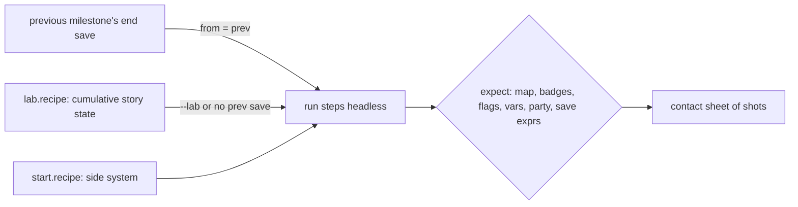

# End-to-end plan: Pokémon Platinum, Diamond and Pearl in nativeplat

Goal: play each game's story from a blank chip to the Hall of Fame and the credits, plus the major side systems,
headless on the real cores (build/core-plat, build/core-dp), with a screenshot at every proof point that a person or
agent inspects. Phase 1 (this file, `AUTHORING.md`, the milestone skeletons) plans it; phase 2 proves each milestone
and flips its `status` from `planned`.

Each milestone is a directory `tests/e2e/<game>/<nn>-<slug>/` holding `milestone.toml` (steps and expected end state,
schema: the harness's `tests/e2e/README.md`, draft `SCHEMA.draft.md`) and a lab recipe that mints its start save.
How to write and prove one: [AUTHORING.md](AUTHORING.md).

## How a milestone runs

- Story milestones chain: each starts from the previous one's end save (`[start] from = "prev"`). Its `lab.recipe`
  carries the full cumulative story state (every flag, var, badge, item and Pokétch app the earlier milestones set,
  each line citing the script that sets it), so any milestone can also start standalone (`--lab`) and a failure
  never blocks the rest of the chain.
- Side systems are standalone: `[start] recipe = "start.recipe"` with just the state they need.
- Battles are won by first-move A presses (`auto_battle`): the lab party's slot-0 move must beat every opponent of the
  milestone, so each recipe chooses a party against the trainers' actual teams (cited by trainer constant / id).
- Pearl reuses Diamond's dirs (`pearl/chain.txt` lines `../diamond/<dir>`); a Pearl-local dir exists only where the
  scripts branch on the version (`GetGameVersion`; Diamond 10, Pearl 11, `games/diamond/include/config.h:9-10`) —
  Spear Pillar's Palkia and the version legendaries.

## Citations

Every decomp fact in a milestone is in its `refs` list, in its step `note`s or as a comment on its recipe line.
Platinum: `scripts_<map>.s:LINE` = `games/platinum/res/field/scripts/`, `events_<map>` = `res/field/events/*.json`,
other paths relative to `games/platinum/`. Diamond/Pearl (binary field data, decoded by
`tests/e2e/tools/dp_script.py`): `scr_seq NNNN @0xOFF`, `zone_event NNNN object|warp|coord|bg k`, `maps.h:LINE`,
`map_header.c:LINE`, `trdata.json #N`, `msg NNNN #i`; C/asm paths relative to `games/diamond/`. `[INFERENCE]` marks
what the scripts do not prove.

## Platinum story outline

Gym order (badge = `GiveBadge` line): Roark (Coal, `scripts_oreburgh_city_gym.s:28`) → Gardenia (Forest,
`scripts_eterna_city_gym.s:76`) → Fantina (Relic, `scripts_hearthome_city_gym_leader_room.s:71`) → Maylene (Cobble,
`scripts_veilstone_city_gym.s:34`) → Wake (Fen, `scripts_pastoria_city_gym.s:58`) → Byron (Mine,
`scripts_canalave_city_gym.s:31`) → Candice (Icicle, `scripts_snowpoint_city_gym.s:35`) → Volkner (Beacon,
`scripts_sunyshore_city_gym_room_3.s:41`).

| stage | milestones | key decomp anchor |
|---|---|---|
| New game, Lake Verity, Pokédex, Pokétch | 01–05 | `scripts_route_201.s:280-407` (briefcase, first battle) |
| Coal Badge, Rock Smash | 06–08 | HM06 `scripts_oreburgh_gate_1f.s:54`; Roark `scripts_oreburgh_city_gym.s:18` |
| Galactic in Jubilife, Floaroma, Valley Windworks (Mars) | 09–11 | milestone refs |
| Eterna Forest, Forest Badge, Cut, Galactic Eterna Building (Jupiter) | 12–15 | Gardenia `scripts_eterna_city_gym.s:68`; HM01 `scripts_eterna_city.s:181` |
| Bicycle, Cycling Road, Hearthome, Relic Badge | 16–19 | Fantina `scripts_hearthome_city_gym_leader_room.s:62` |
| Solaceon, Veilstone, Cobble Badge, warehouse and Fly | 20–22 | Maylene `scripts_veilstone_city_gym.s:26`; HM02 `scripts_visible_items.s:1751-1752` |
| Pastoria, Fen Badge, explosion, Galactic chase, SecretPotion | 23–27 | Wake `scripts_pastoria_city_gym.s:50` |
| Celestic (Cyrus), Surf | 28 | Cyrus `scripts_celestic_town_cave.s:105`; HM03 `scripts_celestic_town_cave.s:129` |
| Canalave, Mine Badge, Iron Island (Riley), Strength | 29–31 | Byron `scripts_canalave_city_gym.s:23`; HM04 `scripts_iron_island.s:98` |
| Library, lakes Valor (Saturn) / Verity (Mars) | 32–34 | milestone refs |
| Snowpoint, Icicle Badge, Lake Acuity (Jupiter) | 35–37 | Candice `scripts_snowpoint_city_gym.s:27`; HM08 `scripts_visible_items.s:1301-1302` |
| Galactic HQ: Cyrus, Saturn, freeing the lake trio | 38–40 | Cyrus `scripts_galactic_hq_4f.s:39` |
| Mt. Coronet, Spear Pillar, Distortion World, Giratina | 41–44 | Cyrus `scripts_distortion_world_b7f.s:56`; Giratina `scripts_distortion_world_giratina_room.s:69` |
| Sunyshore, Beacon Badge, Waterfall | 45–48 | Volkner `scripts_sunyshore_city_gym_room_3.s:33`; HM07 `scripts_sunyshore_city.s:442` |
| Victory Road, Elite Four, Champion, Hall of Fame | 49–56 | `scripts_pokemon_league_{aaron,bertha,lucian}_room.s:34`, `flint_room.s:36`, `champion_room.s:63`; `ClearGame` `scripts_pokemon_league_hall_of_fame.s:39-62` |

HM05 Defog is not on the story path (`scripts_visible_items.s:923-924`, Solaceon Ruins); side system 65 covers it.

## Diamond and Pearl story outline

<!-- dp-outline -->
(written when the D/P skeletons land; see the generated tables below)
<!-- /dp-outline -->

## Side systems

P1 = a major system every player meets; P2 = minor or post-game. Rows name the milestone dir per game.

<!-- systems-matrix -->
(written when the D/P skeletons land)
<!-- /systems-matrix -->

## Known gaps (phase 2 must close or work around)

- Platinum's cumulative `lab.recipe`s grow toward the lab cap: 56 has 441 ops of `LAB_MAX_OPS 512`
  (`games/platinum/pc/src/pc_lab.c:140`); keep new state lines minimal.
- The Diamond/Pearl lab caps recipes at `LAB_MAX_OPS 64` (`games/diamond/pc/game/pc_dp_lab.c:75`); cumulative D/P
  story recipes need it raised to Platinum's 512 (harness owner's change). Until then D/P story milestones past the
  first few run only chained (`from = "prev"`).
- Steps marked `# PHASE2:` in a `milestone.toml` stop where the plan could not state the input (random puzzles,
  touch minigames); `[expect]` is complete regardless.
- `[INFERENCE]` notes mark tiles and timings not proven by the scripts.

## Generated milestone tables

`python3 tests/e2e/tools/plan.py` rewrites everything between the markers below from the milestone dirs (header
comment, title, priority, estimate, refs, recipe, `[expect]`); `--check` fails when this file is stale. Per milestone:
what it proves, start (source, warp, the count of cumulative state lines by verb), lab party (species, level, slot-0
move), trainers, expected end state, frame estimate/budget, and the citations.

## Platinum

<!-- plan.py:begin platinum -->
### Story chain: 56 milestones, ~907000 frames estimated

| milestone | title | P | est. frames | start | end map | status |
|---|---|---|---|---|---|---|
| [01-newgame-starter](platinum/01-newgame-starter/milestone.toml) | New game to the starter and the running shoes | P0 | 29000 | blank chip | MAP_HEADER_TWINLEAF_TOWN | planned |
| [02-lake-verity-cyrus](platinum/02-lake-verity-cyrus/milestone.toml) | Lake Verity with Barry: Cyrus at the lake | P0 | 7000 | prev + `lab.recipe` | MAP_HEADER_VERITY_LAKEFRONT | planned |
| [03-sandgem-pokedex](platinum/03-sandgem-pokedex/milestone.toml) | Sandgem: Rowan's lab and the Pokedex | P0 | 11000 | prev + `lab.recipe` | MAP_HEADER_TWINLEAF_TOWN_PLAYER_HOUSE_1F | planned |
| [04-parcel-catching-tutorial](platinum/04-parcel-catching-tutorial/milestone.toml) | The Parcel and the catching tutorial | P0 | 8000 | prev + `lab.recipe` | MAP_HEADER_ROUTE_202 | planned |
| [05-jubilife-poketch](platinum/05-jubilife-poketch/milestone.toml) | Jubilife: Town Map and the Poketch | P0 | 15000 | prev + `lab.recipe` | MAP_HEADER_JUBILIFE_CITY | planned |
| [06-route203-oreburgh-gate-rocksmash](platinum/06-route203-oreburgh-gate-rocksmash/milestone.toml) | Route 203 rival, HM06, Oreburgh | P0 | 12000 | prev + `lab.recipe` | MAP_HEADER_OREBURGH_CITY | planned |
| [07-oreburgh-mine-roark](platinum/07-oreburgh-mine-roark/milestone.toml) | Oreburgh Mine: Roark returns to the gym | P0 | 8000 | prev + `lab.recipe` | MAP_HEADER_OREBURGH_CITY_GYM | planned |
| [08-roark-coal-badge](platinum/08-roark-coal-badge/milestone.toml) | Oreburgh Gym: Roark and the Coal Badge | P0 | 21000 | prev + `lab.recipe` | MAP_HEADER_OREBURGH_CITY | planned |
| [09-jubilife-galactic-tag-battle](platinum/09-jubilife-galactic-tag-battle/milestone.toml) | Jubilife: tag battle against Team Galactic | P0 | 8000 | prev + `lab.recipe` | MAP_HEADER_JUBILIFE_CITY | planned |
| [10-floaroma-meadow-works-key](platinum/10-floaroma-meadow-works-key/milestone.toml) | Floaroma Meadow: the Works Key | P0 | 19000 | prev + `lab.recipe` | MAP_HEADER_FLOAROMA_TOWN | planned |
| [11-valley-windworks-mars](platinum/11-valley-windworks-mars/milestone.toml) | Valley Windworks: Commander Mars | P0 | 15000 | prev + `lab.recipe` | MAP_HEADER_ETERNA_FOREST | planned |
| [12-eterna-forest-cheryl](platinum/12-eterna-forest-cheryl/milestone.toml) | Eterna Forest with Cheryl | P0 | 15000 | prev + `lab.recipe` | MAP_HEADER_ROUTE_205_NORTH | planned |
| [13-gardenia-forest-badge](platinum/13-gardenia-forest-badge/milestone.toml) | Eterna Gym: Gardenia and the Forest Badge | P0 | 25000 | prev + `lab.recipe` | MAP_HEADER_ETERNA_CITY | planned |
| [14-eterna-cyrus-cut](platinum/14-eterna-cyrus-cut/milestone.toml) | Eterna: Cyrus at the statue, Cynthia's HM01 | P0 | 5000 | prev + `lab.recipe` | MAP_HEADER_ETERNA_CITY | planned |
| [15-galactic-eterna-building-jupiter](platinum/15-galactic-eterna-building-jupiter/milestone.toml) | Team Galactic Eterna Building: Jupiter | P0 | 21000 | prev + `lab.recipe` | MAP_HEADER_ETERNA_CITY | planned |
| [16-togepi-egg-bicycle-explorer-kit](platinum/16-togepi-egg-bicycle-explorer-kit/milestone.toml) | Eterna: Togepi egg, Bicycle, Explorer Kit | P0 | 9000 | prev + `lab.recipe` | MAP_HEADER_ROUTE_206_CYCLING_ROAD_NORTH_GATE | planned |
| [17-cycling-road-to-hearthome](platinum/17-cycling-road-to-hearthome/milestone.toml) | Cycling Road, Mt. Coronet, Hearthome | P0 | 25000 | prev + `lab.recipe` | MAP_HEADER_HEARTHOME_CITY | planned |
| [18-contest-hall-fantina-unblocks-gym](platinum/18-contest-hall-fantina-unblocks-gym/milestone.toml) | Contest Hall: Fantina frees the gym door | P0 | 7000 | prev + `lab.recipe` | MAP_HEADER_HEARTHOME_CITY_GYM_ENTRANCE_ROOM | planned |
| [19-fantina-relic-badge](platinum/19-fantina-relic-badge/milestone.toml) | Hearthome Gym: Fantina and the Relic Badge | P0 | 20000 | prev + `lab.recipe` | MAP_HEADER_HEARTHOME_CITY | planned |
| [20-route209-solaceon-to-veilstone](platinum/20-route209-solaceon-to-veilstone/milestone.toml) | Route 209 to Veilstone: rival, Solaceon, Crasher Wake | P0 | 31000 | prev + `lab.recipe` | MAP_HEADER_VEILSTONE_CITY_GYM | planned |
| [21-maylene-cobble-badge](platinum/21-maylene-cobble-badge/milestone.toml) | Veilstone Gym: Maylene and the Cobble Badge | P0 | 20000 | prev + `lab.recipe` | MAP_HEADER_VEILSTONE_CITY_GYM | planned |
| [22-veilstone-warehouse-fly](platinum/22-veilstone-warehouse-fly/milestone.toml) | Veilstone: warehouse tag battle and HM02 Fly | P0 | 16000 | prev + `lab.recipe` | MAP_HEADER_VEILSTONE_CITY_GALACTIC_WAREHOUSE | planned |
| [23-pastoria-rival](platinum/23-pastoria-rival/milestone.toml) | Pastoria: rival battle on the way to the gym | P0 | 9000 | prev + `lab.recipe` | MAP_HEADER_PASTORIA_CITY | planned |
| [24-pastoria-gym-wake](platinum/24-pastoria-gym-wake/milestone.toml) | Pastoria Gym: Crasher Wake and the Fen Badge | P0 | 22000 | prev + `lab.recipe` | MAP_HEADER_PASTORIA_CITY_GYM | planned |
| [25-pastoria-explosion](platinum/25-pastoria-explosion/milestone.toml) | Pastoria: Wake and rival scene, Great Marsh explosion | P0 | 9000 | prev + `lab.recipe` | MAP_HEADER_PASTORIA_CITY | planned |
| [26-galactic-chase-secretpotion](platinum/26-galactic-chase-secretpotion/milestone.toml) | Pastoria to Valor Lakefront: grunt chase and the SecretPotion | P0 | 14000 | prev + `lab.recipe` | MAP_HEADER_VALOR_LAKEFRONT | planned |
| [27-route210-psyduck-oldcharm](platinum/27-route210-psyduck-oldcharm/milestone.toml) | Route 210 South: SecretPotion on the Psyduck, Old Charm | P0 | 7000 | prev + `lab.recipe` | MAP_HEADER_ROUTE_210_SOUTH | planned |
| [28-celestic-cyrus-surf](platinum/28-celestic-cyrus-surf/milestone.toml) | Celestic Town: grunt, Cyrus at the ruins painting, HM03 Surf | P0 | 16000 | prev + `lab.recipe` | MAP_HEADER_CELESTIC_TOWN | planned |
| [29-route218-canalave-rival](platinum/29-route218-canalave-rival/milestone.toml) | Route 218 to Canalave: form-detection upgrade, bridge rival | P0 | 14000 | prev + `lab.recipe` | MAP_HEADER_CANALAVE_CITY | planned |
| [30-canalave-gym-byron](platinum/30-canalave-gym-byron/milestone.toml) | Canalave Gym: Byron and the Mine Badge | P0 | 24000 | prev + `lab.recipe` | MAP_HEADER_CANALAVE_CITY_GYM | planned |
| [31-iron-island-strength](platinum/31-iron-island-strength/milestone.toml) | Iron Island: Riley gives HM04 Strength | P0 | 12000 | prev + `lab.recipe` | MAP_HEADER_IRON_ISLAND | planned |
| [32-canalave-library-explosion](platinum/32-canalave-library-explosion/milestone.toml) | Canalave Library: Lake Valor explosion | P0 | 12000 | prev + `lab.recipe` | MAP_HEADER_CANALAVE_CITY | planned |
| [33-lake-valor-saturn](platinum/33-lake-valor-saturn/milestone.toml) | Lake Valor (drained): Saturn in Valor Cavern | P0 | 12000 | prev + `lab.recipe` | MAP_HEADER_VALOR_CAVERN | planned |
| [34-lake-verity-mars](platinum/34-lake-verity-mars/milestone.toml) | Lake Verity: Mars | P0 | 14000 | prev + `lab.recipe` | MAP_HEADER_LAKE_VERITY | planned |
| [35-coronet-to-snowpoint](platinum/35-coronet-to-snowpoint/milestone.toml) | Mt Coronet B1F to Snowpoint via Routes 216/217, HM08 | P0 | 26000 | prev + `lab.recipe` | MAP_HEADER_SNOWPOINT_CITY | planned |
| [36-snowpoint-gym-candice](platinum/36-snowpoint-gym-candice/milestone.toml) | Snowpoint Gym: Candice and the Icicle Badge | P0 | 22000 | prev + `lab.recipe` | MAP_HEADER_SNOWPOINT_CITY_GYM | planned |
| [37-lake-acuity-jupiter](platinum/37-lake-acuity-jupiter/milestone.toml) | Lake Acuity: Jupiter leaves, injured rival | P0 | 9000 | prev + `lab.recipe` | MAP_HEADER_LAKE_ACUITY | planned |
| [38-veilstone-storage-key-hq-entry](platinum/38-veilstone-storage-key-hq-entry/milestone.toml) | Veilstone: storage key, Looker, Galactic HQ entry | P0 | 9000 | prev + `lab.recipe` | MAP_HEADER_GALACTIC_HQ_B2F | planned |
| [39-galactic-hq-cyrus](platinum/39-galactic-hq-cyrus/milestone.toml) | Galactic HQ: Galactic Key, Cyrus, Master Ball | P0 | 30000 | prev + `lab.recipe` | MAP_HEADER_GALACTIC_HQ_4F | planned |
| [40-galactic-hq-saturn-free-lake-trio](platinum/40-galactic-hq-saturn-free-lake-trio/milestone.toml) | Galactic HQ: Saturn and the lake trio freed | P0 | 12000 | prev + `lab.recipe` | MAP_HEADER_GALACTIC_HQ_CONTROL_ROOM | planned |
| [41-mt-coronet-climb](platinum/41-mt-coronet-climb/milestone.toml) | Mt Coronet: Black Flute and the climb to Spear Pillar | P0 | 30000 | prev + `lab.recipe` | MAP_HEADER_SPEAR_PILLAR | planned |
| [42-spear-pillar](platinum/42-spear-pillar/milestone.toml) | Spear Pillar: grunt double, Mars + Jupiter tag, Giratina's rift | P0 | 26000 | prev + `lab.recipe` | MAP_HEADER_DISTORTION_WORLD_1F | planned |
| [43-distortion-world-cyrus](platinum/43-distortion-world-cyrus/milestone.toml) | Distortion World: to B7F and Cyrus | P0 | 40000 | prev + `lab.recipe` | MAP_HEADER_DISTORTION_WORLD_B7F | planned |
| [44-giratina-sendoff-spring](platinum/44-giratina-sendoff-spring/milestone.toml) | Giratina Origin battle, out to Sendoff Spring | P0 | 14000 | prev + `lab.recipe` | MAP_HEADER_SENDOFF_SPRING | planned |
| [45-sandgem-rowan-unlocks-sunyshore](platinum/45-sandgem-rowan-unlocks-sunyshore/milestone.toml) | Sandgem lab: Rowan after the Distortion World | P0 | 5000 | prev + `lab.recipe` | MAP_HEADER_SANDGEM_TOWN_POKEMON_RESEARCH_LAB | planned |
| [46-sunyshore-flint-lighthouse](platinum/46-sunyshore-flint-lighthouse/milestone.toml) | Sunyshore: Flint, Volkner at Vista Lighthouse | P0 | 9000 | prev + `lab.recipe` | MAP_HEADER_SUNYSHORE_CITY | planned |
| [47-sunyshore-gym-volkner](platinum/47-sunyshore-gym-volkner/milestone.toml) | Sunyshore Gym: Volkner and the Beacon Badge | P0 | 26000 | prev + `lab.recipe` | MAP_HEADER_SUNYSHORE_CITY_GYM_ROOM_3 | planned |
| [48-sunyshore-jasmine-waterfall](platinum/48-sunyshore-jasmine-waterfall/milestone.toml) | Sunyshore: Jasmine gives HM07 Waterfall | P0 | 6000 | prev + `lab.recipe` | MAP_HEADER_SUNYSHORE_CITY | planned |
| [49-route223-victory-road](platinum/49-route223-victory-road/milestone.toml) | Route 223 and Victory Road to the League | P0 | 30000 | prev + `lab.recipe` | MAP_HEADER_POKEMON_LEAGUE | planned |
| [50-league-north-rival-door](platinum/50-league-north-rival-door/milestone.toml) | Pokémon League: last rival battle, door guard | P0 | 10000 | prev + `lab.recipe` | MAP_HEADER_POKEMON_LEAGUE_NORTH_POKECENTER_1F | planned |
| [51-e4-aaron](platinum/51-e4-aaron/milestone.toml) | Elite Four: Aaron | P0 | 12000 | prev + `lab.recipe` | MAP_HEADER_POKEMON_LEAGUE_AARON_ROOM | planned |
| [52-e4-bertha](platinum/52-e4-bertha/milestone.toml) | Elite Four: Bertha | P0 | 12000 | prev + `lab.recipe` | MAP_HEADER_POKEMON_LEAGUE_BERTHA_ROOM | planned |
| [53-e4-flint](platinum/53-e4-flint/milestone.toml) | Elite Four: Flint | P0 | 12000 | prev + `lab.recipe` | MAP_HEADER_POKEMON_LEAGUE_FLINT_ROOM | planned |
| [54-e4-lucian](platinum/54-e4-lucian/milestone.toml) | Elite Four: Lucian | P0 | 12000 | prev + `lab.recipe` | MAP_HEADER_POKEMON_LEAGUE_LUCIAN_ROOM | planned |
| [55-champion-cynthia](platinum/55-champion-cynthia/milestone.toml) | Champion Cynthia | P0 | 16000 | prev + `lab.recipe` | MAP_HEADER_POKEMON_LEAGUE_HALLWAY_TO_HALL_OF_FAME | planned |
| [56-hall-of-fame-credits](platinum/56-hall-of-fame-credits/milestone.toml) | Hall of Fame, save, credits | P0 | 27000 | prev + `lab.recipe` | - | planned |

#### platinum/01-newgame-starter — New game to the starter and the running shoes
- proves: Proves the real new-game route from a blank chip: intro, Barry's visit, Mom, Route 201's Rowan scene, the briefcase starter, the first rival battle, home, running shoes. Start: power-on (no save) -> end: Twinleaf Town outside the player's house, VAR_PLAYER_HOUSE_STATE 5.
- start: blank chip; -; lab state lines: none
- party: the continued save
- trainers: none
- end state: map MAP_HEADER_TWINLEAF_TOWN; >= 1 battles; party SPECIES_TURTWIG; party size 1; flags set FLAG_TALKED_TO_MOM, FLAG_RIVAL_LEFT_HOME, FLAG_HIDE_ROUTE_201_BRIEFCASE, FLAG_HIDE_ROUTE_201_PROF_ROWAN, FLAG_HIDE_ROUTE_201_COUNTERPART; vars VAR_PLAYER_HOUSE_STATE=5, VAR_FOLLOWER_RIVAL_STATE=2, VAR_PLAYER_STARTER=SPECIES_TURTWIG, VAR_RIVAL_HOUSE_STATE=1, VAR_TWINLEAF_TOWN_GUITARIST_TRIGGER_STATE=2, VAR_PLAYER_HOUSE_RIVAL_STATE=1
- frames: estimate 29000, budget 43500
- refs: src/location.c:8-14; scripts_init_new_game.s:7-126; scripts_init_new_game.s:24; pc/src/pc_lab.c:15-21; scripts_twinleaf_town_player_house_2f.s:28; scripts_twinleaf_town_player_house_2f.s:82; scripts_twinleaf_town_player_house_2f.s:127-128; scripts_twinleaf_town_player_house_1f.s:39; scripts_twinleaf_town_player_house_1f.s:47; scripts_twinleaf_town_player_house_1f.s:529; scripts_twinleaf_town_player_house_1f.s:749; scripts_twinleaf_town.s:394; scripts_twinleaf_town.s:421-424; scripts_twinleaf_town_rival_house_2f.s:28-30; scripts_route_201.s:122; scripts_route_201.s:208; scripts_route_201.s:224; scripts_route_201.s:240; scripts_route_201.s:270; scripts_route_201.s:278; scripts_route_201.s:280-286; scripts_route_201.s:301; scripts_route_201.s:334; scripts_route_201.s:360-363; scripts_route_201.s:371; scripts_route_201.s:388-396; scripts_route_201.s:401-407; scripts_twinleaf_town_player_house_1f.s:133; scripts_twinleaf_town_player_house_1f.s:141; scripts_twinleaf_town.s:19; scripts_twinleaf_town.s:32; src/system_vars.c:67-72; events_twinleaf_town_player_house_1f (warp 0 (6,10)); tests/gameplay/schedules/rival.press; tests/gameplay/scenarios/1-rival.scn
- notes: Estimate = rival.press's recorded 27400 frames (1-rival.scn FRAMES) plus the running-shoes scene and the walk out. The research's ~9000 counts only the field part.

#### platinum/02-lake-verity-cyrus — Lake Verity with Barry: Cyrus at the lake
- proves: Proves Barry as follower on Route 201, the Verity Lakefront walk-in and the Lake Verity Cyrus scene. Start: Twinleaf Town (116,886), the first respawn tile -> end: Verity Lakefront after leaving the lake.
- start: prev + `lab.recipe`; map MAP_HEADER_TWINLEAF_TOWN 116 886 FACE_DOWN; lab state lines: 6 flag, 8 var
- party: SPECIES_TURTWIG 8 (MOVE_TACKLE)
- trainers: none
- end state: map MAP_HEADER_VERITY_LAKEFRONT; flags set FLAG_HIDE_ROUTE_201_RIVAL, FLAG_HIDE_LAKE_VERITY_LOW_WATER_RIVAL, FLAG_HIDE_LAKE_VERITY_LOW_WATER_CYRUS; flags clear FLAG_DEFEATED_COMMANDER_SATURN_VALOR_CAVERN; vars VAR_FOLLOWER_RIVAL_STATE=4, VAR_VISITED_LAKE_VERITY_WITH_RIVAL=1, VAR_VERITY_LAKEFRONT_STATE=1
- frames: estimate 7000, budget 10500
- refs: src/location.c:16-20; scripts_route_201.s:1236-1241; scripts_verity_lakefront.s:11-24; scripts_verity_lakefront.s:50; scripts_verity_lakefront.s:55; scripts_init_lake_verity_low_water.s:10; scripts_lake_verity_low_water.s:43; scripts_lake_verity_low_water.s:69; scripts_lake_verity_low_water.s:106; scripts_lake_verity_low_water.s:113-114; events_route_201 (coords (109..113,857), (110..113,858), (115,852..855)); events_verity_lakefront (coord (80..81,844)); events_lake_verity_low_water (warp 0 (46,54))
- notes: Estimate: research ~6000 plus the walk out of the lake. [INFERENCE] the follower partner turns Route 201 wild battles into multi battles (SetHasPartner, scripts_route_201.s:1238); walk_to fights them.

#### platinum/03-sandgem-pokedex — Sandgem: Rowan's lab and the Pokedex
- proves: Proves the Sandgem escort into Rowan's lab, the Pokedex, and the TM27 town tour, then the walk home. Start: Sandgem Town (177,843) in front of the Pokecenter -> end: Twinleaf player house 1F (04's start).
- start: prev + `lab.recipe`; map MAP_HEADER_SANDGEM_TOWN 177 843 FACE_DOWN; lab state lines: 9 flag, 10 var
- party: SPECIES_TURTWIG 9 (MOVE_TACKLE)
- trainers: none
- end state: map MAP_HEADER_TWINLEAF_TOWN_PLAYER_HOUSE_1F; flags set FLAG_HAS_POKEDEX, FLAG_ALT_MUSIC_ROWANS_LAB, FLAG_HIDE_SANDGEM_TOWN_COUNTERPART; vars VAR_SANDGEM_TOWN_STATE=2, VAR_SANDGEM_TOWN_LAB_STATE=1; 2 save check(s)
- frames: estimate 11000, budget 16500
- refs: scripts_sandgem_town.s:169; scripts_sandgem_town.s:188; scripts_sandgem_town.s:214-218; scripts_init_sandgem_town_pokemon_research_lab.s:9; scripts_sandgem_town_pokemon_research_lab.s:230; scripts_sandgem_town_pokemon_research_lab.s:249-250; scripts_sandgem_town_pokemon_research_lab.s:310-312; scripts_init_sandgem_town.s:9; scripts_sandgem_town.s:441; scripts_sandgem_town.s:452-454; scripts_sandgem_town.s:462; scripts_sandgem_town.s:573-574; events_sandgem_town (coord (164,842..847); warp 2 (168,842) lab); events_sandgem_town_pokemon_research_lab (warp 0 (7,15)); events_twinleaf_town (warp 1 (116,885) player house); tests/gameplay/recipes/sandgem.recipe
- notes: Estimate: research ~9000 plus the walk back to Twinleaf (so 04 starts inside the house). sandgem.recipe's VAR_SANDGEM_TOWN_STATE 3 is never written by a script (writers: scripts_sandgem_town.s:215,574).

#### platinum/04-parcel-catching-tutorial — The Parcel and the catching tutorial
- proves: Proves Mom's Journal, Barry's mom's Parcel, and the Route 202 catching tutorial (5 Poke Balls). Start: Twinleaf player house 1F, warp 0 (door (6,10)) -> end: Route 202 after the tutorial.
- start: prev + `lab.recipe`; warp MAP_HEADER_TWINLEAF_TOWN_PLAYER_HOUSE_1F 0; lab state lines: 15 flag, 1 item, 1 pokedex, 12 var
- party: SPECIES_TURTWIG 10 (MOVE_TACKLE)
- trainers: TRAINER_YOUNGSTER_TRISTAN (1); TRAINER_LASS_NATALIE (3); TRAINER_YOUNGSTER_LOGAN (2)
- end state: map MAP_HEADER_ROUTE_202; flags set FLAG_RECEIVED_PARCEL, FLAG_HIDE_TWINLEAF_TOWN_PLAYER_HOUSE_1F_RIVAL_MOM, FLAG_HIDE_ROUTE_202_COUNTERPART; vars VAR_PLAYER_HOUSE_STATE=7, VAR_ROUTE_202_STATE=1; 3 save check(s)
- frames: estimate 8000, budget 12000
- refs: scripts_twinleaf_town_player_house_1f.s:172-174; scripts_twinleaf_town_player_house_1f.s:261-264; scripts_twinleaf_town_player_house_1f.s:290; scripts_twinleaf_town_player_house_1f.s:403-406; scripts_twinleaf_town_player_house_1f.s:448-449; scripts_twinleaf_town.s:28; scripts_route_202.s:91; scripts_route_202.s:116; scripts_route_202.s:135-137; scripts_route_202.s:156-157; scripts_route_202.s:161-241; events_twinleaf_town_player_house_1f (Mom (7,8); warp 0 (6,10)); events_route_202 (coord (180,825..829)); TRAINER_YOUNGSTER_TRISTAN (1); TRAINER_LASS_NATALIE (3); TRAINER_YOUNGSTER_LOGAN (2)
- notes: The lab cannot set the journal system flag (src/scrcmd.c:5012-5016). Optional Route 202 sight trainers: Tristan (166,813) S 5, Natalie (181,818) S 4, Logan (185,804) S 5.

#### platinum/05-jubilife-poketch — Jubilife: Town Map and the Poketch
- proves: Proves Jubilife's first arrival (Looker, VS Recorder), the Trainers' School Parcel hand-off (Town Map), and the Poketch campaign (three clown coupons -> Poketch with 4 apps). Start: Jubilife City (174,798) facing up -> end: Jubilife City with the Poketch.
- start: prev + `lab.recipe`; map MAP_HEADER_JUBILIFE_CITY 174 798 FACE_UP; lab state lines: 18 flag, 4 item, 1 pokedex, 13 var
- party: SPECIES_EMPOLEON 60 (MOVE_SURF); SPECIES_STARAPTOR 50 (MOVE_AERIAL_ACE)
- trainers: none
- end state: map MAP_HEADER_JUBILIFE_CITY; flags set FLAG_RECEIVED_POKETCH, FLAG_RECEIVED_COUPON_1, FLAG_RECEIVED_COUPON_2, FLAG_RECEIVED_COUPON_3, FLAG_HIDE_JUBILIFE_CITY_LOOKER, FLAG_TALKED_TO_TRAINERS_SCHOOL_RIVAL, FLAG_HIDE_JUBILIFE_CITY_POKETCH_CO_PRESIDENT; flags clear FLAG_HIDE_POKETCH_CO_1F_POKETCH_CO_PRESIDENT; vars VAR_JUBILIFE_CITY_STATE=2, VAR_POKETCH_CAMPAIGN_STATE=2; 4 save check(s)
- frames: estimate 15000, budget 22500
- refs: scripts_jubilife_city.s:89; scripts_jubilife_city.s:190-191; scripts_jubilife_city.s:259-261; scripts_trainers_school.s:32; scripts_trainers_school.s:36-38; scripts_trainers_school.s:72-77; scripts_jubilife_city.s:1326; scripts_jubilife_city.s:1503; scripts_jubilife_city.s:1512-1515; scripts_jubilife_city.s:1520-1526; scripts_jubilife_city.s:1542; scripts_jubilife_city.s:1551-1554; scripts_jubilife_city.s:1578; scripts_jubilife_city.s:1582; scripts_jubilife_city.s:1591-1595; scripts_jubilife_city.s:1427-1435; scripts_jubilife_city.s:1464-1468; scripts_trainers_school.s:156; scripts_trainers_school.s:249; pc/src/pc_lab.c:999-1002; events_jubilife_city (coords (173..176,796), (172..176,776), (188,757..760); warp 7 (168,776) school); events_trainers_school (Barry (6,3) LOOK_NORTH; warp 0 (7,11))
- notes: Optional talk-only trainers in the school: TRAINER_SCHOOL_KID_HARRISON (342), TRAINER_SCHOOL_KID_CHRISTINE (345). From now until the Poketch, Looker blocks Route 203 (coord (188,757..760) VAR_JUBILIFE_CITY_STATE==1).

#### platinum/06-route203-oreburgh-gate-rocksmash — Route 203 rival, HM06, Oreburgh
- proves: Proves the Route 203 rival battle, HM06 (Rock Smash) from the Oreburgh Gate hiker, and the Oreburgh gym tour. Start: Jubilife City warp 2 (Pokecenter door) -> end: Oreburgh City after the youngster's tour (VAR_OREBURGH_CITY_STATE 1).
- start: prev + `lab.recipe`; warp MAP_HEADER_JUBILIFE_CITY 2; lab state lines: 2 clear-flag, 27 flag, 5 item, 1 pokedex, 4 poketch, 15 var
- party: SPECIES_EMPOLEON 60 (MOVE_SURF); SPECIES_STARAPTOR 50 (MOVE_AERIAL_ACE)
- trainers: TRAINER_RIVAL_ROUTE_203_TURTWIG (248); TRAINER_YOUNGSTER_MICHAEL (4); TRAINER_YOUNGSTER_DALLAS (355); TRAINER_YOUNGSTER_SEBASTIAN (356); TRAINER_LASS_MADELINE (322); TRAINER_LASS_KAITLIN (323); TRAINER_PICNICKER_DIANA (329); TRAINER_CAMPER_CURTIS (265)
- end state: map MAP_HEADER_OREBURGH_CITY; >= 1 battles; flags set FLAG_RECEIVED_HM06, FLAG_FIRST_ARRIVAL_OREBURGH_GATE, FLAG_HIDE_ROUTE_203_RIVAL; vars VAR_ROUTE_203_RIVAL_STATE=1, VAR_OREBURGH_CITY_STATE=1, VAR_OREBURGH_GATE_1F_HIKER_STATE=2; 1 save check(s)
- frames: estimate 12000, budget 18000
- refs: scripts_route_203.s:71-74; scripts_route_203.s:81; scripts_route_203.s:122-123; scripts_oreburgh_gate_1f.s:12; scripts_oreburgh_gate_1f.s:44-45; scripts_oreburgh_gate_1f.s:54-57; scripts_init_new_game.s:53; scripts_oreburgh_city.s:29-49; scripts_oreburgh_city.s:38; scripts_oreburgh_city.s:388; src/field_move_tasks.c:545; events_route_203 (coord (196,757..760); warp 0 (246,749)); events_oreburgh_gate_1f (coord (7,22); warps (4,22), (27,22)); events_oreburgh_city (coord (266,748..751); Barry (282,757)); TRAINER_RIVAL_ROUTE_203_TURTWIG (248); TRAINER_YOUNGSTER_MICHAEL (4); TRAINER_YOUNGSTER_DALLAS (355); TRAINER_YOUNGSTER_SEBASTIAN (356); TRAINER_LASS_MADELINE (322); TRAINER_LASS_KAITLIN (323); TRAINER_PICNICKER_DIANA (329); TRAINER_CAMPER_CURTIS (265)
- notes: Needs VAR_JUBILIFE_CITY_STATE 2 (at 1 Looker blocks Route 203). Rock Smash is unusable in the field until BADGE_ID_COAL (src/field_move_tasks.c:545). Optional sight trainers on the way are fought by walk_to.

#### platinum/07-oreburgh-mine-roark — Oreburgh Mine: Roark returns to the gym
- proves: Proves the Oreburgh Mine visit: Roark smashes the rock and returns to the gym, which hides Barry from the gym door. Start: Oreburgh City warp 1 (Pokecenter door) -> end: inside Oreburgh Gym (08's start), Roark back.
- start: prev + `lab.recipe`; warp MAP_HEADER_OREBURGH_CITY 1; lab state lines: 2 clear-flag, 30 flag, 6 item, 1 pokedex, 4 poketch, 18 var
- party: SPECIES_EMPOLEON 60 (MOVE_SURF); SPECIES_STARAPTOR 50 (MOVE_AERIAL_ACE)
- trainers: TRAINER_WORKER_COLIN (195); TRAINER_WORKER_MASON (196)
- end state: map MAP_HEADER_OREBURGH_CITY_GYM; flags set FLAG_ROARK_RETURNED_TO_OREBURGH_GYM, FLAG_HIDE_OREBURGH_CITY_RIVAL, FLAG_FIRST_ARRIVAL_OREBURGH_MINE, FLAG_HIDE_OREBURGH_MINE_B2F_ROARK
- frames: estimate 8000, budget 12000
- refs: scripts_oreburgh_mine_b1f.s:13-14; scripts_oreburgh_mine_b2f.s:13-59; scripts_oreburgh_mine_b2f.s:55-57; scripts_oreburgh_city.s:29-49; events_oreburgh_city (warps 11-15 (300..304,795) mine; warp 0 (282,756) gym); events_oreburgh_mine_b1f (warps (11..13,1), (11..13,21)); events_oreburgh_mine_b2f (Roark (18,28) facing east; warp 0 (15,1)); TRAINER_WORKER_COLIN (195); TRAINER_WORKER_MASON (196)
- notes: Estimate: research ~6000 plus the walk back into the gym. The Workers have no sight (data []), so walking past is safe.

#### platinum/08-roark-coal-badge — Oreburgh Gym: Roark and the Coal Badge
- proves: Proves the first gym: two sight youngsters, Roark, the Coal Badge and TM76; the win arms the Jubilife Galactic scene. Start: Oreburgh Gym warp 0 (5,24) -> end: Oreburgh City at the gym door (09's start).
- start: prev + `lab.recipe`; warp MAP_HEADER_OREBURGH_CITY_GYM 0; lab state lines: 2 clear-flag, 35 flag, 6 item, 1 pokedex, 4 poketch, 18 var
- party: SPECIES_EMPOLEON 60 (MOVE_SURF); SPECIES_STARAPTOR 50 (MOVE_AERIAL_ACE)
- trainers: TRAINER_YOUNGSTER_JONATHON (244); TRAINER_YOUNGSTER_DARIUS (245); TRAINER_LEADER_ROARK (246)
- end state: map MAP_HEADER_OREBURGH_CITY; 1 badges; badge BADGE_ID_COAL; >= 1 battles; flags set FLAG_RECEIVED_ROARK_TM76, FLAG_DEFEATED_TRAINER_YOUNGSTER_JONATHON, FLAG_DEFEATED_TRAINER_YOUNGSTER_DARIUS, FLAG_HIDE_POKECENTER_BASEMENT_BLOCKADE, FLAG_HIDE_SANDGEM_TOWN_LAB_PROF_ROWAN; flags clear FLAG_HIDE_JUBILIFE_GALACTIC_GRUNTS, FLAG_HIDE_JUBILIFE_ROWAN, FLAG_HIDE_JUBILIFE_CITY_COUNTERPART; vars VAR_OREBURGH_CITY_STATE=2, VAR_JUBILIFE_CITY_STATE=3, VAR_JUBILIFE_LOOKER_PAL_PAD_STATE=1, VAR_GTS_ACCESS_STATE=1; 1 save check(s)
- frames: estimate 21000, budget 31500
- refs: scripts_oreburgh_city_gym.s:26-28; scripts_oreburgh_city_gym.s:30-41; scripts_oreburgh_city_gym.s:47-51; tests/gameplay/recipes/roark.recipe; events_oreburgh_city_gym (warp 0 (5,24); Jonathon (4,18) E 3; Darius (7,11) W 4; Roark (5,3)); TRAINER_YOUNGSTER_JONATHON (244); TRAINER_YOUNGSTER_DARIUS (245); TRAINER_LEADER_ROARK (246)
- notes: Estimate: research's measured ~20200 for the existing Roark test plus the exit. Surf is x2/x4 on every Roark mon.

#### platinum/09-jubilife-galactic-tag-battle — Jubilife: tag battle against Team Galactic
- proves: Proves Barry's Oreburgh bump, Looker's Pal Pad check, and the Jubilife tag battle with Dawn against two grunts (then the collector's Fashion Case). Start: Oreburgh City warp 0 (gym door (282,756)) -> end: Jubilife City after the grunts flee.
- start: prev + `lab.recipe`; warp MAP_HEADER_OREBURGH_CITY 0; lab state lines: 1 badge, 5 clear-flag, 39 flag, 7 item, 1 pokedex, 4 poketch, 20 var
- party: SPECIES_EMPOLEON 60 (MOVE_SURF); SPECIES_STARAPTOR 50 (MOVE_AERIAL_ACE)
- trainers: TRAINER_GALACTIC_GRUNT_JUBILIFE_CITY_1 (414); TRAINER_GALACTIC_GRUNT_JUBILIFE_CITY_2 (415); TRAINER_DAWN_JUBILIFE_CITY_TURTWIG (618)
- end state: map MAP_HEADER_JUBILIFE_CITY; >= 1 battles; flags set FLAG_HIDE_JUBILIFE_GALACTIC_GRUNTS, FLAG_RECEIVED_FASHION_CASE, FLAG_HIDE_JUBILIFE_ROWAN, FLAG_HIDE_JUBILIFE_CITY_COUNTERPART; flags clear FLAG_HIDE_SANDGEM_TOWN_LAB_PROF_ROWAN; vars VAR_JUBILIFE_CITY_STATE=4, VAR_OREBURGH_CITY_STATE=3, VAR_JUBILIFE_LOOKER_PAL_PAD_STATE=2; 1 save check(s)
- frames: estimate 8000, budget 12000
- refs: scripts_oreburgh_city.s:79; scripts_oreburgh_city.s:178-180; scripts_jubilife_city.s:876; scripts_jubilife_city.s:888; scripts_jubilife_city.s:907-914; scripts_jubilife_city.s:954-962; scripts_jubilife_city.s:965; scripts_jubilife_city.s:971; scripts_jubilife_city.s:982-985; scripts_jubilife_city.s:1004-1021; scripts_jubilife_city.s:1630-1652; events_oreburgh_city (coord (262,748..751); warp 10 (258,749) gate); events_oreburgh_gate_1f (warps (27,22), (4,22)); events_jubilife_city (coord (173..175,743); Rowan (175,740); grunts (174,739)/(174,740); coord (188,757..760)); TRAINER_GALACTIC_GRUNT_JUBILIFE_CITY_1 (414); TRAINER_GALACTIC_GRUNT_JUBILIFE_CITY_2 (415); TRAINER_DAWN_JUBILIFE_CITY_TURTWIG (618)
- notes: A tag battle: one move for one battler. Surf is a spread move and also hits Dawn (partner fainting does not lose). Entering Jubilife from Route 203 before the tag battle runs Looker's Pal Pad coord (VAR_JUBILIFE_LOOKER_PAL_PAD_STATE==1 -> 2).

#### platinum/10-floaroma-meadow-works-key — Floaroma Meadow: the Works Key
- proves: Proves Route 204 through the Ravaged Path (Rock Smash country), the Route 205 little-girl scene, and the two Floaroma Meadow grunt battles for the Works Key. Start: Jubilife City warp 2 (Pokecenter door) -> end: Floaroma Town (11's town).
- start: prev + `lab.recipe`; warp MAP_HEADER_JUBILIFE_CITY 2; lab state lines: 1 badge, 2 clear-flag, 45 flag, 8 item, 1 pokedex, 4 poketch, 20 var
- party: SPECIES_EMPOLEON 60 (MOVE_SURF); SPECIES_STARAPTOR 50 (MOVE_AERIAL_ACE)
- trainers: TRAINER_GALACTIC_GRUNT_FLOAROMA_MEADOW_1 (296); TRAINER_GALACTIC_GRUNT_FLOAROMA_MEADOW_2 (297); TRAINER_LASS_SARAH (12); TRAINER_YOUNGSTER_TYLER (10); TRAINER_LASS_SAMANTHA (11); TRAINER_AROMA_LADY_TAYLOR (14); TRAINER_BUG_CATCHER_BRANDON (13); TRAINER_TWINS_LIV_AND_LIZ (15)
- end state: map MAP_HEADER_FLOAROMA_TOWN; >= 2 battles; flags set FLAG_OBTAINED_FLOAROMA_MEADOW_WORKS_KEY, FLAG_DEFEATED_FLOAROMA_MEADOW_GRUNTS, FLAG_HIDE_FLOAROMA_TOWN_GRUNTS, FLAG_FIRST_ARRIVAL_RAVAGED_PATH, FLAG_FIRST_ARRIVAL_FLOAROMA_MEADOW; vars VAR_FLOAROMA_MEADOW_STATE=1, VAR_VALLEY_WINDWORKS_STATE=1; 2 save check(s)
- frames: estimate 19000, budget 28500
- refs: scripts_ravaged_path.s:8; scripts_route_205_south.s:129-131; scripts_floaroma_meadow.s:16; scripts_floaroma_meadow.s:22; scripts_floaroma_meadow.s:26; scripts_floaroma_meadow.s:30; scripts_floaroma_meadow.s:107-109; scripts_floaroma_meadow.s:112; scripts_floaroma_meadow.s:117-127; scripts_floaroma_meadow.s:134; src/field_move_tasks.c:545; events_ravaged_path (27 Rock Smash rocks; warps (19,50), (28,44)); events_route_204_south (warp 0 (171,705)); events_route_205_south (coords (211,659..664), (217,653); grunts (216,653)/(218,653)); events_floaroma_town (warps 7-8 (162..163,641) meadow); events_floaroma_meadow (coord (12..13,48); warps (12..13,54)); TRAINER_GALACTIC_GRUNT_FLOAROMA_MEADOW_1 (296); TRAINER_GALACTIC_GRUNT_FLOAROMA_MEADOW_2 (297); TRAINER_LASS_SARAH (12); TRAINER_YOUNGSTER_TYLER (10); TRAINER_LASS_SAMANTHA (11); TRAINER_AROMA_LADY_TAYLOR (14); TRAINER_BUG_CATCHER_BRANDON (13); TRAINER_TWINS_LIV_AND_LIZ (15)
- notes: Estimate: research ~18000 plus the meadow exit. Liv & Liz (Route 204 N) is a true double: slots 0 and 1 battle; Staraptor's slot-0 Aerial Ace covers it.

#### platinum/11-valley-windworks-mars — Valley Windworks: Commander Mars
- proves: Proves the Valley Windworks: the door grunt, the Works Key door, Commander Mars, the reunion, Looker outside, and the Route 205 South grunts leaving. Start: Floaroma Town warp 1 (Pokecenter door) -> end: Eterna Forest warp 0 (28,86) (12's start).
- start: prev + `lab.recipe`; warp MAP_HEADER_FLOAROMA_TOWN 1; lab state lines: 1 badge, 2 clear-flag, 55 flag, 10 item, 1 pokedex, 4 poketch, 22 var
- party: SPECIES_EMPOLEON 60 (MOVE_SURF); SPECIES_STARAPTOR 50 (MOVE_AERIAL_ACE)
- trainers: TRAINER_GALACTIC_GRUNT_VALLEY_WINDWORKS_1 (843); TRAINER_COMMANDER_MARS_VALLEY_WINDWORKS (295); TRAINER_GALACTIC_GRUNT_VALLEY_WINDWORKS_2 (298); TRAINER_GALACTIC_GRUNT_VALLEY_WINDWORKS_3 (299); TRAINER_HIKER_DANIEL (18); TRAINER_AROMA_LADY_ELIZABETH (21); TRAINER_CAMPER_JACOB (16); TRAINER_PICNICKER_SIENA (17); TRAINER_CAMPER_ZACKARY (377); TRAINER_HIKER_NICHOLAS (19); TRAINER_PICNICKER_KARINA (456); TRAINER_BATTLE_GIRL_KELSEY (20)
- end state: map MAP_HEADER_ETERNA_FOREST; >= 2 battles; flags set FLAG_HIDE_ROUTE_205_SOUTH_GRUNTS, FLAG_UNLOCKED_VALLEY_WINDWORKS_DOOR, FLAG_FIRST_ARRIVAL_VALLEY_WINDWORKS, FLAG_HIDE_ROUTE_205_SOUTH_LITTLE_GIRL, FLAG_ALT_MUSIC_VALLEY_WINDWORKS_BUILDING; flags clear FLAG_HIDE_ROUTE_205_SOUTH_YOUNGSTER, FLAG_HIDE_VALLEY_WINDWORKS_BUILDING_LITTLE_GIRL; vars VAR_VALLEY_WINDWORKS_STATE=2, VAR_VALLEY_WINDWORKS_TEAM_GALACTIC_STATE=3, VAR_VALLEY_WINDWORKS_LOOKER_STATE=2
- frames: estimate 15000, budget 22500
- refs: scripts_valley_windworks_outside.s:20; scripts_valley_windworks_outside.s:38; scripts_valley_windworks_outside.s:61-86; scripts_valley_windworks_outside.s:104-126; scripts_valley_windworks_outside.s:194; scripts_valley_windworks_building.s:17; scripts_valley_windworks_building.s:39-40; scripts_valley_windworks_building.s:86; scripts_valley_windworks_building.s:104-112; scripts_valley_windworks_building.s:135-136; scripts_valley_windworks_building.s:146; scripts_valley_windworks_building.s:184-187; events_valley_windworks_outside (grunt (243,655) S; door warp (243,654)); events_valley_windworks_building (coord (19,6..7); Mars (20,7); warp 0 (12,16)); events_route_205_south (warp 0 (206,581) Eterna Forest); TRAINER_GALACTIC_GRUNT_VALLEY_WINDWORKS_1 (843); TRAINER_COMMANDER_MARS_VALLEY_WINDWORKS (295); TRAINER_GALACTIC_GRUNT_VALLEY_WINDWORKS_2 (298); TRAINER_GALACTIC_GRUNT_VALLEY_WINDWORKS_3 (299); TRAINER_HIKER_DANIEL (18); TRAINER_AROMA_LADY_ELIZABETH (21); TRAINER_CAMPER_JACOB (16); TRAINER_PICNICKER_SIENA (17); TRAINER_CAMPER_ZACKARY (377); TRAINER_HIKER_NICHOLAS (19); TRAINER_PICNICKER_KARINA (456); TRAINER_BATTLE_GIRL_KELSEY (20)
- notes: Estimate: research ~10000 plus the walk to the forest. The Friday Drifloon (StartLegendaryBattle SPECIES_DRIFLOON 15, :146) is optional; the daily flag (:112) suppresses it the same day.

#### platinum/12-eterna-forest-cheryl — Eterna Forest with Cheryl
- proves: Proves Eterna Forest with Cheryl as partner (multi battles), the Soothe Bell, and the exit to Route 205 North. Start: Eterna Forest warp 0 (28,86), the Route 205 South entrance -> end: Route 205 North after Cheryl leaves.
- start: prev + `lab.recipe`; warp MAP_HEADER_ETERNA_FOREST 0; lab state lines: 1 badge, 4 clear-flag, 64 flag, 10 item, 1 pokedex, 4 poketch, 24 var
- party: SPECIES_EMPOLEON 60 (MOVE_SURF); SPECIES_STARAPTOR 50 (MOVE_AERIAL_ACE)
- trainers: TRAINER_CHERYL_ETERNA_FOREST (608); TRAINER_BUG_CATCHER_JACK (201); TRAINER_LASS_BRIANA (204); TRAINER_PSYCHIC_LINDSEY (206); TRAINER_PSYCHIC_ELIJAH (205); TRAINER_PSYCHIC_KODY (395); TRAINER_PSYCHIC_RACHAEL (398); TRAINER_BUG_CATCHER_PHILLIP (202); TRAINER_BUG_CATCHER_DONALD (203)
- end state: map MAP_HEADER_ROUTE_205_NORTH; flags set FLAG_TRAVELED_WITH_CHERYL, FLAG_TALKED_TO_ETERNA_FOREST_CHERYL, FLAG_HIDE_ETERNA_FOREST_CHERYL; vars VAR_ETERNA_FOREST_FOLLOWER_CHERYL_STATE=2; 1 save check(s)
- frames: estimate 15000, budget 22500
- refs: scripts_eterna_forest.s:19-25; scripts_eterna_forest.s:29; scripts_eterna_forest.s:52-57; scripts_eterna_forest.s:88-115; scripts_eterna_forest.s:142-150; scripts_eterna_forest.s:209-213; scripts_eterna_forest_outside.s:12; events_eterna_forest (coords (28..29,85), (28..29,86), (82,34..39); warp 2 (86,36); cut trees (74..77,33)); TRAINER_CHERYL_ETERNA_FOREST (608); TRAINER_BUG_CATCHER_JACK (201); TRAINER_LASS_BRIANA (204); TRAINER_PSYCHIC_LINDSEY (206); TRAINER_PSYCHIC_ELIJAH (205); TRAINER_PSYCHIC_KODY (395); TRAINER_PSYCHIC_RACHAEL (398); TRAINER_BUG_CATCHER_PHILLIP (202); TRAINER_BUG_CATCHER_DONALD (203)
- notes: Multi battles with Cheryl: one Surf can clear both foes and also hits Cheryl. PP: up to 13 forest mons plus ~11 on Route 205 South may empty Surf; the lead then Struggles (slots 1-3 are cleared). [INFERENCE] pairs Jack/Briana, Lindsey/Elijah, Kody/Rachael, Phillip/Donald from facing/positions.

#### platinum/13-gardenia-forest-badge — Eterna Gym: Gardenia and the Forest Badge
- proves: Proves Gardenia stepping off the gym door, the flower-clock puzzle (three talk-only trainers), and the Forest Badge. Start: Eterna City warp 0 (Pokecenter door (305,530)) -> end: Eterna City at the gym door (14's start).
- start: prev + `lab.recipe`; warp MAP_HEADER_ETERNA_CITY 0; lab state lines: 1 badge, 4 clear-flag, 68 flag, 11 item, 1 pokedex, 4 poketch, 25 var
- party: SPECIES_EMPOLEON 60 (MOVE_SURF); SPECIES_STARAPTOR 50 (MOVE_AERIAL_ACE)
- trainers: TRAINER_LASS_CAROLINE (324); TRAINER_AROMA_LADY_JENNA (259); TRAINER_AROMA_LADY_ANGELA (260); TRAINER_LEADER_GARDENIA (315)
- end state: map MAP_HEADER_ETERNA_CITY; 2 badges; badge BADGE_ID_COAL, BADGE_ID_FOREST; >= 4 battles; flags set FLAG_RECEIVED_GARDENIA_TM86, FLAG_HIDE_ETERNA_CITY_GARDENIA, FLAG_DEFEATED_TRAINER_LASS_CAROLINE, FLAG_DEFEATED_TRAINER_AROMA_LADY_JENNA, FLAG_DEFEATED_TRAINER_AROMA_LADY_ANGELA; flags clear FLAG_HIDE_ETERNA_FOREST_GARDENIA; vars VAR_ETERNA_GYM_TRAINERS_BEATEN=3, VAR_ETERNA_GYM_FLOWER_CLOCK_STATE=4; 1 save check(s)
- frames: estimate 25000, budget 37500
- refs: scripts_eterna_city.s:674-693; scripts_eterna_city_gym.s:68; scripts_eterna_city_gym.s:76-82; scripts_eterna_city_gym.s:117-121; scripts_eterna_city_gym.s:151; scripts_eterna_city_gym.s:156; scripts_eterna_city_gym.s:159; scripts_eterna_city_gym.s:179; scripts_eterna_city_gym.s:184; scripts_eterna_city_gym.s:187; scripts_eterna_city_gym.s:207; scripts_eterna_city_gym.s:212; scripts_eterna_city_gym.s:215; src/overlay008/gym_features.c:71-80; src/overlay008/gym_features.c:2285-2301; src/overlay008/gym_features.c:2310-2324; src/overlay008/gym_features.c:2333-2408; src/overlay008/gym_features.c:2412-2418; src/overlay008/gym_features.c:2513; src/overlay008/gym_features.c:2913; events_eterna_city (Gardenia (312,563); gym door warp 10 (312,562)); events_eterna_city_gym (warp 0 (11,27)); TRAINER_LASS_CAROLINE (324); TRAINER_AROMA_LADY_JENNA (259); TRAINER_AROMA_LADY_ANGELA (260); TRAINER_LEADER_GARDENIA (315)
- notes: Gym trainers are talk-only (tt NONE). Lab-only shortcut past the puzzle (research): var VAR_ETERNA_GYM_FLOWER_CLOCK_STATE 3 + var VAR_ETERNA_GYM_TRAINERS_BEATEN 3 + flag FLAG_HIDE_ETERNA_CITY_GARDENIA + warp MAP_HEADER_ETERNA_CITY_GYM 0; the clock is rebuilt from the var on entry (gym_features.c:2513).

#### platinum/14-eterna-cyrus-cut — Eterna: Cyrus at the statue, Cynthia's HM01
- proves: Proves the Eterna statue scene (Barry, Cyrus) and Cynthia's HM01. Start: Eterna City warp 10 (gym door (312,562)) -> end: Eterna City with HM01.
- start: prev + `lab.recipe`; warp MAP_HEADER_ETERNA_CITY 10; lab state lines: 2 badge, 5 clear-flag, 74 flag, 12 item, 1 pokedex, 4 poketch, 27 var
- party: SPECIES_EMPOLEON 60 (MOVE_SURF); SPECIES_STARAPTOR 50 (MOVE_AERIAL_ACE)
- trainers: none
- end state: map MAP_HEADER_ETERNA_CITY; flags set FLAG_HIDE_ETERNA_CITY_CYRUS, FLAG_HIDE_ETERNA_CITY_CYNTHIA, FLAG_HIDE_ETERNA_CITY_RIVAL; vars VAR_ETERNA_CITY_STATE=2; 1 save check(s)
- frames: estimate 5000, budget 7500
- refs: scripts_eterna_city.s:170; scripts_eterna_city.s:181-183; scripts_eterna_city.s:266-267; scripts_eterna_city.s:710; scripts_eterna_city.s:808; scripts_eterna_city.s:819-820; src/field_move_tasks.c:332; events_eterna_city (coords (303,523..526), (304..306,522), (304,523..525))
- notes: Nothing gates the statue scene on the badge; the order follows gym-first routing. Using Cut needs BADGE_ID_FOREST (src/field_move_tasks.c:332).

#### platinum/15-galactic-eterna-building-jupiter — Team Galactic Eterna Building: Jupiter
- proves: Proves Cut on the Galactic building trees, Looker's disguise scene, the four floors, and Commander Jupiter; the win unhides the cycle-shop owner. Start: Eterna City warp 0 (Pokecenter door) -> end: Eterna City at the building door (16's start).
- start: prev + `lab.recipe`; warp MAP_HEADER_ETERNA_CITY 0; lab state lines: 2 badge, 5 clear-flag, 77 flag, 13 item, 1 pokedex, 4 poketch, 28 var
- party: SPECIES_EMPOLEON 60 (MOVE_SURF); SPECIES_STARAPTOR 50 (MOVE_AERIAL_ACE)
- trainers: TRAINER_COMMANDER_JUPITER_TEAM_GALACTIC_ETERNA_BUILDING (406); TRAINER_GALACTIC_GRUNT_TEAM_GALACTIC_ETERNA_BUILDING_1F_1 (410); TRAINER_GALACTIC_GRUNT_TEAM_GALACTIC_ETERNA_BUILDING_1F_2 (421); TRAINER_GALACTIC_GRUNT_TEAM_GALACTIC_ETERNA_BUILDING_2F_1 (412); TRAINER_GALACTIC_GRUNT_TEAM_GALACTIC_ETERNA_BUILDING_2F_2 (422); TRAINER_GALACTIC_GRUNT_TEAM_GALACTIC_ETERNA_BUILDING_3F (423); TRAINER_SCIENTIST_TRAVON (831)
- end state: map MAP_HEADER_ETERNA_CITY; >= 1 battles; flags set FLAG_TEAM_GALACTIC_LEFT_ETERNA_BUILDING, FLAG_HIDE_ETERNA_CITY_GALACTIC_GRUNTS, FLAG_HIDE_TEAM_GALACTIC_ETERNA_BUILDING_1F_LOOKER, FLAG_ALT_MUSIC_GALACTIC_ETERNA_BUILDING; flags clear FLAG_HIDE_CYCLE_SHOP_POKEFAN_M, FLAG_HIDE_CYCLE_SHOP_CLEFAIRY; vars VAR_ETERNA_CITY_STATE=3, VAR_TEAM_GALACTIC_ETERNA_BUILDING_1F_STATE=1
- frames: estimate 21000, budget 31500
- refs: scripts_team_galactic_eterna_building_1f.s:44; scripts_team_galactic_eterna_building_1f.s:50-51; scripts_team_galactic_eterna_building_1f.s:56; scripts_team_galactic_eterna_building_4f.s:30; scripts_team_galactic_eterna_building_4f.s:37; scripts_team_galactic_eterna_building_4f.s:71-81; scripts_team_galactic_eterna_building_4f.s:84; src/field_move_tasks.c:332; events_eterna_city (cut trees (304..306,521); door warp 3 (305,519)); events_team_galactic_eterna_building_1f (warps (11,15), (14,6), (20,6)); events_team_galactic_eterna_building_2f (warps (3,3), (20,3), (8,3), (14,3)); events_team_galactic_eterna_building_3f (warps (8,3), (20,3), (2,3), (14,3)); events_team_galactic_eterna_building_4f (Jupiter (14,6); warps (8,3), (3,3)); TRAINER_COMMANDER_JUPITER_TEAM_GALACTIC_ETERNA_BUILDING (406); TRAINER_GALACTIC_GRUNT_TEAM_GALACTIC_ETERNA_BUILDING_1F_1 (410); TRAINER_GALACTIC_GRUNT_TEAM_GALACTIC_ETERNA_BUILDING_1F_2 (421); TRAINER_GALACTIC_GRUNT_TEAM_GALACTIC_ETERNA_BUILDING_2F_1 (412); TRAINER_GALACTIC_GRUNT_TEAM_GALACTIC_ETERNA_BUILDING_2F_2 (422); TRAINER_GALACTIC_GRUNT_TEAM_GALACTIC_ETERNA_BUILDING_3F (423); TRAINER_SCIENTIST_TRAVON (831)
- notes: Estimate: research ~20000 plus the walk down and out. Cut trees reset on map reload (FLAG_MAP_LOCAL_HIDE_OBSTACLE_* are map-local). PP: ~11 mons plus Jupiter fits Surf's 15.

#### platinum/16-togepi-egg-bicycle-explorer-kit — Eterna: Togepi egg, Bicycle, Explorer Kit
- proves: Proves Cynthia's Togepi egg, the Bicycle (which blocks Eterna's exits) and the Explorer Kit (which reopens them). Start: Eterna City warp 3 (Galactic building door (305,519)) -> end: Cycling Road north gate (17's start).
- start: prev + `lab.recipe`; warp MAP_HEADER_ETERNA_CITY 3; lab state lines: 2 badge, 8 clear-flag, 84 flag, 13 item, 1 pokedex, 4 poketch, 29 var
- party: SPECIES_EMPOLEON 60 (MOVE_SURF); SPECIES_STARAPTOR 50 (MOVE_AERIAL_ACE)
- trainers: none
- end state: map MAP_HEADER_ROUTE_206_CYCLING_ROAD_NORTH_GATE; flags set FLAG_RECEIVED_BICYCLE, FLAG_RECEIVED_EXPLORER_KIT; vars VAR_ETERNA_CITY_STATE=5, VAR_ETERNA_CITY_BLOCK_EXITS_STATE=0; 3 save check(s)
- frames: estimate 9000, budget 13500
- refs: scripts_eterna_city.s:37-50; scripts_eterna_city.s:394-420; scripts_eterna_city.s:1061; scripts_eterna_city.s:1079; scripts_eterna_city.s:1089-1090; scripts_eterna_city.s:1127-1193; scripts_eterna_city.s:1196; scripts_eterna_city.s:1206; scripts_cycle_shop.s:18-23; scripts_eterna_city_underground_man_house.s:10-33; events_eterna_city (coords (308,541..545), (309,540..545), (303..307,565), (297,532..534); warps 2 (310,539), 11 (310,530), 8 (304,569)); events_cycle_shop (owner (3,5); warp 0 (7,11)); events_eterna_city_underground_man_house (Underground Man (6,5), script 1; warp 0 (4,8)); events_route_206_cycling_road_north_gate (warp 0 (7,2)); src/field_move_tasks.c:332
- notes: Estimate: research ~8000 plus the walk to the gate. The Explorer Kit requirement is Platinum-specific: after the bike and without the kit both Eterna exits push you back. Party must be <= 5 for the egg (NO or a full party -> state 4, coord (309,540..545) blocks the shop).

#### platinum/17-cycling-road-to-hearthome — Cycling Road, Mt. Coronet, Hearthome
- proves: Proves the Cycling Road on the Bicycle, Dawn's VS Seeker on Route 207, Cyrus in Mt. Coronet, Route 208, and the Hearthome Keira/Buneary arrival. Start: Cycling Road north gate warp 0 (7,2) -> end: Hearthome City after the Keira scene.
- start: prev + `lab.recipe`; warp MAP_HEADER_ROUTE_206_CYCLING_ROAD_NORTH_GATE 0; lab state lines: 2 badge, 9 clear-flag, 87 flag, 15 item, 1 pokedex, 4 poketch, 1 register-item, 30 var
- party: SPECIES_EMPOLEON 60 (MOVE_SURF); SPECIES_STARAPTOR 50 (MOVE_AERIAL_ACE)
- trainers: TRAINER_CYCLIST_AXEL (25); TRAINER_CYCLIST_MEGAN (29); TRAINER_CYCLIST_JAMES (26); TRAINER_CYCLIST_NICOLE (30); TRAINER_CYCLIST_JOHN (27); TRAINER_CYCLIST_RYAN (28); TRAINER_CYCLIST_RACHEL (32); TRAINER_CYCLIST_KAYLA (31); TRAINER_HIKER_THEODORE (451); TRAINER_CAMPER_ANTHONY (34); TRAINER_PICNICKER_LAUREN (35); TRAINER_YOUNGSTER_AUSTIN (33); TRAINER_HIKER_JUSTIN (37); TRAINER_HIKER_KEVIN (36); TRAINER_BATTLE_GIRL_HELEN (38); TRAINER_HIKER_ROBERT (39); TRAINER_HIKER_ALEXANDER (40); TRAINER_HIKER_JONATHAN (41); TRAINER_BLACK_BELT_KYLE (42); TRAINER_FISHERMAN_CODY (43); TRAINER_AROMA_LADY_HANNAH (44); TRAINER_ARTIST_WILLIAM (45)
- end state: map MAP_HEADER_HEARTHOME_CITY; flags set FLAG_UNLOCKED_VS_SEEKER_LVL_1, FLAG_HIDE_ROUTE_207_COUNTERPART, FLAG_HIDE_MT_CORONET_1F_SOUTH_CYRUS, FLAG_FIRST_ARRIVAL_CYCLING_ROAD_UNUSED; vars VAR_ROUTE_207_COUNTERPART_TRIGGER_STATE=1, VAR_MT_CORONET_1F_SOUTH_STATE=1, VAR_HEARTHOME_CITY_STATE=1; 2 save check(s)
- frames: estimate 25000, budget 37500
- refs: scripts_route_206_cycling_road_north_gate.s:36-51; scripts_route_206.s:13; scripts_route_206.s:33-34; scripts_route_207.s:46; scripts_route_207.s:87-90; scripts_route_207.s:94-95; scripts_route_207.s:103-105; scripts_mt_coronet_1f_south.s:27-28; scripts_hearthome_city.s:486-487; scripts_hearthome_city.s:500-506; events_route_206_cycling_road_north_gate (coord (5..8,8); warps (6..8,12)); events_route_206 (warps (304..305,576), (302,681), (302,688)); events_route_206_cycling_road_south_gate (warp 2 (7,2), warp 4 (7,12)); events_route_207 (coord (340,712..714); warp 0 (341,712)); events_mt_coronet_1f_south (coord (14,23); warps (4,8), (27,20); rocks (16..25,22..23)); events_route_208 (warp 0 (447,726)); events_route_208_gate_to_hearthome_city (warp 0 (10,7)); events_hearthome_city (coord (461,725..729); warp 14 (454,726)); TRAINER_CYCLIST_AXEL (25); TRAINER_CYCLIST_MEGAN (29); TRAINER_CYCLIST_JAMES (26); TRAINER_CYCLIST_NICOLE (30); TRAINER_CYCLIST_JOHN (27); TRAINER_CYCLIST_RYAN (28); TRAINER_CYCLIST_RACHEL (32); TRAINER_CYCLIST_KAYLA (31); TRAINER_HIKER_THEODORE (451); TRAINER_CAMPER_ANTHONY (34); TRAINER_PICNICKER_LAUREN (35); TRAINER_YOUNGSTER_AUSTIN (33); TRAINER_HIKER_JUSTIN (37); TRAINER_HIKER_KEVIN (36); TRAINER_BATTLE_GIRL_HELEN (38); TRAINER_HIKER_ROBERT (39); TRAINER_HIKER_ALEXANDER (40); TRAINER_HIKER_JONATHAN (41); TRAINER_BLACK_BELT_KYLE (42); TRAINER_FISHERMAN_CODY (43); TRAINER_AROMA_LADY_HANNAH (44); TRAINER_ARTIST_WILLIAM (45)
- notes: PP: a single path past the sight trainers is up to ~20 mons, so expect Struggle or a Pokecenter (Oreburgh is just off Route 207). Hiker Alexander (GRAVELER 38, PROBOPASS 40) and Fisherman Cody (talk-only, Lv33) still lose to Lv60 Surf. [INFERENCE] the cycling road auto-rolls the bike south.

#### platinum/18-contest-hall-fantina-unblocks-gym — Contest Hall: Fantina frees the gym door
- proves: Proves the Contest Hall first visit (Keira, Mom) and Fantina leaving, which removes the Gym Guide from the gym door. Start: Hearthome City warp 5 (Pokecenter door (465,697)) -> end: Hearthome Gym entrance room after the guide's speech (19's start).
- start: prev + `lab.recipe`; warp MAP_HEADER_HEARTHOME_CITY 5; lab state lines: 2 badge, 9 clear-flag, 93 flag, 16 item, 1 pokedex, 5 poketch, 1 register-item, 33 var
- party: SPECIES_EMPOLEON 60 (MOVE_SURF); SPECIES_STARAPTOR 50 (MOVE_AERIAL_ACE)
- trainers: none
- end state: map MAP_HEADER_HEARTHOME_CITY_GYM_ENTRANCE_ROOM; flags set FLAG_HIDE_HEARTHOME_CITY_GYM_GUIDE, FLAG_CONTEST_HALL_VISITED, FLAG_HIDE_CONTEST_HALL_LOBBY_FANTINA; vars VAR_CONTEST_HALL_LOBBY_STATE=1, VAR_HAS_ENTERED_HEARTHOME_GYM_BEFORE=1
- frames: estimate 7000, budget 10500
- refs: scripts_init_contest_hall_lobby.s:10; scripts_contest_hall_lobby.s:38-40; scripts_contest_hall_lobby.s:50-51; scripts_contest_hall_lobby.s:83; scripts_contest_hall_lobby.s:85; scripts_contest_hall_lobby.s:438-444; scripts_hearthome_city_gym_entrance_room.s:74; events_hearthome_city (Gym Guide (499,698); gym door warp 8 (499,697); Contest Hall warp 2 (479,691)); events_contest_hall_lobby (Fantina (22,9) object 10; warp 0 (16,13)); events_amity_square
- notes: Estimate: research ~5000 plus the walk into the gym. Amity Square and Cynthia are not mandatory: VAR_AMITY_SQUARE_STATE only feeds Amity's own warp coords (events_amity_square). Entering the gym plays the guide's OnFrame speech, which sets VAR_HAS_ENTERED_HEARTHOME_GYM_BEFORE (19 re-runs it from the lab).

#### platinum/19-fantina-relic-badge — Hearthome Gym: Fantina and the Relic Badge
- proves: Proves the Hearthome Gym dark-room door puzzle (a randomly rolled correct door per room) and Fantina's Relic Badge, which lifts the Route 209 blockade. Start: Hearthome Gym entrance room warp 3 (4,8) -> end: Hearthome City at the gym door (20's start).
- start: prev + `lab.recipe`; warp MAP_HEADER_HEARTHOME_CITY_GYM_ENTRANCE_ROOM 3; lab state lines: 2 badge, 9 clear-flag, 98 flag, 16 item, 1 pokedex, 5 poketch, 1 register-item, 34 var
- party: SPECIES_EMPOLEON 60 (MOVE_SURF); SPECIES_STARAPTOR 50 (MOVE_AERIAL_ACE)
- trainers: TRAINER_YOUNGSTER_DONNY (357); TRAINER_LASS_MOLLY (325); TRAINER_SCHOOL_KID_MACKENZIE (343); TRAINER_ACE_TRAINER_CATHERINE (284); TRAINER_ACE_TRAINER_ALLEN (280); TRAINER_SCHOOL_KID_CHANCE (340); TRAINER_LEADER_FANTINA (318)
- end state: map MAP_HEADER_HEARTHOME_CITY; 3 badges; badge BADGE_ID_COAL, BADGE_ID_FOREST, BADGE_ID_RELIC; >= 1 battles; flags set FLAG_HIDE_HEARTHOME_CITY_ROUTE_209_BLOCKADE, FLAG_RECEIVED_FANTINA_TM65, FLAG_DEFEATED_TRAINER_YOUNGSTER_DONNY, FLAG_DEFEATED_TRAINER_ACE_TRAINER_ALLEN; flags clear FLAG_HIDE_HEARTHOME_CITY_ROUTE_209_GATE_RIVAL; vars VAR_ROUTE_209_GATE_TO_HEARTHOME_CITY_STATE=1, VAR_HAS_ENTERED_HEARTHOME_GYM_BEFORE=1; 1 save check(s)
- frames: estimate 20000, budget 30000
- refs: scripts_hearthome_city_gym_entrance_room.s:74; scripts_hearthome_city_gym_trainer_room_1.s:9; scripts_hearthome_city_gym_leader_room.s:19; scripts_hearthome_city_gym_leader_room.s:61-63; scripts_hearthome_city_gym_leader_room.s:62; scripts_hearthome_city_gym_leader_room.s:71; scripts_hearthome_city_gym_leader_room.s:73-84; scripts_hearthome_city_gym_leader_room.s:89-93; scripts_hearthome_city_gym_leader_room.s:165; src/overlay008/gym_features.c:142-149; src/overlay008/gym_features.c:3692-3861; src/overlay008/gym_features.c:3755-3769; src/overlay008/gym_features.c:3817-3857; src/persisted_map_features_init.c:122-128; events_hearthome_city_gym_entrance_room (warps (4,2), (11,7), (12,7), (11,3), (4,8)); events_hearthome_city_gym_trainer_room_1 (doors (4,2), (8,2), (12,2)); TRAINER_YOUNGSTER_DONNY (357); TRAINER_LASS_MOLLY (325); TRAINER_SCHOOL_KID_MACKENZIE (343); TRAINER_ACE_TRAINER_CATHERINE (284); TRAINER_ACE_TRAINER_ALLEN (280); TRAINER_SCHOOL_KID_CHANCE (340); TRAINER_LEADER_FANTINA (318)
- notes: Not a math quiz in this decomp. Surf is neutral on Ghost; a Normal/Fighting lead would be immune, so keep the Surf lead. Lab leader-only test: warp MAP_HEADER_HEARTHOME_CITY_GYM_LEADER_ROOM 3. [INFERENCE] entrance warps (11,7), (12,7), (11,3) are post-win shortcuts behind collision.

#### platinum/20-route209-solaceon-to-veilstone — Route 209 to Veilstone: rival, Solaceon, Crasher Wake
- proves: Proves the Route 209 gate rival battle, Solaceon's Barry chat, Routes 210 South and 215, and the Crasher Wake scene outside the Veilstone Gym. Start: Hearthome City warp 8 (gym door (499,697)) -> end: inside Veilstone Gym (21's start).
- start: prev + `lab.recipe`; warp MAP_HEADER_HEARTHOME_CITY 8; lab state lines: 3 badge, 10 clear-flag, 109 flag, 17 item, 1 pokedex, 5 poketch, 1 register-item, 36 var
- party: SPECIES_EMPOLEON 60 (MOVE_SURF); SPECIES_STARAPTOR 50 (MOVE_AERIAL_ACE)
- trainers: TRAINER_RIVAL_ROUTE_209_TURTWIG (471); TRAINER_BREEDER_ALBERT (46); TRAINER_BREEDER_JENNIFER (47); TRAINER_COWGIRL_SHELLEY (48); TRAINER_JOGGER_RICHARD (49); TRAINER_JOGGER_RAUL (308); TRAINER_POKE_KID_DANIELLE (53); TRAINER_TWINS_EMMA_AND_LIL (294); TRAINER_YOUNG_COUPLE_TY_AND_SUE (55); TRAINER_TWINS_TERI_AND_TIA (65); TRAINER_BREEDER_KAHLIL (56); TRAINER_BREEDER_AMBER (57); TRAINER_BELLE_AND_PA_AVA_AND_MATT (290); TRAINER_RANCHER_MARCO (292); TRAINER_JOGGER_WYATT (306); TRAINER_NINJA_BOY_FABIAN (488); TRAINER_NINJA_BOY_BRENNAN (489); TRAINER_NINJA_BOY_BRUCE (490); TRAINER_RUIN_MANIAC_CALVIN (304); TRAINER_JOGGER_CRAIG (307); TRAINER_BLACK_BELT_DEREK (128); TRAINER_BLACK_BELT_GREGORY (127); TRAINER_BLACK_BELT_NATHANIEL (129); TRAINER_ACE_TRAINER_MAYA (287); TRAINER_ACE_TRAINER_DENNIS (278); TRAINER_JOGGER_SCOTT (130)
- end state: map MAP_HEADER_VEILSTONE_CITY_GYM; >= 1 battles; flags set FLAG_HIDE_HEARTHOME_CITY_ROUTE_209_GATE_RIVAL, FLAG_HIDE_SOLACEON_TOWN_RIVAL, FLAG_HIDE_VEILSTONE_CRASHER_WAKE, FLAG_HIDE_VEILSTONE_COUNTERPART; vars VAR_ROUTE_209_GATE_TO_HEARTHOME_CITY_STATE=2, VAR_SOLACEON_TOWN_STATE=1, VAR_VEILSTONE_CITY_CRASHER_WAKE_STATE=1
- frames: estimate 31000, budget 46500
- refs: scripts_route_209_gate_to_hearthome_city.s:41; scripts_route_209_gate_to_hearthome_city.s:64-66; scripts_solaceon_town.s:115; scripts_solaceon_town.s:134-136; scripts_veilstone_city.s:86; scripts_veilstone_city.s:112; scripts_veilstone_city.s:123-124; scripts_route_209.s:23-33; scripts_route_210_south.s:22-28; scripts_route_215.s:22-32; events_hearthome_city (warps 17/19 (505,726..727)); events_route_209_gate_to_hearthome_city (coord (5,5..9); warps (1,7), (10,7)); events_route_209 (Lost Tower (568,680); cut tree (573,690)); events_solaceon_town (coord (557..563,669)); events_route_210_south (Psyduck (560..561,585..587)); events_route_215 (cut trees (611,578), (621,594), (634,578), (657,588), (657,589); warp 0 (671,598)); events_route_215_gate_to_veilstone_city (warp 0 (10,7)); events_veilstone_city (coord (681..684,616); gym door warp 13 (684,611)); TRAINER_RIVAL_ROUTE_209_TURTWIG (471); TRAINER_BREEDER_ALBERT (46); TRAINER_BREEDER_JENNIFER (47); TRAINER_COWGIRL_SHELLEY (48); TRAINER_JOGGER_RICHARD (49); TRAINER_JOGGER_RAUL (308); TRAINER_POKE_KID_DANIELLE (53); TRAINER_TWINS_EMMA_AND_LIL (294); TRAINER_YOUNG_COUPLE_TY_AND_SUE (55); TRAINER_TWINS_TERI_AND_TIA (65); TRAINER_BREEDER_KAHLIL (56); TRAINER_BREEDER_AMBER (57); TRAINER_BELLE_AND_PA_AVA_AND_MATT (290); TRAINER_RANCHER_MARCO (292); TRAINER_JOGGER_WYATT (306); TRAINER_NINJA_BOY_FABIAN (488); TRAINER_NINJA_BOY_BRENNAN (489); TRAINER_NINJA_BOY_BRUCE (490); TRAINER_RUIN_MANIAC_CALVIN (304); TRAINER_JOGGER_CRAIG (307); TRAINER_BLACK_BELT_DEREK (128); TRAINER_BLACK_BELT_GREGORY (127); TRAINER_BLACK_BELT_NATHANIEL (129); TRAINER_ACE_TRAINER_MAYA (287); TRAINER_ACE_TRAINER_DENNIS (278); TRAINER_JOGGER_SCOTT (130)
- notes: Estimate: research ~30000 plus the gym entry. Joggers' visibility flags flip by day/time. [INFERENCE] Route 215 rain boosts Surf. True doubles (twins, couples, Belle & Pa) send out both party slots. The Wake coord is only on row z=616, so approach the gym from the south.

#### platinum/21-maylene-cobble-badge — Veilstone Gym: Maylene and the Cobble Badge
- proves: Proves the Veilstone Gym punching-bag puzzle (two kicks topple the stacks on the x=12 column) and Maylene's Cobble Badge, the 4th badge and the end of this chain. Start: Veilstone Gym warp 0 (12,30) -> end: Veilstone Gym with 4 badges.
- start: prev + `lab.recipe`; warp MAP_HEADER_VEILSTONE_CITY_GYM 0; lab state lines: 3 badge, 9 clear-flag, 113 flag, 17 item, 1 pokedex, 5 poketch, 1 register-item, 38 var
- party: SPECIES_EMPOLEON 60 (MOVE_SURF); SPECIES_STARAPTOR 50 (MOVE_AERIAL_ACE)
- trainers: TRAINER_BLACK_BELT_COLBY (309); TRAINER_BLACK_BELT_RAFAEL (311); TRAINER_BLACK_BELT_DARREN (310); TRAINER_BLACK_BELT_JEFFERY (312); TRAINER_LEADER_MAYLENE (317)
- end state: map MAP_HEADER_VEILSTONE_CITY_GYM; 4 badges; badge BADGE_ID_COAL, BADGE_ID_FOREST, BADGE_ID_RELIC, BADGE_ID_COBBLE; >= 1 battles; flags set FLAG_RECEIVED_MAYLENE_TM60, FLAG_HIDE_GAME_CORNER_LOOKER, FLAG_DEFEATED_TRAINER_BLACK_BELT_COLBY, FLAG_DEFEATED_TRAINER_BLACK_BELT_RAFAEL; flags clear FLAG_HIDE_VEILSTONE_COUNTERPART; vars VAR_VEILSTONE_WAREHOUSE_GUARDS_FIGHTABLE=1, VAR_VEILSTONE_CITY_COUNTERPART_NEEDS_HELP_STATE=1; 1 save check(s)
- frames: estimate 20000, budget 30000
- refs: scripts_veilstone_city_gym.s:15; scripts_veilstone_city_gym.s:26; scripts_veilstone_city_gym.s:34-44; scripts_veilstone_city_gym.s:50-54; src/overlay008/gym_features.c:2951-3017; src/overlay008/gym_features.c:3136-3253; src/overlay008/gym_features.c:3148; src/overlay008/gym_features.c:3154; src/overlay008/gym_features.c:3241-3243; src/overlay008/gym_features.c:3545-3573; src/persisted_map_features_init.c:113-120; scripts_init_veilstone_city.s:9; scripts_veilstone_city.s:1357-1359; events_veilstone_city_gym (warp 0 (12,30)); TRAINER_BLACK_BELT_COLBY (309); TRAINER_BLACK_BELT_RAFAEL (311); TRAINER_BLACK_BELT_DARREN (310); TRAINER_BLACK_BELT_JEFFERY (312); TRAINER_LEADER_MAYLENE (317)
- notes: Bag/stack tiles are the table values with z-2 (gym_features.c:3148,3154). The puzzle state persists (InitPersistedMapFeaturesForVeilstoneGym) and the lab cannot pre-topple stacks. Leaving after the badge starts the next chain (Veilstone OnFrame VAR_VEILSTONE_CITY_COUNTERPART_NEEDS_HELP_STATE==1, scripts_init_veilstone_city.s:9).

#### platinum/22-veilstone-warehouse-fly — Veilstone: warehouse tag battle and HM02 Fly
- proves: Proves the post-Maylene Veilstone chain: counterpart OnFrame, tag battle vs the two warehouse guards, Looker auto-warp, HM02 item ball. Start: Veilstone gym door (684,611) with VAR_VEILSTONE_CITY_COUNTERPART_NEEDS_HELP_STATE 1 -> end: warehouse (map 143), HM02 in the bag. Chain note: 21's end save carries the early party (EMPOLEON 60, Surf); the late party (research 0.4) only arrives through lab.recipe. PHASE2: decide --lab here or add a party overlay recipe.
- start: prev + `lab.recipe`; warp MAP_HEADER_VEILSTONE_CITY 13; lab state lines: 4 badge, 15 clear-flag, 104 flag, 18 item, 1 pokedex, 5 poketch, 1 register-item, 51 var
- party: SPECIES_GARCHOMP 100 (MOVE_DRAGON_CLAW); SPECIES_SALAMENCE 100 (MOVE_DRAGON_CLAW)
- trainers: none
- end state: map MAP_HEADER_VEILSTONE_CITY_GALACTIC_WAREHOUSE; 4 badges; >= 1 battles; flags set FLAG_OBTAINED_VEILSTONE_CITY_GALACTIC_WAREHOUSE_HM02, FLAG_HIDE_VEILSTONE_GALACTIC_GRUNTS; vars VAR_PASTORIA_CITY_STATE=1, VAR_VEILSTONE_CITY_GALACTIC_WAREHOUSE_STATE=2, VAR_VEILSTONE_CITY_COUNTERPART_NEEDS_HELP_STATE=2
- frames: estimate 16000, budget 24000
- refs: events_veilstone_city.json; scripts_init_veilstone_city.s:9; scripts_veilstone_city.s:1345-1361; scripts_veilstone_city.s:48-52; scripts_veilstone_city.s:451-469; scripts_veilstone_city.s:496; scripts_veilstone_city.s:503; scripts_veilstone_city.s:507-529; scripts_veilstone_city.s:609-617; scripts_init_veilstone_city_galactic_warehouse.s:9; scripts_veilstone_city_galactic_warehouse.s:75-96; scripts_veilstone_city.s:622-646; scripts_veilstone_city.s:1359; scripts_veilstone_city.s:1357; scripts_veilstone_city.s:516; scripts_veilstone_city.s:522; scripts_veilstone_city.s:537; scripts_veilstone_city.s:559; scripts_veilstone_city.s:610; scripts_veilstone_city.s:611; scripts_veilstone_city.s:612; scripts_veilstone_city.s:613; scripts_veilstone_city_galactic_warehouse.s:89; scripts_veilstone_city_galactic_warehouse.s:90; scripts_visible_items.s:1751; scripts_visible_items.s:1751-1752

#### platinum/23-pastoria-rival — Pastoria: rival battle on the way to the gym
- proves: Proves the Pastoria rival coord event gated by VAR_PASTORIA_CITY_STATE==1 (set in 22). Start: Pastoria east gate (639,812) -> end: Pastoria, rival beaten, state 2.
- start: prev + `lab.recipe`; warp MAP_HEADER_PASTORIA_CITY 10; lab state lines: 4 badge, 16 clear-flag, 109 flag, 19 item, 1 pokedex, 5 poketch, 1 register-item, 54 var
- party: SPECIES_GARCHOMP 100 (MOVE_DRAGON_CLAW); SPECIES_SALAMENCE 100 (MOVE_DRAGON_CLAW)
- trainers: none
- end state: map MAP_HEADER_PASTORIA_CITY; >= 1 battles; flags set FLAG_HIDE_PASTORIA_CITY_RIVAL; vars VAR_PASTORIA_CITY_STATE=2
- frames: estimate 9000, budget 13500
- refs: scripts_route_214.s; scripts_route_213.s:16-38; scripts_pastoria_city.s:371-419; scripts_pastoria_city.s:373; scripts_pastoria_city.s:416; scripts_pastoria_city.s:417

#### platinum/24-pastoria-gym-wake — Pastoria Gym: Crasher Wake and the Fen Badge
- proves: Proves the water-level gym (gym_features.c) and Wake's win script. Start: Pastoria Gym door (13,42) -> end: same map, BADGE_ID_FEN, TM55.
- start: prev + `lab.recipe`; warp MAP_HEADER_PASTORIA_CITY_GYM 0; lab state lines: 4 badge, 16 clear-flag, 110 flag, 19 item, 1 pokedex, 5 poketch, 1 register-item, 55 var
- party: SPECIES_GARCHOMP 100 (MOVE_DRAGON_CLAW); SPECIES_SALAMENCE 100 (MOVE_DRAGON_CLAW)
- trainers: none
- end state: map MAP_HEADER_PASTORIA_CITY_GYM; 5 badges; badge BADGE_ID_FEN; >= 1 battles; flags set FLAG_RECEIVED_WAKE_TM55; vars VAR_PASTORIA_CITY_STATE=3
- frames: estimate 22000, budget 33000
- refs: src/overlay008/gym_features.c; gym_features.c:448-456; gym_features.c:123-125; src/persisted_map_features_init.c:55; scripts_pastoria_city_gym.s:14-19; scripts_pastoria_city_gym.s:21-40; events_pastoria_city_gym.json; build/rom/res/field/maps/data/land_data.narc; gym_features.c:463-486; src/terrain_collision_manager.c:316; gym_features.c:656; leader_wake.json; scripts_pastoria_city_gym.s:58; scripts_pastoria_city_gym.s:60-65; scripts_pastoria_city_gym.s:66; scripts_pastoria_city_gym.s:67; scripts_pastoria_city_gym.s:68; scripts_pastoria_city_gym.s:75-78; scripts_pastoria_city_gym.s:79; src/overlay008/gym_features.c:448-456; src/overlay008/gym_features.c:123-125; scripts_pastoria_city_gym.s:58-79

#### platinum/25-pastoria-explosion — Pastoria: Wake and rival scene, Great Marsh explosion
- proves: Proves the post-Wake OnFrame and the explosion coord event. Start: Pastoria gym door (589,827), VAR_PASTORIA_CITY_STATE 3 -> end: Pastoria, state 5.
- start: prev + `lab.recipe`; warp MAP_HEADER_PASTORIA_CITY 0; lab state lines: 5 badge, 16 clear-flag, 113 flag, 20 item, 1 pokedex, 5 poketch, 1 register-item, 56 var
- party: SPECIES_GARCHOMP 100 (MOVE_DRAGON_CLAW); SPECIES_SALAMENCE 100 (MOVE_DRAGON_CLAW)
- trainers: none
- end state: map MAP_HEADER_PASTORIA_CITY; flags set FLAG_PASTORIA_CITY_GRUNT_M_MOVED_EAST; vars VAR_PASTORIA_CITY_STATE=5
- frames: estimate 9000, budget 13500
- refs: scripts_init_pastoria_city.s:9; scripts_pastoria_city.s:457-526; scripts_pastoria_city.s:619-640; scripts_pastoria_city.s:725-746; scripts_pastoria_city.s:459; scripts_pastoria_city.s:522; scripts_pastoria_city.s:477; scripts_pastoria_city.s:519; scripts_pastoria_city.s:488; scripts_pastoria_city.s:524; scripts_pastoria_city.s:660; scripts_pastoria_city.s:681; scripts_pastoria_city.s:694; scripts_pastoria_city.s:699; scripts_pastoria_city.s:700; scripts_pastoria_city.s:701; scripts_pastoria_city.s:904-917

#### platinum/26-galactic-chase-secretpotion — Pastoria to Valor Lakefront: grunt chase and the SecretPotion
- proves: Proves the three-stage grunt chase (Pastoria -> Route 213 -> Valor Lakefront) and Cynthia's SecretPotion. Start: Pastoria east gate (639,812), grunt at (637,812) -> end: Valor Lakefront (336), SecretPotion.
- start: prev + `lab.recipe`; warp MAP_HEADER_PASTORIA_CITY 10; lab state lines: 5 badge, 18 clear-flag, 117 flag, 20 item, 1 pokedex, 5 poketch, 1 register-item, 57 var
- party: SPECIES_GARCHOMP 100 (MOVE_DRAGON_CLAW); SPECIES_SALAMENCE 100 (MOVE_DRAGON_CLAW)
- trainers: none
- end state: map MAP_HEADER_VALOR_LAKEFRONT; >= 1 battles; flags set FLAG_TALKED_TO_PASTORIA_CITY_GRUNT_M, FLAG_ROUTE_213_GRUNT_M_LEFT, FLAG_TALKED_TO_VALOR_LAKEFRONT_GRUNT_M; flags clear FLAG_BLOCK_PASTORIA_CITY_CROAGUNK_EVENT; vars VAR_PASTORIA_CITY_STATE=6
- frames: estimate 14000, budget 21000
- refs: scripts_pastoria_city.s:37-44; scripts_pastoria_city.s:133-190; scripts_route_213.s:16-38; scripts_route_213.s:40-86; scripts_route_213.s:88-145; scripts_valor_lakefront.s:45-81; scripts_valor_lakefront.s:83-91; scripts_valor_lakefront.s:180-366; events_route_213.json; scripts_pastoria_city.s:188; scripts_pastoria_city.s:187; scripts_route_213.s:31; scripts_route_213.s:83; scripts_route_213.s:78; scripts_route_213.s:118; scripts_route_213.s:119; scripts_route_213.s:142; scripts_route_213.s:143; scripts_route_213.s:138; scripts_valor_lakefront.s:79; scripts_valor_lakefront.s:117; scripts_valor_lakefront.s:118; scripts_valor_lakefront.s:185; scripts_valor_lakefront.s:197; scripts_valor_lakefront.s:344-346; scripts_valor_lakefront.s:360; scripts_valor_lakefront.s:361; scripts_valor_lakefront.s:362; scripts_valor_lakefront.s:363; scripts_valor_lakefront.s:364; scripts_pastoria_city.s:941-972; scripts_route_213.s:117

#### platinum/27-route210-psyduck-oldcharm — Route 210 South: SecretPotion on the Psyduck, Old Charm
- proves: Proves the Psyduck blockade script and Cynthia's Old Charm hand-off. Start: Route 210 South Café Cabin door (566,591) -> end: same map, Old Charm.
- start: prev + `lab.recipe`; warp MAP_HEADER_ROUTE_210_SOUTH 0; lab state lines: 5 badge, 20 clear-flag, 130 flag, 21 item, 1 pokedex, 5 poketch, 1 register-item, 59 var
- party: SPECIES_GARCHOMP 100 (MOVE_DRAGON_CLAW); SPECIES_SALAMENCE 100 (MOVE_DRAGON_CLAW)
- trainers: none
- end state: map MAP_HEADER_ROUTE_210_SOUTH; flags set FLAG_USED_SECRETPOTION, FLAG_HIDE_ROUTE_210_SOUTH_PSYDUCK
- frames: estimate 7000, budget 10500
- refs: scripts_route_210_south.s:31-59; scripts_route_210_south.s:92-138; scripts_route_210_south.s:72-75; scripts_route_210_south.s:93; scripts_route_210_south.s:114-116; scripts_route_210_south.s:135; scripts_route_210_south.s:136; scripts_route_210_south.s:77-80; scripts_celestic_town.s:101

#### platinum/28-celestic-cyrus-surf — Celestic Town: grunt, Cyrus at the ruins painting, HM03 Surf
- proves: Proves the Celestic grunt, the painting cutscene, the Cyrus battle and the elder's HM03. Start: Celestic Pokémon Center door (472,538) -> end: Celestic Town, HM03, VAR_CELESTIC_TOWN_STATE 2.
- start: prev + `lab.recipe`; warp MAP_HEADER_CELESTIC_TOWN 5; lab state lines: 5 badge, 20 clear-flag, 133 flag, 22 item, 1 pokedex, 5 poketch, 1 register-item, 59 var
- party: SPECIES_GARCHOMP 100 (MOVE_DRAGON_CLAW); SPECIES_SALAMENCE 100 (MOVE_DRAGON_CLAW)
- trainers: none
- end state: map MAP_HEADER_CELESTIC_TOWN; >= 2 battles; flags set FLAG_HIDE_ROUTE_218_BLOCKADE, FLAG_DELIVERED_OLD_CHARM, FLAG_EXAMINED_CELESTIC_TOWN_CAVE_PAINTING; vars VAR_CELESTIC_TOWN_STATE=2
- frames: estimate 16000, budget 24000
- refs: events_route_210_north.json; scripts_celestic_town.s:24-46; scripts_celestic_town.s:83-107; scripts_celestic_town_cave.s:27-63; scripts_celestic_town_cave.s:415-429; scripts_celestic_town_cave.s:112-142; scripts_celestic_town.s:224-243; scripts_celestic_town.s:21; scripts_celestic_town.s:84; scripts_celestic_town.s:89; scripts_celestic_town.s:101; scripts_celestic_town.s:102; scripts_celestic_town_cave.s:31; scripts_celestic_town_cave.s:32; scripts_celestic_town_cave.s:48; scripts_celestic_town_cave.s:132; scripts_celestic_town_cave.s:49; scripts_celestic_town_cave.s:113; scripts_celestic_town_cave.s:114; scripts_celestic_town_cave.s:120; scripts_celestic_town_cave.s:129-131; scripts_celestic_town_cave.s:133; scripts_celestic_town_cave.s:134; scripts_celestic_town_cave.s:141; scripts_celestic_town.s:236; scripts_celestic_town.s:237; scripts_celestic_town.s:182-196; scripts_celestic_town.s:94-102; events_celestic_town_cave.json; scripts_celestic_town_cave.s:102-110

#### platinum/29-route218-canalave-rival — Route 218 to Canalave: form-detection upgrade, bridge rival
- proves: Proves Route 218 (blockade hidden after Celestic), the gate's Pokédex upgrade and the Canalave bridge rival. Start: Route 218 gate, Jubilife side (10,7) -> end: Canalave City (33), VAR_CANALAVE_CITY_STATE 1.
- start: prev + `lab.recipe`; warp MAP_HEADER_ROUTE_218_GATE_TO_JUBILIFE_CITY 1; lab state lines: 5 badge, 22 clear-flag, 142 flag, 22 item, 1 pokedex, 5 poketch, 1 register-item, 60 var
- party: SPECIES_GARCHOMP 100 (MOVE_DRAGON_CLAW); SPECIES_SALAMENCE 100 (MOVE_DRAGON_CLAW)
- trainers: none
- end state: map MAP_HEADER_CANALAVE_CITY; >= 1 battles; flags set FLAG_HIDE_ROUTE_218_GATE_TO_CANALAVE_CITY_SCIENTIST_M; vars VAR_CANALAVE_CITY_STATE=1, VAR_ROUTE_218_GATE_TO_CANALAVE_CITY_STATE=1
- frames: estimate 14000, budget 21000
- refs: scripts_route_218_gate_to_canalave_city.s:10-40; scripts_canalave_city.s:118-189; events_route_218.json; scripts_canalave_city.s:36; scripts_route_218_gate_to_canalave_city.s:38; scripts_canalave_city.s:150; scripts_canalave_city.s:186; scripts_canalave_city.s:187; events_route_218_gate_to_jubilife_city.json; src/field_move_tasks.c:414; scripts_route_218_gate_to_canalave_city.s:36

#### platinum/30-canalave-gym-byron — Canalave Gym: Byron and the Mine Badge
- proves: Proves the moving-platform gym and Byron's win script (library NPCs shown, Canalave state 2). Start: Canalave Gym door (16,27) -> end: same map, BADGE_ID_MINE, TM91.
- start: prev + `lab.recipe`; warp MAP_HEADER_CANALAVE_CITY_GYM 0; lab state lines: 5 badge, 22 clear-flag, 145 flag, 22 item, 1 pokedex, 5 poketch, 1 register-item, 62 var
- party: SPECIES_GARCHOMP 100 (MOVE_DRAGON_CLAW); SPECIES_SALAMENCE 100 (MOVE_DRAGON_CLAW)
- trainers: none
- end state: map MAP_HEADER_CANALAVE_CITY_GYM; 6 badges; badge BADGE_ID_MINE; >= 1 battles; flags set FLAG_RECEIVED_BYRON_TM91; vars VAR_CANALAVE_CITY_STATE=2
- frames: estimate 24000, budget 36000
- refs: src/overlay008/gym_features.c:880-1017; src/overlay008/gym_features.c:1020-1220; src/overlay008/gym_features.c:1028-1035; src/overlay008/gym_features.c:1036-1067; src/overlay008/gym_features.c:1252-1303; src/overlay008/gym_features.c:412-421; scripts_canalave_city_gym.s:31; scripts_canalave_city_gym.s:33-39; scripts_canalave_city_gym.s:41; scripts_canalave_city_gym.s:42; scripts_canalave_city_gym.s:43; scripts_canalave_city_gym.s:44; scripts_canalave_city_gym.s:45; scripts_canalave_city_gym.s:46; scripts_canalave_city_gym.s:47; scripts_canalave_city_gym.s:52-55; scripts_canalave_city_gym.s:56; scripts_canalave_city_gym.s:31-56

#### platinum/31-iron-island-strength — Iron Island: Riley gives HM04 Strength
- proves: Proves the rival-outside-gym OnFrame, the Canalave sailor's ship menu and Riley's HM04. Start: Canalave gym door (39,731), VAR_CANALAVE_CITY_STATE 2 -> end: Iron Island (288), HM04.
- start: prev + `lab.recipe`; warp MAP_HEADER_CANALAVE_CITY 0; lab state lines: 6 badge, 27 clear-flag, 147 flag, 23 item, 1 pokedex, 5 poketch, 1 register-item, 63 var
- party: SPECIES_GARCHOMP 100 (MOVE_DRAGON_CLAW); SPECIES_SALAMENCE 100 (MOVE_DRAGON_CLAW)
- trainers: none
- end state: map MAP_HEADER_IRON_ISLAND; flags set FLAG_HIDE_IRON_ISLAND_RILEY, FLAG_FIRST_ARRIVAL_IRON_ISLAND_EXTERIOR; vars VAR_CANALAVE_CITY_STATE=3, VAR_CANALAVE_LIBRARY_STATE=1
- frames: estimate 12000, budget 18000
- refs: scripts_init_canalave_city.s:9; scripts_canalave_city.s:219-231; scripts_canalave_city.s:494-530; scripts_canalave_city.s:528; scripts_iron_island.s:92-124; scripts_iron_island.s:101-114; scripts_iron_island.s:15-35; scripts_iron_island_b2f_left_room.s:38-60; scripts_iron_island_b2f_left_room.s:149-196; scripts_iron_island_b2f_left_room.s:232-270; scripts_canalave_city.s:229; scripts_canalave_city.s:230; scripts_canalave_city.s:228; scripts_iron_island.s:12; scripts_iron_island.s:98-100; scripts_iron_island.s:121; scripts_iron_island_b2f_left_room.s:51; scripts_canalave_city.s:52; scripts_iron_island_b2f_left_room.s:269; scripts_iron_island_b2f_left_room.s:56; scripts_iron_island_b2f_left_room.s:245; scripts_iron_island_b2f_left_room.s:246; scripts_iron_island_b2f_left_room.s:268

#### platinum/32-canalave-library-explosion — Canalave Library: Lake Valor explosion
- proves: Proves the library rival HM04 check, the 3F explosion OnFrame and the Canalave after-explosion OnFrame. Start: Canalave Pokémon Center door (58,722) -> end: Canalave City, VAR_CANALAVE_CITY_STATE 5.
- start: prev + `lab.recipe`; warp MAP_HEADER_CANALAVE_CITY 1; lab state lines: 6 badge, 27 clear-flag, 150 flag, 24 item, 1 pokedex, 5 poketch, 1 register-item, 65 var
- party: SPECIES_GARCHOMP 100 (MOVE_DRAGON_CLAW); SPECIES_SALAMENCE 100 (MOVE_DRAGON_CLAW)
- trainers: none
- end state: map MAP_HEADER_CANALAVE_CITY; flags set FLAG_LAKE_VALOR_EXPLODED, FLAG_HIDE_VALOR_LAKEFRONT_CAMERAMEN; vars VAR_CANALAVE_CITY_STATE=5, VAR_CANALAVE_LIBRARY_STATE=2
- frames: estimate 12000, budget 18000
- refs: scripts_canalave_city.s:681-711; scripts_init_canalave_library_3f.s; scripts_canalave_library_3f.s:35-190; scripts_canalave_city.s:247-300; scripts_canalave_city.s:710; scripts_canalave_library_3f.s:184; scripts_canalave_library_3f.s:185; scripts_canalave_library_3f.s:186; scripts_canalave_library_3f.s:187; scripts_canalave_library_3f.s:188; scripts_canalave_library_3f.s:189; scripts_canalave_library_3f.s:190; scripts_canalave_city.s:253; scripts_canalave_city.s:296; scripts_canalave_city.s:297; scripts_canalave_city.s:298; scripts_canalave_city.s:299; events_canalave_library_1f.json; events_canalave_library_2f.json; scripts_canalave_city.s:262; scripts_canalave_city.s:270

#### platinum/33-lake-valor-saturn — Lake Valor (drained): Saturn in Valor Cavern
- proves: Proves the drained-lake warp choice (FLAG_GALACTIC_LEFT_LAKE_VALOR unset) and the Saturn battle. Start: Valor Lakefront east-house door (715,781) -> end: Valor Cavern (316), Saturn beaten.
- start: prev + `lab.recipe`; warp MAP_HEADER_VALOR_LAKEFRONT 1; lab state lines: 6 badge, 32 clear-flag, 155 flag, 24 item, 1 pokedex, 5 poketch, 1 register-item, 67 var
- party: SPECIES_GARCHOMP 100 (MOVE_DRAGON_CLAW); SPECIES_SALAMENCE 100 (MOVE_DRAGON_CLAW)
- trainers: none
- end state: map MAP_HEADER_VALOR_CAVERN; >= 1 battles; flags set FLAG_DEFEATED_COMMANDER_SATURN_VALOR_CAVERN, FLAG_HIDE_LAKE_VALOR_GALACTIC
- frames: estimate 12000, budget 18000
- refs: scripts_valor_lakefront.s:19-42; scripts_valor_cavern.s:13; scripts_valor_cavern.s:87; scripts_valor_cavern.s:88; scripts_valor_cavern.s:89; events_lake_valor_drained.json

#### platinum/34-lake-verity-mars — Lake Verity: Mars
- proves: Proves the Rowan briefing OnFrame and the Mars battle that hides the Mt Coronet grunts. Start: Lake Verity (46,54) -> end: Lake Verity (312), Mars beaten, VAR_LAKE_ACUITY_STATE 1.
- start: prev + `lab.recipe`; warp MAP_HEADER_LAKE_VERITY 1; lab state lines: 6 badge, 32 clear-flag, 159 flag, 24 item, 1 pokedex, 5 poketch, 1 register-item, 67 var
- party: SPECIES_GARCHOMP 100 (MOVE_DRAGON_CLAW); SPECIES_SALAMENCE 100 (MOVE_DRAGON_CLAW)
- trainers: none
- end state: map MAP_HEADER_LAKE_VERITY; >= 1 battles; flags set FLAG_TEAM_GALACTIC_LEFT_LAKE_VERITY, FLAG_HIDE_MT_CORONET_1F_NORTH_ROOM_1_GRUNTS_M; vars VAR_LAKE_ACUITY_STATE=1, VAR_LAKE_VERITY_PROF_ROWAN_STATE=1
- frames: estimate 14000, budget 21000
- refs: scripts_verity_lakefront.s:11-28; scripts_lake_verity.s:157-183; events_lake_verity.json; scripts_lake_verity.s:179; scripts_lake_verity.s:209; scripts_lake_verity.s:215; scripts_lake_verity.s:222; scripts_lake_verity.s:223; scripts_lake_verity.s:224; scripts_lake_verity.s:225

#### platinum/35-coronet-to-snowpoint — Mt Coronet B1F to Snowpoint via Routes 216/217, HM08
- proves: Proves the Coronet B1F passage (grunts gone after Mars), Maylene on Route 217, HM08 and the Acuity rival. Start: Mt Coronet 1F North Room 1 (29,35) -> end: Snowpoint City (165), HM08.
- start: prev + `lab.recipe`; warp MAP_HEADER_MT_CORONET_1F_NORTH_ROOM_1 3; lab state lines: 6 badge, 33 clear-flag, 163 flag, 24 item, 1 pokedex, 5 poketch, 1 register-item, 69 var
- party: SPECIES_GARCHOMP 100 (MOVE_DRAGON_CLAW); SPECIES_SALAMENCE 100 (MOVE_DRAGON_CLAW)
- trainers: none
- end state: map MAP_HEADER_SNOWPOINT_CITY; flags set FLAG_OBTAINED_ROUTE_217_HM08, FLAG_HIDE_ACUITY_LAKEFRONT_RIVAL; vars VAR_ROUTE_217_STATE=1, VAR_ACUITY_LAKEFRONT_STATE=1
- frames: estimate 26000, budget 39000
- refs: scripts_route_217.s:24-46; scripts_acuity_lakefront.s:43-61; scripts_route_217.s:26; scripts_route_217.s:43; scripts_route_217.s:44; scripts_route_217.s:45; scripts_acuity_lakefront.s:56; scripts_acuity_lakefront.s:60; events_mt_coronet_b1f.json; events_route_217.json; scripts_visible_items.s:1302

#### platinum/36-snowpoint-gym-candice — Snowpoint Gym: Candice and the Icicle Badge
- proves: Proves the ice-slide gym and Candice's win script. Start: Snowpoint Gym door (11,28) -> end: same map, BADGE_ID_ICICLE, TM72.
- start: prev + `lab.recipe`; warp MAP_HEADER_SNOWPOINT_CITY_GYM 0; lab state lines: 6 badge, 33 clear-flag, 167 flag, 25 item, 1 pokedex, 5 poketch, 1 register-item, 71 var
- party: SPECIES_GARCHOMP 100 (MOVE_DRAGON_CLAW); SPECIES_SALAMENCE 100 (MOVE_DRAGON_CLAW)
- trainers: none
- end state: map MAP_HEADER_SNOWPOINT_CITY_GYM; 7 badges; badge BADGE_ID_ICICLE; >= 1 battles; flags set FLAG_RECEIVED_CANDICE_TM72
- frames: estimate 22000, budget 33000
- refs: scripts_snowpoint_city_gym.s:35; scripts_snowpoint_city_gym.s:37-42; scripts_snowpoint_city_gym.s:44; scripts_snowpoint_city_gym.s:49-52; scripts_snowpoint_city_gym.s:53; scripts_snowpoint_city_gym.s:35-53

#### platinum/37-lake-acuity-jupiter — Lake Acuity: Jupiter leaves, injured rival
- proves: Proves Rock Climb (ICICLE) into Lake Acuity and the Jupiter/rival OnFrame that unlocks the Veilstone storage-key grunt. Start: Snowpoint Pokémon Center door (379,233) -> end: Lake Acuity (318), VAR_LAKE_ACUITY_STATE 2.
- start: prev + `lab.recipe`; warp MAP_HEADER_SNOWPOINT_CITY 4; lab state lines: 7 badge, 33 clear-flag, 169 flag, 26 item, 1 pokedex, 5 poketch, 1 register-item, 71 var
- party: SPECIES_GARCHOMP 100 (MOVE_DRAGON_CLAW); SPECIES_SALAMENCE 100 (MOVE_DRAGON_CLAW)
- trainers: none
- end state: map MAP_HEADER_LAKE_ACUITY; flags set FLAG_HIDE_LAKE_ACUITY_JUPITER; flags clear FLAG_HIDE_VEILSTONE_CITY_GRUNT_M_STORAGE_KEY; vars VAR_LAKE_ACUITY_STATE=2
- frames: estimate 9000, budget 13500
- refs: field_move_tasks.c:631; scripts_acuity_lakefront.s:27-31; scripts_lake_acuity.s:9-70; scripts_lake_acuity.s:35; scripts_lake_acuity.s:58; scripts_lake_acuity.s:60; scripts_lake_acuity.s:61; scripts_lake_acuity.s:62; scripts_lake_acuity.s:63; scripts_lake_acuity.s:64; scripts_lake_acuity.s:65; scripts_lake_acuity.s:66; scripts_lake_acuity.s:67; scripts_lake_acuity.s:68; scripts_acuity_lakefront.s:34-37; src/field_move_tasks.c:631

#### platinum/38-veilstone-storage-key-hq-entry — Veilstone: storage key, Looker, Galactic HQ entry
- proves: Proves the storage-key grunt, Looker's agreement and the warehouse HQ door coord. Start: Veilstone Pokémon Center door (717,611) -> end: Galactic HQ B2F (310).
- start: prev + `lab.recipe`; warp MAP_HEADER_VEILSTONE_CITY 10; lab state lines: 7 badge, 37 clear-flag, 177 flag, 26 item, 1 pokedex, 5 poketch, 1 register-item, 72 var
- party: SPECIES_GARCHOMP 100 (MOVE_DRAGON_CLAW); SPECIES_SALAMENCE 100 (MOVE_DRAGON_CLAW)
- trainers: none
- end state: map MAP_HEADER_GALACTIC_HQ_B2F; flags set FLAG_USED_STORAGE_KEY, FLAG_AGREED_WITH_LOOKER_TO_ENTER_HIDEOUT; vars VAR_VEILSTONE_CITY_GALACTIC_WAREHOUSE_STATE=4
- frames: estimate 9000, budget 13500
- refs: scripts_veilstone_city.s:1068-1149; scripts_veilstone_city_galactic_warehouse.s:138-171; scripts_veilstone_city.s:1078; scripts_veilstone_city.s:1082; scripts_veilstone_city.s:1131; scripts_veilstone_city.s:1143; scripts_veilstone_city.s:1144; scripts_veilstone_city_galactic_warehouse.s:143; scripts_veilstone_city_galactic_warehouse.s:154; scripts_veilstone_city_galactic_warehouse.s:160-161; scripts_veilstone_city_galactic_warehouse.s:168; scripts_veilstone_city_galactic_warehouse.s:169; scripts_veilstone_city_galactic_warehouse.s:170

#### platinum/39-galactic-hq-cyrus — Galactic HQ: Galactic Key, Cyrus, Master Ball
- proves: Proves the key doors, the warp panels and the 4F Cyrus coord battle (Master Ball). Start: Galactic HQ B2F (3,16) -> end: Galactic HQ 4F (308), Cyrus beaten.
- start: prev + `lab.recipe`; warp MAP_HEADER_GALACTIC_HQ_B2F 2; lab state lines: 7 badge, 37 clear-flag, 184 flag, 26 item, 1 pokedex, 5 poketch, 1 register-item, 73 var
- party: SPECIES_GARCHOMP 100 (MOVE_DRAGON_CLAW); SPECIES_SALAMENCE 100 (MOVE_DRAGON_CLAW)
- trainers: none
- end state: map MAP_HEADER_GALACTIC_HQ_4F; >= 1 battles; flags set FLAG_OBTAINED_GALACTIC_HQ_B2F_GALACTIC_KEY, FLAG_HIDE_GALACTIC_HQ_4F_CYRUS; vars VAR_GALACTIC_HQ_4F_STATE=1
- frames: estimate 30000, budget 45000
- refs: scripts_galactic_hq_b2f.s:19-47; scripts_galactic_hq_1f.s:96-124; scripts_galactic_hq_3f.s:15-43; scripts_galactic_hq_4f.s:104-132; scripts_galactic_hq_hall.s:9-101; scripts_galactic_hq_4f.s:13-58; scripts_galactic_hq_b2f.s:47; scripts_galactic_hq_1f.s:124; scripts_galactic_hq_3f.s:43; scripts_galactic_hq_4f.s:132; scripts_galactic_hq_1f.s:17; scripts_galactic_hq_hall.s:25; scripts_galactic_hq_4f.s:48-99; scripts_galactic_hq_hall.s:100; scripts_galactic_hq_4f.s:43-46; scripts_galactic_hq_4f.s:55; scripts_galactic_hq_4f.s:56; events_galactic_hq_b2f.json

#### platinum/40-galactic-hq-saturn-free-lake-trio — Galactic HQ: Saturn and the lake trio freed
- proves: Proves the control-room Saturn battle and the release button. Start: Galactic HQ laboratory (1,11) -> end: control room (494), FLAG_FREED_GALACTIC_HQ_POKEMON.
- start: prev + `lab.recipe`; warp MAP_HEADER_GALACTIC_HQ_LABORATORY 0; lab state lines: 7 badge, 37 clear-flag, 191 flag, 28 item, 1 pokedex, 5 poketch, 1 register-item, 74 var
- party: SPECIES_GARCHOMP 100 (MOVE_DRAGON_CLAW); SPECIES_SALAMENCE 100 (MOVE_DRAGON_CLAW)
- trainers: none
- end state: map MAP_HEADER_GALACTIC_HQ_CONTROL_ROOM; >= 1 battles; flags set FLAG_FREED_GALACTIC_HQ_POKEMON, FLAG_DEFEATED_GALACTIC_HQ_CONTROL_ROOM_SATURN; vars VAR_MT_CORONET_2F_STATE=1
- frames: estimate 12000, budget 18000
- refs: scripts_galactic_hq_control_room.s:35-74; scripts_galactic_hq_control_room.s:50-70; events_galactic_hq_control_room.json:173-256; scripts_galactic_hq_control_room.s:307-316; scripts_galactic_hq_control_room.s:46; scripts_galactic_hq_control_room.s:47; scripts_galactic_hq_control_room.s:184; scripts_galactic_hq_control_room.s:189; scripts_galactic_hq_control_room.s:190; scripts_galactic_hq_control_room.s:216; scripts_galactic_hq_control_room.s:203-205; scripts_galactic_hq_control_room.s:249; scripts_galactic_hq_control_room.s:252; scripts_galactic_hq_control_room.s:253; scripts_galactic_hq_control_room.s:254; events_galactic_hq_laboratory.json; scripts_galactic_hq_control_room.s:173-256

#### platinum/41-mt-coronet-climb — Mt Coronet: Black Flute and the climb to Spear Pillar
- proves: Proves the Mt Coronet 2F Looker coord and the HM climb to the summit. Start: Mt Coronet 2F (27,48) -> end: Spear Pillar (220) at (31,53).
- start: prev + `lab.recipe`; warp MAP_HEADER_MT_CORONET_2F 0; lab state lines: 7 badge, 39 clear-flag, 195 flag, 28 item, 1 pokedex, 5 poketch, 1 register-item, 76 var
- party: SPECIES_GARCHOMP 100 (MOVE_DRAGON_CLAW); SPECIES_SALAMENCE 100 (MOVE_DRAGON_CLAW)
- trainers: none
- end state: map MAP_HEADER_SPEAR_PILLAR; flags set FLAG_RECEIVED_MT_CORONET_2F_BLACK_FLUTE, FLAG_FIRST_ARRIVAL_SPEAR_PILLAR; vars VAR_MT_CORONET_2F_STATE=2
- frames: estimate 30000, budget 45000
- refs: scripts_mt_coronet_2f.s:20-56; scripts_mt_coronet_6f.s:8-63; scripts_mt_coronet_2f.s:23; scripts_mt_coronet_2f.s:27; scripts_mt_coronet_2f.s:42-45; scripts_mt_coronet_2f.s:52; scripts_spear_pillar.s:19

#### platinum/42-spear-pillar — Spear Pillar: grunt double, Mars + Jupiter tag, Giratina's rift
- proves: Proves the two-mon double gate, the rival tag battle, subscene 63 and Cynthia's DW entry. Start: Spear Pillar (31,53) -> end: Distortion World 1F (573) via Spear Pillar Distorted.
- start: prev + `lab.recipe`; warp MAP_HEADER_SPEAR_PILLAR 0; lab state lines: 7 badge, 40 clear-flag, 197 flag, 29 item, 1 pokedex, 5 poketch, 1 register-item, 77 var
- party: SPECIES_GARCHOMP 100 (MOVE_DRAGON_CLAW); SPECIES_SALAMENCE 100 (MOVE_DRAGON_CLAW)
- trainers: none
- end state: map MAP_HEADER_DISTORTION_WORLD_1F; >= 2 battles; flags set FLAG_SPEAR_PILLAR_IS_DISTORTED, FLAG_UNLOCKED_VS_SEEKER_LVL_3; vars VAR_SPEAR_PILLAR_STATE=3, VAR_SPEAR_PILLAR_DISTORTED_STATE=2
- frames: estimate 26000, budget 39000
- refs: scripts_spear_pillar.s:81-117; scripts_spear_pillar.s:162-199; scripts_spear_pillar.s:185; scripts_spear_pillar.s:360-397; scripts_spear_pillar_distorted.s:16-55; scripts_spear_pillar_distorted.s:57-75; scripts_spear_pillar.s:19; scripts_spear_pillar.s:58; scripts_spear_pillar.s:105; scripts_spear_pillar.s:204; scripts_spear_pillar.s:192; scripts_spear_pillar.s:193; scripts_spear_pillar.s:386; scripts_spear_pillar.s:387; scripts_spear_pillar.s:388; scripts_spear_pillar.s:389; scripts_spear_pillar.s:390; scripts_spear_pillar.s:391; scripts_spear_pillar.s:392; scripts_spear_pillar.s:393; scripts_spear_pillar.s:394-395; scripts_spear_pillar_distorted.s:18; scripts_spear_pillar_distorted.s:24; scripts_spear_pillar_distorted.s:31; scripts_spear_pillar_distorted.s:41; scripts_spear_pillar_distorted.s:53; scripts_spear_pillar_distorted.s:71; scripts_spear_pillar_distorted.s:120-128

#### platinum/43-distortion-world-cyrus — Distortion World: to B7F and Cyrus
- proves: Proves the overlay-9 Distortion World floors, the B6F boulder puzzle and the Cyrus battle. Chain start: 42's end (DW 1F). Lab start: Spear Pillar Distorted (31,53), talk to Cynthia (31,30), Yes (scripts_spear_pillar_distorted.s:120-128). End: DW B7F (581), VAR_DISTORTION_WORLD_PROGRESS 10.
- start: prev + `lab.recipe`; warp MAP_HEADER_SPEAR_PILLAR_DISTORTED 0; lab state lines: 7 badge, 42 clear-flag, 205 flag, 29 item, 1 pokedex, 5 poketch, 1 register-item, 79 var
- party: SPECIES_GARCHOMP 100 (MOVE_DRAGON_CLAW); SPECIES_SALAMENCE 100 (MOVE_DRAGON_CLAW)
- trainers: none
- end state: map MAP_HEADER_DISTORTION_WORLD_B7F; >= 1 battles; flags set FLAG_DISTORTION_WORLD_STEPPING_STONES; vars VAR_DISTORTION_WORLD_PROGRESS=10
- frames: estimate 40000, budget 60000
- refs: scripts_spear_pillar_distorted.s:120-128; src/overlay009/ov9_02249960.c:10198-10248; src/overlay009/ov9_02249960.c:10738; src/overlay009/ov9_02249960.c:11068-12727; include/constants/distortion_world.h:4-20; scripts_distortion_world_1f.s:38-78; scripts_distortion_world_b2f.s:13-36; scripts_distortion_world_b3f.s:12-32; scripts_distortion_world_b6f.s:18-77; scripts_distortion_world_b7f.s:24-34; ov9_02249960.c:12577-12603; scripts_distortion_world_b7f.s:50-59; scripts_distortion_world_b7f.s:96-104; scripts_distortion_world_b6f.s:30; include/data/map_headers.h:12672-12692

#### platinum/44-giratina-sendoff-spring — Giratina Origin battle, out to Sendoff Spring
- proves: Proves the Giratina room (KO, catch or flee all continue) and the Sendoff Spring Cynthia scene. Start: continues 43 (DW B7F after Cyrus) -> end: Sendoff Spring (267), VAR_EXITED_DISTORTION_WORLD_STATE 2. The lab start has no safe placement inside DW: lab.recipe carries the state only (see its PHASE2).
- start: prev + `lab.recipe`; -; lab state lines: 7 badge, 42 clear-flag, 206 flag, 29 item, 1 pokedex, 5 poketch, 1 register-item, 80 var
- party: SPECIES_GARCHOMP 100 (MOVE_DRAGON_CLAW); SPECIES_SALAMENCE 100 (MOVE_DRAGON_CLAW)
- trainers: none
- end state: map MAP_HEADER_SENDOFF_SPRING; >= 1 battles; flags set FLAG_GALACTIC_LEFT_LAKE_VALOR, FLAG_HIDE_MT_CORONET_GALACTIC_GRUNTS; flags clear FLAG_SPEAR_PILLAR_IS_DISTORTED; vars VAR_EXITED_DISTORTION_WORLD_STATE=2, VAR_SANDGEM_TOWN_LAB_STATE=2
- frames: estimate 14000, budget 21000
- refs: scripts_distortion_world_b7f.s:16-22; scripts_distortion_world_giratina_room.s:61-70; scripts_distortion_world_giratina_room.s:71-85; scripts_distortion_world_giratina_room.s:97-100; scripts_distortion_world_giratina_room.s:87-95; scripts_distortion_world_giratina_room.s:29-51; scripts_sendoff_spring.s:18-48; scripts_distortion_world_giratina_room.s:25; scripts_distortion_world_giratina_room.s:68; scripts_distortion_world_giratina_room.s:70; scripts_distortion_world_giratina_room.s:98; scripts_distortion_world_giratina_room.s:99; scripts_distortion_world_giratina_room.s:100; scripts_distortion_world_giratina_room.s:43; scripts_distortion_world_giratina_room.s:44; scripts_sendoff_spring.s:20; scripts_sendoff_spring.s:37; scripts_sendoff_spring.s:38; scripts_sendoff_spring.s:39; scripts_sendoff_spring.s:40; scripts_sendoff_spring.s:41; scripts_sendoff_spring.s:42; scripts_sendoff_spring.s:47; scripts_sendoff_spring.s:43; scripts_sendoff_spring.s:44; scripts_sendoff_spring.s:45; scripts_sendoff_spring.s:46; pc_lab.c:660-672; src/overlay009/ov9_02249960.c; include/constants/distortion_world.h:19

#### platinum/45-sandgem-rowan-unlocks-sunyshore — Sandgem lab: Rowan after the Distortion World
- proves: Proves the lab OnFrame that lifts the Valor Lakefront Sunyshore block and frees the lake guardians. Start: Sandgem lab (7,15), VAR_SANDGEM_TOWN_LAB_STATE 2 -> end: same map, lab state 3.
- start: prev + `lab.recipe`; warp MAP_HEADER_SANDGEM_TOWN_POKEMON_RESEARCH_LAB 0; lab state lines: 7 badge, 44 clear-flag, 212 flag, 29 item, 1 pokedex, 5 poketch, 1 register-item, 83 var
- party: SPECIES_GARCHOMP 100 (MOVE_DRAGON_CLAW); SPECIES_SALAMENCE 100 (MOVE_DRAGON_CLAW)
- trainers: none
- end state: map MAP_HEADER_SANDGEM_TOWN_POKEMON_RESEARCH_LAB; flags set FLAG_HIDE_VALOR_LAKEFRONT_COLLECTOR; vars VAR_VALOR_LAKEFRONT_BLOCK_SUNYSHORE_STATE=1, VAR_SANDGEM_TOWN_LAB_STATE=3, VAR_EXITED_DISTORTION_WORLD_STATE=3
- frames: estimate 5000, budget 7500
- refs: scripts_init_sandgem_town_pokemon_research_lab.s; scripts_sandgem_town_pokemon_research_lab.s:79-117; scripts_sandgem_town_pokemon_research_lab.s:23-37; scripts_sandgem_town_pokemon_research_lab.s:49; scripts_sandgem_town_pokemon_research_lab.s:81; scripts_sandgem_town_pokemon_research_lab.s:110; scripts_sandgem_town_pokemon_research_lab.s:111; scripts_sandgem_town_pokemon_research_lab.s:112; scripts_sandgem_town_pokemon_research_lab.s:113; scripts_sandgem_town_pokemon_research_lab.s:114; scripts_sandgem_town_pokemon_research_lab.s:115; scripts_valor_lakefront.s:516-533; scripts_sandgem_town_pokemon_research_lab.s:28; scripts_sandgem_town_pokemon_research_lab.s:32

#### platinum/46-sunyshore-flint-lighthouse — Sunyshore: Flint, Volkner at Vista Lighthouse
- proves: Proves the Flint arrival OnFrame, the lighthouse elevator and Volkner's return to the gym. Start: Sunyshore gate exit (832,790) -> end: Sunyshore City (150), Flint gone from the gym door.
- start: prev + `lab.recipe`; warp MAP_HEADER_SUNYSHORE_CITY 3; lab state lines: 7 badge, 49 clear-flag, 213 flag, 29 item, 1 pokedex, 5 poketch, 1 register-item, 86 var
- party: SPECIES_GARCHOMP 100 (MOVE_DRAGON_CLAW); SPECIES_SALAMENCE 100 (MOVE_DRAGON_CLAW)
- trainers: none
- end state: map MAP_HEADER_SUNYSHORE_CITY; flags set FLAG_VOLKNER_RETURNED_TO_GYM, FLAG_HIDE_SUNYSHORE_CITY_FLINT; vars VAR_SUNYSHORE_CITY_STATE=1
- frames: estimate 9000, budget 13500
- refs: scripts_init_sunyshore_city.s; scripts_sunyshore_city.s:449-487; scripts_vista_lighthouse.s:30-73; scripts_sunyshore_city.s:623-665; events_route_222.json; scripts_sunyshore_city.s:484; scripts_sunyshore_city.s:486; scripts_sunyshore_city.s:34; scripts_sunyshore_city.s:35; scripts_vista_lighthouse.s:71; scripts_vista_lighthouse.s:72; scripts_sunyshore_city.s:663; scripts_sunyshore_city.s:451-454; events_sunyshore_city.json; scripts_vista_lighthouse_elevator.s:7-26; events_vista_lighthouse.json; scripts_vista_lighthouse_elevator.s:28-35

#### platinum/47-sunyshore-gym-volkner — Sunyshore Gym: Volkner and the Beacon Badge
- proves: Proves the rotating-gear gym and Volkner's win script. Start: Sunyshore Gym room 1 (8,14) -> end: room 3 (156), BADGE_ID_BEACON, TM57.
- start: prev + `lab.recipe`; warp MAP_HEADER_SUNYSHORE_CITY_GYM_ROOM_1 0; lab state lines: 7 badge, 49 clear-flag, 217 flag, 29 item, 1 pokedex, 5 poketch, 1 register-item, 88 var
- party: SPECIES_GARCHOMP 100 (MOVE_DRAGON_CLAW); SPECIES_SALAMENCE 100 (MOVE_DRAGON_CLAW)
- trainers: none
- end state: map MAP_HEADER_SUNYSHORE_CITY_GYM_ROOM_3; 8 badges; badge BADGE_ID_BEACON; >= 1 battles; flags set FLAG_RECEIVED_VOLKNER_TM57; vars VAR_SUNYSHORE_CITY_STATE=2
- frames: estimate 26000, budget 39000
- refs: gym_features.c:410; gym_features.c:215-220; scripts_sunyshore_city_gym_room_3.s:41; scripts_sunyshore_city_gym_room_3.s:43-50; scripts_sunyshore_city_gym_room_3.s:51; scripts_sunyshore_city_gym_room_3.s:58-61; scripts_sunyshore_city_gym_room_3.s:62; src/overlay008/gym_features.c:215-220; src/overlay008/gym_features.c:410; scripts_sunyshore_city_gym_room_3.s:41-62

#### platinum/48-sunyshore-jasmine-waterfall — Sunyshore: Jasmine gives HM07 Waterfall
- proves: Proves the post-Volkner rival + Jasmine coord scene. Start: Sunyshore gym door (845,747), VAR_SUNYSHORE_CITY_STATE 2 -> end: Sunyshore, HM07.
- start: prev + `lab.recipe`; warp MAP_HEADER_SUNYSHORE_CITY 12; lab state lines: 8 badge, 49 clear-flag, 218 flag, 30 item, 1 pokedex, 5 poketch, 1 register-item, 89 var
- party: SPECIES_GARCHOMP 100 (MOVE_DRAGON_CLAW); SPECIES_SALAMENCE 100 (MOVE_DRAGON_CLAW)
- trainers: none
- end state: map MAP_HEADER_SUNYSHORE_CITY; flags set FLAG_RECEIVED_SUNYSHORE_CITY_HM07; vars VAR_SUNYSHORE_CITY_STATE=3
- frames: estimate 6000, budget 9000
- refs: scripts_sunyshore_city.s:44-131; scripts_sunyshore_city.s:415-447; scripts_sunyshore_city.s:48; scripts_sunyshore_city.s:113; scripts_sunyshore_city.s:442-444; scripts_sunyshore_city.s:445; scripts_sunyshore_city.s:129

#### platinum/49-route223-victory-road — Route 223 and Victory Road to the League
- proves: Proves Surf + Waterfall on Route 223 and the Victory Road HM floors. Start: Sunyshore Pokémon Center door (860,784) -> end: Pokémon League (172) north of Victory Road.
- start: prev + `lab.recipe`; warp MAP_HEADER_SUNYSHORE_CITY 11; lab state lines: 8 badge, 49 clear-flag, 220 flag, 31 item, 1 pokedex, 5 poketch, 1 register-item, 90 var
- party: SPECIES_GARCHOMP 100 (MOVE_DRAGON_CLAW); SPECIES_SALAMENCE 100 (MOVE_DRAGON_CLAW)
- trainers: none
- end state: map MAP_HEADER_POKEMON_LEAGUE; flags set FLAG_FIRST_ARRIVAL_VICTORY_ROAD
- frames: estimate 30000, budget 45000
- refs: events_route_223.json; field_move_tasks.c:590; events_victory_road_2f.json; scripts_victory_road_1f.s:10; scripts_pokemon_league_south_pokecenter_1f.s:15; src/field_move_tasks.c:590

#### platinum/50-league-north-rival-door — Pokémon League: last rival battle, door guard
- proves: Proves the League north-centre OnTransition, the rival coord battle and the door guard. Start: League north Pokémon Center 1F (11,11) -> end: same map, guard moved away.
- start: prev + `lab.recipe`; warp MAP_HEADER_POKEMON_LEAGUE_NORTH_POKECENTER_1F 1; lab state lines: 8 badge, 49 clear-flag, 221 flag, 31 item, 1 pokedex, 5 poketch, 1 register-item, 90 var
- party: SPECIES_GARCHOMP 100 (MOVE_DRAGON_CLAW); SPECIES_SALAMENCE 100 (MOVE_DRAGON_CLAW)
- trainers: none
- end state: map MAP_HEADER_POKEMON_LEAGUE_NORTH_POKECENTER_1F; >= 1 battles; flags set FLAG_POKEMON_LEAGUE_DOOR_GUARD_MOVED_AWAY; vars VAR_RIVAL_BEAT_SUNYSHORE_GYM=1
- frames: estimate 10000, budget 15000
- refs: scripts_pokemon_league_north_pokecenter_1f.s:16-31; scripts_pokemon_league_north_pokecenter_1f.s:26-29; scripts_pokemon_league_north_pokecenter_1f.s:108-190; scripts_pokemon_league_north_pokecenter_1f.s:37-73; scripts_pokemon_league_north_pokecenter_1f.s:17; scripts_pokemon_league_north_pokecenter_1f.s:18-25; scripts_pokemon_league_north_pokecenter_1f.s:110; scripts_pokemon_league_north_pokecenter_1f.s:188; scripts_pokemon_league_north_pokecenter_1f.s:189; scripts_pokemon_league_north_pokecenter_1f.s:68

#### platinum/51-e4-aaron — Elite Four: Aaron
- proves: Proves the Aaron room: enter-room frame script, single battle, exit door. Start: Aaron room (8,11) -> end: same room, FLAG_DEFEATED_AARON. Lab-startable alone (nothing checks the previous member).
- start: prev + `lab.recipe`; warp MAP_HEADER_POKEMON_LEAGUE_AARON_ROOM 1; lab state lines: 8 badge, 49 clear-flag, 224 flag, 31 item, 1 pokedex, 5 poketch, 1 register-item, 91 var
- party: SPECIES_GARCHOMP 100 (MOVE_DRAGON_CLAW); SPECIES_SALAMENCE 100 (MOVE_DRAGON_CLAW)
- trainers: none
- end state: map MAP_HEADER_POKEMON_LEAGUE_AARON_ROOM; >= 1 battles; flags set FLAG_DEFEATED_AARON
- frames: estimate 12000, budget 18000
- refs: scripts_pokemon_league_aaron_room.s:61-69; scripts_pokemon_league_aaron_room.s:10-30; elite_four_aaron.json:13; scripts_pokemon_league_aaron_room.s:66; scripts_pokemon_league_aaron_room.s:22; scripts_pokemon_league_aaron_room.s:24; scripts_pokemon_league_aaron_room.s:18-19

#### platinum/52-e4-bertha — Elite Four: Bertha
- proves: Proves the Bertha room: enter-room frame script, single battle, exit door. Start: Bertha room (8,11) -> end: same room, FLAG_DEFEATED_BERTHA. Lab-startable alone (nothing checks the previous member).
- start: prev + `lab.recipe`; warp MAP_HEADER_POKEMON_LEAGUE_BERTHA_ROOM 1; lab state lines: 8 badge, 50 clear-flag, 226 flag, 31 item, 1 pokedex, 5 poketch, 1 register-item, 91 var
- party: SPECIES_GARCHOMP 100 (MOVE_DRAGON_CLAW); SPECIES_SALAMENCE 100 (MOVE_DRAGON_CLAW)
- trainers: none
- end state: map MAP_HEADER_POKEMON_LEAGUE_BERTHA_ROOM; >= 1 battles; flags set FLAG_DEFEATED_BERTHA
- frames: estimate 12000, budget 18000
- refs: scripts_pokemon_league_bertha_room.s:61-69; scripts_pokemon_league_bertha_room.s:66; scripts_pokemon_league_bertha_room.s:22

#### platinum/53-e4-flint — Elite Four: Flint
- proves: Proves the Flint room: enter-room frame script, single battle, exit door. Start: Flint room (8,11) -> end: same room, FLAG_DEFEATED_FLINT. Lab-startable alone (nothing checks the previous member).
- start: prev + `lab.recipe`; warp MAP_HEADER_POKEMON_LEAGUE_FLINT_ROOM 1; lab state lines: 8 badge, 51 clear-flag, 228 flag, 31 item, 1 pokedex, 5 poketch, 1 register-item, 91 var
- party: SPECIES_GARCHOMP 100 (MOVE_DRAGON_CLAW); SPECIES_SALAMENCE 100 (MOVE_DRAGON_CLAW)
- trainers: none
- end state: map MAP_HEADER_POKEMON_LEAGUE_FLINT_ROOM; >= 1 battles; flags set FLAG_DEFEATED_FLINT
- frames: estimate 12000, budget 18000
- refs: scripts_pokemon_league_flint_room.s:106; scripts_pokemon_league_flint_room.s:23; scripts_pokemon_league_flint_room.s:16-17; scripts_pokemon_league_flint_room.s:28-29; scripts_pokemon_league_flint_room.s:61-69

#### platinum/54-e4-lucian — Elite Four: Lucian
- proves: Proves the Lucian room: enter-room frame script, single battle, exit door. Start: Lucian room (8,11) -> end: same room, FLAG_DEFEATED_LUCIAN. Lab-startable alone (nothing checks the previous member).
- start: prev + `lab.recipe`; warp MAP_HEADER_POKEMON_LEAGUE_LUCIAN_ROOM 1; lab state lines: 8 badge, 52 clear-flag, 230 flag, 31 item, 1 pokedex, 5 poketch, 1 register-item, 91 var
- party: SPECIES_GARCHOMP 100 (MOVE_DRAGON_CLAW); SPECIES_SALAMENCE 100 (MOVE_DRAGON_CLAW)
- trainers: none
- end state: map MAP_HEADER_POKEMON_LEAGUE_LUCIAN_ROOM; >= 1 battles; flags set FLAG_DEFEATED_LUCIAN
- frames: estimate 12000, budget 18000
- refs: scripts_pokemon_league_lucian_room.s:66; scripts_pokemon_league_lucian_room.s:22; scripts_pokemon_league_lucian_room.s:61-69

#### platinum/55-champion-cynthia — Champion Cynthia
- proves: Proves the champion room frame script, the single battle vs Cynthia and the auto-warp to the HoF hallway. Start: Champion room (8,18) -> end: hallway to the Hall of Fame (186) at (5,23).
- start: prev + `lab.recipe`; warp MAP_HEADER_POKEMON_LEAGUE_CHAMPION_ROOM 1; lab state lines: 8 badge, 53 clear-flag, 232 flag, 31 item, 1 pokedex, 5 poketch, 1 register-item, 91 var
- party: SPECIES_GARCHOMP 100 (MOVE_DRAGON_CLAW); SPECIES_SALAMENCE 100 (MOVE_DRAGON_CLAW)
- trainers: none
- end state: map MAP_HEADER_POKEMON_LEAGUE_HALLWAY_TO_HALL_OF_FAME; at (5, 23); >= 1 battles; flags set FLAG_DEFEATED_CYNTHIA
- frames: estimate 16000, budget 24000
- refs: scripts_pokemon_league_champion_room.s:14-48; scripts_pokemon_league_champion_room.s:48; champion_cynthia.json:15; scripts_pokemon_league_champion_room.s:21; scripts_pokemon_league_champion_room.s:27; scripts_pokemon_league_champion_room.s:41; scripts_pokemon_league_champion_room.s:42; scripts_pokemon_league_champion_room.s:78-79

#### platinum/56-hall-of-fame-credits — Hall of Fame, save, credits
- proves: Proves ClearGame: HoF screen, the game's own save (FLAG_GAME_COMPLETED, isMainStoryCleared), credits, reload. Start: HoF hallway (5,23) after Cynthia -> end: post-credits field at the start location (src/clear_game.c:202-203).
- start: prev + `lab.recipe`; warp MAP_HEADER_POKEMON_LEAGUE_HALLWAY_TO_HALL_OF_FAME 1; lab state lines: 8 badge, 53 clear-flag, 236 flag, 31 item, 1 pokedex, 5 poketch, 1 register-item, 91 var
- party: SPECIES_GARCHOMP 100 (MOVE_DRAGON_CLAW); SPECIES_SALAMENCE 100 (MOVE_DRAGON_CLAW)
- trainers: none
- end state: 8 badges; flags set FLAG_GAME_COMPLETED, FLAG_COMMUNICATION_CLUB_ACCESSIBLE, FLAG_UNLOCKED_VS_SEEKER_LVL_4, FLAG_DEFEATED_CYNTHIA; flags clear FLAG_ALT_MUSIC_CHAMPION_ROOM, FLAG_HIDE_DAY_CARE_GYM_GUIDE; vars VAR_PLAYER_HOUSE_POSTGAME_STATE=1
- frames: estimate 27000, budget 40500
- refs: scripts_pokemon_league_hallway_to_hall_of_fame.s:10-67; src/clear_game.c:202-203; scripts_pokemon_league_hall_of_fame.s:10-62; src/clear_game.c:92-160; scripts_pokemon_league_hallway_to_hall_of_fame.s:15; scripts_pokemon_league_hallway_to_hall_of_fame.s:24; scripts_pokemon_league_hall_of_fame.s:47; scripts_pokemon_league_hall_of_fame.s:48-49; scripts_pokemon_league_hall_of_fame.s:68-70; scripts_pokemon_league_hall_of_fame.s:65; scripts_pokemon_league_hall_of_fame.s:123-143; scripts_pokemon_league_hall_of_fame.s:124; scripts_pokemon_league_hall_of_fame.s:125; scripts_pokemon_league_hall_of_fame.s:150-155; scripts_pokemon_league_hall_of_fame.s:158-169; scripts_pokemon_league_hall_of_fame.s:173; scripts_pokemon_league_hall_of_fame.s:177; scripts_pokemon_league_hall_of_fame.s:181; scripts_pokemon_league_hall_of_fame.s:184-203; scripts_pokemon_league_hall_of_fame.s:147; scripts_pokemon_league_hall_of_fame.s:139; scripts_pokemon_league_hall_of_fame.s:207; scripts_pokemon_league_hall_of_fame.s:141; scripts_pokemon_league_hall_of_fame.s:142; scripts_pokemon_league_hall_of_fame.s:143; src/clear_game.c:195-210; src/system_flags.c:64-67; src/clear_game.c:110-114; scripts_pokemon_league_hall_of_fame.s:110-114

### Side systems: 52 milestones, ~573900 frames estimated

| milestone | title | P | est. frames | start | end map | status |
|---|---|---|---|---|---|---|
| [31b-iron-island-riley-tag](platinum/31b-iron-island-riley-tag/milestone.toml) | Iron Island B2F: Riley tag battle and the Riolu egg (optional) | P1 | 15000 | prev + `lab.recipe` | MAP_HEADER_IRON_ISLAND_B2F_LEFT_ROOM | planned |
| [60-hm-cut](platinum/60-hm-cut/milestone.toml) | HM01 Cut: clear the Eterna City tree | P1 | 5800 | `start.recipe` | 65 | planned |
| [61-hm-rock-smash](platinum/61-hm-rock-smash/milestone.toml) | HM06 Rock Smash: break a Mt. Coronet rock | P1 | 5800 | `start.recipe` | 218 | planned |
| [62-hm-strength](platinum/62-hm-strength/milestone.toml) | HM04 Strength: push a Mt. Coronet boulder | P1 | 5800 | `start.recipe` | 218 | planned |
| [63-hm-surf](platinum/63-hm-surf/milestone.toml) | HM03 Surf: cross the Route 205 river | P1 | 5800 | `start.recipe` | 204 | planned |
| [64-hm-fly](platinum/64-hm-fly/milestone.toml) | HM02 Fly: Hearthome to Solaceon | P1 | 6000 | `start.recipe` | 433 | planned |
| [65-hm-defog](platinum/65-hm-defog/milestone.toml) | HM05 Defog: clear Route 210 North fog | P1 | 5000 | `start.recipe` | 363 | planned |
| [66-hm-rock-climb](platinum/66-hm-rock-climb/milestone.toml) | HM08 Rock Climb: Victory Road 1F wall | P1 | 5800 | `start.recipe` | 244 | planned |
| [67-hm-waterfall](platinum/67-hm-waterfall/milestone.toml) | HM07 Waterfall: climb the Route 210 North falls | P1 | 6400 | `start.recipe` | 363 | planned |
| [68-fishing-old-rod](platinum/68-fishing-old-rod/milestone.toml) | Old Rod: fish a Magikarp | P2 | 8800 | `start.recipe` | 347 | planned |
| [69-fishing-good-rod](platinum/69-fishing-good-rod/milestone.toml) | Good Rod: fish on Route 205 | P2 | 6800 | `start.recipe` | 347 | planned |
| [70-fishing-super-rod](platinum/70-fishing-super-rod/milestone.toml) | Super Rod: fish on Route 205 | P2 | 6800 | `start.recipe` | 347 | planned |
| [71-honey-tree](platinum/71-honey-tree/milestone.toml) | Honey tree: Route 205 South Combee | P2 | 5000 | `start.recipe` | 347 | planned |
| [72-day-care-deposit-and-egg](platinum/72-day-care-deposit-and-egg/milestone.toml) | Day Care: deposit two parents and collect an egg | P1 | 5000 | `start.recipe` | 433 | planned |
| [73-egg-hatch-and-flame-body](platinum/73-egg-hatch-and-flame-body/milestone.toml) | Egg hatch (and Flame Body cycle halving) | P1 | 9000 | `start.recipe` | 433 | planned |
| [74-level-up-evolution-after-battle](platinum/74-level-up-evolution-after-battle/milestone.toml) | Level-up evolution after battle: Caterpie -> Metapod | P1 | 8000 | `start.recipe` | 433 | planned |
| [75-trade-evolution](platinum/75-trade-evolution/milestone.toml) | Trades: NPC trade (and link trade evolution) | P1 | 16800 | `start.recipe` | 54 | planned |
| [76-contests](platinum/76-contests/milestone.toml) | Contests: Normal Cool, first place | P1 | 52000 | `start.recipe` | 86 | planned |
| [77-poffin-making](platinum/77-poffin-making/milestone.toml) | Poffin making: cook one poffin alone | P2 | 13000 | `start.recipe` | 116 | planned |
| [78-amity-square](platinum/78-amity-square/milestone.toml) | Amity Square: walk with Pikachu | P2 | 4000 | `start.recipe` | 253 | planned |
| [79-great-marsh-safari](platinum/79-great-marsh-safari/milestone.toml) | Great Marsh: enter the Safari Game | P1 | 10000 | `start.recipe` | 509 | planned |
| [80-trophy-garden](platinum/80-trophy-garden/milestone.toml) | Trophy Garden: Mr. Backlot's daily Pokemon | P2 | 4000 | `start.recipe` | 370 | planned |
| [81-game-corner](platinum/81-game-corner/milestone.toml) | Game Corner: play the slots | P2 | 5000 | `start.recipe` | 136 | planned |
| [90-underground-explorer-kit](platinum/90-underground-explorer-kit/milestone.toml) | Underground: Explorer Kit and first entry | P1 | 6400 | `start.recipe` | 2 | planned |
| [91-underground-mining](platinum/91-underground-mining/milestone.toml) | Underground: dig a wall | P1 | 6500 | `start.recipe` | 2 | planned |
| [92-underground-spheres-traps-goods](platinum/92-underground-spheres-traps-goods/milestone.toml) | Underground: spheres, traps and goods | P2 | 5500 | `start.recipe` | 2 | planned |
| [93-underground-secret-base](platinum/93-underground-secret-base/milestone.toml) | Underground: decorate a secret base | P2 | 7000 | `start.recipe` | 2 | planned |
| [94-vs-seeker](platinum/94-vs-seeker/milestone.toml) | Vs. Seeker: rematch Youngster Tristan | P1 | 3500 | `start.recipe` | 343 | planned |
| [95-poketch-apps](platinum/95-poketch-apps/milestone.toml) | Poketch: receive the Coin Toss app | P1 | 4000 | `start.recipe` | 379 | planned |
| [96-battle-zone-ferry-fight-area](platinum/96-battle-zone-ferry-fight-area/milestone.toml) | Battle Zone: ferry to the Fight Area and the tag battle | P1 | 9000 | `start.recipe` | 188 | planned |
| [97-battle-zone-areas-routes](platinum/97-battle-zone-areas-routes/milestone.toml) | Battle Zone: Survival Area to the Battleground | P2 | 3200 | `start.recipe` | 454 | planned |
| [98-battle-frontier-entry-tower](platinum/98-battle-frontier-entry-tower/milestone.toml) | Battle Tower: first single set | P1 | 40000 | `start.recipe` | 326 | planned |
| [99-battle-factory](platinum/99-battle-factory/milestone.toml) | Battle Factory: first single set | P2 | 45000 | `start.recipe` | 562 | planned |
| [100-battle-hall](platinum/100-battle-hall/milestone.toml) | Battle Hall: first single set | P2 | 40000 | `start.recipe` | 563 | planned |
| [101-battle-castle](platinum/101-battle-castle/milestone.toml) | Battle Castle: first single set | P2 | 45000 | `start.recipe` | 564 | planned |
| [102-battle-arcade](platinum/102-battle-arcade/milestone.toml) | Battle Arcade: first single set | P2 | 45000 | `start.recipe` | 565 | planned |
| [103-global-terminal-offline](platinum/103-global-terminal-offline/milestone.toml) | Global Terminal: machines refuse offline | P2 | 3500 | `start.recipe` | 567 | planned |
| [104-tv-jubilife-and-broadcasts](platinum/104-tv-jubilife-and-broadcasts/milestone.toml) | TV: watch a broadcast | P2 | 3500 | `start.recipe` | 58 | planned |
| [105-national-dex-upgrade](platinum/105-national-dex-upgrade/milestone.toml) | National Dex upgrade from Rowan and Oak | P1 | 5000 | `start.recipe` | 422 | planned |
| [106-pal-park](platinum/106-pal-park/milestone.toml) | Pal Park: gate refuses without a GBA cartridge | P2 | 3700 | `start.recipe` | 393 | planned |
| [107-hall-of-fame-pc](platinum/107-hall-of-fame-pc/milestone.toml) | Hall of Fame on the Pokemon Center PC | P2 | 3000 | `start.recipe` | 6 | planned |
| [108-roamer-mesprit](platinum/108-roamer-mesprit/milestone.toml) | Roamer: Mesprit starts roaming | P1 | 3000 | `start.recipe` | 313 | planned |
| [109-roamer-cresselia](platinum/109-roamer-cresselia/milestone.toml) | Roamer: Cresselia starts roaming | P2 | 3000 | `start.recipe` | 261 | planned |
| [110-roamer-legendary-birds](platinum/110-roamer-legendary-birds/milestone.toml) | Roamer: legendary birds from Prof. Oak | P2 | 3500 | `start.recipe` | 82 | planned |
| [111-legendary-dialga-palkia](platinum/111-legendary-dialga-palkia/milestone.toml) | Legendary: Dialga (and Palkia) at Spear Pillar | P1 | 9000 | `start.recipe` | 584 | planned |
| [112-legendary-giratina-turnback](platinum/112-legendary-giratina-turnback/milestone.toml) | Legendary: Giratina in Turnback Cave | P2 | 9000 | `start.recipe` | 270 | planned |
| [113-legendary-uxie-azelf](platinum/113-legendary-uxie-azelf/milestone.toml) | Legendary: Uxie (and Azelf) | P2 | 9000 | `start.recipe` | 319 | planned |
| [114-legendary-heatran](platinum/114-legendary-heatran/milestone.toml) | Legendary: Heatran at Stark Mountain | P2 | 9000 | `start.recipe` | 265 | planned |
| [115-legendary-regigigas](platinum/115-legendary-regigigas/milestone.toml) | Legendary: Regigigas awakens | P2 | 9000 | `start.recipe` | 283 | planned |
| [116-legendary-regi-trio](platinum/116-legendary-regi-trio/milestone.toml) | Legendary: Regirock/Regice/Registeel (battle lab) | P2 | 9000 | `start.recipe` | 592 | planned |
| [117-rotom-old-chateau](platinum/117-rotom-old-chateau/milestone.toml) | Rotom in the Old Chateau TV | P2 | 8000 | `start.recipe` | 300 | planned |
| [118-spiritomb-hallowed-tower](platinum/118-spiritomb-hallowed-tower/milestone.toml) | Spiritomb at the Hallowed Tower | P2 | 8000 | `start.recipe` | 356 | planned |

#### platinum/31b-iron-island-riley-tag — Iron Island B2F: Riley tag battle and the Riolu egg (optional)
- proves: Optional branch off 31: Riley follows from the B2F-left coord, tag double vs two grunts, Riolu egg. Start: 31's end (Iron Island exterior) -> end: Iron Island B2F left room (293), Riolu egg in the party.
- start: prev + `lab.recipe`; warp MAP_HEADER_IRON_ISLAND 0; lab state lines: 6 badge, 27 clear-flag, 150 flag, 24 item, 1 pokedex, 5 poketch, 1 register-item, 65 var
- party: SPECIES_GARCHOMP 100 (MOVE_DRAGON_CLAW); SPECIES_SALAMENCE 100 (MOVE_DRAGON_CLAW)
- trainers: none
- end state: map MAP_HEADER_IRON_ISLAND_B2F_LEFT_ROOM; >= 1 battles; party size 3; flags set FLAG_RECEIVED_RIOLU_EGG_FROM_RILEY, FLAG_TALKED_TO_IRON_ISLAND_B2F_LEFT_ROOM_RILEY, FLAG_HIDE_IRON_ISLAND_B2F_LEFT_ROOM_RILEY; vars VAR_IRON_ISLAND_B2F_LEFT_ROOM_FOLLOWER_RILEY_STATE=2
- frames: estimate 15000, budget 22500
- refs: scripts_iron_island_b2f_left_room.s:38-60; scripts_iron_island_b2f_left_room.s:51; scripts_iron_island_b2f_left_room.s:52; scripts_iron_island_b2f_left_room.s:269; scripts_iron_island_b2f_left_room.s:56; scripts_iron_island_b2f_left_room.s:245; scripts_iron_island_b2f_left_room.s:246; scripts_iron_island_b2f_left_room.s:268; events_iron_island.json; events_iron_island_1f.json; events_iron_island_b1f_right_room.json; scripts_iron_island_b2f_left_room.s:149-196; scripts_iron_island_b2f_left_room.s:232-270

#### platinum/60-hm-cut — HM01 Cut: clear the Eterna City tree
- proves: HM01 Cut, A-press path: face the Cut tree outside the Eterna Pokemon Center, answer YES, walk through where it stood. Start: Eterna City (304,522) facing the tree at (304,521). End: (304,520).
- start: `start.recipe`; map MAP_HEADER_ETERNA_CITY 304 522 FACE_UP; lab state lines: 1 badge
- party: SPECIES_BIBAREL 30 (MOVE_CUT)
- trainers: none
- end state: map 65; at (304, 520); badge BADGE_ID_FOREST; flags set FLAG_MAP_LOCAL_HIDE_OBSTACLE_1; log /pc-journal: f=\d+ event=19 /
- frames: estimate 5800, budget 8700
- refs: res/field/events/events_eterna_city.json:coord_events[3]; res/field/scripts/scripts_eterna_city.s:124-183; res/field/scripts/scripts_eterna_city.s:181; src/field_move_tasks.c:332; res/field/scripts/scripts_field_moves.s:27; res/field/scripts/scripts_field_moves.s:29; res/field/scripts/scripts_field_moves.s:41; res/field/scripts/scripts_field_moves.s:47-63; res/field/scripts/scripts_field_moves.s:58; res/field/scripts/scripts_field_moves.s:82-88; src/scrcmd.c:2359-2371; src/script_manager.c:475-481; src/field_map_change.c:254; pc/tests/corpus/hm-cut.recipe; pc/tests/corpus/hm-cut.spec; pc/replays/lab-fieldmove.txt; generated/journal_location_events.txt:20

#### platinum/61-hm-rock-smash — HM06 Rock Smash: break a Mt. Coronet rock
- proves: HM06 Rock Smash, A-press path on the pinned Mt. Coronet 1F station. Start: MT_CORONET_1F_NORTH_ROOM_1 (21,42) facing a rock. End: (21,40).
- start: `start.recipe`; map MAP_HEADER_MT_CORONET_1F_NORTH_ROOM_1 21 42 FACE_UP; lab state lines: 1 badge
- party: SPECIES_BIBAREL 30 (MOVE_ROCK_SMASH)
- trainers: none
- end state: map 218; at (21, 40); badge BADGE_ID_COAL; log /pc-journal: f=\d+ event=24 /
- frames: estimate 5800, budget 8700
- refs: res/field/scripts/scripts_oreburgh_gate_1f.s:15-60; res/field/scripts/scripts_oreburgh_gate_1f.s:44; res/field/events/events_oreburgh_gate_1f.json; src/field_move_tasks.c:545; res/field/scripts/scripts_field_moves.s:134; res/field/scripts/scripts_field_moves.s:150-164; res/field/scripts/scripts_field_moves.s:159; pc/tests/corpus/hm-rock-smash.recipe; pc/tests/corpus/hm-rock-smash.spec; pc/replays/lab-fieldmove.txt; generated/journal_location_events.txt:25

#### platinum/62-hm-strength — HM04 Strength: push a Mt. Coronet boulder
- proves: HM04 Strength: arm Strength with A/YES, then push the boulder one tile north. Start: MT_CORONET_1F_NORTH_ROOM_1 (18,44) facing a boulder. End: (18,43), where the boulder stood.
- start: `start.recipe`; map MAP_HEADER_MT_CORONET_1F_NORTH_ROOM_1 18 44 FACE_UP; lab state lines: 1 badge
- party: SPECIES_BIBAREL 30 (MOVE_STRENGTH)
- trainers: none
- end state: map 218; at (18, 43); badge BADGE_ID_MINE; flags set FLAG_STRENGTH_ACTIVE; log /pc-journal: f=\d+ event=22 /
- frames: estimate 5800, budget 8700
- refs: res/field/scripts/scripts_iron_island.s:91-103; res/field/scripts/scripts_iron_island.s:111; src/field_move_tasks.c:463; res/field/scripts/scripts_field_moves.s:191; res/field/scripts/scripts_field_moves.s:207-220; res/field/scripts/scripts_field_moves.s:219; generated/vars_flags.txt:2409; pc/tests/corpus/hm-strength.recipe; pc/tests/corpus/hm-strength.spec; pc/replays/lab-fieldmove.txt; generated/journal_location_events.txt:23

#### platinum/63-hm-surf — HM03 Surf: cross the Route 205 river
- proves: HM03 Surf, A-press path from the Route 205 South river bank, then swim north 4 tiles. Start: ROUTE_205_SOUTH (162,604). End: (162,600); the header becomes FUEGO_IRONWORKS_OUTSIDE (204) once the player moves (matrix cell owner).
- start: `start.recipe`; map MAP_HEADER_ROUTE_205_SOUTH 162 604 FACE_UP; lab state lines: 1 badge
- party: SPECIES_BIBAREL 30 (MOVE_SURF)
- trainers: none
- end state: map 204; at (162, 600); badge BADGE_ID_FEN; log /pc-journal: f=\d+ event=21 /
- frames: estimate 5800, budget 8700
- refs: res/field/scripts/scripts_celestic_town_cave.s:115-136; res/field/scripts/scripts_celestic_town_cave.s:129; src/field_move_tasks.c:414; src/overlay005/field_control.c:686-694; res/field/scripts/scripts_field_moves.s:299-327; res/field/scripts/scripts_field_moves.s:325; src/map_tile_behavior.c:23-32; res/field/maps/matrices/map_matrix_000.json; pc/tests/pc_maptiles.py; pc/tests/corpus/hm-surf.recipe; pc/tests/corpus/hm-surf.spec; pc/replays/lab-fieldmove.txt; generated/journal_location_events.txt:22

#### platinum/64-hm-fly — HM02 Fly: Hearthome to Solaceon
- proves: HM02 Fly from the party menu: Hearthome -> Solaceon on the town map. Start: Hearthome City spawn tile (0x1D1,0x2BA). End: Solaceon Town fly tile (566,657). No corpus station; the town-map cursor path is not recorded yet.
- start: `start.recipe`; map MAP_HEADER_HEARTHOME_CITY 0x1D1 0x2BA FACE_DOWN; lab state lines: 1 badge, 2 flag
- party: SPECIES_STARAPTOR 40 (MOVE_FLY)
- trainers: none
- end state: map 433; at (566, 657); badge BADGE_ID_COBBLE; flags set FLAG_FIRST_ARRIVAL_SOLACEON_TOWN; 1 save check(s)
- frames: estimate 6000, budget 9000
- refs: res/field/events/events_veilstone_city_galactic_warehouse.json; res/field/scripts/scripts_visible_items.s:1751-1755; src/field_move_tasks.c:373; src/field_move_tasks.c:377-389; src/field_move_tasks.c:392-406; src/field_move_tasks.c:194-222; src/spawn_locations.c:25-48; src/spawn_locations.c:32; src/spawn_locations.c:38; generated/vars_flags.txt:2492; src/start_menu.c:379-382; pc/tests/corpus/hearthome.recipe; pc/replays/lab-menu-party.txt

#### platinum/65-hm-defog — HM05 Defog: clear Route 210 North fog
- proves: HM05 Defog from the party menu on foggy Route 210 North. Start: ROUTE_210_NORTH (516,540), weather FOG. End: same map, FLAG_DEFOG_ACTIVE set, fog gone.
- start: `start.recipe`; map MAP_HEADER_ROUTE_210_NORTH 516 540 FACE_DOWN; lab state lines: 1 badge
- party: SPECIES_STARAPTOR 40 (MOVE_DEFOG)
- trainers: none
- end state: map 363; badge BADGE_ID_RELIC; flags set FLAG_DEFOG_ACTIVE; log /pc-journal: f=\d+ event=23 /
- frames: estimate 5000, budget 7500
- refs: res/field/scripts/scripts_visible_items.s:923-927; res/field/scripts/scripts_solaceon_ruins_room_2.s:15; src/field_move_tasks.c:504; src/field_move_tasks.c:285-288; src/field_map_change.c:273-279; include/data/map_headers.h:~8030; res/field/scripts/scripts_field_moves.s:342; res/field/scripts/scripts_field_moves.s:379-392; res/field/scripts/scripts_field_moves.s:389; src/system_flags.c:458-461; generated/vars_flags.txt:2434; pc/replays/lab-menu-party.txt; generated/journal_location_events.txt:24

#### platinum/66-hm-rock-climb — HM08 Rock Climb: Victory Road 1F wall
- proves: HM08 Rock Climb, A-press path at the foot of a Victory Road 1F climb column. Start: VICTORY_ROAD_1F (22,38). End: (22,30) at the top.
- start: `start.recipe`; map MAP_HEADER_VICTORY_ROAD_1F 22 38 FACE_UP; lab state lines: 1 badge
- party: SPECIES_BIBAREL 30 (MOVE_ROCK_CLIMB)
- trainers: none
- end state: map 244; at (22, 30); badge BADGE_ID_ICICLE; log /pc-journal: f=\d+ event=26 /
- frames: estimate 5800, budget 8700
- refs: res/field/scripts/scripts_visible_items.s:1301-1305; res/field/scripts/scripts_route_217_west_house.s:13; src/field_move_tasks.c:631; res/field/scripts/scripts_field_moves.s:251; res/field/scripts/scripts_field_moves.s:253-254; res/field/scripts/scripts_field_moves.s:276-286; res/field/scripts/scripts_field_moves.s:284; src/overlay005/field_control.c:682-684; pc/tests/corpus/hm-rock-climb.recipe; pc/tests/corpus/hm-rock-climb.spec; pc/replays/lab-fieldmove.txt; generated/journal_location_events.txt:27

#### platinum/67-hm-waterfall — HM07 Waterfall: climb the Route 210 North falls
- proves: HM07 Waterfall ascent: Surf onto Route 210 North's water, face the falls, climb them. Start: ROUTE_210_NORTH bank (504,527) facing east. End: (505,524) above the falls.
- start: `start.recipe`; map MAP_HEADER_ROUTE_210_NORTH 504 527 FACE_RIGHT; lab state lines: 2 badge
- party: SPECIES_BIBAREL 30 (MOVE_SURF)
- trainers: none
- end state: map 363; at (505, 524); badge BADGE_ID_FEN, BADGE_ID_BEACON; log /pc-journal: f=\d+ event=21 /, /pc-journal: f=\d+ event=25 /
- frames: estimate 6400, budget 9600
- refs: res/field/scripts/scripts_sunyshore_city.s:44-122; res/field/scripts/scripts_sunyshore_city.s:440-446; src/field_move_tasks.c:590; res/field/scripts/scripts_field_moves.s:422; res/field/scripts/scripts_field_moves.s:446; res/field/scripts/scripts_field_moves.s:325; src/overlay005/ov5_021DFB54.c:1200-1210; src/overlay005/ov5_021DFB54.c:844-859; pc/tests/corpus/hm-waterfall.recipe; pc/tests/corpus/hm-waterfall.spec; pc/replays/lab-waterfall.txt; generated/journal_location_events.txt:22; generated/journal_location_events.txt:26

#### platinum/68-fishing-old-rod — Old Rod: fish a Magikarp
- proves: Old Rod: fish a Magikarp: cast the registered Old Rod at the Route 205 South river, hook the bite, win the battle. Start: ROUTE_205_SOUTH (162,604) facing water. End: same tile after the wild battle. The hook press is frame-exact for this save + clock (bite window measured with PC_TRACE_FISH).
- start: `start.recipe`; map MAP_HEADER_ROUTE_205_SOUTH 162 604 FACE_UP; lab state lines: 1 badge, 1 item, 1 register-item
- party: SPECIES_GARCHOMP 70 (MOVE_DRAGON_CLAW)
- trainers: none
- end state: map 347; at (162, 604); >= 1 battles; 1 save check(s); log /pc-fish: f=\d+ rod=\d+ bite/, /pc-fish: f=\d+ rod=\d+ caught/
- frames: estimate 8800, budget 13200
- refs: res/field/scripts/scripts_route_218_gate_to_jubilife_city.s:12-25; res/field/scripts/scripts_route_218_gate_to_jubilife_city.s:60; src/item_use_functions.c:819-851; src/overlay006/wild_encounters.c:380-398; src/overlay006/wild_encounters.c:1332-1333; src/overlay005/fishing.c:252-256; src/overlay005/fishing.c:261-268; src/overlay005/fishing.c:574-578; res/field/encounters/encounters_route_205_south.json; res/field/encounters/encounters_fuego_ironworks_outside.json; pc/tests/corpus/rod-old.recipe; pc/tests/corpus/rod-old.spec; pc/replays/lab-fish-old.txt; pc/tests/pc_corpus.py:422-436

#### platinum/69-fishing-good-rod — Good Rod: fish on Route 205
- proves: Good Rod: fish on Route 205: cast the registered Good Rod at the Route 205 South river, hook the bite, win the battle. Start: ROUTE_205_SOUTH (162,604) facing water. End: same tile after the wild battle. The hook press is frame-exact for this save + clock (bite window measured with PC_TRACE_FISH).
- start: `start.recipe`; map MAP_HEADER_ROUTE_205_SOUTH 162 604 FACE_UP; lab state lines: 1 badge, 1 item, 1 register-item
- party: SPECIES_GARCHOMP 70 (MOVE_DRAGON_CLAW)
- trainers: none
- end state: map 347; at (162, 604); >= 1 battles; 1 save check(s); log /pc-fish: f=\d+ rod=\d+ bite/, /pc-fish: f=\d+ rod=\d+ caught/
- frames: estimate 6800, budget 10200
- refs: res/field/scripts/scripts_route_209.s:128-141; res/field/scripts/scripts_route_209.s:180; src/item_use_functions.c:819-851; src/overlay006/wild_encounters.c:380-398; src/overlay006/wild_encounters.c:1332-1333; src/overlay005/fishing.c:252-256; src/overlay005/fishing.c:261-268; src/overlay005/fishing.c:574-578; res/field/encounters/encounters_route_205_south.json; res/field/encounters/encounters_fuego_ironworks_outside.json; pc/tests/corpus/rod-good.recipe; pc/tests/corpus/rod-good.spec; pc/replays/lab-fish-good.txt; pc/tests/pc_corpus.py:422-436

#### platinum/70-fishing-super-rod — Super Rod: fish on Route 205
- proves: Super Rod: fish on Route 205: cast the registered Super Rod at the Route 205 South river, hook the bite, win the battle. Start: ROUTE_205_SOUTH (162,604) facing water. End: same tile after the wild battle. The hook press is frame-exact for this save + clock (bite window measured with PC_TRACE_FISH).
- start: `start.recipe`; map MAP_HEADER_ROUTE_205_SOUTH 162 604 FACE_UP; lab state lines: 1 badge, 1 item, 1 register-item
- party: SPECIES_GARCHOMP 70 (MOVE_DRAGON_CLAW)
- trainers: none
- end state: map 347; at (162, 604); >= 1 battles; 1 save check(s); log /pc-fish: f=\d+ rod=\d+ bite/, /pc-fish: f=\d+ rod=\d+ caught/
- frames: estimate 6800, budget 10200
- refs: res/field/scripts/scripts_fight_area.s:418-438; src/item_use_functions.c:819-851; src/overlay006/wild_encounters.c:380-398; src/overlay006/wild_encounters.c:1332-1333; src/overlay005/fishing.c:252-256; src/overlay005/fishing.c:261-268; src/overlay005/fishing.c:574-578; res/field/encounters/encounters_route_205_south.json; res/field/encounters/encounters_fuego_ironworks_outside.json; pc/tests/corpus/rod-super.recipe; pc/tests/corpus/rod-super.spec; pc/replays/lab-fish-super.txt; pc/tests/pc_corpus.py:422-436

#### platinum/71-honey-tree — Honey tree: Route 205 South Combee
- proves: Honey tree encounter: a lab-honeyed tree 0 (ROUTE_205_SOUTH) in ENCOUNTER status gives table 0 slot 0 = COMBEE when interacted with facing north. Start: ROUTE_205_SOUTH (213,653) below the tree. End: same tile, tree bare (minutes 0).
- start: `start.recipe`; map MAP_HEADER_ROUTE_205_SOUTH 213 653 FACE_UP; lab state lines: none
- party: SPECIES_STARAPTOR 40 (MOVE_BRAVE_BIRD)
- trainers: none
- end state: map 347; at (213, 653); >= 1 battles; 1 save check(s)
- frames: estimate 5000, budget 7500
- refs: src/overlay005/honey_tree.c:41-63; src/overlay005/honey_tree.c:97-116; src/overlay005/honey_tree.c:118-133; src/overlay005/honey_tree.c:135-172; src/overlay005/honey_tree.c:143; src/overlay005/honey_tree.c:375-382; src/overlay005/honey_tree.c:421-440; src/overlay005/honey_tree.c:452-463; src/overlay005/field_control.c:293; res/field/scripts/scripts_common.s:460-544; res/field/scripts/scripts_common.s:463-468; res/field/scripts/scripts_common.s:474; res/field/scripts/scripts_common.s:503-507; src/unk_020559DC.c:120; src/special_encounter.c:28-36; src/special_encounter.c:100-120; src/overlay006/wild_encounters.c:1196-1222; res/field/encounters/encounters_honey_tree.json; pc/src/pc_lab.c:818-832; pc/tests/pc_corpus.py:303; pc/tests/corpus/daily-6h.recipe

#### platinum/72-day-care-deposit-and-egg — Day Care: deposit two parents and collect an egg
- proves: Day Care: two BIBAREL deposited (lab), walk until the egg check fires, then collect the egg from the Day-Care Man. Start: Solaceon spawn (566,657). End: next to the man (555,648), egg in party.
- start: `start.recipe`; map MAP_HEADER_SOLACEON_TOWN 0x236 0x291 FACE_DOWN; lab state lines: 2 badge
- party: SPECIES_BIBAREL 25; SPECIES_BIBAREL 26; SPECIES_BIBAREL 27
- trainers: none
- end state: map 433; badge BADGE_ID_COAL, BADGE_ID_FOREST; party size 2; 1 save check(s)
- frames: estimate 5000, budget 7500
- refs: res/field/events/events_solaceon_town.json; res/field/scripts/scripts_day_care_common.s:12-63; res/field/scripts/scripts_day_care_common.s:42-49; res/field/scripts/scripts_day_care_common.s:51-63; res/field/scripts/scripts_day_care_common.s:102; res/field/scripts/scripts_pokemon_day_care.s:17-28; src/overlay005/daycare.c:817-875; src/overlay005/daycare.c:840-846; src/overlay005/daycare.c:936-946; src/spawn_locations.c:32; pc/src/pc_lab.c:848-901; pc/tests/corpus/daycare-deposit.recipe; pc/tests/corpus/daycare-deposit.spec; pc/tests/corpus/egg-generate.recipe; pc/tests/corpus/egg-generate.spec; pc/replays/lab-walk.txt; pc/tests/pc_corpus.py:330

#### platinum/73-egg-hatch-and-flame-body — Egg hatch (and Flame Body cycle halving)
- proves: Egg hatch: an egg one step from hatching (egg cycles 0, shared counter 254) hatches into BIDOOF on the next step. Flame Body halving is the second recipe (flame-body.recipe, see PHASE2 below). Start: Solaceon spawn (566,657). End: (565,657) after one step, BIDOOF in slot 1.
- start: `start.recipe`; map MAP_HEADER_SOLACEON_TOWN 0x236 0x291 FACE_DOWN; lab state lines: 2 badge
- party: SPECIES_BIBAREL 25; SPECIES_BIBAREL 26; SPECIES_BIBAREL 27
- trainers: none
- end state: map 433; at (565, 657); party SPECIES_BIDOOF; party size 2; 2 save check(s)
- frames: estimate 9000, budget 13500
- refs: src/overlay005/daycare.c:556-560; src/overlay005/daycare.c:672; src/overlay005/daycare.c:715; src/overlay005/daycare.c:779; src/overlay005/daycare.c:783-800; src/overlay005/daycare.c:885-916; src/overlay005/daycare.c:948-952; src/overlay005/daycare.c:953-975; src/overlay005/field_control.c:827-836; res/field/scripts/scripts_common.s:1429-1437; res/pokemon/magby/data.json; pc/src/pc_lab.c:848-901; pc/tests/corpus/egg-hatch.recipe; pc/tests/corpus/egg-hatch.spec; pc/replays/lab-walk.txt; pc/tests/pc_corpus.py:375

#### platinum/74-level-up-evolution-after-battle — Level-up evolution after battle: Caterpie -> Metapod
- proves: Level-up evolution at the end of a battle: CATERPIE lv6 KOs a lab-started wild CHANSEY lv4 (145 exp >= 127 to lv7) and evolves into METAPOD inside the battle app. Start: Solaceon spawn (566,657). End: same tile, slot 0 METAPOD lv7.
- start: `start.recipe`; map MAP_HEADER_SOLACEON_TOWN 0x236 0x291 FACE_DOWN; lab state lines: none
- party: SPECIES_CATERPIE 6 (MOVE_DRAGON_RAGE)
- trainers: none
- end state: map 433; >= 1 battles; party SPECIES_METAPOD; 2 save check(s)
- frames: estimate 8000, budget 12000
- refs: src/battle/battle_system.c:824-853; src/battle/battle_main.c:274-297; src/battle/battle_script.c:2216-2236; res/pokemon/caterpie/data.json; res/pokemon/chansey/data.json; pc/src/pc_lab.c:1337-1345; pc/src/pc_lab.c:1369-1372; pc/src/pc_lab.c:1446; pc/src/pc_lab.c:1459-1479; pc/tests/corpus/evo-level.recipe; pc/tests/corpus/evo-stone.recipe

#### platinum/75-trade-evolution — Trades: NPC trade (and link trade evolution)
- proves: In-game NPC trade (Kazza's ABRA for MACHOP, Oreburgh north house). NPC trades never evolve the received mon (npc_trade_task.c:47-87); trade evolution is link/GTS only (PHASE2 below). Start: OREBURGH_CITY_NORTH_HOUSE_1F (11,8) facing the school kid. End: same, ABRA in slot 0.
- start: `start.recipe`; map MAP_HEADER_OREBURGH_CITY_NORTH_HOUSE_1F 11 8 FACE_UP; lab state lines: 1 badge
- party: SPECIES_MACHOP 15; SPECIES_STARLY 12
- trainers: none
- end state: map 54; badge BADGE_ID_COAL; party SPECIES_ABRA; flags set FLAG_TRADED_FOR_KAZZA_ABRA; 1 save check(s)
- frames: estimate 16800, budget 25200
- refs: src/npc_trade_task.c:47-87; src/unk_0203D1B8.c:1026; src/gts_application/screens/trade.c:96; src/gts_application/screens/trade.c:115; res/npc_trades/kazza_abra.json; res/field/scripts/scripts_oreburgh_city_north_house_1f.s; res/field/scripts/scripts_snowpoint_city_west_house.s:36-57; res/field/scripts/scripts_eterna_city_condominiums_1f.s:95-114; res/field/scripts/scripts_route_226_house.s; pc/tests/corpus/evo-trade-refused.recipe; tests/link/run_link_tests.py:41; tests/link/recipes/union-b.recipe

#### platinum/76-contests — Contests: Normal Cool, first place
- proves: Super Contest, Normal rank Cool, via the lab contest hook (skips the lobby menus, which never finish their map change headless). ROSELIA with every condition at 255 takes first place. Start: Hearthome City (0x1D1,0x2BA). End: Hearthome after the contest, Super Cool ribbon on slot 0.
- start: `start.recipe`; map MAP_HEADER_HEARTHOME_CITY 0x1D1 0x2BA FACE_DOWN; lab state lines: 1 var
- party: SPECIES_ROSELIA 30 (MOVE_THUNDERBOLT)
- trainers: none
- end state: map 86; log /pc_lab: contest over at frame \d+, placement=0/
- frames: estimate 52000, budget 78000
- refs: res/field/events/events_hearthome_city.json; res/field/scripts/scripts_contests.s:178-470; res/field/scripts/scripts_contest_hall_lobby.s:38; res/field/scripts/scripts_contest_hall_lobby.s:85; generated/pokemon_contest_ranks.txt; generated/pokemon_contest_types.txt; src/applications/party_menu/main.c:1128-1153; src/contest.c:90-121; src/contest.c:214-253; src/contest.c:1536-1582; generated/vars_flags.txt:2415-2419; pc/src/pc_lab.c:902-911; pc/src/pc_lab.c:1829-1956; pc/src/pc_lab.c:1855-1913; pc/src/pc_lab.c:1908; pc/tests/corpus/contest-win.recipe; pc/tests/corpus/contest-win.spec; pc/tests/corpus/contest-cool.recipe; pc/tests/corpus/contest-master.recipe; pc/replays/lab-contest.txt; pc/tests/pc_corpus.py:346

#### platinum/77-poffin-making — Poffin making: cook one poffin alone
- proves: Poffin making alone: talk to the Poffin House cook, Cook alone, pick a Cheri Berry, stir (A only), get one (Foul) poffin into the Poffin Case. Start: POFFIN_HOUSE (5,11) below the cook. End: same tile, case filled=1.
- start: `start.recipe`; map MAP_HEADER_POFFIN_HOUSE 5 11 FACE_UP; lab state lines: 2 item, 1 var
- party: SPECIES_ROSELIA 20
- trainers: none
- end state: map 116; at (5, 11); 1 save check(s)
- frames: estimate 13000, budget 19500
- refs: res/field/events/events_hearthome_city.json; res/field/scripts/scripts_poffin_common.s:10-31; res/field/scripts/scripts_poffin_common.s:62; res/field/scripts/scripts_poffin_common.s:69; res/field/scripts/scripts_poffin_common.s:74; res/field/scripts/scripts_poffin_common.s:79; res/field/scripts/scripts_poffin_common.s:82; res/field/scripts/scripts_hearthome_city_pokemon_fan_club.s:23-29; res/field/scripts/scripts_contest_hall_lobby.s:281-309; pc/src/pc_lab.c:801-817; pc/src/pc_lab.c:912-949; include/constants/flavor.h; pc/tests/corpus/poffin-cook.recipe; pc/tests/corpus/poffin-cook.spec; pc/tests/corpus/contest-cool.recipe; pc/replays/lab-poffin-cook.txt

#### platinum/78-amity-square — Amity Square: walk with Pikachu
- proves: Amity Square entry: step onto the west coord event with an allowed PIKACHU, answer YES, the follower joins. Stage 2 (accessory pickup after 200 steps) is a PHASE2 save-edit run. Start: AMITY_SQUARE (12,47). End: (12,46), follower active.
- start: `start.recipe`; map MAP_HEADER_AMITY_SQUARE 12 47 FACE_UP; lab state lines: none
- party: SPECIES_PIKACHU 20
- trainers: none
- end state: map 253; party SPECIES_PIKACHU; vars VAR_FOLLOWER_MON_ACTIVE=1, VAR_FOLLOWER_MON_SPECIES=25
- frames: estimate 4000, budget 6000
- refs: res/field/events/events_amity_square.json; res/field/events/events_hearthome_city.json; res/field/scripts/scripts_amity_square.s:88-180; res/field/scripts/scripts_amity_square.s:115-121; res/field/scripts/scripts_amity_square.s:181-212; res/field/scripts/scripts_amity_square.s:202; res/field/scripts/scripts_amity_square.s:282-312; res/field/scripts/scripts_amity_square.s:349; res/field/scripts/scripts_amity_square.s:646-680; res/field/scripts/scripts_amity_square.s:726-745; res/field/scripts/scripts_amity_square.s:907-978; src/system_vars.c:194-213; src/start_menu.c:379-382; src/overlay005/field_control.c:763; features/tools/np_save4.c:14

#### platinum/79-great-marsh-safari — Great Marsh: enter the Safari Game
- proves: Great Marsh entry: one step north in the observatory gate 1F triggers the paid entry (500), 30 Safari Balls, StartSafariGame, warp into GREAT_MARSH_6. Start: PASTORIA_CITY_OBSERVATORY_GATE_1F (5,7). End: GREAT_MARSH_6 (68,116), safari active.
- start: `start.recipe`; map MAP_HEADER_PASTORIA_CITY_OBSERVATORY_GATE_1F 5 7 FACE_UP; lab state lines: 3 badge
- party: SPECIES_MONFERNO 30 (MOVE_FLAMETHROWER)
- trainers: none
- end state: map 509; at (68, 116); 3 badges; flags set FLAG_SAFARI_GAME_ACTIVE; vars VAR_SAFARI_GAME_STATE=1; 1 save check(s)
- frames: estimate 10000, budget 15000
- refs: res/field/events/events_pastoria_city.json; res/field/events/events_pastoria_city_observatory_gate_1f.json; res/field/scripts/scripts_pastoria_city_observatory_gate_1f.s:21-73; res/field/scripts/scripts_pastoria_city_observatory_gate_1f.s:155-167; res/field/scripts/scripts_pastoria_city_observatory_gate_2f.s:12-37; src/scrcmd.c:5285-5294; src/overlay005/field_control.c:930-942; src/field_move_tasks.c:151-158; src/field_move_tasks.c:385-387; res/field/encounters/encounters_great_marsh_6.json; res/field/encounters/encounters_great_marsh_lookout.json; pc/src/pc_lab.c:1385-1401; pc/tests/corpus/battle-safari.recipe; pc/tests/corpus/battle-safari.spec

#### platinum/80-trophy-garden — Trophy Garden: Mr. Backlot's daily Pokemon
- proves: Trophy Garden daily mon: Mr. Backlot (needs national dex), YES, YES -> AddTrophyGardenMon. Start: POKEMON_MANSION_OFFICE (16,9) below Backlot. End: same, daily flag set.
- start: `start.recipe`; map MAP_HEADER_POKEMON_MANSION_OFFICE 16 9 FACE_UP; lab state lines: 1 national-dex, 1 pokedex
- party: SPECIES_INFERNAPE 50 (MOVE_FLAMETHROWER)
- trainers: none
- end state: map 370; flags set FLAG_DAILY_ADDED_TROPHY_GARDEN_MON; 1 save check(s)
- frames: estimate 4000, budget 6000
- refs: res/field/events/events_route_212_north.json; res/field/events/events_pokemon_mansion.json; res/field/events/events_pokemon_mansion_office.json; res/field/scripts/scripts_pokemon_mansion_office.s:31-95; src/overlay006/trophy_garden_daily_encounters.c:14-44; src/special_encounter.c:279; res/field/encounters/encounters_trophy_garden.json; src/overlay006/wild_encounters.c:209-227; src/overlay006/wild_encounters.c:336; pc/src/pc_lab.c:789-793

#### platinum/81-game-corner — Game Corner: play the slots
- proves: Game Corner slots: with a Coin Case and seeded coins, play machine 0 once. Start: GAME_CORNER (11,6) facing machine 0 at (12,6). End: same tile, coins changed.
- start: `start.recipe`; map MAP_HEADER_GAME_CORNER 11 6 FACE_RIGHT; lab state lines: 1 item
- party: SPECIES_INFERNAPE 40
- trainers: none
- end state: map 136; at (11, 6); 1 save check(s); log /pc-journal: f=\d+ event=16 /
- frames: estimate 5000, budget 7500
- refs: res/field/events/events_veilstone_city.json; res/field/events/events_game_corner.json; res/field/scripts/scripts_veilstone_city_southeast_house.s:11-60; res/field/scripts/scripts_game_corner.s:80-99; res/field/scripts/scripts_game_corner.s:126-170; src/scrcmd.c:5824-5830; src/unk_0203D1B8.c:1535-1551; src/unk_0203D1B8.c:1569-1600; features/tools/np_save4.c:8; features/tools/np_save4.c:348; features/tools/np_save4.c:584-587; generated/journal_location_events.txt:17

#### platinum/90-underground-explorer-kit — Underground: Explorer Kit and first entry
- proves: Underground Man gives the Explorer Kit and becomes mentor; walk out to Eterna and use the kit to enter the Underground. Start: ETERNA_CITY_UNDERGROUND_MAN_HOUSE door (warp 0). End: MAP_HEADER_UNDERGROUND (2).
- start: `start.recipe`; warp MAP_HEADER_ETERNA_CITY_UNDERGROUND_MAN_HOUSE 0; lab state lines: 1 var
- party: SPECIES_TURTWIG 15
- trainers: none
- end state: map 2; flags set FLAG_RECEIVED_EXPLORER_KIT, FLAG_ACCEPTED_UNDERGROUND_MAN_AS_MENTOR, FLAG_ENTERED_UNDERGROUND; 1 save check(s); log /pc_lab: underground enter at frame \d+ map=2/
- frames: estimate 6400, budget 9600
- refs: res/field/events/events_eterna_city_underground_man_house.json; res/field/events/events_eterna_city.json; res/field/scripts/scripts_eterna_city_underground_man_house.s:17-35; res/field/scripts/scripts_eterna_city_underground_man_house.s:26-29; res/field/scripts/scripts_eterna_city_underground_man_house.s:34; res/field/scripts/scripts_eterna_city_underground_man_house.s:170-185; src/underground/manager.c:162; src/system_flags.c:119-121; pc/src/pc_lab.c:2023-2027; pc/src/pc_lab.c:2057-2059; pc/src/pc_lab.c:950-990; pc/src/pc_lab.c:1958-2062; pc/tests/pc_corpus.py:495-513; pc/tests/corpus/ug-enter.recipe; pc/tests/corpus/ug-enter.spec; pc/replays/lab-ug-enter.txt; src/item_use_functions.c:365-367; src/underground/comm_manager.c:82

#### platinum/91-underground-mining — Underground: dig a wall
- proves: Underground mining: enter from Oreburgh with the kit, the lab hook starts the mining minigame (same task the wall-sparkle confirm starts). Board RNG is seeded from PC_RTC + frame. Start: Oreburgh (0x12F,0x2F5) with a registered kit. End: UNDERGROUND (2), dig done.
- start: `start.recipe`; map MAP_HEADER_OREBURGH_CITY 0x12F 0x2F5 FACE_DOWN; lab state lines: 1 flag, 1 item, 1 register-item, 1 var
- party: SPECIES_TURTWIG 15
- trainers: none
- end state: map 2; flags set FLAG_DIGGING_FOR_FOSSILS; log /pc_lab: mining started at frame \d+/
- frames: estimate 6500, budget 9800
- refs: src/underground/mining.c:1727-1729; src/underground/mining.c:1735; src/underground.c:601; res/field/scripts/scripts_eterna_city_underground_man_house.s:192-194; pc/src/pc_lab.c:1972-1974; pc/src/pc_lab.c:2040-2055; pc/tests/pc_corpus.py:354-357; pc/tests/pc_corpus.py:497-504; pc/replays/lab-poketch-tap.txt; pc/src/pc_lab.c:950-990; pc/src/pc_lab.c:1958-2062; pc/tests/pc_corpus.py:495-513; pc/tests/corpus/ug-enter.recipe; pc/tests/corpus/ug-enter.spec; pc/replays/lab-ug-enter.txt; src/item_use_functions.c:365-367; src/underground/comm_manager.c:82

#### platinum/92-underground-spheres-traps-goods — Underground: spheres, traps and goods
- proves: Underground bags: lab-stocked spheres/traps/goods, enter the Underground, bury one sphere (sets FLAG_SPHERE_ACQUIRED, despite the name). Start: Oreburgh with kit + stash. End: UNDERGROUND (2), one sphere buried.
- start: `start.recipe`; map MAP_HEADER_OREBURGH_CITY 0x12F 0x2F5 FACE_DOWN; lab state lines: 1 flag, 1 item, 1 register-item, 1 var
- party: SPECIES_TURTWIG 15
- trainers: none
- end state: map 2; flags set FLAG_SPHERE_ACQUIRED
- frames: estimate 5500, budget 8300
- refs: src/underground/spheres.c:378-385; src/underground/vendors.c:232; generated/vars_flags.txt:4183; generated/sphere_types.txt; generated/traps.txt; generated/goods.txt; res/field/scripts/scripts_eterna_city_underground_man_house.s:213-215; pc/tests/corpus/ug-stash.recipe; pc/tests/corpus/ug-stash.spec; pc/src/pc_lab.c:950-990; pc/src/pc_lab.c:1958-2062; pc/tests/pc_corpus.py:495-513; pc/tests/corpus/ug-enter.recipe; pc/tests/corpus/ug-enter.spec; pc/replays/lab-ug-enter.txt; src/item_use_functions.c:365-367; src/underground/comm_manager.c:82

#### platinum/93-underground-secret-base — Underground: decorate a secret base
- proves: Secret base decorate: a lab-created base (secret-base verb) + a good in the PC; enter the Underground, go into the base, PC -> Decorate -> place the chair -> leave decorate mode. Start: Oreburgh with kit. End: UNDERGROUND (2) inside the base, decorated.
- start: `start.recipe`; map MAP_HEADER_OREBURGH_CITY 0x12F 0x2F5 FACE_DOWN; lab state lines: 1 flag, 1 item, 1 register-item, 1 var
- party: SPECIES_TURTWIG 15
- trainers: none
- end state: map 2; flags set FLAG_DECORATED_SECRET_BASE
- frames: estimate 7000, budget 10500
- refs: src/underground/secret_bases.c:2190-2201; src/underground/secret_bases.c:2240; src/underground/pc.c:640-648; src/underground.c:1323; src/underground/player.c:480; pc/src/pc_lab.c:986-990; pc/tests/pc_corpus.py:366-367; pc/tests/corpus/ug-stash.recipe; pc/tests/corpus/ug-stash.spec; pc/src/pc_lab.c:950-990; pc/src/pc_lab.c:1958-2062; pc/tests/pc_corpus.py:495-513; pc/tests/corpus/ug-enter.recipe; pc/tests/corpus/ug-enter.spec; pc/replays/lab-ug-enter.txt; src/item_use_functions.c:365-367; src/underground/comm_manager.c:82

#### platinum/94-vs-seeker — Vs. Seeker: rematch Youngster Tristan
- proves: Vs. Seeker rematch: charged seeker (battery 100), Y on Route 202 next to defeated Youngster Tristan; he spins for a rematch, talk to him, beat TRISTAN_REMATCH_1 (STARAVIA 24). Start: ROUTE_202 (166,816). End: (166,814) after the win.
- start: `start.recipe`; map MAP_HEADER_ROUTE_202 166 816 FACE_UP; lab state lines: 2 flag, 1 item, 1 register-item, 1 var
- party: SPECIES_INFERNAPE 40 (MOVE_FLAMETHROWER)
- trainers: none
- end state: map 343; >= 1 battles; flags set FLAG_VS_SEEKER_USED, FLAG_DEFEATED_TRAINER_YOUNGSTER_TRISTAN_REMATCH_1; vars VAR_VS_SEEKER_BATTERY_LEVEL=0
- frames: estimate 3500, budget 5300
- refs: res/field/events/events_route_202.json; res/field/events/events_route_207.json; res/field/scripts/scripts_route_207.s:72-97; res/field/scripts/scripts_celestic_town.s:21; res/field/scripts/scripts_spear_pillar.s:390; res/field/scripts/scripts_pokemon_league_hall_of_fame.s:47; res/field/scripts/scripts_stark_mountain_room_3.s:117; src/overlay005/vs_seeker.c:350; src/overlay005/vs_seeker.c:487-497; src/overlay005/vs_seeker.c:572-582; src/overlay005/vs_seeker.c:659-685; src/overlay005/vs_seeker.c:684; src/overlay005/vs_seeker.c:726-760; include/constants/vs_seeker.h:7; res/trainers/data/youngster_tristan_rematch_1.json; src/script_manager.c:522-525; generated/vars_flags.txt:1365; src/field_map_change.c:262; src/field_map_change.c:319; pc/tests/corpus/battle-legendary.recipe

#### platinum/95-poketch-apps — Poketch: receive the Coin Toss app
- proves: Poketch app grant: with the Poketch owned, the Grand Lake Route 213 NE house rich boy gives COINTOSS on first talk (Common_GivePoketchApp -> RegisterPoketchApp). All 25 app *screens* are already pinned as corpus/poketch-*.recipe stations (poketch verb). Start: GRAND_LAKE_ROUTE_213_NORTHEAST_HOUSE warp 0. End: same map, appCount +1.
- start: `start.recipe`; warp MAP_HEADER_GRAND_LAKE_ROUTE_213_NORTHEAST_HOUSE 0; lab state lines: 1 poketch, 1 var
- party: SPECIES_TURTWIG 15
- trainers: none
- end state: map 379
- frames: estimate 4000, budget 6000
- refs: res/field/scripts/scripts_jubilife_city.s:1426-1435; res/field/scripts/scripts_common.s:545-582; src/scrcmd.c:4150-4155; src/poketch.c:79; res/field/scripts/scripts_grand_lake_route_213_northeast_house.s:9-21; res/field/scripts/scripts_poketch_co_1f.s:43-101; res/field/scripts/scripts_eterna_city_pokecenter_1f.s:43-66; res/field/scripts/scripts_route_208_house.s:47-66; res/field/scripts/scripts_pokemon_day_care.s:10-30; res/field/scripts/scripts_solaceon_town.s:66-80; res/field/scripts/scripts_celestic_town_southwest_house.s:9-21; res/field/scripts/scripts_veilstone_store_2f.s:91-105; res/field/scripts/scripts_pastoria_city_observatory_gate_1f.s:148-170; res/field/scripts/scripts_sunyshore_city_east_house.s:10-90; res/field/scripts/scripts_pal_park_lobby.s:364-383; res/field/scripts/scripts_pal_park_lobby.s:410-445; src/scrcmd_mystery_gift.c:711; pc/src/pc_lab.c:680-687; pc/src/pc_lab.c:992-1027; pc/tests/pc_save.py:757-770; pc/tests/corpus/poketch-cointoss.recipe; pc/tests/corpus/poketch-pedometer.spec

#### platinum/96-battle-zone-ferry-fight-area — Battle Zone: ferry to the Fight Area and the tag battle
- proves: Battle Zone ferry: post-game, the Snowpoint SS Spiral sailor sails you to the Fight Area; on arrival Barry drags you into the forced tag battle vs Volkner + Flint, then Palmer/Buck scenes. Start: SNOWPOINT_CITY (356,248) below the sailor. End: FIGHT_AREA (188), VAR_FIGHT_AREA_STATE 2.
- start: `start.recipe`; map MAP_HEADER_SNOWPOINT_CITY 356 248 FACE_UP; lab state lines: 8 badge, 1 flag, 1 story-cleared
- party: SPECIES_GARCHOMP 100 (MOVE_EARTHQUAKE); SPECIES_EMPOLEON 62
- trainers: none
- end state: map 188; >= 1 battles; flags set FLAG_SAILED_TO_BATTLE_ZONE; vars VAR_FIGHT_AREA_STATE=2
- frames: estimate 9000, budget 13500
- refs: res/field/events/events_snowpoint_city.json; res/field/scripts/scripts_snowpoint_city.s:183; res/field/scripts/scripts_snowpoint_city.s:205; res/field/scripts/scripts_snowpoint_city.s:210; res/field/scripts/scripts_snowpoint_city.s:239; res/field/scripts/scripts_init_fight_area.s:9; res/field/scripts/scripts_fight_area.s:57-80; res/field/scripts/scripts_fight_area.s:174-186; res/field/scripts/scripts_fight_area.s:183-205; res/trainers/data/leader_volkner_fight_area.json; res/trainers/data/elite_four_flint_fight_area.json; res/field/scripts/scripts_init_new_game.s:123; generated/vars_flags.txt:470-486; pc/tests/corpus/resort-area.recipe; pc/src/pc_lab.c:798-800; src/clear_game.c:204-206; src/scrcmd_system_flags.c:151; src/system_flags.c:69-71

#### platinum/97-battle-zone-areas-routes — Battle Zone: Survival Area to the Battleground
- proves: Battle Zone areas: from the pinned Survival Area mint, walk into the Battleground (warp 0). Route 225-230 / Stark Mountain / Resort Area are the same pattern (map change + map id). Start: SURVIVAL_AREA (0x293,0x153). End: BATTLEGROUND (454).
- start: `start.recipe`; map MAP_HEADER_SURVIVAL_AREA 0x293 0x153 FACE_DOWN; lab state lines: 8 badge, 2 flag, 1 national-dex, 1 story-cleared
- party: SPECIES_EMPOLEON 62
- trainers: none
- end state: map 454; 8 badges
- frames: estimate 3200, budget 4800
- refs: res/field/events/events_survival_area.json; res/field/events/events_fight_area.json; res/field/events/events_route_225_gate_to_fight_area.json; res/field/scripts/scripts_fight_area.s:184-186; res/field/scripts/scripts_sandgem_town_pokemon_research_lab.s:538; res/field/scripts/scripts_sandgem_town_pokemon_research_lab.s:572; res/field/scripts/scripts_init_stark_mountain_room_3.s:10; res/field/scripts/scripts_stark_mountain_room_3.s:220-236; res/field/scripts/scripts_stark_mountain_room_3.s:229-230; res/field/scripts/scripts_battleground.s:118; pc/tests/corpus/survival-area.recipe; pc/tests/corpus/survival-area.spec; pc/tests/corpus/resort-area.recipe; pc/tests/corpus/resort-area.spec; pc/src/pc_lab.c:798-800; src/clear_game.c:204-206; src/scrcmd_system_flags.c:151; src/system_flags.c:69-71

#### platinum/98-battle-frontier-entry-tower — Battle Tower: first single set
- proves: Battle Tower single set: Challenge -> Single -> pick 3 -> save -> 7 battles, back in the lobby. Start: BATTLE_TOWER (15,6) below the single attendant (15,5). End: Tower lobby after the 7th win. Frontier level cap 50 is [INFERENCE: not located in source].
- start: `start.recipe`; map MAP_HEADER_BATTLE_TOWER 15 6 FACE_UP; lab state lines: 8 badge, 5 flag, 1 story-cleared, 2 var
- party: SPECIES_GARCHOMP 100 (MOVE_EARTHQUAKE); SPECIES_METAGROSS 100 (MOVE_METEOR_MASH); SPECIES_SALAMENCE 100 (MOVE_DRAGON_CLAW)
- trainers: none
- end state: map 326; >= 7 battles
- frames: estimate 40000, budget 60000
- refs: res/field/events/events_battle_tower.json; res/field/scripts/scripts_battle_tower.s; res/field/scripts/scripts_init_new_game.s:82; res/field/events/events_battle_frontier.json; res/field/scripts/scripts_battle_frontier_gate_to_fight_area.s:20-40; res/field/scripts/scripts_init_battle_frontier_gate_to_fight_area.s; src/unk_02049D08.c:161-206; src/unk_02049D08.c:750-787; src/unk_020494DC.c:72-78; src/wifi_battle_tower_save.c:156-176; src/overlay104/frscrcmd.c:1567-1580; pc/src/pc_lab.c:798-800; src/clear_game.c:204-206; src/scrcmd_system_flags.c:151; src/system_flags.c:69-71

#### platinum/99-battle-factory — Battle Factory: first single set
- proves: Battle Factory single set with rentals: Single -> pick 3 rentals -> 7 battles with swap prompts. Start: BATTLE_FACTORY (21,7) below the single attendant (21,6). End: Factory lobby. Lab party is irrelevant (rentals) but the post-98 recipe is reused.
- start: `start.recipe`; map MAP_HEADER_BATTLE_FACTORY 21 7 FACE_UP; lab state lines: 8 badge, 5 flag, 1 story-cleared, 2 var
- party: SPECIES_GARCHOMP 100 (MOVE_EARTHQUAKE); SPECIES_METAGROSS 100 (MOVE_METEOR_MASH); SPECIES_SALAMENCE 100 (MOVE_DRAGON_CLAW)
- trainers: none
- end state: map 562; >= 7 battles
- frames: estimate 45000, budget 67500
- refs: res/field/scripts/scripts_battle_frontier.s; res/field/scripts/scripts_battle_factory.s:59-67; res/field/events/events_battle_frontier.json; res/field/scripts/scripts_battle_frontier_gate_to_fight_area.s:20-40; res/field/scripts/scripts_init_battle_frontier_gate_to_fight_area.s; src/unk_02049D08.c:161-206; src/unk_02049D08.c:750-787; src/unk_020494DC.c:72-78; src/wifi_battle_tower_save.c:156-176; src/overlay104/frscrcmd.c:1567-1580; pc/src/pc_lab.c:798-800; src/clear_game.c:204-206; src/scrcmd_system_flags.c:151; src/system_flags.c:69-71

#### platinum/100-battle-hall — Battle Hall: first single set
- proves: Battle Hall single set: one mon (GARCHOMP), pick a type panel each round. Start: BATTLE_HALL (7,9) beside the single attendant (6,9) [INFERENCE: attendant facing]. End: Hall lobby.
- start: `start.recipe`; map MAP_HEADER_BATTLE_HALL 7 9 FACE_LEFT; lab state lines: 8 badge, 5 flag, 1 story-cleared, 2 var
- party: SPECIES_GARCHOMP 100 (MOVE_EARTHQUAKE); SPECIES_METAGROSS 100 (MOVE_METEOR_MASH); SPECIES_SALAMENCE 100 (MOVE_DRAGON_CLAW)
- trainers: none
- end state: map 563; >= 7 battles
- frames: estimate 40000, budget 60000
- refs: res/field/scripts/scripts_battle_frontier.s; src/scrcmd_battle_hall.c:510-514; res/field/events/events_battle_frontier.json; res/field/scripts/scripts_battle_frontier_gate_to_fight_area.s:20-40; res/field/scripts/scripts_init_battle_frontier_gate_to_fight_area.s; src/unk_02049D08.c:161-206; src/unk_02049D08.c:750-787; src/unk_020494DC.c:72-78; src/wifi_battle_tower_save.c:156-176; src/overlay104/frscrcmd.c:1567-1580; pc/src/pc_lab.c:798-800; src/clear_game.c:204-206; src/scrcmd_system_flags.c:151; src/system_flags.c:69-71

#### platinum/101-battle-castle — Battle Castle: first single set
- proves: Battle Castle single set: 3 mons, CP economy, menus between battles. Start: BATTLE_CASTLE (6,9) beside the single attendant (5,9) [INFERENCE: attendant facing]. End: Castle lobby.
- start: `start.recipe`; map MAP_HEADER_BATTLE_CASTLE 6 9 FACE_LEFT; lab state lines: 8 badge, 5 flag, 1 story-cleared, 2 var
- party: SPECIES_GARCHOMP 100 (MOVE_EARTHQUAKE); SPECIES_METAGROSS 100 (MOVE_METEOR_MASH); SPECIES_SALAMENCE 100 (MOVE_DRAGON_CLAW)
- trainers: none
- end state: map 564; >= 7 battles
- frames: estimate 45000, budget 67500
- refs: res/field/events/events_battle_frontier.json; res/field/scripts/scripts_battle_frontier_gate_to_fight_area.s:20-40; res/field/scripts/scripts_init_battle_frontier_gate_to_fight_area.s; src/unk_02049D08.c:161-206; src/unk_02049D08.c:750-787; src/unk_020494DC.c:72-78; src/wifi_battle_tower_save.c:156-176; src/overlay104/frscrcmd.c:1567-1580; pc/src/pc_lab.c:798-800; src/clear_game.c:204-206; src/scrcmd_system_flags.c:151; src/system_flags.c:69-71

#### platinum/102-battle-arcade — Battle Arcade: first single set
- proves: Battle Arcade single set: 3 mons, roulette board before each battle. Start: BATTLE_ARCADE (14,6) below the single attendant (14,5). End: Arcade lobby.
- start: `start.recipe`; map MAP_HEADER_BATTLE_ARCADE 14 6 FACE_UP; lab state lines: 8 badge, 5 flag, 1 story-cleared, 2 var
- party: SPECIES_GARCHOMP 100 (MOVE_EARTHQUAKE); SPECIES_METAGROSS 100 (MOVE_METEOR_MASH); SPECIES_SALAMENCE 100 (MOVE_DRAGON_CLAW)
- trainers: none
- end state: map 565; >= 7 battles
- frames: estimate 45000, budget 67500
- refs: res/field/events/events_battle_frontier.json; res/field/scripts/scripts_battle_frontier_gate_to_fight_area.s:20-40; res/field/scripts/scripts_init_battle_frontier_gate_to_fight_area.s; src/unk_02049D08.c:161-206; src/unk_02049D08.c:750-787; src/unk_020494DC.c:72-78; src/wifi_battle_tower_save.c:156-176; src/overlay104/frscrcmd.c:1567-1580; pc/src/pc_lab.c:798-800; src/clear_game.c:204-206; src/scrcmd_system_flags.c:151; src/system_flags.c:69-71

#### platinum/103-global-terminal-offline — Global Terminal: machines refuse offline
- proves: Global Terminal offline: the 2F Box Data machine saves (Common_SaveGame), then refuses without a Wi-Fi login and returns to the field. GTS 1F refusal is the pinned corpus/comm-gts station. Start: GLOBAL_TERMINAL_2F (15,4) below the machine (15,3). End: same, one extra in-game save.
- start: `start.recipe`; map MAP_HEADER_GLOBAL_TERMINAL_2F 15 4 FACE_UP; lab state lines: 1 flag, 1 var
- party: SPECIES_TURTWIG 15; SPECIES_STARLY 12
- trainers: none
- end state: map 567; at (15, 4)
- frames: estimate 3500, budget 5300
- refs: src/scrcmd.c:3368-3378; src/scrcmd.c:6850-6857; res/field/scripts/scripts_global_terminal_2f.s:68-101; res/field/scripts/scripts_common.s:79; res/field/scripts/scripts_common.s:1615-1634; res/field/scripts/scripts_jubilife_city.s:256-260; pc/tests/corpus/comm-gts.recipe; pc/tests/corpus/comm-gts.spec; pc/tests/pc_save.py:300-303

#### platinum/104-tv-jubilife-and-broadcasts — TV: watch a broadcast
- proves: TV broadcast: A on a TV tile (behaviour 0x86) facing north runs TVBroadcast_Interact and counts RECORD_WATCHED_TV. Fresh save -> commercial path. Start: OREBURGH_CITY_MIDDLE_HOUSE (6,4) below the TV. End: same.
- start: `start.recipe`; map MAP_HEADER_OREBURGH_CITY_MIDDLE_HOUSE 6 4 FACE_UP; lab state lines: none
- party: SPECIES_TURTWIG 15
- trainers: none
- end state: map 58; at (6, 4)
- frames: estimate 3500, budget 5300
- refs: pc/tests/pc_maptiles.py; include/data/map_headers.h; res/field/events/events_oreburgh_city_middle_house.json; src/overlay005/field_control.c:678-679; res/field/scripts/scripts_tv_broadcast.s:7-60; res/field/scripts/scripts_tv_broadcast.s:11; res/field/scripts/scripts_twinleaf_town_player_house_1f.s:784-800; res/field/scripts/scripts_twinleaf_town_player_house_2f.s:56-58; res/field/scripts/scripts_jubilife_tv_3f_global_ranking_room.s:14-17; generated/game_records.txt:49

#### platinum/105-national-dex-upgrade — National Dex upgrade from Rowan and Oak
- proves: National Dex: with all 210 Sinnoh species seen, Rowan reacts to the Pokedex, Oak arrives, SetNationalDexEnabled, Poke Radar given. Game completion is not required. Start: SANDGEM_TOWN_POKEMON_RESEARCH_LAB (7,6) below Rowan. End: same map, natdex on.
- start: `start.recipe`; map MAP_HEADER_SANDGEM_TOWN_POKEMON_RESEARCH_LAB 7 6 FACE_UP; lab state lines: 2 flag, 1 pokedex, 1 var
- party: SPECIES_ARCEUS 5; SPECIES_TURTWIG 5; SPECIES_GROTLE 5; SPECIES_TORTERRA 5; SPECIES_CHIMCHAR 5; SPECIES_MONFERNO 5; SPECIES_INFERNAPE 5; SPECIES_PIPLUP 5; SPECIES_PRINPLUP 5; SPECIES_EMPOLEON 5; SPECIES_STARLY 5; SPECIES_STARAVIA 5; SPECIES_STARAPTOR 5; SPECIES_BIDOOF 5; SPECIES_BIBAREL 5; SPECIES_KRICKETOT 5; SPECIES_KRICKETUNE 5; SPECIES_SHINX 5; SPECIES_LUXIO 5; SPECIES_LUXRAY 5; SPECIES_ABRA 5; SPECIES_KADABRA 5; SPECIES_ALAKAZAM 5; SPECIES_MAGIKARP 5; SPECIES_GYARADOS 5; SPECIES_BUDEW 5; SPECIES_ROSELIA 5; SPECIES_ROSERADE 5; SPECIES_ZUBAT 5; SPECIES_GOLBAT 5; SPECIES_CROBAT 5; SPECIES_GEODUDE 5; SPECIES_GRAVELER 5; SPECIES_GOLEM 5; SPECIES_ONIX 5; SPECIES_STEELIX 5; SPECIES_CRANIDOS 5; SPECIES_RAMPARDOS 5; SPECIES_SHIELDON 5; SPECIES_BASTIODON 5; SPECIES_MACHOP 5; SPECIES_MACHOKE 5; SPECIES_MACHAMP 5; SPECIES_PSYDUCK 5; SPECIES_GOLDUCK 5; SPECIES_BURMY 5; SPECIES_WORMADAM 5; SPECIES_MOTHIM 5; SPECIES_WURMPLE 5; SPECIES_SILCOON 5; SPECIES_BEAUTIFLY 5; SPECIES_CASCOON 5; SPECIES_DUSTOX 5; SPECIES_COMBEE 5; SPECIES_VESPIQUEN 5; SPECIES_PACHIRISU 5; SPECIES_BUIZEL 5; SPECIES_FLOATZEL 5; SPECIES_CHERUBI 5; SPECIES_CHERRIM 5; SPECIES_SHELLOS 5; SPECIES_GASTRODON 5; SPECIES_HERACROSS 5; SPECIES_AIPOM 5; SPECIES_AMBIPOM 5; SPECIES_DRIFLOON 5; SPECIES_DRIFBLIM 5; SPECIES_BUNEARY 5; SPECIES_LOPUNNY 5; SPECIES_GASTLY 5; SPECIES_HAUNTER 5; SPECIES_GENGAR 5; SPECIES_MISDREAVUS 5; SPECIES_MISMAGIUS 5; SPECIES_MURKROW 5; SPECIES_HONCHKROW 5; SPECIES_GLAMEOW 5; SPECIES_PURUGLY 5; SPECIES_GOLDEEN 5; SPECIES_SEAKING 5; SPECIES_BARBOACH 5; SPECIES_WHISCASH 5; SPECIES_CHINGLING 5; SPECIES_CHIMECHO 5; SPECIES_STUNKY 5; SPECIES_SKUNTANK 5; SPECIES_MEDITITE 5; SPECIES_MEDICHAM 5; SPECIES_BRONZOR 5; SPECIES_BRONZONG 5; SPECIES_PONYTA 5; SPECIES_RAPIDASH 5; SPECIES_BONSLY 5; SPECIES_SUDOWOODO 5; SPECIES_MIME_JR 5; SPECIES_MR_MIME 5; SPECIES_HAPPINY 5; SPECIES_CHANSEY 5; SPECIES_BLISSEY 5; SPECIES_CLEFFA 5; SPECIES_CLEFAIRY 5; SPECIES_CLEFABLE 5; SPECIES_CHATOT 5; SPECIES_PICHU 5; SPECIES_PIKACHU 5; SPECIES_RAICHU 5; SPECIES_HOOTHOOT 5; SPECIES_NOCTOWL 5; SPECIES_SPIRITOMB 5; SPECIES_GIBLE 5; SPECIES_GABITE 5; SPECIES_GARCHOMP 5; SPECIES_MUNCHLAX 5; SPECIES_SNORLAX 5; SPECIES_UNOWN 5; SPECIES_RIOLU 5; SPECIES_LUCARIO 5; SPECIES_WOOPER 5; SPECIES_QUAGSIRE 5; SPECIES_WINGULL 5; SPECIES_PELIPPER 5; SPECIES_GIRAFARIG 5; SPECIES_HIPPOPOTAS 5; SPECIES_HIPPOWDON 5; SPECIES_AZURILL 5; SPECIES_MARILL 5; SPECIES_AZUMARILL 5; SPECIES_SKORUPI 5; SPECIES_DRAPION 5; SPECIES_CROAGUNK 5; SPECIES_TOXICROAK 5; SPECIES_CARNIVINE 5; SPECIES_REMORAID 5; SPECIES_OCTILLERY 5; SPECIES_FINNEON 5; SPECIES_LUMINEON 5; SPECIES_TENTACOOL 5; SPECIES_TENTACRUEL 5; SPECIES_FEEBAS 5; SPECIES_MILOTIC 5; SPECIES_MANTYKE 5; SPECIES_MANTINE 5; SPECIES_SNOVER 5; SPECIES_ABOMASNOW 5; SPECIES_SNEASEL 5; SPECIES_WEAVILE 5; SPECIES_UXIE 5; SPECIES_MESPRIT 5; SPECIES_AZELF 5; SPECIES_DIALGA 5; SPECIES_PALKIA 5; SPECIES_MANAPHY 5; SPECIES_ROTOM 5; SPECIES_GLIGAR 5; SPECIES_GLISCOR 5; SPECIES_NOSEPASS 5; SPECIES_PROBOPASS 5; SPECIES_RALTS 5; SPECIES_KIRLIA 5; SPECIES_GARDEVOIR 5; SPECIES_GALLADE 5; SPECIES_LICKITUNG 5; SPECIES_LICKILICKY 5; SPECIES_EEVEE 5; SPECIES_VAPOREON 5; SPECIES_JOLTEON 5; SPECIES_FLAREON 5; SPECIES_ESPEON 5; SPECIES_UMBREON 5; SPECIES_LEAFEON 5; SPECIES_GLACEON 5; SPECIES_SWABLU 5; SPECIES_ALTARIA 5; SPECIES_TOGEPI 5; SPECIES_TOGETIC 5; SPECIES_TOGEKISS 5; SPECIES_HOUNDOUR 5; SPECIES_HOUNDOOM 5; SPECIES_MAGNEMITE 5; SPECIES_MAGNETON 5; SPECIES_MAGNEZONE 5; SPECIES_TANGELA 5; SPECIES_TANGROWTH 5; SPECIES_YANMA 5; SPECIES_YANMEGA 5; SPECIES_TROPIUS 5; SPECIES_RHYHORN 5; SPECIES_RHYDON 5; SPECIES_RHYPERIOR 5; SPECIES_DUSKULL 5; SPECIES_DUSCLOPS 5; SPECIES_DUSKNOIR 5; SPECIES_PORYGON 5; SPECIES_PORYGON2 5; SPECIES_PORYGON_Z 5; SPECIES_SCYTHER 5; SPECIES_SCIZOR 5; SPECIES_ELEKID 5; SPECIES_ELECTABUZZ 5; SPECIES_ELECTIVIRE 5; SPECIES_MAGBY 5; SPECIES_MAGMAR 5; SPECIES_MAGMORTAR 5; SPECIES_SWINUB 5; SPECIES_PILOSWINE 5; SPECIES_MAMOSWINE 5; SPECIES_SNORUNT 5; SPECIES_GLALIE 5; SPECIES_FROSLASS 5; SPECIES_ABSOL 5; SPECIES_GIRATINA 5
- trainers: none
- end state: map 422; 2 save check(s)
- frames: estimate 5000, budget 7500
- refs: res/field/scripts/scripts_sunyshore_city.s:35; res/field/scripts/scripts_sandgem_town_pokemon_research_lab.s:23-35; res/field/scripts/scripts_sandgem_town_pokemon_research_lab.s:52-58; res/field/scripts/scripts_sandgem_town_pokemon_research_lab.s:486-560; res/field/scripts/scripts_sandgem_town_pokemon_research_lab.s:538; res/field/scripts/scripts_sandgem_town_pokemon_research_lab.s:542; res/field/scripts/scripts_sandgem_town_pokemon_research_lab.s:572; include/pokedex.h:16-18; src/pokedex.c:801-810; src/scrcmd.c:5473-5477; res/pokemon/sinnoh_pokedex.json; pc/src/pc_lab.c:140; pc/src/pc_lab.c:680-687; pc/src/pc_lab.c:789-793; features/tools/np_save4.c:348-350; features/tools/np_save4.c:416-417

#### platinum/106-pal-park — Pal Park: gate refuses without a GBA cartridge
- proves: Pal Park gate refusal: receptionist -> Enter -> GoToIfNotEnoughMonForCatchingShow refuses with an empty GBA slot. Real migration needs a GBA cartridge (not headless). Pinned corpus/comm-palpark. Start: PAL_PARK_LOBBY (7,12) below the receptionist (7,11). End: same.
- start: `start.recipe`; map MAP_HEADER_PAL_PARK_LOBBY 7 12 FACE_UP; lab state lines: 1 flag, 2 var
- party: SPECIES_TURTWIG 15
- trainers: none
- end state: map 393; at (7, 12)
- frames: estimate 3700, budget 5600
- refs: res/field/scripts/scripts_pal_park_lobby.s:347; res/field/scripts/scripts_pal_park_lobby.s:364-383; res/field/scripts/scripts_pal_park_lobby.s:382; pc/tests/corpus/comm-palpark.recipe; pc/tests/corpus/comm-palpark.spec; pc/replays/lab-comm-palpark.txt

#### platinum/107-hall-of-fame-pc — Hall of Fame on the Pokemon Center PC
- proves: Hall of Fame PC: with FLAG_GAME_COMPLETED the Pokemon Center PC menu shows HALL OF FAME, which opens the PC HoF screen from the extra save written by the real league clear. Start: JUBILIFE_CITY_POKECENTER_1F (12,4) facing the PC. End: same.
- start: `start.recipe`; map MAP_HEADER_JUBILIFE_CITY_POKECENTER_1F 12 4 FACE_UP; lab state lines: 8 badge, 1 flag, 1 story-cleared
- party: SPECIES_EMPOLEON 62
- trainers: none
- end state: map 6; at (12, 4)
- frames: estimate 3000, budget 4500
- refs: res/field/scripts/scripts_common.s:925-966; res/field/scripts/scripts_common.s:1112-1121; src/scrcmd.c:3353-3366; src/clear_game.c:69-87; pc/tests/corpus/menu-box.recipe; pc/tests/corpus/menu-box.spec; pc/src/pc_lab.c:798-800; src/clear_game.c:204-206; src/scrcmd_system_flags.c:151; src/system_flags.c:69-71

#### platinum/108-roamer-mesprit — Roamer: Mesprit starts roaming
- proves: Mesprit roamer activation: A on Mesprit in Verity Cavern -> preview, flicker, ActivateRoamingPokemon ROAMING_SLOT_MESPRIT, Rowan scene. Start: VERITY_CAVERN (12,14) below Mesprit (12,13). End: same map, Mesprit roaming.
- start: `start.recipe`; map MAP_HEADER_VERITY_CAVERN 12 14 FACE_UP; lab state lines: 1 clear-flag
- party: SPECIES_EMPOLEON 62
- trainers: none
- end state: map 313; flags set FLAG_HIDE_VERITY_CAVERN_MESPRIT
- frames: estimate 3000, budget 4500
- refs: res/field/scripts/scripts_init_new_game.s:16; res/field/scripts/scripts_sandgem_town_pokemon_research_lab.s:112; res/field/scripts/scripts_verity_cavern.s:8-80; res/field/scripts/scripts_verity_cavern.s:42; src/roaming_pokemon.c:241-301; src/overlay006/wild_encounters.c:1425-1430; src/overlay006/roamer_after_battle.c:44; res/field/scripts/scripts_pokemon_league_hall_of_fame.s:133; res/field/scripts/scripts_pokemon_league_hall_of_fame.s:184-187; src/special_encounter.c:159-163; src/applications/poketch/marking_map/main.c:111; include/constants/roamer_states.h:4

#### platinum/109-roamer-cresselia — Roamer: Cresselia starts roaming
- proves: Cresselia roamer activation on Fullmoon Island: A -> preview, flicker, ActivateRoamingPokemon ROAMING_SLOT_CRESSELIA, Lunar Wing appears. Start: FULLMOON_ISLAND_FOREST (16,16) below Cresselia (16,15). End: same.
- start: `start.recipe`; map MAP_HEADER_FULLMOON_ISLAND_FOREST 16 16 FACE_UP; lab state lines: none
- party: SPECIES_EMPOLEON 62
- trainers: none
- end state: map 261; flags set FLAG_MET_CRESSELIA, FLAG_HIDE_FULLMOON_ISLAND_FOREST_CRESSELIA; flags clear FLAG_OBTAINED_FULLMOON_ISLAND_FOREST_LUNAR_WING
- frames: estimate 3000, budget 4500
- refs: res/field/scripts/scripts_fullmoon_island_forest.s:9-36; res/field/scripts/scripts_fullmoon_island_forest.s:26-33; res/field/scripts/scripts_canalave_city.s:494-537; src/special_encounter.c:159-163

#### platinum/110-roamer-legendary-birds — Roamer: legendary birds from Prof. Oak
- proves: Legendary birds: Prof. Oak in the Eterna south house (shown after the Pal Park first visit) gives the Upgrade and activates MOLTRES/ZAPDOS/ARTICUNO roamers (lv60). Start: ETERNA_CITY_SOUTH_HOUSE (4,6) below Oak (4,5). End: same.
- start: `start.recipe`; map MAP_HEADER_ETERNA_CITY_SOUTH_HOUSE 4 6 FACE_UP; lab state lines: 1 clear-flag, 1 national-dex
- party: SPECIES_EMPOLEON 62
- trainers: none
- end state: map 82; flags set FLAG_ACTIVATED_ROAMING_LEGENDARY_BIRDS, FLAG_RECEIVED_ETERNA_CITY_SOUTH_HOUSE_UPGRADE; 1 save check(s)
- frames: estimate 3500, budget 5300
- refs: res/field/scripts/scripts_pal_park_lobby.s:347; res/field/scripts/scripts_init_new_game.s:59; res/field/scripts/scripts_eterna_city_south_house.s:7-40; res/field/scripts/scripts_eterna_city_south_house.s:61-64; src/roaming_pokemon.c:267-278; pc/src/pc_lab.c:789-793

#### platinum/111-legendary-dialga-palkia — Legendary: Dialga (and Palkia) at Spear Pillar
- proves: Dialga at Spear Pillar (post-game rift): A on the rift -> Yes -> StartLegendaryBattle DIALGA 70, defeat it. Palkia is identical with palkia.recipe (SPEAR_PILLAR_PALKIA, Dragon Claw lead). Start: SPEAR_PILLAR_DIALGA (29,18) below the rift (29,16..17). End: same, VAR_SPEAR_PILLAR_DIALGA_STATE 1.
- start: `start.recipe`; map MAP_HEADER_SPEAR_PILLAR_DIALGA 29 18 FACE_UP; lab state lines: 1 flag, 1 story-cleared
- party: SPECIES_GARCHOMP 100 (MOVE_EARTHQUAKE)
- trainers: none
- end state: map 584; >= 1 battles; vars VAR_SPEAR_PILLAR_DIALGA_STATE=1
- frames: estimate 9000, budget 13500
- refs: res/field/scripts/scripts_celestic_town_north_house.s:39-50; res/field/scripts/scripts_mt_coronet_6f.s:22-60; res/field/scripts/scripts_visible_items.s:558; res/field/scripts/scripts_visible_items.s:570; res/field/scripts/scripts_spear_pillar_dialga.s:12-25; res/field/scripts/scripts_spear_pillar_dialga.s:28-55; res/field/scripts/scripts_spear_pillar_dialga.s:46; res/field/scripts/scripts_spear_pillar_dialga.s:48-53; res/field/scripts/scripts_spear_pillar_palkia.s:34-46; res/field/scripts/scripts_pokemon_league_hall_of_fame.s:126-127; res/field/scripts/scripts_pokemon_league_hall_of_fame.s:150-156; pc/src/pc_lab.c:1337-1345; pc/src/pc_lab.c:1373-1375; pc/tests/corpus/battle-legendary.recipe; pc/tests/corpus/battle-legendary.spec; pc/replays/lab-battle.txt; pc/src/pc_lab.c:798-800; src/clear_game.c:204-206; src/scrcmd_system_flags.c:151; src/system_flags.c:69-71

#### platinum/112-legendary-giratina-turnback — Legendary: Giratina in Turnback Cave
- proves: Giratina in Turnback Cave (post-game): A -> StartLegendaryBattle GIRATINA 47, defeat it. Start: TURNBACK_CAVE_GIRATINA_ROOM (11,15) below Giratina (11,14). End: same.
- start: `start.recipe`; map MAP_HEADER_TURNBACK_CAVE_GIRATINA_ROOM 11 15 FACE_UP; lab state lines: 1 clear-flag, 1 flag, 1 story-cleared
- party: SPECIES_GARCHOMP 100 (MOVE_DRAGON_CLAW)
- trainers: none
- end state: map 270; >= 1 battles
- frames: estimate 9000, budget 13500
- refs: res/field/scripts/scripts_distortion_world_giratina_room.s:99; res/field/scripts/scripts_pokemon_league_hall_of_fame.s:132; res/field/scripts/scripts_pokemon_league_hall_of_fame.s:180-182; res/field/scripts/scripts_turnback_cave_giratina_room.s:13-18; res/field/scripts/scripts_turnback_cave_giratina_room.s:25-50; res/field/scripts/scripts_turnback_cave_giratina_room.s:37; pc/src/pc_lab.c:1337-1345; pc/src/pc_lab.c:1373-1375; pc/tests/corpus/battle-legendary.recipe; pc/tests/corpus/battle-legendary.spec; pc/replays/lab-battle.txt; pc/src/pc_lab.c:798-800; src/clear_game.c:204-206; src/scrcmd_system_flags.c:151; src/system_flags.c:69-71

#### platinum/113-legendary-uxie-azelf — Legendary: Uxie (and Azelf)
- proves: Uxie in Acuity Cavern (Azelf in Valor Cavern with azelf.recipe): A -> StartLegendaryBattle 50. Start: ACUITY_CAVERN (14,11) below Uxie (14,10). End: same.
- start: `start.recipe`; map MAP_HEADER_ACUITY_CAVERN 14 11 FACE_UP; lab state lines: 1 clear-flag
- party: SPECIES_GARCHOMP 100 (MOVE_CRUNCH)
- trainers: none
- end state: map 319; >= 1 battles
- frames: estimate 9000, budget 13500
- refs: res/field/scripts/scripts_init_new_game.s:17-18; res/field/scripts/scripts_sandgem_town_pokemon_research_lab.s:113-114; res/field/scripts/scripts_acuity_cavern.s:22-43; res/field/scripts/scripts_acuity_cavern.s:32; res/field/scripts/scripts_valor_cavern.s:40-61; res/field/scripts/scripts_pokemon_league_hall_of_fame.s:130-131; pc/src/pc_lab.c:1337-1345; pc/src/pc_lab.c:1373-1375; pc/tests/corpus/battle-legendary.recipe; pc/tests/corpus/battle-legendary.spec; pc/replays/lab-battle.txt

#### platinum/114-legendary-heatran — Legendary: Heatran at Stark Mountain
- proves: Heatran in Stark Mountain Room 3 (post-game, after the Charon event and the Buck talk): A -> StartLegendaryBattle HEATRAN 50, defeat it. Start: STARK_MOUNTAIN_ROOM_3 (7,7) below Heatran (7,6). End: same, room state 2.
- start: `start.recipe`; map MAP_HEADER_STARK_MOUNTAIN_ROOM_3 7 7 FACE_UP; lab state lines: 2 flag, 1 national-dex, 1 story-cleared, 1 var
- party: SPECIES_GARCHOMP 100 (MOVE_EARTHQUAKE)
- trainers: none
- end state: map 265; >= 1 battles; flags set FLAG_BATTLED_STARK_MOUNTAIN_ROOM_3_HEATRAN, FLAG_UNLOCKED_VS_SEEKER_LVL_5; vars VAR_STARK_MOUNTAIN_ROOM_3_STATE=2
- frames: estimate 9000, budget 13500
- refs: res/field/scripts/scripts_stark_mountain_room_3.s:15-18; res/field/scripts/scripts_stark_mountain_room_3.s:20-32; res/field/scripts/scripts_stark_mountain_room_3.s:69-90; res/field/scripts/scripts_stark_mountain_room_3.s:71-78; res/field/scripts/scripts_stark_mountain_room_3.s:85-86; res/field/scripts/scripts_stark_mountain_room_3.s:117; res/field/scripts/scripts_init_stark_mountain_room_3.s:10; res/field/scripts/scripts_battleground.s:118; pc/src/pc_lab.c:1337-1345; pc/src/pc_lab.c:1373-1375; pc/tests/corpus/battle-legendary.recipe; pc/tests/corpus/battle-legendary.spec; pc/replays/lab-battle.txt; pc/src/pc_lab.c:798-800; src/clear_game.c:204-206; src/scrcmd_system_flags.c:151; src/system_flags.c:69-71

#### platinum/115-legendary-regigigas — Legendary: Regigigas awakens
- proves: Regigigas in Snowpoint Temple B5F: with Regirock/Regice/Registeel in the party it awakens, StartLegendaryBattle REGIGIGAS 1. Ice-floor puzzles B1F-B4F bypassed by the map line. Start: SNOWPOINT_TEMPLE_B5F (11,13) below Regigigas (11,12). End: same, awakened.
- start: `start.recipe`; map MAP_HEADER_SNOWPOINT_TEMPLE_B5F 11 13 FACE_UP; lab state lines: 1 clear-flag, 1 flag, 1 national-dex, 1 story-cleared
- party: SPECIES_GARCHOMP 100 (MOVE_EARTHQUAKE); SPECIES_REGIROCK 30; SPECIES_REGICE 30; SPECIES_REGISTEEL 30
- trainers: none
- end state: map 283; >= 1 battles; flags set FLAG_AWAKENED_REGIGIGAS
- frames: estimate 9000, budget 13500
- refs: res/field/scripts/scripts_pokemon_league_hall_of_fame.s:129; res/field/scripts/scripts_pokemon_league_hall_of_fame.s:165-170; res/field/scripts/scripts_snowpoint_city.s:28-50; res/field/scripts/scripts_snowpoint_temple_b5f.s:14-48; res/field/scripts/scripts_snowpoint_temple_b5f.s:19; pc/src/pc_lab.c:1337-1345; pc/src/pc_lab.c:1373-1375; pc/tests/corpus/battle-legendary.recipe; pc/tests/corpus/battle-legendary.spec; pc/replays/lab-battle.txt; pc/src/pc_lab.c:798-800; src/clear_game.c:204-206; src/scrcmd_system_flags.c:151; src/system_flags.c:69-71

#### platinum/116-legendary-regi-trio — Legendary: Regirock/Regice/Registeel (battle lab)
- proves: Regi trio (battle-lab only): the statues need a fateful-encounter (event) Regigigas, which no lab verb can set, so in-situ is blocked; the lab battle hook starts REGIROCK 30 directly. Start: ROCK_PEAK_RUINS. End: same, battle won.
- start: `start.recipe`; map MAP_HEADER_ROCK_PEAK_RUINS 7 11 FACE_UP; lab state lines: 1 flag, 1 story-cleared
- party: SPECIES_GARCHOMP 100 (MOVE_EARTHQUAKE)
- trainers: none
- end state: map 592; >= 1 battles; log /pc_lab: battle over at frame \d+, resultMask=1/
- frames: estimate 9000, budget 13500
- refs: res/field/scripts/scripts_rock_peak_ruins.s:15-48; include/constants/regi_ruins.h:4-7; res/field/scripts/scripts_iceberg_ruins.s:47; res/field/scripts/scripts_iron_ruins.s:47; pc/src/pc_lab.c:685; pc/src/pc_lab.c:1337-1345; pc/src/pc_lab.c:1373-1375; pc/tests/corpus/battle-legendary.recipe; pc/tests/corpus/battle-legendary.spec; pc/replays/lab-battle.txt; pc/src/pc_lab.c:798-800; src/clear_game.c:204-206; src/scrcmd_system_flags.c:151; src/system_flags.c:69-71

#### platinum/117-rotom-old-chateau — Rotom in the Old Chateau TV
- proves: Rotom in the Old Chateau TV (night only): A on the TV -> Yes -> StartWildBattle ROTOM 20; the daily flag is set before the battle. Start: OLD_CHATEAU_BACK_MIDDLE_WEST_ROOM (11,4) below the TV (11,3). End: same.
- start: `start.recipe`; map MAP_HEADER_OLD_CHATEAU_BACK_MIDDLE_WEST_ROOM 11 4 FACE_UP; lab state lines: none
- party: SPECIES_GARCHOMP 100 (MOVE_CRUNCH)
- trainers: none
- end state: map 300; >= 1 battles; flags set FLAG_DAILY_BATTLED_OLD_CHATEAU_ROTOM
- frames: estimate 8000, budget 12000
- refs: res/field/scripts/scripts_old_chateau_back_middle_west_room.s:5-28; res/field/scripts/scripts_old_chateau_back_middle_west_room.s:20; pc/tests/corpus/ug-enter.spec

#### platinum/118-spiritomb-hallowed-tower — Spiritomb at the Hallowed Tower
- proves: Spiritomb at the Hallowed Tower: keystone already placed (state 1) and 32 Underground talks (VAR_SPIRITOMB_COUNTER) -> A -> StartWildBattle SPIRITOMB 25; both vars reset after. Start: ROUTE_209 (566,715) below the tower (566..567,713..714). End: same.
- start: `start.recipe`; map MAP_HEADER_ROUTE_209 566 715 FACE_UP; lab state lines: 2 var
- party: SPECIES_GARCHOMP 100 (MOVE_DRAGON_CLAW)
- trainers: none
- end state: map 356; >= 1 battles; vars VAR_HALLOWED_TOWER_STATE=0, VAR_SPIRITOMB_COUNTER=0
- frames: estimate 8000, budget 12000
- refs: res/field/scripts/scripts_route_208.s:28-40; res/field/scripts/scripts_route_209.s:40-80; res/field/scripts/scripts_route_209.s:79-80; src/system_vars.c:274-281
<!-- plan.py:end platinum -->

## Diamond

<!-- plan.py:begin diamond -->
(no milestones yet)
<!-- plan.py:end diamond -->

## Pearl

<!-- plan.py:begin pearl -->
(no milestones yet)
<!-- plan.py:end pearl -->
